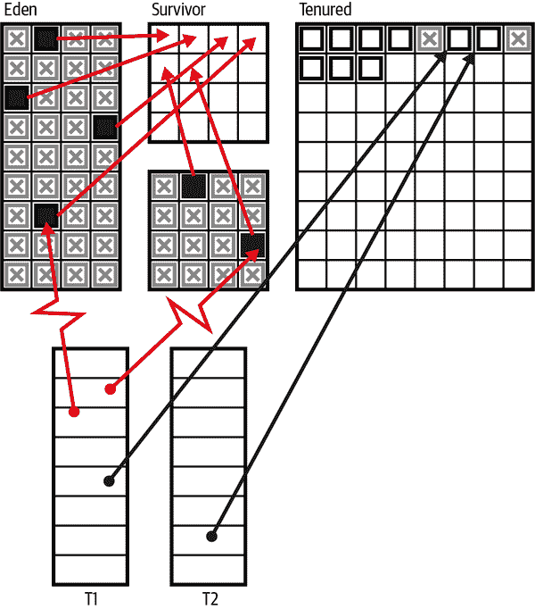
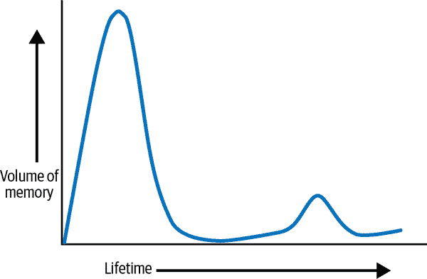
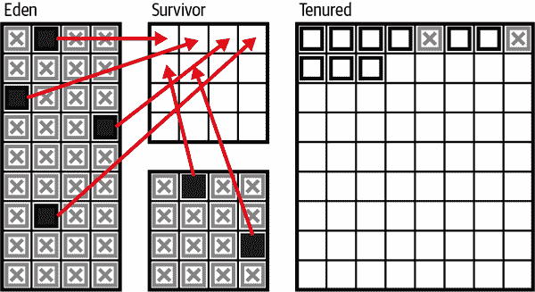
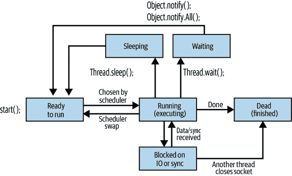
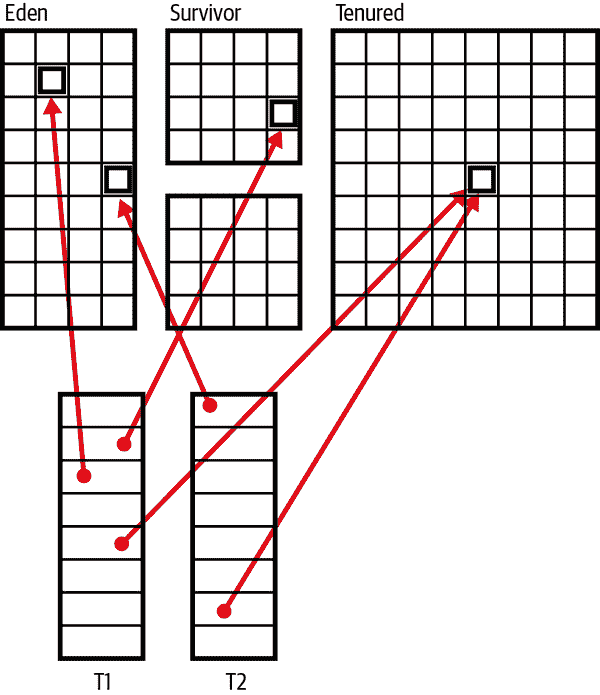

# 第六章。Java 对内存和并发的处理方式

本章是介绍 Java 平台中的并发（多线程）和内存处理的入门。这些主题本质上是相互交织在一起的，因此将它们一起处理是有意义的。我们将涵盖以下内容：

+   Java 内存管理简介

+   基本的标记-清除垃圾收集（GC）算法

+   HotSpot JVM 如何根据对象的生命周期优化 GC

+   Java 的并发原语

+   数据的可见性和可变性

# Java 内存管理的基本概念

在 Java 中，当不再需要对象时，对象所占用的内存会自动释放。这是通过一种称为 *垃圾收集*（或 GC）的过程来完成的。垃圾收集是一种已经存在多年的技术，由诸如 Lisp 等语言率先采用。对于那些习惯于诸如 C 和 C++ 之类的语言，在其中必须调用 `free()` 函数或 `delete` 运算符来回收内存的程序员来说，这需要一些适应。

###### 注意

不需要记住销毁每个创建的对象的事实是使 Java 成为一种愉快的工作语言的特性之一。这也是使用 Java 编写的程序比那些不支持自动垃圾收集的语言编写的程序更不容易出现错误的特性之一。

不同的虚拟机实现以不同的方式处理垃圾收集，并且规范对 GC 的实现没有很严格的限制。在本章的后面，我们将讨论 HotSpot JVM（这是 Oracle 和 OpenJDK Java 实现的基础）。尽管这不是你可能会遇到的唯一的 JVM，但它在服务器端部署中是最常见的，并提供了现代生产 JVM 的参考示例。

## Java 中的内存泄漏

Java 支持垃圾收集的事实大大降低了 *内存泄漏* 的发生率。内存泄漏是指分配了内存但从未释放的情况。乍一看，似乎垃圾收集可以防止所有内存泄漏，因为它回收了所有未使用的对象。

然而，在 Java 中，如果对未使用的对象保留了一个有效的（但未使用的）引用，仍然可能发生内存泄漏。例如，当一个方法运行了很长时间（或永远）时，该方法中的局部变量可能会比实际需要的时间长保留对象引用。以下代码为例：

```java
public static void main(String args[]) {
  int bigArray[] = new int[100000];

  // Do some computations with bigArray and get a result.
  int result = compute(bigArray);

  // We no longer need bigArray. It will get garbage collected when
  // there are no more references to it. Because bigArray is a local
  // variable, it refers to the array until this method returns. But
  // this method doesn't return.
  // If we explicitly sever the reference by assigning it to
  // null then the garbage collector knows it can reclaim the array.
  bigArray = null;

  // Loop forever, handling the user's input
  for(;;) handle_input(result);
}
```

当你使用 `HashMap` 或类似的数据结构将一个对象与另一个对象关联起来时，也可能会发生内存泄漏。即使这两个对象都不再需要，关联仍然存在于映射中，直到映射本身被回收。如果映射的寿命远远长于它所持有的对象，这可能会导致内存泄漏。

## 介绍标记-清除算法

Java GC 通常依赖于被广泛称为*标记-清除*的算法家族。要理解这些算法，回顾一下所有 Java 对象都是在堆中创建的，当对象创建时，一个引用（基本上是指针）存储在 Java 局部变量（或字段）中。局部变量存在于方法的堆栈帧中，如果一个对象从方法中返回，那么当方法退出时，引用将传回调用者的堆栈帧。

由于所有对象都分配在堆中，当堆变满时（或者在细节上取决之前），GC 将会触发。标记-清除的基本思想是*追踪*堆并确定哪些对象仍在使用中。这可以通过检查每个 Java 线程的堆栈帧（以及一些其他引用来源）并跟随任何引用到堆中来完成。定位到的每个对象都会被*标记*为仍然存活，并且随后可以检查它是否具有任何引用类型的字段。如果有，这些引用也可以被跟踪和标记。

当递归跟踪活动完成时，所有剩余的未标记对象都被认为不再需要，并且它们占据的堆空间可以作为垃圾进行*清除*，即，它们使用的内存可以用于进一步的对象分配。如果此分析可以精确执行，那么这种类型的收集器被称为*精确垃圾收集器*，这并不奇怪。在所有实际目的上，所有 Java GC 都可以被认为是精确的，但在其他软件环境中可能并非如此。

在实际的 JVM 中，堆内存很可能会有不同的区域，并且真实的程序将在正常操作中使用它们全部。在图 6-1 中，我们展示了堆的一个可能布局，其中两个线程（T1 和 T2）持有指向堆的引用。

这些不同的区域被称为*伊甸园*、*幸存者*和*老年代*；我们稍后将在本章中了解每一个区域及其彼此之间的关系。为了简单起见，图示展示了 Java 堆的旧形式，其中每个内存区域是一个单一的内存块。现代的收集器实际上并不是这样布置对象的，但首先这样考虑会更容易理解！



###### 图 6-1\. 堆结构

图中还显示，在程序运行时移动应用线程引用的对象将是危险的。

为了避免这种情况，像刚才描述的简单追踪 GC 将在运行时导致*停顿*（STW）。这是因为所有应用程序线程都被停止，然后进行 GC，最后再次启动应用程序线程。运行时通过在达到*安全点*时停止应用程序线程来处理此问题——例如，循环开始或方法调用返回之前。在这些执行点上，运行时知道可以停止应用程序线程而没有问题。

这些暂停有时会让开发人员担心，但对于大多数主流用途来说，Java 运行在一个不断在处理器核心上交换进程的操作系统（可能还有多个虚拟化层）上，因此这种轻微的额外停顿通常不是一个问题。在 HotSpot 情况下，已经做了大量工作来优化 GC 并减少 STW 时间，对于那些对应用程序工作负载重要的情况。我们将在下一节讨论其中的一些优化。

# JVM 如何优化垃圾收集

*弱分代假设*（WGH）是我们在第一章中介绍的关于软件的运行时事实的一个很好的例子。简单来说，对象倾向于具有少数几种可能的寿命期望（称为*代*）。

通常对象只存活了很短的时间（有时称为瞬态对象），然后就变得符合垃圾回收的条件。然而，有一小部分对象存活时间较长，注定成为程序长期状态的一部分（有时称为*工作集*）。这可以在图 6-2 中看到，我们看到内存量（或创建的对象数）根据预期生命周期进行了绘制。



###### 图 6-2\. 弱分代假设

这个事实无法从程序的静态分析中推断出来，然而当我们测量软件的运行时行为时，我们看到这在广泛的工作负载范围内都是正确的。

HotSpot JVM 有一个专门设计用于利用弱分代假设的垃圾收集子系统，在本节中，我们将讨论这些技术如何适用于短寿命对象（这是主要情况）。这个讨论直接适用于 HotSpot，但其他 JVM 通常也采用类似或相关的技术。

在其最简单的形式中，*分代垃圾收集器*是一种注意到**WGH**的收集器。他们认为，通过监视内存的一些额外记录，将会比通过友好对待**WGH**而获得的收益更加有利。在最简单的分代收集器中，通常只有两代——通常被称为年轻代和老年代。

## 疏散

在我们最初的标记-清除方法中，在清理阶段，GC 回收了个别对象以便重用。这在某种程度上是可以接受的，但会导致内存碎片化以及 GC 需要维护一个可用的“空闲列表”内存块。然而，如果 WGH 成立，并且在任何给定的 GC 周期中大多数对象都是死的，那么使用替代方法来回收空间可能是有意义的。

这种方法通过将堆划分为不同的内存空间来实现；新对象在*Eden*空间创建。然后，在每次 GC 运行时，我们仅定位活动对象并将它们移动到不同的空间，这个过程称为*evacuation*。执行这种操作的收集器称为*evacuating collectors*，它们的特性是在收集结束时可以清空整个内存空间，以便重复使用。

图 6-3 展示了一个正在运行的 evacuating collector，实心块表示存活对象，而斜线框表示已分配但已经死亡（且不可达）的对象。



###### 图 6-3\. 疏散收集器

这比朴素的收集方法潜在地更高效，因为不会触及死亡对象。这意味着 GC 时间与活动对象的数量成正比，而不是已分配对象的数量。唯一的缺点是略微增加的簿记成本——我们必须支付复制活动对象的成本，但这几乎总是与通过疏散策略实现的巨大收益相比微不足道。

使用疏散收集器还允许使用每线程分配。这意味着每个应用程序线程可以被分配一个连续的内存块（称为*thread-local allocation buffer*或 TLAB），用于分配新对象时的独占使用。当分配新对象时，只需在分配缓冲区中递增指针，这是一个极其廉价的操作。

如果一个对象在收集开始前刚创建，那么它将没有时间完成其目的并在 GC 周期开始之前死亡。在只有两个代的收集器中，这种短寿命对象将被移动到长寿命区域，几乎立即死亡，并在下一次完全收集之前一直保留在那里。由于这些收集事件较少（通常也更昂贵），这显得相当浪费。

为了缓解这个问题，HotSpot 引入了*survivor space*的概念，用于存放已经经历过前几次年轻对象收集的对象。存活的对象在*tenuring threshold*达到之前会在 survivor spaces 之间被疏散收集器复制，当对象被*promoted*到老年代时，称为*Tenured*或*OldGen*。这解决了短寿命对象堆积在老年代的问题，但也增加了 GC 子系统的复杂性。

## 压缩

另一种收集算法形式称为*compacting collector*。这些收集器的主要特点是，在收集周期结束时，分配的内存（即存活对象）被安排在收集区域内的单一连续区域中。

正常情况下，所有存活对象都已经在内存池（或区域）内“洗牌”到了内存范围的开始位置，现在有一个指针指示可供应用程序线程重新启动后写入对象的空闲空间的开始位置。

压缩收集器将避免内存碎片化，但在消耗 CPU 量方面通常比疏散收集器昂贵得多。这两种算法之间存在设计权衡（其细节超出本书的范围），但这两种技术都在 Java（以及许多其他编程语言的）生产收集器中使用。长期存活对象最终进入的空间通常使用压缩收集器进行清理。

本书不讨论 GC 子系统的详细细节。对于需要关心这些细节的生产应用程序，应当查阅专业材料，比如[*优化 Java*](http://shop.oreilly.com/product/0636920121718.do)（O'Reilly）。

# HotSpot 堆

HotSpot JVM 是一个相对复杂的代码片段，由解释器和即时编译器组成，以及一个用户空间内存管理子系统。它由 C、C++以及相当大量的平台特定的汇编代码组成。

###### 注意

HotSpot 管理 JVM 堆本身，基本上完全在用户空间中进行，并且不需要执行系统调用来分配或释放内存。对象最初创建的区域通常称为 Eden（或者 Nursery），大多数生产 JVM 都会在收集 Eden 时使用疏散策略。

现在，让我们总结一下 HotSpot 堆的描述，并回顾其基本特性：

+   Java 堆是 JVM 启动时预留的连续内存块。

+   只有一部分堆最初分配给各种内存池。

+   应用程序运行时，内存池会根据需要调整大小。

+   这些调整由 GC 子系统执行。

+   对象由应用程序线程在 Eden 中创建，并在非确定性 GC 周期中删除。

+   在必要时（即内存紧张时），GC 周期会运行。

+   堆分为两代，年轻代和老年代。

+   年轻代由 Eden 和幸存者空间组成，而老年代只是一个内存空间。

+   经过几个 GC 周期后，对象会晋升到老年代。

+   只收集年轻代的集合通常非常廉价（就所需计算而言）。

+   HotSpot 使用一种高级形式的标记-清除，并准备额外的簿记以提高 GC 性能。

在讨论垃圾收集器时，开发人员应了解另一个重要的术语区分：

并行收集器

一个垃圾收集器可以使用多个线程执行收集。

并发收集器

一个垃圾收集器可以在应用程序线程运行时同时运行。

到目前为止，我们描述的收集算法隐含地都是并行的，但不是并发的收集器。

###### 注意

在现代 GC 方法中，越来越多地采用部分并发算法的趋势。这些类型的算法比 STW 算法更为复杂且计算成本更高，并涉及权衡。然而，今天的应用程序通常愿意为减少应用程序暂停而进行一些额外的计算。

在传统的 Java 版本（版本 8 及更早版本）中，堆具有简单的结构：每个内存池（Eden、幸存者空间和 Tenured）都是连续的内存块。这是我们在图表中展示的结构，因为它更容易让初学者可视化。这些旧版本中老年代的默认收集器称为*并行*。然而，在现代版本的 HotSpot 中，一个名为*垃圾优先*（G1）的新型部分并发收集算法已成为默认。

## G1

G1 是*基于区域的收集器*的一个示例，并且与旧式堆的布局不同。一个区域是一个内存区域（通常大小为 1M，但较大堆可能有 2、4、8、16 或 32M 的区域），其中所有对象都属于同一个内存池。然而，在区域收集器中，组成池的不同区域不一定位于内存中的相邻位置。这与 Java 8 堆不同，在 Java 8 堆中，每个池都是连续的，尽管在这两种情况下整个堆仍然是连续的。

###### 警告

G1 在每个 Java 版本中使用不同版本的算法，各版本在性能和其他行为方面有一些重要的差异。从 Java 8 升级到更高版本并采用 G1 时，进行全面性能重新测试非常重要。您可能会发现，切换到 Java 11 或 17 时，您需要更少的资源（甚至可以节省金钱）。

G1 的注意点在于它主要集中在大部分是垃圾的区域上，因为这些区域有最佳的自由内存回收。它是一个撤离收集器，在撤离单个区域时进行*增量整理*。

最初，G1 收集器的目标是取代之前的 CMS 作为低暂停时间收集器，并允许用户根据 GC 时的暂停时间和频率指定*暂停目标*。

JVM 提供了一个命令行开关来控制收集器的暂停目标：`-XX:MaxGCPauseMillis=200`。这意味着默认的暂停时间目标是 200 毫秒，但您可以根据需要更改此值。

当然，收集器能推动的极限是有限的。Java GC 受到新分配内存速度的驱动，对于许多 Java 应用程序来说，这是非常不可预测的。

如前所述，G1 最初是为了成为一种低暂停的替代收集器。然而，其行为的整体特性使得它实际上演变成了一种更通用的收集器（这就是为什么它现在成为默认收集器的原因）。

需要注意的是，开发一个适用于通用使用的新生产级收集器并非一蹴而就的过程。在接下来的章节中，让我们继续讨论 HotSpot 提供的替代收集器（包括 Java 8 的并行收集器）。

详细的全面处理超出了本书的范围，但了解备选收集器的存在是值得的。对于非 HotSpot 用户，您应该查阅您的 JVM 文档，了解可能适合您的选项。

## 并行老年代（ParallelOld）

默认情况下，在 Java 8 中，老年代的收集器是一个并行（但不是并发）的标记-清除收集器。乍看之下，它似乎与年轻代使用的收集器相似。然而，它在一个非常重要的方面有所不同：它*不*是一个疏散式收集器。相反，老年代在进行收集时进行压缩。这是重要的，以防止内存空间随着时间的推移变得碎片化。

`ParallelOld` 收集器非常高效，但有两个特性使其在现代应用中不太理想。它是：

+   完全 STW

+   堆大小的暂停时间线性增长

这意味着一旦 GC 开始，就无法提前中止，并且必须允许循环完成。随着堆大小的增加，这使得`ParallelOld` 收集器比 G1 收集器不那么吸引人，后者可以在管理可分配速率的情况下通常保持恒定的暂停时间。

在现代部署中，特别是针对 Java 11+，G1 通常在以前使用`ParallelOld`的大多数应用程序中表现更好。`ParallelOld` 收集器截至 Java 17 仍然可用，供那些（希望很少）仍然需要的应用程序使用，但平台的方向显而易见——尽可能地使用 G1。

## 串行

串行和 SerialOld 收集器与并行收集器的运行方式类似，但有一个重要区别：它们仅使用单个 CPU 核心执行完全 STW 的 GC。

在现代多核系统上，使用这些收集器没有任何好处，因此不应使用它们，因为它们只是并行收集器的低效形式。然而，您仍可能在容器中运行 Java 应用程序时遇到这些收集器。有关容器化 Java 的完整讨论超出了本书的范围。但是，如果您的应用程序在容器中运行的环境过小（内存不足或仅有单个 CPU），那么 JVM 将自动选择串行收集器。

因此，我们不建议在单核容器中运行 Java，因为串行收集器在几乎所有实际负载场景下的表现明显比 G1 差。

## Shenandoah

Shenandoah 是 Red Hat 开发的一种新的 GC 算法，可以有效地处理某些情况下 G1 和其他算法表现不佳的情况。

Shenandoah 的目标是降低暂停时间，特别是在大堆上，并尽可能地保证暂停时间不会超过 1 毫秒，无论堆的大小如何。

像 G1 一样，Shenandoah 是一种执行并发标记的疏散区域收集器。区域的疏散导致增量压缩，但关键的区别在于，在 G1 中，疏散发生在 STW 阶段，而在 Shenandoah 中，疏散是与应用线程并发进行的。

然而，没有免费的午餐，Shenandoah 的用户可能会经历高达 15% 的额外开销（即，应用吞吐量的减少），但确切的数字将取决于工作负载的细节。例如，在一些特定的基准测试中，您可以观察到显著的开销，接近预期范围的上限。

可以通过以下命令行开关激活 Shenandoah：

```java
-XX:+UseShenandoahGC
```

需要注意的一个重要点是，在撰写本文时，Shenandoah 还不是一个分代收集器，尽管正在进行将分代添加到实现中的工作。

## ZGC

除了 Shenandoah 外，Oracle 还创建了一种新的超低暂停收集器，称为 ZGC。它的设计旨在吸引与 Shenandoah 类似的工作负载，并且在意图、效果和开销上基本相似。ZGC 是一种单代、区域化、NUMA-aware、压缩收集器。然而，ZGC 的实现与 Shenandoah 大不相同。

可以通过以下命令行开关激活 ZGC：

```java
-XX:+UseZGC
```

ZGC 只需一个停止-世界暂停来执行根扫描，这意味着 GC 暂停时间不会随着堆的大小或活动对象的数量增加而增加。由于其预期的适用领域（大堆的超低暂停），ZGC 最常由 Oracle 客户在 Oracle 支持的 Java 构建上使用。

# 终结

为了完整起见，开发人员应该知道一种称为 *终结* 的旧的资源管理技术。然而，这种技术已经 *极度* 被弃用，绝大多数 Java 开发人员在任何情况下 *不应该* 直接使用它。

###### 注意

终结已经被弃用，并将在未来的发布中删除。目前机制仍然默认启用，但可以使用开关禁用。在未来的发布中，它将默认禁用，然后最终删除。

最终化机制旨在自动释放不再需要的资源。垃圾收集器可以自动释放对象使用的内存资源，但对象可能持有其他类型的资源，例如打开的文件和网络连接。垃圾收集器无法释放这些额外的资源，因此最终化机制旨在允许开发人员执行清理任务，如关闭文件、终止网络连接、删除临时文件等。

最终化机制的工作方式如下：如果一个对象有一个`finalize()`方法（通常称为*终结器*），那么在对象变得未使用（或不可达）但在垃圾收集器回收对象分配的空间之前，将调用该方法。终结器用于执行对象的资源清理工作。

最终化的核心问题在于 Java 不保证何时进行垃圾收集或对象收集的顺序。因此，平台无法保证何时（甚至是否）调用终结器或调用终结器的顺序。

## 最终化细节

最终化机制是试图在其他语言和环境中实现类似概念的一种尝试。特别是，C++有一种称为 RAII（资源获取即初始化）的模式，以类似的方式提供自动资源管理。在该模式中，程序员提供一个析构函数（在 Java 中称为`finalize()`），用于在对象销毁时执行清理和释放资源。

这个基本用例非常简单：当对象被创建时，它获取某些资源的所有权，并且对象对该资源的所有权与对象的生命周期相关联。当对象销毁时，资源的所有权会自动释放，因为平台会调用析构函数而无需程序员介入。

尽管最终化听起来与此机制表面上相似，但实际上它们是根本不同的。事实上，最终化语言特性存在致命缺陷，这是由于 Java 与 C++的内存管理方案之间的差异。

在 C++的情况下，内存是手动处理的，对象的生命周期由程序员控制。这意味着在对象删除后可以立即调用析构函数（平台保证这一点），因此资源的获取和释放直接与对象的生命周期相关联。

另一方面，Java 的内存管理子系统是一个根据需要运行的垃圾收集器，响应内存不足以分配时运行。因此，它以可变（非确定性）的间隔运行，因此`finalize()`只有在对象被收集时才会运行，而这将在未知时间发生。

如果使用`finalize()`机制自动释放资源（例如文件句柄），则不能保证这些资源何时（如果有的话）会实际可用。这导致最终化机制在其所声明的自动资源管理目的上基本不适用——我们无法保证最终化会在资源不足之前足够快地发生。作为保护稀缺资源（例如文件句柄）的自动清理机制，最终化在设计上存在缺陷。

最终化只有极少数合法用例，只有少数 Java 开发人员会遇到它们。如果有任何疑问，请不要使用最终化——通常正确的替代方法是使用`try`-with-resources。有关`try`-with-resources 的更多详细信息，请参见第十章。

# Java 对并发的支持

*线程*的概念是执行的轻量级单位——比进程小，但仍能执行任意 Java 代码。通常的实现方式是每个线程作为操作系统的完全成熟执行单元，但属于一个进程，该进程的地址空间与该进程组成的其他线程共享。这意味着每个线程可以独立调度，具有自己的堆栈和程序计数器，但与同一进程中的其他线程共享内存和对象。

Java 平台从第一个版本开始就支持多线程编程。该平台为开发人员提供了创建新执行线程的能力。

要理解这一点，首先我们必须详细考虑 Java 程序启动时发生的情况以及原始应用程序线程（通常称为*主*线程）的出现：

1.  程序员执行`java Main`（也可能是其他启动方式）。

1.  这使得 Java 虚拟机，即所有 Java 程序运行的上下文，启动起来。

1.  JVM 检查其参数，并看到程序员请求从`Main.class`的入口点（`main()`方法）开始执行。

1.  假设`Main`通过类加载检查，为程序的执行启动了一个专用线程（主线程）。

1.  JVM 字节码解释器在主线程上启动。

1.  主线程的解释器读取`Main::main()`的字节码，执行开始，逐个字节码执行。

每个 Java 程序都是这样开始的，但这也意味着：

+   每个 Java 程序都作为管理模型的一部分开始，每个线程都有一个解释器。

+   每个 Java 程序始终作为多线程操作系统进程的一部分运行。

+   JVM 具有控制 Java 应用程序线程的能力。

由此引发的是，在 Java 代码中创建新的执行线程通常很简单：

```java
Thread t = new Thread(() -> {System.out.println("Hello Thread");});
t.start();
```

这段小代码创建并启动一个新线程，该线程执行 lambda 表达式的主体，然后执行。从技术上讲，lambda 在传递给`Thread`构造函数之前被转换为`Runnable`接口的实例。

线程机制允许新线程与原始应用程序线程以及 JVM 本身为各种目的启动的线程并发执行。

对于 Java 平台的主流实现，每当我们调用`Thread::start()`时，此调用被委托给操作系统，并创建一个新的 OS 线程。这个新的 OS 线程`exec()`了 JVM 字节码解释器的一个新副本。解释器从`run()`方法（或等效地从 lambda 的主体）开始执行。

这意味着应用程序线程的 CPU 访问由操作系统的*调度程序*控制——这是操作系统的内置部分，负责管理处理器时间片段（并且不允许应用程序线程超出其分配的时间）。

在 Java 的较新版本中，出现了越来越多的*运行时管理并发*的趋势。这是指对于许多目的来说，显式管理线程并不理想。相反，运行时应该提供“点火并忘记”的能力，程序指定需要做什么，但如何完成这些工作的底层细节留给运行时处理。这一观点可以在`java.util.concurrent`中的并发工具包中看到，我们在第八章中简要讨论。

在本章的其余部分，我们将介绍 Java 平台提供的低级并发机制，每个 Java 开发人员都应该了解。强烈建议读者在进行任何重要的并发编程之前，理解基于低级`Thread`和运行时管理方法。

## 线程生命周期

让我们从查看应用程序线程的生命周期开始。每个操作系统都有一个线程视图，其细节可能不同（但在大多数情况下在高层次上是大致相似的）。Java 努力将这些细节抽象化，并有一个称为`Thread.State`的枚举，它包装了操作系统对线程状态的视图。`Thread.State`的值提供了线程生命周期的概述：

`NEW`

线程已创建，但尚未调用其`start()`方法。所有线程都从这个状态开始。

`RUNNABLE`

当操作系统安排它时，线程正在运行或可运行。

`BLOCKED`

线程没有运行，因为它正在等待获取锁定，以便可以进入`synchronized`方法或块。在本节的后面部分，我们将进一步了解`synchronized`方法和块。

`WAITING`

线程没有运行，因为它已调用`Object.wait()`或`Thread.join()`。

`TIMED_WAITING`

线程不在运行，因为它已调用`Thread.sleep()`或已调用`Object.wait()`或`Thread.join()`并带有超时值。

`TERMINATED`

线程已完成执行。它的`run()`方法已正常退出或通过抛出异常退出。

这些状态代表了一个线程的视图，这在至少主流操作系统中是通用的，导致一个像图 6-4 那样的视图。



###### 图 6-4\. 线程生命周期

线程也可以使用`Thread.sleep()`方法使其休眠。这需要一个以毫秒为单位的参数，表示线程希望休眠的时间，如下所示：

```java
try {
    Thread.sleep(2000);
} catch (InterruptedException e) {
    e.printStackTrace();
}
```

###### 注

`sleep`方法的参数是对操作系统的请求，而不是一个要求。例如，您的程序可能因负载和其他特定于运行时环境的因素而睡眠时间超过请求的时间。

我们将在本章稍后讨论`Thread`的其他方法，但首先我们需要涵盖一些重要的理论，这些理论涉及线程如何访问内存，并且对理解为何多线程编程困难且可能给开发者带来许多问题至关重要。

## 可见性和可变性

在主流的 Java 实现中，一个进程中所有 Java 应用程序线程都有自己的调用堆栈（和本地变量），但共享一个单一的堆。这使得在线程之间共享对象非常容易，因为只需从一个线程传递一个引用到另一个线程即可。这在图 6-5 中有所说明。

这导致了 Java 的一个通用设计原则——对象*默认是可见的*。如果我有一个对象的引用，我可以复制它并将其交给另一个线程，没有任何限制。Java 的引用实质上是指向堆中某个位置的类型化指针——线程共享同一个堆，因此默认可见是一种自然的模型。

除了默认可见性，Java 还有另一个对完全理解并发性非常重要的属性，即对象是*可变的*：对象实例字段的内容通常可以更改。我们可以通过使用`final`关键字使个别变量或引用常量化，但这并不适用于对象的内容。

正如我们将在本章的其余部分看到的那样，这两个属性的结合——跨线程的可见性和对象的可变性——在尝试推理并发 Java 程序时引发了许多复杂性。



###### 图 6-5\. 线程之间共享的内存

### 并发安全性

如果我们要编写正确的多线程代码，那么我们希望我们的程序满足某个重要的属性。

在第五章中，我们定义了一个安全的面向对象程序，即通过调用其可访问方法将对象从合法状态移动到合法状态。这个定义对于单线程代码很有效。然而，当我们尝试将其扩展到并发程序时，会遇到一个特殊的困难。

###### 提示

*安全的多线程程序* 是指任何对象不论调用什么方法，以及应用程序线程由操作系统按何种顺序调度，都不会被其他对象看到处于非法或不一致状态的程序。

对于大多数主流情况，操作系统将根据负载和系统中其他运行情况，在特定处理器核心上安排线程运行。如果负载很高，可能还有其他需要运行的进程。

操作系统如果需要的话，会强制从 CPU 核心上删除 Java 线程。该线程会立即暂停，无论它当前在做什么，包括正在执行方法的中间过程。然而，正如我们在第五章中讨论的那样，一个方法在操作对象时可能会将其临时置于非法状态，只要在方法退出之前纠正即可。

这意味着，如果一个线程在完成长时间方法之前被换出，即使程序遵循安全规则，也可能会使对象处于不一致状态。另一种说法是，即使正确建模了单线程情况下的数据类型，也仍需保护免受并发影响。为此添加额外保护层的代码称为*并发安全* 或（更非正式地）线程安全。

在下一节中，我们将讨论实现这种安全性的主要手段，而在本章末尾，我们将介绍一些在某些情况下也可能有用的其他机制。

## 排除和保护状态

任何修改或读取可能导致状态不一致的代码都必须受到保护。为此，Java 平台只提供了一种机制：*排除*。

考虑一个方法，其中包含一系列操作，如果中途被中断，可能会使对象处于不一致或非法状态。如果这种非法状态对其他对象可见，则可能导致代码执行错误。

例如，考虑一个 ATM 或其他发放现金的机器：

```java
public class Account {
    private double balance = 0.0; // Must be >= 0
    // Assume the existence of other field (e.g., name) and methods
    // such as deposit(), checkBalance(), and dispenseNotes()

    public Account(double openingBal) {
        balance = openingBal;
    }

    public boolean withdraw(double amount) {
        if (balance >= amount) {
            try {
                Thread.sleep(2000); // Simulate risk checks
            } catch (InterruptedException e) {
                return false;
            }
            balance = balance - amount;
            dispenseNotes(amount);
            return true;
        }
        return false;
    }
}
```

`withdraw()` 内发生的操作序列可能会使对象处于不一致状态。特别是在检查余额后，第二个线程可能在第一个线程在模拟风险检查时休眠时介入，并且账户可能会透支，违反了`balance >= 0`的约束。

这是一个系统的例子，对象上的操作是单线程安全的（因为如果从单个线程调用，则对象不会达到非法状态（`balance < 0`）），但不是并发安全的。

为了让开发人员使此类代码具备并发安全性，Java 提供了`synchronized`关键字。此关键字可以应用于块或方法，当使用它时，平台将其用于限制块或方法内部代码的访问。

###### 注意

因为`synchronized`包围了代码，许多开发人员得出结论，Java 中的并发性是关于代码的。一些文本甚至将位于同步块或方法内部的代码称为*临界区*，并认为这是并发性的关键方面。实际情况并非如此；相反，我们必须防范的是数据的不一致性，正如我们将看到的那样。

Java 平台为其创建的每个对象跟踪一个特殊的标记，称为*监视器*。这些监视器（也称为*锁*）被`synchronized`用来指示以下代码可能会暂时使对象不一致。`synchronized`块或方法的事件序列是：

1.  线程需要修改对象，并可能在中间步骤中使其暂时不一致

1.  线程获取监视器，表示它需要临时独占对象的访问权限

1.  线程修改对象，在完成时将其保留在一致的、合法状态

1.  线程释放监视器

如果另一个线程在修改对象时尝试获取锁定，则获取锁定的尝试将被阻塞，直到持有线程释放锁定。

请注意，除非您的程序创建了多个共享数据的线程，否则无需使用`synchronized`语句来保护数据结构。如果只有一个线程访问数据结构，就无需用`synchronized`保护它。

一个关键的要点是——获取监视器并不会阻止访问对象。它只是防止其他线程获取锁。正确的并发安全代码要求开发人员确保所有可能修改或读取潜在不一致状态的访问都在操作或读取该状态之前获取对象监视器。

换句话说，如果一个`synchronized`方法正在操作一个对象并将其置于非法状态，而另一个（非同步的）方法读取该对象，则可能看到不一致的状态。

###### 注意

同步是一种保护状态的协作机制，因此非常脆弱。一个错误（例如在所需的方法上漏掉一个`synchronized`关键字）可能会对系统整体的安全性产生灾难性的后果。

使用关键字`synchronized`作为“需要临时独占访问”的关键字的原因是，除了获取监视器之外，JVM 还会在进入代码块时重新从主内存中读取对象的当前状态。同样，在退出`synchronized`块或方法时，JVM 会将对象的任何修改状态刷新回主内存。

没有同步，系统中不同的 CPU 核心可能看到内存的不同视图，内存不一致性可能会损坏运行程序的状态，就像我们在 ATM 示例中看到的那样。

这最简单的例子称为*丢失更新*，如下面的代码所示：

```java
public class Counter {
    private int i = 0;

    public int increment() {
        return i = i + 1;
    }
    public int getCounter() { return i; }
}
```

可以通过一个简单的控制程序来驱动这一点：

```java
    Counter c = new Counter();
    int REPEAT = 10_000_000;
    Runnable r = () -> {
        for (int i = 0; i < REPEAT; i++) {
            c.increment();
        }
    };
    Thread t1 = new Thread(r);
    Thread t2 = new Thread(r);

    t1.start();
    t2.start();
    t1.join();
    t2.join();

    int anomaly = (2 * REPEAT) - c.getCounter();
    double perc = ((double) anomaly * 100) / (2 * REPEAT);
    System.out.println("Lost updates: "+ anomaly +" ; % = " + perc);
```

如果这个并发程序是正确的，那么异常值（丢失更新的数量）应该完全为零。但事实并非如此，因此我们可以得出结论，非同步访问基本上是不安全的。

相比之下，我们还看到将关键字`synchronized`添加到增量方法中足以将丢失更新异常减少到零—即使在多个线程存在的情况下，也能使方法正确。

## `volatile`

Java 提供了另一个关键字来处理对数据的并发访问。这就是`volatile`关键字，它指示在应用程序代码使用字段或变量之前，必须重新从主内存中读取其值。同样，在修改了`volatile`值后，一旦写入变量完成，它必须立即写回主内存。

`volatile`关键字的一个常见用法是“运行直到关闭”模式。这在多线程编程中被使用，其中外部用户或系统需要向处理线程发出信号，告知它应该完成当前正在进行的工作，然后优雅地关闭。有时这被称为“优雅完成”模式。让我们看一个典型的例子，假设这段代码用于实现`Runnable`的类中的处理线程：

```java
private volatile boolean shutdown = false;

public void shutdown() {
    shutdown = true;
}

public void run() {
    while (!shutdown) {
        // ... process another task
    }
}
```

只要另一个线程没有调用`shutdown()`方法，处理线程就会继续顺序处理任务（这通常与`BlockingQueue`结合非常有用以传递工作）。一旦另一个线程调用了`shutdown()`，处理线程立即看到`shutdown`标志改为`true`。这不会影响正在运行的作业，但一旦任务完成，处理线程将不会接受另一个任务，而是会优雅地关闭。

然而，尽管 `volatile` 关键字很有用，但它并不能完全保护状态——正如我们在 `Counter` 中使用它来标记字段 `volatile` 一样。我们可能天真地假设这会保护 `Counter` 中的代码。然而，实际上并非如此。为了验证这一点，修改之前的 `Counter` 示例，并在字段 `i` 中添加 `volatile` 关键字，然后重新运行示例。观察到的非零异常值（因此丢失更新问题的存在）告诉我们，仅凭 `volatile` 关键字并不能使代码线程安全。

## Thread 的有用方法

`Thread` 类具有许多方法，可在创建新应用程序线程时为您提供便利。这不是一个详尽的列表——`Thread` 上还有许多其他方法，但这是一些常见方法的描述。

### getId()

此方法返回线程的 ID 号，作为 `long` 类型。此 ID 在线程生命周期内保持不变，并且在此 JVM 实例中保证是唯一的。

### getPriority() 和 setPriority()

这些方法用于控制线程的优先级。调度程序决定如何处理线程优先级；例如，一种策略可能是在高优先级线程等待时不运行低优先级线程。在大多数情况下，无法影响调度程序如何解释优先级。线程优先级表示为一个介于 1 和 10 之间的整数，10 表示最高优先级。

### setName() 和 getName()

这些方法允许开发者为每个线程设置或检索名称。命名线程是一种良好的实践，特别是在像 JDK Mission Control 这样的工具中，它可以极大地简化调试（我们将在第十三章中简要讨论）。

### getState()

返回一个 `Thread.State` 对象，指示此线程处于哪种状态，其值如“线程生命周期”中定义的那样。

### isAlive()

此方法用于测试线程是否仍然存活。

### start()

此方法用于创建一个新的应用程序线程，并安排其运行，其中 `run()` 方法是执行的入口点。当线程在其 `run()` 方法中达到结尾或在该方法中执行 `return` 语句时，线程会正常终止。

### interrupt()

如果线程在 `sleep()`、`wait()` 或 `join()` 调用中被阻塞，则在表示该线程的 `Thread` 对象上调用 `interrupt()` 将导致线程收到 `InterruptedException`（并唤醒）。

如果线程涉及可中断 I/O，则 I/O 将被终止，并且线程将收到 `ClosedByInterruptException`。即使线程未参与可以中断的任何活动，线程的中断状态也将设置为 `true`。

### join()

当前线程等待，直到与 `Thread` 对象对应的线程已经终止。可以将其视为一条指令，要求在另一个线程完成之前不要继续执行。

### setDaemon()

*用户线程*是一种线程，如果它仍然活动，将阻止进程退出 — 这是线程的默认行为。有时，程序员希望线程不阻止退出的发生 — 这些称为*守护线程*。线程作为守护线程或用户线程的状态可以通过`setDaemon()`方法来控制，并可以使用`isDaemon()`来检查。

### setUncaughtExceptionHandler()

当线程通过抛出异常（即程序没有捕获的异常）退出时，默认行为是打印线程的名称、异常类型、异常消息和堆栈跟踪。如果这不足够，您可以为线程安装自定义的未捕获异常处理程序。例如：

```java
// This thread just throws an exception
Thread handledThread =
  new Thread(() -> { throw new UnsupportedOperationException(); });

// Giving threads a name helps with debugging
handledThread.setName("My Broken Thread");

// Here's a handler for the error.
handledThread.setUncaughtExceptionHandler((t, e) -> {
    System.err.printf("Exception in thread %d '%s':" +
        "%s at line %d of %s%n",
        t.getId(),    // Thread id
        t.getName(),  // Thread name
        e.toString(), // Exception name and message
        e.getStackTrace()[0].getLineNumber(),
        e.getStackTrace()[0].getFileName()); });
handledThread.start();
```

在某些情况下，这可能很有用；例如，如果一个线程正在监督一组其他工作线程，那么这种模式可以用来重新启动任何死掉的线程。

还有`setDefaultUncaughtExceptionHandler()`，一个`static`方法，设置一个备用处理程序来捕获任何线程的未捕获异常。

## 线程的弃用方法

除了`Thread`的有用方法外，还有一些危险的方法不应使用。这些方法是原始 Java 线程 API 的一部分，但很快就被发现不适合开发者使用。不幸的是，由于 Java 的向后兼容性要求，无法将它们从 API 中移除。开发者需要意识到它们，并在*所有*情况下都避免使用。

### stop()

`Thread.stop()` 几乎不可能正确使用，因为`stop()`会立即终止线程，而不给它恢复对象到合法状态的机会。这与并发安全等原则直接相反，因此永远不应使用。

### suspend()、resume()和 countStackFrames()

当`suspend()`机制挂起时，不会释放它所持有的任何监视器，因此任何试图访问这些监视器的其他线程都将导致死锁。在实践中，这种机制在这些死锁和`resume()`之间产生竞态条件，使得这组方法无法使用。方法`countStackFrames()`仅在对挂起线程调用时才起作用，因此也被此限制禁用。

### destroy()

此方法从未被实现 — 如果实现了，它将会遇到与`suspend()`相同的竞态条件问题。

所有这些已弃用的方法都应该被始终避免使用。已开发出一组安全替代模式，这些模式实现了与前述方法相同的预期目标。其中一个良好的示例是我们已经见过的运行至关闭模式。

# 多线程处理

要有效地处理多线程代码，您需要掌握关于监视器和锁的基本事实。这份清单包含了您应该了解的主要事实：

+   同步是保护对象状态和内存，而不是代码。

+   同步是线程之间的一种合作机制。一个 bug 可能会破坏这种合作模型，并产生深远的后果。

+   获取监视器只会防止其他线程获取监视器 —— 它并不会保护对象本身。

+   非同步方法在锁定对象的监视器时可能会看到（并修改）不一致的状态。

+   锁定 `Object[]` 不会锁定各个对象。

+   基本类型是不可变的，因此它们不能（也不需要）被锁定。

+   在接口方法声明中不能出现 `synchronized`。

+   内部类只是语法糖，因此对内部类的锁定对外部类没有影响（反之亦然）。

+   Java 的锁是 *可重入* 的。这意味着如果持有监视器的线程遇到同一监视器的同步块，它可以进入该块。¹

我们还看到线程可以被要求睡眠一段时间。同样有用的是无限期地睡眠，直到满足条件。在 Java 中，这通过 `Object` 上存在的 `wait()` 和 `notify()` 方法来处理。

就像每个 Java 对象都有一个关联的锁一样，每个对象都维护着一个等待线程的列表。当线程调用对象的 `wait()` 方法时，线程持有的任何锁都会被临时释放，并且该线程会被添加到该对象的等待线程列表中，并停止运行。当另一个线程调用相同对象的 `notifyAll()` 方法时，对象会唤醒等待的线程，并允许它们继续运行。

例如，让我们看一个简化版本的队列，它对多线程使用是安全的：

```java
/*
 * One thread calls push() to put an object on the queue.
 * Another calls pop() to get an object off the queue. If there is no
 * data, pop() waits until there is some, using wait()/notify().
 */
public class WaitingQueue<E> {
    LinkedList<E> q = new LinkedList<E>(); // storage
    public synchronized void push(E o) {
        q.add(o);         // Append the object to the end of the list
        this.notifyAll(); // Tell waiting threads that data is ready
    }
    public synchronized E pop() {
        while(q.size() == 0) {
            try { this.wait(); }
            catch (InterruptedException ignore) {}
        }
        return q.remove();
    }
}
```

如果队列为空（导致 `pop()` 失败），这个类会在 `WaitingQueue` 的实例上使用 `wait()`。等待的线程会暂时释放其监视器，允许另一个线程来获取它 —— 一个可能会在队列上 `push()` 新内容的线程。当原始线程再次被唤醒时，它会从最初等待的位置重新开始运行，并重新获取它的监视器。

###### 注意

`wait()` 和 `notify()` 必须在 `synchronized` 方法或块中使用，因为它们需要临时放弃锁才能正常工作。

一般情况下，大多数开发者不应该像本例中这样自己编写类——而是应该使用 Java 平台为你提供的库和组件。

# 总结

在本章中，我们讨论了 Java 对内存和并发的视图，以及这些主题如何密切相关。

Java 的垃圾回收是简化开发的重要方面之一，因为它消除了程序员手动管理内存的需要。我们已经看到 Java 提供了先进的 GC 能力，以及现代版本默认使用部分并发的 G1 收集器。

此外，随着处理器开发出越来越多的核心，我们将需要使用并发编程技术来有效地利用这些核心。换句话说，并发性是未来高性能应用的关键。

Java 的线程模型基于三个基本概念：

共享的、默认可见的可变状态

对象可以在进程中的不同线程之间轻松共享，并且任何持有它们引用的线程都可以对它们进行改变（“突变”）。

抢占式线程调度

操作系统线程调度程序可以随时在核心上切换线程。

对象状态只能由锁来保护

锁可能难以正确使用，状态在意想不到的地方（如读操作）也很容易受到影响。

综上所述，Java 在并发处理方面的这三个方面解释了为什么多线程编程会给开发者带来这么多头痛。

¹ 除了 Java 之外，不是所有的锁实现都具有这种属性。
