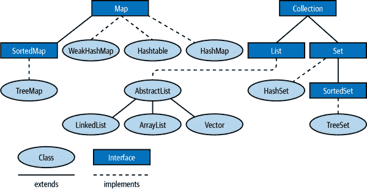

# 第八章：使用 Java 集合

本章介绍了 Java 对基本数据结构的解释，即 Java 集合。这些抽象是许多编程类型的核心，并构成任何程序员基本工具包的重要组成部分。因此，这是整本书中最重要的章节之一，提供了几乎所有 Java 程序员都必不可少的工具包。

在本章中，我们将介绍基本接口和类型层次结构，展示如何使用它们，并讨论它们整体设计的各个方面。我们将涵盖处理集合的“经典”方法以及较新方法（使用 Java 8 中引入的 Streams API 和 lambda 表达式功能）。

# 引入集合 API

Java 集合是一组描述最常见数据结构形式的通用接口。Java 附带了每个经典数据结构的几种实现，因为这些类型被表示为接口，开发团队非常可能为自己的项目开发出专门的接口实现。

Java 集合定义了两种基本类型的数据结构。`Collection` 是对象的集合，而 `Map` 是对象之间的映射或关联集合。Java 集合的基本布局如图 Figure 8-1 所示。

在这个基本描述中，`Set` 是一种没有重复元素的 `Collection` 类型，而 `List` 是元素有序（但可以包含重复元素）的 `Collection`。



###### 图 8-1。集合类和继承

`SortedSet` 和 `SortedMap` 是特殊的集合和映射，它们维护其元素以排序顺序排列。

`Collection`、`Set`、`List`、`Map`、`SortedSet` 和 `SortedMap` 都是接口，但 `java.util` 包还定义了各种具体实现，如基于数组和链表的列表，以及基于哈希表或二叉树的映射和集合。其他重要的接口包括 `Iterator` 和 `Iterable`，它们允许您遍历集合中的对象，正如我们将在稍后看到的那样。

## Collection 接口

`Collection<E>` 是一个参数化的接口，表示类型为 `E` 的对象的广义分组。我们可以创建任何类型的引用类型的集合。

###### 注意

要正确地与集合的期望一起工作，您必须在类上定义 `hashCode()` 和 `equals()` 方法时小心，正如 Chapter 5 中所讨论的那样。

定义了向组中添加和删除对象的方法，测试对象是否属于组的方法以及迭代组中所有元素的方法。额外的方法将组的元素作为数组返回，并返回集合的大小。

###### 注意

`Collection`中的分组可以允许或不允许重复元素，并且可以或不可以对元素进行排序。

Java 集合框架提供`Collection`，因为它定义了所有常见数据结构形式共享的特性。JDK 提供`Set`、`List`和`Queue`作为`Collection`的子接口。

以下代码展示了您可以对`Collection`对象执行的操作：

```java
// Create some collections to work with.
Collection<String> c = new HashSet<>();  // An empty set

// We'll see these utility methods later. Be aware that there are
// some subtleties to watch out for when using them
Collection<String> d = Arrays.asList("one", "two");
Collection<String> e = Collections.singleton("three");

// Add elements to a collection. These methods return true
// if the collection changes, which is useful with Sets that
// don't allow duplicates.
c.add("zero");           // Add a single element
c.addAll(d);             // Add all of the elements in d

// Copy a collection: most implementations have a copy constructor
Collection<String> copy = new ArrayList<String>(c);

// Remove elements from a collection.
// All but clear return true if the collection changes.
c.remove("zero");        // Remove a single element
c.removeAll(e);          // Remove a collection of elements
c.retainAll(d);          // Remove all elements that are not in d
c.clear();               // Remove all elements from the collection

// Querying collection size
boolean b = c.isEmpty(); // c is now empty, so true
int s = c.size();        // Size of c is now 0.

// Restore collection from the copy we made
c.addAll(copy);

// Test membership in the collection. Membership is based on
// the equals method, not the == operator.
b = c.contains("zero");  // true
b = c.containsAll(d);    // true

// Most Collection implementations have a useful toString()  method
System.out.println(c);

// Obtain an array of collection elements.  If the iterator guarantees
// an order, this array has the same order. The Object array is a new
// instance, containing references to the same objects as the original
// collection `c` (aka a shallow copy).
Object[] elements = c.toArray();

// If we want the elements in a String[], we must pass one in
String[] strings = c.toArray(new String[c.size()]);

// Or we can pass an empty String[] just to specify the type and
// the toArray method will allocate an array for us
strings = c.toArray(new String[0]);
```

请记住，您可以在任何`Set`、`List`或`Queue`上使用此处显示的任何方法。这些子接口可能对集合的元素施加成员限制或排序约束，但仍提供相同的基本方法。

###### 注意

诸如`addAll()`、`retainAll()`、`clear()`和`remove()`等修改集合的方法被设计为 API 的可选部分。不幸的是，它们是很久以前指定的，在那时的普遍观点是通过抛出`UnsupportedOperationException`来指示可选方法的缺失。因此，一些实现（尤其是只读形式）可能会抛出这个未检查异常。

`Collection`、`Map`及其子接口*不*扩展`Cloneable`或`Serializable`接口。然而，Java 集合框架提供的所有集合和映射实现类都实现了这些接口。

一些集合实现对它们可以包含的元素施加限制。例如，一个实现可能禁止`null`作为元素，而`EnumSet`限制成员只能是指定枚举类型的值。

试图向集合中添加禁止的元素总是会抛出未检查异常，例如`NullPointerException`或`ClassCastException`。检查集合是否包含禁止元素也可能会抛出这样的异常，或者可能简单地返回`false`。

## 集合接口

*集合*是一组对象，不允许重复：它可能不包含对同一对象的两个引用、两个对`null`的引用，或者对满足`a.equals(b)`条件的两个对象`a`和`b`的引用。大多数通用的`Set`实现对集合的元素不施加任何排序，但不排除有序集合的存在（参见`SortedSet`和`LinkedHashSet`）。集合还通过通常期望具有在常数或对数时间内运行的高效`contains`方法来与列表等有序集合区分开来。

`Set`在`Collection`定义的方法之外没有自己的方法，但对某些方法施加了额外的限制。`Set`的`add()`和`addAll()`方法必须强制执行无重复规则：如果集合已经包含该元素，则不能将元素添加到`Set`中。请记住，由`Collection`接口定义的`add()`和`addAll()`方法返回`true`，如果调用导致对集合的更改，则返回`false`。对于`Set`对象，这个返回值很重要，因为无重复的限制意味着添加元素并不总是导致对集合的更改。

表 8-1 列出了`Set`接口的实现方式，并总结了它们的内部表示、排序特性、成员限制以及基本的`add()`、`remove()`和`contains`操作的性能，以及迭代性能。请注意，`CopyOnWriteArraySet`位于`java.util.concurrent`包中；所有其他实现都属于`java.util`。还请注意，`java.util.BitSet`不是`Set`的实现。这个传统类用作`boolean`值的紧凑和高效列表，但不属于 Java 集合框架。

表 8-1\. Set 实现方式

| 类 | 内部表示 | 自 | 元素顺序 | 成员限制 | 基本操作 | 迭代性能 | 备注 |
| --- | --- | --- | --- | --- | --- | --- | --- |
| `HashSet` | 哈希表 | 1.2 | 无 | 无 | O(1) | O(capacity) | 最佳通用实现 |
| `LinkedHashSet` | 链接哈希集合 | 1.2 | 插入顺序 | 无 | O(1) | O(n) | 保留插入顺序 |
| `EnumSet` | 枚举集合 | 5.0 | 枚举声明 | 枚举值 | O(1) | O(n) | 仅包含非`null`枚举值 |
| `TreeSet` | 红黑树 | 1.2 | 按升序排序 | Comparable | O(log(n)) | O(n) | `Comparable`元素或`Comparator` |
| `CopyOnWriteArraySet` | 数组 | 5.0 | 插入顺序 | 无 | O(n) | O(n) | 线程安全，无需同步方法 |

`TreeSet`实现使用红黑树数据结构来维护一个根据`Comparable`对象的自然顺序或由`Comparator`对象指定的顺序按升序迭代的集合。`TreeSet`实际上实现了`SortedSet`接口，这是`Set`的子接口。

`SortedSet`接口提供了几种利用其排序特性的有趣方法。以下代码示例：

```java
public static void testSortedSet(String[] args) {
    // Create a SortedSet
    SortedSet<String> s = new TreeSet<>(Arrays.asList(args));

    // Iterate set: elements are automatically sorted
    for (String word : s) {
        System.out.println(word);
    }

    // Special elements
    String first = s.first();  // First element
    String last = s.last();    // Last element

    // all elements but first
    SortedSet<String> tail = s.tailSet(first + '\0');
    System.out.println(tail);

    // all elements but last
    SortedSet<String> head = s.headSet(last);
    System.out.println(head);

    SortedSet<String> middle = s.subSet(first+'\0', last);
    System.out.println(middle);
}
```

###### 警告

添加`\0`字符是必要的，因为`tailSet()`和相关方法使用元素的*后继*，对于字符串来说，后继是附加有`NULL`字符（ASCII 码 0）的字符串值。

从 Java 9 开始，API 还升级了`Set`接口的辅助静态方法，如下所示：

```java
Set<String> set = Set.of("Hello", "World");
```

此 API 有几个重载版本，每个版本都接受固定数量的参数，还有一个可变参数的重载。后者用于需要任意多个元素的情况，并回退到标准的可变参数机制（在调用之前将元素编组成数组）。值得注意的是，`Set.of`返回的集合是不可变的，如果在实例化后尝试添加或删除元素，将抛出`UnsupportedOperationException`异常。

## 列表接口

`List`是一组有序的对象。列表中的每个元素在列表中都有一个位置，`List`接口定义了查询或设置特定位置或*索引*处元素的方法。在这方面，`List`类似于一个大小会根据需要变化的数组，以容纳其包含的元素数量。与集合不同，列表允许重复元素。

除了基于索引的`get()`和`set()`方法之外，`List`接口还定义了方法，在特定索引处添加或删除元素，并且还定义了返回列表中特定值第一次出现或最后一次出现的索引的方法。从`Collection`继承的`add()`和`remove()`方法被定义为将元素追加到列表的末尾，并从列表中删除指定值的第一个出现。从指定集合添加所有元素到列表末尾的`addAll()`方法的另一个版本将元素插入到指定索引处。`retainAll()`和`removeAll()`方法像对任何`Collection`一样行为，如果需要，保留或删除相同值的多个出现。

`List`接口并不定义操作列表索引范围的方法。相反，它定义了一个`subList()`方法，该方法返回一个`List`对象，该对象仅表示原始列表的指定范围。子列表由父列表支持，对子列表的任何更改都会立即反映在父列表中。以下是`subList()`和其他基本的`List`操作方法的示例：

```java
// Create lists to work with
List<String> l = new ArrayList<String>(Arrays.asList(args));
List<String> words = Arrays.asList("hello", "world");
List<String> words2 = List.of("hello", "world");

// Querying and setting elements by index
String first = l.get(0);             // First element of list
String last = l.get(l.size() - 1);   // Last element of list
l.set(0, last);                      // The last shall be first

// Adding and inserting elements.  add  can append or insert
l.add(first);       // Append the first word at end of list
l.add(0, first);    // Insert first at the start of the list again
l.addAll(words);    // Append a collection at the end of the list
l.addAll(1, words); // Insert collection after first word

// Sublists: backed by the original list
List<String> sub = l.subList(1,3);  // second and third elements
sub.set(0, "hi");                   // modifies 2nd element of l

// Sublists can restrict operations to a subrange of backing list
String s = Collections.min(l.subList(0,4));
Collections.sort(l.subList(0,4));

// Independent copies of a sublist don't affect the parent list.
List<String> subcopy = new ArrayList<String>(l.subList(1,3));
subcopy.clear();

// Searching lists
int p = l.indexOf(last);  // Where does the last word appear?
p = l.lastIndexOf(last);  // Search backward

// Print the index of all occurrences of last in l.  Note subList
int n = l.size();
p = 0;
while (p < n) {
    // Get a view of the list that includes only the elements we
    // haven't searched yet.
    List<String> list = l.subList(p, n);
    int q = list.indexOf(last);
    if (q == -1) break;
    System.out.printf("Found '%s' at index %d%n", last, p+q);
    p += q+1;
}

// Removing elements from a list
l.remove(last);         // Remove first occurrence of the element
l.remove(0);            // Remove element at specified index
l.subList(0,2).clear(); // Remove a range of elements using subList
l.retainAll(words);     // Remove all but elements in words
l.removeAll(words);     // Remove all occurrences of elements in words
l.clear();              // Remove everything
```

### Foreach 循环和迭代

处理集合的一种非常重要的方式是依次处理每个元素，这种方法称为*迭代*。这是一种查看数据结构的较旧方式，但仍然非常有用（特别是对于小数据集），而且易于理解。这种方法与`for`循环自然契合，如下面的代码片段所示，而且最容易用`List`来说明：

```java
List<String> c = new ArrayList<String>();
// ... add some Strings to c

for(String word : c) {
    System.out.println(word);
}
```

代码的意图应该清晰明了——它逐个取出 `c` 的元素，并将它们用作循环体中的变量。更正式地说，它遍历数组或集合（或实现 `java.lang.Iterable` 接口的任何对象）。在每次迭代中，它将数组或 `Iterable` 对象的一个元素赋给你声明的循环变量，然后执行循环体，通常使用循环变量来操作元素。不涉及循环计数器或 `Iterator` 对象；循环自动执行迭代，你无需关注循环的正确初始化或终止。

这种类型的 `for` 循环通常被称为 *foreach 循环*。让我们看看它是如何工作的。下面的代码片段显示了一个重写（及等效）的 `for` 循环，明确显示了方法调用：

```java
// Iteration with a for loop
for(Iterator<String> i = c.iterator(); i.hasNext();) {
    System.out.println(i.next());
}
```

`Iterator` 对象 `i` 是从集合生成并用于逐个遍历集合中的项目。它也可以与 `while` 循环一起使用：

```java
// Iterate through collection elements with a while loop.
// Some implementations (such as lists) guarantee an order of iteration
// Others make no guarantees.
Iterator<String> iterator = c.iterator();
while (iterator.hasNext()) {
    System.out.println(iterator.next());
}
```

以下是关于 foreach 循环语法的更多信息：

+   正如前面提到的，*`expression`* 必须是数组或实现了 `java.lang.Iterable` 接口的对象。这种类型必须在编译时已知，以便编译器能够生成适当的循环代码。

+   数组或 `Iterable` 元素的类型必须与 *`declaration`* 中声明的变量类型兼容。如果使用未参数化元素类型的 `Iterable` 对象，则必须将变量声明为 `Object`。

+   *`declaration`* 通常只包括类型和变量名，但可能包括 `final` 修饰符和任何适当的注解（参见 第四章）。使用 `final` 可以防止循环变量获得除了循环分配的数组或集合元素之外的任何值，并强调数组或集合不能通过循环变量进行更改。

+   foreach 循环的循环变量必须作为循环的一部分声明，具有类型和变量名。你不能像 `for` 循环那样使用在循环外声明的变量。

要详细了解 foreach 循环如何与集合一起工作，我们需要考虑两个接口，`java.util.Iterator` 和 `java.lang.Iterable`：

```java
public interface Iterator<E> {
     boolean hasNext();
     E next();
     void remove();
}
```

`Iterator` 定义了通过集合或其他数据结构遍历元素的方法。其工作方式如下：当集合中还有更多元素时（`hasNext()` 返回 `true`），调用 `next` 获取集合的下一个元素。有序集合（如列表）通常具有保证按顺序返回元素的迭代器。无序集合（如 `Set`）仅保证多次调用 `next()` 返回集合的所有元素，但不指定顺序。

###### 警告

`Iterator`的`next()`方法执行两个功能——它在集合中前进，并返回我们刚刚移动过的集合元素。这些操作的组合可能会在以函数式或不可变风格编程时引发问题，因为它会改变底层集合。

`Iterable`接口的引入是为了使 foreach 循环工作。类实现此接口来告知任何有兴趣的人它能够提供一个`Iterator`：

```java
public interface Iterable<E> {
     java.util.Iterator<E> iterator();
}
```

如果对象是`Iterable<E>`，这意味着它有一个返回`Iterator<E>`的`iterator()`方法，该迭代器有一个返回`E`类型对象的`next()`方法。

###### 注

如果使用`Iterable<E>`的 foreach 循环，循环变量必须是类型`E`或超类或接口。

例如，要遍历`List<String>`的元素，变量必须声明为`String`或其超类`Object`，或者它实现的接口之一：`CharSequence`、`Comparable`或`Serializable`。

迭代器常见的一个陷阱涉及修改。如果在迭代过程中修改了集合，可能会抛出`ConcurrentModificationException`类型的错误。

```java
List<String> l = new ArrayList<>(List.of("one", "two", "three"));
for (String x : l) {
    if (x.equals("one")) {
        l.remove("one");  // throws ConcurrentModificationException
    }
}
```

避免此异常需要重新思考算法，以便不修改集合。通常可以通过针对副本而不是原始集合进行操作来实现这一点。新的`Stream` API 也为这些情况提供了许多有用的辅助功能。

### 对列表的随机访问

`List`实现的一个普遍期望是它们能够高效地进行迭代，通常在与列表大小成比例的时间内。然而，并非所有列表都能高效地在任何索引处提供元素的随机访问。顺序访问列表，如`LinkedList`类，在提供高效的插入和删除操作的同时，牺牲了随机访问的性能。提供高效随机访问的实现会实现`RandomAccess`标记接口，如果需要确保高效的列表操作，可以使用`instanceof`测试此接口：

```java
// Arbitrary list we're passed to manipulate
List<?> l = ...;

// Ensure we can do efficient random access.  If not, use a copy
// constructor to make a random-access copy of the list before
// manipulating it.
if (!(l instanceof RandomAccess)) l = new ArrayList<?>(l);
```

`List`的`iterator()`方法返回的`Iterator`按列表中元素出现的顺序迭代列表元素。`List`实现了`Iterable`，因此可以像任何其他集合一样使用 foreach 循环进行迭代。

要仅迭代列表的一部分，可以使用`subList()`方法创建一个子列表视图：

```java
List<String> words = ...;  // Get a list to iterate

// Iterate just all elements of the list but the first
for(String word : words.subList(1, words.size()))
    System.out.println(word);
```

表 8-2 总结了 Java 平台中五个通用的`List`实现。`Vector`和`Stack`是遗留实现，不应使用。`CopyOnWriteArrayList`属于`java.util.concurrent`包，仅适用于多线程用例。

表 8-2\. 列表实现

| 类别 | 表示 | 自 Java 版本 | 随机访问 | 备注 |
| --- | --- | --- | --- | --- |
| `ArrayList` | 数组 | 1.2 | 是 | 最全面的实现 |
| `LinkedList` | 双向链表 | 1.2 | 否 | 更有效的在列表中间插入和删除。 |
| `CopyOnWriteArrayList` | 数组 | 5.0 | 是 | 线程安全；快速遍历，修改慢。 |
| `Vector` | 数组 | 1.0 | 是 | 旧类；同步方法。不要使用。 |
| `Stack` | 数组 | 1.0 | 是 | 扩展自`Vector`；添加`push()`、`pop()`、`peek()`。旧类；建议使用`Deque`代替。 |

## 映射接口

*Map* 是一组 *key* 对象和对该集合中每个成员的 *value* 对象的映射。`Map` 接口定义了用于定义和查询映射的 API。`Map` 是 Java 集合框架的一部分，但它不扩展`Collection`接口，因此`Map`是一个小写的集合，而不是大写的`Collection`。`Map` 是一个带有两个类型变量的参数化类型，`Map<K, V>`。类型变量`K`表示映射中键的类型，类型变量`V`表示这些键映射到的值的类型。例如，从`String`键到`Integer`值的映射可以用`Map<String,Integer>`表示。

最重要的`Map`方法是`put()`，用于在映射中定义键/值对；`get()`，用于查询与指定键关联的值；以及`remove()`，用于从映射中移除指定的键及其关联的值。对于`Map`实现的一般性能期望是这三个基本方法非常高效：它们应该在常数时间内运行，绝对不会更糟糕。

`Map`的一个重要特性是其支持“集合视图”。这可以总结为：

+   `Map` 不是 `Collection`

+   `Map`的键可以看作是一个`Set`。

+   值可以看作是一个`Collection`

+   映射可以看作是`Map.Entry`对象的一个`Set`。

###### 注意

`Map.Entry` 是在`Map`内部定义的一个嵌套接口：它简单地表示单个键/值对。

下面的示例代码展示了`Map`的`get()`、`put()`、`remove()`和其他方法，并演示了`Map`的集合视图的一些常见用法：

```java
// New, empty map
Map<String,Integer> m = new HashMap<>();

// Immutable Map containing a single key/value pair
Map<String,Integer> singleton = Collections.singletonMap("test", -1);

// Note this rarely used syntax to explicitly specify the parameter
// types of the generic emptyMap method. The returned map is immutable
Map<String,Integer> empty = Collections.<String,Integer>emptyMap();

// Populate the map using the put method to define mappings
// from array elements to the index at which each element appears
String[] words = { "this", "is", "a", "test" };
for(int i = 0; i < words.length; i++) {
    m.put(words[i], i);  // Note autoboxing of int to Integer
}

// Each key must map to a single value. But keys may map to the
// same value
for(int i = 0; i < words.length; i++) {
    m.put(words[i].toUpperCase(), i);
}

// The putAll() method copies mappings from another Map
m.putAll(singleton);

// Query the mappings with the get()  method
for(int i = 0; i < words.length; i++) {
    if (m.get(words[i]) != i) throw new AssertionError();
}

// Key and value membership testing
m.containsKey(words[0]);        // true
m.containsValue(words.length);  // false

// Map keys, values, and entries can be viewed as collections
Set<String> keys = m.keySet();
Collection<Integer> values = m.values();
Set<Map.Entry<String,Integer>> entries = m.entrySet();

// The Map and its collection views typically have useful
// toString  methods
System.out.printf("Map: %s%nKeys: %s%nValues: %s%nEntries: %s%n",
                  m, keys, values, entries);

// These collections can be iterated.
// Most maps have an undefined iteration order (but see SortedMap)
for(String key : m.keySet()) System.out.println(key);
for(Integer value: m.values()) System.out.println(value);

// The Map.Entry<K,V> type represents a single key/value pair in a map
for(Map.Entry<String,Integer> pair : m.entrySet()) {
    // Print out mappings
    System.out.printf("'%s' ==> %d%n", pair.getKey(), pair.getValue());
    // And increment the value of each Entry
    pair.setValue(pair.getValue() + 1);
}

// Removing mappings
m.put("testing", null);   // Mapping to null can "erase" a mapping:
m.get("testing");         // Returns null
m.containsKey("testing"); // Returns true: mapping still exists
m.remove("testing");      // Deletes the mapping altogether
m.get("testing");         // Still returns null
m.containsKey("testing"); // Now returns false.

// Deletions may also be made via the collection views of a map.
// Additions to the map may not be made this way, however.
m.keySet().remove(words[0]);  // Same as m.remove(words[0]);

// Removes one mapping to the value 2 - usually inefficient and of
// limited use
m.values().remove(2);
// Remove all mappings to 4
m.values().removeAll(Collections.singleton(4));
// Keep only mappings to 2 & 3
m.values().retainAll(Arrays.asList(2, 3));

// Deletions can also be done via iterators
Iterator<Map.Entry<String,Integer>> iter = m.entrySet().iterator();
while(iter.hasNext()) {
    Map.Entry<String,Integer> e = iter.next();
    if (e.getValue() == 2) iter.remove();
}

// Find values that appear in both of two maps.  In general, addAll()
// and retainAll() with keySet() and values() allow union and
// intersection
Set<Integer> v = new HashSet<>(m.values());
v.retainAll(singleton.values());

// Miscellaneous methods
m.clear();                // Deletes all mappings
m.size();                 // Returns number of mappings: currently 0
m.isEmpty();              // Returns true
m.equals(empty);          // true: Maps implementations override equals
```

随着 Java 9 的到来，`Map`接口也已经通过工厂方法增强了集合的创建：

```java
Map<String, Double> cities =
        Map.of(
          "Barcelona", 22.5,
          "New York", 28.3);
```

情况与`Set`和`List`相比稍微复杂一些，因为`Map`类型既有键又有值，并且 Java 不允许在方法声明中有多个变长参数。解决方法是提供固定大小的重载，最多支持 10 个条目，并提供一个新的静态方法`entry()`，用于构造表示键/值对的对象。

然后可以编写代码来使用变长参数形式，如下所示：

```java
Map<String, Double> cities =
        Map.ofEntries(
          entry("Barcelona", 22.5),
          entry("New York", 28.3));
```

方法名称必须与`of()`不同，因为参数类型不同——现在这是一个变长参数方法在`Map.Entry`中。

`Map` 接口包含各种通用和特殊用途的实现，总结如表 8-3。如常，详细信息请参阅 JDK 文档和 javadoc。表 8-3 中的所有类均位于 `java.util` 包中，除了 `ConcurrentHashMap` 和 `ConcurrentSkipListMap`，它们属于 `java.util.concurrent` 包。

表 8-3\. 地图实现

| 类 | 表示 | 自从 | 空键 | 空值 | 备注 |
| --- | --- | --- | --- | --- | --- |
| `HashMap` | Hashtable | 1.2 | 是 | 是 | 通用实现 |
| `ConcurrentHashMap` | Hashtable | 5.0 | 否 | 否 | 通用线程安全实现；参见 `ConcurrentMap` 接口 |
| `ConcurrentSkipListMap` | Hashtable | 6.0 | 否 | 否 | 专用线程安全实现；参见 `ConcurrentNavigableMap` 接口 |
| `EnumMap` | 数组 | 5.0 | 否 | 是 | 键是枚举实例 |
| `LinkedHashMap` | Hashtable 加列表 | 1.4 | 是 | 是 | 保持插入或访问顺序 |
| `TreeMap` | 红黑树 | 1.2 | 否 | 是 | 按键值排序。操作复杂度为 O(log(n))。参见`SortedMap`接口。 |
| `IdentityHashMap` | Hashtable | 1.4 | 是 | 是 | 使用 `==` 而不是 `equals()` 比较 |
| `WeakHashMap` | Hashtable | 1.2 | 是 | 是 | 不会阻止键的垃圾回收 |
| `Hashtable` | Hashtable | 1.0 | 否 | 否 | 传统类；同步方法。不建议使用。 |
| `Properties` | Hashtable | 1.0 | 否 | 否 | 扩展了 `Hashtable` 并添加了 `String` 方法 |

`ConcurrentHashMap` 和 `ConcurrentSkipListMap` 类属于 `java.util.concurrent` 包，实现了该包中的 `ConcurrentMap` 接口。`ConcurrentMap` 扩展自 `Map` 并定义了一些在多线程编程中重要的原子操作。例如，`putIfAbsent()` 方法类似于 `put()`，但仅在键尚未映射时才向映射中添加键值对。

`TreeMap` 实现了 `SortedMap` 接口，该接口扩展自 `Map` 并添加了利用有序映射性质的方法。`SortedMap` 与 `SortedSet` 接口非常相似。`firstKey()` 和 `lastKey()` 方法返回映射中键集的第一个和最后一个键。`headMap()`、`tailMap()` 和 `subMap()` 返回原始映射的受限范围。

## 队列和阻塞队列接口

队列 是一种有序集合，具有从队列头部按顺序提取元素的方法。队列实现通常基于插入顺序，如先进先出 (FIFO) 队列或后进先出 (LIFO) 队列。

###### 注意

LIFO 队列也称为栈，Java 提供了 `Stack` 类，但强烈不建议使用——而是使用 `Deque` 接口的实现。

还有其他可能的排序方式：*优先队列*根据外部`Comparator`对象或根据`Comparable`元素的自然顺序对其元素进行排序。与`Set`不同，`Queue`实现通常允许重复元素。与`List`不同，`Queue`接口不定义用于在任意位置操作队列元素的方法。只有队列头部的元素可供检查。许多`Queue`实现通常具有固定的容量：当队列已满时，不可能再添加更多元素。类似地，当队列为空时，不可能再移除任何元素。由于满和空的条件是许多基于队列的算法的正常部分，`Queue`接口定义了用返回值而不是抛出异常来表示这些条件的方法。具体来说，`peek()`和`poll()`方法返回`null`来指示队列为空。因此，大多数`Queue`实现不允许`null`元素。

*阻塞队列*是一种定义了阻塞`put()`和`take()`方法的队列类型。`put()`方法会添加一个元素到队列中，在必要时等待，直到队列有空间可用。而`take()`方法会从队列头部移除一个元素，在必要时等待，直到有元素可移除。阻塞队列是许多多线程算法的重要部分，`BlockingQueue`接口（它扩展了`Queue`）作为`java.util.concurrent`包的一部分进行了定义。

与集合、列表和映射相比，队列并不是那么常用，除了在某些多线程编程风格中可能会使用。在这里，我们将尝试澄清不同可能的队列插入和移除操作，而不提供示例代码。

## 向队列中添加元素

`add()`

这个`Collection`方法会以常规方式添加元素。在有界队列中，如果队列已满，该方法可能会抛出异常。

`offer()`

这个`Queue`方法类似于`add()`，但是如果由于有界队列已满而无法添加元素，它会返回`false`而不是抛出异常。

`BlockingQueue`定义了`offer()`的超时版本，它会等待指定时间，直到一个满队列中有空间可用。与该方法的基本版本一样，如果元素被插入则返回`true`，否则返回`false`。

`put()`

这个`BlockingQueue`方法会阻塞：如果由于队列已满而无法插入元素，则`put()`会等待直到另一个线程从队列中移除一个元素，为新元素腾出空间。

## 从队列中移除元素

`remove()`

除了`Collection.remove()`方法可以从队列中移除指定元素之外，`Queue`接口还定义了`remove()`的无参数版本，它会移除并返回队列头部的元素。如果队列为空，该方法会抛出`NoSuchElementException`。

`poll()`

此 `Queue` 方法移除并返回队列头部的元素，类似于 `remove()`，但如果队列为空则返回 `null`，而不是抛出异常。

`BlockingQueue` 定义了 `poll()` 的超时版本，等待指定的时间量以在空队列中添加元素。

`take()`

此 `BlockingQueue` 方法移除并返回队列头部的元素。如果队列为空，它会阻塞，直到其他线程向队列添加元素。

`drainTo()`

此 `BlockingQueue` 方法从队列中移除所有可用元素并将它们添加到指定的 `Collection` 中。它不会阻塞等待元素添加到队列中。该方法的一个变体接受最大数量的要排放的元素。

### 查询

在这个上下文中，查询是指检查队列头部的元素，而不从队列中移除它。

`element()`

此 `Queue` 方法返回队列头部的元素，但不从队列中移除该元素。如果队列为空，则抛出 `NoSuchElementException` 异常。

`peek()`

此 `Queue` 方法类似于 `element`，但如果队列为空则返回 `null`。

###### 注意

在使用队列时，通常建议选择一种处理失败的特定方式。例如，如果希望操作阻塞直到成功，则选择 `put()` 和 `take()`。如果想要通过方法的返回代码来检查队列操作是否成功，则适合使用 `offer()` 和 `poll()`。

`LinkedList` 类也实现了 `Queue`。它提供了无界的 FIFO 排序，插入和删除操作需要常数时间。尽管 `LinkedList` 允许使用 `null` 元素，但在列表用作队列时不建议使用它们。

`java.util` 包中还有另外两个 `Queue` 实现。`PriorityQueue` 根据 `Comparator` 或者根据元素的 `compareTo()` 方法定义的顺序对其元素进行排序。`PriorityQueue` 的头部始终是根据定义顺序的最小元素。最后，`ArrayDeque` 是双端队列实现，在需要栈实现时经常使用。

`java.util.concurrent` 包中还包含多个 `BlockingQueue` 实现，专为多线程编程设计；提供了高级版本，可以避免使用同步方法。

遗憾的是，本书不涵盖对 `java.util.concurrent` 的全面讨论。有兴趣的读者应参考 Brian Goetz 等人的《Java 并发实战》（Addison-Wesley, 2006）。

## 实用方法

`java.util.Collections` 类拥有许多专为集合设计的静态实用方法。其中一个重要的方法组是集合 *包装* 方法：它们返回围绕您指定的集合包装的特殊目的集合。包装集合的目的是在不提供自身的集合周围提供额外的功能。包装器用于提供线程安全性、写保护和运行时类型检查。包装集合始终是 *由* 原始集合支持的，这意味着包装器的方法只是将操作分派到包装的集合的等效方法。这意味着通过包装器对集合进行的更改会通过包装的集合反映出来，反之亦然。

第一组包装方法提供了围绕集合的线程安全包装器。除了遗留类 `Vector` 和 `Hashtable` 外，`java.util` 中的集合实现没有 `synchronized` 方法，并且不能受到多线程并发访问的保护。如果您需要线程安全的集合并且不介意额外的同步开销，可以使用类似以下代码创建它们：

```java
List<String> list =
    Collections.synchronizedList(new ArrayList<>());
Set<Integer> set =
    Collections.synchronizedSet(new HashSet<>());
Map<String,Integer> map =
    Collections.synchronizedMap(new HashMap<>());
```

第二组包装方法提供了通过这些包装对象无法修改底层集合的集合对象。它们返回集合的只读视图：如果更改集合的内容将导致 `UnsupportedOperationException`。当您必须传递一个不允许以任何方式修改或变异集合内容的方法时，这些包装器非常有用：

```java
List<Integer> primes = new ArrayList<>();
List<Integer> readonly = Collections.unmodifiableList(primes);
// We can modify the list through primes
primes.addAll(Arrays.asList(2, 3, 5, 7, 11, 13, 17, 19));
// But we can't modify through the read-only wrapper
readonly.add(23);  // UnsupportedOperationException
```

`java.util.Collections` 类还定义了操作集合的方法。其中一些最显著的是对集合元素进行排序和搜索的方法：

```java
Collections.sort(list);
// list must be sorted first
int pos = Collections.binarySearch(list, "key");
```

这里是一些其他有趣的 `Collections` 方法：

```java
// Copy list2 into list1, overwriting list1
Collections.copy(list1, list2);
// Fill list with Object o
Collections.fill(list, o);
// Find the largest element in Collection c
Collections.max(c);
// Find the smallest element in Collection c
Collections.min(c);

Collections.reverse(list);      // Reverse list
Collections.shuffle(list);      // Mix up list
```

熟悉 `Collections` 和 `Arrays` 中的实用方法是一个好主意，因为它们可以避免您编写自己的常见任务实现。

### 特殊情况集合

除了其包装方法外，`java.util.Collections` 类还定义了用于创建包含单个元素的不可变集合实例以及用于创建空集合的实用方法。`singleton()`, `singletonList()` 和 `singletonMap()` 返回不可变的 `Set`, `List` 和 `Map` 对象，其中包含单个指定对象或单个键值对。当您需要向期望收集的方法传递单个对象时，这些方法非常有用。

`Collections` 类还包括返回空集合的方法。如果您正在编写一个返回集合的方法，通常最好通过返回空集合而不是像 `null` 这样的特殊情况值来处理没有值可返回的情况：

```java
Set<Integer> si = Collections.emptySet();
List<String> ss = Collections.emptyList();
Map<String, Integer> m = Collections.emptyMap();
```

自 Java 9 以来，这些方法经常被 `Set`, `List` 和 `Map` 接口上的 `of()` 方法所取代。

```java
Set<Integer> si = Set.of();
List<String> ss = List.of();
Map<String, Integer> m = Map.of();
```

这些方法返回它们类型的不可变版本，也可能通过相同的方法获取元素。

```java
Set<Integer> si = Set.of(1);
List<String> ss = List.of("string");
Map<String, Integer> m = Map.of("one", 1);
```

最后，`nCopies()` 返回一个包含指定数量副本的不可变 `List`：

```java
List<Integer> tenzeros = Collections.nCopies(10, 0);
```

## 数组和辅助方法

对象数组和集合提供类似的功能。可以从一个转换到另一个：

```java
String[] a = { "this", "is", "a", "test" };  // An array
// View array as an ungrowable list
List<String> l = Arrays.asList(a);
// Make a growable copy of the view
List<String> m = new ArrayList<>(l);

// asList() is a varargs method so we can do this, too:
Set<Character> abc =
    new HashSet<Character>(Arrays.asList('a', 'b', 'c'));

// Collection defines a toArray method. The no-args version creates
// an Object[] array, copies collection elements to it and returns it
// Get set elements as an array
Object[] members = set.toArray();
// Get list elements as an array
Object[] items = list.toArray();
// Get map key objects as an array
Object[] keys = map.keySet().toArray();
// Get map value objects as an array
Object[] values = map.values().toArray();

// If you want the return value to be something other than Object[],
// pass in an array of the appropriate type. If the array is not
// big enough, another one of the same type will be allocated.
// If the array is too big, the collection elements copied to it
// will be null-filled
String[] c = l.toArray(new String[0]);
```

此外，还有一些有用的辅助方法来处理 Java 的数组，这些方法在这里完整列出。

`java.lang.System` 类定义了一个 `arraycopy()` 方法，用于将一个数组中的指定元素复制到第二个数组的指定位置。第二个数组必须与第一个数组类型相同，甚至可以是同一个数组：

```java
char[] text = "Now is the time".toCharArray();
char[] copy = new char[100];
// Copy 10 characters from element 4 of text into copy,
// starting at copy[0]
System.arraycopy(text, 4, copy, 0, 10);

// Move some of the text to later elements, making room for
// insertions If target and source are the same, this will involve
// copying to a temporary array
System.arraycopy(copy, 3, copy, 6, 7);
```

`Arrays` 类还定义了许多有用的静态方法：

```java
int[] intarray = new int[] { 10, 5, 7, -3 }; // An array of integers
Arrays.sort(intarray);                       // Sort it in place
// Value 7 is found at index 2
int pos = Arrays.binarySearch(intarray, 7);
// Not found: negative return value
pos = Arrays.binarySearch(intarray, 12);

// Arrays of objects can be sorted and searched too
String[] strarray = new String[] { "now", "is", "the", "time" };
Arrays.sort(strarray);   // sorted to: { "is", "now", "the", "time" }

// Arrays.equals compares all elements of two arrays
String[] clone = (String[]) strarray.clone();
boolean b1 = Arrays.equals(strarray, clone);  // Yes, they're equal

// Arrays.fill  initializes array elements
// An empty array; elements set to 0
byte[] data = new byte[100];
// Set them all to -1
Arrays.fill(data, (byte) -1);
// Set elements 5, 6, 7, 8, 9 to -2
Arrays.fill(data, 5, 10, (byte) -2);

// Creates a new array with elements copied into it
int[] copied = Arrays.copyOf(new int[] { 1, 2, 3 }, 2);
```

在 Java 中，可以将数组视为对象并进行操作。对于任意对象 `o`，可以使用以下代码来查找该对象是否为数组，以及如果是，则是什么类型的数组：

```java
Class type = o.getClass();
if (type.isArray()) {
  Class elementType = type.getComponentType();
}
```

# Java 流与 Lambda 表达式

引入 Java 8 中 lambda 表达式的一个主要原因是促进对集合 API 的重大改革，以允许 Java 开发者使用更现代的编程风格。直到 Java 8 发布之前，Java 中处理数据结构的方式看起来有些过时。许多现代语言现在支持一种编程风格，允许将集合作为整体来处理，而不是分解和迭代它们。

实际上，许多 Java 开发者已经开始使用替代的数据结构库来实现他们认为在集合 API 中缺乏的表达性和生产力。更新 API 的关键在于引入新的类和方法，这些方法可以接受 lambda 表达式作为参数，以定义需要执行的*内容*，而不是具体的*方式*。这是功能风格编程的概念。

引入功能性集合（称为*Java 流*，以明确其与旧集合方法的区别）是迈出的重要一步。可以通过在现有集合上调用 `stream()` 方法来创建流。

###### 注意

想要向现有接口添加新方法，这直接导致了一种称为*默认方法*的新语言特性的引入（详见“默认方法”以获取更多详情）。如果没有这种新机制，Java 8 之前的集合接口的旧实现将无法在 Java 8 下编译，并且如果加载到 Java 8 运行时中，则无法连接。

然而，流 API 的到来并没有抹去历史。集合 API 深深嵌入在 Java 世界中，它不是功能性的。Java 对向后兼容性和严格的语言语法的承诺意味着集合永远不会消失。即使以功能风格编写的 Java 代码也永远不会完全摆脱样板代码，并且永远不会具有我们在 Haskell 或 Scala 等语言中看到的简洁语法。

这是语言设计中不可避免的权衡之一——Java 在命令式设计和基础上添加了功能性能力。这与从头开始为函数式编程设计不同。更重要的问题是：从 Java 8 开始提供的功能性能力是否符合工作程序员构建应用程序的需要？

Java 8 相对于先前版本的快速采用以及社区的反应似乎表明新特性取得了成功，并提供了生态系统所期待的功能。

在本节中，我们将介绍 Java 集合中使用 Java 流（Java streams）和 lambda 表达式的方法。有关更详尽的内容，请参阅[*Java 8 Lambdas*](http://shop.oreilly.com/product/0636920030713.do)（Richard Warburton 著，O'Reilly 出版社）。

## 功能性方法

Java 8 Streams 希望启用的方法来源于功能性编程语言和风格。我们在“函数式编程”中遇到了一些关键模式——让我们重新介绍它们，并查看每个的一些示例。

### 过滤器

过滤器模式应用了一个返回`true`或`false`（称为谓词）的代码片段到集合中的每个元素上。构建一个新的集合，其中包含“通过测试”的元素（即应用于元素时代码返回`true`的部分）。

例如，让我们看一些用于处理猫集合并挑选出老虎的代码：

```java
List<String> cats = List.of("tiger", "cat", "TIGER", "leopard");
String search = "tiger";
String tigers = cats.stream()
                    .filter(s -> s.equalsIgnoreCase(search))
                    .collect(Collectors.joining(", "));
System.out.println(tigers);
```

关键部分是调用`filter()`，它接受一个 lambda 表达式。Lambda 接受一个字符串并返回一个布尔值。这被应用于整个`cats`集合，并创建一个只包含老虎（无论它们是否大写）的新集合。

`filter()`方法接受一个来自`java.util.function`包的`Predicate`接口的实例。这是一个功能性接口，只有一个非默认方法，因此非常适合 lambda 表达式。

注意最终调用的`collect()`；这是 API 的一个重要部分，用于在 lambda 操作结束时“收集”结果。我们将在下一节中更详细地讨论它。

`Predicate`还具有一些其他非常有用的默认方法，例如通过逻辑操作构建组合谓词。例如，如果老虎们想要允许豹子加入他们的团体，可以使用`or()`方法表示：

```java
Predicate<String> p = s -> s.equalsIgnoreCase(search);
Predicate<String> combined = p.or(s -> s.equals("leopard"));
String pride = cats.stream()
                   .filter(combined)
                   .collect(Collectors.joining(", "));
System.out.println(pride);
```

注意，如果明确创建`Predicate<String>`对象`p`，那么默认的`or()`方法就可以在其上调用，并且第二个 lambda 表达式（也将自动转换为`Predicate<String>`）将被传递给它。

### Map

这种映射范式利用了`java.util.function`包中的接口`Function<T, R>`。与`Predicate<T>`类似，这是一个功能接口，因此只有一个非默认方法`apply()`。映射范式是关于将一个流转换为一个新流，新流可能具有与原始流不同的类型和值。这在 API 中显示为`Function<T, R>`有两个单独的类型参数。类型参数`R`的名称表示这表示函数的返回类型。

让我们看一个使用`map()`的代码示例：

```java
List<Integer> namesLength = cats.stream()
                .map(String::length)
                .toList();
System.out.println(namesLength);
```

这是对先前的`cats`变量（这是一个`Stream<String>`）调用的，并将函数`String::length`（方法引用）应用于每个字符串。结果是一个新的流，但这次是`Integer`。我们使用`toList()`方法将该流转换为`List`。请注意，与集合 API 不同，`map()`方法不会就地变异流，而是返回一个新值。这对于此处使用的功能样式至关重要。

### forEach

映射和过滤范式用于从另一个集合创建一个集合。在强烈的函数式语言中，这将与要求原始集合不受 lambda 主体影响而被合并。从计算机科学的角度来看，这意味着 lambda 主体应该是“无副作用”的。

当然，在 Java 中，我们经常需要处理可变数据，因此 Streams API 提供了一种在遍历集合时修改元素的方法——`forEach()`方法。它接受一个类型为`Consumer<T>`的参数，这是一个预期通过副作用操作的功能接口（尽管它实际上是否改变数据不太重要）。这意味着可以转换为`Consumer<T>`的 lambda 的签名是`(T t) → void`。让我们看一个`forEach()`的快速示例：

```java
List<String> pets =
  List.of("dog", "cat", "fish", "iguana", "ferret");
pets.stream().forEach(System.out::println);
```

在此示例中，我们仅仅打印出集合的每个成员。但是，我们通过使用一种特殊类型的方法引用作为 lambda 表达式来实现。这种类型的方法引用称为*绑定方法引用*，因为它涉及特定对象（在本例中为`System.out`对象，这是`System`的静态公共字段）。这相当于 lambda 表达式：

```java
s -> System.out.println(s);
```

当然，这可以转换为实现`Consumer<? super String>`的类型的实例，如方法签名所需。

###### 警告

没有什么能阻止`map()`或`filter()`调用改变元素。只是约定它们不能改变元素，但这是每个 Java 程序员都应该遵守的约定。

在我们继续之前，我们应该看看一个最后的函数式技术。这是将集合聚合到单个值的做法，也是我们下一节的主题。

### 归约

让我们看看`reduce()`方法。这实现了归约模式，这实际上是一组相似和相关的操作，有些被称为折叠或聚合操作。

在 Java 中，`reduce()`接受两个参数。这些是初始值，通常称为标识（或零），以及一个逐步应用的函数。这个函数的类型是`BinaryOperator<T>`，这是另一个接受两个相同类型参数并返回该类型值的函数式接口。`reduce()`的第二个参数是一个二参数的 lambda。`reduce()`在`javadoc`中像这样定义：

```java
T reduce(T identity, BinaryOperator<T> aggregator);
```

简单来说，`reduce()`的第二个参数可以想象成在流运行时创建一个“运行总和”。它从将标识元素与流的第一个元素组合起来产生第一个结果开始，然后将该结果与流的第二个元素组合，依此类推。

可以想象，`reduce()`的实现工作起来有点像这样：

```java
public T reduce(T identity, BinaryOperator<T> aggregator) {
    T runningTotal = identity;
    for (T element : myStream) {
        runningTotal = aggregator.apply(runningTotal, element);
    }

    return runningTotal;
}
```

###### 注意

实际上，`reduce()`的实现可以比这更复杂，并且如果数据结构和操作适合，甚至可以并行执行。

让我们快速看一个`reduce()`的例子，并计算一些质数的总和：

```java
double sumPrimes = List.of(2, 3, 5, 7, 11, 13, 17, 19, 23)
        .stream()
        .reduce(0, (x, y) -> x + y);
System.out.println("Sum of some primes: " + sumPrimes);
```

在本节中我们遇到的所有示例中，您可能已经注意到在`List`实例上调用了`stream()`方法。这是 Java 集合演变的一部分——最初部分地出于必要性选择，但已被证明是一个极好的抽象。让我们继续详细讨论流 API。

## 流 API

引起 Java 库设计者引入流 API 的根本问题是现有的核心集合接口实现的数量庞大。由于这些实现是在 Java 8 和 lambda 之前存在的，它们不会具有任何对应于新的函数式操作的方法。更糟糕的是，像`map()`和`filter()`这样的方法名称从未作为集合接口的一部分，可能已经存在于实现中。

为了解决这个问题，引入了一个称为`Stream`的新抽象。其思想是通过`stream()`方法可以从集合对象生成一个`Stream`对象。这种`Stream`类型是新的，并且受到库设计者的控制，因此可以确保没有冲突。这进一步减少了冲突的风险，因为只有包含`stream()`方法的集合实现才会受到影响。

`Stream` 对象在新的集合代码方法中扮演与 `Iterator` 类似的角色。总体思路是让开发人员建立一个操作序列（或“管道”），对整个集合应用操作（如 `map`、`filter` 或 `reduce`）。操作的实际内容通常作为每个操作的 Lambda 表达式来表示。

在管道的末端，通常需要收集或“具现化”结果，要么作为新的集合，要么作为另一个值。这可以通过使用 `Collector` 或通过使用像 `reduce()` 这样的“终端方法”来完成，后者返回实际值而不是另一个流。总体而言，新的集合方法看起来是这样的：

```java
        stream()   filter()   map()   collect()
Collection -> Stream -> Stream -> Stream -> Collection
```

`Stream` 类表现为一系列元素的序列，可以逐个访问（尽管有些类型的流支持并行访问，并且可以用于以自然多线程方式处理更大的集合）。类似于 `Iterator`，`Stream` 用于逐个获取每个项目。

与 Java 中的通用类一样，`Stream` 是由引用类型参数化的。然而，在许多情况下，我们实际上希望使用基本类型的流，尤其是 `int` 和 `double`。我们不能有 `Stream<int>`，因此在 `java.util.stream` 中有特殊的（非泛型）类，如 `IntStream` 和 `DoubleStream`。这些被称为 `Stream` 类的*原始特化*，它们的 API 与一般 `Stream` 方法非常相似，只是在适当的地方使用原始类型。

### 惰性求值

实际上，流比迭代器（甚至集合）更为一般化，因为流不管理数据的存储。在 Java 的早期版本中，通常假定集合的所有元素都存在（通常在内存中）。可以通过坚持到处都使用迭代器以及让迭代器在需要时动态构造元素的方式来部分地解决这个问题。然而，这既不是非常方便，也不是很常见。

相比之下，流是一种管理数据的抽象，而不是关注存储细节。这使得可以处理比简单有限集合更为复杂的数据结构。例如，无限流可以轻松地用 `Stream` 接口表示，并且它们可以作为处理所有平方数集合的一种方式。让我们看看如何使用 `Stream` 完成这个任务：

```java
public class SquareGenerator implements IntSupplier {
    private int current = 1;

    @Override
    public synchronized int getAsInt() {
        int thisResult = current * current;
        current++;
        return thisResult;
    }
}

IntStream squares = IntStream.generate(new SquareGenerator());
PrimitiveIterator.OfInt stepThrough = squares.iterator();
for (int i = 0; i < 10; i++) {
    System.out.println(stepThrough.nextInt());
}
System.out.println("First iterator done...");

// We can go on as long as we like...
for (int i = 0; i < 10; i++) {
    System.out.println(stepThrough.nextInt());
}
```

因为我们的可能值列表是无限的，所以我们必须采用一种模型，其中元素不会提前全部存在。基本上，一段代码必须在我们需要时返回下一个元素。用于实现这一点的关键技术是*惰性求值*。

###### 注意

对于 Java 来说，惰性评估是一个重大的变化，因为直到 JDK 8 为止，表达式的值总是在将其分配给变量（或传递给方法）时立即计算的。这种熟悉的模型，即值立即计算，称为“急切评估”，是大多数主流编程语言中表达式评估的默认行为。

我们可以在上面的示例中看到惰性评估的实际操作，如果我们稍微修改`getAsInt()`来主动提供输出时：

```java
    @Override
    public synchronized int getAsInt() {
        int thisResult = current * current;
        System.out.print(String.format("%d... ", thisResult));
        current++;
        return thisResult;
    }
```

当运行此修改后的程序时，我们将看到输出，显示每个`getAsInt()`调用紧接着在`for`循环中使用该值：

```java
1... 1
4... 4
9... 9
16... 16
25... 25
36... 36
49... 49
64... 64
81... 81
100... 100
First iterator done...
121... 121
...
```

将无限流建模的一个重要后果是`collect()`等方法无法工作。这是因为我们无法将整个流实例化为一个集合（在创建无限数量的对象之前，我们会耗尽内存）。

即使流不是无限的，也很重要意识到评估的哪些部分是惰性的。例如，尝试在`map`操作期间显示诊断信息的以下代码实际上并不产生任何输出：

```java
List.of(1, 2, 3, 4, 5)
    .stream()
    .map((i) - > {
        System.out.println(i);
        return i;
    });
```

只有当我们提供像`collect()`或`toList()`这样的终端操作时，我们的`map()` lambda 才会真正执行。

意识到哪些中间结果在其评估时是惰性的，是 Java 开发人员在使用 Stream API 时应该注意的一个话题。然而，更复杂的实现细节通常由库编写者而不是流的用户来处理。

虽然`filter`、`map`和`reduce`的结合几乎可以完成我们所需的任何与流相关的任务，但这并不总是最方便的 API。有许多额外的方法建立在这些原语之上，为我们提供了更丰富的词汇来处理流。

### 进一步的过滤

处理流时更复杂的方法经常受益于更精细的过滤。`Stream`接口上的许多方法允许更具表现力地描述我们希望如何裁剪我们的流以供消费：

```java
// Distinct elements only
Stream.of(1, 2, 1, 2, 3, 4)
      .distinct();
// Results in  [1, 2, 3, 4]

// Ignores items until predicate matches, then returns remainder
// Note that later elements aren't required to match the predicate.
Stream.of(1, 2, 3, 4, 5, 3)
      .dropWhile((i) -> i < 4);
// Results in [4, 5, 3]

// Returns items from the stream until the predicate stops matching.
// Note that later elements matching the predicate aren't returned.
Stream.of(1, 2, 3, 4, 3)
      .takeWhile((i) -> i < 4);
// Results in [1, 2, 3]

// Skips the first N items in the stream
Stream.of(1, 2, 3, 4, 5)
      .skip(2);
// Results in [3, 4, 5]

// Limits items taken from stream to an exact value
// Useful with infinite streams to set boundaries
Stream.of(1, 2, 3, 4, 5)
      .limit(3);
// Results in [1, 2, 3]
```

### 流中的匹配

另一个典型的操作是对整个元素流提出问题，例如是否所有元素都（或者没有一个）与给定的谓词匹配，或者是否有任何一个单独的元素匹配：

```java
// Are all the items odd?
Stream.of(1, 1, 3, 5)
      .allMatch((i) -> i % 2 == 1);
// Returns true

// Are none of the items even?
Stream.of(1, 1, 3, 5)
      .noneMatch((i) -> i % 2 == 0);
// Returns true

// Is at least one item even?
Stream.of(1, 1, 3, 5, 6)
      .anyMatch((i) -> i % 2 == 0);
// Returns true
```

### 展开

一旦我们开始将数据建模为流，发现另一个层次的流并不罕见。例如，如果我们处理多行文本并希望从整个块中收集单词集合，我们可能首先使用以下代码：

```java
var lines = Stream.of(
    "For Brutus is an honourable man",
    "Give me your hands if we be friends and Robin shall restore amends",
    "Misery acquaints a man with strange bedfellows");

lines.map((s) -> s.split(" +"));
// Returns Stream.of(new String[] { "For", "Brutus",...},
//                   new String[] { "Give", "me", "your", ... },
//                   new String[] { "Misery", "acquaints", "a", ... },
```

然而，这并不是我们所期望的纯粹的单词列表。我们有一个额外的嵌套层次，一个`Stream<String[]>`而不是`Stream<String>`。

`flatMap()`方法专为这些情况设计。对于原始流中的每个元素，提供给`flatMap()`的 lambda 返回的不是单个值，而是另一个`Stream`。然后`flatMap()`收集这些多个流并将它们连接起来，平铺成包含类型的单个流。

在我们的例子中，`split()`给了我们数组，我们可以轻松地将其转换为流。从那里开始，`flatMap()`将会把那些多个流转换成我们需要的单个单词流：

```java
lines.flatMap((s) -> Arrays.stream(s.split(" +")));
// Returns Stream.of("For", "Brutus", "is", "an", ...)
```

### 从流到集合

定义一个单独的`Stream`接口是一种实用的方式，可以在 Java 中启用更新的开发风格，同时不会破坏现有的代码。然而，有时您仍然需要标准的 Java 集合，无论是传递给另一个 API 还是用于流中不存在的功能。对于返回简单的`List`或元素数组的最常见情况，这些方法直接在`Stream`接口上提供：

```java
// Immutable list returned
List<Integer> list =
    Stream.of(1, 2, 3, 4, 5).toList();

// Note the return type is `Object[]`
Object[] array =
    Stream.of(1, 2, 3, 4, 5).toArray();
```

将流转换为非流集合或其他对象的最主要方法是通过`collect()`方法执行的。该方法接收`Collector`接口的一个实例，允许以各种可能的方式收集我们的流结果，而不会向`Stream`接口本身添加内容。

`Collectors`类作为静态方法提供了各种收集器的标准实现。例如，我们可以将我们的流转换为我们任何普通的集合类型：

```java
// In earlier versions of Java, Stream#toList() didn't exist
// This was the commonly used approach so you'll still see it often
List<Integer> list =
    Stream.of(1,2,3,4,5)
          .collect(Collectors.toList());

// Create a standard Set (no duplicates)
Set<Integer> set =
    Stream.of(1,2,3,4,5)
          .collect(Collectors.toSet());

// For Collection types that don't have a specific method, we can
// use toCollection with a function that creates our empty instance
// Each item will be added to that collection
TreeSet<Integer> collection =
    Stream.of(1,2,3,4,5)
          .collect(Collectors.toCollection(TreeSet::new));

// When creating maps we must provide two functions
// The first constructs the key for each element, the second the value
// Here, each int is its own key and the value is its toString()
Map<Integer, String> map =
    Stream.of(1,2,3,4,5)
          .collect(Collectors.toMap(
                      (i) -> i,
                      Object::toString));
```

与`Stream#toList()`不同，所有这些选项都返回其集合类型的可修改版本。如果你想返回一个不可修改或不可变版本，`Collectors`还提供了特定的方法。它们遵循了一个命名约定`toUnmodifiableX()`，其中`X`是上面看到的集合类型。

收集集合的最后一种变化是当您想要根据某些属性对元素进行分组时。在这个例子中，我们想要根据它们的第一个数字将数字分组：

```java
Map<Character, List<Integer>> grouped =
        Stream.of(10, 11, 12, 20, 30)
                .collect(Collectors.groupingBy((i) -> {
                    return i.toString().charAt(0);
                }));
// Returns map with {"1"=[10, 11, 12], "2"=[20], "3"=[30]}
```

### 从流到值

我们并不总是想从我们的流中检索集合，有时我们需要单个值，就像`reduce()`方法给我们的那样。

`Stream`有一些内置方法，用于我们可能想要从我们的流中获得的最常见值：

```java
var count = Stream.of(1,2,3).count();
var max = Stream.of(1,2,3).max(Integer::compareTo);
var min = Stream.of(1,2,3).min(Integer::compareTo);
```

`collect()`方法不仅限于返回集合类型。`Collectors`提供了各种各样的结果收集方法，以帮助进行常见的计算，特别是在数字流上。这些方法都需要一个函数，用于将流中的传入项转换为数字，这样它就可以轻松地与对象以及原始值一起使用：

```java
var average =
    Stream.of(1,2,3)
          .collect(Collectors.averagingInt(Integer::intValue));

var sum =
    Stream.of(1,2,3)
          .collect(Collectors.summingInt(Integer::intValue));

var summary =
    Stream.of(1,2,3)
          .collect(Collectors.summarizingInt(Integer::intValue));
// IntSummaryStatistics{count=3, sum=6, min=1, average=2.0, max=3}
```

类似的方法也适用于长整型和双精度浮点型，除了整型之外。

从流中获取结果的最后一种方法有助于我们处理字符串。一个经典问题是将一系列较小的字符串转换为一个较大的分隔字符串。流使这变得非常简单。

```java
var words = Stream.of("This", "is", "some", "text");
var csv = words.collect(Collectors.joining(", "));
// Returns string "This, is, some, text"
```

### 流实用程序默认方法

Java Streams 利用机会向 Java 集合库引入了许多新方法。通过默认方法，可以向集合添加新方法而不会破坏向后兼容性。

这些方法中，有些是从我们现有的集合中创建流的**脚手架方法**。这些方法包括`Collection::stream`、`Collection::parallelStream`以及`Collection::spliterator`（其具有专门的形式`List::spliterator`和`Set::spliterator`）。

其他方法提供了先前版本中存在的功能的快捷方式。例如，`List::sort`方法基本上委托给`Collections`类上已经可用的更繁琐的版本：

```java
// Essentially just forwards to the helper method in Collections
public default void sort(Comparator<? super E> c) {
    Collections.<E>sort(this, c);
}
```

其余的方法利用`java.util.function`接口提供了额外的功能技术：

`Collection::removeIf`

此方法接受一个`Predicate`并在集合内部进行迭代，移除满足谓词对象的任何元素。

`Map::forEach`

此方法的单个参数是一个接受两个参数（键的类型和值的类型之一）并返回`void`的 lambda 表达式。这将转换为`BiConsumer`的实例，并应用于映射中的每个键值对。

`Map::computeIfAbsent`

这需要一个键和一个将键类型映射到值类型的 lambda 表达式。如果映射中不存在指定的键（第一个参数），则使用 lambda 表达式计算默认值并将其放入映射中。

（还参见`Map::computeIfPresent`、`Map::compute`和`Map::merge`。）

# 摘要

在本章中，我们已经了解了 Java 集合库，并看到了如何开始使用 Java 的基本和经典数据结构的实现。我们遇到了通用的`Collection`接口，以及`List`、`Set`和`Map`。我们看到了处理集合的原始迭代方式，并引入了基于基础编程思想的新 Java Streams 风格。在 Streams API 中，我们看到新方法比经典方法更加通用，可以表达比较微妙的编程概念。

我们只是触及了表面——Streams API 是 Java 代码编写和架构中的根本性转变。在 Java 中，函数式编程理念的实现存在设计上的固有限制。尽管如此，Streams 代表“恰好足够的函数式编程”的可能性非常有吸引力。

让我们继续吧。在下一章中，我们将继续探讨数据，以及如文本处理、处理数值数据和 Java 8 的新日期和时间库等常见任务。
