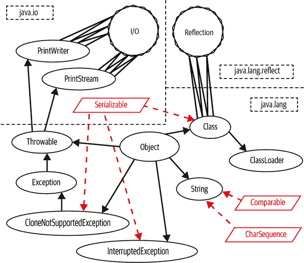
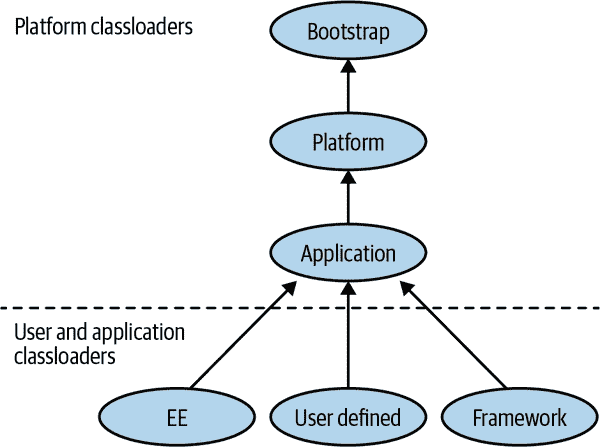

# 第十一章。类加载、反射和方法句柄

在第三章中，我们遇到了 Java 的`Class`对象，一种表示运行中 Java 进程中的活动类型的方式。在本章中，我们将在此基础上讨论 Java 环境如何加载和使新类型可用。在本章的下半部分，我们将介绍 Java 的内省能力——原始的反射 API 和较新的方法句柄功能。

# 类文件、类对象和元数据

类文件，正如我们在第一章中所看到的，是将 Java 源文件（或者，可能是其他语言）编译成 JVM 使用的中间形式的结果。这些是不打算供人类阅读的二进制文件。

这些类文件的运行时表示是包含元数据的类对象，该元数据表示创建该类文件的 Java 类型。

## 类对象示例

在 Java 中，您可以通过几种方式获取类对象。最简单的方法是：

```java
Class<?> myClass = getClass();
```

这会返回调用它的实例的类对象。然而，正如我们从调查`Object`的公共方法所知道的那样，`Object`上的`getClass()`方法是公共的，所以我们也可以获取任意对象`o`的类：

```java
Class<?> c = o.getClass();
```

已知类型的类对象也可以写为“类文字”：

```java
// Express a class literal as a type name followed by ".class"
c = String.class; // Same as "a string".getClass()
c = byte[].class; // Type of byte arrays
```

对于原始类型和`void`，我们还有表示为字面量的类对象：

```java
// Obtain a Class object for primitive types with various
// predefined constants
c = Void.TYPE; // The special "no-return-value" type
c = Byte.TYPE; // Class object that represents a byte
c = Integer.TYPE; // Class object that represents an int
c = Double.TYPE; // etc.; see also Short, Character, Long, Float
```

还有可能直接在原始类型上使用`.class`语法，像这样：

```java
c = int.class; // Same as Integer.TYPE
```

`.class`和`.TYPE`之间的关系可以通过一些简单的测试看出：

```java
// outputs true
System.out.printf("%b%n", Integer.TYPE == int.class);

// outputs false
System.out.printf("%b%n", Integer.class == int.class);

// outputs false
System.out.printf("%b%n", Integer.class == Integer.TYPE);
```

请注意，包装器类型（`Integer`等）具有`.TYPE`属性，但一般类不具备。此外，所有这些仅适用于在编译时已知的类型；对于未知类型，我们将不得不使用更复杂的方法。

## 类对象和元数据

类对象包含有关给定类型的元数据。这包括在所讨论的类上定义的方法、字段、构造函数等。程序员可以访问此元数据来调查类，即使在加载类时对该类一无所知也可以。

例如，我们可以在类文件中找到所有已弃用的方法（它们将用`@Deprecated`注解标记）：

```java
Class<?> clz =  ... // Get class from somewhere, e.g. loaded from disk
for (Method m : clz.getMethods()) {
  for (Annotation a : m.getAnnotations()) {
    if (a.annotationType() == Deprecated.class) {
      System.out.println(m.getName());
    }
  }
}
```

我们还可以找到一对类文件的公共祖先类。当这两个类都由同一个类加载器加载时，这种简单的形式将起作用：

```java
public static Class<?> commonAncestor(Class<?> cl1, Class<?> cl2) {
  if (cl1 == null || cl2 == null) return null;
  if (cl1.equals(cl2)) return cl1;
  if (cl1.isPrimitive() || cl2.isPrimitive()) return null;

  List<Class<?>> ancestors = new ArrayList<>();
  Class<?> c = cl1;
  while (!c.equals(Object.class)) {
    if (c.equals(cl2)) return c;
    ancestors.add(c);
    c = c.getSuperclass();
  }
  c = cl2;
  while (!c.equals(Object.class)) {
    for (Class<?> k : ancestors) {
      if (c.equals(k)) return c;
    }
    c = c.getSuperclass();
  }

  return Object.class;
}
```

如果类文件要合法并且能够被 JVM 加载，它们必须符合非常具体的布局。类文件的各个部分依次是：

+   魔数（所有以十六进制的四个字节`CA FE BA BE`开头的类文件）

+   使用的类文件标准的版本

+   此类的常量池

+   访问标志（`abstract`，`public`等）

+   此类的名称

+   继承信息（例如，超类的名称）

+   实现的接口

+   字段

+   方法

+   属性

类文件是一种简单的二进制格式，但它并不是人类可读的。相反，应该使用类似`javap`（参见第十三章）的工具来理解其内容。

类文件中最常用的部分之一是*常量池*，其中包含类需要引用的所有方法、类、字段和常量的表示（无论它们是在本类中还是在其他类中）。它的设计使得字节码可以简单地通过索引号引用常量池条目，从而节省字节码表示中的空间。

多个不同的 Java 版本创建了不同的类文件版本。然而，Java 的向后兼容规则之一是，更新版本的 JVM（和工具）始终可以使用旧的类文件。

让我们看看类加载过程如何将磁盘上的一组字节转换为一个新的类对象。

# 类加载的阶段

类加载是将新类型添加到正在运行的 JVM 进程中的过程。这是新代码可以进入系统的唯一方式，也是将数据转换为代码的 Java 平台的唯一方式。类加载过程包括多个阶段，让我们逐个审视它们。

## 加载

类加载过程从加载字节数组开始。通常情况下，这些字节数组是从文件系统读取的，但也可以从 URL 或其他位置读取（通常表示为 `Path` 对象）。

`ClassLoader::defineClass()` 方法负责将类文件（表示为字节数组）转换为类对象。这是一个受保护的方法，因此在没有子类化的情况下是不可访问的。

`defineClass()` 的第一个任务是加载。这会生成一个类对象的骨架，对应于您尝试加载的类。在这个阶段，对类执行了一些基本检查（例如，检查常量池中的常量以确保它们是自洽的）。

然而，加载本身并不会产生完整的类对象，该类也还不能被使用。相反，在加载后，必须链接该类。这一步骤分解为多个子阶段：

+   验证

+   准备和解析

+   初始化

## 验证

验证确认类文件符合预期，并且不会尝试违反 JVM 的安全模型（详情见“安全编程与类加载”）。

JVM 字节码设计使得它可以（大部分）静态检查。这样做的效果是减慢类加载过程但加快运行时（因为可以省略一些检查）。

验证步骤旨在防止 JVM 执行可能导致崩溃或将其置于未定义和未经测试状态的字节码，从而可能使其易受恶意代码攻击的字节码。字节码验证是防范恶意手工制作的 Java 字节码和不受信任的 Java 编译器可能输出无效字节码的防御措施。

###### 注意

默认方法机制通过类加载工作。在加载接口的实现时，会检查类文件是否包含默认方法的实现。如果存在这些方法，类加载将正常继续。如果某些方法缺失，则会补丁化以添加缺失方法的默认实现。

## 准备和解析

验证成功后，类准备好供使用。会为类分配内存，并为类中的静态变量做好初始化准备。

在这个阶段，变量尚未初始化，并且新类中没有执行任何字节码。在运行任何代码之前，JVM 检查新类文件引用的每种类型是否已知于运行时。如果类型不被认识，则可能需要加载它们——这可能会重新启动类加载过程，因为 JVM 加载新类型。

这种加载和发现的过程可以迭代执行，直到达到一组稳定的类型。这称为最初加载的类型的“传递闭包”^(1)。

让我们通过检查 `java.lang.Object` 的依赖关系的示例来快速看一下。 图 11-1 展示了 `Object` 的简化依赖图。它仅显示了 `Object` 在其公共 API 中可见的直接依赖项，以及这些依赖项的直接 API 可见依赖项的依赖项。此外，还以非常简化的形式显示了 `Class` 对反射子系统的依赖，以及 `PrintStream` 和 `PrintWriter` 对 I/O 子系统的依赖。

在 图 11-1 中，我们可以看到 `Object` 的传递闭包的一部分。



###### 图 11-1. 类型的传递闭包

## 初始化

解析完成后，JVM 最终可以初始化类。静态变量可以初始化，并且会运行静态初始化块。

这是 JVM 首次执行新加载类的字节码。静态块完成后，类就完全加载并且准备就绪。

# 安全编程和类加载

Java 程序可以从各种来源动态加载 Java 类，包括来自不受信任的来源，例如通过不安全网络到达的网站。能够创建和使用这些动态代码源是 Java 的一个伟大优势和特性之一。为了成功地使其工作，Java 非常重视一种安全架构，允许不受信任的代码安全地运行，而无需担心对主机系统的损害。

Java 的类加载子系统是许多安全特性的实现地方。类加载架构安全方面的核心思想是，将新的可执行代码引入进程的唯一方法是通过类。

这提供了一个“关键点” —— 创建新类的唯一方法是使用`ClassLoader`从字节流加载类。通过集中精力使类加载安全，我们可以限制需要保护的攻击面。

JVM 设计中非常有帮助的一个方面是它是一个堆栈机器，因此所有操作都在堆栈上进行，而不是在寄存器中。在方法的每个点上可以推断堆栈状态，并且可以用于确保字节码不会试图违反安全模型。

JVM 实施的一些安全检查包括：

+   类的所有字节码都具有有效的参数。

+   所有方法调用时，参数的数量和静态类型必须正确。

+   字节码永远不会尝试下溢或溢出 JVM 堆栈。

+   局部变量在初始化之前不被使用。

+   变量只能被分配合适类型的值。

+   必须尊重字段、方法和类访问控制修饰符。

+   没有不安全的强制转换（例如，尝试将`int`转换为指针）。

+   所有的分支指令都指向同一个方法内的合法点。

最重要的是处理内存和指针的方法。在汇编语言和 C/C++中，整数和指针是可互换的，因此整数可以用作内存地址。我们可以这样在汇编中编写它：

```java
mov eax, [STAT] ; Move 4 bytes from addr STAT into eax
```

Java 安全体系结构的最低层涉及 Java 虚拟机的设计及其执行的字节码。JVM 不允许任何形式的直接访问底层系统的内存地址，这可以防止 Java 代码干扰本机硬件和操作系统。JVM 上的这些故意限制反映在 Java 语言本身上，它不支持指针或指针算术。

语言和 JVM 都不允许将整数强制转换为对象引用或反之，并且绝对没有任何方式可以获取对象在内存中的地址。没有这些功能，恶意代码根本无法立足。

从第二章回忆起，Java 有两种类型的值 —— 原始类型和对象引用。这些是唯一可以放入变量中的东西。注意“对象内容”不能放入变量中。Java 没有 C 中的`struct`的等价物，而且始终具有按值传递的语义。对于引用类型，传递的是引用的副本 —— 这是一个值。

在 JVM 中，引用被表示为指针，但字节码不直接操作它们。事实上，字节码没有“访问位置 X 的内存”的操作码。

相反，我们只能访问字段和方法；字节码不能调用任意内存位置。这意味着 JVM 始终知道代码和数据的区别。反过来，这可以防止一系列栈溢出和其他攻击。

# 应用类加载

要应用类加载知识，充分理解`java.lang.ClassLoader`是很重要的。

这是一个抽象类，是完全功能的，并且没有抽象方法。`abstract`修饰符只存在以确保用户必须子类化`ClassLoader`才能使用它。

除了上述的`defineClass()`方法之外，我们还可以通过一个公共的`loadClass()`方法加载类。这通常由`URLClassLoader`子类使用，它可以从 URL 或文件路径加载类。

我们可以使用`URLClassLoader`从本地磁盘加载类，就像这样：

```java
var current = new File( "." ).getCanonicalPath();
var urls = new URL[] {new URL("file://"+ current + "/")};
try (URLClassLoader loader = new URLClassLoader(urls)) {
  Class<?> clz = loader.loadClass("com.example.DFACaller");
  System.out.println(clz.getName());
}
```

对`loadClass()`的参数是类文件的二进制名称。注意，为了使`URLClassLoader`正确找到类，它们需要在文件系统上的预期位置上。在这个例子中，类`com.example.DFACaller`需要在工作目录相对路径*com/example/DFACaller.class*中找到。

或者，`Class`提供了`Class.forName()`，一个静态方法，可以加载类，这些类存在于类路径上，但尚未被引用。

该方法接受一个完全限定的类名。例如：

```java
Class<?> jdbcClz = Class.forName("oracle.jdbc.driver.OracleDriver");
```

如果找不到类，则会抛出`ClassNotFoundException`。正如示例所示，在较早的 Java 数据库连接（JDBC）的版本中通常使用它来确保加载正确的驱动程序，同时避免对驱动程序类的直接`import`依赖。随着 JDBC 4.0 的到来，这个初始化步骤不再需要了。

`Class.forName()`有一个替代的、三参数形式，有时与替代的类加载器一起使用：

```java
Class.forName(String name, boolean inited, ClassLoader classloader);
```

有一系列`ClassLoader`的子类处理类加载的各种特殊情况——它们适应类加载器的层次结构。

## 类加载器层次结构

JVM 有一个类加载器的层次结构；系统中的每个类加载器（除了初始的“引导”类加载器）都有一个可以委托的父加载器。

###### 注意

Java 9 中模块的引入影响了类加载的细节操作方式。特别是，加载 JRE 类的类加载器现在是*模块化类加载器*。

惯例是类加载器将请求其父加载器来解析和加载一个类，如果只有父类加载器无法遵守，它将自己执行这个任务。一些常见的类加载器显示在图 11-2 中。



###### 图 11-2\. 类加载器层次结构

### 引导类加载器

这是任何 JVM 进程中出现的第一个类加载器，仅用于加载核心系统类。在较早的文本中，它有时被称为*原始类加载器*，但现代用法更倾向于使用引导名称。

出于性能原因，引导类加载器不执行验证，并依赖于引导类路径的安全性。由引导类加载器加载的类型隐含地被授予所有安全权限，因此这组模块尽可能地保持受限。

### 平台类加载器

这个类加载器层次结构的这个级别最初被用作*扩展类加载器*，但这种机制现在已被移除。

在其新角色中，这个类加载器（其父类加载器为引导类加载器）现在被称为*平台类加载器*。它可以通过方法`ClassLoader::getPlatformClassLoader`获得，并且从 Java 9 版开始出现在（和被）Java 规范中。它从基本系统中加载剩余的模块（相当于旧版 Java 8 及更早版本中使用的`rt.jar`）。

在新的 Java 模块化实现中，启动 Java 进程需要的代码大大减少；因此，尽可能多的 JDK 代码（现在表示为模块）已从引导加载器的范围移出，并移到了平台加载器中。

### 应用程序类加载器

历史上，有时被称为系统类加载器，但这是一个不好的名字，因为它并不加载系统（引导加载器和平台类加载器负责）。相反，它是从模块路径或类路径加载应用程序代码的类加载器。它是最常遇到的类加载器，并且其父加载器是平台类加载器。

在执行类加载时，应用程序类加载器首先搜索模块路径上的命名模块（任何三个内置类加载器中已知的模块）。如果请求的类在已知的某个这些类加载器的模块中找到，则该类加载器将加载该类。如果在任何已知的命名模块中找不到该类，则应用程序类加载器委托给其父加载器（平台类加载器）。如果父加载器未能找到该类，则应用程序类加载器搜索类路径。如果在类路径上找到该类，则作为应用程序类加载器的未命名模块的成员加载。

应用程序类加载器被广泛使用，但许多高级 Java 框架需要主类加载器无法提供的功能。相反，需要对标准类加载器进行扩展。这形成了“自定义类加载”的基础，依赖于实现`ClassLoader`的新子类。

### 自定义类加载器

在执行类加载时，迟早我们必须将数据转换为代码。如前所述，`defineClass()`（实际上是一组相关方法）负责将`byte[]`转换为类对象。

这个方法通常由子类调用，例如，这个简单的自定义类加载器从磁盘上的文件创建一个类对象：

```java
public static class DiskLoader extends ClassLoader {
  public DiskLoader() {
    super(DiskLoader.class.getClassLoader());
  }

  public Class<?> loadFromDisk(String clzPath) throws IOException {
    byte[] b = Files.readAllBytes(Paths.get(clzPath));

    return defineClass(null, b, 0, b.length);
  }
}
```

注意，在前面的例子中，我们不需要将类文件放在磁盘上的“正确”位置，就像我们在`URLClassLoader`示例中所做的那样。

我们需要提供一个类加载器来作为任何自定义类加载器的父加载器。在这个例子中，我们提供了加载`DiskLoader`类的类加载器（通常是应用程序类加载器）。

自定义类加载是 Java EE 和高级 SE 环境中非常常见的技术，它为 Java 平台提供了非常复杂的能力。我们将在本章后面看到自定义类加载的示例。

动态类加载的一个缺点是，当与动态加载的类对象一起工作时，通常对该类的信息很少或没有。为了有效地使用这个类，因此我们将不得不使用一组称为反射的动态编程技术。

# 反射

反射是在运行时检查、操作和修改对象的能力。这包括修改它们的结构和行为，甚至自我修改。

###### 警告

Java 模块系统对平台上的反射工作引入了重大变化。重要的是，在理解模块如何工作及两种能力如何交互之后，重新阅读本节。有关模块如何限制反射的详细信息，请参见“开放模块”。

反射能够在编译时甚至不知道类型和方法名称的情况下工作。它使用类对象提供的基本元数据，并且可以从类对象中发现方法或字段名称，然后获取表示方法或字段的对象。

实例也可以通过反射方式构造（使用`Class::newInstance()`或另一个构造函数）。通过一个反射构造的对象和一个`Method`对象，我们可以在先前未知类型的对象上调用任何方法。

这使得反射成为一种非常强大的技术，因此重要的是要理解何时应该使用它，以及何时它过于复杂。

## 何时使用反射

许多，如果不是大多数，Java 框架在某种程度上使用反射。编写足够灵活以处理运行时未知代码的架构通常需要反射。例如，插件架构、调试器、代码浏览器和类似读取-评估-打印循环（REPL）的环境通常是在反射之上实现的。

反射在测试中也被广泛使用（例如，通过 JUnit 和 TestNG 库），以及用于模拟对象的创建。如果你使用过任何一种 Java 框架，你几乎肯定在使用反射代码，即使你没有意识到它。

要在自己的代码中开始使用反射 API，最重要的是意识到它是关于访问几乎不知道信息的对象，并且由于这一点，交互可能会很繁琐。

如果对动态加载的类有一些静态信息（例如，加载的所有类都实现了已知接口），这可以极大地简化与类的交互，并减少反射操作的负担。

常见的错误是尝试创建一个反射框架，试图涵盖所有可能的情况，而不是只处理与问题域直接相关的情况。

## 如何使用反射

任何反射操作的第一步是获取代表要操作的类型的`Class`对象。从这个对象可以访问并应用于未知类型的实例的其他对象，如字段、方法或构造函数。

如果我们已经有一个未知类型的实例，可以通过`Object::getClass()`方法检索其类。或者，也可以通过类加载的静态`Class.forName()`方法在“应用类加载”中进行`Class`对象的查找：

```java
var clzForInstance = "Hi".getClass();
var clzForName = Class.forName("java.lang.String");
```

一旦我们有一个`Class`对象的实例，下一个合理的步骤就是通过反射调用方法。`Method`对象是 Reflection API 提供的一些最常用的对象之一。我们将详细讨论它们——`Constructor`和`Field`对象在许多方面都很相似。

### 方法对象

类对象包含每个类上的`Method`对象。这些在类加载后延迟创建，因此它们在 IDE 的调试器中并不立即可见。

`Class`上的方法允许我们检索（并在必要时惰性初始化）这些`Method`对象：

```java
var clz = Class.forName("java.lang.String");

// Returns list of all publicly visible methods on clz
var publicMethods = clz.getMethods();

// Returns named method from clz, or throws
var toString = clz.getMethod("toString", new Class[] {});
```

`getMethod()`的第二个参数接受一个`Class`对象数组，表示方法的参数，以区分方法重写。

此处演示的代码将仅列出并查找`Class`对象上的公共方法。有一些类似`getDeclaredMethod`形式的替代方法，可以访问受保护和私有方法。我们很快将有更多关于使用这些机制来绕过 Java 访问模型的内容。

像任何良好的 Java 对象一样，`Method`提供了所有关于方法的相关信息的访问器。让我们看看我们可以检索到的关于方法的最关键的元数据：

```java
var clz = Class.forName("java.lang.String");
var toString = clz.getMethod("toString", new Class[] {});

// The method's name
String name = toString.getName();

// Generic type information for the method
TypeVariable[] typeParams = toString.getTypeParameters();

// List of method annotations with RUNTIME retention
Annotation[] ann = toString.getAnnotations();

// List of checked exception types declared by method
Class[] exceptions = toString.getExceptionTypes();

// List of Parameter objects for callling the method
Parameter[] params = toString.getParameters();

// List of just the `Class` for each parameter to the method
Class[] paramTypes = toString.getParameterTypes();

// Class of the method's return type
Class ret = toString.getReturnType();
```

我们可以通过调用访问器方法来探索`Method`对象的元数据，但远远最大的用例是反射调用`Method`。

这些对象所代表的方法可以通过反射使用`Method`上的`invoke()`方法执行。

在`String`对象上调用`hashCode()`的示例如下：

```java
Object rcvr = "a";
try {
  Class<?>[] argTypes = new Class[] { };
  Object[] args = null;

  Method meth = rcvr.getClass().getMethod("hashCode", argTypes);
  Object ret = meth.invoke(rcvr, args);
  System.out.println(ret);

} catch (IllegalArgumentException | NoSuchMethodException |
         SecurityException e) {
  e.printStackTrace();
} catch (IllegalAccessException | InvocationTargetException x) {
  x.printStackTrace();
}
```

请注意，`rcvr`的静态类型声明为`Object`。在反射调用期间没有使用静态类型信息。`invoke()`方法还返回`Object`，因此`hashCode()`的实际返回类型已经自动装箱为`Integer`。

这种自动装箱是 Reflection 的一个方面，您可以看到 API 的一些轻微笨拙之处——我们将在即将到来的部分讨论。

### 使用反射创建实例

如果您想创建`Class`对象的新实例，您会发现方法查找并不起作用。我们的构造函数没有那些 API 能够找到的名称。

在没有参数的构造函数的最简单情况下，可以通过`Class`对象获取助手：

```java
Class<?> clz = ... // Get some class object
Object rcvr = clz.getDeclaredConstructor().newInstance();
```

对于接受参数的构造函数，`Class` 类有像 `getConstructor` 这样的方法，允许找到你需要的覆盖方法。虽然它们返回一个单独的 `Constructor` 类型，但使用它们与我们已经看到的与 `Method` 对象交互非常相似。

让我们看一个扩展示例，并看看如何将反射与自定义类加载结合起来，以检查磁盘上的类文件是否有任何已过时的方法（这些方法应标记为 `@Deprecated`）：

```java
public class CustomClassloadingExamples {
    public static class DiskLoader extends ClassLoader {

        public DiskLoader() {
            super(DiskLoader.class.getClassLoader());
        }

        public Class<?> loadFromDisk(String clzName)
          throws IOException {
            byte[] b = Files.readAllBytes(Paths.get(clzName));

            return defineClass(null, b, 0, b.length);
        }
    }

    public void findDeprecatedMethods(Class<?> clz) {
        for (Method m : clz.getMethods()) {
            for (Annotation a : m.getAnnotations()) {
                if (a.annotationType() == Deprecated.class) {
                    System.out.println(m.getName());
                }
            }
        }
    }

    public static void main(String[] args)
      throws IOException, ClassNotFoundException {
        var rfx = new CustomClassloadingExamples();

        if (args.length > 0) {
            DiskLoader dlr = new DiskLoader();
            Class<?> clzToTest = dlr.loadFromDisk(args[0]);
            rfx.findDeprecatedMethods(clzToTest);
        }
    }
}
```

这展示了反射技术的一些强大之处，但是使用 API 也会带来一些问题。

### 反射的问题

Java 的反射 API 常常是处理动态加载代码的唯一途径，但 API 中的一些恼人之处可能会使其处理起来稍显麻烦：

+   大量使用 `Object[]` 来表示调用参数和其他实例。

+   还有在讨论类型时使用 `Class[]` 的情况。

+   方法可以根据名称重载，因此我们需要一个类型数组来区分方法。

+   表示原始类型可能会有问题——我们必须手动装箱和拆箱。

`void` 是一个特殊的问题——有一个 `void.class`，但它的使用不一致。Java 实际上不知道 `void` 是否是一种类型，反射 API 中的某些方法使用 `null` 而不是它。

这很麻烦，可能会出错——特别是，Java 数组语法的轻微冗长可能会导致错误。

另一个问题是对非 `public` 方法的处理。如前所述，我们不能使用 `getMethod()`，必须使用 `getDeclaredMethod()` 来获取非 `public` 方法的引用。此外，要调用非 `public` 方法，我们必须重写 Java 访问控制子系统，调用 `setAccessible()` 以允许其执行：

```java
public class MyCache {
  private void flush() {
    // Flush the cache...
  }
}

Class<?> clz = MyCache.class;
try {
  Object rcvr = clz.newInstance();
  Class<?>[] argTypes = new Class[] { };
  Object[] args = null;

  Method meth = clz.getDeclaredMethod("flush", argTypes);
  meth.setAccessible(true);
  meth.invoke(rcvr, args);
} catch (IllegalArgumentException | NoSuchMethodException |
         InstantiationException | SecurityException e) {
  e.printStackTrace();
} catch (IllegalAccessException | InvocationTargetException x) {
  x.printStackTrace();
}
```

因为反射总是涉及未知信息，我们只能接受一些冗长。这是使用动态运行时反射调用的代价。

## 动态代理

Java 反射故事的最后一部分是创建动态代理。这些是类（扩展自 `java.lang.reflect.Proxy`），实现多个接口。实现类在运行时动态构造，并将所有调用转发到一个调用处理器对象：

```java
InvocationHandler handler = (proxy, method, args) -> {
    String name = method.getName();
    System.out.println("Called as: "+ name);
    return switch (name) {
        case "isOpen" -> Boolean.TRUE;
        case "close" -> null;
        default -> null;
    };
};

Channel c = (Channel) Proxy.newProxyInstance(
        Channel.class.getClassLoader(),
        new Class[] { Channel.class },
        handler);
System.out.println("Open? "+ c.isOpen());
c.close();
```

代理可以用作测试的替代对象（尤其是在测试模拟方法中）。

另一个用例是提供接口的部分实现，或者装饰或以其他方式控制委托的某些方面：

```java
public class RememberingList implements InvocationHandler {
  private final List<String> proxied = new ArrayList<>();

  @Override
  public Object invoke(Object proxy, Method method, Object[] args)
                         throws Throwable {
    String name = method.getName();
    switch (name) {
      case "clear":
        return null;
      case "remove":
      case "removeAll":
        return false;
    }

    return method.invoke(proxied, args);
  }
}

RememberingList hList = new RememberingList();

var l = (List<String>) Proxy.newProxyInstance(
                                List.class.getClassLoader(),
                                new Class[] { List.class },
                                hList);
l.add("cat");
l.add("bunny");
l.clear();
System.out.println(l);
```

代理是许多 Java 框架中广泛使用的一种强大而灵活的能力。

# 方法句柄

在 Java 7 中，引入了一种全新的用于内省和方法访问的机制。最初设计用于动态语言，在运行时可能需要参与方法分派决策。为了在 JVM 级别支持这一点，引入了新的`invokedynamic`字节码。这个字节码在 Java 7 本身中没有使用，但随着 Java 8 的到来，它在 lambda 表达式和 Nashorn JavaScript 实现中得到了广泛应用。

即使没有`invokedynamic`，新的方法句柄 API 在许多方面与反射 API 相比具有相似的功能强大性，并且即使是独立使用时也可能更加清晰和概念上更简单。可以将其视为以更安全、更现代的方式完成的反射。

## MethodType

在反射中，方法签名表示为`Class[]`，这相当繁琐。相比之下，方法句柄依赖于`MethodType`对象。这是一种类型安全且面向对象的方法，用于表示方法的类型签名。

它们包括返回类型和参数类型，但不包括方法的接收器类型或名称。名称不存在，因为这允许将任何具有正确签名的方法绑定到任何名称（根据 lambda 表达式的函数接口行为）。

方法的类型签名表示为`MethodType`的不可变实例，可以通过工厂方法`MethodType.methodType()`获得。`methodType()`的第零个参数是方法的返回类型，其后是方法参数的类型。

例如：

```java
// Matching method type for toString()
MethodType m2Str = MethodType.methodType(String.class);

// Matching method type for Integer.parseInt()
MethodType mtParseInt =
  MethodType.methodType(Integer.class, String.class);

// Matching method type for defineClass() from ClassLoader
MethodType mtdefClz = MethodType.methodType(Class.class, String.class,
                                            byte[].class, int.class,
                                            int.class);
```

这个单一的谜题部分提供了比反射更显著的增益，因为它显著地简化了方法签名的表示和讨论。下一步是获得方法的句柄。这是通过查找过程实现的。

## 方法查找

方法查找查询是在定义方法的类上执行的，并且依赖于执行它们的上下文：

```java
// String.toString only has return type with no parameter
MethodType mtToString = MethodType.methodType(String.class);

try {
  Lookup l = MethodHandles.lookup();
  MethodHandle mh = l.findVirtual(String.class, "toString",
                                  mtToString);
  System.out.println(mh);
} catch (NoSuchMethodException | IllegalAccessException e) {
  e.printStackTrace();
}
```

我们始终需要调用`MethodHandles.lookup()`—这会给我们一个基于当前执行方法的查找上下文对象。

查找对象上有几种方法（全部以`find`开头）声明用于方法解析。这些包括`findVirtual()`、`findConstructor()`和`findStatic()`。

反射和方法句柄 API 之间的一个重大区别是访问控制。一个`Lookup`对象只会返回在创建查找的上下文中可访问的方法，并且没有办法绕过这一点（没有类似于反射中的`setAccessible()`的黑客方法）。

例如，我们可以看到，当我们尝试从通用查找上下文查找受保护的`ClassLoader::defineClass()`方法时，由于受保护的方法不可访问，我们未能解析它，导致`IllegalAccessException`的抛出：

```java
public static void lookupDefineClass(Lookup l) {
  MethodType mt = MethodType.methodType(Class.class, String.class,
                                        byte[].class, int.class,
                                        int.class);

  try {
    MethodHandle mh =
      l.findVirtual(ClassLoader.class, "defineClass", mt);
    System.out.println(mh);
  } catch (NoSuchMethodException | IllegalAccessException e) {
    e.printStackTrace();
  }
}

Lookup l = MethodHandles.lookup();
lookupDefineClass(l);
```

因此，方法句柄始终符合安全管理器的要求，即使相应的反射代码没有这样做。它们在构造查找上下文的地方进行访问检查——查找对象不会返回对其没有适当访问权限的方法句柄。

查找对象或从其派生的方法句柄可以返回到其他上下文，包括那些不再可能访问该方法的上下文。在这些情况下，句柄仍然是可执行的——访问控制在查找时检查，正如我们在此示例中所见：

```java
public class SneakyLoader extends ClassLoader {
  public SneakyLoader() {
    super(SneakyLoader.class.getClassLoader());
  }

  public Lookup getLookup() {
    return MethodHandles.lookup();
  }
}

SneakyLoader snLdr = new SneakyLoader();
l = snLdr.getLookup();
lookupDefineClass(l);
```

使用`Lookup`对象，我们能够生成对任何我们可以访问的方法的方法句柄。我们还可以生成一种访问可能没有给予访问权限的字段的方式。`Lookup`上的`findGetter()`和`findSetter()`方法生成可以根据需要读取或更新字段的方法句柄。

## 调用方法句柄

方法句柄代表调用方法的能力。它们是强类型的，并尽可能类型安全。所有实例都是`java.lang.invoke.MethodHandle`的某个子类，这是 JVM 需要特殊处理的类。

调用方法句柄有两种方式——`invoke()`和`invokeExact()`。这两种方法都将接收器和调用参数作为参数。`invokeExact()`尝试直接调用方法句柄本身，而`invoke()`则在需要时调整调用参数。

一般而言，如果必要，`invoke()`执行`asType()`转换——这将根据以下规则转换参数：

+   如果需要，原始参数将被装箱。

+   如果需要，装箱的原始类型将被取消装箱。

+   如果需要，原始类型将被扩展。

+   返回类型为`void`的情况将会根据预期返回的是基本类型还是引用类型而转换为 0 或`null`。

+   `null`值将被传递，而不考虑静态类型。

有了这些潜在的转换，调用看起来像这样：

```java
Object rcvr = "a";
try {
  MethodType mt = MethodType.methodType(int.class);
  MethodHandles.Lookup l = MethodHandles.lookup();
  MethodHandle mh = l.findVirtual(rcvr.getClass(), "hashCode", mt);

  int ret;
  try {
    ret = (int)mh.invoke(rcvr);
    System.out.println(ret);
  } catch (Throwable t) {
    t.printStackTrace();
  }
} catch (IllegalArgumentException |
  NoSuchMethodException | SecurityException e) {
  e.printStackTrace();
} catch (IllegalAccessException x) {
  x.printStackTrace();
}
```

方法句柄提供了一种更清晰和更连贯的方式来访问与反射相同的动态编程能力。此外，它们设计用于与 JVM 的低级执行模型良好配合，因此比反射提供的性能要好得多。

^(1) 正如在第六章中，我们从称为图论的数学分支借用了表达式*传递闭包*。
