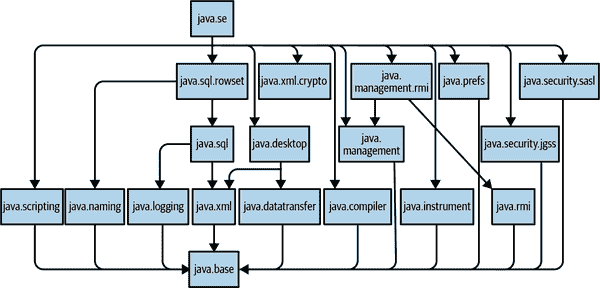

# 第十二章。Java 平台模块

在本章中，我们将对 *Java 平台模块系统*（JPMS）进行基本介绍。然而，这是一个大而复杂的主题——有兴趣的读者可能需要更深入的参考资料，如《Java 9 Modularity》（O'Reilly）的 Sander Mak 和 Paul Bakker。

模块，作为一个相对先进的特性，主要用于打包和部署整个应用程序及其依赖项。它们被添加到平台大约在 Java 第一个版本之后的 20 年左右，因此可以看作是与语言语法的其他部分正交的。

Java 强烈推广向后兼容性，在这里也发挥了作用，因为非模块化应用必须继续运行。这导致 Java 平台的架构师和管理者采取了一种务实的观点，认为团队采用模块化的必要性。

> 没有必要切换到模块。
> 
> 从未有过必要切换到模块。
> 
> Java 9 及以后的版本支持传统的 JAR 文件在传统的类路径上，通过未命名模块的概念，可能会一直持续到宇宙的热死亡。
> 
> 是否开始使用模块完全取决于您自己。
> 
> Mark Reinhold
> 
> https://oreil.ly/4RjDH

由于模块的先进性质，本章假定您熟悉现代 Java 构建工具，如 Gradle 或 Maven。

如果您是 Java 的新手，可以安全地忽略对这些工具的引用，只需阅读本章节，以获取对 JPMS 的首次高级概述。新的 Java 程序员在学习如何编写 Java 程序时，不需要完全理解这个主题。

# 为什么要使用模块？

添加模块到 Java 平台的几个主要动机包括：

+   强封装

+   明确定义的接口

+   明确的依赖关系

这些都是语言（和应用程序设计）级别的，并且它们与新平台级别的能力承诺相结合：

+   可扩展的开发

+   改进的性能（特别是启动时间）和减少的占用空间

+   减少攻击面和提高安全性

+   可演化的内部

封装点是由于原始语言规范仅支持私有、公共、受保护和包私有的可见性级别。没有办法以更精细的方式控制访问，以表达诸如以下概念：

+   只有指定的包可作为 API 访问——其他包是内部的，可能无法访问

+   某些包可以通过此包列表访问，但不包括其他包

+   定义严格的导出机制

当设计更大型的 Java 系统时，缺乏这些及相关能力一直是一个重大缺点。而且，没有适当的保护机制，JDK 内部的演进将非常困难——因为没有任何东西阻止用户应用程序直接访问实现类。

模块系统试图一次性解决所有这些问题，并提供适用于 JDK 和用户应用程序的解决方案。

## 将 JDK 模块化

随着模块系统的推出，Java 8 随附的单片式 JDK 成为首个目标，熟悉的 `rt.jar` 被分解为模块。

###### 注

Java 8 已经开始模块化工作，通过提供称为*紧凑配置*的功能，整理代码并使其可以以减少的运行时占用空间进行部署。

`java.base` 是代表 Java 应用程序启动实际所需的最小模块。它包含核心包，例如：

```java
java.io
java.lang
java.math
java.net
java.nio
java.security
java.text
java.time
java.util
javax.crypto
javax.net
javax.security
```

以及一些子包和非导出实现包，例如 `sun.text.resources`。可以通过这个简单的程序看到 Java 8 和模块化 Java 之间编译行为的一些差异，它扩展了包含在 `java.base` 中的内部公共类：

```java
import java.util.Arrays;
import sun.text.resources.FormatData;

public final class FormatStealer extends FormatData {
    public static void main(String[] args) {
        FormatStealer fs = new FormatStealer();
        fs.run();
    }

    private void run() {
        String[] s = (String[]) handleGetObject("japanese.Eras");
        System.out.println(Arrays.toString(s));

        Object[][] contents = getContents();
        Object[] eraData = contents[14];
        Object[] eras = (Object[])eraData[1];
        System.out.println(Arrays.toString(eras));
    }
}
```

在 Java 11 上尝试编译代码会产生以下错误消息：

```java
$ javac javanut8/ch12/FormatStealer.java
javanut8/ch12/FormatStealer.java:4:
        error: package sun.text.resources is not visible
import sun.text.resources.FormatData;
               ^
  (package sun.text.resources is declared in module
        java.base, which does not export it to the unnamed module)
javanut8/ch12/FormatStealer.java:14: error: cannot find symbol
        String[] s = (String[]) handleGetObject("japanese.Eras");
                                ^
  symbol:   method handleGetObject(String)
  location: class FormatStealer
javanut8/ch12/FormatStealer.java:17: error: cannot find symbol
        Object[][] contents = getContents();
                              ^
  symbol:   method getContents()
  location: class FormatStealer
3 errors
```

在模块化的 Java 中，即使是公共的类也不能访问，除非它们被定义的模块明确导出。我们可以使用 `--add-exports` 开关临时强制编译器使用内部包（基本上是重新确认旧的访问规则），像这样：

```java
$ javac --add-exports java.base/sun.text.resources=ALL-UNNAMED \
        javanut8/ch12/FormatStealer.java
javanut8/ch12/FormatStealer.java:5:
        warning: FormatData is internal proprietary API and may be
        removed in a future release
import sun.text.resources.FormatData;
                         ^
javanut8/ch12/FormatStealer.java:7:
        warning: FormatData is internal proprietary API and may be
        removed in a future release
public final class FormatStealer extends FormatData {
                                         ^
2 warnings
```

我们需要指定导出被授予给*未命名模块*，因为我们正在编译我们的类独立地，而不是作为模块的一部分。编译器会警告我们正在使用内部 API，并且这可能会在将来的 Java 版本中中断。在 Java 11 下编译和运行时，这将产生一个日本时代列表，如下所示：

```java
[, Meiji, Taisho, Showa, Heisei, Reiwa]
[, Meiji, Taisho, Showa, Heisei, Reiwa]
```

然而，如果我们尝试在 Java 17 下运行，那么结果就会有所不同：

```java
$ java javanut8.ch12.FormatStealer

Error: LinkageError occurred while loading main class
        javanut8.ch12.FormatStealer

java.lang.IllegalAccessError: superclass access check failed:

class javanut8.ch12.FormatStealer (in unnamed module @0x647c3190)
        cannot access class sun.text.resources.FormatData (in module
        java.base) because module java.base does not export
        sun.text.resources to unnamed module @0x647c3190
```

这是因为 Java 17 现在在强化内部封装时执行了额外的检查。为了使程序运行，我们还需要添加 `--add-exports` 运行时标志：

```java
$ java --add-exports java.base/sun.text.resources=ALL-UNNAMED \
        javanut8.ch12.FormatStealer
[, Meiji, Taisho, Showa, Heisei, Reiwa]
[, Meiji, Taisho, Showa, Heisei, Reiwa]
```

虽然 `java.base` 是应用程序启动所需的绝对运行时最小值，但在编译时，我们希望可见平台尽可能接近旧版（Java 8）的体验。

这意味着我们使用了一个更大的模块集，包含在一个*总称*模块下，即 `java.se`。该模块有一个依赖关系图，如 图 12-1 所示。



###### 图 12-1\. java.se 的模块依赖关系图

这几乎包含了大多数 Java 开发人员期望可用的所有类和包。

然而，一个重要的例外是，定义 CORBA 和 Java EE API（现在称为 Jakarta EE）的 Java 8 包已被移除，并且不包含在 `java.se` 中。这意味着任何依赖于这些 API 的项目在 Java 11 及以后版本上默认情况下将无法编译，并且必须使用特殊的构建配置，显式依赖于提供这些 API 的外部库。

由于 JDK 的模块化，编译可见性也发生了变化，模块系统还旨在允许开发人员对其自己的代码进行模块化。

# 撰写您自己的模块

在本节中，我们将讨论启动编写模块化 Java 应用程序所需的基本概念。

## 基本模块语法

模块化的关键在于新文件*module-info.java*，它包含了一个模块的描述。这被称为*模块描述符*。

模块在文件系统上的正确布局方式如下：

+   在项目的源根目录（*src*）下面，需要有一个与模块同名的目录（*moduledir*）。

+   在*moduledir*目录中，*module-info.java*位于与包开始的相同级别。

模块信息编译为二进制格式，*module-info.class*，其中包含模块运行时链接和运行应用程序时使用的元数据。让我们看一个*module-info.java*的简单示例：

```java
module httpchecker {
    requires java.net.http;

    exports httpchecker.main;
}
```

这引入了一些新语法：`module`、`exports`和`requires`，但实际上这些并不是完全的关键字。正如 Java 语言规范 SE 11 中所述：

> 还有十个字符序列是受限关键字：`open`、`module`、`requires`、`transitive`、`exports`、`opens`、`to`、`uses`、`provides`和`with`。这些字符序列仅在它们作为`ModuleDeclaration`和`ModuleDirective`产生式中的终端出现时被标记为关键字。

这意味着这些受限关键字只能出现在模块元数据中，并且由`javac`编译为二进制格式。主要受限关键字的含义是：

`module`

开始模块的元数据声明

`requires`

列出此模块依赖的模块

`exports`

声明导出哪些包作为 API

剩余的（与模块相关的）受限关键字将在本章的其余部分介绍。

###### 注意

在 Java 17 中，*受限关键字*的概念得到了显著扩展，因此描述更长，更不清晰。在这里，我们使用旧规范，因为它特指模块系统，更适合我们的目的。

在我们的示例中，这意味着我们声明了一个模块`httpchecker`，它依赖于 Java 11 中标准化的模块`java.net.http`（以及对`java.base`的隐式依赖）。该模块导出一个单独的包`httpchecker.main`，这是此模块中唯一可以在编译时从其他模块访问的包。

## 构建一个简单的模块化应用程序

例如，让我们构建一个简单的工具，检查网站是否已经使用了 HTTP/2，使用我们在第十章中遇到的 API：

```java
import static java.net.http.HttpResponse.BodyHandlers.ofString;

public final class HTTP2Checker {
    public static void main(String[] args) throws Exception {
        if (args.length == 0) {
            System.err.println("Provide URLS to check");
        }
        for (final var location : args) {
            var client = HttpClient.newBuilder().build();
            var uri = new URI(location);
            var req = HttpRequest.newBuilder(uri).build();

            var response = client.send(req,
                    ofString(Charset.defaultCharset()));
            System.out.println(location +": "+ response.version());
        }
    }
}
```

这依赖于两个模块——`java.net.http`和无处不在的`java.base`。应用程序的模块文件非常简单：

```java
module http2checker {
    requires java.net.http;
    exports httpchecker.main;
}
```

假设一个简单的标准模块布局，可以像这样进行编译：

```java
$ javac -d out/httpchecker \
        httpchecker/httpchecker/main/HTTP2Checker.java \
        httpchecker/module-info.java
```

这将在*out/*目录中创建一个已编译的模块。为了使用，它需要被打包为一个 JAR 文件：

```java
$ jar --create --file httpchecker.jar \
        --main-class httpchecker.main.HTTP2Checker \
        -C out/httpchecker .
```

`--create`开关告诉`jar`创建一个新的 jar，其中将包含目录中包含的类。命令末尾的最后一个`.`是强制性的，并表示应将所有类文件（相对于使用`-C`指定的路径）打包到 jar 中。

我们使用`--main-class`开关来设置模块的*入口点*—​即，在我们将模块用作应用程序时要执行的类。让我们看看它的工作原理：

```java
$ java -jar httpchecker.jar http://www.google.com
http://www.google.com: HTTP_1_1
$ java -jar httpchecker.jar https://www.google.com
https://www.google.com: HTTP_2
```

这表明，撰写时，谷歌的网站使用 HTTP/2 通过 HTTPS 提供其主页，但仍然使用 HTTP/1.1 提供遗留的未加密 HTTP 服务。

现在我们已经看到了如何编译和运行一个简单的模块化应用程序，让我们了解一些构建和运行全尺寸应用程序所需的核心模块化功能。

## 模块路径

许多 Java 开发人员熟悉类路径的概念。在使用模块化 Java 应用程序时，我们需要使用*模块路径*。这是一种新的模块概念，尽可能替换类路径。

模块携带关于其导出和依赖项的元数据—​它们不仅仅是类型的长列表。这意味着可以轻松构建模块依赖关系图，并且模块解析可以有效进行。

尚未模块化的代码仍然放置在类路径上。此代码加载到*未命名模块*中，该模块是特殊的，并且可以读取从`java.se`可达的所有其他模块。当将类放置在类路径上时，将自动使用未命名模块。

这为采用模块化 Java 运行时提供了迁移路径，而无需迁移到完全模块化的应用程序路径。然而，它确实有两个主要缺点：在应用程序完全迁移之前，模块的任何好处都不可用，并且必须手动维护类路径的自一致性，直到模块化完成。

## 自动模块

模块系统的约束之一是我们不能从命名模块引用类路径上的 JAR。这是一个安全特性—​模块系统的设计者希望模块依赖关系图利用完整的元数据，并且能够依赖于该元数据的完整性。

然而，可能会有时候模块化的代码需要引用尚未模块化的包。解决此问题的方法是将未修改的 JAR 直接放置在模块路径上（并从类路径中删除它）。像这样放置在模块路径上的 JAR 成为*自动模块*。

它具有以下功能：

+   模块名称源自 JAR 名称（或从`MANIFEST.MF`中读取）

+   导出每个包

+   需要所有其他模块（包括未命名模块）

这是另一个旨在缓解和帮助迁移的功能，但通过使用自动模块仍然会放弃一些安全性。

## 开放模块

如前所述，仅仅将一个方法标记为`public`不再保证该元素在任何地方都可访问。相反，现在访问性也取决于定义模块是否导出包含该元素的包。模块设计中的另一个重要问题是使用反射访问类。

反射是一个广泛而通用的机制，初看起来很难看出它如何与 JPMS 的强封装目标相 reconciled。更糟糕的是，Java 生态系统中许多重要的库和框架都依赖于反射（例如单元测试、依赖注入等），如果没有反射的解决方案，模块对于任何真实应用都将不可能采用。

提供的解决方案是双重的。首先，一个模块可以声明自己是一个`open`模块，像这样：

```java
open module jin8 {
    exports jin8.api;
}
```

这种声明具有以下效果：

+   模块中的所有包都可以通过反射访问

+   编译时访问*不*提供给非导出包。

这意味着配置在编译时的行为就像一个标准模块一样。总体意图是提供与现有代码和框架的简单兼容性，并减少迁移的痛苦。对于开放模块，先前能够通过反射访问代码的期望得到恢复。此外，允许访问`private`和其他通常不允许访问的方法的`setAccessible()` hack 也被保留了。

通过`opens`限制关键字还提供了对反射访问的更细粒度控制。这不会创建一个开放模块，而是通过显式声明某些包可以通过反射访问来选择性地开放特定包：

```java
module ojin8 {
    exports ojin8.api;
    opens ojin8.domain;
}
```

当你需要为一个模块感知的*对象-关系映射*（ORM）系统提供完整的反射访问以获取核心域类型时，这种用法可能非常有用。

可以进一步限制对特定客户端包的反射访问，使用`to`关键字来实现。在可行的情况下，这可以作为一个良好的设计原则，但当然这种技术在像 ORM 这样的通用框架中效果不佳。

###### 注意

类似地，还可以限制包的导出仅针对特定外部包。然而，此功能主要是为了帮助 JDK 本身的模块化而添加的，对用户模块的适用性有限。

不仅如此，还可以同时导出和开放一个包，但这不被推荐——在迁移期间，最好将对包的访问限制在编译时或反射访问中，而不是同时两者。

如果现在一个模块内包含一个需要反射访问的包，则平台提供了一些开关作为过渡期的应急措施。

特别是，`java` 选项 `--add-opens module/package=ALL-UNNAMED` 可以用来打开模块的特定包，以便对类路径中所有代码进行反射访问，覆盖模块系统的行为。对于已经是模块化的代码，它也可以用来允许对特定模块进行反射访问。

当您正在迁移到模块化的 Java 时，任何反射访问另一个模块的内部代码的代码应该首先使用该开关运行，直到情况得到解决。

与反射访问的这个问题相关（也是它的特殊情况）是框架广泛使用内部平台 API 的问题。这通常被描述为 “Unsafe 问题”，我们将在本章末尾遇到它。

## 提供服务

模块系统包含了 *服务* 机制，以缓解封装的高级形式的另一个问题。这个问题可以通过考虑一个熟悉的代码片段来简单地解释：

```java
import com.example.Service;

Service s = new ServiceImpl();
```

即使 `Service` 存在于一个已导出的 API 包中，这行代码也不会编译通过，除非包含 `ServiceImpl` 的包也被导出。我们需要的是一种机制，允许对实现服务类的类进行细粒度的访问，而无需导入整个包。例如，我们可以这样写：

```java
module jin8 {
    exports jin8.api;
    requires othermodule.services;

    provides services.Service with jin8.services.ServiceImpl;
}
```

现在 `ServiceImpl` 类在编译时作为 `Service` 接口的实现可访问。请注意，`services` 包必须包含在另一个模块中，这是当前模块所需要的，以便此提供可以工作。

## 多版本 JAR

为了解释多版本 JAR 解决的问题，让我们考虑一个简单的例子：找到当前执行进程的进程 ID（PID）（即，执行我们代码的 JVM）。

###### 注意

我们不使用之前的 HTTP/2 示例，因为 Java 8 没有 HTTP/2 API，所以我们需要做大量的工作（基本上是完整的后向兼容！）来为 8 提供相同的功能。

这可能看起来是一个简单的任务，但在 Java 8 上，这需要大量的样板代码：

```java
public class GetPID {
    public static long getPid() {
        // This rather clunky call uses JMX to return the name that
        // represents the currently running JVM. This name is in the
        // format <pid>@<hostname>—on OpenJDK and Oracle VMs only—there
        // is no guaranteed portable solution for this on Java 8
        final String jvmName = 
            ManagementFactory.getRuntimeMXBean().getName();
        final int index = jvmName.indexOf('@');
        if (index < 1)
            return -1;

        try {
            return Long.parseLong(jvmName.substring(0, index));
        } catch (NumberFormatException nfe) {
            return -1;
        }
    }
}
```

如我们所见，这一点远非我们所希望的那么简单。更糟糕的是，它在所有 Java 8 实现中都没有标准的支持方式。幸运的是，从 Java 11 开始，我们可以使用新的 `ProcessHandle` API，如下所示：

```java
public class GetPID {
    public static long getPid() {
        // Use new Java 9 Process API...
        ProcessHandle processHandle = ProcessHandle.current();
        return processHandle.getPid();
    }
}
```

现在这使用了一个标准的 API，但它引发了一个基本问题：开发人员如何编写能够在所有当前 Java 版本上运行的代码？

我们想要的是正确构建和运行一个项目在多个 Java 版本上。我们想依赖于仅在较新版本中可用的库类，但仍然可以通过使用一些代码 “shims” 在较早版本上运行。最终结果必须是一个单独的 JAR，并且我们不需要项目切换到多模块格式——事实上，这个 JAR 必须作为自动模块工作。

让我们来看一个例子项目，它必须在 Java 8 和 Java 11 或更高版本中都能正确运行。主要代码库是用 Java 8 构建的，Java 11 的部分必须用 Java 11 构建。为了防止编译失败，这部分构建必须与主代码库隔离，尽管它可以依赖于 Java 8 构建的构件。

为了保持构建配置的简单性，此功能是通过 JAR 文件中的 `MANIFEST.MF` 条目来控制的：

```java
Multi-Release: True
```

变体代码（即后续版本的代码）然后存储在 *META-INF* 的特殊目录中。在我们的案例中，这是 *META-INF/versions/11*。

对于实现此功能的 Java 运行时，版本特定目录中的任何类都会覆盖内容根目录中的版本。另一方面，对于 Java 8 及更早版本，MANIFEST.MF 条目和 *versions/* 目录都会被忽略，只会找到内容根目录中的类。

## 转换为多版本 JAR

要开始将您的软件部署为多版本 JAR，请按照以下概要进行操作：

1.  隔离依赖于 JDK 版本的特定代码。

1.  如果可能，将该代码放入一个或一组包中。

1.  使版本 8 项目能够干净地构建

1.  为补充类创建一个新的独立项目。

1.  为新项目设置一个单一的依赖项（版本 8 构件）。

对于 Gradle，您还可以使用 *source set* 的概念，并使用不同（较新）的编译器编译 v11 代码。然后可以使用类似以下的段落将其构建为 JAR 文件：

```java
jar {
  into('META-INF/versions/11') {
     from sourceSets.java11.output
  }

  manifest.attributes(
     'Multi-Release': 'true'
  )
}
```

对于 Maven，当前最简单的方法是使用 Maven 依赖插件，并在单独的 `generate-resources` 阶段将模块化类添加到整体 JAR 中。

## 迁移到模块

许多 Java 开发人员面临一个问题，即是否以及何时应该将他们的应用程序迁移到使用模块。

###### 提示

模块应该成为所有新开发的应用程序的默认选项，特别是那些采用微服务架构的应用。

许多应用程序根本不需要迁移。然而，将现有代码库模块化确实值得，因为更好的封装和整体架构上的好处会在长期内显现出来——可以更快地引入新开发人员，并提供更清晰的结构，易于理解和维护。

在考虑迁移现有应用程序（特别是单体设计）时，可以使用以下路线图：

1.  首先将应用程序运行时升级到 Java 17（最初从类路径运行）。

1.  确定已模块化的任何应用程序依赖项，并将这些依赖项迁移到模块中。

1.  将所有非模块化的依赖项保留为自动模块。

1.  引入一个单一的 *单体模块*，包含所有应用程序代码。

此时，一个最小化的模块化应用程序应该准备好进行生产部署。在此阶段，该模块通常会是一个`open`模块。下一步是架构重构；在此阶段，应用程序可以根据需要拆分为单独的模块。

一旦应用程序代码在模块中运行，限制通过 `opens` 对您的代码的反射访问可能是有意义的。此访问可以限制在特定模块（如 ORM 或依赖注入模块）作为删除任何不必要访问的第一步。

对于 Maven 用户来说，值得记住 Maven 不是一个模块系统，但它确实有依赖项——并且（与 JPMS 的依赖项不同）它们是有版本的。在撰写本文时，Maven 工具仍在不断发展以完全与 JPMS 集成（许多插件在此时尚未跟进）。然而，正在出现一些关于模块化 Maven 项目的一般指导原则，特别是：

+   目标是为每个 Maven POM 文件生成一个模块。

+   不要在 Maven 项目未准备好（或没有立即需要）之前进行模块化。

+   请记住，在 Java 11+ 运行时上运行不需要在 Java 11+ 工具链上构建。

最后一点表明，将 Maven 项目迁移到 Java 8 项目并确保这些 Maven 构件能够在 Java 11（或 17）运行时上作为自动模块清洁地部署，是迁移 Maven 项目的一种路径。只有在第一步正常工作后，才应进行全面的模块化。

有一些很好的工具支持可帮助进行模块化过程。Java 8 及更高版本附带了`jdeps`工具（参见 Chapter 13），用于确定您的代码依赖于哪些包和模块。这对于从 Java 8 迁移和在重新架构时使用`jdeps`非常有帮助。

## 自定义运行时映像

JPMS 的关键目标之一是应用程序可能不需要 Java 8 传统单片式运行时中的每个类，并且可以管理较小的模块子集。这些应用程序在启动时间和内存开销方面的足迹可以更小。这可以进一步进行：如果不需要所有类，那么为什么不与仅包含必要内容的减小、自定义运行时映像一起提供应用程序呢？

为了演示这个想法，让我们将 HTTP/2 检查器打包成一个独立的工具，并使用`jlink`工具（自 Java 9 起成为平台的一部分）来实现这一点：

```java
$ jlink --module-path httpchecker.jar:$JAVA_HOME/jmods \
      --add-modules httpchecker,jdk.crypto.ec \
      --launcher http2chk=httpchecker \
      --output http2chk-image
```

注意，这假设 JAR 文件 *httpchecker.jar* 已创建了一个主类（即入口点）。结果是一个输出目录 *http2chk-image*，大小约为 39M，远小于完整映像。这也说明，因为该工具使用新的 HTTP 模块，在使用 HTTPS 连接时需要安全、加密等库。

在自定义镜像目录中，我们可以直接运行`http2chk`工具，并查看它在机器没有所需版本的`java`时也可以工作：

```java
$ java -version
java version "1.8.0_144"
Java(TM) SE Runtime Environment (build 1.8.0_144-b01)
Java HotSpot(TM) 64-Bit Server VM (build 25.144-b01, mixed mode)
$ ./bin/http2chk https://www.google.com
https://www.google.com: HTTP_2
```

自定义运行时镜像的部署仍然是一种相当新的工具，但它具有减少代码占用空间并帮助 Java 在微服务时代保持竞争力的巨大潜力。未来，`jlink`甚至可以与新的编译方法结合使用，包括提前（AOT）编译器。

# 模块化的问题

尽管模块系统是 Java 9 的旗舰功能，并且已经花费了大量的工程时间来开发它，但它也不是没有问题。这或许是不可避免的——这一功能从根本上改变了 Java 应用程序的架构和交付方式。当试图为 Java 的成熟生态系统提供后向兼容时，模块几乎不可能避免遇到一些问题。

## `Unsafe`及其相关问题

`sun.misc.Unsafe`是一个在 Java 世界中被广泛使用和受欢迎的类，特别是在框架编写者和其他实现者中。然而，它是一个内部实现类，并不是 Java 平台标准 API 的一部分（正如包名所清楚表明的）。类名也很明显地表明这实际上不是为 Java 应用程序使用而设计的。

`Unsafe`是一个不受支持的内部 API，因此可能会在任何新的 Java 版本中被撤回或修改，而不考虑对用户应用程序的影响。任何使用它的代码技术上都直接耦合于 HotSpot JVM，并且可能是非标准的，并且可能无法在其他实现上运行。

虽然`Unsafe`并非以任何方式成为 Java SE 的官方部分，但已成为事实上的标准，并成为几乎每个主要框架实现的关键部分之一。随着版本的不断更新，它已经演变成为一种非标准但必要功能的垃圾桶。这些功能的混合使用形成了一个真正的混合包，每种能力提供的安全程度各不相同。`Unsafe`的示例用途包括：

+   快速序列化/反序列化

+   线程安全的 64 位大小的本地内存访问（例如，堆外内存）

+   原子内存操作（例如，比较并交换）

+   快速字段/内存访问

+   多操作系统替代 JNI

+   访问具有 volatile 语义的数组项（参见 第六章）

核心问题在于许多框架和库在没有某些`Unsafe`功能的替代方案的情况下无法迁移到模块化的 JDK。这反过来影响了使用 Java 生态系统中各种框架的每个应用程序。

为解决这个问题，Oracle 为一些所需功能创建了新的受支持的 API，并将无法及时封装到模块中的 API 分离出来，`jdk.unsupported`。这清楚地表明这不是一个受支持的 API，开发人员使用它需自担风险。这使得`Unsafe`获得了临时许可证（严格限制时间），同时鼓励库和框架开发人员转移到新的 API。

替代 API 的一个示例是 VarHandles。这些扩展了*Method Handles*概念（来自第十一章）并添加了新功能，例如 Java 11 的并发障碍模式。这些，连同对 JMM 的一些适度更新，旨在生成用于访问新低级处理器功能的标准 API，而不允许开发人员完全访问危险功能，就像`Unsafe`中发现的一样。

关于`Unsafe`和相关低级平台技术的更多详细信息可在[*Optimizing Java*](http://shop.oreilly.com/product/0636920121718.do)（O’Reilly）中找到。

## 缺乏版本控制

Java 17 的 JPMS 标准不包括依赖项的版本控制。

###### 注意

这是一个有意的设计决定，旨在降低交付系统的复杂性，并不排除未来模块可能包含有版本的依赖项的可能性。

当前情况需要外部工具来处理模块依赖项的版本控制。在 Maven 的情况下，这将在项目对象模型（POM）中完成。这种方法的一个优点是下载和管理版本也在构建工具的本地存储库中处理。

但是，无论如何，简单的事实是，依赖版本信息必须存储在模块之外，并且不构成 JAR 工件的一部分。

无法摆脱——这相当丑陋，但与从类路径中推导出依赖项的情况相比，情况并不更糟。

## 采用率缓慢

随着 Java 9 的发布，Java 发布模型在根本上发生了变化。 Java 8 和 9 使用了“关键发布”模型——其中一个关键（或标志性）功能，如 Java 8 的 lambda 或 Java 9 的模块——基本上定义了发布，因此交付日期取决于功能何时完成。

这种模型的问题在于，由于不确定版本何时发布，可能会导致效率低下。特别是，只是错过发布的一个小功能将不得不等待很长时间才能等到下一个主要发布版。因此，从 Java 10 开始，采用了一种新的发布模型，引入了*严格的基于时间的版本控制*。

这意味着：

+   Java 现在被分类为*功能*发布，每六个月定期发生一次。

+   功能在基本上完成之前不会合并到平台中。

+   主线仓库始终处于可发布状态。

这些发布仅适用于六个月，过后将不再得到支持。Oracle 将某些版本指定为*长期支持*（LTS）版本，用户可以从 Oracle 获取扩展的付费支持。

这些 LTS 版本最初的发布节奏是三年，但预计在撰写本文时将改为两年。这意味着 Oracle 的 LTS 版本目前是 8（事后添加的）、11 和 17；预计下一个版本将在 2023 年 9 月发布 Java 21。

除了 Oracle 外，OpenJDK 的版本还可以从包括 Amazon、Azul、Eclipse Adoptium、IBM、Microsoft、Red Hat 和 SAP 在内的其他供应商获取。这些供应商提供多种获取 JDK 更新（包括安全更新）的方式，且零成本。

还有多种付费支持模型从上述供应商提供。

欲深入了解此主题，请参阅指南：[“Java Is Still Free”](https://oreil.ly/Cz61R) by the [Java Champions community](https://oreil.ly/NGIpB)，这是 Java 行业中独立的 Java 领袖组成的团体。

尽管 Java 社区普遍对新的更快发布周期持积极态度，但 Java 9 及以上版本的采纳率远低于以往版本。这可能是因为团队希望有更长的支持周期，而不是仅在六个月后升级到每个特性发布。实际上，只有 LTS 版本才看到广泛采用，甚至与 Java 8 的快速普及相比也较慢。

从 Java 8 升级到 11（或 17）也不是一种插拔替换（与 7 到 8、6 到 7 相比）。即使最终用户应用程序不利用模块，模块子系统也从根本上改变了 Java 平台的许多方面。

在 Java 11 发布四年后，它似乎终于超过了 Java 8，现在更多工作负载在 Java 11 上运行而不是 8。Java 17 的采用速度以及 Java 21 的影响有待观察（假设 21 确实是下一个 LTS 版本）。

# 摘要

Java 9 首次引入的模块化特性旨在一次解决多个问题。通过拒绝访问内部实现，已经实现了更短的启动时间、更小的内存占用和减少的复杂性目标。长期目标是实现更好的应用架构，并开始思考编译和部署的新方法，这些目标仍在进行中。

然而，事实是，截至 Java 17 发布时，很少有团队和项目全面转向模块化世界。这是可以预料的，因为模块化是一个长期的项目，回报缓慢，并依赖于生态系统内部的网络效应来实现全部收益。

新应用程序在一开始时应考虑以模块化方式构建，但 Java 生态系统内平台模块性的整体故事仍处于初期阶段。
