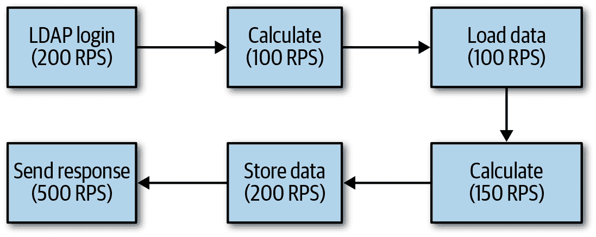
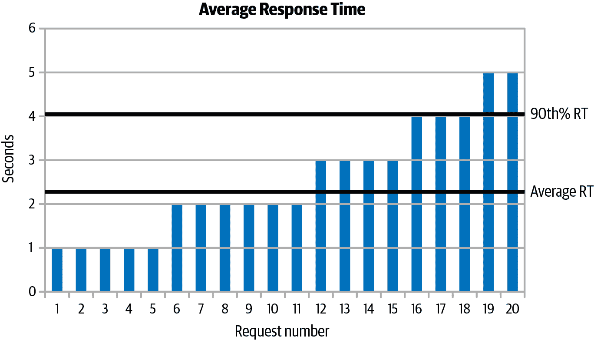
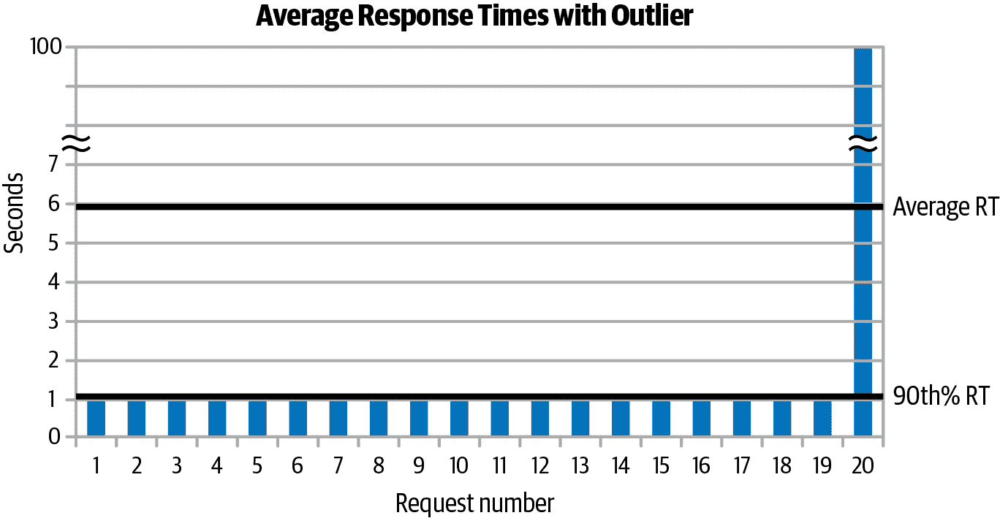

# 第二章。性能测试方法

本章讨论了从性能测试中获取结果的四个原则：测试真实应用；理解吞吐量、批处理和响应时间；理解变异性；以及早期和频繁地测试。这些原则构成了后续章节建议的基础。性能工程的科学就是通过这些原则来覆盖的。在应用程序上执行性能测试是可以的，但如果没有这些测试背后的科学分析，它们往往会导致不正确或不完整的分析。本章介绍了如何确保测试产生有效的分析。

后续章节中的许多示例使用了一个模拟股票价格系统的常见应用程序；该应用程序也在本章中进行了概述。

# 测试一个真实应用

第一个原则是测试应该在实际产品上以产品将被使用的方式进行。粗略地说，可以使用三类代码进行性能测试：微基准测试、宏基准测试和中基准测试。每种都有其自身的优缺点。包含实际应用程序的类别将提供最佳结果。

## 微基准测试

*微基准测试* 是一种设计用来测量小单位性能的测试，以便决定哪个多个备选实现是首选：创建线程的开销与使用线程池的开销，执行一个算法与替代实现的时间等等。

微基准测试可能看起来是一个不错的主意，但是 Java 的特性使其对开发人员很有吸引力 —— 即时编译和垃圾回收 —— 这使得编写正确的微基准测试变得困难。

### 微基准测试必须使用其结果

微基准测试与常规程序在各种方面有所不同。首先，因为 Java 代码在首次执行时是解释执行的，随着执行时间的增加，它会变得更快。因此，所有基准测试（不仅仅是微基准测试）通常包括一个预热期，期间 JVM 可以将代码编译成其最佳状态。

最佳状态可能包括许多优化。例如，这里有一个看似简单的循环来计算一个计算第 50 个斐波那契数的方法的实现：

```java
public void doTest() {
    // Main Loop
    double l;
    for (int i = 0; i < nWarmups; i++) {
        l = fibImpl1(50);
    }
    long then = System.currentTimeMillis();
    for (int i = 0; i < nLoops; i++) {
        l = fibImpl1(50);
    }
    long now = System.currentTimeMillis();
    System.out.println("Elapsed time: " + (now - then));
}
```

这段代码想要测量执行`fibImpl1()`方法的时间，因此它首先热身编译器，然后测量现在已编译的方法。但很可能那个时间是 0（或者更可能是运行没有主体的`for`循环的时间）。由于`l`的值没有在任何地方读取，编译器可以自由地跳过其计算。这取决于`fibImpl1()`方法中还发生了什么，但如果只是一个简单的算术操作，就可以全部跳过。还可能只有方法的部分会被执行，甚至可能产生错误的`l`值；由于该值从未被读取，因此没有人会知道。（有关如何消除循环的详细信息，请参阅第四章。）

有一种解决这个特定问题的方法：确保每个结果都被读取，而不仅仅是写入。实际上，将`l`的定义从局部变量更改为实例变量（用`volatile`关键字声明）将允许测量方法的性能。（`l`实例变量必须声明为`volatile`的原因可以在第九章中找到。）

### 微基准测试必须测试一系列输入。

即便如此，仍存在潜在的陷阱。这段代码只执行一项操作：计算第 50 个斐波那契数。聪明的编译器可以发现这一点，并且仅执行一次循环，或者至少丢弃循环的一些迭代，因为这些操作是多余的。

此外，`fibImpl1(1000)`的性能很可能与`fibImpl1(1)`的性能大不相同；如果目标是比较不同实现的性能，则必须考虑一系列输入值。

输入的范围可以是随机的，像这样：

```java
for (int i = 0; i < nLoops; i++) {
    l = fibImpl1(random.nextInteger());
}
```

这可能不是我们想要的。计算随机数的时间包括在执行循环的时间中，所以测试现在测量了计算斐波那契数列`nLoops`次所需的时间，加上生成`nLoops`个随机整数的时间。

最好预先计算输入值：

```java
int[] input = new int[nLoops];
for (int i = 0; i < nLoops; i++) {
    input[i] = random.nextInt();
}
long then = System.currentTimeMillis();
for (int i = 0; i < nLoops; i++) {
    try {
        l = fibImpl1(input[i]);
    } catch (IllegalArgumentException iae) {
    }
}
long now = System.currentTimeMillis();
```

### 微基准测试必须测量正确的输入。

你可能注意到现在测试必须检查调用`fibImpl1()`方法时是否会出现异常：输入范围包括负数（没有斐波那契数）和大于 1,476 的数字（其结果不能表示为`double`）。

当该代码用于生产时，这些可能是常见的输入值吗？在这个示例中，可能不是；在你自己的基准测试中，结果可能会有所不同。但要考虑这里的影响：假设你正在测试这个操作的两种实现。第一种能够相当快地计算斐波那契数，但不检查其输入参数范围。第二种如果输入参数超出范围就会立即抛出异常，然后执行一个缓慢的递归操作来计算斐波那契数，像这样：

```java
public double fibImplSlow(int n) {
    if (n < 0) throw new IllegalArgumentException("Must be > 0");
    if (n > 1476) throw new ArithmeticException("Must be < 1476");
    return recursiveFib(n);
}
```

将此实现与原始实现在广泛的输入值范围内进行比较将表明，这种新实现比原始实现快得多——仅仅因为方法开始时的范围检查。

如果在现实世界中，用户总是将小于 100 的值传递给该方法，那么比较将给出错误的答案。通常情况下，`fibImpl1()` 方法会更快，并且正如第一章所解释的，我们应该为常见情况进行优化。（这显然是一个假设的例子，而原始实现中简单添加边界测试会使其成为更好的实现。在一般情况下，这可能是不可能的。）

### 微基准测试代码在生产环境中可能会表现不同。

到目前为止，我们看过的问题可以通过仔细编写我们的微基准测试来克服。其他因素将影响代码最终在纳入更大程序后的结果。编译器使用代码的配置反馈来确定在编译方法时使用的最佳优化方法。配置反馈基于哪些方法频繁调用、它们被调用时的堆栈深度、实际类型（包括子类）的参数等等——它依赖于代码实际运行的环境。

因此，在微基准测试中，编译器通常会以不同的方式优化代码，而不是在较大的应用程序中使用相同的代码时优化。

微基准测试也可能在垃圾收集方面表现出非常不同的行为。考虑两种微基准测试的实现：第一个产生快速结果，但也产生许多短寿对象。第二个稍慢一些，但产生的短寿对象较少。

当我们运行一个小程序来测试这些内容时，第一个可能会更快。即使它会触发更多的垃圾收集，它们会迅速丢弃年轻代集合中的短寿对象，总体更快的时间会偏向于这种实现。当我们在具有多个线程同时执行的服务器上运行此代码时，GC（垃圾收集）的配置文件将会有所不同：多个线程将更快地填满年轻代。因此，在微基准测试情况下迅速丢弃的许多短寿对象，在多线程服务器环境中使用时可能会被提升到老年代。这反过来会导致频繁（且昂贵）的全面 GC。在这种情况下，长时间在全面 GC 中花费会使第一个实现比产生较少垃圾的第二个“较慢”实现表现更差。

最后，还有一个问题，那就是微基准实际上意味着什么。在像这里讨论的基准测试中，整体时间差可能以秒为单位测量许多循环，但每次迭代的差异通常以纳秒为单位测量。是的，纳秒是可以累加的，“千刀万剐”的问题经常成为性能问题。但特别是在回归测试中，请考虑跟踪纳秒级别的事务是否有意义。对于那些会被访问数百万次的集合来说，在每次访问时节省几个纳秒可能是重要的（例如，参见第十二章）。对于发生频率较低的操作，比如每个 REST 调用请求可能只会发生一次的操作，通过修复由微基准测试发现的纳秒回归可能会耗费时间，而这些时间本应该更有利地用于优化其他操作。

尽管微基准测试存在许多缺陷，但它们足够受欢迎，以至于 OpenJDK 有一个核心框架用于开发微基准测试：Java 微基准测试工具（`jmh`）。`jmh`被 JDK 开发人员用于构建 JDK 本身的回归测试，并为一般基准测试的开发提供框架。我们将在下一节更详细地讨论`jmh`。

## 宏基准测试

评估应用程序性能的最佳方法是使用应用程序本身，结合其使用的任何外部资源。这就是*宏基准测试*。例如，如果应用程序通常通过调用目录服务（例如轻量级目录访问协议，或 LDAP）检查用户的凭据，应该以该模式进行测试。对 LDAP 调用进行存根化可能对模块级测试有意义，但必须以其完整配置测试应用程序。

随着应用程序的增长，这一准则变得更加重要并且更难实现。复杂系统不仅仅是其各个部分的总和；当这些部分组装在一起时，它们的行为将会有所不同。例如，模拟数据库调用可能意味着您不再需要担心数据库的性能问题——嘿，您是 Java 开发人员；为什么还要处理 DBA 的性能问题呢？但数据库连接为其缓冲区消耗大量堆空间；当通过网络发送更多数据时，网络会饱和；与 JDBC 驱动程序中复杂代码相比，调用更简单方法集的代码将被优化得不同；CPU 更有效地在较短的代码路径上进行流水线处理和缓存等等。

另一个测试整个应用程序的原因是资源分配的问题。在理想的世界中，将有足够的时间优化应用程序中的每一行代码。然而在现实世界中，截止日期逼近，仅优化复杂环境中的一部分可能不会立即产生效益。

考虑图 2-1 中显示的数据流。数据由用户输入，进行专有业务计算，根据此计算从数据库加载数据，进行更多专有计算，将更改的数据存储回数据库，并将答案发送回用户。每个框中的数字是模块在隔离测试中可以处理的每秒请求数（RPS）。

从商业角度来看，专有计算是最重要的事情；它们是程序存在的原因，也是我们被付费的原因。然而，在这个例子中，使它们快 100%并没有任何好处。任何应用程序（包括单独的独立 JVM）都可以建模为像这样的一系列步骤，其中数据以由该框（模块、子系统等）的效率决定的速率流出。数据以前一个框的输出率决定的速率流入子系统。



###### 图 2-1\. 典型程序流程

假设对业务计算进行算法改进，使其能够处理 200 RPS；相应地增加了注入系统的负载。LDAP 系统可以处理增加的负载：到目前为止，一切顺利，200 RPS 将流入计算模块，该模块将输出 200 RPS。

但是数据加载仍然只能处理 100 RPS。即使 200 RPS 流入数据库，但只有 100 RPS 流出数据库并流入其他模块。系统的总吞吐量仍然只有 100 RPS，即使业务逻辑的效率已经提高了一倍。在花时间改善环境的其他方面之前，进一步改进业务逻辑的尝试将是徒劳的。

在这个例子中花费在优化计算上的时间并非完全浪费：一旦在系统的其他瓶颈上付出努力，性能收益最终将显现出来。而是一个优先事项：如果没有测试整个应用程序，就不可能知道在哪里花时间进行性能工作会产生回报。

## 中型基准测试

*中型基准测试* 是介于微基准测试和完整应用程序之间的测试。我与开发人员一起工作，同时关注 Java SE 和大型 Java 应用程序的性能，每个组都有一套他们认为是微基准测试的测试。对于 Java SE 工程师来说，这个术语意味着比第一部分中更小的示例：测量某些非常小的东西。应用程序开发人员倾向于将这个术语应用于其他东西：测量性能的一个方面，但仍然执行大量代码。

应用微基准的一个示例可能是测量从服务器返回简单 REST 调用响应的速度。与传统的微基准相比，这种请求的代码要复杂得多：包括大量的套接字管理代码、读取请求的代码、写入答案的代码等等。从传统的角度来看，这不是微基准。

这种测试也不是宏基准：没有安全性（例如，用户不登录应用程序）、没有会话管理，也没有使用其他应用程序功能。因为它只是实际应用程序的一个子集，它位于中间位置——这是我用来描述做一些实际工作但不是完整应用程序的基准测试的术语，称为 Mesobenchmark。

Mesobenchmark 比微基准有更少的陷阱，比宏基准更容易处理。Mesobenchmark 可能不会包含大量可以由编译器优化去掉的死代码（除非这些死代码存在于应用程序中，在这种情况下，优化掉它们是件好事）。Mesobenchmark 更容易进行线程化：它们仍然更有可能遇到更多同步瓶颈，但这些瓶颈是真实应用程序在更大的硬件系统和更大的负载下最终会遇到的问题。

然而，Mesobenchmark 并不完美。使用这样的基准来比较两个应用服务器性能的开发人员可能很容易误入歧途。考虑 表 2-1 中展示的两个 REST 服务器的假设响应时间。

表 2-1\. 两个 REST 服务器的假设响应时间

| 测试 | 服务器 1 | 服务器 2 |
| --- | --- | --- |
| 简单的 REST 调用 | 19 ± 2.1 毫秒 | 50 ± 2.3 毫秒 |
| 带授权的 REST 调用 | 75 ± 3.4 毫秒 | 50 ± 3.1 毫秒 |

只使用简单的 REST 调用来比较两台服务器性能的开发人员可能没有意识到，服务器 2 自动为每个请求执行授权。他们可能会得出服务器 1 提供最快性能的结论。然而，如果他们的应用程序总是需要授权（这是典型的情况），他们就做出了错误的选择，因为服务器 1 执行授权的时间要长得多。

即便如此，中基准测试提供了一种合理的替代方案，而不是测试完整应用程序；它们的性能特征与实际应用程序更加接近，而不是微基准测试的性能特征。当然，这里存在一个连续性。本章后面的一个部分将介绍一个常见应用程序的概要，该应用程序在后续章节的许多示例中使用。该应用程序有服务器模式（适用于 REST 和 Jakarta 企业版服务器），但这些模式不使用像身份验证这样的服务器功能，虽然它可以访问企业资源（即数据库），但在大多数示例中，它只是使用随机数据来替代数据库调用。在批处理模式下，它模拟了一些实际（但快速）的计算：例如，没有 GUI 或用户交互。

中基准测试也非常适合自动化测试，特别是在模块级别。

# 快速总结

+   要编写好的微基准测试，需要一个适当的框架。

+   测试整个应用程序是了解代码实际运行方式的唯一途径。

+   通过中基准测试（mesobenchmark）在模块化或操作级别上分离性能提供了一个合理的方法，但不能替代对整个应用程序的测试。

# 理解吞吐量、批处理和响应时间

第二个原则是理解并选择适合应用程序的适当测试指标。性能可以通过吞吐量（RPS）、经过时间（批处理时间）或响应时间来衡量，这三个指标相互关联。了解这些关系可以根据应用程序的目标选择正确的指标。

## 经过时间（批处理）测量

衡量性能的最简单方法是看完成某项任务需要多长时间。例如，我们可能想要检索过去 25 年间 1 万只股票的历史，并计算这些价格的标准偏差，为某公司 5 万名员工的工资福利制作报告，或执行 100 万次循环。

在静态编译语言中，这种测试非常直接：编写应用程序，然后测量其执行时间。Java 世界为此增加了一些复杂性：即时编译。该过程在第四章中有描述；基本上意味着代码需要几秒到几分钟（或更长时间）才能完全优化并在最高性能下运行。由于这个（以及其他）原因，Java 的性能研究关注热身期：通常在执行了足够长时间的代码后进行性能测量，以确保已编译并优化。

另一方面，在许多情况下，应用程序从开始到结束的性能才是重要的。一个处理一万个数据元素的报告生成器将在一定时间内完成；对于最终用户来说，如果前五千个元素的处理速度比后五千个元素慢 50%，那并不重要。即使在像 REST 服务器这样的场景中——服务器的性能肯定会随着时间的推移而提高——初始性能也很重要。服务器要达到最佳性能需要一些时间；在此期间访问应用程序的用户，确实在乎热身期间的性能。

由于这些原因，本书中的许多示例都是批处理型的（尽管这有点不太常见）。

## 吞吐量测量

*吞吐量测量*基于在一定时间内可以完成的工作量。虽然吞吐量测量的最常见例子涉及服务器处理客户端提供的数据，但这并非绝对必要：一个单独的独立应用程序可以像测量经过的时间一样容易地测量吞吐量。

在客户端/服务器测试中，吞吐量测量意味着客户端没有思考时间。如果只有一个客户端，那么该客户端将向服务器发送一个请求。当客户端收到响应后，它立即发送一个新请求。这个过程持续进行；在测试结束时，客户端报告它实现的总操作数。通常，客户端有多个线程执行相同的操作，吞吐量是所有客户端实现的操作数量的综合测量。通常，这个数字报告为每秒操作数，而不是测量期间的总操作数。这种测量通常称为*每秒事务数*（TPS）、*每秒请求数*（RPS）或*每秒操作数*（OPS）。

客户端/服务器测试中客户端的配置非常重要；您需要确保客户端能够快速地向服务器发送数据。这可能不会发生，因为客户端机器上没有足够的 CPU 周期来运行所需数量的客户端线程，或者因为客户端必须花费大量时间处理请求，然后才能发送新请求。在这些情况下，测试实际上是在测量客户端的性能，而不是服务器的性能，这通常不是目标。

此风险取决于每个客户端线程执行的工作量（以及客户端机器的大小和配置）。零思考时间（以吞吐量为导向）的测试更有可能遇到这种情况，因为每个客户端线程正在执行更多的请求。因此，吞吐量测试通常使用较少的客户端线程（较少的负载）执行，而不是测量响应时间的相应测试。

测量吞吐量的测试通常也报告请求的平均响应时间。这是一个有趣的信息，但是该数字的变化并不表明性能问题，除非报告的吞吐量相同。一个服务器如果可以以 0.5 秒的响应时间维持 500 OPS，那么它的性能比报告 0.3 秒响应时间但只有 400 OPS 的服务器要好。

几乎总是在适当的预热期之后进行吞吐量测量，特别是因为被测量的内容不是固定的一组工作。

## 响应时间测试

最后一个常见的测试是测量*响应时间*：即客户端发送请求和接收响应之间经过的时间。

响应时间测试和吞吐量测试（假设后者是基于客户端/服务器的）之间的区别在于响应时间测试中的客户端线程在操作之间会睡眠一段时间。这被称为*思考时间*。响应时间测试旨在更贴近用户的实际操作：用户在浏览器中输入 URL，花时间阅读返回的页面，点击页面中的链接，花时间阅读该页面，依此类推。

当测试引入思考时间后，吞吐量就变成了固定的：给定数量的客户端使用给定的思考时间执行请求，将始终产生相同的 TPS（稍有变化；详见下面的侧边栏）。此时，重要的测量值是请求的响应时间：服务器响应该固定负载的速度决定了其效率。

我们可以用两种方式测量响应时间。响应时间可以报告为平均值：各个时间相加后除以请求总数。响应时间也可以报告为*百分位请求*；例如，90%的响应时间。如果 90%的响应时间小于 1.5 秒，而 10%的响应时间大于 1.5 秒，则 1.5 秒是 90%的响应时间。

平均响应时间和百分位响应时间之间的一个区别在于异常值对平均值计算的影响方式：由于它们被包括在平均值中，大的异常值会对平均响应时间产生较大的影响。

图 2-2 显示了 20 个请求的响应时间图表，响应时间的范围相对典型，从 1 到 5 秒不等。平均响应时间（由 x 轴上的较低粗线表示）为 2.35 秒，90%的响应在 4 秒或更短的时间内完成（由 x 轴上的较高粗线表示）。

这是一个表现良好的测试的典型场景。异常值可能会扭曲分析结果，正如图 2-3 中的数据所示。

此数据集包含一个巨大的异常值：一个请求耗时 100 秒。因此，第 90%和平均响应时间的位置被颠倒了。平均响应时间高达 5.95 秒，但第 90%的响应时间是 1.0 秒。在这种情况下，应重点关注减少异常值的影响（这将降低平均响应时间）。



###### 图 2-2\. 典型响应时间集合



###### 图 2-3\. 带有异常值的响应时间集合

类似这样的异常值可能由多种原因引起，在 Java 应用程序中更容易发生，因为 GC 引入的暂停时间。¹ 在性能测试中，通常关注的是第 90%的响应时间（甚至是第 95%或第 99%的响应时间；90%没有什么神奇之处）。如果只能专注于一个数字，基于百分位数的数字是更好的选择，因为在那里实现较小的数字将使大多数用户受益。但更好的做法是同时查看平均响应时间和至少一个基于百分位数的响应时间，这样就不会错过大异常值的情况。

# 快速总结

+   面向批处理的测试（或任何没有预热期的测试）在 Java 性能测试中很少使用，但可以产生有价值的结果。

+   其他测试可以根据负载是否以固定速率到达（即基于在客户端模拟思考时间）来测量吞吐量或响应时间。

# 理解变异性

第三个原则是理解测试结果随时间变化的方式。处理完全相同数据集的程序每次运行时会产生不同的答案。机器上的后台进程会影响应用程序，程序运行时网络拥塞程度会有所不同等等。良好的基准测试也不会每次运行时处理完全相同的数据集；测试中将内置随机行为以模拟真实世界。这带来了一个问题：比较一个运行的结果与另一个运行的结果时，差异是由于回归还是由于测试的随机变化？

可以通过多次运行测试并对结果取平均值来解决此问题。因此，当对正在测试的代码进行更改时，可以多次重新运行测试，取平均值，并比较两个平均值。听起来很简单。

不幸的是，事情并非如此简单。理解何时差异是真正的回归，何时是随机变化是困难的。在这一关键领域，科学引领前行，但艺术也会发挥作用。

当比较基准结果中的平均值时，绝对确定平均值的差异是真实存在还是由于随机波动是不可能的。我们能做的最好的事情是假设“平均值相同”，然后确定这种说法成立的概率。如果这种说法以很高的概率是错误的，我们就可以相信平均值的差异（尽管我们永远不能百分之百确定）。

测试像这样的更改被称为*回归测试*。在回归测试中，原始代码被称为*基线*，新代码被称为*样本*。以批处理程序为例，在基线和样本各运行三次后，得到的时间如表 2-2 所示。

表 2-2\. 假设执行两个测试的时间

|  | 基线 | 样本 |
| --- | --- | --- |
| 第一次迭代 | 1.0 秒 | 0.5 秒 |
| 第二次迭代 | 0.8 秒 | 1.25 秒 |
| 第三次迭代 | 1.2 秒 | 0.5 秒 |
| **平均值** | **1 秒** | **0.75 秒** |

样本的平均值表明代码改进了 25%。我们能有多大信心认为测试确实反映了 25%的改进？看起来不错：三个样本值中有两个低于基线平均值，改进的幅度也很大。然而，当对这些结果进行本节描述的分析时，结果表明样本和基线在性能上相同的概率为 43%。当观察到这类数字时，43%的时间两个测试的基础性能相同，性能仅在 57%的时间不同。顺便说一句，这并不完全等同于说 57%的时间性能提高了 25%，但稍后在本节将会更多了解。

这些概率看起来与预期不同的原因是由于结果的大变异。一般来说，结果集的变异越大，我们就越难猜测平均值差异是真实存在还是由于随机机会。²

这个数字——43%——是基于*学生 t 检验*的结果，这是一种基于系列及其方差的统计分析。*t*检验产生一个称为*p 值*的数字，它指的是测试的零假设成立的概率。³

*回归测试*中的*零假设*是两个测试具有相同的性能。这个例子的*p*值大约为 43%，这意味着我们能够确信系列收敛到相同平均值的概率为 43%。相反，我们确信系列不收敛到相同平均值的概率为 57%。

说 57%的时间系列不会收敛到相同的平均值意味着什么？严格来说，并不意味着我们有 57%的置信度，表明结果有 25%的改善——它只是意味着我们有 57%的置信度，结果是不同的。可能有 25%的改善，可能有 125%的改善；甚至可能样本比基线表现更差。最有可能的情况是测试中的差异与已测量的相似（特别是*p*-值下降时），但无法确保。

*t*-检验通常与*α值*结合使用，*α值*是一个（有些任意的）点，假设结果具有统计显著性。*α*-值通常设置为 0.1——这意味着如果在样本和基线相同的情况下只有 10%的时间（或者反过来说，90%的时间样本和基线不同），结果被认为具有统计显著性。其他常用的*α*-值有 0.05（95%）或 0.01（99%）。如果*p*-值大于 1 – *α*-值，则测试被认为具有统计显著性。

因此，在代码中搜索回归的正确方法是确定一个统计显著性水平——比如说，90%——然后使用*t*-检验来确定在该统计显著性水平内样本和基线是否不同。必须注意理解如果统计显著性检验失败意味着什么。在这个例子中，*p*-值为 0.43；我们不能说在 90%置信水平下这个结果表明平均值不同具有统计显著性。事实上，测试结果不具有统计显著性并不意味着它是无意义的；它只是表明测试结果不明确。

测试统计不明确的通常原因是样本数据不足。到目前为止，我们的例子看了一系列包含基线和样本的三个结果的情况。如果再增加三个结果，就会得到表 2-3 中的数据？

表 2-3\. 假设时间的增加样本量

|  | 基线 | 样本 |
| --- | --- | --- |
| 第一次迭代 | 1.0 秒 | 0.5 秒 |
| 第二次迭代 | 0.8 秒 | 1.25 秒 |
| 第三次迭代 | 1.2 秒 | 0.5 秒 |
| 第四次迭代 | 1.1 秒 | 0.8 秒 |
| 第五次迭代 | 0.7 秒 | 0.7 秒 |
| 第六次迭代 | 1.2 秒 | 0.75 秒 |
| **平均值** | **1 秒** | **0.75 秒** |

随着额外的数据，*p*-值从 0.43 下降到 0.11：结果不同的概率从 57%上升到 89%。平均值没有改变；我们只是更有信心，差异不是由于随机变化造成的。

运行额外的测试直到达到统计显著性水平并非总是切实可行。严格来说，也并非必要。决定统计显著性的*α*值是任意的，即使通常选择是常见的。在 90%置信水平内，*p*值为 0.11 不具有统计显著性，但在 89%置信水平内具有统计显著性。

回归测试很重要，但它并不是一门黑白分明的科学。您不能仅仅查看一系列数字（或其平均值）并进行比较，而不进行一些统计分析以理解这些数字的含义。然而，即使进行了分析，也不能得出完全确切的答案，因为概率定律的影响。性能工程师的工作是查看数据，理解概率，并根据所有可用数据决定在哪里花费时间。

# 快速摘要

+   正确确定两个测试结果是否不同需要进行一定水平的统计分析，以确保所感知的差异不是由于随机机会造成的。

+   实现这一点的严格方法是使用学生的*t*检验来比较结果。

+   *t*-检验的数据告诉我们存在回归的概率，但它并没有告诉我们应该忽略哪些回归，哪些必须追究。找到平衡点是性能工程的一部分艺术。

# 早测，多测

最后，性能极客（包括我在内）建议性能测试成为开发周期的一个组成部分。在理想的情况下，性能测试应作为代码提交到中央仓库的过程的一部分运行；引入性能回归的代码将被阻止提交。

在本章的其他建议以及现实世界之间存在一定的张力。一次良好的性能测试将包含大量代码，至少是一个中等规模的中型基准测试。它需要多次重复以确保在旧代码和新代码之间找到的任何差异是真实的差异，而不仅仅是随机变化。在大型项目中，这可能需要几天甚至一周的时间，因此在将代码提交到代码库之前进行性能测试是不现实的。

典型的开发周期并不会使事情变得更容易。项目进度表通常会设定一个特性冻结日期：所有代码的特性更改必须在发布周期的早期阶段提交到代码库，而剩余的周期则用于解决新发布版本中的任何错误（包括性能问题）。这给早期测试带来了两个问题：

+   开发人员必须在时间限制内完成代码审核以满足计划；当计划中有时间供所有初始代码审核后解决性能问题时，他们会反对花时间解决性能问题。在周期早期提交引起 1%回归的代码的开发人员将面临修复该问题的压力；等到功能冻结的晚上，可以提交引起 20%回归的代码，以后再处理。

+   随着代码的改变，代码的性能特征也会改变。这是与测试完整应用程序的相同原则（除了可能发生的任何模块级测试）：堆使用量将改变，代码编译将改变等等。

尽管存在这些挑战，开发过程中频繁进行性能测试是重要的，即使问题无法立即解决。引入导致 5%回归的代码的开发人员可能有计划在开发过程中解决该回归：也许代码依赖于尚未集成的功能，当该功能可用时，稍作调整即可使回归消失。尽管这意味着性能测试将不得不在几周内忍受这个 5%的回归（以及不幸但不可避免的问题，即该回归正在掩盖其他回归），但这是一个合理的立场。

另一方面，如果新代码引起的回归可以仅通过架构更改来修复，最好是在其他代码开始依赖新实现之前尽早捕捉回归并加以解决。这是一种权衡，需要分析和通常还需要政治技巧。

如果遵循以下准则，早期频繁测试是最有用的：

一切都要自动化

所有性能测试都应该是脚本化的（或者编程化，尽管脚本通常更容易）。脚本必须能够安装新代码，将其配置到完整环境中（创建数据库连接，设置用户帐户等），并运行一组测试。但事情并不止于此：脚本必须能够多次运行测试，对结果进行*t*-test 分析，并生成报告，显示结果相同的置信水平，以及如果结果不同则测得的差异。

自动化必须确保在运行测试之前机器处于已知状态：必须检查是否运行了意外进程，操作系统配置是否正确等等。只有在每次运行时环境相同，性能测试才是可重复的；自动化必须处理这一点。

测量一切

自动化必须收集每一个可能对后续分析有用的数据片段。这包括在整个运行过程中抽样的系统信息：CPU 使用率、磁盘使用率、网络使用率、内存使用率等等。它包括应用程序生成的日志以及垃圾收集器的日志。理想情况下，它可以包括 Java Flight Recorder（JFR）记录（参见第三章）或其他低影响的分析信息，定期的线程堆栈以及像直方图或完整堆转储这样的堆分析数据（尽管特别是完整堆转储占用大量空间，不能长期保留）。

监控信息还必须包括系统其他部分（如果适用）的数据：例如，如果程序使用数据库，则包括数据库机器的系统统计信息以及数据库的任何诊断输出（包括 Oracle 的自动工作负载存储库，或 AWR 报告等性能报告）。

这些数据将指导对发现的任何回归的分析。如果 CPU 使用率增加，那么是时候查看概要信息，看看是什么花费了更多时间。如果 GC 时间增加，那么是时候查看堆概要信息，看看是什么消耗了更多内存。如果 CPU 时间和 GC 时间减少，那么某处的争用可能已经减慢了性能：堆栈数据可以指向特定的同步瓶颈（参见第九章），JFR 记录可用于查找应用程序延迟，或者数据库日志可以指出增加的数据库争用情况。

当解决回归问题的源头时，就是扮演侦探的时候了，而有更多可用数据时，就有更多线索可以追踪。正如在第一章中讨论的那样，并非总是 JVM 导致回归。要全面测量，以确保能进行正确的分析。

在目标系统上运行

在单核笔记本上运行的测试与在具有 72 个核心的机器上运行的测试会表现出不同的行为。这在线程效果方面应该是显而易见的：更大的机器将同时运行更多线程，减少应用线程之间竞争 CPU 访问的情况。与此同时，大系统将显示同步瓶颈，而这在小型笔记本上可能会被忽视。

其他性能差异同样重要，即使它们并不像立即显而易见。许多重要的调整标志根据 JVM 运行的底层硬件计算其默认值。代码在不同平台上编译不同。缓存（软件和更重要的硬件）在不同系统和不同负载下的行为也会不同。等等...

因此，除非在预期的硬件上测试预期负载，否则无法完全了解特定生产环境的性能。可以从较小的硬件上运行较小的测试中进行近似和推断，但在现实世界中，为测试复制生产环境可能非常困难或昂贵。但推断只是预测，即使在最佳情况下，预测也可能是错误的。大规模系统不仅仅是其各部分的总和，对目标平台进行充分的负载测试是无法替代的。

# 快速总结

+   频繁的性能测试很重要，但这并不是孤立进行的；在正常的开发周期中，需要考虑一些权衡。

+   一个自动化测试系统，从所有机器和程序中收集所有可能的统计信息，将为任何性能回归提供必要的线索。

# 基准测试示例

本书中的一些示例使用`jmh`提供微基准测试。在本节中，我们将深入研究如何开发这样一个微基准测试示例，作为编写自己`jmh`基准测试的示例。但本书中的许多示例都是基于 mesobenchmark 的变体——这是一个复杂到可以测试各种 JVM 特性但比实际应用程序复杂度低的测试。因此，在我们探讨完`jmh`之后，我们将查看后续章节中使用的 mesobenchmark 的一些常见代码示例，以便这些示例有一些背景知识。

## Java 微基准测试工具

`jmh`是一组供编写基准测试的类。`jmh`中的*m*曾代表*microbenchmark*，尽管现在`jmh`宣称适用于 nano/micro/milli/macro 基准测试。尽管`jmh`是与 Java 9 一同宣布的，但它实际上并未与任何特定的 Java 版本绑定，JDK 中也没有支持`jmh`的工具。构成`jmh`的类库与 JDK 8 及更高版本兼容。

`jmh`消除了编写良好基准测试的一些不确定性，但它并非解决所有问题的灵丹妙药；您仍然必须理解您正在进行基准测试的内容以及如何编写良好的基准测试代码。但`jmh`的特性旨在使这一过程更加简单。

本书中使用`jmh`的几个示例，包括测试影响字符串国际化的 JVM 参数的测试，该测试在第十二章中进行了介绍。我们将在此使用该示例来理解如何使用`jmh`编写基准测试。

从头开始编写`jmh`基准测试是可能的，但更容易的是从`jmh`提供的主类开始，并仅编写特定于基准测试的代码。虽然可以使用各种工具（甚至某些集成开发环境）获取必要的`jmh`类，但基本方法是使用 Maven。下面的命令将创建一个 Maven 项目，我们可以向其添加我们的基准测试代码：

```java
$ mvn archetype:generate \
      -DinteractiveMode=false \
      -DarchetypeGroupId=org.openjdk.jmh \
      -DarchetypeArtifactId=jmh-java-benchmark-archetype \
      -DgroupId=net.sdo \
      -DartifactId=string-intern-benchmark \
      -Dversion=1.0
```

这将在 *string-intern-benchmark* 目录中创建 Maven 项目；在那里，它创建了一个以给定 `groupId` 名称命名的目录，并且一个名为 `MyBenchmark` 的骨架基准类。该名称并不特殊；您可以创建一个不同的（或多个不同的）类，因为 `jmh` 将通过查找称为 `Benchmark` 的注解来确定要测试的类。

我们有兴趣测试 `String.intern()` 方法的性能，因此我们将编写的第一个基准方法如下所示：

```java
import org.openjdk.jmh.annotations.Benchmark;
import org.openjdk.jmh.infra.Blackhole;

public class MyBenchmark {

    @Benchmark
    public void testIntern(Blackhole bh) {
        for (int i = 0; i < 10000; i++) {
            String s = new String("String to intern " + i);
            String t = s.intern();
            bh.consume(t);
        }
    }
}
```

`testIntern()` 方法的基本概述应该是有意义的：我们正在测试创建 10,000 个 interned 字符串的时间。这里使用的 `Blackhole` 类是 `jmh` 的一个特性，解决了微基准测试中的一个问题：如果不使用操作的值，编译器可以自由地优化掉该操作。因此，我们通过将它们传递给 `Blackhole` 的 `consume()` 方法来确保值被使用。

在这个例子中，`Blackhole` 并不是严格必需的：我们真正感兴趣的只是调用 `intern()` 方法的副作用，它将字符串插入全局哈希表中。即使我们不使用 `intern()` 方法本身的返回值，这种状态变化也无法被编译器优化掉。但是，与其费力去研究是否有必要消耗特定值，还不如养成确保操作按预期执行并消耗计算值的习惯。

编译并运行基准测试：

```java
$ mvn package
... output from mvn...
$ java -jar target/benchmarks.jar
# Warmup: 5 iterations, 10 s each
# Measurement: 5 iterations, 10 s each
# Timeout: 10 min per iteration
# Threads: 1 thread, will synchronize iterations
# Benchmark mode: Throughput, ops/time
# Benchmark: net.sdo.MyBenchmark.testIntern

# Run progress: 0.00% complete, ETA 00:08:20
# Fork: 1 of 5
# Warmup Iteration   1: 189.999 ops/s
# Warmup Iteration   2: 170.331 ops/s
# Warmup Iteration   3: 195.393 ops/s
# Warmup Iteration   4: 184.782 ops/s
# Warmup Iteration   5: 158.762 ops/s
Iteration   1: 182.426 ops/s
Iteration   2: 172.446 ops/s
Iteration   3: 166.488 ops/s
Iteration   4: 182.737 ops/s
Iteration   5: 168.755 ops/s

# Run progress: 20.00% complete, ETA 00:06:44
# Fork: 2 of 5
.... similar output until ...

Result "net.sdo.MyBenchmark.testIntern":
  177.219 ±(99.9%) 10.140 ops/s [Average]
  (min, avg, max) = (155.286, 177.219, 207.970), stdev = 13.537
  CI (99.9%): [167.078, 187.359] (assumes normal distribution)

Benchmark                Mode  Cnt    Score    Error  Units
MyBenchmark.testIntern  thrpt   25  177.219 ± 10.140  ops/s

```

从输出中可以看出，`jmh` 帮助我们避免了本章前面讨论过的陷阱。首先，我们执行了五次每次 10 秒的预热迭代，然后是五次测量迭代（同样每次 10 秒）。预热迭代允许编译器充分优化代码，然后测试框架将仅报告编译后代码的迭代信息。

然后看到有不同的 fork（共五个）。测试框架重复测试五次，每次在一个单独的（新 fork 的）JVM 中，以确定结果的可重复性。每个 JVM 需要预热，然后测量代码。像这样的 forked 测试（带有预热和测量间隔）称为 *trial*。总体来说，每个测试需要 5 次预热和 5 次测量循环，总执行时间为 8 分 20 秒。

最后，我们得到了汇总输出：平均而言，`testIntern()` 方法每秒执行 177 次。在 99.9% 的置信区间下，我们可以说统计平均值在每秒 167 到 187 次操作之间波动。因此，`jmh` 还帮助我们进行必要的统计分析，以了解特定结果是否具有可接受的变化范围。

### JMH 和参数

通常，您希望测试的输入范围；在这个例子中，我们想看看内部化 1 或 10,000 个（甚至 1 百万）字符串的效果。与在`testIntern()`方法中硬编码该值不同，我们可以引入一个参数：

```java
@Param({"1","10000"})
private int nStrings;

@Benchmark
public void testIntern(Blackhole bh) {
    for (int i = 0; i < nStrings; i++) {
        String s = new String("String to intern " + i);
        String t = s.intern();
        bh.consume(t);
    }
}
```

现在，`jmh`将报告两个参数值的结果：

```java
$ java -jar target/benchmarks.jar
...lots of output...
Benchmark               (nStrings)   Mode  Cnt        Score        Error  Units
MyBenchmark.testMethod           1  thrpt   25  2838957.158 ± 284042.905  ops/s
MyBenchmark.testMethod       10000  thrpt   25      202.829 ±     15.396  ops/s

```

可预见地，循环大小为 10,000 时，每秒运行的循环次数将减少 10,000 倍。实际上，10,000 个字符串的结果少于我们可能希望的约 283，这是由字符串内部化表的缩放方式引起的（这在我们在第十二章中使用这个基准时有解释）。

通常，将源代码中的参数设为单一简单值并用于测试会更容易。当您运行基准测试时，可以为每个参数提供一个值列表，覆盖 Java 代码中硬编码的值：

```java
$ java -jar target/benchmarks.jar -p nStrings=1,1000000

```

### 比较测试

这个基准的起源在于，我们想弄清楚是否可以通过使用不同的 JVM 调优使字符串内部化速度更快。为了达到这个目的，我们将通过在命令行上指定这些参数来使用不同的 JVM 参数运行基准测试：

```java
$ java -jar target/benchmarks.jar
... output from test 1 ...
$ java -jar target/benchmarks.jar -jvmArg -XX:StringTableSize=10000000
... output from test 2 ...

```

然后，我们可以手动检查和比较调优对结果产生的影响。

更常见的情况是，您希望比较两种代码实现方式。字符串内部化是不错的选择，但是如果我们使用一个简单的哈希映射并进行管理，能否更好呢？为了测试这一点，我们将在类中定义另一个方法，并使用`Benchmark`注解进行标注。我们第一次（也是次优的）尝试看起来像这样：

```java
private static ConcurrentHashMap<String,String> map = new ConcurrentHashMap<>();
@Benchmark
public void testMap(Blackhole bh) {
    for (int i = 0; i < nStrings; i++) {
        String s = new String("String to intern " + i);
        String t = map.putIfAbsent(s, s);
        bh.consume(t);
    }
}
```

`jmh`将通过同一系列的预热和测量迭代（始终在新分叉的 JVM 中）运行所有带注解的方法，并生成一个很好的比较：

```java
Benchmark               (nStrings)   Mode  Cnt    Score     Error  Units
MyBenchmark.testIntern       10000  thrpt   25  212.301 ± 207.550  ops/s
MyBenchmark.testMap          10000  thrpt   25  352.140 ±  84.397  ops/s
```

在这里手动管理内部化的对象确实有了很好的改进（尽管请注意：写法上可能存在问题；这并非最终结论）。

### 设置代码

由于格式限制，上述输出已经被省略，但当您运行`jmh`测试时，您将在结果打印之前看到一个长长的警告。这个警告的要点是：“只是因为你把一些代码放进了`jmh`，不要假设你写了一个好的基准测试：测试你的代码，确保它测试的是你期望的内容。”

让我们再次看看基准定义。我们想测试将 10,000 个字符串内部化所需的时间，但我们正在测试的是创建（通过连接）10,000 个字符串的时间加上内部化所需的时间。这些字符串的范围也相当有限：它们是相同的初始 17 个字符，后跟一个整数。与我们为手写的斐波那契微基准测试预先创建输入的方式相同，我们也应该在这种情况下预先创建输入。

可以说，字符串范围对于这个基准测试并不重要，并且连接操作很小，因此原始测试完全准确。这可能是真的，但要证明这一点需要一些工作。最好的方法是编写一个基准测试，其中这些问题不是问题，而不是对正在发生的事情做出假设。

我们还必须深入思考测试中正在发生的事情。本质上，保存国际化字符串的表是一个缓存：国际化字符串可能在那里（在这种情况下返回），也可能不在（在这种情况下插入）。现在，当我们比较这些实现时，出现了问题：手动管理的并发哈希映射在测试期间从不清除。这意味着在第一个热身周期期间，字符串被插入到映射中，而在后续的测量周期中，字符串已经存在：测试在缓存上有 100%的命中率。

字符串国际化表不是这样工作的：字符串国际化表中的键实质上是弱引用。因此，JVM 可以在任何时间清除一些或所有条目（因为国际化字符串在插入到表中后立即超出作用域）。在这种情况下，缓存命中率是不确定的，但很可能不接近 100%。因此，按照现状，国际化测试将做更多的工作，因为它必须更频繁地更新内部字符串表（既要删除条目，又要重新添加条目）。

如果我们预先将字符串创建为静态数组，然后将它们合并（或插入到哈希映射中），那么这两个问题都将被避免。因为静态数组保持对字符串的引用，所以在测量周期内字符串表中的引用不会被清除。因此，这两个测试在测量周期内将具有 100%的命中率，并且字符串范围将更加全面。

我们需要在测量期之外进行此初始化，这可以通过`Setup`注解来完成：

```java
private static ConcurrentHashMap<String,String> map;
private static String[] strings;

@Setup(Level.Iteration)
public void setup() {
    strings = new String[nStrings];
    for (int i = 0; i < nStrings; i++) {
        strings[i] = makeRandomString();
    }
    map = new ConcurrentHashMap<>();
}

@Benchmark
public void testIntern(Blackhole bh) {
    for (int i = 0; i < nStrings; i++) {
        String t = strings[i].intern();
        bh.consume(t);
    }
}
```

`Setup`注解中给定的`Level`值控制何时执行给定方法。`Level`可以取三个值之一：

`Level.Trial`

设置是在基准代码初始化时完成的一次性操作。

`Level.Iteration`

在每次基准测试的迭代（每个测量周期）之前完成设置。

`Level.Invocation`

在每次执行测试方法之前完成设置。

在其他情况下，可以使用类似的`Teardown`注解来清除状态，如果需要的话。

`jmh`有许多额外的选项，包括测量方法的单次调用或测量平均时间而不是吞吐量，传递额外的 JVM 参数给分叉的 JVM，控制线程同步等等。我的目标不是为`jmh`提供完整的参考，而是这个例子理想地展示了即使编写一个简单的微基准也涉及到的复杂性。

### 控制执行和可重复性

一旦你有了正确的微基准，你需要以一种使结果在你所测量的方面上具有统计意义的方式来运行它。

正如您刚刚看到的，默认情况下，`jmh`将在 10 秒的时间内运行目标方法，根据需要执行尽可能多的次数（因此在先前的示例中，它在 10 秒内平均执行了 1,772 次）。每个 10 秒的测试是一个迭代，而默认情况下，每次 fork 新的 JVM 时都会有五次热身迭代（结果被丢弃），以及五次测量迭代。而这一切都会重复进行五次试验。

所有这些都是为了让`jmh`能够执行统计分析，以计算结果的置信区间。在前面提到的情况下，99.9%的置信区间约为 10%，这可能足够或不足以与其他基准进行比较。

通过变化这些参数，我们可以获得更小或更大的置信区间。例如，以下是使用较少测量迭代和试验的两个基准测试的结果：

```java
Benchmark               (nStrings)   Mode  Cnt    Score     Error  Units
MyBenchmark.testIntern       10000  thrpt    4  233.359 ±  95.304  ops/s
MyBenchmark.testMap          10000  thrpt    4  354.341 ± 166.491  ops/s
```

那个结果使得使用`intern()`方法看起来比使用地图要糟糕得多，但看看范围：第一个案例的实际结果可能接近 330 ops/s，而第二个案例的实际结果可能接近 200 ops/s。即使这不太可能，这里的范围也太广泛，无法确定哪个更好。

那个结果是只有两个分叉试验，每个试验两次迭代的结果。如果我们将其增加到每次 10 次迭代，我们会得到更好的结果：

```java
MyBenchmark.testIntern       10000  thrpt   20  172.738 ± 29.058  ops/s
MyBenchmark.testMap          10000  thrpt   20  305.618 ± 22.754  ops/s
```

现在范围是离散的，我们可以有信心地得出地图技术优于（至少在 100%缓存命中率和 10,000 个不变字符串的测试中）的结论。

没有硬性规定要运行多少次迭代，分叉试验的次数，或执行的长度将足以获得足够的数据以便结果像这样清晰。如果您要比较两种技术之间的差异很小，则需要更多的迭代和试验。另一方面，如果它们非常接近，也许您最好看看对性能影响更大的东西。这再次是艺术影响科学的地方；在某些时候，您必须自己决定界限在哪里。

所有这些变量——迭代次数、每个间隔的长度等——都通过标准的`jmh`基准的命令行参数来控制。以下是最相关的几个：

`-f 5`

要运行的分叉试验次数（默认值：5）。

`-wi 5`

每个试验的预热迭代次数（默认值：5）。

`-i 5`

每个试验的测量迭代次数（默认值：5）。

`-r 10`

每次迭代的最小执行时间（以秒为单位）；迭代可能比此时间长，具体取决于目标方法的实际长度。

增加这些参数通常会降低结果的变化性，直到您获得所需的置信区间。相反，为了更稳定的测试，降低这些参数通常会减少运行测试所需的时间。

# 快速总结

+   `jmh`是一个编写微基准测试的框架和工具，它帮助正确解决此类基准测试的要求。

+   `jmh`并不是取代深思熟虑编写您要测量的代码的工具；它只是在其开发过程中的一个有用工具。

## 常见代码示例

本书中的许多示例都基于一个样本应用程序，该应用程序计算股票在一系列日期内的“历史”最高和最低价格，以及该期间的标准偏差。在这里，“历史”加了引号，因为在应用程序中，所有数据都是虚构的；价格和股票符号是随机生成的。

应用程序内的基本对象是一个`StockPrice`对象，该对象代表给定日期股票价格范围，以及该股票的期权价格集合：

```java
public interface StockPrice {
    String getSymbol();
    Date getDate();
    BigDecimal getClosingPrice();
    BigDecimal getHigh();
    BigDecimal getLow();
    BigDecimal getOpeningPrice();
    boolean isYearHigh();
    boolean isYearLow();
    Collection<? extends StockOptionPrice> getOptions();
}
```

样本应用程序通常处理这些价格的集合，代表了股票在一段时间内的历史（例如，1 年或 25 年，具体取决于示例）：

```java
public interface StockPriceHistory {
    StockPrice getPrice(Date d);
    Collection<StockPrice> getPrices(Date startDate, Date endDate);
    Map<Date, StockPrice> getAllEntries();
    Map<BigDecimal,ArrayList<Date>> getHistogram();
    BigDecimal getAveragePrice();
    Date getFirstDate();
    BigDecimal getHighPrice();
    Date getLastDate();
    BigDecimal getLowPrice();
    BigDecimal getStdDev();
    String getSymbol();
}
```

这个类的基本实现从数据库加载一组价格：

```java
public class StockPriceHistoryImpl implements StockPriceHistory {
    ...
    public StockPriceHistoryImpl(String s, Date startDate,
        Date endDate, EntityManager em) {
        Date curDate = new Date(startDate.getTime());
        symbol = s;
        while (!curDate.after(endDate)) {
            StockPriceImpl sp = em.find(StockPriceImpl.class,
                         new StockPricePK(s, (Date) curDate.clone()));
            if (sp != null) {
                Date d = (Date) curDate.clone();
                if (firstDate == null) {
                    firstDate = d;
                }
                prices.put(d, sp);
                lastDate = d;
            }
            curDate.setTime(curDate.getTime() + msPerDay);
        }
    }
    ...
}
```

示例的架构设计为从数据库加载，并且这种功能将在第十一章的示例中使用。然而，为了方便运行示例，大多数时候它们将使用一个生成系列随机数据的模拟实体管理器。实质上，大多数示例都是适用于展示手头性能问题的模块级中型基准测试，但只有当运行完整应用程序时（如第十一章），我们才能对应用程序的实际性能有所了解。

一个注意事项是，因此许多示例都依赖于正在使用的随机数生成器的性能。与微基准测试示例不同，这是有意设计的，因为它允许在 Java 中展示多个性能问题。 (就这一点而言，示例的目标是测量任意事物的性能，而随机数生成器的性能则符合该目标。这与微基准测试有很大不同，后者包括生成随机数的时间会影响整体计算。)

这些示例还严重依赖于`BigDecimal`类的性能，该类用于存储所有数据点。这是存储货币数据的标准选择；如果货币数据存储为原始的`double`对象，则半便士和较小金额的舍入将变得相当棘手。从编写示例的角度来看，这种选择也是有用的，因为它允许一些“业务逻辑”或长度计算的发生，特别是在计算一系列价格的标准偏差时。标准偏差依赖于知道`BigDecimal`数的平方根。标准 Java API 不提供这样的例程，但示例使用了这种方法：

```java
public static BigDecimal sqrtB(BigDecimal bd) {
    BigDecimal initial = bd;
    BigDecimal diff;
    do {
        BigDecimal sDivX = bd.divide(initial, 8, RoundingMode.FLOOR);
        BigDecimal sum = sDivX.add(initial);
        BigDecimal div = sum.divide(TWO, 8, RoundingMode.FLOOR);
        diff = div.subtract(initial).abs();
        diff.setScale(8, RoundingMode.FLOOR);
        initial = div;
    } while (diff.compareTo(error) > 0);
    return initial;
}
```

这是用于估算一个数的平方根的巴比伦方法的实现。这并不是最有效的实现；特别是，初始猜测可以更好，这将节省一些迭代。这是有意为之的，因为它允许计算花费一些时间（模拟业务逻辑），尽管它确实说明了第一章中提到的基本观点：通常使 Java 代码更快的方法是编写更好的算法，而不依赖于所采用的任何 Java 调整或 Java 编码实践。

标准偏差、平均价格和`StockPriceHistory`接口的直方图都是派生值。在不同的示例中，这些值将会被急切地计算（当数据从实体管理器加载时）或者是惰性地计算（当检索数据的方法被调用时）。类似地，`StockPrice`接口引用了`StockOptionPrice`接口，这是给定股票在特定日期的某些期权的价格。这些期权的值可以从实体管理器中急切地或惰性地检索。在两种情况下，这些接口的定义允许在不同情况下比较这些方法。

这些接口也很自然地适合于 Java REST 应用程序：用户可以使用带有参数的调用来指示他们感兴趣的股票的符号和日期范围。在标准示例中，请求将通过使用 Java RESTful Web Services（JAX-RS）的标准调用进行，该调用解析输入参数，调用嵌入的 JPA bean 以获取底层数据，并转发响应：

```java
    @GET
    @Produces(MediaType.APPLICATION_JSON)
    public JsonObject getStockInfo(
        @DefaultValue("" + StockPriceHistory.STANDARD)
              @QueryParam("impl") int impl,
        @DefaultValue("true") @QueryParam("doMock") boolean doMock,
        @DefaultValue("") @QueryParam("symbol") String symbol,
        @DefaultValue("01/01/2019") @QueryParam("start") String start,
        @DefaultValue("01/01/2034") @QueryParam("end") String end,
        @DefaultValue("0") @QueryParam("save") int saveCount
        ) throws ParseException {

        StockPriceHistory sph;
        EntityManager em;
        DateFormat df = localDateFormatter.get();  // Thread-local
        Date startDate = df.parse(start);
        Date endDate = df.parse(end);

        em = // ... get the entity manager based on the test permutation
        sph = em.find(...based on arguments...);
        return JSON.createObjectBuilder()
                .add("symbol", sph.getSymbol())
                .add("high", sph.getHighPrice())
                .add("low", sph.getLowPrice())
                .add("average", sph.getAveragePrice())
                .add("stddev", sph.getStdDev())
                .build();
    }
```

此类可以注入不同实现的历史 bean（例如急切或延迟初始化）；它还可以选择性地缓存从后端数据库检索的数据（或模拟实体管理器）。这些是处理企业应用性能时的常见选项（特别是在应用服务器中缓存中间层数据有时被认为是大的性能优势）。本书中的示例也讨论了这些权衡。

# 概要

性能测试涉及权衡。在竞争激烈的选项中做出良好选择对成功跟踪系统性能特性至关重要。

在设置性能测试时，首先要选择测试的内容。在这方面，应用程序的经验和直觉将极大地帮助。微基准测试有助于为某些操作设定指导方针。这留下了广泛的其他测试领域，从小模块级测试到大型、多层次环境。沿着这个连续的测试范围，每个测试都有其价值，选择适当的测试是经验和直觉将发挥作用的地方之一。然而，最终，没有什么能替代在生产中部署的完整应用程序的测试；只有这样才能全面理解所有与性能相关的问题的影响。

同样地，理解代码中实际是否存在回归问题并不总是非黑即白的。程序总是表现出随机行为，一旦随机性注入其中，我们就无法百分之百确定数据的含义。对结果应用统计分析可以帮助转向更客观的路径，但即便如此，某些主观性仍然存在。理解概率背后的含义有助于减少主观性的影响。

最后，有了这些基础，可以建立一个自动化测试系统来收集测试期间发生的所有事情的完整信息。了解正在发生的事情和底层测试的含义后，性能分析师可以同时运用科学和艺术，以展示程序可能达到的最佳性能。

¹ 并不是说垃圾回收会导致百秒延迟，但特别是对于平均响应时间较短的测试，GC 暂停可能会引入显著的异常值。

² 虽然三个数据点使得理解一个例子更容易，但对于任何真实系统来说，这数量太小而不够准确。

³ *学生*，顺便说一句，是首次发布该测试的科学家的笔名；它并非以此来提醒你研究生院，那里你（至少是我）曾在统计课上打瞌睡。
