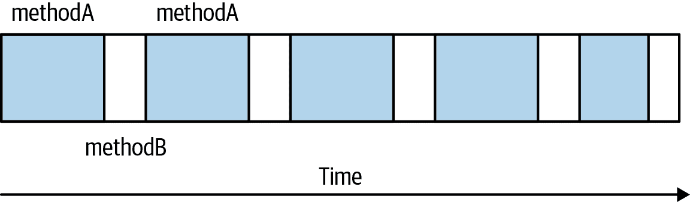
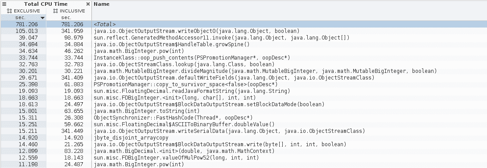

# 第三章. Java 性能工具箱

性能分析关乎于可见性 —— 知道应用程序及其环境内部发生了什么。可见性关乎于工具。因此，性能调优关乎于工具。

在 第二章 中，我们探讨了采用数据驱动方法对性能进行分析的重要性：必须测量应用程序的性能，并理解这些测量数据的含义。性能分析也必须是数据驱动的：必须有关于程序实际运行情况的数据，以便优化其性能。如何获取和理解这些数据是本章的主题。

数百种工具可以提供有关 Java 应用程序正在执行的操作的信息，查看所有这些工具将是不切实际的。许多最重要的工具都随 Java 开发工具包（JDK）提供，尽管这些工具还有其他开源和商业竞争对手，本章主要出于便利性考虑，主要关注 JDK 工具。

# 操作系统工具和分析

程序分析的起点与 Java 无关：它是操作系统自带的一套基本监控工具。在基于 Unix 的系统上，这些工具包括 `sar`（系统账户报告）及其组成部分，如 `vmstat`、`iostat`、`prstat` 等等。Windows 也有图形资源监视器以及像 `typeperf` 这样的命令行实用程序。

每次运行性能测试时，都应从操作系统收集数据。至少应收集关于 CPU、内存和磁盘使用情况的信息；如果程序使用网络，则还应收集关于网络使用情况的信息。如果性能测试是自动化的，这意味着依赖命令行工具（即使在 Windows 上也是如此）。但即使测试是交互式运行的，最好也有一个捕捉输出的命令行工具，而不是仅仅依靠 GUI 图表猜测其含义。在进行分析时，输出始终可以稍后绘制成图表。

## CPU 使用率

首先让我们来监控 CPU 并了解它对 Java 程序的影响。CPU 使用率通常分为两类：用户时间和系统时间（Windows 称之为 *特权时间*）。*用户时间* 是 CPU 执行应用程序代码的时间百分比，而 *系统时间* 是 CPU 执行内核代码的时间百分比。系统时间与应用程序相关；例如，如果应用程序执行 I/O 操作，则内核将执行读取磁盘文件或将缓冲数据写入网络等代码。任何使用底层系统资源的操作都会导致应用程序使用更多的系统时间。

在性能方面的目标是尽可能地提高 CPU 使用率，并尽量缩短时间。这听起来可能有些反直觉；你无疑曾坐在桌面前，看着它因 CPU 使用率达到 100%而奋力运行。因此，让我们考虑一下 CPU 使用率实际上告诉我们什么。

首先要记住的是，CPU 使用率数字是一个时间间隔的平均值 —— 5 秒、30 秒，甚至可能只有 1 秒（虽然实际上不会少于这个）。假设一个程序在执行时的平均 CPU 使用率为 50%，需要 10 分钟才能完成。这意味着 CPU 有一半的时间是空闲的；如果我们重新设计程序，避免空闲段（以及其他瓶颈），我们可以将性能提升一倍，在 5 分钟内运行（CPU 百分之百忙碌）。

如果然后我们改进程序使用的算法，再次提高性能，CPU 仍然在程序完成所需的 2.5 分钟内保持 100%。CPU 使用率数字表明程序有效利用 CPU 的程度，因此数字越高，表明程序利用 CPU 的效率越高。

如果我在我的 Linux 桌面上运行 `vmstat 1`，我会得到一系列的行（每秒钟一行），看起来像这样：

```java
% vmstat 1
procs -----------memory---------- ---swap-- -----io---- -system-- ----cpu----
 r  b   swpd   free   buff  cache   si   so    bi    bo   in   cs us sy id wa
 2  0      0 1797836 1229068 1508276 0    0     0     9 2250 3634 41  3 55  0
 2  0      0 1801772 1229076 1508284 0    0     0     8 2304 3683 43  3 54  0
 1  0      0 1813552 1229084 1508284 0    0     3    22 2354 3896 42  3 55  0
 1  0      0 1819628 1229092 1508292 0    0     0    84 2418 3998 43  2 55  0

```

这个例子来自于运行一个只有一个活动线程的应用程序，这使得示例更容易理解，但即使有多个线程，这些概念也适用。

每秒钟，CPU 忙碌 450 毫秒（42% 的时间执行用户代码，3% 的时间执行系统代码）。同样，CPU 空闲 550 毫秒。CPU 可以因为多种原因而空闲：

+   应用程序可能因为同步原语上的阻塞而无法执行，直到释放该锁。

+   应用程序可能正在等待某些事情，比如等待从数据库调用返回的响应。

+   应用程序可能什么都不需要做。

这两种情况总是表明可以解决的问题。如果可以减少对锁的争用或调整数据库以更快地发送答案回来，那么程序将运行得更快，应用程序的平均 CPU 使用率将上升（当然，前提是没有其他类似问题会继续阻塞应用程序）。

那第三点通常是混淆的根源。如果应用程序有事情要做（并且不因为等待锁或其他资源而被阻止），那么 CPU 将花费周期执行应用程序代码。这是一个通用原则，不特定于 Java。假设你编写一个包含无限循环的简单脚本。当执行该脚本时，它将消耗 CPU 的 100%。以下是在 Windows 中执行的批处理作业：

```java
ECHO OFF
:BEGIN
ECHO LOOPING
GOTO BEGIN
REM We never get here...
ECHO DONE
```

考虑一下，如果此脚本不会消耗 CPU 的 100%，会意味着什么。这将意味着操作系统有其他事情可以做 —— 它可以打印另一行 `LOOPING` —— 但它选择保持空闲。在这种情况下，保持空闲对任何人都没有帮助，如果我们正在进行有用的（耗时的）计算，强制 CPU 定期空闲将意味着需要更长时间才能得到我们想要的答案。

如果在单 CPU 的机器或容器上运行此命令，你很少会注意到它在运行。但是如果尝试启动新程序或计时另一个应用程序的性能，那么你肯定会看到影响。操作系统擅长对竞争 CPU 周期的程序进行时间切片，但新程序将有较少的 CPU 可用，因此运行速度会变慢。有时这种经验会导致人们认为留下一些空闲的 CPU 周期以备其他程序需要时会是个好主意。

但操作系统不能猜测你接下来想要做什么；它（默认情况下）会尽可能执行所有任务，而不是让 CPU 空闲。

### Java 和单 CPU 使用

让我们重新讨论 Java 应用程序的话题——在这种情况下，“周期性，空闲 CPU”是什么意思？这取决于应用程序的类型。如果所讨论的代码是批处理样式应用程序，其工作量是固定的，你不应该看到空闲的 CPU，因为那意味着没有工作要做。提高 CPU 使用率总是批处理作业的目标，因为这样可以更快地完成作业。如果 CPU 已经达到 100%，你仍然可以寻找优化方案，使工作能够更快地完成（同时也尽量保持 CPU 在 100%）。

如果测量涉及接受来自源的服务器样式应用程序的情况，空闲时间可能会发生，因为没有可用的工作：例如，当 Web 服务器处理完所有未完成的 HTTP 请求并等待下一个请求时。这就是平均时间的地方。在执行接收每秒一个请求的服务器时，取样的`vmstat`输出显示应用服务器处理该请求需要 450 毫秒——这意味着 CPU 在 450 毫秒内 100%繁忙，并在 550 毫秒内 0%繁忙。这被报告为 CPU 繁忙 45%。

虽然通常发生在视觉化粒度太小的情况下，但在运行基于负载的应用程序时，CPU 的预期行为是像这样短暂地进行。如果 CPU 每半秒接收一个请求，并且处理请求的平均时间为 225 毫秒，那么从报告中可以看到同样的宏观级别模式：CPU 繁忙 225 毫秒，空闲 275 毫秒，再次繁忙 225 毫秒，空闲 275 毫秒；平均而言，CPU 繁忙 45%，空闲 55%。

如果应用程序经过优化，以便每个请求仅需要 400 毫秒，那么总体 CPU 使用率也会降低（至 40%）。这是唯一的情况，其中降低 CPU 使用率是有意义的 —— 当固定数量的负载进入系统，并且应用程序没有受外部资源限制时。另一方面，该优化还为您提供了向系统添加更多负载的机会，最终增加 CPU 利用率。在微观层面上，在这种情况下进行优化仍然是使 CPU 使用率在短时间内达到 100% 的问题（即执行请求所需的 400 毫秒）——只是 CPU 尖峰的持续时间太短，以至于大多数工具无法有效地注册为 100%。

### Java 和多 CPU 使用

此示例假定一个单线程在单个 CPU 上运行，但是在多个线程在多个 CPU 上运行的一般情况下，概念是相同的。多个线程可以以有趣的方式扭曲 CPU 的平均值 —— 第五章 中展示了多个 GC 线程对 CPU 使用率的影响。但总体上，在多 CPU 机器上的多线程的目标仍然是通过确保单个线程不被阻塞来提高 CPU 使用率，或者在较长时间内降低 CPU 使用率（因为线程已完成其工作并等待更多工作）。

在多线程、多 CPU 的情况下，关于 CPU 可能空闲的一个重要补充是：即使有工作要做，CPU 也可能空闲。这种情况发生在程序中没有可用的线程来处理该工作时。典型情况是一个具有固定大小线程池的应用程序运行各种任务。线程为任务放置到队列中；当线程空闲并且队列中有任务时，线程会接收并执行该任务。然而，每个线程一次只能执行一个任务，如果特定任务阻塞（例如等待来自数据库的响应），则线程在此期间无法执行新任务。因此，有时我们可能会出现有任务要执行（有工作要做），但没有可用线程来执行它们的情况；结果是 CPU 空闲时间。

在特定示例中，应增加线程池的大小。但是，请不要认为仅因为有空闲 CPU 可用，就应增加线程池的大小以完成更多工作。在确定行动方向之前，重要的是了解程序为何未获得 CPU 周期 —— 这可能是由于锁定或外部资源的瓶颈。在确定行动方向之前，了解 *为什么* 程序未获得 CPU 是很重要的。（有关此主题的更多详细信息，请参阅第九章。）

查看 CPU 使用情况是了解应用程序性能的第一步，但仅仅是这样：使用它来查看代码是否使用了预期的所有 CPU，或者是否指向了同步或资源问题。

## CPU 运行队列

Windows 和 Unix 系统都允许您监视可以运行的线程数（这意味着它们没有被 I/O 阻塞、休眠等）。Unix 系统将其称为*运行队列*，几种工具包括其在输出中的运行队列长度。这包括前一节中`vmstat`输出中的数据：每行的第一个数字是运行队列的长度。Windows 将此数字称为*处理器队列*，并通过`typeperf`报告它（除其他方式）：

```java
C:> typeperf -si 1 "\System\Processor Queue Length"
"05/11/2019 19:09:42.678","0.000000"
"05/11/2019 19:09:43.678","0.000000"

```

在这个输出中有一个重要的区别：Unix 系统上的运行队列长度数字（在样本`vmstat`输出中可能是 1 或 2）是所有正在运行或如果有可用 CPU 则可以运行的所有线程的数量。在示例中，始终至少有一个线程想要运行：执行应用程序工作的单个线程。因此，运行队列长度始终至少为 1。请记住，运行队列代表机器上的所有内容，因此有时会有其他线程（来自完全不同的进程）想要运行，这就是为什么在样本输出中运行队列长度有时为 2 的原因。

在 Windows 中，处理器队列长度不包括当前运行的线程数。因此，在`typeperf`的示例输出中，即使机器在运行相同的单线程应用程序且一个线程始终在执行，处理器队列数字也是 0。

如果要运行的线程多于可用的 CPU 数量，性能会开始下降。一般来说，在 Windows 上，您希望处理器队列长度为 0，在 Unix 系统上等于（或少于）CPU 数量。这不是一个硬性规则；系统进程和其他事物会定期出现，并且会短暂地提高该值，而不会对性能造成显著影响。但是，如果运行队列长度在任何显著时间内都过高，这表明机器负载过重，您应该考虑减少机器正在执行的工作量（通过将作业移动到另一台机器或优化代码）。

# 快速总结

+   在查看应用程序性能时，首先要检查的是 CPU 时间。

+   优化代码的目标是使 CPU 使用率提高（并保持较短的时间），而不是降低。

+   在深入尝试调整应用程序之前，了解 CPU 使用率为何低是很重要的。

## 磁盘使用

监控磁盘使用有两个重要目标。第一个与应用程序本身相关：如果应用程序进行大量磁盘 I/O 操作，那么该 I/O 很容易成为瓶颈。

知道磁盘 I/O 何时成为瓶颈是棘手的，因为它取决于应用程序的行为。如果应用程序未有效地缓冲写入磁盘的数据（例如在第十二章中的一个示例中），则磁盘 I/O 统计数据将较低。但是，如果应用程序执行的 I/O 超过磁盘处理能力，磁盘 I/O 统计数据将很高。在任何情况下，都可以改善性能；要注意这两种情况。

一些系统上的基本输入/输出监视器比其他系统更好。以下是 Linux 系统上`iostat`的部分输出：

```java
% iostat -xm 5
avg-cpu:  %user   %nice %system %iowait  %steal   %idle
          23.45    0.00   37.89    0.10    0.00   38.56

          Device:         rrqm/s   wrqm/s     r/s     w/s    rMB/s
          sda               0.00    11.60    0.60   24.20     0.02

          wMB/s avgrq-sz avgqu-sz   await r_await w_await  svctm  %util
          0.14    13.35     0.15    6.06    5.33    6.08   0.42   1.04

```

此应用程序正在向`/dev/sda`磁盘写入数据。乍一看，磁盘统计数据看起来不错。`w_await`——服务每个 I/O 写入的时间——相当低（6.08 毫秒），磁盘只使用了 1.04%。 （对于物理磁盘，这些值的可接受性取决于，但在我台式机系统中的 5200 RPM 磁盘在服务时间低于 15 毫秒时表现良好。）但是有一个线索表明出现了问题：系统花费 37.89%的时间在内核中。如果系统正在进行其他 I/O（在其他程序中），那就没什么问题；但如果所有这些系统时间都来自正在测试的应用程序，那么可能发生了一些效率低下的情况。

系统每秒进行 24.2 次写入是另一个线索：当每秒只写入 0.14 MB（MBps）时，这是很多的。I/O 已经成为瓶颈，下一步将是查看应用程序如何执行其写入操作。

另一方面的问题是，如果磁盘无法跟上 I/O 请求：

```java
% iostat -xm 5
avg-cpu:  %user   %nice %system %iowait  %steal   %idle
          35.05    0.00    7.85   47.89    0.00    9.20

          Device:         rrqm/s   wrqm/s     r/s     w/s    rMB/s
          sda               0.00     0.20    1.00  163.40     0.00

          wMB/s avgrq-sz avgqu-sz   await r_await w_await  svctm  %util
          81.09  1010.19   142.74  866.47   97.60  871.17   6.08 100.00

```

Linux 的好处在于它立即告诉我们磁盘已经 100%利用；它还告诉我们，进程花费 47.89%的时间在`iowait`（即等待磁盘）上。

即使在其他系统上仅有原始数据可用的情况下，这些数据也会告诉我们某些地方出了问题：完成 I/O 的时间（`w_await`）为 871 毫秒，队列大小相当大，磁盘每秒写入 81 MB 的数据。这一切都指向磁盘 I/O 存在问题，并且必须减少应用程序（或可能是系统其他地方）中的 I/O 量。

监控磁盘使用的第二个原因——即使不希望应用程序执行大量 I/O——是为了帮助监视系统是否在交换。计算机有固定数量的物理内存，但它们可以运行使用更大量虚拟内存的应用程序集。应用程序倾向于保留比它们需要的内存更多，并且通常仅在其内存的一个子集上操作。在这两种情况下，操作系统可以将未使用的内存部分保留在磁盘上，并且仅在需要时将其页面化到物理内存中。

大多数情况下，这种内存管理效果良好，特别是对于交互式和 GUI 程序（这很好，否则你的笔记本电脑将需要比它具有的内存多得多）。但对于基于服务器的应用程序来说效果不佳，因为这些应用程序倾向于更多地使用其内存。对于任何类型的 Java 应用程序（包括在桌面上运行的基于 Swing 的 GUI 应用程序），它的表现尤其糟糕，这是由于 Java 堆的存在。有关更多详细信息，请参阅第五章。

系统工具还可以报告系统是否在交换；例如，`vmstat`输出有两列（`si`表示*换入*，`so`表示*换出*），提醒我们系统是否在交换。磁盘活动是另一个指示器，表明可能正在发生交换。请特别注意这些，因为进行交换的系统——将数据页从主内存移动到磁盘，反之亦然——性能会非常差。系统必须配置得使交换永远不会发生。

# 快速总结

+   监控磁盘使用对所有应用程序都很重要。对于不直接写入磁盘的应用程序，系统交换仍然会影响其性能。

+   写入磁盘的应用程序可能会成为瓶颈，因为它们写入数据的效率低（吞吐量太低）或者因为它们写入了太多的数据（吞吐量太高）。

## 网络使用情况

如果您正在运行使用网络的应用程序，例如 REST 服务器，您必须监视网络流量。网络使用类似于磁盘流量：应用程序可能在不高效地使用网络，以致带宽过低，或者写入到特定网络接口的数据总量可能超过接口能够处理的能力。

不幸的是，标准系统工具并不理想用于监控网络流量，因为它们通常只显示发送和接收到特定网络接口上的数据包数和字节数。这是有用的信息，但它并不能告诉我们网络是过度利用还是不足利用。

在 Unix 系统上，基本的网络监控工具是`netstat`（在大多数 Linux 发行版上，甚至没有包含`netstat`，必须单独获取）。在 Windows 上，可以在脚本中使用`typeperf`来监视网络使用情况，但这里有一个情况，图形用户界面具有优势：标准的 Windows 资源监视器将显示一个图表，显示网络使用情况的百分比。不幸的是，在自动化性能测试场景中，GUI 帮助不大。

幸运的是，许多开源和商业工具可以监控网络带宽。在 Unix 系统上，一个流行的命令行工具是[`nicstat`](http://sourceforge.net/projects/nicstat)，它显示每个接口的流量摘要，包括接口利用率的程度：

```java
% nicstat 5
Time      Int       rKB/s   wKB/s   rPk/s   wPk/s   rAvs    wAvs   %Util  Sat
17:05:17  e1000g1   225.7   176.2   905.0   922.5   255.4   195.6  0.33   0.00

```

`e1000g1`接口是一个 1,000 MB 接口；在本例中没有被充分利用（0.33%）。这类工具（以及类似工具）的用处在于计算接口的利用率。在这个输出中，正在写入 225.7 Kbps 的数据，并且正在读取 176.2 Kbps 的数据。对于 1,000 MB 网络进行除法运算得到 0.33%的利用率数字，`nicstat`工具能够自动确定接口的带宽。

类似`typeperf`或`netstat`的工具会报告读取和写入的数据量，但要想计算网络利用率，必须确定接口的带宽并在您自己的脚本中执行计算。请记住，带宽以每秒位数（bps）为单位测量，尽管工具通常报告每秒字节（Bps）。一个 1,000 兆比特网络每秒产生 125 兆字节（MB）。在这个例子中，读取了 0.22 MBps，写入了 0.16 MBps；将它们相加并除以 125 得到 0.33%的利用率。因此，`nicstat`（或类似工具）并非魔术，它们只是使用起来更加方便。

网络无法持续 100%的利用率。对于局域以太网网络，持续超过 40%的利用率表示接口已饱和。如果网络是分组交换的或者使用不同的介质，则可能的最大持续速率将不同；请咨询网络架构师确定合适的目标。这个目标与 Java 无关，Java 只会使用操作系统的网络参数和接口。

# 快速总结

+   对于基于网络的应用程序，请监视网络，确保它没有成为瓶颈。

+   写入网络的应用程序可能会因为数据写入效率低（吞吐量太少）或者写入数据过多（吞吐量过高）而成为瓶颈。

# Java 监控工具

要深入了解 JVM 本身，需要使用 Java 监控工具。这些工具包含在 JDK 中：

`jcmd`

打印 Java 进程的基本类、线程和 JVM 信息。这适合在脚本中使用；它是这样执行的：

```java
% jcmd process_id command optional_arguments

```

提供`help`命令将列出所有可能的命令，并提供`help <*command*>`命令将给出特定命令的语法。

`jconsole`

提供了 JVM 活动的图形视图，包括线程使用情况、类使用情况和 GC 活动。

`jmap`

提供了堆转储和有关 JVM 内存使用的其他信息。适合脚本编写，虽然堆转储必须在后处理工具中使用。

`jinfo`

提供了对 JVM 系统属性的可见性，并允许动态设置一些系统属性。适合脚本编写。

`jstack`

转储 Java 进程的堆栈。适合脚本编写。

`jstat`

提供 GC 和类加载活动的信息。适合脚本编写。

`jvisualvm`

一个 GUI 工具用于监视 JVM、分析运行中的应用程序，并分析 JVM 堆转储（尽管 `jvisualvm` 也可以从活动程序中获取堆转储）。

所有这些工具都可以轻松地从与 JVM 相同的机器上运行。如果 JVM 在 Docker 容器内运行，则非图形化工具（即除了 `jconsole` 和 `jvisualvm` 外的工具）可以通过 `docker exec` 命令运行，或者如果您使用 `nsenter` 进入 Docker 容器。无论哪种情况，都假定您已将这些工具安装到 Docker 镜像中，这绝对是推荐的做法。通常会将 Docker 镜像简化为应用程序的基本需求，因此仅包括 JRE，但在生产中迟早需要了解该应用程序的内部情况，因此最好在 Docker 镜像中包含必要的工具（这些工具与 JDK 捆绑在一起）。

`jconsole` 需要相当数量的系统资源，因此在生产系统上运行它可能会干扰该系统。您可以设置 `jconsole` 以便可以在本地运行并附加到远程系统，这样不会影响远程系统的性能。在生产环境中，这需要安装证书以使 `jconsole` 能够通过 SSL 运行，并设置安全认证系统。

这些工具适用于以下广泛领域：

+   基本 VM 信息

+   线程信息

+   类信息

+   实时 GC 分析

+   堆转储后处理

+   对 JVM 进行性能分析

正如您可能注意到的那样，在这里没有一一对应的映射；许多工具在多个领域执行功能。因此，我们不会单独探讨每个工具，而是看看对于 Java 重要的可见性功能区域，并讨论各种工具如何提供这些信息。沿途我们会讨论其他工具（一些开源的，一些商业的），它们提供相同基本功能但具有优于基本 JDK 工具的优势。

## 基本 VM 信息

JVM 工具可以提供有关正在运行的 JVM 进程的基本信息：它已运行多长时间，正在使用哪些 JVM 标志，JVM 系统属性等等：

运行时间

可以通过以下命令找到 JVM 已运行时间：

```java
% jcmd process_id VM.uptime

```

系统属性

可以用以下任一命令显示`System.getProperties()`中的项目集合：

```java
% jcmd process_id VM.system_properties

```

或

```java
% jinfo -sysprops process_id

```

这包括通过 `-D` 选项在命令行上设置的所有属性，应用程序动态添加的任何属性，以及 JVM 的默认属性集。

JVM 版本

获取 JVM 版本的方法如下：

```java
% jcmd process_id VM.version

```

JVM 命令行

命令行可以在 `jconsole` 的 VM 概要选项卡中显示，或者通过 `jcmd`：

```java
% jcmd process_id VM.command_line

```

JVM 调优标志

可以通过以下方式获取应用程序的调优标志：

```java
% jcmd process_id VM.flags [-all]

```

### 使用调优标志

JVM 可以提供许多调整标志，并且其中许多标志是本书的重点关注对象。跟踪这些标志及其默认值可能有些令人生畏；这些`jcmd`的最后两个示例对此非常有用。`command_line`命令显示在命令行上直接指定的标志。`flags`命令显示在命令行上设置的标志，以及 JVM 直接设置的一些标志（因为它们的值是按人体工程学确定的）。包括`-all`选项会列出 JVM 中的每个标志。

存在数百个 JVM 调整标志，其中大多数是晦涩的；建议大多数标志永远不要更改（请参阅“信息过载？”）。在诊断性能问题时，确定哪些标志生效是一个常见的任务，`jcmd`命令可以为正在运行的 JVM 执行此操作。通常，您更愿意了解特定 JVM 的特定于平台的默认值，在这种情况下，在命令行上使用`-XX:+PrintFlagsFinal`选项更有用。这样做的最简单方法是执行此命令：

```java
% java *`other_options`* -XX:+PrintFlagsFinal -version
...Hundreds of lines of output, including...
uintx InitialHeapSize                          := 4169431040     {product}
intx InlineSmallCode                           = 2000            {pd product}

```

因为设置某些选项（特别是设置与 GC 相关的标志时）将影响其他选项的最终值，因此应在命令行中包含您打算使用的任何其他选项。这将打印出 JVM 标志及其值的完整列表（与为实时 JVM 使用`jcmd`的`VM.flags -all`选项打印的内容相同）。

这些命令的标志数据以两种方式之一打印出来。包含输出的第一行的冒号表示正在使用标志的非默认值。这可能是因为以下原因：

+   标志的值是在命令行上直接指定的。

+   某些其他选项间接地改变了该选项。

+   JVM 按人体工程学计算了默认值。

第二行（没有冒号）表示该值是此版本 JVM 的默认值。某些标志的默认值在不同平台上可能不同，这在输出的最后一列中显示。`product`表示该标志的默认设置在所有平台上是统一的；`pd product`表示该标志的默认设置是依赖于平台的。

最后一列的其他可能值包括`manageable`（标志的值可以在运行时动态更改）和`C2 diagnostic`（该标志为编译器工程师提供诊断输出，以了解编译器的功能）。

另一种查看正在运行的应用程序的信息的方法是使用`jinfo`。`jinfo`的优点在于它允许在程序执行过程中更改某些标志值。

这里是如何检索进程中所有标志的值：

```java
% jinfo -flags process_id

```

使用 `-flags` 选项，`jinfo` 将提供关于所有标志的信息；否则，它仅打印命令行指定的标志。任一命令的输出不如 `-XX:+PrintFlagsFinal` 选项易读，但 `jinfo` 还有其他需要注意的功能。

`jinfo` 可以检查单个标志的值：

```java
% jinfo -flag PrintGCDetails process_id
-XX:+PrintGCDetails

```

虽然 `jinfo` 本身不指示标志是否可管理，但是可以通过 `jinfo` 打开或关闭可管理的标志（在使用 `PrintFlagsFinal` 参数时识别）：

```java
% jinfo -flag -PrintGCDetails process_id  # turns off PrintGCDetails
% jinfo -flag PrintGCDetails process_id
-XX:-PrintGCDetails

```

请注意，在 JDK 8 中，`jinfo` 可以更改任何标志的值，但这并不意味着 JVM 将响应该更改。例如，大多数影响 GC 算法行为的标志在启动时用于确定收集器行为的各种方式。稍后通过 `jinfo` 改变标志并不会导致 JVM 更改其行为；它将根据算法初始化时的方式继续执行。因此，此技术仅适用于在 `PrintFlagsFinal` 命令的输出中标记为 `manageable` 的那些标志。在 JDK 11 中，如果尝试更改不能更改的标志的值，`jinfo` 将报告错误。

# 快速总结

+   `jcmd` 可用于查找正在运行应用程序的基本 JVM 信息，包括所有调整标志的值。

+   可通过在命令行中包含 `-XX:+PrintFlagsFinal` 来查找默认标志值。这对于确定特定平台上标志的默认人体工程学设置非常有用。

+   `jinfo` 用于检查（在某些情况下更改）单个标志非常有用。

## 线程信息

`jconsole` 和 `jvisualvm` 实时显示应用程序中运行的线程数量信息。查看运行线程的堆栈可以帮助确定它们是否被阻塞。可以通过 `jstack` 获取堆栈信息：

```java
% jstack process_id
... Lots of output showing each thread's stack ...

```

可以通过 `jcmd` 获取堆栈信息：

```java
% jcmd process_id Thread.print
... Lots of output showing each thread's stack ...

```

更多关于监控线程堆栈的细节，请参阅 第九章。

## 类信息

可以通过 `jconsole` 或 `jstat` 获取应用程序使用的类数量信息。`jstat` 还可以提供有关类编译的信息。

更多关于应用程序类使用情况的细节，请参阅 第十二章，关于监视类编译的细节，请参阅 第四章。

## 实时 GC 分析

几乎每个监控工具都会报告有关 GC 活动的信息。`jconsole` 显示堆使用情况的实时图表；`jcmd` 允许执行 GC 操作；`jmap` 可以打印堆摘要或永久代信息，或者创建堆转储；而 `jstat` 提供了许多关于垃圾收集器活动的视图。

查看 第五章 以获取这些程序监控 GC 活动的示例。

## 堆转储后处理

堆转储可以通过`jvisualvm` GUI 或从命令行使用`jcmd`或`jmap`来捕获。*堆转储*是堆的快照，可以用各种工具分析，包括`jvisualvm`。堆转储处理是第三方工具传统上领先于 JDK 提供的一个领域，因此第七章使用第三方工具——Eclipse Memory Analyzer Tool (mat)——提供堆转储后处理的示例。

# 性能分析工具

*性能分析工具*是性能分析师工具箱中最重要的工具。Java 有许多性能分析工具，各有优缺点。性能分析是一个通常有意义使用不同工具的领域——特别是采样分析器。采样分析器倾向于以不同方式显示问题，因此在某些应用程序上可以更好地找出性能问题，但在其他应用程序上则可能更糟糕。

许多常见的 Java 性能分析工具本身是用 Java 编写的，并通过“附加”到要分析的应用程序来工作。此附加是通过套接字或通过称为 JVM 工具接口（JVMTI）的本机 Java 接口进行的。然后目标应用程序和性能分析工具交换关于目标应用程序行为的信息。

这意味着您必须像调整任何其他 Java 应用程序一样注意调整性能分析工具。特别是，如果被分析的应用程序很大，它可能会向性能分析工具传输大量数据，因此性能分析工具必须具有足够大的堆来处理数据。同时运行性能分析工具和并发 GC 算法通常是个好主意；性能分析工具中的不适时的全 GC 暂停可能导致保存数据的缓冲区溢出。

## 采样分析器

分析有两种模式：采样模式或插装模式。*采样模式*是基本的分析模式，开销最小。这很重要，因为分析的一个陷阱是通过引入测量到应用程序中，改变了其性能特征。¹ 限制分析的影响将导致更接近应用程序在通常情况下行为的结果。

不幸的是，采样分析器可能会遭受各种错误。采样分析器在定时器定期触发时工作；然后分析器查看每个线程并确定线程正在执行的方法。该方法则被认为自上次定时器触发以来已执行。

最常见的采样错误由图 3-1 说明。这里的线程在执行`methodA`（显示为阴影条）和`methodB`（显示为清晰条）之间交替。如果计时器只在线程恰好在`methodB`时触发，配置文件将报告线程花费所有时间执行`methodB`；实际上，更多的时间实际上是花在`methodA`上的。



###### 图 3-1\. 替代方法执行

这是最常见的采样错误，但绝不是唯一的。减少此错误的方法是在较长的时间段内进行分析，并减少样本之间的时间间隔。减少样本间隔对减少分析对应用程序的影响目标是适得其反的；这里存在一种平衡。分析工具在解决这种平衡时的方法各不相同，这是一个分析工具可能报告的数据与另一个工具大相径庭的原因之一。

这种错误是所有采样分析器固有的，但在许多 Java 分析器中（尤其是旧版本中）更为严重。这是由于*安全点偏差*。在分析器的常见 Java 接口中，只有线程在安全点时分析器才能获取线程的堆栈跟踪。当线程处于以下状态时，线程会自动进入安全点：

+   阻塞在同步锁上

+   阻塞等待 I/O

+   阻塞等待监视器

+   停放

+   执行 Java Native Interface (JNI) 代码（除非它们执行 GC 锁定功能）

此外，JVM 可以设置一个标志，要求线程进入安全点。代码用于检查此标志（如有必要，在某些内存分配或在编译代码的循环或方法转换期间插入到 JVM 代码中）。没有规范指示这些安全点检查何时发生，它们在发布版本之间有所不同。

这种安全点偏差对采样分析器的影响可以是深远的：因为只有线程在安全点时才能对栈进行采样，所以采样变得更加不可靠。在图 3-1 中，如果没有安全点偏差的随机分析器可能很难仅在`methodB`执行时触发线程采样。但是有了安全点偏差，更容易看到`methodA`永远不进入安全点的情况，因此所有工作都计入`methodB`。

Java 8 为工具提供了一种不同的方式来收集堆栈跟踪信息（这也是较旧的工具存在安全点偏差的一个原因，而较新的工具则倾向于没有安全点偏差，尽管这需要较新的工具重写以使用新的机制）。在编程术语中，这是通过使用`AsyncGetCallTrace`接口来完成的。使用此接口的分析器通常被称为*异步分析器*。这里的*异步*指的是 JVM 提供堆栈信息的方式，并不是指分析工具的工作方式；它被称为*异步*是因为 JVM 可以在任何时间点提供堆栈信息，而不必等待线程达到（同步的）安全点。

使用此异步接口的分析器比其他采样分析器具有更少的采样伪像（尽管它们仍然会受到类似于图 3-1 中错误的影响）。异步接口在 Java 8 中被公开，但在此之前作为私有接口存在很长一段时间。

图 3-2 显示了一个基本的采样分析报告，用于测量提供来自第二章描述的应用程序的样本股票数据的 REST 服务器的性能。 REST 调用配置为返回包含股票对象的压缩序列化形式的字节流（这是我们将在第十二章中探讨的示例的一部分）。我们将在本节中的示例中使用该示例程序。



###### 图 3-2\. 采样分析报告示例

此截图来自 Oracle Developer Studio 分析器。该工具使用异步分析接口，尽管通常不被称为异步分析器（可能是由于历史原因，因为它在该接口是私有的时候开始使用该接口，因此早于异步分析器术语的流行使用）。它提供了对数据的各种视图；在这个视图中，我们看到消耗最多 CPU 周期的方法。其中一些方法与对象序列化有关（例如，`ObjectOutputStream.writeObject0()`方法），而许多方法与计算实际数据有关（例如，`Math.pow()`方法）。² 尽管如此，对象序列化在这个分析中占据主导地位；为了提高性能，我们需要改进序列化性能。

请仔细注意最后一句话：需要改进的是序列化的性能，而不是`writeObject0()`方法本身的性能。在查看分析报告时的常见假设是优化应从分析报告中排名靠前的方法开始。然而，这种方法通常过于局限。在这种情况下，`writeObject0()`方法是 JDK 的一部分；不会通过重写 JVM 来改进其性能。但是我们从分析报告中知道，序列化路径是我们性能瓶颈所在的地方。

因此，概要中的顶部方法应该指向您搜索优化区域的位置。性能工程师不会尝试使 JVM 方法更快，但他们可以找出如何加速对象序列化。

我们可以以两种额外的方式可视化抽样输出；两者都直观地显示调用堆栈。最新的方法称为*火焰图*，它是应用程序内调用堆栈的交互式图表。

图 3-3 展示了使用开源 [`async-profiler` 项目](https://oreil.ly/DbNSL) 的一部分火焰图。火焰图是方法使用大量 CPU 的自下而上图表。在图的这一部分中，`getStockObject()` 方法占据了所有时间。大约 60% 的时间花费在 `writeObject()` 调用中，而 40% 的时间花费在 `StockPriceHistoryImpl` 对象的构造函数中。类似地，我们可以查看每个方法的堆栈并找到性能瓶颈。图本身是交互式的，因此您可以单击行并查看有关方法的信息，包括被截断的完整名称、CPU 周期等。

较旧（尽管仍然有用）的性能可视化方法是一种自上而下的方法，称为*调用树*。图 3-4 展示了一个示例。


###### 图 3-3\. 来自抽样分析器的火焰图


###### 图 3-4\. 来自抽样分析器的调用树

在这种情况下，我们从顶部开始具有类似的数据：100% 的时间中，`Errors.process()` 方法及其后继消耗了 44%。然后我们深入到父级并查看其子级在哪里花费时间。例如，在`getStockObject()` 方法中，总时间的 17% 中，10% 的时间花费在 `writeObject0` 中，7% 在构造函数中。

# 快速总结

+   基于抽样的分析器是最常见的一种分析器。

+   由于其相对较低的性能影响，抽样分析器引入较少的测量工件。

+   使用可以进行异步堆栈收集的抽样分析器将减少测量工件。

+   不同的抽样配置表现不同；每种对特定应用程序可能更好。

## 仪器化分析器

*仪器化的分析器*比抽样分析器更具侵入性，但它们也可以提供关于程序内部操作的更多有益信息。

插装分析器通过修改类加载时的字节码序列（插入代码来计算调用次数等）来工作。它们更有可能在应用程序中引入性能差异，而不是采样分析器。例如，JVM 会内联小方法（见第四章），这样在执行小方法代码时就不需要方法调用。编译器根据代码的大小来做出这个决定；根据代码的插装方式，可能不能再内联。这可能导致插装分析器高估某些方法的贡献。内联只是编译器根据代码布局做出的一个决定的示例；一般来说，代码插装（修改）越多，执行配置文件的概率就会更高。

由于插装引入的代码更改，最好将其用于少数几个类。这意味着最好用于二级分析：采样分析器可以指向一个包或代码段，然后如果需要，可以使用插装分析器来深入分析该代码。

图 3-5 使用一个插装分析器（不使用异步接口）来查看样本 REST 服务器。


###### 图 3-5\. 插装分析的一个示例

这个分析器与其他分析器有几点不同。首先，主要时间归因于`writeObject()`方法，而不是`writeObject0()`方法。这是因为私有方法在检测中被过滤掉了。其次，实体管理器中出现了一个新方法；在采样情况下，这个方法内联到构造函数中，所以之前没有出现。

但这种类型的分析更重要的是调用次数：我们对那个实体管理器方法进行了惊人的 3300 万次调用，以及对计算随机数进行了 1.66 亿次调用。通过减少这些方法的总调用次数，我们可以获得更大的性能提升，而不是加快它们的执行速度，但如果没有插装计数，我们可能不会知道这一点。

这种分析比采样版本更好吗？这取决于情况；在特定情况下，没有办法知道哪个分析更准确。插装分析的调用次数肯定是准确的，这些额外信息通常有助于确定代码在哪里花费了更多时间，以及哪些优化更有价值。

在这个例子中，无论是插装还是采样的分析器，都指向了代码的同一大致区域：对象序列化。实际上，不同的分析器可能指向完全不同的代码区域。分析器是良好的估算工具，但它们只是在估算：它们有时候会出错。

# 快速总结

+   工具化的性能分析器提供了关于应用程序更多的信息，但可能对应用程序的影响大于采样分析器。

+   工具化的性能分析器应设置为仪器化代码的小部分——几个类或包。这限制了它们对应用程序性能的影响。

## 阻塞方法和线程时间轴

图 3-6 展示了使用不同工具化分析器——内置于 `jvisualvm` 的分析器——的 REST 服务器。现在执行时间主要由 `select()` 方法（以及 `TCPTransport` 连接处理器的 `run()` 方法）主导。


###### 图 3-6\. 带有阻塞方法的分析

这些方法（以及类似的阻塞方法）不消耗 CPU 时间，因此它们不会增加应用程序的整体 CPU 使用率。它们的执行不能必然优化。应用程序中的线程并非在 `select()` 方法中执行代码 673 秒；它们在等待选择事件发生 673 秒。

因此，大多数性能分析器不会报告被阻塞的方法；这些线程被显示为空闲状态。在这个特定示例中，这是件好事。线程在 `select()` 方法中等待，因为没有数据流入服务器；它们并不低效。这是它们的正常状态。

在其他情况下，确实希望看到在这些阻塞调用中花费的时间。线程在 `wait()` 方法内等待——等待另一个线程通知它——是许多应用程序整体执行时间的重要决定因素。大多数基于 Java 的性能分析器具有可以调整以显示或隐藏这些阻塞调用的过滤集和其他选项。

或者，通常更有成效的是检查线程的执行模式，而不是分析器将时间归因于阻塞方法本身。图 3-7 展示了来自 Oracle Developer Studio 分析工具的线程显示。


###### 图 3-7\. 线程时间轴分析

这里每个水平区域都是一个不同的线程（因此图中显示了九个线程：从线程 1.14 到线程 1.22）。彩色（或不同灰度）条代表不同方法的执行；空白区域表示线程未执行的地方。从高层次来看，观察到线程 1.14 执行了代码，然后等待某些事情。

还要注意空白区域，看不到任何线程在执行。这张图片只显示了应用程序中的九个线程中的九个，因此可能是这些线程在等待其他线程做某事，或者线程可能正在执行一个阻塞的 `read()` （或类似的）调用。

# 快速总结

+   阻塞的线程可能或可能不是性能问题的源头；有必要检查它们为何被阻塞。

+   阻塞线程可以通过阻塞方法或线程的时间轴分析来识别。

## 本地分析器

像 `async-profiler` 和 Oracle Developer Studio 这样的工具除了可以分析 Java 代码外，还能够分析本地代码。这有两个优点。

首先，在本地代码中进行重要操作，包括在本地库和本地内存分配中。在 第八章 中，我们将使用本地分析器查看一个导致真实问题的本地内存分配示例。使用本地分析器快速定位了根本原因。

其次，我们通常进行分析以找出应用程序代码中的瓶颈，但有时本地代码意外地占主导地位。我们更愿意通过检查 GC 日志（正如我们将在 第六章 中所做的那样）来发现我们的代码在 GC 中花费了过多时间，但如果忘记了这条路径，一个理解本地代码的分析器将迅速显示出我们在 GC 中花费了过多的时间。同样地，我们通常会限制分析到程序热身后的时期，但如果编译线程（第四章）正在运行并且消耗了过多的 CPU，一个支持本地代码的分析器将显示给我们。

当你查看我们示例 REST 服务器的火焰图时，为了可读性只展示了一小部分。图 3-8 显示了整个图。

在图表的底部有五个组件。前两个（来自 JAX-RS 代码）是应用线程和 Java 代码。第三个是进程的 GC，第四个是编译器。³


###### 图 3-8\. 包含本地代码的火焰图

# 快速总结

+   本地分析器提供了对 JVM 代码和应用程序代码的可见性。

+   如果本地分析器显示 GC 占用 CPU 使用时间过多，则调整收集器是正确的做法。然而，如果显示编译线程占用了显著的时间，则通常不会影响应用程序的性能。

# Java 飞行记录器

*Java 飞行记录器*（JFR）是 JVM 的一个特性，它在应用程序运行时执行轻量级性能分析。顾名思义，JFR 数据是 JVM 中事件的历史记录，可用于诊断 JVM 的过去性能和操作。

JFR 最初是 BEA Systems 的 JRockit JVM 的一个特性。最终它进入了 Oracle 的 HotSpot JVM；在 JDK 8 中，只有 Oracle JVM 支持 JFR（并且仅许 Oracle 客户使用）。然而，在 JDK 11 中，JFR 可在包括 AdoptOpenJDK JVM 在内的开源 JVM 中使用。由于 JDK 11 中的 JFR 是开源的，因此有可能将其移植回 JDK 8 的开源版本中，因此 AdoptOpenJDK 和其他 JDK 8 的版本可能会在未来某天包含 JFR（尽管至少在 8u232 中尚未如此）。

JFR 的基本操作是启用一组事件（例如，一个事件是线程因等待锁而阻塞），每次发生选定的事件时，都会保存关于该事件的数据（保存在内存中或文件中）。数据流保存在循环缓冲区中，因此只有最近的事件可用。然后，您可以使用工具显示这些事件——从实时 JVM 中获取或从保存的文件中读取——并对这些事件进行分析以诊断性能问题。

所有这些——事件的类型、循环缓冲区的大小、存储位置等等——都通过 JVM 的各种参数或在程序运行时通过工具（包括 `jcmd` 命令）来控制。默认情况下，JFR 被设置为具有非常低的开销：对程序性能影响低于 1%。随着启用更多事件、更改事件报告阈值等，此开销将发生变化。所有这些配置的详细信息将在本节后面讨论，但首先我们将研究这些事件显示看起来如何，因为这样更容易理解 JFR 的工作原理。

## Java Mission Control

检查 JFR 记录的通常工具是 *Java Mission Control*（`jmc`），尽管存在其他工具，并且您可以使用工具包编写自己的分析工具。在全面转向全开源 JVM 过程中，`jmc` 已从 OpenJDK 源代码库中移出，并成为一个独立的项目。这使得 `jmc` 可以按独立的发布时间表和路径进行演化，尽管最初可能处理独立的发布有点令人困惑。

在 JDK 8 中，`jmc` 版本 5 随 Oracle 的 JVM 捆绑提供（这是唯一支持 JFR 的 JVM）。JDK 11 可以使用 `jmc` 版本 7，尽管目前必须从 [OpenJDK 项目页面](http://openjdk.java.net/projects/jmc) 获取二进制文件。计划是最终 JDK 构建将使用并捆绑适当的 `jmc` 二进制文件。

Java Mission Control 程序（`jmc`）启动一个窗口，显示机器上的 JVM 进程，并允许您选择一个或多个进程进行监视。图 3-9 显示了 Java Mission Control 监视我们示例 REST 服务器的 Java 管理扩展（JMX）控制台。


###### 图 3-9\. Java Mission Control 监视

此显示展示了 Java Mission Control 正在监控的基本信息：CPU 使用率、堆使用率和 GC 时间。不过，请注意，CPU 图表包含了机器上的总 CPU 使用情况。JVM 本身正在使用约 38% 的 CPU，尽管机器上所有进程总共占用了约 60% 的 CPU。这是监控的一个关键特性：通过 JMX 控制台，Java Mission Control 能够监控整个系统，而不仅仅是所选择的 JVM。上部的仪表板可以配置为显示 JVM 信息（关于 GC、类加载、线程使用、堆使用等各种统计信息）以及特定于操作系统的信息（总机器 CPU 和内存使用情况、交换、负载平均值等等）。

与其他监控工具一样，Java Mission Control 可以调用 Java 管理扩展（JMX）调用，访问应用程序可用的任何托管 bean。

## JFR 概述

通过适当的工具，我们可以深入了解 JFR 的工作原理。此示例使用从我们的 REST 服务器获取的 JFR 记录，持续时间为 6 分钟。当记录加载到 Java Mission Control 中时，它首先显示的是基本的监控概述（图 3-10）。


###### 图 3-10\. Java Flight Recorder 概述

此显示类似于 Java Mission Control 在进行基本监控时显示的内容。在显示 CPU 和堆使用率的仪表之上是事件时间轴（由一系列垂直条表示）。时间轴允许我们放大到特定感兴趣的区域；虽然在此示例中，录制持续了 6 分钟，但我放大到了录制末尾附近的 38 秒间隔。

此 CPU 使用率图更清楚地显示了发生的情况：REST 服务器位于图表底部（平均使用率约为 20%），整机的 CPU 使用率为 38%。底部还有其他选项卡，允许我们探索有关系统属性以及 JFR 记录制作方式的信息。窗口左侧的图标更加有趣：这些图标提供了对应用程序行为的可见性。

### JFR 内存视图

此处收集的信息非常广泛。图 3-11 显示了内存视图的一个面板。


###### 图 3-11\. Java Flight Recorder 内存面板

该图显示，由于年轻代被清除（同时我们看到堆在此期间总体上是增长的：从约 340 MB 开始，最终约为 2 GB），内存波动相当规律。左下角面板显示了记录期间发生的所有收集事件，包括它们的持续时间和收集类型（在此示例中始终是 `ParallelScavenge`）。当选择其中一个事件时，右下角面板进一步详细显示了该收集的所有特定阶段及其持续时间。

此页面上的各个标签提供了丰富的其他信息：清除引用对象的时间和数量，是否存在并发收集器的提升或疏散失败，GC 算法本身的配置（包括代的大小和幸存者空间配置），甚至是分配的特定类型对象的信息。当您阅读第五章和第六章时，请记住这个工具如何诊断讨论的问题。如果您需要理解为什么 G1 GC 收集器退出并执行了全局 GC（是由于提升失败吗？），JVM 如何调整终身阈值，或者关于 GC 行为如何以及为什么的任何其他数据，JFR 都能告诉您。

### JFR 代码视图

Java Mission Control 中的 Code 页面显示了来自记录的基本分析信息（图 3-12）。


###### 图 3-12\. Java Flight Recorder Code 面板

此页面上的第一个标签显示了按包名称聚合的信息，这是许多分析工具中找不到的有趣功能。在底部，其他标签呈现了受分析代码的热点方法和调用树的传统概要视图。

与其他分析工具不同，JFR 提供了进入代码的其他可见性模式。异常标签提供了对应用程序异常处理的视图（第 12 章讨论为什么过度异常处理对性能不利）。其他标签提供了关于编译器正在执行的内容的信息，包括对代码缓存的视图（参见 第 4 章）。

另一方面，请注意，这里的包在我们之前查看的分析中并没有真正显示出来；反之，我们之前看到的热点在这里也没有出现。由于它设计为具有非常低的开销，JFR 的配置（至少在默认配置中）的性能抽样相当低，因此与更入侵性的抽样相比，这些分析结果并不那么精确。

这类似的显示还有其他，比如线程、I/O 和系统事件，但大多数情况下，这些显示只是提供了 JFR 记录中实际事件的良好视图。

### JFR 事件概述

JFR 生成一系列事件作为记录保存。迄今为止看到的显示提供了这些事件的视图，但查看事件本身面板是最强大的方式，如图 3-13 所示。


###### 图 3-13\. Java Flight Recorder Event 面板

此窗口左侧面板可筛选要显示的事件；这里选择了应用级和 JVM 级事件。请注意，在录制时，仅包括特定类型的事件：在此时，我们正在进行后处理筛选（下一节将展示如何筛选录制中包含的事件）。

在这个示例中的 34 秒间隔内，应用程序从 JVM 生成了 878 个事件和从 JDK 库生成了 32 个事件，并且在此期间生成的事件类型显示在窗口底部附近。当我们使用分析器查看这个示例时，我们看到为什么该示例的线程停靠和监视器等待事件会很高；这些可以忽略（并且这里在左侧面板中过滤掉了线程停靠事件）。那么其他事件呢？

在 34 秒的时间段内，应用程序中的多个线程花费了 34 秒来读取套接字。这个数字听起来不好，特别是因为它只有在套接字读取时间超过 10 毫秒时才会在 JFR 中显示出来。我们需要进一步研究这一点，可以通过访问图 3-14 中显示的日志选项卡来完成。


###### 图 3-14\. Java 飞行记录器事件日志面板

值得注意的是要查看与这些事件相关的跟踪，但事实证明，有几个线程使用阻塞 I/O 读取预期定期到达的管理请求。在这些请求之间——长时间的周期内——线程将阻塞在 `read()` 方法上。所以这里的读取时间是可以接受的：就像使用分析器时一样，你需要确定大量阻塞 I/O 的线程是预期的还是表示性能问题。

这留下了监视器阻塞事件。正如第 9 章中讨论的那样，对于锁的争用经历了两个级别：首先线程在等待锁时会自旋，然后它会使用（在称为*锁膨胀*的过程中）一些 CPU 和操作系统特定的代码来等待锁。标准的分析器可以提供关于这种情况的线索，因为自旋时间包含在方法的 CPU 时间中。本地分析器可以提供关于受膨胀影响的锁的信息，但这可能是有或无的。然而，JVM 可以直接向 JFR 提供所有这些数据。

在第 9 章中展示了使用锁可见性的示例，但关于 JFR 事件的一般结论是，由于它们直接来自 JVM，它们提供了其他任何工具都无法提供的应用程序可见性。在 Java 11 中，大约可以通过 JFR 监控 131 种事件类型。确切的事件数量和类型会因版本而略有不同，但以下列表详细说明了一些更有用的事件类型。

下面列表中的每个事件类型显示两个项目符号。事件可以收集基本信息，这些信息可以使用像`jconsole`和`jcmd`这样的其他工具收集；这类信息在第一个项目符号中描述。第二个项目符号描述事件提供的难以在 JFR 之外获得的信息。

类加载

+   装载和卸载的类的数量

+   装载类的类加载器；加载单个类所需的时间

线程统计

+   创建和销毁的线程数量；线程转储

+   哪些线程被锁定在锁上（以及它们被锁定的具体锁）

可抛出对象

+   应用程序使用的可抛出类

+   抛出的异常和错误的数量及其创建时的堆栈跟踪

TLAB 分配

+   堆中分配的次数和线程本地分配缓冲区（TLAB）的大小

+   分配在堆中的特定对象及其分配位置的堆栈跟踪

文件和套接字 I/O

+   执行 I/O 操作的时间

+   每次读取/写入调用所花费的时间，以及长时间读取或写入的特定文件或套接字

阻塞的监视器

+   等待监视器的线程

+   特定线程在特定监视器上的阻塞以及它们被阻塞的时间长度

代码缓存

+   代码缓存的大小及其所包含的内容量

+   从代码缓存中删除的方法；代码缓存配置

代码编译

+   编译的方法，栈上替换（OSR）编译（参见第四章），以及编译所需的时间

+   没有特定于 JFR 的内容，但统一了来自多个来源的信息

垃圾回收

+   GC 的时间，包括各个阶段的时间；各代的大小

+   没有特定于 JFR 的内容，但统一了来自多个工具的信息

分析

+   仪器化和采样分析配置

+   虽然不如真正的分析器那样详细，但 JFR 分析器提供了一个很好的高级概述

## 启用 JFR

初始情况下，JFR 是禁用的。要启用它，请在应用程序的命令行中添加标志`-XX:+FlightRecorder`。这将作为一个功能启用 JFR，但直到启用录制过程本身之前都不会进行录制。可以通过 GUI 或命令行执行此操作。

在 Oracle JDK 8 中，您还必须指定此标志（在`FlightRecorder`标志之前）：`-XX:+UnlockCommercialFeatures`（默认值：`false`）。

如果忘记包含这些标志，请记住可以使用`jinfo`更改它们的值并启用 JFR。如果使用`jmc`启动录制，如果需要，它会自动在目标 JVM 中更改这些值。

### 通过 Java Mission Control 启用 JFR

启用本地应用程序录制的最简单方法是通过 Java Mission Control GUI（`jmc`）。当启动`jmc`时，它会显示当前系统上运行的所有 JVM 进程的列表。JVM 进程以树节点配置显示；展开 Flight Recorder 标签下的节点即可显示图 3-15 中显示的飞行记录器窗口。


###### 图 3-15\. JFR 启动飞行录制窗口

飞行记录有两种模式：固定持续时间（在本例中为 1 分钟）或连续。对于连续录制，将使用循环缓冲区；缓冲区将包含在所需持续时间和大小内的最近事件。

要执行主动分析——这意味着您将启动录制，然后生成一些工作或在 JVM 预热后的负载测试实验期间启动录制——应使用固定持续时间录制。该录制将提供 JVM 在测试期间响应的良好指示。

连续录制对于反应性分析最为合适。这使得 JVM 保留最近的事件，然后根据事件将录制内容输出。例如，WebLogic 应用服务器可以触发在应用服务器中出现异常事件（例如请求处理超过 5 分钟）时输出录制内容。您可以设置自己的监控工具，以响应任何类型的事件输出录制内容。

### 通过命令行启用 JFR

启用 JFR 后（使用`-XX:+FlightRecorder`选项），有不同的方法来控制实际录制的时间和方式。

在 JDK 8 中，可以使用`-XX:+FlightRecorderOptions=`*`string`*参数在 JVM 启动时控制默认录制参数；这对于反应性录制最为有用。该*`string`*参数是从这些选项中取出的逗号分隔的名称-值对列表：

`name=*name*`

用于标识录制的名称。

`defaultrecording=*<true|false>*`

是否最初开始录制。默认值为`false`；对于反应性分析，应设置为`true`。

`settings=*path*`

包含 JFR 设置的文件名（请参阅下一节）。

`delay=*time*`

开始录制前的时间量（例如，`30s`，`1h`）。

`duration=*time*`

进行录制的时间量。

`filename=*path*`

要将录制写入的文件名。

`compress=*<true|false>*`

是否（使用 gzip）压缩录制内容；默认为`false`。

`maxage=*time*`

保持循环缓冲区中记录数据的最长时间。

`maxsize=*size*`

录制的循环缓冲区的最大大小（例如，`1024K`，`1M`）。

`-XX:+FlightRecorderOptions`仅设置任何选项的默认值；个别录制可以覆盖这些设置。

在 JDK 8 和 JDK 11 中，您可以通过使用`-XX:+StartFlightRecording=*string*`标志在程序初始启动时开始 JFR，其中包含类似的逗号分隔选项列表。

设置默认录制可以在某些情况下非常有用，但为了更灵活，可以在运行时使用`jcmd`控制所有选项。

开始飞行记录：

```java
% jcmd process_id JFR.start [options_list]

```

`options_list` 是一系列逗号分隔的名称-值对，控制录制的方式。可能的选项与可以在命令行上使用 `-XX:+FlightRecorderOptions=`*`string`* 标志指定的选项完全相同。

如果启用了连续录制，则可以随时通过此命令将循环缓冲区中的当前数据转储到文件：

```java
% jcmd process_id JFR.dump [options_list]

```

选项列表包括以下内容：

`name=*name*`

启动录制时使用的名称（有关 `JFR.check` 的示例，请参见下一个示例）。

`filename=*path*`

转储文件到的位置。

可能已为给定进程启用了多个 JFR 录制。要查看可用的录制：

```java
% jcmd 21532 JFR.check [verbose]
21532:
Recording 1: name=1 maxsize=250.0MB (running)

Recording 2: name=2 maxsize=250.0MB (running)

```

在此示例中，进程 ID 21532 有两个活动的 JFR 录制，分别命名为 1 和 2。该名称可用于标识它们在其他 `jcmd` 命令中的使用。

最后，要中止正在进行的录制：

```java
% jcmd process_id JFR.stop [options_list]

```

该命令接受以下选项：

`name=*name*`

停止的录制名称。

`discard=*boolean*`

如果为 `true`，则丢弃数据而不是将其写入先前提供的文件名（如果有的话）。

`filename=*path*`

将数据写入指定路径。

在自动化性能测试系统中，运行这些命令行工具并生成录制在需要检查这些运行是否存在回归时非常有用。

## 选择 JFR 事件

正如前面提到的，JFR 支持许多事件。通常，这些是周期性事件：它们每隔几毫秒发生一次（例如，性能分析事件基于采样基础）。其他事件仅在事件持续时间超过某个阈值时触发（例如，仅当 `read()` 方法的执行时间超过指定时间时才触发读文件事件）。

收集事件自然会增加开销。事件收集的阈值——因为它增加了事件的数量——也会对启用 JFR 录制带来的开销产生影响。在默认录制中，并不收集所有事件（最昂贵的六个事件未启用），而基于时间的事件的阈值也相对较高。这使得默认录制的开销保持在低于 1%的水平。

有时候额外的开销是值得的。例如，查看 TLAB 事件可以帮助您确定对象是否直接分配到老年代，但这些事件在默认录制中未启用。类似地，性能分析事件在默认录制中启用，但只有每 20 毫秒一次——这提供了一个很好的概述，但也可能导致采样误差。⁴

JFR 捕获的事件（及事件的阈值）是在模板中定义的（通过命令行上的 `settings` 选项选择）。JFR 随附两个模板：默认模板（限制事件，使开销低于 1%）和配置文件模板（将大多数基于阈值的事件设置为每 10 ms 触发一次）。配置文件模板的预估开销为 2%（尽管，如常情况会有所不同，通常开销低于此值）。

模板由 `jmc` 模板管理器管理；您可能已经注意到了在 图 3-15 中启动模板管理器的按钮。模板存储在两个位置：在 *$HOME/.jmc/<release>* 目录下（用户本地）和在 *$JAVA_HOME/jre/lib/jfr* 目录下（JVM 全局）。模板管理器允许您选择全局模板（模板将显示“在服务器上”），选择本地模板或定义新模板。要定义模板，请循环遍历可用事件，并根据需要启用（或禁用）它们，可选择设置事件启动的阈值。

图 3-16 显示，文件读取事件启用时设置阈值为 `15 ms`：超过此阈值的文件读取将触发事件。该事件还已配置生成文件读取事件的堆栈跟踪。这会增加开销，这也是为什么为事件获取堆栈跟踪是可配置选项的原因。


###### 图 3-16\. 一个示例 JFR 事件模板

事件模板是简单的 XML 文件，因此确定模板中启用的事件（及其阈值和堆栈跟踪配置）的最佳方法是阅读 XML 文件。使用 XML 文件还允许在一台计算机上定义本地模板文件，然后将其复制到团队中其他人使用的全局模板目录中。

# 快速总结

+   Java Flight Recorder 提供了对 JVM 最佳的可见性，因为它内置于 JVM 本身。

+   与所有工具一样，JFR 在应用程序中引入了一定级别的开销。对于日常使用，可以启用 JFR 以低开销收集大量信息。

+   JFR 在性能分析中很有用，但在生产系统上启用时，也可以检查导致故障的事件。

# 总结

优秀的工具是优秀性能分析的关键；在本章中，我们仅仅触及了工具能告诉我们的一部分内容。以下是需要牢记的关键点：

+   没有完美的工具，竞争工具各有其相对优势。`Profiler X` 可能非常适合许多应用程序，但在某些情况下，它会错过 `Profiler Y` 明确指出的一些问题。在方法上一定要保持灵活。

+   命令行监控工具可以自动收集重要数据；务必在自动化性能测试中包含收集此监控数据。

+   工具迅速演进：本章提到的一些工具可能已经过时（或至少已被新的、更优越的工具所取代）。在这个领域保持更新是很重要的。

¹ 不过，你仍需进行性能分析：否则，你怎么知道程序内部的猫是否还活着呢？

² 你会看到对像 `InstanceKlass::oop_push_contents` 这样的本地 C++ 代码的引用；我们将在下一节更详细地讨论它。

³ 这张特定的图表再次来自 Oracle Developer Studio 工具，尽管 `async-profiler` 生成了相同的一组本地调用。

⁴ 这就是为什么我们查看的 JFR 配置文件未必与前几节中更为侵入性的配置文件匹配。
