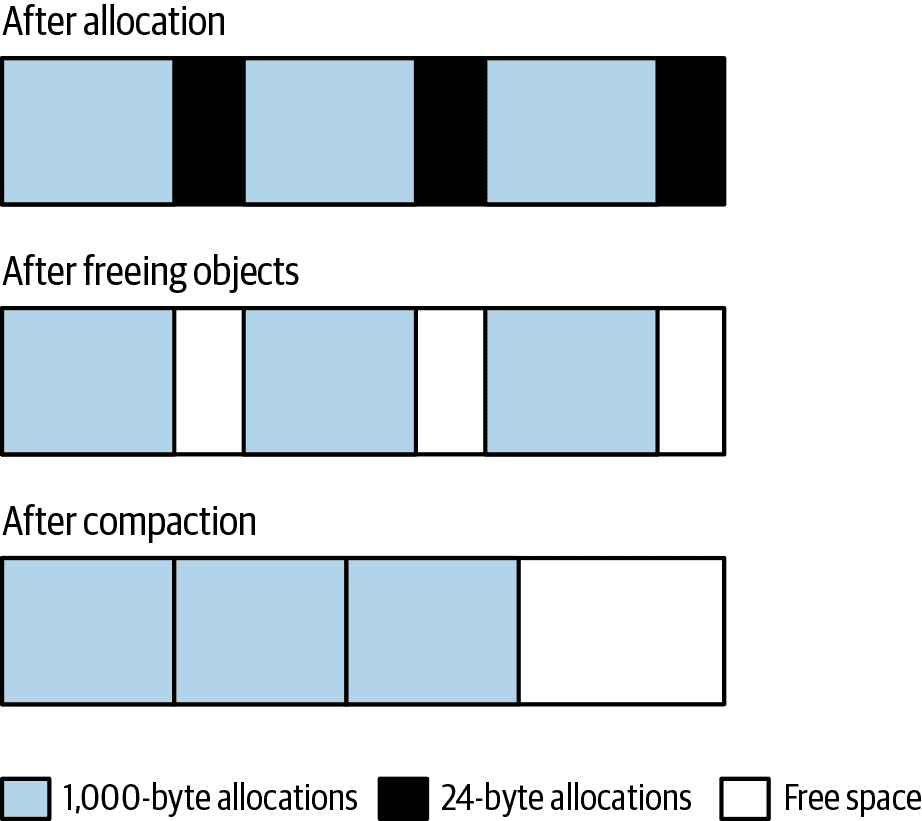
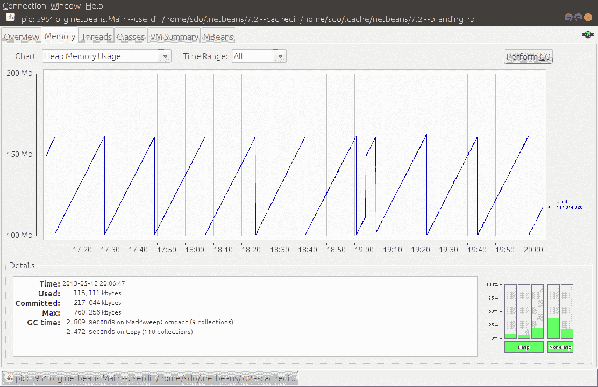

# 第五章。垃圾收集简介

本章介绍了 JVM 中垃圾收集的基础知识。除了重写代码外，调整垃圾收集器是提高 Java 应用程序性能最重要的事情。

因为 Java 应用程序的性能严重依赖垃圾收集技术，所以有相当多的收集器可供选择。OpenJDK 有三个适合生产环境的收集器，另一个在 JDK 11 中已经弃用但在 JDK 8 中仍然非常流行，并且一些实验性的收集器将来会（理想情况下）成为生产就绪版本的一部分。其他 Java 实现如 Open J9 或 Azul JVM 有它们自己的收集器。

所有这些收集器的性能特征都是非常不同的；我们只会关注 OpenJDK 提供的那些。每个收集器在下一章中都会进行深入讲解。然而，它们共享基本概念，因此本章提供了收集器操作的基本概述。

# 垃圾收集概述

在 Java 编程中最具吸引力的功能之一是开发人员无需显式管理对象的生命周期：对象在需要时创建，在对象不再使用时，JVM 会自动释放对象。如果像我一样，你花费了大量时间优化 Java 程序的内存使用，那么整个方案可能看起来像是一个弱点而不是一个功能（我花在垃圾收集上的时间似乎支持了这种观点）。当然，这可以被认为是一种两面性的祝福，但我仍然记得在其他语言中追踪空指针和悬空指针的困难。我强烈认为调整垃圾收集器比追踪指针错误更容易（也更省时）。

在基本水平上，GC 的工作包括找出正在使用的对象并释放剩余对象（即那些未被使用的对象）所关联的内存。有时候，这被描述为找出不再具有任何引用的对象（暗示引用是通过计数来跟踪的）。然而，仅仅依靠引用计数是不够的。假设有一个对象链表，列表中的每个对象（除了头部）都会被列表中的另一个对象指向，但是如果没有任何东西指向列表的头部，整个列表就不再被使用并且可以被释放。如果列表是循环的（例如，列表的尾部指向头部），列表中的每个对象都有一个引用指向它，即使列表中没有任何对象实际可用，因为没有对象引用列表本身。

所以引用不能通过计数动态跟踪；相反，JVM 必须定期搜索堆中未使用的对象。它通过从 GC 根对象开始搜索来实现这一点，GC 根对象是从堆外部可访问的对象。这主要包括线程堆栈和系统类。这些对象总是可达的，因此 GC 算法扫描所有通过一个根对象可达的对象。通过 GC 根可达的对象是活动对象；其余的不可达对象是垃圾（即使它们保持对活动对象或彼此的引用）。

当 GC 算法找到未使用的对象时，JVM 可以释放这些对象占用的内存，并用于分配其他对象。然而，简单地跟踪这些空闲内存并将其用于将来的分配通常是不够的；在某些时刻，必须压缩内存以防止内存碎片化。

考虑一个程序的情况，它分配了一个 1,000 字节的数组，然后是一个 24 字节的数组，并在循环中重复这个过程。当这个过程填满堆时，它会看起来像图 5-1 中的顶行：堆已满，并且这些数组大小的分配交错进行。

当堆满时，JVM 将释放未使用的数组。假设所有的 24 字节数组不再使用，而 1,000 字节数组仍然全部使用：这将产生图 5-1 中的第二行。堆内有空闲区域，但不能分配大于 24 字节的任何内容，除非 JVM 将所有 1,000 字节数组移动到连续位置，使所有空闲内存留在一个区域，以便根据需要进行分配（图 5-1 中的第三行）。

实现稍微详细些，但 GC 的性能主要受这些基本操作的影响：查找未使用的对象，使它们的内存可用，并压缩堆。不同的收集器对这些操作采取不同的方法，尤其是压缩：一些算法推迟压缩直到绝对必要时，一些一次性压缩堆的整个部分，还有一些通过逐步重定位少量内存来压缩堆。这些不同的方法是不同算法具有不同性能特征的原因。



###### 图 5-1\. 在收集期间理想化的 GC 堆

当垃圾收集器运行时，如果没有应用程序线程在运行，则执行这些操作会更简单。Java 程序通常是重度多线程的，而垃圾收集器本身通常也会运行多个线程。本讨论考虑了两个逻辑线程组：执行应用逻辑的线程（通常称为*变异线程*，因为它们正在变异对象作为应用逻辑的一部分）和执行 GC 的线程。当 GC 线程跟踪对象引用或在内存中移动对象时，它们必须确保应用程序线程不在使用这些对象。当 GC 移动对象时尤其如此：对象在该操作期间的内存位置会发生变化，因此在此期间不应用程序线程可以访问该对象。

当所有应用程序线程停止时的暂停称为*停止-世界暂停*。这些暂停通常对应用程序的性能产生最大影响，减少这些暂停是调整 GC 时的一个重要考虑因素。

## 分代垃圾收集器

尽管细节略有不同，但大多数垃圾收集器的工作方式是将堆分成代。这些被称为*老（或终身）代*和*年轻代*。年轻代进一步分为称为*伊甸园*和*幸存者空间*的部分（尽管有时，伊甸园被错误地用来指代整个年轻代）。

单独分代的原因是许多对象仅被使用很短的时间。例如，在股票价格计算中的循环中，该循环对平均价格的价格差的平方进行求和（标准差计算的一部分）：

```java
sum = new BigDecimal(0);
for (StockPrice sp : prices.values()) {
    BigDecimal diff = sp.getClosingPrice().subtract(averagePrice);
    diff = diff.multiply(diff);
    sum = sum.add(diff);
}
```

像许多 Java 类一样，`BigDecimal`类是不可变的：该对象表示特定数字，不能更改。对对象执行算术运算时，会创建一个新对象（通常情况下，之前的对象及其先前的值随后会被丢弃）。当这个简单循环被执行一年的股票价格（大约 250 次迭代）时，就在这个循环中创建了 750 个用于存储中间值的`BigDecimal`对象。这些对象在循环的下一次迭代中被丢弃。在`add()`和其他方法中，JDK 库代码甚至创建了更多的中间`BigDecimal`（和其他）对象。最终，在这段小代码中会快速创建和丢弃很多对象。

这种操作在 Java 中很常见，因此垃圾收集器设计得充分利用了许多（有时是大多数）对象仅用于临时的事实。这就是代际设计的用武之地。对象首先分配在年轻代中，这是整个堆的子集。当年轻代填满时，垃圾收集器会停止所有应用线程并清空年轻代。不再使用的对象被丢弃，仍在使用的对象则被移动到其他地方。这个操作称为*minor GC*或*young GC*。

这种设计有两个性能优势。首先，因为年轻代只是整个堆的一部分，处理速度比整个堆快得多。应用线程停止的时间要比一次性处理整个堆时短得多。尽管这意味着应用线程会更频繁地停止，而不是等到整个堆填满再执行 GC，这个权衡将在本章后面更详细地探讨。但是目前来看，即使更频繁，有更短的暂停时间几乎总是一个巨大的优势。

第二个优势来自对象在年轻代分配的方式。对象首先分配在 Eden 区（它占据了年轻代的绝大部分）。当进行垃圾收集时，年轻代被清空：Eden 区中的所有对象要么被移动，要么被丢弃：不再使用的对象可以被丢弃，而仍在使用的对象则移动到其中一个幸存区或老年代。由于所有幸存下来的对象都会被移动，因此当年轻代被收集时，它会自动压缩：在收集结束时，Eden 区和一个幸存区为空，而仍留在年轻代中的对象则在另一个幸存区内被紧凑地排列。

常见的 GC 算法在收集年轻代时会有停止应用线程的暂停。

当对象被移动到老年代时，最终老年代也会填满，JVM 需要找到老年代中不再使用的对象并丢弃它们。这是 GC 算法差异最大的地方。简单的算法会停止所有应用线程，找到未使用的对象，释放它们的内存，然后压缩堆。这个过程称为*full GC*，通常会导致应用线程相对较长的暂停。

另一方面，当应用程序线程正在运行时，可以找到未使用的对象，尽管这可能会更加计算复杂。因为扫描未使用对象的阶段可以在不停止应用程序线程的情况下进行，所以这些算法被称为*并发收集器*。它们也被称为*低暂停*（有时不正确地称为*无暂停*）收集器，因为它们最大程度地减少了停止所有应用程序线程的需求。并发收集器还采用不同的方法来压缩老年代。

使用并发收集器时，应用程序通常会经历更少（且更短）的暂停。最大的权衡是应用程序总体上将使用更多的 CPU。并发收集器也可能更难调整以获得最佳性能（尽管在 JDK 11 中，调整像 G1 GC 这样的并发收集器要比以前的版本更容易，这反映了自并发收集器首次引入以来所取得的工程进展）。

在考虑哪种垃圾收集器适合您的情况时，请考虑必须满足的总体性能目标。在每种情况下都存在权衡。在度量单个请求的响应时间的应用程序（如 REST 服务器）中，请考虑以下几点：

+   单个请求将受暂停时间的影响，尤其是全局 GC 的长暂停时间。如果最小化暂停对响应时间的影响是目标，则并发收集器可能更合适。

+   如果平均响应时间比异常值（即 90th%）响应时间更重要，那么非并发收集器可能会产生更好的结果。

+   使用并发收集器避免长暂停时间的好处是需要额外的 CPU 使用。如果您的计算机缺乏并发收集器所需的空闲 CPU 循环，则非并发收集器可能是更好的选择。

同样，在批处理应用程序中选择垃圾收集器的选择受以下权衡的指导：

+   如果有足够的 CPU 可用，使用并发收集器来避免全局 GC 暂停将有助于更快地完成任务。

+   如果 CPU 受限，那么并发收集器的额外 CPU 消耗将导致批处理作业需要更多时间。

# 快速总结

+   GC 算法通常将堆分为老年代和年轻代。

+   GC 算法通常采用停止-世界方法来清除来自年轻代的对象，这通常是一个快速操作。

+   最小化在老年代执行 GC 的影响是暂停时间和 CPU 使用之间的权衡。

## GC 算法

OpenJDK 12 提供了各种 GC 算法，在早期版本中的支持程度各不相同。Table 5-1 列出了这些算法及其在 OpenJDK 和 Oracle Java 发布版中的状态。

表 5-1\. 各种 GC 算法的支持级别^(a)

| GC 算法 | JDK 8 中的支持 | JDK 11 中的支持 | JDK 12 中的支持 |
| --- | --- | --- | --- |
| 串行 GC | S | S | S |
| 吞吐量（并行）GC | S | S | S |
| G1 GC | S | S | S |
| 并发标记-清除（CMS） | S | D | D |
| ZGC | - | E | E |
| Shenandoah | E2 | E2 | E2 |
| Epsilon GC | - | E | E |
| ^(a) （S: 完全支持 D: 已弃用 E: 实验性 E2: 实验性；在 OpenJDK 版本中但不在 Oracle 版本中） |

接下来是每种算法的简要描述；第六章提供了有关单独调优它们的更多详细信息。

### 串行垃圾收集器

*串行垃圾收集器*是所有收集器中最简单的一种。如果应用程序在客户端类机器上运行（Windows 上的 32 位 JVM）或单处理器机器上运行，则默认使用此收集器。曾经，串行收集器似乎注定要被丢弃，但容器化技术改变了这一点：具有一个核心（甚至是看起来像两个 CPU 的超线程核心）的虚拟机和 Docker 容器使得这种算法再次变得更为重要。

串行收集器使用单个线程处理堆。在处理堆时（无论是进行部分 GC 还是完全 GC），它将停止所有应用程序线程。在完全 GC 期间，它将完全压缩老年代。

使用`-XX:+UseSerialGC`标志可以启用串行收集器（尽管通常在可能使用它的情况下它是默认的）。请注意，与大多数 JVM 标志不同，串行收集器不会通过将加号改为减号（即指定`-XX:-UseSerialGC`）来禁用。在串行收集器是默认收集器的系统上，可以通过指定不同的 GC 算法来禁用它。

### 吞吐量收集器

在 JDK 8 中，*吞吐量收集器*是任何具有两个或更多 CPU 的 64 位机器的默认收集器。吞吐量收集器使用多个线程来收集年轻代，这使得部分 GC 比使用串行收集器更快。它也使用多个线程来处理老年代。由于使用多个线程，吞吐量收集器通常被称为*并行收集器*。

吞吐量收集器在部分 GC 和完全 GC 期间停止所有应用程序线程，并在完全 GC 期间完全压缩老年代。由于在大多数使用场景中，它是默认的收集器，因此不需要显式启用。如有必要，在需要时可以使用标志`-XX:+UseParallelGC`来启用它。

请注意，JVM 的旧版本允许在年轻代和老年代分别启用并行收集，因此您可能会看到关于标志`-XX:+UseParallelOldGC`的引用。尽管这个标志已经过时（虽然它仍然有效，并且出于某种原因，如果您真的想要，您可以禁用此标志以仅并行收集年轻代），但是可以禁用它以仅在年轻代并行收集。

### G1 GC 收集器

*G1 GC*（或*垃圾优先垃圾收集器*）使用并发收集策略来在尽可能小的暂停时间内收集堆。对于具有两个或更多 CPU 的 64 位 JVM，它是 JDK 11 及更高版本的默认收集器。

G1 GC 将堆划分为多个区域，但仍然将堆视为具有两个代。其中一些区域组成年轻代，年轻代仍然通过停止所有应用程序线程并将所有存活对象移动到老年代或存活区域来进行收集。（这是使用多个线程进行的。）

在 G1 GC 中，老年代由后台线程处理，这些线程不需要停止应用程序线程来执行大部分工作。因为老年代被划分为区域，所以 G1 GC 可以通过从一个区域复制到另一个区域来清理老年代的对象，这意味着它（至少部分地）在正常处理中压缩堆。这有助于保持 G1 GC 堆不会变得碎片化，尽管这仍然可能发生。

避免完全 GC 周期的折衷是 CPU 时间：G1 GC 使用的（多个）后台线程在应用程序线程运行时必须有可用的 CPU 周期来处理老年代。

通过指定标志 `-XX:+UseG1GC` 启用 G1 GC。在 JDK 11 中，它通常是默认的，在 JDK 8 中也可以使用——特别是在 JDK 8 的后期版本中，它包含了从较新版本中后移植的许多重要的错误修复和性能增强。但是，当我们深入探讨 G1 GC 时，您会发现 JDK 8 中缺少的一个主要性能特性，这可能使其不适合该版本。

### CMS 收集器

*CMS 收集器* 是第一个并发收集器。与其他算法一样，CMS 在执行次要 GC 时会停止所有应用程序线程，并使用多个线程执行。

CMS 在 JDK 11 及更高版本中已正式弃用，并且在 JDK 8 中不建议使用。从实际的角度来看，CMS 的主要缺陷是它在后台处理过程中没有一种方法来压缩堆。如果堆变得碎片化（这在某些时候很可能发生），CMS 必须停止所有应用程序线程并压缩堆，这违背了并发收集器的初衷。鉴于这一点和 G1 GC 的出现，CMS 不再推荐使用。

CMS 是通过指定标志 `-XX:+UseConcMarkSweepGC` 启用的，默认情况下为 `false`。历史上，CMS 还需要设置 `-XX:+UseParNewGC` 标志（否则，年轻代将由单个线程收集），尽管这已经过时。

### 实验性收集器

垃圾收集在 JVM 工程师中仍然是一个富有成效的领域，而最新版本的 Java 提供了前面提到的三种实验性算法。在下一章中我将详细介绍它们；现在，让我们继续看看在生产环境中选择三种支持的收集器之间的差异。

# 快速总结

+   支持的 GC 算法采用不同的方法来最小化 GC 对应用程序的影响。

+   当只有一个 CPU 可用且额外的 GC 线程会干扰应用程序时，串行收集器是合理的（并且是默认的）。

+   吞吐量收集器是 JDK 8 的默认选项；它最大化应用程序的总吞吐量，但可能会使个别操作出现长时间的暂停。

+   G1 GC 是 JDK 11 及更高版本的默认选项；它在应用程序线程运行时并发地收集老年代，有可能避免全局垃圾回收。其设计使得它比 CMS 更不太可能经历全局垃圾回收。

+   CMS（Concurrent Mark-Sweep）垃圾收集器可以在应用程序线程运行时并发地收集老年代。如果有足够的 CPU 可用于后台处理，这可以避免应用程序的全局垃圾回收周期。它已被 G1 GC 所取代。

## 选择 GC 算法

选择 GC 算法部分取决于可用的硬件，部分取决于应用程序的外观，部分取决于应用程序的性能目标。在 JDK 11 中，G1 GC 通常是更好的选择；在 JDK 8 中，选择将取决于你的应用程序。

我们将从一个经验法则开始，即 G1 GC 是更好的选择，但每个规则都有例外。在垃圾回收的情况下，这些例外涉及到应用程序相对于可用硬件需要的 CPU 循环数，以及后台 G1 GC 线程需要执行的处理量。如果你使用 JDK 8，G1 GC 避免全局垃圾回收的能力也将是一个关键考虑因素。当 G1 GC 不是更好的选择时，吞吐量和串行收集器之间的选择取决于机器上的 CPU 数量。

### 何时使用（以及何时不使用）串行收集器

在只有一个 CPU 的机器上，JVM 默认使用串行收集器。这包括只有一个 CPU 的虚拟机，以及被限制为一个 CPU 的 Docker 容器。如果你在 JDK 8 的早期版本中将 Docker 容器限制为一个 CPU，它仍将默认使用吞吐量收集器。在这种环境中，你应该考虑使用串行收集器（即使你需要手动设置）。

在这些环境中，串行收集器通常是一个不错的选择，但有时 G1 GC 会产生更好的结果。这个例子也是理解选择 GC 算法所涉及的一般权衡的一个很好的起点。

G1 GC 和其他收集器之间的权衡包括为 G1 GC 后台线程提供可用的 CPU 循环，所以我们先从一个 CPU 密集型的批处理作业开始。在批处理作业中，CPU 将长时间地处于 100% 忙碌状态，这种情况下串行收集器有明显的优势。

表 5-2 列出了一个单线程计算 10 万只股票在三年内历史记录所需的时间。

表 5-2\. 不同 GC 算法在单个 CPU 上的处理时间

| GC 算法 | 总经过时间 | 用于 GC 暂停的时间 |
| --- | --- | --- |
| 串行 | 434 秒 | 79 秒 |
| 吞吐量 | 503 秒 | 144 秒 |
| G1 GC | 501 秒 | 97 秒 |

单线程垃圾收集的优势最明显的是当我们将串行收集器与吞吐量收集器进行比较时。用于实际计算的时间是总经过时间减去用于 GC 暂停的时间。在串行和吞吐量收集器中，这段时间基本相同（大约 355 秒），但串行收集器胜出的原因是它在进行垃圾收集时的暂停时间要少得多。具体来说，串行收集器进行一次完全 GC 的平均时间为 505 毫秒，而吞吐量收集器则需要 1,392 毫秒。吞吐量收集器在其算法中有相当多的开销——当两个或更多线程处理堆时，这种开销是值得的，但当只有一个线程可用时，它只会妨碍操作。

现在将串行收集器与 G1 GC 进行比较。如果我们在使用 G1 GC 时消除暂停时间，应用程序进行计算需要 404 秒，但我们知道从其他示例中，实际只需要 355 秒。其他的 49 秒来自于什么？

计算线程可以利用所有可用的 CPU 周期。同时，后台的 G1 GC 线程需要 CPU 周期来完成它们的工作。因为没有足够的 CPU 来满足两者的需求，它们最终会共享 CPU：计算线程会运行一段时间，而后台的 G1 GC 线程会运行一段时间。最终的效果是，计算线程因为一个“后台”G1 GC 线程占用 CPU 而无法运行 49 秒。

这就是我说当你选择 G1 GC 时，需要足够的 CPU 供其后台线程运行的意思。对于长时间运行的应用程序线程占用唯一可用的 CPU 的情况，G1 GC 并不是一个好选择。但如果换成一些不同的情况，比如在受限硬件上运行简单的 REST 请求的微服务呢？表格 5-3 展示了一个 Web 服务器处理大约每秒 11 个请求，使用单个 CPU，大约占用了可用 CPU 周期的 50%的响应时间。

表格 5-3\. 使用不同 GC 算法的单个 CPU 的响应时间

| GC 算法 | 平均响应时间 | 90th% 响应时间 | 99th% 响应时间 | CPU 利用率 |
| --- | --- | --- | --- | --- |
| 串行 | 0.10 秒 | 0.18 秒 | 0.69 秒 | 53% |
| 吞吐量 | 0.16 秒 | 0.18 秒 | 1.40 秒 | 49% |
| G1 GC | 0.13 秒 | 0.28 秒 | 0.40 秒 | 48% |

默认（串行）算法仍然具有最佳的平均时间，比其他算法快 30%。同样，这是因为串行收集器对于年轻代的收集通常比其他算法快，因此平均请求由串行收集器延迟较少。

一些不幸的请求会被串行收集器的完整 GC 打断。在这个实验中，串行收集器进行完整 GC 的平均时间为 592 毫秒，最长的甚至达到了 730 毫秒。结果是 1%的请求几乎花费了 700 毫秒。

这仍然优于吞吐量收集器的表现。吞吐量收集器的完整 GC 平均为 1,192 毫秒，最大为 1,510 毫秒。因此，吞吐量收集器的第 99th%响应时间是串行收集器的两倍。而且平均时间也因这些异常值而偏差。

G1 GC 位于中间某处。就平均响应时间而言，它比串行收集器更差，因为更简单的串行收集器算法更快。在这种情况下，主要适用于小 GC，串行收集器平均需要 86 毫秒，而 G1 GC 则需要 141 毫秒。因此，在 G1 GC 的情况下，平均请求会被延迟更长时间。

尽管如此，G1 GC 的 99th%响应时间明显低于串行收集器。在这个示例中，G1 GC 能够避免完整 GC，因此没有了串行收集器超过 500 毫秒的延迟。

这里有一个优化的选择：如果平均响应时间是最重要的目标，那么（默认的）串行收集器是更好的选择。如果你想要优化第 99th%响应时间，G1 GC 胜出。这是一个判断的问题，但对我来说，平均时间的 30 毫秒差异不如第 99th%时间的 300 毫秒差异重要—因此在这种情况下，G1 GC 比平台的默认收集器更合理。

这个示例对 GC 的消耗很大；特别是非并发收集器需要执行大量的完整 GC 操作。如果我们调整测试，使得所有对象都可以在不需要完整 GC 的情况下被收集，那么串行算法可以与 G1 GC 相匹配，如表 5-4 所示。

表 5-4\. 单 CPU 使用不同 GC 算法的响应时间（无完整 GC）

| GC 算法 | 平均响应时间 | 第 90th%响应时间 | 第 99th%响应时间 | CPU 利用率 |
| --- | --- | --- | --- | --- |
| 串行 | 0.05 秒 | 0.08 秒 | 0.11 秒 | 53% |
| 吞吐量 | 0.08 秒 | 0.09 秒 | 0.13 秒 | 49% |
| G1 GC | 0.05 秒 | 0.08 秒 | 0.11 秒 | 52% |

因为没有完整 GC，串行收集器相对于 G1 GC 的优势被消除了。当 GC 活动较少时，所有数字都在同一范围内，并且所有收集器的表现几乎相同。另一方面，没有完整 GC 的情况相当罕见，这是串行收集器表现最佳的情况。在足够的 CPU 周期下，G1 GC 通常会比默认的串行收集器更好。

#### 单超线程 CPU 硬件

那么单核机器或 Docker 容器如何？ 在这种情况下，CPU 是超线程的（因此在 JVM 看来是一个双 CPU 的机器），JVM 不会默认使用串行收集器——它认为有两个 CPU，因此在 JDK 8 中会默认使用吞吐量收集器，在 JDK 11 中会使用 G1 GC。 但事实证明，串行收集器在这种硬件上通常也是有利的。 表 5-5 显示了在单个超线程 CPU 上运行前一批次实验时发生的情况。

表 5-5\. 在单个超线程 CPU 上使用不同 GC 算法的处理时间

| GC 算法 | 经过时间 | 垃圾回收暂停时间 |
| --- | --- | --- |
| 串行 | 432 秒 | 82 秒 |
| 吞吐量 | 478 秒 | 117 秒 |
| G1 GC | 476 秒 | 72 秒 |

串行收集器不会运行多个线程，因此其时间与我们之前的测试基本上没有变化。 其他算法有所改进，但并不像我们希望的那样多——吞吐量收集器将运行两个线程，但暂停时间并没有减半，而是减少了约 20%。 同样，G1 GC 仍然无法为其后台线程获取足够的 CPU 周期。

所以至少在这种情况下——长时间运行的批处理作业并频繁进行垃圾收集时——JVM 的默认选择是错误的，应用程序最好使用串行收集器，尽管存在“两个”CPU。 如果有两个实际的 CPU（即两个核心），情况会有所不同。 吞吐量收集器仅需要 72 秒来完成操作，这比串行收集器所需的时间少。 在这一点上，串行收集器的实用性就会减弱，所以我们将在未来的示例中放弃它。

串行收集器有一个额外的要点：即使应用程序的堆非常小（比如 100 MB），使用串行收集器仍然可能表现更好，而与可用的核心数量无关。

### 何时使用吞吐量收集器

当一台机器有多个可用的 CPU 时，GC 算法之间可能会发生更复杂的交互，但在基本水平上，G1 GC 和吞吐量收集器之间的权衡与我们刚刚看到的相同。 例如，表 5-6 显示了我们的样本应用程序在具有四个核心的机器上运行两个或四个应用程序线程时的工作情况（其中核心不是超线程的）。

表 5-6\. 使用不同 GC 算法进行批处理的时间

| 应用程序线程 | G1 GC | 吞吐量 |
| --- | --- | --- |
| 两 | 410 秒（60.8%） | 446 秒（59.7%） |
| 四 | 513 秒（99.5%） | 536 秒（99.5%） |

表中的时间是运行测试所需的秒数，并显示了机器的 CPU 利用率。当有两个应用程序线程时，G1 GC 比吞吐量收集器显著更快。主要原因是吞吐量收集器花了 35 秒暂停进行完全 GC。G1 GC 能够避免这些收集，虽然会（相对轻微地）增加 CPU 时间。

即使有四个应用程序线程，G1 在这个例子中仍然胜出。在这里，吞吐量收集器总共暂停了应用程序线程 176 秒。而 G1 GC 仅暂停了应用程序线程 88 秒。G1 GC 后台线程确实需要与应用程序线程竞争 CPU 周期，这让应用程序线程少了大约 65 秒。这仍意味着 G1 GC 快了 23 秒。

当应用程序的经过时间至关重要时，吞吐量收集器将比 G1 GC 更有优势，因为它暂停应用程序线程的时间少于 G1 GC。这种情况发生在以下一种或多种情况：

+   没有（或很少）进行完全 GC。完全 GC 暂停很容易支配应用程序的暂停时间，但如果它们根本不发生，那么吞吐量收集器就不再处于劣势。

+   老年代通常是满的，导致后台的 G1 GC 线程工作更多。

+   G1 GC 线程饥饿于 CPU。

在接下来详细介绍各种算法如何工作以及这些要点背后的原因的章节中，将更清楚地解释这些内容（以及围绕它们调整收集器的方法）。现在，我们将看一些例子来证明这一点。

首先，让我们看一下表格 5-7 中的数据。这个测试与我们之前用于长计算批处理作业的代码相同，尽管有一些修改：多个应用程序线程正在进行计算（在这种情况下为两个），老年代以对象为种子保持 65%满，几乎所有对象都可以直接从年轻代收集。这个测试在一个具有四个 CPU（非超线程）的系统上运行，以确保后台的 G1 GC 线程有足够的 CPU 资源运行。

表 5-7。带有长寿命对象的批处理

| 指标 | G1 GC | 吞吐量 |
| --- | --- | --- |
| 经过时间 | 212 秒 | 193 秒 |
| CPU 使用率 | 67% | 51% |
| 年轻代 GC 暂停 | 30 秒 | 13.5 秒 |
| 完全 GC 暂停 | 0 秒 | 1.5 秒 |

由于只有少量对象被晋升到老年代，吞吐量收集器仅暂停了应用程序线程 15 秒，其中只有 1.5 秒用于收集老年代。

尽管老年代没有许多新对象被晋升进去，但测试种子会为老年代添加垃圾以便 G1 GC 线程扫描。这会给后台 GC 线程增加更多工作量，并导致 G1 GC 为了补偿老年代的填充而在收集年轻代时做更多工作。最终结果是，在两线程测试中，G1 GC 使应用程序暂停了 30 秒——比吞吐量收集器更多。

另一个例子：当 G1 GC 后台线程没有足够的 CPU 运行时，吞吐量收集器的表现会更好，正如 表 5-8 所示。

表 5-8. 忙碌 CPU 下的批处理

| 指标 | G1 GC | 吞吐量 |
| --- | --- | --- |
| 经过时间 | 287 秒 | 267 秒 |
| CPU 使用率 | 99% | 99% |
| 年轻代 GC 暂停 | 80 秒 | 63 秒 |
| 全 GC 暂停 | 0 秒 | 37 秒 |

实际上，这与单 CPU 的情况没有什么不同：G1 GC 后台线程与应用程序线程之间的 CPU 周期竞争意味着，即使没有 GC 暂停发生，应用程序线程也会被有效暂停。

如果我们更关心交互处理和响应时间，那么吞吐量收集器要比 G1 GC 更难胜过。如果您的服务器缺少 CPU 周期，以至于 G1 GC 和应用程序线程争夺 CPU，那么 G1 GC 的响应时间将更差（与我们已经看到的情况类似）。如果服务器调优得没有全 GC，则 G1 GC 和吞吐量收集器通常会产生类似的结果。但是吞吐量收集器有更多的全 GC，G1 GC 的平均、90th% 和 99th% 响应时间就会更好。

# 快速总结

+   目前对于大多数应用程序来说，G1 GC 是更好的算法选择。

+   在单 CPU 机器上运行 CPU 密集型应用程序时，串行收集器是有道理的，即使该单 CPU 是超线程的。对于那些不是 CPU 密集型的作业，G1 GC 在这样的硬件上仍然更好。

+   对于 CPU 密集型作业在多 CPU 机器上，吞吐量收集器是合理的选择。即使对于不是 CPU 密集型的作业，如果它相对较少进行全 GC 或者老年代通常是满的，吞吐量收集器可能也是更好的选择。

# 基本 GC 调优

尽管 GC 算法在处理堆的方式上有所不同，它们共享基本的配置参数。在许多情况下，这些基本配置就足以运行一个应用程序。

## 调整堆大小

GC 的第一个基本调优是应用程序堆大小。高级调优会影响堆的代大小；作为第一步，本节将讨论设置整体堆大小。

像大多数性能问题一样，选择堆大小是一个权衡问题。如果堆太小，程序将花费太多时间执行 GC，而不是足够的时间执行应用程序逻辑。但是仅仅指定一个非常大的堆也不一定是答案。GC 暂停的时间取决于堆大小，因此随着堆大小的增加，这些暂停的持续时间也会增加。暂停的频率会减少，但其持续时间将使整体性能下降。

当使用非常大的堆时，还会出现第二个危险。计算机操作系统使用虚拟内存管理机器的物理内存。一台机器可能有 8GB 的物理 RAM，但操作系统会使其看起来可用的内存量要多得多。虚拟内存的量取决于操作系统的配置，但假设操作系统看起来有 16GB 内存。操作系统通过称为*交换*（或*分页*，尽管这两个术语之间有技术上的区别，但对本讨论并不重要）的过程来管理这一点。您可以加载使用高达 16GB 内存的程序，操作系统将不活动部分的程序复制到磁盘。当需要这些内存区域时，操作系统将其从磁盘复制到 RAM（通常，它首先需要将某些内容从 RAM 复制到磁盘以腾出空间）。

这个过程对于运行大量应用程序的系统效果很好，因为大多数应用程序不会同时活动。但对于 Java 应用程序来说，效果不佳。如果在此系统上运行具有 12GB 堆的 Java 程序，则操作系统可以通过将 8GB 的堆保持在内存中，将 4GB 保存在磁盘上来处理（这简化了情况，因为其他程序将使用部分内存）。JVM 不会知道这一点；交换由操作系统透明处理。因此，JVM 将愉快地填充其被告知使用的全部 12GB 堆。这会导致严重的性能损失，因为操作系统将数据从磁盘交换到 RAM（这本身是一个昂贵的操作）。

更糟糕的是，保证发生交换的唯一时机是在进行全局垃圾收集（GC）时，此时 JVM 必须访问整个堆。如果系统在进行全局 GC 期间发生交换，暂停时间将比通常情况下长上一个数量级。同样地，当使用 G1 GC 时，后台线程在堆中扫描时，由于长时间等待数据从磁盘复制到主存储器，很可能会滞后，导致昂贵的并发模式失败。

因此，调整堆大小的第一个原则是永远不要指定比机器上的物理内存更大的堆大小——如果有多个 JVM 运行，这也适用于所有堆的总和。您还需要为 JVM 的本机内存留出一些空间，并为其他应用程序留出一些内存空间：通常至少需要为常见操作系统配置留出 1GB 的空间。

堆的大小由两个值控制：初始值（使用 `-Xms`*`N`* 指定）和最大值（`-Xmx`*`N`*）。默认值因操作系统、系统 RAM 量和使用的 JVM 而异。默认值也可能受命令行上其他标志的影响；堆大小是 JVM 的核心人机工程调整之一。

JVM 的目标是根据可用于其的系统资源找到“合理”的默认堆初始值，并在应用程序需要更多内存时（根据其执行 GC 的时间）将堆增长到“合理”的最大值。在本章和下一章稍后讨论的一些高级调整标志和细节缺失时，初始和最大大小的默认值在 表 5-9 中给出。JVM 将略微向下舍入这些值以对齐目的；打印大小的 GC 日志将显示这些值与本表中的数字不完全相等。

表 5-9\. 默认堆大小

| 操作系统和 JVM | 初始堆（`Xms`） | 最大堆（`Xmx`） |
| --- | --- | --- |
| Linux | 最小值（512 MB，物理内存的 1/64） | 最小值（32 GB，物理内存的 1/4） |
| macOS | 64 MB | 最小值（1 GB，物理内存的 1/4） |
| Windows 32 位客户端 JVMs | 16 MB | 256 MB |
| Windows 64 位服务器 JVMs | 64 MB | 最小值（1 GB，物理内存的 1/4） |

在物理内存少于 192 MB 的计算机上，最大堆大小将是物理内存的一半（96 MB 或更少）。

注意，表 5-9 中的数值是那些在 Docker 容器中 JDK 8 版本更新到 192 之前指定内存限制的情况下将会不正确的调整：JVM 将使用机器上的总内存来计算默认大小。在之后的 JDK 8 版本和 JDK 11 中，JVM 将使用容器的内存限制。

为堆设置初始值和最大值允许 JVM 根据工作负载调整其行为。如果 JVM 发现初始堆大小的 GC 过多，它将不断增加堆大小，直到 JVM 执行“正确”的 GC 量，或者直到堆达到其最大大小。

对于不需要大型堆的应用程序，这意味着根本不需要设置堆大小。相反，您指定 GC 算法的性能目标：您愿意容忍的暂停时间、您想要在 GC 中花费的时间百分比等。细节取决于所使用的 GC 算法，并将在下一章讨论（尽管即使在那种情况下，也选择了默认值，以便对于广泛的应用程序范围，这些值也无需调整）。

在 JVM 运行在隔离容器中的世界中，通常需要指定最大堆。在主要运行单个 JVM 的虚拟机上，默认的初始堆大小只有分配给虚拟机的内存的四分之一。同样，在带有内存限制的 JDK 11 Docker 容器中，通常希望堆消耗大部分内存（留出前面提到的余地）。这里的默认值更适合运行多个应用程序的系统，而不是专门为特定 JVM 的容器。

没有明确的规则决定最大堆值的大小（除非不指定大于机器支持的大小）。一个好的经验法则是调整堆大小，使其在完整 GC 后占用 30%。要计算这一点，请运行应用程序直到达到稳定状态配置：即已加载任何缓存，已创建最大数量的客户端连接等。然后使用`jconsole`连接到应用程序，强制进行完整 GC，并观察完整 GC 完成时使用的内存量。（或者，对于吞吐量 GC，如果可用，可以查阅 GC 日志。）如果采用这种方法，请确保调整容器（如果适用）以获得额外的 0.5–1 GB 内存，用于 JVM 的非堆需求。

请注意，即使显式设置了最大大小，堆的自动调整大小也会发生：堆将从其默认初始大小开始，并且 JVM 将增加堆以满足 GC 算法的性能目标。指定比所需更大的堆不一定会带来内存惩罚：它只会增长到足以满足 GC 性能目标的程度。

另一方面，如果您确切地知道应用程序需要多大的堆大小，您可以将堆的初始值和最大值都设置为该值（例如，`-Xms4096m` `-Xmx4096m`）。这样可以使 GC 稍微更高效，因为它永远不需要弄清楚是否应调整堆的大小。

# 快速总结

+   JVM 将尝试根据其运行的机器找到合理的最小和最大堆大小。

+   除非应用程序需要比默认更大的堆，否则请考虑调整 GC 算法的性能目标（在下一章节中给出）而不是微调堆大小。

## 分配代大小

一旦确定了堆大小，JVM 必须决定将堆的多少分配给年轻代和多少分配给老年代。JVM 通常会自动执行此操作，并且通常在确定年轻代和老年代之间的最佳比率方面表现良好。在某些情况下，您可能需要手动调整这些值，尽管大多数情况下，本节的目的是提供垃圾收集工作原理的理解。

不同代大小的性能影响应该很明显：如果年轻代相对较大，则年轻代的 GC 暂停时间将增加，但年轻代的收集频率将减少，并且升级到老年代的对象将减少。但另一方面，因为老年代相对较小，它会更频繁地填满并执行更多的全 GC。在这里找到平衡是关键。

不同的 GC 算法尝试以不同方式找到这种平衡。但是，所有 GC 算法都使用相同的一组标志来设置代的大小；本节介绍了这些通用标志。

调整代大小的命令行标志都会调整年轻代的大小；老年代会得到剩余的一切。可以使用多种标志来设置年轻代的大小：

`-XX:NewRatio=`*`N`*

设置年轻代和老年代的比例。

`-XX:NewSize=`*`N`*

设置年轻代的初始大小。

`-XX:MaxNewSize=`*`N`*

设置年轻代的最大大小。

`-Xmn`*`N`*

设置`NewSize`和`MaxNewSize`为相同值的快捷方式。

年轻代首先由`NewRatio`大小设定，其默认值为 2。影响堆空间大小设定的参数通常指定为比率；该值在一个方程中用于确定受影响空间的百分比。`NewRatio`值在以下公式中使用：

```java
Initial Young Gen Size = Initial Heap Size / (1 + NewRatio)
```

将堆的初始大小和`NewRatio`代入计算得到的值将成为年轻代的设置。因此，默认情况下，年轻代从初始堆大小的 33%开始。

或者，可以通过指定`NewSize`标志来显式设置年轻代的大小。如果设置了此选项，则它将优先于从`NewRatio`计算出的值。该标志没有默认值，因为默认情况下是从`NewRatio`计算出的。

随着堆的扩展，年轻代的大小也会扩展，直到由`MaxNewSize`标志指定的最大大小。默认情况下，该最大值也是使用`NewRatio`值设置的，尽管它基于最大（而非初始）堆大小。

通过指定年轻代的最小和最大大小来调整年轻代的性能最终会变得相当困难。当堆大小固定时（通过将`-Xms`设置为`-Xmx`），通常最好使用`-Xmn`来指定年轻代的固定大小。如果应用程序需要动态大小的堆并需要更大（或更小）的年轻代，则专注于设置`NewRatio`值。

### 自适应大小调整

堆大小、代的大小和幸存者空间的大小可以在执行过程中变化，因为 JVM 尝试根据其策略和调整找到最佳性能。这是一种尽力而为的解决方案，并且依赖于过去的性能：假设未来的 GC 周期将与最近过去的 GC 周期类似。对于许多工作负载来说，这是一个合理的假设，即使分配速率突然发生变化，JVM 也将根据新信息重新调整其大小。

自适应大小以两种重要方式提供优势。首先，这意味着小型应用程序无需担心过度指定其堆大小。考虑用于调整 Java NoSQL 服务器等事务操作的管理命令行程序——这些程序通常存在时间较短，并且使用最小的内存资源。即使默认堆大小可以增长到 1 GB，这些应用程序也将使用 64（或 16）MB 的堆。由于自适应大小，像这样的应用程序无需进行特定调整；平台默认值确保它们不会使用大量内存。

第二，这意味着许多应用程序实际上根本不需要担心调整其堆大小——或者如果它们需要比平台默认值更大的堆，则可以指定更大的堆并忘记其他细节。 JVM 可以自动调整堆和代的大小，以使用最佳内存量，考虑到 GC 算法的性能目标。自适应大小是使自动调整工作的原因。

然而，调整大小需要一小部分时间——这在大部分情况下发生在 GC 暂停期间。如果您花时间精细调整 GC 参数和应用程序堆大小的大小约束，则可以禁用自适应大小。禁用自适应大小对于经历明显不同阶段的应用程序也很有用，如果您想要为这些阶段中的一个最佳调整 GC。

在全局级别，可以通过关闭`-XX:-UseAdaptiveSizePolicy`标志（默认为`true`）来禁用自适应大小。除了年轻代的幸存者空间（在下一章中详细讨论），如果将最小堆大小和最大堆大小设置为相同值，并且新生代的初始大小和最大大小设置为相同值，则自适应大小也将有效地关闭。

要查看 JVM 如何调整应用程序中的空间大小，请设置`-XX:+PrintAdaptiveSizePolicy`标志。当执行 GC 时，GC 日志将包含详细信息，详细说明在集合期间如何调整各代的大小。

# 快速总结

+   在整体堆大小内部，各代的大小受到分配给年轻代的空间量的控制。

+   年轻代将与整体堆大小同步增长，但也可以作为总堆大小的百分比而波动（基于年轻代的初始大小和最大大小）。

+   自适应调整控制 JVM 在堆内调整年轻代与老年代比例的方式。

+   通常应保持启用自适应调整，因为调整这些代大小是 GC 算法尝试实现其暂停时间目标的方式。

+   对于精细调整的堆，可以禁用自适应调整以获得小幅性能提升。

## 元空间大小

当 JVM 加载类时，必须跟踪这些类的某些元数据。这占用了称为 *元空间* 的独立堆空间。在旧版 JVM 中，这是由称为 *永久代* 的不同实现处理的。

对于最终用户而言，元空间是不透明的：我们知道它保存了大量与类相关的数据，并且在某些情况下需要调整该区域的大小。

请注意，元空间不保存类的实际实例（`Class` 对象）或反射对象（例如，`Method` 对象）；这些对象保存在常规堆中。元空间中的信息仅供编译器和 JVM 运行时使用，并且它所保存的数据被称为 *类元数据*。

预先计算特定程序所需的元空间大小并没有一个很好的方法。其大小与使用的类数量成比例，因此更大的应用程序将需要更大的空间。这是 JDK 技术变化使生活更轻松的另一个领域：调整永久代曾经相当常见，但现在调整元空间则相对罕见。主要原因是元空间大小的默认值非常慷慨。Table 5-10 列出了默认的初始和最大大小。

表 5-10\. 元空间的默认大小

| JVM | 默认初始大小 | 默认最大大小 |
| --- | --- | --- |
| 32 位客户端 JVM | 12 MB | 无限制 |
| 32 位服务器 JVM | 16 MB | 无限制 |
| 64 位 JVM | 20.75 MB | 无限制 |

元空间类似于常规堆的单独实例。它的大小根据初始大小（`-XX:MetaspaceSize=`*`N`*）动态设置，并会根据需要增加到最大大小（`-XX:MaxMetaspaceSize=`*`N`*）。

调整元空间大小需要进行完整的 GC，因此这是一个昂贵的操作。如果在程序启动时（加载类时）出现大量的完整 GC，往往是因为正在调整永久代或元空间的大小，因此增加初始大小是改善这种情况下启动性能的好方法。例如，服务器通常指定初始元空间大小为 128 MB、192 MB 或更大。

Java 类与其他任何东西一样都可以符合 GC 的条件。在应用服务器中，这种情况经常发生，每次部署（或重新部署）应用程序时会创建新的类加载器。然后，旧的类加载器将不再被引用，并且符合 GC 的条件，任何它们定义的类也是如此。与此同时，应用程序的新类将具有新的元数据，因此元空间必须有足够的空间。这通常会导致完全 GC，因为元空间需要增长（或丢弃旧的元数据）。

限制元空间大小的一个原因是防止类加载器泄漏：当应用服务器（或类似 IDE 的其他程序）不断定义新的类加载器和类，并保持对旧类加载器的引用时，会填满元空间并在机器上消耗大量内存的潜力。另一方面，在这种情况下，实际的类加载器和类对象也仍然在主堆中，并且在元空间的内存成为问题之前，主堆很可能会填满并导致 `OutOfMemoryError`。

堆转储（参见 第七章）可用于诊断存在哪些类加载器，从而有助于确定是否有类加载器泄漏填满了元空间。否则，可以使用 `jmap` 并带有参数 `-clstats` 打印有关类加载器的信息。

# 快速摘要

+   元空间保存类元数据（而不是类对象），并表现得像一个单独的堆。

+   此区域的初始大小可以基于加载所有类后的使用情况。这将稍微加快启动速度。

+   定义和丢弃大量类的应用程序将在元空间填满并且旧类被移除时偶尔会看到完全 GC。这在开发环境中尤其常见。

## 控制并行性

除串行收集器外，所有 GC 算法均使用多线程。这些线程的数量由 `-XX:ParallelGCThreads=`*`N`* 标志控制。此标志的值影响以下操作所使用的线程数量：

+   当年轻一代使用 `-XX:+UseParallelGC` 时的收集

+   当使用 `-XX:+UseParallelGC` 时老年代的收集

+   当使用 `-XX:+UseG1GC` 时年轻一代的收集

+   G1 GC 的停止-世界阶段（尽管不是完全 GC）

因为这些 GC 操作会停止所有应用程序线程的执行，所以 JVM 会尽可能使用尽可能多的 CPU 资源以最小化暂停时间。默认情况下，这意味着 JVM 将在每台机器上的 CPU 上运行一个线程，最多八个。一旦达到这个阈值，JVM 将为每 1.6 个 CPU 添加一个新线程。因此，在具有超过八个 CPU 的机器上，显示的总线程数（其中 *`N`* 是 CPU 数）如下：

```java
ParallelGCThreads = 8 + ((N - 8) * 5 / 8)
```

有时候这个数目过大。在一个拥有八个 CPU 的机器上，使用小堆（比如 1 GB）的应用程序，如果将堆分配给四到六个线程，会稍微提高效率。在拥有 128 个 CPU 的机器上，83 个 GC 线程对于除了最大堆之外的其他情况来说都太多了。

如果在具有 CPU 限制的 Docker 容器中运行 JVM，则该 CPU 限制将用于此计算。

此外，如果一台机器上运行多个 JVM，限制所有 JVM 的总 GC 线程数是个好主意。当它们运行时，GC 线程非常高效，每个线程将占用单 CPU 的 100%（这就是为什么吞吐量收集器的平均 CPU 使用率比预期高的原因）。在拥有八个或更少 CPU 的机器上，GC 将占用机器 CPU 的 100%。在拥有更多 CPU 和多个 JVM 的机器上，太多的 GC 线程仍将并行运行。

假设一台拥有 16 个 CPU 的机器上运行四个 JVM 实例；每个 JVM 默认会有 13 个 GC 线程。如果这四个 JVM 同时执行 GC 操作，那么机器将有 52 个耗 CPU 的线程竞争 CPU 时间。这会导致相当多的竞争；将每个 JVM 的 GC 线程限制为四个将更有效率。即使四个 JVM 不太可能同时执行 GC 操作，但其中一个 JVM 使用 13 个线程执行 GC 意味着其余 JVM 中的应用线程现在必须在 16 个 CPU 中有 13 个正在忙于执行 GC 任务的机器上竞争 CPU 资源。在这种情况下，为每个 JVM 提供四个 GC 线程提供了更好的平衡。

请注意，此标志不会设置 G1 GC 使用的后台线程数（尽管它确实会影响）。详细信息请参见下一章节。

# 快速总结

+   所有 GC 算法使用的基本线程数都基于机器上的 CPU 数。

+   当单台机器上运行多个 JVM 时，线程数会过高，必须进行减少。

# GC 工具

由于 GC 对 Java 性能至关重要，许多工具都监控其性能。了解 GC 日志的效果对于了解应用程序性能的影响是最佳方式，GC 日志记录了程序执行期间每次 GC 操作。

GC 日志中的详细信息根据 GC 算法而异，但日志的基本管理对所有算法都是相同的。然而，GC 日志的管理在 JDK 8 和后续版本中并不相同：JDK 11 使用一组不同的命令行参数来启用和管理 GC 日志。我们将在此讨论 GC 日志的管理，并在下一章节的特定于算法的调优部分详细介绍日志内容。

## 在 JDK 8 中启用 GC 日志记录。

JDK 8 提供多种启用 GC 日志的方法。指定`-verbose:gc`或`-XX:+PrintGC`中的任何一个标志都将创建一个简单的 GC 日志（这些标志是彼此的别名，默认情况下日志是禁用的）。`-XX:+PrintGCDetails`标志将创建一个包含更多信息的日志。推荐使用该标志（默认情况下也是`false`）；仅使用简单日志很难诊断 GC 发生的情况。

配合详细的日志，建议包含`-XX:+PrintGCTimeStamps`或`-XX:+PrintGCDateStamps`，以确定 GC 操作之间的时间。这两个参数的区别在于，时间戳是相对于 0 的（基于 JVM 启动时），而日期时间戳则是实际的日期字符串。由于日期时间戳需要格式化日期，稍微效率略低一些，尽管这是一个不太频繁的操作，但其影响不太可能被注意到。

GC 日志被写入标准输出，尽管可以（并且通常应该）使用`-Xloggc:`*`filename`*标志来更改其位置。使用`-Xloggc`会自动启用简单的 GC 日志，除非也启用了`PrintGCDetails`。

可以通过日志轮换来限制 GC 日志中保留的数据量；这对于长时间运行的服务器非常有用，否则可能会在几个月内用日志填满磁盘。日志文件轮换由以下标志控制：`-XX:+UseGCLogFileRotation` `-XX:NumberOfGCLogFiles=`*`N`* `-XX:GCLogFileSize=*N*`。默认情况下，`UseGCLogFileRotation`是禁用的。当启用该标志时，默认文件数为 0（意味着无限制），默认日志文件大小为 0（意味着无限制）。因此，为了使日志轮换按预期工作，必须为所有这些选项指定值。注意，文件大小将会向上舍入至 8 KB，以避免小于此值的问题。

将所有这些内容整合在一起，用于日志记录的一组有用标志如下：

```java
-Xloggc:gc.log -XX:+PrintGCTimeStamps -XX:+UseGCLogFileRotation
-XX:NumberOfGCLogFile=8 -XX:GCLogFileSize=8m
```

这将记录带有时间戳的 GC 事件，以便与其他日志进行关联，并将保留的日志限制在 8 个文件中的 64 MB。这种日志记录足够精简，甚至可以在生产系统上启用。

## 在 JDK 11 中启用 GC 日志记录

JDK 11 及更高版本使用 Java 的新统一日志记录功能。这意味着所有的日志记录（包括与 GC 相关的和其他的）都是通过`-Xlog`标志启用的。然后你可以附加各种选项来控制日志记录的行为。为了指定类似 JDK 8 中长示例的日志记录，你需要使用以下标志：

```java
-Xlog:gc*:file=gc.log:time:filecount=7,filesize=8M
```

冒号将命令分成四个部分。你可以运行`java -Xlog:help:`来获取更多有关可用选项的信息，但以下是它们在这个字符串中的映射。

第一部分（`gc*`）指定了应该启用日志记录的模块；我们启用了所有 GC 模块的日志记录。有一些选项可以仅记录特定的部分（例如 `gc+age` 将记录关于对象老化的信息，这是下一章节中讨论的一个主题）。这些特定的模块通常在默认日志级别下的输出有限，因此您可能会使用类似 `gc*,gc+age=debug` 的方式来记录所有 *gc* 模块的基本（info 级别）消息以及老化代码的调试级别消息。通常，以 info 级别记录所有模块是可以接受的。

第二部分设置了日志文件的目标位置。

第三部分（`time`）是一个装饰器：这个装饰器指示将消息记录为带有时间戳的形式，与我们为 JDK 8 指定的方式相同。可以指定多个装饰器。

最后，第四部分指定了输出选项；在这种情况下，我们说当日志文件达到 8 MB 时进行日志轮转，总共保留八个日志文件。

值得注意的是：在 JDK 8 和 JDK 11 之间，日志轮转处理稍有不同。假设我们指定了一个名为 *gc.log* 的日志文件，并且应该保留三个文件。在 JDK 8 中，日志会被记录如下：

1.  开始记录到 *gc.log.0.current*。

1.  当日志文件满时，将其重命名为 *gc.log.0* 并开始记录到 *gc.log.1.current*。

1.  当日志文件满时，将其重命名为 *gc.log.1* 并开始记录到 *gc.log.2.current*。

1.  当日志文件满时，将其重命名为 *gc.log.2*，移除 *gc.log.0*，并开始记录到一个新的 *gc.log.0.current*。

1.  重复这个周期。

在 JDK 11 中，日志会按照以下方式记录：

1.  开始记录到 *gc.log*。

1.  当日志文件满时，将其重命名为 *gc.log.0* 并开始一个新的 *gc.log*。

1.  当日志文件满时，将其重命名为 *gc.log.1* 并开始一个新的 *gc.log*。

1.  当日志文件满时，将其重命名为 *gc.log.2* 并开始一个新的 *gc.log*。

1.  当日志文件满时，将其重命名为 *gc.log.0*，移除旧的 *gc.log.0*，并开始一个新的 *gc.log*。

如果你想知道为什么在之前的 JDK 11 命令中我们指定了保留七个日志文件，这就是原因：在这种情况下将有八个活动文件。无论如何，请注意，文件名称中附加的数字并不代表文件创建的顺序。这些数字在一个循环中重复使用，因此有一定的顺序，但是最旧的日志文件可以是任何一个。

*gc* 日志包含了与每个收集器相关的大量信息，因此我们将在下一章节详细介绍这些细节。解析日志以获取关于应用程序的汇总信息也很有用：例如它有多少次暂停，平均暂停时间以及总暂停时间等。

不幸的是，并没有很多优秀的开源工具可以解析日志文件。与分析器一样，商业厂商提供了支持，例如来自 jClarity（Censum）和 [GCeasy](https://www.gceasy.io) 的服务。后者提供了基本日志解析的免费服务。

对于堆的实时监控，请使用`jvisualvm`或`jconsole`。`jconsole`的内存面板显示堆的实时图表，如图 5-4 所示。



###### 图 5-4\. 实时堆显示

此视图显示整个堆，它定期在使用约 100 MB 和 160 MB 之间循环。`jconsole`也可以只显示 Eden 区、幸存者空间、老年代或永久代。如果我选择 Eden 作为要绘制的区域，它将显示类似的模式，因为 Eden 在 0 MB 和 60 MB 之间波动（而且，您可以猜到，这意味着如果我选择了老年代绘制，它将基本上是 100 MB 的平直线）。

对于可脚本化的解决方案，`jstat`是首选工具。`jstat`提供九个选项来打印关于堆的不同信息；`jstat -options`将提供完整列表。一个有用的选项是`-gcutil`，它显示在 GC 中花费的时间以及当前填充的每个 GC 区域的百分比。`jstat`的其他选项将以 KB 为单位显示 GC 大小。

记住，`jstat`可以带一个可选参数——重复执行命令的毫秒数——以便在应用程序中随时间监视 GC 的效果。以下是每秒重复的一些示例输出：

```java
% jstat -gcutil 23461 1000
  S0     S1     E      O      P     YGC     YGCT    FGC    FGCT     GCT
 51.71   0.00  99.12  60.00  99.93     98    1.985     8    2.397    4.382
  0.00  42.08   5.55  60.98  99.93     99    2.016     8    2.397    4.413
  0.00  42.08   6.32  60.98  99.93     99    2.016     8    2.397    4.413
  0.00  42.08  68.06  60.98  99.93     99    2.016     8    2.397    4.413
  0.00  42.08  82.27  60.98  99.93     99    2.016     8    2.397    4.413
  0.00  42.08  96.67  60.98  99.93     99    2.016     8    2.397    4.413
  0.00  42.08  99.30  60.98  99.93     99    2.016     8    2.397    4.413
 44.54   0.00   1.38  60.98  99.93    100    2.042     8    2.397    4.439
 44.54   0.00   1.91  60.98  99.93    100    2.042     8    2.397    4.439

```

当监视进程 ID 23461 启动时，程序已经执行了 98 次年轻代收集（`YGC`），总计耗时 1.985 秒（`YGCT`）。此外，它还执行了 8 次完全 GC（`FGC`），总共需要 2.397 秒（`FGCT`）；因此 GC 总时间（`GCT`）为 4.382 秒。

此处显示了年轻代的所有三个部分：两个幸存者空间（`S0`和`S1`）和 Eden 区（`E`）。监控开始时，Eden 正在填满（99.12%），因此在下一秒会进行年轻代收集：Eden 减少到 5.55%的使用率，幸存者空间交换位置，并且少量内存被提升到老年代（`O`），其使用率增至 60.98%。像往常一样，永久代（`P`）几乎没有变化，因为应用程序已加载了所有必要的类。

如果您忘记启用 GC 日志记录，这是一个良好的替代方法，以观察 GC 如何随时间运行。

# 快速概述

+   GC 日志是诊断 GC 问题所需的关键数据；它们应定期收集（即使在生产服务器上）。

+   使用`PrintGCDetails`标志可以获得更好的 GC 日志文件。

+   提供用于解析和理解 GC 日志的程序是现成的；它们有助于总结 GC 日志中的数据。

+   `jstat`可以为实时程序提供良好的 GC 可见性。

# 概要

垃圾收集器的性能是任何 Java 应用程序整体性能的关键特性之一。对于许多应用程序而言，唯一需要调整的是选择合适的 GC 算法，并且如果需要的话，增加应用程序的堆大小。自适应调整将允许 JVM 自动调整其行为，以利用给定的堆提供良好的性能。

更复杂的应用程序将需要额外的调整，特别是针对特定的 GC 算法。如果本章中的简单 GC 设置无法提供应用程序所需的性能，请查阅调整建议。
