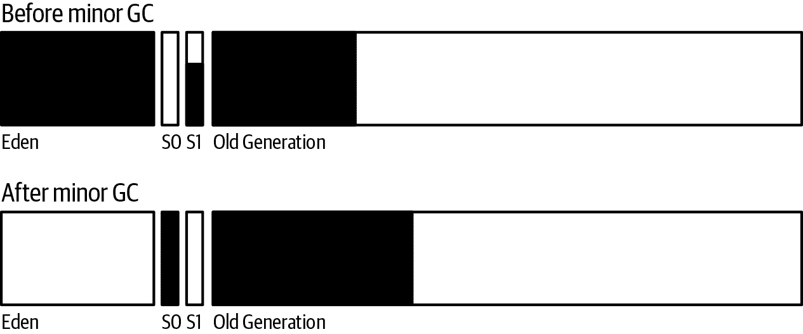
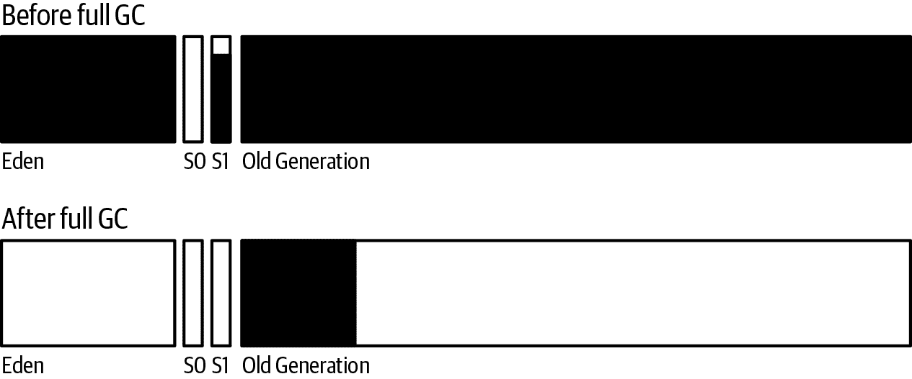
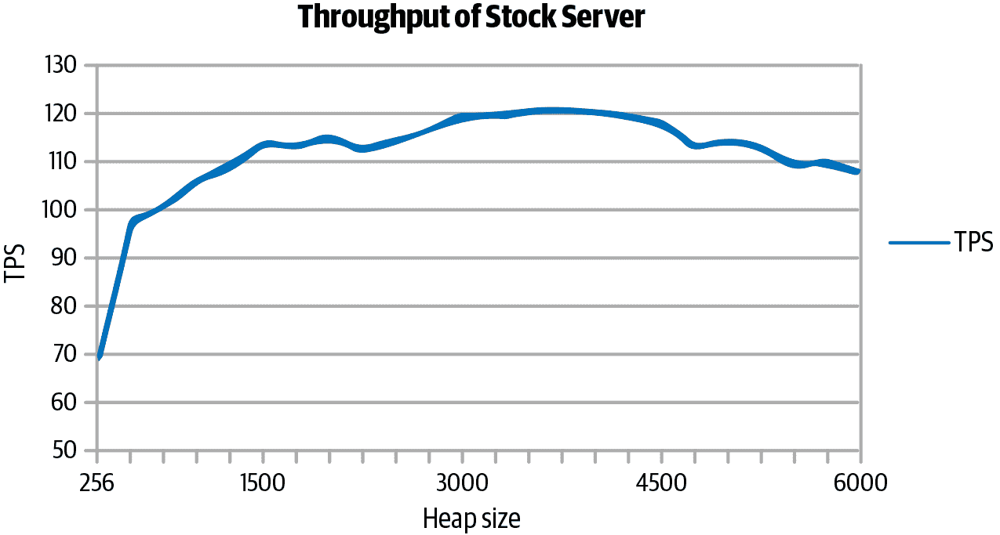
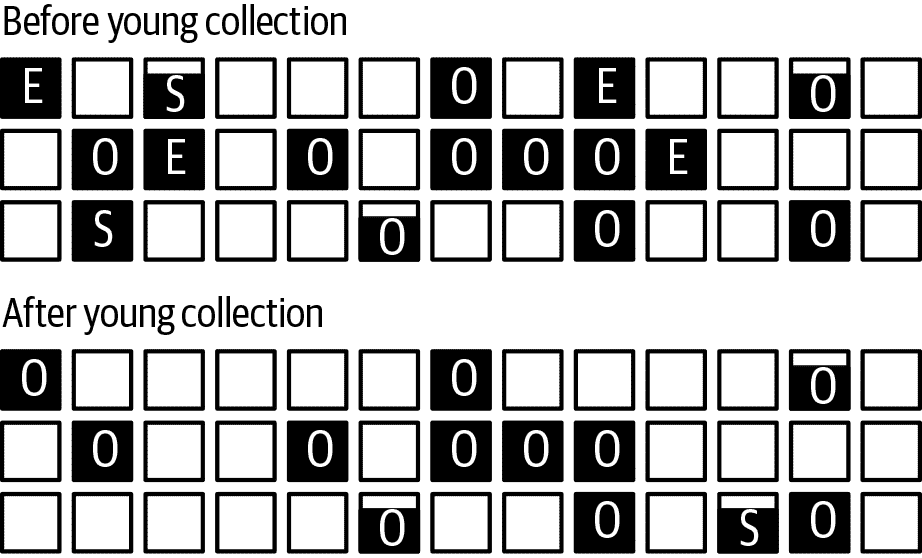
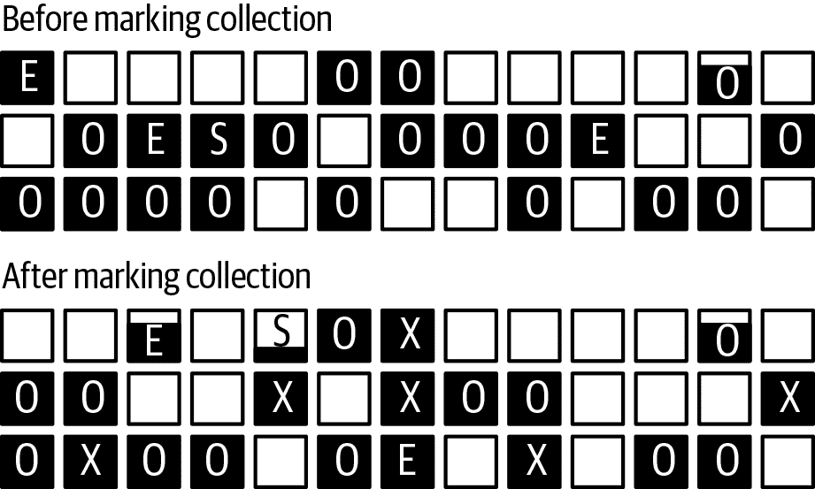
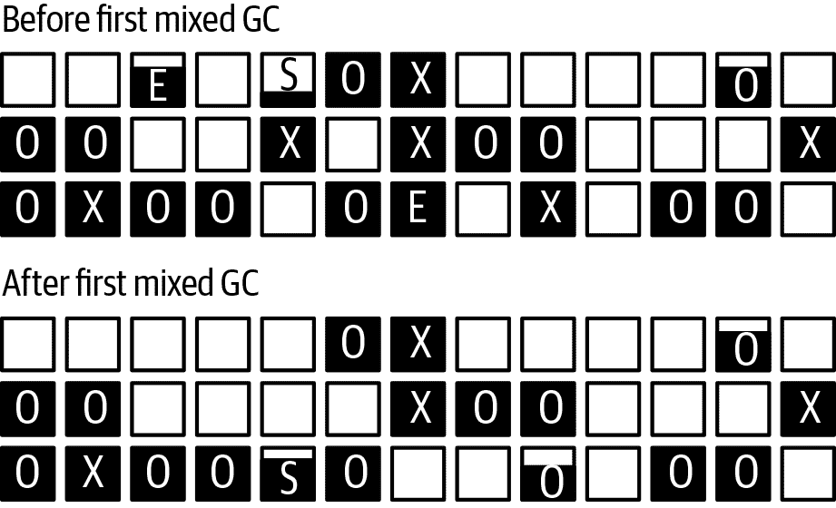
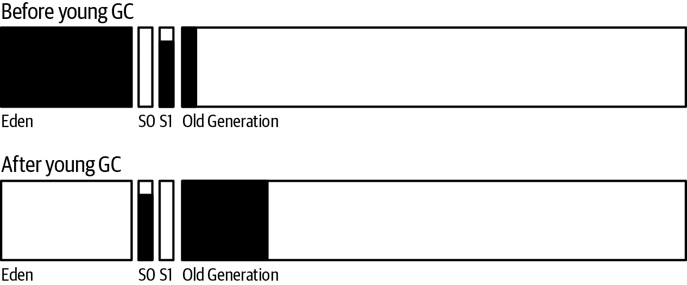
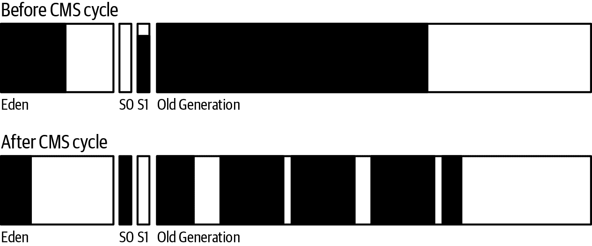
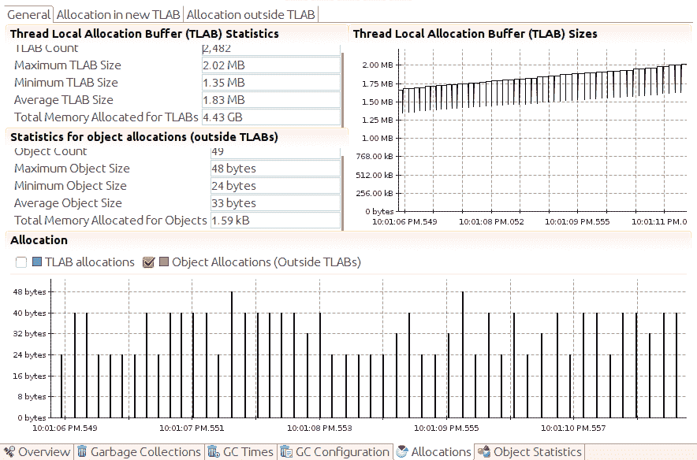
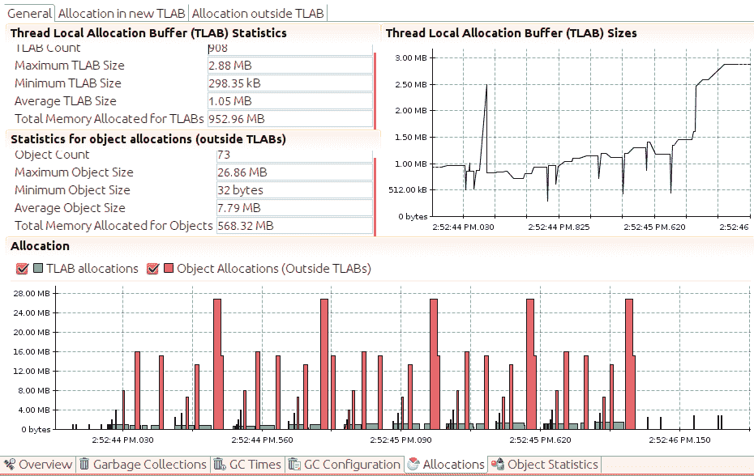

# 第六章 垃圾收集算法

第五章研究了所有垃圾收集器的一般行为，包括适用于所有 GC 算法的 JVM 标志：如何选择堆大小、代大小、日志记录等。基本的垃圾收集调优适用于许多情况。当它们不适用时，就需要检查正在使用的 GC 算法的具体操作，以确定如何更改其参数以最小化对应用程序的影响。

调整单个收集器所需的关键信息是在启用该收集器时从 GC 日志中获取的数据。因此，本章从查看每个算法的日志输出的角度开始，这使我们能够理解 GC 算法的工作原理及如何调整以获得更好的性能。然后，每个部分都包括调优信息以实现更佳的性能。

本章还涵盖了一些新的实验性收集器的详细信息。目前写作时，这些收集器可能不是百分之百稳定的，但很可能会在下一个 Java LTS 版本发布时成为成熟的、适合生产的收集器（就像 G1 GC 最初是实验性收集器，现在成为 JDK 11 的默认选择）。

几种不寻常的情况影响所有 GC 算法的性能：分配非常大的对象、既不短命也不长寿的对象等。本章末尾将涵盖这些情况。

# 理解吞吐量收集器

我们将从查看各个垃圾收集器开始，首先是吞吐量收集器。尽管我们已经看到 G1 GC 收集器通常更受欢迎，但吞吐量收集器的细节更为简单，更好地奠定了理解工作原理的基础。

回顾第五章中的内容，垃圾收集器必须执行三个基本操作：找到未使用的对象、释放它们的内存并压缩堆。吞吐量收集器在同一 GC 周期内执行所有这些操作；这些操作合称为*收集*。这些收集器可以在单个操作期间收集青年代或老年代。

图 6-1 显示了进行年轻代收集前后的堆。



###### 图 6-1 吞吐量 GC 年轻代收集

当 Eden 区填满时，会发生年轻代收集。年轻代收集将所有对象移出 Eden 区：一些对象移动到一个幸存者空间（本图中的 S0），一些对象移动到老年代，从而导致老年代包含更多对象。当然，许多对象因不再被引用而被丢弃。

因为 Eden 区在此操作后通常为空，考虑到它已经被压缩，这可能看起来有些不寻常，但这正是其效果。

在使用`PrintGCDetails`的 JDK 8 GC 日志中，吞吐量收集器的小 GC 如下所示：

```java
17.806: [GC (Allocation Failure) [PSYoungGen: 227983K->14463K(264128K)]
             280122K->66610K(613696K), 0.0169320 secs]
	     [Times: user=0.05 sys=0.00, real=0.02 secs]
```

此 GC 在程序开始后的 17.806 秒发生。年轻代中的对象现在占据了 14,463 KB（14 MB，在幸存者空间中）；在 GC 之前，它们占据了 227,983 KB（227 MB）。¹ 此时年轻代的总大小为 264 MB。

与此同时，堆的整体占用量（包括年轻代和老年代）从 280 MB 减少到 66 MB，此时整个堆的大小为 613 MB。此操作花费的时间不到 0.02 秒（输出末尾的 0.02 秒实际上是 0.0169320 秒，四舍五入）。程序消耗的 CPU 时间比实际时间更多，因为年轻代收集是由多个线程完成的（在此配置中，有四个线程）。

在 JDK 11 中，相同的日志看起来可能是这样的：

```java
[17.805s][info][gc,start       ] GC(4) Pause Young (Allocation Failure)
[17.806s][info][gc,heap        ] GC(4) PSYoungGen: 227983K->14463K(264128K)
[17.806s][info][gc,heap        ] GC(4) ParOldGen: 280122K->66610K(613696K)
[17.806s][info][gc,metaspace   ] GC(4) Metaspace: 3743K->3743K(1056768K)
[17.806s][info][gc             ] GC(4) Pause Young (Allocation Failure)
                                          496M->79M(857M) 16.932ms
[17.086s][info][gc,cpu         ] GC(4) User=0.05s Sys=0.00s Real=0.02s
```

这里的信息是相同的；只是格式不同。这个日志条目有多行；前一个日志条目实际上是一行（但在这种格式中不会重现）。此日志还打印出元空间的大小，但这些在年轻代收集期间永远不会改变。元空间也不包括在此示例的第五行报告的总堆大小中。

图 6-2 显示了在进行完整的 GC 之前和之后堆的情况。



###### 图 6-2\. 吞吐量完整的 GC

老年代收集器会释放年轻代中的所有内容。只有那些具有活动引用的对象才会留在老年代中，并且所有这些对象都已经被压缩，以便老年代的开始被占用，其余部分为空闲。

GC 日志报告的操作类似于这样：

```java
64.546: [Full GC (Ergonomics) [PSYoungGen: 15808K->0K(339456K)]
          [ParOldGen: 457753K->392528K(554432K)] 473561K->392528K(893888K)
	  [Metaspace: 56728K->56728K(115392K)], 1.3367080 secs]
	  [Times: user=4.44 sys=0.01, real=1.34 secs]
```

现在，年轻代占用了 0 字节（其大小为 339 MB）。请注意，在图中这意味着幸存者空间也已被清除。老年代中的数据从 457 MB 减少到 392 MB，因此整个堆使用量从 473 MB 降至 392 MB。元空间的大小未改变；在大多数完整的 GC 中不会对其进行收集。（如果元空间空间不足，JVM 将运行完整的 GC 来收集它，并且您将看到元空间的大小发生变化；稍后我会展示这一点。）由于在完整的 GC 中有大量工作要做，因此实际花费了 1.3 秒的时间，以及 4.4 秒的 CPU 时间（再次为四个并行线程）。

JDK 11 中类似的日志如下：

```java
[63.205s][info][gc,start       ] GC(13) Pause Full (Ergonomics)
[63.205s][info][gc,phases,start] GC(13) Marking Phase
[63.314s][info][gc,phases      ] GC(13) Marking Phase 109.273ms
[63.314s][info][gc,phases,start] GC(13) Summary Phase
[63.316s][info][gc,phases      ] GC(13) Summary Phase 1.470ms
[63.316s][info][gc,phases,start] GC(13) Adjust Roots
[63.331s][info][gc,phases      ] GC(13) Adjust Roots 14.642ms
[63.331s][info][gc,phases,start] GC(13) Compaction Phase
[63.482s][info][gc,phases      ] GC(13) Compaction Phase 1150.792ms
[64.482s][info][gc,phases,start] GC(13) Post Compact
[64.546s][info][gc,phases      ] GC(13) Post Compact 63.812ms
[64.546s][info][gc,heap        ] GC(13) PSYoungGen: 15808K->0K(339456K)
[64.546s][info][gc,heap        ] GC(13) ParOldGen: 457753K->392528K(554432K)
[64.546s][info][gc,metaspace   ] GC(13) Metaspace: 56728K->56728K(115392K)
[64.546s][info][gc             ] GC(13) Pause Full (Ergonomics)
                                            462M->383M(823M) 1336.708ms
[64.546s][info][gc,cpu         ] GC(13) User=4.446s Sys=0.01s Real=1.34s
```

# 快速总结

+   吞吐量收集器有两个操作：次要收集和完整的 GC，每个操作都标记、释放和压缩目标代。

+   从 GC 日志中获取的时间是确定 GC 对使用这些收集器的应用程序的整体影响的快速方法。

## 自适应和静态堆大小调整

调整吞吐量收集器关键在于暂停时间，以及在整体堆大小和老年代与年轻代大小之间取得平衡。

在这里需要考虑两个权衡。首先，我们有时间与空间之间的经典编程权衡。更大的堆在机器上消耗更多内存，消耗该内存的好处（至少在一定程度上）是应用程序将具有更高的吞吐量。

第二个权衡涉及执行 GC 所需的时间长度。通过增加堆大小可以减少完全 GC 暂停的次数，但这可能会因 GC 时间较长而导致平均响应时间增加。同样，通过将更多的堆分配给年轻代而不是老年代可以缩短完全 GC 暂停时间，但这反过来会增加老年代 GC 集合的频率。

这些权衡的影响显示在图 6-3 中。该图显示了以不同堆大小运行的股票 REST 服务器的最大吞吐量。对于较小的 256 MB 堆，服务器在 GC 中花费了大量时间（实际上是总时间的 36%）；因此吞吐量受限。随着堆大小的增加，吞吐量迅速增加，直到堆大小设置为 1,500 MB。之后，吞吐量增加速度较慢：此时应用程序并非真正受 GC 限制（GC 时间约占总时间的 6%）。边际收益递减法已悄然而至：应用程序可以使用额外内存以提高吞吐量，但增益变得更有限。

在堆大小达到 4,500 MB 后，吞吐量开始略微下降。此时，应用程序已经达到了第二个权衡：额外的内存导致更长的 GC 周期，即使这些周期较少，也会降低总体吞吐量。

此图中的数据是通过在 JVM 中禁用自适应大小调整来获取的；最小堆和最大堆大小设置为相同值。可以在任何应用程序上运行实验，并确定堆和代的最佳大小，但通常更容易让 JVM 做出这些决策（这通常是发生的，因为默认情况下启用了自适应大小调整）。



###### 图 6-3。各种堆大小的吞吐量

在吞吐量收集器中，自适应大小调整堆（和代）以满足其暂停时间目标。这些目标是使用以下标志设置的：`-XX:MaxGCPauseMillis=`*`N`* 和 `-XX:GCTimeRatio=`*`N`*。

`MaxGCPauseMillis` 标志指定应用程序愿意容忍的最大暂停时间。可能会有诱惑将其设置为 0，或者像 50 毫秒这样的小值。请注意，此目标适用于次要 GC 和完全 GC。如果使用非常小的值，应用程序将会得到非常小的老年代：例如可以在 50 毫秒内清理的老年代。这将导致 JVM 执行非常频繁的完全 GC，性能将非常糟糕。因此，请保持现实：将该值设置为可以实现的值。默认情况下，此标志未设置。

`GCTimeRatio`标志指定您愿意应用程序在 GC 中花费的时间量（与其应用级线程运行时间相比）。这是一个比率，因此*`N`*的值需要一些思考。该值在以下方程中使用，以确定应用程序线程理想情况下应该运行的时间百分比：

<math alttext="upper T h r o u g h p u t upper G o a l equals 1 minus StartFraction 1 Over left-parenthesis 1 plus upper G upper C upper T i m e upper R a t i o right-parenthesis EndFraction" display="block"><mrow><mi>T</mi> <mi>h</mi> <mi>r</mi> <mi>o</mi> <mi>u</mi> <mi>g</mi> <mi>h</mi> <mi>p</mi> <mi>u</mi> <mi>t</mi> <mi>G</mi> <mi>o</mi> <mi>a</mi> <mi>l</mi> <mo>=</mo> <mn>1</mn> <mo>-</mo> <mfrac><mn>1</mn> <mrow><mo>(</mo><mn>1</mn><mo>+</mo><mi>G</mi><mi>C</mi><mi>T</mi><mi>i</mi><mi>m</mi><mi>e</mi><mi>R</mi><mi>a</mi><mi>t</mi><mi>i</mi><mi>o</mi><mo>)</mo></mrow></mfrac></mrow></math>

`GCTimeRatio`的默认值为 99。将该值代入方程得出 0.99，意味着目标是在应用程序处理中花费 99%的时间，仅在 GC 中花费 1%的时间。但不要被默认情况下这些数字如何对应所迷惑。`GCTimeRatio`为 95 并不意味着 GC 应该运行高达 5%的时间：它意味着 GC 应该运行高达 1.94%的时间。

更容易的做法是决定您希望应用程序执行工作的最低百分比（例如，95%），然后根据以下方程计算`GCTimeRatio`的值：

<math alttext="upper G upper C upper T i m e upper R a t i o equals StartFraction upper T h r o u g h p u t Over left-parenthesis 1 minus upper T h r o u g h p u t right-parenthesis EndFraction" display="block"><mrow><mi>G</mi> <mi>C</mi> <mi>T</mi> <mi>i</mi> <mi>m</mi> <mi>e</mi> <mi>R</mi> <mi>a</mi> <mi>t</mi> <mi>i</mi> <mi>o</mi> <mo>=</mo> <mfrac><mrow><mi>T</mi><mi>h</mi><mi>r</mi><mi>o</mi><mi>u</mi><mi>g</mi><mi>h</mi><mi>p</mi><mi>u</mi><mi>t</mi></mrow> <mrow><mo>(</mo><mn>1</mn><mo>-</mo><mi>T</mi><mi>h</mi><mi>r</mi><mi>o</mi><mi>u</mi><mi>g</mi><mi>h</mi><mi>p</mi><mi>u</mi><mi>t</mi><mo>)</mo></mrow></mfrac></mrow></math>

对于通过量目标为 95%（0.95），该方程得出`GCTimeRatio`为 19。

JVM 使用这两个标志在初始（`-Xms`）和最大（`-Xmx`）堆大小建立的边界内设置堆的大小。`MaxGCPauseMillis`标志优先级较高：如果设置了该标志，则调整年轻代和老年代的大小，直到达到暂停时间目标。一旦达到目标，堆的总体大小将增加，直到达到时间比率目标。一旦两个目标都达到，JVM 将尝试减少堆的大小，以便最终达到满足这两个目标的最小可能堆大小。

因为默认情况下未设置暂停时间目标，自动堆大小调整的常见效果是堆（和代数）大小将增加，直到满足`GCTimeRatio`目标。尽管如此，该标志的默认设置实际上是乐观的。当然，您的经验会有所不同，但我更习惯于看到应用程序在 GC 中花费 3%到 6%的时间，并表现良好。有时甚至我会在内存严重受限的环境中处理应用程序，这些应用程序最终会在 GC 中花费 10%到 15%的时间。GC 对这些应用程序的性能有重大影响，但总体性能目标仍然能够达到。

因此，最佳设置将根据应用程序目标而异。在没有其他目标的情况下，我从时间比率 19 开始（GC 中的时间为 5%）。

[表 6-1](https://wiki.example.org/table_gc_autotune_default)展示了这种动态调优对于需要小堆且几乎不进行 GC 的应用程序的影响（这是具有少量长寿命周期对象的标准 REST 服务器）。

表 6-1\. 动态 GC 调优效果

| GC 设置 | 结束堆大小 | GC 中的时间百分比 | OPS |
| --- | --- | --- | --- |
| 默认 | 649 MB | 0.9% | 9.2 |
| `MaxGCPauseMillis=50ms` | 560 MB | 1.0% | 9.2 |
| `Xms=Xmx=2048m` | 2 GB | 0.04% | 9.2 |

默认情况下，堆的最小大小为 64 MB，最大大小为 2 GB（由于机器具有 8 GB 物理内存）。在这种情况下，`GCTimeRatio` 的工作就如预期的那样：堆动态调整为 649 MB，此时应用程序在 GC 中花费的总时间约为总时间的 1%。

在这种情况下设置 `MaxGCPauseMillis` 标志开始减小堆的大小以满足暂停时间目标。因为在此示例中垃圾收集器的工作量很小，所以它成功地仅花费总时间的 1% 在 GC 中，同时保持了 9.2 OPS 的吞吐量。

最后，请注意，并非总是越多越好。完整的 2 GB 堆确实意味着应用程序在 GC 中花费的时间较少，但在这里 GC 并非主要的性能因素，因此吞吐量并未增加。通常情况下，花费时间优化应用程序的错误区域并没有帮助。

如果将相同的应用程序更改为每个用户在全局缓存中保存先前的 50 个请求（例如，像 JPA 缓存那样），垃圾收集器将需要更加努力。表 6-2 显示了这种情况下的权衡。

表 6-2\. 堆占用对动态 GC 调优的影响

| GC 设置 | 最终堆大小 | GC 时间百分比 | OPS |
| --- | --- | --- | --- |
| 默认 | 1.7 GB | 9.3% | 8.4 |
| `MaxGCPauseMillis=50ms` | 588 MB | 15.1% | 7.9 |
| `Xms=Xmx=2048m` | 2 GB | 5.1% | 9.0 |
| `Xmx=3560M`; `MaxGCRatio=19` | 2.1 GB | 8.8% | 9.0 |

在一个花费大量时间在 GC 中的测试中，GC 的行为是不同的。JVM 永远无法满足此测试的 1% 吞吐量目标；它尽力适应默认目标，并做出了合理的工作，使用了 1.7 GB 的空间。

当给出一个不切实际的暂停时间目标时，应用程序的行为变得更糟。为了达到 50 ms 的收集时间，堆保持为 588 MB，但这意味着现在 GC 变得过于频繁。因此，吞吐量显著下降。在这种情况下，更好的性能来自于指示 JVM 通过将初始大小和最大大小都设置为 2 GB 来利用整个堆。

最后，表的最后一行显示了当堆大小合理时会发生的情况，并且我们设置了一个实际的时间比例目标为 5%。JVM 自身确定大约 2 GB 是最佳的堆大小，并且它实现了与手动调优情况相同的吞吐量。

# 快速总结

+   动态堆调整是堆大小调整的良好首步。对于大部分应用程序而言，这将是唯一需要的，动态设置将最小化 JVM 的内存使用。

+   可以静态地调整堆大小以获得最大可能的性能。JVM 为一组合理的性能目标确定的大小是调整的良好起点。

# 理解 G1 垃圾收集器

G1 GC 在堆内操作离散的区域。每个区域（默认约为 2,048 个）可以属于老年代或新生代，并且代的区域不一定是连续的。在老年代有区域的想法是，当并发后台线程寻找无引用对象时，某些区域将包含比其他区域更多的垃圾。一个区域的实际收集仍然需要停止应用线程，但是 G1 GC 可以专注于主要是垃圾的区域，并且只花一点时间清空这些区域。这种方法——仅清理主要是垃圾的区域——是 G1 GC 名称的由来：垃圾优先。

这不适用于年轻代的区域：在年轻代 GC 期间，整个年轻代要么被释放，要么被晋升（到幸存者空间或老年代）。尽管如此，年轻代是以区域来定义的，部分原因是如果区域预定义，调整大小的代就更容易。

G1 GC 被称为*并发收集器*，因为在老年代内自由对象的标记与应用线程同时进行（即它们保持运行）。但它并不完全是并发的，因为年轻代的标记和压缩需要停止所有应用线程，并且老年代的压缩也发生在应用线程停止时。

G1 GC 有四个逻辑操作：

+   年轻代收集

+   背景，并发标记周期

+   混合收集

+   如果需要，进行完整的 GC

我们将依次查看每个操作，从 G1 GC 年轻代收集开始，如图 6-4 所示。



###### 图 6-4\. G1 GC 年轻代收集

此图中每个小方块代表一个 G1 GC 区域。每个区域的数据由黑色区域表示，区域内的字母标识其属于的代（[E]den，[O]ld generation，[S]urvivor space）。空白区域不属于任何代；G1 GC 根据需要任意使用它们。

当 Eden 填满时（在本例中，填满了四个区域），触发 G1 GC 年轻代收集。收集后，Eden 为空（尽管区域被分配给它，随着应用程序的进行，这些区域将开始填充数据）。至少有一个区域被分配给了幸存者空间（在此示例中部分填充），并且一些数据已经移动到了老年代。

在 G1 中，GC 日志对这个收集过程的描述与其他收集器有些不同。JDK 8 的示例日志使用了`PrintGCDetails`，但是 G1 GC 的日志细节更加详细。这些示例只展示了一些重要的行。

这是年轻代的标准收集过程：

```java
23.430: [GC pause (young), 0.23094400 secs]
...
   [Eden: 1286M(1286M)->0B(1212M)
   	Survivors: 78M->152M Heap: 1454M(4096M)->242M(4096M)]
   [Times: user=0.85 sys=0.05, real=0.23 secs]
```

年轻代的收集在真实时间中花费了 0.23 秒，其中 GC 线程消耗了 0.85 秒的 CPU 时间。共移出了 1,286 MB 的对象从伊甸园（自适应调整大小为 1,212 MB），其中 74 MB 移至存活区（其大小从 78 M 增至 152 MB），其余对象被释放。我们通过观察堆总占用减少了 1,212 MB 来确认它们已被释放。在一般情况下，一些存活区的对象可能会被移至老年代，如果存活区满了，一些来自伊甸园的对象则会直接晋升到老年代——在这些情况下，老年代的大小会增加。

JDK 11 中类似的日志如下：

```java
[23.200s][info   ][gc,start     ] GC(10) Pause Young (Normal)
                                           (G1 Evacuation Pause)
[23.200s][info   ][gc,task      ] GC(10) Using 4 workers of 4 for evacuation
[23.430s][info   ][gc,phases    ] GC(10)   Pre Evacuate Collection Set: 0.0ms
[23.430s][info   ][gc,phases    ] GC(10)   Evacuate Collection Set: 230.3ms
[23.430s][info   ][gc,phases    ] GC(10)   Post Evacuate Collection Set: 0.5ms
[23.430s][info   ][gc,phases    ] GC(10)   Other: 0.1ms
[23.430s][info   ][gc,heap      ] GC(10) Eden regions: 643->606(606)
[23.430s][info   ][gc,heap      ] GC(10) Survivor regions: 39->76(76)
[23.430s][info   ][gc,heap      ] GC(10) Old regions: 67->75
[23.430s][info   ][gc,heap      ] GC(10) Humongous regions: 0->0
[23.430s][info   ][gc,metaspace ] GC(10) Metaspace: 18407K->18407K(1067008K)
[23.430s][info   ][gc           ] GC(10) Pause Young (Normal)
                                           (G1 Evacuation Pause)
                                           1454M(4096M)->242M(4096M) 230.104ms
[23.430s][info   ][gc,cpu       ] GC(10) User=0.85s Sys=0.05s Real=0.23s
```

并发的 G1 GC 周期开始和结束如图 6-5 所示。



###### Figure 6-5\. G1 GC 执行的并发收集

该图表显示了三个要观察的重要点。首先，年轻代已经改变了其占用：在并发周期内可能会有至少一个（甚至更多）年轻代收集。因此，在标记周期之前的伊甸园区域已经完全释放，并且开始分配新的伊甸园区域。

其次，现在一些区域被标记为 X。这些区域属于老年代（请注意它们仍然包含数据）——这些是标记周期确定包含大部分垃圾的区域。

最后，请注意，老年代（由带有 O 或 X 标记的区域组成）在周期完成后实际上更加占用。这是因为标记周期期间发生的年轻代收集将数据晋升到了老年代。此外，标记周期实际上并不释放老年代中的任何数据：它只是识别大部分是垃圾的区域。这些区域的数据将在稍后的周期中释放。

G1 GC 的并发周期有几个阶段，有些会停止所有应用线程，有些则不会。第一个阶段称为*initial-mark*（在 JDK 8 中）或*concurrent start*（在 JDK 11 中）。该阶段停止所有应用线程——部分因为它也执行了年轻代收集，并设置了周期的后续阶段。

在 JDK 8 中，看起来是这样的：

```java
50.541: [GC pause (G1 Evacuation pause) (young) (initial-mark), 0.27767100 secs]
    ... lots of other data ...
    [Eden: 1220M(1220M)->0B(1220M)
    	Survivors: 144M->144M Heap: 3242M(4096M)->2093M(4096M)]
    [Times: user=1.02 sys=0.04, real=0.28 secs]
```

并在 JDK 11 中：

```java
[50.261s][info   ][gc,start      ] GC(11) Pause Young (Concurrent Start)
                                              (G1 Evacuation Pause)
[50.261s][info   ][gc,task       ] GC(11) Using 4 workers of 4 for evacuation
[50.541s][info   ][gc,phases     ] GC(11)   Pre Evacuate Collection Set: 0.1ms
[50.541s][info   ][gc,phases     ] GC(11)   Evacuate Collection Set: 25.9ms
[50.541s][info   ][gc,phases     ] GC(11)   Post Evacuate Collection Set: 1.7ms
[50.541s][info   ][gc,phases     ] GC(11)   Other: 0.2ms
[50.541s][info   ][gc,heap       ] GC(11) Eden regions: 1220->0(1220)
[50.541s][info   ][gc,heap       ] GC(11) Survivor regions: 144->144(144)
[50.541s][info   ][gc,heap       ] GC(11) Old regions: 1875->1946
[50.541s][info   ][gc,heap       ] GC(11) Humongous regions: 3->3
[50.541s][info   ][gc,metaspace  ] GC(11) Metaspace: 52261K->52261K(1099776K)
[50.541s][info   ][gc            ] GC(11) Pause Young (Concurrent Start)
                                              (G1 Evacuation Pause)
                                              1220M->0B(1220M) 280.055ms
[50.541s][info   ][gc,cpu        ] GC(11) User=1.02s Sys=0.04s Real=0.28s
```

就像普通的年轻代收集一样，应用线程被停止（持续 0.28 秒），并且年轻代被清空（因此伊甸园最终大小为 0）。从年轻代移动了 71 MB 的数据到老年代。在 JDK 8 中有些难以理解（为 2,093 - 3,242 + 1,220）；而 JDK 11 的输出更清晰地显示了这一点。

另一方面，JDK 11 的输出包含了一些我们还没有讨论过的内容的引用。首先是大小以区域而不是 MB 为单位。我们将在本章后面讨论区域大小，但在本示例中，区域大小为 1 MB。此外，JDK 11 还提到了一个新领域：巨大区域。那是老年代的一部分，也将在本章后面讨论。

初始标记或并发开始日志消息宣布后台并发周期已经开始。由于标记周期的初始标记阶段也需要停止所有应用程序线程，所以 G1 GC 利用了年轻代 GC 周期来完成这项工作。将初始标记阶段添加到年轻代 GC 的影响并不大：它使用的 CPU 周期比之前的收集（仅仅是一个普通的年轻代收集）多了 20%，尽管暂停时间略长。（幸运的是，机器上有多余的 CPU 周期供并行 G1 线程使用，否则暂停时间将会更长。）

接下来，G1 GC 扫描根区域：

```java
50.819: [GC concurrent-root-region-scan-start]
51.408: [GC concurrent-root-region-scan-end, 0.5890230]

[50.819s][info ][gc             ] GC(20) Concurrent Cycle
[50.819s][info ][gc,marking     ] GC(20) Concurrent Clear Claimed Marks
[50.828s][info ][gc,marking     ] GC(20) Concurrent Clear Claimed Marks 0.008ms
[50.828s][info ][gc,marking     ] GC(20) Concurrent Scan Root Regions
[51.408s][info ][gc,marking     ] GC(20) Concurrent Scan Root Regions 589.023ms
```

这个过程需要 0.58 秒，但不会停止应用程序线程；它只使用后台线程。然而，这个阶段不能被年轻代收集打断，因此为这些后台线程提供可用的 CPU 周期至关重要。如果在根区域扫描期间年轻代填满了，那么年轻代收集（已经停止所有应用程序线程）必须等待根扫描完成。实际上，这意味着收集年轻代需要比平常更长的暂停时间。这种情况在 GC 日志中显示如下：

```java
350.994: [GC pause (young)
	351.093: [GC concurrent-root-region-scan-end, 0.6100090]
	351.093: [GC concurrent-mark-start],
	0.37559600 secs]

[350.384s][info][gc,marking   ] GC(50) Concurrent Scan Root Regions
[350.384s][info][gc,marking   ] GC(50) Concurrent Scan Root Regions 610.364ms
[350.994s][info][gc,marking   ] GC(50) Concurrent Mark (350.994s)
[350.994s][info][gc,marking   ] GC(50) Concurrent Mark From Roots
[350.994s][info][gc,task      ] GC(50) Using 1 workers of 1 for marking
[350.994s][info][gc,start     ] GC(51) Pause Young (Normal) (G1 Evacuation Pause)
```

这里的 GC 暂停在根区域扫描结束之前开始。在 JDK 8 中，GC 日志中的交错输出表明年轻代收集必须暂停等待根区域扫描完成才能继续进行。在 JDK 11 中，这有点难以检测：你必须注意到根区域扫描结束的时间戳恰好与下一个年轻代收集开始的时间戳相同。

无论哪种情况，都无法准确知道年轻代收集延迟了多长时间。在这个例子中，它并不一定会延迟整整 610 毫秒；在那段时间内（直到年轻代实际填满），事情仍在继续。但在这种情况下，时间戳显示应用程序线程等待了额外的约 100 毫秒—这就是为什么年轻代 GC 暂停的持续时间比日志中其他暂停的平均持续时间长约 100 毫秒的原因（如果这种情况经常发生，这表明 G1 GC 需要更好地调整，如下一节所讨论的）。

在根区域扫描之后，G1 GC 进入并发标记阶段。这完全在后台进行；开始和结束时会打印一条消息：

```java
111.382: [GC concurrent-mark-start]
....
120.905: [GC concurrent-mark-end, 9.5225160 sec]

[111.382s][info][gc,marking   ] GC(20) Concurrent Mark (111.382s)
[111.382s][info][gc,marking   ] GC(20) Concurrent Mark From Roots
...
[120.905s][info][gc,marking   ] GC(20) Concurrent Mark From Roots 9521.994ms
[120.910s][info][gc,marking   ] GC(20) Concurrent Preclean
[120.910s][info][gc,marking   ] GC(20) Concurrent Preclean 0.522ms
[120.910s][info][gc,marking   ] GC(20) Concurrent Mark (111.382s, 120.910s)
                                         9522.516ms
```

并发标记可以被中断，因此在此阶段可能发生年轻代收集（因此在省略号处会有大量 GC 输出）。

还请注意，在 JDK 11 示例中，输出具有与根区域扫描发生时相同的 GC 记录—20—。我们正在更细化地分解操作，而不像 JDK 日志将整个后台扫描视为一个操作。例如，当并发标记不能时，根扫描可能会引入暂停。

标记阶段后是重新标记阶段和正常的清理阶段：

```java
120.910: [GC remark 120.959:
	[GC ref-PRC, 0.0000890 secs], 0.0718990 secs]
 	[Times: user=0.23 sys=0.01, real=0.08 secs]
120.985: [GC cleanup 3510M->3434M(4096M), 0.0111040 secs]
 	[Times: user=0.04 sys=0.00, real=0.01 secs]

[120.909s][info][gc,start     ] GC(20) Pause Remark
[120.909s][info][gc,stringtable] GC(20) Cleaned string and symbol table,
                                           strings: 1369 processed, 0 removed,
                                           symbols: 17173 processed, 0 removed
[120.985s][info][gc            ] GC(20) Pause Remark 2283M->862M(3666M) 80.412ms
[120.985s][info][gc,cpu        ] GC(20) User=0.23s Sys=0.01s Real=0.08s
```

这些阶段会停止应用程序线程，尽管通常只是短暂的时间。接下来会同时进行额外的清理阶段：

```java
120.996: [GC concurrent-cleanup-start]
120.996: [GC concurrent-cleanup-end, 0.0004520]

[120.878s][info][gc,start      ] GC(20) Pause Cleanup
[120.879s][info][gc            ] GC(20) Pause Cleanup 1313M->1313M(3666M) 1.192ms
[120.879s][info][gc,cpu        ] GC(20) User=0.00s Sys=0.00s Real=0.00s
[120.879s][info][gc,marking    ] GC(20) Concurrent Cleanup for Next Mark
[120.996s][info][gc,marking    ] GC(20) Concurrent Cleanup for Next Mark
                                          117.168ms
[120.996s][info][gc            ] GC(20) Concurrent Cycle 70,177.506ms
```

而常规的 G1 GC 后台标记周期完成了——至少在找到垃圾方面如此。但实际上，很少有内存被释放。在清理阶段中回收了一点内存，但到目前为止，G1 GC 真正做的只是识别出大部分是垃圾并可以回收的旧区域（在 图 6-5 中用 X 标记的区域）。

现在 G1 GC 执行一系列混合 GC。它们被称为“混合”是因为它们执行了正常的年轻代收集，同时也收集了后台扫描中的一些标记区域。混合 GC 的效果显示在 图 6-6 中。

就像对于年轻代的收集一样，G1 GC 已经完全清空了 Eden 区并调整了幸存者空间。此外，两个标记的区域已被收集。这些区域已知主要包含垃圾，因此它们的大部分被释放了。这些区域中的任何存活数据都被移到另一个区域（就像从年轻代中的区域移到老年代的区域中的存活数据一样）。这就是 G1 GC 如何压缩老年代的方式——在执行时移动对象实质上是压缩堆。



###### 图 6-6\. G1 GC 执行的混合 GC

混合 GC 操作通常在日志中看起来是这样的：

```java
79.826: [GC pause (mixed), 0.26161600 secs]
....
   [Eden: 1222M(1222M)->0B(1220M)
   	Survivors: 142M->144M Heap: 3200M(4096M)->1964M(4096M)]
   [Times: user=1.01 sys=0.00, real=0.26 secs]

[3.800s][info][gc,start      ] GC(24) Pause Young (Mixed) (G1 Evacuation Pause)
[3.800s][info][gc,task       ] GC(24) Using 4 workers of 4 for evacuation
[3.800s][info][gc,phases     ] GC(24)   Pre Evacuate Collection Set: 0.2ms
[3.825s][info][gc,phases     ] GC(24)   Evacuate Collection Set: 250.3ms
[3.826s][info][gc,phases     ] GC(24)   Post Evacuate Collection Set: 0.3ms
[3.826s][info][gc,phases     ] GC(24)   Other: 0.4ms
[3.826s][info][gc,heap       ] GC(24) Eden regions: 1222->0(1220)
[3.826s][info][gc,heap       ] GC(24) Survivor regions: 142->144(144)
[3.826s][info][gc,heap       ] GC(24) Old regions: 1834->1820
[3.826s][info][gc,heap       ] GC(24) Humongous regions: 4->4
[3.826s][info][gc,metaspace  ] GC(24) Metaspace: 3750K->3750K(1056768K)
[3.826s][info][gc            ] GC(24) Pause Young (Mixed) (G1 Evacuation Pause)
                                          3791M->3791M(3983M) 124.390ms
[3.826s][info][gc,cpu        ] GC(24) User=1.01s Sys=0.00s Real=0.26s
[3.826s][info][gc,start      ] GC(25) Pause Young (Mixed) (G1 Evacuation Pause)
```

注意，整个堆的使用情况已经减少了不止从 Eden 中移除的 1,222 MB。这个差异（16 MB）看起来很小，但要记住，同时一些幸存者空间被提升到老年代；此外，每个混合 GC 仅清理了目标老年代区域的一部分。随着我们的继续，你会发现确保混合 GC 清理足够的内存以防止未来并发故障是很重要的。

在 JDK 11 中，第一个混合 GC 被标记为 `Prepared Mixed` 并紧随并发清理之后。

混合 GC 循环将继续，直到几乎所有标记的区域都被收集，此时 G1 GC 将恢复常规的年轻代 GC 周期。最终，G1 GC 将开始另一个并发周期，确定应该释放老年代的哪些区域。

虽然混合 GC 循环通常在 GC 原因中标记为`(Mixed)`，但有时在并发循环后（即`G1 Evacuation Pause`）会正常标记年轻代收集。如果并发循环发现老年代中可以完全释放的区域，则这些区域会在常规的年轻代撤离暂停期间被回收。技术上来说，这不是收集器实现中的混合循环。但从逻辑上讲，是的：对象从年轻代被释放或晋升到老年代，同时垃圾对象（实际上是区域）从老年代被释放。

如果一切顺利，这就是您在 GC 日志中看到的所有 GC 活动集。但还有一些失败案例需要考虑。

有时您会在日志中观察到完整 GC，这表明需要更多调整（包括可能增加堆空间）以提高应用程序性能。主要触发这种情况的是四次：

并发模式失败

G1 GC 启动标记周期，但在完成周期之前，老年代已满。在这种情况下，G1 GC 中止标记周期：

```java
51.408: [GC concurrent-mark-start]
65.473: [Full GC 4095M->1395M(4096M), 6.1963770 secs]
 [Times: user=7.87 sys=0.00, real=6.20 secs]
71.669: [GC concurrent-mark-abort]

[51.408][info][gc,marking     ] GC(30) Concurrent Mark From Roots
...
[65.473][info][gc             ] GC(32) Pause Full (G1 Evacuation Pause)
                                          4095M->1305M(4096M) 60,196.377
...
[71.669s][info][gc,marking     ] GC(30) Concurrent Mark From Roots 191ms
[71.669s][info][gc,marking     ] GC(30) Concurrent Mark Abort
```

这意味着应该增加堆大小，必须尽快开始 G1 GC 后台处理，或者必须调整周期以更快运行（例如使用额外的后台线程）。如何执行这些操作的详细信息如下。

晋升失败

G1 GC 已完成标记周期，并开始执行混合 GC 来清理老区域。在清理足够空间之前，从年轻代晋升的对象太多，因此老年代仍然空间不足。在日志中，混合 GC 立即跟随完整 GC：

```java
2226.224: [GC pause (mixed)
	2226.440: [SoftReference, 0 refs, 0.0000060 secs]
	2226.441: [WeakReference, 0 refs, 0.0000020 secs]
	2226.441: [FinalReference, 0 refs, 0.0000010 secs]
	2226.441: [PhantomReference, 0 refs, 0.0000010 secs]
	2226.441: [JNI Weak Reference, 0.0000030 secs]
		(to-space exhausted), 0.2390040 secs]
....
    [Eden: 0.0B(400.0M)->0.0B(400.0M)
    	Survivors: 0.0B->0.0B Heap: 2006.4M(2048.0M)->2006.4M(2048.0M)]
    [Times: user=1.70 sys=0.04, real=0.26 secs]
2226.510: [Full GC (Allocation Failure)
	2227.519: [SoftReference, 4329 refs, 0.0005520 secs]
	2227.520: [WeakReference, 12646 refs, 0.0010510 secs]
	2227.521: [FinalReference, 7538 refs, 0.0005660 secs]
	2227.521: [PhantomReference, 168 refs, 0.0000120 secs]
	2227.521: [JNI Weak Reference, 0.0000020 secs]
		2006M->907M(2048M), 4.1615450 secs]
    [Times: user=6.76 sys=0.01, real=4.16 secs]

[2226.224s][info][gc            ] GC(26) Pause Young (Mixed)
                                            (G1 Evacuation Pause)
                                            2048M->2006M(2048M) 26.129ms
...
[2226.510s][info][gc,start      ] GC(27) Pause Full (G1 Evacuation Pause)
```

这种失败意味着混合收集需要更快地进行；每个年轻代收集需要处理更多老年代的区域。

撤离失败

在进行年轻代收集时，幸存空间和老年代中没有足够的空间来容纳所有幸存对象。这会在 GC 日志中出现作为特定类型的年轻代 GC：

```java
60.238: [GC pause (young) (to-space overflow), 0.41546900 secs]

[60.238s][info][gc,start       ] GC(28) Pause Young (Concurrent Start)
                                          (G1 Evacuation Pause)
[60.238s][info][gc,task        ] GC(28) Using 4 workers of 4
                                          for evacuation
[60.238s][info][gc             ] GC(28) To-space exhausted
```

这表明堆大部分已满或碎片化。G1 GC 会尝试补偿，但可能会最终执行完整的 GC。简单的解决方法是增加堆大小，虽然“高级调整”中提供了其他可能的解决方案。

巨大分配失败

分配非常大对象的应用程序可能会触发 G1 GC 中的另一种完整 GC；详细信息请参见“G1 GC 分配巨大对象”（包括如何避免）。在 JDK 8 中，除非使用特殊的日志参数，否则无法诊断这种情况，但在 JDK 11 中，可以通过此日志显示：

```java
[3023.091s][info][gc,start     ] GC(54) Pause Full (G1 Humongous Allocation)
```

元数据 GC 阈值

正如我提到的，元空间本质上是一个独立的堆，与主堆独立收集。它不通过 G1 GC 进行收集，但是当 JDK 8 需要收集时，G1 GC 将在主堆上执行完整的 GC（立即在年轻代收集之前）：

```java
0.0535: [GC (Metadata GC Threshold) [PSYoungGen: 34113K->20388K(291328K)]
    73838K->60121K(794112K), 0.0282912 secs]
    [Times: user=0.05 sys=0.01, real=0.03 secs]
0.0566: [Full GC (Metadata GC Threshold) [PSYoungGen: 20388K->0K(291328K)]
    [ParOldGen: 39732K->46178K(584192K)] 60121K->46178K(875520K),
    [Metaspace: 59040K->59036K(1101824K)], 0.1121237 secs]
    [Times: user=0.28 sys=0.01, real=0.11 secs]
```

在 JDK 11 中，元空间可以在不需要完整 GC 的情况下进行收集/调整大小。

# 快速总结

+   G1 有多个循环（并发循环内的阶段）。运行 G1 的良好调整的 JVM 应该只会经历年轻代、混合和并发 GC 循环。

+   在一些 G1 并发阶段会发生小的暂停。

+   如果需要避免完整的 GC 循环，则应对 G1 进行调整。

## G1 GC 的调整

调整 G1 GC 的主要目标是确保没有并发模式或疏散故障会导致需要进行完整的 GC。用于防止完整 GC 的技术也可以在频繁的年轻 GC 必须等待根区域扫描完成时使用。

在 JDK 8 中，调整以避免完整的收集是至关重要的，因为当 G1 GC 在 JDK 8 中执行完整的 GC 时，它会使用一个线程。这会导致比通常更长的暂停时间。在 JDK 11 中，完整的 GC 由多个线程执行，导致较短的暂停时间（基本上与使用吞吐量收集器执行完整 GC 的暂停时间相同）。这种差异是在使用 G1 GC 时更喜欢升级到 JDK 11 的一个原因（尽管一个避免完整 GC 的 JDK 8 应用程序也会表现良好）。

其次，调整可以尽量减少沿途发生的暂停。

这些是防止完整 GC 的选项：

+   增加老年代的大小，可以通过增加总堆空间或调整两代之间的比率来实现。

+   增加后台线程的数量（假设有足够的 CPU）。

+   更频繁地执行 G1 GC 后台活动。

+   增加在混合 GC 循环中完成的工作量。

这里可以应用很多调整，但是 G1 GC 的目标之一是不需要进行太多的调整。为此，G1 GC 主要通过一个标志进行调整：与用于调整吞吐量收集器的相同 `-XX:MaxGCPauseMillis=`*`N`* 标志。

当与 G1 GC 结合使用时（与吞吐量收集器不同），该标志确实具有默认值：200 毫秒。如果 G1 GC 的停止世界阶段的暂停开始超过该值，G1 GC 将尝试进行补偿 — 调整年轻代和老年代的比例、调整堆大小、更早地启动后台处理、更改保留阈值以及（最重要的）在混合 GC 循环期间处理更多或更少的老年代区域。

这里存在一些权衡：如果该值减小，年轻代大小将会收缩以达到暂停时间目标，但会执行更频繁的年轻代 GC。此外，在混合 GC 期间可以收集的老年代区域数量将减少以达到暂停时间目标，这会增加并发模式失败的可能性。

如果设置暂停时间目标不能防止发生全局 GC，可以分别调整这些不同的方面。为 G1 GC 调整堆大小的方法与其他 GC 算法相同。

### **调整 G1 背景线程**

你可以将 G1 GC 的并发标记视为与应用程序线程的竞争：G1 GC 必须更快地清除旧一代，以防止应用程序将新数据提升到其中。要实现这一点，可以尝试增加后台标记线程的数量（假设机器上有足够的 CPU 可用）。

G1 GC 使用两组线程。第一组线程由 `-XX:ParallelGCThreads=*N*` 标志控制，你在 第五章 中首次看到了这个标志。该值影响停止应用程序线程时使用的线程数：年轻和混合收集以及必须停止线程的并发备注周期的阶段。第二个标志是 `-XX:ConcGCThreads=*N*`，它影响用于并发备注的线程数。

`ConcGCThreads` 标志的默认值定义如下：

```java
ConcGCThreads = (ParallelGCThreads + 2) / 4
```

这个划分是基于整数的，因此将有一个后台扫描线程对应五个并行线程，两个后台扫描线程对应六到九个并行线程，依此类推。

增加后台扫描线程的数量将使并发周期变短，这应该会使 G1 GC 在混合 GC 周期结束前更容易释放旧一代，而不会被其他线程再次填满。一如既往，这假设 CPU 周期是可用的；否则，扫描线程将从应用程序中取走 CPU，并有效地引入暂停，就像我们在 第五章 中将串行收集器与 G1 GC 进行比较时看到的那样。

### **调整 G1 GC 的运行频率（更频繁或更少）**

G1 GC 也可以在更早地开始后台标记周期时赢得竞争。该周期从堆达到由 `-XX:InitiatingHeapOccupancyPercent=`*`N`* 指定的占用率开始，其默认值为 45。此百分比指的是整个堆，而不仅仅是旧一代。

`InitiatingHeapOccupancyPercent` 值是恒定的；G1 GC 在尝试满足其暂停时间目标时不会更改该数字。如果该值设置得太高，应用程序将执行全局 GC，因为并发阶段没有足够的时间来完成，而其余堆已经填满。如果该值太小，应用程序将执行比通常更多的后台 GC 处理。

当然，那些后台线程在某个时候需要运行，因此硬件应该有足够的 CPU 来容纳它们。但是，如果运行太频繁，可能会导致严重的惩罚，因为那些停止应用程序线程的并发阶段将会有更多的小暂停。这些暂停会迅速积累，因此应该避免对 G1 GC 进行过于频繁的后台扫描。在并发循环后检查堆的大小，并确保 `InitiatingHeapOccupancyPercent` 的值高于该值。

### 调整 G1 GC 混合 GC 循环

在并发循环之后，G1 GC 不能开始新的并发循环，直到旧代中所有先前标记的区域都已被收集。因此，使 G1 GC 更早开始标记循环的另一种方法是在混合 GC 循环中处理更多区域（这样最终混合 GC 循环将减少）。

混合 GC 所做的工作量取决于三个因素。第一个因素是在第一次检测中发现的大部分垃圾的区域数量。没有直接影响这一点的方法：在混合 GC 中，如果一个区域的垃圾量达到 85%，则宣布其可收集。

第二个因素是 G1 GC 处理这些区域的最大混合 GC 循环数，由标志 `-XX:G1Mixed``GCCountTarget=`*`N`* 指定。默认值为 8；减少该值有助于克服晋升失败（但会延长混合 GC 循环的暂停时间）。

另一方面，如果混合 GC 暂停时间过长，可以增加该值，以减少混合 GC 过程中的工作量。只需确保增加该数字不会过长延迟下一个 G1 GC 并发循环，否则可能会导致并发模式失败。

最后，第三个因素是 GC 暂停的最大期望长度（即由 `MaxGCPauseMillis` 指定的值）。由 `G1MixedGCCountTarget` 标志指定的混合循环数是一个上限；如果在暂停目标时间内有时间，则 G1 GC 将收集超过已标记的旧代区域的八分之一（或者指定的任何值）。增加 `MaxGCPauseMillis` 标志的值允许在每个混合 GC 中收集更多旧代区域，从而允许 G1 GC 更早开始下一个并发循环。

# 快速总结

+   G1 GC 调优应始于设定合理的暂停时间目标。

+   如果这样做后仍然存在全 GC 问题，并且无法增加堆大小，则可以针对特定失败应用特定调整：

    +   要使后台线程更频繁运行，请调整 `InitiatingHeapOccupancyPercent`。

    +   如果有额外的 CPU 可用，通过 `ConcGCThreads` 标志调整线程数。

    +   为防止晋升失败，减少 `G1MixedGCCountTarget` 的大小。

# 了解 CMS 收集器

尽管 CMS 收集器已被弃用，但它仍然在当前 JDK 构建中可用。因此，本节介绍了如何调优它以及它为何被弃用的原因。

CMS 有三个基本操作：

+   收集年轻代（停止所有应用程序线程）

+   运行并发循环以清理老年代中的数据

+   执行全局 GC 以压缩老年代（如有必要）

在 图 6-7 中展示了年轻代的 CMS 收集。



###### 图 6-7\. CMS 执行的年轻代收集

CMS 年轻代收集类似于吞吐量年轻代收集：数据从伊甸园移动到一个幸存者空间（如果幸存者空间填满则移入老年代）。

CMS 的 GC 日志条目也类似（我仅展示 JDK 8 的日志格式）：

```java
89.853: [GC 89.853: [ParNew: 629120K->69888K(629120K), 0.1218970 secs]
		1303940K->772142K(2027264K), 0.1220090 secs]
		[Times: user=0.42 sys=0.02, real=0.12 secs]
```

当前年轻代的大小为 629 MB；收集后，其中有 69 MB 保留在幸存者空间。同样，整个堆的大小为 2,027 MB，在收集后占用了 772 MB。整个过程耗时 0.12 秒，尽管并行 GC 线程累计 CPU 使用时间为 0.42 秒。

在 图 6-8 中展示了一个并发循环。

CMS 根据堆的占用情况启动并发循环。当堆充分填满时，会启动背景线程遍历堆并移除对象。循环结束时，堆看起来像图中的底部行所示。请注意，老年代没有压缩：有些区域分配了对象，有些是空闲区域。当年轻代收集将对象从伊甸园移入老年代时，JVM 将尝试使用这些空闲区域来容纳对象。通常这些对象无法完全放入一个空闲区域，这就是为什么在 CMS 循环之后，堆的高水位标记更大的原因。



###### 图 6-8\. CMS 执行的并发收集

在 GC 日志中，此周期显示为多个阶段。尽管大多数并发循环使用后台线程，某些阶段会引入短暂的暂停，停止所有应用程序线程。

并发循环从初始标记阶段开始，停止所有应用程序线程：

```java
89.976: [GC [1 CMS-initial-mark: 702254K(1398144K)]
		772530K(2027264K), 0.0830120 secs]
		[Times: user=0.08 sys=0.00, real=0.08 secs]
```

这个阶段负责在堆中找到所有的 GC 根对象。第一组数字显示，目前占用老年代的 702 MB，总共 1,398 MB，而第二组数字显示整个 2,027 MB 堆的占用为 772 MB。在 CMS 周期的这个阶段，应用程序线程停止了 0.08 秒。

下一个阶段是标记阶段，不会停止应用程序线程。GC 日志中的这些行代表这个阶段：

```java
90.059: [CMS-concurrent-mark-start]
90.887: [CMS-concurrent-mark: 0.823/0.828 secs]
		[Times: user=1.11 sys=0.00, real=0.83 secs]
```

标记阶段花费了 0.83 秒（和 1.11 秒的 CPU 时间）。由于这只是一个标记阶段，它对堆占用并没有做任何操作，因此关于此方面的数据未显示。如果有数据的话，可能会显示在这 0.83 秒内，由于应用线程继续执行，年轻代中分配对象导致堆的增长。

再来是预清理阶段，该阶段也与应用线程并发运行：

```java
90.887: [CMS-concurrent-preclean-start]
90.892: [CMS-concurrent-preclean: 0.005/0.005 secs]
		[Times: user=0.01 sys=0.00, real=0.01 secs]
```

下一个阶段是备注阶段，但它涉及几个操作：

```java
90.892: [CMS-concurrent-abortable-preclean-start]
92.392: [GC 92.393: [ParNew: 629120K->69888K(629120K), 0.1289040 secs]
		1331374K->803967K(2027264K), 0.1290200 secs]
		[Times: user=0.44 sys=0.01, real=0.12 secs]
94.473: [CMS-concurrent-abortable-preclean: 3.451/3.581 secs]
		[Times: user=5.03 sys=0.03, real=3.58 secs]

94.474: [GC[YG occupancy: 466937 K (629120 K)]
	94.474: [Rescan (parallel) , 0.1850000 secs]
	94.659: [weak refs processing, 0.0000370 secs]
	94.659: [scrub string table, 0.0011530 secs]
		[1 CMS-remark: 734079K(1398144K)]
		1201017K(2027264K), 0.1863430 secs]
	[Times: user=0.60 sys=0.01, real=0.18 secs]
```

等等，CMS 刚执行了一个预清理阶段？那么这个可中止的预清理阶段又是什么？

使用可中止的预清理阶段是因为备注阶段（严格来说，在输出中是最后一个条目）不是并发的——它将停止所有应用线程。CMS 希望避免年轻代收集紧随备注阶段之后发生的情况，这种情况下，应用线程将因连续的暂停操作而停止。这里的目标是通过防止连续暂停来最小化暂停长度。

因此，可中止的预清理阶段会等待年轻代填满约 50%。理论上，这是在年轻代收集之间的一半，为 CMS 避免连续出现暂停提供了最佳机会。在此示例中，可中止的预清理阶段从 90.8 秒开始，并等待大约 1.5 秒以进行常规年轻代收集（在日志的 92.392 秒处）。CMS 使用过去的行为来计算下一次可能发生的年轻代收集时间——在这种情况下，CMS 计算大约在 4.2 秒后会发生年轻代收集。因此在 2.1 秒后（在 94.4 秒时），CMS 结束了预清理阶段（虽然这是唯一停止该阶段的方法，但 CMS 称其为“中止”该阶段）。然后，最后，CMS 执行了备注阶段，导致应用线程暂停了 0.18 秒（在可中止的预清理阶段期间应用线程没有暂停）。

接下来是另一个并发阶段——扫描阶段：

```java
94.661: [CMS-concurrent-sweep-start]
95.223: [GC 95.223: [ParNew: 629120K->69888K(629120K), 0.1322530 secs]
		999428K->472094K(2027264K), 0.1323690 secs]
		[Times: user=0.43 sys=0.00, real=0.13 secs]
95.474: [CMS-concurrent-sweep: 0.680/0.813 secs]
		[Times: user=1.45 sys=0.00, real=0.82 secs]
```

此阶段花费了 0.82 秒，并与应用线程并发运行。它还碰巧被一个年轻代收集中断了。这个年轻代收集与扫描阶段无关，但作为一个例子留在这里，显示年轻代收集可以与老年代收集阶段同时发生。在图 6-8 中，请注意在并发收集期间年轻代的状态发生了变化——在扫描阶段期间可能发生了任意数量的年轻代收集（由于可中止的预清理阶段至少会有一次年轻代收集）。

接下来是并发重置阶段：

```java
95.474: [CMS-concurrent-reset-start]
95.479: [CMS-concurrent-reset: 0.005/0.005 secs]
	[Times: user=0.00 sys=0.00, real=0.00 secs]
```

这是并发阶段的最后一步；CMS 周期完成了，老年代中发现的未引用对象现在是自由的（导致堆中显示的情况见图 6-8）。不幸的是，日志没有提供任何有关释放了多少对象的信息；重置行也没有提供堆占用的信息。要了解这一点，请看下一个年轻收集：

```java
98.049: [GC 98.049: [ParNew: 629120K->69888K(629120K), 0.1487040 secs]
		1031326K->504955K(2027264K), 0.1488730 secs]
```

现在比较老年代在 89.853 秒时的占用情况（CMS 周期开始之前），大约是 703 MB（此时整个堆占用了 772 MB，其中包括 69 MB 在幸存者空间，因此老年代消耗了剩余的 703 MB）。在 98.049 秒的收集中，老年代占用约 504 MB；因此 CMS 周期清理了大约 199 MB 的内存。

如果一切顺利，这些将是 CMS 运行的唯一周期，也是 CMS GC 日志中出现的唯一日志消息。但是还有三条更多的消息需要注意，这些消息表明 CMS 遇到了问题。第一条是并发模式失败：

```java
267.006: [GC 267.006: [ParNew: 629120K->629120K(629120K), 0.0000200 secs]
	267.006: [CMS267.350: [CMS-concurrent-mark: 2.683/2.804 secs]
	[Times: user=4.81 sys=0.02, real=2.80 secs]
 	(concurrent mode failure):
	1378132K->1366755K(1398144K), 5.6213320 secs]
	2007252K->1366755K(2027264K),
	[CMS Perm : 57231K->57222K(95548K)], 5.6215150 secs]
	[Times: user=5.63 sys=0.00, real=5.62 secs]
```

当发生年轻收集并且老年代没有足够空间来容纳预期晋升的所有对象时，CMS 执行的基本上是完整 GC。所有应用程序线程都会停止，并且老年代中的任何死对象都会被清理，将其占用减少到 1,366 MB —— 这个操作使应用程序线程暂停了整整 5.6 秒。这个操作是单线程的，这也是它执行时间如此之长的一个原因（并且也是堆增长时并发模式失败变得更糟糕的一个原因）。

这种并发模式失败是 CMS 被弃用的一个主要原因。G1 GC 可能会发生并发模式失败，但是当它转回到完整 GC 时，在 JDK 11 中会并行执行该完整 GC（尽管在 JDK 8 中不会）。CMS 完整 GC 执行时间会长很多倍，因为它必须在单线程中执行。²

第二个问题发生在老年代有足够空间来容纳晋升的对象，但是空闲空间碎片化，所以晋升失败：

```java
6043.903: [GC 6043.903:
	[ParNew (promotion failed): 614254K->629120K(629120K), 0.1619839 secs]
	6044.217: [CMS: 1342523K->1336533K(2027264K), 30.7884210 secs]
	2004251K->1336533K(1398144K),
	[CMS Perm : 57231K->57231K(95548K)], 28.1361340 secs]
	[Times: user=28.13 sys=0.38, real=28.13 secs]
```

在这里，CMS 启动了一个年轻的收集，并假设存在空间来容纳所有晋升的对象（否则，它会声明并发模式失败）。这一假设被证明是不正确的：CMS 无法晋升对象，因为老年代是碎片化的（或者，少见的情况是，要晋升的内存量大于 CMS 预期的量）。

结果，在年轻收集过程中（当所有线程已经停止时），CMS 收集并压缩了整个老年代。好消息是，通过堆的压缩，碎片问题已经解决（至少暂时解决了）。但是这导致了长达 28 秒的暂停时间。这个时间比 CMS 发生并发模式失败时要长得多，因为整个堆被压缩；而并发模式失败只是简单地释放了堆中的对象。此时的堆看起来就像吞吐收集器的完全 GC 结束时一样（图 6-2）：年轻代完全为空，老年代已经被压缩。

最后，CMS 日志可能显示完全 GC，但没有任何常规的并发 GC 消息：

```java
279.803: [Full GC 279.803:
		[CMS: 88569K->68870K(1398144K), 0.6714090 secs]
		558070K->68870K(2027264K),
		[CMS Perm : 81919K->77654K(81920K)],
		0.6716570 secs]
```

当元空间填满并且需要收集时，会发生这种情况。CMS 不会收集元空间，因此如果填满了，需要进行完全 GC 来丢弃任何未引用的类。“高级调整” 显示了如何解决这个问题。

# 快速总结

+   CMS 有几个 GC 操作，但预期的操作是小 GC 和并发周期。

+   CMS 中的并发模式失败和推广失败都很昂贵；应尽量调整 CMS 以避免这些问题。

+   默认情况下，CMS 不会收集元空间。

## 调整以解决并发模式失败

在调整 CMS 时的主要关注点是确保不会发生并发模式或推广失败。正如 CMS GC 日志所示，发生并发模式失败是因为 CMS 没有及时清理老年代：当需要在年轻代执行收集时，CMS 计算到它没有足够的空间来晋升这些对象到老年代，于是首先收集老年代。

老年代最初通过将对象放置在彼此相邻的位置来填充。当老年代填充了一定量（默认为 70%）时，并发周期开始，并且后台 CMS 线程开始扫描老年代的垃圾。此时比赛开始：CMS 必须在老年代扫描和释放对象完成之前（剩余的 30% 填充），完成扫描老年代。如果并发周期失败，CMS 将经历并发模式失败。

我们可以尝试多种方法来避免这种失败：

+   增加老年代的大小，可以通过将新生代与老年代的比例调整或完全添加更多堆空间来实现。

+   更频繁地运行后台线程。

+   使用更多后台线程。

如果有更多内存可用，更好的解决方案是增加堆的大小。否则，更改后台线程的操作方式。

### 更频繁地运行后台线程

让 CMS 赢得竞争的一种方法是更早地启动并发周期。如果并发周期在老年代填充了 60% 时开始，CMS 完成的机会就比在老年代填充了 70% 时开始的机会更大。实现这一点的最简单方法是设置这两个标志：

+   `-XX:CMSInitiatingOccupancyFraction=`*`N`*

+   `-XX:+UseCMSInitiatingOccupancyOnly`

同时使用这两个标志也使 CMS 更容易理解：如果两者都设置了，CMS 仅根据填充的老年代的百分比确定何时启动后台线程。（请注意，与 G1 GC 不同，在这里，占用比率仅为老年代，而不是整个堆。）

默认情况下，`UseCMSInitiatingOccupancyOnly` 标志为 `false`，CMS 使用更复杂的算法来确定何时启动后台线程。如果需要更早地启动后台线程，则最好以最简单的方式启动它，并将 `UseCMSInitiatingOccupancyOnly` 标志设置为 `true`。

调整 `CMSInitiatingOccupancyFraction` 的值可能需要几次迭代。如果启用了 `UseCMSInitiatingOccupancyOnly`，则 `CMSInitiatingOccupancyFraction` 的默认值为 70：当老年代占用率为 70% 时，CMS 循环启动。

对于给定应用程序来说，该标志的更好值可以通过在 GC 日志中找到 CMS 循环失败开始的时间来确定。在日志中查找并发模式失败，然后回溯到最近的 CMS 循环开始的时间。`CMS-initial-mark` 行将显示 CMS 循环开始时老年代的填充程度：

```java
89.976: [GC [1 CMS-initial-mark: 702254K(1398144K)]
		772530K(2027264K), 0.0830120 secs]
		[Times: user=0.08 sys=0.00, real=0.08 secs]
```

在此示例中，这大约为 50%（1,398 MB 中的 702 MB）。这还不够早，因此 `CMSInitiatingOccupancyFraction` 需要设置为低于 50 的值。（尽管该标志的默认值为 70，但此示例在老年代填充了 50% 时启动了 CMS 线程，因为未设置 `UseCMSInitiatingOccupancyOnly` 标志。）

这里的诱惑是将值设置为 0 或另一个较小的数字，以便后台 CMS 循环始终运行。通常不鼓励这样做，但只要您意识到正在做出的权衡，它可能会很好地解决问题。

第一个权衡出现在 CPU 时间上：CMS 后台线程将持续运行，并且它们会消耗相当多的 CPU —— 每个后台 CMS 线程将消耗一个 CPU 的 100%。当多个 CMS 线程运行并且作为结果总 CPU 占用率急剧上升时，也会有非常短暂的爆发。如果这些线程是不必要地运行，则会浪费 CPU 资源。

另一方面，使用这些 CPU 循环并不一定是个问题。即使在最佳情况下，后台 CMS 线程有时也必须运行。因此，机器必须始终有足够的 CPU 循环可用于运行这些 CMS 线程。因此，在确定机器大小时，您必须计划 CPU 的使用情况。

第二个折中方案更为重要，与暂停有关。正如 GC 日志所示，CMS 周期的某些阶段会停止所有应用线程。CMS 被使用的主要原因是为了限制 GC 暂停的影响，因此比需要的更频繁地运行 CMS 是得不偿失的。CMS 暂停通常比年轻代暂停短得多，特定应用程序可能不会对这些额外的暂停敏感——这是额外暂停与减少并发模式失败机会之间的折中。但是持续运行后台 GC 暂停可能会导致过度的总体暂停，最终会降低应用程序的性能。

除非那些折中方案是可以接受的，否则要注意不要将`CMSInitiatingOccupancyFraction`设置得比堆中的活动数据量高，至少要高出 10%到 20%。

### 调整 CMS 后台线程

每个 CMS 后台线程将在机器上占用 100% 的 CPU。如果应用程序遇到并发模式失败并且有额外的 CPU 周期可用，则可以通过设置 `-XX:ConcGCThreads=`*`N`* 标志来增加这些后台线程的数量。CMS 与 G1 GC 设置此标志的方式不同；它使用以下计算：

```java
ConcGCThreads = (3 + ParallelGCThreads) / 4
```

因此，CMS 在比 G1 GC 更早的阶段增加了`ConcGCThreads`的值。

# 快速摘要

+   避免并发模式失败是实现 CMS 最佳性能的关键。

+   避免这些失败的最简单方法（如果可能的话）是增加堆的大小。

+   否则，下一步是通过调整`CMSInitiatingOccupancy​Frac⁠tion`来更早地启动并发后台线程。

+   调整后台线程的数量也可能有所帮助。

# 高级调整

关于调整的这一部分涵盖了一些相当不寻常的情况。尽管不经常遇到这些情况，但是本节解释了 GC 算法的许多底层细节。

## 续寿和幸存者空间

当年轻代被收集时，一些对象仍然存活。这不仅包括了那些注定会存在很长时间的新创建对象，还包括了其他短暂存在的对象。考虑一下在第五章中的`BigDecimal`计算的循环。如果 JVM 在该循环中间执行 GC，那么其中一些短命的 `BigDecimal` 对象就会不幸：它们刚刚被创建并且正在使用中，因此无法释放，但它们也不会存活足够长的时间以证明将它们移到老年代是合理的。

这就是为什么年轻代被分为两个幸存者空间和伊甸园的原因。这种设置允许对象在仍然在年轻代时有额外的机会被收集，而不是被提升到（并填满）老年代。

当年轻一代对象被收集时，JVM 发现仍然存活的对象，将其移动到幸存者空间而不是老年代。在第一次年轻一代收集期间，对象从伊甸园移动到幸存者空间 0。在下一次收集期间，活动对象从幸存者空间 0 和伊甸园移动到幸存者空间 1。此时，伊甸园和幸存者空间 0 完全为空。下一次收集将活动对象从幸存者空间 1 和伊甸园移动到幸存者空间 0，依此类推。（幸存者空间也被称为*to*和*from*空间；在每次收集期间，对象从*from*空间移动到*to*空间。*from*和*to*只是在每次收集期间在两个幸存者空间之间切换的指针。）

显然，这种情况不能永远持续，否则就不会将任何对象移入老年代。对象在两种情况下被移入老年代。首先，幸存者空间相对较小。当在年轻代收集期间目标幸存者空间填满时，伊甸园中剩余的活动对象直接移入老年代。其次，对象在幸存者空间中可以保留的 GC 周期数量存在限制。该限制称为*tenuring threshold*。

调优可能会影响到这些情况之一。幸存者空间占用年轻代分配的一部分，并且像堆的其他区域一样，JVM 动态调整它们的大小。幸存者空间的初始大小由`-XX:InitialSurvivorRatio=`*`N`* 标志决定，该标志在以下方程式中使用：

```java
survivor_space_size = new_size / (initial_survivor_ratio + 2)
```

对于默认的初始幸存者比率为 8，每个幸存者空间将占年轻代的 10%。

JVM 可能会将幸存者空间的大小增加到由`-XX:MinSurvivorRatio=`*`N`* 标志设置的最大值。该标志在以下方程式中使用：

```java
maximum_survivor_space_size = new_size / (min_survivor_ratio + 2)
```

默认情况下，此值为 3，这意味着幸存者空间的最大大小将为年轻代的 20%。请再次注意，该值是一个比率，因此比率的最小值给出了幸存者空间的最大大小。因此，名称有些反直觉。

要保持幸存者空间的固定大小，将`SurvivorRatio`设置为所需值，并禁用`UseAdaptiveSizePolicy`标志（尽管请记住，禁用自适应大小将同时应用于老年代和新生代）。

JVM 根据 GC 后幸存者空间的填充情况（遵循定义的比率）决定是否增加或减少幸存者空间的大小。幸存者空间将被调整大小，以便在 GC 后，默认情况下填充至 50%。可以使用`-XX:TargetSurvivorRatio=`*`N`* 标志来更改该值。

最后，还有一个问题是对象在在幸存者空间之间来回移动多少次后被移至老年代。这个答案由晋升阈值确定。JVM 不断计算它认为最佳的晋升阈值。阈值从由`-XX:InitialTenuringThreshold=`*`N`*标志指定的值开始（对于吞吐量和 G1 GC 收集器，默认值为 7，对于 CMS 为 6）。最终 JVM 将确定一个介于 1 和由`-XX:MaxTenuringThreshold=`*`N`*标志指定的值之间的阈值；对于吞吐量和 G1 GC 收集器，默认的最大阈值为 15，对于 CMS 为 6。

综合考虑所有因素，在什么情况下可能调整哪些值？查看晋升统计信息很有帮助；这些信息在我们迄今为止使用的 GC 日志命令中没有打印出来。

在 JDK 8 中，可以通过包含标志`-XX:+PrintTenuringDistribution`（默认为`false`）将晋升分布添加到 GC 日志中。在 JDK 11 中，可通过在`Xlog`参数中包含`age*=debug`或`age*=trace`来添加。

最重要的是要查看幸存者空间是否太小，以至于在小型 GC 过程中，对象直接从 Eden 区晋升到老年代。要避免这种情况的原因是短寿命对象将填满老年代，导致频繁发生 Full GC。

在使用吞吐量收集器记录的 GC 日志中，该条件的唯一提示是这一行：

```java
Desired survivor size 39059456 bytes, new threshold 1 (max 15)
	 [PSYoungGen: 657856K->35712K(660864K)]
	 1659879K->1073807K(2059008K), 0.0950040 secs]
	 [Times: user=0.32 sys=0.00, real=0.09 secs]
```

使用`age*=debug`的 JDK 11 日志类似；在收集过程中，它会打印出所需的幸存者大小。

这里单个幸存者空间的期望大小为 39 MB，而年轻代大小为 660 MB：JVM 计算出两个幸存者空间应占年轻代的约 11%。但一个悬而未决的问题是是否这个大小足以防止溢出。该日志并没有提供明确的答案，但 JVM 调整了晋升阈值至 1 表明它已经确定大多数对象直接晋升到老年代，因此最小化了晋升阈值。这个应用可能直接将对象晋升到老年代而不充分利用幸存者空间。

当使用 G1 GC 时，在 JDK 8 日志中可获得更详细的输出：

```java
 Desired survivor size 35782656 bytes, new threshold 2 (max 6)
 - age   1:   33291392 bytes,   33291392 total
 - age   2:    4098176 bytes,   37389568 total
```

在 JDK 11 中，包含`age*=trace`在日志配置中即可获得该信息。

期望的幸存者空间与之前的示例相似——35 MB——但输出还显示了幸存者空间中所有对象的大小。有 37 MB 的数据需要晋升，幸存者空间确实溢出了。

是否可以改善这种情况取决于应用程序。如果对象的生存时间长于几个 GC 周期，它们最终会进入老年代，因此调整幸存者空间和保留阈值不会真正有所帮助。但是，如果对象在几个 GC 周期后就会消失，通过使幸存者空间更有效地安排可以获得一些性能。

如果增加了幸存者空间的大小（通过减少幸存比率），则会从年轻代的伊甸园部分中腾出内存。这正是对象实际分配的地方，意味着在进行小型 GC 之前可以分配的对象更少。因此，通常不建议选择这个选项。

另一个可能性是增加年轻代的大小。在这种情况下可能适得其反：对象可能较少地晋升到老年代，但由于老年代较小，应用程序可能更频繁进行完全 GC。

如果可以增加堆的大小，无论是年轻代还是幸存者空间都可以获得更多内存，这将是最佳解决方案。一个好的过程是增加堆大小（或者至少是年轻代大小），并减少幸存比率。这将增加幸存者空间的大小，而不是增加伊甸园的大小。应用程序最终应该有与之前大致相同数量的年轻代收集。但是，应该有更少的完全 GC，因为假设对象在更多 GC 周期后将不再存活。

如果调整了幸存者空间的大小，使其永远不会溢出，那么只有在达到`MaxTenuringThreshold`后对象才会被晋升到老年代。可以增加该值以使对象在更多年轻代 GC 周期后仍在幸存者空间中。但要注意，如果增加了保留阈值并且对象在幸存者空间中停留时间更长，那么在未来的年轻代收集期间，幸存者空间可能会溢出并重新开始直接晋升到老年代。

# **快速总结**

+   **幸存者空间**设计用于允许对象（特别是刚分配的对象）在年轻代中存留几个 GC 周期。这增加了对象在被晋升到老年代之前被释放的概率。

+   如果幸存者空间太小，对象将直接晋升到老年代，从而导致更多的老年代 GC 周期。

+   处理这种情况的最佳方法是增加堆的大小（或者至少增加年轻代），并允许 JVM 处理幸存者空间。

+   在罕见情况下，调整保留阈值或幸存者空间大小可以防止对象晋升到老年代。

## 分配大对象

本节详细描述了 JVM 如何分配对象。这是有趣的背景信息，对于频繁创建大量大对象的应用程序是重要的。在这个上下文中，*大*是一个相对的术语；它取决于 JVM 内某种类型缓冲区的大小。

这个缓冲区被称为*线程本地分配缓冲区*（TLAB）。对于所有的 GC 算法，TLAB 的大小都是一个考虑因素，而 G1 GC 还要考虑非常大的对象（再次强调，这是一个相对的术语——对于一个 2 GB 的堆来说，大于 512 MB 的对象就算是非常大的）。非常大的对象对 G1 GC 的影响可能很重要——在使用任何收集器时，TLAB 的大小调整是相当不寻常的，但是对于使用 G1 时的 GC 区域大小调整则更为常见。

### 线程本地分配缓冲区

第五章 讨论了对象在 eden 区内的分配方式；这样可以实现更快的分配（特别是对于那些很快被丢弃的对象）。

在 eden 区分配如此迅速的一个原因是每个线程都有一个专用的区域来分配对象——即线程本地分配缓冲区，或者称为 TLAB（Thread-Local Allocation Buffer）。当对象直接分配在共享空间，比如 eden 区时，需要一些同步来管理该空间内的空闲指针。通过为每个线程设置其专用的分配区域，线程在分配对象时无需执行任何同步操作。³

通常情况下，开发人员和最终用户对 TLAB 的使用是透明的：TLAB 默认是启用的，JVM 管理它们的大小和使用方式。关于 TLAB 的重要一点是它们的大小很小，因此无法在 TLAB 中分配大对象。大对象必须直接从堆中分配，这会因为同步而额外消耗时间。

当一个 TLAB 变满时，某个大小的对象就无法再在其中分配了。在这种情况下，JVM 有两种选择。一种选择是“退休”该 TLAB 并为该线程分配一个新的 TLAB。由于 TLAB 只是 eden 区内的一个部分，在下一次年轻代收集时，退休的 TLAB 将被清理，并且可以随后重新使用。或者 JVM 可以直接在堆上分配对象，并保留现有的 TLAB（至少直到线程再次向 TLAB 分配其他对象）。假设一个 TLAB 是 100 KB，已经分配了 75 KB。如果需要新分配 30 KB 的对象，那么可以退休该 TLAB，浪费 25 KB 的 eden 空间。或者可以直接从堆上分配 30 KB 的对象，并且希望下一个分配的对象能够适应 TLAB 中仍然空余的 25 KB 空间。

参数可以控制这一点（如本节后面讨论的），但关键在于 TLAB 的大小。默认情况下，TLAB 的大小基于三个因素：应用程序中的线程数、Eden 的大小和线程的分配速率。

因此，两种类型的应用程序可能会从调整 TLAB 参数中受益：分配大量大对象的应用程序以及与 Eden 大小相比具有相对较大数量线程的应用程序。默认情况下，TLAB 是启用的；可以通过指定`-XX:-UseTLAB`来禁用它们，尽管它们提供了显著的性能提升，但禁用它们始终是一个不好的主意。

由于 TLAB 大小的计算部分基于线程的分配速率，因此无法明确预测应用程序的最佳 TLAB 大小。相反，我们可以监视 TLAB 分配，以查看是否有任何分配发生在 TLAB 之外。如果有大量的分配发生在 TLAB 之外，我们有两个选择：减少分配的对象大小或调整 TLAB 大小参数。

监视 TLAB 分配是另一个案例，Java Flight Recorder 比其他工具更强大。图 6-9 显示了来自 JFR 记录的 TLAB 分配屏幕的样本。



###### 图 6-9\. Java Flight Recorder 中的 TLAB 视图

在此记录中选择的 5 秒钟内，有 49 个对象在 TLAB 之外分配；这些对象的最大大小为 48 字节。由于最小的 TLAB 大小为 1.35 MB，我们知道这些对象之所以分配到堆上，是因为在分配时 TLAB 已经满了：它们并非因为大小而直接在堆上分配。这在年轻代 GC 发生之前是典型的情况（因为 Eden 和因此从 Eden 中划分出的 TLAB 变满了）。

在此期间的总分配为 1.59 KB；在这个例子中，分配的数量和大小都不是令人担忧的原因。一些对象总会分配在 TLAB 之外，特别是当 Eden 接近年轻代集合时。与图 6-10 相比，该示例显示大量分配发生在 TLAB 之外。



###### 图 6-10\. TLAB 之外的过度分配发生

在本次记录中，在 TLAB 内分配的总内存为 952.96 MB，在 TLAB 外分配的对象总内存为 568.32 MB。这是一个情况，可以通过更改应用程序以使用较小的对象或调整 JVM 以在更大的 TLAB 中分配这些对象来产生有益影响。请注意，其他选项卡可以显示分配到 TLAB 之外的实际对象；我们甚至可以安排获取分配这些对象时的堆栈信息。如果 TLAB 分配存在问题，JFR 将快速指出。

在 JFR 之外，查看 TLAB 分配的最佳方法是在 JDK 8 的命令行中添加`-XX:+PrintTLAB`标志或在 JDK 11 的日志配置中包含`tlab*=trace`（此配置提供以下信息及更多）。然后，在每次 young collection 时，GC 日志将包含两种类型的行：描述每个线程的 TLAB 使用情况的行，以及描述 JVM 整体 TLAB 使用情况的摘要行。

每个线程的行看起来像这样：

```java
TLAB: gc thread: 0x00007f3c10b8f800 [id: 18519] desired_size: 221KB
    slow allocs: 8  refill waste: 3536B alloc: 0.01613    11058KB
    refills: 73 waste  0.1% gc: 10368B slow: 2112B fast: 0B
```

此输出中的`gc`表示该行在 GC 期间打印；线程本身是一个常规应用程序线程。该线程的 TLAB 大小为 221 KB。自上次 young collection 以来，它从堆中分配了八个对象（`slow allocs`）；这占此线程分配总量的 1.6%（0.01613），总量为 11,058 KB。TLAB 中“浪费”的 0.1%来自三个方面：当前 GC 周期开始时，TLAB 中有 10,336 字节空闲；其他（已退休）TLAB 中有 2,112 字节空闲；通过特殊的“快速”分配器分配的字节为 0。

在每个线程的 TLAB 数据打印完成后，JVM 会提供一行摘要数据（在 JDK 11 中通过配置`tlab*=debug`日志提供此数据）：

```java
TLAB totals: thrds: 66  refills: 3234 max: 105
        slow allocs: 406 max 14 waste:  1.1% gc: 7519856B
        max: 211464B slow: 120016B max: 4808B fast: 0B max: 0B
```

在此案例中，自上次 young collection 以来，有 66 个线程执行了某种形式的分配。在这些线程中，它们重新填充了其 TLAB 3,234 次；任何特定线程重新填充其 TLAB 的最大次数为 105 次。总体而言，堆中进行了 406 次分配（由一个线程最多进行了 14 次），TLAB 中的 1.1%由已退休 TLAB 中的空闲空间浪费掉。

在每个线程的数据中，如果线程显示出 TLAB 外的许多分配，请考虑调整它们的大小。

### TLAB 大小调整

那些在 TLAB 外分配大量对象的应用程序将受益于可以将分配移至 TLAB 的更改。如果只有少数特定对象类型始终在 TLAB 外分配，则程序更改是最佳解决方案。

否则——或者无法进行程序更改——您可以尝试调整 TLAB 大小以适应应用程序使用情况。由于 TLAB 大小基于 eden 的大小，调整新的大小参数将自动增加 TLAB 的大小。

可以使用标志`-XX:TLABSize=*`N`*`来显式设置 TLAB 的大小（默认值 0 表示使用先前描述的动态计算）。该标志仅设置 TLAB 的初始大小；为了防止在每次 GC 时调整大小，请添加`-XX:-ResizeTLAB`（该标志的默认值为`true`）。这是探索调整 TLAB 性能的最简单（实际上是唯一有用的）选项。

当一个新对象不适合当前的 TLAB（但适合一个新的空 TLAB）时，JVM 需要做出决定：是在堆中分配对象，还是淘汰当前的 TLAB 并分配一个新的 TLAB。该决定基于几个参数。在 TLAB 的日志输出中，`refill waste`值给出了该决策的当前阈值：如果 TLAB 无法容纳比该值大的新对象，则该新对象将在堆中分配。如果所讨论的对象小于该值，则 TLAB 将被淘汰。

这个值是动态的，但默认从 TLAB 大小的 1%开始——具体来说，从`-XX:TLABWasteTargetPercent`=*`N`*指定的值开始。每次在堆外进行分配时，这个值会增加`-XX:TLABWasteIncrement=`*`N`*的值（默认为 4）。这样可以防止线程在 TLAB 中达到阈值并持续在堆中分配对象：随着目标百分比的增加，TLAB 被淘汰的机会也增加。调整`TLABWasteTargetPercent`值还会调整 TLAB 的大小，因此虽然可以调整此值，但其影响并不总是可预测。

最后，当 TLAB 调整大小生效时，可以使用`-XX:MinTLABSize=`*`N`*指定 TLAB 的最小大小（默认为 2 KB）。TLAB 的最大大小略小于 1 GB（可以由整数数组占用的最大空间，按照对象对齐目的四舍五入），并且不能更改。

# 快速总结

+   分配大量大对象的应用程序可能需要调整 TLAB（尽管通常在应用程序中使用较小的对象是更好的方法）。

### 巨大对象

在可能的情况下，分配在 TLAB 外的对象仍然在伊甸园内分配。如果对象无法适应伊甸园，则必须直接在老年代中分配。这样会阻止该对象的正常 GC 生命周期，因此如果对象的生命周期很短，则 GC 会受到负面影响。在这种情况下，除了改变应用程序以避免需要这些短寿命的大对象外，几乎无能为力。

然而，在 G1 GC 中，巨大对象的处理方式不同：如果它们大于一个 G1 区域，则 G1 会将它们分配到老年代。因此，在 G1 GC 中使用大量巨大对象的应用程序可能需要特殊调整来补偿这一点。

### G1 GC 区域大小

G1 GC 将堆分成具有固定大小的区域。区域大小不是动态的；它在启动时根据堆的最小大小（即`Xms`的值）确定。最小区域大小为 1 MB。如果最小堆大小大于 2 GB，则根据以下公式设置区域的大小（使用对数 2 为底）：

```java
region_size = 1 << log(Initial Heap Size / 2048);
```

简而言之，区域大小是最小的 2 的幂，使得初始堆大小被划分时接近 2048 个区域。这里也使用了一些最小和最大约束条件；区域大小始终至少为 1 MB，从不超过 32 MB。表 6-3 总结了所有可能性。

表 6-3。默认 G1 区域大小

| 堆大小 | 默认 G1 区域大小 |
| --- | --- |
| 少于 4 GB | 1 MB |
| 4 GB 和 8 GB 之间 | 2 MB |
| 8 GB 和 16 GB 之间 | 4 MB |
| 16 GB 和 32 GB 之间 | 8 MB |
| 32 GB 和 64 GB 之间 | 16 MB |
| 大于 64 GB | 32 MB |

可以使用`-XX:G1HeapRegionSize=`*`N`*标志设置 G1 区域的大小（默认值名义上为 0，表示使用刚刚描述的动态值）。此处给定的值应为 2 的幂（例如，1 MB 或 2 MB）；否则，它将被舍入为最接近的 2 的幂。

### G1 GC 分配巨大对象

如果 G1 GC 的区域大小为 1 MB，并且程序分配了一个 200 万字节的数组，那么该数组将无法放入单个 G1 GC 区域中。但是这些巨大的对象必须在连续的 G1 GC 区域中分配。如果 G1 GC 的区域大小为 1 MB，那么要分配一个 3.1 MB 的数组，G1 GC 必须在老年代中找到四个区域来分配该数组。（最后一个区域的其余部分将保持空闲，浪费 0.9 MB 的空间。）这会破坏 G1 GC 通常执行压缩的方式，即根据它们的填充程度释放任意区域。

实际上，G1 GC 将*巨大对象*定义为区域大小的一半，因此在这种情况下，分配 512 KB（加上 1 字节）的数组将触发我们正在讨论的巨大分配。

因为巨大对象直接分配在老年代中，所以在年轻代收集期间无法释放它。因此，如果对象的生存期较短，这也会破坏收集器的分代设计。巨大对象将在并发 G1 GC 周期中被收集。好的一面是，巨大对象可以快速释放，因为它是它所占用的区域中唯一的对象。巨大对象在并发周期的清理阶段被释放（而不是在混合 GC 期间）。

增加 G1 GC 区域的大小，以便程序将分配的所有对象都适合单个 G1 GC 区域，可以使 G1 GC 更高效。这意味着将 G1 区域大小设置为最大对象大小的两倍加 1 字节。

在 JDK 8u60 中对 G1 GC 的改进（以及所有 JDK 11 版本中）最小化了这个问题，因此它不再是它曾经经常是的关键问题。

# 快速总结

+   G1 区域的大小是以 2 的幂为单位的，从 1 MB 开始。

+   堆大小与初始大小非常不同的堆将具有太多的 G1 区域；在这种情况下，应增加 G1 区域大小。

+   应用程序分配大于 G1 区域一半大小的对象时，应增加 G1 区域的大小，以便对象可以适应 G1 区域。为了适应这一点，应用程序必须分配至少 512 KB 的对象（因为最小的 G1 区域是 1 MB）。

## AggressiveHeap

`AggressiveHeap`标志（默认为`false`）最早在 Java 的早期版本中引入，旨在简化设置各种命令行参数——这些参数适用于运行单个 JVM 的内存很大的机器。尽管该标志自那些版本以来一直存在，但现在不再推荐使用（尽管官方尚未弃用）。

该标志的问题在于它隐藏了采用的实际调优设置，使得很难确定 JVM 正在设置的内容。现在，它设置的一些值是根据更好的关于运行 JVM 的机器的信息以及人体工程学的原则设置的，因此在某些情况下启用此标志会损害性能。我经常看到的命令行中包含此标志，然后稍后会覆盖它设置的值。（顺便说一句，这样做是有效的：命令行中后面的值目前会覆盖前面的值。这种行为没有得到保证。）

表 6-4 列出了启用`AggressiveHeap`标志时自动设置的所有调优项。

表 6-4\. 使用`AggressiveHeap`启用的调优设置

| 标志 | 值 |
| --- | --- |
| `Xmx` | 半数内存或整体内存的最小值：160 MB |
| `Xms` | 与`Xmx`相同 |
| `NewSize` | 设定为`Xmx`的 3/8 |
| `UseLargePages` | `true` |
| `ResizeTLAB` | `false` |
| `TLABSize` | 256 KB |
| `UseParallelGC` | `true` |
| `ParallelGCThreads` | 与当前默认相同 |
| `YoungPLABSize` | 256 KB（默认为 4 KB） |
| `OldPLABSize` | 8 KB (默认为 1 KB) |
| `CompilationPolicyChoice` | 0（当前默认） |
| `ThresholdTolerance` | 100 (default is 10) |
| `ScavengeBeforeFullGC` | `false`（默认为`true`） |
| `BindGCTaskThreadsToCPUs` | `true`（默认为`false`） |

这些最后六个标志足够晦涩，以至于我在本书的其他地方没有讨论过它们。简要来说，它们涵盖了以下几个领域：

PLAB 大小调整

*PLABs*是*promotion-local allocation buffers*—这些是在 GC 中清理世代时每个线程使用的区域。每个线程可以晋升到特定的 PLAB，从而避免了同步的需要（类似于 TLAB 的工作方式）。

编译策略

JVM 随附了备用的 JIT 编译算法。当前默认算法曾在某个时期略显实验性，但现在已成为推荐政策。

禁用 young GC 在 full GC 之前

将`ScavengeBeforeFullGC`设置为`false`意味着当发生全 GC 时，JVM 将不会在全 GC 前执行年轻代 GC。通常这是件坏事，因为这意味着年轻代中的垃圾对象（可进行回收）可能会阻止老年代对象的回收。显然，曾经有段时间这个设置是有意义的（至少对于某些基准测试来说），但一般建议是不要更改这个标志。

将 GC 线程绑定到 CPU

设置列表中的最后一个标志意味着每个并行 GC 线程都绑定到特定的 CPU（使用特定于操作系统的调用）。在有限的情况下——当 GC 线程是机器上唯一运行的东西，并且堆非常大时——这是有意义的。在一般情况下，最好让 GC 线程可以在任何可用的 CPU 上运行。

和所有的调优一样，你的效果可能有所不同，如果你仔细测试了`AggressiveHeap`标志并发现它能提升性能，那么尽管使用它。只需注意它在幕后所做的事情，并意识到每次 JVM 升级时，这个标志的相对优势都需要重新评估。

# 快速总结

+   `AggressiveHeap`标志是一个旧版尝试，旨在将堆参数设置为适合单个在非常大的机器上运行的 JVM 的值。

+   由该标志设置的值不会随着 JVM 技术的进步而调整，因此从长远来看其实用性是可疑的（尽管它仍然经常被使用）。

## 完全控制堆大小

“堆大小的设置”讨论了堆的初始最小和最大大小的默认值。这些值取决于机器上的内存量以及使用的 JVM，并且在那里呈现的数据有许多特例情况。如果你对默认堆大小是如何计算的完整细节感兴趣，这一节会详细解释。这些细节包括低级调优标志；在某些情况下，调整这些计算方法可能比简单设置堆大小更为方便。例如，如果你想要运行多个具有共同（但调整过的）舒适性堆大小的 JVM，那么这可能是个例外。在大多数情况下，这一节的真正目的是完整解释这些默认值是如何选择的。

默认大小基于机器上的内存量，可以使用`-XX:MaxRAM=`*`N`*标志设置。通常情况下，JVM 通过检查机器上的内存量来计算该值。然而，JVM 将`MaxRAM`限制为 32 位 Windows 服务器的 4 GB 和 64 位 JVM 的 128 GB。最大堆大小是`MaxRAM`的四分之一。这就是为什么默认堆大小会有所不同：如果机器上的物理内存少于`MaxRAM`，则默认堆大小是其四分之一。但即使有数百 GB 的 RAM 可用，JVM 默认也只会使用 32 GB：128 GB 的四分之一。

实际上，默认的最大堆大小计算如下：

```java
Default Xmx = MaxRAM / MaxRAMFraction
```

因此，默认的最大堆大小也可以通过调整 `-XX:MaxRAMFraction=`*`N`* 标志的值来设置，默认为 4。最后，为了保持事情的有趣性，`-XX:ErgoHeapSizeLimit=`*`N`* 标志也可以设置为 JVM 应该使用的最大默认值。默认情况下该值为 0（表示忽略）；否则，如果它小于 `MaxRAM` / `MaxRAMFraction`，则使用该限制。

另一方面，在物理内存非常少的机器上，JVM 希望确保留足够的内存给操作系统。这就是为什么在只有 192 MB 内存的机器上，JVM 将最大堆限制为 96 MB 或更少的原因。这个计算基于 `-XX:MinRAMFraction=`*`N`* 标志的值，默认为 2：

```java
if ((96 MB * MinRAMFraction) > Physical Memory) {
    Default Xmx = Physical Memory / MinRAMFraction;
}
```

初始堆大小的选择类似，尽管复杂度较低。初始堆大小的值确定如下：

```java
Default Xms =  MaxRAM / InitialRAMFraction
```

从默认最小堆大小可以得出结论，`InitialRAMFraction` 标志的默认值为 64。这里的一个注意事项是，如果该值小于 5 MB——或者严格来说小于 `-XX:OldSize=`*`N`*（默认为 4 MB）加上 `-XX:NewSize=`*`N`*（默认为 1 MB）所指定的值——那么老年代和新生代大小的总和将用作初始堆大小。

# 快速总结

+   默认的初始堆大小和最大堆大小的计算在大多数计算机上都很简单。

+   在边缘处，这些计算可能会相当复杂。

# 实验性 GC 算法

在具有多个 CPU 的 JDK 8 和 JDK 11 生产 VM 中，您将根据应用程序的要求使用 G1 GC 或吞吐量收集器。在小型机器上，如果适合您的硬件，则将使用串行收集器。这些是支持生产的收集器。

JDK 12 引入了新的收集器。虽然这些收集器不一定是生产就绪的，但我们会为实验目的来一窥一下它们。

## 并发压缩：ZGC 和 Shenandoah

现有的并发收集器并非完全并发。无论是 G1 GC 还是 CMS 都没有对年轻代进行并发收集：释放年轻代需要停止所有应用线程。而且这些收集器都不进行并发压缩。在 G1 GC 中，老年代在混合 GC 循环中被压缩：在目标区域内，未释放的对象会被压缩到空白区域中。在 CMS 中，老年代在碎片化严重时进行压缩，以便允许新的分配。年轻代的收集也会通过将存活对象移动到幸存者空间或老年代来压缩堆的这部分。

在压缩期间，对象会在内存中移动它们的位置。这是 JVM 在此操作期间停止所有应用程序线程的主要原因——如果已知应用程序线程已停止，那么更新内存引用的算法将简单得多。因此，应用程序的暂停时间主要由移动对象和确保对它们的引用是最新的时间所主导。

为了解决这个问题，设计了两个实验性的收集器。第一个是 Z 垃圾收集器，或 ZGC；第二个是 Shenandoah 垃圾收集器。ZGC 首次出现在 JDK 11 中；Shenandoah GC 首次出现在 JDK 12 中，但现已被回溯到 JDK 8 和 JDK 11。来自 AdoptOpenJDK 的 JVM 构建（或者您自己从源代码编译的构建）包含这两个收集器；来自 Oracle 的构建仅包含 ZGC。

要使用这些收集器，必须指定`-XX:+UnlockExperimentalVMOptions`标志（默认情况下为`false`）。然后，您可以使用`-XX:+UseZGC`或`-XX:+UseShenandoahGC`替换其他 GC 算法。像其他 GC 算法一样，它们有几个调优选项，但由于算法仍在开发中，所以我们将使用默认参数运行。 （并且这两个收集器都旨在以最少的调整运行。）

尽管它们采取了不同的方法，但两个收集器都允许堆的并发压缩，这意味着堆中的对象可以在不停止所有应用程序线程的情况下移动。这主要有两个影响。

首先，堆不再是分代的（即不再有年轻代和老年代；只有一个单一的堆）。年轻代背后的想法是，收集小部分堆比整个堆更快，并且其中许多（理想情况下大多数）对象将是垃圾。因此，年轻代允许在大部分时间内减少暂停时间。如果应用程序线程在收集期间不需要暂停，那么对于年轻代的需求就消失了，因此这些算法不再需要将堆分段。

第二个影响是可以预期应用程序线程执行的操作的延迟会降低（至少在许多情况下是这样）。考虑一个通常在 200 毫秒内执行的 REST 调用；如果该调用由于 G1 GC 中的年轻代收集而被中断，并且该收集花费了 500 毫秒，那么用户将看到该 REST 调用花费了 700 毫秒。当然，大多数调用不会遇到这种情况，但某些调用会，而这些异常情况将影响系统的整体性能。在不需要停止应用程序线程的情况下，进行并发压缩的收集器不会遇到这些异常情况。

这在某种程度上简化了情况。回顾一下关于 G1 GC 的讨论，堆区域中标记自由对象的后台线程有时会有短暂的暂停。因此，G1 GC 有三种类型的暂停：相对较长的完全 GC 暂停（理想情况下，您已经调整得足够好，不会发生这种情况），用于年轻代 GC 收集的较短暂停（包括释放和压缩部分老年代的混合收集），以及用于标记线程的非常短暂的暂停。

ZGC 和 Shenandoah 都有类似的暂停，属于后者的类别；在短时间内，所有应用程序线程都会停止。这些收集器的目标是保持这些时间非常短，大约在 10 毫秒的量级。

这些收集器还会在单个线程操作上引入延迟。具体细节因算法而异，但简而言之，应用程序线程访问对象时受到屏障的保护。如果对象恰好正在移动过程中，应用程序线程将在屏障处等待，直到移动完成。（同样，如果应用程序线程正在访问对象，则垃圾收集线程必须在屏障处等待，直到可以重新定位对象。）实际上，这是对对象引用的一种锁定形式，但这个术语使这个过程看起来比实际情况更为重型。总体而言，这对应用程序的吞吐量影响很小。

### 并发压缩的延迟影响

要了解这些算法的整体影响，可以考虑一下表 6-5 中的数据。该表显示了处理固定负载 500 OPS 的 REST 服务器使用各种收集器时的响应时间。这里的操作非常快速；它只是分配并保存一个相当大的字节数组（用一个已保存的数组替换，以保持内存压力恒定）。

表 6-5\. 并发压缩收集器的延迟影响

| 收集器 | 平均时间 | 90th%时间 | 99th%时间 | 最大时间 |
| --- | --- | --- | --- | --- |
| 吞吐量 GC | 13 ms | 60 ms | 160 ms | 265 ms |
| G1 GC | 5 ms | 10 ms | 35 ms | 87 ms |
| ZGC | 1 ms | 5 ms | 5 ms | 20 ms |
| Shenandoah GC | 1 ms | 5 ms | 5 ms | 22 ms |

这些结果正是我们从各种收集器中所期望的。吞吐量收集器的完全 GC 时间导致最大响应时间为 265 毫秒，并且有很多超过 50 毫秒响应时间的异常情况。使用 G1 GC 后，这些完全 GC 时间已经消失，但仍然存在较短的时间用于年轻代收集，导致最大时间为 87 毫秒，约 10 毫秒的异常情况。并且使用并发收集器后，这些年轻代收集暂停也消失了，因此最大时间现在约为 20 毫秒，异常情况只有 5 毫秒。

一个警告：垃圾收集暂停传统上一直是像我们这里讨论的延迟异常的最大贡献者。但是还存在其他原因：服务器和客户端之间的临时网络拥塞，操作系统调度延迟等等。因此，虽然前两种情况中很多异常情况是由并发收集器仍然存在的那几毫秒的短暂暂停造成的，但我们现在正在进入那些其他因素也对总延迟有很大影响的领域。

### 并发紧凑收集器的吞吐效果

这些收集器的吞吐效果更难以分类。与 G1 GC 一样，这些收集器依赖于后台线程来扫描和处理堆。因此，如果这些线程没有足够的 CPU 周期可用，收集器将经历与之前看到的并发故障相同的情况，并最终进行完整的 GC。并发紧凑收集器通常比 G1 GC 后台线程使用更多的后台处理。

另一方面，如果后台线程有足够的 CPU 可用，使用这些收集器时的吞吐量将高于 G1 GC 或吞吐量收集器的吞吐量。这再次符合你在 第 5 章 中看到的情况。该章节的示例显示，当 G1 GC 将 GC 处理转移到后台线程时，其吞吐量可能高于吞吐量收集器。并发紧凑收集器与吞吐量收集器相比具有相同的优势，而与 G1 GC 相比则有类似（但更小）的优势。

## 无收集：Epsilon GC

JDK 11 中还包含一个什么都不做的收集器：*epsilon collector*。当你使用这个收集器时，对象从堆中永远不会被释放，当堆填满时，你将会得到内存溢出错误。

传统的程序当然不能使用这个收集器。它真正设计用于内部 JDK 测试，但在两种情况下可能会有用：

+   非常短命的程序

+   程序要精心编写以重用内存并永远不执行新分配

第二种情况在一些内存有限的嵌入式环境中很有用。这种编程是专业的，我们在这里不考虑它。但第一种情况具有有趣的可能性。

考虑一个程序的情况，它分配了一个包含 4,096 个元素的数组列表，每个元素都是一个 0.5 MB 的字节数组。使用各种收集器运行该程序的时间在 表 6-6 中显示。本示例中使用默认的 GC 调优。

表 6-6\. 基于小型分配的程序的性能指标

| 收集器 | 时间 | 所需堆 |
| --- | --- | --- |
| 吞吐量 GC | 2.3 s | 3,072 MB |
| G1 GC | 3.24 s | 4,096 MB |
| Epsilon | 1.6 s | 2,052 MB |

禁用垃圾收集在这种情况下有显著优势，可提高 30% 的性能。而其他收集器需要显著的内存开销：就像我们见过的其他实验性收集器一样，ε 收集器不是分代的（因为对象无法释放，所以不需要设置一个单独的空间来能够快速释放它们）。因此，对于这个生成大约 2 GB 对象的测试，ε 收集器所需的总堆空间略高于这个值；我们可以使用 `-Xmx2052m` 运行这种情况。吞吐量收集器需要额外三分之一的内存来容纳其年轻代，而 G1 GC 需要更多的内存来设置其所有区域。

要使用这个收集器，你需要再次指定 `-XX:+UnlockExperimentalVMOptions` 标志，以及 `-XX:+UseEpsilonGC`。

除非你确信程序永远不会需要比你提供的内存更多的内存，否则使用这个收集器是有风险的。但在这些情况下，它可以提供良好的性能提升。

# 概述

过去的两章花了大量时间深入探讨 GC（及其各种算法）的工作细节。如果 GC 消耗的时间超出了你的预期，了解所有这些工作原理应该有助于你采取必要的步骤来改善情况。

现在你已经了解了所有的细节，让我们退后一步来确定选择和调整垃圾收集器的方法。以下是一组快速问题，帮助你把所有内容放在上下文中：

你的应用程序能容忍一些完整 GC 暂停吗？

如果不是的话，G1 GC 就是首选算法。即使你可以容忍一些完整暂停，G1 GC 通常比并行 GC 更好，除非你的应用程序受限于 CPU。

默认设置能满足你的性能需求吗？

首先尝试默认设置。随着 GC 技术的成熟，自动调整越来越好。如果没有得到所需的性能，请确保 GC 是你的问题。查看 GC 日志，看看你在 GC 中花费的时间以及长时间暂停发生的频率。对于繁忙的应用程序，如果在 GC 中花费的时间不到 3%，你不太可能通过调整来获得很大的提升（尽管如果这是你的目标，你可以尝试减少异常值）。

你拥有的暂停时间是否接近你的目标？

如果是这样，调整最大暂停时间可能是你所需的全部。如果不是这样，你需要做其他事情。如果暂停时间过长但吞吐量正常，你可以减少年轻代的大小（对于完整的 GC 暂停，还有老年代）；你将获得更多但较短的暂停时间。

即使 GC 暂停时间很短，吞吐量是否滞后？

您需要增加堆的大小（或至少是年轻代的大小）。更多并不总是更好：更大的堆会导致更长的暂停时间。即使使用并发收集器，更大的堆默认情况下会导致更大的年轻代，因此您将看到更长的年轻代收集暂停时间。但如果可以的话，请增加堆的大小，或至少增加代的相对大小。

如果您使用并发收集器，并因并发模式失败而出现全 GC，请问您是否使用了并发收集器并因提升失败而出现全 GC？

如果你有可用的 CPU，请尝试增加并行 GC 线程的数量，或通过调整`InitiatingHeapOccupancyPercent`提前启动后台扫描。对于 G1 来说，如果有未处理的混合 GC，请尝试减少混合 GC 计数目标，以便并行循环不会启动。

如果您使用并发收集器，并因提升失败而出现全 GC，请问您是否使用了并发收集器并因提升失败而出现全 GC？

在 G1 GC 中，疏散失败（到空间溢出）表示堆是碎片化的，但通常情况下，如果 G1 GC 提前执行后台扫描和更快地执行混合 GC，则可以解决此问题。尝试增加并发 G1 线程的数量、调整`InitiatingHeapOccupancyPercent`，或减少混合 GC 计数目标。

¹ 实际上，227,893 KB 只有 222 MB。为了方便讨论，在本章中，我将以 1,000 为单位截断 KB；假装我是一个磁盘制造商。

² 类似的工作也可以使 CMS 全 GC 使用并行线程运行，但 G1 GC 的工作被优先考虑。

³ 这是线程本地变量可以防止锁竞争的一种变体方法（参见第九章）。
