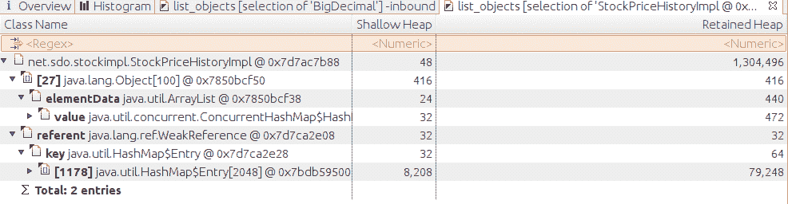

# 第七章：堆内存最佳实践

第五章和第六章讨论了如何调整垃圾收集器以尽可能少地影响程序的详细信息。调整垃圾收集器非常重要，但通常通过利用更好的编程实践可以获得更好的性能提升。本章讨论了一些在 Java 中使用堆内存的最佳实践方法。

我们在这里有两个相互冲突的目标。第一个一般规则是尽量少地创建对象，并尽快丢弃它们。使用更少的内存是提高垃圾收集器效率的最佳方法。另一方面，频繁重新创建某些类型的对象可能会导致整体性能下降（即使 GC 性能得到改善）。如果这些对象被重复使用，程序可以看到显著的性能提升。对象可以以各种方式重复使用，包括线程本地变量、特殊对象引用和对象池。重复使用对象意味着它们将长时间存在并影响垃圾收集器，但是当它们被明智地重复使用时，整体性能将会提高。

本章讨论了这两种方法及其之间的权衡。不过首先，我们将研究了解堆内部发生情况的工具。

# 堆分析

GC 日志和在第五章讨论的工具非常适合了解 GC 对应用程序的影响，但为了更进一步的可视化，我们必须深入研究堆本身。本节讨论的工具能够深入了解应用程序当前正在使用的对象。

大多数情况下，这些工具仅对堆中的活动对象进行操作——在下一个完整的 GC 周期中将被回收的对象不包含在工具的输出中。在某些情况下，工具通过强制执行完整的 GC 来实现这一点，因此在使用工具后可能会影响应用程序的行为。在其他情况下，这些工具遍历堆并报告活动数据，而不会在此过程中释放对象。不管哪种情况，这些工具都需要时间和机器资源；它们通常在程序执行的测量过程中不是很有用。

## 堆直方图

减少内存使用是一个重要的目标，但与大多数性能主题一样，有助于将努力集中在最大化可用收益上。在本章后面，你将看到一个关于懒初始化`Calendar`对象的示例。这将在堆中节省 640 字节的空间，但如果应用程序总是初始化这样的对象，性能上几乎没有可测量的差异。必须进行分析以确定哪些类型的对象消耗了大量内存。

最简单的方法是通过*堆直方图*。直方图是查看应用程序内对象数量的快速方法，而无需进行完整的堆转储（因为堆转储可能需要一段时间进行分析，而且会消耗大量磁盘空间）。如果一些特定对象类型负责在应用程序中创建内存压力，那么堆直方图是发现这一问题的快速方法。

可以使用 `jcmd`（此处使用进程 ID 8898）获取堆直方图：

```java
% jcmd 8998 GC.class_histogram
8898:

 num     #instances         #bytes  class name
----------------------------------------------
   1:        789087       31563480  java.math.BigDecimal
   2:        172361       14548968  C
   3:         13224       13857704  B
   4:        184570        5906240  java.util.HashMap$Node
   5:         14848        4188296  [I
   6:        172720        4145280  java.lang.String
   7:         34217        3127184  [Ljava.util.HashMap$Node;
   8:         38555        2131640  [Ljava.lang.Object;
   9:         41753        2004144  java.util.HashMap
  10:         16213        1816472  java.lang.Class

```

在直方图中，我们通常可以看到字符数组（`[C`）和 `String` 对象位于最顶部附近，因为这些是最常见的 Java 对象。字节数组（`[B`）和对象数组（`[Ljava.lang.Object;`）也很常见，因为类加载器将其数据存储在这些结构中。如果您对此语法不熟悉，请参阅 Java Native Interface（JNI）文档。

在此示例中，包含 `BigDecimal` 类是值得追究的：我们知道示例代码产生了大量瞬态 `BigDecimal` 对象，但是让这么多对象在堆中存在并不是我们通常所期望的。`GC.class_histogram` 的输出仅包括活动对象，因为该命令通常会强制进行完整的 GC。您可以在命令中包含 `-all` 标志以跳过完整的 GC，但那么直方图将包含未引用的（垃圾）对象。

运行此命令也可以获得类似的输出：

```java
% jmap -histo process_id

```

`jmap` 的输出包括可被收集（死）对象。在查看直方图之前强制进行完整的 GC，请改用此命令：

```java
% jmap -histo:live process_id

```

直方图很小，因此对于自动化系统中的每个测试收集一个直方图可能很有帮助。但是，由于获取直方图需要几秒钟并触发完整的 GC，因此不应在性能测量稳定状态下获取。

## **堆转储**

直方图非常适合识别由于分配过多某一两个特定类的实例而引起的问题，但是要进行更深入的分析，则需要*堆转储*。许多工具可以查看堆转储，并且其中大多数可以连接到实时程序以生成转储。通常更容易通过命令行生成转储，可以使用以下任一命令执行：

```java
% jcmd process_id GC.heap_dump /path/to/heap_dump.hprof

```

或者

```java
% jmap -dump:live,file=/path/to/heap_dump.hprof process_id

```

在 `jmap` 中包含 `live` 选项将在转储堆之前强制进行完整的 GC。这是 `jcmd` 的默认设置，但如果出于某种原因希望包含那些其他（死）对象，则可以在 `jcmd` 命令行的末尾指定 `-all`。如果以强制进行完整的 GC 的方式使用该命令，显然会在应用程序中引入长时间的暂停，但即使不强制进行完整的 GC，应用程序也将因为写入堆转储而暂停一段时间。

任一命令都会在给定目录中创建名为*heap_dump.hprof*的文件；然后可以使用各种工具打开该文件。其中最常见的工具如下：

`jvisualvm`

`jvisualvm` 的 Monitor 选项卡可以从运行中的程序中获取堆转储或打开以前生成的堆转储。从那里，您可以浏览堆，检查最大的保留对象，并针对堆执行任意查询。

`mat`

开源的 EclipseLink Memory Analyzer 工具 (`mat`) 可以加载一个或多个堆转储，并对它们进行分析。它可以生成报告，指出问题可能出现的位置，也可以用于浏览堆并在堆中执行类似 SQL 的查询。

堆的第一次分析通常涉及保留内存。对象的保留内存是如果该对象本身有资格被收集，将释放的内存量。在 [图 7-1 中，String Trio 对象的保留内存包括该对象占用的内存以及 Sally 和 David 对象占用的内存。它不包括 Michael 对象使用的内存，因为该对象有另一个引用，如果释放 String Trio，则该对象将不会有资格进行 GC。

![对象图显示一些对象有多个引用。###### 图 7-1\. 保留内存的对象图保留大量堆空间的对象通常称为堆的 *支配者* 。如果堆分析工具显示少数对象主导了大部分堆，事情就简单了：您只需减少它们的创建数量，缩短它们的保留时间，简化它们的对象图或使它们变小。这可能说起来容易，但至少分析是简单的。更常见的情况是，需要进行侦查工作，因为程序可能在共享对象。就像前一个图中的 Michael 对象一样，这些共享对象不会计入任何其他对象的保留集，因为释放一个单独对象不会释放共享对象。此外，最大的保留大小通常是你无法控制的类加载器。作为一个极端的例子，图 7-2 显示了一个堆的顶部保留对象，来自一个根据客户端连接缓存项目并在全局哈希映射中弱引用的股票服务器版本（因此缓存项目具有多个引用）。

###### 图 7-2\. 内存分析器中的保留内存视图

堆包含 1.4 GB 的对象（该值不会出现在此选项卡上）。即使如此，单独引用的最大对象集合仅为 6 MB（并且，毫不奇怪，是类加载框架的一部分）。查看直接保留最大内存量的对象并不能解决内存问题。

这个例子展示了列表中多个`StockPriceHistoryImpl`对象的实例，每个对象都占用了相当数量的内存。从这些对象占用的内存量可以推断出它们是问题所在。但通常情况下，对象可能以一种共享的方式存在，这样查看保留堆也看不出明显的问题。

对象的直方图是一个有用的第二步（见图 7-3）。


###### 图 7-3\. 内存分析器中的直方图视图

直方图聚合了相同类型的对象，在这个例子中，可以明显地看出，七百万个`TreeMap$Entry`对象所保留的 1.4 GB 内存是关键。即使不知道程序内部发生了什么，也很容易利用内存分析工具追踪这些对象，看看是什么在持有它们。

堆分析工具提供了一种查找特定对象（或在这种情况下一组对象）的 GC 根源的方法，尽管直接跳转到 GC 根源并不一定有帮助。GC 根源是持有静态全局引用的系统对象，通过一长串其他对象引用到所讨论的对象。通常这些来自系统加载的类的静态变量或引导类路径。这包括`Thread`类和所有活动线程；线程通过它们的线程本地变量或通过它们目标`Runnable`对象的引用来保留对象（或者在`Thread`类的子类的情况下，子类的其他引用）。

在某些情况下，了解目标对象的 GC 根源是有帮助的，但如果对象具有多个引用，则会有多个 GC 根源。这里的引用是一个反向的树结构。假设有两个对象引用特定的`TreeMap$Entry`对象。这两个对象可能被其他两个对象引用，每个对象可能被其他三个对象引用，依此类推。根据 GC 根源的追踪，引用的爆炸意味着任何给定对象可能有多个 GC 根源。

相反，更有成效的方法是像侦探一样查找对象图中的最低点，这是通过检查对象及其传入引用，并追踪这些传入引用直到找到重复路径来完成的。在这种情况下，持有在树映射中的`StockPriceHistoryImpl`对象的引用有两个：`ConcurrentHashMap`，它保存会话的属性数据，以及`WeakHashMap`，它保存全局缓存。

在图 7-4 中，回溯足够展开，仅显示有关其中两个对象的少量数据。确认它是会话数据的方式是继续展开`ConcurrentHashMap`路径，直到清楚该路径是会话数据。对于`WeakHashMap`的路径，同样的逻辑也适用。



###### 图 7-4\. Memory Analyzer 中对象引用的回溯

此示例中使用的对象类型使得分析比通常情况下更容易一些。如果该应用程序的主要数据被建模为`String`对象而不是`BigDecimal`对象，并存储在`HashMap`对象而不是`TreeMap`对象中，事情会变得更加困难。堆转储中还有数十万其他字符串和数万个`HashMap`对象。找到有趣对象的路径需要一些耐心。作为一个经验法则，从集合对象（例如`HashMap`）开始而不是条目（例如`HashMap$Entry`），并寻找最大的集合。

# 快速总结

+   知道哪些对象消耗了内存是了解需要优化代码中的哪些对象的第一步。

+   直方图是识别因创建某一类型的太多对象而导致的内存问题的一种快速简便方法。

+   堆转储分析是追踪内存使用的最强大技术，尽管需要耐心和努力才能充分利用。

## 内存不足错误

在这些情况下，JVM 在这些情况下会抛出*内存不足*错误：

+   JVM 没有可用的本机内存。

+   元空间已耗尽。

+   Java 堆本身已经耗尽了内存：应用程序无法为给定的堆大小创建任何额外的对象。

+   JVM 在执行垃圾回收时花费了太多时间。

最后两种情况——涉及 Java 堆本身——更为常见，但不要仅仅因为内存不足错误就自动认为堆是问题所在。必须查看内存不足错误的原因（该原因是异常输出的一部分）。

### 本机内存耗尽

此列表中的第一个情况——JVM 没有可用的本机内存——是与堆毫不相关的原因。在 32 位 JVM 中，进程的最大大小为 4 GB（某些版本的 Windows 为 3 GB，在某些较旧的 Linux 版本中约为 3.5 GB）。指定非常大的堆大小，比如 3.8 GB，会使应用程序大小接近该限制。即使是 64 位 JVM，操作系统可能也没有足够的虚拟内存来满足 JVM 请求。

有关此主题的更全面讨论，请参阅第八章。请注意，如果内存不足错误的消息讨论的是分配本机内存，堆调整不是解决方案：您需要查看错误消息中提到的任何本机内存问题。例如，以下消息告诉您线程堆栈的本机内存已耗尽：

```java
Exception in thread "main" java.lang.OutOfMemoryError:
unable to create new native thread
```

但请注意，JVM 有时会因与内存无关的事物而发出此错误。用户通常对可运行的线程数量有限制；此限制可能由操作系统或容器施加。例如，在 Linux 中，通常只允许用户创建 1,024 个进程（您可以通过运行`ulimit -u`来检查此值）。尝试创建第 1,025 个线程将抛出相同的`OutOfMemoryError`，宣称内存不足以创建本地线程，而实际上是由于进程数目的操作系统限制导致错误。

### 元空间内存不足

元空间内存不足错误也与堆无关，而是因为元空间本地内存已满。由于元空间默认没有最大大小，因此此错误通常是因为您选择设置了最大大小（本节的原因将在下文中变得清晰）。

此错误可能有两个根本原因：第一个是应用程序使用的类超过了您分配的元空间可以容纳的数量（参见“调整元空间大小”）。第二种情况更加棘手：涉及类加载器内存泄漏。这种情况在动态加载类的服务器中最为频繁。例如，Java EE 应用服务器就是一个典型例子。部署到应用服务器的每个应用程序都在自己的类加载器中运行（这提供了隔离，使得一个应用程序的类不与其他应用程序的类共享或干扰）。在开发过程中，每次修改应用程序后，必须重新部署：创建一个新的类加载器来加载新的类，旧的类加载器则被允许超出作用域。一旦类加载器超出作用域，类的元数据就可以被回收。

如果旧的类加载器未超出作用域，则类的元数据无法被释放，最终元空间将被填满并抛出内存不足错误。在这种情况下，增加元空间的大小会有所帮助，但最终只是推迟了错误的发生。

如果此情况发生在应用服务器环境中，除了联系应用服务器供应商并要求其修复泄漏外，别无他法。如果您正在编写自己的应用程序，并创建和丢弃大量类加载器，请确保正确地丢弃类加载器本身（特别是确保没有线程将其上下文类加载器设置为临时类加载器之一）。要调试此情况，刚才描述的堆转储分析非常有用：在直方图中，查找所有`ClassLoader`类的实例，并追踪它们的 GC 根以查看它们所持有的内容。

识别此情况的关键是再次查看内存溢出错误的全文输出。如果元空间已满，则错误文本将如下所示：

```java
Exception in thread "main" java.lang.OutOfMemoryError: Metaspace
```

顺便说一下，类加载器泄漏是您应考虑设置元空间最大大小的原因。如果不加限制，具有类加载器泄漏的系统将消耗机器上的所有内存。

### 堆外内存

当堆本身内存不足时，错误消息如下：

```java
Exception in thread "main" java.lang.OutOfMemoryError: Java heap space
```

引起内存不足条件的常见情况类似于我们刚讨论的元空间示例。应用程序可能仅需更多的堆空间：它持有的活动对象数量无法适应为其配置的堆空间。或者，应用程序可能存在内存泄漏：它继续分配额外的对象，而不允许其他对象超出作用域。在第一种情况下，增加堆大小将解决问题；在第二种情况下，增加堆大小只会推迟错误的发生。

在任一情况下，都需要进行堆转储分析以找出消耗最多内存的是什么；然后可以专注于减少这些对象的数量（或大小）。如果应用程序存在内存泄漏，则可以在几分钟内连续进行堆转储，并进行比较。`mat`已经内建了这种功能：如果打开了两个堆转储，`mat`有一个选项可以计算两个堆之间直方图的差异。

图 7-5 展示了由集合类（在本例中为`HashMap`）引起的 Java 内存泄漏的经典案例。（集合类是内存泄漏的最常见原因之一：应用程序将项目插入集合中，并且从不释放它们。）这是一个比较直方图视图：显示了两个堆转储中对象数量的差异。例如，与基线相比，目标堆转储中多了 19,744 个`Integer`对象。

克服这种情况的最佳方法是改变应用程序逻辑，以便在不再需要时主动从集合中丢弃项目。或者，使用弱引用或软引用的集合可以在应用程序中没有其他引用它们时自动丢弃这些项目，但这些集合也有成本（如本章后面所讨论的）。


###### 图 7-5\. 直方图比较

在抛出此类异常时，通常 JVM 不会退出，因为异常只影响 JVM 中的单个线程。让我们来看一个具有两个线程执行计算的 JVM。其中一个可能会收到`OutOfMemoryError`。默认情况下，该线程的线程处理程序将打印出堆栈跟踪，并且该线程将退出。

但是 JVM 仍然有另一个活动线程，所以 JVM 不会退出。并且因为遇到错误的线程已经终止，因此未来可能在一个 GC 周期中大量的内存可能被声明：所有终止线程引用的对象，而这些对象没有被其他线程引用。因此，生存线程将能够继续执行，并且通常具有足够的堆内存来完成其任务。

处理请求的线程池的服务器框架工作方式基本相同。它们通常会捕获错误并阻止线程终止，但这不会影响此讨论；线程正在执行的请求相关联的内存仍然会变得可收集。

因此，当此错误被抛出时，只有当它导致 JVM 中的最后一个非守护线程终止时，才会对 JVM 产生致命影响。这在服务器框架中永远不会发生，并且在具有多个线程的独立程序中通常不会发生。而且通常这种情况都会很好地解决，因为与活动请求相关联的内存通常会变得可收集。

如果你希望 JVM 在堆内存耗尽时退出，可以设置`-XX:+ExitOnOutOfMemoryError`标志，默认值为`false`。

### GC 超过限制

上一个案例中描述的恢复假设当一个线程遇到内存不足错误时，与该线程相关联的内存将变得可收集，JVM 可以恢复。这并不总是真实的，这导致了 JVM 抛出内存不足错误的最终情况：当它确定自己花费太多时间执行 GC 时：

```java
Exception in thread "main" java.lang.OutOfMemoryError: GC overhead limit exceeded
```

当满足以下所有条件时，会抛出此错误：

+   完全 GC 所花费的时间超过了由`-XX:GCTimeLimit=`*`N`*标志指定的值。默认值为 98（即，如果 98%的时间花在 GC 上）。

+   完全 GC 回收的内存量小于由`-XX:GCHeapFreeLimit=`*`N`*标志指定的值。默认值为 2，这意味着在完全 GC 期间释放的堆小于 2%时，满足此条件。

+   上述两个条件已经连续满足了五个完全 GC 周期（该值不可调）。

+   `-XX:+UseGCOverheadLimit`标志的值为`true`（默认情况下为`true`）。

请注意，所有这四个条件必须满足。在不抛出内存不足错误的应用程序中，常见的是连续发生五次以上的完全 GC。这是因为即使应用程序花费了 98%的时间执行完全 GC，但每次 GC 可能会释放堆的超过 2%。在这种情况下，考虑增加`GCHeapFreeLimit`的值。

注意，作为释放内存的最后一招，如果前两个条件连续四次完整的 GC 循环均满足，则在第五次完整的 GC 循环之前将释放 JVM 中的所有软引用。通常这可以避免错误，因为第五次循环可能会释放超过堆的 2%（假设应用程序使用软引用）。

# 快速总结

+   内存不足错误出现的原因多种多样；不要假设堆空间是问题所在。

+   对于元空间和常规堆来说，内存泄漏是最常见的导致内存不足错误的原因；堆分析工具可以帮助找出泄漏的根本原因。

# 使用更少的内存

在 Java 中更高效地使用内存的第一种方法是减少堆内存的使用。这个说法应该不足为奇：使用更少的内存意味着堆填充的频率降低，需要的 GC 循环也会减少。效果可能会倍增：更少的年轻代收集意味着对象的老化年龄不经常增加——这意味着对象不太可能晋升到老年代。因此，全量 GC 循环（或并发 GC 循环）的数量会减少。而如果这些全量 GC 循环可以释放更多内存，它们也会更不频繁地发生。

本节探讨了三种减少内存使用的方法：减少对象大小、使用对象的延迟初始化以及使用规范化对象。

## 减少对象大小

对象占用一定量的堆内存，因此减少内存使用的最简单方法是减少对象的大小。鉴于运行程序的机器的内存限制，可能无法将堆大小增加 10%，但将堆中一半对象的大小减少 20% 可以达到同样的目标。正如在第十二章中讨论的，Java 11 对于 `String` 对象有这样的优化，这意味着 Java 11 的用户可以将最大堆大小设置为比 Java 8 要求的小 25%，而不会影响 GC 或性能。

对象的大小可以通过（显而易见地）减少它所包含的实例变量的数量以及（不那么明显地）减少这些变量的大小来减少。

表 7-1\. Java 类型实例变量的字节大小

| 类型 | 大小 |
| --- | --- |
| `byte` | 1 |
| `char` | 2 |
| `short` | 2 |
| `int` | 4 |
| `float` | 4 |
| `long` | 8 |
| `double` | 8 |
| `reference` | 8（在 32 位 Windows JVM 中为 4）^(a) |
| ^(a) 详见“压缩指针”获取更多详情。 |

此处的 `reference` 类型是对任何 Java 对象（类的实例或数组）的引用。这个空间仅用于引用本身。包含对其他对象引用的对象的大小因是否考虑对象的浅层、深层或保留大小而异，但该大小还包括一些不可见的对象头字段。对于普通对象，在 32 位 JVM 上，头字段的大小为 8 字节，在 64 位 JVM 上为 16 字节（无论堆大小如何）。对于数组，在 32 位 JVM 或堆大小小于 32 GB 的 64 位 JVM 上，头字段的大小为 16 字节，否则为 24 字节。

例如，考虑以下类定义：

```java
public class A {
    private int i;
}

public class B {
    private int i;
    private Locale l = Locale.US;
}

public class C {
    private int i;
    private ConcurrentHashMap chm = new ConcurrentHashMap();
}
```

在 64 位 JVM（堆大小小于 32 GB）上，这些对象的单个实例的实际大小如 表 7-2 所示。

表 7-2\. 简单对象的字节大小

|  | 浅层大小 | 深层大小 | 保留大小 |
| --- | --- | --- | --- |
| `A` | 16 | 16 | 16 |
| `B` | 24 | 216 | 24 |
| `C` | 24 | 200 | 200 |

在类 `B` 中，定义 `Locale` 引用会增加 8 字节到对象大小，但在该示例中，`Locale` 对象是被其他类共享的。如果类不需要 `Locale` 对象，包含该实例变量只会浪费额外的引用字节。然而，如果应用程序创建大量 `B` 类的实例，这些字节会累积。

另一方面，定义和创建 `ConcurrentHashMap` 对象会消耗额外的字节用于对象引用，再加上哈希映射对象的额外字节。如果哈希映射从未被使用，那么 `C` 类的实例就会显得浪费。

仅定义必需的实例变量是节省对象空间的一种方法。不那么明显的情况涉及使用较小的数据类型。如果一个类需要跟踪八种可能的状态之一，可以使用 `byte` 而不是 `int`，可能会节省 3 字节。在频繁实例化的类中，使用 `float` 替代 `double`，`int` 替代 `long` 等，可以帮助节省内存，尤其是在使用适当大小的集合（或者使用简单的实例变量而不是集合）时。如 第十二章 中讨论的那样，这可以实现类似的节省。

减少对象中的实例字段可以帮助减小对象的大小，但也存在一个灰色地带：那些用于存储基于数据片段计算结果的对象字段怎么处理？这是时间与空间之间的经典计算机科学折衷：是花费内存（空间）来存储值，还是花费时间（CPU 周期）根据需要计算值？在 Java 中，这种折衷也适用于 CPU 时间，因为额外的内存可能导致 GC 消耗更多的 CPU 周期。

例如，`String` 的哈希码是通过对字符串的每个字符进行加权求和得出的，这在计算上是相对耗时的。因此，`String` 类将该值存储在实例变量中，这样哈希码只需要计算一次：最终，重用该值几乎总是比不存储它而节省的内存效果更好。另一方面，大多数类的 `toString()` 方法不会缓存对象的字符串表示形式在实例变量中，这既会消耗实例变量的内存，也会消耗其引用的字符串的内存。通常，计算新字符串所需的时间比保留字符串引用所需的内存通常提供更好的性能。 （另外，`String` 的哈希值经常使用，对象的 `toString()` 表示通常很少使用。）

这绝对是一个因人而异的情况，以及在时间/空间连续体中切换使用内存以缓存值和重新计算值之间的最佳点，将取决于许多因素。如果减少 GC 是目标，平衡将更倾向于重新计算。

# 快速总结

+   减少对象大小通常可以提高 GC 的效率。

+   一个对象的大小并不总是立即显而易见：对象被填充以适应 8 字节边界，而对象引用的大小在 32 位和 64 位 JVM 之间是不同的。

+   即使 `null` 实例变量也会在对象类中占用空间。

## 使用延迟初始化

大多数情况下，关于是否需要特定实例变量的决定并不像前一节所述的那样黑白分明。一个特定的类可能只有 10% 的时间需要一个 `Calendar` 对象，但是创建 `Calendar` 对象是昂贵的，因此保留该对象而不是按需重新创建它是有意义的。这是一种 *延迟初始化* 可以帮助的情况。

到目前为止，这个讨论假设实例变量是急切地初始化的。一个需要使用 `Calendar` 对象（并且不需要线程安全性）的类可能如下所示：

```java
public class CalDateInitialization {
    private Calendar calendar = Calendar.getInstance();
    private DateFormat df = DateFormat.getDateInstance();

    private void report(Writer w) {
        w.write("On " + df.format(calendar.getTime()) + ": " + this);
    }
}
```

而延迟初始化字段则在计算性能上有少许的折衷——代码必须每次执行时测试变量的状态：

```java
public class CalDateInitialization {
    private Calendar calendar;
    private DateFormat df;

    private void report(Writer w) {
        if (calendar == null) {
            calendar = Calendar.getInstance();
            df = DateFormat.getDateInstance();
        }
        w.write("On " + df.format(calendar.getTime()) + ": " + this);
    }
}
```

当涉及的操作很少使用时，最好使用延迟初始化。如果操作经常使用，就不会节省内存（因为它总是被分配），并且在常见操作上会有轻微的性能损失。

当涉及的代码必须是线程安全时，延迟初始化变得更加复杂。作为第一步，最简单的方法是简单地添加传统的同步：

```java
public class CalDateInitialization {
    private Calendar calendar;
    private DateFormat df;

    private synchronized void report(Writer w) {
        if (calendar == null) {
            calendar = Calendar.getInstance();
            df = DateFormat.getDateInstance();
        }
        w.write("On " + df.format(calendar.getTime()) + ": " + this);
    }
}
```

引入同步机制到解决方案中，可能会导致同步成为性能瓶颈的可能性增加。这种情况应该很少见。懒初始化带来的性能好处只有在很少初始化这些字段的对象时才会发生，因为如果通常初始化这些字段，实际上并没有节省内存。因此，当一个不经常使用的代码路径突然被大量线程同时使用时，同步对于懒初始化字段会成为一个瓶颈。这种情况并非不可想象，但也不是最常见的情况。

只有当惰性初始化的变量本身是线程安全的时，才能解决那个同步瓶颈。`DateFormat`对象不是线程安全的，所以在当前示例中，无论锁是否包括`Calendar`对象，都不会有什么影响：如果懒初始化对象突然被频繁使用，围绕`DateFormat`对象的必需同步将是一个问题。线程安全的代码应该如下所示：

```java
public class CalDateInitialization {
    private Calendar calendar;
    private DateFormat df;

    private void report(Writer w) {
        unsychronizedCalendarInit();
        synchronized(df) {
            w.write("On " + df.format(calendar.getTime()) + ": " + this);
        }
    }
}
```

涉及不是线程安全的实例变量的惰性初始化可以始终在该变量周围进行同步（例如，使用前面显示的方法的`synchronized`版本）。

考虑一个稍微不同的例子，在这个例子中，一个大的`ConcurrentHashMap`是惰性初始化的：

```java
public class CHMInitialization {
    private ConcurrentHashMap chm;

    public void doOperation() {
        synchronized(this) {
            if (chm == null) {
                chm = new ConcurrentHashMap();
                ... code to populate the map ...
            }
        }
        ...use the chm...
    }
}
```

因为`ConcurrentHashMap`可以被多个线程安全访问，在这个例子中额外的同步是懒初始化可能引入同步瓶颈的少见情况之一。（尽管这种瓶颈仍然很少见；如果对哈希映射的访问频率很高，考虑懒初始化是否真的能节省任何东西。）双重检查锁定惯用法解决了这个瓶颈：

```java
public class CHMInitialization {
    private volatile ConcurrentHashMap instanceChm;

    public void doOperation() {
        ConcurrentHashMap chm = instanceChm;
        if (chm == null) {
            synchronized(this) {
                chm = instanceChm;
                if (chm == null) {
                    chm = new ConcurrentHashMap();
                    ... code to populate the map
                    instanceChm = chm;
                }
            }
            ...use the chm...
        }
    }
}
```

存在重要的线程问题：实例变量必须声明为`volatile`，并且通过将实例变量分配给一个局部变量可以获得轻微的性能好处。更多细节请参见第九章；在偶尔有需要的情况下，这是要遵循的设计模式。

### 急切地去初始化

惰性初始化变量的推论是通过将它们的值设置为`null`来*急切地去初始化*它们。这允许相关对象更快地被垃圾收集器回收。尽管理论上听起来像一件好事，但实际上只在有限的情况下才有用。

一个适合惰性初始化的变量可能看起来像是急切去初始化的候选变量：在前面的例子中，`Calendar` 和 `DateFormat` 对象可以在 `report()` 方法完成后设置为 `null`。然而，如果该变量不会在方法的后续调用中使用（或者在类的其他地方使用），那么没有理由在首次创建实例变量时将其作为实例变量。只需在方法中创建局部变量，在方法完成时，局部变量将会超出作用域，垃圾收集器可以释放它。

与关于不需要急切去初始化变量的规则的常见例外情况相反，类似于 Java 集合框架中的类：这些类长时间持有数据的引用，然后被告知不再需要该数据。考虑 JDK 中 `ArrayList` 类的 `remove()` 方法的实现（某些代码已简化）：

```java
public E remove(int index) {
    E oldValue = elementData(index);
    int numMoved = size - index - 1;
    if (numMoved > 0)
        System.arraycopy(elementData, index+1,
                         elementData, index, numMoved);
    elementData[--size] = null; // clear to let GC do its work
    return oldValue;
}
```

JDK 源码本身几乎没有注释，但是有关 GC 的代码注释如下：像这样将变量设置为 `null` 的操作是不寻常的，因此需要一些解释。在这种情况下，跟踪数组的最后一个元素被移除时发生的情况。数组中剩余的项目数量——`size` 实例变量被减少。假设 `size` 从 5 减少到 4。现在 `elementData[4]` 中存储的任何内容都无法访问：它超出了数组的有效大小。

`elementData[4]` 在这种情况下是一个过时的引用。`elementData` 数组可能会长时间保持活动状态，因此不再需要引用的任何内容都需要明确设置为 `null`。

这种过时引用的概念是关键：如果长寿类缓存然后丢弃对象引用，则必须小心避免过时引用。否则，显式地将对象引用设置为 `null` 将不会带来太多性能好处。

# 快速总结

+   仅当常见的代码路径将变量保持未初始化状态时才使用惰性初始化。

+   线程安全代码的惰性初始化是不寻常的，但通常可以依赖于现有的同步机制。

+   对于使用线程安全对象进行代码的惰性初始化，使用双重检查锁定。

## 使用不可变和规范化对象

在 Java 中，许多对象类型是不可变的。这包括具有对应原始类型的对象——`Integer`、`Double`、`Boolean` 等，以及其他基于数字的类型，如 `BigDecimal`。当然，最常见的 Java 对象是不可变的 `String`。从程序设计的角度来看，为自定义类表示不可变对象通常是一个好主意。

当这些对象快速创建并且被丢弃时，它们对年轻代的影响很小；正如你在 第五章 中看到的，该影响是有限的。但与任何对象一样，如果许多不可变对象晋升到老年代，性能可能会受到影响。

因此，没有理由避免设计和使用不可变对象，即使这些对象似乎不能被改变和必须重新创建可能有点逆向思维。但在处理这些对象时通常可以进行的优化之一是避免创建相同对象的重复副本。

这个最好的例子是`Boolean`类。任何 Java 应用程序只需要两个`Boolean`类的实例：一个为 true，一个为 false。不幸的是，`Boolean`类设计不佳。因为它有一个公共构造函数，应用程序可以随意创建任意数量的这些对象，尽管它们都与两个标准`Boolean`对象之一完全相同。更好的设计应该是`Boolean`类只有一个私有构造函数，并且静态方法根据参数返回`Boolean.TRUE`或`Boolean.FALSE`。如果你的不可变类可以遵循这样的模式，你可以防止它们贡献到应用程序的堆使用中。（理想情况下，显然你永远不应该创建`Boolean`对象；必要时应该只使用`Boolean.TRUE`或`Boolean.FALSE`。）

这些不可变对象的唯一表示被称为对象的*标准版本*。

### 创建标准对象

即使某个特定类的对象宇宙几乎是无限的，使用标准值通常可以节省内存。JDK 提供了一种机制来为最常见的不可变对象做到这一点：字符串可以调用`intern()`方法来找到字符串的标准版本。更多关于字符串驻留的细节在第十二章中进行了详细考察；现在我们来看如何为自定义类实现同样的功能。

要使对象标准化，创建一个映射来存储对象的标准版本。为了防止内存泄漏，确保映射中的对象是弱引用的。这样的类的框架如下所示：

```java
public class ImmutableObject {
    private static WeakHashMap<ImmutableObject, ImmutableObject>
        map = new WeakHashMap();

    public ImmutableObject canonicalVersion(ImmutableObject io) {
        synchronized(map) {
            ImmutableObject canonicalVersion = map.get(io);
            if (canonicalVersion == null) {
                map.put(io, new WeakReference(io));
                canonicalVersion = io;
            }
            return canonicalVersion;
        }
    }
}
```

在多线程环境中，同步可能会成为瓶颈。如果坚持使用 JDK 类，没有简单的解决方案，因为它们不提供用于弱引用的并发哈希映射。然而，已经有提议在 JDK 中添加`CustomConcurrentHashMap`，最初作为 Java 规范请求（JSR）166 的一部分，并且你可以找到各种第三方实现这样的类。

# 快速总结

+   不可变对象提供了特殊生命周期管理的可能性：标准化。

+   通过标准化消除不可变对象的重复副本可以大大减少应用程序使用的堆量。

# 对象生命周期管理

本章讨论的第二个广泛的内存管理主题是*对象生命周期管理*。在大多数情况下，Java 试图最小化开发人员管理对象生命周期所需的工作：开发人员在需要时创建对象，当它们不再需要时，对象超出范围并由垃圾收集器释放。

有时，这种正常的生命周期并不是最优的。一些对象的创建成本很高，管理这些对象的生命周期将提高应用程序的效率，即使需要垃圾收集器做更多的工作。本节探讨了何时以及如何改变对象的正常生命周期，无论是通过重用对象还是保持对它们的特殊引用。

## 对象重用

对象重用通常通过两种方式实现：对象池和线程局部变量。全球的 GC 工程师现在正因为这些技术而叹息，因为它们会影响 GC 的效率。特别是出于这个原因，对象池技术在 GC 圈子里广受厌恶，虽然在开发圈子里，出于许多其他原因，对象池也广受厌恶。

在某种程度上，这个立场的原因似乎很明显：被重用的对象在堆中存活时间长。如果堆中有很多对象，那么创建新对象的空间就越少，因此 GC 操作会更频繁。但这只是故事的一部分。

正如您在第六章中看到的，当对象创建时，它会分配到 Eden 区。它会在幸存者空间中来回移动几个年轻代 GC 周期，最终最终被提升到老年代。每次处理新创建的（或最近创建的）池化对象时，GC 算法必须执行一些工作来复制它并调整对它的引用，直到它最终进入老年代。

虽然看起来像是结束了，但一旦对象被提升到老年代，就可能导致更多的性能问题。执行完整的 GC 所需的时间与老年代中仍然存活的对象数量成正比。存活数据的量比堆的大小更重要；处理具有少量存活对象的 3 GB 老年代比处理其中 75% 对象存活的 1 GB 老年代更快。

使用并发收集器并避免完整的 GC 并不能使情况好转太多，因为并发收集器标记阶段所需的时间也与仍存活数据的量有关。特别是对于 CMS，池中的对象可能在不同时间被提升，增加了由于碎片化而导致并发失败的机会。总体而言，对象在堆中存留的时间越长，GC 的效率就越低。

因此：对象重用是不好的。现在我们可以讨论如何以及何时重用对象了。

JDK 提供了一些常见的对象池：讨论了线程池，详见第九章，以及软引用。*软引用*稍后在本节中讨论，本质上是一大批可重用对象的池。与此同时，Java 服务器依赖于对象池来管理与数据库和其他资源的连接。线程本地值也是类似情况；JDK 充满了使用线程本地变量避免重新分配某些类型对象的类。显然，即使是 Java 专家也理解某些情况下需要对象重用的必要性。

对象重用的原因是许多对象的初始化成本很高，重用它们比增加 GC 时间的权衡更有效。对于像 JDBC 连接池这样的事物来说，创建网络连接，可能登录并建立数据库会话是昂贵的。在这种情况下，对象池是一个很大的性能优势。线程池是为了节省创建线程的时间而池化线程；随机数生成器作为线程本地变量提供，以节省初始化所需的时间；等等。

这些示例共享的一个特点是对象的初始化时间很长。在 Java 中，对象的分配是快速且廉价的（对于不重用对象的论点通常集中在此部分）。对象的初始化性能取决于对象本身。你应该仅考虑重新使用初始化成本非常高的对象，只有在初始化这些对象的成本是程序中主要操作之一时才这样做。

这些示例共享的另一个特点是共享对象的数量往往很少，这减少了它们对 GC 操作的影响：它们不足以减慢 GC 循环。在池中有少量对象不会对 GC 效率产生太大影响；将堆填满池化对象会显著减慢 GC 的速度。

这里只是 JDK 和 Java 程序重用对象的一些示例（以及原因）：

线程池

初始化线程的成本很高。

JDBC 连接池

初始化数据库连接的成本很高。

大数组

Java 要求在分配数组时，数组中的所有单个元素必须初始化为默认的零值（适当时为 `null`、`0` 或 `false`）。对于大数组来说，这可能是耗时的。

本地 NIO 缓冲区

分配直接的 `java.nio.Buffer`（从调用 `allocateDirect()` 方法返回的缓冲区）是一种昂贵的操作，无论缓冲区的大小如何。最好创建一个大缓冲区，并从中切片以根据需要管理缓冲区，并返回以供未来操作重用。

安全类

`MessageDigest`、`Signature` 和其他安全算法的实例化成本很高。

字符串编码器和解码器对象

JDK 中的各种类创建和重用这些对象。大多数情况下，这些也是软引用，正如你将在下一节中看到的那样。

`StringBuilder`辅助程序

在计算中间结果时，`BigDecimal`类会重复使用一个`StringBuilder`对象。

随机数生成器

无论是`Random`还是（尤其是）`SecureRandom`类的实例，种子成本都很高。

来自 DNS 查找的名称

网络查找很昂贵。

ZIP 编码器和解码器

有趣的是，这些对象初始化起来并不特别昂贵。然而，它们释放起来却很昂贵，因为它们依赖于对象终结来确保它们使用的本地内存也被释放。详见“终结器和最终引用”以获取更多详细信息。

两种选择（对象池和线程本地变量）在性能上有所不同。让我们更详细地看看这些差异。

### 对象池

*对象池*因多种原因而不受喜爱，其中只有一些与其性能有关。它们可能很难正确地调整大小。它们还将对象管理的负担重新放回到程序员身上：程序员不能简单地让对象超出作用域，而必须记得将对象返回到池中。

但重点在于对象池的性能，它受以下因素的影响：

GC 影响

正如你所见，持有大量对象会显著降低 GC 的效率（有时甚至极大地）。

同步

对象池不可避免地会进行同步，如果对象经常被移除和替换，那么池可能会有很多争用。结果是，访问池可能会变得比初始化新对象还要慢。

节流

对象池的这种性能影响可能是有益的：池允许对稀缺资源的访问进行节流。正如在第二章中讨论的那样，如果试图增加系统的负载超过其处理能力，性能将会下降。这就是线程池至关重要的原因之一。如果太多线程同时运行，CPU 将不堪重负，性能将下降（例如在第九章中有示例）。

这个原则也适用于远程系统访问，并且在 JDBC 连接中经常见到。如果向数据库创建的 JDBC 连接超过其处理能力，数据库的性能将会下降。在这些情况下，最好通过限制池的大小来节流资源（例如 JDBC 连接），即使这意味着应用程序中的线程必须等待空闲资源。

### 线程本地变量

通过将它们存储为*线程本地变量*来重复使用对象会导致各种性能权衡：

生命周期管理

线程本地变量比池中的对象更易于管理且成本更低。这两种技术都要求您获取初始对象：您可以从池中检出对象，或者在线程本地对象上调用`get()`方法。但是，对象池要求在使用完毕后将对象返回（否则其他人无法使用它）。线程本地对象始终在线程内可用，不需要显式返回。

基数

线程本地变量通常会在线程数和保存（重用）对象数之间建立一对一的对应关系。这并不是严格的情况。线程的变量副本在线程第一次使用时才创建，因此可能会比线程少的保存对象。但不能有比线程更多的保存对象，大部分时间它们的数量是相同的。

另一方面，对象池的大小可以任意设定。如果一个请求有时需要一个 JDBC 连接，有时需要两个，那么 JDBC 池可以相应地设置大小（例如，为 8 个线程设置 12 个连接）。线程本地变量无法有效地做到这一点；它们也不能调节对资源的访问（除非线程数本身作为节流器）。

同步

线程本地变量不需要同步，因为它们只能在单个线程内使用；线程本地的`get()`方法相对较快。（这并不总是如此；在 Java 的早期版本中，获取线程本地变量是昂贵的。如果您因为过去性能不佳而回避线程本地变量，请重新考虑在当前版本的 Java 中使用它们。）

同步提出了一个有趣的观点，因为线程本地对象的性能优势通常是通过节省同步成本来表达的（而不是通过重用对象来节省）。例如，Java 提供了`ThreadLocalRandom`类；在示例股票应用程序中使用了该类（而不是单个`Random`实例）。否则，本书中的许多示例都会在单个`Random`对象的`next()`方法上遇到同步瓶颈。使用线程本地对象是避免同步瓶颈的好方法，因为只有一个线程可以使用该对象。

然而，如果这些示例每次需要时都简单地创建一个新的`Random`类实例，同步问题就很容易解决了。然而，用这种方式解决同步问题并没有帮助整体性能：初始化一个`Random`对象是昂贵的，而频繁创建该类的实例会比多个线程共享一个实例的同步瓶颈性能更差。

使用`ThreadLocalRandom`类可以获得更好的性能，如表 7-3 所示。本例计算了在三种情况下每个四个线程创建 10,000 个随机数所需的时间：

+   每个线程都会构造一个新的`Random`对象来计算 10,000 个数。

+   所有线程共享一个常见的静态`Random`对象。

+   所有线程共享一个常见的静态`ThreadLocalRandom`对象。

表 7-3\. 使用`ThreadLocalRandom`生成 10,000 个随机数的效果

| 操作 | 耗时 |
| --- | --- |
| 创建新的`Random` | 134.9 ± 0.01 微秒 |
| `ThreadLocalRandom` | 52.0 ± 0.01 微秒 |
| 共享`Random` | 3,763 ± 200 微秒 |

在竞争锁的情况下进行微基准测试总是不可靠的。在本表的最后一行中，线程几乎总是在争夺`Random`对象上的锁；在实际应用中，争用量将会少得多。尽管如此，使用共享对象可能会看到一些争用，而每次创建新对象的代价超过使用`ThreadLocalRandom`对象要昂贵两倍以上。

这里的教训——以及对象重用的一般经验——是，当对象的初始化时间很长时，不要害怕探索对象池或线程本地变量来重用那些昂贵的创建对象。然而，总是要保持平衡：大型通用类的对象池几乎肯定会导致更多性能问题而不是解决问题。将这些技术留给那些初始化昂贵且重用对象数量较少的类。

# 快速总结

+   一般情况下不鼓励对象重用作为通用操作，但对于初始化代价高的少量对象可能是适当的。

+   在通过对象池或线程本地变量重用对象之间存在权衡。一般来说，线程本地变量更容易处理，假设想要实现线程与可重用对象的一对一对应关系。

## 软引用、弱引用及其他引用

Java 中的软引用和弱引用也允许对象被重用，尽管作为开发者，我们并不总是用这些术语来思考。这些引用类型——通常我们将其称为*不定引用*——更常用于缓存长时间计算或数据库查询的结果，而不是重用简单对象。例如，在股票服务器中，可以使用间接引用来缓存`getHistory()`方法的结果（这需要进行长时间计算或长时间数据库调用）。这个结果只是一个对象，当通过不定引用进行缓存时，我们只是因为初始化代价昂贵才会重用这个对象。

对许多程序员来说，这种情况“感觉”不同。事实上，甚至术语也反映了这一点：没有人会说“缓存”一个线程以便重用，但我们将在数据库操作结果缓存方面探讨不定引用的重用。

不定引用相较于对象池或线程本地变量的优势在于，不定引用最终会被垃圾收集器回收。如果对象池包含最近执行的最后 10,000 个股票查找，并且堆空间开始不足，那么应用程序就无法继续运行：在存储这些 10,000 个元素后，剩余堆空间就是应用程序可以使用的所有剩余堆空间。如果这些查找通过不定引用存储，JVM 可以释放一些空间（取决于引用类型），从而提高 GC 吞吐量。

缺点是不定引用对垃圾收集器效率的影响略大。图 7-6 显示了没有和有不定引用（在本例中是软引用）时内存使用的对比。

被缓存的对象占用 512 字节。左侧消耗的内存就是这些（除了指向对象的实例变量的内存）。右侧，对象被缓存在 `SoftReference` 对象中，增加了 40 字节的内存消耗。不定引用与任何其他对象一样：它们会消耗内存，并且其他东西（图右侧的 `cachedValue` 变量）会强引用它们。

不定引用对垃圾收集器的第一个影响是应用程序使用更多内存。对垃圾收集器的第二个更大影响是，不定引用对象要经过至少两个 GC 周期才能被垃圾收集器回收。


###### 图 7-6\. 不定引用分配的内存

图 7-7 显示了引用不再被强引用（即 `lastViewed` 变量被设置为 `null`）时的情况。如果没有引用指向 `StockHistory` 对象，则在处理该对象所在代的下一个 GC 期间，它将被释放。因此，图的左侧现在消耗 0 字节。

图的右侧仍然消耗内存。引用被释放的确切时间取决于不定引用的类型，但现在我们先来看软引用的情况。引用将一直保留，直到 JVM 决定对象最近未被使用。在此之后，第一个 GC 周期释放引用对象，但不释放不定引用对象本身。应用程序最终的内存状态如 图 7-8 所示。


###### 图 7-7\. 不定引用通过 GC 周期保留内存


###### 图 7-8\. 无限引用不会立即被清除

无限引用对象本身现在至少有两个强引用：应用程序创建的原始强引用和在引用队列中由 JVM 创建的新强引用。在无限引用对象本身被垃圾收集器回收之前，所有这些强引用都必须被清除。

通   通常，这种清理工作由处理引用队列的代码完成。该代码会被通知有一个新对象进入队列，并立即移除所有对该对象的强引用。然后，在下一个 GC 周期中，无限引用对象（被引用对象）将被释放。最坏的情况是，引用队列不会立即处理，可能会经过多个 GC 周期，才会清理干净。即便是在最好的情况下，无限引用也必须经过两个 GC 周期才能被释放。

根据无限引用的类型，这个通用算法存在一些重要的变化，但所有无限引用在某种程度上都存在这种惩罚。

### 软引用

*软引用* 用于当所讨论的对象有很大可能在将来被重用，但你希望让垃圾收集器在对象未被最近使用时回收它（计算时还考虑堆的可用内存量）。软引用基本上是一个大型的最近最少使用（LRU）对象池。确保及时清除软引用是获得良好性能的关键。

这是一个例子。股票服务器可以设置一个全局缓存，按股票代码（或股票代码和日期）存储股票历史。当有请求查询从`2019 年 9 月 1 日`到`2019 年 12 月 31 日`的`TPKS`股票历史时，可以查询缓存，看看是否已经有类似请求的结果。

缓存这些数据的原因是请求往往对某些项目的需求比其他项目更频繁。如果`TPKS`是最常请求的股票，它可以预计会保留在软引用缓存中。另一方面，单独的`KENG`请求会在缓存中存活一段时间，但最终会被回收。这也考虑了随时间变化的请求：对`DNLD`的请求集群可以重用第一个请求的结果。随着用户意识到`DNLD`是一个糟糕的投资，这些缓存项最终会从堆中消失。

软引用何时被释放？首先，被引用对象不能在其他地方被强引用。如果软引用是对其被引用对象的唯一剩余引用，并且软引用最近没有被访问，那么在下一个 GC 周期中才会释放被引用对象。具体而言，公式的函数像这样伪代码：

```java
long ms = SoftRefLRUPolicyMSPerMB * AmountOfFreeMemoryInMB;
if (now - last_access_to_reference > ms)
   free the reference
```

This code has two key values. The first value is set by the `-XX:SoftRefLRUPolicyMSPerMB=`*`N`* flag, which has a default value of 1,000.

The second value is the amount of free memory in the heap (once the GC cycle has completed). The free memory in the heap is calculated based on the maximum possible size of the heap minus whatever is in use.

So how does that all work? Take the example of a JVM using a 4 GB heap. After a full GC (or a concurrent cycle), the heap might be 50% occupied; the free heap is therefore 2 GB. The default value of `SoftRefLRUPolicyMSPerMB` (1,000) means that any soft reference that has not been used for the past 2,048 seconds (2,048,000 ms) will be cleared: the free heap is 2,048 (in megabytes), which is multiplied by 1,000:

```java
   long ms = 2048000; // 1000 * 2048
   if (System.currentTimeMillis() - last_access_to_reference_in_ms > ms)
       free the reference
```

If the 4 GB heap is 75% occupied, objects not accessed in the last 1,024 seconds are reclaimed, and so on.

To reclaim soft references more frequently, decrease the value of the `SoftRefLRUPolicyMSPerMB` flag. Setting that value to 500 means that a JVM with a 4 GB heap that is 75% full will reclaim objects not accessed in the past 512 seconds.

Tuning this flag is often necessary if the heap fills up quickly with soft references. Say that the heap has 2 GB free and the application starts to create soft references. If it creates 1.7 GB of soft references in less than 2,048 seconds (roughly 34 minutes), none of those soft references will be eligible to be reclaimed. There will be only 300 MB of space left in the heap for other objects; GC will occur frequently as a result (yielding bad overall performance).

If the JVM completely runs out of memory or starts thrashing too severely, it will clear all soft references, since the alternative would be to throw an `OutOfMemoryError`. Not throwing the error is good, but indiscriminately throwing away all the cached results is probably not ideal. Hence, another time to lower the `SoftRefLRUPolicyMSPerMB` value is when the reference processing GC logs indicates that a very large number of soft references are being cleared unexpectedly. As discussed in “GC overhead limit reached”, that will occur only after four consecutive full GC cycles (and if other factors apply).

On the other side of the spectrum, a long-running application can consider raising that value if two conditions are met:

+   A lot of free heap is available.

+   The soft references are infrequently accessed.

That is an unusual situation. It is similar to a situation discussed about setting GC policies: you may think that if the soft reference policy value is increased, you are telling the JVM to discard soft references only as a last resort. That is true, but you’ve also told the JVM not to leave any headroom in the heap for normal operations, and you are likely to end up spending too much time in GC instead.

因此，警告是不要使用太多软引用，因为它们很容易填满整个堆。这个警告甚至比对创建具有太多实例的对象池的警告更强烈：当对象数量不太多时，软引用效果很好。否则，考虑一个更传统的、作为 LRU 缓存实现的、有界大小的对象池。

### 弱引用

当涉及的引用在多个线程同时使用时，应该使用*弱引用*。否则，弱引用很可能被垃圾收集器回收：仅具有弱引用的对象在每个 GC 周期中都会被回收。

这意味着弱引用永远不会进入（对软引用）在图 7-7 中所示的状态。当强引用被移除时，弱引用立即被释放。因此，程序状态直接从图 7-6 移动到图 7-8。

不过，这里有趣的效果在于弱引用最终在堆中的位置。引用对象就像其他 Java 对象一样：它们在年轻代中创建，最终晋升到老年代。如果弱引用的引用对象在弱引用本身仍在年轻代时被释放，那么弱引用将很快被释放（在下一个次要 GC）。（这假设引用队列快速处理所涉及对象。）如果引用对象保留时间足够长，使得弱引用被晋升到老年代，那么弱引用将不会在下一个并发或完整 GC 周期之前被释放。

以股票服务器的缓存为例，假设我们知道如果特定客户访问`TPKS`，他们几乎总是会再次访问它。基于客户端连接保持该股票的值作为强引用是有道理的：它将始终对他们可用，而一旦他们登出，连接就清除了并且回收了内存。

现在，当另一个用户需要`TPKS`的数据时，他们将如何找到它？由于对象在内存中的某处，我们不希望再次查找它，但连接基础的缓存对第二个用户不起作用。因此，除了基于连接保持`TPKS`数据的强引用外，在全局缓存中保持该数据的弱引用也是有意义的。现在第二个用户将能够找到`TPKS`数据——假设第一个用户没有关闭他们的连接。（这是在“堆分析”中使用的场景，数据有两个引用，不容易通过查看具有最大保留内存的对象找到。）

这就是所谓的同时访问。这就像我们对 JVM 说的：“嘿，只要有人对这个对象感兴趣，请告诉我它在哪里，但是如果他们不再需要它，请将其丢弃，我会自己重新创建它。”与软引用相比，后者基本上是说：“嘿，尽量保持这个对象在内存中，只要有足够的内存，并且似乎偶尔有人访问它。”

不理解这个区别是在使用弱引用时最常见的性能问题。不要误以为弱引用和软引用类似，只是释放得更快：一个被软引用引用的对象将可用（通常）几分钟甚至几小时，但一个被弱引用引用的对象只有在其引用对象仍然存在时才可用（取决于下一个 GC 周期清除它）。

### Finalizers 和 final references

每个 Java 类都从 `Object` 类继承了一个 `finalize()` 方法；该方法可用于在对象符合 GC 条件后清理数据。这听起来像是一个不错的功能，而且在某些情况下是必需的。然而，在实践中，它被证明是一个糟糕的想法，你应该尽量避免使用这个方法。

Finalizer 是如此糟糕，以至于在 JDK 11 中 `finalize()` 方法已被弃用（尽管在 JDK 8 中没有）。我们将在本节的其余部分详细讨论为什么 finalizer 是糟糕的问题，但首先，让我们先有点动力。*Finalizer* 最初是为了解决 JVM 管理对象生命周期时可能出现的问题而引入 Java 中的。在像 C++ 这样的语言中，当你不再需要对象时，必须显式地销毁对象，对象的析构函数可以清理对象的状态。在 Java 中，当对象因超出作用域而自动回收时，finalizer 充当了析构函数的角色。

例如，JDK 中的类在操作 ZIP 文件时使用了一个 finalizer，因为打开 ZIP 文件会使用分配本地内存的本地代码。当 ZIP 文件关闭时，该内存会被释放，但如果开发者忘记调用 `close()` 方法会发生什么呢？即使开发者忘记了，finalizer 也可以确保已调用 `close()` 方法。

JDK 8 中许多类都像这样使用 finalizer，但在 JDK 11 中，它们全部使用了一个不同的机制：`Cleaner` 对象。这将在下一节中讨论。如果您有自己的代码，并且有意使用 finalizer（或者在不可用清理器机制的 JDK 8 上运行），请继续阅读以了解如何处理它们。

最终器（Finalizers）因为功能原因不好，并且对性能也有影响。最终器实际上是一个不定引用的特殊情况：JVM 使用一个私有引用类（`java.lang.ref.Finalizer`，它又是一个 `java.lang.ref.FinalReference`）来跟踪那些定义了 `finalize()` 方法的对象。当分配一个定义了 `finalize()` 方法的对象时，JVM 会分配两个对象：对象本身和一个 `Finalizer` 引用，该引用使用对象作为其引用物。

与其他不定引用一样，至少需要两个 GC 周期才能释放不定引用对象。然而，在这里的惩罚要比其他不定引用类型大得多。当软引用或弱引用的引用物变得可回收时，引用物本身立即被释放；这导致了先前在 图 7-8 中展示的内存使用情况。软引用或弱引用被放置在引用队列上，但引用对象不再引用任何东西（也就是说，其 `get()` 方法返回 `null` 而不是原始引用物）。对于软引用和弱引用，两个 GC 周期的惩罚仅适用于引用对象本身（而不是引用物）。

对于最终引用，情况并非如此。`Finalizer` 类的实现必须访问引用物以调用引用物的 `finalize()` 方法，因此当最终器引用放置在其引用队列上时，引用物无法被释放。当最终器的引用物变得可回收时，程序状态由 图 7-9 反映。

当引用队列处理最终器时，`Finalizer` 对象（通常）将从队列中移除，然后可以进行回收。只有这时候引用物才会被释放。这就是为什么最终器对垃圾收集的性能影响要比其他不定引用大得多——引用物所消耗的内存可能比不定引用对象本身消耗的内存更多。


###### 图 7-9\. 最终引用保留更多内存

这导致了最终器的功能问题，即 `finalize()` 方法可能会无意中创建对引用物的新强引用。这再次导致 GC 性能损耗：现在引用物直到再次不再被强引用时才会被释放。功能上，这会造成一个大问题，因为下次引用物变得可回收时，其 `finalize()` 方法将不会被调用，引用物的预期清理也不会发生。这种错误足以成为尽量少用最终器的理由。

因此，如果不得不使用最终器，请确保对象访问的内存尽可能少。

存在一个避免至少某些这些问题的终结器的替代方法，特别是允许在正常 GC 操作期间释放参考对象。这是通过简单地使用另一种类型的无限制引用来实现的，而不是隐式使用`Finalizer`引用。

有时建议使用另一种无限制的引用类型：`PhantomReference`类。（事实上，这就是 JDK 11 所做的，如果你在 JDK 11 上，`Cleaner`对象会比这里呈现的示例更容易使用，这在 JDK 8 中真正有用。）这是一个很好的选择，因为在强引用不再引用参考物体之后，引用对象会相对快速被清理，而且在调试时，引用的目的是清楚的。尽管如此，使用弱引用也可以实现相同的目标（而且，弱引用可以在更多地方使用）。在某些情况下，如果软引用的缓存语义与应用程序的需求匹配，还可以使用软引用。

要创建一个替代的终结器，必须创建一个无限制引用类的子类，以保存在收集参考对象后需要清理的任何信息。然后，在引用对象的方法中执行清理（而不是在参考类中定义`finalize()`方法）。

这里是这样一个类的概述，它使用了弱引用。构造函数在这里分配了一个本地资源。在正常使用情况下，预计会调用`setClosed()`方法；这将清理本地内存。

```java
private static class CleanupFinalizer extends WeakReference {

    private static ReferenceQueue<CleanupFinalizer> finRefQueue;
    private static HashSet<CleanupFinalizer> pendingRefs = new HashSet<>();

    private boolean closed = false;

    public CleanupFinalizer(Object o) {
        super(o, finRefQueue);
        allocateNative();
        pendingRefs.add(this);
    }

    public void setClosed() {
        closed = true;
        doNativeCleanup();
    }

    public void cleanup() {
        if (!closed) {
            doNativeCleanup();
        }
    }

    private native void allocateNative();
    private native void doNativeCleanup();
}
```

然而，弱引用也被放置在一个引用队列中。当从队列中提取引用时，可以检查确保本地内存已被清理（如果尚未清理，则进行清理）。

引用队列的处理发生在守护线程中：

```java
static {
    finRefQueue = new ReferenceQueue<>();
    Runnable r = new Runnable() {
        public void run() {
            CleanupFinalizer fr;
            while (true) {
                try {
                    fr = (CleanupFinalizer) finRefQueue.remove();
                    fr.cleanup();
                    pendingRefs.remove(fr);
                } catch (Exception ex) {
                    Logger.getLogger(
                           CleanupFinalizer.class.getName()).
                           log(Level.SEVERE, null, ex);
                }
            }
        }
    };
    Thread t = new Thread(r);
    t.setDaemon(true);
    t.start();
}
```

所有这些都在一个`private` `static`内部类中，对使用实际类的开发人员隐藏起来，其外观如下：

```java
public class CleanupExample {
    private CleanupFinalizer cf;
    private HashMap data = new HashMap();

    public CleanupExample() {
        cf = new CleanupFinalizer(this);
    }

    ...methods to put things into the hashmap...

    public void close() {
        data = null;
        cf.setClosed();
    }
}
```

开发人员构建此对象的方式与构建任何其他对象的方式相同。他们被告知调用`close()`方法，这将清理本地内存，但如果他们没有这样做，也没关系。弱引用仍然存在于幕后，因此在内部类处理弱引用时，`CleanupFinalizer`类有自己的机会清理该内存。

这个示例的一个棘手部分是需要使用`pendingRefs`这组弱引用。如果没有这些引用，弱引用本身将在能够将它们放入引用队列之前被收集。

这个示例克服了传统终结器的两个限制：它提供了更好的性能，因为与参考对象相关联的内存（在这种情况下是`data`哈希映射）在参考物体被收集后立即释放（而不是在`finalizer()`方法中执行），并且在清理代码中没有办法使参考对象复活，因为它已经被收集。

尽管如此，适用于使用 finalizers 的其他异议也适用于此代码：您无法确保垃圾收集器会释放引用对象，也无法确保引用队列线程会处理队列中的任何特定对象。如果有大量这些对象，处理引用队列将是昂贵的。像所有不确定引用一样，此示例仍应谨慎使用。

### 清理器对象

在 JDK 11 中，使用新的 `java.lang.ref.Cleaner` 类替代 `finalize()` 方法要容易得多。该类使用 `PhantomReference` 类在对象不再强引用时得到通知。这遵循与我刚刚建议在 JDK 8 中使用的 `CleanupFinalizer` 类相同的概念，但由于它是 JDK 的核心特性，开发者不必担心设置线程处理和自己的引用：他们只需注册清理器应处理的适当对象，让核心库来处理剩余的工作。

从性能的角度来看，这里的棘手部分是获取“适当”的对象来向清理器注册。清理器将保持对注册对象的强引用，因此该对象本身永远不会变为幽灵可达。相反，您创建一种影子对象并注册它。

举例来说，让我们看看 `java.util.zip.Inflater` 类。该类需要一些清理，因为它在处理期间必须释放分配的本地内存。当调用 `end()` 方法时执行此清理代码，并鼓励开发者在完成对象使用时调用该方法。但是，当对象被丢弃时，我们必须确保已调用 `end()` 方法；否则，我们将面临本地内存泄漏的风险。¹

伪代码中，`Inflater` 类看起来像这样：

```java
public class java.util.zip.Inflater {
    private static class InflaterZStreamRef implements Runnable {
        private long addr;
        private final Cleanable cleanable;
        InflaterZStreamRef(Inflater owner, long addr) {
            this.addr = addr;
            cleanable = CleanerFactory.cleaner().register(owner, this);
        }

        void clean() {
            cleanable.clean();
        }

        private static native void freeNativeMemory(long addr);
        public synchronized void run() {
            freeNativeMemory(addr);
        }
    }

    private InflaterZStreamRef zsRef;

    public Inflater() {
        this.zsRef = new InflaterZStreamRef(this, allocateNativeMemory());
    }

    public void end() {
        synchronized(zsRef) {
            zsRef.clean();
        }
    }
}
```

此代码比实际实现更简单，后者（出于兼容性原因）必须跟踪可能重写 `end()` 方法的子类，并且当然本地内存分配更复杂。此处要理解的重点是，内部类提供了一个 `Cleaner` 可以强引用的对象。同时，也注册到清理器的外部类（`owner`）参数提供了触发器：当它只能幽灵可达时，清理器被触发，并且可以使用保存的强引用作为清理的钩子。

注意这里的内部类是 `static` 的。否则，它将包含对 `Inflater` 类本身的隐式引用，那么 `Inflater` 对象就永远无法变为幻像可达：从 `Cleaner` 到 `InflaterZStreamRef` 对象的引用始终是强引用，从而到 `Inflater` 对象的引用也是强引用。作为一个规则，将执行清理操作的对象不能包含对需要清理的对象的引用。因此，开发者不鼓励使用 lambda 表达式，而是使用类，因为 lambda 表达式再次很容易引用封闭类。

# 快速总结

+   持续（软，弱，幻像和最终）引用改变了 Java 对象的普通生命周期，允许它们以可能比池或线程局部变量更符合 GC 友好的方式重复使用。

+   当应用程序对对象感兴趣但只有在应用程序的其他地方有强引用时，应使用弱引用。

+   软引用长时间保持对象，提供简单的 GC 友好的 LRU 缓存。

+   持续引用会消耗自己的内存，并长时间保持其他对象的内存；应该节省使用。

+   终结器是最初设计用于对象清理的特殊引用类型；现在鼓励使用新的 `Cleaner` 类，不再推荐使用终结器。

## 压缩 Oops

使用简单编程时，64 位 JVM 比 32 位 JVM 慢。这种性能差距是因为 64 位对象引用：64 位引用在堆中占用两倍空间（8 字节），而 32 位引用（4 字节）则不然。这导致了更多的 GC 周期，因为现在堆中的空间更少了，不能容纳其他数据。

JVM 可以通过使用压缩 oops 来补偿额外的内存。*Oops* 是 *ordinary object pointers* 的缩写，它们是 JVM 用作对象引用的句柄。当 oops 只有 32 位长时，它们只能引用 4 GB 的内存（ <math alttext="2 Superscript 32"><msup><mrow><mn>2</mn></mrow> <mn>32</mn></msup></math> ），这就是为什么 32 位 JVM 受限于 4 GB 堆大小的原因。（同样的限制也适用于操作系统级别，这就是为什么任何 32 位进程受限于 4 GB 地址空间的原因。）当 oops 是 64 位长时，它们可以引用 exabytes 的内存，远远超过您可能实际放入机器的量。

这里有一个折中方案：如果有 35 位 oops 呢？然后指针可以引用 32 GB 内存（ <math alttext="2 Superscript 35"><msup><mrow><mn>2</mn></mrow> <mn>35</mn></msup></math> ），而在堆中占用的空间仍然少于 64 位引用。问题在于没有 35 位寄存器来存储这样的引用。不过，JVM 可以假设引用的最后 3 位都是 0。现在每个引用都可以在堆中以 32 位存储。当引用存储到 64 位寄存器中时，JVM 可以将其左移 3 位（在末尾添加三个零）。当从寄存器中保存引用时，JVM 可以将其右移 3 位，丢弃末尾的零。

这使 JVM 具有可以引用 32 GB 内存的指针，同时在堆中仅使用 32 位。但这也意味着 JVM 无法访问任何不可被 8 整除的地址的对象，因为从压缩 oop 中的任何地址结束都以三个零结尾。第一个可能的 oop 是 0x1，左移后变为 0x8。接下来的 oop 是 0x2，左移后变为 0x10（16）。因此，对象必须位于 8 字节边界上。

结果表明，在 JVM 中，对象已经对齐到 8 字节边界；这是大多数处理器的最佳对齐方式。因此，使用压缩 oops 并不会丢失任何东西。如果 JVM 中的第一个对象存储在位置 0 并占据 57 个字节，下一个对象将存储在位置 64——浪费了无法分配的 7 个字节。这种内存权衡是值得的（无论是否使用压缩 oops），因为给定 8 字节对齐，对象可以更快地访问。

但这就是 JVM 不试图模拟可以访问 64 GB 内存的 36 位引用的原因。在这种情况下，对象必须对齐到 16 字节边界，从堆中存储压缩指针的节省将被浪费在内存对齐的对象之间。

这有两个影响。首先，对于堆大小在 4 GB 到 32 GB 之间的情况，请使用压缩 oops。可以使用 `-XX:+UseCompressedOops` 标志启用压缩 oops；当最大堆大小小于 32 GB 时，默认情况下启用压缩 oops（在 “Reducing Object Size” 中指出，64 位 JVM 上使用 32 GB 堆的对象引用大小为 4 字节——这是默认情况，因为默认情况下启用了压缩 oops）。

其次，一个使用 31 GB 堆和压缩 oops 的程序通常比使用 33 GB 堆的程序更快。尽管 33 GB 堆更大，但该堆中指针使用的额外空间意味着该较大堆将执行更频繁的 GC 循环，并且性能更差。

因此，最好使用小于 32 GB 的堆，或者比 32 GB 大几 GB 的堆。一旦向堆添加额外的内存以弥补未压缩引用所占用的空间，GC 循环次数将减少。没有硬性规定指出在减轻未压缩指针的 GC 影响之前需要多少内存——但鉴于平均堆的 20% 可能用于对象引用，计划至少使用 38 GB 是一个良好的起点。

# 快速摘要

+   默认情况下，只要它们最有用，压缩指针（Compressed oops）就会被启用。

+   使用压缩指针的 31 GB 堆通常会胜过稍大的过大以至于无法使用压缩指针的堆。

# 摘要

快速的 Java 程序关键取决于内存管理。调整 GC 很重要，但要获得最大性能，必须有效地利用应用程序中的内存。

有一段时间，硬件趋势倾向于劝阻开发人员考虑内存：如果我的笔记本电脑有 16 GB 的内存，我对一个额外的未使用的 8 字节对象引用有多担心呢？在内存受限的容器云世界中，这种担忧再次显而易见。尽管如此，即使在大型硬件上运行具有大型堆的应用程序时，也很容易忘记编程的正常时间/空间权衡可能会转向时间/空间和时间权衡：在堆中使用过多空间可能会通过需要更多的 GC 使事情变慢。在 Java 中，管理堆始终很重要。

这种管理的主要重点在于何时以及如何使用特殊的内存技术：对象池、线程局部变量和不确定引用。明智地使用这些技术可以极大地提高应用程序的性能，但过度使用它们同样会降低性能。在数量有限——需要考虑的对象数量较少且有界——的情况下，使用这些内存技术可能非常有效。

¹ 如果不及时调用 `end()` 方法并依赖 GC 来清除本地内存，我们仍然会出现本地内存泄漏的情况；有关更多详情，请参阅第八章。
