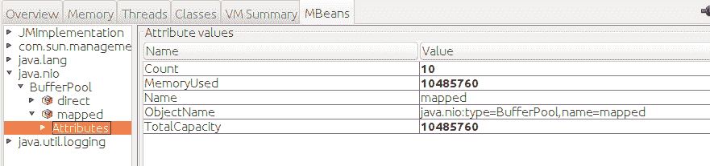

# 第八章：本地内存最佳实践

堆是 Java 应用程序中内存消耗最大的部分，但 JVM 将分配并使用大量本地内存。虽然第七章讨论了从程序设计角度有效管理堆的方法，但堆的配置以及它如何与操作系统的本地内存交互，是应用程序整体性能的另一个重要因素。这里存在术语冲突，因为 C 程序员倾向于将其本地内存的部分称为 C 堆。为了保持 Java 中心的世界观，我们将继续使用*堆*来指代 Java 堆，使用*本地内存*来指代 JVM 的非堆内存，包括 C 堆。

本章讨论本地（或操作系统）内存的这些方面。我们首先讨论 JVM 的整体内存使用，目标是了解如何监视这种使用以解决性能问题。然后，我们将讨论调整 JVM 和操作系统以实现最佳内存使用的各种方法。

# 占用空间

堆（通常）占据了 JVM 使用的内存量最大的部分，但 JVM 还使用内存进行其内部操作。这种非堆内存是本地内存。本地内存也可以通过应用程序分配（通过 JNI 调用`malloc()`和类似方法，或者在使用 New I/O 或 NIO 时）。JVM 使用的本地和堆内存总和构成了应用程序的总*占用空间*。

从操作系统的角度来看，这个总占用空间是性能的关键。如果没有足够的物理内存来容纳一个应用程序的整个总占用空间，性能可能会开始受到影响。这里关键词是*可能*。部分本地内存仅在启动时使用（例如，加载类路径中的 JAR 文件相关的内存），如果该内存被交换出去，可能不会被注意到。一个 Java 进程使用的部分本地内存与系统上的其他 Java 进程共享，并且还有一小部分与系统上其他类型的进程共享。然而，为了达到最佳性能，你需要确保所有 Java 进程的总占用空间不超过机器的物理内存（并且还需要留一些内存供其他应用程序使用）。

## 测量占用空间

要测量进程的总占用空间，您需要使用特定于操作系统的工具。在基于 Unix 的系统中，像`top`和`ps`这样的程序可以在基本水平上显示这些数据；在 Windows 上，您可以使用`perfmon`或`VMMap`。无论使用哪种工具和平台，您都需要查看进程的实际分配内存（而不是保留内存）。

分配和保留内存之间的区别是由 JVM（以及所有程序）管理内存的方式造成的。考虑一个使用参数 `-Xms512m` `-Xmx2048m` 指定的堆。堆从使用 512 MB 开始，并根据需要调整大小以满足应用程序的 GC 目标。

这个概念是已提交（或已分配）内存和保留内存（有时称为进程的*虚拟大小*）之间的基本区别。JVM 必须告诉操作系统，堆可能需要多达 2 GB 的内存，因此这段内存是*保留*的：操作系统承诺，当 JVM 尝试在增加堆的大小时分配额外的内存时，该内存将可用。

尽管如此，最初只分配了 512 MB 的内存，并且这 512 MB 是正在使用的所有内存（用于堆）。这个（实际上已分配的）内存被称为*已提交内存*。随着堆的重新调整，已提交内存的数量会波动；特别是随着堆大小的增加，已提交内存相应增加。

这种差异几乎适用于 JVM 分配的所有重要内存。随着更多代码被编译，代码缓存从初始值增长到最大值。元空间与堆分开分配，从其初始（提交）大小增长到其最大（保留）大小。

线程堆栈是一个例外。每当 JVM 创建一个线程时，操作系统会分配一些本地内存来保存该线程的堆栈，向进程分配更多内存（至少直到线程退出）。线程堆栈在创建时就完全分配了。

在 Unix 系统中，通过各种操作系统工具报告的进程的*常驻集大小 (RSS)*，可以估算应用程序的占用空间。这个值是进程正在使用的已提交内存量的良好估算，尽管有两种不精确之处。首先，在 JVM 和其他进程之间在操作系统级别共享的几页（即共享库的文本部分）被计入每个进程的 RSS 中。其次，进程可能分配了比任何时候都更多的内存。尽管如此，跟踪进程的 RSS 是监视总内存使用的一个很好的首次方法。在较新的 Linux 内核上，PSS 是对 RSS 的一种细化，去除了其他程序共享的数据。

在 Windows 系统上，等效的概念称为应用程序的*工作集*，这是任务管理器报告的内容。

## 最小化占用空间

要减少 JVM 使用的占用空间，请限制以下内存的使用量：

堆

堆是内存中占用最大的一部分，尽管令人惊讶的是它可能只占总占用空间的 50% 到 60%。使用较小的最大堆（或设置 GC 调优参数，使堆永远不会完全扩展）可以限制程序的占用空间。

线程堆栈

线程栈非常大，特别是对于 64 位的 JVM。详见第九章了解限制线程栈消耗的方法。

代码缓存

代码缓存使用本地内存来保存编译后的代码。如第四章所述，可以对其进行调优（尽管由于空间限制而无法编译所有代码可能会导致性能下降）。

本地库分配

本地库可以分配它们自己的内存，有时这可能是相当重要的。

接下来的几节讨论如何监控和减少这些区域。

# 快速总结

+   JVM 的总体占用内存对其性能有显著影响，特别是如果机器的物理内存受限。占用空间是性能测试的另一个方面，应经常进行监控。

## 本地内存追踪

JVM 提供有限的可见性，显示它如何分配本地内存。重要的是要意识到，此跟踪适用于 JVM 本身分配的内存，但不包括应用程序使用的任何本地库分配的内存。这包括第三方本地库和 JDK 自带的本地库（例如 *libsocket.so*）。

使用选项 `-XX:NativeMemoryTracking=*off|summary|detail*` 可以启用这种可见性。默认情况下，本地内存追踪（NMT）是关闭的。如果启用了摘要或详细模式，则可以随时从 `jcmd` 获取本地内存信息：

```java
% jcmd process_id VM.native_memory summary

```

如果 JVM 使用 `-XX:+PrintNMTStatistics` 参数启动（默认为 `false`），程序退出时 JVM 将打印出分配信息。

这是 JVM 运行的摘要输出，初始堆大小为 512 MB，最大堆大小为 4 GB：

```java
Native Memory Tracking:

 Total: reserved=5947420KB, committed=620432KB
```

虽然 JVM 分配了总计 5.9 GB 的内存，但实际使用的远远少于这个数值：只有 620 MB。这是相当典型的情况（也是不必特别关注 OS 工具中显示的进程虚拟大小的原因，因为那只反映了内存预留）。

内存使用情况分解如下。堆本身（不出意外地）是保留内存中最大的部分，达到了 4 GB。但由于堆的动态调整，实际只增长到了 268 MB（在这种情况下，堆的大小设置为 `-Xms256m -Xmx4g`，因此堆的实际使用量仅略有增加）：

```java
-                 Java Heap (reserved=4194304KB, committed=268288KB)
                            (mmap: reserved=4194304KB, committed=268288KB)
```

接下来是用于保存类元数据的本地内存。同样需要注意的是，JVM 预留了比程序中 24,316 个类所需更多的内存。这里的已分配大小将从 `MetaspaceSize` 标志的值开始，并根据需要增长，直到达到 `MaxMetaspaceSize` 标志的值：

```java
-                     Class (reserved=1182305KB, committed=150497KB)
                            (classes #24316)
                            (malloc=2657KB #35368)
                            (mmap: reserved=1179648KB, committed=147840KB)
```

大约分配了 77 个线程栈，每个约为 1 MB：

```java
-                    Thread (reserved=84455KB, committed=84455KB)
                            (thread #77)
                            (stack: reserved=79156KB, committed=79156KB)
                            (malloc=243KB, #314)
                            (arena=5056KB, #154)
```

接着是 JIT 代码缓存：24,316 个类并不多，因此代码缓存的使用只占了很小的一部分：

```java
-                      Code (reserved=102581KB, committed=15221KB)
                            (malloc=2741KB, #4520)
                            (mmap: reserved=99840KB, committed=12480KB)
```

下面是 GC 算法用于处理的堆外区域。这个区域的大小取决于所使用的 GC 算法：(简单的) 串行收集器会保留的远远少于更复杂的 G1 GC 算法（尽管通常这里的数量不会很大）：

```java
-                        GC (reserved=199509KB, committed=53817KB)
                            (malloc=11093KB #18170)
                            (mmap: reserved=188416KB, committed=42724KB)
```

同样，这个区域被编译器用于其操作，而不是放置在代码缓存中的结果代码：

```java
-                  Compiler (reserved=162KB, committed=162KB)
                            (malloc=63KB, #229)
                            (arena=99KB, #3)
```

JVM 的内部操作在这里表示。它们中的大部分 tend to be small，但一个重要的例外是直接字节缓冲区，它们是在这里分配的：

```java
-                  Internal (reserved=10584KB, committed=10584KB)
                            (malloc=10552KB #32851)
                            (mmap: reserved=32KB, committed=32KB)
```

符号表引用（来自类文件的常量）保存在这里：

```java
-                    Symbol (reserved=12093KB, committed=12093KB)
                            (malloc=10039KB, #110773)
                            (arena=2054KB, #1)
```

NMT 本身需要一些空间来进行操作（这也是它默认情况下不启用的原因之一）：

```java
-    Native Memory Tracking (reserved=7195KB, committed=7195KB)
                            (malloc=16KB #199)
                            (tracking overhead=7179KB)
```

最后，这里有一些 JVM 的小型簿记部分：

```java
-               Arena Chunk (reserved=188KB, committed=188KB)
                            (malloc=188KB)
-                   Unknown (reserved=8192KB, committed=0KB)
                            (mmap: reserved=8192KB, committed=0KB)
```

总体而言，NMT 提供了两个关键信息：

总已提交大小

JVM 的总已提交大小（理想情况下）接近进程将消耗的物理内存量。反过来，这应该接近应用程序的 RSS（或工作集），但是这些由操作系统提供的测量值不包括已提交但已从进程分页的任何内存。实际上，如果进程的 RSS 小于已提交内存，那通常表明操作系统难以将所有 JVM 放入物理内存中。

各自的已提交大小

当需要调整堆、代码缓存和元空间的最大值时，了解 JVM 使用了多少内存会很有帮助。在这些区域分配过多的情况下，通常只会导致无害的内存预留，但是当保留的内存很重要时，NMT 可以帮助确定这些最大大小可以被缩减的位置。

另一方面，正如我在本节开头指出的，NMT 不提供对共享库的本地内存使用情况的可见性，因此在某些情况下，总进程大小将大于 JVM 数据结构的已提交大小。

### NMT 随时间的变化

NMT 还允许您跟踪内存分配随时间的发生。在使用 NMT 启动 JVM 后，您可以使用此命令为内存使用情况建立基线：

```java
% jcmd process_id VM.native_memory baseline

```

这导致 JVM 标记其当前内存分配。稍后，您可以将当前内存使用情况与该标记进行比较：

```java
% jcmd process_id VM.native_memory summary.diff
Native Memory Tracking:

Total:  reserved=5896078KB  -3655KB, committed=2358357KB -448047KB

-             Java Heap (reserved=4194304KB, committed=1920512KB -444927KB)
                        (mmap: reserved=4194304KB, committed=1920512KB -444927KB)
....

```

在这种情况下，JVM 已保留了 5.8 GB 的内存，目前使用了 2.3 GB。与建立基线时相比，该已提交大小减少了 448 MB。类似地，堆使用的已提交内存减少了 444 MB（剩余的输出可以检查以查看内存使用减少的其他地方）。

这是一种随时间检查 JVM 占用空间的有用技术。

# 快速总结

+   本地内存跟踪（NMT）提供了有关 JVM 的本地内存使用情况的详细信息。从操作系统的角度来看，这包括 JVM 堆（对于操作系统来说只是本地内存的一部分）。

+   NMT 的总结模式对大多数分析已足够，并允许您确定 JVM 已经承诺使用多少内存（以及该内存用于什么）。

## 共享库的本地内存

从架构角度来看，NMT 是 HotSpot 的一部分：这是运行您应用程序 Java 字节码的 C++引擎。这位于 JDK 本身之下，因此它不追踪 JDK 级别的任何分配。这些分配来自共享库（由`System.loadLibrary()`调用加载）。

共享库通常被视为 Java 的第三方扩展：例如，Oracle WebLogic Server 有几个本地库用于比 JDK 更有效地处理 I/O。¹ 但 JDK 本身也有几个本地库，像所有共享库一样，这些库在 NMT 的视野之外。

因此，本地内存泄漏——即应用程序的 RSS 或工作集随时间不断增长——通常不会被 NMT 检测到。NMT 监视的内存池通常都有一个上限（例如，最大堆大小）。NMT 对于告诉我们哪些池使用了大量内存是很有用的（因此需要调整为使用更少内存），但一个无限制地泄漏本地内存的应用程序通常是由于本地库中的问题。

没有 Java 级别的工具真正能帮助我们检测应用程序从共享库使用本地内存的位置。OS 级别的工具可以告诉我们进程的工作集不断增长，如果一个进程的工作集增长到有 10 GB，并且 NMT 告诉我们 JVM 只承诺了 6 GB 的内存，那么我们知道另外的 4 GB 内存必定来自本地库的分配。

弄清楚哪个本地库负责需要 OS 级别的工具而不是来自 JDK 的工具。各种调试版本的`malloc`可以用于此目的。虽然这些在某种程度上很有用，但通常本地内存是通过`mmap`调用分配的，大多数跟踪`malloc`调用的库会错过这些。

一个很好的选择是使用可以同时分析本地代码和 Java 代码的分析器。例如，在第三章中我们讨论了 Oracle Studio Profiler，这是一个混合语言的分析器。该分析器还有一个选项可以跟踪内存分配情况——唯一的限制是它只能跟踪本地代码的内存分配，而不能跟踪 Java 代码的内存分配，但在这种情况下这正是我们需要的。

图 8-1 显示了 Studio Profiler 中的本地分配视图。


###### 图 8-1. 本地内存分析

此调用图显示我们，WebLogic 本地函数 `mapFile` 已使用 `mmap` 将约 150 GB 的本地内存分配到我们的进程中。这有点误导：该文件存在多个映射，分析器并不足够智能以意识到它们共享实际内存：例如，如果该 15 GB 文件有 100 个映射，则内存使用仅增加 15 GB。（坦率地说，我有意损坏了该文件使其变得如此巨大；这绝不反映实际用途。）尽管如此，本地分析器已指出了问题的位置。

在 JDK 本身，有两种常见操作可能导致大量的本地内存使用：使用 `Inflater` 和 `Deflater` 对象，以及使用 NIO 缓冲区。即使没有进行分析，也有办法检测这些操作是否导致了本地内存的增长。

### 本地内存和压缩/解压器

`Inflater` 和 `Deflater` 类执行各种压缩操作：zip、gzip 等。它们可以直接使用，也可以通过各种输入流间接使用。这些算法使用平台特定的本地库执行操作。这些库可能会分配大量的本地内存。

当使用这些类之一时，按照文档的说法，应在操作完成时调用 `end()` 方法。其中一件事是释放对象使用的本地内存。如果使用流，则应关闭流（流类将在其内部对象上调用 `end()` 方法）。

如果忘记调用 `end()` 方法，也不用担心。回想一下第七章中提到的情况：所有对象都有一个专门的清理机制来处理这种情况：`finalize()` 方法（在 JDK 8 中）或对象关联的 `Cleaner`（在 JDK 11 中）在收集 `Inflater` 对象时可以调用 `end()` 方法。因此，不会导致本地内存泄漏；最终对象将被收集和清理，本地内存将被释放。

尽管如此，这可能需要很长时间。`Inflater` 对象的大小相对较小，在很少进行完整 GC 的大堆应用程序中，这些对象很容易晋升到老年代并保持数小时。因此，即使技术上没有泄漏——当应用程序执行完整 GC 时，本地内存最终会被释放——但在这里未调用 `end()` 操作可能表现出本地内存泄漏的所有迹象。

更重要的是，如果 `Inflater` 对象本身在 Java 代码中出现泄漏，则实际上会泄漏本地内存。

因此，当大量本地内存泄漏时，有助于对应用程序进行堆转储，并查找这些`Inflater`和`Deflater`对象。这些对象可能不会在堆本身中引起问题（它们对于堆来说太小了），但它们的大量存在将表明存在大量使用本地内存。

### 本地 NIO 缓冲区

如果通过`ByteBuffer`类的`allocateDirect()`方法或`FileChannel`类的`map()`方法创建 NIO 字节缓冲区，则会分配本地（非堆）内存。

本地字节缓冲区从性能的角度来看非常重要，因为它们允许本地代码和 Java 代码在不复制数据的情况下共享数据。用于文件系统和套接字操作的缓冲区是最常见的示例。将数据写入本地 NIO 缓冲区，然后将数据发送到通道（例如文件或套接字）不需要在 JVM 和用于传输数据的 C 库之间复制数据。如果使用堆字节缓冲区，则 JVM 必须复制缓冲区的内容。

`allocateDirect()`方法调用是昂贵的；应尽可能重用直接字节缓冲区。理想情况是，当线程独立运行时，每个线程可以将直接字节缓冲区保留为线程本地变量。如果许多线程需要变量大小的缓冲区，这有时会使用太多本地内存，因为最终每个线程将以可能的最大大小拥有一个缓冲区。对于这种情况或当线程本地缓冲区不适合应用程序设计时，直接字节缓冲区的对象池可能更有用。

字节缓冲区还可以通过切片进行管理。应用程序可以分配一个非常大的直接字节缓冲区，通过使用`ByteBuffer`类的`slice()`方法，可以从该缓冲区中分配部分数据。当切片大小不总是相同时，这种解决方案可能会变得难以管理：原始字节缓冲区可能会像分配和释放不同大小对象时堆一样变得碎片化。然而，与堆不同的是，字节缓冲区的各个切片无法压缩，因此此解决方案仅在所有切片大小均匀时才有效。

从调优的角度来看，需要意识到的一件事是，任何这些编程模型中，应用程序可以分配的直接字节缓冲区空间可能会受到 JVM 的限制。可以通过设置`-XX:MaxDirectMemorySize`=*`N`*标志来指定可以分配给直接字节缓冲区的内存总量。当前 JVM 中此标志的默认值为 0。该限制的含义已经经常发生变化，但在 Java 8 的后期版本（以及所有 Java 11 的版本）中，最大限制等于最大堆大小：如果最大堆大小为 4 GB，则也可以创建 4 GB 的直接和/或映射字节缓冲区的非堆内存。如果需要，可以增加该值超过最大堆值。

直接字节缓冲区分配的内存包含在 NMT 报告的`Internal`部分中；如果这个数字很大，几乎总是因为这些缓冲区。如果你想确切地知道缓冲区本身消耗了多少，MBeans 会跟踪这些信息。检查 MBean `java.nio.BufferPool.direct.Attributes`或`java.nio.BufferPool.mapped.Attributes`将显示每种类型已分配的内存量。图 8-2 显示了一个情况，我们映射了 10 个缓冲区，总共占用了 10 MB 的空间。



###### 图 8-2\. 检查字节缓冲区本地内存

# 快速总结

+   如果一个应用程序似乎使用了太多本地内存，很可能是来自本地库而不是 JVM 本身。

+   本地配置文件可以有效地确定这些分配的来源。

+   几个常见的 JDK 类通常会增加本地内存的使用量；确保正确使用这些类。

# JVM 对操作系统的调优

JVM 可以使用几种调整来改善其使用操作系统内存的方式。

## 大页面

关于内存分配和交换的讨论是关于页面的术语。*页面*是操作系统用来管理物理内存的内存单位。这是操作系统的最小分配单位：当分配 1 字节时，操作系统必须分配整个页面。程序的进一步分配来自同一个页面，直到它填满为止，然后才会分配新的页面。

操作系统分配的页面比能够放入物理内存的页面多得多，这就是为什么有页面调度：地址空间的页面被移动到和从交换空间（或其他存储，具体取决于页面内容）中。这意味着这些页面和它们当前存储在计算机 RAM 中的位置之间必须有一些映射。这些映射通过两种方式处理。所有页面映射都保存在全局页表中（操作系统可以扫描以找到特定映射），并且最常用的映射保存在 TLB（翻译后备缓冲区）中。TLB 保存在快速缓存中，因此通过 TLB 条目访问页面比通过页表访问页面快得多。

计算机有限的 TLB 条目数，因此最大化 TLB 条目的命中率变得重要（它作为最近最少使用的缓存）。由于每个条目代表一个页面的内存，增加应用程序使用的页面大小通常是有利的。如果每个页面代表更多的内存，需要更少的 TLB 条目来包含整个程序，当需要时更可能在 TLB 中找到页面。这对于任何程序通常都是正确的，因此也适用于像 Java 应用服务器或其他具有适度大小堆的 Java 程序。

大页面必须在 Java 和操作系统两个层面上启用。在 Java 层面，`-XX:+UseLargePages` 标志启用大页面使用；默认情况下，此标志为 `false`。并非所有操作系统都支持大页面，而且启用它们的方式显然各不相同。

如果在不支持大页面的系统上启用了 `UseLargePages` 标志，则不会发出警告，并且 JVM 使用常规页面。如果在支持大页面但没有可用大页面的系统上启用了 `UseLargePages` 标志（因为它们已经全部在使用中或因为操作系统配置错误），则 JVM 将打印警告。

### Linux 大页面

Linux 将大页面称为 *大页面*。Linux 上的大页面配置在每个发行版中略有不同；要获得最准确的说明，请查阅您的发行版文档。但是一般的过程如下：

1.  确定内核支持哪些大页面大小。大小基于计算机的处理器和内核启动时给出的引导参数，但最常见的值是 2 MB：

    ```java
    # grep Hugepagesize /proc/meminfo
    Hugepagesize:       2048 kB

    ```

1.  确定需要多少个大页面。如果 JVM 将分配 4 GB 堆，并且系统有 2 MB 大页面，则该堆需要 2,048 个大页面。可以在 Linux 内核中全局定义可使用的大页面数量，因此对将要运行的所有 JVM（以及将使用大页面的任何其他程序）重复此过程。您应该将此值高估 10%，以考虑大页面的其他非堆使用（因此此示例使用 2,200 个大页面）。

1.  将该值写入操作系统（以便立即生效）：

    ```java
    # echo 2200 > /proc/sys/vm/nr_hugepages

    ```

1.  将该值保存在 */etc/sysctl.conf* 中，以便在重新启动后保留该值：

    ```java
    sys.nr_hugepages=2200
    ```

1.  在许多 Linux 版本中，用户可以分配的大页面内存量是有限的。编辑 */etc/security/limits.conf* 文件，并为运行您的 JVM 的用户添加 `memlock` 条目（例如，在示例中，用户为 `appuser`）：

    ```java
    appuser soft    memlock        4613734400
    appuser hard    memlock        4613734400
    ```

如果修改了 *limits.conf* 文件，则用户必须重新登录才能使该值生效。此时，JVM 应该能够分配所需的大页面。要验证它是否有效，请运行以下命令：

```java
# java -Xms4G -Xmx4G -XX:+UseLargePages -version
java version "1.8.0_201"
Java(TM) SE Runtime Environment (build 1.8.0_201-b09)
Java HotSpot(TM) 64-Bit Server VM (build 25.201-b09, mixed mode)

```

成功执行该命令表示大页面已正确配置。如果大页面内存配置不正确，则会收到警告：

```java
Java HotSpot(TM) 64-Bit Server VM warning:
Failed to reserve shared memory (errno = 22).
```

在这种情况下程序会运行；只是使用常规页面而不是大页面。

### Linux 透明大页面

从 Linux 内核版本 2.6.32 开始支持 *透明大页面*。这些在理论上提供与传统大页面相同的性能优势，但它们与传统大页面有一些区别。

首先，传统大页面被锁定在内存中；它们永远不会被交换。对于 Java 来说，这是一个优势，因为正如我们所讨论的，交换堆的部分对 GC 性能是有害的。透明大页面可以被交换到磁盘，这对性能是不利的。

第二，透明大页的分配与传统大页也有显著不同。传统大页在内核启动时设置；它们始终可用。透明大页则按需分配：当应用程序请求 2 MB 页面时，内核将尝试在物理内存中找到 2 MB 的连续空间来存放页面。如果物理内存碎片化，内核可能会决定花时间重新排列页面，这类似于 Java 堆中内存紧缩的过程。这意味着分配页面的时间可能会显著增长，因为它等待内核完成为内存腾出空间的工作。

这影响所有程序，但对于 Java 来说，可能导致 GC 暂停时间很长。在 GC 期间，JVM 可能决定扩展堆并请求新页。如果页面分配需要几百毫秒甚至一秒钟，GC 时间会受到显著影响。

第三，透明大页在操作系统和 Java 级别有不同的配置。接下来是详细内容。

在操作系统级别，透明大页的配置是通过修改 */sys/kernel/mm/transparent_hugepage/enabled* 的内容：

```java
# cat /sys/kernel/mm/transparent_hugepage/enabled
always [madvise] never
# echo always > /sys/kernel/mm/transparent_hugepage/enabled
# cat /sys/kernel/mm/transparent_hugepage/enabled
[always] madvise never

```

这里有三种选择：

`always`

所有可能的情况下，所有程序都会得到大页。

`madvise`

请求大页的程序会得到它们；其他程序得到常规（4 KB）页。

`never`

没有程序会得到大页，即使它们请求了。

不同版本的 Linux 在该设置的默认值上有所不同（并且在未来版本中可能会更改）。例如，Ubuntu 18.04 LTS 将默认值设置为 `madvise`，但 CentOS 7（以及基于其的 Red Hat 和 Oracle Enterprise Linux 供应商版本）将其设置为 `always`。还要注意，在云机器上，OS 镜像的供应商可能已更改该值；我曾看到将该值设置为 `always` 的 Ubuntu 镜像。

如果值设置为 `always`，在 Java 级别不需要任何配置：JVM 将获得大页。事实上，系统上运行的所有程序都将在大页上运行。

如果值设置为 `madvise` 并且您希望 JVM 使用大页，请指定 `UseTransparentHugePages` 标志（默认情况下为 `false`）。然后，当 JVM 分配页面并且获得大页时，JVM 会进行适当的请求。

预测地，如果值设置为 `never`，则没有 Java 级别的参数允许 JVM 获取大页。不像传统的大页，如果您指定了 `UseTransparentHugePages` 标志但系统无法提供大页，则不会收到警告。

由于透明巨大页面在交换和分配方面的差异，通常不建议在 Java 中使用它们；然而，在默认启用它们的系统上，使用它们时通常会看到性能提升，就像广告中所宣传的那样。如果您希望确保使用大页面时获得最平稳的性能，那么最好只在需要时将系统设置为仅使用透明巨大页面，并为 JVM 配置传统大页面。

### Windows 大页面

仅支持服务器版 Windows 版本的 *大页面*。这里提供了适用于 Windows 10 的详细说明；不同版本可能会有所不同：

1.  启动 Microsoft 管理中心。单击“开始”按钮，在搜索框中键入 **`mmc`**。

1.  如果左侧面板未显示本地计算机策略图标，请从“文件”菜单中选择“添加/移除插件”，并添加组策略对象编辑器。如果不可用，则正在使用的 Windows 版本不支持大页面。

1.  在左侧面板中，展开本地计算机策略 → 计算机配置 → Windows 设置 → 安全设置 → 本地策略，并点击“用户权限分配”文件夹。

1.  在右侧面板中，双击“锁定内存中的页面”。

1.  在弹出窗口中，添加用户或组。

1.  点击“确定”。

1.  退出 MMC。

1.  重新启动。

此时，JVM 应能够分配所需的大页面。要验证其是否有效，请运行以下命令：

```java
# java -Xms4G -Xmx4G -XX:+UseLargePages -version
java version "1.8.0_201"
Java(TM) SE Runtime Environment (build 1.8.0_201-b09)
Java HotSpot(TM) 64-Bit Server VM (build 25.201-b09, mixed mode)

```

如果命令像这样成功完成，大页面已正确设置。如果大内存配置不正确，将会收到警告：

```java
Java HotSpot(TM) Server VM warning: JVM cannot use large page memory
because it does not have enough privilege to lock pages in memory.
```

请记住，在不支持大页面的 Windows 系统（如“家庭版”）上，该命令不会显示错误：一旦 JVM 发现操作系统不支持大页面，它会将 `UseLargePages` 标志设置为 `false`，而不管命令行设置如何。

# 快速摘要

+   使用大页面通常会显著加快应用程序的速度。

+   大页面支持在大多数操作系统中必须显式启用。

# 摘要

尽管 Java 堆是最受关注的内存区域，但 JVM 的整体占用对其性能至关重要，特别是与操作系统的关系。本章讨论的工具允许您随时间跟踪该占用量（并且至关重要的是，专注于 JVM 的已提交内存而不是保留内存）。

JVM 使用操作系统内存的某些方式，特别是大页面，也可以进行调整以提高性能。长时间运行的 JVM 几乎总是会从使用大页面中受益，特别是如果它们具有大堆。

¹ 这在很大程度上是历史文物：这些库在 NIO 之前开发，大部分功能与其重复。
