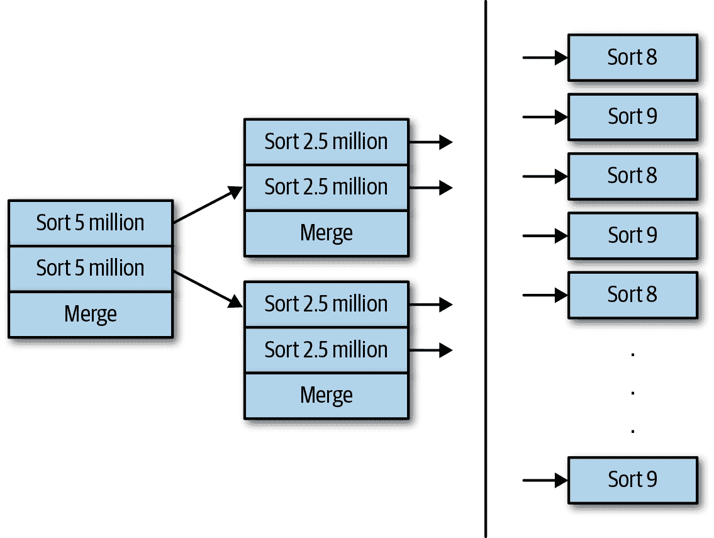

# 第九章：线程和同步性能

从最初开始，Java 的一大吸引力就是它的多线程特性。即使在多核和多 CPU 系统成为标准之前，用 Java 编写多线程程序的能力也被视为其显著特征之一。

从性能角度来看，其吸引力是显而易见的：如果有两个 CPU 可用，应用程序可能能够完成两倍的工作，或者以两倍的速度完成相同数量的工作。这是基于任务可以分解为离散片段的假设，因为 Java 不是自动并行化语言，不会自动解决算法部分。幸运的是，今天的计算通常涉及到离散任务：服务器同时处理来自离散客户的请求，批处理作业对一系列数据执行相同操作，将算法分解为组成部分等等。

本章探讨如何在 Java 线程和同步设施中获得最大性能。

# 线程和硬件

回顾第一章中关于多核系统和超线程系统的讨论。在软件层面上进行线程处理使我们能够利用机器的多个核心和超线程。

在一台机器上加倍核心数，使我们能够将正确编写的应用程序性能提升一倍，尽管如我们在第一章讨论过的，向 CPU 添加超线程并不会使其性能翻倍。

本章的几乎所有示例都在一个有四个单线程 CPU 的机器上运行——例外情况是第一个示例，展示了超线程和非超线程 CPU 之间的差异。之后，我们将仅从单线程 CPU 核心的角度来看待扩展，以便更好地理解添加线程的性能影响。这并不是说超线程 CPU 不重要；从硬件线程中获得的额外 20%至 40%的性能提升肯定会改善应用程序的整体性能或吞吐量。从 Java 的角度来看，我们仍然应该将超线程视为实际的 CPU，并调整我们在一个四核八超线程机器上运行的应用程序，就好像它有八个 CPU 一样。但从测量的角度来看，我们应该只期望与单核相比提高五到六倍的性能。

# 线程池和 ThreadPoolExecutors

在 Java 中，线程可以由自定义代码管理，或者应用程序可以利用线程池。Java 服务器通常围绕一个或多个线程池的概念构建：服务器中的每次调用都由池中的一个（可能是不同的）线程处理。类似地，其他应用程序可以使用 Java 的`ThreadPoolExecutor`并行执行任务。

实际上，一些服务器框架使用`ThreadPoolExecutor`类的实例来管理它们的任务，尽管许多人都编写了自己的线程池（即使只是因为它们早于将`ThreadPoolExecutor`添加到 Java API 中）。虽然在这些情况下池的实现可能有所不同，但基本概念是相同的，并且这两者都在本节中讨论。

使用线程池的关键因素在于调整池的大小对于获得最佳性能至关重要。线程池的性能因对线程池大小的基本选择而异，且在某些情况下，超大型线程池会对性能产生不利影响。

所有的线程池工作原理基本相同。任务被提交到一个队列（可能有多个队列，但概念是相同的）。然后，一定数量的线程从队列中获取任务并执行它们。任务的结果可以发送回客户端（例如，在服务器的情况下），存储在数据库中，存储在内部数据结构中，或者其他操作。但在完成任务后，线程将返回到任务队列以获取另一个要执行的作业（如果没有更多任务可执行，则线程将等待任务）。

线程池有最小和最大线程数。最小线程数会保留在周围，等待分配任务给它们。因为创建线程是一个相当昂贵的操作，当任务被提交时，这会加快整体操作：预期已经存在的线程可以接管它。另一方面，线程需要系统资源，包括用于它们的堆栈的本机内存，过多的空闲线程可能会消耗其他进程可以使用的资源。最大线程数还作为一个必要的节流阀，防止过多的任务一次执行。

`ThreadPoolExecutor`及其相关类的术语略有不同。这些类引用*核心*池大小和*最大*池大小，这些术语的含义取决于池是如何构建的。有时核心池大小是最小池大小，有时是最大池大小，有时则完全被忽略。同样，有时最大池大小是最大大小，但有时也会被忽略。

在本节的结尾提供了详细信息，但为了简化问题，我们将为我们的测试设置核心和最大大小相同，并且仅提到最大大小。因此，示例中的线程池始终具有给定数量的线程。

## 设置最大线程数

首先让我们讨论最大线程数：在给定硬件上的给定工作负载的最佳最大线程数是多少？这并没有简单的答案；它取决于工作负载的特性和运行它的硬件。特别是，最佳线程数取决于每个单独任务多频繁地会被阻塞。

我们将使用一台具有四个单线程 CPU 的机器进行讨论。请注意，如果系统只有四个核心，如果系统有 128 个核心但您只想利用其中的四个，或者如果您有一个将 CPU 使用限制为四个的 Docker 容器：目标是最大化这四个核心的使用。

显然，最大线程数必须至少设置为四个。当然，JVM 中的一些线程除了处理这些任务之外还会做其他事情，但这些线程几乎永远不会需要整个核心。唯一的例外是如果使用了并发模式垃圾收集器，如第五章中讨论的背景线程必须具有足够的 CPU（核心）才能运行，否则它们将在处理堆时落后。

是否有超过四个线程有帮助？这就涉及到工作负载特性的问题。以简单情况为例，如果任务全部是计算密集型的：它们不进行外部网络调用（例如访问数据库），也没有内部锁的显著争用。股票价格历史批处理程序就是这样的应用程序（使用模拟实体管理器时）：可以完全并行计算实体的数据。

表 9-1 展示了在一个四核机器上，使用给定数量的线程池计算 10,000 个模拟股票实体历史的性能。当线程池中只有一个线程时，需要 55.2 秒来计算数据集；使用四个线程时，仅需 13.9 秒。随着线程数量的增加，稍微多一点时间将被需要，因为线程需要在任务队列中进行协调。

表 9-1\. 计算 10,000 个模拟价格历史所需时间

| 线程数 | 所需秒数 | 基准百分比 |
| --- | --- | --- |
| 1 | 55.2 ± 0.6 | 100% |
| 2 | 28.3 ± 0.3 | 51.2% |
| 4 | 13.9 ± 0.6 | 25.1% |
| 8 | 14.3 ± 0.2 | 25.9% |
| 16 | 14.5 ± 0.3 | 26.2% |

如果应用程序中的任务完全并行，那么“基准百分比”列在两个线程时将显示 50%，在四个线程时将显示 25%。由于多种原因，这种完全线性的扩展是不可能实现的：除此之外，线程必须相互协调以从运行队列中选择任务（通常情况下，线程之间的同步更多）。当使用四个线程时，系统正在消耗 100%的可用 CPU，尽管可能没有其他用户级应用程序在运行，但各种系统级进程会启动并使用一些 CPU，从而阻止 JVM 利用所有 100%的周期。尽管如此，该应用程序在扩展方面表现良好，即使线程池中的线程数被高估，我们也只需支付很小的性能损失。

在其他情况下，线程过多可能会造成更大的惩罚。在股票历史计算器的 REST 版本中，线程过多会产生更大的影响，正如表 9-3 所示。应用服务器被配置为具有给定数量的线程，并且负载生成器正在向服务器发送 16 个并发请求。

表 9-3\. 通过 REST 服务器模拟股票价格的操作每秒

| 线程数量 | 计算模拟股票价格历史的平均响应时间 |
| --- | --- | --- |
| 1 | 46.4 | 27% |
| 4 | 169.5 | 100% |
| 8 | 165.2 | 97% |
| 16 | 162.2 | 95% |

鉴于 REST 服务器有四个可用的 CPU 核心，池中有那么多线程才能实现最大吞吐量。

第一章讨论了在调查性能问题时需要确定瓶颈所在的必要性。在这个例子中，瓶颈显然是 CPU：在四个 CPU 核心的情况下，CPU 利用率达到 100%。但在这种情况下，增加更多线程的惩罚相对较小，至少直到线程数多出四倍为止。

但是如果瓶颈在其他地方呢？这个例子也有点不同寻常，因为任务完全受 CPU 限制：它们不进行 I/O 操作。通常情况下，线程可能会被期望调用数据库或将其输出写入某个位置，甚至与另一个资源进行会合。在这种情况下，CPU 不一定是瓶颈：可能是外部资源。

当这种情况发生时，向线程池添加线程是有害的。尽管我在第一章（也只是半开玩笑地）说过数据库总是瓶颈，瓶颈可以是任何外部资源。

例如，考虑一下股票 REST 服务器，角色发生了逆转：如果目标是充分利用负载生成机器（毕竟只是运行一个线程化的 Java 程序）呢？

在典型的使用情况下，如果 REST 应用在一个具有四个 CPU 的服务器上运行，并且只有一个客户端请求数据，那么 REST 服务器将约占用 25%的资源，而客户端机器几乎处于空闲状态。如果负载增加到四个并发客户端，则服务器将达到 100%的资源利用率，而客户端机器可能只有 20%的资源被使用。

仅仅看客户端，很容易得出结论，因为客户端有大量空闲 CPU 资源，应该能够增加更多线程以提高其吞吐量。然而，表 9-4 显示了这种假设是多么错误：当向客户端添加线程时，性能受到了严重影响。

表 9-4\. 添加线程计算平均响应时间

| 客户端线程数量 | 平均响应时间 | 基准的百分比 |
| --- | --- | --- |
| 1 | 0.022 second | 100% |
| 2 | 0.022 second | 100% |
| 4 | 0.024 second | 109% |
| 8 | 0.046 second | 209% |
| 16 | 0.093 second | 422% |
| 32 | 0.187 second | 885% |

一旦在这个例子中 REST 服务器成为瓶颈（即在四个客户端线程处），增加服务器的负载会非常有害。

这个例子可能看起来有些牵强。当服务器已经是 CPU 密集型时，谁会增加更多客户端线程呢？但我之所以使用这个例子，仅仅是因为它易于理解，并且只使用了 Java 程序。你可以自己运行它来理解它的工作原理，而不需要设置数据库连接和模式等等。

关键在于相同的原理在这里也适用于将请求发送到 CPU 或 I/O 瓶颈的数据库的 REST 服务器。你可能只看服务器的 CPU 使用情况，看到它远低于 100%，还有额外的请求需要处理，就会认为增加服务器线程数量是个好主意。这将导致一个大惊喜，因为在这种情况下增加线程数量实际上会降低总吞吐量（可能显著降低），就像在仅有 Java 的例子中增加客户端线程一样。

这也是了解系统中实际瓶颈位置的重要原因之一：如果增加负载到瓶颈，性能会显著下降。相反，如果减少当前瓶颈的负载，则性能可能会增加。

这也是为什么线程池的自调整很困难的原因。线程池通常可以看到它们待处理的工作量，甚至可能了解到机器上的 CPU 使用情况，但通常无法看到它们执行的整个环境的其他方面。因此，在有待处理工作时增加线程——这是许多自调整线程池的关键特性（以及`ThreadPoolExecutor`的某些配置）——通常恰恰是错误的做法。

在表格 9-4 中，REST 服务器的默认配置是在四核机器上创建 16 个线程。在一般默认情况下，这是有道理的，因为可以预期这些线程会进行外部调用。当这些调用因等待响应而阻塞时，其他任务可以运行，服务器将需要多于四个线程来执行这些任务。因此，默认情况下创建稍多的线程是一个合理的折衷方案：对于主要是 CPU 密集型的任务会有轻微的惩罚，但对于运行多个执行阻塞 I/O 的任务会提高吞吐量。其他服务器可能默认创建了 32 个线程，这对于我们的 CPU 密集型测试来说会有更大的惩罚，但对于处理主要是 I/O 密集型负载的情况则有更大的优势。

不幸的是，这也是为什么设置线程池的最大大小通常更像是一门艺术而不是科学的原因。在现实世界中，自调整的线程池可能使您在测试系统的可能性下获得 80%到 90%的性能，并且在池中估计所需的线程数量可能只会导致小小的惩罚。但是当这种大小设置出现问题时，问题可能会很严重。在这方面进行充分的测试仍然是一个关键要求。

## 设置最小线程数

一旦确定了线程池中的最大线程数，就该确定所需的最小线程数了。简单地说，在几乎所有情况下，设置最小线程数与最大线程数相同通常都没什么关系，也比较简单。

将最小线程数设置为另一个值（例如 1）的论点是，它可以防止系统创建过多线程，从而节省系统资源。确实，每个线程都需要一定量的内存，特别是用于其堆栈（稍后在本章讨论）。但是同样遵循第二章中的一般规则，系统需要调整大小以处理预期的最大吞吐量，此时系统将需要创建所有这些线程。如果系统无法处理最大数量的线程，选择少量的最小线程数并没有真正帮助：如果系统达到需要最大数量线程的条件（且无法处理），那么系统肯定会遇到问题。最好创建所有可能最终需要的线程，并确保系统能够处理预期的最大负载。

另一方面，指定最小线程数的缺点相当小。这种缺点发生在第一次有多个任务需要执行时：此时池将需要创建一个新线程。创建线程对性能有害——这也是为什么首先需要线程池的原因——但是对于创建线程的这一次成本，只要线程留在池中，可能不会被注意到。

在   在批处理应用程序中，线程是在池创建时分配还是按需分配（如果将最小和最大线程数设置为相同，则会发生前者），对于执行应用程序所需的时间来说是无关紧要的。在其他应用程序中，新线程可能会在预热期间分配（同样，分配线程的总时间相同）；这对应用程序的性能影响微乎其微。即使线程创建发生在测量周期内，只要线程创建受限，通常不会被注意到。

这里适用的另一种调优是线程的空闲时间。假设池的大小被设置为一个线程的最小值和四个线程的最大值。现在假设通常有一个线程在执行任务，然后应用程序开始一个循环，在该循环中，每隔 15 秒，工作负载平均有两个任务需要执行。在通过该循环的第一次时，池将创建第二个线程——现在有理由让第二个线程在池中至少停留一段时间。你希望避免这样的情况：第二个线程被创建，完成其任务需要 5 秒钟，空闲了 5 秒钟，然后退出——因为 5 秒钟后，下一个任务将需要第二个线程。一般来说，在池中为一个最小大小创建线程后，应该让它至少保持几分钟以处理负载的任何激增。在你有到达率的良好模型的程度上，你可以根据这个空闲时间来计划。否则，计划空闲时间应该以分钟为单位，至少在 10 到 30 分钟之间。

保持空闲线程通常对应用程序影响不大。通常，线程对象本身并不占用大量堆空间。唯一的例外是如果线程保持大量的线程本地存储，或者如果通过线程的可运行对象引用了大量内存。在这两种情况下，释放线程可以在堆中剩余的活跃数据方面带来显著的节省（这反过来影响 GC 的效率）。

然而，线程池中这种情况确实不应该发生。当池中的线程空闲时，它不应再引用任何可运行的对象（如果引用了，说明某处存在 bug）。根据池的实现方式，线程本地变量可能会保留在原地——但是，虽然线程本地变量在某些情况下可以有效地促进对象的重用（见第七章），但这些线程本地对象占用的内存总量应该是有限的。

这个规则的一个重要例外是那些可能会增长到非常大（因此运行在非常大机器上）的线程池。假设一个线程池的任务队列平均预期有 20 个任务；那么 20 就是池的一个良好的最小大小。现在假设该池在一个非常大的机器上运行，并且设计成能处理 2,000 个任务的高峰。在这个池中保持 2,000 个空闲线程会影响其性能，当它只运行 20 个任务时，该池的吞吐量可能会减少多达 50%，因为当池中有 1,980 个空闲线程时，与仅有核心的 20 个繁忙线程时相比。通常情况下，线程池不会遇到这种大小问题，但是当它们出现时，现在是确保它们有一个良好的最小值的好时机。

## 线程池任务大小

线程池中待处理的任务存储在队列或列表中；当池中的线程可以执行任务时，它会从队列中取出一个任务。这可能导致不平衡，因为队列中的任务数量可能会非常大。如果队列太大，队列中的任务将不得不等待很长时间，直到它们前面的任务完成执行。想象一个负载过重的 Web 服务器：如果一个任务被添加到队列中并且在 3 秒内未执行，用户很可能已经转移到另一页。

因此，线程池通常会限制待处理任务队列的大小。`ThreadPoolExecutor` 根据配置的数据结构以不同方式实现此功能（下一节将详细介绍）；服务器通常有一个调整参数来调整这个值。

与线程池的最大大小一样，并没有普遍适用的规则表明应该如何调整这个值。一个服务器如果在队列中有 30,000 个项目并且有四个可用 CPU，如果每个任务执行仅需 50 毫秒（假设这段时间内没有新任务到达），则可以在 6 分钟内清除队列。这可能是可以接受的，但如果每个任务需要 1 秒钟才能执行，则需要 2 小时才能清空队列。再次强调，测量实际应用程序是确保得到所需性能的唯一方法。

在任何情况下，当达到队列限制时，尝试向队列添加任务将失败。`ThreadPoolExecutor` 有一个 `rejectedExecution()` 方法来处理这种情况（默认情况下会抛出 `RejectedExecutionException`，但您可以覆盖此行为）。应用服务器应向用户返回合理的响应（包含说明发生了什么的消息），而 REST 服务器应返回状态码 429（请求过多）或 503（服务不可用）。

## 调整 ThreadPoolExecutor 的大小

线程池的一般行为是从最小线程数开始，并且如果所有现有线程都忙于执行任务时有新任务到达，则启动新线程（最多线程数），并立即执行任务。如果已经启动了最大数量的线程但它们都忙于工作，则任务将被排队，除非已有许多任务在排队，否则该任务将被拒绝。虽然这是线程池的典型行为，但 `ThreadPoolExecutor` 的行为可能略有不同。

`ThreadPoolExecutor` 根据用于保存任务的队列类型决定何时启动新线程。有三种可能性：

`同步队列`

当执行器使用`SynchronousQueue`时，线程池的行为与线程数量的预期行为一致：如果所有现有线程都忙于工作，并且池的线程数少于最大线程数，则新任务将启动新线程。然而，这个队列无法持有待处理的任务：如果一个任务到达并且最大线程数已经全部忙碌，那么该任务将被拒绝。因此，这种选择适合管理少量任务，但在其他情况下可能不合适。该类的文档建议为最大线程数指定一个非常大的数值——如果任务完全是 I/O 绑定的话可能是可以接受的，但正如我们所见，在其他情况下可能会产生反效果。另一方面，如果需要一个可以轻松调整线程数量的线程池，这是更好的选择。

在这种情况下，核心值是最小池大小：即使处于空闲状态，也会保持运行的线程数。最大值是池中的最大线程数。

这是`Executors`类的`newCachedThreadPool()`方法返回的具有无界最大线程值的线程池类型。

无界队列

当执行器使用无界队列（例如`LinkedBlockingQueue`）时，永远不会拒绝任何任务（因为队列大小是无限的）。在这种情况下，执行器将最多使用由核心线程池大小指定的线程数：忽略最大池大小。这本质上模仿了传统线程池，其中核心大小被解释为最大池大小，尽管由于队列是无界的，如果任务提交得比可以运行的更快，则存在消耗过多内存的风险。

这是`Executors`类的`newFixedThreadPool()`和`newSingleThreadScheduledExecutor()`方法返回的线程池类型。在第一种情况下，核心（或最大）池大小是构建池时传递的参数；在第二种情况下，核心池大小为 1。

有界队列

使用有界队列（例如`ArrayBlockingQueue`）的执行器采用复杂的算法来确定何时启动新线程。例如，假设池的核心大小为 4，最大大小为 8，而`ArrayBlockingQueue`的最大大小为 10。随着任务的到达并放置在队列中，池将运行最多 4 个线程（核心池大小）。即使队列完全填满——以至于它持有 10 个待处理任务——执行器也将利用 4 个线程。

只有在队列满时并且向队列添加新任务时，才会启动额外的线程。与其拒绝任务（因为队列已满），执行器会启动一个新线程。新线程运行队列中的第一个任务，为待处理的任务腾出空间。

在此示例中，池子最终会拥有 8 个线程（其指定的最大值），只有在有 7 个任务在进行中，10 个任务在队列中，并且向队列添加了一个新任务时才会发生。

此算法的理念在于，即使有一定数量的任务排队等待执行，池子大部分时间只会运行核心线程（四个）。这样池子就能充当节流阀的作用（这是有利的）。如果请求积压过多，池子会试图运行更多线程以清除积压（受第二个节流阀的限制，即最大线程数）。

如果系统中没有外部瓶颈并且有 CPU 周期可用，这里的一切都会顺利进行：添加新线程将更快地处理队列，并可能将其恢复到期望的大小。因此，在适当的情况下，这种算法肯定是有效的。

另一方面，此算法不知道队列大小为何增加。如果是外部积压引起的，增加线程是错误的做法。如果池子在 CPU 受限的机器上运行，增加线程也是错误的做法。只有在额外负载进入系统（例如更多客户端开始发出 HTTP 请求）导致积压时，增加线程才是合理的。然而，如果是这种情况，为何要等到队列大小达到某个界限再添加线程呢？如果有额外资源可供使用额外线程，早点添加会提升系统的整体性能。

关于每个选择有很多支持和反对的论点，但在试图最大化性能时，这是应用 KISS 原则的时刻：保持简单，愚蠢。如常，应用程序的需求可能有所不同，但作为一般建议，不要使用`Executors`类提供的默认、无界的线程池，因为这样无法控制应用程序的内存使用。相反，构建自己的`ThreadPoolExecutor`，它具有相同数量的核心和最大线程，并利用`ArrayBlockingQueue`限制可在内存中等待执行的请求数量。

# 快速总结

+   线程池是对象池化的一个典型案例：初始化线程代价高昂，而线程池允许系统中线程数量轻松受控。

+   线程池必须小心调整。盲目向池中添加新线程在某些情况下可能降低性能。

+   使用简化的选项配置`ThreadPoolExecutor`通常能提供最佳（也是最可预测的）性能。

# `ForkJoinPool`

除了通用的`ThreadPoolExecutor`外，Java 还提供了一种略具特殊用途的池：`ForkJoinPool`类。该类看起来就像任何其他线程池；与`ThreadPoolExecutor`类似，它实现了`Executor`和`ExecutorService`接口。当使用这些接口时，`ForkJoinPool`使用一个内部无界任务列表，这些任务将由其构造函数中指定的线程数运行。如果构造函数没有传递参数，则池将根据机器上可用的 CPU 数量（或适用的 Docker 容器可用的 CPU 数量）自动调整大小。

`ForkJoinPool`类设计用于处理分治算法：这些算法将一个任务递归地分解为子集。这些子集可以并行处理，然后将每个子集的结果合并为单个结果。其中一个经典示例是快速排序算法。

分治算法的重要一点是它们创建了许多任务，这些任务必须由相对较少的线程管理。假设我们要对 1000 万元素的数组进行排序。我们首先创建单独的任务执行三个操作：对包含前 500 万元素的子数组进行排序，对包含后 500 万元素的子数组进行排序，然后合并这两个子数组。

对 500 万元素数组的排序通过对 250 万元素的子数组进行排序并合并这些数组来类似地完成。这种递归一直持续下去，直到某个时候（例如，当子数组有 47 个元素时），使用直接在数组上使用插入排序更加高效。图 9-1 展示了所有这些如何运作。

最终，我们将有 262,144 个任务来对叶子数组进行排序，每个数组将有 47 个（或更少）元素。（这个数字—47—依赖于算法，并且是大量分析的对象，但 Java 在快速排序中使用这个数字。）



###### 图 9-1。递归快速排序中的任务

还需要额外的 131,072 个任务来合并这些排序数组，另外还需要 65,536 个任务来合并下一组排序数组，依此类推。最终，将会有 524,287 个任务。

这里的重要一点是，直到它们生成的任务也完成之前，没有一个任务能够完成。必须首先完成直接排序少于 47 个元素数组的任务，然后任务才能合并它们创建的两个小数组，依此类推：一切都向上合并，直到整个数组合并为其最终排序值。

使用 `ThreadPoolExecutor` 无法高效地执行该算法，因为父任务必须等待其子任务完成。线程池执行器中的线程无法将另一个任务添加到队列然后等待它完成：一旦线程等待，它就无法用来执行其中一个子任务。另一方面，`ForkJoinPool` 允许其线程创建新任务，然后挂起它们当前的任务。在任务挂起期间，线程可以执行其他待处理的任务。

让我们举一个简单的例子：假设我们有一个双精度数组，目标是计算数组中小于 0.5 的值的数量。顺序扫描数组非常简单（并且可能是有利的，稍后在本节中会看到）——但现在，将数组分成子数组并并行扫描它们（模拟更复杂的快速排序和其他分治算法）是很有教育意义的。这里是使用 `ForkJoinPool` 实现这一目标的代码大纲：

```java
private class ForkJoinTask extends RecursiveTask<Integer> {
    private int first;
    private int last;

    public ForkJoinTask(int first, int last) {
        this.first = first;
        this.last = last;
    }

    protected Integer compute() {
        int subCount;
        if (last - first < 10) {
            subCount = 0;
            for (int i = first; i <= last; i++) {
                if (d[i] < 0.5)
                    subCount++;
            }
        }
        else {
            int mid = (first + last) >>> 1;
            ForkJoinTask left = new ForkJoinTask(first, mid);
            left.fork();
            ForkJoinTask right = new ForkJoinTask(mid + 1, last);
            right.fork();
            subCount = left.join();
            subCount += right.join();
        }
        return subCount;
    }
}
```

这里的 `fork()` 和 `join()` 方法是关键：如果没有这些方法（在 `ThreadPoolExecutor` 执行的任务中不可用），我们很难实现这种递归。这些方法使用一系列内部的每个线程队列来操作任务，并在执行一个任务后将线程切换到执行另一个任务。虽然开发者对细节是透明的，但如果你对算法感兴趣，代码读起来会很有趣。我们这里的重点是性能：`ForkJoinPool` 和 `ThreadPoolExecutor` 类之间存在哪些权衡？

首要的是，由 fork/join 范式实现的挂起允许仅由少数线程执行所有任务。使用此示例代码在一个包含 200 万元素的数组中计数双值会创建超过 400 万个任务，但这些任务可以轻松地由少数线程（如果这对运行测试的机器有意义的话，甚至一个线程）执行。使用 `ThreadPoolExecutor` 运行类似的算法将需要超过 400 万个线程，因为每个线程必须等待其子任务完成，而这些子任务只有在线程池中有额外线程可用时才能完成。因此，fork/join 挂起允许我们使用否则无法使用的算法，这是性能的胜利。

另一方面，像这样简单的算法并不特别适合于实际使用 fork-join 池。这个池子最适合以下情况：

+   算法的合并部分执行一些有趣的工作（而不仅仅是像这个例子中简单地加两个数字）。

+   算法中的叶子计算足以抵消任务的创建。

在缺少这两个标准的情况下，将数组分成块并使用 `ThreadPoolExecutor` 让多个线程扫描数组非常容易：

```java
public class ThreadPoolTest {
    private double[] d;

    private class ThreadPoolExecutorTask implements Callable<Integer> {
        private int first;
        private int last;

        public ThreadPoolExecutorTask(int first, int last) {
            this.first = first;
            this.last = last;
        }

        public Integer call() {
            int subCount = 0;
            for (int i = first; i <= last; i++) {
                if (d[i] < 0.5) {
                    subCount++;
                }
            }
            return subCount;
        }
    }

    public static void main(String[] args) {
        d = createArrayOfRandomDoubles();
        ThreadPoolExecutor tpe = new ThreadPoolExecutor(4, 4,
                                        Long.MAX_VALUE,
                                        TimeUnit.SECONDS,
                                	new LinkedBlockingQueue());
        Future[] f = new Future[4];
        int size = d.length / 4;
        for (int i = 0; i < 3; i++) {
            f[i] = tpe.submit(
                       new ThreadPoolExecutorTask(i * size, (i + 1) * size - 1);
        }
        f[3] = tpe.submit(new ThreadPoolExecutorTask(3 * size, d.length - 1);
        int n = 0;
        for (int i = 0; i < 4; i++) {
            n += f.get();
        }
        System.out.println("Found " + n + " values");
    }
}
```

在四核 CPU 上，此代码将充分利用所有可用的 CPU，在并行处理数组的同时避免创建和排队使用 fork/join 示例中的 400 万个任务。性能可预见地更快，如表 9-5 所示。

表 9-5\. 计算包含 200 万元素数组所需时间

| 线程数 | `ForkJoinPool` | `ThreadPoolExecutor` |
| --- | --- | --- |
| 1 | 125 ± 1 毫秒 | 1.731 ± 0.001 毫秒 |
| 4 | 37.7 ± 1 毫秒 | 0.55 ± 0.002 毫秒 |

两个测试在 GC 时间上有所不同，但真正的差异来自分治算法，特别是在叶值为 10 时。创建和管理 400 万个任务对象的开销阻碍了`ForkJoinPool`的性能。当有类似的替代方案时，至少在这种简单情况下，它可能会更快。

或者，我们可以通过更早地结束递归来减少任务数量。在一个极端情况下，当子数组有 500,000 元素时结束递归，这将任务划分为四个任务，与线程池示例相同。在这种情况下，测试的性能将是相同的（尽管如果工作很容易划分，那么首先为什么要使用分治算法）。

为了说明目的，我们可以通过在任务的叶计算阶段添加工作轻松地缓解我们标准中的第二点：

```java
for (int i = first; i <= last; i++) {
    if (d[i] < 0.5) {
        subCount++;
    }
    for (int j = 0; j < 500; j++) {
        d[i] *= d[i];
    }
}
```

现在测试将被计算`d[i]`所主导。但是因为算法的合并部分没有进行任何重要工作，创建所有任务仍然会带来惩罚，正如我们在表 9-6 中所见。

表 9-6\. 增加工作量后计算包含 200 万元素数组所需时间

| 线程数 | `ForkJoinPool` | `ThreadPoolExecutor` |
| --- | --- | --- |
| 4 | 271 ± 3 毫秒 | 258 ± 1 毫秒 |

现在测试时间主要由实际计算占据，与分区相比，fork-join pool 的性能并不差。但是，创建任务的时间仍然显著，当任务仅需简单分区时（即合并阶段没有重要工作时），简单线程池的速度会更快。

## 工作窃取

使用此池的一个规则是确保分割任务是有意义的。但是，`ForkJoinPool`的第二个特性使其更加强大：它实现了工作窃取。这基本上是一个实现细节；这意味着池中的每个线程都有自己的任务队列。线程优先处理来自自己队列的任务，但如果队列为空，它们将从其他线程的队列中窃取任务。结果是，即使其中一个 400 万个任务执行时间较长，`ForkJoinPool`中的其他线程仍然可以完成任何和所有剩余任务。`ThreadPoolExecutor`则不然：如果其中一个任务需要很长时间，其他线程就无法接手额外的工作。

当我们在原始示例中增加工作量时，每个值的工作量是恒定的。如果这个工作量根据数组中项的位置而变化呢？

```java
for (int i = first; i <= last; i++) {
    if (d[i] < 0.5) {
        subCount++;
    }
    for (int j = 0; j < i; j++) {
        d[i] += j;
    }
}
```

因为外部循环（由 `j` 索引）是基于数组中元素的位置的，所以计算需要花费的时间与元素位置成比例：计算 `d[0]` 的值将非常快，而计算 `d[d.length - 1]` 的值将需要更长时间。

现在，`ThreadPoolExecutor` 测试的简单分区将处于不利地位。计算数组第一个分区的线程将花费很长时间才能完成，比最后一个分区上操作的第四个线程花费的时间要长得多。一旦第四个线程完成，它将保持空闲状态：一切都必须等待第一个线程完成其长时间的任务。

`ForkJoinPool` 中 400 万个任务的粒度意味着虽然一个线程将卡住在对数组前 10 个元素进行非常长时间的计算上，但其余线程仍然有工作要做，并且 CPU 将在测试的大部分时间内保持忙碌状态。这种差异显示在 表 9-7 中。

表 9-7\. 处理包含 2,000,000 个元素的数组的时间，带有不平衡的工作负载

| 线程数量 | `ForkJoinPool` | `ThreadPoolExecutor` |
| --- | --- | --- |
| 1 | 22.0 ± 0.01 秒 | 21.7 ± 0.1 秒 |
| 4 | 5.6 ± 0.01 秒 | 9.7 ± 0.1 秒 |

当线程池只有一个线程时，计算所需时间基本相同。这很合理：无论线程池的实现方式如何，计算的次数都是相同的，而且由于这些计算从未并行进行，可以预期它们所需的时间相同（尽管为创建 400 万个任务存在一些小的开销）。但是，当线程池包含四个线程时，`ForkJoinPool` 中任务的粒度赋予它明显的优势：它能够几乎在整个测试期间让 CPU 保持忙碌状态。

这种情况被称为*不平衡*，因为某些任务花费的时间比其他任务长（因此前一个示例中的任务被称为*平衡*）。一般而言，这导致了一个建议：当任务可以轻松分割为平衡集时，使用带分区的 `ThreadPoolExecutor` 将提供更好的性能，而当任务不平衡时，`ForkJoinPool` 将提供更好的性能。

这里还有一个更微妙的性能建议：仔细考虑 fork/join 范例的递归应该在何时结束。在这个例子中，我们任意选择当数组大小小于 10 时结束递归。在平衡情况下，我们已经讨论过将递归在 500,000 处结束将是最优的。

另一方面，不平衡情况下的递归对较小的叶值表现出更好的性能。代表性数据点显示在 表 9-8 中。

表 9-8\. 使用不同叶子值处理包含 2,000,000 个元素的数组所需的时间

| 目标叶子数组大小 | `ForkJoinPool` |
| --- | --- |
| 500,000 | 9,842 ± 5 ms |
| 50,000 | 6,029 ± 100 ms |
| 10,000 | 5,764 ± 55 ms |
| 1,000 | 5,657 ± 56 ms |
| 100 | 5,598 ± 20 ms |
| 10 | 5,601 ± 15 ms |

当叶子大小为 500,000 时，我们复制了线程池执行器的情况。随着叶子大小的减少，我们从测试的不平衡性中受益，直到在 1,000 到 10,000 之间，性能趋于稳定。

在这类算法中通常会调整叶子值的调整。正如您在本节前面看到的，Java 在其快速排序算法的实现中使用 47 作为叶子值：对于该算法而言，这是创建任务的开销超过分治方法优势的点。

## 自动并行化

Java 具有自动并行化特定类型代码的能力。这种并行化依赖于 `ForkJoinPool` 类的使用。JVM 将为此目的创建一个公共的 fork-join 池；这是 `ForkJoinPoolClass` 的静态元素，默认大小为目标机器上的处理器数量。

这种并行化出现在 `Arrays` 类的许多方法中：使用并行快速排序对数组进行排序的方法，对数组中每个单独元素进行操作的方法等。它还在流特性中使用，允许在集合中的每个元素上执行操作（无论是顺序执行还是并行执行）。流的基本性能影响在第十二章中讨论；在本节中，我们将看看如何自动并行处理流。

给定包含一系列整数的集合，以下代码将计算与给定整数对应的股票价格历史数据：

```java
List<String> symbolList = ...;
Stream<String> stream = symbolList.parallelStream();
stream.forEach(s -> {
    StockPriceHistory sph = new StockPriceHistoryImpl(s, startDate,
                                     endDate, entityManager);
    blackhole.consume(sph);
});
```

这段代码将并行计算模拟价格历史数据：`forEach()` 方法会为数组列表中的每个元素创建一个任务，每个任务都会由公共的 `ForkJoinTask` 池来处理。这与本章开头的测试基本相当，该测试使用线程池来并行计算历史数据，但这段代码比显式处理线程池要简单得多。

设置公共的 `ForkJoinTask` 池的大小和设置任何其他线程池的大小一样重要。默认情况下，公共池将拥有与目标机器 CPU 数量相同的线程。如果在同一台机器上运行多个 JVM，限制该数字是有意义的，以避免 JVM 之间相互竞争 CPU。同样地，如果服务器将并行执行其他请求，并且您希望确保 CPU 为这些其他任务保留，考虑减小公共池的大小。另一方面，如果公共池中的任务会阻塞等待 I/O 或其他数据，可能需要增加公共池的大小。

可以通过设置系统属性`-Djava.util.concurrent.ForkJoinPool.common.parallelism=N`来设置大小。在 Java 8 更新版本 192 之前的 Docker 容器中，应手动设置。

本章前面提到的表 9-1 展示了池大小对并行股票历史计算性能的影响。表 9-9 将该数据与使用通用`ForkJoinPool`（并设置`parallelism`系统属性为给定值）的`forEach()`构造函数进行了比较。

表 9-9. 计算 10,000 个模拟价格历史所需的时间

| 线程数 | `ThreadPoolExecutor` | `ForkJoinPool` |
| --- | --- | --- |
| 1 | 40 ± 0.1 秒 | 20.2 ± 0.2 秒 |
| 2 | 20.1 ± 0.07 秒 | 15.1 ± 0.05 秒 |
| 4 | 10.1 ± 0.02 秒 | 11.7 ± 0.1 秒 |
| 8 | 10.2 ± 0.3 秒 | 10.5 ± 0.1 秒 |
| 16 | 10.3 ± 0.03 秒 | 10.3 ± 0.7 秒 |

默认情况下，通用池将有四个线程（在我们通常的四核 CPU 机器上），所以表中的第三行是常见情况。对于共享池大小为一和二的结果完全不符合预期的情况，这可能使性能工程师感到困扰：`ForkJoinPool`的表现远远超出预期。

当测试结果如此偏离正常时，最常见的原因是测试错误。然而，在这种情况下，`forEach()`方法进行了一些巧妙的处理：它使用执行语句的线程和来自流的数据处理通用池中的线程。尽管第一个测试中的通用池配置为单线程，但实际上使用了两个线程来计算结果。因此，具有两个线程的`ThreadPoolExecutor`和一个线程的`ForkJoinPool`的时间基本相同。

如果在使用并行流结构和其他自动并行功能时需要调整共享池的大小，请考虑将期望值减少一。

# 快速总结

+   递归的分而治之算法应使用`ForkJoinPool`类。此类不适用于可以通过简单分区处理的情况。

+   努力确定算法中任务递归应停止的最佳点。创建太多任务会影响性能，但如果任务执行时间不一致，任务过少同样会影响性能。

+   使用自动并行化功能的特性将使用`ForkJoinPool`类的共享实例。您可能需要调整该共享实例的默认大小。

# 线程同步

在理想世界或书中的示例中，线程可以相对容易地避免同步需求。但在现实世界中，情况可能并非如此简单。

## 同步成本

代码的同步区域影响性能有两种方式。首先，应用程序在同步块中花费的时间影响应用程序的可扩展性。其次，获取同步锁需要 CPU 周期，因此也影响性能。

### 同步和可扩展性

首先要明确的是：当一个应用程序分割成多个线程运行时，它所看到的加速效果由一个称为*Amdahl 定律*的方程定义：

<math alttext="upper S p e e d u p equals StartStartFraction 1 OverOver left-parenthesis 1 minus upper P right-parenthesis plus StartFraction upper P Over upper N EndFraction EndEndFraction" display="block"><mrow><mi>S</mi> <mi>p</mi> <mi>e</mi> <mi>e</mi> <mi>d</mi> <mi>u</mi> <mi>p</mi> <mo>=</mo> <mfrac><mn>1</mn> <mrow><mrow><mo>(</mo><mn>1</mn><mo>-</mo><mi>P</mi><mo>)</mo></mrow><mo>+</mo><mfrac><mi>P</mi> <mi>N</mi></mfrac></mrow></mfrac></mrow></math>

*P*是并行运行的程序比例，*N*是所使用的线程数（假设每个线程始终有可用的 CPU）。因此，如果代码中有 20%存在于序列化块中（即*P*为 80%），那么可以预期代码在有八个可用 CPU 时仅会运行 3.33 倍速。

对于这个方程的一个关键事实是，随着*P*的减少——即随着更多代码位于序列化块中——多线程带来的性能优势也在减少。这就是为什么限制位于序列化块中的代码量如此重要。在这个例子中，当有八个 CPU 可用时，我们本可以希望速度增加八倍。但当代码仅有 20%位于序列化块中时，多线程的好处减少了超过 50%（即增加仅为 3.3 倍）。

### 锁定对象的成本

除了对可扩展性的影响之外，同步操作还带来两个基本成本。

首先，我们有获取同步锁的成本。如果锁是非竞争的——意味着两个线程不同时尝试访问锁——这个成本是很小的。在`synchronized`关键字和基于 CAS 的构造之间存在一些差异。非竞争的`synchronized`锁称为*未膨胀的锁*，获取未膨胀的锁的成本大约是几百纳秒的量级。非竞争的 CAS 代码将看到更小的性能惩罚。（参见第十二章中的一个例子以了解差异。）

竞争构造造成的成本更高。当第二个线程尝试访问一个`synchronized`锁时，该锁变得（可预见地）膨胀。这略微增加了获取锁的时间，但真正的影响在于第二个线程必须等待第一个线程释放锁。当然，这个等待时间依赖于应用程序本身。

使用 CAS 指令的代码中争用操作的成本是不可预测的。使用 CAS 原语的类基于乐观策略：线程设置一个值，执行代码，然后确保初始值没有更改。如果已更改，则 CAS-based 代码必须重新执行代码。在最坏的情况下，两个线程可能陷入无限循环，因为每个线程修改了 CAS 保护的值，只是看到另一个线程同时修改了它。实际上，两个线程不会像那样陷入无限循环，但随着争用 CAS-based 值的线程数增加，重试次数也会增加。

同步的第二个成本是特定于 Java 并且取决于 Java 内存模型。Java 与诸如 C++和 C 等语言不同，在同步周围有关内存语义的严格保证，该保证适用于 CAS-based 保护、传统同步和`volatile`关键字。

同步的目的是保护内存中值（或变量）的访问。如第四章所述，变量可以临时存储在寄存器中，这比直接访问主内存效率高得多。寄存器的值对其他线程不可见；修改寄存器中的值的线程必须在某个时刻将其刷新到主内存，以便其他线程能够看到该值。必须刷新寄存器值的时间由线程同步规定。

语义可能相当复杂，但最简单的思考方式是，当一个线程离开同步块时，它必须将任何修改的变量刷新到主内存。这意味着进入同步块的其他线程将看到最近更新的值。同样，CAS-based 结构确保在操作期间修改的变量被刷新到主内存，并且标记为`volatile`的变量在每次更改时都会在主内存中得到一致更新。

在第一章中，我提到过，即使看起来可能是“过早优化”代码，你也应该学会避免在 Java 中使用非高效的代码结构（实际上并不是）。一个有趣的案例和一个真实的例子来自于这个循环：

```java
Vector v;
for (int i = 0; i < v.size(); i++) {
    process(v.get(i));
}
```

在生产中，发现这个循环花费了令人惊讶的时间，逻辑推断是`process()`方法是罪魁祸首。但事实并非如此，问题也不在于编译器已经内联的`size()`和`get()`方法调用本身。`Vector`类的`get()`和`size()`方法是同步的，结果发现，所有这些调用所需的寄存器刷新是一个巨大的性能问题。¹

对于其他原因，这不是理想的代码。特别是，向量的状态可能会在一个线程调用`size()`方法和调用`get()`方法之间发生变化。如果第二个线程在第一个线程进行的两次调用之间从向量中删除最后一个元素，则`get()`方法将抛出`ArrayIndexOutOfBoundsException`异常。除了代码中的语义问题外，在这里选择细粒度同步是一个糟糕的选择。

一种避免这种情况的方法是在同步块内包装大量连续的、细粒度的同步调用：

```java
synchronized(v) {
    for (int i = 0; i < v.size(); i++) {
        process(v.get(i));
    }
}
```

如果`process()`方法执行时间较长，则这不适合，因为向量不再能够并行处理。或者，可能需要复制和分割向量，以便在副本内部可以并行处理其元素，而其他线程仍然可以修改原始向量。

寄存器刷新的效果也取决于程序运行的处理器类型；具有大量线程寄存器的处理器将需要比简单处理器更多的刷新。事实上，这段代码在成千上万个环境中长时间运行而没有问题。只有在尝试在具有许多线程寄存器的大型 SPARC 机器上运行时才成为问题。

这是否意味着在较小的环境中，你不太可能看到有关寄存器刷新的问题？也许是。但是正如多核 CPU 已成为简单笔记本电脑的常态一样，具有更多缓存和寄存器的更复杂的 CPU 也变得越来越普遍，这将暴露出像这样的隐藏性能问题。

# 快速总结

+   线程同步有两个性能成本：限制应用程序的可伸缩性，并且需要获取锁。

+   同步的内存语义、基于 CAS 的工具以及`volatile`关键字可能会对性能产生负面影响，特别是在具有多个寄存器的大型机器上。

## 避免同步

如果完全可以避免同步，锁定开销将不会影响应用程序的性能。可以使用两种一般方法来实现这一点。

第一种方法是在每个线程中使用不同的对象，以便对对象的访问不受争用。许多 Java 对象是同步的，以使它们线程安全，但不一定需要共享。`Random`类属于这一类；第十二章展示了 JDK 中使用线程本地技术开发新类以避免该类中同步的示例。

另一方面，许多 Java 对象创建成本高，或者使用大量内存。例如，`NumberFormat`类：该类的实例不是线程安全的，而且为了创建实例所需的国际化使得构造新对象变得昂贵。程序可以通过使用单个共享的全局`NumberFormat`实例来解决，但需要对该共享对象的访问进行同步。

相反，更好的模式是使用 `ThreadLocal` 对象：

```java
public class Thermometer {
    private static ThreadLocal<NumberFormat> nfLocal = new ThreadLocal<>() {
        public NumberFormat initialValue() {
            NumberFormat nf = NumberFormat.getInstance();
            nf.setMinumumIntegerDigits(2);
            return nf;
        }
    }
    public String toString() {
        NumberFormat nf = nfLocal.get();
        nf.format(...);
    }
}
```

通过使用线程本地变量，对象的总数是有限的（最小化对 GC 的影响），并且每个对象永远不会遭受线程争用的影响。

避免同步的第二种方式是使用基于 CAS 的替代方案。在某种意义上，这并不是完全避免同步，而是以不同的方式解决问题。但在这种情况下，通过减少同步的惩罚，其效果与完全避免同步效果相同。

基于 CAS 保护与传统同步之间的性能差异似乎是使用微基准测试的理想情况：可以轻松编写代码来比较基于 CAS 的操作与传统的同步方法。例如，JDK 提供了一种简单的方法来使用基于 CAS 的保护来保持计数器：`AtomicLong` 和类似的类。微基准测试可以比较使用基于 CAS 的保护和传统同步的代码。例如，假设一个线程需要获取全局索引并以原子方式递增它（以便下一个线程获取下一个索引）。使用基于 CAS 的操作，可以这样做：

```java
AtomicLong al = new AtomicLong(0);
public long doOperation() {
    return al.getAndIncrement();
}
```

该操作的传统同步版本如下：

```java
private long al = 0;
public synchronized doOperation() {
    return al++;
}
```

这两种实现之间的差异结果在微基准测试中无法测量。如果只有一个线程（因此不存在争用的可能性），使用此代码的微基准测试可以产生对在非争用环境中使用这两种方法的成本的合理估计（并且该测试的结果在 第十二章 中引用）。但这并不提供任何关于在有争用环境下发生的情况的信息（如果代码永远不会争用，则首先不需要在线程安全上保护）。

在围绕这些代码片段构建的微基准测试中，仅使用两个线程运行，将存在大量的共享资源争用。这也不是现实的：在真实的应用程序中，不太可能总是有两个线程同时访问共享资源。添加更多线程只会增加不真实的竞争。

如 第二章 讨论的那样，微基准测试往往会极大地夸大同步瓶颈对所测试的影响。这个讨论理想地阐明了这一点。如果在实际应用中使用本节中的代码，将会得到一个更加真实的权衡图片。

通常情况下，以下准则适用于基于 CAS 的工具性能与传统同步性能的比较：

+   如果对资源的访问没有争用，基于 CAS 的保护将比传统同步略快。如果访问总是没有争用，那么根本不保护将会更快，而且将避免 `Vector` 类中刚刚看到的寄存器刷新之类的边界情况。

+   如果对资源的访问轻度或中度竞争，基于 CAS 的保护将比传统同步更快（通常快得多）。

+   随着对资源的访问变得竞争激烈，传统的同步方法在某些情况下会成为更有效的选择。实际上，这种情况仅发生在运行许多线程的非常大的机器上。

+   基于 CAS 的保护在读取而不是写入值时不会受到竞争的影响。

最终，没有什么可以替代在实际生产环境中进行广泛测试的：只有在那种情况下，才能明确地说明哪种方法实现更好。即使在这种情况下，明确的陈述也仅适用于那些条件。

# 快速总结

+   避免为同步对象争用是减少它们性能影响的一种有用方法。

+   线程本地变量从不受到争用的影响；它们非常适合持有不需要在线程之间共享的同步对象。

+   基于 CAS 的实用程序是避免为需要共享的对象进行传统同步的一种方式。

## 伪共享

同步操作的一个不太被讨论的性能影响是*伪共享*（也称为*缓存行共享*）。在多核机器变得普遍，并且其他更明显的同步性能问题得到解决的情况下，它曾经是多线程程序的一个相对隐秘的现象，但现在变得越来越重要。

伪共享发生是因为 CPU 处理它们的缓存的方式。考虑这个简单类中的数据：

```java
public class DataHolder {
    public volatile long l1;
    public volatile long l2;
    public volatile long l3;
    public volatile long l4;
}
```

每个`long`值存储在相邻的内存中；例如，`l1`可以存储在内存位置 0xF20。然后，`l2`将存储在内存中的 0xF28，`l3`存储在 0xF2C 等等。当程序需要操作`l2`时，它将从位置 0xF00 到 0xF80 加载一个相对较大的内存块（例如 128 字节）到一个 CPU 的一个核心的缓存行中。希望操作`l3`的第二个线程将该相同的内存块加载到另一个核心的缓存行中。

像这样加载附近的值在大多数情况下是有道理的：如果应用程序访问对象中的一个特定实例变量，它可能会访问附近的实例变量。如果它们已经加载到核心的缓存中，那么内存访问会非常快，这是一个很大的性能优势。

这种方案的缺点在于，每当程序更新其本地缓存中的值时，该核心必须通知所有其他核心，指示已更改相关内存。其他核心必须使其缓存行无效，并重新从内存中加载数据。

让我们看看如果`DataHolder`类被多个线程大量使用会发生什么：

```java
@State(Scope.Benchmark)
@BenchmarkMode(Mode.AverageTime)
public class ContendedTest {
    private static class DataHolder {
	private volatile long l1 = 0;
	private volatile long l2 = 0;
	private volatile long l3 = 0;
	private volatile long l4 = 0;
    }
    private static DataHolder dh = new DataHolder();

    Thread[] threads;

    @Setup(Level.Invocation)
    public void setup() {
	threads = new Thread[4];
	threads[0] = new Thread(() -> {
		for (long i = 0; i < nLoops; i++) {
			dh.l1 += i;
		}
	});
	threads[1] = new Thread(() -> {
		for (long i = 0; i < nLoops; i++) {
			dh.l2 += i;
		}
	});
	//...similar for 2 and 3...
    }

    @Benchmark
    public void test(Blackhole bh) throws InterruptedException {
        for (int i = 0; i < 4; i++) {
	    threads[i].start();
	}
        for (int i = 0; i < 4; i++) {
	    threads[i].join();
	}
   }
}
```

我们有四个单独的线程，它们不共享任何变量：每个线程仅访问`DataHolder`类的单个成员。从同步的角度来看，没有争用，并且我们可以合理地期望这段代码在我们的四核机器上，无论是一个线程还是四个线程运行时，都将在相同的时间内执行。

结果并非如此。当一个特定线程在其循环中写入`volatile`值时，每个其他线程的缓存行都将无效，并且必须重新加载内存值。表 9-10 显示了结果：随着增加的线程数，性能变差。

表 9-10\. 带有虚假共享的 100,000 个值求和所需时间

| 线程数 | 经过时间 |
| --- | --- |
| 1 | 0.8 ± 0.001 毫秒 |
| 2 | 5.7 ± 0.3 毫秒 |
| 3 | 10.4 ± 0.6 毫秒 |
| 4 | 15.5 ± 0.8 毫秒 |

这个测试用例是为了展示虚假共享的最严重惩罚：几乎每次写操作都会使所有其他缓存行无效，并且性能是串行的。

严格来说，虚假共享不一定涉及同步（或`volatile`）变量：每当 CPU 缓存中的任何数据值被写入时，持有相同数据范围的其他缓存必须无效。然而，请记住，Java 内存模型要求数据必须仅在同步原语的末尾（包括 CAS 和`volatile`构造）时写入主内存。因此，在这种情况下，虚假共享会最频繁地遇到。例如，在此示例中，如果`long`变量不是`volatile`，编译器将在寄存器中保存这些值，并且无论涉及的线程数如何，测试都将在大约 0.7 毫秒内执行。

这显然是一个极端的例子，但它引出了如何检测和修正虚假共享的问题。不幸的是，答案模糊不清且不完整。在讨论的标准工具集中，没有任何工具可以解决虚假共享问题，因为它需要对处理器架构有特定的了解。

如果你很幸运，你的应用程序目标处理器的供应商可能会有工具，用于诊断虚假共享。例如，Intel 公司有一个名为 VTune Amplifier 的程序，可以通过检查缓存未命中事件来帮助检测虚假共享。某些本地分析器可以提供关于给定代码行的每指令时钟周期数（CPI）的信息；在循环内部简单指令的高 CPI 可能表明代码在等待将目标内存重新加载到 CPU 缓存中。

否则，检测虚假共享需要直觉和实验。如果普通的性能分析表明某个特定循环花费了意外的长时间，请检查是否多个线程可能在循环内访问未共享的变量。（在性能调优被视为一门艺术而非科学的领域中，即使是英特尔 VTune 放大器手册也指出，“避免虚假共享的主要方法是通过代码检查。”）

防止虚假共享需要代码更改。理想情况是，涉及的变量可以较少频繁写入。在前面的示例中，可以使用局部变量进行计算，只有最终结果被写回`DataHolder`变量。即使四个线程在循环结束时同时更新它们的结果，由于写入的数量非常少，不太可能因为竞争缓存行而影响性能。

第二种可能性涉及填充变量，使其不会加载到同一缓存行。如果目标 CPU 的缓存行大小为 128 字节，像这样填充可能会奏效（但也可能不会）：

```java
public class DataHolder {
    public volatile long l1;
    pubilc long[] dummy1 = new long[128 / 8];
    public volatile long l2;
    pubilc long[] dummy2 = new long[128 / 8];
    public volatile long l3;
    pubilc long[] dummy3 = new long[128 / 8];
    public volatile long l4;
}
```

使用类似这样的数组是不太可能奏效的，因为 JVM 可能会重新排列这些实例变量的布局，使得所有数组彼此相邻，然后所有的`long`变量仍然会相邻。使用基本值来填充结构更有可能奏效，尽管由于所需变量的数量而可能不切实际。

当使用填充来防止虚假共享时，我们需要考虑其他问题。填充的大小难以预测，因为不同的 CPU 将具有不同的缓存大小。显然，填充显著增加了相关实例的大小，这将影响垃圾收集器的性能（当然，这取决于所需实例的数量）。尽管缺乏一种算法解决方案，但数据的填充有时确实可以提供显著优势。

# 快速总结

+   虚假共享会显著减慢频繁修改`volatile`变量或退出同步块的性能代码。

+   虚假共享很难检测。当一个循环似乎花费了太长时间时，请检查代码，看看是否符合虚假共享可能发生的模式。

+   最好通过将数据移到局部变量并稍后存储来避免虚假共享。或者，填充有时可以用来将冲突变量移到不同的缓存行。

# JVM 线程调优

JVM 有一些杂项调优选项，会影响线程和同步的性能。这些调优会对应用程序的性能产生较小的影响。

## 调整线程堆栈大小

当空间紧缺时，可以调整线程使用的内存。每个线程都有一个本地堆栈，操作系统在其中存储线程的调用堆栈信息（例如，`main()` 方法调用了 `calculate()` 方法，后者又调用了 `add()` 方法）。

该本地堆栈的大小为 1 MB（32 位 Windows JVM 除外，其大小为 320 KB）。在 64 位 JVM 中，通常没有理由设置此值，除非机器对物理内存非常紧张，并且较小的堆栈大小将防止应用程序耗尽本地内存。特别是在内存受限的 Docker 容器内部运行时更为如此。

作为一个实用的规则，许多程序可以使用 256 KB 的堆栈大小运行，很少需要完整的 1 MB。将此值设置得太小的潜在缺点是，具有极大调用堆栈的线程可能会抛出`StackOverflowError`。

要更改线程的堆栈大小，使用`-Xss=`*`N`* 标志（例如，`-Xss=256k`）。

# 快速总结

+   线程栈大小可以在内存稀缺的机器上进行减小。

## 偏向锁定

当锁定争用时，JVM（和操作系统）有关于如何分配锁定的选择。锁定可以公平授予，意味着每个线程将以轮询方式获得锁定。或者，锁定可以偏向最近访问锁定的线程。

偏向锁定背后的理论是，如果线程最近使用了锁定，处理器的缓存更有可能仍然包含线程在下次执行由同一锁定保护的代码时将需要的数据。如果线程被优先重新获取锁定，缓存命中的概率增加。当这种情况发生时，性能会得到改善。但由于偏向锁定需要簿记，有时它对性能的影响可能更为不利。

特别是使用线程池的应用程序，包括一些应用程序和 REST 服务器，在启用偏向锁定时通常表现不佳。在这种编程模型中，不同的线程同样有可能访问争用的锁定。对于这些类型的应用程序，可以通过禁用`-XX:-UseBiasedLocking`选项来获得轻微的性能改进。默认情况下启用偏向锁定。

## 线程优先级

每个 Java 线程都有一个开发者定义的*优先级*，这是一个关于程序认为特定线程重要性的提示给操作系统的信息。如果有不同的线程执行不同的任务，你可能会认为可以利用线程优先级来提高某些任务的性能，牺牲在低优先级线程上运行的其他任务。不幸的是，事实并非如此。

操作系统为机器上运行的每个线程计算一个*当前优先级*。当前优先级考虑了 Java 分配的优先级，但也包括许多其他因素，其中最重要的因素是线程上次运行时间。这确保了所有线程都有机会在某个时刻运行。无论其优先级如何，都不会有线程“饿死”等待访问 CPU。

这两个因素之间的平衡在操作系统之间有所不同。在基于 Unix 的系统上，计算整体优先级主要受到线程上次运行时间的影响——线程的 Java 级别优先级影响较小。在 Windows 上，具有较高 Java 优先级的线程 tend to run more than 具有较低优先级的线程，但是甚至低优先级的线程也会获得相当数量的 CPU 时间。

在任何情况下，您都不能依赖线程的优先级来影响其运行频率。如果某些任务比其他任务更重要，则必须使用应用程序逻辑对它们进行优先级排序。

# 监控线程和锁

在分析应用程序的线程和同步效率时，我们应该注意两件事：线程的总数（确保既不太高也不太低）以及线程等待锁或其他资源的时间。

## 线程可见性

几乎每个 JVM 监控工具都提供有关线程数量（以及它们正在做什么）的信息。像`jconsole`这样的交互式工具显示了 JVM 中线程的状态。在`jconsole`线程面板上，您可以实时查看程序执行期间线程数量的增加和减少。图 9-2 显示了一个示例。


###### 图 9-2\. 在`jconsole`中查看活动线程

有一段时间，应用程序（NetBeans）使用了最多 45 个线程。在图表的开头，我们可以看到应用程序最多使用了 38 个线程，但最终使用了 30 至 31 个线程。`jconsole`还可以打印单个线程堆栈；如图所示，Java2D Disposer 线程目前正在等待引用队列锁。

## 阻塞线程可见性

实时线程监控对于了解应用程序中运行的线程非常有用，但实际上并不提供这些线程正在做什么的任何数据。确定线程正在消耗 CPU 周期的位置需要使用分析器，如第三章中讨论的那样。分析器可以很好地显示正在执行的线程，通常还可以指导您找到可以加快整体执行速度的代码区域和更好的算法选择。

尽管这些信息通常在应用程序的整体执行中更为重要，尤其是如果该代码在多 CPU 系统上运行且未利用所有可用 CPU 时，诊断被阻塞的线程更为困难。有三种方法可以用来进行此诊断。一种方法是再次使用分析器，因为大多数分析工具将提供线程执行时间线，允许您查看线程被阻塞时的点。在第 3 章中已经提供了一个示例。

### 阻塞线程和 JFR

迄今为止，了解线程何时被阻塞的最佳方法是使用能够查看 JVM 并在低级别知道线程何时被阻塞的工具。其中一种工具是 Java Flight Recorder，在第 3 章中介绍过。我们可以深入分析 JFR 捕获的事件，并寻找导致线程阻塞的事件。通常要查找的事件是等待获取监视器的线程，但如果观察到对套接字进行长时间读取（很少情况下是长时间写入），它们可能也被阻塞。

可以在 Java Mission Control 的直方图面板上轻松查看这些事件，如图 9-3 所示。

在此示例中，`sun.awt.AppCon⁠text.get()` 方法中与 `HashMap` 关联的锁被争用了 163 次（持续时间超过 66 秒），导致正在测量的请求响应时间平均增加了 31 毫秒。堆栈跟踪指出，争用是由 JSP 写入 `java.util.Date` 对象的方式引起的。为改善此代码的可伸缩性，可以使用线程本地日期格式化程序，而不仅仅是调用日期的 `toString()` 方法。


###### 图 9-3\. JFR 中由监视器阻塞的线程

此过程——从直方图中选择阻塞事件并检查调用代码——适用于任何类型的阻塞事件；这得益于工具与 JVM 的紧密集成。

### 阻塞线程和 JStack

如果程序没有 JFR 记录，另一种方法是从程序中获取大量线程堆栈并检查这些堆栈。`jstack`、`jcmd` 和其他工具可以提供有关 VM 中每个线程状态的信息，包括线程是否正在运行、等待锁、等待 I/O 等。这对于确定应用程序中正在发生的情况非常有用，只要不过多期望输出。

查看线程堆栈的第一个注意事项是，JVM 只能在安全点转储线程堆栈。其次，堆栈是逐个线程转储的，因此可能从中获取冲突信息：两个线程可能显示持有同一把锁，或者一个线程显示在等待没有其他线程持有的锁。

线程堆栈可以显示线程被阻塞的程度（因为被阻塞的线程已经处于安全点）。如果连续的线程转储显示许多线程被阻塞在锁上，可以得出结论，所讨论的锁有显著的争用。如果连续的线程转储显示许多线程被阻塞等待 I/O，可以得出结论，它们正在读取的任何 I/O 需要进行调整（例如，如果它们正在进行数据库调用，则需要调整它们执行的 SQL 或数据库本身需要调整）。

本书的在线示例具有一个简单的 `jstack` 输出解析器，可以总结来自一个或多个线程转储的所有线程的状态。`jstack` 输出的一个问题是它可能因发布而改变，因此开发健壮的解析器可能很困难。不能保证在线示例中的解析器不需要根据您的特定 JVM 进行调整。

`jstack` 解析器的基本输出如下所示：

```java
% jstack pid > jstack.out
% java ParseJStack jstack.out
[Partial output...]
Threads in start Running
    8 threads in java.lang.Throwable.getStackTraceElement(Native
Total Running Threads: 8

Threads in state Blocked by Locks
    41 threads running in
    	com.sun.enterprise.loader.EJBClassLoader.getResourceAsStream
	(EJBClassLoader.java:801)
Total Blocked by Locks Threads: 41

Threads in state Waiting for notify
    39 threads running in
    	com.sun.enterprise.web.connector.grizzly.LinkedListPipeline.getTask
	(LinkedListPipeline.java:294)
    18 threads running in System Thread
Total Waiting for notify Threads: 74

Threads in state Waiting for I/O read
    14 threads running in com.acme.MyServlet.doGet(MyServlet.java:603)
Total Waiting for I/O read Threads: 14

```

解析器聚合所有线程并显示各种状态的数量。目前有八个线程在运行（它们碰巧正在执行堆栈跟踪——这是一个昂贵的操作，最好避免）。

由于锁定，四十一个线程被阻塞。堆栈跟踪中报告的方法是第一个非 JDK 方法，在这个例子中是 GlassFish 方法 `EJBClassLoader.getResourceAsStream()`。下一步是查看堆栈跟踪，搜索该方法，看看线程被阻塞在哪个资源上。

在本例中，所有线程都被阻塞等待读取同一个 JAR 文件，并且这些线程的堆栈跟踪显示，所有调用都来自实例化新的 Simple API for XML (SAX) 解析器。结果发现 SAX 解析器可以通过在应用程序的 JAR 文件的清单文件中列出资源来动态定义，这意味着 JDK 必须搜索整个类路径以找到应用程序想要使用的条目（或者直到它找不到任何内容并回退到系统解析器）。因为读取 JAR 文件需要同步锁定，所有试图创建解析器的线程最终竞争相同的锁定，严重影响应用程序的吞吐量。（要克服这种情况，请设置 `-Djavax.xml.parsers.SAXParserFactory` 属性以避免这些查找。）

更重要的是，大量阻塞的线程会降低性能。无论阻塞的原因是什么，都需要修改配置或应用程序以避免这种情况。

那些等待通知的线程怎么样？这些线程正在等待其他事件发生。通常它们在池中等待通知，以便某个任务已经就绪（例如，前述输出中的`getTask()`方法正在等待请求）。系统线程正在执行如 RMI 分布式 GC 或 JMX 监控等任务，它们在`jstack`输出中显示为只有 JDK 类的线程。这些情况并不一定表明性能问题；它们等待通知是正常的。

另一个问题出现在等待 I/O 读取的线程中：这些线程正在进行阻塞的 I/O 调用（通常是`socketRead0()`方法）。这也限制了吞吐量：线程正在等待后端资源来响应其请求。这就是开始检查数据库或其他后端资源性能的时候了。

# 快速摘要

+   系统线程的基本可见性提供了运行线程数量的概述。

+   线程可见性使我们能够确定线程为何被阻塞：是因为它们在等待资源还是在等待 I/O。

+   Java Flight Recorder 提供了检查导致线程阻塞的事件的简便方法。

+   `jstack` 提供了查看线程阻塞在哪些资源上的可见性水平。

# 摘要

理解线程如何操作可以带来重要的性能收益。然而，线程性能并不仅仅是调整——相对较少的 JVM 标志可以调整，而这些标志的效果有限。

相反，良好的线程性能在于遵循管理线程数量和限制同步效果的最佳实践准则。通过适当的分析和锁定分析工具，可以检查和修改应用程序，以确保线程和锁定问题不会对性能产生负面影响。

¹ 虽然现代代码会使用不同的集合类，但通过`synchronizedCollection()`方法包装集合或者通过任何其他具有过多寄存器刷新的循环，示例相同。
