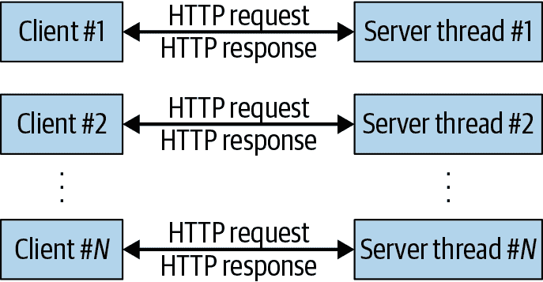
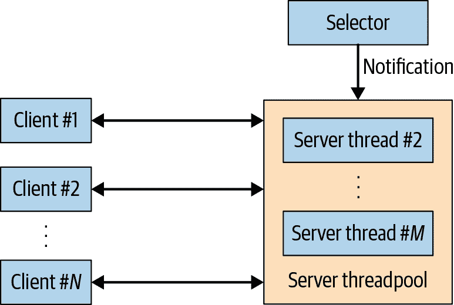
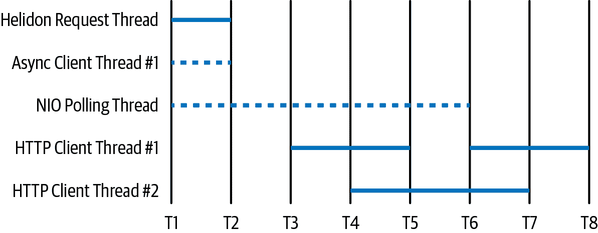
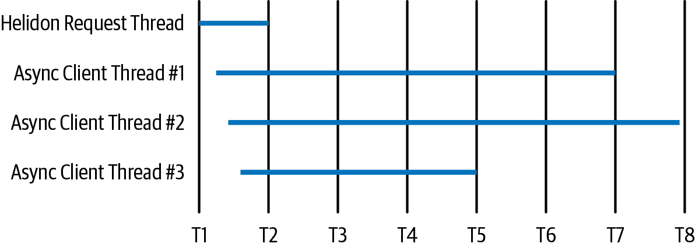

# 第十章：Java 服务器

本章探讨了围绕 Java 服务器技术的主题。在它们的核心，这些技术都是关于如何在客户端和服务器之间传输数据，通常是通过 HTTP。因此，本章的主要重点是通用服务器技术中的常见主题：如何使用不同的线程模型扩展服务器，异步响应，异步请求以及高效处理 JSON 数据。

扩展服务器主要涉及线程的有效使用，并且该使用要求事件驱动、非阻塞 I/O。传统的 Java/Jakarta EE 服务器，如 Apache Tomcat、IBM WebSphere 应用服务器和 Oracle WebLogic 服务器，已经使用 Java NIO API 长时间实现了这一点。当前的服务器框架如 Netty 和 Eclipse Vert.x 将 Java NIO API 的复杂性隔离开来，以提供易于使用的构建模块，用于构建更小的占用空间的服务器，而像 Spring WebFlux 和 Helidon 这样的服务器则是基于这些框架构建的（两者都使用 Netty 框架），以提供可扩展的 Java 服务器。

这些较新的框架提供基于响应式编程的编程模型。在其核心，*响应式编程* 是基于使用事件驱动范式处理异步数据流。尽管响应式编程是一种看待事件的不同方式，但对于我们的目的来说，无论是响应式编程还是异步编程都提供了相同的性能优势：能够将程序（特别是 I/O）扩展到许多连接或数据源。

# Java NIO 概述

如果您熟悉非阻塞 I/O 的工作原理，可以跳过到下一节。如果不熟悉，这里是它如何工作及其作为本章基础的重要性的简要概述。

在 Java 的早期版本中，所有 I/O 都是阻塞的。试图从套接字读取数据的线程会等待（阻塞），直到至少有一些数据可用或读取超时。更重要的是，没有办法知道套接字上是否有数据可用，而不试图从套接字读取数据。因此，希望处理客户端连接上的数据的线程必须发出读取数据的请求，阻塞直到数据可用，处理请求并发送回响应，然后返回到套接字上的阻塞读取。这导致了 图 10-1 中描述的情况。



###### 第 10-1 图。线程在从客户端进行 I/O 读取时阻塞。

阻塞 I/O 要求服务器在客户端连接和服务器线程之间有一对一的对应关系；每个线程只能处理单个连接。这对于希望使用 HTTP keepalive 避免每个请求创建新套接字的客户端尤为重要。假设有 100 个客户端发送请求，请求之间平均有 30 秒的思考时间，并且服务器处理一个请求需要 500 毫秒。在这种情况下，任何时候进行中的请求平均少于两个，但服务器需要 100 个线程来处理所有客户端。这是非常低效的。

因此，当 Java 引入了非阻塞的 NIO API 时，服务器框架迁移到了该模型来处理其客户端。这导致了图 10-2 所示的情况。



###### 图 10-2\. 具有读取事件通知的线程

现在，与每个客户端相关联的套接字在服务器中被注册到选择器中（这里的选择器是`Selector`类的一个实例，并处理与操作系统的接口，当套接字上有数据可读时会收到通知）。当客户端发送请求时，选择器从操作系统获取事件，然后通知服务器线程池中的一个线程，说明特定客户端的 I/O 可以被读取。该线程将从客户端读取数据，处理请求，发送响应，然后回到等待下一个请求的状态。¹ 虽然图中仍然有*N*个客户端，但它们使用*M*个线程进行处理。

现在客户端不再与特定的服务器线程绑定，服务器线程池可以调整以处理我们期望服务器处理的并发请求数量。在前面的示例中，具有大小为两个的线程池就足以处理所有 100 个客户端的负载。如果请求可能以非均匀的方式到达，但仍在 30 秒的一般参数内思考，我们可能需要五到六个线程来处理同时请求的数量。非阻塞 I/O 的使用使得我们可以使用比客户端数量少得多的线程，这是巨大的效率收益。

# 服务器容器

在服务器性能中，跨多个客户端扩展服务器连接是第一个障碍，这取决于服务器使用非阻塞 I/O 来处理基本连接。服务器是否在其他操作中使用非阻塞 API 也很重要，这将在本章后面讨论，但现在我们将专注于调优基本连接处理。

## 调优服务器线程池

因此，在当前的服务器中，来自客户端的请求由服务器线程池中的任意线程处理。因此，调优该线程池变得非常重要。

如前一节所述，服务器框架在管理连接和相关线程池的方式上各不相同。在那里描述的基本模型是有一个或多个充当选择器的线程：这些线程在 I/O 可用时通知系统调用，并称为*选择器线程*。然后，一个单独的*工作线程池*处理选择器通知他们客户端的 I/O 挂起后的实际请求/响应。

选择器和工作线程可以以各种方式设置：

+   选择器和工作线程池可以是分开的。选择器等待所有套接字的通知并将请求交给工作线程池。

+   或者，当选择器通知有关 I/O 时，它会读取（也许只是部分）I/O 以确定有关请求的信息。然后，根据请求类型，选择器将请求转发到不同的服务器线程池。

+   选择器池在`ServerSocket`上接受新连接，但在连接建立后，所有工作都在工作线程池中处理。工作线程池中的线程有时会使用`Selector`类等待现有连接的挂起 I/O，并且有时会处理来自工作线程的客户端 I/O 挂起的通知（例如，执行客户端的请求/响应）。

+   根本不需要区分充当选择器的线程和处理请求的线程。通知套接字上的 I/O 可用的线程可以处理整个请求。同时，池中的其他线程收到其他套接字上的 I/O 通知，并处理这些其他套接字上的请求。

尽管有这些差异，当调整服务器线程池时，我们应该牢记两个基本点。首先（也是最重要的）是，我们需要足够的工作线程来处理服务器可以处理的同时请求的数量（而不是同时连接）。正如在第九章中讨论的那样，这部分取决于这些请求本身是否执行 CPU 密集型代码或将进行其他阻塞调用。在这种情况下的另一个考虑是，如果服务器进行了额外的非阻塞调用，会发生什么。

考虑一个仅执行 CPU 密集型计算的 REST 服务器。然后，与所有 CPU 绑定的情况一样，不需要比服务器或容器上的虚拟 CPU 更多的线程：我们永远无法运行超过那个数量的线程。

如果 REST 服务器反过来对另一个资源进行出站调用——比如另一个 REST 服务器或数据库，那会怎么样？现在取决于这些调用是阻塞还是非阻塞。暂时假设这些调用是阻塞的。现在，我们将需要为每个同时的出站阻塞调用使用一个线程。这可能会将我们的服务器重新转变为低效的一个线程对应一个客户端模型。

假设为了满足特定客户请求，工作线程必须花费 900 ms 从数据库检索数据，并花费 100 ms 设置该数据库调用并将数据处理成客户端响应。在一个有两个非超线程 CPU 的系统上，该服务器有足够的 CPU 处理每秒 20 个请求。如果每 30 秒有一个请求来自每个客户端，服务器可以处理 600 个客户端。由于客户端连接处理是非阻塞的，我们不需要在工作线程池中使用 600 个线程，但也不能仅用 2 个线程（每个 CPU 一个）。平均而言，会有 20 个请求被阻塞，因此我们至少需要这么多线程在工作线程池中。

现在假设出站请求也是非阻塞的，因此在数据库花费 900 ms 返回答案期间，进行数据库调用的线程可以处理其他请求。现在我们只需要两个工作线程：它们可以花费所有时间处理数据库数据所需的 100 ms 部分，使 CPU 充分忙碌，服务器的吞吐量达到最大值。

像往常一样，这些讨论有所简化：我们需要时间来读取和设置请求等。但基本规则仍然适用：您需要与将同时执行代码并同时阻塞在其他资源上的线程数量相同的工作线程池。

这里的另一个调整考虑因素是任何给定时间需要充当选择器的线程数量。您需要多于一个。选择器线程执行 `select()` 调用以查找哪些套接字有 I/O 可用。然后它必须花时间处理这些数据：至少通知其他工作线程有哪些客户端请求需要处理。然后它可以返回并再次调用 `select()` 方法。但在处理 `select()` 调用结果的同时，另一个线程应该执行 `select()` 调用以查看其他套接字何时有可用数据。

因此，在具有独立的选择器线程池的框架中，您需要确保该池至少有几个线程（通常，默认值为三个）。在同一线程池处理选择和处理的框架中，根据我们刚刚讨论的工作指南，您需要增加几个额外的线程。

## 异步 REST 服务器

调整服务器请求线程池的另一种方法是将工作推迟到另一个线程池。这是 JAX-RS 的异步服务器实现以及 Netty 的事件执行器任务（专为长时间运行的任务设计）和其他框架采取的方法。

让我们从 JAX-RS 的角度来看待这个问题。在一个简单的 REST 服务器中，请求和响应都在同一个线程上处理。这限制了服务器的并发性能。例如，在一个八核 CPU 的 Helidon 服务器上，默认线程池为 32。考虑以下端点：

```java
    @GET
    @Path("/sleep")
    @Produces(MediaType.APPLICATION_JSON)
    public String sleepEndpoint(
        @DefaultValue("100") @QueryParam("delay") long delay
        ) throws ParseException {
        try { Thread.sleep(delay); } catch (InterruptedException ie) {}
        return "{\"sleepTime\": \"" + delay + "\"}";
    }
```

在这个例子中，睡眠的目的仅用于测试：假设该睡眠正在进行远程数据库调用或调用另一个 REST 服务器，而那个远程调用需要 100 毫秒。如果我在一个带有默认配置的 Helidon 服务器上运行该测试，它将处理 32 个同时请求。具有并发性为 32 的负载生成器将报告每个请求需要 100 毫秒（加上 1–2 毫秒的处理时间）。具有并发性为 64 的负载生成器将报告每个请求需要 200 毫秒，因为每个请求都必须等待另一个请求完成后才能开始处理。

其他服务器将有不同的配置，但效果是一样的：基于请求线程池的大小将有一些限制。通常这是一件好事：如果在这个例子中，那 100 毫秒是作为活跃的 CPU 时间（而不是睡眠），那么除非它运行在一个非常大的机器上，否则服务器实际上不会能够同时处理 32 个请求。

不过，在这种情况下，机器甚至没有接近 CPU 负载；当没有处理需要进行时，它可能只需要单个核心的 20%–30%来处理负载（如果那些 100 毫秒的时间间隔只是对另一个服务的远程调用的话，处理负载时也是同样的情况）。因此，我们可以通过更改默认线程池的配置来增加该机器上的并发性能，以处理更多的调用。这里的限制将基于远程系统的并发性；我们仍然希望限制调用这些系统，以免超负荷。

JAX-RS 提供了第二种增加并发性的方式，那就是利用异步响应。异步响应允许我们将业务逻辑处理延迟到不同的线程池中进行：

```java
    ThreadPoolExecutor tpe = Executors.newFixedThreadPool(64);
    @GET
    @Path("/asyncsleep")
    @Produces(MediaType.APPLICATION_JSON)
    public void sleepAsyncEndpoint(
        @DefaultValue("100") @QueryParam("delay") long delay,
        @Suspended final AsyncResponse ar
        ) throws ParseException {
        tpe.execute(() -> {
            try { Thread.sleep(delay); } catch (InterruptedException ie) {}
            ar.resume("{\"sleepTime\": \"" + delay + "\"}");
        });
    }
```

在这个例子中，初始请求在服务器的默认线程池上进行。该请求设置了一个调用，用于在一个单独的线程池（称为*异步线程池*）中执行业务逻辑，然后`sleepAsyncEndpoint()`方法立即返回。这释放了默认线程池中的线程，使其能够立即处理另一个请求。与此同时，异步响应（标有`@Suspended`标签）正在等待逻辑完成；完成后，它将恢复并将响应发送回用户。

这使得我们可以在请求开始积压之前运行 64（或我们传递给线程池的任何参数）个并行请求。但坦率地说，我们并没有从将默认线程池调整为 64 实现任何不同。事实上，在这种情况下，我们的响应会稍差一些，因为请求被发送到不同的线程进行处理，这将花费几毫秒。

使用异步响应的三个原因：

+   为了将更多并行性引入业务逻辑。假设我们的代码不是睡眠 100 毫秒，而是需要进行三次（无关的）JDBC 调用来获取响应所需的数据。使用异步响应使得代码能够在异步线程池中的每个线程中并行处理每个调用。

+   限制活动线程的数量。

+   为了正确限制服务器的流量。

在大多数 REST 服务器中，如果仅仅限制请求线程池，新请求将等待它们的轮次，并且线程池的队列将增长。通常，这个队列是无界的（或者至少具有非常大的限制），因此请求的总数最终将变得难以管理。在线程池队列中等待很长时间的请求通常会被放弃，即使它们没有被放弃，长时间的响应时间也会降低系统的总吞吐量。

更好的方法是在排队响应之前查看异步线程池的状态，并在系统过载时拒绝请求。

```java
    @GET
    @Path("/asyncreject")
    @Produces(MediaType.APPLICATION_JSON)
    public void sleepAsyncRejectEndpoint(
        @DefaultValue("100") @QueryParam("delay") long delay,
        @Suspended final AsyncResponse ar
        ) throws ParseException {
        if (tpe.getActiveCount() == 64) {
            ar.cancel();
            return;
        }
        tpe.execute(() -> {
            // Simulate processing delay using sleep
            try { Thread.sleep(delay); } catch (InterruptedException ie) {}
            ar.resume("{\"sleepTime\": \"" + delay + "\"}");
        });
    }
```

这可以通过多种方式实现，但在这个简单的例子中，我们将关注池中运行的活动计数。如果计数等于池大小，则立即取消响应。（更复杂的例子会为池设置有界队列，并在线程池的拒绝执行处理程序中取消请求。）这里的效果是调用者将立即收到 HTTP 503 服务不可用状态，表明此时无法处理请求。这是在 REST 世界中处理过载服务器的首选方式，立即返回此状态将减少负载，从而最终实现更好的整体性能。

# 快速摘要

+   使用 Java 的 NIO API 进行非阻塞 I/O 允许服务器通过减少处理多个客户端所需的线程数量来扩展。

+   此技术意味着服务器将需要一个或多个线程池来处理客户端请求。这个池应该根据服务器应该处理的最大同时请求数进行调整。

+   然后需要一些额外的线程来处理选择器（无论是作为工作线程池的一部分还是作为依赖于服务器框架的单独线程池的一部分）。

+   服务器框架通常有一种机制，可以将长时间的请求推迟到不同的线程池中，从而更加稳健地处理主线程池上的请求。

# 异步出站调用

前面的章节给出了一个具有两个 CPU 的服务器的示例，它需要一个包含 20 个线程的池来获得其最大吞吐量。这是因为这些线程在向其他资源发出出站调用时，90% 的时间都被阻塞在 I/O 上。

非阻塞 I/O 在这种情况下也很有帮助：如果这些出站的 HTTP 或 JDBC 调用是非阻塞的，我们就不需要专门为每个调用分配一个线程，可以相应减少线程池的大小。

## 异步 HTTP

HTTP 客户端是处理向服务器发出的 HTTP 请求的类（毫不奇怪）。有许多客户端，它们都具有不同的功能和性能特性。在本节中，我们将研究它们在常见用例中的性能特征。

Java 8 提供了一个基本的 HTTP 客户端，即 `java.net.HttpURLConnection` 类（对于安全连接，还有子类 `java.net.HttpsURLConnection`）。Java 11 添加了一个新的客户端：`java.net.http.HttpClient` 类（同时处理 HTTPS）。其他包中的 HTTP 客户端类包括 Apache 基金会的 `org.apache.http.cli⁠ent​.HttpClient`，建立在 Netty 项目之上的 `org​.asynchttpclient.AsyncHttpClient`，以及 Eclipse 基金会的 `org.eclipse.jetty.client.HttpClient`。

虽然可以使用 `HttpURLConnection` 类执行基本操作，但大多数 REST 调用都使用诸如 JAX-RS 等框架进行。因此，大多数 HTTP 客户端直接实现这些 API（或稍有变化），但 JAX-RS 的默认实现也提供了最受欢迎的 HTTP 客户端的连接器。因此，可以使用 JAX-RS 与提供最佳性能的底层 HTTP 客户端。JAX-RS 和底层 HTTP 客户端包含两个基本的性能考虑因素。

首先，JAX-RS 连接器提供了一个名为 `Client` 的对象，用于进行 REST 调用；当直接使用客户端时，它们类似地提供了一个名为 `HttpClient` 的客户端对象（`HttpURLConnection` 类是个例外；它不能被重用）。典型的客户端将如下创建和使用：

```java
private static Client client;
static {
    ClientConfig cc = new ClientConfig();
    cc.connectorProvider(new JettyConnectorProvider());
    client = ClientBuilder.newClient(cc);
}

public Message getMessage() {
    Message m = client.target(URI.create(url)
                  .request(MediaType.APPLICATION_JSON)
                  .get(Message.class);
    return m;
}
```

在这个示例中的关键是 `client` 对象是一个静态的、共享的对象。所有的 client 对象都是线程安全的，且创建开销很大，因此你希望应用程序中只有很少的数量（比如一个）。

第二个性能考虑因素是确保 HTTP 客户端正确地池化连接并使用 keepalive 来保持连接开放。对于 HTTP 通信来说，打开一个 socket 是昂贵的操作，特别是如果协议是 HTTPS 并且客户端和服务器必须执行 SSL 握手。像 JDBC 连接一样，HTTP(S) 连接也应该被重复使用。

所有 HTTP 客户端都提供了池化机制，尽管在`HttpURLConnection`类中的池化机制经常被误解。默认情况下，该类将池化五个连接（每个服务器）。然而，与传统的连接池不同，该类中的池不会限制连接：如果请求第六个连接，将会创建一个新连接，而你使用完毕后会被销毁。这种短暂连接在传统连接池中是看不到的。所以在`HttpURLConnection`类的默认配置中，很容易看到大量的短暂连接，并且会误以为连接没有被池化（Javadoc 在这方面也不够明确；它从未提及池化功能，尽管行为在其他地方有文档记录）。

你可以通过设置系统属性`-Dhttp.maxConnections=*N*`来更改池的大小，默认为 5。尽管名称如此，此属性也适用于 HTTPS 连接。但没有方法使该类限制连接。

在 JDK 11 的新`HttpClient`类中，池遵循类似的思路，但有两个重要的区别。首先，默认池大小是无界的，尽管可以通过设置`-Djdk.httpclient.connectionPoolSize=*N*`系统属性来设置。该属性仍然不会作为限制；如果请求超过配置的连接数，它们将在需要时被创建，然后在完成时被销毁。其次，该池是每个`HttpClient`对象的，因此如果不重用该对象，则不会进行连接池化。

在 JAX-RS 中，经常建议使用与默认不同的连接器以获取连接池。因为默认连接器使用`HttpURLConnection`类，这是不正确的：除非你想限制连接，你可以调整该类的连接大小，正如我们刚刚讨论的那样。其他流行的连接器也将池化连接。

表 10-1。调整流行客户端的 HTTP 连接池

| 连接器 | HTTP 客户端类 | 池化机制 |
| --- | --- | --- |
| 默认 | `java.net.HttpURLConnection` | 设置`maxConnections`系统属性 |
| Apache | `org.apache.http.​cli⁠ent.HttpClient` | 创建一个`PoolingHttpClientConnectionManager` |
| Grizzly | `com.ning.http.client.​Asyn⁠cHttpClient` | 默认池化；可以修改配置 |
| Jetty | `org.eclipse.jetty.​cli⁠ent.HttpClient` | 默认池化；可以修改配置 |

在 JAX-RS 中，Grizzly 连接管理器使用`com.ning.http.client​.Asyn⁠cHttpClient`客户端。该客户端已经更名为`org​.asyn⁠chttpclient.AsyncHttpClient`，它是基于 Netty 构建的异步客户端。

### 异步 HTTP 客户端

异步（async）HTTP 客户端，如异步 HTTP 服务器，允许更好地管理应用程序中的线程。发出异步调用的线程将请求发送到远程服务器，并在请求可用时安排不同（后台）线程来处理请求。

这个声明（“安排已经做好”）在这里故意模糊，因为在不同的 HTTP 客户端之间实现这一机制的方式是非常不同的。但从性能的角度来看，使用异步客户端增加了性能，因为它将响应处理推迟到另一个线程，允许更多的事情并行运行。

异步 HTTP 客户端是 JAX-RS 2.0 的一个特性，尽管大多数独立的 HTTP 客户端也直接支持异步特性。事实上，您可能已经注意到我们查看的一些客户端的名称中包含 *async*：它们默认是异步的。虽然它们也有同步模式，但这发生在同步方法的实现中：这些方法发出异步调用，等待响应完成，然后将响应（同步地）返回给调用者。

这种异步模式由 JAX-RS 2.0 实现支持，包括参考 Jersey 实现中的实现。该实现包括几个可以异步使用的连接器，尽管并非所有这些连接器都是真正的异步。在所有情况下，响应处理都推迟到另一个线程，但它可以以两种基本方式运行。在一种情况下，另一个线程可以简单地使用标准的阻塞 Java I/O。在这种情况下，后台线程池需要为每个要同时处理的请求提供一个线程。这与异步服务器相同：通过添加大量其他线程，我们实现了并发性。

在第二种情况下，HTTP 客户端使用非阻塞 I/O。对于这种类型的处理，后台线程需要一些（至少一个，但通常更多）线程来处理 NIO 键选择，然后一些线程来处理随时到来的响应。在许多情况下，这些 HTTP 客户端总体上使用较少的线程。NIO 是经典的事件驱动编程：当套接字连接上的数据可供读取时，会通知一个线程（通常来自池）。该线程读取数据，处理数据（或将数据传递给另一个线程以进行处理），然后返回到池中。

异步编程通常被认为是事件驱动的，因此严格来说，使用阻塞 I/O（并将线程固定在整个请求期间）的异步 HTTP 客户端并不是异步的。即使 API 给出了异步行为的假象，线程的可扩展性也不会如我们所期望的那样。

从性能的角度来看，异步客户端给我们带来了与异步服务器类似的好处：我们可以增加请求的并发性，使其执行更快，并且可以通过利用不同的线程池更好地管理（和限制）请求。

让我们以异步示例的常见情况为例：一个作为来自另外三个 REST 服务的信息聚合器的 REST 服务。这样一个服务的伪代码概述如下：

```java
public class TestResource {
    public static class MultiCallback extends InvocationCallback<Message> {
        private AsyncResponse ar;
        private AtomicDouble total = new AtomicDouble(0);
        private AtomicInteger pendingResponses;
        public MultiCallback(AsyncResponse ar, int targetCount) {
            this.ar = ar;
            pendingResponse = new AtomicInteger(targetCount);
        }
        public void completed(Message m) {
            double d = total.getAndIncrement(Message.getValue());
            if (targetCount.decrementAndGet() == 0) {
                ar.resume("{\"total\": \"" + d + "\"}");
            }
        }
    }

    @GET
    @Path("/aggregate")
    @Produces(MediaType.APPLICATION_JSON)
    public void aggregate(@Suspended final AsyncResponse ar)
                    throws ParseException {
        MultiCallback callback = new MultiCallback(ar, 3);
        target1.request().async().get(callback);
        target2.request().async().get(callback);
        target3.request().async().get(callback);
    }
}
```

注意，在这个示例中，我们也使用了异步响应，但是不需要像之前那样使用单独的线程池：请求将在处理响应的一个线程中恢复。

这为该操作引入了所需的并发性，但让我们更仔细地看一下线程使用情况。图 10-3 展示了执行此示例时 Helidon 服务器的显着线程使用情况。



###### 图 10-3\. 异步 HTTP 客户端的简单线程使用

在时间 T1，请求进入并开始在 Helidon 请求线程上执行。线程设置了三个远程调用；每个调用实际上都是由异步客户端池中的一个线程发送的。（在图表中，三个调用由同一个线程发送，但这取决于时间：它们可能在三个不同的线程上执行，这取决于请求的快速执行和发送数据的时间。）与这些调用相关联的三个套接字也在由 NIO 轮询线程处理的事件队列上注册。请求线程在时间 T2 结束处理。

在时间 T3，NIO 轮询线程收到一个套接字有数据的事件，因此设置 HTTP 客户端线程 #1 读取和处理该数据。该处理将持续到时间 T5。同时，在时间 T4，NIO 轮询线程收到另一个套接字有数据可读的事件，然后由 HTTP 客户端线程 #2 读取和处理（这需要到时间 T7）。然后在时间 T5，第三个套接字准备好被处理。由于 HTTP 客户端线程 #1 空闲，它可以读取和处理该请求，该请求在时间 T8 完成（在那时，`resume()` 方法被调用，响应对象被传递给客户端）。

这里的关键是客户端线程的处理时间。如果处理非常快，且响应之间有很好的间隔，一个线程就可以处理所有响应。如果处理时间很长或者响应被打包，我们将需要一个线程处理一个请求。在这个示例中，我们处于一个中间地带：我们使用的线程比一个线程处理一个请求的模型少，但比一个线程多。这是 REST 服务器与像 nginx 服务器一样的静态内容之间的一个关键区别：最终，即使在完全异步的实现中，业务逻辑的 CPU 需求也将需要相当数量的线程以获得良好的并发性。

此示例假定 HTTP 客户端正在使用 NIO。如果客户端使用传统的 NIO，那么图示将略有不同。当进行第一个异步客户端线程调用时，该调用将持续到时间 T7。对异步客户端的第二个调用将需要一个新线程；该请求将持续到时间 T8。第三个异步客户端线程将运行到时间 T5（客户端不会按照它们启动的顺序完成）。Figure 10-4 显示了区别。

无论哪种情况，对于最终用户来说，结果都是相同的：三个请求并行处理，性能得到了预期的提升。但是，线程使用情况（因此整体系统效率）将有很大的不同。



###### 图 10-4\. 阻塞式 HTTP 客户端的简单线程使用情况

### 异步 HTTP 客户端和线程使用情况

这些后台线程池将充当节流阀，并且通常必须像往常一样进行调整，使其足够大以处理应用程序所需的并发性，但不能太大以至于压倒对后端资源的请求。通常，默认设置就足够了，但如果您需要进一步研究 JAX-RS 的参考实现中的不同连接器及其后台池，请参阅每个连接器的其他信息。

默认连接器

默认连接器使用阻塞式 I/O。Jersey（JAX-RS 的参考实现）中的单个异步客户端线程池将处理所有请求；此线程池中的线程以`jersey-client-async-executor`开头命名。该池将需要一个线程来处理每个同时进行的请求，正如 Figure 10-4 所示。默认情况下，该池大小是无限的；您可以在配置客户端时通过设置此属性来设置上限：

```java
    ClientConfig cc = new ClientConfig();
    cc.property(ClientProperties.ASYNC_THREADPOOL_SIZE, 128);
    client = ClientBuilder.newClient(cc);
```

Apache 连接器

尽管 Apache 库具有真正的异步客户端（使用 NIO 读取响应而不需要专用线程），但 Jersey 中的 Apache 连接器使用传统的阻塞式 I/O Apache 客户端。关于线程池，它的行为和配置方式与默认连接器完全相同。

Grizzly 连接器

Grizzly 连接器使用的 HTTP 客户端是异步的，遵循 Figure 10-3 中的模型。涉及多个池：一个池（`grizzly-ahc-kernel`）用于写请求，一个池（`nioEventLoopGroup`）用于等待 NIO 事件，以及一个池（`pool-N`）用于读取和处理响应。后一个池对于吞吐量/节流而言非常重要，并且其大小是无限的；可以使用`ASYNC_THREADPOOL_SIZE`属性进行节流。

Jetty 连接器

Jetty 使用异步客户端。请求由同一个线程池发送和读取（并且事件轮询也在该池中发生）。在 Jersey 中，该池也使用`ASYNC_THREADPOOL_SIZE`属性进行配置，尽管使用 Jetty 的服务器有两个后端线程池：处理杂项簿记的`jersey-client-async-executor`线程池，以及处理 Jetty 客户端的线程池（这些线程以`HttpClient`开头命名）。如果未设置该属性，则`HttpClient`池的大小为 200。

# 快速总结

+   确保 HTTP 客户端的连接池设置正确。

+   异步 HTTP 客户端可以通过将工作分配给多个线程来提高性能，增加并发性。

+   使用 NIO 构建的异步 HTTP 客户端将比使用传统 I/O 构建的客户端需要更少的线程，但是一个 REST 服务器仍然需要大量线程来处理异步请求。

### 异步数据库调用

如果涉及的出站调用是对关系型数据库的调用，使其真正异步是很困难的。标准的 JDBC API 不适合使用非阻塞 I/O，因此一个通用的解决方案将需要一个新的 API 或者新的技术。围绕这样一个 API 的各种提案已经被提出并被拒绝，目前的希望是一种名为*fibers*的新轻量级任务模型将使现有的同步 API 能够在不需要异步编程的情况下良好扩展。*Fibers*是 OpenJDK [Loom 项目](https://oreil.ly/npuXr)的一部分，但截至本文写作时尚未设定目标发布日期。

异步 JDBC 包装器的提案（和实现）通常将 JDBC 工作推迟到一个单独的线程池中。这与前一节中的默认 Jersey 异步 HTTP 客户端类似：从程序的角度来看，API 看起来是异步的。但是在实现中，后台线程在 I/O 通道上被阻塞，因此我们不会通过这种方式获得可伸缩性。

JDK 之外的各种项目可以填补这一空白。最广泛使用的是 Spring 项目的 Spring Data [R2DBC](https://oreil.ly/tN6oR)。这需要使用不同的 API，并且仅适用于某些数据库的驱动程序。但是，对于关系型数据库的非阻塞访问来说，这是目前最佳的选择。

对于 NoSQL 数据库，情况有些类似。另一方面，Java 没有用于首次访问 NoSQL 数据库的标准，因此您的编程依赖于数据库专有的 API。因此，用于反应式 NoSQL 数据库的 Spring 项目可以用于真正的异步访问。

# JSON 处理

现在我们已经看过 Java 服务器中数据发送的机制，让我们深入了解数据本身。在本节中，我们将主要关注 JSON 处理。旧版 Java 程序通常使用 XML（JSON 和 XML 之间的处理权衡几乎相同）；还有像 Apache Avro 和 Google 的协议缓冲区这样的新格式。

## 解析和编组概述

给定一系列 JSON 字符串，程序必须将这些字符串转换为适合 Java 处理的数据。这称为*编组*或*解析*，取决于上下文和生成的输出。如果输出是 Java 对象，则该过程称为*编组*；如果数据在读取时被处理，则该过程称为*解析*。从其他数据生成 JSON 字符串的反向过程称为*解编组*。

我们可以使用三种一般技术来处理 JSON 数据：

拉取解析器

输入数据与解析器关联，并且程序从解析器请求（或拉取）一系列令牌。

文档模型

输入数据转换为文档样式对象，应用程序随后可以遍历该对象以查找数据片段。这里的接口是以通用文档对象为基础的。

对象表示

输入数据通过使用一组预定义类转换为一个或多个 Java 对象，这些类反映了数据的结构（例如，预定义的`Person`类用于表示个体数据）。这些通常被称为普通的旧 Java 对象（POJOs）。

这些技术按照从最快到最慢的粗略顺序列出，但是它们之间的功能差异比性能差异更重要。简单扫描是解析器所能做的所有工作，因此它们并不理想地适合必须按随机顺序访问或多次检查的数据。为了处理这些情况，只使用简单解析器的程序需要构建一个内部数据结构，这只是一个简单的编程问题。但文档和 Java 对象模型已经提供了结构化数据，通常比自行定义新结构更容易。

实际上，这是使用解析器和使用数据编组器之间的真正区别。列表中的第一项是解析器，应用程序逻辑要根据解析器提供的数据来处理数据。接下来的两项是数据编组器：它们必须使用解析器来处理数据，但它们提供了更复杂程序可以在其逻辑中使用的数据表示。

因此，关于使用哪种技术的主要选择取决于应用程序需要如何编写。如果程序需要对数据进行简单的一次遍历，仅使用最快的解析器即可。如果数据要保存在简单的应用程序定义结构中，直接使用解析器也是适当的；例如，样本数据中项目的价格可以保存到 `ArrayList` 中，这对其他应用程序逻辑来说很容易处理。

当数据格式至关重要时，使用文档模型更为合适。如果必须保留数据的格式，文档格式是简单的：可以将数据读入文档格式，进行某种方式的修改，然后可以将文档格式简单地写入新的数据流。

对于最大的灵活性，对象模型提供了数据的 Java 语言级表示。可以在对象及其属性的熟悉术语中操作数据。尽管编组时的额外复杂性（大部分）对开发人员来说是透明的，可能会使应用程序的某些部分变慢，但在与代码工作中的生产力改进方面可以抵消这个问题。

## JSON 对象

JSON 数据有两种对象表示形式。第一种是通用的：简单的 JSON 对象。这些对象通过通用接口操作：`JsonObject`、`JsonArray` 等。它们提供了一种构建或检查 JSON 文档的方式，而无需创建数据的特定类表示。

第二种 JSON 对象表示形式将 JSON 数据绑定到一个成熟的 Java 类上，使用 JSON 绑定（JSON-B）生成 POJO。例如，我们样本 JSON 数据中的项目数据将由一个 `Item` 类表示，该类具有其字段的属性。

这两种对象表示形式的区别在于，第一种是通用的，不需要类。假设我们有一个代表样本数据中项目的 `JsonObject`，那么项目的标题将如下所示：

```java
JsonObject jo;
String title = jo.getString("title");
```

在 JSON-B 中，项目的标题可以通过更直观的 getter 和 setter 方法获得：

```java
Item i;
String title = i.getTitle();
```

无论哪种情况，对象本身都是使用底层解析器创建的，因此配置解析器以获得最佳性能非常重要。但除了解析数据外，对象实现还允许我们从对象生成 JSON 字符串（即反编组对象）。表 10-2 显示了这些操作的性能。

表 10-2\. JSON 对象模型的性能

| 对象模型 | 编组性能 |
| --- | --- |
| JSON 对象 | 2318 ± 51 微秒 |
| JSON-B 类 | 7071 ± 71 微秒 |
| Jackson 映射器 | 1549 ± 40 微秒 |

生成简单的 JSON 对象比生成自定义 Java 类要快得多，尽管从编程角度来看，后者更容易使用。

本表中的 Jackson 映射器是另一种方法，目前几乎已经超越了其他用途。尽管 Jackson 提供了标准 JSON 解析（JSON-P）API 的实现，但他们还有一种备用实现，该实现将 JSON 数据编组和解编组为 Java 对象，但不遵循 JSON-B。该实现是建立在 Jackson 提供的 `ObjectMapper` 类上的。将数据编组为对象的 JSON-B 代码如下：

```java
Jsonb jsonb = JsonbBuilder.create();
FindItemsByKeywordsResponse f =
    jsonb.fromJson(inputStream, FindItemsByKeywordsResponse.class);
```

`ObjectMapper` 的代码略有不同：

```java
ObjectMapper mapper = new ObjectMapper();
FindItemsByKeywordsResponse f =
    mapper.readValue(inputStream, FindItemsByKeywordsResponse.class);
```

从性能角度来看，`ObjectMapper` 的使用存在一些缺陷。由于 JSON 数据被编组，`mapper` 会创建许多用于生成最终 POJO 的代理类。这本身在首次使用类时会耗费一些时间。为了克服这个问题——也是第二个性能问题——是创建大量的映射器对象（例如，每个执行编组的类静态一个）。这往往会导致内存压力、过多的 GC 循环，甚至 `OutOfMemory` 错误。一个应用程序中只需要一个 `ObjectMapper` 对象，这有助于 CPU 和内存的使用。即便如此，数据的对象模型表示将为这些对象消耗内存。

## JSON 解析

直接解析 JSON 数据有两个优点。首先，如果 JSON 对象模型对您的应用程序来说占用内存过多，直接解析 JSON 并处理它将节省内存。其次，如果您处理的 JSON 包含大量数据（或希望以某种方式过滤的数据），直接解析将更高效。

所有 JSON 解析器都是拉取解析器，通过按需从流中检索数据来操作。本节测试中的基本拉取解析器的主要逻辑是这个循环：

```java
parser = factory.createParser(inputStream);
int idCount = 0;
while (parser.hasNext()) {
    Event event = parser.next();
    switch (event) {
        case KEY_NAME:
            String s = parser.getString();
            if (ID.equals(s)) {
                isID = true;
            }
            break;
        case VALUE_STRING:
            if (isID) {
                if (addId(parser.getString())) {
                    idCount++;
                    return;
                }
                isID = false;
            }
            continue;
        default:
            continue;
    }
}
```

此代码从解析器中提取标记。在代码中，大多数标记只是丢弃的。当找到起始标记时，代码会检查该标记是否为项 ID。如果是，下一个字符标记将是应用程序想要保存的 ID。

该测试还允许我们过滤数据；在这种情况下，我们正在过滤以仅读取 JSON 数据中的前 10 个项。这是在我们处理 ID 时完成的：通过 `addItemId()` 方法保存该 ID，如果已存储所需数量的 ID，则该循环可以直接返回而不处理输入流中的剩余数据。

这些解析器实际上是如何执行的？表格 10-3 展示了解析样本文档所需的平均微秒数，假设在处理完 10 个项后停止解析，并处理整个文档。可预见的是，解析少 90% 的项会使性能提升 90%。

表格 10-3\. 拉取解析器的性能

| 项数 | 默认解析器 | Jackson 解析器 |
| --- | --- | --- |
| 10 | 159 ± 2 us | 86 ± 5 μs |
| 100 | 1662 ± 46 us | 770 ± 4 μs |

长期以来，Jackson 解析器在这里表现出色，但两者都比读取实际对象快得多。

# 快速摘要

+   处理 JSON 有两种选项：创建 POJO 对象和直接解析。

+   选择取决于应用需求，但直接解析提供了过滤和通用性能机会。当对象较大时，创建 JSON 对象往往会导致 GC 问题。

+   Jackson 解析器通常是最快的解析器；应优先选择它而不是默认实现。

# 摘要

非阻塞 I/O 构成了有效服务器扩展的基础，因为它允许服务器使用相对较少的线程处理大量连接。传统服务器利用这一点来处理基本的客户端连接，而新型服务器框架可以将非阻塞特性扩展到其他应用程序。

¹ 这种方案有许多细微的变化；你将在下一节看到其中一些。
