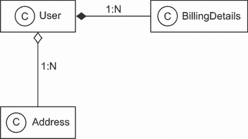
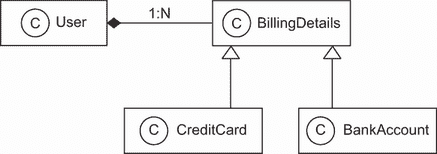
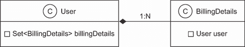
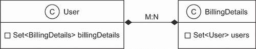

# 1 理解对象/关系持久化

本章涵盖

+   在 Java 应用程序中使用 SQL 数据库进行持久化

+   分析对象/关系范式不匹配

+   介绍 ORM、JPA、Hibernate 和 Spring Data

这本书是关于 JPA、Hibernate 和 Spring Data 的；我们的重点是使用 Hibernate 作为 Jakarta Persistence API（以前称为 Java Persistence API）的提供者，以及 Spring Data 作为基于 Spring 的数据访问编程模型。我们将涵盖基本和高级功能，并描述一些使用 Java Persistence API 开发新应用的方法。这些推荐通常不仅限于 Hibernate 或 Spring Data。有时，它们是我们关于在处理持久数据时*最佳*做法的自己的想法，这些想法在 Hibernate 和 Spring Data 的背景下进行解释。

在许多软件项目中，选择管理持久数据的方法可能是一个关键的设计决策。持久性一直是 Java 社区的热门辩论话题。持久性是一个已经被 SQL 及其扩展（如存储过程）解决的问题，还是一个更普遍的问题，必须通过特殊的 Java 框架来解决？我们应该手动编写即使是最低级的 CRUD（创建、读取、更新、删除）操作，使用 SQL 和 JDBC，还是应该将这些工作交给中间层？如果每个数据库管理系统都有自己的 SQL 方言，我们如何实现可移植性？我们应该完全放弃 SQL 并采用不同的数据库技术，如对象数据库系统或 NoSQL 系统吗？辩论可能永远不会结束，但现在有一个名为*对象/关系映射*（ORM）的解决方案已经得到了广泛的认可。这很大程度上归功于 Hibernate，一个开源的 ORM 服务实现，以及 Spring Data，它是 Spring 家族的一个伞形项目，其目的是统一并简化对不同类型持久化存储的访问，包括关系数据库系统和 NoSQL 数据库。

然而，在我们开始使用 Hibernate 和 Spring Data 之前，你需要了解对象持久化和 ORM 的核心问题。本章解释了为什么你需要像 Hibernate 和 Spring Data 这样的工具以及像*Jakarta Persistence API*（JPA）这样的规范。

首先，我们将定义软件应用程序中的持久数据管理，并讨论 SQL、JDBC 和 Java 之间的关系，Hibernate 和 Spring Data 构建在底层技术和标准之上。然后，我们将讨论所谓的*对象/关系范式不匹配*以及我们在面向对象软件开发中使用 SQL 数据库时遇到的通用问题。这些问题清楚地表明，我们需要工具和模式来最小化我们在应用程序中花费在持久化相关代码上的时间。

学习 Hibernate 和 Spring Data 的最佳方式不一定是一成不变的。我们理解你可能想立即尝试 Hibernate 或 Spring Data。如果你这样想，请跳到下一章，并使用“Hello World”示例设置一个项目。我们建议你在阅读本书的过程中某个时候返回这里；这样，你将准备好，并拥有完成剩余材料所需的所有背景概念。

## 1.1 什么是持久性？

大多数应用都需要持久化数据。持久性是应用开发中的基本概念之一。如果一个信息系统在断电时没有保留数据，那么这个系统将几乎没有实际用途。*对象持久性*意味着单个对象可以比应用过程存在得更久；它们可以被保存到数据存储中，并在稍后的某个时间点重新创建。当我们谈论 Java 中的持久性时，我们通常是指使用 SQL 将对象实例映射和存储到数据库中。

我们将首先简要地看看持久性及其在 Java 中的使用。有了这些信息，我们将继续讨论持久性，并探讨它在面向对象应用中的实现方式。

### 1.1.1 关系型数据库

你，像大多数其他软件工程师一样，可能已经使用过 SQL 和关系型数据库；我们中的许多人每天都在处理这样的系统。关系型数据库管理系统有基于 SQL 的应用程序编程接口，所以我们称今天的关系型数据库产品为 SQL *数据库管理系统*（DBMS）或，当我们谈论特定系统时，称为 SQL *数据库*。

关系型技术是一个众所周知的技术，仅此一点就足以成为许多组织选择它的充分理由。关系型数据库也是数据管理的一个极其灵活和强大的方法。由于关系数据模型经过充分研究的理论基础，关系型数据库可以保证并保护存储数据的完整性，同时具有其他可取的特性。你可能熟悉 E.F. Codd 五十年前提出的关于关系模型的介绍，“大型共享数据银行的关系数据模型”（Codd，1970）。一本值得阅读的更近期的汇编，专注于 SQL，是 C.J. Date 的《SQL 和关系理论》（Date，2015）。

关系型数据库管理系统并不特定于 Java，SQL 数据库也不特定于某个特定应用。这个重要的原则被称为*数据独立性*。换句话说，*数据通常比应用存在的时间更长*。关系型技术提供了一种在不同应用之间或同一整体系统的不同部分之间（例如，数据录入应用和报告应用）共享数据的方法。关系型技术是许多不同系统和技术平台的一个共同基础。因此，关系数据模型通常是企业级业务实体表示的基础。

在我们深入探讨 SQL 数据库的实际应用方面之前，我们需要提到一个重要的问题：尽管被宣传为关系型，但仅提供 SQL 数据语言接口的数据库系统实际上并不是关系型的，而且在很多方面甚至与原始概念相去甚远。这自然导致了混淆。SQL 实践者将 SQL 语言中的不足归咎于关系数据模型，而关系数据管理专家则指责 SQL 标准是关系模型和理想的薄弱实现。本书中我们将突出一些与这个问题相关的重要方面，但总体上我们将关注实际应用。如果你对更多背景资料感兴趣，我们强烈推荐 Ramez Elmasri 和 Shamkant B. Navathe 所著的《数据库系统基础》（Elmasri, 2016），以了解关系数据库系统的理论和概念。

### 1.1.2 理解 SQL

为了有效地使用 JPA、Hibernate 和 Spring Data，你必须从对关系模型和 SQL 的扎实理解开始。你需要理解关系模型和信息模型，以及诸如规范化等主题，以确保数据的完整性，并且你需要使用你的 SQL 知识来调整应用程序的性能——这些都是阅读本书的先决条件。Hibernate 和 Spring Data 简化了众多重复的编码任务，但如果你想充分利用现代 SQL 数据库的全部功能，你的持久化技术知识必须超越这些框架本身。要深入了解，请参阅本书末尾参考文献列表中的资源。

你可能已经使用 SQL 多年了，并且熟悉这种语言中编写的各种基本操作和语句。然而，根据我们自己的经验，SQL 有时很难记住，而且一些术语的使用方式也有所不同。

你应该对这些术语感到熟悉，因此让我们简要回顾一下本书中我们将使用的 SQL 术语。SQL 被用作 *数据定义语言*（DDL），具有用于在 DBMS 目录中 *创建*、*修改* 和 *删除* 如表和约束等实体的语法。当这个 *模式* 准备就绪时，你可以使用 SQL 作为 *数据操纵语言*（DML）来对数据进行操作，包括 *插入*、*更新* 和 *删除*。你可以通过执行带有 *限制*、*投影* 和 *笛卡尔积* 的 *数据查询语言*（DQL）语句来检索数据。为了高效地报告，你可以根据需要使用 SQL 来 *连接*、*聚合* 和 *分组* 数据。你甚至可以将 SQL 语句嵌套在彼此内部——这是一种使用 *子查询* 的技术。当你的业务需求发生变化时，你必须在数据存储后使用 DDL 语句再次修改数据库模式；这被称为 *模式演变*。你还可以使用 SQL 作为 *数据控制语言*（DCL）来 *授予和撤销* 对数据库或其部分的访问权限。

如果你是一位 SQL 老手，并且想了解更多关于优化以及 SQL 是如何执行的信息，可以获取 Dan Tow（Tow，2003）所著的优秀书籍《SQL Tuning》。如果你想从如何不使用 SQL 的角度了解 SQL 的实际应用，Bill Karwin（Karwin，2010）所著的《SQL Antipatterns: Avoiding the Pitfalls of Database Programming》是一本很好的资源。

虽然 SQL 数据库是 ORM 的一部分，但另一部分，当然，是由需要持久化到数据库并从中加载的 Java 应用程序中的数据组成。

### 1.1.3 在 Java 中使用 SQL

当你在 Java 应用程序中与 SQL 数据库一起工作时，你通过 Java 数据库连接（JDBC）API 向数据库发出 SQL 语句。无论 SQL 是手动编写并嵌入到 Java 代码中，还是由 Java 代码即时生成，你都会使用 JDBC API 在准备查询参数、执行查询、滚动查询结果、从结果集中检索值等操作时绑定参数。这些都是低级的数据访问任务；作为应用工程师，我们更感兴趣的是需要这种数据访问的业务问题。我们真正想写的是能够保存和检索我们类实例的代码，从而让我们摆脱这种低级劳动。

由于这些数据访问任务通常非常繁琐，我们必须问：关系型数据模型和（尤其是）SQL 是否是面向对象应用程序持久化的正确选择？我们可以明确地回答这个问题：是的！有许多原因使得 SQL 数据库在计算行业中占据主导地位——关系型数据库管理系统是唯一经过验证的通用数据管理技术，并且它们几乎总是 Java 项目的**要求**。

注意，我们并不是声称关系型技术**总是**是最好的解决方案。许多数据管理需求需要完全不同的方法。例如，互联网规模的分布式系统（如网络搜索引擎、内容分发网络、对等共享、即时通讯）必须处理异常的交易量。许多这些系统不需要在数据更新完成后，所有进程都看到相同的更新数据（强事务一致性）。用户可能对弱一致性感到满意；在所有进程看到更新数据之前，可能会有一段时间的不一致性。相比之下，一些科学应用处理的是巨大但非常专业的数据集。这些系统和它们独特的挑战通常需要同样独特且通常是定制的持久化解决方案。像 ACID 兼容的事务 SQL 数据库、JDBC、Hibernate 和 Spring Data 这样的通用数据管理工具，对于这些类型的系统只扮演着较小的角色。

互联网规模的关系型系统

要理解为什么关系型系统及其相关的数据完整性保证难以扩展，我们建议您首先熟悉*CAP 定理*。根据这一规则，一个分布式系统不能同时保证*一致性*、*可用性*和*对分区故障的容错性*。

一个系统可能保证所有节点将同时看到相同的数据，并且数据读写请求总是得到响应。但是，当系统的一部分由于主机、网络或数据中心问题而失败时，您必须放弃强一致性或 100%的可用性。在实践中，这意味着您需要一个策略来检测分区故障，并在一定程度上恢复一致性或可用性（例如，通过暂时使系统的一部分不可用，以便在后台进行数据同步）。通常，数据、用户或操作将决定是否需要强一致性。

在本书中，我们将从使用*领域模型*的对象导向应用程序的上下文中考虑数据存储和共享的问题。应用程序的业务逻辑不会直接与`java.sql.ResultSet`的行和列交互，而是与特定于应用程序的对象导向领域模型交互。例如，如果在线拍卖系统的 SQL 数据库模式有`ITEM`和`BID`表，Java 应用程序将定义相应的`Item`和`Bid`类。应用程序不会使用`ResultSet` API 读取和写入特定行和列的值，而是加载和存储`Item`和`Bid`类的实例。

因此，在运行时，应用程序使用这些类的实例操作。每个`Bid`实例都有一个对拍卖`Item`的引用，每个`Item`可能有一组对`Bid`实例的引用。业务逻辑不在数据库中执行（作为 SQL 存储过程），而是在 Java 中实现并在应用层执行。这允许业务逻辑使用复杂的面向对象概念，如继承和多态。例如，我们可以使用如*策略*、*中介者*和*组合*等知名设计模式（参见*设计模式：可重用面向对象软件元素* [Gamma, 1994]），所有这些模式都依赖于多态方法调用。

现在有一个警告：并不是所有的 Java 应用程序都是这样设计的，也不应该这样设计。简单的应用程序可能在没有领域模型的情况下更好。如果只需要 JDBC `ResultSet`，请使用它。调用现有的存储过程，并读取它们的 SQL 结果集。许多应用程序需要执行修改大量数据的存储过程，这些数据接近数据源。您还可以使用普通的 SQL 查询实现一些报告功能，并将结果直接显示在屏幕上。SQL 和 JDBC API 在处理表格数据表示方面非常适用，JDBC `RowSet`使 CRUD 操作更加容易。与这种持久数据的表示形式一起工作简单明了，且易于理解。

但对于具有非平凡业务逻辑的应用程序，领域模型方法有助于显著提高代码重用性和可维护性。在实践中，*两种*策略都是常见且必要的。

几十年来，开发者一直在谈论一种*范式不匹配*。这里所指的*范式*是指对象建模和关系建模，或者更实际地说，是面向对象编程和 SQL。这种不匹配解释了为什么每个企业项目都要在持久化相关问题上投入大量精力。有了这种观念，您就可以开始看到必须解决的问题——一些问题被充分理解，而另一些问题则不太被理解——这些问题必须在一个结合了面向对象领域模型和持久化关系模型的程序中解决。让我们更仔细地看看这个所谓的范式不匹配。

## 1.2 范式不匹配

对象/关系范式不匹配可以分为几个部分，我们将逐一检查。让我们从一个简单且无问题的例子开始我们的探索。随着我们的构建，您将看到不匹配开始出现。

假设您必须设计和实现一个在线电子商务应用程序。在这个应用程序中，您需要一个类来表示系统用户的信息，并且您需要一个类来表示用户的账单详细信息，如图 1.1 所示。


图 1.1 `User`和`BillingDetails`实体的简单 UML 图

在这个图中，您可以看到一个`User`有多个`BillingDetails`。这是一个组合，由完整的菱形表示。组合是一种关联类型，其中对象（在我们的例子中是`BillingDetails`）在概念上不能独立于容器（在我们的例子中是`User`）存在。您可以双向导航类之间的关系；这意味着您可以通过迭代集合或调用方法来访问关系的“另一边”。代表这些实体的类可能非常简单：

```
Path: Ch01/e-commerce/src/com/manning/javapersistence/ch01/User.java

public class User {
    private String username;
    private String address;
    private Set<BillingDetails> billingDetails = new HashSet<>();

    // Constructor, accessor methods (getters/setters), business methods
}

Path: Ch01/e-commerce/src/com/manning/javapersistence/ch01
➥ /BillingDetails.java

public class BillingDetails {
    private String account;
    private String bankname;
    private User user;

    // Constructor, accessor methods (getters/setters), business methods
}
```

注意，我们只对实体的持久化状态感兴趣，因此省略了构造函数、访问方法和业务方法的实现。

为此情况（以下查询的语法适用于 MySQL）设计 SQL 模式很简单：

```
CREATE TABLE USERS (
    USERNAME VARCHAR(15) NOT NULL PRIMARY KEY,
    ADDRESS VARCHAR(255) NOT NULL
);

CREATE TABLE BILLINGDETAILS (
    ACCOUNT VARCHAR(15) NOT NULL PRIMARY KEY,
    BANKNAME VARCHAR(255) NOT NULL,
    USERNAME VARCHAR(15) NOT NULL,
    FOREIGN KEY (USERNAME) REFERENCES USERS(USERNAME)
);
```

在 `BILLINGDETAILS` 中的外键约束列 `USERNAME` 代表了两个实体之间的关系。对于这个简单的领域模型，对象/关系不匹配几乎不明显；编写 JDBC 代码来插入、更新和删除用户和账单详细信息的信息是直接的。

现在，让我们看看当我们考虑一些更现实的情况时会发生什么。当我们向应用程序添加更多实体和实体关系时，范式不匹配将变得明显。

### 1.2.1 粒度问题

当前实现中最明显的问题是，我们将地址设计为一个简单的 `String` 值。在大多数系统中，有必要分别存储街道、城市、州、国家和邮政编码信息。当然，你可以直接将这些属性添加到 `User` 类中，但由于系统中的其他类也可能携带地址信息，因此创建一个 `Address` 类来重用它更有意义。图 1.2 显示了更新后的模型。



图 1.2 `User` 有一个 `Address`。

`User` 和 `Address` 之间的关系是一个聚合，由空菱形表示。我们是否也应该添加一个 `ADDRESS` 表？不一定；在 `USERS` 表中，将地址信息保存在单独的列中是很常见的。这种设计可能性能更好，因为如果你想要在单个查询中检索用户和地址，不需要表连接。最好的解决方案可能是创建一个新的 SQL 数据类型来表示地址，并在 `USERS` 表中添加一个该新类型的单列，而不是添加几个新列。

添加几个列或单个新 SQL 数据类型的单列的选择是 *粒度* 问题。广义上讲，粒度指的是你正在使用的类型的相对大小。

让我们回到例子。将新的数据类型添加到数据库目录中，以在单个列中存储 `Address` Java 实例，听起来是最好的方法：

```
CREATE TABLE USERS (
    USERNAME VARCHAR(15) NOT NULL PRIMARY KEY,
    ADDRESS ADDRESS NOT NULL
);
```

Java 中新增的 `Address` 类型（类）和新的 `ADDRESS` SQL 数据类型应该能保证互操作性。但如果你检查当前 SQL 数据库管理系统对用户定义数据类型（UDTs）的支持，你会发现各种问题。

UDT 支持是传统 SQL 的几种所谓 *对象/关系扩展* 之一。这个术语本身就很令人困惑，因为它意味着数据库管理系统（或应该支持）一个复杂的数据类型系统。不幸的是，UDT 支持是大多数 SQL DBMS 的一个相对不为人知的特性，而且它肯定在不同产品之间不可移植。此外，SQL 标准支持用户定义数据类型，但支持得并不好。

这种限制并不是关系数据模型的错误。你可以将未能标准化这样重要功能的功能视为 20 世纪 90 年代中期供应商之间对象/关系数据库战争的结果。如今，大多数工程师都接受 SQL 产品具有有限类型系统——无需质疑。即使你的 SQL 数据库管理系统中有一个复杂的 UDT 系统，你也可能仍然需要重复类型声明，既在 Java 中编写新类型，又在 SQL 中再次编写。试图为 Java 空间找到更好的解决方案，如 SQLJ，不幸的是并没有取得很大成功。数据库管理系统产品很少支持直接在数据库上部署和执行 Java 类，如果支持可用，通常也仅限于日常使用中的非常基本的功能。

由于这些以及其他原因，目前在 SQL 数据库中使用 UDTs 或 Java 类型并不是常见做法，你不太可能遇到大量使用 UDTs 的遗留模式。因此，我们无法也不打算将我们新的`Address`类的实例存储在具有与 Java 层相同数据类型的单个新列中。

解决这个问题的实用方案涉及多个内置的供应商定义的 SQL 类型列（如布尔型、数值型和字符串数据类型）。你通常会按照以下方式定义`USERS`表：

```
CREATE TABLE USERS (
    USERNAME VARCHAR(15) NOT NULL PRIMARY KEY,
    ADDRESS_STREET VARCHAR(255) NOT NULL,
    ADDRESS_ZIPCODE VARCHAR(5) NOT NULL,
    ADDRESS_CITY VARCHAR(255) NOT NULL
);
```

Java 领域模型中的类具有不同粒度级别：从粗粒度的实体类如`User`到更细粒度的类如`Address`，再到简单的扩展`AbstractNumericZipCode`的`SwissZipCode`（或任何你期望的抽象级别）。相比之下，SQL 数据库中只可见两个级别的类型粒度：你创建的关系类型，如`USERS`和`BILLINGDETAILS`，以及内置的数据类型，如`VARCHAR`、`BIGINT`和`TIMESTAMP`。

许多简单的持久化机制未能认识到这种不匹配，因此最终迫使 SQL 产品在面向对象模型上采用更不灵活的表示形式，实际上将其扁平化。实际上，粒度问题并不特别难以解决，尽管它在许多现有系统中都可见。我们将在 5.1.1 节中探讨这个问题的解决方案。

当我们考虑依赖于*继承*的领域模型时，会出现一个更困难且更有趣的问题，继承是面向对象设计中的一个特性，你可以用它以新颖和有趣的方式对你的电子商务应用程序的用户进行计费。

### 1.2.2 继承问题

在 Java 中，您通过使用超类和子类来实现类型继承。为了说明这可能会引起不匹配问题，让我们修改我们的电子商务应用程序，使其现在不仅可以接受银行账户账单，还可以接受信用卡。在模型中反映这种变化的最自然方式是使用`BillingDetails`超类的继承，以及多个具体的子类：`CreditCard`、`BankAccount`。这些子类中的每一个都定义了略微不同的数据（以及完全不同的、作用于这些数据的功能）。图 1.3 中的 UML 类图展示了这个模型。



图 1.3 使用继承实现不同的账单策略

为了支持这个更新的 Java 类结构，我们必须做出哪些改变？我们能否创建一个扩展`BILLINGDETAILS`的`CREDITCARD`表？SQL 数据库产品通常不实现表继承（甚至数据类型继承），如果它们实现了，也不遵循标准语法。

我们还没有结束对继承的讨论。一旦我们将继承引入模型，我们就有了可能实现*多态性*的可能性。`User`类与`BillingDetails`超类有一个*多态关联*。在运行时，一个`User`实例可能引用`BillingDetails`的任何子类实例。同样，我们希望能够编写*多态查询*，这些查询引用`BillingDetails`类，并返回其子类的实例。

SQL 数据库缺乏一种明显的方式（或者至少是一种标准化的方式）来表示多态关联。外键约束指向一个确切的目标表；定义一个指向多个表的外键并不直接。

这种子类型不匹配的结果是，模型中的继承结构必须持久化到一个不提供继承机制的 SQL 数据库中。在第七章中，我们将讨论如何使用 Hibernate 等 ORM 解决方案将类层次结构持久化到 SQL 数据库表或表中，以及如何实现多态行为。幸运的是，这个问题在社区中现在已经得到了很好的理解，并且大多数解决方案都支持大约相同的功能。

对象/关系不匹配问题的下一个方面是*对象身份*的问题。

### 1.2.3 身份问题

你可能已经注意到，示例中将`USERNAME`定义为`USERS`表的主键。这是一个好的选择吗？如何在 Java 中处理相同对象？

虽然身份问题一开始可能不明显，但你在不断增长和扩展的电子商务系统中经常会遇到它，例如当你需要检查两个实例是否相同的时候。有三种方法可以解决这个问题：Java 世界中的两种和 SQL 数据库中的一种。正如预期的那样，它们只有在一些帮助的情况下才能一起工作。

Java 定义了两种不同的*相同性*概念：

+   实例身份（大致相当于内存位置，通过`a` `==` `b`进行检查）

+   实例相等性，由`equals()`方法的实现确定（也称为*值相等性*）

另一方面，数据库行身份的表达是通过比较主键值来完成的。正如您将在第 9.1.2 节中看到的，`equals()`和`==`并不总是等同于主键值的比较。在 Java 中，几个非相同实例同时表示数据库的同一行是很常见的，例如在并发运行的应用程序线程中。此外，在实现持久化类的`equals()`方法时，以及理解何时可能需要这样做时，存在一些微妙的问题。

让我们用一个例子来讨论与数据库身份相关的问题。在`USERS`表的表定义中，`USERNAME`是主键。不幸的是，这个决定使得更改用户名变得困难；您不仅需要更新`USERS`表中的行，还需要更新（许多）`BILLINGDETAILS`表中的外键值。为了解决这个问题，本书后面我们将建议您在无法找到合适的自然键时使用*代理键*。我们还将讨论什么因素使主键成为一个好的选择。代理键列是一个对应用程序用户没有意义的键列——换句话说，一个不会呈现给应用程序用户的键。它的唯一目的是在应用程序内部标识数据。

例如，您可以将表格定义修改为如下所示：

```
CREATE TABLE USERS (
    ID BIGINT NOT NULL PRIMARY KEY,
    USERNAME VARCHAR(15) NOT NULL UNIQUE,
     . . . 
);
CREATE TABLE BILLINGDETAILS (
    ID BIGINT NOT NULL PRIMARY KEY,
    ACCOUNT VARCHAR(15) NOT NULL,
    BANKNAME VARCHAR(255) NOT NULL,
    USER_ID BIGINT NOT NULL,
    FOREIGN KEY (USER_ID) REFERENCES USERS(ID)
);
```

`ID`列包含系统生成的值。这些列纯粹是为了数据模型的好处而引入的，因此它们如何在 Java 领域模型中（如果有的话）表示？我们将在第 5.2 节中讨论这个问题，并使用 ORM 找到解决方案。

在持久性的背景下，身份与系统如何处理缓存和事务密切相关。不同的持久化解决方案选择了不同的策略，这已经成为一个容易混淆的领域。我们将在第 9.1 节中涵盖所有这些有趣的话题，并探讨它们之间的关系。

到目前为止，我们设计的电子商务应用的骨架已经暴露了映射粒度、子类型和身份不匹配的问题。我们需要进一步讨论重要的概念*关联*：实体之间的关系是如何映射和处理的。数据库中的外键约束是否就是您所需要的全部？

### 1.2.4 关联问题

在领域模型中，关联表示实体之间的关系。`User`、`Address`和`BillingDetails`类都是关联的；但与`Address`不同，`BillingDetails`独立存在。`BillingDetails`实例存储在其自己的表中。关联映射和实体关联的管理是任何对象持久化解决方案中的核心概念。

面向对象的语言使用*对象引用*来表示关联，但在关系型世界中，一个*外键约束列*代表与键值副本的关联。约束是一个保证关联完整性的规则。这两种机制之间存在重大差异。

对象引用本质上是方向性的；关联是从一个实例到另一个实例的。它们是指针。如果实例之间的关联应该双向可导航，你必须定义关联*两次*，一次在每个关联的类中。图 1.4 中的 UML 类图使用单对多关联展示了这个模型。



图 1.4 `User`和`BillingDetails`之间的单对多关联

你已经在领域模型类中看到了这一点：

```
Path: Ch01/e-commerce/src/com/manning/javapersistence/ch01/User.java

public class User {
    private Set<BillingDetails> billingDetails = new HashSet<>();
}

Path: Ch01/e-commerce/src/com/manning/javapersistence/ch01
➥ /BillingDetails.java

public class BillingDetails {
    private User user;
}
```

在特定方向上的导航对于关系型数据模型没有意义，因为你可以使用*连接*和*投影*运算符创建数据关联。挑战是将一个完全开放的数据模型映射到应用程序依赖的导航模型——这个特定应用程序所需的关联的约束视图。

Java 关联可以有*多对多*的基数。图 1.5 中的 UML 类图展示了这个模型。



图 1.5 `User`和`BillingDetails`之间的多对多关联

类可能看起来像这样：

```
Path: Ch01/e-commerce/src/com/manning/javapersistence/ch01/User.java

public class User {
    private Set<BillingDetails> billingDetails = new HashSet<>();
}

Path: Ch01/e-commerce/src/com/manning/javapersistence/ch01
➥ /BillingDetails.java

public class BillingDetails {
    private Set<User> users = new HashSet<>();
}
```

然而，在`BILLINGDETAILS`表上的外键声明是一个*多对一*关联：每个银行账户都与特定的用户相关联，但每个用户可能有多个关联的银行账户。

如果你希望在 SQL 数据库中表示一个*多对多*关联，你必须引入一个新的表，通常称为*链接表*。在大多数情况下，这个表不会出现在领域模型中。对于这个例子，如果你认为用户和账单信息之间的关系是多对多，你会定义链接表如下：

```
CREATE TABLE USER_BILLINGDETAILS (
    USER_ID BIGINT,
    BILLINGDETAILS_ID BIGINT,
    PRIMARY KEY (USER_ID, BILLINGDETAILS_ID),
    FOREIGN KEY (USER_ID) REFERENCES USERS(ID),
    FOREIGN KEY (BILLINGDETAILS_ID) REFERENCES BILLINGDETAILS(ID)
);
```

你不再需要在`BILLINGDETAILS`表上使用`USER_ID`外键列和约束；这个额外的表现在管理两个实体之间的链接。我们将在第八章详细讨论关联和集合映射。

到目前为止，我们考虑的问题主要是*结构性的*：你可以通过考虑系统的纯粹静态视图来看到它们。也许面向对象持久性中最困难的问题是*动态的*问题：如何在运行时访问数据。

### 1.2.5 数据导航问题

在 Java 代码中访问数据和在关系数据库中访问数据之间存在根本性的区别。在 Java 中，当你访问一个用户的账单信息时，你调用`someUser.getBillingDetails().iterator().next()`或类似的东西。或者，从 Java 8 开始，你可能调用`someUser.getBillingDetails().stream() .filter(someCondition).map(someMapping).forEach(billingDetails->` `{doSomething (billingDetails)})`。这是访问面向对象数据最自然的方式，通常描述为*遍历对象网络*。你从一个实例导航到另一个实例，甚至迭代集合，遵循类之间的准备好的指针。不幸的是，这不是从 SQL 数据库检索数据的有效方式。

你能做的最重要的事情之一是提高数据访问代码的性能，那就是*最小化对数据库的请求数量*。做到这一点最明显的方法是最小化 SQL 查询的数量。（当然，其他更复杂的方法——例如广泛的缓存——可以作为第二步来实施。）

因此，使用 SQL 高效访问关系数据通常需要在感兴趣的表之间进行连接。在检索数据时包含在连接中的表的数量决定了你可以在内存中导航的对象网络的深度。例如，如果你需要检索一个`User`并且不感兴趣用户的账单信息，你可以编写这个简单的查询：

```
SELECT * FROM USERS WHERE ID = 123
```

另一方面，如果你需要检索一个`User`然后随后访问每个相关的`BillingDetails`实例（比如说，列出用户的银行账户），你需要编写一个不同的查询：

```
SELECT * FROM USERS, BILLINGDETAILS
WHERE USERS.ID = 123 AND
BILLINGDETAILS.ID = USERS.ID
```

如你所见，为了有效地使用连接，你需要在开始导航对象网络之前就知道你打算访问对象网络的哪一部分！不过要小心：如果你检索了太多的数据（可能比你需要的还多），你正在浪费应用层中的内存。你也可能因为巨大的笛卡尔积结果集而压倒 SQL 数据库。想象一下，不仅在一个查询中检索用户和银行账户，还要检索每个银行账户支付的所有订单，每个订单中的产品等等。

任何对象持久化解决方案都允许你在 Java 代码中首次访问关联时才获取关联实例的数据。这被称为*延迟加载*：仅在需要时检索数据。这种分块的数据访问方式在 SQL 数据库的上下文中基本是低效的，因为它需要为访问的对象网络中的每个节点或节点集合执行一个语句。这就是可怕的*n+1 次选择*问题。在我们的例子中，你需要一个*选择*来检索一个`User`，然后为每个相关的*n 个`BillingDetails`实例执行*n 个*选择。

在 Java 代码中访问数据的方式与关系数据库中的方式不匹配，这可能是 Java 信息系统中最常见的性能问题来源。避免笛卡尔积和*n*+1 选择问题仍然是许多 Java 程序员面临的问题。Hibernate 提供了高效且透明地从数据库到访问它们的应用程序中检索对象网络的高级功能。我们将在第十二章中讨论这些功能。

现在我们有一长串对象/关系不匹配问题：粒度问题、继承问题、标识问题、关联问题以及数据导航问题。找到解决方案可能会耗费大量时间与精力，正如你可能从经验中得知的那样。本书的大部分内容将用于提供对这些问题的详细答案，并展示 ORM 作为一种可行的解决方案。让我们从 ORM、Java 持久化标准（JPA）以及 Hibernate 和 Spring Data 项目概述开始。

## 1.3 ORM、JPA、Hibernate 和 Spring Data

简而言之，对象/关系映射（ORM）是将 Java 应用程序中的对象自动（且透明地）持久化到关系数据库管理系统（RDBMS）的表中，使用描述应用程序类与 SQL 数据库模式之间映射的元数据。本质上，ORM 通过（可逆地）将数据从一种表示形式转换为另一种表示形式来工作。使用 ORM 的程序将提供有关如何将对象从内存映射到数据库的元信息，而有效的转换将由 ORM 完成。

有些人可能认为 ORM 的一个优点是它保护开发者免受混乱的 SQL 的困扰。这种观点认为，面向对象的开发者不应该期望深入 SQL 或关系数据库。相反，Java 开发者必须对关系建模和 SQL 有足够的熟悉程度和欣赏能力，才能与 Hibernate 和 Spring Data 一起工作。ORM 是那些已经艰难地完成过这项工作的开发者所使用的一种高级技术。

JPA（Jakarta Persistence API，之前称为 Java Persistence API）是一个定义了管理对象持久化和对象/关系映射的 API 的规范。Hibernate 是这个规范最流行的实现。因此，JPA 将指定持久化对象必须执行的操作，而 Hibernate 将决定如何执行。Spring Data Commons 作为 Spring Data 家族的一部分，提供了支持所有 Spring Data 模块的核心 Spring 框架概念。Spring Data JPA 是 Spring Data 家族中的另一个项目，它是 JPA 实现（如 Hibernate）之上的一个额外层。Spring Data JPA 不仅能够使用 JPA 的所有功能，还增加了自己的功能，例如从方法名称生成数据库查询。本书将深入探讨许多细节，但如果你现在想获得一个整体的观点，可以快速跳转到图 4.1。

为了有效地使用 Hibernate，你必须能够查看和解释它发出的 SQL 语句，并理解其性能影响。为了利用 Spring Data 的好处，你必须能够预测样板代码和生成的查询是如何创建的。

JPA 规范定义了以下内容：

+   一种指定映射元数据的方法——持久化类及其属性如何与数据库模式相关联。JPA 在领域模型类中大量依赖于 Java 注解，但你也可以在 XML 文件中编写映射。

+   用于在持久化类实例上执行基本 CRUD 操作的 API，最著名的是`javax.persistence.EntityManager`用于存储和加载数据。

+   一种用于指定引用类和类属性的查询的语言和 API。这种语言是 Jakarta Persistence Query Language（JPQL），其外观类似于 SQL。标准化的 API 允许通过程序创建*条件查询*，而不需要字符串操作。

+   持久化引擎如何与事务实例交互以执行脏检查、关联抓取和其他优化功能。JPA 规范涵盖了某些基本的缓存策略。

Hibernate 实现了 JPA 并支持所有标准化的映射、查询和编程接口。让我们看看 Hibernate 的一些好处：

+   *生产力*——Hibernate 消除了大量重复性工作（比你预期的要多），让你能够专注于业务问题。无论你更喜欢哪种应用程序开发策略——自顶向下（从领域模型开始）还是自底向上（从现有的数据库模式开始），与适当的工具一起使用 Hibernate 将显著减少开发时间。

+   *可维护性*——使用 Hibernate 的自动 ORM 减少了代码行数，使系统更易于理解且更容易重构。Hibernate 在领域模型和 SQL 模式之间提供了一个缓冲区，隔离每个模型免受对方微小变化的影响。

+   *性能*—尽管手动编码的持久性可能在某种程度上比汇编代码比 Java 代码更快，但像 Hibernate 这样的自动化解决方案允许始终使用许多优化。一个例子是应用层中高效且易于调整的缓存。这意味着开发者可以将更多精力用于手动优化剩余的少数真实瓶颈，而不是过早地优化一切。

+   *供应商独立性*—Hibernate 可以帮助减轻与供应商锁定相关的某些风险。即使您计划永远不会更改您的 DBMS 产品，支持多个不同 DBMS 的 ORM 工具也能提供一定程度的可移植性。此外，DBMS 独立性有助于工程师在开发场景中使用轻量级本地数据库，但在测试和生产时部署到不同的系统上。

Spring Data 使持久层的实现更加高效。Spring Data JPA 是该家族中的一个项目，位于 JPA 层之上。Spring Data JDBC 是该家族中的另一个项目，位于 JDBC 之上。让我们看看 Spring Data 的一些好处：

+   *共享基础设施*—Spring Data Commons 是 Spring Data 项目的一部分，为持久化 Java 类和提供技术中立仓库接口提供了元数据模型。它将其能力提供给其他 Spring Data 项目。

+   *移除 DAO 实现*—JPA 实现使用 *数据访问对象*（DAO）模式。这种模式从抽象接口到数据库的概念开始，将应用程序调用映射到持久化层，同时隐藏数据库的细节。Spring Data JPA 使得完全移除 DAO 实现成为可能，因此代码会更短。

+   *自动类创建*—使用 Spring Data JPA，一个 DAO 接口需要扩展 JPA 特定的 `Repository` 接口—`JpaRepository`。Spring Data JPA 将自动为该接口创建实现—程序员无需关心这一点。

+   *方法的默认实现*—Spring Data JPA 将为它的仓库接口中定义的每个方法生成默认实现。基本的 CRUD 操作不再需要实现。这减少了样板代码，加快了开发速度，并消除了引入错误的可能性。

+   *生成的查询*—您可以在您的仓库接口上根据命名模式定义一个方法。您无需手动编写查询；Spring Data JPA 将解析方法名称并为其创建查询。

+   *需要时接近数据库*—Spring Data JDBC 可以直接与数据库通信并避免 Spring Data JPA 的“魔法”。它允许您通过 JDBC 与数据库交互，但通过使用 Spring 框架功能来移除样板代码。

本章重点介绍了理解对象/关系持久化和对象/关系范式不匹配产生的问题。第二章将探讨 Java 应用程序的一些持久化替代方案：JPA、Hibernate Native 和 Spring Data JPA。

## 摘要

+   在 *对象持久化* 中，单个对象可以超出其应用程序过程，保存到数据存储中，并在以后重新创建。当数据存储是一个基于 SQL 的关系型数据库管理系统时，对象/关系不匹配就会发挥作用。例如，一个对象网络不能保存到数据库表中；它必须被拆分并持久化到可移植的 SQL 数据类型列中。解决这个问题的好方法是对象/关系映射（ORM）。

+   ORM 并非所有持久化任务的万能药；它的任务是减轻开发者大约 95% 的对象持久化工作，例如编写包含多个表连接的复杂 SQL 语句，以及从 JDBC 结果集中复制值到对象或对象图中。

+   一个功能齐全的 ORM 中间件解决方案可能提供数据库可移植性、某些优化技术如缓存以及其他不易在有限时间内使用 SQL 和 JDBC 手动编写的可行功能。在 Java 世界中，ORM 解决方案意味着 JPA 规范和 JPA 实现——Hibernate 目前是最受欢迎的。

+   Spring Data 可能建立在 JPA 实现之上，并且进一步简化了数据持久化过程。它是一个遵循 Spring 框架原则的伞形项目，提供了一种更加简单的方法，包括移除 DAO 模式、自动代码生成和自动查询生成。
