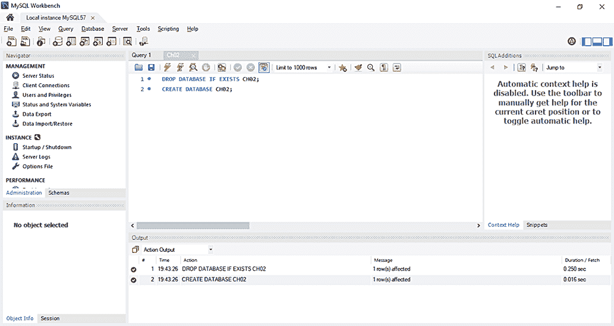
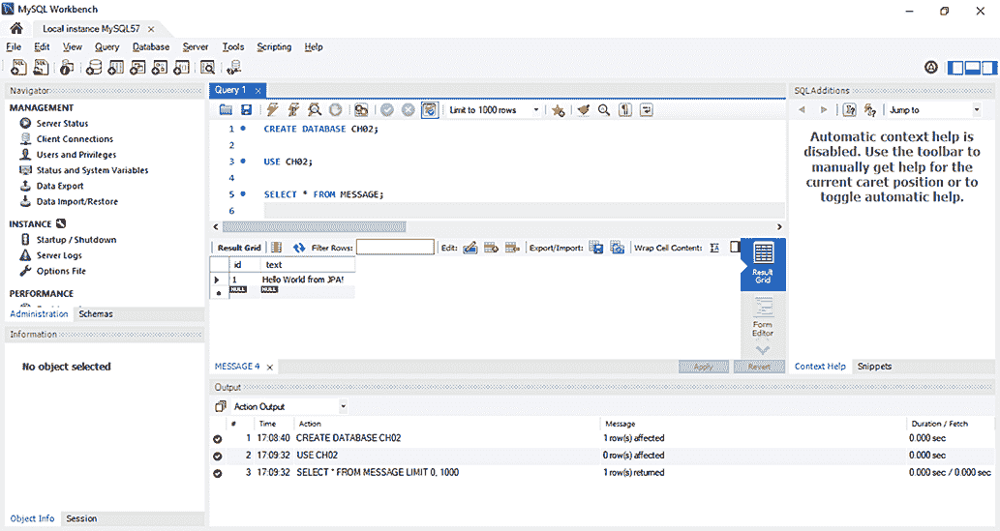
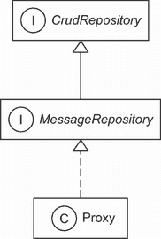
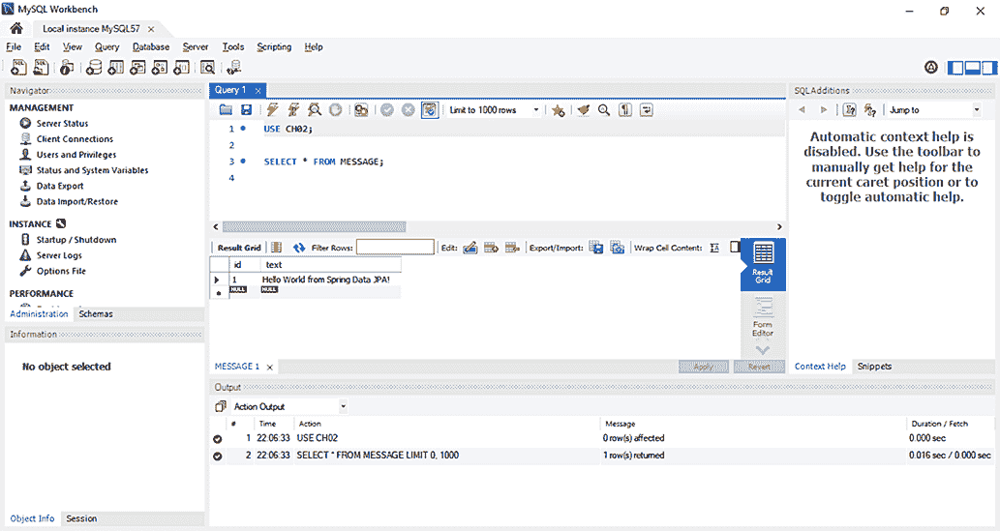
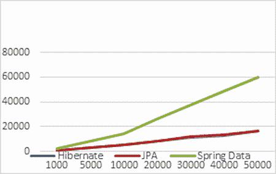
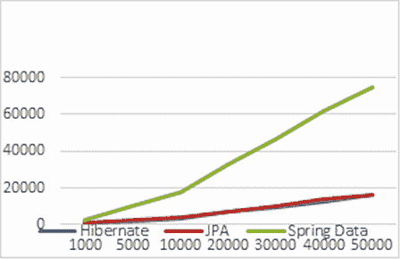
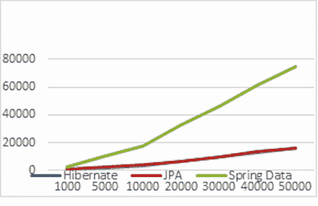

# 2 开始一个项目

本章节涵盖

+   介绍 Hibernate 和 Spring Data 项目

+   使用 Jakarta Persistence API、Hibernate 和 Spring Data 开发“Hello World”

+   检查配置和集成选项

在本章中，我们将从 Jakarta Persistence API（JPA）、Hibernate 和 Spring Data 开始，逐步进行示例。我们将查看持久化 API，并了解使用标准化的 JPA、本地的 Hibernate 或 Spring Data 的好处。

我们将从 JPA、Hibernate 和 Spring Data 的简要浏览开始，查看一个简单的“Hello World”应用程序。JPA（Jakarta Persistence API，以前称为 Java Persistence API）是一个定义管理对象和对象/关系映射的 API 的规范——它指定了持久化对象必须执行的操作。Hibernate 是这个规范最流行的实现，它将使持久化成为可能。Spring Data 使持久化层的实现更加高效；它是一个遵循 Spring 框架原则的伞形项目，并提供了一种更简单的方法。

## 2.1 介绍 Hibernate

对象/关系映射（ORM）是一种编程技术，用于在面向对象系统的不兼容世界和关系数据库之间建立联系。Hibernate 是一个雄心勃勃的项目，旨在为 Java 中持久化数据的问题提供一个完整的解决方案。如今，Hibernate 不仅是一个 ORM 服务，而且是一个数据管理工具集合，其范围远远超出了 ORM。

Hibernate 项目套件包括以下内容：

+   *Hibernate ORM*—Hibernate ORM 由核心、用于与 SQL 数据库持久化的基础服务以及本地专有 API 组成。Hibernate ORM 是套件中其他几个项目的基石，也是 Hibernate 最古老的项目。您可以在没有任何框架或特定运行时环境的情况下独立使用 Hibernate ORM，适用于所有 JDK。只要数据源可访问，您就可以为 Hibernate 配置它，并且它将正常工作。

+   *Hibernate EntityManager*—这是 Hibernate 对标准 Jakarta Persistence API 的实现。它是一个可选模块，可以堆叠在 Hibernate ORM 之上。Hibernate 的本地特性在各个方面都是 JPA 持久化特性的超集。

+   *Hibernate Validator*—Hibernate 提供了 Bean Validation (JSR 303)规范的参考实现。与其他 Hibernate 项目独立，它为领域模型（或任何其他）类提供声明式验证。

+   *Hibernate Envers*—Envers 致力于审计日志记录和保留 SQL 数据库中的多个数据版本。这有助于向应用程序添加数据历史和审计跟踪，类似于您可能已经熟悉的任何版本控制系统，例如 Subversion 或 Git。

+   *Hibernate Search*—Hibernate Search 在 Apache Lucene 数据库中维护领域模型数据的最新索引。它允许您使用强大且自然集成的 API 查询此数据库。许多项目在 Hibernate ORM 之外使用 Hibernate Search，增加了全文搜索功能。如果您在应用程序的用户界面中有一个免费文本搜索表单，并且希望用户满意，请使用 Hibernate Search。Hibernate Search 在本书中未涵盖，但您可以通过 Emmanuel Bernard 的 *Hibernate Search in Action*（Bernard, 2008）获得良好的起点。

+   *Hibernate OGM*—这个 Hibernate 项目是一个对象/网格映射器。它为 NoSQL 解决方案提供 JPA 支持，重用 Hibernate 核心引擎，但将映射的实体持久化到键/值、文档或图导向的数据存储中。

+   *Hibernate Reactive*—Hibernate Reactive 是 Hibernate ORM 的反应式 API，以非阻塞方式与数据库交互。它支持非阻塞数据库驱动程序。Hibernate Reactive 在本书中未涵盖。

Hibernate 源代码可以从 [`github.com/hibernate`](https://github.com/hibernate) 免费下载。

## 2.2 介绍 Spring Data

Spring Data 是 Spring 框架的一系列项目，其目的是简化对关系型数据库和无 SQL 数据库的访问：

+   *Spring Data Commons*—Spring Data Commons 是 Spring Data 项目的一部分，提供了持久化 Java 类的元数据模型和技术中立的数据仓库接口。

+   *Spring Data JPA*—Spring Data JPA 处理基于 JPA 的仓库实现。它通过减少样板代码并为仓库接口创建实现来提供对基于 JPA 的数据访问层的改进支持。

+   *Spring Data JDBC*—Spring Data JDBC 处理基于 JDBC 的仓库实现。它提供了对基于 JDBC 的数据访问层的改进支持。它不提供一系列 JPA 功能，如缓存或懒加载，从而实现了一个更简单且功能有限的 ORM。

+   *Spring Data REST*—Spring Data REST 处理将 Spring Data 仓库作为 RESTful 资源导出。

+   *Spring Data MongoDB*—Spring Data MongoDB 处理对 MongoDB 文档数据库的访问。它依赖于仓库式数据访问层和 POJO 编程模型。

+   *Spring Data Redis*—Spring Data Redis 处理对 Redis 键/值数据库的访问。它依赖于释放开发人员管理基础设施，并提供对数据存储的高层和低层抽象。Spring Data Redis 在本书中未涵盖。

Spring Data 源代码（与其他 Spring 项目一起）可以从 [`github.com/spring-projects`](https://github.com/spring-projects) 免费下载。

让我们开始我们的第一个 JPA、Hibernate 和 Spring Data 项目。

## 2.3 使用 JPA 的“Hello World”

在本节中，我们将编写我们的第一个 JPA 应用程序，该程序将在数据库中存储一条消息，然后检索它。我们运行代码的机器上安装了 MySQL Release 8.0。要安装 MySQL Release 8.0，请遵循官方文档中的说明：[`dev.mysql.com/doc/refman/8.0/en/installing.xhtml`](https://dev.mysql.com/doc/refman/8.0/en/installing.xhtml)。

为了执行源代码中的示例，您首先需要运行 Ch02.sql 脚本，如图 2.1 所示。打开 MySQL Workbench，转到文件 > 打开 SQL 脚本，选择 SQL 文件并运行它。示例使用默认凭证的 MySQL 服务器：用户名 *root*，无密码。



图 2.1 通过运行 Ch02.sql 脚本创建 MySQL 数据库

在“Hello World”应用程序中，我们希望将消息存储在数据库中，并从数据库中加载它们。Hibernate 应用程序定义了映射到数据库表的持久化类。我们根据对业务领域的分析来定义这些类；因此，它们是领域模型。本例将包括一个类及其映射。我们将编写可执行的测试示例，其中包含验证每个操作正确结果的断言。我们已经测试了本书中的所有示例，因此我们可以确信它们可以正常工作。

让我们先安装和配置 JPA、Hibernate 以及其他所需依赖项。我们将使用 Apache Maven 作为本书中所有示例的项目构建工具。有关基本 Maven 概念和如何设置 Maven 的详细信息，请参阅附录 A。

我们将在以下列表中声明依赖项。

列表 2.1 Maven 对 Hibernate、JUnit Jupiter 和 MySQL 的依赖

```
Path: Ch02/helloworld/pom.xml

<dependency>
    <groupId>org.hibernate</groupId>
    <artifactId>hibernate-entitymanager</artifactId>
    <version>5.6.9.Final</version>
</dependency>
<dependency>
    <groupId>org.junit.jupiter</groupId>
    <artifactId>junit-jupiter-engine</artifactId>
    <version>5.8.2</version>
    <scope>test</scope>
</dependency>
<dependency>
    <groupId>mysql</groupId>
    <artifactId>mysql-connector-java</artifactId>
    <version>8.0.29</version>
</dependency>
```

`hibernate-entitymanager` 模块包括对其他我们将需要的模块的传递依赖，例如 `hibernate-core` 和 JPA 接口存根。我们还需要 `junit-jupiter-engine` 依赖项，以使用 JUnit 5 运行测试，以及 `mysql-connector-java` 依赖项，这是 MySQL 的官方 JDBC 驱动程序。

在 JPA 中，我们的起点是 *持久化单元*。持久化单元是将我们的领域模型类映射与数据库连接以及一些其他配置设置配对。每个应用程序至少有一个持久化单元；如果它们与多个（逻辑或物理）数据库通信，则某些应用程序可能有多个。因此，我们的第一步是在应用程序配置中设置持久化单元。

### 2.3.1 配置持久化单元

持久化单元的标准配置文件位于类路径上的 META-INF/persistence.xml。为“Hello World”应用程序创建以下配置文件。

列表 2.2 persistence.xml 配置文件

```
Path: Ch02/helloworld/src/main/resources/META-INF/persistence.xml

<persistence 

             xsi:schemaLocation="http://java.sun.com/xml/ns/persistence 
             ➥ http://java.sun.com/xml/ns/persistence/persistence_2_0.xsd"
             version="2.0">

    <persistence-unit name="ch02">                                          Ⓐ
        <provider>org.hibernate.jpa.HibernatePersistenceProvider</provider> Ⓐ
        <properties>
            <property name="javax.persistence.jdbc.driver"                  Ⓑ
                      value="com.mysql.cj.jdbc.Driver"/>                    Ⓒ
            <property name="javax.persistence.jdbc.url"                     Ⓓ
             value="jdbc:mysql://localhost:3306/CH02?serverTimezone=UTC "/> Ⓓ
            <property name="javax.persistence.jdbc.user" value="root"/>     Ⓔ
            <property name="javax.persistence.jdbc.password" value=""/>     Ⓕ

            <property name="hibernate.dialect"                              Ⓖ
                   value="org.hibernate.dialect.MySQL8Dialect"/>            Ⓖ

            <property name="hibernate.show_sql" value="true"/>              Ⓗ
            <property name="hibernate.format_sql" value="true"/>            Ⓘ

            <property name="hibernate.hbm2ddl.auto" value="create"/>        Ⓙ
        </properties>
    </persistence-unit>

</persistence>
```

Ⓐ persistence.xml 文件配置了至少一个持久化单元；每个单元必须有一个唯一名称。

Ⓑ 由于 JPA 只是一个规范，我们需要指出 API 的供应商特定 PersistenceProvider 实现。我们定义的持久化将由 Hibernate 提供商支持。

Ⓒ 指定 JDBC 属性——驱动程序。

Ⓓ 数据库的 URL。

Ⓔ 用户名。

Ⓕ 没有访问密码。我们运行程序的机器上安装了 MySQL 8，访问凭证来自 persistence.xml。你应该修改凭证以匹配你机器上的凭证。

Ⓖ Hibernate 方言是 MySQL8，因为我们交互的数据库是 MySQL Release 8.0。

Ⓗ 在执行过程中，显示 SQL 代码。

Ⓘ Hibernate 会很好地格式化 SQL 并在 SQL 字符串中生成注释，这样我们就能知道 Hibernate 为什么执行这个 SQL 语句。

Ⓙ 每次程序执行时，数据库都将从头创建。这对于自动化测试来说很理想，当我们希望每次测试运行都使用一个干净的数据库时。

让我们看看一个简单的持久化类的样子，映射是如何创建的，以及我们可以用 JPA 中持久化类的实例做的一些事情。

### 2.3.2 编写持久化类

本例的目标是将消息存储在数据库中，并检索它们以供显示。应用程序有一个简单的持久化类，`Message`。

列表 2.3 `Message` 类

```
Path: Ch02/helloworld/src/main/java/com/manning/javapersistence/ch02
➥ /Message.java

@Entity                                                         Ⓐ
public class Message {

    @Id                                                         Ⓑ
    @GeneratedValue(strategy = GenerationType.*IDENTITY*)         Ⓒ
    private Long id;

    private String text;                                        Ⓓ

    public String getText() {                                   Ⓓ
        return text;                                            Ⓓ
    }                                                           Ⓓ

    public void setText(String text) {                          Ⓓ
        this.text = text;                                       Ⓓ
    }                                                           Ⓓ
}
```

Ⓐ 每个持久化实体类至少必须有一个 `@Entity` 注解。Hibernate 将此类映射到名为 `MESSAGE` 的表。

Ⓑ 每个持久化实体类都必须有一个用 `@Id` 注解的标识符属性。Hibernate 将此属性映射到名为 `id` 的列。

Ⓒ 必须有人生成标识符值；这个注解允许自动生成 ID。

Ⓓ 我们通常使用私有字段和公共 getter/setter 方法对来实现持久化类的常规属性。Hibernate 将此属性映射到名为 `text` 的列。

持久化类的标识符属性允许应用程序访问持久化实例的数据库身份——主键值。如果两个 `Message` 实例具有相同的标识符值，它们代表数据库中的同一行。本例使用 `Long` 作为标识符属性的类型，但这不是必需的。Hibernate 允许你使用几乎任何东西作为标识符类型，正如你将在本书后面的内容中看到的。

你可能已经注意到 `Message` 类的 `text` 属性具有 JavaBeans 风格的属性访问器方法。该类还有一个（默认的）无参数构造函数。我们将在示例中展示的持久化类通常看起来像这样。请注意，我们不需要实现任何特定的接口或扩展任何特殊超类。

`Message` 类的实例可以由 Hibernate 管理（使其持久化），但它们不必这样做。因为 `Message` 对象没有实现任何持久化特定的类或接口，我们可以像使用任何其他 Java 类一样使用它：

```
Message msg = new Message();
msg.setText("Hello!");
System.out.println(msg.getText());
```

这可能看起来我们在这里试图卖弄聪明；实际上，我们正在展示 Hibernate 与其他一些持久化解决方案区分开来的一个重要特性。我们可以在任何执行上下文中使用持久化类——*不需要特殊容器*。

我们不必使用注解来映射持久化类。稍后我们将展示其他映射选项，例如 JPA orm.xml 映射文件和本地的 hbm.xml 映射文件，并探讨它们何时比源注解（目前最常用的方法）更优。

`Message`类现在已准备好。我们可以在数据库中存储实例并编写查询将它们再次加载到应用程序内存中。

### 2.3.3 存储和加载消息

你真正来这里想看的是与 Hibernate 一起使用的 JPA，所以让我们将一个新的`Message`保存到数据库中。

列表 2.4 `HelloWorldJPATest`类

```
Path: Ch02/helloworld/src/test/java/com/manning/javapersistence/ch02
➥ /HelloWorldJPATest.java

public class HelloWorldJPATest {

    @Test
    public void storeLoadMessage() {

        EntityManagerFactory emf =                                        Ⓐ
                Persistence.createEntityManagerFactory("ch02");           Ⓐ

        try {
            EntityManager em = emf.createEntityManager();                 Ⓑ
            em.getTransaction().begin();                                  Ⓒ

            Message message = new Message();                              Ⓓ
            message.setText("Hello World!");                              Ⓓ

            em.persist(message);                                          Ⓔ

            em.getTransaction().commit();                                 Ⓕ
            //INSERT into MESSAGE (ID, TEXT) values (1, 'Hello World!')

            em.getTransaction().begin();                                  Ⓖ

            List<Message> messages =                                      Ⓗ
                em.createQuery("select m from Message m", Message.class)  Ⓗ
                  .getResultList();                                       Ⓗ
            //SELECT * from MESSAGE                                       Ⓗ

            messages.get(messages.size() - 1).                            Ⓘ
                     setText("Hello World from JPA!");                    Ⓘ

            em.getTransaction().commit();                                 Ⓙ
            //UPDATE MESSAGE set TEXT = 'Hello World from JPA!' 
            ➥ where ID = 1

            assertAll(                                                    Ⓚ
                    () -> assertEquals(1, messages.size()),               Ⓚ
                    () -> assertEquals("Hello World from JPA!",           Ⓛ
                              messages.get(0).getText())                  Ⓛ
            );

            em.close();                                                   Ⓜ

        } finally {
            emf.close();                                                  Ⓝ
        }
    }

}
```

Ⓐ 首先，我们需要一个`EntityManagerFactory`来与数据库通信。这个 API 代表持久化单元，大多数应用程序为一个配置的持久化单元有一个`EntityManagerFactory`。一旦启动，应用程序应该创建`EntityManagerFactory`；工厂是线程安全的，应用程序中所有访问数据库的代码都应该共享它。

Ⓑ 通过创建`EntityManager`来与数据库开始一个新的会话。这是所有持久化操作上下文。

Ⓒ 获取标准事务 API 的访问权限，并在当前执行线程上开始一个事务。

Ⓓ 创建一个映射的领域模型类`Message`的新实例，并设置其`text`属性。

Ⓔ 将瞬态实例注册到持久化上下文中；我们使其持久化。Hibernate 现在知道我们希望存储这些数据，但它并不一定立即调用数据库。

Ⓕ 提交事务。Hibernate 会自动检查持久化上下文并执行必要的 SQL `INSERT`语句。为了帮助您理解 Hibernate 的工作原理，我们在源代码注释中展示了自动生成和执行的 SQL 语句，当它们发生时。Hibernate 在`MESSAGE`表中插入一行，为`ID`主键列自动生成一个值，以及`TEXT`值。

Ⓖ 每次与数据库的交互都应该在事务边界内进行，即使我们只是在读取数据，因此我们开始一个新的事务。从现在开始出现的任何潜在失败都不会影响之前提交的事务。

Ⓗ 执行查询以从数据库中检索所有`Message`实例。

Ⓘ 我们可以更改属性的值。Hibernate 会自动检测这一点，因为加载的`Message`仍然附加在它被加载的持久化上下文中。

Ⓙ 在提交时，Hibernate 会检查持久化上下文是否存在脏状态，并自动执行 SQL `UPDATE`语句以同步内存中的对象与数据库状态。

Ⓚ 检查从数据库检索到的消息列表的大小。

Ⓛ 检查我们持久化的消息是否在数据库中。我们使用 JUnit 5 的`assertAll`方法，该方法始终检查传递给它的所有断言，即使其中一些失败。我们验证的两个断言在概念上是相关的。

Ⓜ 我们创建了一个`EntityManager`，因此我们必须关闭它。

Ⓝ 我们创建了一个`EntityManagerFactory`，因此我们必须关闭它。

在这个示例中您看到的查询语言不是 SQL，它是 Jakarta Persistence Query Language（JPQL）。尽管在这个简单的例子中在语法上没有区别，但查询字符串中的`Message`并不指向数据库表名，而是指向持久化类名。因此，查询中的`Message`类名是区分大小写的。如果我们将类映射到不同的表，查询仍然会工作。

此外，请注意 Hibernate 如何检测消息文本属性的修改，并自动更新数据库。这是 JPA 的自动脏检查功能在起作用。它节省了我们显式请求持久化管理器在事务中修改实例状态时更新数据库的努力。

图 2.2 显示了在数据库侧检查我们插入和更新记录存在性的结果。如您所回忆的，我们通过从章节源代码中运行 Ch02.sql 脚本来创建了一个名为 CH02 的数据库。



图 2.2 检查数据库侧插入和更新记录存在性的结果

您刚刚完成了您的第一个 JPA 和 Hibernate 应用程序。现在让我们快速了解一下本地的 Hibernate 引导和配置 API。

## 2.4 本地 Hibernate 配置

尽管 JPA 中基本（和广泛）的配置是标准化的，但我们无法通过`persistence.xml`中的属性访问 Hibernate 的所有配置功能。请注意，大多数应用程序，即使是相当复杂的，也不需要这样的特殊配置选项，因此不需要访问本节中我们将展示的引导 API。如果您不确定，您可以跳过这一节，稍后再回来，当您需要扩展 Hibernate 类型适配器、添加自定义 SQL 函数等时。

当使用本地 Hibernate 时，我们将直接使用 Hibernate 依赖项和 API，而不是 JPA 依赖项和类。JPA 是一个规范，它可以通过相同的 API 使用不同的实现（Hibernate 是一个例子，但 EclipseLink 是另一个替代方案）。Hibernate 作为一个实现，提供了它自己的依赖项和类。虽然使用 JPA 提供了更多的灵活性，但您会在整本书中看到，直接访问 Hibernate 实现允许您使用 JPA 标准未涵盖的功能（我们将在相关的地方指出这一点）。

标准 JPA `EntityManagerFactory`的原生等价物是`org.hibernate.SessionFactory`。我们通常每个应用程序有一个，它涉及与数据库连接配置相同的类映射配对。

要配置原生 Hibernate，我们可以使用一个 hibernate.properties Java 属性文件或一个 hibernate.cfg.xml XML 文件。我们将选择第二种选项，配置将包含数据库和会话相关的选项。这个 XML 文件通常放置在 src/main/resource 或 src/test/resource 文件夹中。由于我们需要在测试中使用 Hibernate 配置信息，我们将选择第二个位置。

列表 2.5 hibernate.cfg.xml 配置文件

```
Path: Ch02/helloworld/src/test/resources/hibernate.cfg.xml

<?xml version='1.0' encoding='utf-8'?>
<!DOCTYPE hibernate-configuration PUBLIC
"-//Hibernate/Hibernate Configuration DTD//EN" 
➥ "http://www.hibernate.org/dtd/hibernate-configuration-3.0.dtd">
<hibernate-configuration>                                                  Ⓐ
    <session-factory>                                                      Ⓑ
        <property name="hibernate.connection.driver_class">                Ⓒ
            com.mysql.cj.jdbc.Driver                                       Ⓒ
        </property>                                                        Ⓒ
        <property name="hibernate.connection.url">                         Ⓓ
            jdbc:mysql://localhost:3306/CH02?serverTimezone=UTC            Ⓓ
        </property>                                                        Ⓓ
        <property name="hibernate.connection.username">root</property>     Ⓔ
        <property name="hibernate.connection.password"></property>         Ⓕ
        <property name="hibernate.connection.pool_size">50</property>      Ⓖ
        <property name="show_sql">true</property>                          Ⓗ
        <property name="hibernate.hbm2ddl.auto">create</property>          Ⓘ
    </session-factory>
</hibernate-configuration>
```

Ⓐ 我们使用标签来表示我们正在配置 Hibernate。

Ⓑ 更确切地说，我们正在配置`SessionFactory`对象。`SessionFactory`是一个接口，我们需要一个`SessionFactory`来与一个数据库交互。

Ⓒ 指定 JDBC 属性——驱动程序。

Ⓓ 数据库的 URL。

Ⓔ 用户名。

Ⓕ 访问它不需要密码。我们运行的程序机器上安装了 MySQL 8，访问凭证来自 hibernate .cfg.xml。您应该修改凭证以匹配您机器上的凭证。

Ⓖ 将 Hibernate 数据库连接池中等待的连接数限制为 50。

Ⓗ 在执行过程中，会显示 SQL 代码。

Ⓘ 每次程序执行时，数据库将从零开始创建。这对于自动化测试来说很理想，当我们希望每次测试运行都使用一个干净的数据库时。

让我们使用原生 Hibernate 将一个`Message`保存到数据库中。

列表 2.6 `HelloWorldHibernateTest`类

```
Path: Ch02/helloworld/src/test/java/com/manning/javapersistence/ch02
➥ /HelloWorldHibernateTest.java

public class HelloWorldHibernateTest {

    private static SessionFactory createSessionFactory() {
        Configuration configuration = new Configuration();                  Ⓐ
        configuration.configure().addAnnotatedClass(Message.class);         Ⓑ
        ServiceRegistry serviceRegistry = new                               Ⓒ
                StandardServiceRegistryBuilder().                           Ⓒ
                applySettings(configuration.getProperties()).build();       Ⓒ
        return configuration.buildSessionFactory(serviceRegistry);          Ⓓ
    }

    @Test
    public void storeLoadMessage() {

        try (SessionFactory sessionFactory = createSessionFactory();        Ⓔ
             Session session = sessionFactory.openSession()) {              Ⓕ

            session.beginTransaction();                                     Ⓖ

            Message message = new Message();                                Ⓗ
            message.setText("Hello World from Hibernate!");                 Ⓗ

            session.persist(message);                                       Ⓘ

            session.getTransaction().commit();                              Ⓙ
            // INSERT into MESSAGE (ID, TEXT)
            // values (1, 'Hello World from Hibernate!')
            session.beginTransaction();                                     Ⓚ

            CriteriaQuery<Message> criteriaQuery =                          Ⓛ
                 session.getCriteriaBuilder().createQuery(Message.class);   Ⓛ
            criteriaQuery.from(Message.class);                              Ⓜ

            List<Message> messages =                                        Ⓝ
                 session.createQuery(criteriaQuery).getResultList();        Ⓝ
            // SELECT * from MESSAGE

            session.getTransaction().commit();                              Ⓞ

            assertAll(                                                      Ⓟ
                    () -> assertEquals(1, messages.size()),                 Ⓟ
                    () -> assertEquals("Hello World from Hibernate!",       Ⓠ
                                messages.get(0).getText())                  Ⓠ
            );

        }
    }
}
```

Ⓐ 要创建一个`SessionFactory`，我们首先需要创建一个配置。

Ⓑ 我们需要调用它的`configure`方法，并将`Message`作为注解类添加到其中。`configure`方法的执行将加载默认的 hibernate.cfg.xml 文件的内容。

Ⓒ 建造者模式帮助我们创建不可变的服务注册表，并通过链式方法调用应用设置来配置它。`ServiceRegistry`托管并管理需要访问`SessionFactory`的服务。服务是提供不同类型功能可插拔实现的类。

Ⓓ 使用配置和之前创建的服务注册表构建一个`SessionFactory`。

Ⓔ 使用我们之前定义的`createSessionFactory`方法创建的`SessionFactory`作为参数传递给一个`try`资源，因为`SessionFactory`实现了`AutoCloseable`接口。

Ⓕ 类似地，我们通过创建一个`Session`来与数据库开始一个新的会话，该`Session`也实现了`AutoCloseable`接口。这是我们所有持久化操作的环境。

Ⓕ 获取标准事务 API 的访问权限，并在执行线程上开始一个事务。

Ⓗ 创建一个映射的域模型类`Message`的新实例，并设置其`text`属性。

Ⓘ 将瞬态实例注册到持久化上下文中；我们使其持久化。Hibernate 现在知道我们希望存储该数据，但它不一定立即调用数据库。原生的 Hibernate API 与标准 JPA 非常相似，并且大多数方法具有相同的名称。

Ⓙ 同步会话与数据库，并在事务提交时自动关闭当前会话。

Ⓚ 开始另一个事务。每次与数据库的交互都应在事务边界内进行，即使我们只是在读取数据。

Ⓛ 通过调用`CriteriaBuilder`的`createQuery()`方法创建`CriteriaQuery`实例。`CriteriaBuilder`用于构建查询、复合选择、表达式、谓词和排序。`CriteriaQuery`定义了顶层查询特有的功能。`CriteriaBuilder`和`CriteriaQuery`属于 Criteria API，它允许我们以编程方式构建查询。

Ⓜ 创建并添加一个与给定`Message`实体对应的查询根。

Ⓝ 调用查询对象的`getResultList()`方法以获取结果。创建并执行查询将是`SELECT * FROM MESSAGE`。

Ⓞ 提交事务。

Ⓟ 检查从数据库检索到的消息列表的大小。

Ⓠ 检查我们持久化的消息是否在数据库中。我们使用 JUnit 5 的`assertAll`方法，该方法始终检查传递给它的所有断言，即使其中一些失败。我们验证的两个断言在概念上是相关的。

图 2.3 显示了使用原生 Hibernate 在数据库侧检查我们插入的记录存在性的结果。


图 2.3 在数据库侧检查插入记录存在性的结果

本书中的大多数示例都不会使用`SessionFactory`或`Session` API。偶尔，当某个特定功能仅在 Hibernate 中可用时，我们会向您展示如何使用`unwrap()`方法来解包原生接口。

## 2.5 在 JPA 和 Hibernate 之间切换

假设您正在使用 JPA 并需要访问 Hibernate API。或者，相反，您正在使用原生 Hibernate，您需要从 Hibernate 配置中创建一个`EntityManagerFactory`。要从`EntityManagerFactory`获取`SessionFactory`，您必须从第二个中解包第一个。

列表 2.7 从`EntityManagerFactory`获取`SessionFactory`

```
Path: Ch02/helloworld/src/test/java/com/manning/javapersistence/ch02
➥ /HelloWorldJPAToHibernateTest.java

private static SessionFactory getSessionFactory
               (EntityManagerFactory entityManagerFactory) {
    return entityManagerFactory.unwrap(SessionFactory.class);
}
```

从 JPA 版本 2.0 开始，您可以访问底层实现的 API。`EntityManagerFactory`（以及`EntityManager`）声明了一个`unwrap`方法，该方法将返回属于 JPA 实现类别的对象。当使用 Hibernate 实现时，您可以获取相应的`SessionFactory`或`Session`对象，并开始像示例 2.6 中所示那样使用它们。当某个特定功能仅在 Hibernate 中可用时，您可以使用`unwrap`方法切换到它。

你可能对反向操作感兴趣：从一个初始 Hibernate 配置中创建`EntityManagerFactory`。

列表 2.8 从 Hibernate 配置中获取`EntityManagerFactory`

```
Path: Ch02/helloworld/src/test/java/com/manning/javapersistence/ch02
➥ /HelloWorldHibernateToJPATest.java

private static EntityManagerFactory createEntityManagerFactory() {
    Configuration configuration = new Configuration();                     Ⓐ
    configuration.configure().addAnnotatedClass(Message.class);            Ⓑ

    Map<String, String> properties = new HashMap<>();                      Ⓒ
    Enumeration<?> propertyNames =                                         Ⓓ
               configuration.getProperties().propertyNames();              Ⓓ
    while (propertyNames.hasMoreElements()) {                              Ⓔ
        String element = (String) propertyNames.nextElement();             Ⓔ
        properties.put(element,                                            Ⓔ
            configuration.getProperties().getProperty(element));           Ⓔ
    }

    return Persistence.createEntityManagerFactory("ch02", properties);     Ⓕ
}
```

Ⓐ 创建一个新的 Hibernate 配置。

Ⓑ 调用`configure`方法，该方法将默认 hibernate .cfg.xml 文件的内容添加到配置中，然后显式添加`Message`作为注解类。

Ⓒ 创建一个新的哈希表，用于填充现有的属性。

Ⓓ 获取 Hibernate 配置中的所有属性名称。

Ⓔ 将属性名称逐个添加到之前创建的映射中。

Ⓕ 返回一个新的`EntityManagerFactory`，向其提供 ch02.ex01 持久化单元名称和之前创建的属性映射。

## 2.6 使用 Spring Data JPA 的“Hello World”

现在让我们编写第一个 Spring Data JPA 应用程序，该程序将在数据库中存储一条消息，然后检索它。

我们首先将 Spring 依赖项添加到 Apache Maven 配置中。

列表 2.9 Spring 的 Maven 依赖项

```
Path: Ch02/helloworld/pom.xml

<dependency>                                         Ⓐ
    <groupId>org.springframework.data</groupId>      Ⓐ
    <artifactId>spring-data-jpa</artifactId>         Ⓐ
    <version>2.7.0</version>                         Ⓐ
</dependency>                                        Ⓐ
<dependency>                                         Ⓑ
    <groupId>org.springframework</groupId>           Ⓑ
    <artifactId>spring-test</artifactId>             Ⓑ
    <version>5.3.20</version>                        Ⓑ
</dependency>                                        Ⓑ
```

Ⓐ `spring-data-jpa`模块为 JPA 提供仓库支持，并包含对我们需要的其他模块的传递依赖，例如`spring-core`和`spring-context`。

Ⓑ 我们还需要`spring-test`依赖项来运行测试。

Spring Data JPA 的标准配置文件是一个 Java 类，它创建并设置 Spring Data 所需的 bean。配置可以使用 XML 文件或 Java 代码完成，我们选择了第二种选择。为“Hello World”应用程序创建以下配置文件。

列表 2.10 `SpringDataConfiguration`类

```
Path: Ch02/helloworld/src/test/java/com/manning/javapersistence/ch02
➥ /configuration/SpringDataConfiguration.java

@EnableJpaRepositories("com.manning.javapersistence.ch02.repositories")     Ⓐ
public class SpringDataConfiguration {
    @Bean
    public DataSource dataSource() {                                        Ⓑ
        DriverManagerDataSource dataSource = new DriverManagerDataSource(); Ⓑ
        dataSource.setDriverClassName("com.mysql.cj.jdbc.Driver");          Ⓒ
        dataSource.setUrl(                                                  Ⓓ
           "jdbc:mysql://localhost:3306/CH02?serverTimezone=UTC");          Ⓓ
        dataSource.setUsername("root");                                     Ⓔ
        dataSource.setPassword("");                                         Ⓕ
        return dataSource;                                                  Ⓑ
    }

    @Bean
    public JpaTransactionManager                                            Ⓖ
           transactionManager(EntityManagerFactory emf) {                   Ⓖ
        return new JpaTransactionManager(emf);                              Ⓖ
    }

    @Bean
    public JpaVendorAdapter jpaVendorAdapter() {                            Ⓗ
        HibernateJpaVendorAdapter jpaVendorAdapter = new                    Ⓗ
                 HibernateJpaVendorAdapter();                               Ⓗ
        jpaVendorAdapter.setDatabase(Database.MYSQL);                       Ⓘ
        jpaVendorAdapter.setShowSql(true);                                  Ⓙ
        return jpaVendorAdapter;                                            Ⓗ
    }

    @Bean
    public LocalContainerEntityManagerFactoryBean entityManagerFactory(){   Ⓚ
        LocalContainerEntityManagerFactoryBean                              Ⓚ
          localContainerEntityManagerFactoryBean =                    
                new LocalContainerEntityManagerFactoryBean();               Ⓛ
        localContainerEntityManagerFactoryBean.setDataSource(dataSource());
        Properties properties = new Properties();                           Ⓜ
        properties.put("hibernate.hbm2ddl.auto", "create");                 Ⓜ
        localContainerEntityManagerFactoryBean.                             Ⓜ
                setJpaProperties(properties);                               Ⓜ
        localContainerEntityManagerFactoryBean.                             Ⓝ
                setJpaVendorAdapter(jpaVendorAdapter());                    Ⓝ
        localContainerEntityManagerFactoryBean.                             Ⓞ
                setPackagesToScan("com.manning.javapersistence.ch02");      Ⓞ
        return localContainerEntityManagerFactoryBean;                      Ⓚ
    }
}
```

Ⓐ `@EnableJpaRepositories`注解使 Spring Data 仓库能够扫描作为参数接收的包。

Ⓑ 创建一个数据源 bean。

Ⓒ 指定 JDBC 属性——驱动程序。

Ⓓ 数据库的 URL。

Ⓜ 用户名。

Ⓕ 访问不需要密码。我们运行的程序机器上安装了 MySQL 8，访问凭证来自此配置。你应该修改凭证以匹配你机器上的凭证。

Ⓖ 基于实体管理器工厂创建一个事务管理器 bean。每次与数据库的交互都应在事务边界内进行，Spring Data 需要一个事务管理器 bean。

Ⓗ 创建 JPA 供应商适配器 bean，这是 JPA 与 Hibernate 交互所需的。

Ⓘ 配置此供应商适配器以访问 MySQL 数据库。

Ⓙ 在执行时显示 SQL 代码。

Ⓚ 创建一个`LocalContainerEntityManagerFactoryBean`。这是一个工厂 bean，它根据 JPA 标准容器启动合同生成`EntityManagerFactory`。

Ⓛ 设置数据源。

Ⓜ 设置每次程序执行时从头创建数据库。

Ⓝ 设置供应商适配器。

Ⓞ 设置扫描实体类的包。由于`Message`实体位于`com.manning.javapersistence.ch02`，我们将此包设置为扫描。

Spring Data JPA 通过减少样板代码并创建仓库接口的实现来支持基于 JPA 的数据访问层。我们只需要定义自己的仓库接口，以扩展 Spring Data 接口之一。

列表 2.11 `MessageRepository` 接口

```
Path: Ch02/helloworld/src/main/java/com/manning/javapersistence/ch02
➥ /repositories/MessageRepository.java

public interface MessageRepository extends CrudRepository<Message, Long> {

}
```

`MessageRepository` 接口扩展了 `CrudRepository <Message, Long>`。这意味着它是一个具有 `Long` 标识符的 `Message` 实体仓库。记住，`Message` 类有一个被注解为 `@Id` 的 `id` 字段，其类型为 `Long`。我们可以直接调用从 `CrudRepository` 继承的方法，如 `save`、`findAll` 或 `findById`，并且我们可以使用它们来执行对数据库的常规操作，而无需任何其他附加信息。Spring Data JPA 将创建一个实现 `MessageRepository` 接口的代理类，并在创建代理类时生成其方法（见图 2.4）。



图 2.4 Spring Data JPA 的 `Proxy` 类实现了 `MessageRepository` 接口。

让我们使用 Spring Data JPA 将一个 `Message` 对象保存到数据库中。

列表 2.12 `HelloWorldSpringDataJPATest` 类

```
Path: Ch02/helloworld/src/test/java/com/manning/javapersistence/ch02
➥ /HelloWorldSpringDataJPATest.java

@ExtendWith(SpringExtension.class)                                         Ⓐ
@ContextConfiguration(classes = {SpringDataConfiguration.class})           Ⓑ
public class HelloWorldSpringDataJPATest {

    @Autowired                                                             Ⓒ
    private MessageRepository messageRepository;                           Ⓒ

    @Test
    public void storeLoadMessage() {
        Message message = new Message();                                   Ⓓ
        message.setText("Hello World from Spring Data JPA!");              Ⓓ

        messageRepository.save(message);                                   Ⓔ

        List<Message> messages = 
        ➥ (List<Message>)messageRepository.findAll();                     Ⓕ

        assertAll(                                                         Ⓖ
                () -> assertEquals(1, messages.size()),                    Ⓖ
                () -> assertEquals("Hello World from Spring Data JPA!",    Ⓗ
                                   messages.get(0).getText())              Ⓗ
        );

    }
}
```

Ⓐ 使用 `SpringExtension` 扩展测试。这个扩展用于将 Spring 测试上下文与 JUnit 5 Jupiter 测试集成。

Ⓑ 使用之前展示的 `SpringDataConfiguration` 类中定义的 beans 配置 Spring 测试上下文。

Ⓒ 通过自动装配，Spring 注入了一个 `MessageRepository` bean。这是可能的，因为 `MessageRepository` 所在的 `com.manning.javapersistence.ch02.repositories` 包被用作列表 2.8 中 `@EnableJpaRepositories` 注解的参数。如果我们调用 `messageRepository.getClass()`，我们会看到它返回类似 `com.sun.proxy.$Proxy41` 的内容——这是 Spring Data 生成的代理，如图 2.4 所解释的。

Ⓓ 创建一个映射的领域模型类 `Message` 的新实例，并设置其 `text` 属性。

Ⓔ 持久化 `message` 对象。`save` 方法是从 `CrudRepository` 接口继承的，并且当创建代理类时，其体将由 Spring Data JPA 生成。它将简单地保存一个 `Message` 实体到数据库中。

Ⓕ 从仓库中检索消息。`findAll` 方法是从 `CrudRepository` 接口继承的，并且当创建代理类时，其体将由 Spring Data JPA 生成。它将简单地返回属于 `Message` 类的所有实体。

Ⓖ 检查从数据库检索的消息列表的大小，以及我们持久化的消息是否在数据库中。

Ⓗ 使用 JUnit 5 的 `assertAll` 方法，该方法检查传递给它的所有断言，即使其中一些失败。我们验证的两个断言在概念上是相关的。

你会注意到，Spring Data JPA 测试比使用 JPA 或原生 Hibernate 的测试要短得多。这是因为已经去除了样板代码——不再有显式的对象创建或显式的事务控制。仓库对象被注入，并提供代理类生成的相关方法。现在，配置方面的负担更重，但这个操作应该在每个应用程序中只进行一次。

图 2.5 展示了使用 Spring Data JPA 插入的记录在数据库中存在的检查结果。



图 2.5 检查插入的记录在数据库中存在的结果

## 2.7 比较实体持久化方法

我们实现了一个简单的应用程序，它与数据库交互，并交替使用 JPA、原生 Hibernate 和 Spring Data JPA。我们的目的是分析每种方法，并查看配置和代码如何变化。表 2.1 总结了这些方法的特点。

表 2.1 JPA、原生 Hibernate 和 Spring Data JPA 的工作比较

| 框架 | 特征 |
| --- | --- |
| JPA |

+   使用通用的 JPA API 并需要一个持久化提供者。

+   我们可以从配置中切换到不同的持久化提供者。

+   需要显式管理 `EntityManagerFactory`、`EntityManager` 和事务。

+   配置和需要编写的代码量与原生 Hibernate 原生方法类似。

+   我们可以通过从原生 Hibernate 配置中构建一个 `EntityManagerFactory` 来切换到 JPA 方法。

|

| Native Hibernate |
| --- |

+   使用原生 Hibernate API。你将锁定使用这个选定的框架。

+   从默认的 Hibernate 配置文件（hibernate.cfg.xml 或 hibernate.properties）开始构建其配置。

+   需要显式管理 `SessionFactory`、`Session` 和事务。

+   配置和需要编写的代码量与 JPA 方法类似。

+   我们可以通过从 `EntityManagerFactory` 解包 `SessionFactory` 或从 `EntityManager` 解包 `Session` 来切换到原生 Hibernate 原生方法。

|

| Spring Data JPA |
| --- |

+   需要在项目中添加额外的 Spring Data 依赖项。

+   配置还将负责创建项目所需的豆类，包括事务管理器。

+   仓库接口只需要声明，Spring Data 将为其创建一个代理类实现，并生成与数据库交互的方法。

+   必要的仓库被注入，而不是由程序员显式创建。

+   这种方法需要编写的代码量最少，因为配置处理了大部分的负担。

|

关于每种方法的性能信息，请参阅 Cătălin Tudose 和 Carmen Odubășteanu 撰写的文章“使用 JPA、Hibernate 和 Spring Data JPA 进行对象关系映射”（Tudose, 2021）。

为了分析运行时间，我们使用三种方法执行了一系列的插入、更新、选择和删除操作，记录数量从 1,000 逐渐增加到 50,000。测试在 Windows 10 Enterprise 操作系统上进行，该系统运行在四核 Intel i7-5500U 处理器上，主频为 2.40 GHz，内存为 8 GB。

Hibernate 和 JPA 的插入执行时间非常接近（见表 2.2 和图 2.6）。随着记录数量的增加，Spring Data JPA 的执行时间增长速度更快。

表 2.2 按框架的插入执行时间（单位：毫秒）

| 记录数 | Hibernate | JPA | Spring Data JPA |
| --- | --- | --- | --- |
| 1,000 | 1,138 | 1,127 | 2,288 |
| 5,000 | 3,187 | 3,307 | 8,410 |
| 10,000 | 5,145 | 5,341 | 14,565 |
| 20,000 | 8,591 | 8,488 | 26,313 |
| 30,000 | 11,146 | 11,859 | 37,579 |
| 40,000 | 13,011 | 13,300 | 48,913 |
| 50,000 | 16,512 | 16,463 | 59,629 |



图 2.6 按框架的插入执行时间（单位：毫秒）

Hibernate 和 JPA 的更新执行时间也非常接近（见表 2.3 和图 2.7）。同样，随着记录数量的增加，Spring Data JPA 的执行时间增长速度更快。

表 2.3 按框架的更新执行时间（单位：毫秒）

| 记录数 | Hibernate | JPA | Spring Data JPA |
| --- | --- | --- | --- |
| 1,000 | 706 | 759 | 2,683 |
| 5,000 | 2,081 | 2,256 | 10,211 |
| 10,000 | 3,596 | 3,958 | 17,594 |
| 20,000 | 6,669 | 6,776 | 33,090 |
| 30,000 | 9,352 | 9,696 | 46,341 |
| 40,000 | 12,720 | 13,614 | 61,599 |
| 50,000 | 16,276 | 16,355 | 75,071 |



图 2.7 按框架的更新执行时间（单位：毫秒）

对于选择操作，情况也类似，Hibernate 和 JPA 之间几乎没有差异，而随着记录数量的增加，Spring Data 的曲线陡峭（见表 2.4 和图 2.8）。

表 2.4 按框架的选择执行时间（单位：毫秒）

| 记录数 | Hibernate | JPA | Spring Data JPA |
| --- | --- | --- | --- |
| 1,000 | 1,138 | 1,127 | 2,288 |
| 5,000 | 3,187 | 3,307 | 8,410 |
| 10,000 | 5,145 | 5,341 | 14,565 |
| 20,000 | 8,591 | 8,488 | 26,313 |
| 30,000 | 11,146 | 11,859 | 37,579 |
| 40,000 | 13,011 | 13,300 | 48,913 |
| 50,000 | 16,512 | 16,463 | 59,629 |


图 2.8 按框架的选择执行时间（单位：毫秒）

删除操作的行为也类似，Hibernate 和 JPA 非常接近，而随着记录数量的增加，Spring Data 的执行时间增长速度更快（见表 2.5 和图 2.9）。

表 2.5 按框架的删除执行时间（单位：毫秒）

| 记录数 | Hibernate | JPA | Spring Data JPA |
| --- | --- | --- | --- |
| 1,000 | 584 | 551 | 2,430 |
| 5,000 | 1,537 | 1,628 | 9,685 |
| 10,000 | 2,992 | 2,763 | 17,930 |
| 20,000 | 5,344 | 5,129 | 32,906 |
| 30,000 | 7,478 | 7,852 | 47,400 |
| 40,000 | 10,061 | 10,493 | 62,422 |
| 50,000 | 12,857 | 12,768 | 79,799 |



图 2.9 按框架删除执行时间（时间单位：毫秒）

这三种方法提供不同的性能。Hibernate 和 JPA 正面交锋——它们的时代图形在所有四个操作（插入、更新、选择和删除）上几乎重叠。尽管 JPA 在 Hibernate 之上有自己的 API，但这额外的层引入了没有开销。

Spring Data JPA 插入的执行时间从大约是 Hibernate 和 JPA 的 2 倍开始，对于 10,000 条记录增加到大约 3.5 倍，对于 50,000 条记录。Spring Data JPA 框架的额外开销相当可观。

对于 Hibernate 和 JPA，更新和删除的执行时间低于插入的执行时间。相比之下，Spring Data JPA 的更新和删除执行时间比插入执行时间长。

对于 Hibernate 和 JPA，选择时间随着行数的增加而缓慢增长。Spring Data JPA 的选择执行时间随着行数的增加而急剧增长。

使用 Spring Data JPA 主要在特定情况下是合理的：如果项目已经使用 Spring 框架并且需要依赖其现有范式（例如控制反转或自动管理的事务），或者如果存在强烈的减少代码量的需求，从而缩短开发时间（如今获取更多计算能力比获取更多开发者更便宜）。

本章重点介绍了从 Java 应用程序与数据库交互的替代方案——JPA、本地 Hibernate 和 Spring Data JPA，并分别介绍了它们的入门示例。第三章将介绍一个更复杂的示例，并更深入地探讨领域模型和元数据。

## 摘要

+   一个 Java 持久化项目可以使用三种替代方案实现：JPA、本地 Hibernate 和 Spring Data JPA。

+   你可以创建、映射和注解一个持久化类。

+   使用 JPA，你可以实现持久化单元的配置和启动，并且可以创建`EntityManagerFactory`入口点。

+   你可以通过调用`EntityManager`与数据库交互，存储和加载持久化领域模型类的实例。

+   本地 Hibernate 提供了启动和配置选项，以及等效的基本 Hibernate API：`SessionFactory`和`Session`。

+   你可以通过从`EntityManagerFactory`解包`SessionFactory`或从 Hibernate 配置中获取`EntityManagerFactory`在 JPA 方法和 Hibernate 方法之间切换。

+   你可以通过创建存储库接口来实现 Spring Data JPA 应用程序的配置，然后使用它来存储和加载持久化领域模型类的实例。

+   比较和对比这三种方法（JPA、本地 Hibernate 和 Spring Data JPA）展示了它们在可移植性、所需依赖项、代码量和执行速度方面的优缺点。
