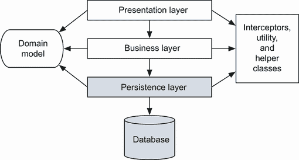
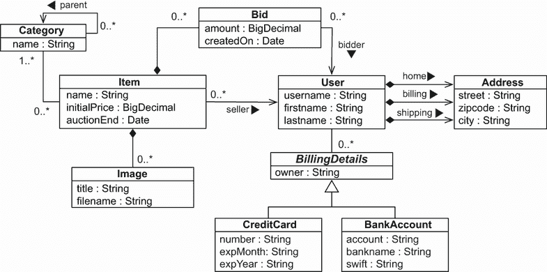
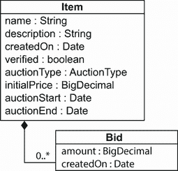
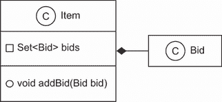
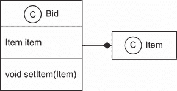

# 3 领域模型和元数据

本章涵盖

+   介绍 CaveatEmptor 示例应用程序

+   实现领域模型

+   检查对象/关系映射元数据选项

上一章中的“Hello World”示例介绍了 Hibernate、Spring Data 和 JPA，但它对于理解具有复杂数据模型的现实世界应用程序的需求并不有用。在本书的其余部分，我们将使用一个更复杂的示例应用程序——CaveatEmptor，一个在线拍卖系统——来展示 JPA、Hibernate 以及稍后的 Spring Data。（*Caveat emptor*意味着“让买家小心。”）

JPA 2 中的主要新功能

JPA 持久化提供程序现在可以自动与 Bean Validation 提供程序集成。当数据存储时，提供程序会自动验证持久化类上的约束。

`Metamodel` API 也已添加。你可以获取持久单元中类的名称、属性和映射元数据。

我们将通过对 CaveatEmptor 应用程序的分层应用架构进行介绍来开始对其的讨论。然后，你将学习如何识别问题域的业务实体。你将创建这些实体及其属性的概念模型，称为*领域模型*，并通过创建持久化类在 Java 中实现它。我们将花一些时间探讨这些 Java 类应该是什么样子，以及它们在典型的分层应用架构中的位置。我们还将查看这些类的持久化能力以及这对应用程序的设计和实现有何影响。我们还将添加 Bean Validation，这将帮助你自动验证领域模型数据的完整性——包括持久化信息和业务逻辑。

然后，我们将探讨一些映射元数据选项——这些选项是告诉 Hibernate 持久化类及其属性如何与数据库表和列相关联的方式。这可以简单到直接在类的 Java 源代码中添加注解，或者编写你最终与 Hibernate 在运行时访问的编译 Java 类一起部署的 XML 文档。

在阅读本章后，你将了解如何在复杂现实世界项目中设计领域模型的持久化部分，以及你将主要偏好使用的映射元数据选项。让我们从示例应用程序开始。

## 3.1 示例 CaveatEmptor 应用程序

CaveatEmptor 示例是一个在线拍卖应用程序，它展示了 ORM 技术、JPA、Hibernate 和 Spring Data 功能。在这本书中，我们不会过多关注用户界面（它可能是基于 Web 的或富客户端）；相反，我们将专注于数据访问代码。

要理解 ORM 中涉及的设计挑战，让我们假设 CaveatEmptor 应用程序尚不存在，并且我们从零开始构建它。让我们首先看看架构。

### 3.1.1 分层架构

对于任何非平凡的应用程序，通常按关注点组织类是有意义的。持久性是一个关注点；其他包括表示、工作流和业务逻辑。典型的面向对象架构包括代表这些关注点的代码层。

跨切面关注点

还存在所谓的*跨切面关注点*，这些关注点可以通过框架代码等通用方式实现。典型的跨切面关注点包括日志记录、授权和事务划分。

分层架构定义了实现各种关注点的代码之间的接口，允许在不显著干扰其他层代码的情况下更改一个关注点的实现方式。分层决定了层间依赖的类型。规则如下：

+   层从上到下进行通信。一个层只依赖于直接位于其下方的层的接口。

+   每个层除了直接位于其下方的层之外，对任何其他层都一无所知，如果它收到来自该层的显式请求，最终也会知道位于其上方的层。

不同的系统按不同的方式分组关注点，因此它们定义了不同的层。典型的、经过验证的、高级应用程序架构使用三个层：每个层分别用于表示、业务逻辑和持久性，如图 3.1 所示。



图 3.1 持久层是分层架构的基础。

+   *表示层*—用户界面逻辑是最顶层的。负责页面和屏幕导航的表示和控制代码位于表示层。用户界面代码可以直接访问共享领域模型中的业务实体，并在屏幕上渲染它们，同时提供执行动作的控件。在某些架构中，业务实体实例可能无法直接由用户界面代码访问，例如当表示层不在与系统其他部分相同的机器上运行时。在这种情况下，表示层可能需要自己的特殊数据传输模型，仅表示领域模型的可传输子集。表示层的良好例子是与浏览器一起交互以与应用程序进行交互。

+   *业务层*—业务层通常负责实现任何属于问题域的业务规则或系统需求。此层通常包括某种控制组件——知道何时调用哪个业务规则的代码。在某些系统中，此层有自己的业务领域实体的内部表示。或者，它可能依赖于与应用程序其他层共享的领域模型实现。业务层的良好例子是负责执行业务逻辑的代码。

+   *持久层*——持久层是一组负责将数据存储到、从一个或多个数据存储中检索数据的类和组件。此层需要一个模型来表示你希望保持持久状态的业务领域实体。持久层是 JPA、Hibernate 和 Spring Data 大量使用的地方。

+   *数据库*——数据库通常是外部的。它是系统状态的实际持久表示。如果使用 SQL 数据库，数据库包括模式，以及可能用于在数据附近执行业务逻辑的存储过程。数据库是数据长期持久化的地方。

+   *辅助和实用类*——每个应用程序都有一组基础设施辅助或实用类，这些类在应用程序的每一层都被使用。这些可能包括通用类或横切关注类（如日志记录、安全和缓存）。这些共享的基础设施元素不构成一层，因为它们不遵循分层架构中层间依赖的规则。

现在我们有了高级架构，我们可以专注于业务问题。

### 3.1.2 分析业务领域

在这个阶段，你应该在领域专家的帮助下，分析你的软件系统需要解决的业务问题，识别相关的主要实体及其交互。领域模型分析和设计的背后主要目标是捕捉业务信息的核心，以适应应用程序的目的。

*实体*通常是系统用户理解的概念：支付、客户、订单、项目、出价等等。一些实体可能是用户思考的更不具体事物的抽象，例如定价算法，但这些通常对用户来说是可理解的。你可以在业务的概念视图中找到所有这些实体，有时也称为*信息模型*。

从这个业务模型中，面向对象软件的工程师和架构师创建了一个面向对象模型，仍然处于概念层面（没有 Java 代码）。此模型可能只是一个存在于开发者心中的心理图像，或者它可能像 UML 类图一样复杂。图 3.2 展示了用 UML 表达的一个简单模型。


图 3.2 典型在线拍卖模型的类图

此模型包含你在任何典型的电子商务系统中都可能会找到的实体：类别、项目和用户。此领域模型表示所有实体及其关系（以及可能它们的属性）。这种从问题域中提取的实体面向对象模型，仅包含对用户感兴趣的实体，被称为*领域模型*。它是对现实世界的抽象视图。

与使用面向对象模型不同，工程师和架构师可能从数据模型开始应用设计。这可以用实体关系图来表示，它将包含 `CATEGORY`、`ITEM` 和 `USER` 实体，以及它们之间的关系。我们通常说，在持久性方面，这两种模型之间几乎没有区别；它们只是不同的起点。最终，你使用哪种建模语言是次要的；我们最感兴趣的是业务实体的结构和关系。我们关心必须应用以确保数据完整性的规则（例如，模型中包含的关系多重性）以及用于操作数据的代码过程（通常不包括在模型中）。

在下一节中，我们将完成对 CaveatEmptor 问题领域的分析。生成的领域模型将成为本书的中心主题。

### 3.1.3 CaveatEmptor 领域模型注意事项

CaveatEmptor 网站将允许用户拍卖多种不同类型的物品，从电子设备到机票。拍卖按照英语拍卖策略进行：用户继续对该物品进行出价，直到该物品的出价期结束，最高出价者获胜。

在任何商店中，商品都按类型分类，并按相似商品分组到区域和货架上。拍卖目录需要某种物品类别的层次结构，以便买家可以浏览类别或任意按类别和物品属性搜索。物品列表将出现在类别浏览器和搜索结果屏幕上。从列表中选择一个物品将带买家到物品详情视图，其中物品可能附有图片。

拍卖由一系列出价组成，其中一个是获胜出价。用户详细信息将包括姓名、地址和账单信息。



图 3.3 CaveatEmptor 领域模型的持久化类及其关系

本分析的结果，即领域模型的高级概述，如图 3.3 所示。让我们简要讨论一下这个模型的一些有趣特性：

+   每个物品只能拍卖一次，因此你不需要将 `Item` 与任何拍卖实体区分开来。相反，你有一个名为 `Item` 的单一拍卖物品实体。因此，`Bid` 直接与 `Item` 相关联。你将 `User` 的 `Address` 信息建模为一个单独的类——一个 `User` 可能有三个地址，分别是家庭、账单和配送。你允许用户拥有多个 `BillingDetails`。抽象类的子类代表各种账单策略（允许未来扩展）。

+   应用程序可以在一个`Category`内部嵌套另一个`Category`，依此类推。从`Category`实体到自身的递归关联表达了这种关系。请注意，一个单独的`Category`可以有多个子类别，但最多只有一个父类别。每个`Item`至少属于一个`Category`。

+   这种表示法并不是一个完整的领域模型；它只是那些需要持久化能力的类。你将需要存储和加载`Category`、`Item`、`User`等类的实例。我们对这个高级概述进行了一些简化；在需要更复杂的示例时，我们会修改这些类。

+   领域模型中的实体应该封装状态和行为。例如，`User`实体应该定义客户的姓名和地址*以及*计算特定客户物品的运费所需的逻辑。

+   领域模型中可能还有其他只有瞬态运行时实例的类。考虑一个封装最高出价者赢得拍卖事实的`WinningBidStrategy`类。这可能在业务层（控制器）代码检查拍卖状态时被调用。在某个时候，你可能需要弄清楚如何计算已售物品的税费或系统如何批准新的用户账户。我们不认为这样的业务规则或领域模型行为是不重要的；相反，这些关注点大多与持久性问题正交。

现在你已经有一个（初步的）具有领域模型的应用程序设计，下一步是将它用 Java 实现。

无领域模型的 ORM

使用完整的 ORM 进行对象持久化最适合基于丰富领域模型的应用程序。如果你的应用程序没有实现复杂的业务规则或实体之间的复杂交互，或者如果你有很少的实体，你可能不需要领域模型。许多简单的问题和一些不那么简单的问题非常适合面向表解决方案，其中应用程序是围绕数据库数据模型设计的，而不是围绕面向对象的领域模型，逻辑通常在数据库（使用存储过程）中执行。

值得考虑的还有学习曲线：一旦你精通 Hibernate 和 Spring Data，你将使用它们来处理所有应用程序——甚至是一个简单的 SQL 查询生成器和结果映射器。如果你刚开始学习 ORM，一个简单的用例可能不足以证明所涉及的时间和开销。

## 3.2 实现领域模型

让我们从任何实现都必须处理的任何问题开始：关注点的分离——哪一层负责什么责任。领域模型实现通常是中心、组织性的组件；在实现新的应用程序功能时，它被大量重用。因此，你应该采取一些措施来确保非业务关注点不会渗入领域模型实现。

### 3.2.1 解决关注点泄漏问题

当持久性、事务管理或授权等关注点开始出现在领域模型类中时，这是一个关注点泄漏的例子。领域模型实现是重要的代码，不应依赖于正交 API。例如，领域模型中的代码不应直接调用数据库或通过中间抽象调用。这将允许你在几乎任何地方重用领域模型类。

应用程序的架构包括以下层：

+   呈现层在渲染视图时可以访问领域模型实体的实例和属性。用户可以使用前端（如浏览器）与应用程序交互。这个关注点应该与其他层的关注点分开。

+   业务层中的控制器组件可以访问领域模型实体的状态并调用这些实体的方法。这是执行业务计算和逻辑的地方。这个关注点应该与其他层的关注点分开。

+   持久化层可以从数据库加载领域模型实体的实例并将它们存储到数据库中，保留其状态。这是信息长期持久化的地方。这个关注点也应该与其他层的关注点分开。

防止关注点泄漏使得在不需要特定运行时环境或容器或模拟任何服务依赖的情况下，可以轻松地对领域模型进行单元测试。你可以编写单元测试来验证领域模型类的正确行为，而无需任何特殊的测试框架。（这里我们谈论的是像“计算运费和税费”这样的单元测试，而不是像“从数据库加载”和“存储到数据库”这样的性能和集成测试。）

Jakarta EE 标准通过代码中的元数据（如注解）或外部 XML 描述符解决了关注点泄漏的问题。这种方法允许运行时容器通过拦截对应用程序组件的调用以通用方式实现一些预定义的横切关注点——安全性、并发性、持久性、事务性和远程性。

JPA 将*实体类*定义为主要的编程工件。这种编程模型实现了透明持久化，并且 JPA 提供者（如 Hibernate）也提供了自动化持久化。Hibernate 不是一个 Jakarta EE 运行时环境，也不是一个应用程序服务器。它是 ORM 技术的实现。

### 3.2.2 透明和自动持久化

我们使用术语*透明*来指代领域模型持久化类和持久化层之间的关注点完全分离。持久化类对持久化机制一无所知，并且没有依赖。从持久化类内部，没有对外部持久化机制的引用。我们使用术语*自动*来指代一个持久化解决方案（你的注解领域、层和机制），它让你摆脱处理低级机械细节，例如编写大多数 SQL 语句和与 JDBC API 交互。作为一个现实世界的用例，让我们分析透明和自动化的持久化如何在`Item`类级别得到体现。

CaveatEmptor 领域模型的`Item`类不应该对 Jakarta Persistence 或 Hibernate API 有任何运行时依赖。此外，JPA 也不要求持久化类继承或实现任何特殊的超类或接口。也不使用任何特殊类来实现属性和关联。你可以在任何运行时环境中使用常规的 Java `new`操作符创建实例，从而保持可测试性和可重用性。

在具有透明持久化的系统中，实体实例对底层数据存储一无所知；它们甚至不需要知道它们正在被持久化或检索。JPA 将持久化关注点外部化到一个通用的持久化管理器 API。因此，你的大部分代码，当然包括你的复杂业务逻辑，不需要关心单个执行线程中领域模型实体实例的当前状态。我们将透明性视为一个要求，因为它使得应用程序更容易构建和维护。透明持久化应该是任何 ORM 解决方案的主要目标之一。

显然，没有自动化的持久化解决方案是完全透明的：每个自动化的持久化层，包括 JPA 和 Hibernate，都对持久化类提出了一些要求。例如，JPA 要求集合类型的属性被类型化为接口，如`java.util.Set`或`java.util.List`，而不是实际的实现，如`java.util.HashSet`（这本身就是一种好习惯）。同样，JPA 实体类必须有一个特殊属性，称为*数据库标识符*（这虽然不是限制，但通常很方便）。

你现在知道持久化机制应该对如何实现领域模型的影响最小化，并且需要透明和自动化的持久化。我们实现这一目标的首选编程模型是 POJO。

注意，POJO 是*Plain Old Java Objects*的缩写。马丁·福勒（Martin Fowler）、丽贝卡·帕森斯（Rebecca Parsons）和乔希·麦肯齐（Josh Mackenzie）在 2000 年提出了这个术语。

在 2000 年代初，许多开发者开始讨论 POJO，这是一种回归基础的方法，本质上复兴了 JavaBeans，一个用于 UI 开发的组件模型，并将其重新应用于系统的其他层。EJB 和 JPA 规范的几个版本带来了新的轻量级实体，我们可以称它们为 *持久化能力 JavaBeans*。Java 工程师通常将这些术语用作相同基本设计方法的同义词。

您不必太在意我们在本书中使用哪些术语；我们的最终目标是尽可能透明地将持久化方面应用于 Java 类。如果您遵循一些简单的实践，几乎任何 Java 类都可以成为持久化能力类。让我们看看代码中的样子。

注意：要能够执行章节源代码中的示例，您首先需要运行 Ch03.sql 脚本。这些示例使用默认凭据的 MySQL 服务器：用户名为 *root*，无密码。

### 3.2.3 编写持久化能力类

支持细粒度和丰富的领域模型是 Hibernate 的一个主要目标。这是我们与 POJO 一起工作的原因之一。一般来说，使用细粒度对象意味着比表更多的类。

一个持久化能力的普通 Java 类声明了属性，这些属性代表状态，以及业务方法，这些方法定义了行为。一些属性代表与其他持久化能力类的关联。

以下列表展示了领域模型中 `User` 实体的 POJO 实现（源代码中 `domainmodel` 文件夹中的示例 1）。让我们来分析这段代码。

列表 3.1 `User` 类的 POJO 实现

```
Path: Ch03/domainmodel/src/main/java/com/manning/javapersistence/ch03/ex01
➥ /User.java

\1 User {

    private String username;

    public String getUsername() {
        return username;
    }

    public void setUsername(String username) {
        this.username = username;
    }

}
```

该类可以是抽象的，如果需要，可以扩展非持久化类或实现一个接口。它必须是一个顶级类，不能嵌套在其他类内部。持久化能力类及其任何方法 *不应* 是最终的（这是 JPA 规范的要求）。Hibernate 不那么严格，它将允许您声明最终类作为实体或具有最终方法的实体，这些方法访问持久化字段。然而，这不是一个好的实践，因为这将阻止 Hibernate 使用代理模式来提高性能。一般来说，如果您希望应用程序能够在不同的 JPA 提供商之间保持可移植性，您应该遵循 JPA 要求。

Hibernate 和 JPA 要求每个持久化类都必须有一个无参数的构造函数。或者，如果您根本不编写构造函数，Hibernate 将使用默认的 Java 构造函数。Hibernate 通过 Java 反射 API 调用此类无参数构造函数来创建实例。构造函数不需要是公共的，但它至少必须是包可见的，以便 Hibernate 使用运行时生成的代理进行性能优化。

POJO 的属性实现了业务实体的属性，例如 `User` 的 `username`。你通常会实现属性作为私有或受保护的成员字段，以及公共或受保护的属性访问器方法：对于每个字段，你需要一个用于获取其值的方法，另一个用于设置其值。这些方法分别被称为 *获取器* 和 *设置器*。列表 3.1 中的示例 POJO 声明了 `username` 属性的获取器和设置器方法。

JavaBean 规范定义了访问器方法的命名指南；这允许像 Hibernate 这样的通用工具轻松发现和操作属性值。获取器方法名称以 `get` 开头，后跟属性名称（首字母大写）。设置器方法名称以 `set` 开头，并类似地后跟属性名称。对于布尔属性，你可以用 `is` 而不是 `get` 开头来命名获取器方法。

Hibernate 不需要访问器方法。你可以选择如何持久化你的持久化类实例的状态。Hibernate 将直接访问字段或调用访问器方法。这些考虑不会在很大程度上干扰你的类设计。你可以使一些访问器方法非公共的，或者完全删除它们，然后配置 Hibernate 依赖于字段访问这些属性。

将属性字段和访问器方法设置为私有、受保护或包可见

通常，你不会允许直接访问类的内部状态，因此你不会使属性字段公共的。如果你使字段或方法私有，你实际上是在声明没有人应该永远访问它们；只有你被允许这样做（或像 Hibernate 这样的服务）。这是一个明确的声明。

有时候，有人访问你的“私有”内部结构往往有很好的理由——通常是为了修复你的一个错误——如果你让他们在紧急情况下不得不回退到反射访问，你只会让人感到愤怒。相反，你可能会假设或知道接替你的工程师可以访问你的代码，并且知道他们在做什么。

虽然简单的访问器方法很常见，但我们喜欢使用 JavaBeans 风格的访问器方法之一的原因是它们提供了封装：你可以更改属性的隐藏内部实现，而无需对公共接口进行任何更改。如果你配置 Hibernate 通过方法访问属性，你将类的内部数据结构（实例变量）从数据库的设计中抽象出来。

例如，如果你的数据库将用户名称存储为单个 `NAME` 列，但你的 `User` 类有 `firstname` 和 `lastname` 字段，你可以在类中添加以下持久的 `name` 属性（这是来自 `domainmodel` 文件夹源代码的示例 2）。

列表 3.2 `User` 类的 POJO 实现，其中包含访问器方法中的逻辑

```
Path: Ch03/domainmodel/src/main/java/com/manning/javapersistence/ch03/ex02
➥ /User.java

public class User {

    private String firstname;
    private String lastname;

    public String getName() {
        return firstname + ' ' + lastname;
    }

    public void setName(String name) {
        StringTokenizer tokenizer = new StringTokenizer(name);
        firstname = tokenizer.nextToken();
        lastname = tokenizer.nextToken();
    }

}
```

后续你将看到，在持久化服务中有一个自定义的类型转换器是处理这些情况的一个更好的方法。有几个选项可供选择。

另一个需要考虑的问题是*脏检查*。Hibernate 自动检测状态变化，以便它能将更新的状态与数据库同步。通常，从获取器方法返回一个与 Hibernate 传递给设置器方法的实例不同的实例是安全的。Hibernate 通过值而不是通过对象身份来比较它们，以确定属性是否需要更新其持久状态。例如，以下获取器方法不会导致不必要的 SQL `UPDATE`：

```
public String getFirstname() { 
    return new String(firstname);
}
```

在持久化集合时，关于*脏检查*有一个重要的问题需要注意。如果你有一个`Item`实体，它有一个通过`setBids`设置器访问的`Set<Bid>`字段，这段代码将导致不必要的 SQL `UPDATE`：

```
item.setBids(bids);
em.persist(item);
item.setBids(bids);
```

这是因为 Hibernate 有自己的集合实现：`PersistentSet`、`PersistentList`、`PersistentMap`。提供整个集合的设置器在任何情况下都不是一个好的做法。

当你的访问器方法抛出异常时，Hibernate 如何处理这些异常？如果 Hibernate 在加载和存储实例时使用访问器方法，并且抛出了一个`RuntimeException`（未检查的异常），则当前事务将回滚，异常将由调用 Jakarta Persistence（或原生 Hibernate）API 的代码处理。如果你抛出一个检查的应用程序异常，Hibernate 会将异常包装成一个`RuntimeException`。

接下来，我们将关注实体之间的关系以及持久化类之间的关联。

### 3.2.4 实现 POJO 关联

现在我们来看看如何关联和创建对象之间不同类型的关系：一对一、多对一和双向关系。我们将查看创建这些关联所需的脚手架代码，如何简化关系管理，以及如何强制执行这些关系的完整性。

你可以创建属性来表示类之间的关联，并且你将在运行时通过访问器方法从实例导航到实例。让我们考虑由`Item`和`Bid`持久化类定义的关联，如图 3.4 所示。



图 3.4 `Item`和`Bid`类之间的关联

我们在图 3.4 中省略了与关联相关的属性，`Item#bids` 和 `Bid#item`。这些属性及其操作值的函数被称为*脚手架代码*。以下是`Bid`类的脚手架代码示例：

```
Path: Ch03/domainmodel/src/main/java/com/manning/javapersistence/ch03/ex03
➥ /Bid.java

public class Bid {

    private Item item;

    public Item getItem() {
        return item;
    }

    public void setItem(Item item) {
        this.item = item;
    }

}
```

`item`属性允许从`Bid`导航到相关的`Item`。这是一个具有*多对一*多重性的关联；用户可以为每个物品投多个标。

这是`Item`类的脚手架代码：

```
Path: Ch03/domainmodel/src/main/java/com/manning/javapersistence/ch03/ex03
➥ /Item.java

public class Item {
    private Set<Bid> bids = new HashSet<>();

    public Set<Bid> getBids() {
        return Collections.unmodifiableSet(bids);
    }
}
```

这两个类之间的关联允许进行**双向**导航：从这一角度看，**多对一**是多对一多重性的。一个项目可以有多个出价——它们是同一类型，但在拍卖过程中由不同的用户以不同的金额生成，如表 3.1 所示。

表 3.1 一个`Item`在拍卖期间生成了多个`Bid`

| 项目 | 出价 | 用户 | 金额 |
| --- | --- | --- | --- |
| 1 | 1 | John | 100 |
| 1 | 2 | Mike | 120 |
| 1 | 3 | John | 140 |

`bids`属性的脚手架代码使用集合接口类型，`java.util.Set`。JPA 要求集合类型属性使用接口，您必须使用`java.util.Set`、`java.util.List`或`java.util.Collection`，而不是例如`HashSet`。无论如何，编写针对集合接口的代码而不是具体实现是良好的编程习惯，所以这个限制不应该让您感到烦恼。

您可以选择一个`Set`并将字段初始化为一个新的`HashSet`，因为应用程序不允许重复的出价。这是一个好习惯，因为当有人访问一个新`Item`的属性时，该`Item`将有一个空的出价集合，这样可以避免任何`NullPointer-Exception`。JPA 提供者还必须在任何映射的集合值属性上设置非空值，例如，当从数据库中加载没有出价的`Item`时。（它不必使用`HashSet`；实现由提供者决定。Hibernate 有自己的集合实现，具有额外的功能，例如脏检查。）

项目的出价不应该存储在列表中吗？

第一个反应通常是保留用户输入元素顺序，因为这也可能是您稍后显示它们的顺序。当然，在拍卖应用程序中，用户看到出价的顺序必须是有定义的，例如，最高的出价首先显示或最新的出价最后显示。您甚至可以在用户界面代码中使用`java.util.List`来对出价进行排序和显示。

然而，这并不意味着这种显示顺序应该是持久的。数据完整性不受出价显示顺序的影响。您需要存储每个出价的金额，这样您总能找到最高的出价，并且您需要存储每个出价创建的时间戳，这样您总能找到最新的出价。当有疑问时，请保持您的系统灵活，在从数据存储（在查询中）或向用户显示（在 Java 代码中）数据时对其进行排序，而不是在存储时排序。

关联的访问器方法需要声明为 `public`，仅当它们是应用程序逻辑用于在两个实例之间创建链接的持久化类的公共接口的一部分时。我们现在将关注这个问题，因为在 Java 代码中管理 `Item` 和 `Bid` 之间的链接比在具有声明性外键约束的 SQL 数据库中要复杂得多。根据我们的经验，工程师们往往没有意识到这种复杂性，它源于具有双向引用（指针）的网络对象模型。让我们一步一步地解决这个问题。

将 `Bid` 与 `Item` 链接的基本步骤如下：

```
anItem.getBids().add(aBid);
aBid.setItem(anItem);
```

每次创建这种双向链接时，需要执行两个操作：

+   您必须将 `Bid` 添加到 `Item` 的 `bids` 集合中（如图 3.5 所示）。



图 3.5 链接 `Bid` 与 `Item` 的第一步：将 `Bid` 添加到 `Item` 的 `Bids` 集合中

+   `Bid` 的 `item` 属性必须设置（如图 3.6 所示）。



图 3.6 链接 `Bid` 与 `Item` 的第二步：在 `Bid` 方面设置 `Item`

JPA 不管理持久化关联。如果您想操作一个关联，您必须编写与不使用 Hibernate 时的相同代码。如果一个关联是双向的，您必须考虑关系的两个方面。如果您在理解 JPA 中关联的行为时遇到问题，只需问自己，“没有 Hibernate 我会怎么做？”Hibernate 不会改变常规的 Java 语义。

我们建议您添加便利方法来分组这些操作，以便重用并帮助确保正确性，最终保证数据完整性（`Bid` 必须有一个对 `Item` 的引用）。下面的列表显示了 `Item` 类中的一个此类便利方法（这是来自 `domainmodel` 文件夹源代码的示例 3）。

列表 3.3 一个便利方法简化了关系管理

```
Path: Ch03/domainmodel/src/main/java/com/manning/javapersistence/ch03/ex03
➥ /Item.java

public void addBid(Bid bid) {
    if (bid == null)
        throw new NullPointerException("Can't add null Bid");
    if (bid.getItem() != null)
        throw new IllegalStateException(
                    "Bid is already assigned to an Item");
    bids.add(bid);
    bid.setItem(this);
}
```

`addBid()` 方法不仅减少了处理 `Item` 和 `Bid` 实例时的代码行数，还强制了关联的基数。您避免了由于遗漏两个必需操作之一而引起的错误。如果可能，您应该始终为关联提供这种操作分组。如果您将其与 SQL 数据库中外键的关系模型进行比较，您就可以很容易地看到网络和指针模型如何使一个简单的操作复杂化：您需要一个程序性代码来保证数据完整性，而不是一个声明性约束。

因为您希望 `addBid()` 是唯一的外部可见的修改器方法，用于修改一个项目的出价（可能还包括一个 `removeBid()` 方法），考虑使 `Bid#setItem()` 方法对包可见。

`Item#getBids()`获取器方法不应返回一个可修改的集合，这样客户端就不能使用该集合进行更改，而这些更改在另一侧没有反映出来。直接添加到集合中的出价可能属于一个项目，但它们不会对该项目有引用，这会根据数据库约束创建一个不一致的状态。为了防止这个问题，你可以在从获取器方法返回之前用`Collections.unmodifiableCollection(c)`和`Collections.unmodifiableSet(s)`包装内部集合。然后，如果客户端尝试修改集合，它将得到一个异常。因此，你可以强制每个修改都通过关系管理方法进行，从而保证完整性。始终返回不可修改的集合是良好的实践，这样客户端就没有直接访问它的权限。

另一种策略是使用不可变实例。例如，你可以在`Bid`构造函数中要求一个`Item`参数来强制完整性，如下面的列表所示（来自`domainmodel`文件夹源代码的示例 4）。

列表 3.4 使用构造函数强制关系的完整性

```
Path: Ch03/domainmodel/src/main/java/com/manning/javapersistence/ch03/ex04
➥ /Bid.java

public class Bid {

    private Item item;

    public Bid(Item item) {
        this.item = item;
        item.bids.add(this); // Bidirectional
    }

    public Item getItem() {
        return item;
    }
}
```

在这个构造函数中，设置了`item`字段；不应进一步修改字段值。另一侧的集合也更新以实现双向关系，而`Item`类的`bids`字段现在是包私有。没有`Bid#setItem()`方法。

然而，这种方法有几个问题。首先，Hibernate 不能调用这个构造函数。你需要为 Hibernate 添加一个无参数构造函数，并且它至少需要是包可见的。此外，因为没有`setItem()`方法，Hibernate 必须配置为直接访问`item`字段。这意味着字段不能是`final`，所以类不能保证是不可变的。

至于你想要围绕持久关联属性或字段包裹多少便利方法和层，这取决于你，但我们建议保持一致，并将相同的策略应用于所有领域模型类。为了可读性，我们不会在未来的代码示例中始终显示我们的便利方法、特殊构造函数和其他类似的脚手架；你应该根据自己的品味和需求添加它们。

你现在已经看到了领域模型类以及如何表示它们的属性和它们之间的关系。接下来，我们将提高抽象级别：我们将在领域模型实现中添加元数据，并声明诸如验证和持久性规则等方面。

## 3.3 领域模型元数据

元数据是关于数据的数据，因此领域模型元数据是关于你的领域模型的信息。例如，当你使用 Java 反射 API 来发现领域模型中类的名称或它们的属性名称时，你正在访问领域模型元数据。

ORM 工具也需要元数据来指定类和表、属性和列、关联和外键、Java 类型和 SQL 类型之间的映射，等等。这种对象/关系映射元数据控制着面向对象和 SQL 系统中的不同类型系统和关系表示之间的转换。JPA 有一个元数据 API，你可以调用它来获取关于你的领域模型持久化方面的详细信息，例如持久化实体和属性的名称。作为工程师，你的任务是创建和维护这些信息。

JPA 标准化了两种元数据选项：Java 代码中的注解和外部化的 XML 描述符文件。Hibernate 为原生功能提供了一些扩展，这些扩展也作为注解或 XML 描述符提供。我们通常更喜欢将注解作为映射元数据的主要来源。阅读本节后，你将拥有足够的信息来为你的项目做出明智的决定。

我们还将在本节中讨论*Bean Validation*（JSR 303），以及它是如何为你的领域模型（或任何其他）类提供声明性验证的。本规范的参考实现是*Hibernate Validator*项目。如今，大多数工程师更喜欢将 Java 注解作为声明元数据的主要机制。

### 3.3.1 基于注解的元数据

注解的一个主要优势是它们将元数据，如`@Entity`，放置在它所描述的信息旁边，而不是将其分离到不同的文件中。以下是一个示例：

```
import javax.persistence.Entity;
@Entity
public class Item {
}
```

你可以在`javax.persistence`包中找到标准的 JPA 映射注解。此示例使用`@javax.persistence.Entity`注解将`Item`类声明为持久化实体。现在，它的所有属性都自动使用默认策略实现持久化。这意味着你可以加载和存储`Item`的实例，并且该类的所有属性都是管理状态的一部分。

注解是类型安全的，JPA 元数据包含在编译后的类文件中。注解在运行时仍然可访问，当应用程序启动时，Hibernate 使用 Java 反射读取类和元数据。IDE 也可以轻松验证和突出显示注解——毕竟，它们是常规的 Java 类型。当你重构代码时，你会重命名、删除和移动类和属性。大多数开发工具和编辑器无法重构 XML 元素和属性值，但注解是 Java 语言的一部分，并包含在所有重构操作中。

我的类现在是否依赖于 JPA？

当你编译领域模型类的源代码时，需要在类路径上包含 JPA 库。在创建类的实例时，例如在客户端应用程序中（该应用程序不执行任何 JPA 代码），类路径上不需要 JPA。只有当你通过反射在运行时访问注解（如 Hibernate 在读取你的元数据时内部所做的那样）时，你才需要在类路径上包含这些包。

当标准化的 Jakarta Persistence 注解不足时，JPA 提供者可能会提供额外的注解。

使用供应商扩展

即使你使用来自`javax.persistence`包的与 JPA 兼容的注解映射了应用程序的大部分模型，你可能在某些时候不得不使用供应商扩展。例如，一些你期望在高质量持久化软件中可用的性能调整选项，仅作为 Hibernate 特定注解提供。这就是 JPA 供应商竞争的方式，因此你无法避免其他包中的注解——你选择使用 Hibernate 的原因是有其道理。

以下片段再次显示了`Item`实体源代码，并带有 Hibernate 特有的映射选项：

```
import javax.persistence.Entity;
@Entity
@org.hibernate.annotations.Cache(
    usage = org.hibernate.annotations.CacheConcurrencyStrategy.READ_WRITE
)
public class Item {
}
```

我们更喜欢使用完整的`org.hibernate.annotations`包名作为 Hibernate 注解的前缀。这是一个好的做法，因为它使你能够轻松地看到这个类的哪些元数据来自 JPA 规范，哪些是供应商特定的。你还可以轻松地在源代码中搜索`org.hibernate.annotations`，并通过单个搜索结果获得应用程序中所有非标准注解的完整概述。

如果你切换到 Jakarta Persistence 提供者，你只需替换供应商特定的扩展，并且可以期待从大多数成熟的 JPA 实现中获得类似的功能集。当然，我们希望你永远不需要这样做，实际上这种情况很少发生——只是做好准备。

类上的注解仅覆盖适用于该特定类的元数据。你通常还需要更高层次的元数据，用于整个包或整个应用程序。

全局注解元数据

`@Entity`注解映射一个特定的类。JPA 和 Hibernate 也有用于全局元数据的注解。例如，`@NamedQuery`有一个全局作用域；你不需要将其应用于特定的类。这个注解应该放在哪里？

尽管将此类全局注解放置在类的源文件中（任何类的顶部）是可能的，但我们更喜欢将全局元数据保存在单独的文件中。包级别注解是一个不错的选择；它们位于特定包目录下的名为`package_info.java`的文件中。你将能够在单个位置找到它们，而不是浏览多个文件。以下列表显示了一个全局命名查询声明的示例（来自`domainmodel`文件夹源代码的第 5 个示例）。

列表 3.5 包含在 package_info.java 文件中的全局元数据

```
Path: Ch03/domainmodel/src/main/java/com/manning/javapersistence/ch03/ex05
➥ /package-info.java

@org.hibernate.annotations.NamedQueries({
    @org.hibernate.annotations.NamedQuery(
        name = "findItemsOrderByName",
        query = "select i from Item i order by i.name asc"
    )
    ,
    @org.hibernate.annotations.NamedQuery(
        name = "findItemBuyNowPriceGreaterThan",
        query = "select i from Item i where i.buyNowPrice > :price",
        timeout = 60, // Seconds!
        comment = "Custom SQL comment"
    )
})

package com.manning.javapersistence.ch03.ex05;
```

除非你之前使用过包级别注解，否则这个文件中包含包和导入声明的语法可能对你来说很陌生。

在本书中，注解将是我们的主要 ORM 元数据工具，关于这个主题有很多东西要学习。在我们查看使用 XML 文件替代的映射风格之前，让我们使用一些简单的注解来通过验证规则改进我们的领域模型类。

### 3.3.2 将约束应用于 Java 对象

大多数应用程序都包含大量的数据完整性检查。当你违反了最简单的数据完整性约束之一时，你可能会得到一个`NullPointerException`，因为某个值不可用。当字符串值的属性不应该为空（空字符串不是`null`）时，当字符串必须匹配特定的正则表达式模式时，或者当数字或日期值必须在某个范围内时，你也可能会得到这个异常。

这些业务规则影响应用程序的每一层：用户界面代码必须显示详细和本地化的错误消息。业务和持久化层必须在将值传递给数据存储之前检查从客户端接收到的输入值。SQL 数据库必须是最终的验证器，保证持久数据的完整性。

Bean Validation 背后的理念是，声明规则，例如“这个属性不能为 null”或“这个数字必须在给定的范围内”，比反复编写 if-then-else 过程要容易得多，且错误率更低。此外，在应用程序的核心组件——领域模型实现上声明这些规则，使得可以在系统的每一层进行完整性检查。这些规则随后对表示层和持久层都是可用的。如果你考虑到数据完整性约束不仅影响你的 Java 应用程序代码，还影响你的 SQL 数据库模式——这是一个完整性规则的集合——你可能会将 Bean Validation 约束视为额外的 ORM 元数据。

看一下`validation`文件夹源代码中的以下扩展的`Item`领域模型类。

列表 3.6 在`Item`实体字段上应用验证约束

```
Path: Ch03/validation/src/main/java/com/manning/javapersistence/ch03
➥ /validation/Item.java

import javax.validation.constraints.Future;
import javax.validation.constraints.NotNull;
import javax.validation.constraints.Size;
import java.util.Date;

public class Item {
    @NotNull
    @Size(
            min = 2,
            max = 255,
            message = "Name is required, maximum 255 characters."
    )
    private String name;

    @Future
    private Date auctionEnd;
}
```

当拍卖结束时，我们添加两个属性：物品的`name`和`auctionEnd`日期。这两个都是添加额外约束的典型候选者。首先，我们想要保证名称始终存在且可读（单字符的物品名称没有太多意义），但不要太长——你的 SQL 数据库在长度最多为 255 个字符的变长字符串上效率最高，而且你的用户界面也会对可见标签空间有一些约束。其次，拍卖的结束时间显然应该在将来。如果我们没有为约束提供错误消息，将使用默认消息。消息可以是外部属性文件中的国际化键。

如果你注解了字段，验证引擎将直接访问字段。如果你更喜欢通过访问器方法进行调用，请用验证约束注解 getter 方法，而不是 setter（setter 上的注解不受支持）。然后，约束将成为类 API 的一部分，并包含在其 Javadoc 中，这使得领域模型实现更容易理解。请注意，约束作为类 API 的一部分与 JPA 提供者的访问无关；例如，Hibernate Validator 可能会调用访问器方法，而 Hibernate ORM 可能会直接调用字段。

Bean Validation 不仅限于内置注解；您可以创建自己的约束和注解。使用自定义约束，您甚至可以使用类级别的注解，并在类的实例上同时验证多个属性值。以下测试代码展示了如何手动检查 `Item` 实例的完整性。

列表 3.7 测试 `Item` 实例的约束违规

```
Path: Ch03/validation/src/test/java/com/manning/javapersistence/ch03
➥ /validation/ModelValidation.java

ValidatorFactory factory = Validation.buildDefaultValidatorFactory();
Validator validator = factory.getValidator();

Item item = new Item();
item.setName("Some Item");
item.setAuctionEnd(new Date());

Set<ConstraintViolation<Item>> violations = validator.validate(item);

ConstraintViolation<Item> violation = violations.iterator().next();
String failedPropertyName =
        violation.getPropertyPath().iterator().next().getName();

// Validation error, auction end date was not in the future!
assertAll(() -> assertEquals(1, violations.size()),
        () -> assertEquals("auctionEnd", failedPropertyName),
        () -> {
            if (Locale.getDefault().getLanguage().equals("en"))
                assertEquals(violation.getMessage(),
                             "must be a future date");
        });
```

我们不会详细解释此代码，但提供给您探索。您很少会编写这种验证代码；通常这种验证是由您的用户界面和持久化框架自动处理的。因此，在选择 UI 框架时寻找 Bean Validation 集成是很重要的。

Hibernate，如任何 JPA 提供程序所要求的，如果类路径上有库，也会自动与 Hibernate Validator 集成，并提供了以下功能：

+   在将实例传递给 Hibernate 进行存储之前，您不需要手动验证实例。

+   Hibernate 识别持久化领域模型类上的约束，并在数据库插入或更新操作之前触发验证。当验证失败时，Hibernate 会抛出一个包含失败详情的 `ConstraintViolationException` 异常给调用持久化管理操作的代码。

+   Hibernate 自动 SQL 模式生成工具集理解许多约束，并为您生成 SQL DDL 等价的约束。例如，`@NotNull` 注解转换为 SQL 的 `NOT NULL` 约束，而 `@Size(n)` 规则定义了 `VARCHAR(n)` 类型列中的字符数。

您可以使用持久化.xml 配置文件中的 `<validation-mode>` 元素来控制 Hibernate 的此行为。默认模式是 `AUTO`，因此 Hibernate 只有在运行应用程序的类路径上找到 Bean Validation 提供程序（如 Hibernate Validator）时才会进行验证。使用 `CALLBACK` 模式，验证将始终发生，如果您忘记捆绑 Bean Validation 提供程序，则会收到部署错误。`NONE` 模式禁用了 JPA 提供程序的自动验证。

您将在本书后面的内容中再次看到 Bean Validation 注解；您也会在示例代码包中找到它们。我们本可以写更多关于 Hibernate Validator 的内容，但我们只会重复项目优秀参考指南中已有的内容（[`mng.bz/ne65`](http://mng.bz/ne65)）。请查看并了解更多关于验证组以及约束发现元数据 API 的功能。

### 3.3.3 使用 XML 文件外部化元数据

您可以用 XML 描述符元素替换或覆盖 JPA 中的每个注解。换句话说，如果您不想使用注解，或者出于某种原因将映射元数据与源代码分开对您的系统设计有利，您不必使用注解。将映射元数据分开的好处是避免在 JPA 注解中混入 Java 代码，并使您的 Java 类更具可重用性，尽管您会失去类型安全性。这种方法现在使用较少，但我们仍将分析它，因为您可能仍然会遇到它或选择这种方法用于您自己的项目。

带有 JPA 的 XML 元数据

以下列表显示了一个特定持久化单元的 JPA XML 描述符（`metadataxmljpa` 文件夹源代码）。

列表 3.8 包含持久化单元映射元数据的 JPA XML 描述符

```
Path: Ch03/metadataxmljpa/src/test/resources/META-INF/orm.xml

<entity-mappings
        version="2.2"

        xsi:schemaLocation="http://xmlns.jcp.org/xml/ns/persistence/orm
            http://xmlns.jcp.org/xml/ns/persistence/orm_2_2.xsd">

 <persistence-unit-metadata>                                              Ⓐ
        <xml-mapping-metadata-complete/>                                  Ⓑ
        <persistence-unit-defaults>                                       Ⓒ
            <delimited-identifiers/>                                      Ⓓ
        </persistence-unit-defaults>
 </persistence-unit-metadata>
 <entity class="com.manning.javapersistence.ch03.metadataxmljpa.Item"     Ⓔ
                access="FIELD">                                           Ⓔ
    <attributes>                                                          Ⓕ
        <id name="id">                                                    Ⓕ
            <generated-value strategy="AUTO"/>                            Ⓕ
        </id>                                                             Ⓕ
        <basic name="name"/>                                              Ⓕ
        <basic name="auctionEnd">                                         Ⓕ
            <temporal>TIMESTAMP</temporal>                                Ⓕ
        </basic>                                                          Ⓕ
    </attributes>
 </entity>
</entity-mappings>
```

Ⓐ 声明全局元数据。

Ⓑ 忽略所有映射注解。如果我们包含 `<xml-mapping-metadata-complete>` 元素，JPA 提供商将忽略此持久化单元中域模型类上的所有注解，并仅依赖于在 XML 描述符中定义的映射。

Ⓒ 默认设置会转义所有 SQL 列、表和其他名称。

Ⓓ 如果 SQL 名称实际上是关键字（例如，“USER”表），则转义很有用。

Ⓔ 将 `Item` 类声明为一个具有字段访问权限的实体。

Ⓕ 它的属性包括自动生成的 `id`、`name` 和时间字段 `auctionEnd`。

如果您将此描述符放置在持久化单元类路径上的 `META-INF/orm.xml` 文件中，JPA 提供商将自动获取此描述符。如果您希望使用不同的文件名或多个文件，您必须更改您 `META-INF/persistence.xml` 文件中的持久化单元配置：

```
<persistence-unit name="persistenceUnitName">
     . . . 
    <mapping-file>file1.xml</mapping-file>
    <mapping-file>file2.xml</mapping-file>
     . . . 
</persistence-unit>
```

如果您不想忽略注解元数据而是覆盖它，不要将 XML 描述符标记为“完整”，并命名您想要覆盖的类和属性：

```
<entity class="com.manning.javapersistence.ch03.metadataxmljpa.Item">
    <attributes>
         <basic name="name">
            <column name="ITEM_NAME"/>
        </basic>
    </attributes>
</entity>
```

在这里，我们将 `name` 属性映射到 `ITEM_NAME` 列；默认情况下，属性会映射到 `NAME` 列。Hibernate 现在将忽略 `Item` 类的 `name` 属性上来自 `javax.persistence.annotation` 和 `org.hibernate.annotations` 包的任何现有注解。但 Hibernate 不会忽略 Bean Validation 注解，并且仍然应用它们进行自动验证和模式生成！`Item` 类上的其他所有注解也被识别。请注意，我们在此映射中没有指定访问策略，因此根据 `@Id` 注解在 `Item` 中的位置，将使用字段访问或访问器方法。（我们将在下一章中回到这个细节。）

在本书中，我们不会过多地讨论 JPA XML 描述符。这些文档的语法与 JPA 注解语法相同，因此您在编写它们时不应有任何问题。我们将关注重要方面：映射策略。

### 3.3.4 在运行时访问元数据

JPA 规范提供了访问持久类（模型信息）的编程接口。该 API 有两种类型。一种在本质上更动态，类似于基本的 Java 反射。第二种选项是静态元模型。对于这两种选项，访问都是只读的；你无法在运行时修改元数据。

Jakarta Persistence 中的动态元模型 API

有时候你可能会想要以编程方式访问实体的持久属性，例如当你想要编写自定义验证或通用 UI 代码时。你希望动态地知道你的领域模型有哪些持久类和属性。以下列表中的代码展示了如何使用 Jakarta Persistence 接口（来自 `metamodel` 文件夹的源代码）读取元数据。

列表 3.9 使用元模型 API 获取实体类型信息

```
Path: Ch03/metamodel/src/test/java/com/manning/javapersistence/ch03
➥ /metamodel/MetamodelTest.java

Metamodel metamodel = emf.getMetamodel();
Set<ManagedType<?>> managedTypes = metamodel.getManagedTypes();
ManagedType<?> itemType = managedTypes.iterator().next();

assertAll(() -> assertEquals(1, managedTypes.size()),
        () -> assertEquals(
                Type.PersistenceType.ENTITY,
                itemType.getPersistenceType()));
```

你可以从 `EntityManagerFactory` 获取 `Metamodel` 对象，通常在应用程序中每个数据源只有一个实例，或者，如果更方便的话，通过调用 `EntityManager#getMetamodel()`。管理类型集合包含有关所有持久实体和嵌入类的信息（我们将在下一章中讨论）。在这个例子中，只有一个管理类型：`Item` 实体。这就是你可以深入了解并获取每个属性更多信息的方法。

列表 3.10 使用元模型 API 获取实体属性信息

```
Path: Ch03/metamodel/src/test/java/com/manning/javapersistence/ch03
➥ /metamodel/MetamodelTest.java

SingularAttribute<?, ?> idAttribute =
        itemType.getSingularAttribute("id");                               Ⓐ
assertFalse(idAttribute.isOptional());                                     Ⓑ

SingularAttribute<?, ?> nameAttribute =
        itemType.getSingularAttribute("name");                             Ⓒ

assertAll(() -> assertEquals(String.class, nameAttribute.getJavaType()),   Ⓓ
        () -> assertEquals(                                                Ⓓ
                Attribute.PersistentAttributeType.BASIC,                   Ⓓ
                nameAttribute.getPersistentAttributeType()                 Ⓓ
        ));

SingularAttribute<?, ?> auctionEndAttribute =
        itemType.getSingularAttribute("auctionEnd");                       Ⓔ
assertAll(() -> assertEquals(Date.class,                                   Ⓕ
                             auctionEndAttribute.getJavaType()),           Ⓕ
          () -> assertFalse(auctionEndAttribute.isCollection()),           Ⓕ
          () -> assertFalse(auctionEndAttribute.isAssociation())           Ⓕ
);

```

Ⓐ 实体的属性通过字符串访问：`id`。

Ⓑ 检查 `id` 属性不是可选的。这意味着它不能为 NULL，因为它是主键。

Ⓒ`name.`

Ⓓ 检查 `name` 属性是否具有 `String` Java 类型以及基本持久属性类型。

Ⓔ `auctionEnd` 日期。这显然不是类型安全的，如果你更改属性的名称，此代码将损坏并过时。字符串不会自动包含在你的 IDE 的重构操作中。

Ⓕ 检查 `auctionEnd` 属性是否具有 `Date` Java 类型，并且它不是一个集合或关联。

JPA 还提供了静态类型安全的元模型。

使用静态元模型

在 Java（至少到版本 17），你不能以类型安全的方式访问 bean 的字段或访问器方法——只能通过它们的名称，使用字符串。这对于 JPA 条件查询来说尤其不方便，它是一种基于字符串查询语言的类型安全替代品。以下是一个例子：

```
Path: Ch03/metamodel/src/test/java/com/manning/javapersistence/ch03
➥ /metamodel/MetamodelTest.java

CriteriaBuilder cb = em.getCriteriaBuilder();
CriteriaQuery<Item> query = cb.createQuery(Item.class);     Ⓐ
Root<Item> fromItem = query.from(Item.class);
query.select(fromItem);
List<Item> items = em.createQuery(query).getResultList();

assertEquals(2, items.size());
```

Ⓐ 查询等同于 `select i from Item i`。此查询返回数据库中的所有项目，在这个例子中有两个。如果你想要限制这个结果并只返回具有特定名称的项目，你必须使用 `like` 表达式，将每个项目的 `name` 属性与参数中设置的模式进行比较。

以下代码在读取操作上引入了一个过滤器：

```
Path: Ch03/metamodel/src/test/java/com/manning/javapersistence/ch03
➥ /metamodel/MetamodelTest.java

Path<String> namePath = fromItem.get("name");                  
query.where(cb.like(namePath, cb.parameter(String.class, "pattern")));
List<Item> items = em.createQuery(query).
                   setParameter("pattern", "%Item 1%").                   Ⓐ
                   getResultList();
assertAll(() -> assertEquals(1, items.size()),
        () -> assertEquals("Item 1", items.iterator().next().getName()));
```

Ⓐ 查询相当于 `select` `i` `from` `Item` `i` `where` `i.name` `like` `:pattern`。请注意，`namePath` 查询需要 `name` 字符串。这就是类型安全的查询条件查询崩溃的地方。你可以使用你的 IDE 的重构工具重命名 `Item` 实体类，查询仍然会工作。但是，一旦你触及 `Item#name` 属性，就需要手动调整。幸运的是，你会在测试失败时捕捉到这一点。

一种更好的方法，它对重构是安全的，并在编译时而不是运行时检测不匹配的是类型安全的静态元模型：

```
Path: Ch03/metamodel/src/test/java/com/manning/javapersistence/ch03
➥ /metamodel/MetamodelTest.java

query.where(
    cb.like(
        fromItem.get(Item_.name),
        cb.parameter(String.class, "pattern")
    )
);
```

这里的特殊类是 `Item_`；注意下划线。这个类是一个元数据类，它列出了 `Item` 实体类的所有属性：

```
Path: Ch03/metamodel/target/classes/com/manning/javapersistence/ch03
➥ /metamodel/Item_.class

@Generated(value = "org.hibernate.jpamodelgen.JPAMetaModelEntityProcessor")
@StaticMetamodel(Item.class)
public abstract class Item_ {

   public static volatile SingularAttribute<Item, Date> auctionEnd;
   public static volatile SingularAttribute<Item, String> name;
   public static volatile SingularAttribute<Item, Long> id;

   public static final String AUCTION_END = "auctionEnd";
   public static final String NAME = "name";
   public static final String ID = "id";

}
```

此类将自动生成。Hibernate JPA 2 Metamodel Generator（Hibernate 套件的一个子项目）负责此操作。它的唯一目的是从你的受管理持久化类中生成静态元模型类。你需要在 pom.xml 文件中添加此 Maven 依赖项：

```
Path: Ch03/metamodel/pom.xml

<dependency>
    <groupId>org.hibernate</groupId>
    <artifactId>hibernate-jpamodelgen</artifactId>
    <version>5.6.9.Final</version>
</dependency>
```

每当你构建项目时，它将自动运行并生成适当的 `Item_` 元数据类。你将在目标\ generated-sources 文件夹中找到生成的类。

本章讨论了领域模型的构建以及动态和静态元模型。尽管你在前面的部分中看到了一些映射结构，但我们还没有介绍任何更复杂的类和属性映射。现在你应该决定在你的项目中想使用哪种映射元数据策略——我们建议使用更常用的注解，而不是已经较少使用的 XML。然后你可以阅读本书的第二部分，从第五章开始，了解更多关于类和属性映射的内容。

## 摘要

+   我们分析了不同的抽象概念，如信息模型和数据模型，然后跳入 JPA/Hibernate，以便我们可以在 Java 程序中与数据库一起工作。

+   你可以无任何跨切面关注点（如日志记录、授权和事务划分）地实现持久化类。

+   持久化类仅在编译时依赖于 JPA。

+   与持久化相关的关注点不应泄漏到领域模型实现中。

+   透明持久化对于你想要独立执行和测试业务对象来说非常重要。

+   POJO 概念和 JPA 实体编程模型有几个共同点，这些共同点源于旧的 JavaBean 规范：它们将属性实现为私有或受保护的成员字段，而属性访问方法通常是公共或受保护的。

+   我们可以使用动态元模型或静态元模型来访问元数据。
