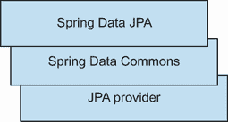
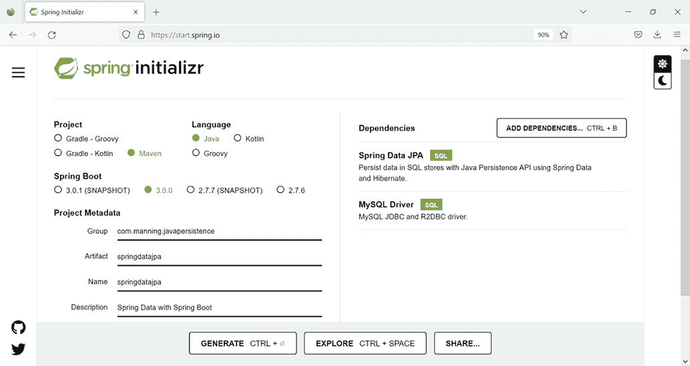
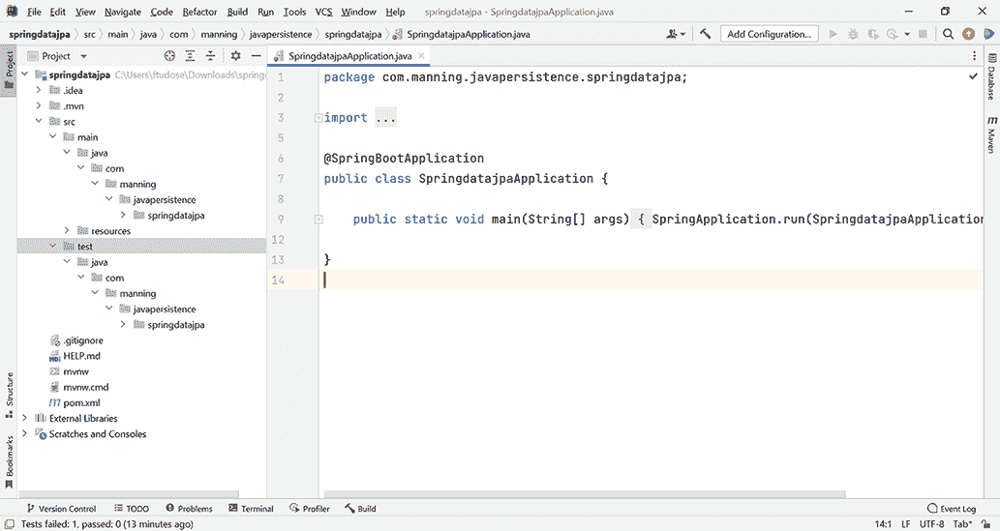

# 4 使用 Spring Data JPA 进行工作

本章涵盖了

+   介绍 Spring Data 及其模块

+   检查 Spring Data JPA 的主要概念

+   调查查询构建器机制

+   检查投影、修改和删除查询

+   检查基于示例的查询

Spring Data 是一个包含许多针对各种数据库的特定项目的伞形项目。这些项目是与创建数据库技术的公司合作开发的。Spring Data 的目标是提供数据访问的抽象，同时保留各种数据存储的底层细节。

我们将讨论 Spring Data 提供的以下一般功能：

+   通过 JavaConfig 和 XML 配置与 Spring 集成

+   存储库和自定义对象映射抽象

+   通过自定义存储库代码进行集成

+   根据存储库方法名称动态创建查询

+   与其他 Spring 项目（如 Spring Boot）集成

我们在第二章中列出了主要的 Spring Data 模块。在这里，我们将重点关注 Spring Data JPA，它主要用作从 Java 程序访问数据库的替代方案。它在一个 JPA 提供商（如 Hibernate）之上提供了一层抽象，遵循 Spring 框架的精神，控制配置和事务管理。我们将在接下来的章节中的许多示例中使用它来与数据库交互，因此本章将深入分析其功能。我们仍然将使用 JPA 和 Hibernate 定义和管理我们的实体，但我们将提供 Spring Data JPA 作为与之交互的替代方案。

## 4.1 介绍 Spring Data JPA

Spring Data JPA 提供了与 JPA 存储库交互的支持。如图 4.1 所示，它建立在 Spring Data Commons 项目和 JPA 提供商（在我们的例子中是 Hibernate）的功能之上。要回顾主要的 Spring Data 模块，请参阅第二章。



图 4.1 Spring Data JPA 是建立在 Spring Data Commons 和 JPA 提供商之上的。

在整本书中，我们将使用 Hibernate JPA 和 Spring Data 作为替代方案来与数据库交互。本章以及第 1-3 章提供的背景信息将帮助您开始使用 Spring Data JPA 最重要的功能。当需要时，我们将进一步检查 Spring Data JPA 的功能，并在各自的章节中查看其他 Spring Data 项目。

正如您在 2.6 节中创建“Hello World”应用程序时所见，Spring Data JPA 可以做几件事情来简化与数据库的交互：

+   配置数据源 Bean

+   配置实体管理器工厂 Bean

+   配置事务管理器 Bean

+   通过注解管理事务

## 4.2 开始一个新的 Spring Data JPA 项目

我们将使用在第三章中介绍的 CaveatEmptor 示例应用程序来演示和分析 Spring Data JPA 的功能。我们将使用 Spring Data JPA 作为持久化框架来管理和持久化 CaveatEmptor 用户，Hibernate JPA 作为底层的 JPA 提供者。Spring Data JPA 可以对数据库执行 CRUD 操作和查询，并且它可以由不同的 JPA 实现支持。它提供了另一层抽象来与数据库交互。

注意：要能够执行源代码中的示例，您首先需要运行 Ch04.sql 脚本。源代码位于 `springdatajpa` 文件夹中。

我们将创建一个 Spring Boot 应用程序来使用 Spring Data JPA。为此，我们将使用 [`start.spring.io/`](https://start.spring.io/) 网站的 Spring Initializr 创建一个具有以下特性的新 Spring Boot 项目（见图 4.2）：

+   组：com.manning.javapersistence

+   工件：springdatajpa

+   描述：Spring Data 与 Spring Boot



图 4.2 使用 Spring Data JPA 和 MySQL 创建新的 Spring Boot 项目

我们还将添加以下依赖项：

+   Spring Data JPA（这将在 Maven pom.xml 文件中添加 `spring-boot-starter-data-jpa`）

+   MySQL 驱动程序（这将在 Maven pom.xml 文件中添加 `mysql-connector-java`）

在您点击生成按钮（如图 4.2 所示）后，Spring Initializr 网站将提供一个要下载的存档。此存档包含一个使用 Spring Data JPA 和 MySQL 的 Spring Boot 项目。图 4.3 显示了在 IntelliJ IDEA IDE 中打开的此项目。



图 4.3 打开使用 Spring Data JPA 和 MySQL 的 Spring Boot 项目

项目的骨架包含四个文件：

+   `SpringDataJpaApplication` 包含一个骨架 `main` 方法。

+   `SpringDataJpaApplicationTests` 包含一个骨架测试方法。

+   `application.properties` 在开始时为空。

+   `pom.xml` 包含 Maven 需要的管理信息。

由于前三个文件是标准文件，我们现在将更详细地查看 Spring Initializr 生成的 pom.xml 文件。

列表 4.1 Maven 文件 pom.xml

```
Path: Ch04/springdatajpa/pom.xml

<parent>                                                               Ⓐ
   <groupId>org.springframework.boot</groupId>                         Ⓐ
   <artifactId>spring-boot-starter-parent</artifactId>                 Ⓐ
   <version>2.7.0</version>                                            Ⓐ
   <relativePath/> <!-- lookup parent from repository -->              Ⓐ
</parent>                                                              Ⓐ
<groupId>com.manning.javapersistence</groupId>                         Ⓑ
<artifactId>springdatajpa</artifactId>                                 Ⓑ
<version>0.0.1-SNAPSHOT</version>                                      Ⓑ
<name>springdatajpa</name>                                             Ⓑ
<description>Spring Data with Spring Boot</description>                Ⓑ
<properties>                                                           Ⓑ
   <java.version>17</java.version>                                     Ⓑ
</properties>                                                          Ⓑ
<dependencies>
   <dependency>                                                        Ⓒ
      <groupId>org.springframework.boot</groupId>                      Ⓒ
      <artifactId>spring-boot-starter-data-jpa</artifactId>            Ⓒ
   </dependency>                                                       Ⓒ

   <dependency>                                                        Ⓓ
      <groupId>mysql</groupId>                                         Ⓓ
      <artifactId>mysql-connector-java</artifactId>                    Ⓓ
      <scope>runtime</scope>                                           Ⓓ
   </dependency>                                                       Ⓓ
   <dependency>                                                        Ⓔ
      <groupId>org.springframework.boot</groupId>                      Ⓔ
      <artifactId>spring-boot-starter-test</artifactId>                Ⓔ
      <scope>test</scope>                                              Ⓔ
   </dependency>                                                       Ⓔ
</dependencies>

<build>
   <plugins>
      <plugin>                                                         Ⓕ
         <groupId>org.springframework.boot</groupId>                   Ⓕ
         <artifactId>spring-boot-maven-plugin</artifactId>             Ⓕ
      </plugin>                                                        Ⓕ
   </plugins>
</build>
```

Ⓐ 父 POM 是 `spring-boot-starter-parent`。此父项目为 Maven 应用程序提供默认配置、依赖项和插件管理。它还从其父项目 `spring-boot-dependencies` 继承依赖项管理。

Ⓑ 表示项目的 `groupId`、`artifactId`、`version`、`name` 和 `description`，以及 Java 版本。

Ⓒ `spring-boot-starter-data-jpa` 是 Spring Boot 用于通过 Spring Data JPA 连接到关系数据库的启动依赖项。它使用 Hibernate 作为传递依赖项。

Ⓓ `mysql-connector-java` 是 MySQL 的 JDBC 驱动程序。它是一个运行时依赖项，表示在编译时不需在类路径中，但仅在运行时需要。

Ⓔ `spring-boot-starter-test` 是用于测试的 Spring Boot 启动依赖项。这个依赖项仅在测试编译和执行阶段需要。

Ⓕ `spring-boot-maven-plugin` 是用于构建和运行 Spring Boot 项目的实用插件。

## 4.3 配置 Spring Data JPA 项目的第一步

我们现在将编写描述 `User` 实体的类。CaveatEmptor 应用程序必须跟踪与之交互的用户，因此自然地要从实现这个类开始。

列表 4.2 `User` 实体

```
Path: Ch04/springdatajpa/src/main/java/com/manning/javapersistence
➥ /springdatajpa/model/User.java

@Entity                                                                 Ⓐ
@Table(name = "USERS")                                                  Ⓐ
public class User {                                                     Ⓐ

    @Id                                                                 Ⓑ
    @GeneratedValue                                                     Ⓑ
    private Long id;                                                    Ⓑ

    private String username;                                            Ⓒ

    private LocalDate registrationDate;                                 Ⓒ

    public User() {                                               

    }                                                                   Ⓓ

    public User(String username) {                                      Ⓓ
        this.username = username;                                       Ⓓ
    }                                                                   Ⓓ

    public User(String username, LocalDate registrationDate) {          Ⓓ
        this.username = username;                                       Ⓓ
        this.registrationDate = registrationDate;                       Ⓓ
    }                                                                   Ⓓ

    public Long getId() {                                               Ⓔ
        return id;                                                      Ⓔ
    }                                                                   Ⓔ

    public String getUsername() {                                       Ⓕ
        return username;                                                Ⓕ
    }                                                                   Ⓕ

    public void setUsername(String username) {                          Ⓕ
        this.username = username;                                       Ⓕ
    }                                                                   Ⓕ

    public LocalDate getRegistrationDate() {                            Ⓕ
        return registrationDate;                                        Ⓕ
    }                                                                   Ⓕ

    public void setRegistrationDate(LocalDate registrationDate) {       Ⓕ
        this.registrationDate = registrationDate;                       Ⓕ
    }                                                                   Ⓕ

    @Override                                                           Ⓖ
    public String toString() {                                          Ⓖ
        return "User{" +                                                Ⓖ
                "id=" + id +                                            Ⓖ
                ", username='" + username + '\'' +                      Ⓖ
                ", registrationDate=" + registrationDate +              Ⓖ
                '}';                                                    Ⓖ
    }                                                                   Ⓖ
}
```

Ⓐ 创建 `User` 实体并使用 `@Entity` 和 `@Table` 注解进行标注。我们指定 `USERS` 作为对应表的名称，因为大多数数据库系统中默认的 `USER` 名称已被保留。

Ⓑ 将 `id` 字段指定为主键，并包含一个获取器。`@GeneratedValue` 注解可以启用 `id` 的自动生成。我们将在第五章中更详细地介绍这一点。

Ⓒ 声明 `username` 和 `registrationDate` 字段，以及相应的获取器和设置器。

Ⓓ 声明三个构造函数，包括一个无参构造函数。回想一下，JPA 要求每个持久化类都必须有一个无参构造函数。JPA 使用 Java 反射 API 在这样的无参构造函数上创建实例。

Ⓔ 创建 `toString` 方法以优雅地显示 `User` 类的实例。

Ⓕ `spring-boot-starter-test` 是用于测试的 Spring Boot 启动依赖项。这个依赖项仅在测试编译和执行阶段需要。

Ⓖ `spring-boot-maven-plugin` 是用于构建和运行 Spring Boot 项目的实用插件。

我们还将创建 `UserRepository` 接口。

列表 4.3 `UserRepository` 接口

```
Path: Ch04/springdatajpa/src/main/java/com/manning/javapersistence
➥ /springdatajpa/repositories/UserRepository.java

public interface UserRepository extends CrudRepository<User, Long> {
}
```

`UserRepository` 接口扩展了 `CrudRepository<User, Long>`。这意味着它是一个 `User` 实体仓库，这些实体具有 `Long` 类型的标识符。记住，`User` 类有一个类型为 `Long` 并被 `@Id` 注解的 `id` 字段。我们可以直接调用从 `CrudRepository` 继承的方法，如 `save`、`findAll` 和 `findById`，并且我们可以不提供任何额外信息来执行对数据库的常规操作。Spring Data JPA 将创建一个实现 `UserRepository` 接口的代理类并实现其方法。

值得注意的是，`CrudRepository` 是一种通用的技术无关的持久化接口，我们不仅可以用于 JPA/关系数据库，还可以用于 NoSQL 数据库。例如，我们可以通过更改依赖项从原始的 `spring-boot-starter-data-jpa` 到 `spring-boot-starter-data-mongodb`，轻松地将数据库从 MySQL 更改为 MongoDB，而无需触及实现。

下一步将是填写 Spring Boot 的 `application.properties` 文件。Spring Boot 会自动从类路径中查找并加载 `application.properties` 文件；Maven 会将 `src/main/resources` 文件夹添加到类路径中。

列表 4.4 `application.properties` 文件

```
Path: Ch04/springdatajpa/src/main/resources/application.properties

spring.datasource.url=jdbc:mysql://localhost:3306/CH04_SPRINGDATAJPA        Ⓐ
                      ?serverTimezone=UTC                                   Ⓐ
spring.datasource.username=root                                             Ⓑ
spring.datasource.password=                                                 Ⓑ
spring.jpa.properties.hibernate.dialect=org.hibernate.dialect.MySQL8Dialect Ⓒ
spring.jpa.show-sql=true                                                    Ⓓ
spring.jpa.hibernate.ddl-auto=create                                        Ⓔ
```

Ⓐ `application.properties`文件将指示数据库的 URL。

Ⓑ 用户名，没有密码用于访问。

Ⓒ Hibernate 方言是 MySQL8，因为我们将要交互的数据库是 MySQL Release 8.0。

Ⓓ 在执行过程中，会显示 SQL 代码。

Ⓔ 每次程序执行时，数据库都会从头创建。

现在，我们将编写代码将两个用户保存到数据库中，然后尝试查找它们。

列表 4.5 持久化和查找`User`实体

```
Path: Ch04/springdatajpa/src/main/java/com/manning/javapersistence
➥ /springdatajpa/SpringDataJpaApplication.java

@SpringBootApplication                                                     Ⓐ
public class SpringDataJpaApplication {

   public static void main(String[] args) {
      SpringApplication.run(SpringDataJpaApplication.class, args);         Ⓑ
   }

   @Bean                                                                   Ⓒ
   public ApplicationRunner configure(UserRepository userRepository) {     Ⓒ
      return env ->
      {
         User user1 = new User("beth", LocalDate.of(2020, 
         ➥ Month.AUGUST, 3)); 
         User user2 = new User("mike",                                     Ⓓ
                               LocalDate.of(2020, Month.JANUARY, 18));     Ⓓ

         userRepository.save(user1);                                       Ⓔ
         userRepository.save(user2);                                       Ⓔ

         userRepository.findAll().forEach(System.out::println);            Ⓕ
      };
   }

}
```

Ⓐ 由 Spring Boot 添加到包含`main`方法的类上的`@SpringBootApplication`注解将启用 Spring Boot 自动配置机制，并扫描应用程序所在的包，同时允许在上下文中注册额外的 bean。

Ⓑ `SpringApplication.run`将从`main`方法中加载独立的 Spring 应用程序。它将创建一个适当的`ApplicationContext`实例并加载 bean。

Ⓒ Spring Boot 将在`SpringApplication.run()`完成之前运行被`@Bean`注解的方法，返回一个`ApplicationRunner`。

Ⓓ 创建两个用户。

Ⓔ 将它们保存到数据库中。

Ⓕ 检索它们并显示它们的信息。

当我们运行此应用程序时，我们会得到以下输出（由`User`类的`toString()`方法的工作方式决定）：

```
User{id=1, username='beth', registrationDate=2020-08-03}
User{id=2, username='mike', registrationDate=2020-01-18}
```

## 4.4 使用 Spring Data JPA 定义查询方法

我们将通过添加字段`email`、`level`和`active`来扩展`User`类。用户可能有不同的级别，这将允许他们执行特定的操作（例如，在某个金额以上出价）。用户可能是活跃的，也可能是退休的（以前在 CaveatEmptor 拍卖系统中是活跃的，但不再是）。这是 CaveatEmptor 应用程序需要保留关于其用户的重要信息。

注意：本章余下部分讨论的源代码可以在`springdatajpa2`文件夹中找到。

列表 4.6 修改后的`User`类

```
Path: Ch04/springdatajpa2/src/main/java/com/manning/javapersistence
➥ /springdatajpa/model/User.java

@Entity
@Table(name = "USERS")
public class User {

    @Id
    @GeneratedValue
    private Long id;

    private String username;

    private LocalDate registrationDate;

    private String email;

    private int level;

    private boolean active;

    public User() {

    }

    public User(String username) {
        this.username = username;
    }

    public User(String username, LocalDate registrationDate) {
        this.username = username;
        this.registrationDate = registrationDate;
    }

    //getters and setters
}
```

现在，我们将开始向`UserRepository`接口添加新方法，并在新创建的测试中使用它们。我们将把`UserRepository`接口改为扩展`JpaRepository`而不是`CrudRepository`。`JpaRepository`扩展了`PagingAndSortingRepository`，而`PagingAndSortingRepository`又扩展了`CrudRepository`。

`CrudRepository`提供了基本的 CRUD 功能，而`PagingAndSortingRepository`提供了方便的方法来排序和分页记录（我们将在本章后面讨论）。`JpaRepository`提供了与 JPA 相关的功能，例如刷新持久化上下文和批量删除记录。此外，`JpaRepository`覆盖了`CrudRepository`的一些方法，例如`findAll`、`findAllById`和`saveAll`，以返回`List`而不是`Iterable`。

我们还将向`UserRepository`接口添加一系列查询方法，如下所示

列表 4.7 带有新方法的`UserRepository`接口

```
Path: Ch04/springdatajpa2/src/main/java/com/manning/javapersistence
➥ /springdatajpa/repositories/UserRepository.java

public interface UserRepository extends JpaRepository<User, Long> {

   User findByUsername(String username);
   List<User> findAllByOrderByUsernameAsc();
   List<User> findByRegistrationDateBetween(LocalDate start, 
   ➥ LocalDate end);
List<User> findByUsernameAndEmail(String username, String email);
List<User> findByUsernameOrEmail(String username, String email);
List<User> findByUsernameIgnoreCase(String username);
List<User> findByLevelOrderByUsernameDesc(int level);
List<User> findByLevelGreaterThanEqual(int level);
List<User> findByUsernameContaining(String text);
List<User> findByUsernameLike(String text);
List<User> findByUsernameStartingWith(String start);
List<User> findByUsernameEndingWith(String end);
List<User> findByActive(boolean active);
List<User> findByRegistrationDateIn(Collection<LocalDate> dates);
List<User> findByRegistrationDateNotIn(Collection<LocalDate> dates);

}
```

这些查询方法的目的是从数据库中检索信息。Spring Data JPA 提供了一个查询构建器机制，它将根据方法名称创建仓库方法的操作。稍后我们将探讨修改查询，这些查询会修改它们找到的数据；现在，我们将专注于那些旨在查找信息的查询。此查询机制从方法名称中移除了 `find...By`、`get...By`、`query...By`、`read...By` 和 `count...By` 等前缀和后缀，并解析剩余的部分。

你可以将包含表达式的函数声明为 `Distinct` 以设置一个唯一子句；将运算符声明为 `LessThan`、`GreaterThan`、`Between` 或 `Like`；或者使用 `And` 或 `Or` 声明复合条件。你可以在查询方法的名称中使用 `OrderBy` 子句进行静态排序，引用一个属性并提供排序方向（`Asc` 或 `Desc`）。对于支持此类子句的属性，你可以使用 `IgnoreCase`。对于删除行，你必须在方法名称中将 `find` 替换为 `delete`。此外，Spring Data JPA 将检查方法的返回类型。如果你想找到一个 `User` 并将其返回在 `Optional` 容器中，方法返回类型将是 `Optional<User>`。可能的返回类型完整列表及其详细说明可以在 Spring Data JPA 参考文档的附录 D 中找到（[`mng.bz/o51y`](http://mng.bz/o51y)）。

方法名称需要遵循规则。如果方法命名错误（例如，查询方法中的实体属性不匹配），则在加载应用程序上下文时将会出现错误。表 4.1 描述了 Spring Data JPA 支持的基本关键字以及每个方法名称如何在 JPQL 中转换。对于更完整的列表，请参阅本书末尾的附录 B。

表 4.1 Spring Data JPA 关键字及其生成的 JPQL

| 关键字 | 示例 | 生成的 JPQL |
| --- | --- | --- |
| `Is,` `Equals` | `findByUsername` | `findByUsernameIs` | `findByUsernameEquals` | ` . . .` `where e.username = ?1` |
| `And` | `findByUsernameAndRegistrationDate` | ` . . .` `where e.username = ?1 and e.registrationdate = ?2` |
| `Or` | `findByUsernameOrRegistrationDate` | ` . . .` `where e.username = ?1 or e.registrationdate = ?2` |
| `LessThan` | `findByRegistrationDateLessThan` | ` . . .` `where e.registrationdate < ?1` |
| `LessThanEqual` | `findByRegistrationDateLessThanEqual` | ` . . .` `where e.registrationdate <= ?1` |
| `GreaterThan` | `findByRegistrationDateGreaterThan` | ` . . .` `where e.registrationdate > ?1` |
| `GreaterThanEqual` | `findByRegistrationDateGreaterThanEqual` | ` . . .` `where e.registrationdate >= ?1` |
| `Between` | `findByRegistrationDateBetween` | ` . . .` `where e.registrationdate between ?1 and ?2` |
| `OrderBy` | `findByRegistrationDateOrderByUsernameDesc` | ` . . .` `where e.registrationdate = ?1 order by e.username desc` |
| `Like` | `findByUsernameLike` | ` . . .  where e.username like ?1` |
| `NotLike` | `findByUsernameNotLike` | ` . . .  where e.username not like ?1` |
| `Before` | `findByRegistrationDateBefore` | ` . . .  where e.registrationdate < ?1` |
| `After` | `findByRegistrationDateAfter` | ` . . .  where e.registrationdate > ?1` |
| `Null,` `IsNull` | `findByRegistrationDate(Is)Null` | ` . . .  where e.registrationdate is null` |
| `NotNull,` `IsNotNull` | `findByRegistrationDate(Is)NotNull` | ` . . .  where e.registrationdate is not null` |
| `Not` | `findByUsernameNot` | ` . . .  where e.username <> ?1` |

作为未来测试的基础类，我们将编写一个`SpringDataJpaApplicationTests`抽象类。

列表 4.8 `SpringDataJpaApplicationTests`抽象类

```
Path: Ch04/springdatajpa2/src/test/java/com/manning/javapersistence
➥ /springdatajpa/SpringDataJpaApplicationTests.java

@SpringBootTest                                                   Ⓐ
@TestInstance(TestInstance.Lifecycle.PER_CLASS)                   Ⓑ
abstract class SpringDataJpaApplicationTests {
    @Autowired                                                    Ⓒ
    UserRepository userRepository;                                Ⓒ

    @BeforeAll                                                    Ⓓ
    void beforeAll() {                                            Ⓓ
        userRepository.saveAll(generateUsers());                  Ⓓ
    }                                                             Ⓓ

    private static List<User> generateUsers() {                     
        List<User> users = new ArrayList<>();

        User john = new User("john", LocalDate.of(2020, Month.APRIL, 13));
        john.setEmail("john@somedomain.com");
        john.setLevel(1);
        john.setActive(true);

        //create and set a total of 10 users

        users.add(john);
        //add a total of 10 users to the list

        return users;
    }

    @AfterAll                                                     Ⓔ
    void afterAll() {                                             Ⓔ
        userRepository.deleteAll();                               Ⓔ
    }                                                             Ⓔ

}
```

Ⓐ Spring Boot 通过添加到最初创建的类的`@SpringBootTest`注解，告诉 Spring Boot 搜索主配置类（例如，`@SpringBootApplication`注解的类）并创建用于测试的`ApplicationContext`。回想一下，Spring Boot 添加到包含`main`方法的类的`@SpringBootApplication`注解将启用 Spring Boot 自动配置机制，启用对应用程序所在包的扫描，并允许在上下文中注册额外的 bean。

Ⓑ 使用`@TestInstance(TestInstance.Lifecycle.PER_CLASS)`注解，我们请求 JUnit 5 创建一个测试类的单个实例，并为其所有测试方法重用它。这将允许我们将`@BeforeAll`和`@AfterAll`注解的方法设置为非静态，并直接在它们内部使用自动装配的`UserRepository`实例字段。

Ⓒ 自动装配一个`UserRepository`实例。这种自动装配是由于`@SpringBootApplication`注解，它启用了对应用程序所在包的扫描并在上下文中注册了 bean。

Ⓓ `@BeforeAll`注解的方法将在执行扩展`SpringDataJpaApplicationTests`的类的所有测试之前执行一次。此方法将不是静态的（见Ⓑ以上）。

Ⓔ `@AfterAll`注解的方法将在执行扩展`SpringDataJpaApplicationTests`的类的所有测试之后执行一次。此方法将不是静态的（见Ⓑ以上）。

下一个测试将扩展此类并使用已填充的数据库。为了测试现在属于`UserRepository`的方法，我们将创建`FindUsersUsingQueriesTest`类，并遵循相同的测试编写方法：调用仓库方法并验证其结果。

列表 4.9 `FindUsersUsingQueriesTest`类

```
Path: Ch04/springdatajpa2/src/test/java/com/manning/javapersistence
➥ /springdatajpa/FindUsersUsingQueriesTest.java

public class FindUsersUsingQueriesTest extends 
➥ SpringDataJpaApplicationTests {

    @Test
    void testFindAll() {
        List<User> users = userRepository.findAll();
        assertEquals(10, users.size());
    }

    @Test
    void testFindUser() {
        User beth = userRepository.findByUsername("beth");
        assertEquals("beth", beth.getUsername());
    }

    @Test
    void testFindAllByOrderByUsernameAsc() {
        List<User> users = userRepository.findAllByOrderByUsernameAsc();
        assertAll(() -> assertEquals(10, users.size()),
                () -> assertEquals("beth", users.get(0).getUsername()),
                () -> assertEquals("stephanie",
                       users.get(users.size() - 1).getUsername()));
    }

    @Test
    void testFindByRegistrationDateBetween() {
        List<User> users = userRepository.findByRegistrationDateBetween(
                LocalDate.of(2020, Month.JULY, 1),
                LocalDate.of(2020, Month.DECEMBER, 31));
        assertEquals(4, users.size());
    }

    //more tests
}
```

## 4.5 限制查询结果、排序和分页

`first`和`top`关键字（等效使用）可以限制查询方法的结果。`top`和`first`关键字后面可以跟一个可选的数值，表示要返回的最大结果大小。如果此数值缺失，则结果大小为 1。

`Pageable` 是一个分页信息的接口，但在实践中我们使用实现它的 `PageRequest` 类。这个类可以指定页码、页面大小和排序标准。

我们将把列表 4.10 中显示的方法添加到 `UserRepository` 接口。

列表 4.10 限制查询结果、排序和分页

```
Path: Ch04/springdatajpa2/src/main/java/com/manning/javapersistence
➥ /springdatajpa/repositories/UserRepository.java

User findFirstByOrderByUsernameAsc();
User findTopByOrderByRegistrationDateDesc();
Page<User> findAll(Pageable pageable);
List<User> findFirst2ByLevel(int level, Sort sort);
List<User> findByLevel(int level, Sort sort);
List<User> findByActive(boolean active, Pageable pageable);
```

接下来我们将编写以下测试来验证这些新添加的方法的工作情况。

列表 4.11 测试限制查询结果、排序和分页

```
Path: Ch04/springdatajpa2/src/test/java/com/manning/javapersistence
➥ /springdatajpa/FindUsersSortingAndPagingTest.java

public class FindUsersSortingAndPagingTest extends
             SpringDataJpaApplicationTests {

    @Test
    void testOrder() {

        User user1 = userRepository.findFirstByOrderByUsernameAsc();        Ⓐ
        User user2 = userRepository.findTopByOrderByRegistrationDateDesc(); Ⓐ
        Page<User> userPage = userRepository.findAll(PageRequest.of(1, 3)); Ⓑ
        List<User> users = userRepository.findFirst2ByLevel(2,              Ⓒ
                                          Sort.by("registrationDate"));     Ⓒ

        assertAll(
                () -> assertEquals("beth", user1.getUsername()),
                () -> assertEquals("julius", user2.getUsername()),
                () -> assertEquals(2, users.size()),
                () -> assertEquals(3, userPage.getSize()),
                () -> assertEquals("beth", users.get(0).getUsername()),
                () -> assertEquals("marion", users.get(1).getUsername())
        );

    }

    @Test
    void testFindByLevel() {
        Sort.TypedSort<User> user = Sort.sort(User.class);                  Ⓓ

        List<User> users = userRepository.findByLevel(3,                    Ⓔ
                   user.by(User::getRegistrationDate).descending());        Ⓔ
        assertAll(
                () -> assertEquals(2, users.size()),
                () -> assertEquals("james", users.get(0).getUsername())
        );

    }

    @Test
    void testFindByActive() {
        List<User> users = userRepository.findByActive(true,                Ⓕ
                   PageRequest.of(1, 4, Sort.by("registrationDate")));      Ⓕ
        assertAll(
                () -> assertEquals(4, users.size()),
                () -> assertEquals("burk", users.get(0).getUsername())
        );

    }
}
```

Ⓐ 第一个测试将按用户名的升序查找第一个用户，按注册日期的降序查找第二个用户。

Ⓑ 查找所有用户，将它们分成页面，并返回第 1 页，大小为 3（页码从 0 开始）。

Ⓒ 查找前两个 2 级用户，并按注册日期排序。

Ⓓ 第二个测试将在 `User` 类上定义一个排序标准。`Sort.TypedSort` 扩展 `Sort` 并可以使用方法句柄来定义排序的属性。

Ⓔ 查找 3 级用户并按注册日期降序排序。

Ⓕ 第三个测试将按注册日期查找活跃用户，将它们分成页面，并返回第 1 页，大小为 4（页码从 0 开始）。

## 4.6 流式传输结果

返回多个结果的查询方法可以使用标准的 Java 接口，如 `Iterable`、`List`、`Set`。此外，Spring Data 支持 `Streamable`，它可以作为 `Iterable` 或任何集合类型的替代品。您可以连接 `Streamable`s 并直接过滤和映射元素。

我们将把以下方法添加到 `UserRepository` 接口。

列表 4.12 在 `UserRepository` 接口中添加返回 `Streamable` 的方法

```
Path: Ch04/springdatajpa2/src/main/java/com/manning/javapersistence
➥ /springdatajpa/repositories/UserRepository.java

Streamable<User> findByEmailContaining(String text);
Streamable<User> findByLevel(int level);
```

我们将编写以下测试来验证这些新添加的方法是否工作。

列表 4.13 测试返回 `Streamable` 的方法

```
Path: Ch04/springdatajpa2/src/test/java/com/manning/javapersistence
➥ /springdatajpa/QueryResultsTest.java

@Test
void testStreamable() {
    try(Stream<User> result =                                       Ⓐ
           userRepository.findByEmailContaining("someother")        Ⓐ
            .and(userRepository.findByLevel(2))                     Ⓑ
            .stream().distinct())  {                                Ⓒ
      assertEquals(6, result.count());                              Ⓓ
   }
}
```

Ⓐ 测试将调用 `findByEmailContaining` 方法，搜索包含“someother”的电子邮件。

Ⓑ 测试将把生成的 `Streamable` 与提供 2 级用户的 `Streamable` 连接起来。

Ⓒ 它将把这个转换成一个流，并保留不同的用户。这个流作为 `try` 块的资源，所以它将被自动关闭。另一种选择是显式调用 `close()` 方法。否则，流将保持与数据库的底层连接。

Ⓓ 确保生成的流包含六个用户。

## 4.7 @Query 注解

使用 `@Query` 注解，您可以在方法上创建一个查询，然后在该查询上编写自定义查询。当您使用 `@Query` 注解时，方法名称不需要遵循任何命名约定。自定义查询可以是参数化的，可以通过位置或名称标识参数，并在查询中使用 `@Param` 注解绑定这些名称。`@Query` 注解可以生成带有 `nativeQuery` 标志设置为 `true` 的本地查询。然而，您应该意识到，本地查询可能会影响应用程序的可移植性。为了排序结果，您可以使用 `Sort` 对象。您排序的属性必须解析为查询属性或查询别名。

Spring Data JPA 支持在 `@Query` 注解定义的查询中使用 Spring 表达式语言 (SpEL) 表达式，并且 Spring Data JPA 支持使用 `entityName` 变量。在一个如 `select e from #{#entityName} e` 的查询中，`entityName` 的解析基于 `@Entity` 注解。在我们的情况下，在 `UserRepository extends JpaRepository<User, Long>` 中，`entityName` 将解析为 `User`。

我们将在 `UserRepository` 接口中添加以下方法。

列表 4.14 限制查询结果、排序和分页

```
Path: Ch04/springdatajpa2/src/main/java/com/manning/javapersistence
➥ /springdatajpa/repositories/UserRepository.java

@Query("select count(u) from User u where u.active = ?1")                Ⓐ
int findNumberOfUsersByActivity(boolean active);                         Ⓐ

@Query("select u from User u where u.level = :level 
➥ and u.active = :active") 
List<User> findByLevelAndActive(@Param("level") int level,               Ⓑ
                               @Param("active") boolean active);         Ⓑ

@Query(value = "SELECT COUNT(*) FROM USERS WHERE ACTIVE = ?1",           Ⓒ
                nativeQuery = true)                                      Ⓒ
int findNumberOfUsersByActivityNative(boolean active);                   Ⓒ

@Query("select u.username, LENGTH(u.email) as email_length from          Ⓓ
        #{#entityName} u where u.username like %?1%")                    Ⓓ
List<Object[]> findByAsArrayAndSort(String text, Sort sort);             Ⓓ
```

Ⓐ `findNumberOfUsersByActivity` 方法将返回活跃用户数量。

Ⓑ `findByLevelAndActive` 方法将返回具有指定 `level` 和 `active` 状态的用户。`@Param` 注解将查询中的 `:level` 参数与方法的 `level` 参数匹配，将查询中的 `:active` 参数与方法的 `active` 参数匹配。这在您更改参数顺序时特别有用，因为此时查询尚未更新。

Ⓒ `findNumberOfUsersByActivityNative` 方法将返回具有给定 `active` 状态的用户数量。将 `nativeQuery` 标志设置为 `true` 表示，与之前使用 JPQL 编写的查询不同，此查询使用的是针对特定数据库的本地 SQL。

Ⓓ `findByAsArrayAndSort` 方法将返回一个数组列表，每个数组包含 `username` 和 `email` 的长度，在根据 `username` 过滤后。第二个 `Sort` 参数将允许您根据不同的标准对查询结果进行排序。

我们将为这些查询方法编写测试，这些测试相当直接。我们只讨论为第四个查询方法编写的测试，该测试允许对排序标准进行一些变化。

列表 4.15 测试查询方法

```
Path: Ch04/springdatajpa2/src/test/java/com/manning/javapersistence
➥ /springdatajpa/QueryResultsTest.java

public class QueryResultsTest extends SpringDataJpaApplicationTests {

    // testing the first 3 query methods

    @Test
    void testFindByAsArrayAndSort() {
        List<Object[]> usersList1 =                                         Ⓐ
           userRepository.findByAsArrayAndSort("ar", Sort.by("username"));  Ⓐ
        List<Object[]> usersList2 =                                         Ⓑ
           userRepository.findByAsArrayAndSort("ar",                        Ⓑ
               Sort.by("email_length").descending());                       Ⓑ
        List<Object[]> usersList3 = userRepository.findByAsArrayAndSort(    Ⓒ
               "ar", JpaSort.unsafe("LENGTH(u.email)"));                    Ⓒ
        assertAll(
                () -> assertEquals(2, usersList1.size()),
                () -> assertEquals("darren", usersList1.get(0)[0]),
                () -> assertEquals(21, usersList1.get(0)[1]),
                () -> assertEquals(2, usersList2.size()),
                () -> assertEquals("marion", usersList2.get(0)[0]),
                () -> assertEquals(26, usersList2.get(0)[1]),
                () -> assertEquals(2, usersList3.size()),
                () -> assertEquals("darren", usersList3.get(0)[0]),
                () -> assertEquals(21, usersList3.get(0)[1])
        );
    }
}
```

Ⓐ `findByAsArrayAndSort` 方法将返回用户名中包含 `%ar%` 的用户，并将它们按 `username` 排序。

Ⓑ `findByAsArrayAndSort` 方法将返回用户名中包含 `%ar%` 的用户，并将它们按 `email_length` 降序排序。请注意，需要将 `email_length` 别名指定在查询内部，以便用于排序。

Ⓒ `findByAsArrayAndSort`方法将返回`username`字段类似于`%ar%`的用户，并将它们按`LENGTH(u.email)`排序。`JpaSort`是一个扩展了`Sort`的类，它可以用于排序，除了属性引用和别名之外，还可以使用其他内容。`unsafe`属性处理意味着提供的字符串不一定是属性或别名，但可以是查询中的任意表达式。

如果任何遵循 Spring Data JPA 命名约定（例如，查询方法中的实体属性不匹配）的前置方法命名错误，则在加载应用程序上下文时将得到错误。如果你使用`@Query`注解，并且你编写的查询错误，则在执行该方法时将在运行时得到错误。因此，`@Query`注解的方法更加灵活，但它们也提供了更少的安全性。

## 4.8 投影

实体的不是所有属性都是始终需要的，所以我们有时可能只访问其中的一些。例如，前端可能会减少 I/O，只显示对最终用户感兴趣的信息。因此，你可能会想基于那些实体的某些属性创建投影，而不是返回由存储库管理的根实体实例。Spring Data JPA 可以调整返回类型，以选择性地返回实体的属性。

基于接口的投影需要创建一个接口，该接口声明了要包含在投影中的属性的 getter 方法。这样的接口也可以使用`@Value`注解和 SpEL 表达式计算特定值。通过在运行时执行查询，执行引擎为每个返回的元素创建接口的代理实例，并将对公开方法的调用转发到目标对象。

我们将创建一个`Projection`类，并将`UserSummary`作为一个嵌套接口添加。我们将对投影进行分组，因为它们在逻辑上是相互关联的。

列表 4.16 基于接口的投影

```
Path: Ch04/springdatajpa2/src/main/java/com/manning/javapersistence
➥ /springdatajpa/model/Projection.java

public class Projection {

    public interface UserSummary {

        String getUsername();                             Ⓐ

        @Value("#{target.username} #{target.email}")      Ⓑ
        String getInfo();                                 Ⓑ

    }
}
```

Ⓐ `getUsername`方法将返回`username`字段。

Ⓑ `getInfo`方法被`@Value`注解标记，并将返回`username`字段、一个空格和`email`字段的连接。

在实践中我们应该如何处理投影？如果我们只包含像Ⓐ在列表 4.16 中的方法，我们将创建一个封闭投影——这是一个所有 getter 都对应目标实体属性的接口。当你使用封闭投影时，Spring Data JPA 可以通过在开始时就了解投影代理所需的所有属性来优化查询执行。

如果我们包含像Ⓑ这样的方法，我们将创建一个开放投影，这更加灵活。然而，Spring Data JPA 将无法优化查询执行，因为 SpEL 表达式在运行时评估，可能包括实体根的任何属性或属性组合。

通常情况下，当你需要提供有限的信息而不暴露完整实体时，你应该使用投影。出于性能考虑，如果你一开始就知道你想要返回哪些信息，你应该优先选择封闭投影。如果你有一个返回完整对象的查询，而你有一个类似的查询只返回投影，你可以使用不同的命名约定，例如将一个方法命名为`find...By`，另一个方法命名为`get...By`。

基于类的投影需要创建一个数据传输对象（DTO）类，该类声明了要包含在投影中的属性和 getter 方法。使用基于类的投影类似于使用基于接口的投影。然而，Spring Data JPA 不需要为管理投影创建代理类。Spring Data JPA 将实例化声明投影的类，要包含的属性由类的构造函数的参数名称确定。

以下列表将`UsernameOnly`作为`Projection`类的嵌套类添加。

列表 4.17 基于类的投影

```
Path: Ch04/springdatajpa2/src/main/java/com/manning/javapersistence
➥ /springdatajpa/model/Projection.java

public class Projection {

    // . . .

    public static class UsernameOnly {            Ⓐ
        private String username;                  Ⓑ

        public UsernameOnly(String username) {    Ⓒ
            this.username = username;             Ⓒ
        }                                         Ⓒ

        public String getUsername() {             Ⓓ
            return username;                      Ⓓ
        }

    }

}
```

Ⓐ `UsernameOnly`类

Ⓑ `username`字段

Ⓒ 声明的构造函数

Ⓓ 通过 getter 暴露的`username`字段

我们将添加到`UserRepository`接口中的方法将看起来像这些：

```
Path: Ch04/springdatajpa2/src/main/java/com/manning/javapersistence
➥ /springdatajpa/repositories/UserRepository.java

List<Projection.UserSummary> findByRegistrationDateAfter(LocalDate date);
List<Projection.UsernameOnly> findByEmail(String username);
```

这些仓库方法使用了我们在本节之前示例中应用的相同命名约定，并且它们从编译时就知道它们的返回类型是投影类型的集合。然而，我们可以泛化仓库方法的返回类型，这将使它们变得动态。我们将在`UserRepository`接口中添加一个新方法：

```
Path: Ch04/springdatajpa2/src/main/java/com/manning/javapersistence
➥ /springdatajpa/repositories/UserRepository.java

<T> List<T> findByEmail(String username, Class<T> type);
```

我们将使用投影编写这些查询方法的测试。

列表 4.18 使用投影测试查询方法

```
Path: Ch04/springdatajpa2/src/test/java/com/manning/javapersistence
➥ /springdatajpa/ProjectionTest.java

public class ProjectionTest extends SpringDataJpaApplicationTests {

    @Test
    void testProjectionUsername() {

        List<Projection.UsernameOnly> users =                               Ⓐ
            userRepository.findByEmail("john@somedomain.com");              Ⓐ

        assertAll(                                                          Ⓑ
                () -> assertEquals(1, users.size()),                        Ⓑ
                () -> assertEquals("john", users.get(0).getUsername())      Ⓑ
        );                                                                  Ⓑ
    }

    @Test
    void testProjectionUserSummary() {
        List<Projection.UserSummary> users =                                Ⓒ
            userRepository.findByRegistrationDateAfter(                     Ⓒ
                LocalDate.of(2021, Month.FEBRUARY, 1));                     Ⓒ

        assertAll(
                () -> assertEquals(1, users.size()),                        Ⓓ
                () -> assertEquals("julius", users.get(0).getUsername()),   Ⓓ
                () -> assertEquals("julius julius@someotherdomain.com",     Ⓓ
                                   users.get(0).getInfo())                  Ⓓ
        );                                                                  Ⓓ
    }

    @Test
    void testDynamicProjection() {
        List<Projection.UsernameOnly> usernames =                           Ⓔ
                userRepository.findByEmail("mike@somedomain.com",           Ⓔ
                Projection.UsernameOnly.class);                             Ⓔ
        List<User> users = 
        ➥ userRepository.findByEmail("mike@somedomain.com",                Ⓕ
                User.class);                                                Ⓕ

        assertAll(                                                          Ⓖ
                () -> assertEquals(1, usernames.size()),                    Ⓖ
                () -> assertEquals("mike", usernames.get(0).getUsername()), Ⓖ
                () -> assertEquals(1, users.size()),                        Ⓖ
                () -> assertEquals("mike", users.get(0).getUsername())      Ⓖ
        );                                                                 
    }
}
```

Ⓐ `findByEmail`方法将返回一个`Projection.UsernameOnly`实例的列表。

Ⓑ 验证断言。

Ⓒ `findByRegistrationDateAfter`方法将返回一个`Projection.UserSummary`实例的列表。

Ⓓ 验证断言。

Ⓔ 这个`findByEmail`方法提供了一个动态投影。它将返回一个`Projection.UsernameOnly`实例的列表。

Ⓕ 这个`findByEmail`方法也可能返回一个`User`实例的列表，具体取决于它被泛化的类。

Ⓖ 验证断言。

## 4.9 修改查询

您可以使用 `@Modifying` 注解定义修改方法。例如，`INSERT`、`UPDATE` 和 `DELETE` 查询，或 DDL 语句，修改数据库的内容。`@Query` 注解将修改查询作为参数，可能需要绑定参数。这样的方法还必须注解 `@Transactional` 或从程序管理的事务中运行。修改查询的优点是清楚地强调它们针对的是哪一列，并且可以包含条件，与持久化或删除整个对象相比，可以使代码更清晰。此外，更改数据库中有限数量的列将执行得更快。

Spring Data JPA 也可以根据方法名生成删除查询。该机制与表 4.1 中的示例类似，但将 `find` 关键字替换为 `delete`。

我们将在 `UserRepository` 接口中添加以下方法。

列表 4.19 将修改方法添加到 `UserRepository` 接口

```
Path: Ch04/springdatajpa2/src/main/java/com/manning/javapersistence
➥ /springdatajpa/repositories/UserRepository.java

@Modifying                                                        Ⓐ
@Transactional                                                    Ⓐ
@Query("update User u set u.level = ?2 where u.level = ?1")       Ⓐ
int updateLevel(int oldLevel, int newLevel);                      Ⓐ

@Transactional                                                    Ⓑ
int deleteByLevel(int level);                                     Ⓑ

@Transactional                                                    Ⓒ
@Modifying                                                        Ⓒ
@Query("delete from User u where u.level = ?1")                   Ⓒ
int deleteBulkByLevel(int level);                                 Ⓒ
```

Ⓐ `updateLevel` 方法将根据 `@Query` 注解的参数更改 `oldLevel` 参数用户的 `level` 并将其设置为 `newLevel`。该方法还注解了 `@Modifying` 和 `@Transactional`。

Ⓑ `deleteByLevel` 方法将根据方法名生成查询；它将移除所有具有指定 `level` 的用户。该方法注解了 `@Transactional`。在这种情况下，不需要 `@Modifying`，因为查询是由框架生成的。

Ⓒ `deleteBulkByLevel` 方法将根据 `@Query` 注解的参数移除所有具有指定 `level` 的用户。该方法还注解了 `@Modifying` 和 `@Transactional`。

`deleteByLevel` 和 `deleteBulkByLevel` 方法之间的区别是什么？第一个方法运行查询，然后逐个删除返回的实例。如果有控制每个实例生命周期的回调方法（例如，在用户被删除时运行的某个方法），它们将被执行。第二个方法将批量删除用户，执行单个 JPQL 查询。没有任何 `User` 实例（甚至已经加载到内存中的实例）将执行生命周期回调方法。

我们现在可以编写修改方法的测试。

列表 4.20 测试修改方法

```
Path: Ch04/springdatajpa2/src/test/java/com/manning/javapersistence
➥ /springdatajpa/ModifyQueryTest.java

@Test
void testModifyLevel() {
    int updated = userRepository.updateLevel(5, 4);
    List<User> users = userRepository.findByLevel(4, Sort.by("username"));

    assertAll(
            () -> assertEquals(1, updated),
            () -> assertEquals(3, users.size()),
            () -> assertEquals("katie", users.get(1).getUsername())
    );
}
```

我们还将为删除方法编写测试。

列表 4.21 测试删除方法

```
Path: Ch04/springdatajpa2/src/test/java/com/manning/javapersistence
➥ /springdatajpa/DeleteQueryTest.java

@Test
void testDeleteByLevel() {
    int deleted = userRepository.deleteByLevel(2);
    List<User> users = userRepository.findByLevel(2, Sort.by("username"));
    assertEquals(0, users.size());
}

@Test
void testDeleteBulkByLevel() {
    int deleted = userRepository.deleteBulkByLevel(2);
    List<User> users = userRepository.findByLevel(2, Sort.by("username"));
    assertEquals(0, users.size());
}
```

## 4.10 查询示例

查询示例（QBE）是一种不需要编写经典查询来包含实体和属性的查询技术。它允许动态创建查询，并包含三个部分：探针、`ExampleMatcher` 和 `Example`。

探针是一个具有已设置属性的域对象。`ExampleMatcher` 提供了匹配特定属性的规则。一个 `Example` 将探针和 `ExampleMatcher` 结合起来并生成查询。多个 `Example` 可以复用单个 `ExampleMatcher`。

这些是 QBE 最合适的用例：

+   当你将代码从底层数据存储 API 解耦时。

+   当域对象的内部结构频繁变化，并且这些变化没有传播到现有查询时。

+   当你构建一组静态或动态约束以查询存储库时。

QBE 有一些限制：

+   它仅支持字符串属性的开始/结束/包含正则表达式匹配，以及其他类型的精确匹配。

+   它不支持嵌套或分组属性约束，例如`username = ?0 or (username = ?1 and email = ?2)`。

我们不会向`UserRepository`接口添加更多方法。我们只会编写测试来构建探针、`ExampleMatcher`和`Example`。

列表 4.22 查询示例测试

```
Path: Ch04/springdatajpa2/src/test/java/com/manning/javapersistence
➥ /springdatajpa/QueryByExampleTest.java

public class QueryByExampleTest extends SpringDataJpaApplicationTests {

    @Test
    void testEmailWithQueryByExample() {
        User user = new User();                                            Ⓐ
        user.setEmail("@someotherdomain.com");                             Ⓐ

        ExampleMatcher matcher = ExampleMatcher.matching()                 Ⓑ
                .withIgnorePaths("level", "active")                        Ⓑ
                .withMatcher("email", match -> match.endsWith());          Ⓑ

        Example<User> example = Example.of(user, matcher);                 Ⓒ

        List<User> users = userRepository.findAll(example);                Ⓓ

        assertEquals(4, users.size());                                     Ⓔ
    }

    @Test
    void testUsernameWithQueryByExample() {
        User user = new User();                                            Ⓕ
        user.setUsername("J");                                             Ⓕ

        ExampleMatcher matcher = ExampleMatcher.matching()                 Ⓖ
                .withIgnorePaths("level", "active")                        Ⓖ
                .withStringMatcher(ExampleMatcher.StringMatcher.STARTING)  Ⓖ
                .withIgnoreCase();                                         Ⓖ

        Example<User> example = Example.of(user, matcher);                 Ⓗ

        List<User> users = userRepository.findAll(example);                Ⓘ

        assertEquals(3, users.size());                                     Ⓙ
    }
}
```

Ⓐ 初始化一个`User`实例并为它设置一个`email`。这将代表探针。

Ⓑ 使用构建器模式创建`ExampleMatcher`。任何`null`引用属性都将被匹配器忽略。然而，我们需要显式忽略`level`和`active`属性，它们是原始数据类型。如果不忽略，它们将以默认值（`level`为 0 和`active`为`false`）包含在匹配器中，并会改变生成的查询。我们将配置匹配器条件，以便`email`属性将以给定的字符串结尾。

Ⓒ 创建一个`Example`实例，将探针和`ExampleMatcher`结合在一起并生成查询。该查询将搜索具有以探针定义的`email`字符串结尾的`email`属性的用 户。

Ⓓ 执行查询以找到所有与探针匹配的用户。

Ⓔ 验证是否存在四种此类用户。

Ⓕ 初始化一个`User`实例并为它设置一个`name`。这将代表第二个探针。

Ⓖ 使用构建器模式创建`ExampleMatcher`。任何`null`引用属性都将被匹配器忽略。再次，我们需要显式忽略`level`和`active`属性，它们是原始数据类型。我们配置匹配器条件，以便对配置属性的开头字符串进行匹配（在我们的例子中是探针的`username`属性）。

Ⓗ 创建一个`Example`实例，将探针和`ExampleMatcher`结合在一起并生成查询。该查询将搜索具有以探针定义的`username`字符串开头的`username`属性的用 户。

Ⓘ 执行查询以找到所有与探针匹配的用户。

Ⓙ 验证是否存在六种此类用户。

为了强调忽略默认原始属性的重要性，我们将比较带有和不带有对`withIgnorePaths("level", "active")`方法的调用生成的查询。对于第一个测试，这是调用`withIgnorePaths("level", "active")`方法生成的查询：

```
select user0_.id as id1_0_, user0_.active as active2_0_, user0_.email as 
➥ email3_0_, user0_.level as level4_0_, user0_.registration_date as 
➥ registra5_0_, user0_.username as username6_0_ from users user0_ where 
➥ user0_.email like ? escape ?
```

这是调用`withIgnorePaths("level", "active")`方法之前生成的查询：

```
select user0_.id as id1_0_, user0_.active as active2_0_, user0_.email as 
➥ email3_0_, user0_.level as level4_0_, user0_.registration_date as 
➥ registra5_0_, user0_.username as username6_0_ from users user0_ where 
➥ user0_.active=? and (user0_.email like ? escape ?) and user0_.level=0
```

对于第二次测试，这是调用`withIgnorePaths("level", "active")`方法生成的查询：

```
select user0_.id as id1_0_, user0_.active as active2_0_, user0_.email as 
➥ email3_0_, user0_.level as level4_0_, user0_.registration_date as 
➥ registra5_0_, user0_.username as username6_0_ from users user0_ where 
➥ lower(user0_.username) like ? escape ?
```

这是未调用`withIgnorePaths("level", "active")`方法的查询生成的：

```
select user0_.id as id1_0_, user0_.active as active2_0_, user0_.email as 
➥ email3_0_, user0_.level as level4_0_, user0_.registration_date as 
➥ registra5_0_, user0_.username as username6_0_ from users user0_ where 
➥ user0_.active=? and user0_.level=0 and (lower(user0_.username) like ? 
➥ escape ?)
```

注意在移除`withIgnorePaths("level", "active")`方法时添加到原始属性上的条件：

```
user0_.active=? and user0_.level=0
```

这将改变查询结果。

## 摘要

+   您可以使用 Spring Boot 创建和配置一个 Spring Data JPA 项目。

+   您可以使用 Spring Data JPA 查询构建器机制定义并使用一系列查询方法来通过仓库访问。

+   Spring Data JPA 提供了限制查询结果、排序、分页和流式传输结果的能力。

+   您可以使用`@Query`注解来定义非原生和原生的自定义查询。

+   您可以实现投影来塑造返回类型，并选择性地返回实体的属性，您还可以创建和使用修改查询来更新和删除实体。

+   查询示例（QBE）查询技术允许动态创建查询，并包括三个部分：一个探测器、一个`ExampleMatcher`和一个`Example`。
