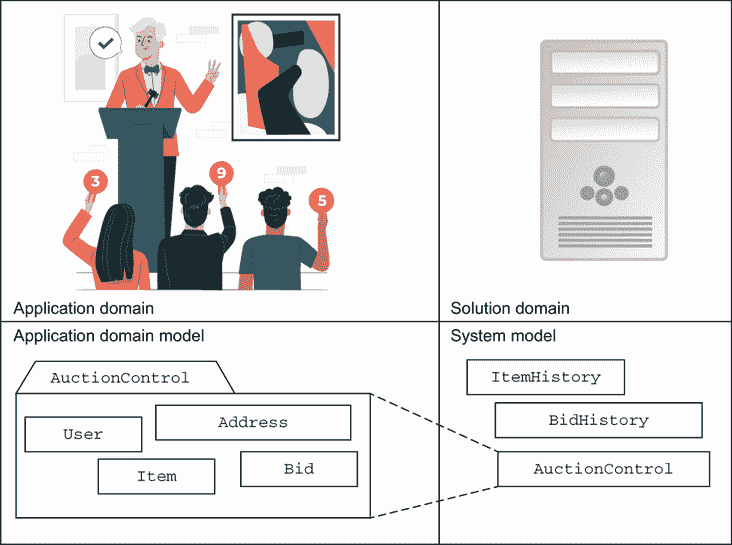
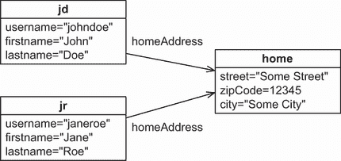
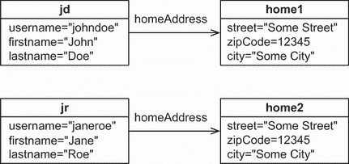
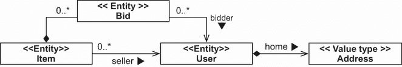
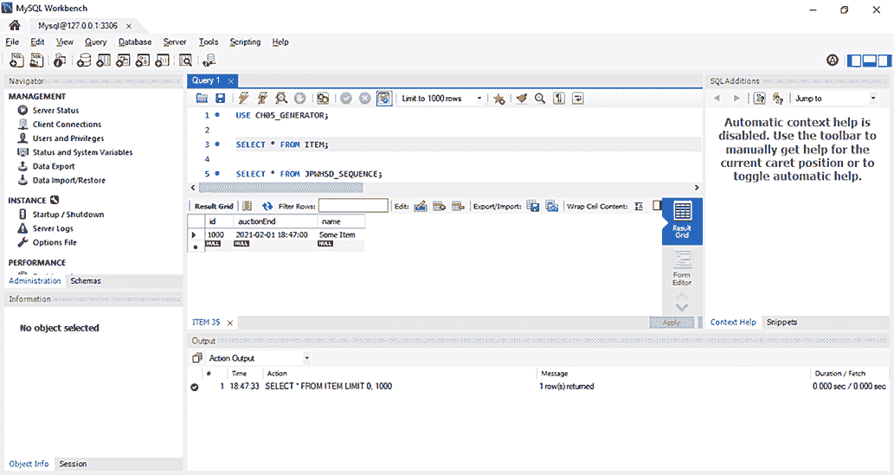
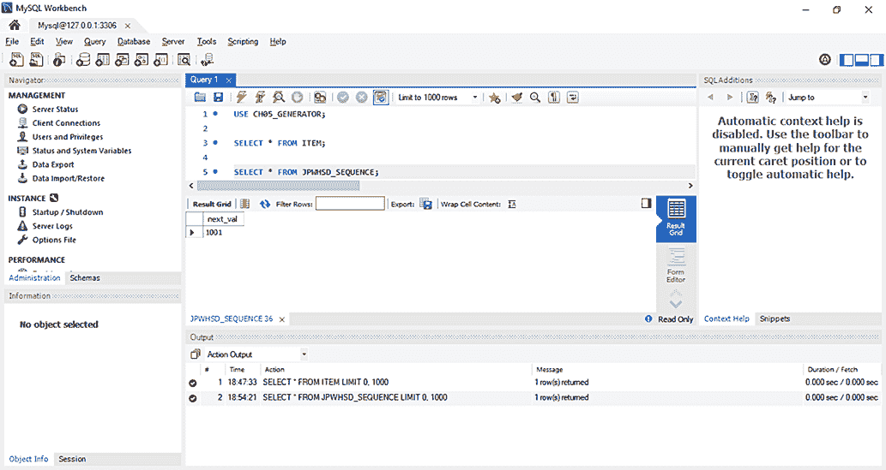

# 5 映射持久化类

本章涵盖

+   理解实体和值类型

+   使用标识符映射实体类

+   控制实体级映射选项

本章介绍了一些基本的映射选项，并解释了如何将实体类映射到 SQL 表。这是在应用程序中构建类的基本知识，无论您是使用 Hibernate、Spring Data JPA 还是其他实现 JPA 规范的持久化框架。我们将演示和分析您如何处理数据库标识符和主键，以及您如何使用各种其他元数据设置来自定义 Hibernate 或 Spring Data JPA（以 Hibernate 作为持久化提供者）如何加载和存储您的领域模型类的实例。

Spring Data JPA 作为一种数据访问抽象，位于 JPA 提供者（如 Hibernate）之上，并将显著减少与数据库交互所需的样板代码。这就是为什么一旦持久化类的映射完成，它就可以从 Hibernate 和 Spring Data JPA 中使用。我们的示例将演示这一点，并且我们所有的映射示例都将使用 JPA 注解。

在我们查看映射之前，我们将定义实体和值类型之间的基本区别，并解释您应该如何处理领域模型的面向对象/关系映射。工程师的角色是在 *应用领域*（即系统需要解决的问题的环境）和 *解决方案领域*（即构建此系统的软件和技术）之间建立联系。在图 5.1 中，应用领域由应用领域模型（真实实体）表示，而解决方案领域由系统模型（软件应用中的对象）表示。



图 5.1 需要连接的不同领域和模型

## 5.1 理解实体和值类型

当您查看您的领域模型时，您会注意到类之间的差异：一些类型似乎更重要，代表一等业务对象（这里的 *对象* 一词使用其自然意义）。一些例子是 `Item`、`Category` 和 `User` 类：这些是在现实世界中您试图表示的实体（参见图 3.3 以查看示例领域模型）。在您的领域模型中出现的其他类型，如 `Address`，似乎不太重要。在本节中，我们将探讨使用细粒度领域模型的意义，并区分实体和值类型。

### 5.1.1 细粒度领域模型

Hibernate 和 Spring Data JPA（以 Hibernate 作为持久化提供者）的一个主要目标是提供对细粒度和丰富领域模型的支持。这也是我们与 POJOs（Plain Old Java Objects）合作的原因——普通的 Java 对象，不受任何框架的约束。粗略地说，*细粒度*意味着拥有比表更多的类。

例如，在领域模型中，一个用户可能有一个家庭地址。在数据库中，你可能有一个包含 `HOME_STREET`、`HOME_CITY` 和 `HOME_ZIPCODE` 列的单一 `USERS` 表。（还记得我们在 1.2.1 节中讨论的 SQL 类型问题吗？）在领域模型中，你可以使用相同的方法，将地址表示为 `User` 类的三个字符串值属性。但使用 `Address` 类来建模会更好，其中 `User` 有一个 `homeAddress` 属性。这个领域模型实现了更好的内聚性和更大的代码重用，并且比具有不灵活类型系统的 SQL 更易于理解。

JPA 强调了细粒度类在实现类型安全和行为方面的有用性。例如，许多人将电子邮件地址建模为 `User` 的字符串值属性。然而，一个更复杂的方法是定义一个 `EmailAddress` 类，它添加了更高级别的语义和行为。它可能提供 `prepareMail()` 方法（但不应该有 `sendMail()` 方法，因为你不希望你的领域模型类依赖于邮件子系统）。

这个粒度问题使我们区分了 ORM 中的一个中心问题。在 Java 中，所有类都是平等的——所有实例都有自己的身份和生命周期。当你引入持久性时，一些实例可能没有自己的身份和生命周期，而是依赖于其他实例。让我们通过一个例子来了解一下。

### 5.1.2 定义应用程序概念

假设有两个人住在同一个房子里，并且他们都在 CaveatEmptor 上注册了用户账户。让我们称他们为约翰和简。`User` 的一个实例代表每个账户。因为你想要独立地加载、保存和删除这些 `User` 实例，所以 `User` 是一个实体类，而不是值类型。寻找实体类是容易的。

`User` 类有一个 `homeAddress` 属性；它与 `Address` 类相关联。`User` 的实例是否都引用同一个 `Address` 实例，或者每个 `User` 实例都引用自己的 `Address`？约翰和简住在同一个房子里是否重要？



图 5.2 两个 `User` 实例引用单个 `Address`。

在图 5.2 中，你可以看到两个 `User` 实例共享一个表示他们家庭地址的单个 `Address` 实例（这是一个 UML 对象图，而不是类图）。如果 `Address` 应该支持共享的运行时引用，它就是一个实体类型。`Address` 实例有自己的生命周期。当约翰删除他的 `User` 账户时，你不能删除它——简可能仍然引用这个 `Address`。

现在，让我们看看另一种模型，其中每个`User`都有一个对其自己的`homeAddress`实例的引用，如图 5.3 所示。在这种情况下，您可以使`Address`实例依赖于`User`实例：您将其作为值类型。当 John 删除他的`User`账户时，您可以安全地删除他的`Address`实例。没有人会持有对该实例的引用。



图 5.3 两个`User`实例各自有自己的依赖`Address`。

因此，我们可以做出以下基本区分：

+   *实体类型*—您可以使用其持久标识符检索一个*实体类型*的实例；例如，一个`User`、`Item`或`Category`实例。实体实例的引用（在 JVM 中是一个指针）作为数据库中的引用（一个外键约束值）持久化。实体实例有自己的生命周期；它可以独立于任何其他实体存在。您可以将域模型中选定的类映射为实体类型。

+   *值类型*—一个*值类型*的实例没有持久标识符属性；它属于一个实体实例，其生命周期绑定到拥有该实体实例。值类型实例不支持共享引用。您可以将自己的域模型类映射为值类型；例如，`Address`和`MonetaryAmount`。

如果您阅读 JPA 规范，您会发现相同的概念，但在 JPA 中值类型被称为*基本属性类型*或*可嵌入类*。我们将在下一章中回到这一点。

在您的域模型中识别实体和值类型不是一项临时任务，而是遵循一定的程序。

### 5.1.3 区分实体和值类型

您可能会发现，将构型信息添加到您的 UML 类图中很有帮助，这样您可以立即识别实体和价值类型（构型是 UML 的可扩展机制）。这种做法还将迫使您思考所有类的这种区别，这是实现最佳映射和良好性能持久层的第一步。图 5.4 展示了示例，其中构型信息位于双尖括号内。



图 5.4 实体和价值类型的图示化构型

`Item`和`User`类是明显的实体。它们各自有自己的标识符，它们的实例有来自许多其他实例的引用（共享引用），并且它们有独立的生命周期。

将`Address`标记为值类型也很简单：单个`User`实例引用特定的`Address`实例。您知道这一点是因为关联已被创建为组合，其中`User`实例完全负责引用的`Address`实例的生命周期。因此，`Address`实例不能被其他人引用，也不需要自己的标识符。

`Bid`类可能存在问题。在面向对象建模中，这被标记为组合（`Item`和`Bid`之间的关联，带有完整的菱形）。组合是一种关联类型，其中对象只能作为容器的一部分存在。如果容器被销毁，那么包含的对象也会被销毁。因此，`Item`是其`Bid`实例的所有者，并持有引用集合。`Bid`实例在没有`Item`的情况下无法存在。起初，这似乎是合理的，因为当为拍卖系统中的物品制作的出价消失时，出价在拍卖系统中是无用的。

但如果领域模型的未来扩展需要包含特定`User`所做所有出价的`User#bids`集合呢？目前，`Bid`和`User`之间的关联是单向的；一个`Bid`有一个`bidder`引用。如果这是双向的会怎样？

在那种情况下，你将不得不处理对`Bid`实例可能的共享引用，因此`Bid`类需要成为一个实体。它具有依赖的生命周期，但它必须有自己的身份以支持（未来的）共享引用。

你经常会遇到这种混合行为，但你的第一个反应应该是将所有内容都做成值类型类，并且只有在绝对必要时才将其提升为实体。`Bid`是一个值类型，因为它的身份由`Item`和`User`定义。这并不一定意味着它不会生活在自己的表中。尝试简化你的关联；例如，持久化集合经常增加复杂性，而不提供任何优势。你可以编写查询来获取`Item`的所有出价以及特定`User`所做的出价，而不是映射`Item#bids`和`User#bids`集合。UML 图中的关联将单向地从`Bid`指向`Item`和`User`，而不是相反。`Bid`类的构造型将是`<<值类型>>`。我们将在第八章回到这个话题。

接下来，你可以将你的领域模型图转换为所有实体和值类型的 POJO 实现。你需要注意三件事：

+   *共享引用*——在编写你的 POJO 类时，避免对值类型实例的共享引用。例如，确保只有一个`User`可以引用一个`Address`。你可以通过没有公共`setUser()`方法使`Address`不可变，并通过具有`User`参数的公共构造函数强制关系。当然，你仍然需要一个无参数的，可能受保护的构造函数，正如我们在第三章中讨论的那样，这样 Hibernate 或 Spring Data JPA 也可以创建实例。

+   *生命周期依赖性*—如果删除一个`用户`，其`地址`依赖也将必须被删除。持久化元数据将包括所有此类依赖的级联规则，因此 Hibernate、Spring Data JPA 或数据库可以处理删除过时的`地址`。您必须设计应用程序流程和用户界面以尊重并期望此类依赖性—相应地编写您的领域模型 POJO。

+   *身份*—在几乎所有情况下，实体类都需要一个标识属性。值类型类（当然，还包括像`String`和`Integer`这样的 JDK 类）没有标识属性，因为实例是通过拥有它们的实体来识别的。

当我们在后面的章节中讨论更高级的映射时，我们将回到引用、关联和生命周期规则。对象身份和标识属性是我们下一个话题。

## 5.2 使用身份映射实体

使用身份映射实体需要您理解 Java 的身份和相等性。一旦您知道了这一点，我们就可以通过一个实体类示例及其映射来探讨，讨论像*数据库身份*这样的术语，并查看 JPA 如何管理身份。之后，我们将能够深入挖掘并选择主键，配置键生成器，并最终通过标识生成器策略。

### 5.2.1 理解 Java 的身份和相等性

Java 开发者理解 Java 对象身份和相等性之间的区别。对象身份（`==`）是由 Java 虚拟机定义的一个概念。如果两个引用指向相同的内存位置，则它们是相同的。

相反，对象相等性是由类的`equals()`方法定义的一个概念，有时也称为*等价性*。等价性意味着两个不同的（非相同的）实例具有相同的值—相同的状态。如果您有一堆同类的全新书籍，您必须从中选择一本，这意味着您将不得不从几个非相同但等价的对象中选择一本。

两个不同的`String`实例如果表示相同的字符序列，则它们是相等的，尽管每个实例在虚拟机的内存空间中都有自己的位置。（如果您是 Java 大师，我们承认`String`是一个特殊情况。假设我们使用了一个不同的类来阐述同样的观点。）

持久化使这个情况变得复杂。在对象/关系持久化中，持久化实例是数据库表（或表）中特定行（或行）的内存表示。除了 Java 的身份和相等性之外，我们还定义了*数据库身份*。现在您有三种方法来区分引用：

+   *对象身份*—如果对象在 JVM 中占据相同的内存位置，则它们是相同的。这可以通过`a == b`运算符来检查。这个概念被称为*对象身份*。

+   *对象相等性*——如果对象具有相同的由 `a.equals(Object b)` 方法定义的状态，则它们是相等的。没有显式重写此方法的类继承由 `java.lang.Object` 定义的实现，该实现通过 `==` 比较对象身份。这个概念被称为 *对象相等性*。你可能还记得，对象相等性的属性是自反性、对称性和传递性。它们暗示的一件事是，如果 `a == b`，那么 `a.equals(b)` 和 `b.equals(a)` 都应该是真的。

+   *数据库身份*——存储在关系数据库中的对象如果它们共享相同的表和主键值，则被认为是相同的。这个概念映射到 Java 空间中，被称为 *数据库身份*。

我们现在需要探讨数据库身份与对象身份之间的关系，以及我们如何在映射元数据中表达数据库身份。作为一个例子，你将映射一个领域模型中的实体。

### 5.2.2 第一个实体类及其映射

`@Entity` 注解不足以映射一个持久化类。你还需要一个 `@Id` 注解，如以下列表所示（源代码请参阅 `generator` 文件夹）。

注意：要执行源代码中的示例，你首先需要运行 Ch05.sql 脚本。

列表 5.1 带有标识属性映射的 `Item` 实体类

```
Path: Ch05/generator/src/main/java/com/manning/javapersistence/ch05/model
➥ /Item.java

@Entity
\1 Item {
    @Id
    @GeneratedValue(generator = "ID_GENERATOR")
    private Long id;
    public Long getId() {
        return id;
    }
}
```

这是一个最基本的实体类，使用 `@Entity` 注解标记为“持久化能力”，并为数据库标识属性提供了一个 `@Id` 映射。该类默认映射到数据库模式中的名为 `ITEM` 的表。

每个实体类都必须有一个 `@Id` 属性；这是 JPA 向应用程序暴露数据库身份的方式。在我们的图中，我们没有展示标识属性，但我们假设每个实体类都有一个。在我们的示例中，我们总是将标识属性命名为 `id`。这对于你的项目来说是一个好的实践；为所有你的领域模型实体类使用相同的标识属性名称。如果你没有指定其他内容，这个属性将映射到数据库模式中的表的主键列 `ID`。

Hibernate 和 Spring Data JPA 将使用该字段在加载和存储项目时访问标识属性值，而不是 getter 或 setter 方法。因为 `@Id` 在字段上，Hibernate 或 Spring Data JPA 默认将类的每个字段都启用为持久化属性。JPA 的规则是：如果 `@Id` 在字段上，JPA 提供商将直接访问类的字段，并默认将所有字段视为持久状态的一部分。根据我们的经验，字段访问通常比使用访问器更好，因为它为你提供了更多访问器方法设计的自由度。

你应该有一个公共获取器方法来获取标识属性吗？应用程序通常将数据库标识符用作特定实例的方便处理方式，即使在持久化层之外也是如此。例如，对于网络应用程序来说，将搜索结果以摘要列表的形式显示给用户是很常见的。当用户选择特定元素时，应用程序可能需要检索所选项目，并且通常使用标识符查找来达到这个目的——你可能已经以这种方式使用标识符，即使在依赖于 JDBC 的应用程序中也是如此。

你应该有一个设置器方法吗？主键的值永远不会改变，因此你不应该允许标识属性值被修改。Hibernate 和 Spring Data JPA 使用 Hibernate 作为提供者时不会更新主键列，你不应该在实体上公开标识符设置器方法。

标识属性属性的 Java 类型，如前例中的 `java.lang.Long`，取决于 `ITEM` 表中的主键列类型以及键值的生成方式。这引出了 `@GeneratedValue` 注解，以及主键的一般概念。

### 5.2.3 选择主键

实体的数据库标识符映射到表的主键，因此我们首先了解一下主键的背景，不必担心映射问题。退一步想想，你是如何识别实体的。

*候选键* 是一个或一组列，你可以用它来识别表中的特定行。要成为主键，候选键必须满足以下要求：

+   任何候选键列的值永远不会为空。你不能用未知的数据来识别某物，关系模型中没有空值。一些 SQL 产品允许你定义（组合）主键，其中包含可空列，因此你必须小心。

+   候选键列（或列）的值对于任何行都是唯一的。

+   候选键列（或列）的值永远不会改变；它是不可变的。

主键必须是不可变的吗？

关系模型要求候选键必须是唯一的且不可约的（键属性子集没有唯一性属性）。除此之外，选择候选键作为 *主键* 是一个品味问题。但 Hibernate 和 Spring Data JPA 预期候选键在用作主键时是不可变的。Hibernate 和 Spring Data JPA 使用 Hibernate 作为提供者时不支持通过 API 更新主键值；如果你试图绕过这个要求，你会在 Hibernate 的缓存和脏检查引擎中遇到问题。如果你的数据库模式依赖于可更新的主键（并且可能使用 `ON UPDATE CASCADE` 外键约束），你必须在该模式与 Hibernate 或 Spring Data JPA 使用 Hibernate 作为提供者之前更改该模式。

如果一个表只有一个标识属性，那么根据定义，它就是主键。但几个列或列的组合可能满足特定表的这些属性；您可以在候选键之间进行选择，以决定表的最佳主键。如果它们的值确实是唯一的（但可能不是不可变的），那么您应该在数据库中将未选择的候选键声明为唯一键。

许多遗留的 SQL 数据模型使用自然主键。*自然键*是一个具有业务意义的键：一个或多个属性的组合，其唯一性源于其业务语义。自然键的例子包括美国的社保号码和澳大利亚的税号。区分自然键很简单：如果候选键属性在数据库上下文之外有意义，那么它就是一个自然键，无论它是否是自动生成的。考虑应用程序的用户：如果他们在讨论和操作应用程序时引用键属性，那么它就是一个自然键：“你能把 A23-abc 项目的图片发给我吗？”

经验表明，自然主键通常最终会引发问题。一个好的主键必须是唯一的、不可变的且永不为空。很少有实体属性满足这些要求，而且一些满足这些要求的属性可能无法被 SQL 数据库有效地索引（尽管这是一个实现细节，不应成为决定或反对特定键的因素）。您还应该确保候选键的定义在整个数据库生命周期中永不改变。更改主键的值（甚至定义）以及所有引用它的外键是一个令人沮丧的任务。预期您的数据库架构将生存数十年，即使您的应用程序不会。

此外，您通常只能通过组合一个*复合*自然键的几个列来找到自然候选键。这些复合键，尽管对于某些架构工件（如多对多关系中的链接表）肯定适用，但可能会使维护、即席查询和架构演变变得更加困难。

由于这些原因，我们强烈建议您添加合成标识符，也称为*代理键*。代理键没有业务意义——它们是由数据库或应用程序生成的唯一值。理想情况下，应用程序用户不会看到或引用这些键值；它们是系统内部的一部分。在没有候选键的常见情况下，引入代理键列也是合适的。换句话说，您架构中的几乎每个表都应该有一个专门的代理主键列，仅为此目的。

存在几种生成代理键值的方法。前面提到的`@GeneratedValue`注解就是如何配置这个的。

### 5.2.4 配置键生成器

`@Id`注解是必需的，用于标记实体类的标识符属性。如果没有紧挨着`@GeneratedValue`，JPA 提供者会假设你在保存实例之前会负责创建和分配标识符值。我们称这种标识符为*应用程序分配的*标识符。当你处理遗留数据库或自然主键时，手动分配实体标识符是必要的。

通常，你希望在保存实体实例时让系统生成主键值，所以你可以将`@GeneratedValue`注解放在`@Id`旁边。JPA 使用`javax.persistence.GenerationType`枚举标准化了几个值生成策略，你可以通过`@GeneratedValue(strategy = ...)`来选择：

+   `GenerationType.AUTO`—Hibernate（或使用 Hibernate 作为持久化提供者的 Spring Data JPA）会选择一个合适的策略，询问配置的数据库的 SQL 方言什么是最合适的。这相当于没有设置任何内容的`@GeneratedValue()`。

+   `GenerationType.SEQUENCE`—Hibernate（或使用 Hibernate 作为持久化提供者的 Spring Data JPA）期望（如果你使用工具，则会创建）一个名为`HIBERNATE_SEQUENCE`的序列在你的数据库中。在每次`INSERT`之前，将单独调用序列，生成顺序数值。

+   `GenerationType.IDENTITY`—Hibernate（或使用 Hibernate 作为持久化提供者的 Spring Data JPA）期望（并在表 DDL 中创建）一个特殊的自增主键列，该列在数据库中`INSERT`时自动生成一个数值。

+   `GenerationType.TABLE`—Hibernate（或使用 Hibernate 作为持久化提供者的 Spring Data JPA）将在你的数据库模式中使用一个额外的表，该表包含下一个数值主键值，每个实体类有一行。在`INSERT`之前，将读取和更新此表。默认表名为`HIBERNATE_SEQUENCES`，包含`SEQUENCE_NAME`和`NEXT_VALUE`列。

虽然`AUTO`看起来很方便，但有时你需要对 ID 的创建有更多的控制，所以通常你应该明确配置一个主键生成策略。大多数应用程序使用数据库序列，但你可能想自定义数据库序列的名称和其他设置。因此，而不是选择 JPA 策略之一，你可以使用`@GeneratedValue(generator="ID_GENERATOR")`将标识符映射，如列表 5.1 所示。这是一个*命名*的标识符生成器；你现在可以独立于你的实体类设置`ID_GENERATOR`配置。

JPA 有两个内置的注解可以用来配置命名生成器：`@javax.persistence.SequenceGenerator`和`@javax.persistence.TableGenerator`。使用这些注解，你可以创建一个具有自己的序列和表名的命名生成器。与 JPA 注解的常规用法一样，不幸的是，你只能在（可能为空的）类的顶部使用它们，而不能在`package-info.java`文件中使用。

由于这个原因，并且因为 JPA 注解没有给你提供访问完整的 Hibernate 功能集，我们更喜欢使用原生的`@org.hibernate.annotations.GenericGenerator`注解作为替代。它支持所有 Hibernate 标识生成策略及其配置细节。与相对有限的 JPA 注解不同，你可以在`package-info.java`文件中使用 Hibernate 注解，通常与你的领域模型类在同一个包中。以下列表显示了一个推荐的配置，这个配置也可以在`generator`文件夹中找到。

列表 5.2 Hibernate 标识生成器配置为包级元数据

```
Path: Ch05/generator/src/main/java/com/manning/javapersistence/ch05
➥ /package-info.java

@org.hibernate.annotations.GenericGenerator(
  name = "ID_GENERATOR",
  strategy = "enhanced-sequence",                Ⓐ
  parameters = {
     @org.hibernate.annotations.Parameter(
        name = "sequence_name",                  Ⓑ
        value = "JPWHSD_SEQUENCE"
     ),
     @org.hibernate.annotations.Parameter(
        name = "initial_value",                  Ⓒ
        value = "1000"
     )
})
```

Ⓐ `enhanced-sequence`策略产生顺序数字值。如果你的 SQL 方言支持序列，Hibernate（或使用 Hibernate 作为持久化提供者的 Spring Data JPA）将使用实际的数据库序列。如果你的数据库管理系统不支持原生序列，Hibernate（或使用 Hibernate 作为持久化提供者的 Spring Data JPA）将管理并使用一个额外的“序列表”，模拟序列的行为。这为你提供了真正的可移植性：生成器总是在执行 SQL `INSERT`之前被调用，与例如自动递增的标识列不同，后者在`INSERT`时产生一个值，之后必须将其返回给应用程序。

Ⓑ 你可以配置`sequence_name`。Hibernate（或使用 Hibernate 作为持久化提供者的 Spring Data JPA）将使用现有的序列或在你自动生成 SQL 模式时创建一个。如果你的数据库管理系统不支持序列，这将是一个特殊的“序列表”名称。

Ⓒ 你可以从一个`initial_value`开始，这为你提供了测试数据的空间。例如，当你的集成测试运行时，Hibernate（或使用 Hibernate 作为持久化提供者的 Spring Data JPA）将使用测试代码中的标识值大于 1,000 的新数据插入。你想要在测试之前导入的任何测试数据可以使用 1 到 999 的数字，你可以在测试中引用稳定的标识值：“加载 id 为 123 的项目并对其运行一些测试。”这适用于 Hibernate（或使用 Hibernate 作为持久化提供者的 Spring Data JPA）生成 SQL 模式和序列；这是一个 DDL 选项。

你可以在所有领域模型类之间共享相同的数据库序列。在所有实体类中指定`@GeneratedValue(generator="ID_GENERATOR")`没有任何害处。对于特定实体，主键值不连续没有关系，只要它们在表中是唯一的。

最后，你可以在实体类中将`java.lang.Long`用作标识符属性的类型，这完美映射到数值数据库序列生成器。你也可以使用原始类型`long`。主要区别在于新项目在数据库中未存储时`someItem.getId()`返回的值：要么是`null`，要么是`0`。如果你想测试一个项目是否为新项目，对`null`的检查可能更容易让其他人阅读你的代码时理解。你不应该使用其他整型，如`int`或`short`作为标识符。虽然它们可能工作一段时间（甚至可能几年），但随着数据库大小的增长，你可能会受到它们的范围的限制。如果你以每毫秒生成一个新标识符且没有空缺的方式生成标识符，`Integer`将适用于大约两个月，而`Long`将适用于大约 3 亿年。

虽然对于大多数应用来说这是推荐的，但如列表 5.2 所示，`enhanced-sequence`策略只是 Hibernate 内置的策略之一。关键生成器的配置不了解使用它的框架，程序员永远不会管理主键的值。这是在框架层面完成的。代码将类似于列表 5.3 和 5.4。

列表 5.3 使用 Hibernate JPA 持久化具有生成主键的`Item`

```
Path: Ch05/generator/src/test/java/com/manning/javapersistence/ch05
➥ /HelloWorldJPATest.java

em.getTransaction().begin();

Item item = new Item();
item.setName("Some Item");
item.setAuctionEnd(Helper.tomorrow());
em.persist(item);

em.getTransaction().commit();
```

列表 5.4 使用 Spring Data JPA 持久化具有生成主键的`Item`

```
Path: Ch05/generator/src/test/java/com/manning/javapersistence/ch05
➥ /HelloWorldSpringDataJPATest.java

Item item = new Item();
item.setName("Some Item");
item.setAuctionEnd(Helper.tomorrow());
itemRepository.save(item);
```

在运行任何 Hibernate JPA 或 Spring Data JPA 程序后，将在数据库中插入一个新的`ITEM`，其`id`为 1000，这是生成器指定的第一个值（图 5.5）。下一次插入要生成的值保留在`JPWHSD_SEQUENCE`中（图 5.6）。



图 5.5 插入具有生成主键的行后`ITEM`表的内容



图 5.6 `JPWHSD_SEQUENCE`保留的下一个生成值

### 5.2.5 标识符生成策略

使用 Hibernate 作为提供者的 Hibernate 和 Spring Data JPA 提供了几种标识符生成策略，我们将在本节中列出并讨论它们。我们不会讨论已弃用的生成策略。

如果你现在不想阅读整个列表，请启用`GenerationType.AUTO`并检查 Hibernate 为你数据库方言默认的设置。它很可能是`sequence`或`identity`——这是不错的选择，但可能不是最有效或最便携的选择。如果你需要一致、便携的行为以及`INSERT`之前可用的标识符值，请使用`enhanced-sequence`，如前节所示。这是一个便携、灵活且现代的策略，同时也为大数据集提供了各种优化器。

在`INSERT`之前或之后生成标识符：有什么区别？

一个 ORM 服务试图优化 SQL `INSERT`，例如通过在 JDBC 级别批量处理多个`INSERT`。因此，SQL 执行尽可能晚地发生在工作单元期间，而不是在您调用`entityManager.persist(someItem)`时。这仅仅是将插入排队以供稍后执行，并在可能的情况下分配标识符值。然而，如果您现在调用`someItem.getId()`，如果引擎在`INSERT`之前未能生成标识符，您可能会得到`null`。

通常，我们更喜欢在`INSERT`之前独立生成标识符值的`pre-insert`生成策略。一个常见的选择是使用共享且可并发访问的数据库序列。自增列、列默认值和触发器生成的键仅在`INSERT`之后才可用。

在我们讨论标识符生成策略的完整列表之前，以下是对这些策略的建议：

+   通常，优先选择在`INSERT`之前独立生成标识符值的预插入生成策略。

+   使用`enhanced-sequence`，当数据库支持时使用原生数据库序列，否则退回到使用一个带有单列和单行的额外数据库表，模拟序列。

以下列表概述了 Hibernate 的标识符生成策略及其选项，以及我们的使用建议。我们还讨论了每个标准 JPA 策略与其原生 Hibernate 等效策略之间的关系。由于 Hibernate 是自然增长的，现在有两套标准策略和原生策略之间的映射；我们在列表中将它们称为`*旧*`和`*新*`。您可以通过在`persistence.xml`文件中的`hibernate .id.new_generator_mappings`设置来切换此映射。默认值为`true`，这意味着使用新映射。软件并不像酒那样越陈越香。

+   `native`—此选项根据配置的 SQL 方言自动选择策略，例如`sequence`或`identity`。您必须查看在`persistence.xml`中配置的 SQL 方言的 Javadoc（甚至源代码）以确定将选择哪种策略。这与旧映射中的 JPA `GenerationType.AUTO`等效。

+   `sequence`—此策略使用名为`HIBERNATE_ SEQUENCE`的原生数据库序列。在每次新行的`INSERT`之前调用序列。您可以自定义序列名称并提供额外的 DDL 设置；请参阅`org.hibernate.id.SequenceGenerator`类的 Javadoc。

+   `enhanced-sequence`—这种策略在支持原生数据库序列时使用原生数据库序列；否则，它将回退到使用一个包含单个列和行的额外数据库表，模拟序列（默认表名为`HIBERNATE_ SEQUENCE`）。使用此策略始终在`INSERT`之前调用数据库“序列”，无论 DBMS 是否支持真实序列，都能提供相同的行为。此策略还支持`org.hibernate.id.enhanced .Optimizer`以避免在每次`INSERT`之前击中数据库，并且默认不进行优化，并为每次`INSERT`获取新值。这与启用新映射的 JPA `GenerationType.SEQUENCE`和`GenerationType.AUTO`等效，可能是内置策略中最好的选择。有关所有参数，请参阅`org.hibernate.id.enhanced .SequenceStyleGenerator`类的 Javadoc。

+   `enhanced-table`—这种策略使用一个名为`HIBERNATE_ SEQUENCES`的额外表，默认情况下有一个行表示序列并存储下一个值。当需要生成标识值时，将选择并更新此值。您可以配置此生成器使用多行，每行代表一个生成器（请参阅`org.hibernate.id.enhanced .TableGenerator`的 Javadoc）。这与启用新映射的 JPA `GenerationType.TABLE`等效。它取代了过时但类似的`org.hibernate .id.MultipleHiLoPerTableGenerator`，它是 JPA `GenerationType.TABLE`的老映射。

+   `identity`—这种策略支持 DB2、MySQL、MS SQL Server 和 Sybase 中的`IDENTITY`和自动增长列。主键列的标识值将在插入行时生成。它没有选项。不幸的是，由于 Hibernate 代码中的一个怪癖，您**不能**在`@GenericGenerator`中配置此策略。DDL 生成将不包括主键列的标识或自动增长选项。唯一使用它的方法是使用 JPA `GenerationType.IDENTITY`和旧或新映射，使其成为`GenerationType.IDENTITY`的默认选项。

+   `increment`—在 Hibernate 启动时，此策略读取每个实体表的最大的（数值）主键列值，并在每次插入新行时将值增加一。如果非聚集的 Hibernate 应用程序具有对数据库的独占访问权限，则此策略特别有效，但在任何其他场景中不要使用它。

+   `select`—使用此策略，Hibernate 不会在 `INSERT` 语句中生成键值或包含主键列。Hibernate 预期数据库管理系统在插入时为该列分配一个值（模式中的默认值或触发器提供的值）。Hibernate 然后在插入后通过 `SELECT` 查询检索主键列。所需的参数是 `key`，命名数据库标识符属性（如 `id`）的 `SELECT`。此策略效率不高，并且仅应与无法直接返回生成键的老旧 JDBC 驱动程序一起使用。

+   `uuid2`—此策略在应用层生成一个唯一的 128 位 UUID。当您需要在数据库之间具有全局唯一标识符时很有用（例如，如果您每晚在批量运行中将来自几个不同生产数据库的数据合并到存档中）。UUID 可以编码为实体类中的 `java.lang.String`、`byte[16]` 或 `java.util.UUID` 属性。这取代了传统的 `uuid` 和 `uuid.hex` 策略。您可以通过 `org.hibernate.id.UUIDGenerationStrategy` 配置它；有关 `org.hibernate.id.UUIDGenerator` 类的更多详细信息，请参阅 Javadoc。

+   `guid`—此策略使用数据库生成的全局唯一标识符，在 Oracle、Ingres、MS SQL Server 和 MySQL 上有可用的 SQL 函数。Hibernate 在 `INSERT` 之前调用数据库函数。值映射到 `java.lang.String` 标识符属性。如果您需要完全控制标识符生成，请使用实现 `org.hibernate.id.IdentityGenerator` 接口的类的完全限定名称配置 `@GenericGenerator` 策略。

如果您还没有这样做，请继续为您的领域模型中的实体类添加标识符属性。确保您不要在业务逻辑之外暴露标识符，例如通过 API——此标识符没有业务逻辑意义，它仅与持久性相关。

在完成每个实体及其标识符属性的基本映射后，您可以继续映射实体的值类型属性。我们将在下一章中讨论值类型映射。不过，首先，请继续阅读一些可以简化并增强您的类映射的特殊选项。

## 5.3 实体映射选项

您现在已使用 `@Entity` 映射了一个持久化类，并使用默认值设置了所有其他设置，例如映射的 SQL 表名。现在，我们将探讨一些类级别选项以及您如何控制它们：

+   命名默认值和策略

+   动态 SQL 生成

+   实体可变性

这些是选项。如果您愿意，现在可以跳过这一部分，稍后再回来处理具体问题时再回来。

### 5.3.1 控制名称

让我们谈谈实体类和表的命名。如果你只在持久化能力类上指定 `@Entity`，默认映射的表名将与类名相同。例如，Java 实体类 `Item` 映射到 `ITEM` 表。名为 `BidItem` 的 Java 实体类将映射到 `BID_ITEM` 表（在这里，驼峰式命名将被转换为蛇形命名）。你可以使用 JPA 的 `@Table` 注解覆盖表名，如下所示。（请参阅 `mapping` 文件夹以获取源代码。）

注意：我们用 `UPPERCASE` 写 SQL 艺术品名称，以便更容易区分——SQL 实际上是大小写不敏感的。

列表 5.5 使用 `@Table` 注解覆盖映射的表名

```
Path: Ch05/mapping/src/main/java/com/manning/javapersistence/ch05/model
➥ /User.java

@Entity

@Table(name = "USERS")

public class User {
    //  . . .
}
```

`User` 实体将映射到 `USER` 表，但在大多数 SQL 数据库管理系统（DBMS）中，这是一个保留关键字，因此你不能有这样一个名称的表。相反，我们将其映射到 `USERS`。如果你的数据库布局需要这些作为命名前缀，`@javax.persistence.Table` 注解也有 `catalog` 和 `schema` 选项。

如果你真的需要，引用允许你使用保留的 SQL 名称，甚至可以处理大小写敏感的名称。

引用 SQL 标识符

有时，特别是在旧数据库中，你会遇到包含奇怪字符或空白的标识符，或者你希望强制执行大小写敏感性。或者，就像前面的示例一样，类或属性的自动映射可能需要一个保留关键字的表或列名。Hibernate 和使用 Hibernate 作为提供者的 Spring Data JPA 通过配置的数据库方言知道你的 DBMS 的保留关键字，并且它们可以在生成 SQL 时自动在这些字符串周围添加引号。你可以在持久化单元配置中使用 `hibernate .auto_quote_ keyword=true` 启用此自动引用。如果你使用的是较旧的 Hibernate 版本，或者你发现方言的信息不完整，你必须仍然在你的映射中手动应用引号，如果与关键字冲突。

如果你使用反引号在你的映射中引用表或列名，Hibernate 总是在生成的 SQL 中引用此标识符。这仍然在 Hibernate 的最新版本中有效，但 JPA 2.0 将此功能标准化为 *delimited identifiers*，即双引号。

这是仅适用于 Hibernate 的使用反引号的引用，修改了前面的示例：

```
@Table(name = "`USER`")
```

要符合 JPA 规范，你还需要在字符串中转义引号：

```
@Table(name = "\"USER\"")
```

无论哪种方式，对于使用 Hibernate 作为提供者的 Hibernate 和 Spring Data JPA 都可以正常工作。它知道你方言的本地引号字符，并相应地生成 SQL：`[USER]` 用于 MS SQL Server，`'USER'` 用于 MySQL，`"USER"` 用于 H2 等。

如果你必须引用 *所有* SQL 标识符，创建一个 orm.xml 文件，并在其 `<persistence-unit-defaults>` 部分添加设置 `<delimited-identifiers/>`，就像你在列表 3.8 中看到的那样。Hibernate 然后在所有地方强制执行引用标识符。

在可能的情况下，你应该考虑重命名具有保留关键字名称的表或列。如果你必须手动正确地引用和转义所有内容，那么在 SQL 控制台中编写临时 SQL 查询会很困难。此外，你还应该避免为也通过 Hibernate、JPA 或 Spring Data（例如，用于报告）以外的其他方式访问的数据库使用引号标识符。在（复杂）报告查询中必须使用分隔符来标识所有标识符，这真的很痛苦。

接下来，让我们看看当遇到对数据库表和列名称有严格约定的组织时，Hibernate 和 Spring Data JPA（以 Hibernate 作为提供者）如何提供帮助。

实现命名约定

Hibernate 提供了一个功能，允许你自动强制执行命名标准。假设 CaveatEmptor 中所有表名都应该遵循 `CE_<table name>` 的模式。一种解决方案是手动在所有实体类上指定 `@Table` 注解，但这种方法既耗时又容易忘记。相反，你可以实现 Hibernate 的 `PhysicalNamingStrategy` 接口或覆盖现有的实现，如下所示。

列表 5.6 使用 `PhysicalNamingStrategy` 覆盖默认命名约定

```
Path: Ch05/mapping/src/main/java/com/manning/javapersistence/ch05
➥ /CENamingStrategy.java

public class CENamingStrategy extends PhysicalNamingStrategyStandardImpl {

    @Override

    public Identifier toPhysicalTableName(Identifier name,

                                          JdbcEnvironment context) {

        return new Identifier("CE_" + name.getText(), name.isQuoted());

    }

}
```

覆盖的 `toPhysicalTableName()` 方法将 `CE_` 前缀添加到你的模式中所有生成的表名。查看 `PhysicalNamingStrategy` 接口的 Javadoc；它提供了用于自定义命名列、序列和其他实体的方法。

你必须启用命名策略实现。在 Hibernate JPA 中，这通过 persistence.xml 完成：

```
Path: Ch05/mapping/src/main/resources/META-INF/persistence.xml

<persistence-unit name="ch05.mapping">
    ...
    <properties>
        ...
        <property name="hibernate.physical_naming_strategy"
                value="com.manning.javapersistence.ch05.CENamingStrategy"/>
    </properties>
</persistence-unit>
```

使用 Spring Data JPA 并以 Hibernate 作为持久化提供者时，这通过 `LocalContainerEntityManagerFactoryBean` 配置来完成：

```
Path: Ch05/mapping/src/test/java/com/manning/javapersistence/ch05
➥ /configuration/SpringDataConfiguration.java

properties.put("hibernate.physical_naming_strategy",
               CENamingStrategy.class.getName());
```

现在我们快速看一下另一个相关的问题，即查询实体的命名。

为查询命名实体

默认情况下，所有实体名称都会自动导入查询引擎的命名空间。换句话说，你可以在 JPA 查询字符串中使用不带包前缀的简短类名，这很方便：

```
Path: Ch05/generator/src/test/java/com/manning/javapersistence/ch05
➥ /HelloWorldJPATest.java

List<Item> items = em.createQuery("select i from Item i", 
➥ Item.class).getResultList();
```

这仅在你在持久化单元中有一个 `Item` 类时才有效。如果你在另一个包中添加另一个 `Item` 类，如果你想继续在查询中使用简短形式，你应该为 JPA 重命名其中一个：

```
package my.other.model;
@javax.persistence.Entity(name = "AuctionItem")
public class Item {
    //  . . .

}
```

对于 `my.other.model` 包中的 `Item` 类，简短的查询形式现在是 `select i from AuctionItem i`。因此，你解决了另一个包中另一个 `Item` 类的命名冲突。当然，你始终可以使用带有包前缀的完全限定长名称。

这完成了我们对命名选项的浏览。接下来，我们将讨论 Hibernate 和 Spring Data JPA 使用 Hibernate 生成包含这些名称的 SQL 的方法。

### 5.3.2 动态 SQL 生成

默认情况下，Hibernate 和使用 Hibernate 作为提供者的 Spring Data JPA 在启动时创建持久化单元时为每个持久化类创建 SQL 语句。这些语句是简单的创建、读取、更新和删除（CRUD）操作，用于读取单行、删除单行等。与每次在运行时执行此类简单查询时生成 SQL 字符串相比，创建和缓存它们更便宜。此外，如果语句较少，JDBC 层的预处理语句缓存也更为高效。

Hibernate 如何在启动时创建 `UPDATE` 语句？毕竟，此时并不知道要更新的列。答案是生成的 SQL 语句更新所有列，如果特定列的值没有被修改，则语句将其设置为旧值。

在某些情况下，例如具有数百列的遗留表，即使是最简单的操作（例如仅需要更新一列时）的 SQL 语句也会很大，你应该禁用此启动 SQL 生成，并切换到在运行时动态生成的语句。大量实体也可能影响启动时间，因为 Hibernate 必须预先生成所有 CRUD 的 SQL 语句。如果必须为数千个实体缓存数十个语句，此查询语句缓存的内存消耗也会很高。这在内存限制的虚拟环境中或低功耗设备上可能是一个问题。

要禁用启动时生成 `INSERT` 和 `UPDATE` SQL 语句，你需要使用本机 Hibernate 注解：

```
@Entity
@org.hibernate.annotations.DynamicInsert
@org.hibernate.annotations.DynamicUpdate
public class Item {
    //  . . .
}
```

通过启用动态插入和更新，你告诉 Hibernate 在需要时而不是一开始就生成 SQL 字符串。`UPDATE` 语句将只包含具有更新值的列，而 `INSERT` 语句将只包含非空列。

### 5.3.3 使实体不可变

特定类的实例可能是不可变的。例如，在 CaveatEmptor 中，为物品出价的一个 `Bid` 是不可变的。因此，Hibernate 或使用 Hibernate 作为提供者的 Spring Data JPA 永远不需要在 `BID` 表上执行 `UPDATE` 语句。Hibernate 还可以执行一些其他优化，例如，如果你映射了一个不可变类，可以避免脏检查，如下一个示例所示。这里 `Bid` 类是不可变的，实例永远不会被修改：

```
@Entity
@org.hibernate.annotations.Immutable
public class Bid {
    //  . . .
}
```

如果类的任何属性都没有公开的设置器方法，则 POJO 是不可变的——所有值都在构造函数中设置。Hibernate 或使用 Hibernate 作为提供者的 Spring Data JPA 应在加载和存储实例时直接访问字段。我们在此章中之前已经讨论过这一点：如果 `@Id` 注解在字段上，Hibernate 将直接访问字段，你可以自由设计你的获取器和设置器方法。此外，请记住，并非所有框架都支持没有设置器方法的 POJO。

当你无法在数据库模式中创建视图时，你可以将不可变实体类映射到 SQL `SELECT` 查询。

### 5.3.4 将实体映射到子查询

有时你的数据库管理员可能不允许你更改数据库模式。甚至添加一个新的视图也可能不可能。假设你想要创建一个包含拍卖 `Item` 的标识符和为此项进行的出价数量的视图（请参阅 `subselect` 文件夹中的源代码）。使用 Hibernate 注解，你可以创建一个应用程序级别的视图，一个映射到 SQL `SELECT` 的只读实体类：

```
Path: Ch05/subselect/src/main/java/com/manning/javapersistence/ch05/model
➥ /ItemBidSummary.java

@Entity
@org.hibernate.annotations.Immutable
@org.hibernate.annotations.Subselect(
    value = "select i.ID as ITEMID, i.NAME as NAME, " +
            "count(b.ID) as NUMBEROFBIDS " +
            "from ITEM i left outer join BID b on i.ID = b.ITEM_ID " +
               "group by i.ID, i.NAME"
)
@org.hibernate.annotations.Synchronize({"ITEM", "BID"})
public class ItemBidSummary {
    @Id
    private Long itemId;
    private String name;
    private long numberOfBids;
    public ItemBidSummary() {
    }
    // Getter methods . . .
    //  . . .
}
```

你应该在 `@org.hibernate.annotations.Synchronize` 注解中列出你 `SELECT` 中引用的所有表名。然后框架将知道在执行针对 `ItemBidSummary` 的查询之前，它必须刷新 `Item` 和 `Bid` 实例的修改。如果有尚未持久化到数据库但可能影响查询的内存中修改，Hibernate（或作为提供者的 Spring Data JPA）会检测到这一点，并在执行查询之前刷新更改。否则，结果可能是一个过时的状态。由于 `ItemBidSummary` 类上没有 `@Table` 注解，框架不知道在执行查询之前何时必须自动刷新。`@org.hibernate.annotations.Synchronize` 注解表明框架需要在执行查询之前刷新 `ITEM` 和 `BID` 表。

使用 Hibernate JPA 中的只读 `ItemBidSummary` 实体类将看起来像这样：

```
Path: Ch05/subselect/src/test/java/com/manning/javapersistence/ch05
➥ /ItemBidSummaryTest.java

TypedQuery<ItemBidSummary> query =
     em.createQuery("select ibs from ItemBidSummary ibs where 
➥ ibs.itemId = :id",
                    ItemBidSummary.class);
ItemBidSummary itemBidSummary =
                    query.setParameter("id", 1000L).getSingleResult();
```

要使用 Spring Data JPA 中的只读 `ItemBidSummary` 实体类，你首先需要引入一个新的 Spring Data 仓库：

```
Path: Ch05/mapping/src/main/java/com/manning/javapersistence/ch05
➥ /repositories/ItemBidSummaryRepository.java

public interface ItemBidSummaryRepository extends
                 CrudRepository<ItemBidSummary, Long> {
}
```

仓库将有效使用如下：

```
Path: Ch05/subselect/src/test/java/com/manning/javapersistence/ch05
➥ /ItemBidSummarySpringDataTest.java

Optional<ItemBidSummary> itemBidSummary =
                         itemBidSummaryRepository.findById(1000L);
```

## 摘要

+   实体是系统更粗粒度的类。它们的实例具有独立的生命周期和自己的标识，并且许多其他实例可以引用它们。

+   值类型依赖于特定的实体类。值类型实例绑定到其所属的实体实例，并且只有一个实体实例可以引用它——它没有单独的标识。

+   Java 标识符、对象相等性和数据库标识符是不同的概念：前两个适用于面向对象的世界，最后一个适用于关系数据库世界。

+   一个好的主键永远不会为空，是唯一的，并且永远不会改变。

+   主键生成器可以使用不同的策略进行配置。

+   你可以使用来自 Hibernate JPA 和 Spring Data JPA 的实体、映射选项和命名策略。
