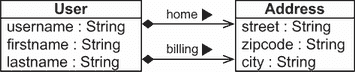
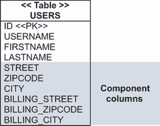
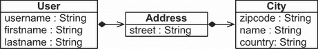
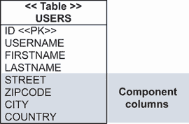
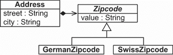

# 6 映射值类型

本章涵盖

+   映射基本属性

+   映射可嵌入组件

+   控制 Java 和 SQL 类型之间的映射

在上一章几乎完全专注于实体及其类和身份映射选项之后，我们现在将关注各种形式的价值类型。在开发中的类中经常遇到值类型。我们将值类型分为两类：随 JDK 一起提供的基值类型类，如 `String`、`Date`、原始类型及其包装器；以及开发者定义的值类型类，如 CaveatEmptor 中的 `Address` 和 `MonetaryAmount`。

在本章中，我们首先将使用 JDK 类型映射持久化属性，并讨论基本映射注解。我们将查看如何处理属性的各个方面：覆盖默认值、自定义访问和生成值。我们还将看到 SQL 如何与派生属性和转换列值一起使用。我们将处理基本属性、时间属性和枚举映射。

然后，我们将检查自定义值类型类并将它们作为可嵌入组件进行映射。我们将查看类如何与数据库模式相关联，并使类可嵌入，同时允许覆盖嵌入属性。通过映射嵌套组件，我们将完成对可嵌入组件的考察。最后，我们将分析如何使用灵活的 JPA 转换器在较低级别自定义属性值的加载和存储，这些转换器是每个 JPA 提供商的标准扩展点。

JPA 2 中的主要新功能

JPA 2.2 支持 Java 8 日期和时间 API。不再需要使用如 `@Temporal` 这样的额外映射注解，以前需要用这些注解来标注 `java.util.Date` 类型的字段。

## 6.1 映射基本属性

映射是 ORM 技术的核心。它连接了面向对象世界和关系世界。当我们映射一个持久化类，无论是实体还是可嵌入类型（更多内容请参考第 6.2 节），所有属性默认都被视为持久化。

这些是持久化类属性的默认 JPA 规则：

+   如果属性是原始类型或原始类型包装器，或为 `String`、`BigInteger`、`BigDecimal`、`java.time.LocalDateTime`、`java.time.LocalDate`、`java.time.LocalTime`、`java.util.Date`、`java.util.Calendar`、`java.sql.Date`、`java.sql.Time`、`java.sql.Timestamp`、`byte[]`、`Byte[]`、`char[]` 或 `Character[]` 类型，则它自动持久化。Hibernate 或使用 Hibernate 的 Spring Data JPA 会将属性的值加载和存储在具有适当 SQL 类型且与属性同名的列中。

+   否则，如果我们将属性的类标注为 `@Embeddable`，或者将属性本身映射为 `@Embedded`，则该属性将被映射为拥有类的嵌入组件。我们将在本章后面分析组件的嵌入，当我们查看 CaveatEmptor 的 `Address` 和 `MonetaryAmount` 嵌入类时。

+   否则，如果属性的类型是 `java.io.Serializable`，其值将存储在其序列化形式中。这可能会引起兼容性问题（我们可能使用一种类格式存储信息，而希望稍后使用另一种类格式检索它）以及性能问题（序列化/反序列化操作成本高昂）。我们应该始终映射 Java 类，而不是在数据库中存储一系列字节。当应用程序可能在几年后消失时，维护包含这种二进制信息的数据库意味着映射到序列化版本的类将不再可用。

+   否则，启动时将抛出异常，抱怨属性的类型无法理解。

这种 *异常配置* 方法意味着我们不必注解属性来使其持久化；我们只需在异常情况下配置映射即可。JPA 中有多个注解可用于自定义和控制基本属性映射。

### 6.1.1 覆盖基本属性默认值

我们可能不希望实体类的所有属性都持久化。那么哪些信息应该持久化，哪些不应该？例如，虽然有一个持久的 `Item#initialPrice` 属性是有意义的，但如果我们在运行时仅计算和使用其值，则 `Item#totalPriceIncludingTax` 属性不应该在数据库中持久化。要排除一个属性，请使用注解 `@javax.persistence.Transient` 标记属性的字段或 getter 方法，或者使用 Java 的 `transient` 关键字。`transient` 关键字既排除 Java 序列化，也排除持久化，因为它也被 JPA 提供者识别。`@javax.persistence.Transient` 注解将仅排除字段不被持久化。

要决定一个属性是否应该持久化，请自问以下问题：这是一个塑造实例的基本属性吗？我们是否从一开始就需要它，还是将基于其他属性计算它？在一段时间后重建信息有意义吗，或者信息将不再重要？这是敏感信息，我们宁愿避免持久化以防止稍后泄露（例如明文密码）吗？这是在其他环境中没有意义的信息（例如在另一个网络中无意义的本地 IP 地址）吗？

我们稍后会回到在字段或 getter 方法上放置注释的位置。首先，让我们假设，就像我们之前做的那样，Hibernate 或使用 Hibernate 的 Spring Data JPA 将直接访问字段，因为这些字段上已经放置了`@Id`。因此，所有其他 JPA 和 Hibernate 映射注释也都在字段上。

注意：要执行源代码中的示例，您首先需要运行 Ch06.sql 脚本。源代码可以在`mapping-value-types`文件夹中找到。

在我们的 CaveatEmptor 应用程序中，我们的目标不仅是处理程序中的持久化逻辑，还要构建灵活且易于更改的代码。如果我们不想依赖于属性映射默认值，我们可以将`@Basic`注释应用于特定属性，例如`Item`的`initialPrice`：

```
@Basic(optional = false)
BigDecimal initialPrice;
```

这个注释没有提供很多替代方案。它只有两个参数：`optional`和`fetch`。当我们探索第 12.1 节中的优化策略时，我们将讨论`fetch`选项。这里显示的选项`optional`将属性标记为在 Java 对象级别上不是可选的。

默认情况下，所有持久化属性都是可空的和可选的，这意味着`Item`可能有一个未知的`initialPrice`。如果要在 SQL 模式中的`INITIALPRICE`列上有一个`NOT NULL`约束，将`initialPrice`属性映射为非可选的就有意义。生成的 SQL 模式将自动为非可选属性包含一个`NOT NULL`约束。

现在，如果应用程序尝试存储一个未在`initialPrice`字段上设置值的`Item`，在将 SQL 语句发送到数据库之前，将会抛出一个异常。为了执行`INSERT`或`UPDATE`，`initialPrice`字段需要一个值。如果我们没有将`initialPrice`属性标记为可选，并尝试保存一个`NULL`值，数据库将拒绝 SQL 语句，并抛出一个约束违反异常。

除了`@Basic`之外，我们还可以使用`@Column`注释来声明可空性：

```
@Column(nullable = false)
BigDecimal initialPrice;
```

我们现在已经展示了三种声明属性值是否必需的方法：使用`@Basic`注释、使用`@Column`注释，以及之前使用 Bean Validation 的`@NotNull`注释（在第 3.3.2 节中）。所有这些对 JPA 提供者都有相同的效果：在保存时执行`null`检查，并在数据库模式中生成`NOT NULL`约束。我们建议使用 Bean Validation 的`@NotNull`注释，这样您就可以手动验证`Item`实例，并让您的用户界面代码在表示层自动执行验证检查。最终结果没有太大差异，但避免使用失败的语句访问数据库会更干净。

`@Column`注释也可以覆盖属性名到数据库列的映射：

```
@Column(name = "START_PRICE", nullable = false)
BigDecimal initialPrice;
```

`@Column` 注解有几个其他参数，其中大多数控制 SQL 级别的细节，例如 `catalog` 和 `schema` 名称。它们很少需要，我们仅在本书中在必要时演示它们。

属性注解不一定位于字段上，我们可能不希望 JPA 提供者直接访问字段。让我们看看如何自定义属性访问。

### 6.1.2 自定义属性访问

持久化引擎通过字段直接或通过 getter 和 setter 方法间接访问类的属性。我们现在将尝试回答“我们应该如何访问每个持久属性？”的问题。注解实体从必需的 `@Id` 注解的位置继承默认值。例如，如果我们在一个字段上声明 `@Id`，而不是使用 getter 方法，那么该实体的所有其他映射注解都应预期为字段。注解不支持在 setter 方法上。

默认访问策略不仅适用于单个实体类。任何 `@Embedded` 类都继承其拥有根实体类的默认或显式声明的访问策略。我们将在本章后面介绍嵌入式组件。此外，任何 `@MappedSuperclass` 属性都使用默认或显式声明的访问策略来访问映射的实体类。继承是第七章的主题。

JPA 规范提供了 `@Access` 注解来覆盖默认行为，使用参数 `AccessType.FIELD`（通过字段访问）和 `AccessType.PROPERTY`（通过 getter）。当你在类或实体级别设置 `@Access` 时，类的所有属性都将根据所选策略进行访问。任何其他映射注解，包括 `@Id`，都可以设置在字段或 getter 方法上。

我们还可以使用 `@Access` 注解来覆盖单个属性的访问策略，如下例所示。请注意，其他映射注解（如 `@Column`）的位置没有改变——只有运行时实例的访问方式发生了变化。

列表 6.1 覆盖 `name` 属性的访问策略

```
Path: Ch06/mapping-value-types/src/main/java/com/manning/javapersistence
➥ /ch06/model/Item.java

@Entity
public class Item {

    @Id                                                                     Ⓐ
    @GeneratedValue(generator = "ID_GENERATOR")                             Ⓐ
    private Long id;                                                        Ⓐ

    @Access(AccessType.PROPERTY)                                            Ⓑ
    @Column(name = "ITEM_NAME")                                             Ⓑ
    private String name;                                                    Ⓑ

    public String getName() {                                               Ⓒ
        return name;                                                        Ⓒ
    }                                                                       Ⓒ

    public void setName(String name) {                                      Ⓒ
        this.name =                                                         Ⓒ
                !name.startsWith("AUCTION: ") ? "AUCTION: " + name : name;  Ⓒ
    }                                                                       Ⓒ

}
```

Ⓐ `Item` 实体默认为字段访问。`@Id` 注解位于字段上。

Ⓑ 在 `name` 字段上的 `@Access(AccessType.PROPERTY)` 设置将此特定属性切换为在运行时通过 getter/setter 由 JPA 提供者访问。

Ⓒ 使用 Hibernate 或 Spring Data JPA 的 Hibernate 在加载和存储项目时调用 `getName()` 和 `setName()`。

现在反过来：如果实体（默认或显式）的访问类型是通过属性 getter 和 setter 方法，则 getter 方法上的 `@Access(AccessType.FIELD)` 将告诉 Hibernate 或使用 Hibernate 的 Spring Data JPA 直接访问字段。所有其他映射信息仍然必须位于 getter 方法上，而不是字段上。

一些属性没有映射到列。特别是，派生属性（如计算字段）从 SQL 表达式中获取其值。

### 6.1.3 使用派生属性

我们现在已经来到了派生属性——由其他属性产生的属性。派生属性的值在运行时通过使用 `@org.hibernate.annotations.Formula` 注解声明的 SQL 表达式进行计算，如下一列表所示。

列表 6.2 两个只读派生属性

```
Path: Ch06/mapping-value-types/src/main/java/com/manning/javapersistence
➥ /ch06/model/Item.java

@Formula(
          "CONCAT(SUBSTR(DESCRIPTION, 1, 12), '...')"
)
private String shortDescription;

@Formula(
          "(SELECT AVG(B.AMOUNT) FROM BID B WHERE B.ITEM_ID = ID)"
)
private BigDecimal averageBidAmount;
```

每次从数据库检索 `Item` 实体时都会评估 SQL 公式，而不是在其他任何时候，因此如果其他属性被修改，结果可能会过时。这些属性永远不会出现在 SQL `INSERT` 或 `UPDATE` 中，只出现在 `SELECT`s 中。评估发生在数据库中；SQL 公式在加载实例时嵌入到 `SELECT` 子句中。

SQL 公式可以引用数据库表的列，它们可以调用特定的数据库 SQL 函数，甚至可以包括 SQL 子查询。在上一个示例中，调用了 `SUBSTR()` 和 `CONCAT()` 函数。

SQL 表达式原样传递给底层数据库。依赖于特定数据库产品的特定运算符或关键字可能会将映射元数据绑定到特定的数据库产品。例如，前一个列表中的 `CONCAT()` 函数是针对 MySQL 的，因此您应该意识到可移植性可能会受到影响。请注意，未指定列名引用的是派生属性所属的类表的列。

Hibernate 还支持一种称为 *列转换器* 的公式变体，允许您为读取 *和* 写入属性值编写自定义 SQL 表达式。让我们调查这种功能。

### 6.1.4 转换列值

现在我们来处理在面向对象系统和关系系统中具有不同表示的信息。假设一个数据库有一个名为 `IMPERIALWEIGHT` 的列，存储 `Item` 的重量（磅）。然而，应用程序有一个 `Item#metricWeight` 属性，以千克为单位，因此我们必须在从 *读取* 和写入 `ITEM` 表时转换数据库列的值。我们可以通过 Hibernate 扩展来实现这一点：`@org.hibernate.annotations.ColumnTransformer` 注解。

列表 6.3 使用 SQL 表达式转换列值

```
Path: Ch06/mapping-value-types/src/main/java/com/manning/javapersistence
➥ /ch06/model/Item.java

@Column(name = "IMPERIALWEIGHT")
@ColumnTransformer(
    read = "IMPERIALWEIGHT / 2.20462",
    write = "? * 2.20462"
)
private double metricWeight;
```

当从 `ITEM` 表中读取一行时，Hibernate 或使用 Hibernate 的 Spring Data JPA 会嵌入表达式 `IMPERIALWEIGHT` `/` `2.20462`，因此计算发生在数据库中，并且度量值作为结果返回到应用层。对于写入列，Hibernate 或使用 Hibernate 的 Spring Data JPA 设置度量值在强制性的单个占位符（问号）上，SQL 表达式计算要插入或更新的实际值。

Hibernate 还在查询限制中应用列转换器。例如，以下列表中的查询检索所有重量为 2 千克的项。

列表 6.4 在查询限制中应用列转换器

```
Path: Ch06/mapping-value-types/src/test/java/com/manning/javapersistence
➥ /ch06/MappingValuesJPATest.java

List<Item> result =
    em.createQuery("SELECT i FROM Item i WHERE i.metricWeight = :w")
        .setParameter("w", 2.0)
        .getResultList();
```

实际执行此查询的 SQL 语句在 `WHERE` 子句中包含以下限制：

```
//  . . .
where
    i.IMPERIALWEIGHT / 2.20462=?
```

注意，数据库可能无法依赖于索引来执行此限制；将执行全表扫描，因为必须计算所有 `ITEM` 行的权重以评估限制。

另一种特殊的属性依赖于数据库生成的值。

### 6.1.5 生成和默认属性值

数据库有时会生成属性值，这通常发生在我们第一次插入行时。数据库生成的值的例子包括创建时间戳、项目的默认价格或每次修改时运行的触发器。

通常，Hibernate（或使用 Hibernate 的 Spring Data JPA）应用程序需要刷新包含数据库在保存后生成值的属性的实例。这意味着应用程序必须再次往返数据库以读取插入或更新行后的值。然而，将属性标记为生成值后，应用程序可以将此责任委托给 Hibernate 或使用 Hibernate 的 Spring Data JPA。本质上，每当为声明了生成属性的实体发出 SQL `INSERT` 或 `UPDATE` 语句时，SQL 会立即执行一个 `SELECT` 语句来检索生成的值。

我们使用 `@org.hibernate.annotations.Generated` 注解来标记生成属性。对于时间属性，我们使用 `@CreationTimestamp` 和 `@UpdateTimestamp` 注解。`@CreationTimestamp` 注解用于标记 `createdOn` 属性。这告诉 Hibernate 或使用 Hibernate 的 Spring Data JPA 自动生成属性值。在这种情况下，值在实体实例插入数据库之前设置为当前日期。另一个类似的内置注解是 `@UpdateTimestamp`，它在实体实例更新时自动生成属性值。

列表 6.5 数据库生成的属性值

```
Path: Ch06/mapping-value-types/src/main/java/com/manning/javapersistence
➥ /ch06/model/Item.java

@CreationTimestamp
private LocalDate createdOn;

@UpdateTimestamp
private LocalDateTime lastModified;

@Column(insertable = false)
@ColumnDefault("1.00")
@Generated(
    org.hibernate.annotations.GenerationTime.INSERT
)
private BigDecimal initialPrice;
```

`GenerationTime` 枚举的可用设置是 `ALWAYS` 和 `INSERT`。使用 `GenerationTime.ALWAYS`，Hibernate 或使用 Hibernate 的 Spring Data JPA 在每次 SQL `UPDATE` 或 `INSERT` 之后刷新实体实例。使用 `GenerationTime.INSERT`，刷新仅在 SQL `INSERT` 之后发生，以检索数据库提供的默认值。我们还可以将 `initialPrice` 属性映射为不可插入的。`@ColumnDefault` 注解设置列的默认值，当 Hibernate 或使用 Hibernate 的 Spring Data JPA 导出并生成 SQL 模式 DDL 时。

时间戳通常由数据库自动生成，如前例所示，或者由应用程序生成。只要我们使用 JPA 2.2 和 Java 8 的 `LocalDate`、`LocalDateTime` 和 `LocalTime` 类，我们就不需要使用 `@Temporal` 注解。`java.time` 包中的枚举 Java 8 类本身就包含时间精度：日期、日期和时间，或者仅时间。让我们看看您可能仍然会遇到的使用 `@Temporal` 注解的情况。

### 6.1.6 @Temporal 注解

JPA 规范允许您使用 `@Temporal` 注解来注解时间属性，以声明映射列的 SQL 数据类型的精度。Java 8 之前的 Java 时间类型包括 `java.util.Date`、`java.util.Calendar`、`java.sql.Date`、`java.sql.Time` 和 `java.sql.Timestamp`。以下列表提供了一个使用 `@Temporal` 注解的示例。

列表 6.6 必须使用 `@Temporal` 注解的时间类型属性

```
@CreationTimestamp
@Temporal(TemporalType.DATE)
private Date createdOn;

@UpdateTimestamp
@Temporal(TemporalType.TIMESTAMP)
private Date lastModified;
```

可用的 `TemporalType` 选项是 `DATE`、`TIME` 和 `TIMESTAMP`，确定时间值应存储在数据库中的哪一部分。如果没有 `@Temporal` 注解，默认为 `TemporalType.TIMESTAMP`。

另一种特殊属性类型由枚举表示。

### 6.1.7 映射枚举

*枚举类型* 是一种常见的 Java 习惯用法，其中类具有一个（小量）不可变的实例常量。例如，在 CaveatEmptor 中，我们可以将此应用于具有有限类型的拍卖：

```
Path: Ch06/mapping-value-types/src/main/java/com/manning/javapersistence
➥ /ch06/model/AuctionType.java

public enum AuctionType {
    HIGHEST_BID,
    LOWEST_BID,
    FIXED_PRICE
}
```

我们现在可以为每个 `Item` 设置适当的 `auctionType`：

```
Path: Ch06/mapping-value-types/src/main/java/com/manning/javapersistence
➥ /ch06/model/Item.java

@NotNull
@Enumerated(EnumType.STRING)
private AuctionType auctionType = AuctionType.HIGHEST_BID;
```

没有使用 `@Enumerated` 注解，Hibernate 或使用 Hibernate 的 Spring Data JPA 会存储值的 `ORDINAL` 位置。也就是说，它会为 `HIGHEST_BID` 存储 `1`，为 `LOWEST_BID` 存储 `2`，为 `FIXED_PRICE` 存储 `3`。这是一个脆弱的默认值；如果您更改 `AuctionType` 枚举并添加一个新实例，现有值可能不再映射到相同的位置并破坏应用程序。因此，`EnumType.STRING` 选项是一个更好的选择；使用 Hibernate 的 Hibernate 或 Spring Data JPA 可以按原样存储枚举值的标签。

这完成了我们对基本属性及其映射选项的浏览。到目前为止，我们已经看到了 JDK 提供的类型（如 `String`、`Date` 和 `BigDecimal`）的属性。领域模型还有自定义值类型类——那些在 UML 图中有组合关联的类。

## 6.2 映射可嵌入组件

我们领域模型中的映射类到目前为止都是实体类，每个都有自己的生命周期和标识。然而，`User` 类与 `Address` 类有一种特殊的关联方式，如图 6.1 所示。



图 6.1 `User` 和 `Address` 的组合

在对象建模术语中，这种关联是一种 *聚合*——一种 *部分* 关系。聚合是一种关联形式，但它有关对象生命周期的某些附加语义。在这种情况下，我们有一种更强的形式，*组合*，其中部分的生命周期完全依赖于整体的生命周期。`Address` 对象不能在没有 `User` 对象的情况下存在，因此 UML 中的组合类，如 `Address`，通常是对象/关系映射的候选值类型。

### 6.2.1 数据库架构

我们可以使用 `Address` 作为值类型（与 `String` 或 `BigDecimal` 相同的语义）和 `User` 作为实体来映射这种组合关系。目标 SQL 架构如图 6.2 所示。



图 6.2 组件的列嵌入在实体表中。

对于 `User` 实体，只有一个映射表 `USERS`。此表嵌入所有组件的详细信息，其中一行包含特定的 `User` 以及他们的 `homeAddress` 和 `billingAddress`。如果另一个实体引用了 `Address`（例如 `Shipment#deliveryAddress`），则 `SHIPMENT` 表也将包含存储 `Address` 所需的所有列。

此架构反映了值类型语义：特定的 `Address` 无法共享；它没有自己的标识。其主键是拥有实体的映射数据库标识符。嵌入组件具有依赖的生命周期：当拥有实体的实例被保存时，组件实例也被保存。当拥有实体的实例被删除时，组件实例也被删除。为此不需要执行特殊的 SQL；所有数据都在一行中。

“类多于表”是支持细粒度领域模型的方式。让我们为这个结构编写类和映射。

### 6.2.2 使类可嵌入

Java 没有组合的概念——一个类或属性不能被标记为组件。组件和实体之间的唯一区别是数据库标识符：组件类没有单独的标识，因此组件类不需要标识符属性或标识符映射。它是一个简单的 POJO，如下所示。

列表 6.7 `Address` 类：一个可嵌入的组件

```
Path: Ch06/mapping-value-types/src/main/java/com/manning/javapersistence
➥ /ch06/model/Address.java

@Embeddable                                                               Ⓐ
public class Address {
    @NotNull                                                              Ⓑ
    @Column(nullable = false)                                             Ⓒ
    private String street;

    @NotNull
    @Column(nullable = false, length = 5)                                 Ⓓ
    private String zipcode;

    @NotNull                                                              Ⓔ
    @Column(nullable = false)                                             Ⓔ
    private String city;                                                  Ⓔ

    public Address() {                                                    Ⓕ
    }

    public Address(String street, String zipcode, String city) {          Ⓖ
        this.street = street;
        this.zipcode = zipcode;
        this.city = city;
    }
    //getters and setters
}
```

Ⓐ 与 `@Entity` 不同，这个组件 POJO 被标记为 `@Embeddable`。它没有标识符属性。

Ⓑ `@NotNull` 注解在 DDL 生成中被忽略。

Ⓒ 使用 `@Column(nullable=false)` 用于 DDL 生成。

Ⓓ `@Column` 注解的长度参数将覆盖默认的列生成，作为 `VARCHAR(255)`。

Ⓔ `city` 列的默认类型将是 `VARCHAR(255)`。

Ⓕ 使用 Hibernate 或 Spring Data JPA 的 Hibernate 调用这个无参数构造函数来创建实例，然后直接填充字段。

Ⓖ 为了方便，我们可以有额外的（公共）构造函数。

在前面的列表中，嵌入类的属性默认都是持久的，就像持久实体类的属性一样。可以使用相同的注解配置属性映射，例如`@Column`或`@Basic`。`Address`类的属性映射到`STREET`、`ZIPCODE`和`CITY`列，并且它们被约束为`NOT NULL`。这就是整个映射。

问题：Hibernate Validator 不会生成`NOT NULL`约束

在撰写本文时，Hibernate Validator 仍然存在一个开放缺陷：当生成数据库模式时，Hibernate 不会将`@NotNull`约束映射到`NOT NULL`约束。Hibernate 仅在运行时使用`@NotNull`对组件属性进行 Bean Validation。我们必须使用`@Column(nullable = false)`映射属性以在模式中生成约束。Hibernate 缺陷数据库正在跟踪此问题，编号为 HVAL-3（见[`mng.bz/lR0R`](http://mng.bz/lR0R)）。

`User`实体没有特别之处。

列表 6.8 包含对`Address`引用的`User`类

```
Path: Ch06/mapping-value-types/src/main/java/com/manning/javapersistence
➥ /ch06/model/User.java

@Entity
@Table(name = "USERS")
public class User {
    @Id
    @GeneratedValue(generator = Constants.ID_GENERATOR)
    private Long id;

    private Address homeAddress;      Ⓐ

    //  . . .
}
```

Ⓐ `Address`是`@Embeddable`，因此这里不需要注解。

在前面的列表中，Hibernate 或使用 Hibernate 的 Spring Data 检测到`Address`类被注解为`@Embeddable`；`STREET`、`ZIPCODE`和`CITY`列映射到`USERS`表，即拥有实体的表。

当我们在本章前面讨论属性访问时，我们提到可嵌入组件从其所属实体继承其访问策略。这意味着 Hibernate 或使用 Hibernate 的 Spring Data 将以与`User`属性相同的策略访问`Address`类的属性。这种继承也影响了可嵌入组件类中映射注解的位置。规则如下：

+   如果嵌入组件的拥有`@Entity`使用字段访问进行映射，无论是通过字段上的`@Id`隐式映射还是通过类上的`@Access(AccessType.FIELD)`显式映射，都期望嵌入组件类的所有映射注解位于组件类的字段上。期望在`Address`类的字段上使用注解，并且字段在运行时直接读取和写入。`Address`上的 getter 和 setter 方法可选。

+   如果嵌入组件的拥有`@Entity`使用属性访问进行映射，无论是通过 getter 方法上的`@Id`隐式映射还是通过类上的`@Access(AccessType.PROPERTY)`显式映射，都期望嵌入组件类的所有映射注解位于组件类的 getter 方法上。值通过调用嵌入组件类上的 getter 和 setter 方法进行读取和写入。

+   如果拥有实体类的嵌入属性（如列表 6.8 中的`User#homeAddress`）被标记为`@Access(AccessType.FIELD)`，则预期在`Address`类的字段上使用注解，并且字段在运行时被访问。

+   如果拥有实体类的嵌入属性——列表 6.8 中的`User#homeAddress`——被标记为`@Access(AccessType.PROPERTY)`，则期望在`Address`类的 getter 方法上有注解，并且运行时使用 getter 和 setter 方法进行访问。

+   如果`@Access`注解了可嵌入的类本身，所选策略将被用于读取嵌入类上的映射注解和运行时访问。

让我们现在比较基于字段和基于属性的访问。为什么你应该使用其中一个？

+   *基于字段的访问*——当你使用基于字段的访问时，你可以省略不应公开的字段的 getter 方法。此外，字段在单行上声明，而访问器方法分散在多行上，因此基于字段的访问会使代码更易读。

+   *基于属性的访问*——访问器方法可以执行额外的逻辑。如果你希望在持久化对象时发生这种情况，你可以使用基于属性的访问。如果持久化想要避免这些额外操作，你可以使用基于字段的访问。

还有一件事要记住：没有优雅的方式来表示对`Address`的`null`引用。考虑如果`STREET`、`ZIPCODE`和`CITY`列是可空的会发生什么。如果你加载一个没有任何地址信息的`User`，`someUser.getHomeAddress()`应该返回什么？在这种情况下，将返回`null`。Hibernate 或使用 Hibernate 的 Spring Data 也将`null`嵌入属性作为组件映射的所有列中的`NULL`值存储。因此，如果你存储一个具有“空”`Address`（`Address`实例存在，但所有属性都是`null`）的`User`，在加载`User`时将不会返回`Address`实例。这可能是不直观的；你可能根本不应该有可空列，并避免三重逻辑，因为你很可能希望你的用户有一个实际的地址。

我们应该重写`Address`类的`equals()`和`hashCode()`方法，通过值来比较实例。然而，只要我们不需要比较实例，例如将它们放入`HashSet`中，这并不是至关重要的事情。我们将在第 8.2.1 节中讨论这个问题的集合上下文。

在一个现实场景中，用户可能为不同的目的拥有不同的地址。图 6.1 展示了`User`和`Address`之间的额外组合关系：`billingAddress`。

### 6.2.3 重写嵌入属性

`billingAddress`是`User`类中另一个需要使用的嵌入组件属性，因此必须在`USERS`表中存储另一个`Address`。这创建了一个映射冲突：到目前为止，我们只有`STREET`、`ZIPCODE`和`CITY`列在模式中存储一个`Address`。

我们需要额外的列来存储每个`USERS`行上的另一个`Address`。当我们映射`billingAddress`时，我们可以重写列名。

列表 6.9 重写列名

```
Path: Ch06/mapping-value-types/src/main/java/com/manning/javapersistence
➥ /ch06/model/User.java

@Entity
@Table(name = "USERS")
public class User {
    @Embedded                                                       Ⓐ
    @AttributeOverride(name = "street",                             Ⓑ
        column = @Column(name = "BILLING_STREET"))                  Ⓑ
    @AttributeOverride(name = "zipcode",                            Ⓑ
        column = @Column(name = "BILLING_ZIPCODE", length = 5))     Ⓑ
    @AttributeOverride(name = "city",                               Ⓑ
        column = @Column(name = "BILLING_CITY"))                    Ⓑ
    private Address billingAddress;

    public Address getBillingAddress() {
        return billingAddress;
    }

    public void setBillingAddress(Address billingAddress) {
        this.billingAddress = billingAddress;
    }
    //  . . .
}
```

Ⓐ `billingAddress` 字段被标记为嵌入。实际上，`@Embedded` 注解并不是必需的。你可以在拥有实体类中的组件类或属性上标记（同时使用两者不会造成伤害，但也不会提供任何优势）。当你想映射一个没有源代码、没有注解但使用正确的 getter 和 setter 方法（如常规 JavaBeans）的第三方组件类时，`@Embedded` 注解是有用的。

Ⓑ 可重复的 `@AttributeOverride` 注解有选择地覆盖了嵌入类的属性映射。在这个例子中，我们覆盖了所有三个属性并提供了不同的列名。现在我们可以在 `USERS` 表中存储两个 `Address` 实例，每个实例在不同的列集中（再次查看图 6.2 中的模式）。

对于组件属性的每个 `@AttributeOverride` 注解都是“完整的”；任何在覆盖属性上的 JPA 或 Hibernate 注解都将被忽略。这意味着 `Address` 类上的 `@Column` 注解将被忽略，因此所有 `BILLING_*` 列都是 `NULL` 可选的！（尽管 Bean Validation 仍然识别组件属性上的 `@NotNull` 注解；只有持久化注解被覆盖。）

我们将创建两个 Spring Data JPA 仓库接口以与数据库交互。`UserRepository` 接口仅扩展 `CrudRepository`，它将继承此接口的所有方法。它通过 `User` 和 `Long` 进行泛型化，因为它管理具有 `Long` ID 的 `User` 实体。

列表 6.10 `UserRepository` 接口

```
Path: Ch06/mapping-value-types/src/main/java/com/manning/javapersistence
➥ /ch06/repositories/UserRepository.java

public interface UserRepository extends CrudRepository<User, Long> {
}
```

`ItemRepository` 接口扩展 `CrudRepository`，它将继承此接口的所有方法。此外，它声明了 `findByMetricWeight` 方法，遵循 Spring Data JPA 命名约定。它通过 `Item` 和 `Long` 进行泛型化，因为它管理具有 `Long` ID 的 `Item` 实体。

列表 6.11 `ItemRepository` 接口

```
Path: Ch06/mapping-value-types/src/main/java/com/manning/javapersistence
➥ /ch06/repositories/ItemRepository.java

public interface ItemRepository extends CrudRepository<Item, Long> {
   Iterable<Item> findByMetricWeight(double weight);
}
```

我们将使用 Spring Data JPA 框架测试我们编写的代码的功能，如下所示。本书的源代码还包含使用 JPA 和 Hibernate 的测试代码替代方案。

列表 6.12 测试持久化代码的功能

```
Path: Ch06/mapping-value-types/src/test/java/com/manning/javapersistence
➥ /ch06/MappingValuesSpringDataJPATest.java

@ExtendWith(SpringExtension.class)                                          Ⓐ
@ContextConfiguration(classes = {SpringDataConfiguration.class})            Ⓑ
public class MappingValuesSpringDataJPATest {

    @Autowired                                                              Ⓒ
    private UserRepository userRepository;                                  Ⓒ

    @Autowired                                                              Ⓓ
    private ItemRepository itemRepository;                                  Ⓓ

    @Test
    void storeLoadEntities() {

        User user = new User();                                             Ⓔ
        user.setUsername("username");                                       Ⓔ
        user.setHomeAddress(new Address("Flowers Street",                   Ⓔ
                                        "12345", "Boston"));                Ⓔ
        userRepository.save(user);                                          Ⓕ

        Item item = new Item();                                             Ⓖ
        item.setName("Some Item");                                          Ⓖ
        item.setMetricWeight(2);                                            Ⓖ
        item.setDescription("descriptiondescription");                      Ⓖ
        itemRepository.save(item);                                          Ⓗ

        List<User> users = (List<User>) userRepository.findAll();           Ⓘ
        List<Item> items = (List<Item>)                                     Ⓙ
                              itemRepository.findByMetricWeight(2.0);       Ⓙ

        assertAll(
                () -> assertEquals(1, users.size()),                        Ⓚ
                () -> assertEquals("username", users.get(0).getUsername()), Ⓛ
                () -> assertEquals("Flowers Street",                        Ⓜ
                           users.get(0).getHomeAddress().getStreet()),      Ⓜ
                () -> assertEquals("12345",                                 Ⓝ
                           users.get(0).getHomeAddress().getZipcode()),     Ⓝ
                () -> assertEquals("Boston",                                Ⓞ
                           users.get(0).getHomeAddress().getCity()),        Ⓞ
                () -> assertEquals(1, items.size()),                        Ⓟ
                () -> assertEquals("AUCTION: Some Item",                    Ⓠ
                           items.get(0).getName()),                         Ⓠ
                () -> assertEquals("descriptiondescription",                Ⓡ
                           items.get(0).getDescription()),                  Ⓡ
                () -> assertEquals(AuctionType.HIGHEST_BID,                 Ⓢ
                           items.get(0).getAuctionType()),                  Ⓢ
                () -> assertEquals("descriptiond...",                       Ⓣ
                           items.get(0).getShortDescription()),             Ⓣ
                () -> assertEquals(2.0, items.get(0).getMetricWeight()),    Ⓤ
                () -> assertEquals(LocalDate.now(),                        
                           items.get(0).getCreatedOn()),                    Ⓥ
                () ->                                                       Ⓥ
                    assertTrue(ChronoUnit.SECONDS.between(                  Ⓦ
                               LocalDateTime.now(),                         Ⓦ
                               items.get(0).getLastModified()) < 1),        Ⓦ
                () -> assertEquals(new BigDecimal("1.00"),                  Ⓧ
                               items.get(0).getInitialPrice())              Ⓧ
        );

    }
}
```

Ⓐ 我们使用 `SpringExtension` 扩展测试。这个扩展用于将 Spring 测试上下文与 JUnit 5 Jupiter 测试集成。

Ⓑ 使用 `SpringDataConfiguration` 类中定义的 bean 配置 Spring 测试上下文。

Ⓒ 通过自动装配，Spring 将 `UserRepository` 实例注入。

Ⓓ 通过自动装配，Spring 将 `ItemRepository` 实例注入。这是可能的，因为 `com.manning.javapersistence.ch06.repositories` 包（其中包含 `UserRepository` 和 `ItemRepository`）被用作 `SpringDataConfiguration` 类上 `@EnableJpaRepositories` 注解的参数。你可以回顾第二章以刷新 `SpringDataConfiguration` 类的外观。

Ⓔ 创建并设置一个用户。

Ⓕ 将其保存到仓库中。

Ⓖ 创建并设置一个项目。

Ⓗ 保存到仓库中。

Ⓘ 获取所有用户的列表。

Ⓙ 获取具有公制 2.0 的项目的列表。

Ⓚ 检查用户列表的大小。

Ⓛ 检查名称。

Ⓜ 检查街道地址。

Ⓝ 检查 ZIP 代码。

Ⓞ 检查列表中第一个用户的城市。

Ⓟ 检查项目列表的大小。

Ⓠ 检查第一个项目的名称。

Ⓡ 检查其描述。

Ⓢ 检查拍卖类型。

Ⓣ 检查简短描述。

Ⓤ 检查其公制重量。

Ⓥ 检查创建日期。

Ⓦ 检查最后修改日期和时间。

Ⓧ 检查列表中第一个项目的初始价格。最后修改日期和时间与当前日期和时间进行比较，以确保它在 1 秒之内（考虑到检索延迟）。

之前列出的领域模型可以通过嵌套嵌入组件进一步提高可重用性并变得更加精细。

### 6.2.4 映射嵌套嵌入组件

让我们考虑 `Address` 类及其如何封装地址细节；而不是简单地有一个 `city` 字符串，我们可以将此细节移动到一个新的 `City` 可嵌入类中。修订后的领域模型图如图 6.3 所示。针对映射的 SQL 模式仍然只有一个 `USERS` 表，如图 6.4 所示。接下来的源代码（列表 6.13 和 6.14）可以在 mapping-value-types2 文件夹中找到。



图 6.3 `Address` 和 `City` 的嵌套组合



图 6.4 嵌入列包含 `Address` 和 `City` 的细节。

可嵌入类可以有一个嵌入属性，`Address` 有一个 `city` 属性。

列表 6.13 带有 `city` 属性的 `Address` 类

```
Path: Ch06/mapping-value-types2/src/main/java/com/manning/javapersistence
➥ /ch06/model/Address.java

@Embeddable
public class Address {
    @NotNull
    @Column(nullable = false)
    private String street;

    @NotNull
    @AttributeOverride(
         name = "name",
         column = @Column(name = "CITY", nullable = false)
    )
    private City city;
    //  . . .
}
```

我们将只使用基本属性创建可嵌入的 `City` 类。

列表 6.14 可嵌入的 `City` 类

```
Path: Ch06/mapping-value-types2/src/main/java/com/manning/javapersistence
➥ /ch06/model/City.java

@Embeddable
public class City {
    @NotNull
    @Column(nullable = false, length = 5)
    private String zipcode;

    @NotNull
    @Column(nullable = false)
    private String name;

    @NotNull
    @Column(nullable = false)
    private String country;
    //  . . .
}
```

我们可以通过创建一个 `Country` 类等来继续这种嵌套。所有嵌入属性，无论它们在组合中的深度如何，都映射到拥有实体的表的列，这里是指 `USERS` 表。

`City` 类的 `name` 属性映射到 `CITY` 列。这可以通过在 `Address` 中使用 `@AttributeOverride`（如所示）或根实体类 `User` 中的覆盖来实现。可以通过点符号引用嵌套属性；例如，在 `User#address` 上，`@AttributeOverride(name="city.name")` 引用了 `Address#city#name` 属性。

我们将在第 8.2 节中回到嵌入组件，我们将探讨映射组件集合和使用从组件到实体的引用。

在本章开头，我们分析了基本属性以及 Hibernate 或 Spring Data JPA 如何使用 Hibernate 将 JDK 类型（如 `java.lang.String`）映射到适当的 SQL 类型。让我们更深入地了解这个类型系统以及值是如何在较低级别转换的。

## 6.3 使用转换器映射 Java 和 SQL 类型

到目前为止，我们假设 Hibernate 或使用 Hibernate 的 Spring Data JPA 会在我们映射`java.lang.String`属性时选择正确的 SQL 类型。但 Java 和 SQL 类型之间的正确映射是什么，我们如何控制它？随着我们深入具体细节，我们将构建这些类型之间的对应关系。

### 6.3.1 内置类型

任何 JPA 提供者都必须支持一组 Java 到 SQL 类型转换的最小集合。Hibernate 和 Spring Data JPA 使用 Hibernate 支持所有这些映射，以及一些在实践中有用的非标准适配器。首先，让我们看看 Java 原语及其 SQL 等效类型。

原始和数值类型

表 6.1 中显示的内置类型将 Java 原语及其包装器映射到适当的 SQL 标准类型。我们还包含了一些其他数值类型。名称列中的名称是 Hibernate 特定的；我们将在自定义类型映射时使用它们。

表 6.1 映射到 SQL 标准类型的 Java 原语类型

| 名称 | Java 类型 | ANSI SQL 类型 |
| --- | --- | --- |
| `integer` | `int`, `java.lang.Integer` | `INTEGER` |
| `long` | `long`, `java.lang.Long` | `BIGINT` |
| `short` | `short`, `java.lang.Short` | `SMALLINT` |
| `float` | `float`, `java.lang.Float` | `FLOAT` |
| `double` | `double`, `java.lang.Double` | `DOUBLE` |
| `byte` | `byte`, `java.lang.Byte` | `TINYINT` |
| `boolean` | `boolean`, `java.lang.Boolean` | `BOOLEAN` |
| `big_decimal` | `java.math.BigDecimal` | `NUMERIC` |
| `big_integer` | `java.math.BigInteger` | `NUMERIC` |

你可能已经注意到你的 DBMS 产品不支持列出的某些 SQL 类型。这些 SQL 类型名称是 ANSI 标准类型名称。大多数 DBMS 供应商忽略了 SQL 标准的这一部分，通常是因为他们的遗产类型系统在标准之前。然而，JDBC 提供了对供应商特定数据类型的部分抽象，允许 Hibernate 在执行如`INSERT`和`UPDATE`之类的 DML 语句时使用 ANSI 标准类型。对于特定产品的模式生成，Hibernate 使用配置的 SQL 方言将 ANSI 标准类型转换为适当的供应商特定类型。这意味着如果我们让 Hibernate 为我们创建模式，我们通常不需要担心 SQL 数据类型。

如果我们有一个现有的模式或者我们需要知道我们 DBMS 的原生数据类型，我们可以查看我们配置的 SQL 方言的源代码。例如，Hibernate 附带提供的`H2Dialect`包含从 ANSI `NUMERIC`类型到供应商特定`DECIMAL`类型的映射：`registerColumnType(Types.NUMERIC, "decimal($p,$s)")`。

`NUMERIC` SQL 类型支持小数精度和比例设置。例如，`BigDecimal`属性的默认精度和比例设置是`NUMERIC(19,2)`。要覆盖此设置以生成模式，请在属性上应用`@Column`注解并设置其`precision`和`scale`参数。

接下来是映射到数据库字符串类型的类型。

字符类型

表 6.2 显示了映射字符和字符串值表示的类型。

表 6.2 字符和字符串值适配器

| 名称 | Java 类型 | ANSI SQL 类型 |
| --- | --- | --- |
| `string` | `java.lang.String` | `VARCHAR` |
| `character` | `char[]`, `Character[]`, `java.lang.String` | `CHAR` |
| `yes_no` | `boolean`, `java.lang.Boolean` | `CHAR(1)`, `'Y'` 或 `'N'` |
| `true_false` | `boolean`, `java.lang.Boolean` | `CHAR(1)`, `'T'` 或 `'F'` |
| `class` | `java.lang.Class` | `VARCHAR` |
| `locale` | `java.util.Locale` | `VARCHAR` |
| `timezone` | `java.util.TimeZone` | `VARCHAR` |
| `currency` | `java.util.Currency` | `VARCHAR` |

Hibernate 类型系统根据字符串值的声明长度选择一个 SQL 数据类型：如果 `String` 属性被注解为 `@Column(length = ...)` 或 Bean Validation 中的 `@Length`，Hibernate 将选择适合给定字符串大小的正确 SQL 数据类型。此选择还取决于配置的 SQL 方言。例如，对于 MySQL，当模式由 Hibernate 生成时，长度最多为 65,535 将产生一个常规的 `VARCHAR(length)` 列。对于长度最多为 16,777,215 的情况，将产生一个 MySQL 特定的 `MEDIUMTEXT` 数据类型，而更大的长度则使用 `LONGTEXT`。Hibernate 为所有 `java.lang.String` 属性的默认长度是 255，因此在没有进一步映射的情况下，`String` 属性映射到 `VARCHAR(255)` 列。您可以通过扩展您的 SQL 方言类来自定义此类型选择；阅读方言文档和源代码以了解您 DBMS 产品详情。

数据库通常通过为整个数据库或至少整个表设置合理的（UTF-8）默认字符集来启用文本的国际化。这是一个 DBMS 特定的设置。如果您需要更精细的控制，并希望切换到字符数据类型的本土化变体（例如，`NVARCHAR`、`NCHAR` 或 `NCLOB`），请使用 `@org.hibernate.annotations.Nationalized.` 注解属性映射。

对于具有有限类型系统的旧数据库或 DBMS（如 Oracle），也内置了一些特殊转换器。Oracle DBMS 甚至没有布尔值数据类型；关系模型所需的数据类型。因此，许多现有的 Oracle 模式使用 `Y/N` 或 `T/F` 字符表示布尔值。或者——这是 Hibernate Oracle 方言的默认设置——期望并生成类型为 `NUMBER(1,0)` 的列。再次提醒，如果您想了解从 ANSI 数据类型到供应商特定类型的所有映射，请参考 DBMS 的 SQL 方言。 

接下来是映射到数据库中日期和时间的类型。

日期和时间类型

表 6.3 列出了与日期、时间和时间戳相关的类型。

表 6.3 日期和时间类型

| 名称 | Java 类型 | ANSI SQL 类型 |
| --- | --- | --- |
| `date` | `java.util.Date`, `java.sql.Date` | `DATE` |
| `time` | `java.util.Date`, `java.sql.Time` | `TIME` |
| `timestamp` | `java.util.Date`, `java.sql.Timestamp` | `TIMESTAMP` |
| `calendar` | `java.util.Calendar` | `TIMESTAMP` |
| `calendar_date` | `java.util.Calendar` | `DATE` |
| `duration` | `java.time.Duration` | `BIGINT` |
| `instant` | `java.time.Instant` | `TIMESTAMP` |
| `localdatetime` | `java.time.LocalDateTime` | `TIMESTAMP` |
| `localdate` | `java.time.LocalDate` | `DATE` |
| `localtime` | `java.time.LocalTime` | `TIME` |
| `offsetdatetime` | `java.time.OffsetDateTime` | `TIMESTAMP` |
| `offsettime` | `java.time.OffsetTime` | `TIME` |
| `zoneddatetime` | `java.time.ZonedDateTime` | `TIMESTAMP` |

在领域模型中，我们可以将日期和时间数据表示为`java.util.Date`、`java.util.Calendar`或`java.sql`包中定义的`java.util.Date`的子类，或者 Java 8 包中的 Java 8 类。此时的最佳选择是使用`java.time`包中的 Java 8 API。这些类可以表示一个日期、一个时间、一个带时间的日期，甚至可能包括对 UTC 时区的偏移量（`OffsetDateTime`和`OffsetTime`）。JPA 2.2 官方支持 Java 8 日期和时间类。

Hibernate 对于`java.util.Date`属性的行为一开始可能会让人感到惊讶：当存储一个`java.util.Date`时，Hibernate 在加载后不会返回一个`java.util.Date`。它将返回一个`java.sql.Date`、一个`java.sql.Time`或一个`java.sql.Timestamp`，具体取决于属性是否与`TemporalType.DATE`、`TemporalType.TIME`或`TemporalType.TIMESTAMP`映射。

Hibernate 在从数据库加载数据时必须使用 JDBC 子类，因为数据库类型比`java.util.Date`具有更高的精度。一个`java.util.Date`具有毫秒精度，但一个`java.sql.Timestamp`包含了数据库中可能存在的纳秒信息。Hibernate 不会截断这些信息以适应`java.util.Date`的值，这可能导致在尝试使用`equals()`方法比较`java.util.Date`值时出现问题；它与`java.sql.Timestamp`子类的`equals()`方法不对称。

在这种情况下，解决方案简单且不仅限于 Hibernate：不要调用`aDate.equals(bDate)`。你应该始终通过比较 Unix 时间毫秒数（假设你不在乎纳秒）来比较日期和时间：例如，如果`aDate.getTime()` `>` `bDate.getTime()`，则`aDate`是晚于`bDate`的时间。但请注意：像`HashSet`这样的集合也会调用`equals()`方法。不要在这样的集合中混合`java.util.Date`和`java.sql.Date|Time|Timestamp`值。

你不会在`Calendar`属性上遇到这类问题。当存储`Calendar`值时，Hibernate 将始终返回一个`Calendar`值，使用`Calendar .getInstance()`创建——实际类型取决于区域设置和时区。

或者，你可以像 6.3.2 节中展示的那样编写自己的 *转换器*，将 Hibernate 中的任何 `java.sql` 时间类型实例转换为普通的 `java.util.Date` 实例。如果例如 `Calendar` 实例在从数据库加载值后应该有一个非默认时区，自定义转换器也是一个好的起点。

如果你选择使用 Java 8 的类 `LocalDate`, `LocalTime`, `LocalDateTime` 来表示日期和时间数据，就像在 6.1.5 节中之前演示的那样，那么所有这些担忧都将消失。你可能仍然会遇到大量使用旧类代码的情况，你应该意识到这些类可能引发的问题。

接下来是映射到数据库中二进制数据和大型值的类型。

二进制和大型值类型

表 6.4 列出了处理二进制数据和大型值的类型。请注意，只有 `binary` 支持作为标识符属性的类型。

如果持久化 Java 类中的属性类型为 `byte[]`，Hibernate 会将其映射到 `VARBINARY` 列。实际的 SQL 数据类型将取决于方言；例如，在 PostgreSQL 中，数据类型是 `BYTEA`，在 Oracle DBMS 中是 `RAW`。在某些方言中，使用 `@Column` 设置的 `length` 也会影响所选的本地类型；例如，Oracle 中长度为 2,000 及以上的使用 `LONG RAW`。在 MySQL 中，默认的 SQL 数据类型将是 `TINYBLOB`。根据 `@Column` 设置的 `length`，它可能是 `BLOB`、`MEDIUMBLOB` 或 `LONGBLOB`。

表 6.4 二进制和大型值类型

| 名称 | Java 类型 | ANSI SQL 类型 |
| --- | --- | --- |
| `binary` | `byte[]`, `java.lang.Byte[]` | `VARBINARY` |
| `text` | `java.lang.String` | `CLOB` |
| `clob` | `java.sql.Clob` | `CLOB` |
| `blob` | `java.sql.Blob` | `BLOB` |
| `serializable` | `java.io.Serializable` | `VARBINARY` |

`java.lang.String` 属性映射到 SQL 的 `VARCHAR` 列，对于 `char[]` 和 `Character[]` 也是如此。正如我们之前讨论的，某些方言根据声明的长度注册不同的本地类型。

当包含属性变量的实体实例被加载时，Hibernate 会立即初始化属性值。当你必须处理可能的大型值时，这很不方便，所以你通常会想要覆盖这个默认映射。JPA 规范为此目的提供了一个方便的快捷注解 `@Lob`：

```
@Entity
public class Item {
    @Lob
    private byte[] image;
    @Lob
    private String description;
}
```

这将 `byte[]` 映射到 SQL 的 `BLOB` 数据类型，将 `String` 映射到 `CLOB`。不幸的是，你仍然无法使用这种设计实现延迟加载。Hibernate 或使用 Hibernate 的 Spring Data JPA 必须拦截字段访问，例如，当你调用 `someItem.getImage()` 时，加载 `image` 的字节。这种方法需要在编译后对类进行字节码仪器化，以注入额外的代码。我们将在 12.1.2 节中讨论通过字节码仪器化和拦截实现延迟加载。

或者，您可以在 Java 类中切换属性的类型。JDBC 直接支持大型对象（LOBs）。如果 Java 属性是 `java.sql.Clob` 或 `java.sql.Blob`，您将获得无需字节码插装的懒加载：

```
@Entity
public class Item {
    @Lob
    private java.sql.Blob imageBlob;
    @Lob
    private java.sql.Clob description;
}

```

BLOB/CLOB 是什么意思？

提出 LOB 概念的 Jim Starkey 表示，市场营销部门创造了 BLOB 和 CLOB 这些术语。BLOB 被解释为二进制大型对象：存储为单个实体的二进制数据（通常是多媒体对象——图像、视频或音频）。CLOB 表示字符大型对象——存储在单独位置中的字符数据，该表仅引用。

这些 JDBC 类包括按需加载值的操作。当拥有实体实例被加载时，属性值是一个占位符，实际值不会立即实现。一旦您访问属性，在同一个事务中，值就会被实现，甚至可以直接（发送到客户端）而不消耗临时内存：

```
Item item = em.find(Item.class, ITEM_ID);
InputStream imageDataStream = item.getImageBlob().getBinaryStream();     Ⓐ
ByteArrayOutputStream outStream = new ByteArrayOutputStream();           Ⓑ
StreamUtils.copy(imageDataStream, outStream);                            Ⓒ
byte[] imageBytes = outStream.toByteArray();
```

Ⓐ 直接流式传输字节。

Ⓑ 或者将它们实现到内存中。

Ⓒ `org.springframework.util.StreamUtils` 是一个提供处理流实用方法的类。

缺点是，领域模型随后绑定到 JDBC；在单元测试中，没有数据库连接就无法访问 LOB 属性。

要创建和设置 `Blob` 或 `Clob` 值，Hibernate 提供了一些便利方法。此示例直接从 `InputStream` 读取 `byteLength` 字节到数据库中，而不消耗临时内存：

```
Session session = em.unwrap(Session.class);           Ⓐ
Blob blob = session.getLobHelper()                    Ⓑ
        .createBlob(imageInputStream, byteLength);
someItem.setImageBlob(blob);
em.persist(someItem);
```

Ⓐ 我们需要原生 Hibernate API，因此我们必须从 `EntityManager` 中解包 `Session`。

Ⓑ 然后我们需要知道从流中读取的字节数。

最后，Hibernate 为任何 `java.io.Serializable` 类型的属性提供回退序列化。此映射将属性值转换为存储在 `VARBINARY` 列中的字节流。序列化和反序列化发生在拥有实体实例存储和加载时。自然地，您应该非常谨慎地使用此策略，因为数据比应用程序存活的时间更长。总有一天，没有人会知道数据库中那些字节的意思。序列化有时对临时数据很有用，例如用户偏好、登录会话数据等。

Hibernate 将根据属性的 Java 类型选择正确的适配器类型。如果您不喜欢默认映射，请继续阅读以覆盖它。

选择类型适配器

您在前面的章节中已经看到了许多适配器和它们的 Hibernate 名称。当覆盖 Hibernate 的默认类型选择时，请使用该名称并显式选择特定的适配器：

```
@Entity
public class Item {
    @org.hibernate.annotations.Type(type = "yes_no")
    private boolean verified = false;
}
```

而不是 `BIT`，这个 `boolean` 现在映射到一个包含值 `Y` 或 `N` 的 `CHAR` 列。

您还可以在 Hibernate 启动配置中全局覆盖适配器，使用自定义用户类型，我们将在下一节中演示如何编写：

```
metaBuilder.applyBasicType(new MyUserType(), new String[]{"date"});
```

这个设置将覆盖内置的 `date` 类型适配器，并将 `java.util.Date` 属性的值转换委托给自定义实现。

我们认为这个可扩展的类型系统是 Hibernate 的核心特性之一，也是使其如此灵活的重要方面。接下来，我们将更详细地探讨类型系统和 JPA 自定义转换器。

### 6.3.2 创建自定义 JPA 转换器

在在线拍卖系统中引入一个新的要求是使用多种货币，并且推出这种改变可能会很复杂。我们必须修改数据库模式，可能还需要将现有数据从旧模式迁移到新模式，并且必须更新所有访问数据库的应用程序。在本节中，我们将演示如何使用 JPA 转换器和可扩展的 Hibernate 类型系统来协助这个过程，为应用程序和数据库之间提供额外的、灵活的缓冲区。

为了支持多种货币，我们将在 CaveatEmptor 领域模型中引入一个新的类：`MonetaryAmount`，如下面的列表所示。

列表 6.15 不可变的 `MonetaryAmount` 值类型类

```
Path: Ch06/mapping-value-types2/src/main/java/com/manning/javapersistence
➥ /ch06/model/MonetaryAmount.java

public class MonetaryAmount implements Serializable {                 Ⓐ
    private final BigDecimal value;                                   Ⓑ
    private final Currency currency;                                  Ⓑ

    public MonetaryAmount(BigDecimal value, Currency currency) {     Ⓑ
        this.value = value;
        this.currency = currency;
    }

    public BigDecimal getValue() {                                   Ⓑ
        return value;
    }

    public Currency getCurrency() {                                  Ⓑ
        return currency;
    }

    @Override
    public boolean equals(Object o) {                                Ⓒ
      if (this == o) return true;
      if (o == null || getClass() != o.getClass()) return false;
      MonetaryAmount that = (MonetaryAmount) o;
      return Objects.equals(value, that.value) &&
            Objects.equals(currency, that.currency);
    }

    public int hashCode() {                                          Ⓒ
        return Objects.hash(value, currency);
    }

    public String toString() {                                       Ⓓ
        return value + " " + currency;
    }

    public static MonetaryAmount fromString(String s) {              Ⓔ
        String[] split = s.split(" ");
        return new MonetaryAmount(
            new BigDecimal(split[0]),
            Currency.getInstance(split[1])
        );
    }

}
```

Ⓐ 这个值类型的类应该是 `java.io.Serializable`：当 Hibernate 将实体实例数据存储在共享的二级缓存中时，它会*分解*实体的状态。如果一个实体有一个 `MonetaryAmount` 属性，属性值的序列化表示将存储在二级缓存区域中。当从缓存区域检索实体数据时，属性值将被反序列化和重新组装。

Ⓑ 该类定义了值和货币字段，一个使用这两个字段的构造函数，以及这些字段的获取器。

Ⓒ 该类实现了 `equals()` 和 `hashCode()` 方法，并通过“值”比较货币金额。

Ⓓ 该类实现了 `toString()` 方法。

Ⓔ 该类实现了一个静态方法，可以从 `String` 创建一个实例。

转换基本属性值

正如通常情况那样，数据库人员不能立即实现多种货币。他们能快速提供的是数据库模式中列数据类型的变化。

我们将向 Item 类添加 `buyNowPrice` 字段。

```
Path: Ch06/mapping-value-types/src/main/java/com/manning/javapersistence
➥ /ch06/model/Item.java

@NotNull
@Convert(converter = MonetaryAmountConverter.class)
@Column(name = "PRICE", length = 63)
private MonetaryAmount buyNowPrice;
```

我们将在 `ITEM` 表中用 `VARCHAR` 列存储 `BUYNOWPRICE`，并将货币代码附加到货币金额的字符串值上。例如，我们将存储值 `11.23 USD` 或 `99 EUR`。

我们将在存储数据时将 `MonetaryAmount` 实例转换为这样的 `String` 表示形式。当加载数据时，我们将 `String` 转换回 `MonetaryAmount`。对此的最简单解决方案是在 JPA 中实现一个标准化的扩展点，即 `javax.persistence.AttributeConverter`，在前面代码片段中使用的 `@Convert` 注解的 `MonetaryAmoutConverter` 类中。它将在下一个列表中展示。

列表 6.16 在字符串和 `MonetaryValue` 之间转换

```
Path: Ch06/mapping-value-types2/src/main/java/com/manning/javapersistence
➥ /ch06/converter/MonetaryAmountConverter.java

@Converter                                                                 Ⓐ
public class MonetaryAmountConverter                                       Ⓐ
  implements AttributeConverter<MonetaryAmount, String> {                  Ⓐ

  @Override                                                                Ⓑ
  public String convertToDatabaseColumn(MonetaryAmount monetaryAmount) {   Ⓑ
      return monetaryAmount.toString();                                    Ⓑ
  }                                                                        Ⓑ

  @Override                                                                Ⓒ
  public MonetaryAmount convertToEntityAttribute(String s) {               Ⓒ
      return MonetaryAmount.fromString(s);                                 Ⓒ
  }                                                                        Ⓒ
}
```

Ⓐ 转换器必须实现 `AttributeConverter` 接口；两个参数是 Java 属性的类型和数据库模式中的类型。Java 类型是 `MonetaryAmount`，数据库类型是 `String`，通常映射到 SQL `VARCHAR`。我们必须用 `@Converter` 注解该类。

Ⓑ `convertToDatabaseColumn` 方法将 `MonetaryAmount` 实体类型转换为字符串数据库列。

Ⓒ `convertToEntityAttribute` 方法将字符串数据库列转换为 `MonetaryAmount` 实体类型。

为了测试持久化代码的功能，我们将使用 Spring Data JPA 框架，如下所示。本书的源代码还包含了使用 JPA 和 Hibernate 的测试代码替代方案。

列表 6.17 测试持久化代码的功能

```
Path: Ch06/mapping-value-types2/src/test/java/com/manning/javapersistence
➥ /ch06/MappingValuesSpringDataJPATest.java

@ExtendWith(SpringExtension.class)                                          Ⓐ
@ContextConfiguration(classes = {SpringDataConfiguration.class})            Ⓑ
public class MappingValuesSpringDataJPATest {

    @Autowired                                                              Ⓒ
    private UserRepository userRepository;                                  Ⓒ

    @Autowired                                                              Ⓓ
    private ItemRepository itemRepository;                                  Ⓓ

    @Test
    void storeLoadEntities() {

        City city = new City();                                             Ⓔ
        city.setName("Boston");                                             Ⓔ
        city.setZipcode("12345");                                           Ⓔ
        city.setCountry("USA");                                             Ⓔ
        User user = new User();                                             Ⓕ
        user.setUsername("username");                                       Ⓕ
        user.setHomeAddress(new Address("Flowers Street", city));           Ⓕ
        userRepository.save(user);                                          Ⓖ

        Item item = new Item();                                             Ⓗ
        item.setName("Some Item");                                          Ⓗ
        item.setMetricWeight(2);                                            Ⓗ
        item.setBuyNowPrice(new MonetaryAmount(                             Ⓗ
             BigDecimal.valueOf(1.1), Currency.getInstance("USD")));        Ⓗ
        item.setDescription("descriptiondescription");                      Ⓗ
        itemRepository.save(item);                                          Ⓘ

        List<User> users = (List<User>) userRepository.findAll();           Ⓙ
        List<Item> items = (List<Item>)                                     Ⓚ
                              itemRepository.findByMetricWeight(2.0);       Ⓚ

        assertAll(
                () -> assertEquals(1, users.size()),                        Ⓛ
                () -> assertEquals("username", users.get(0).getUsername()), Ⓜ
                () -> assertEquals("Flowers Street",                        Ⓝ
                           users.get(0).getHomeAddress().getStreet()),      Ⓝ
                () -> assertEquals("Boston",                                Ⓞ
                   users.get(0).getHomeAddress().getCity().getName()),      Ⓞ
                () -> assertEquals("12345",                                 Ⓟ
                   users.get(0).getHomeAddress().getCity().getZipcode()),   Ⓟ
                () -> assertEquals("USA",                                   Ⓠ
                   users.get(0).getHomeAddress().getCity().getCountry()),   Ⓠ
                () -> assertEquals(1, items.size()),                        Ⓡ
                () -> assertEquals("AUCTION: Some Item",                    Ⓢ
                           items.get(0).getName()),                         Ⓢ
                () -> assertEquals("1.1 USD",                               Ⓣ
                           items.get(0).getBuyNowPrice().toString()),       Ⓣ
                () -> assertEquals("descriptiondescription",                Ⓤ
                           items.get(0).getDescription()),                  Ⓤ
                () -> assertEquals(AuctionType.HIGHEST_BID,                 Ⓥ
                           items.get(0).getAuctionType()),                  Ⓥ
                () -> assertEquals("descriptiond...",                       Ⓦ
                           items.get(0).getShortDescription()),             Ⓦ
                () -> assertEquals(2.0, items.get(0).getMetricWeight()),    Ⓧ
                () -> assertEquals(LocalDate.now(),                         Ⓨ
                           items.get(0).getCreatedOn()),                    Ⓨ
                () ->
                    assertTrue(ChronoUnit.SECONDS.between(        
                               LocalDateTime.now(),                
                               items.get(0).getLastModified()) < 1),        Ⓩ
                () -> assertEquals(new BigDecimal("1.00"),         
                               items.get(0).getInitialPrice())              ⓐ
        );

    }
}
```

Ⓐ 使用 `SpringExtension` 扩展测试。此扩展用于将 Spring 测试上下文与 JUnit 5 Jupiter 测试集成。

Ⓑ 使用 `SpringDataConfiguration` 类中定义的 bean 配置 Spring 测试上下文。

Ⓒ 通过自动装配，Spring 注入了一个 `UserRepository` 实例。

Ⓓ 通过自动装配，Spring 注入了一个 `ItemRepository` 实例。这是可能的，因为 `com.manning.javapersistence.ch06.repositories` 包（其中包含 `UserRepository` 和 `ItemRepository`）被用作 `SpringDataConfiguration` 类上 `@EnableJpaRepositories` 注解的参数。要回忆 `SpringDataConfiguration` 类的样子，请参阅第二章。

Ⓜ 创建并设置一个城市。

Ⓕ 创建并设置一个用户。

Ⓖ 保存到仓库中。

Ⓗ 创建并设置一个项目。

Ⓘ 保存到仓库中。

Ⓙ 获取所有用户的列表。

Ⓚ 获取具有度量值 2.0 的项目列表。

Ⓛ 检查用户列表的大小。

Ⓜ 检查列表中第一个用户的名称。

Ⓝ 检查列表中第一个用户的街道地址。

Ⓞ 检查列表中第一个用户的所在城市。

Ⓟ 检查列表中第一个用户的邮政编码。

Ⓠ 检查列表中第一个用户的国籍。

Ⓡ 检查项目列表的大小。

Ⓢ 检查第一个项目的名称。

Ⓣ 检查其当前购买价格。

Ⓤ 检查其描述。

Ⓥ 检查拍卖类型。

Ⓦ 检查其简短描述。

Ⓧ 检查其度量重量。

Ⓨ 检查创建日期。

Ⓩ 检查列表中第一个项目的最后修改日期和时间以及初始价格。最后修改日期和时间与当前日期和时间进行比较，以确保在 1 秒内（允许有检索延迟）。

ⓐ 检查第一个项目的初始价格。

之后，当数据库管理员升级数据库模式并提供了货币金额和货币的单独列时，我们只需在应用程序的几个地方进行更改。我们将从项目中删除`MonetaryAmountConverter`，并将`MonetaryAmount`设为`@Embeddable`；它将自动映射到两个数据库列。如果某些表尚未升级，也可以轻松地选择性地启用和禁用转换器。

我们刚刚编写的转换器是为`MonetaryAmount`，这是一个新的领域模型类。转换器不仅限于自定义类——我们甚至可以覆盖 Hibernate 的内置类型适配器。例如，我们可以为领域模型中的某些或所有`java.util.Date`属性创建自定义转换器。

我们可以将转换器应用于实体类的属性，如列表 6.17 中的`Item#buyNowPrice`。我们也可以将它们应用于可嵌入类的属性。

转换组件属性

在本章中，我们一直在为细粒度领域模型进行辩护。之前，我们将`User`的地址信息隔离出来，并映射了可嵌入的`Address`类。我们将继续这个过程，并使用抽象的`Zipcode`类引入继承，如图 6.5 所示。随后的源代码可以在 mapping-value-types3 文件夹中找到。



图 6.5 抽象类`Zipcode`有两个具体子类。

`Zipcode`类很简单，但我们必须通过值实现相等性：

```
Path: Ch06/mapping-value-types3/src/main/java/com/manning/javapersistence
➥ /ch06/model/Zipcode.java

public abstract class Zipcode {
    private String value;

    public Zipcode(String value) {
        this.value = value;
    }

    public String getValue() {
        return value;
    }

   @Override
    public boolean equals(Object o) {
       if (this == o) return true;
       if (o == null || getClass() != o.getClass()) return false;
       Zipcode zipcode = (Zipcode) o;
       return Objects.equals(value, zipcode.value);
    }

    @Override
    public int hashCode() {
       return Objects.hash(value);
    }
 }
```

我们现在可以封装领域子类，德国和瑞士邮政编码之间的差异，以及任何处理：

```
Path: Ch06/mapping-value-types3/src/main/java/com/manning/javapersistence
➥ /ch06/model/GermanZipcode.java

public class GermanZipcode extends Zipcode {
    public GermanZipcode(String value) {
        super(value);
    }
}
```

我们在子类中没有实现任何特殊处理。我们将从最明显的区别开始：德国的 ZIP 代码是五位数字长，瑞士的是四位。自定义转换器将处理这一点。

列表 6.18 `ZipcodeConverter`类

```
Path: Ch06/mapping-value-types3/src/main/java/com/manning/javapersistence
➥ /ch06/converter/ZipcodeConverter.java

@Converter
public class ZipcodeConverter
    implements AttributeConverter<Zipcode, String> {

    @Override                                                     Ⓐ
    public String convertToDatabaseColumn(Zipcode attribute) {    Ⓐ
        return attribute.getValue();                              Ⓐ
    }                                                             Ⓐ

    @Override                                                     Ⓑ
    public Zipcode convertToEntityAttribute(String s) {           Ⓑ
        if (s.length() == 5)                                      Ⓒ
            return new GermanZipcode(s);                          Ⓒ
        else if (s.length() == 4)                                 Ⓓ
            return new SwissZipcode(s);                           Ⓓ
        throw new IllegalArgumentException(                       Ⓔ
            "Unsupported zipcode in database: " + s               Ⓔ
        );                                                        Ⓔ
    }
}
```

Ⓐ 当 Hibernate 存储属性值时，会调用此转换器的`convertToDatabaseColumn()`方法；我们返回一个字符串表示。模式中的列是`VARCHAR`。当加载值时，我们检查其长度，并创建一个`GermanZipcode`或`SwissZipcode`实例。这是一个自定义类型区分例程；我们可以选择给定值的 Java 类型。

Ⓑ 当 Hibernate 从数据库加载属性时，会调用此转换器的`convertToEntityAttribute`方法。

Ⓒ 如果字符串长度为 5，则创建一个新的`GermanZipcode`。

Ⓓ 如果字符串长度为 4，则创建一个新的`SwissZipcode`。

Ⓔ 否则，将抛出异常——数据库中的 ZIP 代码不受支持。

现在我们将此转换器应用于一些`Zipcode`属性，例如`User`的嵌入式`homeAddress`：

```
Path: Ch06/mapping-value-types3/src/main/java/com/manning/javapersistence
➥ /ch06/model/User.java

@Entity
@Table(name = "USERS")
public class User {
    @Convert(
        converter = ZipcodeConverter.class,
        attributeName = "city.zipcode"
    )
    private Address homeAddress;
    //  . . .
}
```

`attributeName` 声明了可嵌入的 `Address` 类的 `zipcode` 属性。此设置支持属性路径的点语法；如果 `zipcode` 不是 `Address` 类的属性而是嵌套的可嵌入 `City` 类的属性，则通过 `city.zipcode`，其嵌套路径来引用。

在 JPA 2.2 中，我们可以在单个嵌入属性上应用多个 `@Convert` 注解来转换 `Address` 的多个属性。在 JPA 2.1 之前，我们必须将它们组合在单个 `@Converts` 注解中。我们还可以将转换器应用于集合和映射的值，如果它们的值或键是基本类型或可嵌入类型。例如，我们可以在持久的 `Set<Zipcode>` 上添加 `@Convert` 注解。我们将在第八章中演示如何使用 `@ElementCollection` 映射持久化集合。

对于持久化映射，`@Convert` 注解的 `attributeName` 选项有一些特殊语法：

+   在一个持久的 `Map<Address, String>` 上，我们可以通过属性名 `key.zipcode` 为每个映射键的 `zipcode` 属性应用一个转换器。

+   在一个持久的 `Map<String, Address>` 上，我们可以通过属性名 `value.zipcode` 为每个映射值的 `zipcode` 属性应用一个转换器。

+   在一个持久的 `Map<Zipcode, String>` 上，我们可以通过属性名 `key` 为每个映射条目的键应用一个转换器。

+   在一个持久的 `Map<String, Zipcode>` 上，我们可以通过不设置任何 `attributeName` 来为每个映射条目的值应用一个转换器。

如前所述，如果嵌套类是嵌套的，则属性名可以是点分隔的路径；我们可以编写 `key.city.zipcode` 来引用与 `Address` 类组合的 `City` 类的 `zipcode` 属性。

JPA 转换器的一些限制如下：

+   我们不能将它们应用于实体的标识符或版本属性。

+   我们不应该在用 `@Enumerated` 或 `@Temporal` 映射的属性上应用转换器，因为这些注解已经声明了必须发生的转换类型。如果我们想为枚举或日期/时间属性应用自定义转换器，则不应使用 `@Enumerated` 或 `@Temporal` 注解它们。

我们将不得不稍微修改我们编写的测试代码。我们将替换这一行，

```
city.setZipcode("12345");
```

为这一行：

```
city.setZipcode(new GermanZipcode("12345"));
```

我们还将替换这一行，

```
() -> assertEquals("12345",
         users.get(0).getHomeAddress().getCity().getZipcode())
```

为这一行：

```
() -> assertEquals("12345",
     users.get(0).getHomeAddress().getCity().getZipcode().getValue())
```

书籍的源代码包含使用 Spring Data JPA、Hibernate 和 JPA 的这些测试。

让我们回到 CaveatEmptor 的多货币支持。数据库管理员再次更改了模式，我们现在必须更新应用程序。

### 6.3.3 使用 UserTypes 扩展 Hibernate

最后，数据库模式中已添加新列以支持多种货币。`ITEM` 表现在有 `BUYNOWPRICE_AMOUNT` 和一个单独的金额货币列，`BUYNOWPRICE_CURRENCY`。还有 `INITIALPRICE_AMOUNT` 和 `INITIALPRICE_CURRENCY` 列。我们必须将这些列映射到 `Item` 类的 `MonetaryAmount` 属性，即 `buyNowPrice` 和 `initialPrice`。

理想情况下，我们不想更改领域模型；现有的属性已经使用了`MonetaryAmount`类。不幸的是，标准化的 JPA 转换器不支持从或向多个列的值转换。JPA 转换器的另一个限制是与查询引擎的集成。我们无法编写以下查询：`select` `i` `from` `Item` `i` `where` `i.buyNowPrice.amount` `>` `100`。多亏了上一节中的转换器，Hibernate 知道如何将`MonetaryAmount`转换为字符串以及从字符串转换回来。然而，它不知道`MonetaryAmount`有一个`amount`属性，因此无法解析这样的查询。

一个简单的解决方案是将`MonetaryAmount`映射为`@Embeddable`，正如你在本章前面为`Address`类所看到的（列表 6.13）。`MonetaryAmount`的每个属性——`amount`和`currency`——映射到其各自的数据库列。

然而，数据库管理员在其要求中增加了一个转折：由于其他旧应用程序也访问数据库，我们必须在将值存储到数据库之前将其转换为目标货币。例如，`Item#buyNowPrice`应存储为美元，而`Item#initialPrice`应存储为欧元。（如果这个例子看起来有些牵强，我们可以向你保证，在现实世界中你会看到更糟糕的情况。共享数据库模式的发展可能代价高昂，但当然是必要的，因为数据总是比应用程序存在的时间更长。）Hibernate 提供了一个本机转换器 API：一个允许更详细和低级定制的扩展点。

扩展点

Hibernate 的类型系统扩展接口可以在`org.hibernate.usertype`包中找到。以下接口可用：

+   `UserType`——你可以通过与原始 JDBC 的`PreparedStatement`（存储数据时）和`ResultSet`（加载数据时）交互来转换值。通过实现此接口，你还可以控制 Hibernate 如何缓存和脏检查值。

+   `CompositeUserType`——你可以告诉 Hibernate，`MonetaryAmount`组件有两个属性：`amount`和`currency`。然后你可以在查询中使用点符号引用这些属性，例如`select` `avg(i.buyNowPrice .amount)` `from` `Item` `i`。

+   `ParameterizedType`——这为映射中的适配器提供设置。我们可以为`MonetaryAmount`转换实现此接口，因为在某些映射中我们希望将金额转换为美元，在其他映射中转换为欧元。我们只需编写一个适配器，然后可以在映射属性时自定义其行为。

+   `DynamicParameterizedType`——这个更强大的设置 API 提供了对适配器中动态信息的访问，例如映射的列和表名。我们不妨使用这个而不是`ParameterizedType`；这不会带来额外的成本或复杂性。

+   `EnhancedUserType`—这是一个可选接口，用于标识属性和区分符的适配器。与 JPA 转换器不同，Hibernate 中的`UserType`可以是任何类型实体属性的适配器。因为`MonetaryAmount`不会是标识属性或区分符的类型，所以我们不需要它。

+   `UserVersionType`—这是一个可选接口，用于版本属性的适配器。

+   `UserCollectionType`—这个很少需要的接口用于实现自定义集合。我们必须实现它以持久化非 JDK 集合（例如 Google Guava 集合：`Multiset`、`Multimap`、`BiMap`、`Table`等）并保留额外的语义。

`MonetaryAmount`的自定义类型适配器将实现这些接口中的几个。接下来的源代码可以在`mapping-value-types4`文件夹中找到。

实现 UserType

`MonetaryAmountUserType`是一个大类，正如你在下面的列表中可以看到的。

列表 6.19 `MonetaryAmountUserType`类

```
Path: Ch06/mapping-value-types4/src/main/java/com/manning/javapersistence
➥ /ch06/converter/MonetaryAmountUserType.java

public class MonetaryAmountUserType                                         Ⓐ
        implements CompositeUserType, DynamicParameterizedType {            Ⓐ

    private Currency convertTo;                                             Ⓑ

    public void setParameterValues(Properties parameters) {                 Ⓒ
        String convertToParameter = parameters.getProperty("convertTo");    Ⓓ
        this.convertTo = Currency.getInstance(                     
                convertToParameter != null ? convertToParameter : "USD"     Ⓔ
        );                                                                  Ⓔ
    }

    public Class returnedClass() {                                          Ⓕ
        return MonetaryAmount.class;                                        Ⓕ
    }                                                                       Ⓕ

    public boolean isMutable() {                                            Ⓖ
        return false;                                                       Ⓖ
    }                                                                       Ⓖ

    public Object deepCopy(Object value) {                                  Ⓗ
        return value;                                                       Ⓗ
    }                                                                       Ⓗ

    public Serializable disassemble(Object value,                           Ⓘ
                                SharedSessionContractImplementor session){  Ⓘ
        return value.toString();                                            Ⓘ
    }                                                                       Ⓘ

    public Object assemble(Serializable cached,                             Ⓙ
                 SharedSessionContractImplementor session, Object owner) {  Ⓙ
        return MonetaryAmount.fromString((String) cached);                  Ⓙ
    }                                                                       Ⓙ

    public Object replace(Object original, Object target,                   Ⓚ
                 SharedSessionContractImplementor session, Object owner) {  Ⓚ
        return original;                                                    Ⓚ
    }                                                                       Ⓚ

    public boolean equals(Object x, Object y) {                             Ⓛ
        return x == y || !(x == null || y == null) && x.equals(y);          Ⓛ
    }                                                                       Ⓛ

    public int hashCode(Object x) {                                         Ⓛ
        return x.hashCode();                                                Ⓛ
    }                                                                       Ⓛ

    public Object nullSafeGet(ResultSet resultSet,                          Ⓜ
                              String[] names,                               Ⓜ
                              SharedSessionContractImplementor session,     Ⓜ
                              Object owner) throws SQLException {           Ⓜ
        BigDecimal amount = resultSet.getBigDecimal(names[0]);              Ⓝ
        if (resultSet.wasNull())                                            Ⓝ
            return null;                                                    Ⓝ
        Currency currency =                                                 Ⓝ
                Currency.getInstance(resultSet.getString(names[1]));        Ⓝ
        return new MonetaryAmount(amount, currency);                        Ⓞ
    }

    public void nullSafeSet(PreparedStatement statement,                    Ⓟ
           Object value, int index,                                         Ⓟ
           SharedSessionContractImplementor session) throws SQLException {  Ⓟ
        if (value == null) {                                                Ⓠ
            statement.setNull(                                              Ⓠ
                    index,                                                  Ⓠ
                    StandardBasicTypes.BIG_DECIMAL.sqlType());              Ⓠ
            statement.setNull(                                              Ⓠ
                    index + 1,                                              Ⓠ
                    StandardBasicTypes.CURRENCY.sqlType());                 Ⓠ
        } else {
            MonetaryAmount amount = (MonetaryAmount) value;                 Ⓡ
            MonetaryAmount dbAmount = convert(amount, convertTo);           Ⓡ
            statement.setBigDecimal(index, dbAmount.getValue());            Ⓢ
            statement.setString(index + 1, convertTo.getCurrencyCode());    Ⓢ
        }
    }

    public MonetaryAmount convert(MonetaryAmount amount,                    Ⓣ
                                     Currency toCurrency) {                 Ⓣ
        return new MonetaryAmount(                                          Ⓤ
                amount.getValue().multiply(new BigDecimal(2)),              Ⓤ
                toCurrency                                                  Ⓤ
        );                                                                  Ⓤ
    }

    public String[] getPropertyNames() {                                    Ⓥ
        return new String[]{"value", "currency"};                           Ⓥ
    }                                                                       Ⓥ

    public Type[] getPropertyTypes() {                                      Ⓦ
        return new Type[]{                                                  Ⓦ
                StandardBasicTypes.BIG_DECIMAL,                             Ⓦ
                StandardBasicTypes.CURRENCY                                 Ⓦ
        };                                                                  Ⓦ
    }                                                                       Ⓦ

    public Object getPropertyValue(Object component,                        Ⓧ
                                   int property) {                          Ⓧ
        MonetaryAmount monetaryAmount = (MonetaryAmount) component;         Ⓧ
        if (property == 0)                                                  Ⓧ
            return monetaryAmount.getValue();                               Ⓧ
        else                                                                Ⓧ
            return monetaryAmount.getCurrency();                            Ⓧ
    }                                                                       Ⓧ

    public void setPropertyValue(Object component,                          Ⓨ
                                 int property,                              Ⓨ
                                 Object value) {                            Ⓨ
        throw new UnsupportedOperationException(                            Ⓨ
                "MonetaryAmount is immutable"                               Ⓨ
        );                                                                  Ⓨ
    }                                                                       Ⓨ
}
```

Ⓐ 我们实现的接口是`CompositeUserType`和`DynamicParameterizedType`。

Ⓑ 目标货币。

Ⓒ `setParameterValues`方法是从`DynamicParameterizedType`接口继承的。

Ⓓ 使用`convertTo`参数确定在将值保存到数据库时目标货币。

Ⓔ 如果参数尚未设置，则默认为美元。

Ⓕ `returnedClass`方法适配给定的类，在这种情况下，是`MonetaryAmount`。这个方法和接下来的方法都是从`CompositeUserType`接口继承的。

Ⓖ 如果 Hibernate 知道`MonetaryAmount`是不可变的，它可以启用一些优化。

Ⓗ 如果 Hibernate 必须复制值，它会调用这个`deepCopy`方法。对于像`MonetaryAmount`这样的简单不可变类，我们可以返回给定的实例。

Ⓘ 当 Hibernate 在全局共享的二级缓存中存储值时，它会调用`disassemble`方法。我们需要返回一个`Serializable`表示。对于`MonetaryAmount`，一个`String`表示是一个简单的解决方案。或者，因为`MonetaryAmount`是`Serializable`的，我们可以直接返回它。

Ⓙ 当 Hibernate 从全局共享的二级缓存中读取序列化表示时，它会调用`assemble`方法。我们从一个`String`表示中创建一个`MonetaryAmount`实例。或者，如果我们存储了一个序列化的`MonetaryAmount`，我们可以直接返回它。

Ⓚ 在`EntityManager#merge()`操作期间调用`replace`方法。我们需要返回原始副本。或者，如果值类型是不可变的，如`MonetaryAmount`，我们可以返回原始值。

Ⓛ Hibernate 使用值相等性来确定值是否已更改，数据库需要更新。我们依赖于我们在`MonetaryAmount`类上已经编写的相等性和哈希码例程。

Ⓜ 当需要从数据库中检索`MonetaryAmount`值时，会调用`nullSafeGet`方法来读取`ResultSet`。

Ⓝ 将查询结果中给出的`amount`和`currency`值作为已知值。

Ⓞ 创建一个 `MonetaryAmount` 的新实例。

Ⓟ 当需要将 `MonetaryAmount` 值存储在数据库中时，会调用 `nullSafeSet` 方法。

Ⓠ 如果 `MonetaryAmount` 为 `null`，我们调用 `setNull()` 来准备语句。

Ⓡ 否则，我们将值转换为目标货币。

Ⓢ 然后我们在提供的 `PreparedStatement()` 上设置 `amount` 和 `currency`。

Ⓣ 我们可以实现所需的任何货币转换程序。

Ⓤ 为了这个示例，我们将值加倍，这样我们就可以轻松地测试转换是否成功。在实际应用中，我们必须用真正的货币转换器替换此代码。这个 `convert` 方法不是 Hibernate `UserType` API 中的方法。

Ⓥ 从 `CompositeUserType` 继承的剩余方法提供了 `MonetaryAmount` 属性的详细信息，因此 Hibernate 可以将此类与查询引擎集成。`getPropertyNames` 方法将返回一个包含两个元素的 `String` 数组，`value` 和 `currency`——这是 `MonetaryAmount` 类属性的名称。

Ⓦ `getPropertyTypes` 方法将返回一个包含两个元素的 `Type` 数组，`BIG _DECIMAL` 和 `CURRENCY`——这是 `MonetaryAmount` 类属性的类型。

Ⓧ `getPropertyValue` 方法将根据 `property` 索引返回 `MonetaryAmount` 对象的 `value` 字段或 `currency` 字段。

Ⓨ `setPropertyValue` 方法将不允许设置 `MonetaryAmount` 对象的任何字段，因为这个对象是不可变的。

`MonetaryAmountUserType` 类现在已经完成，我们可以在映射中使用它，在 `@org.hibernate.annotations.Type` 中使用其完全限定类名，如“选择类型适配器”部分（在第 6.3.1 节中）所示。此注解还支持参数，因此我们可以将 `convertTo` 参数设置为目标货币。

然而，我们建议创建 *类型定义*，将适配器与一些参数捆绑在一起。

使用类型定义

我们需要一个将货币转换为美元的适配器，另一个将货币转换为欧元。如果我们将这些参数作为 *类型定义* 一次性声明，我们就不必在属性映射中重复它们。类型定义的好位置是包元数据，在 package-info.java 文件中：

```
Path: Ch06/mapping-value-types4/src/main/java/com/manning/javapersistence
➥ /ch06/converter/package-info.java

@org.hibernate.annotations.TypeDefs({
    @org.hibernate.annotations.TypeDef(
        name = "monetary_amount_usd",
        typeClass = MonetaryAmountUserType.class,
        parameters = {@Parameter(name = "convertTo", value = "USD")}
    ),
    @org.hibernate.annotations.TypeDef(
        name = "monetary_amount_eur",
        typeClass = MonetaryAmountUserType.class,
        parameters = {@Parameter(name = "convertTo", value = "EUR")}
    )
})
package com.manning.javapersistence.ch06.converter;
import org.hibernate.annotations.Parameter;
```

现在，我们已经准备好在映射中使用适配器，使用名称 `monetary_ amount_usd` 和 `monetary_amount_eur`。

我们可以将 `Item` 的 `buyNowPrice` 和 `initialPrice` 进行映射：

```
Path: Ch06/mapping-value-types4/src/main/java/com/manning/javapersistence
➥ /ch06/model/Item.java

@Entity
public class Item {
    @NotNull
    @org.hibernate.annotations.Type(
        type = "monetary_amount_usd"
    )
    @org.hibernate.annotations.Columns(columns = {
        @Column(name = "BUYNOWPRICE_AMOUNT"),
        @Column(name = "BUYNOWPRICE_CURRENCY", length = 3)
    })
    private MonetaryAmount buyNowPrice;

    @NotNull
    @org.hibernate.annotations.Type(
        type = "monetary_amount_eur"
    )
    @org.hibernate.annotations.Columns(columns = {
        @Column(name = "INITIALPRICE_AMOUNT"),
        @Column(name = "INITIALPRICE_CURRENCY", length = 3)
    })
    private MonetaryAmount initialPrice;
    //  . . .
}
```

如果 `UserType` 只转换单个列的值，我们不需要 `@Column` 注解。然而，`MonetaryAmountUserType` 访问两个列，因此我们需要在属性映射中显式声明两个列。由于 JPA 不支持在单个属性上使用多个 `@Column` 注解，我们将不得不使用专有的 `@org.hibernate.annotations.Columns` 注解将它们分组。请注意，注解的顺序现在很重要！重新检查 `MonetaryAmountUserType` 的代码；许多操作依赖于数组的索引访问。访问 `PreparedStatement` 或 `ResultSet` 的顺序与映射中声明的列的顺序相同。此外，请注意，列的数量对于选择 `UserType` 与 `CompositeUserType` 并不重要——只有暴露值类型属性以供查询的愿望。

我们将不得不更改我们编写的测试代码。我们将添加这一行来设置 `Item`：

```
item.setBuyNowPrice(new MonetaryAmount(BigDecimal.valueOf(1.1),
                        Currency.getInstance("USD")));
```

我们将替换这一行，

```
() -> assertEquals("1.1 USD",
                   items.get(0).getBuyNowPrice().toString())
```

使用这个：

```
() -> assertEquals("2.20 USD",
                   items.get(0).getBuyNowPrice().toString())
```

我们还将替换这一行，

```
() -> assertEquals(new BigDecimal("1.00"),
                   items.get(0).getInitialPrice())
```

使用这一行替换：

```
() -> assertEquals("2.00 EUR",
                   items.get(0).getInitialPrice().toString())
```

这是因为 `MonetaryAmountUserType` 类的 `convert` 方法将金额的值加倍（如列表 6.19 所示）。本书的源代码包含使用 Spring Data JPA、Hibernate 和 JPA 的测试。

通过 `MonetaryAmountUserType`，我们扩展了 Java 领域模型和 SQL 数据库模式之间的缓冲区。现在，两种表示方法在变化方面都更加健壮，我们可以处理甚至相当古怪的要求，而无需修改领域模型类的本质。

## 摘要

+   您可以将实体类的基元和嵌入属性映射。

+   您可以覆盖基本映射，更改映射列的名称，使用派生、默认、时间和枚举属性，并对其进行测试。

+   您可以实现可嵌入的组件类并创建细粒度的领域模型。

+   您可以将几个 Java 类的属性映射到一个实体表中，例如 `Address` 和 `City`。

+   任何 JPA 提供商都支持一组基本的 Java 到 SQL 类型转换，以及一些额外的适配器。

+   您可以编写一个自定义类型转换器，就像我们为 `MonetaryAmount` 类所做的那样，使用标准的 JPA 扩展接口。您还可以编写一个低级适配器，就像我们使用原生 Hibernate `UserType` API 所做的那样。
