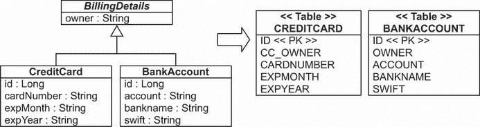
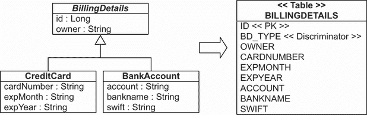
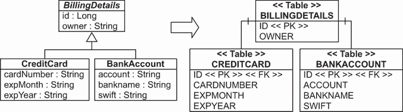
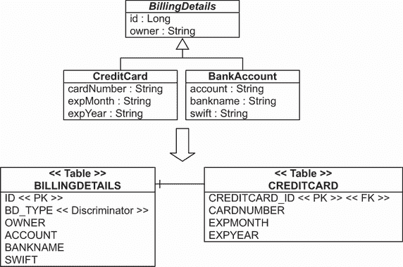
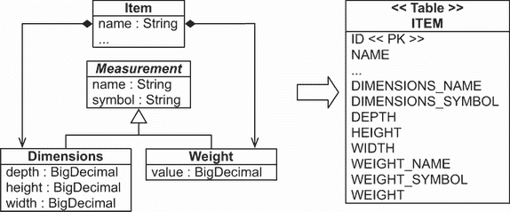
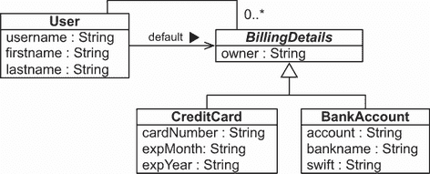

# 7 映射继承

本章涵盖

+   检查继承映射策略

+   调查多态关联

到目前为止，我们故意没有过多地讨论继承映射。映射建立了面向对象世界和关系世界之间的联系，但继承是面向对象系统的特性。因此，将类层次映射到表可能是一个复杂的问题，我们将在本章中展示各种策略。

将类映射到数据库表的基本策略可能是“每个持久化实体类一个表”。这种方法听起来足够简单，并且确实在遇到继承之前工作得很好。

继承是面向对象和关系世界之间的一种明显的结构不匹配，因为面向对象模型提供了“是”和“有”的关系。基于 SQL 的模型只提供“有”的关系；基于 SQL 的数据库管理系统不支持类型继承，即使它可用，通常也是专有的或不完整的。

有四种不同的策略来表示继承层次：

+   每个具体类使用一个表，并默认启用运行时多态行为。

+   每个具体类使用一个表，但完全从 SQL 模式中丢弃多态性和继承关系。使用 SQL `UNION` 查询来实现运行时多态行为。

+   每个类层次使用一个表：通过非规范化 SQL 模式启用多态性，并依赖于基于行的区分来确定超类型和子类型。

+   每个子类使用一个表：将“是”关系（继承）表示为“有”关系（外键），并使用 SQL `JOIN` 操作。

本章采用自顶向下的方法，假设我们从领域模型开始，试图推导出一个新的 SQL 模式。这里描述的映射策略，如果你是从现有的数据库表开始的，也是同样相关的。我们将检查一些技巧，以帮助你处理不完美的表布局。

## 7.1 每个具体类一个表，具有隐式多态

我们正在开发 CaveatEmptor 应用程序，为类层次实现持久化。我们可以坚持最简单的方法建议：每个具体类恰好使用一个表。我们可以将类的所有属性，包括继承属性，映射到表的列中，如图 7.1 所示。

注意：要能够执行本章源代码中的示例，您首先需要运行 Ch07.sql 脚本。



图 7.1 将所有具体类映射到独立表

依赖于这种隐式多态，我们将使用 `@Entity` 映射具体类，就像通常一样。默认情况下，超类的属性被忽略且不持久化！我们必须在超类上注解 `@MappedSuperclass` 以启用其属性在具体子类表中的嵌入；参见列表 7.1，它位于 mapping-inheritance-mappedsuperclass 文件夹中。

列表 7.1 映射 `BillingDetails`（抽象超类）并使用隐式多态

```
Path: Ch07/mapping-inheritance-mappedsuperclass/src/main/java/com/manning
➥ /javapersistence/ch07/model/BillingDetails.java

@MappedSuperclass
\1 BillingDetails {
       @Id
       @GeneratedValue(generator = "ID_GENERATOR")
       private Long id;

    @NotNull
    private String owner;
    //  . . .
}
```

现在，我们将映射具体子类。

列表 7.2 映射 `CreditCard`（具体子类）

```
Path: Ch07/mapping-inheritance-mappedsuperclass/src/main/java/com/manning
➥ /javapersistence/ch07/model/CreditCard.java

@Entity
@AttributeOverride(
        name = "owner",
        column = @Column(name = "CC_OWNER", nullable = false))
public class CreditCard extends BillingDetails {

    @NotNull
    private String cardNumber;

    @NotNull
    private String expMonth;

    @NotNull
    private String expYear;

    //  . . .
}
```

我们可以在子类中使用 `@AttributeOverride` 注解覆盖从超类继承的列映射。从 JPA 2.2 开始，我们可以在同一类上使用多个 `@AttributeOverride` 注解；在 JPA 2.1 之前，我们必须在 `@AttributeOverrides` 注解内分组 `@AttributeOverride` 注解。前面的示例将 `CREDITCARD` 表中的 `OWNER` 列重命名为 `CC_OWNER`。

下面的列表显示了 `BankAccount` 子类的映射。

列表 7.3 映射 `BankAccount`（具体子类）

```
Path: Ch07/mapping-inheritance-mappedsuperclass/src/main/java/com/manning
➥ /javapersistence/ch07/model/BankAccount.java

@Entity
   public class BankAccount extends BillingDetails {

       @NotNull
       private String account;

       @NotNull
       private String bankname;

       @NotNull
       private String swift;
//  . . .
}
```

我们可以在超类中声明标识属性，为所有子类共享列名和生成策略（如列表 7.3 所示），或者我们可以在每个具体类内部重复它。

要使用这些类，我们将创建三个 Spring Data JPA 仓库接口。

列表 7.4 `BillingDetailsRepository` 接口

```
Path: Ch07/mapping-inheritance-mappedsuperclass/src/main/java/com/manning
➥ /javapersistence/ch07/repositories/BillingDetailsRepository.java

@NoRepositoryBean
public interface BillingDetailsRepository<T extends BillingDetails, ID>
                 extends JpaRepository<T, ID> {
    List<T> findByOwner(String owner);
}
```

在前面的列表中，`BillingDetailsRepository` 接口被注解为 `@NoRepositoryBean`。这阻止了其作为 Spring Data JPA 仓库实例的实例化。这是必要的，因为根据图 7.1 的模式，将没有 `BILLINGDETAILS` 表。然而，`BillingDetailsRepository` 接口意图被仓库接口扩展以处理 `CreditCard` 和 `BankAccount` 子类。这就是为什么 `BillingDetailsRepository` 通过一个扩展 `BillingDetails` 的 `T` 进行泛型化。此外，它还包含 `findByOwner` 方法。`BillingDetails` 中的 `owner` 字段将包含在 `CREDITCARD` 和 `BANKACCOUNT` 表中。

现在，我们将创建另外两个 Spring Data 仓库接口。

列表 7.5 `BankAccountRepository` 接口

```
Path: Ch07/mapping-inheritance-mappedsuperclass/src/main/java/com/manning
➥ /javapersistence/ch07/repositories/BankAccountRepository.java

public interface BankAccountRepository
       extends BillingDetailsRepository<BankAccount, Long> {
    List<BankAccount> findBySwift(String swift);
}
```

`BankAccountRepository` 接口扩展了 `BillingDetailsRepository`，通过 `BankAccount` 泛型化（因为它处理 `BankAccount` 实例）和通过 `Long` 泛型化（因为类的 ID 是这种类型）。它添加了 `findBySwift` 方法，其名称遵循 Spring Data JPA 规范（见第四章）。

列表 7.6 `CreditCardRepository` 接口

```
Path: Ch07/mapping-inheritance-mappedsuperclass/src/main/java/com/manning
➥ /javapersistence/ch07/repositories/CreditCardRepository.java

public interface CreditCardRepository
       extends BillingDetailsRepository<CreditCard, Long> {
    List<CreditCard> findByExpYear(String expYear);
}
```

`CreditCardRepository` 接口扩展了 `BillingDetailsRepository`，通过 `CreditCard` 泛型化（因为它处理 `CreditCard` 实例）和通过 `Long` 泛型化（因为类的 ID 是这种类型）。它添加了 `findByExpYear` 方法，其名称遵循 Spring Data JPA 规范（见第四章）。

我们将创建以下测试来检查持久化代码的功能。

列表 7.7 测试持久化代码的功能

```
Path: Ch07/mapping-inheritance-mappedsuperclass/src/test/java/com/manning
➥ /javapersistence/ch07/MappingInheritanceSpringDataJPATest.java

@ExtendWith(SpringExtension.class)                                         Ⓐ
@ContextConfiguration(classes = {SpringDataConfiguration.class})           Ⓑ
public class MappingInheritanceSpringDataJPATest {

    @Autowired                                                             Ⓒ
    private CreditCardRepository crediCardRepository;                      Ⓒ

    @Autowired                                                             Ⓓ
    private BankAccountRepository bankAccountRepository;                   Ⓓ

    @Test
    void storeLoadEntities() {

        CreditCard creditCard = new CreditCard(                            Ⓔ
                   "John Smith", "123456789", "10", "2030");               Ⓔ
        creditCardRepository.save(creditCard);                             Ⓔ

        BankAccount bankAccount = new BankAccount(                         Ⓕ
                   "Mike Johnson", "12345", "Delta Bank", "BANKXY12");     Ⓕ
        bankAccountRepository.save(bankAccount);                           Ⓕ

        List<CreditCard> creditCards =                                     Ⓖ
            creditCardRepository.findByOwner("John Smith");                Ⓖ
        List<BankAccount> bankAccounts =                                   Ⓗ
            bankAccountRepository.findByOwner("Mike Johnson");             Ⓗ
        List<CreditCard> creditCards2 =                                    Ⓘ
            creditCardRepository.findByExpYear("2030");                    Ⓘ
        List<BankAccount> bankAccounts2 =                                  Ⓙ
            bankAccountRepository.findBySwift("BANKXY12");                 Ⓙ

assertAll(
        () -> assertEquals(1, creditCards.size()),                         Ⓚ
        () -> assertEquals("123456789",                                    Ⓛ
              creditCards.get(0).getCardNumber()),                         Ⓛ
        () -> assertEquals(1, bankAccounts.size()),                        Ⓜ
        () -> assertEquals("12345",                                        Ⓝ
              bankAccounts.get(0).getAccount()),                           Ⓝ
        () -> assertEquals(1, creditCards2.size()),                        Ⓞ
        () -> assertEquals("John Smith",                                   Ⓟ
              creditCards2.get(0).getOwner()),                             Ⓟ
        () -> assertEquals(1, bankAccounts2.size()),                       Ⓠ
        () -> assertEquals("Mike Johnson",                                 Ⓡ
              bankAccounts2.get(0).getOwner())                             Ⓡ
);

    }
}
```

Ⓐ 使用`SpringExtension`扩展测试。这个扩展用于将 Spring 测试上下文与 JUnit 5 Jupiter 测试集成。

Ⓑ 使用在`SpringDataConfiguration`类中定义的 bean 配置 Spring 测试上下文。

Ⓒ 通过 Spring 自动装配注入`CreditCardRepository`对象。

Ⓓ 通过 Spring 自动装配注入`BankAccountRepository`对象。这是可能的，因为`CreditCardRepository`和`BankAccountRepository`所在的`com.manning.javapersistence.ch07.repositories`包被用作`SpringDataConfiguration`类上`@EnableJpaRepositories`注解的参数。要回忆`SpringDataConfiguration`类的样子，请参阅第二章。

Ⓔ 创建一张信用卡并将其保存到仓库中。

Ⓕ 创建一个银行账户并将其保存到仓库中。

Ⓖ 获取所有以 John Smith 为所有者的信用卡列表。

Ⓗ 获取所有以 Mike Johnson 为所有者的银行账户列表。

Ⓘ 获取 2030 年到期信用卡。

Ⓙ 获取拥有 SWIFT BANKXY12 的银行账户。

Ⓚ 检查信用卡列表的大小。

Ⓛ 获取列表中第一张信用卡的编号。

Ⓜ 检查银行账户列表的大小。

Ⓝ 检查列表中第一个银行账户的数量。

Ⓞ 检查 2030 年到期信用卡列表的大小。

Ⓟ 检查此列表中第一张信用卡的所有者。

Ⓠ 检查拥有 SWIFT BANKXY12 银行账户的账户列表的大小。

Ⓡ 检查此列表中第一个银行账户的所有者。

本章的源代码还演示了如何使用 JPA 和 Hibernate 测试这些类。

隐式继承映射的主要问题是它不支持多态关联。在数据库中，我们通常将关联表示为外键关系。在图 7.1 的方案中，如果所有子类都映射到不同的表，那么到其超类（抽象的`BillingDetails`）的多态关联就无法表示为一个简单的外键关系。我们不能有另一个实体通过外键“引用`BILLINGDETAILS`”——没有这样的表。这在领域模型中会存在问题，因为`BillingDetails`与`User`相关联；`CREDITCARD`和`BANKACCOUNT`表都需要一个外键引用到`USERS`表。这些问题都无法轻易解决，因此我们应该考虑一种替代的映射策略。

返回与查询类接口匹配的所有类实例的多态查询也存在问题。Hibernate 必须对超类执行多个 SQL `SELECT`查询——每个具体的子类一个。JPA 查询`select bd from BillingDetails bd`需要两个 SQL 语句：

```
select
    ID, OWNER, ACCOUNT, BANKNAME, SWIFT
from
    BANKACCOUNT
select
    ID, CC_OWNER, CARDNUMBER, EXPMONTH, EXPYEAR
from
    CREDITCARD
```

Hibernate 或使用 Hibernate 的 Spring Data JPA 对每个具体子类使用单独的 SQL 查询。另一方面，对具体类的查询既简单又表现良好——Hibernate 只使用一条语句。

这种映射策略的进一步概念问题是，不同表中的几个不同列具有完全相同的语义。这使得模式演变更加复杂。例如，更改超类属性的名称或类型会导致多个表中的多个列发生变化。许多由您的 IDE 提供的标准重构操作都需要手动调整，因为自动程序通常不考虑像 `@AttributeOverride` 或 `@AttributeOverrides` 这样的东西。实现适用于所有子类的数据库完整性约束要困难得多。

我们只推荐这种方法用于类层次结构的顶层，在那里通常不需要多态，并且未来修改超类的可能性不大。这可能适用于您在现实生活中的应用程序中遇到的特定领域模型，但它不适合 CaveatEmptor 领域模型，其中查询和其他实体引用 `BillingDetails`。我们将寻找其他替代方案。

通过 SQL `UNION` 操作的帮助，我们可以消除大多数与多态查询和关联相关的问题。

## 7.2 每个具体类一个表与联合

让我们考虑一个具有 `BillingDetails` 作为抽象类（或接口）的联合子类映射，就像上一节中那样。在这种情况下，又有两个表和重复在两个表中的超类列：`CREDITCARD` 和 `BANKACCOUNT`。这里的新特点是声明在超类上的一个称为 `TABLE_PER_CLASS` 的继承策略，如下面的列表所示。源代码可以在 `mapping-inheritance-tableperclass` 文件夹中找到。

注意：JPA 标准指定 `TABLE_PER_CLASS` 是可选的，因此并非所有 JPA 实现都支持它。

列表 7.8 使用 `TABLE_PER_CLASS` 映射 `BillingDetails`

```
Path: Ch07/mapping-inheritance-tableperclass/src/main/java/com/manning
➥ /javapersistence/ch07/model/BillingDetails.java

@Entity
@Inheritance(strategy = InheritanceType.TABLE_PER_CLASS)
public abstract class BillingDetails {
    @Id
    @GeneratedValue(generator = “ID_GENERATOR”)
    private Long id;
    @NotNull
    private String owner;
    //  . . .
}
```

数据库标识符及其映射必须在超类中存在，以便在所有子类及其表中共享。这不再是可选的，就像之前的映射策略那样。`CREDITCARD` 和 `BANKACCOUNT` 表都有 `ID` 主键列。所有具体类映射都从超类（或接口）继承持久属性。每个子类上的 `@Entity` 注解就足够了。

列表 7.9 `CreditCard` 映射

```
Path: Ch07/mapping-inheritance-tableperclass/src/main/java/com/manning
➥ /javapersistence/ch07/model/CreditCard.java

@Entity
@AttributeOverride(
        name = "owner",
        column = @Column(name = "CC_OWNER", nullable = false))
public class CreditCard extends BillingDetails {
    @NotNull
    private String cardNumber;
    @NotNull
    private String expMonth;
    @NotNull
    private String expYear;
    //  . . .
}
```

列表 7.10 `BankAccount` 映射

```
Path: Ch07/mapping-inheritance-tableperclass/src/main/java/com/manning
➥ /javapersistence/ch07/model/BankAccount.java

@Entity
public class BankAccount extends BillingDetails {
    @NotNull
    private String account;
    @NotNull
    private String bankName;
    @NotNull
    private String swift;
    //  . . .
}
```

我们将不得不更改 `BillingDetailsRepository` 接口并移除 `@NoRepositoryBean` 注解。这个更改，加上 `BillingDetails` 类现在被标注为 `@Entity`，将允许此存储库与数据库交互。这就是现在的 `BillingDetailsRepository` 接口的样子。

列表 7.11 `BillingDetailsRepository` 接口

```
Path: Ch07/mapping-inheritance-tableperclass/src/main/java/com/manning
➥ /javapersistence/ch07/model/BillingDetailsRepository.java

public interface BillingDetailsRepository<T extends BillingDetails, ID>
                 extends JpaRepository<T, ID> {
    List<T> findByOwner(String owner);
}
```

请记住，SQL 模式仍然没有意识到继承；表看起来完全一样，如图 7.1 所示。

如果`BillingDetails`是具体的，我们需要一个额外的表来存储实例。请记住，数据库表之间仍然没有关系，除了它们有一些（许多）相似的列。

如果我们检查多态查询，这种映射策略的优点将更加明显。

我们可以使用 Spring Data JPA 的`BillingDetailsRepository`接口来查询数据库，如下所示：

```
billingDetailsRepository.findAll();
```

或者，从 JPA 或 Hibernate 执行以下查询：

```
select bd from BillingDetails bd
```

这两种方法都会生成以下 SQL 语句：

```
select
    ID, OWNER, EXPMONTH, EXPYEAR, CARDNUMBER,
    ACCOUNT, BANKNAME, SWIFT, CLAZZ_
 from
    ( select
          ID, OWNER, EXPMONTH, EXPYEAR, CARDNUMBER,
          null as ACCOUNT,
          null as BANKNAME,
          null as SWIFT,
          1 as CLAZZ_
      from
          CREDITCARD
      union all
      select
          id, OWNER,
          null as EXPMONTH,
          null as EXPYEAR,
          null as CARDNUMBER,
          ACCOUNT, BANKNAME, SWIFT,
          2 as CLAZZ_
      from
          BANKACCOUNT
    ) as BILLINGDETAILS
```

这个`SELECT`语句使用一个`FROM`子句子查询从所有具体类表中检索所有`BillingDetails`实例。这些表通过`UNION`运算符组合在一起，并在中间结果中插入一个字面量（在这种情况下，`1`和`2`）；Hibernate 读取这个来根据特定行的数据实例化正确的类。联合要求组合的查询在相同的列上投影，因此你必须用`NULL`填充不存在的列。你可能想知道这个查询是否真的会比两个单独的语句表现得更好。在这里，你可以让数据库优化器找到最佳执行计划来合并来自多个表的行，而不是像 Hibernate 的多态加载引擎那样在内存中合并两个结果集。

一个重要的优点是能够处理多态关联；例如，从`User`到`BillingDetails`的关联映射现在将变得可能。Hibernate 可以使用`UNION`查询来模拟关联映射的目标作为单个表。

到目前为止，我们检查的继承映射策略不需要对 SQL 模式进行额外考虑。这种情况在下一个策略中发生了变化。

## 7.3 每个类层次结构的表

我们可以将整个类层次结构映射到一个单独的表中。这个表包括层次结构中所有类的所有属性列。额外的类型判别器列或公式的值标识了特定行表示的具体子类。图 7.2 显示了这种方法。下面的源代码可以在`mapping-inheritance-singletable`文件夹中找到。



![图 7.2 将整个类层次结构映射到单个表]

这种映射策略在性能和简单性方面都是赢家。这是表示多态的最佳性能方式——多态和非多态查询都表现良好，而且手动编写查询也很容易。无需复杂的连接或联合即可进行临时报告。模式演变简单直接。

存在一个主要问题：数据完整性。我们必须声明子类声明的属性列可以为空。如果子类各自定义了多个不可为空的属性，那么 `NOT NULL` 约束的丢失可能从数据正确性的角度来看是一个严重问题。想象一下，信用卡的到期日期是必需的，但数据库模式无法强制执行此规则，因为表的所有列都可以是 `NULL`。一个简单的应用程序编程错误可能导致无效数据。

另一个重要的问题是规范化。我们已经在非键列之间创建了函数依赖关系，违反了第三范式。像往常一样，出于性能原因的规范化可能会产生误导，因为它牺牲了长期稳定性、可维护性和数据完整性，以换取可能通过正确优化 SQL 执行计划（换句话说，询问数据库管理员）也能实现的即时收益。

我们将使用 `SINGLE_TABLE` 继承策略来创建一个表级类层次结构映射，如下所示。

列表 7.12 使用 `SINGLE_TABLE` 映射 `BillingDetails`

```
Path: Ch07/mapping-inheritance-singletable/src/main/java/com/manning
➥ /javapersistence/ch07/model/BillingDetails.java

@Entity
@Inheritance(strategy = InheritanceType.SINGLE_TABLE)
@DiscriminatorColumn(name = "BD_TYPE")
public abstract class BillingDetails {

    @Id
    @GeneratedValue(generator = "ID_GENERATOR")
    private Long id;

    @NotNull
    @Column(nullable = false)
    private String owner;

    //  . . .
}
```

继承层次结构的根类 `BillingDetails` 自动映射到 `BILLINGDETAILS` 表。超类共享属性在模式中可以是 `NOT NULL`；每个子类实例必须有一个值。Hibernate 的一个实现怪癖要求我们使用 `@Column` 声明可空性，因为当 Hibernate 生成数据库模式时，它会忽略 Bean Validation 的 `@NotNull`。

我们必须添加一个特殊的区分器列来区分每一行代表的内容。这不是实体属性；它是 Hibernate 内部使用的。列名为 `BD_TYPE`，值是字符串——在这种情况下，`"CC"` 或 `"BA"`。Hibernate 或使用 Hibernate 的 Spring Data JPA 自动设置和检索区分器值。

如果我们不在超类中指定区分器列，其名称默认为 `DTYPE`，值是字符串。继承层次结构中的所有具体类都可以有区分器值，例如 `CreditCard`。

列表 7.13 使用 `SINGLE_TABLE` 继承策略映射 `CreditCard`

```
Path: Ch07/mapping-inheritance-singletable/src/main/java/com/manning
➥ /javapersistence/ch07/model/CreditCard.java

@Entity
@DiscriminatorValue("CC")
public class CreditCard extends BillingDetails {
    @NotNull
    private String cardNumber;
    @NotNull
    private String expMonth;
    @NotNull
    private String expYear;
    //  . . .
}
```

如果没有显式的区分器值，当使用 Hibernate XML 文件时，Hibernate 默认使用完全限定类名；如果使用注解或 JPA XML 文件，则默认使用简单实体名称。请注意，JPA 没有指定非字符串区分器类型的默认值；每个持久化提供者可能有不同的默认值。因此，我们应该始终为具体类指定区分器值。

我们将使用 `@Entity` 注解每个子类，然后将子类的属性映射到 `BILLINGDETAILS` 表的列上。记住，由于 `BankAccount` 实例不会有 `expMonth` 属性，`EXPMONTH` 列必须为 `NULL`，因此架构中不允许使用 `NOT NULL` 约束。Hibernate 和 Spring Data JPA 在生成架构 DDL 时忽略 `@NotNull`，但在插入行之前在运行时观察它。这有助于我们避免编程错误；我们不希望意外保存没有到期日期的信用卡数据。（当然，其他行为不佳的应用程序仍然可以在这个数据库中存储错误数据。）

我们可以使用 Spring Data JPA 的 `BillingDetailsRepository` 接口来查询数据库，如下所示：

```
billingDetailsRepository.findAll();
```

或者，从 JPA 或 Hibernate，我们可以执行以下查询：

```
select bd from BillingDetails bd
```

这两种方法都会生成以下 SQL 语句：

```
select
    ID, OWNER, EXPMONTH, EXPYEAR, CARDNUMBER,
    ACCOUNT, BANKNAME, SWIFT, BD_TYPE
from
    BILLINGDETAILS
```

要查询 `CreditCard` 子类，我们也有其他选择。

我们可以使用 Spring Data JPA 的 `CreditCardRepository` 接口来查询数据库，如下所示：

```
creditCardRepository.findAll();
```

或者，从 JPA 或 Hibernate，我们可以执行以下查询：

```
select cc from CreditCard cc
```

Hibernate 对区分符列添加了一个限制：

```
select
    ID, OWNER, EXPMONTH, EXPYEAR, CARDNUMBER
from
    BILLINGDETAILS
where
    BD_TYPE='CC'
```

有时，尤其是在遗留架构中，我们无法在实体表中包含额外的区分符列。在这种情况下，我们可以对每一行应用一个表达式来计算一个区分符值。区分公式不是 JPA 规范的一部分，但 Hibernate 有一个扩展注解，`@DiscriminatorFormula`。

列表 7.14 使用 `@DiscriminatorFormula` 映射 `BillingDetails`

```
Path: Ch07/mapping-inheritance-singletableformula/src/main/java/com/manning
➥ /javapersistence/ch07/model/BillingDetails.java

@Entity
@Inheritance(strategy = InheritanceType.SINGLE_TABLE)
@org.hibernate.annotations.DiscriminatorFormula(
        "case when CARDNUMBER is not null then 'CC' else 'BA' end"
)
public abstract class BillingDetails {
    //  . . .
}
```

架构中没有区分符列，因此这种映射依赖于 SQL 的 `CASE/WHEN` 表达式来确定特定行是否代表信用卡或银行账户（许多开发者从未使用过这种类型的 SQL 表达式；如果你不熟悉它，请查看 ANSI 标准）。表达式的结果是声明在子类映射中的字面量，`CC` 或 `BA`。

表-类层次结构策略的缺点可能对你的设计来说过于严重——非规范化架构可能会在长期内成为主要负担，你的 DBA 可能根本不喜欢它。下一个继承映射策略不会让你面临这个问题。

## 7.4 表-子类与连接

第四种选项是将继承关系表示为 SQL 外键关联。每个声明持久属性（包括抽象类甚至接口）的类或子类都有自己的表。以下源代码可以在 mapping-inheritance-joined 文件夹中找到。

与我们最初映射的表-具体类策略不同，这里的具体 `@Entity` 表只包含子类本身声明的非继承属性列，以及也是超类表外键的主键。这比听起来容易；看看图 7.3。



图 7.3 将层次结构中的所有类映射到它们自己的表

如果我们使`CreditCard`子类实例持久化，Hibernate 将插入两行：`BillingDetails`超类声明的属性值存储在`BILLINGDETAILS`表的新行中。只有子类声明的属性值存储在`CREDITCARD`表的新行中。两行共享的主键将它们链接在一起。稍后，可以通过将子类表与超类表连接来从数据库中检索子类实例。

这种策略的主要优势是它使 SQL 模式规范化。模式演变和完整性约束定义简单明了。引用特定子类表的表的外键可能代表对该特定子类的多态关联。我们将使用`JOINED`继承策略创建按子类创建的表层次结构映射。

列表 7.15 使用`JOINED`映射`BillingDetails`

```
Path: Ch07/mapping-inheritance-joined/src/main/java/com/manning
➥ /javapersistence/ch07/model/BillingDetails.java

@Entity
@Inheritance(strategy = InheritanceType.JOINED)
public abstract class BillingDetails {
    @Id
    @GeneratedValue(generator = "ID_GENERATOR")
    private Long id;
    @NotNull
    private String owner;

    //  . . .
}
```

根类`BillingDetails`映射到`BILLINGDETAILS`表。请注意，此策略不需要使用鉴别器。

在子类中，如果子类表的主键列具有（或应该具有）与超类表的主键列相同的名称，我们不需要指定连接列。在以下列表中，`BankAccount`将是`BillingDetails`的子类。

列表 7.16 映射 `BankAccount`（具体类）

```
Path: Ch07/mapping-inheritance-joined/src/main/java/com/manning
➥ /javapersistence/ch07/model/BankAccount.java

@Entity
public class BankAccount extends BillingDetails {

    @NotNull
    private String account;

    @NotNull
    private String bankname;

    @NotNull
    private String swift;

    //  . . .
}
```

该实体没有标识符属性；它自动继承自超类的`ID`属性和列，如果我们要检索`BankAccount`实例，Hibernate 知道如何连接表。

当然，我们可以通过使用`@PrimaryKeyJoinColumn`注解显式指定列名，如下所示。

列表 7.17 映射 `CreditCard`

```
Path: Ch07/mapping-inheritance-joined/src/main/java/com/manning
➥ /javapersistence/ch07/model/CreditCard.java

@Entity
@PrimaryKeyJoinColumn(name = "CREDITCARD_ID")
public class CreditCard extends BillingDetails {
    @NotNull
    private String cardNumber;
    @NotNull
    private String expMonth;
    @NotNull
    private String expYear;
    //  . . .
}
```

`BANKACCOUNT`和`CREDITCARD`表的主键列各自也有一个外键约束，该约束引用`BILLINGDETAILS`表的主键。

我们可以使用 Spring Data JPA 的`BillingDetailsRepository`接口查询数据库，如下所示：

```
billingDetailsRepository.findAll();
```

或者，从 JPA 或 Hibernate 中，我们可以执行以下查询：

```
select bd from BillingDetails bd
```

Hibernate 依赖于 SQL 外连接，并将生成以下内容：

```
select
    BD.ID, BD.OWNER,
    CC.EXPMONTH, CC.EXPYEAR, CC.CARDNUMBER,
    BA.ACCOUNT, BA.BANKNAME, BA.SWIFT,
    case
        when CC.CREDITCARD_ID is not null then 1
        when BA.ID is not null then 2
        when BD.ID is not null then 0
    end
from
    BILLINGDETAILS BD
    left outer join CREDITCARD CC on BD.ID=CC.CREDITCARD_ID
    left outer join BANKACCOUNT BA on BD.ID=BA.ID
```

SQL 的`CASE . . . WHEN`子句检测子类表`CREDITCARD`和`BANKACCOUNT`中的行是否存在（或不存在），因此 Hibernate 或使用 Hibernate 的 Spring Data 可以确定`BILLINGDETAILS`表的特定行的具体子类。

对于这样的狭窄子类查询，

```
creditCardRepository.findAll();
```

或者这样，

```
select cc from CreditCard cc,
```

Hibernate 使用内连接：

```
select
    CREDITCARD_ID, OWNER, EXPMONTH, EXPYEAR, CARDNUMBER
from
    CREDITCARD
    inner join BILLINGDETAILS on CREDITCARD_ID=ID
```

如您所见，这种映射策略手动实现起来更为复杂——即使是临时报告也更为复杂。如果您计划将 Spring Data JPA 或 Hibernate 代码与手写的 SQL 混合使用，这是一个重要的考虑因素。一种常见的方法和可移植的解决方案可能是使用 JPQL（Jakarta Persistence Query Language）并使用 JPQL 查询注解方法。

此外，尽管这种映射策略表面上看起来很简单，但我们的经验是，对于复杂的类层次结构，性能可能无法接受。查询总是需要跨多个表或多个顺序读取。

使用连接和区分器的继承

Hibernate 不需要一个特殊的区分器数据库列来实现 `InheritanceType.JOINED` 策略，JPA 规范也没有任何要求。SQL `SELECT` 语句中的 `CASE` `.` `.` `.` `WHEN` 子句是一种区分检索到的每一行实体类型的智能方式。

然而，你可能在其他地方找到的一些 JPA 示例使用了 `InheritanceType.JOINED` *和* 一个 `@DiscriminatorColumn` 映射。显然，一些其他的 JPA 提供商不使用 `CASE` `.` `.` `.` `WHEN` 子句，并且仅依赖于一个区分值，即使是对于 `InheritanceType.JOINED` 策略。Hibernate 不需要区分器，但使用声明的 `@DiscriminatorColumn`，即使在 `JOINED` 映射策略中也是如此。如果你更喜欢忽略 `JOINED`（在较旧的 Hibernate 版本中已被忽略）的区分器映射，请启用配置属性 `hibernate .discriminator.ignore_explicit_for_joined`。

在我们探讨何时应该选择哪种策略之前，让我们考虑在单个类层次结构中混合继承映射策略。

## 7.5 混合继承策略

我们可以使用 `TABLE_PER_CLASS`、`SINGLE_TABLE` 或 `JOINED` 策略来映射整个继承层次结构。我们不能混合它们——例如，从具有区分器的表层次结构切换到规范化的表层次结构策略。一旦我们决定了一个继承策略，我们就必须坚持使用它。

然而，这并不完全正确。通过使用一些技巧，我们可以切换特定子类的映射策略。例如，我们可以将类层次结构映射到单个表中，但对于特定的子类，可以切换到使用外键映射策略的单独表中，就像在表层次结构中一样。查看图 7.4 中的模式。下面的源代码可以在 `mapping-inheritance-mixed` 文件夹中找到。



图 7.4 将子类分离到其自己的二级表

我们将使用 `InheritanceType.SINGLE_TABLE` 映射超类 `BillingDetails`，就像之前做的那样。然后我们将我们想要从单表中分离出来的 `CreditCard` 子类映射到一个二级表中。

列表 7.18 映射 `CreditCard`

```
Path: Ch07/mapping-inheritance-mixed/src/main/java/com/manning
➥ /javapersistence/ch07/model/CreditCard.java

@Entity
@DiscriminatorValue("CC")
@SecondaryTable(
        name = "CREDITCARD",
        pkJoinColumns = @PrimaryKeyJoinColumn(name = "CREDITCARD_ID")
)
public class CreditCard extends BillingDetails {
    @NotNull
    @Column(table = "CREDITCARD", nullable = false)
    private String cardNumber;

    @Column(table = "CREDITCARD", nullable = false)
    private String expMonth;

    @Column(table = "CREDITCARD", nullable = false)
    private String expYear;
    //  . . .
}
```

`@SecondaryTable` 和 `@Column` 注解将一些属性分组并告诉 Hibernate 从辅助表中获取它们。我们使用辅助表的名字来映射我们移动到辅助表中的所有属性。这是通过 `@Column` 的 `table` 参数实现的，我们之前没有展示过。这种映射有许多用途，你将在本书后面的内容中再次看到它。在这个例子中，它将 `CreditCard` 属性从单表策略中分离到 `CREDITCARD` 表中。如果我们想添加一个新的类来扩展 `BillingDetails`，例如 `Paypal`，这将是一个可行的解决方案。

这个表的 `CREDITCARD_ID` 列也是主键，并且有一个外键约束引用单继承表中的 `ID`。如果我们没有指定辅助表的主键连接列，则使用单继承表的主键名称——在这种情况下，是 `ID`。

记住，`InheritanceType.SINGLE_TABLE` 强制所有子类的列都必须是可空的。这种映射的一个好处是，我们现在可以声明 `CREDITCARD` 表的列作为 `NOT NULL`，从而保证数据完整性。

在运行时，Hibernate 执行一个外连接来多态地获取 `BillingDetails` 和所有子类实例：

```
select
    ID, OWNER, ACCOUNT, BANKNAME, SWIFT,
    EXPMONTH, EXPYEAR, CARDNUMBER,
    BD_TYPE
from
    BILLINGDETAILS
    left outer join CREDITCARD on ID=CREDITCARD_ID
```

我们也可以将这个技巧用于类层次结构中的其他子类。对于异常广泛的类层次结构，外连接可能会成为一个问题。一些数据库系统（例如 Oracle）限制了外连接操作中表的数量。对于广泛的层次结构，你可能想要切换到不同的获取策略，该策略执行一个立即的第二 SQL 查询而不是外连接。

## 7.6 嵌入类继承

嵌入类是其所属实体的一个组成部分，因此本章中介绍的正常实体继承规则不适用。作为 Hibernate 扩展，我们可以映射一个嵌入类，该类从超类（或接口）继承一些持久属性。让我们考虑拍卖物品的两个新属性：尺寸和重量。

一个项目的尺寸是其宽度、高度和深度，以给定的单位和其符号表示：例如，英寸 (`"`) 或厘米 (`cm`)。一个项目的重量也携带一个度量单位：例如，磅 (`lbs`) 或千克 (`kg`)。为了捕获度量（名称和符号）的常见属性，我们将为 `Dimensions` 和 `Weight` 定义一个名为 `Measurement` 的超类。接下来的源代码可以在 `mapping-inheritance-embeddable` 文件夹中找到。

列表 7.19 映射 `Measurement` 抽象嵌入超类

```
Path: Ch07/mapping-inheritance-embeddable/src/main/java/com/manning
➥ /javapersistence/ch07/model/Measurement.java

@MappedSuperclass
public abstract class Measurement {
    @NotNull
    private String name;
    @NotNull
    private String symbol;
    //  . . .
}
```

我们在映射的嵌入类超类上使用了 `@MappedSuperclass` 注解，就像我们会对一个实体做的那样。子类将继承这个类的属性作为持久属性。

我们将定义 `Dimensions` 和 `Weight` 子类为 `@Embeddable`。对于 `Dimensions`，我们将覆盖所有超类属性并添加一个列名前缀。

列表 7.20 映射`Dimensions`类

```
Path: Ch07/mapping-inheritance-embeddable/src/main/java/com/manning
➥ /javapersistence/ch07/model/Dimensions.java

@Embeddable
@AttributeOverride(name = "name",
        column = @Column(name = "DIMENSIONS_NAME"))
@AttributeOverride(name = "symbol",
        column = @Column(name = "DIMENSIONS_SYMBOL"))
public class Dimensions extends Measurement {
    @NotNull
    private BigDecimal depth;
    @NotNull
    private BigDecimal height;
    @NotNull
    private BigDecimal width;
    //  . . .
}
```

如果没有这个覆盖，同时嵌入`Dimensions`和`Weight`的`Item`将映射到一个具有冲突列名的表。

接下来是`Weight`类；其映射也覆盖了列名前缀（为了统一，我们避免与之前的覆盖冲突）。

列表 7.21 映射`Weight`类

```
Path: Ch07/mapping-inheritance-embeddable/src/main/java/com/manning
➥ /javapersistence/ch07/model/Weight.java

@Embeddable
@AttributeOverride(name = "name",
        column = @Column(name = "WEIGHT_NAME"))
@AttributeOverride(name = "symbol",
        column = @Column(name = "WEIGHT_SYMBOL"))
public class Weight extends Measurement {
    @NotNull
    @Column(name = "WEIGHT")
    private BigDecimal value;
    //  . . .
}
```

拥有实体`Item`定义了两个常规持久化嵌入式属性。

列表 7.22 映射`Item`类

```
Path: Ch07/mapping-inheritance-embeddable/src/main/java/com/manning
➥ /javapersistence/ch07/model/Item.java

@Entity
public class Item {
    private Dimensions dimensions;
    private Weight weight;
    //  . . .
}
```

图 7.5 展示了这种映射。



图 7.5 映射具有继承属性的实体类

或者，我们可以在`Item`类中覆盖嵌入式属性的冲突`Measurement`列名，正如在第 6.2 节中演示的那样。然而，我们更喜欢在`@Embeddable`类中一次性覆盖它们，这样这些类的消费者就不必解决冲突。

一个需要注意的陷阱是将抽象超类类型（如`Measurement`）的属性嵌入到实体（如`Item`）中。这永远不可能工作；JPA 提供者不知道如何以多态方式存储和加载`Measurement`实例。它没有必要的信息来决定数据库中的值是`Dimensions`还是`Weight`实例，因为没有区分器。这意味着虽然我们*可以*让`@Embeddable`类从`@MappedSuperclass`继承一些持久化属性，但*引用*实例不是多态的——它总是指一个具体类。

将此与第 6.3.2 节中“转换组件属性”部分检查的嵌入式类的替代继承策略进行比较，该策略支持多态性，但需要一些自定义类型区分代码。

接下来，我们将提供一些关于如何为应用程序的类层次结构选择合适的映射策略的技巧。

## 7.7 选择策略

您选择的继承映射策略将取决于超类在实体层次结构中的使用方式。您必须考虑您查询超类实例的频率以及您是否有针对超类的关联。另一个重要方面是超类和子类的属性：子类是否具有许多额外的属性，或者是否仅与超类有不同的行为。以下是一些经验法则：

+   如果您不需要多态关联或查询，则倾向于按具体类创建表——换句话说，如果您从不或很少`select` `bd` `from BillingDetails bd`，并且没有具有`BillingDetails`关联的类。应首选基于显式`UNION`映射的`InheritanceType.TABLE_PER_CLASS`，因为（优化后的）多态查询和关联将在以后成为可能。

+   如果你确实需要多态关联（一个指向超类的关联，因此指向在运行时动态解析的具体类）或查询，并且子类声明了相对较少的属性（尤其是如果子类之间的主要区别在于它们的行为），则倾向于使用 `InheritanceType.SINGLE_TABLE`。如果这涉及到设置尽可能少的可空列，则可以选择这种方法。你需要说服自己（以及数据库管理员），非规范化的模式在长期内不会造成问题。

+   如果你确实需要多态关联或查询，并且子类声明了许多（非可选）属性（子类主要在它们持有的数据上有所不同），则倾向于使用 `InheritanceType.JOINED`。或者，根据继承层次结构的宽度和深度以及连接与联合的可能成本，使用 `InheritanceType.TABLE_PER_CLASS`。这个决定可能需要评估带有真实数据的 SQL 执行计划。

默认情况下，仅对于简单问题选择 `InheritanceType.SINGLE_TABLE`。对于复杂情况，或者当数据模型师坚持认为 `NOT NULL` 约束和规范化比你的需求更重要时，你应该考虑 `Inheritance-Type .JOINED` 策略。在这种情况下，你应该问自己，是否可能将继承在类模型中重新建模为代理更好。由于各种与持久化或 ORM 无关的原因，复杂的继承通常最好避免。Hibernate 作为领域模型和关系模型之间的缓冲区，但这并不意味着在设计类时可以完全忽略持久化问题。

当你开始考虑混合继承策略时，你必须记住，Hibernate 中的隐式多态足够智能，可以处理复杂的情况。此外，你必须考虑，你无法在接口上放置继承注解；这在 JPA 中没有标准化。

例如，假设你需要在 CaveatEmptor 应用程序中添加一个接口：`ElectronicPaymentOption`。这是一个没有持久化方面的业务接口，除了持久化类如 `CreditCard` 可能会实现这个接口。无论我们如何映射 `BillingDetails` 层次结构，Hibernate 都可以正确地回答查询 `select o from ElectronicPaymentOption o`。即使其他不属于 `BillingDetails` 层次结构的类被映射为持久化并实现这个接口，这也同样适用。Hibernate 总是知道要查询哪些表，要构造哪些实例，以及如何返回多态结果。

我们可以将所有映射策略应用于抽象类。即使我们查询或加载它，Hibernate 也不会尝试实例化一个抽象类。

我们多次提到了`User`和`BillingDetails`之间的关系，并探讨了它如何影响继承映射策略的选择。在接下来的最后一节中，我们将详细探讨这个更高级的主题：多态关联。如果你现在模型中没有这样的关系，你可能希望在遇到应用程序中的问题时再回过头来研究这个主题。

## 7.8 多态关联

多态是像 Java 这样的面向对象语言的一个定义性特征。对多态关联和多态查询的支持是像 Hibernate 这样的 ORM 解决方案的一个基本特性。令人惊讶的是，我们设法走到了这里而不需要过多地谈论多态。令人耳目一新的是，关于这个话题没有太多可说的——多态在 Hibernate 中如此容易使用，以至于我们不需要花费太多精力来解释它。

为了提供一个概述，我们首先考虑一个可能具有子类的一个到多关联，然后是一个多对一关系。对于这两个例子，领域模型中的类是相同的；参见图 7.6。



图 7.6 一个用户默认的账单详情要么是信用卡要么是银行账户。

### 7.8.1 多态多对一关联

首先，考虑`User`的`defaultBilling`属性。它引用了一个特定的`BillingDetails`实例，在运行时可以是该类任何具体的实例。下面的源代码可以在`mapping-inheritance-manytoone`文件夹中找到。

我们将把这个单向关联映射到抽象类`BillingDetails`，如下所示：

```
Path: Ch07/mapping-inheritance-manytoone/src/main/java/com/manning
➥ /javapersistence/ch07/model/User.java

@Entity
@Table(name = "USERS")
public class User {
    @ManyToOne
    private BillingDetails defaultBilling;
    //  . . .
}
```

`USERS`表现在有一个表示这个关系的连接/外键列`DEFAULTBILLING_ID`。它是一个可空列，因为一个`User`可能没有分配默认的账单方法。因为`BillingDetails`是抽象的，所以关联必须在运行时引用其子类之一——`CreditCard`或`BankAccount`。

在 Hibernate 中启用多态关联不需要做任何特殊的事情。如果一个关联的目标类用`@Entity`和`@Inheritance`映射，那么这个关联就是自然的多态的。

下面的 Spring Data JPA 代码演示了创建一个到`CreditCard`子类实例的关联：

```
Path: Ch07/mapping-inheritance-manytoone/src/test/java/com/manning
➥ /javapersistence/ch07/MappingInheritanceSpringDataJPATest.java

CreditCard creditCard = new CreditCard(
    "John Smith", "123456789", "10", "2030"
);
User john = new User("John Smith");
john.setDefaultBilling(creditCard);
   creditCardRepository.save(creditCard);
   userRepository.save(john);
```

现在，当我们在一个工作单元中导航这个关联时，Hibernate 会自动检索`CreditCard`实例：

```
List<User> users = userRepository.findAll();
users.get(0).getDefaultBilling().pay(123);
```

这里的第二行将调用`BillingDetails`具体子类的`pay`方法。

我们可以以相同的方式处理一对一关联。那么对于多对一关联，比如每个`User`的`billingDetails`集合，怎么办呢？让我们接下来看看。

### 7.8.2 多态集合

一个 `User` 可能会引用多个 `BillingDetails`，而不仅仅是单个默认值（许多中的一个可能是默认值，但现在我们忽略这一点）。我们可以通过双向 *一对多* 关联来映射这一点。接下来的源代码可以在 `mapping-inheritance-onetomany` 文件夹中找到。

```
Path: Ch07/mapping-inheritance-onetomany/src/main/java/com/manning
➥ /javapersistence/ch07/model/User.java

@Entity
@Table(name = "USERS")
public class User {
    @OneToMany(mappedBy = "user")
    private Set<BillingDetails> billingDetails = new HashSet<>();
    //  . . .
}
```

接下来，这是关系的拥有方（在前一个映射中用 `mappedBy` 声明）。通过“拥有方”，我们指的是在数据库中拥有外键的关系那一方，在这个例子中是 `BillingDetails`。

```
Path: Ch07/mapping-inheritance-onetomany/src/main/java/com/manning
➥ /javapersistence/ch07/model/BillingDetails.java

@Entity
@Inheritance(strategy = InheritanceType.TABLE_PER_CLASS)
public abstract class BillingDetails {
    @ManyToOne
    private User user;
    //  . . .
}
```

到目前为止，这种关联映射并没有什么特别之处。`BillingDetails` 类层次结构可以使用 `TABLE_PER_CLASS`、`SINGLE_TABLE` 或 `JOINED` 继承类型进行映射。Hibernate 足够智能，在加载集合元素时，会使用正确的 SQL 查询，无论是使用 `JOIN` 还是 `UNION` 操作符。

然而，有一个限制：如第 7.1 节所述，`BillingDetails` 类不能是 `@MappedSuperclass`。它必须使用 `@Entity` 和 `@Inheritance` 进行映射。

## 摘要

+   按具体类表与隐式多态是映射实体继承层次结构的最简单策略，但它并不很好地支持多态关联。

+   来自不同表的列具有完全相同的语义，这使得模式演变更加复杂。

+   这种按具体类表的方法仅推荐用于类层次结构的顶层，因为在这些地方通常不需要多态性，并且未来修改超类不太可能。

+   按具体类表与并集的策略是可选的，并且 JPA 实现可能不支持它，但它确实处理了多态关联。

+   按类层次结构表的方法在性能和简单性方面都是赢家。可以执行临时报告，而无需复杂的连接或并集操作，并且模式演变是直接的。

+   单表策略的一个主要问题是数据完整性，因为我们必须将一些列声明为可空的。另一个关注点是规范化：这种策略在非键列之间创建了函数依赖关系，违反了第三范式。

+   按子类表连接的策略的主要优点是它使 SQL 模式规范化，使得模式演变和完整性约束定义变得直接。缺点是手动实现更困难，并且对于复杂的类层次结构，性能可能无法接受。
