# 8 映射集合和实体关联

本章涵盖

+   映射持久集合

+   检查基本类型和可嵌入类型的集合

+   调查简单的多对一和一对多实体关联

许多开发者在开始使用 Hibernate 或 Spring Data JPA 时，首先尝试做的事情是映射一个 *父/子关系*。这通常是它们第一次遇到集合。这也是他们第一次必须考虑实体和价值类型之间的区别，或者陷入 ORM 的复杂性中。

管理类之间的关联和表之间的关系是 ORM 的核心。在实现 ORM 解决方案时遇到的许多难题都与集合和实体关联管理有关。我们将从一些基本的集合映射概念和简单示例开始本章。之后，你将准备好处理实体关联中的第一个集合——我们将在下一章回到更复杂的实体关联映射。为了全面了解，我们建议你阅读本章和下一章。

JPA 2 中的主要新功能

增加了基本类型和可嵌入类型集合和映射的支持。

增加了持久列表的支持，其中每个元素的索引存储在额外的数据库列中。

一对多关联现在有一个孤儿删除选项。

## 8.1 值类型的集合、包、列表和映射

Java 拥有一个丰富的集合 API，我们可以从中选择最适合领域模型设计的接口和实现。在本章中，我们将使用 Java 集合框架来实现，并介绍最常见的集合映射，包括对 `Image` 和 `Item` 的相同示例进行细微的修改。

我们首先将查看数据库模式，并创建和映射一个集合属性。数据库通常是首先设计的，我们的程序必须与之协同工作。然后我们将继续选择特定的集合接口，并映射各种集合类型：一个集合、一个标识符包、一个列表、一个映射，最后是排序和有序集合。

### 8.1.1 数据库模式

我们将扩展 CaveatEmptor 以支持将图像附加到拍卖物品上。带有相关图像的物品对潜在买家更有吸引力。现在我们将忽略 Java 代码，只考虑数据库模式。随后的源代码可以在 mapping-collections 文件夹中找到。

注意：要执行源代码中的示例，你首先需要运行 Ch08.sql 脚本。

对于拍卖物品和图像示例，假设图像存储在文件系统中的某个位置，我们只将文件名存储在数据库中。当从数据库中删除图像时，必须有一个单独的过程从磁盘上删除文件。

我们需要在数据库中有一个`IMAGE`表来存储图像，或者可能只是存储图像的文件名。此表还将有一个外键列，例如`ITEM_ID`，它引用`ITEM`表。参见图 8.1 所示的架构。

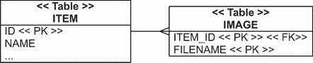

图 8.1 `IMAGE`表存储图像文件名，每个文件名都引用一个`ITEM_ID`。

这就是所有模式的内容——没有集合或组合。

### 8.1.2 创建和映射集合属性

我们将如何使用我们目前所知道的信息来映射这个`IMAGE`表？我们可能会将其映射为一个名为`Image`的`@Entity`类。在本章的后面，我们将映射一个外键列与`@ManyToOne`属性相关联，以建立实体之间的关联。我们还需要为实体类创建一个复合主键映射，我们将在第 10.2.2 节中首先演示。我们现在需要知道的是，复合主键是多个列的组合，用于在表中唯一标识一行。单个列可能不是唯一的，但它们的组合必须是唯一的。

没有映射的图像集合；它们不是必需的。当我们需要某个项目的图像时，我们可以用 JPA 查询语言编写和执行一个查询：

```
select img from Image img where img.item = :itemParameter
```

持久化集合总是**可选的**。

我们可以创建一个`Item#images`集合，它引用特定项目的所有图像。我们可以创建并映射这个集合属性来完成以下操作：

+   当我们调用`someItem.getImages()`时，会自动执行 SQL 查询`SELECT * from IMAGE where ITEM_ID = ?`。只要域模型实例处于**管理**状态（稍后会有更多介绍），我们就可以在导航类之间的关联时按需从数据库中读取。我们不必手动编写和执行查询来加载数据。另一方面，当我们开始迭代集合时，集合查询始终是“此项目的所有图像”，而不是“仅匹配 XYZ 条件的图像。”

+   避免使用`entityManager.persist()`或`imageRepository .save()`来保存每个`Image`。如果我们有一个映射的集合，通过`someItem.getImages().add()`将`Image`添加到集合中，当保存`Item`时，它将自动持久化。这种级联持久化很方便，因为我们可以在不调用存储库或`EntityManager`的情况下保存实例。

+   `Image`具有依赖的生命周期。当一个`Item`被删除时，Hibernate 会通过额外的 SQL `DELETE`删除所有附加的`Image`。我们不必担心图像的生命周期和清理孤儿（假设数据库外键约束没有`ON DELETE CASCADE`）。JPA 提供者处理组合生命周期。

重要的是要认识到，尽管这些好处听起来很棒，但我们付出的代价是额外的映射复杂性。许多 JPA 初学者在集合映射上挣扎，而且经常有人问“你为什么要这样做？”答案是“我以为这个集合是必需的。”

如果我们分析如何处理拍卖物品的图像场景，我们会发现我们可以从集合映射中受益。图像具有依赖的生命周期；当删除一个项目时，所有附加的图像都应该被删除。当存储一个项目时，所有附加的图像都应该被存储。当显示一个项目时，我们通常会显示所有图像，因此 `someItem.getImages()` 在 UI 代码中很方便——这实际上是一种信息的需求加载。我们不需要再次调用持久化服务来获取图像；它们只是“在那里”。

现在，我们将继续选择最适合领域模型设计的集合接口和实现。让我们通过最常用的集合映射来探讨，以微小的变化重复使用相同的 `Image` 和 `Item` 示例。

### 8.1.3 选择集合接口

这是 Java 领域模型中集合属性的惯用方法：

```
<<Interface>> images = new <<Implementation>>();
// Getter and setter methods
//  . . .
```

使用接口来声明属性的类型，而不是实现。选择一个匹配的实现，并立即初始化集合；这样做可以避免未初始化的集合。我们不推荐在构造函数或设置方法中较晚初始化集合。

使用泛型，这是一个典型的 `Set`：

```
Set<Image> images = new HashSet<Image>();
```

不使用泛型的原始集合

如果我们没有使用泛型指定集合元素的类型，或者映射的键/值类型，我们需要告诉 Hibernate 类型（或类型）。例如，我们可以使用 `@ElementCollection(targetClass= String.class)` 将原始 `Set` 映射为 `Set<String>`。这也适用于 `Map` 的类型参数。使用 `@MapKeyClass` 指定 `Map` 的键类型。

本书中的所有示例都使用泛型集合和映射，你们也应该这样做。

Hibernate 默认支持最重要的 JDK 集合接口，并以持久化的方式保留了 JDK 集合、映射和数组语义。每个 JDK 接口都有一个由 Hibernate 支持的对应实现，并且使用正确的组合非常重要。Hibernate 在字段声明时封装已初始化的集合，有时如果它不是正确的类型，则会替换它。这样做是为了实现诸如延迟加载和集合元素的脏检查等功能。

在不扩展 Hibernate 的情况下，我们可以从以下集合中进行选择：

+   一个使用 `java.util.HashSet` 初始化的 `java.util.Set` 属性。元素顺序不被保留，不允许重复元素。所有 JPA 提供商都支持此类型。

+   一个使用 `java.util.TreeSet` 初始化的 `java.util.SortedSet` 属性。此集合支持元素的稳定顺序：排序发生在 Hibernate 加载数据之后。这是 Hibernate 独有的扩展；其他 JPA 提供商可能会忽略集合的“排序”方面。

+   一个使用 `java.util.ArrayList` 初始化的 `java.util.List` 属性。Hibernate 使用数据库表中的额外索引列来保留每个元素的位置。所有 JPA 提供商都支持此类型。

+   一个使用 `java.util.ArrayList` 初始化的 `java.util.Collection` 属性。这个集合具有 *包* 语义；可能存在重复项，但元素的顺序不会被保留。所有 JPA 提供商都支持此类型。

+   一个使用 `java.util.HashMap` 初始化的 `java.util.Map` 属性。映射中的键值对可以在数据库中保留。所有 JPA 提供商都支持此类型。

+   一个使用 `java.util.TreeMap` 初始化的 `java.util.SortedMap` 属性。它支持元素的稳定顺序：排序发生在 Hibernate 加载数据后。这是一个仅 Hibernate 扩展；其他 JPA 提供商可能会忽略映射的“排序”方面。

+   Hibernate 支持持久化数组，但 JPA 不支持。它们很少使用，本书中不会展示它们。Hibernate 不能包装数组属性，因此集合的许多好处，如按需懒加载，将不会工作。只有在你确定不需要懒加载时，才在你的领域模型中使用持久化数组。（你可以按需加载数组，但这需要通过字节码增强进行拦截，如 12.1.3 节中所述。）

如果我们想要映射 Hibernate 直接不支持集合接口和实现，我们需要告诉 Hibernate 关于自定义集合的语义。Hibernate 的扩展点是 `org.hibernate.collection.spi` 包中的 `PersistentCollection` 接口，我们通常扩展现有的 `PersistentSet`、`PersistentBag` 和 `PersistentList` 中的一个类。自定义持久化集合不易编写，我们不推荐如果你不是经验丰富的 Hibernate 用户就进行此操作。

事务性文件系统

如果我们只将图像的文件名存储在 SQL 数据库中，我们必须将每张图片的二进制数据——文件——存储在某个地方。我们可以在 SQL 数据库的 `BLOB` 列中存储图像数据（参见 6.3.1 节中的“二进制和大型值类型”）。

如果我们决定不将图像存储在数据库中，而是作为常规文件，我们应该意识到标准的 Java 文件系统 API，`java.io.File` 和 `java.nio.file.Files`，不是事务性的。文件系统操作不会被纳入 Java 事务 API (JTA) 系统事务；一个事务可能成功完成，Hibernate 将文件名写入 SQL 数据库，但文件在文件系统中的存储或删除可能会失败。我们无法将这些操作作为一个原子单元回滚，并且我们无法获得操作的正确隔离性。

你可以使用一个单独的系统事务管理器，如 Bitronix。然后，文件操作将与 Hibernate 的 SQL 操作一起在同一个事务中注册、提交和回滚。

让我们映射一个 `Item` 的图像文件名集合。

### 8.1.4 映射集合

映射集合的最简单实现是 `String` 图像文件名的 `Set`。向 `Item` 类中添加一个集合属性，如下所示列表中所示。

列表 8.1 将图像映射为简单的字符串集合

```
Path: Ch08/mapping-collections/src/main/java/com/manning/javapersistence
➥ /ch08/setofstrings/Item.java

@Entity
public class Item {
    // . . .

    @ElementCollection                                      Ⓐ
    @CollectionTable(
            name = "IMAGE",                                 Ⓑ
            joinColumns = @JoinColumn(name = "ITEM_ID"))    Ⓒ
    @Column(name = "FILENAME")                              Ⓓ
    private Set<String> images = new HashSet<>();           Ⓔ
```

Ⓐ 将 `images` 字段声明为 `@ElementCollection`。在这里，我们指的是系统中的图像路径，但为了简洁起见，我们将使用字段和列的名称，例如 `image` 或 `images`。

Ⓑ 集合表将被命名为 `IMAGE`。否则，它将默认为 `ITEM_IMAGES`。

Ⓒ `ITEM` 表和 `IMAGE` 表之间的连接列将是 `ITEM_ID`（实际上是默认名称）。

Ⓓ 将包含 `images` 集合中的字符串信息的列命名为 `FILENAME`。否则，它将默认为 `IMAGES`。

Ⓔ 将 `images` 集合初始化为 `HashSet`。

在前面的列表中，`@ElementCollection` JPA 注解对于值类型元素的集合是必需的。如果没有 `@CollectionTable` 和 `@Column` 注解，Hibernate 将使用默认的模式名称。查看图 8.2 中的模式：主键列被下划线标注。

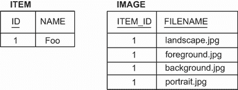

图 8.2 字符串集合的表结构和示例数据

`IMAGE` 表具有由 `ITEM_ID` 和 `FILENAME` 列组成的复合主键。这意味着我们不能有重复的行：每个图像文件只能附加到一项上一次。此外，图像的顺序没有存储。这符合领域模型和 `Set` 集合。图像存储在文件系统中的某个位置，我们只保留数据库中的文件名。

为了与 `Item` 实体交互，我们将创建以下 Spring Data JPA 仓库。

列表 8.2 `ItemRepository` 接口

```
Path: Ch08/mapping-collections/src/main/java/com/manning/javapersistence
➥ /ch08/repositories/setofstrings/ItemRepository.java

public interface ItemRepository extends JpaRepository<Item, Long> {

  @Query("select i from Item i inner join fetch i.images where i.id = :id") Ⓐ
  Item findItemWithImages(@Param("id") Long id);                            Ⓐ

  @Query(value = "SELECT FILENAME FROM IMAGE WHERE ITEM_ID = ?1",           Ⓑ
         nativeQuery = true)                                                Ⓑ
  Set<String> findImagesNative(Long id);                                    Ⓑ
}
```

Ⓐ 声明一个名为 `findItemWithImages` 的方法，该方法将通过 `id` 获取 `Item`，包括 `images` 集合。为了 eager 获取此集合，我们将使用 Jakarta Persistence Query Language (JPQL) 的 `inner join fetch` 功能。

Ⓑ 声明 `findImagesNative` 方法，该方法被注解为原生查询，并将获取表示给定 `id` 的 `images` 的字符串集合。

我们还将创建以下测试。

列表 8.3 `MappingCollectionsSpringDataJPATest` 类

```
Path: Ch08/mapping-collections/src/test/java/com/manning/javapersistence
➥ /ch08//setofstrings/MappingCollectionsSpringDataJPATest.java

@ExtendWith(SpringExtension.class)
@ContextConfiguration(classes = {SpringDataConfiguration.class})
public class MappingCollectionsSpringDataJPATest {

    @Autowired
    private ItemRepository itemRepository;

    @Test
    void storeLoadEntities() {

        Item item = new Item("Foo");                                        Ⓐ

        item.addImage("background.jpg");                                    Ⓑ
        item.addImage("foreground.jpg");                                    Ⓑ
        item.addImage("landscape.jpg");                                     Ⓑ
        item.addImage("portrait.jpg");                                      Ⓑ

        itemRepository.save(item);                                          Ⓒ

        Item item2 = itemRepository.findItemWithImages(item.getId());       Ⓓ

        List<Item> items2 = itemRepository.findAll();                       Ⓔ
        Set<String> images = itemRepository.findImagesNative(item.getId()); Ⓕ

        assertAll(
                () -> assertEquals(4, item2.getImages().size()),            Ⓖ
                () -> assertEquals(1, items2.size()),                       Ⓖ
                () -> assertEquals(4, images.size())                        Ⓖ
        );

    }
}
```

Ⓐ 创建一个 `Item`。

Ⓑ 向其中添加 4 个图像路径。

Ⓒ 将其保存到数据库中。

Ⓓ 访问仓库以获取包含 `images` 集合的项。正如我们在 `findItemWithImages` 方法上注解的 JPQL 查询中所指定的，该集合也将从数据库中获取。

Ⓔ 从数据库中获取所有 `Item`。

Ⓕ 使用 `findImagesNative` 方法获取表示图像的字符串集合。

Ⓖ 检查我们获取的不同集合的大小。

看起来我们不太可能允许用户将相同的图像多次附加到同一项上，但让我们假设我们确实这样做了。在这种情况下，哪种映射是合适的？

### 8.1.5 映射标识符包

一个*包*是一个无序集合，允许重复元素，就像`java.util.Collection`接口一样。奇怪的是，Java 集合框架没有包含包实现。我们可以用`ArrayList`初始化属性，Hibernate 在存储和加载元素时忽略元素的索引。

列表 8.4 字符串包，允许重复元素

```
Path: Ch08/mapping-collections/src/main/java/com/manning/javapersistence
➥ /ch08/bagofstrings/Item.java

@Entity
public class Item {
    // . . .

    @ElementCollection
    @CollectionTable(name = "IMAGE")
    @Column(name = "FILENAME")
    @GenericGenerator(name = "sequence_gen", strategy = "sequence")     Ⓐ
    @org.hibernate.annotations.CollectionId(                            Ⓑ
            columns = @Column(name = "IMAGE_ID"),                       Ⓒ
            type = @org.hibernate.annotations.Type(type = "long"),      Ⓓ
            generator = "sequence_gen")                                 Ⓔ
    private Collection<String> images = new ArrayList<>();              Ⓕ
```

Ⓐ 声明一个名为`"sequence_gen"`的`@GenericGenerator`，使用`"sequence"`策略来处理`IMAGE`表中的代理键。

Ⓑ `IMAGE`集合表需要一个不同的主键，以便为每个`ITEM_ID`允许重复的`FILENAME`值。

Ⓒ 引入一个名为`IMAGE_ID`的代理主键列。你可以同时检索所有图片或同时存储它们，但数据库表仍然需要一个主键。

Ⓓ 使用仅 Hibernate 的注解。

Ⓔ 配置主键的生成方式。

Ⓕ JDK 中没有包实现。我们初始化集合为`ArrayList`。

通常，当你保存实体实例时，你希望系统生成一个主键值。如果你需要刷新关于键生成器的记忆，请参阅第 5.2.4 节。修改后的模式如图 8.3 所示。Spring Data JPA 仓库和测试将与前一个示例相同。

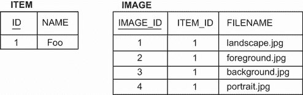

图 8.3 包字符串的代理主键列

这里有一个有趣的问题：如果你只看到这个模式，你能说出 Java 中表是如何映射的吗？`ITEM`和`IMAGE`表看起来很相似：每个表都有一个代理主键列和一些其他规范化列。每个表都可以用一个`@Entity`类来映射。然而，我们可以决定使用 JPA 的一个特性，将一个集合映射到`IMAGE`，即使有组合生命周期。这实际上是一个设计决策，即对于这个表，我们只需要一些预定义的查询和操作规则，而不是更通用的`@Entity`映射。当你做出这样的决定时，一定要知道为什么以及会有什么后果。

下一个映射技术保留列表中图片的顺序。

### 8.1.6 映射列表

如果你之前没有使用过 ORM 软件，持久化列表似乎是一个非常强大的概念；想象一下，使用纯 JDBC 和 SQL 存储和加载`java.util.List<String>`需要多少工作。如果我们向列表中间添加一个元素，列表会将其后的所有元素向右移动或重新排列指针，具体取决于列表的实现。如果我们从列表中间删除一个元素，会发生其他事情，依此类推。如果 ORM 软件可以自动为数据库记录做所有这些事情，持久化列表开始看起来比它实际上更有吸引力。

正如我们在 3.2.4 节中提到的，最初的反应通常是保留用户输入的数据元素的顺序，因为你通常会按相同的顺序稍后显示它们。但如果可以使用其他标准对数据进行排序，如条目时间戳，那么在查询时应对数据进行排序，而不是存储显示顺序。如果你需要使用的显示顺序发生变化怎么办？数据显示的顺序通常不是数据的一个组成部分，而是一个正交的关注点，所以在映射持久化 `List` 之前要三思，因为 Hibernate 并不像你想象中那么聪明，你将在下一个例子中看到。

让我们更改 `Item` 实体及其集合属性。

列表 8.5 持久化列表，保留数据库中元素顺序

```
Path: Ch08/mapping-collections/src/main/java/com/manning/javapersistence
➥ /ch08/listofstrings/Item.java

@Entity
public class Item {
    // . . .

    @ElementCollection
    @CollectionTable(name = "IMAGE")
    @OrderColumn // Enables persistent order, Defaults to IMAGES_ORDER
    @Column(name = "FILENAME")
    private List<String> images = new ArrayList<>();
```

在这个例子中有一个新的注解：`@OrderColumn`。这个列存储持久化列表中的索引，从零开始。列名默认为 `IMAGES_ ORDER`。请注意，Hibernate 将索引存储在数据库中，并期望它是连续的。如果有空隙，Hibernate 在加载和构建 `List` 时会添加 `null` 元素。查看图 8.4 中的模式。

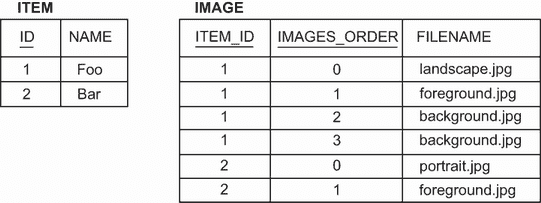

图 8.4 集合表保留每个列表元素的位置。

`IMAGE` 表的主键是 `ITEM_ID` 和 `IMAGES_ORDER` 的组合。这允许重复的 `FILENAME` 值，这与 `List` 的语义一致。记住，图像存储在文件系统中的某个位置，我们只保留数据库中的文件名。Spring Data JPA 仓库和测试将与上一个例子相同。

我们之前提到过，Hibernate 并不像你想象中那么聪明。考虑对列表进行修改：假设列表中有三个图像，A、B 和 C，按此顺序排列。如果你从列表中删除 A 会发生什么？Hibernate 为该行执行一个 SQL `DELETE` 操作。然后它执行两个 `UPDATE` 操作，针对 B 和 C，将它们的位移动到左边以关闭索引中的空隙。对于删除元素右侧的每个元素，Hibernate 执行一个 `UPDATE` 操作。如果我们手动编写 SQL，我们可以用一个 `UPDATE` 操作来完成。对于列表中间的插入也是如此——Hibernate 会逐个将所有现有元素向右移动。至少，Hibernate 足够聪明，在我们调用 `clear()` 清除列表时执行单个 `DELETE` 操作。

现在假设一个项目的图像除了文件名外还有用户提供的名称。在 Java 中，可以通过使用键/值对映射来实现这种模型。

### 8.1.7 映射映射

为了适应用户提供的图像文件名称，我们将更改 Java 类以使用 `Map` 属性。

列表 8.6 持久化映射存储其键和值对

```
Path: Ch08/mapping-collections/src/main/java/com/manning/javapersistence
➥ /ch08/mapofstrings/Item.java

@Entity
public class Item {
    // . . .

    @ElementCollection
    @CollectionTable(name = "IMAGE")
    @MapKeyColumn(name = "FILENAME")                          Ⓐ
    @Column(name = "IMAGENAME")                               Ⓑ
    private Map<String, String> images = new HashMap<>();
```

Ⓐ 每个映射条目都是一个键/值对。在这里，键通过 `@MapKeyColumn` 映射到 `FILENAME`。

Ⓑ 值是 `IMAGENAME` 列。这意味着用户只能使用一个文件一次，因为 `Map` 不允许重复的键。

如您从图 8.5 中的模式中看到的那样，集合表的键是 `ITEM_ID` 和 `FILENAME` 的组合。示例使用 `String` 作为映射的键，但 Hibernate 支持任何基本类型，例如 `BigDecimal` 或 `Integer`。如果键是 Java `enum`，则必须使用 `@MapKeyEnumerated`。对于任何时间类型，如 `java.util.Date`，使用 `@MapKeyTemporal`。

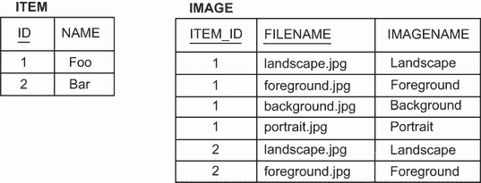

图 8.5 使用字符串作为索引和元素的映射表

在前面的例子中，映射是无序的。如果文件列表很长，我们想要快速浏览寻找某个东西，我们如何始终按文件名对映射条目进行排序？

### 8.1.8 有序和排序集合

我们可以使用 Java 比较器在内存中对集合进行排序。当从数据库加载集合时，我们可以使用带有 `ORDER BY` 子句的 SQL 查询来排序集合。

让我们将图像映射转换为有序映射。我们需要更改 Java 属性和映射。

列表 8.7 使用比较器在内存中对映射条目进行排序

```
Path: Ch08/mapping-collections/src/main/java/com/manning/javapersistence
➥ /ch08/sortedmapofstrings/Item.java

@Entity
public class Item {
    // . . .

    @ElementCollection
    @CollectionTable(name = "IMAGE")
    @MapKeyColumn(name = "FILENAME")
    @Column(name = "IMAGENAME")
    @org.hibernate.annotations.SortComparator(ReverseStringComparator.class)
    private SortedMap<String, String> images = new TreeMap<>();
```

有序集合是 Hibernate 的功能；因此使用 `org.hibernate.annotations.SortComparator` 注解，该注解实现了 `java.util.Comparator <String>`——这里显示的是按逆序排序字符串。数据库模式不会改变，所有以下示例也是如此。如果需要提醒，请查看前几节中的图 8.1–8.5。

我们将在测试中添加以下两行，这将检查键现在是否为逆序：

```
() -> assertEquals("Portrait", item2.getImages().firstKey()),
() -> assertEquals("Background", item2.getImages().lastKey())
```

我们将在下面的示例中将 `java.util.SortedSet` 进行映射。您可以在映射集合文件夹中的 sortedsetofstrings 示例中找到它。

列表 8.8 使用 `String#compareTo()` 在内存中对集合元素进行排序

```
Path: Ch08/mapping-collections/src/main/java/com/manning/javapersistence
➥ /ch08/sortedsetofstrings/Item.java

@Entity
public class Item {
    // . . .

    @ElementCollection
    @CollectionTable(name = "IMAGE")
    @Column(name = "FILENAME")
    @org.hibernate.annotations.SortNatural
    private SortedSet<String> images = new TreeSet< >();
```

这里使用了自然排序，回退到 `String#compareTo()` 方法。

不幸的是，我们无法对包进行排序；没有 `TreeBag`。列表元素的索引预先定义了它们的顺序。或者，我们可能想要从数据库中检索集合元素的正确顺序，而不是在内存中进行排序。在下面的列表中，我们将使用 `java.util.LinkedHashSet` 而不是切换到 `Sorted*` 接口。而不是使用 `java.util.SortedSet`，我们将使用 `java.util.LinkedHashSet`。

列表 8.9 `LinkedHashSet` 提供了迭代顺序

```
Path: Ch08/mapping-collections/src/main/java/com/manning/javapersistence
➥ /ch08/setofstringsorderby/Item.java

@Entity
public class Item {
    // . . .

    @ElementCollection
    @CollectionTable(name = "IMAGE")
    @Column(name = "FILENAME")
    // @javax.persistence.OrderBy // One possible order: "FILENAME asc"
    @org.hibernate.annotations.OrderBy(clause = "FILENAME desc")
    private Set<String> images = new LinkedHashSet<>();
```

`LinkedHashSet` 类在其元素上具有稳定的迭代顺序，当加载集合时，Hibernate 将以正确的顺序填充它。为此，Hibernate 将 `ORDER BY` 子句应用于加载集合的 SQL 语句。我们必须使用专有的 `@org.hibernate.annotations.OrderBy` 注解声明此 SQL 子句。我们可以调用一个 SQL 函数，例如 `@OrderBy("substring(FILENAME, 0, 3) desc")`，这将按文件名的第一个三个字母进行排序，但请注意检查所调用的 DBMS 是否支持该 SQL 函数。此外，您可以使用 SQL:2003 语法 `ORDER BY . . . . NULLS FIRST|LAST`，Hibernate 将自动将其转换为您的 DBMS 所支持的方言。

如果表达式只是一个带有 `ASC` 或 `DESC` 的列名，则 `@javax.persistence.OrderBy` 注解也适用。如果您需要一个更复杂的子句（如前一段中的 `substring()` 示例），则需要 `@org.hibernate.annotations.OrderBy` 注解。

Hibernate 的 `@OrderBy` 与 JPA 的 `@OrderBy`

您可以将 `@org.hibernate.annotations.OrderBy` 注解应用于任何集合；其参数是一个简单的 SQL 片段，Hibernate 会将其附加到加载集合的 SQL 语句中。

Java 持久性有一个类似的注解，`@javax.persistence.OrderBy`。它的唯一参数不是 SQL，而是 `someProperty DESC|ASC`。`String` 或 `Integer` 元素值没有属性，因此当我们对基本类型集合应用 JPA 的 `@OrderBy` 注解时，例如列表 8.9 中的 `Set<String>`，根据规范，“排序将按基本对象的值进行”。这意味着我们无法更改排序值（只是方向，`asc` 或 `desc`）。当元素值类具有持久属性且不是基本/标量类型时，我们将在 8.2.2 节中使用 JPA 注解。

`bagofstringsorderby` 的下一个示例展示了使用映射包在加载时的相同排序。您可以在映射集合文件夹中找到它。

列表 8.10 `ArrayList` 提供稳定的迭代顺序

```
Path: Ch08/mapping-collections/src/main/java/com/manning/javapersistence
➥ /ch08/bagofstringsorderby/Item.java

@Entity
public class Item {
    // . . .

    @ElementCollection
    @CollectionTable(name = "IMAGE")
    @Column(name = "FILENAME")
    @GenericGenerator(name = "sequence_gen", strategy = "sequence")
    @org.hibernate.annotations.CollectionId(
            columns = @Column(name = "IMAGE_ID"),
            type = @org.hibernate.annotations.Type(type = "long"),
            generator = "sequence_gen")
    @org.hibernate.annotations.OrderBy(clause = "FILENAME desc")
    private Collection<String> images = new ArrayList<>();
```

最后，我们可以使用 `LinkedHashMap` 加载有序键/值对。

列表 8.11 `LinkedHashMap` 保持键/值对顺序

```
Path: Ch08/mapping-collections/src/main/java/com/manning/javapersistence
➥ /ch08/mapofstringsorderby/Item.java

@Entity
public class Item {
    // . . .

    @ElementCollection
    @CollectionTable(name = "IMAGE")
    @MapKeyColumn(name = "FILENAME")
    @Column(name = "IMAGENAME")
    @org.hibernate.annotations.OrderBy(clause = "FILENAME desc")
    private Map<String, String> images = new LinkedHashMap<>();
```

请记住，有序集合的元素只有在加载时才处于所需顺序。一旦我们添加或删除元素，集合的迭代顺序可能与“按文件名”不同；它们的行为类似于常规的链接集合、映射或列表。我们展示了技术方法，但我们需要意识到其不足之处，并得出结论，这些使其成为一种不太可靠的解决方案。

在实际系统中，我们可能需要存储的不仅仅是图像名称和文件名。我们可能需要创建一个 `Image` 类来存储额外信息（如标题、宽度和高度）。这是一个组件集合的完美用例。

## 8.2 组件集合

我们之前映射了一个可嵌入组件：`User` 的 `address`。我们本章正在处理的示例是不同的，因为 `Item` 有许多对 `Image` 的引用，如图 8.6 所示。UML 图中的关联是组合（黑色菱形）；因此，引用的 `Image` 与拥有 `Item` 的生命周期绑定。

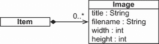

图 8.6 `Item` 中的 `Image` 组件集合

下面的列表中的代码演示了新的 `Image` 可嵌入类，捕获了我们感兴趣的图像的所有属性。

列表 8.12 封装图像的所有属性

```
Path: Ch08/mapping-collections/src/main/java/com/manning/javapersistence
➥ /ch08/setofembeddables/Image.java

@Embeddable
public class Image {
    @Column(nullable = false)
    private String filename;
    private int width;
    private int height;
    // . . .
}
```

首先，请注意，所有属性都是非可选的，`NOT NULL`。大小属性是非可空的，因为它们的值是原始数据类型。其次，我们必须考虑相等性，以及数据库和 Java 层如何比较两个图像。

### 8.2.1 组件实例的相等性

假设我们想在 `HashSet` 中保留几个 `Image` 实例。我们知道集合不允许重复元素，但集合是如何检测重复的呢？`HashSet` 会调用我们放入 `Set` 中的每个 `Image` 的 `equals()` 方法。（显然，它也会调用 `hashCode()` 方法来获取哈希值。）

以下集合中有多少个图像？

```
someItem.addImage(new Image("background.jpg", 640, 480));
someItem.addImage(new Image("foreground.jpg", 800, 600));
someItem.addImage(new Image("landscape.jpg", 1024, 768));
someItem.addImage(new Image("landscape.jpg", 1024, 768));
assertEquals(3, someItem.getImages().size());
```

你预期有四个图像而不是三个吗？你说对了：常规的 Java 相等性检查依赖于标识符。`java.lang.Object#equals()` 方法通过 `a==b` 比较实例。使用这个程序，我们会在集合中有四个 `Image` 实例。显然，对于这个用例，三个是“正确”的答案。

对于 `Image` 类，我们不依赖于 Java 的标识符——我们覆盖了 `equals()` 和 `hashCode()` 方法。

列表 8.13 使用 `equals()` 和 `hashCode()` 实现自定义相等性

```
Path: Ch08/mapping-collections/src/main/java/com/manning/javapersistence
➥ /ch08/setofembeddables/Image.java

@Embeddable
public class Image {
     // . . .
@Override
public boolean equals(Object o) {                                Ⓐ
    if (this == o) return true;
    if (o == null || getClass() != o.getClass()) return false;
    Image image = (Image) o;
    return width == image.width &&
           height == image.height &&
           filename.equals(image.filename) &&
           item.equals(image.item);
}

@Override
public int hashCode() {                                         Ⓑ
    return Objects.hash(filename, width, height, item);
}
    // . . .
}
```

Ⓐ 在 `equals()` 中的这个自定义相等性检查比较了一个 `Image` 的所有值与另一个 `Image` 的值。如果所有值都相同，则图像必须相同。

Ⓑ `hashCode()` 方法必须满足合同要求，即如果两个实例相等，它们必须具有相同的哈希码。

为什么在第 6.2 节我们没有覆盖相等性，当我们映射 `User` 的 `Address` 时？事实上，我们可能真的应该这么做。我们唯一的借口是，除非我们将可嵌入组件放入 `Set` 或将它们用作使用 `equals()` 和 `hashCode()` 进行存储和比较的 `Map` 的键（这意味着它不是一个 `TreeMap`，它通过比较项目来排序和定位它们），否则我们不会遇到常规的标识符相等性问题。我们还应该根据值而不是标识符重新定义相等性。最好是在每个 `@Embeddable` 类上覆盖这些方法；所有值类型都应该按值进行比较。

现在考虑数据库主键：Hibernate 将生成一个包含 `IMAGE` 集合表所有非空列的复合主键的模式。这些列必须是不可为空的，因为我们无法识别我们不知道的东西。这反映了 Java 类中的等价实现。我们将在下一节中查看模式，并详细介绍主键。

注意：Hibernate 的模式生成器存在一个小的问题：如果我们用 `@NotNull` 而不是 `@Column (nullable=false)` 注解一个可嵌入属性的属性，Hibernate 不会为集合表的列生成 `NOT NULL` 约束。实例的 Bean Validation 检查按预期工作，但数据库模式缺少完整性规则。如果可嵌入类在集合中映射，并且属性应该是主键的一部分，请使用 `@Column(nullable=false)`。

组件类现在已准备就绪，我们可以在集合映射中使用它。

### 8.2.2 组件的 `Set`

我们可以映射一个如以下所示组件的 `Set`。请记住，`Set` 是一种只允许唯一项的集合类型。

列表 8.14 带覆盖的嵌入组件 `Set`

```
Path: Ch08/mapping-collections/src/main/java/com/manning/javapersistence, 
➥ /ch08/setofembeddables/Item.java

@Entity
public class Item {
    // . . .

    @ElementCollection                   Ⓐ
    @CollectionTable(name = "IMAGE")     Ⓑ
    @AttributeOverride(
            name = "filename",
            column = @Column(name = "FNAME", nullable = false)
    )
    private Set<Image> images = new HashSet<>();
```

Ⓐ 如前所述，需要 `@ElementCollection` 注解。Hibernate 自动知道集合的目标是一个 `@Embeddable` 类型，这是从泛型集合的声明中得知的。

Ⓑ `@CollectionTable` 注解覆盖了集合表的默认名称，原本应该是 `ITEM_IMAGES`。

`Image` 映射定义了集合表的列。正如对于单个内嵌值一样，我们可以使用 `@AttributeOverride` 注解来定制映射，而不需要修改目标可嵌入类。

查看图 8.7 中的数据库模式。我们正在映射一个集合，因此集合表的主键是由外键列 `ITEM_ID` 和所有“内嵌”的非空列 `FNAME`、`WIDTH` 和 `HEIGHT` 组成的复合键。

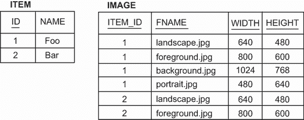

图 8.7 组件集合的示例数据表

如前所述，`ITEM_ID` 值没有包含在 `Image` 的覆盖 `equals()` 和 `hashCode()` 方法中。因此，如果我们在一个集合中混合不同项目的图像，我们将在 Java 层遇到等价问题。在数据库表中，我们可以区分不同项目的图像，因为项目的标识符包含在主键等价检查中。

如果我们想在 `Image` 的等价例程中包含 `Item`，以与数据库主键保持对称，我们需要一个 `Image#item` 属性。这是 Hibernate 在加载 `Image` 实例时提供的一个简单回指针：

```
Path: Ch08/mapping-collections/src/main/java/com/manning/javapersistence
➥ /ch08/setofembeddables/Image.java

@Embeddable
public class Image {
    // . . .
    @org.hibernate.annotations.Parent
    private Item item;
    // . . .
}
```

我们现在可以将父 `Item` 值包含在 `equals()` 和 `hashCode()` 实现中。

在下一个代码片段中，我们将使用 `@AttributeOverride` 注解将 `FILENAME` 字段匹配到 `FNAME` 列：

```
Path: Ch08/mapping-collections/src/main/java/com/manning/javapersistence
➥ /ch08/setofembeddables/Item.java

@AttributeOverride(
            name = "filename",
            column = @Column(name = "FNAME", nullable = false)
    )
```

我们还必须在 `ItemRepository` 接口中更改原生查询：

```
Path: Ch08/mapping-collections/src/main/java/com/manning/javapersistence
➥ /ch08/repositories/setofembeddables/ItemRepository.java

@Query(value = "SELECT FNAME FROM IMAGE WHERE ITEM_ID = ?1",
        nativeQuery = true)
Set<String> findImagesNative(Long id);
```

如果我们需要在加载时对元素进行排序，并使用 `LinkedHashSet` 保持稳定的迭代顺序，我们可以使用 JPA `@OrderBy` 注解：

```
Path: Ch08/mapping-collections/src/main/java/com/manning/javapersistence
➥ /ch08/setofembeddablesorderby/Item.java

@Entity
public class Item {
    // . . .
    @ElementCollection
    @CollectionTable(name = "IMAGE")
    @OrderBy("filename DESC, width DESC")
    private Set<Image> images = new LinkedHashSet<>();
```

`@OrderBy` 注解的参数是 `Image` 类的属性，后面跟着 `ASC` 表示升序或 `DESC` 表示降序。默认是升序。此示例按图像文件名降序排序，然后按每个图像的宽度降序排序。请注意，这与在第 8.1.8 节中讨论的专有 `@org.hibernate.annotations.OrderBy` 注解不同，它接受一个纯 SQL 子句。

将 `Image` 的所有属性声明为 `@NotNull` 可能不是我们想要的。如果任何属性是可选的，我们需要为集合表提供一个不同的主键。

### 8.2.3 组件包

在向集合表添加代理键列之前，我们使用了 `@org.hibernate.annotations.CollectionId` 注解。然而，集合类型不是一个 `Set`，而是一个通用的 `Collection`，一个包。这与我们的更新模式一致：如果我们有一个代理主键列，允许重复的元素值。让我们通过 `bagofembeddables` 示例来了解这一点。

首先，`Image` 类现在可以有可空属性，因为我们会有一个代理键：

```
Path: Ch08/mapping-collections/src/main/java/com/manning/javapersistence
➥ /ch08/bagofembeddables/Image.java

@Embeddable
public class Image {
    @Column(nullable = true)
    private String title;
    @Column(nullable = false)
    private String filename;
    private int width;
    private int height;
    //  . . .
}
```

记得在通过值比较实例时，考虑 `Image` 的可选 `title` 在重写的 `equals()` 和 `hashCode()` 方法中的情况。例如，标题字段的比较将在 `equals` 方法中这样进行：

```
Objects.equals(title, image.title)
```

接下来，查看 `Item` 中的包集合映射。和之前一样，在第 8.1.5 节中，我们声明了一个额外的代理主键列，`IMAGE_ID`，使用专有的 `@org.hibernate.annotations.CollectionId` 注解：

```
Path: Ch08/mapping-collections/src/main/java/com/manning/javapersistence
➥ /ch08/bagofembeddables/Item.java

@Entity
public class Item {
    // . . .

    @ElementCollection
    @CollectionTable(name = "IMAGE")
       @GenericGenerator(name = "sequence_gen", strategy = "sequence")
    @org.hibernate.annotations.CollectionId(
            columns = @Column(name = "IMAGE_ID"),
            type = @org.hibernate.annotations.Type(type = "long"),
            generator = "sequence_gen")
    private Collection<Image> images = new ArrayList<>();
    //  . . .
}
```

图 8.8 显示了数据库模式。标识符为 2 的 `Image` 的 `title` 是 `null`。

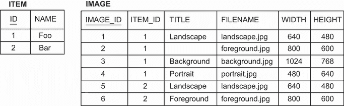

图 8.8 带有代理主键列的组件集合表

接下来，我们将分析使用 `Map` 改变集合表主键的另一种方法。

### 8.2.4 组件值映射图

一个映射将信息保持为键值对的组合。如果 `Image` 存储在映射中，文件名可以是映射键：

```
Path: Ch08/mapping-collections/src/main/java/com/manning/javapersistence
➥ /ch08/mapofstringsembeddables/Item.java

@Entity
public class Item {
    // . . .

    @ElementCollection
    @CollectionTable(name = "IMAGE")
    @MapKeyColumn(name = "TITLE")                         Ⓐ
    private Map<String, Image> images = new HashMap<>();
    //  . . .
}
```

Ⓐ 映射的关键列设置为 `TITLE`。否则，它将默认为 `IMAGES_KEY`。

测试将通过执行此类指令来设置 `TITLE` 列：

```
item.putImage("Background", new Image("background.jpg", 640, 480));
```

集合表的主键，如图 8.9 所示，现在是外键列 `ITEM_ID` 和映射的关键列 `TITLE`。

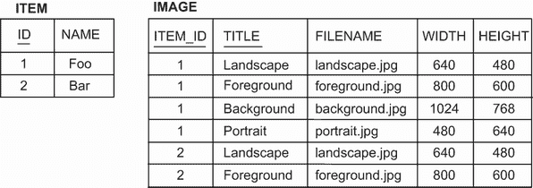

图 8.9 组件映射的数据库表

可嵌入的 `Image` 类映射所有其他列，这些列可能是可空的：

```
Path: Ch08/mapping-collections/src/main/java/com/manning/javapersistence
➥ /ch08/mapofstringsembeddables/Image.java

@Embeddable
public class Image {
    @Column(nullable = true)      Ⓐ
    private String filename;
    private int width;
    private int height;
    //  . . .
}
```

Ⓐ `filename` 字段现在可以是 null；它不是主键的一部分。

在这里，映射中的值是可嵌入组件类的实例，而键是基本字符串。接下来，我们将为键和值都使用可嵌入类型。

### 8.2.5 组件作为映射键

我们的最终示例是将一个`Map`映射，如图 8.10 所示，其中键和值都是可嵌入类型。

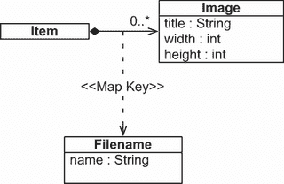

图 8.10 `Item`有一个按`Filename`键的`Map`。

我们可以用自定义类型来表示文件名，而不是字符串表示。

列表 8.15 使用自定义类型表示文件名

```
Path: Ch08/mapping-collections/src/main/java/com/manning/javapersistence
➥ /ch08/mapofembeddables/Filename.java

@Embeddable
public class Filename {
    @Column(nullable = false)      Ⓐ
    private String name;
    //  . . .
}
```

Ⓐ `name`字段不能为空，因为它是主键的一部分。如果我们想用这个类作为映射的键，映射的数据库列不能为可空，因为它们都是复合主键的一部分。我们还必须重写`equals()`和`hashCode()`方法，因为映射的键是一个集合，每个`Filename`必须在给定的键集中是唯一的。

我们不需要任何特殊的注解来映射集合：

```
Path: Ch08/mapping-collections/src/main/java/com/manning/javapersistence
➥ /ch08/mapofsembeddables/Item.java

@Entity
public class Item {
    @ElementCollection
    @CollectionTable(name = "IMAGE")
    private Map<Filename, Image> images = new HashMap<>();
    //  . . .
}
```

事实上，我们不能应用`@MapKeyColumn`和`@AttributeOverrides`；当映射的键是一个`@Embeddable`类时，它们没有任何效果。

`IMAGE`表的复合主键包括`ITEM_ID`和`NAME`列，如图 8.11 所示。像`Image`这样的复合可嵌入类不仅限于基本类型的基本属性。您已经看到了如何嵌套其他组件，例如`Address`中的`City`。我们可以在新的`Dimensions`类中提取和封装`Image`的`width`和`height`属性。

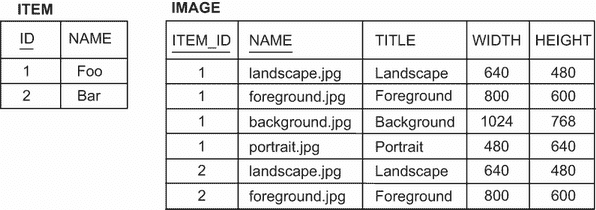

图 8.11 `Image`s 的`Filename`s 键的`Map`数据库表

可嵌入类也可以有自己的集合。

### 8.2.6 可嵌入组件中的集合

假设对于每个`Address`，我们想要存储一个联系人列表。在可嵌入类中，这是一个简单的`Set<String>`：

```
Path: Ch08/mapping-collections/src/main/java/com/manning/javapersistence
➥ /ch08/embeddablesetofstrings/Address.java

@Embeddable
public class Address {
    @NotNull
    @Column(nullable = false)
    private String street;
    @NotNull
    @Column(nullable = false, length = 5)
    private String zipcode;
    @NotNull
    @Column(nullable = false)
    private String city;

    @ElementCollection
    @CollectionTable(
            name = "CONTACT",                              Ⓐ
            joinColumns = @JoinColumn(name = "USER_ID"))   Ⓑ
    @Column(name = "NAME", nullable = false)               Ⓒ
    private Set<String> contacts = new HashSet<>();
    //  . . .
}
```

Ⓐ `@ElementCollection`是唯一必需的注解；表和列名有默认值。表名默认为`USER_CONTACTS`。

Ⓑ 连接列默认为`USER_ID`。

Ⓒ 列名默认为`CONTACTS`。

看图 8.12 中的模式：`USER_ID`列有一个外键约束，引用拥有实体的表`USERS`。集合表的主键是`USER_ID`和`NAME`列的复合，防止重复元素，因此`Set`是合适的。

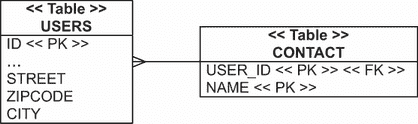

图 8.12 `USER_ID`有一个外键约束，引用`USERS`。

我们可以用列表、包或基本类型的映射来代替`Set`。Hibernate 还支持可嵌入类型的集合，因此我们可以写一个可嵌入的`Contact`类，让`Address`持有`Contacts`的集合。

虽然 Hibernate 在组件映射和细粒度模型方面提供了很多灵活性，但请注意，代码的阅读次数往往多于编写次数。想想几年后将要维护这个项目的下一个开发者。

转移焦点，让我们将注意力转向实体关联：特别是简单的*多对一*和*一对多*关联。

## 8.3 映射实体关联

在本章的开头，我们承诺要讨论父子关系。到目前为止，我们已经研究了实体`Item`的映射。假设这是父实体，并且它有一个子实体的集合：`Image`实例的集合。术语*父子*意味着某种生命周期依赖性，因此字符串集合或可嵌入组件是合适的。子实体完全依赖于父实体；它们将始终与父实体一起保存、更新和删除，而不会单独存在。

我们已经映射了一个父子关系！父实体是一个实体，而许多子实体是值类型。当删除一个`Item`时，其`Image`实例的集合也将被删除。（实际的图像可能会以事务方式删除，这意味着我们将一起从数据库中删除行和从磁盘上的文件，或者什么都不做。然而，这却是一个独立的问题，我们在这里不会处理。）

现在，我们想要映射不同类型的关联：两个实体类之间的关联。它们的实例不会具有依赖的生命周期——一个实例可以保存、更新和删除，而不会影响另一个实例。当然，*有时*实体实例之间也会有依赖关系，但我们需要对两个类之间的关系如何影响实例状态有更细粒度的控制，这与完全依赖（嵌入）类型不同。我们在这里还在讨论父子关系吗？事实证明，*父子*这个术语是模糊的，每个人都有自己的定义。我们将尽量不再使用这个术语，而将依靠更精确的，或者至少是定义良好的，词汇。


图 8.13 `Item`和`Bid`之间的关系

在接下来的几节中，我们将探讨的关系将保持不变：`Item`和`Bid`实体类之间的关系，如图 8.13 所示。从`Bid`到`Item`的关联是一个*多对一*关联。稍后我们将使这个关联双向，因此从`Item`到`Bid`的反向关联将是*一对多*。

*多对一*关联是最简单的，所以我们将首先讨论它。其他关联，*多对多*和*一对多*，更复杂，我们将在下一章讨论。

让我们从需要在 CaveatEmptor 应用程序中实现的*多对一*关联开始，并看看我们有哪些替代方案。下面的源代码可以在 mapping-associations 文件夹中找到。

### 8.3.1 最简单的关联

我们称 `Bid#item` 属性的映射为 *单向多对一关联*。在我们分析这个映射之前，看看图 8.14 中的数据库模式和列表 8.16 中的代码。

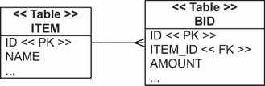

图 8.14 SQL 模式中的一种多对一关系

列表 8.16 `Bid` 对 `Item` 有单一引用

```
Path: Ch08/mapping-associations/src/main/java/com/manning/javapersistence
➥ /ch08/onetomany/bidirectional/Bid.java

@Entity
public class Bid {
    @ManyToOne(fetch = FetchType.LAZY)               Ⓐ
    @JoinColumn(name = "ITEM_ID", nullable = false)
    private Item item;
    //  . . .
}
```

Ⓐ `@ManyToOne` 注解将一个属性标记为实体关联，并且是必需的。它的获取参数默认为 `EAGER`，这意味着当加载 `Bid` 时，关联的 `Item` 也会被加载。我们通常更喜欢将懒加载作为默认策略，我们将在第 12.1.1 节中进一步讨论。

一个 *多对一* 实体关联自然映射到外键列：`BID` 表中的 `ITEM_ID`。在 JPA 中，这被称为 *连接列*。我们只需要在属性上使用 `@ManyToOne` 注解。连接列的默认名称是 `ITEM_ID`：Hibernate 自动使用目标实体名称及其标识属性的组合，用下划线分隔。

我们可以用 `@JoinColumn` 注解覆盖外键列，但在这里我们使用它的另一个原因：当 Hibernate 生成 SQL 模式时，使外键列 `NOT NULL`。一个出价总是必须有一个对项目的引用；它不能独立存在。（注意，这已经表明我们必须注意某种生命周期依赖。）或者，我们可以用 `@ManyToOne(optional = false)` 或通常的 Bean Validation 的 `@NotNull` 标记这个关联为非可选。

这很简单。重要的是要意识到，我们可以编写一个完整且复杂的应用程序，而不需要使用任何其他东西。

我们不需要映射这个关系的另一边；我们可以忽略从 `Item` 到 `Bid` 的 *一对多* 关联。数据库模式中只有一个外键列，我们已经映射了它。我们对此是认真的：当你看到一个外键列和两个实体类时，你可能应该用 `@ManyToOne` 来映射，而不用其他任何东西。

现在，我们可以通过调用 `someBid.getItem()` 来获取每个 `Bid` 的 `Item`。JPA 提供商会取消引用外键并为我们加载 `Item`，它还会负责管理外键值。我们如何获取一个项目的所有出价？我们可以编写一个查询，并用 `EntityManager` 或 `JpaRepository` 在 Hibernate 支持的任何查询语言中执行它。例如，在 JPQL 中，我们会使用 `select b from Bid` `b` `where` `b.item` `=` `:itemParameter`。我们使用 Hibernate 或 Spring Data JPA 的一个原因当然是，在大多数情况下，我们不想自己编写和执行那个查询。

### 8.3.2 使其双向

在本章的开头，在第 8.1.2 节中，我们列出了为什么将`Item#images`集合映射为一个好主意的原因。让我们为`Item#bids`集合做同样的事情。这个集合将实现`Item`和`Bid`实体类之间的*一对一*关联。如果我们创建并映射这个集合属性，我们将得到以下内容：

+   当我们调用`someItem.getBids()`并开始遍历集合元素时，Hibernate 会自动执行 SQL 查询`SELECT * FROM BID WHERE ITEM_ID = ?`。

+   我们可以从一个`Item`对象级联状态变化到集合中所有引用的`Bid`对象。我们可以选择哪些生命周期事件应该是可传递的；例如，我们可以声明当保存`Item`时，所有引用的`Bid`实例都应该被保存，这样我们就不必反复调用`EntityManager#persist()`或`ItemRepository#save()`来保存所有竞标。

好吧，这不是一个非常长的列表。一对一映射的主要好处是数据导航访问。这是 ORM 的核心承诺之一，它使我们能够通过仅调用我们的 Java 域模型的方法来访问数据。ORM 引擎应该在我们使用自己设计的高级接口工作时，以智能的方式加载所需的数据：`someItem.getBids().iterator().next().getAmount()`，等等。

你可以选择级联一些状态变化到相关实例，这是一个很好的额外功能。然而，请考虑，某些依赖在 Java 级别指示了值类型，而没有指示实体。问问自己，模式中的任何表是否将有一个`BID_ID`外键列。如果没有，使用与之前相同的表映射`Bid`类为`@Embeddable`，而不是`@Entity`，但对于传递状态变化的映射使用不同的规则。如果有任何其他表在`BID`行的任何地方有外键引用，我们需要一个共享的`Bid`实体；它不能与`Item`一起嵌入映射。

那么，我们是否应该映射`Item#bids`集合呢？我们将获得导航数据访问，但我们必须付出的代价是额外的 Java 代码和显著增加的复杂性。这通常是一个困难的决策；很少应该选择映射集合。在应用程序中，我们多久会调用一次`someItem.getBids()`，然后按预定义的顺序访问或显示所有竞标？如果我们只想显示竞标的一个子集，或者如果我们每次都需要以不同的顺序检索它们，我们无论如何都需要手动编写和执行查询。一对一映射及其集合将只是一种维护负担。根据我们的经验，这是常见的问题和错误来源，尤其是对于 ORM 初学者。


图 8.15 `Item`和`Bid`之间的双向关联

在 CaveatEmptor 的情况下，答案是肯定的，我们经常会调用 `someItem.getBids()` 然后向想要参加拍卖的用户展示一个列表。图 8.15 显示了我们需要实现的具有双向关联的更新后的 UML 图。

集合映射和一对一映射的映射如下。

列表 8.17 `Item` 拥有一组 `Bid` 引用

```
Path: Ch08/mapping-associations/src/main/java/com/manning/javapersistence
➥ /ch08/onetomany/bidirectional/Item.java

@Entity
public class Item {
    // . . .

    @OneToMany(mappedBy = "item",                Ⓐ
               fetch = FetchType.LAZY)           Ⓑ
    private Set<Bid> bids = new HashSet<>();
    //  . . .
}
```

Ⓐ 要使关联双向，需要使用 `@OneToMany` 注解。在这种情况下，我们还需要设置 `mappedBy` 参数。

Ⓑ 参数是“另一边”属性的名称。默认情况下，获取将是 `LAZY`。

再次看看另一边——列表 8.16 中的多对一映射。`Bid` 类中的属性名是 `item`。出价方负责外键列，`ITEM_ID`，我们使用 `@ManyToOne` 进行了映射。在这里，`mappedBy` 告诉 Hibernate 使用给定属性已映射的外键列来“加载此集合”——在这种情况下，`Bid#item`。当一对一双向且已映射外键列时，`mappedBy` 参数始终是必需的。我们将在下一章再次讨论这一点。

集合映射的 `fetch` 参数的默认值始终是 `FetchType.LAZY`，因此我们将来不需要此选项。这是一个好的默认设置；相反，很少需要的 `EAGER`。我们不希望在每次加载 `Item` 时都懒加载所有 `bids`。它们应该在访问时按需加载。

我们现在可以创建以下两个 Spring Data JPA 仓库。

列表 8.18 `ItemRepository` 接口

```
Path: Ch08/mapping-associations/src/test/java/com/manning/javapersistence
➥ /ch08/repositories/onetomany/bidirectional/ItemRepository.java

public interface ItemRepository extends JpaRepository<Item, Long> {
}
```

列表 8.19 `BidRepository` 接口

```
Path: Ch08/mapping-associations/src/test/java/com/manning/javapersistence
➥ /ch08/repositories/onetomany/bidirectional/BidRepository.java

public interface BidRepository extends JpaRepository<Bid, Long> {
Set<Bid> findByItem(Item item);
}
```

这些是常规的 Spring Data JPA 仓库，`BidRepository` 添加了一个通过 `Item` 获取出价的方法。

将 `Item#bids` 集合映射的第二个原因是能够级联状态变化，让我们看看这一点。

### 8.3.3 级联状态

如果实体状态变化可以通过关联级联到另一个实体，我们需要的代码行数会更少来管理关系。但这可能带来严重的性能影响。

以下代码创建了一个新的 `Item` 和一个新的 `Bid`，然后将它们链接起来：

```
Item someItem = new Item("Some Item");
Bid someBid = new Bid(new BigDecimal("123.00"), someItem);
someItem.addBid(someBid);
```

我们必须考虑这个关系的两个方面：`Bid` 构造函数接受一个用于填充 `Bid#item` 的项目。为了保持内存中实例的完整性，我们需要将出价添加到 `Item#bids`。现在从 Java 代码的角度来看，链接已经完成；所有引用都已设置。如果你不确定为什么需要这段代码，请参阅第 3.2.4 节。

让我们先保存项目及其出价到数据库，首先是无需传递性持久化，然后是有传递性持久化。

启用传递性持久化

使用当前的 `@ManyToOne` 和 `@OneToMany` 映射，我们需要编写以下代码来保存一个新的 `Item` 和几个 `Bid` 实例。

列表 8.20 分别管理独立的实体实例

```
Path: Ch08/mapping-associations/src/test/java/com/manning/javapersistence
➥ /ch08/onetomany/bidirectional/MappingAssociationsSpringDataJPATest.java

Item item = new Item("Foo");
Bid bid = new Bid(BigDecimal.valueOf(100), item);
Bid bid2 = new Bid(BigDecimal.valueOf(200), item);

itemRepository.save(item);
item.addBid(bid);
item.addBid(bid2);
bidRepository.save(bid);
bidRepository.save(bid2);
```

当我们创建多个出价时，对每个出价调用 `EntityManager#persist()` 或 `BidRepository #save()` 似乎有些冗余。新实例是瞬时的，必须使它们持久化。`Bid` 和 `Item` 之间的关系不影响它们的生命周期。如果 `Bid` 是一个值类型，`Bid` 的状态将自动与拥有它的 `Item` 相同。然而，在这种情况下，`Bid` 有它自己的完全独立的状态。

我们之前提到，有时需要细粒度控制来表达关联实体类之间的依赖关系；这是一个例子。JPA 中实现这一机制的选项是 `cascade`。例如，为了在保存项目时保存所有出价，可以将集合映射如下。

列表 8.21 从 `Item` 到所有 `bids` 的级联持久化状态

```
Path: Ch08/mapping-associations/src/main/java/com/manning/javapersistence
➥ /ch08/onetomany/cascadepersist/Item.java

@Entity
public class Item {
    // . . .

    @OneToMany(mappedBy = "item", cascade = CascadeType.PERSIST)
    private Set<Bid> bids = new HashSet<>();
    //  . . .
}
```

在这里，级联选项旨在是传递性的，因此我们在 `ItemRepository#save()` 或 `EntityManager#persist()` 操作中使用 `CascadeType.PERSIST`。现在我们可以简化连接项目和出价并保存它们的代码。

列表 8.22 所有引用的 `bids` 都自动变为持久化

```
Path: Ch08/mapping-associations/src/test/java/com/manning/javapersistence
➥ /ch08/onetomany/cascadepersist/MappingAssociationsSpringDataJPATest.java

Item item = new Item("Foo");

Bid bid = new Bid(BigDecimal.valueOf(100), item);
Bid bid2 = new Bid(BigDecimal.valueOf(200), item);
item.addBid(bid);
item.addBid(bid2);

itemRepository.save(item);      Ⓐ
```

Ⓐ 我们自动保存出价，但稍后。在提交时间，Spring Data JPA 使用 Hibernate 检查管理的/持久化的 `Item` 实例，并查看出价集合。然后，它对每个引用的 `Bid` 实例内部调用 `save()`，也将它们保存。列 `BID#ITEM_ID` 中的值通过检查 `Bid#item` 属性从每个 `Bid` 中获取。外键列是 `mappedBy`，在该属性上使用 `@ManyToOne`。

`@ManyToOne` 注解也有 `cascade` 选项。我们不会经常使用它。例如，我们真的不能说，“当出价被保存时，也保存项目。”项目必须先存在；否则，出价在数据库中将无效。考虑另一个可能的 `@ManyToOne` 关系：`Item#seller` 属性。`User` 必须存在，他们才能出售 `Item`。

传递性持久化是一个简单但经常有用的概念，尤其是在使用 `@OneToMany` 或 `@ManyToMany` 映射时。另一方面，我们必须谨慎地应用传递性删除。

级联删除

似乎合理的推断是，项目的删除意味着所有相关出价的删除，因为它们单独并不相关。这正是 UML 图中 *组合*（填充的菱形）所表示的。使用当前的级联选项，我们将不得不编写以下代码来删除一个项目：

```
Path: Ch08/mapping-associations/src/test/java/com/manning/javapersistence
➥ /ch08/onetomany/cascadepersist/MappingAssociationsSpringDataJPATest.java

Item retrievedItem = itemRepository.findById(item.getId()).get();

for (Bid someBid : bidRepository.findByItem(retrievedItem)) {
    bidRepository.delete(someBid);                Ⓐ
}

itemRepository.delete(retrievedItem);             Ⓑ
```

Ⓐ 首先，我们删除所有的出价。

Ⓑ 然后我们删除项目所有者。

JPA 提供了一个级联选项来帮助解决这个问题。持久化引擎可以自动删除关联的实体实例。

列表 8.23 从 `Item` 到所有 `bids` 的级联删除

```
Path: Ch08/mapping-associations/src/main/java/com/manning/javapersistence
➥ /ch08/onetomany/cascaderemove/Item.java

@Entity
public class Item {
    // . . .

    @OneToMany(mappedBy = "item",
               cascade = {CascadeType.PERSIST, CascadeType.REMOVE})
    private Set<Bid> bids = new HashSet<>();
    //  . . .
}
```

就像之前的 `PERSIST` 一样，这个关联上的 `delete()` 操作将被级联。如果我们对 `Item` 调用 `ItemRepository#delete()` 或 `EntityManager#remove()`，Hibernate 将加载 `bids` 集合元素并在每个实例上内部调用 `remove()`：

```
Path: Ch08/mapping-associations/src/test/java/com/manning/javapersistence
➥ /ch08/onetomany/cascaderemove/MappingAssociationsSpringDataJPATest.java

itemRepository.delete(item);
```

一行代码就足够逐个删除出价了。

然而，这个删除过程效率不高：Hibernate 或 Spring Data JPA 必须始终加载集合并逐个删除每个 `Bid`。一个 SQL 语句对数据库会产生相同的效果：`delete from BID where ITEM_ID = ?`。

数据库中没有人在 `BID` 表上有外键引用。然而，Hibernate 并不知道这一点，并且它无法在整个数据库中搜索任何可能具有链接 `BID_ID`（即实际的 `Item` 外键）的行。

如果 `Item#bids` 是可嵌入组件的集合，则 `someItem.getBids().clear()` 将执行单个 SQL `DELETE`。对于值类型集合，Hibernate 假设没有人可能持有出价的引用，并且仅从集合中删除引用使其成为孤儿可删除数据。

启用孤儿删除

JPA 提供了一个标志，可以为 `@OneToMany`（仅限 `@OneToMany`）实体关联启用相同的行为。

列表 8.24 在 `@OneToMany` 集合上启用孤儿删除

```
Path: Ch08/mapping-associations/src/main/java/com/manning/javapersistence
➥ /ch08/onetomany/orphanremoval/Item.java

@Entity
public class Item {
    // . . .

    @OneToMany(mappedBy = "item",
               cascade = CascadeType.PERSIST, orphanRemoval = true)
    private Set<Bid> bids = new HashSet<>();
    //  . . .
}
```

`orphanRemoval=true` 参数告诉 Hibernate，当 `Bid` 从集合中删除时，我们希望永久删除它。

我们将按照以下列表更改 `ItemRepository` 接口。

列表 8.25 修改后的 `ItemRepository` 接口

```
Path: Ch08/mapping-associations/src/test/java/com/manning/javapersistence
➥ /ch08/repositories/onetomany/orphanremoval/ItemRepository.java

public interface ItemRepository extends JpaRepository<Item, Long> {

  @Query("select i from Item i inner join fetch i.bids where i.id = :id")  Ⓐ
  Item findItemWithBids(@Param("id") Long id);                             Ⓐ

}
```

Ⓐ 新的 `findItemWithBids` 方法将通过 `id` 获取 Item，包括出价集合。为了获取这个集合，我们将使用 JPQL 的内部连接获取功能。

这里是一个删除单个 `Bid` 的示例：

```
Path: Ch08/mapping-associations/src/test/java/com/manning/javapersistence
➥ /ch08/onetomany/orphanremoval/MappingAssociationsSpringDataJPATest.java

Item item1 = itemRepository.findItemWithBids(item.getId());
Bid firstBid = item1.getBids().iterator().next();
item1.removeBid(firstBid);

itemRepository.save(item1);
```

Hibernate 或 Spring Data JPA 使用 Hibernate 将监视集合，并在事务提交时注意到我们从集合中删除了一个元素。现在 Hibernate 认为该 `Bid` 是孤儿的。我们已保证没有人持有对该对象的引用；唯一的引用是我们刚刚从集合中删除的那个。因此，Hibernate 或 Spring Data JPA 使用 Hibernate 将自动执行一个 SQL `DELETE` 来删除数据库中的 `Bid` 实例。

我们仍然不会得到与组件集合相同的 `clear()` 一次性 `DELETE`。Hibernate 尊重常规实体状态转换，并且出价都是逐个加载和删除的。

孤儿删除是一个有争议的过程。在这个例子中，没有其他表在数据库中具有对 `BID` 的外键引用，所以这是可以的。从 `BID` 表中删除一行没有后果；对出价的所有内存引用都在 `Item#bids` 中。

只要所有这些条件都成立，启用孤儿删除就没有问题。当表示层可以从集合中删除一个元素以删除某些内容时，这是一个方便的选项。我们只需要处理领域模型实例，并且不需要调用服务来执行此操作。

但考虑当我们创建一个 `User#bids` 集合映射——另一个 `@OneToMany`——如图 8.16 所示时会发生什么。这是测试你对 Hibernate 知识的好时机：在此更改后，表和模式将是什么样子？（答案：`BID` 表有一个 `BIDDER_ID` 外键列，引用 `USERS`。）


图 8.16 `Item`、`Bid` 和 `User` 之间的双向关联

下面的列表中显示的测试将不会通过。

列表 8.26 数据库删除后内存引用无清理

```
Path: Ch08/mapping-associations/src/test/java/com/manning/javapersistence
➥ /ch08/onetomany/orphanremoval/MappingAssociationsSpringDataJPATest.java

User user = userRepository.findUserWithBids(john.getId());
assertAll(
     () -> assertEquals(1, items.size()),
     () -> assertEquals(2, bids.size()),
     () -> assertEquals(2, user.getBids().size())
);
Item item1 = itemRepository.findItemWithBids(item.getId());
Bid firstBid = item1.getBids().iterator().next();
item1.removeBid(firstBid);
itemRepository.save(item1);
//FAILURE
//assertEquals(1, user.getBids().size());
assertEquals(2, user.getBids().size());
List<Item> items2 = itemRepository.findAll();
List<Bid> bids2 = bidRepository.findAll();

assertAll(
     () -> assertEquals(1, items2.size()),
     () -> assertEquals(1, bids2.size()),
     () -> assertEquals(2, user.getBids().size())
     //FAILURE
     //() -> assertEquals(1, user.getBids().size())
);
```

Hibernate 或 Spring Data JPA 认为已删除的 `Bid` 是孤儿且可删除的；它将在数据库中自动删除，但我们仍然在另一个集合 `User#bids` 中持有对该实体的引用。当此事务提交时，数据库状态良好；删除的 `BID` 表行包含两个外键，`ITEM_ID` 和 `BIDDER_ID`。但现在我们在内存中有一个不一致性，因为当我们说“从集合中移除引用时删除实体实例”时，这自然与共享引用相冲突。

而不是孤儿删除，甚至 `CascadeType.REMOVE`，始终考虑一个更简单的映射。在这里，`Item#bids` 作为组件集合，使用 `@ElementCollection` 映射，将很好。`Bid` 将是 `@Embeddable` 并具有一个 `@ManyToOne` `bidder` 属性，引用一个 `User`。（可嵌入组件可以拥有对实体的单向关联。）

这将提供我们寻找的生命周期：对拥有实体的完全依赖。我们将必须避免共享引用；图 8.16 中的 UML 图使 `Bid` 到 `User` 的关联变为单向。删除 `User#bids` 集合——我们不需要这个 `@OneToMany`。如果我们需要获取用户做出的所有出价，我们可以编写一个查询：`select b from Bid b where b.bidder = :userParameter`。（在下一章中，我们将使用可嵌入组件中的 `@ManyToOne` 完成此映射。）

启用外键上的 ON DELETE CASCADE

到目前为止，我们展示的所有删除操作都是低效的。必须将出价加载到内存中，并且需要许多 SQL `DELETE` 操作。SQL 数据库支持一个更高效的外键特性：`ON DELETE` 选项。在 DDL 中，它看起来像这样：`foreign` `key` `(ITEM_ID)` `references` `ITEM` `on` `delete` `cascade` 对于 `BID` 表。

此选项告诉数据库为所有访问数据库的应用程序透明地维护复合的引用完整性。每当我们在 `ITEM` 表中删除一行时，数据库将自动删除 `BID` 表中具有相同 `ITEM_ID` 键值的任何行。我们只需要一个 `DELETE` 语句来递归地删除所有相关数据，并且不需要将任何内容加载到应用程序（服务器）内存中。

你应该检查你的模式是否已经在外键上启用了此选项。如果你想要将此选项添加到 Hibernate 生成的模式中，请使用 Hibernate `@OnDelete` 注解。

你还应该检查这个选项是否与你的 DBMS 兼容，以及 Hibernate 或使用 Hibernate 的 Spring Data JPA 是否生成带有`ON DELETE CASCADE`选项的外键。这在 MySQL 中不起作用，所以我们选择在 H2 数据库上展示这个特定的例子。你可以在源代码中找到它（在 pom.xml 中的 Maven 依赖项和 Spring Data JPA 配置）。

列表 8.27 在架构中生成外键`ON DELETE CASCADE`

```
Path: Ch08/mapping-associations/src/main/java/com/manning/javapersistence
➥ /ch08/onetomany/ondeletecascade/Item.java

@Entity
public class Item {
    // . . .

    @OneToMany(mappedBy = "item", cascade = CascadeType.PERSIST)
    @org.hibernate.annotations.OnDelete(                                
        action = org.hibernate.annotations.OnDeleteAction.CASCADE
    )
    private Set<Bid> bids = new HashSet<>();    Ⓐ
    //  . . .
}
```

Ⓐ Hibernate 的一个特性在这里可见：`@OnDelete`注解仅影响 Hibernate 的架构生成。影响架构生成的设置通常位于“另一边”的`mappedBy`，即外键/连接列映射的地方。在`Bid`中，`@OnDelete`注解通常位于`@ManyToOne`旁边。然而，当关联双向映射时，Hibernate 只会识别`@OneToMany`这一侧。

在数据库中启用外键级联删除不会影响 Hibernate 的运行时行为。我们仍然可能遇到列表 8.26 中显示的相同问题。内存中的数据可能不再准确反映数据库的状态。如果当`ITEM`表中的一行被删除时，`BID`表中的所有相关行都会自动删除，那么应用程序代码负责清理引用并更新数据库状态。如果我们不小心，甚至可能保存我们或其他人之前删除的内容。

`Bid`实例不会经过常规的生命周期，并且像`@PreRemove`这样的回调没有效果。此外，Hibernate 不会自动清除可选的二级全局缓存，该缓存可能包含过时数据。从根本上说，在数据库级别遇到的外键级联问题与我们的应用程序之外的另一个应用程序访问同一数据库，或者任何其他数据库触发器进行更改时遇到的问题相同。在这种情况下，Hibernate 可以是一个非常有效的工具，但还有其他需要考虑的动态部分。

如果你在一个新的架构上工作，最简单的方法是不要启用数据库级别的级联，并在你的领域模型中将组合关系映射为内嵌/可嵌入的，而不是作为实体关联。然后 Hibernate 或使用 Hibernate 的 Spring Data JPA 可以执行高效的 SQL `DELETE`操作来删除整个组合。我们在上一节中提出了这个建议：如果你可以避免共享引用，将`Bid`映射为`Item`中的`@ElementCollection`，而不是作为具有`@ManyToOne`和`@OneToMany`关联的独立实体。当然，你也可以选择完全不映射任何集合，只使用最简单的映射：一个带有`@ManyToOne`的外键列，在`@Entity`类之间单向映射。

## 摘要

+   使用简单的集合映射，例如`Set<String>`，你可以处理丰富的一组接口和实现。

+   你可以使用排序集合，以及 Hibernate 提供的选项，让数据库按所需顺序返回集合元素。

+   你可以使用复杂集合，包括用户定义的可嵌入类型和集合、包以及组件的映射。

+   你可以在映射中使用组件作为键和值。

+   你可以在一个可嵌入的组件中使用一个集合。

+   将第一个外键列映射到实体的多对一关联使其作为一对多关系是双向的。你可以实现级联选项。
