# 9 高级实体关联映射

本章涵盖

+   通过一对一实体关联应用映射

+   使用一对一映射选项

+   创建多对多和三元实体关系

+   使用映射与实体关联的 map

在上一章中，我们演示了一个单向的*多对一*关联，使其双向，并最终通过级联选项启用传递状态变化。我们之所以在单独的一章中讨论更高级的实体映射，是因为我们认为其中许多是罕见的，或者至少是可选的。可能只使用组件映射和多对一（偶尔*一对一*）实体关联。您可以在不映射集合的情况下编写复杂的应用程序！我们在上一章中展示了从集合映射中获得的具体好处，并且何时进行集合映射的规则也适用于本章的所有示例。始终确保您确实需要集合，然后再尝试复杂的集合映射。

我们将从不涉及集合的映射开始：一对一实体关联。

JPA 2 的主要新特性

*多对一*和*一对一*关联现在可以通过中间连接/链接表进行映射。

可嵌入组件类可以与实体具有单向关联，即使是有集合的多值关联。

## 9.1 一对一关联

我们在第 6.2 节中论证，`User`和`Address`（用户有一个`billingAddress`、`homeAddress`和`shippingAddress`）之间的关系最好用`@Embeddable`组件映射来表示。这通常是表示一对一关系的最简单方式，因为在这种情况下生命周期通常是依赖的。在 UML 中，这要么是聚合，要么是组合。

关于使用专门的`ADDRESS`表并将`User`和`Address`都映射为实体的想法如何？这种模型的一个好处是可能存在共享引用——另一个实体类（让我们说`Shipment`）也可以引用特定的`Address`实例。如果一个`User`也将此实例作为他们的`shippingAddress`引用，则`Address`实例必须支持共享引用并需要其自己的标识。

在这种情况下，`User`和`Address`类有一个真正的一对一关联。请看图 9.1 中修改后的类图。

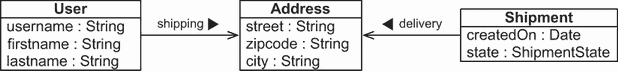

图 9.1 `Address`作为具有两个关联的实体，支持共享引用

我们正在开发 CaveatEmptor 应用程序，我们需要将图 9.1 中的实体进行映射。一对一关联有几种可能的映射方式。我们将考虑的第一种策略是共享主键值。

注意 要能够执行源代码中的示例，您首先需要运行 Ch09.sql 脚本。

### 9.1.1 共享主键

由主键关联关系连接的两个表中的行共享相同的键值。如果每个用户恰好有一个送货地址，那么方法将是 `User` 与（送货）`Address` 具有相同的键值。这种方法的主要困难在于确保在实例保存时分配给关联实例相同的键值。

在我们查看这个问题之前，让我们创建基本的映射。`Address` 类现在是一个独立的实体；它不再是组件。以下源代码可以在 onetoone-sharedprimarykey 文件夹中找到。

列表 9.1 `Address` 类作为一个独立的实体

```
Path: onetoone-sharedprimarykey/src/main/java/com/manning/javapersistence
➥ /ch09/onetoone/sharedprimarykey/Address.java

\1
public class Address {
    @Id
    @GeneratedValue(generator = Constants.ID_GENERATOR)
    private Long id;
    @NotNull
    private String street;
    @NotNull
    private String zipcode;
    @NotNull
    private String city;
    //  . . .
}
```

`User` 类也是一个具有 `shippingAddress` 关联属性的实体。在这里，我们将引入两个新的注解：`@OneToOne` 和 `@PrimaryKeyJoinColumn``。

`@OneToOne` 做了你期望的事情：它将实体值属性标记为一对一关联。我们将需要 `User` 有一个 `Address`，带有 `optional=false` 子句。我们将通过 `cascade = CascadeType.ALL` 子句强制从 `User` 到 `Address` 的更改级联。`@PrimaryKeyJoinColumn` 注解选择了我们想要映射的共享主键策略。

列表 9.2 `User` 实体和 `shippingAddress` 关联

```
Path: onetoone-sharedprimarykey/src/main/java/com/manning/javapersistence
➥ /ch09/onetoone/sharedprimarykey/User.java

@Entity
@Table(name = "USERS")
public class User {
    @Id                                             Ⓐ
    private Long id;

       private String username;

    @OneToOne(                                      Ⓑ
        fetch = FetchType.LAZY,                     Ⓒ
        optional = false,                           Ⓓ
           cascade = CascadeType.ALL                Ⓔ
    )
    @PrimaryKeyJoinColumn                           Ⓕ
    private Address shippingAddress;

    public User() {
    }

    public User(Long id, String username) {         Ⓖ
        this.id = id;
        this.username = username;
    }
    //  . . .
}
```

Ⓐ 对于 `User`，我们没有声明标识符生成器。如第 5.2.4 节所述，这是我们很少使用应用程序分配的标识符值的情况之一。

Ⓑ `User` 和 `Address` 之间的关系是一对一。

Ⓒ 如同往常，我们应该优先考虑延迟加载策略，因此我们覆盖了默认的 `FetchType.EAGER` 为 `LAZY`。

Ⓓ `optional=false` 开关指定一个 `User` 必须有一个 `shippingAddress`。

Ⓔ Hibernate 生成的数据库模式通过外键约束反映了这一点。任何更改都必须级联到 `Address`。`USERS` 表的主键也具有引用 `ADDRESS` 表主键的外键约束。请参阅图 9.2 中的表。

Ⓕ 使用 `@PrimaryKeyJoinColumn` 使得这成为一个单向共享主键一对一关联映射，从 `User` 到 `Address`。

Ⓖ 构造函数设计弱化了这一点：类的公共 API 需要一个标识符值来创建一个实例。

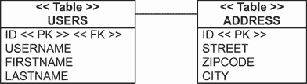

图 9.2 `USERS` 表在其主键上有一个外键约束。

对于本章的一些示例，我们需要对我们的测试配置进行一些更改，因为执行需要是事务性的。`SpringDataConfiguration` 类将需要更多的注解：

```
Path: onetoone-sharedprimarykey/src/test/java/com/manning/javapersistence
➥ /ch09/configuration/onetoone/sharedprimarykey
➥ /SpringDataConfiguration.java

@Configuration                                                           Ⓐ
@EnableTransactionManagement                                             Ⓑ
@ComponentScan(basePackages = "com.manning.javapersistence.ch09.*")      Ⓒ
@EnableJpaRepositories("com.manning.javapersistence.ch09.repositories.   Ⓓ
                        onetoone.sharedprimarykey")                      Ⓓ
public class SpringDataConfiguration {
// . . .
}
```

Ⓐ `@Configuration` 指定这个类声明了一个或多个由 Spring 容器使用的 bean 定义。

Ⓑ `@EnableTransactionManagement` 通过注解启用 Spring 的事务管理功能。

Ⓒ 我们需要以事务方式执行一些操作来测试本章的代码。`@ComponentScan`要求 Spring 扫描提供的包及其子包以查找组件。

Ⓓ `@EnableJpaRepositories`扫描指定的包以查找 Spring Data 仓库。

我们将在专门的`TestService`类中隔离对数据库的操作：

```
Path: onetoone-sharedprimarykey/src/test/java/com/manning/javapersistence
➥ /ch09/onetoone/sharedprimarykey/TestService.java

@Service                                             Ⓐ
public class TestService {
    @Autowired                                       Ⓑ
    private UserRepository userRepository;           Ⓑ

    @Autowired                                       Ⓑ
    private AddressRepository addressRepository;     Ⓑ

    @Transactional                                   Ⓒ
    public void storeLoadEntities() {                Ⓒ
// . . .
```

Ⓐ `TestService`类被注解为`@Service`，以允许 Spring 自动创建一个豆，稍后将其注入到有效的测试中。记住，在`SpringDataConfiguration`类中，我们扫描`com.manning.javapersistence .ch09`包及其子包以查找组件。

Ⓑ 注入两个仓库豆。

Ⓒ 定义`storeLoadEntities`方法，并使用`@Transactional`注解。我们需要对数据库执行的操作必须是事务性的，我们将让 Spring 来控制这一点。

测试类将与之前展示的不同，因为它将委托给`TestService`类。这将允许我们将事务性操作隔离在其自己的方法中，并从测试中调用这些方法。

```
Path: onetoone-sharedprimarykey/src/test/java/com/manning/javapersistence
➥ /ch09/onetoone/sharedprimarykey/AdvancedMappingSpringDataJPATest.java

@ExtendWith(SpringExtension.class)
@ContextConfiguration(classes = {SpringDataConfiguration.class})
public class AdvancedMappingSpringDataJPATest {

    @Autowired
    private TestService testService;

    @Test
    void testStoreLoadEntities() {

        testService.storeLoadEntities();

    }
}
```

JPA 规范没有包括处理共享主键生成问题的标准化方法。这意味着在我们将`User`实例保存到关联的`Address`实例的标识符值之前，我们必须正确设置`User`实例的标识符值：

```
Path: onetoone-sharedprimarykey/src/test/java/com/manning/javapersistence
➥ /ch09/onetoone/sharedprimarykey/TestService.java

Address address =
        new Address("Flowers Street", "01246", "Boston");
addressRepository.save(address);                           Ⓐ

User john = new User(address.getId(),"John Smith");        Ⓑ
john.setShippingAddress(address);

userRepository.save(john);                                 Ⓒ
```

Ⓐ 持久化`Address`。

Ⓑ 取其生成的标识符值并将其设置在`User`上。

Ⓒ 保存它。

映射和代码有三个问题：

+   我们必须记住，`Address`必须首先保存，然后才能获取其标识符值。这只有在`Address`实体具有在`INSERT`之前在`save()`时产生值的标识符生成器的情况下才可能，正如我们在 5.2.5 节中讨论的那样。否则，`someAddress.getId()`返回`null`，我们无法手动设置`User`的标识符值。

+   仅当关联是非可选的时，使用代理的延迟加载才有效。这对于刚开始接触 JPA 的开发者来说通常是一个惊喜。`@OneToOne`的默认值是`FetchType.EAGER`：当 Hibernate 或 Spring Data JPA 使用 Hibernate 加载一个`User`时，它会立即加载`shippingAddress`。从概念上讲，只有当 Hibernate 知道存在一个链接的`shipping-Address`时，使用代理的延迟加载才有意义。如果属性是可空的，Hibernate 将不得不通过查询`ADDRESS`表来检查属性值是否为`NULL`。如果我们必须检查数据库，我们不妨立即加载值，因为使用代理将没有好处。

+   一对一关联是单向的；有时我们需要双向导航。

第一个问题没有其他解决方案。在先前的例子中，我们正是这样做的：保存`Address`，获取其主键，并将其手动设置为`User`的标识符值。这也是我们应该始终优先选择能够在任何 SQL `INSERT`之前产生值的标识符生成器的原因之一。

`@OneToOne(optional=true)`关联不支持使用代理的延迟加载。这与 JPA 规范一致。`FetchType.LAZY`是对持久化提供者的提示，而不是要求。我们可以通过字节码插装获得可空`@OneToOne`的延迟加载，如第 12.1.3 节所示。

关于最后一个问题，如果我们使关联双向（其中`Address`引用`User`，而`User`引用`Address`），我们也可以使用一个仅 Hibernate 专用的标识符生成器来帮助分配键值。

### 9.1.2 外部主键生成器

双向映射始终需要一个`mappedBy`端。我们将选择`User`端——这是一个口味和可能的其他次要要求的问题。（随后的源代码可以在`onetoone-foreigngenerator`文件夹中找到。）

```
Path: onetoone-foreigngenerator/src/main/java/com/manning/javapersistence
➥ /ch09/onetoone/foreigngenerator/User.java

@Entity
@Table(name = "USERS")
public class User {
    @Id
    @GeneratedValue(generator = Constants.ID_GENERATOR)
    private Long id;

    private String username;

    @OneToOne(
        mappedBy = "user",
        cascade = CascadeType.PERSIST
    )
    private Address shippingAddress;
    //  . . .
}
```

我们添加了`mappedBy`选项，告诉 Hibernate 或 Spring Data JPA 使用 Hibernate，现在低级细节由“另一边的属性”映射，命名为`user`。为了方便，我们启用了`CascadeType.PERSIST`；传递性持久化将使按正确顺序保存实例变得更容易。当我们使`User`持久化时，Hibernate 会使其`shippingAddress`持久化并自动生成主键标识符。

接下来，让我们看看“另一边”：`Address`。我们将在标识符属性上使用`@GenericGenerator`来定义一个具有 Hibernate 专用`foreign`策略的特殊用途主键值生成器。在 5.2.5 节概述中我们没有提到这个生成器，因为共享主键一对一关联是其唯一用例。当持久化`Address`实例时，这个特殊的生成器会抓取`user`属性的值并获取引用实体实例的标识符值，即`User`。

列表 9.3 `Address`具有特殊的 foreign key 生成器

```
Path: onetoone-foreigngenerator/src/main/java/com/manning/javapersistence
➥ /ch09/onetoone/foreigngenerator/Address.java

@Entity
public class Address {
    @Id
    @GeneratedValue(generator = "addressKeyGenerator")
    @org.hibernate.annotations.GenericGenerator(            Ⓐ
        name = "addressKeyGenerator",
        strategy = "foreign",
        parameters =
            @org.hibernate.annotations.Parameter(
                name = "property", value = "user"
            )
    )
    private Long id;

    // . . .

    @OneToOne(optional = false)                             Ⓑ
    @PrimaryKeyJoinColumn                                   Ⓒ
    private User user;

    public Address() {
    }

    public Address(User user) {                             Ⓓ
        this.user = user;
    }

    public Address(User user, String street,                Ⓓ
                   String zipcode, String city) {           Ⓓ
        this.user = user;
        this.street = street;
        this.zipcode = zipcode;
        this.city = city;
    }
    //  . . .
}
```

Ⓐ 使用`@GenericGenerator`注解，当我们持久化`Address`实例时，这个特殊的生成器会抓取`user`属性的值并获取引用实体实例的标识符值，即`User`。

Ⓑ `@OneToOne`映射被设置为`optional=false`，因此`Address`必须有一个对`User`的引用。

Ⓒ `user`属性被标记为具有`@PrimaryKeyJoinColumn`注解的共享主键实体关联。

Ⓓ `Address`的公共构造函数现在需要一个`User`实例。反映`optional=false`的外键约束现在位于`ADDRESS`表的主键列上，如图 9.3 中的模式所示。

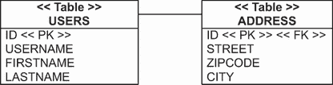

图 9.3 `ADDRESS` 表在其主键上有一个外键约束。

多亏了这段新代码，我们不再需要在我们的工作单元中调用`address.getId()`或`user.getId()`。存储数据简化了：

```
Path: onetoone-foreigngenerator/src/test/java/com/manning/javapersistence
➥ /ch09/onetoone/foreigngenerator/AdvancedMappingJPATest.java

User john = new User("John Smith");
Address address =
    new Address(
        john,                                   Ⓐ
        "Flowers Street", "01246", "Boston"
    );
john.setShippingAddress(address);               Ⓐ
userRepository.save(john);                      Ⓑ
```

Ⓐ 我们必须链接双向实体关联的两边。注意，使用这种映射，我们不会得到`User#shippingAddress`的懒加载（它是可选的/可以为 null），但我们可以按需使用代理加载`Address#user`（它不是可选的）。

Ⓑ 当我们持久化用户时，我们将获得`shippingAddress`的传递性持久化。

共享主键的一对一关联相对较少。相反，我们通常会使用外键列和唯一约束来映射“一对一”关联。

### 9.1.3 使用外键连接列

两个行不必共享主键，它们可以根据一个简单的附加外键列建立关系。一个表有一个外键列，它引用相关表的主键。（这个外键约束的源和目标甚至可以是同一个表：我们称之为*自引用关系*。）接下来的源代码可以在`onetoone-foreignkey`文件夹中找到。

让我们改变`User#shippingAddress`的映射。我们不再使用共享主键，而是在`USERS`表中添加一个`SHIPPINGADDRESS_ID`列。这个列有一个`UNIQUE`约束，所以没有两个用户可以引用相同的送货地址。查看图 9.4 中的模式。

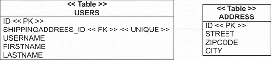

图 9.4 `USERS` 表和 `ADDRESS` 表之间的一对一连接列关联

`Address`是一个常规的实体类，就像我们在本章中演示的第一个一样，在列表 9.1 中。`User`实体类有`shippingAddress`属性，实现了这个单向关联。

我们应该为这个`User`–`Address`关联启用懒加载。与共享主键不同，这里我们没有懒加载的问题：当`USERS`表的一行被加载时，它包含`SHIPPINGADDRESS_ID`列的值。因此，Hibernate 或使用 Hibernate 的 Spring Data 知道是否存在`ADDRESS`行，并且可以使用代理按需加载`Address`实例。

```
Path: onetoone-foreignkey/src/main/java/com/manning/javapersistence
➥ /ch09/onetoone/foreignkey/User.java

@Entity
@Table(name = "USERS")
public class User {
    @Id
    @GeneratedValue(generator = Constants.ID_GENERATOR)
    private Long id;

    @OneToOne(
        fetch = FetchType.LAZY,
        optional = false,                 Ⓐ
        cascade = CascadeType.PERSIST
    )
    @JoinColumn(unique = true)            Ⓑ
    private Address shippingAddress;
    //  . . .
}
```

Ⓐ 我们不需要任何特殊的标识符生成器或主键分配；我们将确保`shippingAddress`不为空。

Ⓑ 我们不使用`@PrimaryKeyJoinColumn`，而是应用常规的`@JoinColumn`，它将默认为`SHIPPINGADDRESS_ID`。如果你比 JPA 更熟悉 SQL，每次你在映射中看到`@JoinColumn`时，都将其视为“外键列”会有所帮助。

在映射中，我们设置`optional=false`，因此用户必须有一个运输地址。这不会影响加载行为，但它是在`@JoinColumn`上的`unique=true`设置的逻辑后果。此设置向生成的 SQL 模式添加了唯一约束。如果`SHIPPINGADDRESS_ID`列的值对所有用户都必须是唯一的，那么可能只有一个用户没有“运输地址”。因此，可空唯一列通常没有意义。

创建、链接和存储实例是直接的：

```
Path: onetoone-foreignkey/src/test/java/com/manning/javapersistence
➥ /ch09/onetoone/foreignkey/AdvancedMappingSpringDataJPATest.java

User john = new User("John Smith");
Address address = new Address("Flowers Street", "01246", "Boston");
john.setShippingAddress(address);                                    Ⓐ
userRepository.save(john);                                           Ⓑ
```

Ⓐ 创建用户和地址之间的链接。

Ⓑ 当我们保存`john`时，我们将递归地保存`address`。

我们现在已经完成了两个基本的一对一关联映射：第一个使用共享主键，第二个使用外键引用和唯一列约束。我们想要讨论的最后一个选项稍微有些特别：通过一个额外的表来映射一对一关联。

### 9.1.4 使用连接表

你可能已经注意到，可空列可能会带来问题。有时，对于可选值来说，使用一个中间表是一个更好的解决方案，如果存在链接，则该表包含一行，如果不存，则不包含。

让我们考虑 CaveatEmptor 中的`Shipment`实体，并讨论其目的。卖家和买家通过在 CaveatEmptor 中开始和竞标拍卖来互动。运输商品似乎超出了应用程序的范围；拍卖结束后，卖家和买家会就运输和支付方式达成一致。他们可以在 CaveatEmptor 之外离线完成此事。

另一方面，我们可以在 CaveatEmptor 中提供托管服务。拍卖结束后，卖家将使用此服务创建一个可追踪的运输。买家将拍卖物品的价格支付给受托人（我们），我们会通知卖家资金已可用。一旦运输到达且买家接受，我们将把资金转给卖家。

如果你曾经参与过价值重大的在线拍卖，你可能已经使用过这样的托管服务。但我们在 CaveatEmptor 中希望提供更多：我们不仅将为完成的拍卖提供信任服务，还允许用户为他们在拍卖之外、在 CaveatEmptor 之外达成的任何交易创建可追踪和可信任的运输。这种情况需要一个具有可选一对一关联到`Item`的`Shipment`实体。该领域模型的类图如图 9.5 所示。


图 9.5 `Shipment`与拍卖`Item`有一个可选的链接。

注意：我们简要考虑放弃本节的 CaveatEmptor 示例，因为我们找不到一个需要可选一对一关联的自然场景。如果这个托管示例看起来很牵强，请考虑将员工分配到工作站的问题。这也是一个可选的一对一关系。

在数据库模式中，我们将添加一个名为 `ITEM_SHIPMENT` 的中间链接表。这个表中的一行代表在拍卖背景下进行的运输。图 9.6 显示了这些表。

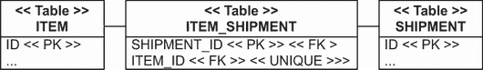

图 9.6 中间表连接了项目和运输。

注意模式如何强制唯一性和一对一关系：`ITEM_SHIPMENT` 的主键是 `SHIPMENT_ID` 列，而 `ITEM_ID` 列是唯一的。因此，一个项目只能在一个运输中。当然，这也意味着一个运输只能包含一个项目。

我们将使用 `Shipment` 实体类中的 `@OneToOne` 注解来映射此模型。下面的源代码可以在 onetoone-jointable 文件夹中找到。

```
Path: onetoone-jointable/src/main/java/com/manning/javapersistence
➥ /ch09/onetoone/jointable/Shipment.java

@Entity
public class Shipment {
    // . . .
    @OneToOne(fetch = FetchType.LAZY)            Ⓐ
    @JoinTable(
        name = "ITEM_SHIPMENT",                  Ⓑ
        joinColumns =
            @JoinColumn(name = "SHIPMENT_ID"),   Ⓒ
        inverseJoinColumns =
            @JoinColumn(name = "ITEM_ID",        Ⓓ
                        nullable = false,
                        unique = true)           Ⓔ
    )
    private Item auction;

    //  . . .
}
```

Ⓐ 懒加载已被启用，但有一个转折：当 Hibernate 或 Spring Data JPA 使用 Hibernate 加载一个 `Shipment` 时，它会查询 `SHIPMENT` 和 `ITEM_ SHIPMENT` 连接表。Hibernate 在使用代理之前必须知道是否存在对 `Item` 的链接。它通过一个外连接 SQL 查询来完成，所以我们不会看到任何额外的 SQL 语句。如果 `ITEM_SHIPMENT` 中有一行，Hibernate 将使用一个 `Item` 代理。

Ⓑ `@JoinTable` 注解是新的；我们总是必须指定中间表的名字。这种映射有效地隐藏了连接表；没有对应的 Java 类。注解定义了 `ITEM_SHIPMENT` 表的列名。

Ⓒ 连接列是 `SHIPMENT_ID`（默认为 `ID`）。

Ⓓ 反向连接列是 `ITEM_ID`（默认为 `AUCTION_ID`）。

Ⓔ Hibernate 在模式中生成 `UNIQUE` 约束在 `ITEM_ID` 列上。Hibernate 还在连接表的列上生成适当的外键约束。

在这里，我们存储了一个没有 `Item` 的 `Shipment` 和另一个与单个 `Item` 链接的 `Shipment`：

```
Path: onetoone-jointable/src/test/java/com/manning/javapersistence
➥ /ch09/onetoone/jointable/AdvancedMappingSpringDataJPATest.java

Shipment shipment = new Shipment();
shipmentRepository.save(shipment);
Item item = new Item("Foo");
itemRepository.save(item);
Shipment auctionShipment = new Shipment(item);
shipmentRepository.save(auctionShipment);
```

这完成了我们对一对一关联映射的讨论。总结来说，如果两个实体中有一个总是存储在另一个之前并且可以作为主键源，则应使用共享主键关联。在其他所有情况下，使用外键关联，或者当一对一关联是可选的时候，使用隐藏的中间连接表。

我们现在将关注复数或*多值*实体关联，从一对一的一些高级选项开始。

## 9.2 一对多关联

根据定义，*复数实体关联*是一组实体引用。我们在第 8.3.2 节中映射了其中之一，即一对一关联。一对多关联是涉及集合的最重要的一种实体关联。当简单的一对多或双向多对一足以完成任务时，我们将劝阻使用更复杂的关联样式。

此外，请记住，如果你不想映射任何实体集合，你完全可以这样做；你总是可以写一个显式查询而不是通过迭代直接访问。如果你决定映射实体引用集合，你有一些选择，我们现在将分析一些更复杂的情况。

### 9.2.1 考虑一对多袋

到目前为止，我们只看到了在 `Set` 上的 `@OneToMany`，但我们可以为双向一对多关联使用袋映射。我们为什么要这样做呢？

袋具有所有可用于双向一对多实体关联的集合中最有效的性能特征。默认情况下，Hibernate 中的集合在第一次访问时加载。因为袋不需要维护其元素的索引（如列表）或检查重复元素（如集合），所以我们可以向袋中添加新元素而不触发加载。如果我们打算映射可能很大的实体引用集合，这是一个重要的特性。

另一方面，我们不能同时 eager-fetch 两个袋类型集合，因为生成的 `SELECT` 查询是无关的，需要分别保存。例如，如果 `Item` 的 `bids` 和 `images` 是一对多袋，这种情况可能会发生。这并不是什么大损失，因为同时获取两个集合总是会产生笛卡尔积；我们想要避免这种操作，无论集合是袋、集合还是列表。我们将在第十二章中回到获取策略。一般来说，如果我们把袋映射为 `@OneToMany(mappedBy = "...")`，那么袋是一个一对多关联的最佳反向集合。

为了将我们的双向一对多关联映射为袋，我们必须将 `Item` 实体中 `bids` 集合的类型替换为 `Collection` 和 `ArrayList` 实现。`Item` 和 `Bid` 之间的关联映射基本上保持不变。（后续的源代码可以在 onetomany-bag 文件夹中找到。）

```
Path: onetomany-bag/src/main/java/com/manning/javapersistence/ch09
➥ /onetomany/bag/Item.java

@Entity
public class Item {
    / . . .
    @OneToMany(mappedBy = "item")
    private Collection<Bid> bids = new ArrayList<>();
    //  . . .
}
```

与其 `@ManyToOne`（即“mapped by”侧）以及表格相同的 `Bid` 侧。

一个集合允许重复元素，而集合则不允许：

```
Path: onetomany-bag/src/test/java/com/manning/javapersistence/ch09
➥ /onetomany/bag/AdvancedMappingSpringDataJPATest.java

   Item item = new Item("Foo");
   itemRepository.save(item);
Bid someBid = new Bid(new BigDecimal("123.00"), item);
item.addBid(someBid);
item.addBid(someBid);
bidRepository.save(someBid);
assertEquals(2, someItem.getBids().size());
```

结果表明，在这种情况下这不相关，因为 *重复* 意味着我们已经将特定的引用添加到同一个 `Bid` 实例中多次。我们不会在我们的应用程序代码中这样做。即使我们多次将相同的引用添加到这个集合中，Hibernate 或使用 Hibernate 的 Spring Data JPA 也会忽略它——没有持久化效果。与数据库更新相关的方面是 `@ManyToOne`，关系已经由那一侧“映射”。当我们加载 `Item` 时，集合不包含重复项：

```
Path: onetomany-bag/src/test/java/com/manning/javapersistence/ch09/
➥ onetomany/bag/AdvancedMappingSpringDataJPATest.java

Item item2 = itemRepository.findItemWithBids(item.getId());
assertEquals(1, item2.getBids().size());
```

如前所述，袋的优势在于当我们添加新元素时，集合不需要初始化：

```
Path: onetomany-bag/src/test/java/com/manning/javapersistence/ch09/
➥ onetomany/bag/AdvancedMappingSpringDataJPATest.java

Bid bid = new Bid(new BigDecimal("456.00"), item);
item.addBid(bid);                                   Ⓐ
bidRepository.save(bid);
```

Ⓐ 这个代码示例触发一个 SQL `SELECT`来加载`Item`。每当调用`item.addBid()`时，Hibernate 都会立即初始化并返回一个带有`SELECT`的`Item`代理。但只要我们不迭代`Collection`，就不需要更多的查询，并且会为新的`Bid`执行一个`INSERT`操作，而不需要加载所有出价。如果集合是`Set`或`List`，当添加另一个元素时，Hibernate 会加载所有元素。

现在，我们将集合更改为持久`List`。

### 9.2.2 单向和双向列表映射

如果我们需要一个真正的列表来保存集合中元素的位置，我们必须在额外的列中存储该位置。对于一对一映射，这也意味着我们应该将`Item#bids`属性更改为`List`并使用`ArrayList`初始化变量。这将是一个单向映射：将没有其他“由...映射”的一侧。`Bid`将没有`@ManyToOne`属性。对于持久列表索引，我们将使用`@OrderColumn`注解。（随后的源代码可以在`onetomany-list`文件夹中找到。）

```
Path: onetomany-list/src/main/java/com/manning/javapersistence/ch09/
➥ onetomany/list/Item.java

@Entity
public class Item {
    @OneToMany
    @JoinColumn(
        name = "ITEM_ID",
        nullable = false
    )
    @OrderColumn(
        name = "BID_POSITION",    Ⓐ
        nullable = false          Ⓑ
    )
    private List<Bid> bids = new ArrayList<>();
    //  . . .
}
```

Ⓐ 如前所述，这是一个单向映射：没有其他“由...映射”的一侧。`Bid`没有`@ManyToOne`属性。`@OrderColumn`注解将索引列的名称设置为`BID_POSITION`。否则，它将默认为`BIDS_ORDER`。

Ⓑ 如同往常，我们应该使列`NOT NULL`。

`BID`表的数据库视图，包括连接和排序列，如图 9.7 所示。

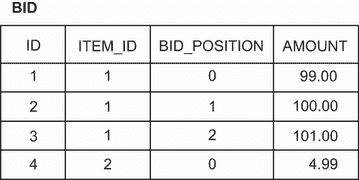

图 9.7 `BID`表包含`ITEM_ID`（连接列）和`BID_POSITION`（排序列）。

每个集合的存储索引从零开始，并且是连续的（没有间隔）。当我们添加、删除和移动`List`的元素时，Hibernate 将执行可能很多的 SQL 语句。我们已经在第 8.1.6 节中讨论了这个问题。

让我们将这个映射改为双向的，在`Bid`实体上添加一个`@ManyToOne`属性：

```
Path: onetomany-list/src/main/java/com/manning/javapersistence/ch09/
➥ onetomany/list/Bid.java

@Entity
public class Bid {
    // . . .

    @ManyToOne
    @JoinColumn(
        name = "ITEM_ID",
        updatable = false, insertable = false      Ⓐ
    )
    @NotNull
    private Item item;
    //  . . .
}
```

Ⓐ `Item#bids`集合不再是只读的，因为 Hibernate 现在必须存储每个元素的索引。如果`Bid#item`端是关系的所有者，Hibernate 将忽略集合在存储数据时，并且不会写入元素索引。我们必须将`@JoinColumn`映射两次，然后使用`updatable=false`和`insertable=false`禁用`@ManyToOne`端的写入。现在，Hibernate 在存储数据时考虑集合端，包括每个元素的索引。`@ManyToOne`实际上是只读的，就像它有`mappedBy`属性一样。

你可能期望不同的代码——可能是`@ManyToOne(mappedBy="bids")`和没有额外的`@JoinColumn`注解。但是`@ManyToOne`没有`mappedBy`属性：它总是关系的“拥有”端。我们必须将另一端，`@OneToMany`，作为`mappedBy`端。

最后，Hibernate 模式生成器始终依赖于`@ManyToOne`侧的`@JoinColumn`。因此，如果我们想要生成正确的模式，我们应该在这侧添加`@NotNull`或声明`@JoinColumn(nullable=false)`。如果存在`@ManyToOne`，生成器会忽略`@OneToMany`侧及其连接列。

在实际应用中，我们不会用`List`来映射这个关联。在数据库中保留元素顺序似乎是一个常见的用例，但实际上并不太有用：有时我们可能希望首先显示最高或最新的出价列表，或者只显示某个特定用户的出价，或者显示在一定时间范围内的出价。这些操作都不需要持久化的列表索引。如第 3.2.4 节所述，最好避免在数据库中存储显示顺序，因为显示顺序可能会频繁更改；而是通过查询保持其灵活性，而不是使用硬编码的映射。此外，当应用程序在列表中删除、添加或移动元素时，维护索引可能会很昂贵，并可能触发许多 SQL 语句。使用`@ManyToOne`映射外键连接列，并删除集合。

接下来我们将处理另一个具有一对多关系的场景：一个关联映射到中间连接表。

### 9.2.3 使用连接表的可选一对多

`Item`类的一个有用补充是`buyer`属性。然后我们可以调用`someItem.getBuyer()`来访问出价获胜的`User`。如果将其双向化，这个关联也将帮助我们渲染一个显示特定用户赢得的所有拍卖的屏幕：我们可以调用`someUser.getBoughtItems()`而不是编写查询。

从`User`类的角度来看，这个关联是一对多。图 9.8 显示了类及其关系。

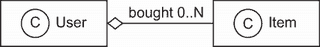

图 9.8 `User-Item`“购买”关系

为什么这个关联与`Item`和`Bid`之间的关联不同？UML 中的多重度`0..*`表示引用是可选的。这不会对 Java 领域模型产生太大影响，但它对底层表有影响。我们期望在`ITEM`表中有一个`BUYER_ID`外键列，但现在这个列必须是可空的，因为用户可能没有购买特定的`Item`（只要拍卖仍在进行中）。

我们可以接受外键列可以是`NULL`，并应用额外的约束：“只有在拍卖结束时间未到达或没有出价的情况下才允许为`NULL`。”然而，我们总是尽量避免在关系数据库模式中存在可空列。未知信息会降低我们存储的数据质量。元组代表真实的命题，我们不能断言我们不知道的事情。此外，在实践中，许多开发人员和数据库管理员没有创建正确的约束，而是依赖于经常出现错误的程序代码来提供数据完整性。

一个可选的实体关联，无论是一对一还是一对多，在 SQL 数据库中最好通过连接表来表示。图 9.9 显示了示例模式。

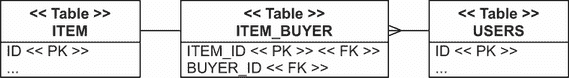

图 9.9 一个中间表连接用户和物品。

我们在本章早期添加了一个连接表用于一对一关联。为了保证一对一的多重性，我们在连接表的外键列上应用了唯一约束。在当前情况下，我们有一个一对多的多重性，因此只有`ITEM_ID`主键列必须是唯一的：只有一个`User`可以购买任何给定的`Item`一次。`BUYER_ID`列不是唯一的，因为一个`User`可以购买多个`Item`。（随后的源代码可以在`onetomany-jointable`文件夹中找到。）

`User#boughtItems`集合的映射很简单：

```
Path: onetomany-jointable/src/main/java/com/manning/javapersistence/ch09/
➥ onetomany/jointable/User.java

@Entity
@Table(name = "USERS")
public class User {
    // . . .
    @OneToMany(mappedBy = "buyer")
    private Set<Item> boughtItems = new HashSet<>();
    //  . . .
}
```

这通常是双向关联的只读一侧，实际映射到“由...映射”侧的模式，即`Item#buyer`。这将是一个干净、可选的一对多/多对一关系。

```
Path: onetomany-jointable/src/main/java/com/manning/javapersistence/ch09/
➥ onetomany/jointable/Item.java

@Entity
public class Item {
    // . . .
    @ManyToOne(fetch = FetchType.LAZY)
    @JoinTable(
        name = "ITEM_BUYER",
        joinColumns =
            @JoinColumn(name = "ITEM_ID"),     Ⓐ
        inverseJoinColumns =
            @JoinColumn(nullable = false)      Ⓑ
    )
    private User buyer;
    //  . . .
}
```

Ⓐ 如果一个`Item`没有被购买，`ITEM_BUYER`连接表中就没有对应的行。因此，这种关系将是可选的。连接列名为`ITEM_ID`（它将默认为`ID`）。

Ⓑ 反向连接列将默认为`BUYER_ID`，且不可为空。

我们的模式中没有任何有问题的可空列。尽管如此，我们应该为`ITEM_BUYER`表编写一个过程约束和一个在`INSERT`上运行的触发器：“只有当给定物品的拍卖结束时间到达且用户做出了获胜出价时，才允许插入买家。”

下一个例子是我们最后一个关于一对多关联的例子。到目前为止，你已经看到了从一个实体到另一个实体的多对一关联。一个嵌入式组件类也可以有一个到实体的多对一关联，这正是我们现在要处理的。

### 9.2.4 嵌入式类中的一对多关联

再次考虑我们重复了几章的嵌入式组件映射：`User`的`Address`。现在我们将通过添加从`Address`到`Shipment`的一对多关联来扩展这个例子：一个名为`deliveries`的集合。图 9.10 显示了该模型的 UML 类图。

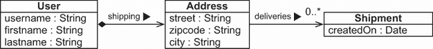

图 9.10 从`Address`到`Shipment`的一对多关系

`Address`是一个`@Embeddable`类，不是一个实体。它可以拥有一个到实体的单向关联；这里，它是一个到`Shipment`的一对多多重性。我们将在下一节中查看一个与实体有多个到一关联的嵌入式类。（随后的源代码可以在`onetomany-embeddable`文件夹中找到。）

`Address`类有一个`Set<Shipment>`来表示这个关联：

```
Path: onetomany-embeddable/src/main/java/com/manning/javapersistence/ch09/
➥ onetomany/embeddable/Address.java

@Embeddable
public class Address {
    @NotNull
    @Column(nullable = false)
    private String street;
    @NotNull
    @Column(nullable = false, length = 5)
    private String zipcode;
    @NotNull
    @Column(nullable = false)
    private String city;
    @OneToMany
    @JoinColumn(
        name = "DELIVERY_ADDRESS_USER_ID",    Ⓐ
        nullable = false
    )
    private Set<Shipment> deliveries = new HashSet<>();
    //  . . .
}
```

Ⓐ 这个关联的第一个映射策略是与一个名为`@JoinColumn`的`DELIVERY_ADDRESS_USER_ID`（它将默认为`DELIVERIES_ID`）。

这个外键约束列位于 `SHIPMENT` 表中，如图 9.11 所示。

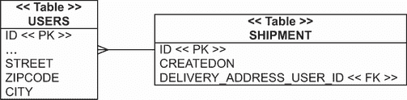

图 9.11 `USERS` 表中的主键将 `USERS` 和 `SHIPMENT` 表链接起来。

可嵌入组件没有自己的标识符，因此外键列中的值是 `User` 标识符的值，它嵌入 `Address`。在这里，我们也声明连接列 `nullable` `=` `false`，因此 `Shipment` 必须有一个相关的配送地址。当然，双向导航是不可能的：`Shipment` 不能引用 `Address`，因为嵌入组件不能有共享引用。

如果关联是可选的，并且我们不希望有可空列，我们可以将关联映射到一个中间连接/链接表，如图 9.12 所示。

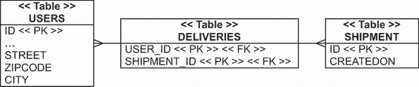

图 9.12 使用 `USERS` 和 `SHIPMENT` 之间的中间表来表示可选关联

`Address` 集合的映射现在使用 `@JoinTable` 而不是 `@JoinColumn`。（后续的源代码可以在 onetomany-embeddable-jointable 文件夹中找到。）

```
Path: onetomany-embeddable-jointable/src/main/java/com/manning
➥ /javapersistence/ch09/onetomany/embeddablejointable/Address.java

@Embeddable
public class Address {
    @NotNull
    @Column(nullable = false)
    private String street;
    @NotNull
    @Column(nullable = false, length = 5)
    private String zipcode;
    @NotNull
    @Column(nullable = false)
    private String city;

    @OneToMany
    @JoinTable(
        name = "DELIVERIES",                              Ⓐ
        joinColumns =
        @JoinColumn(name = "USER_ID"),                    Ⓑ
        inverseJoinColumns =
        @JoinColumn(name = "SHIPMENT_ID")                 Ⓒ
    )
    private Set<Shipment> deliveries = new HashSet<>();
    //  . . .
}
```

Ⓐ 连接表的名称将是 `DELIVERIES`（否则默认为 `USERS_SHIPMENT`）。

Ⓑ 连接列的名称将是 `USER_ID`（否则默认为 `USERS_ID`）。

Ⓒ 反向连接列的名称将是 `SHIPMENT_ID`（否则默认为 `SHIPMENTS_ID`）。

注意，如果我们既没有声明 `@JoinTable` 也没有声明 `@JoinColumn`，则嵌入类中的 `@OneToMany` 默认为连接表策略。

在拥有实体类内部，我们可以使用 `@AttributeOverride` 覆盖嵌入类的属性映射，如 6.2.3 节中所示。如果我们想覆盖嵌入类中实体关联的连接表或列映射，我们可以在拥有实体类中使用 `@AssociationOverride`。然而，我们无法切换映射策略；嵌入组件类中的映射决定是否使用连接表或连接列。

连接表映射当然也适用于真正的 *多对多* 映射。

## 9.3 多对多和三元关联

`Category` 和 `Item` 之间的关联是一个 *多对多* 关联，如图 9.13 所示。在一个真实系统中，我们可能没有多对多关联——我们的经验是，几乎总是有其他信息必须附加到关联实例之间的每个链接上。一些例子是 `Item` 被添加到 `Category` 时的戳记，以及创建链接的 `User`。我们将在本节稍后扩展示例以涵盖此类情况，但我们将从一个常规和更简单的多对多关联开始。

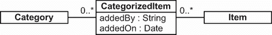

图 9.13 `Category` 和 `Item` 之间的多对多关联

### 9.3.1 单向和双向多对多关联

数据库中的连接表代表了一个常规的多对多关联，一些开发者也将其称为 *链接表* 或 *关联表*。图 9.14 展示了一个带有链接表的多对多关系。


图 9.14 `CategorizedItem` 是 `Category` 和 `Item` 之间的链接。

`CATEGORY_ITEM` 链接表有两列，这两列分别通过外键约束引用 `CATEGORY` 和 `ITEM` 表。它的主键是这两列的复合键。我们只能将特定的 `Category` 和 `Item` 链接一次，但我们可以将相同的项链接到多个类别。下面的源代码可以在 `manytomany-bidirectional` 文件夹中找到。

在 JPA 中，我们使用 `@ManyToMany` 注解在集合上映射多对多关联：

```
Path: manytomany-bidirectional/src/main/java/com/manning
➥ /javapersistence/ch09/manytomany/bidirectional/Category.java

@Entity
public class Category {
    // . . .
    @ManyToMany(cascade = CascadeType.*PERSIST*)
    @JoinTable(
        name = "CATEGORY_ITEM",
        joinColumns = @JoinColumn(name = "CATEGORY_ID"),
        inverseJoinColumns = @JoinColumn(name = "ITEM_ID")
    )
    private Set<Item> items = new HashSet<>();
    //  . . .
}
```

如同往常，我们可以启用 `CascadeType.PERSIST` 以便更容易保存数据。当我们从集合中引用新的 `Item` 时，Hibernate 或使用 Hibernate 的 Spring Data JPA 会使其持久化。让我们使这个关联双向（如果我们不需要，我们不必这样做）：

```
Path: manytomany-bidirectional/src/main/java/com/manning
➥ /javapersistence/ch09/manytomany/bidirectional/Item.java

@Entity
public class Item {
    // . . .
    @ManyToMany(mappedBy = "items")
    private Set<Category> categories = new HashSet<>();
    //  . . .
}
```

在任何双向映射中，一方是“由”另一方“映射”的。`Item#categories` 集合实际上是只读的；Hibernate 将在存储数据时分析 `Category#items` 方的内容。

接下来，我们将创建两个类别和两个项目，并以多对多的方式将它们链接起来：

```
Path: manytomany-bidirectional/src/test/java/com/manning
➥ /javapersistence/ch09/manytomany/bidirectional/TestService.java

Category someCategory = new Category("Some Category");
Category otherCategory = new Category("Other Category");
Item someItem = new Item("Some Item");
Item otherItem = new Item("Other Item");
someCategory.addItem(someItem);
someItem.addCategory(someCategory);
someCategory.addItem(otherItem);
otherItem.addCategory(someCategory);
otherCategory.addItem(someItem);
someItem.addCategory(otherCategory);
categoryRepository.save(someCategory);
categoryRepository.save(otherCategory);
```

由于我们启用了传递性持久化，保存类别会使整个实例网络持久化。另一方面，级联选项 `ALL`、`REMOVE` 和孤儿删除（在第 8.3.3 节中讨论）对于多对多关联来说没有意义。这是一个测试我们是否理解实体和价值类型的好点。试着想出合理的答案，解释为什么这些级联类型对于多对多关联来说没有意义。提示：考虑如果删除一条记录会自动删除相关记录可能会发生什么。

我们能否用 `List` 代替 `Set`，甚至是一个包？`Set` 完美地匹配数据库模式，因为在 `Category` 和 `Item` 之间不能有重复的链接。一个包意味着有重复的元素，因此我们需要为连接表提供一个不同的主键。Hibernate 的专有 `@CollectionId` 注解可以提供这一点，如第 8.1.5 节中所示。然而，如果我们需要支持重复链接，我们将在稍后讨论的替代多对多策略是一个更好的选择。

我们可以使用常规的 `@ManyToMany` 将索引集合（如 `List`）映射，但只能在一方进行。记住，在双向关系中，一方必须由另一方“映射”，这意味着当 Hibernate 与数据库同步时，其值会被忽略。如果双方都是列表，我们只能使一方的索引持久化。

正规的`@ManyToMany`映射隐藏了链接表；没有对应的 Java 类，只有一些集合属性。所以，每当有人说，“我的链接表有更多关于链接的信息的列”（在我们的经验中，总是有人会早点说），我们需要将这个信息映射到一个 Java 类。

### 9.3.2 通过中间实体进行多对多

我们总是可以将多对多关联表示为两个多对一关联到一个中间类，这就是我们接下来要做的。我们不会隐藏链接表；我们将用 Java 类来表示它。这种模型通常更容易扩展，所以我们通常不会在应用程序中使用常规的多对多关联。当不可避免地添加更多列到链接表时，更改代码的工作量很大，所以在映射如前节所示的`@ManyToMany`之前，请考虑图 9.15 中所示的替代方案。

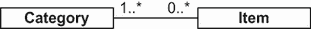

图 9.15 `CategorizedItem`将是`Category`和`Item`之间的链接。

想象一下，每次我们将一个`Item`添加到`Category`时，我们需要记录一些信息。`CategorizedItem`实体捕获了时间戳和创建链接的用户。这个领域模型需要在链接表上添加额外的列，如图 9.16 所示。

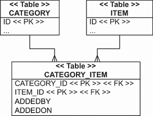

图 9.16 多对多关系中链接表上的附加列

`CategorizedItem`实体映射到链接表，你将在列表 9.4 中看到。（随后的源代码可以在`manytomany-linkentity`文件夹中找到。）这将涉及一大段代码和一些新的注解。首先，它将是一个不可变实体类（用`@org.hibernate.annotations.Immutable`注解），因此我们永远不会在创建后更新属性。如果我们声明类不可变，Hibernate 可以执行一些优化，例如在持久化上下文刷新期间避免脏检查。

实体类将有一个组合键，我们将将其封装在一个静态嵌套的可嵌入组件类中，以便于使用。标识符属性及其组合键列将通过`@EmbeddedId`注解映射到实体表。

列表 9.4 使用`CategorizedItem`映射多对多关系

```
Path: manytomany-linkentity/src/main/java/com/manning/javapersistence
➥ /ch09/manytomany/linkentity/CategorizedItem.java

@Entity
@Table(name = "CATEGORY_ITEM")
@org.hibernate.annotations.Immutable                        Ⓐ
public class CategorizedItem {
    @Embeddable
    public static class Id implements Serializable {        Ⓑ
        @Column(name = "CATEGORY_ID")
        private Long categoryId;
        @Column(name = "ITEM_ID")
        private Long itemId;

        public Id() {
        }

        public Id(Long categoryId, Long itemId) {
            this.categoryId = categoryId;
            this.itemId = itemId;
        }
        //implementing equals and hashCode
    }
    @EmbeddedId                                             Ⓒ
    private Id id = new Id();
    @Column(updatable = false)
    @NotNull
    private String addedBy;                                 Ⓓ
    @Column(updatable = false)
    @NotNull
    @CreationTimestamp
    private LocalDateTime addedOn;                          Ⓔ
    @ManyToOne
    @JoinColumn(
        name = "CATEGORY_ID",
        insertable = false, updatable = false)
    private Category category;                              Ⓕ
    @ManyToOne
    @JoinColumn(
        name = "ITEM_ID",
        insertable = false, updatable = false)
    private Item item;                                      Ⓖ
    public CategorizedItem(
        String addedByUsername,                             Ⓗ
        Category category,
        Item item) {
        this.addedBy = addedByUsername;                     Ⓘ
        this.category = category;
        this.item = item;
        this.id.categoryId = category.getId();              Ⓙ
        this.id.itemId = item.getId();
        category.addCategorizedItem(this);                  Ⓘ
        item.addCategorizedItem(this);
    }
    //  . . .
}
```

Ⓐ 该类是不可变的，如通过`@org.hibernate.annotations .Immutable`注解所示。

Ⓑ 实体类需要一个标识符属性。链接表的主键是由`CATEGORY_ID`和`ITEM_ID`组合而成的。当然，我们可以将这个`Id`类外部化到它自己的文件中。

Ⓒ 新的`@EmbeddedId`注解将标识符属性及其组合键列映射到实体表。

Ⓓ 将`addedBy`用户名映射到链接表的一个列的基本属性。

Ⓔ 将`addedOn`时间戳映射到链接表的一个列的基本属性。这是我们感兴趣的“关于链接的附加信息”。

Ⓕ `@ManyToOne` 属性 `category` 已经在标识符中进行了映射。

Ⓖ `@ManyToOne` 属性 `item` 已经在标识符中进行了映射。这里的技巧是使它们只读，使用 `updatable=false`、`insertable=false` 设置。这意味着 Hibernate 或使用 Hibernate 的 Spring Data JPA 会通过取 `CategorizedItem` 的标识符值来写入这些列的值。同时，我们可以通过 `categorizedItem.getItem()` 和 `getCategory()` 读取和浏览关联的实例。（如果我们没有将同一列映射为只读，Hibernate 或使用 Hibernate 的 Spring Data JPA 在启动时会抱怨重复的列映射。）

Ⓗ 我们还可以看到，构建一个 `CategorizedItem` 涉及到设置标识符的值。应用程序始终分配复合键值；Hibernate 不生成它们。

Ⓘ 构造函数设置了 `addedBy` 字段值，并通过管理关联两边的集合来保证引用完整性。

Ⓙ 构造函数设置了 `categoryId` 字段值。我们将映射这些集合以启用双向导航。这是一个单向映射，足以支持 `Category` 和 `Item` 之间的多对多关系。要创建一个链接，我们实例化并持久化一个 `CategorizedItem`。如果我们想断开一个链接，我们删除 `CategorizedItem`。`CategorizedItem` 的构造函数要求我们提供已经持久化的 `Category` 和 `Item` 实例。

如果需要双向导航，我们可以在 `Category` 和/或 `Item` 中映射一个 `@OneToMany` 集合。这里是在 `Category` 中的示例：

```
Path: manytomany-linkentity/src/main/java/com/manning/javapersistence
➥ /ch09/manytomany/linkentity/Category.java

@Entity
public class Category {
    // . . .
    @OneToMany(mappedBy = "category")
    private Set<CategorizedItem> categorizedItems = new HashSet<>();
    //  . . .
}
```

这里是 `Item` 中的示例：

```
Path: manytomany-linkentity/src/main/java/com/manning
➥ /javapersistence/ch09/manytomany/linkentity/Item.java

@Entity
public class Item {
    // . . .
    @OneToMany(mappedBy = "item")
    private Set<CategorizedItem> categorizedItems = new HashSet<>();
    //  . . .
}
```

双方都由 `CategorizedItem` 中的注解“映射”，所以当遍历由 `getCategorizedItems()` 方法返回的集合时，Hibernate 已经知道该怎么做。

```
This is how we create and store links:
Path: manytomany-linkentity/src/test/java/com/manning/javapersistence
➥ /ch09/manytomany/linkentity/TestService.java

Category someCategory = new Category("Some Category");
Category otherCategory = new Category("Other Category");
categoryRepository.save(someCategory);
categoryRepository.save(otherCategory);
Item someItem = new Item("Some Item");
Item otherItem = new Item("Other Item");
itemRepository.save(someItem);
itemRepository.save(otherItem);
CategorizedItem linkOne = new CategorizedItem(
    "John Smith", someCategory, someItem
);
CategorizedItem linkTwo = new CategorizedItem(
    "John Smith", someCategory, otherItem
);
CategorizedItem linkThree = new CategorizedItem(
    "John Smith", otherCategory, someItem
);
categorizedItemRepository.save(linkOne);
categorizedItemRepository.save(linkTwo);
categorizedItemRepository.save(linkThree);
```

这种策略的主要优势是双向导航的可能性：我们可以通过调用 `someCategory.getCategorizedItems()` 来获取一个类别中的所有项目，我们也可以通过 `someItem.getCategorizedItems()` 从相反方向导航。一个缺点是需要更复杂的代码来管理 `CategorizedItem` 实例，以创建和删除链接，我们必须独立地保存和删除它们。我们还需要在 `CategorizedItem` 类中提供一些基础设施，例如复合标识符。一个小改进是，可以在一些关联上启用 `CascadeType.PERSIST`，从而减少对 `save()` 的调用次数。

在这个例子中，我们将创建 `Category` 和 `Item` 之间链接的用户存储为一个简单的名称字符串。如果连接表有一个名为 `USER_ID` 的外键列，我们就会有一个三元关系。`CategorizedItem` 将会有一个 `@ManyToOne` 用于 `Category`、`Item` 和 `User`。

在下一节中，我们将演示另一种多对多策略。为了使其更有趣，我们将使其成为一个三元关联。

### 9.3.3 使用组件的三元关联

在前一节中，我们使用一个映射到链接表的实体类来表示多对多关系。一个潜在的更简单替代方案是映射到一个可嵌入组件类。以下源代码可以在`manytomany-ternary`文件夹中找到。

```
Path: manytomany-ternary/src/main/java/com/manning/javapersistence
➥ /ch09/manytomany/ternary/CategorizedItem.java

@Embeddable
public class CategorizedItem {
    @ManyToOne
    @JoinColumn(
        name = "ITEM_ID",
        nullable = false, updatable = false
    )
    private Item item;
    @ManyToOne
    @JoinColumn(
        name = "USER_ID",
        updatable = false
    )
    @NotNull                                               Ⓐ
    private User addedBy;
    @Column(updatable = false)
    @NotNull                                               Ⓐ
    private LocalDateTime addedOn = LocalDateTime.now();
    public CategorizedItem() {
    }
    public CategorizedItem(User addedBy,
                           Item item) {
        this.addedBy = addedBy;
        this.item = item;
    }
    //  . . .
}
```

Ⓐ `@NotNull`注解不会生成 SQL 约束，因此被注解的字段不会成为主键的一部分。

这里的新映射是`@Embeddable`中的`@ManyToOne`关联以及额外的外键连接列`USER_ID`，这使得这是一个三元关系。查看图 9.17 中的数据库模式。

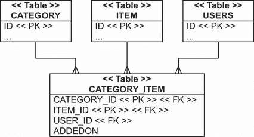

图 9.17 一个具有三个外键列的链接表

可嵌入组件集合的所有者是`Category`实体：

```
Path: manytomany-ternary/src/main/java/com/manning/javapersistence
➥ /ch09/manytomany/ternary/Category.java

@Entity
public class Category {
    // . . .
    @ElementCollection
    @CollectionTable(
        name = "CATEGORY_ITEM",
        joinColumns = @JoinColumn(name = "CATEGORY_ID")
    )
    private Set<CategorizedItem> categorizedItems = new HashSet<>();
    //  . . .
}
```

不幸的是，这种映射并不完美：当我们映射可嵌入类型的`@ElementCollection`时，目标类型中所有`nullable=false`的属性都成为（组合）主键的一部分。我们希望`CATEGORY_ITEM`中的所有列都是`NOT NULL`。尽管如此，只有`CATEGORY_ID`和`ITEM_ID`列应该包含在主键中。技巧是使用 Bean Validation `@NotNull`注解在不应包含在主键中的属性上。在这种情况下（因为它是一个可嵌入类），Hibernate 会忽略 Bean Validation 注解用于主键实现和 SQL 模式生成。缺点是生成的模式不会在`USER_ID`和`ADDEDON`列上有适当的`NOT NULL`约束，我们应该手动修复。

这种策略的优势在于链接组件的隐式生命周期。要创建`Category`和`Item`之间的关联，请向集合中添加一个新的`CategorizedItem`实例。要断开链接，请从集合中删除该元素。不需要额外的级联设置，Java 代码也简化了（尽管分散在更多行中）：

```
Path: manytomany-ternary/src/test/java/com/manning/javapersistence
➥ /ch09/manytomany/ternary/TestService.java

Category someCategory = new Category("Some Category");
Category otherCategory = new Category("Other Category");
categoryRepository.save(someCategory);
categoryRepository.save(otherCategory);
Item someItem = new Item("Some Item");
Item otherItem = new Item("Other Item");
itemRepository.save(someItem);
itemRepository.save(otherItem);
User someUser = new User("John Smith");
userRepository.save(someUser);
CategorizedItem linkOne = new CategorizedItem(
    someUser, someItem
);
someCategory.addCategorizedItem(linkOne);
CategorizedItem linkTwo = new CategorizedItem(
    someUser, otherItem
);
someCategory.addCategorizedItem(linkTwo);
CategorizedItem linkThree = new CategorizedItem(
    someUser, someItem
);
otherCategory.addCategorizedItem(linkThree);
```

无法启用双向导航：可嵌入组件，如`CategorizedItem`，按定义不能有共享引用。我们不能从`Item`导航到`CategorizedItem`，在`Item`中也没有这种链接的映射。相反，我们可以编写一个查询来检索类别，给定一个`Item`：

```
Path: manytomany-ternary/src/test/java/com/manning/javapersistence
➥ /ch09/manytomany/ternary/TestService.java

List<Category> categoriesOfItem =
    categoryRepository.findCategoryWithCategorizedItems(item1);
assertEquals(2, categoriesOfItem.size());
```

`findCategoryWithCategorizedItems`方法被`@Query`注解标注：

```
Path: manytomany-ternary/src/main/java/com/manning/javapersistence
➥ /ch09/repositories/manytomany/ternary/CategoryRepository.java

   @Query("select c from Category c join c.categorizedItems ci where
          ci.item = :itemParameter")
   List<Category> findCategoryWithCategorizedItems(
         @Param("itemParameter") Item itemParameter);
```

我们现在已经完成了第一个三元关联映射。在前几章中，我们看到了使用映射的 ORM 示例；那些映射的键和值总是基本或可嵌入类型。在下一节中，我们将使用更复杂的关键/值对类型及其映射。

## 9.4 使用映射的实体关联

映射键和值可以是其他实体的引用，这为映射多对多和三元关系提供了另一种策略。首先，让我们假设每个映射条目的值仅是另一个实体的引用。

### 9.4.1 使用属性键的一对多

如果每个映射条目的值是另一个实体的引用，我们有一个一对一的实体关系。映射的键是基本类型，例如`Long`值。（后续的源代码可以在`maps-mapkey`文件夹中找到。）

这种结构的例子是一个具有`Bid`实例映射的`Item`实体，其中每个映射条目是一个由`Bid`标识符和`Bid`实例引用组成的对。当我们遍历`someItem.getBids()`时，我们遍历看起来像`(1, <对具有 PK 1 的 Bid 的引用>)`、`(2, <对具有 PK 2 的 Bid 的引用>)`等映射条目：

```
Path: maps-mapkey/src/test/java/com/manning/javapersistence
➥ /ch09/maps/mapkey/TestService.java

   Item item = itemRepository.findById(someItem.getId()).get();
assertEquals(2, item.getBids().size());
for (Map.Entry<Long, Bid> entry : item.getBids().entrySet()) {
    assertEquals(entry.getKey(), entry.getValue().getId());
}
```

这种映射的底层表没有什么特别之处；我们拥有`ITEM`和`BID`表，在`BID`表中有一个`ITEM_ID`外键列。这与图 8.14 中展示的具有常规集合而不是`Map`的一对多/多对一映射的架构相同。我们在这里的动机是应用中数据的不同表示形式。

在`Item`类中，我们将包含一个名为`bids`的`Map`属性：

```
Path: maps-mapkey/src/main/java/com/manning/javapersistence
➥ /ch09/maps/mapkey/Item.java

@Entity
public class Item {
    // . . .
    @MapKey(name = "id")
    @OneToMany(mappedBy = "item")
    private Map<Long, Bid> bids = new HashMap<>();
    //  . . .
}
```

新增的是`@MapKey`注解。它将目标实体的一个属性映射为映射的键：在这种情况下，是`Bid`实体，作为映射的键。如果我们省略`name`属性，则默认是目标实体的标识符属性，所以这里的`name`选项是多余的。因为映射的键形成一个集合，我们应该期望特定映射的值是唯一的。对于`Bid`主键来说是这样，但对于`Bid`的任何其他属性可能不是这样。确保所选属性具有唯一值的责任在我们身上——Hibernate 或使用 Hibernate 的 Spring Data JPA 不会进行检查。

这种映射技术的首要且罕见的使用场景是将具有实体值属性作为条目键的映射条目迭代，可能是因为它符合我们想要呈现数据的方式。更常见的情况是在三元关联中间的映射。

### 9.4.2 关键字/值三元关系

你可能已经对我们执行的所有映射实验感到有些厌烦了，但我们承诺这是我们最后一次展示另一种表示`Category`和`Item`之间关联的方式。之前，在 9.3.3 节中，我们使用了一个可嵌入的`CategorizedItem`组件来表示链接。在这里，我们将展示一个使用`Map`而不是额外 Java 类的关联表示。每个映射条目的键是一个`Item`，相关的值是添加`Item`到`Category`中的`User`，如图 9.18 所示。

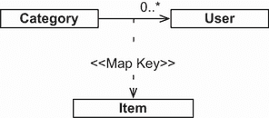

![图 9.18 具有实体关联作为键/值对的 Map]

如图 9.19 所示，架构中的链接/连接表有三个列：`CATEGORY_ID`、`ITEM_ID`和`USER_ID`。`Map`属于`Category`实体。后续的源代码可以在`maps-ternary`文件夹中找到。

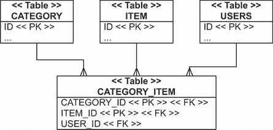

![图 9.19 链接表表示 Map 键/值对]

以下代码使用映射来表示`Category`和`Item`之间的关系。

```
Path: maps-ternary/src/main/java/com/manning/javapersistence
➥ /ch09/maps/ternary/Category.java

@Entity
public class Category {
    // . . .
    @ManyToMany(cascade = CascadeType.PERSIST)
    @MapKeyJoinColumn(name = "ITEM_ID")           Ⓐ
    @JoinTable(
        name = "CATEGORY_ITEM",
        joinColumns = @JoinColumn(name = "CATEGORY_ID"),
        inverseJoinColumns = @JoinColumn(name = "USER_ID")
    )
    private Map<Item, User> itemAddedBy = new HashMap<>();
    //  . . .
}
```

Ⓐ `@MapKeyJoinColumn`是可选的；Hibernate 或使用 Hibernate 的 Spring Data JPA 将默认使用列名`ITEMADDEDBY_KEY`作为引用`ITEM`表的连接/外键列。

要在这三个实体之间创建链接，所有实例必须已经处于持久状态，然后放入映射中：

```
Path: maps-ternary/src/test/java/com/manning/javapersistence
➥ /ch09/maps/ternary/TestService.java

someCategory.putItemAddedBy(someItem, someUser);
someCategory.putItemAddedBy(otherItem, someUser);
otherCategory.putItemAddedBy(someItem, someUser);
```

要移除链接，请从映射中删除条目。这管理了一个复杂的关系，隐藏了一个具有三个列的数据库链接表。但请记住，在实际操作中，链接表通常会增长额外的列，如果你依赖于`Map` API，那么稍后更改所有 Java 应用程序代码将非常昂贵。早些时候，我们有一个`ADDEDON`列，用于记录链接创建的时间戳，但我们必须为了这次映射而丢弃它。

## 摘要

+   复杂实体关联可以使用一对一关联、一对多关联、多对多关联、三元关联以及带有映射的实体关联进行映射。

+   你可以通过共享主键、使用外键主键生成器、使用外键连接列或使用连接表来创建一对一关联。

+   你可以通过考虑一对多包、使用单向和双向列表映射、应用可选的一对多与连接表或在一个可嵌入类中创建一对多关联来创建一对多关联。

+   你可以创建单向和双向多对多关联，以及带有中间实体的多对多关联。

+   你可以使用组件和带有映射的实体关联来构建三元关联。

+   你通常可以将多对多实体关联表示为从中间实体类或组件集合出发的两个多对一关联。

+   在尝试复杂的集合映射之前，请务必确保你确实需要集合。问问自己你是否经常遍历其元素。

+   本章中使用的 Java 结构有时可以简化数据访问，但通常它们会复杂化数据存储、更新和删除。
