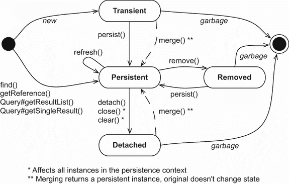
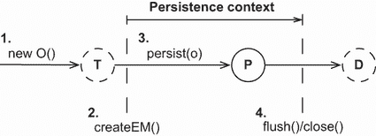
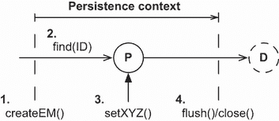
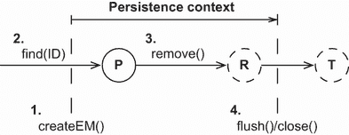
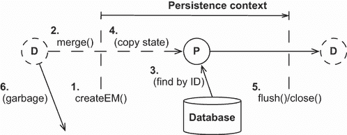

# 10 管理数据

本章涵盖了

+   检查对象的生命周期和状态

+   使用 `EntityManager` 接口

+   使用分离状态

你现在已经理解了 ORM 如何解决对象/关系不匹配的静态方面。根据你目前所知，你可以创建 Java 类和 SQL 模式之间的映射，从而解决结构不匹配问题。正如你将记得的，范式不匹配涵盖了粒度、继承、标识、关联和数据导航等问题。为了更深入地了解，请回顾第 1.2 节。

然而，除此之外，一个高效的应用程序解决方案还需要更多：你必须研究运行时数据管理的策略。这些策略对于应用程序的性能和正确行为至关重要。

在本章中，我们将分析实体实例的生命周期——实例如何变得持久，以及它如何停止被视为持久，以及触发这些转换的方法调用和管理操作。JPA 的 `EntityManager` 是访问数据的主要接口。

在我们查看 JPA 之前，让我们从实体实例、其生命周期以及触发状态变化的触发事件开始。尽管其中一些材料可能是正式的，但对持久化生命周期的深入了解是必不可少的。

JPA 2 中的主要新特性

我们可以通过 `EntityManager#unwrap()` 获取持久化管理器 API 的供应商特定变体，例如 `org.hibernate.Session` API。使用已演示的 `EntityManagerFactory#unwrap()` 方法获取 `org.hibernate.SessionFactory` 实例（参见第 2.5 节）。

新的 `detach()` 操作提供了对持久化上下文的细粒度管理，可以逐个移除实体实例。

从现有的 `EntityManager` 中，我们可以通过 `getEntityManagerFactory()` 获取用于创建持久化上下文的 `EntityManagerFactory`。

新的静态 `PersistenceUtil` 和 `PersistenceUnitUtil` 辅助方法确定实体实例（或其实例的属性）是否已完全加载或是一个未初始化的引用（Hibernate 代理或未加载的集合包装器）。

## 10.1 持久化生命周期

由于 JPA 是一种透明的持久化机制，其中类对其自身的持久化能力一无所知，因此可以编写不知道其操作的数据代表持久状态还是仅存在于内存中的临时状态的逻辑。应用程序在调用其方法时不必一定关心实例是否持久。例如，我们可以调用 `Item#calculateTotalPrice()` 业务方法而不必考虑任何持久化（例如在单元测试中）。在执行过程中，该方法可能对任何持久化概念一无所知。

任何具有持久化状态的应用程序都必须在需要将内存中持有的状态传播到数据库（或反之亦然）时与持久化服务交互。换句话说，我们必须调用 Jakarta Persistence 接口来存储和加载数据。

当以这种方式与持久化机制交互时，应用程序必须关注实体实例相对于持久化的状态和生命周期。我们称这为**持久化生命周期**：实体实例在其生命周期中经历的状态，我们将在稍后分析它们。我们还使用术语**工作单元**：一组（可能）改变状态的运算，被视为一个（通常是原子）组。拼图中的另一部分是持久化服务提供的**持久化上下文**。将持久化上下文想象成一个服务，它记得我们在特定工作单元中对数据进行的所有修改和状态变化（这有些简化，但是一个好的起点）。

现在，我们将剖析以下术语：**实体状态**、**持久化上下文**和**管理范围**。你可能更习惯于思考你需要管理哪些 SQL 语句来将数据放入和取出数据库，但 Java 持久化成功的关键因素之一是**状态管理**的分析，所以请跟随我们通过这一节。

### 10.1.1 实体实例状态

不同的 ORM 解决方案使用不同的术语，并为持久化生命周期定义不同的状态和状态转换。此外，内部使用的状态可能与客户端应用程序暴露的状态不同。JPA 定义了四种状态，隐藏了 Hibernate 内部实现的复杂性，从而避免了客户端代码的复杂性。图 10.1 显示了这些状态及其转换。



图 10.1 实体实例状态及其转换

图 10.1 还包括调用`EntityManager`（和`Query`）API 的方法调用，这些调用触发转换。我们将在本章中讨论此图表；在需要概述时请参考它。

现在，让我们更详细地探讨状态和转换。

瞬时状态

使用`new` Java 运算符创建的实例是**瞬时的**，这意味着一旦不再被引用，它们的状态就会丢失并被垃圾回收。例如，`new Item()`创建了一个`Item`类的瞬时实例，就像`new Long()`和`new BigDecimal()`创建那些类的瞬时实例一样。Hibernate 不提供任何对瞬时实例的回滚功能；如果我们修改瞬时`Item`的价格，我们无法自动撤销更改。

要使实体实例从瞬时状态转换为**持久**状态，需要调用`EntityManager#persist()`方法或从已持久化的实例创建引用，并启用该映射关联的状态级联。

持久化状态

一个*持久*实体实例在数据库中有表示。它存储在数据库中——或者当工作单元完成时将被存储。它是一个具有数据库身份的实例，如第 5.2 节中定义的；其数据库标识符被设置为数据库表示的主键值。

应用程序可能通过调用`EntityManager#persist()`方法创建了实例，并使它们持久化。实例也可能在应用程序创建了一个指向 JPA 提供者已管理的另一个持久实例的对象引用时变得持久。一个持久实体实例可能是一个通过执行查询、标识符查找或从另一个持久实例开始导航对象图检索的实例。

持久实例始终与持久化上下文相关联。我们稍后将了解更多关于这一点。

移除状态

我们可以通过几种方式从数据库中删除一个持久实体实例。例如，我们可以使用`EntityManager#remove()`方法将其删除。如果启用了*孤儿删除*，从映射集合中删除对其的引用也可能使其可删除。

然后，实体实例将处于*移除*状态：提供者将在工作单元结束时删除它。我们在完成与其实例的工作后——例如，在用户看到的移除确认屏幕渲染后——应该丢弃我们可能持有的任何引用。

分离状态

要理解*分离*的实体实例，考虑加载一个实例。我们调用`EntityManager#find()`通过其（已知）标识符检索实体实例。然后我们结束我们的工作单元并关闭持久化上下文。应用程序仍然有一个*处理*——即对我们加载的实例的引用。现在它处于分离状态，数据正在变得过时。我们可以丢弃引用并让垃圾回收器回收内存。或者，我们可以在分离状态下继续处理数据，稍后调用`merge()`方法以新工作单元保存我们的修改。我们将在第 10.3 节中讨论分离和合并。

您现在应该对实体实例状态及其转换有一个基本理解。我们接下来要讨论的主题是持久化上下文：任何 Jakarta Persistence 提供者的一项基本服务。

### 10.1.2 持久化上下文

在 Java Persistence 应用程序中，`EntityManager`有一个持久化上下文。当我们调用`EntityManagerFactory#createEntityManager()`时创建持久化上下文。上下文在调用`EntityManager#close()`时关闭。在 JPA 术语中，这是一个*应用程序管理*的持久化上下文；我们的应用程序定义了持久化上下文的范围，界定工作单元。

持久化上下文监控和管理所有处于持久状态中的实体。持久化上下文是 JPA 提供者功能的核心。

持久化上下文还允许持久化引擎执行*自动脏检查*，检测应用程序修改了哪些实体实例。然后提供者将与持久化上下文监控的实例的状态与数据库同步，无论是自动的还是按需的。通常，当工作单元完成时，提供者通过执行 SQL `INSERT`、`UPDATE`和`DELETE`语句（所有都是数据操作语言，DML 的一部分）将内存中持有的状态传播到数据库。此*刷新*过程也可能在其他时间发生。例如，Hibernate 可能在查询执行之前与数据库同步。这确保查询了解工作单元早期所做的更改。

持久化上下文还充当*一级缓存*；它记住特定工作单元中处理的所有实体实例。例如，如果我们要求 Hibernate 使用主键值（通过标识符查找）加载实体实例，Hibernate 首先会检查持久化上下文中的当前工作单元。如果 Hibernate 在持久化上下文中找到实体实例，则不会发生数据库访问——这是应用程序的可重复读。具有相同持久化上下文的连续`em.find(Item.class, ITEM_ID)`调用将产生相同的结果。

此缓存还会影响任意查询的结果，例如使用`javax.persistence.Query` API 执行的查询。Hibernate 读取查询的 SQL 结果集并将其转换为实体实例。此过程首先尝试通过标识符查找解决持久化上下文中的每个实体实例。只有当无法在当前持久化上下文中找到具有相同标识符值的实例时，Hibernate 才会从结果集行中读取其余数据。由于数据库级别的读已提交事务隔离，如果实体实例已在持久化上下文中，Hibernate 会忽略结果集中任何可能更新的数据。

持久化上下文缓存始终开启——无法关闭。它确保以下内容：

+   在对象图中的循环引用情况下，持久化层不会受到栈溢出的影响。

+   在工作单元结束时，同一数据库行的冲突表示永远不会出现。提供者可以安全地将对实体实例所做的所有更改写入数据库。

+   同样，在特定持久化上下文中做出的更改总是立即对所有在该工作单元及其持久化上下文中执行的代码可见。JPA 保证了可重复的实体实例读取。

持久化上下文提供了一个*保证的对象身份作用域*；在单个持久化上下文的范围内，只有一个实例代表特定的数据库行。考虑引用`entityA == entityB`的比较。这只有在两者都是堆上同一 Java 实例的引用时才为`true`。现在考虑比较`entityA.getId().equals(entityB.getId())`。如果两者都有相同的数据库标识符值，则为`true`。在单个持久化上下文中，Hibernate 保证这两个比较将产生相同的结果。这解决了我们在 1.2.3 节中讨论的基本对象/关系不匹配问题之一。

实体实例的生命周期和持久化上下文提供的服务一开始可能难以理解。让我们看看一些关于脏检查、缓存以及保证身份作用域在实际中如何工作的代码示例。为此，我们将与持久化管理器 API 一起工作。

处理作用域的身份是否更好？

对于一个典型的 Web 或企业应用程序，持久化上下文作用域的身份更受欢迎。处理作用域的身份，其中只有内存中的一个实例代表整个过程中的行（JVM），在缓存利用率方面提供了一些潜在的优势。然而，在一个广泛的多线程应用程序中，始终同步对持久实例的共享访问的代价太高。每个线程在持久化上下文中使用各自的数据副本，这更简单且更具可扩展性。

## 10.2 EntityManager 接口

任何透明的持久化工具都包括一个持久化管理器 API。这个持久化管理器通常提供基本 CRUD（创建、读取、更新、删除）操作、查询执行和控制持久化上下文的服务。在 Jakarta Persistence 应用程序中，我们与之交互的主要接口是`EntityManager`以创建单元工作。

注意：要执行源代码中的示例，您首先需要运行 Ch10.sql 脚本。接下来的源代码可以在`managing-data`和`managing-data2`文件夹中找到。

在本章中，我们不会使用 Spring Data JPA，甚至不会使用 Spring 框架。接下来的示例将使用 JPA，有时还会使用 Hibernate API，而不进行任何 Spring 集成——它们对我们的演示和分析来说粒度更细。 

### 10.2.1 规范的单元工作

在 Java SE 和某些 EE 架构中（如果我们只有普通的 servlets，例如），我们通过调用`EntityManagerFactory#createEntityManager()`来获取`EntityManager`。应用程序代码共享`EntityManagerFactory`，代表一个持久化单元，或一个逻辑数据库。大多数应用程序只有一个共享的`EntityManagerFactory`。

我们在一个线程中使用`EntityManager`进行单个单元工作，创建它并不昂贵。以下列表显示了单元工作的规范、典型形式。

列表 10.1 一个典型的单元工作

```
Path: managing-data/src/test/java/com/manning/javapersistence/ch10
➥ /SimpleTransitionsTest.java

EntityManagerFactory emf =
        Persistence.createEntityManagerFactory("ch10");

// . . .
EntityManager em = emf.createEntityManager();

\1 {
    em.getTransaction().begin();

    // . . .
    em.getTransaction().commit();
} catch (Exception ex) {
    // Transaction rollback, exception handling
    // . . .
} finally {
    if (em != null && em.isOpen())
        em.close();
}
```

在 `em.getTransaction().begin()` 和 `em.getTransaction().commit()` 之间的所有操作都在一个事务中完成。现在，请记住，在事务作用域内的所有数据库操作，例如 Hibernate 执行的 SQL 语句，要么完全成功，要么完全失败。现在不必过于担心事务代码；你将在下一章中了解更多关于并发控制的内容。我们将在那里用同样的例子，重点关注事务和异常处理代码。不过，不要在代码中编写空的 `catch` 块——你将不得不回滚事务并处理异常。

创建 `EntityManager` 会启动其持久化上下文。Hibernate 不会在必要时访问数据库；`EntityManager` 不会从连接池中获取 JDBC `Connection`，直到需要执行 SQL 语句。我们甚至可以在不接触数据库的情况下创建和关闭 `EntityManager`。当我们在持久化上下文中查找或查询数据以及当 Hibernate 将检测到的更改刷新到数据库时，Hibernate 执行 SQL 语句。当创建 `EntityManager` 时，Hibernate 会加入正在进行的系统事务并等待事务提交。当 Hibernate 被通知提交时，它会执行持久化上下文的脏检查并与数据库同步。我们还可以通过在任何时候调用 `EntityManager#flush()` 来手动强制执行脏检查同步。

我们通过选择何时 `close()` `EntityManager` 来确定持久化上下文的范围。我们必须在某个时候关闭持久化上下文，所以总是将 `close()` 调用放在 `finally` 块中。

持久化上下文应该保持多长时间开放？让我们假设以下示例中我们正在编写一个服务器，并且每个客户端请求都将在一个多线程环境中使用一个持久化上下文和系统事务进行处理。如果你熟悉 servlet，可以想象列表 10.1 中的代码嵌入在 servlet 的 `service()` 方法中。在这个工作单元内，你通过访问 `EntityManager` 来加载数据和存储数据。

### 10.2.2 使数据持久化

让我们创建一个实体的新实例，并将其从临时状态转换为持久状态。你将在想要将新创建的对象的信息保存到数据库时这样做。我们可以在图 10.2 中看到相同的工作单元以及 `Item` 实例如何改变状态。



图 10.2 在工作单元中使实例持久化

要使一个实例持久化，你可以使用以下类似的代码：

```
Path: managing-data/src/test/java/com/manning/javapersistence/ch10
➥ /SimpleTransitionsTest.java – makePersistent()

Item item = new Item();
item.setName("Some Item");
em.persist(item);
Long ITEM_ID = item.getId();
```

按照常规，会实例化一个新的临时 `Item` 对象。当然，我们也可以在创建 `EntityManager` 之前就实例化它。调用 `persist()` 方法会使 `Item` 的临时实例变为持久化。然后，它将由当前持久化上下文管理和关联。

要将`Item`实例存储到数据库中，Hibernate 必须执行一个 SQL `INSERT`语句。当这个工作单元的事务提交时，Hibernate 刷新持久化上下文，`INSERT`就在那时发生。Hibernate 甚至可能将`INSERT`与其他语句一起在 JDBC 级别批量执行。当我们调用`persist()`时，只有`Item`的标识符值被分配。或者，如果标识符生成器不是`pre-insert`，则`INSERT`语句将在调用`persist()`时立即执行。你可能想回顾第 5.2.5 节，以刷新对标识符生成器策略的了解。

使用标识符检测实体状态

有时我们需要知道一个实体实例是持久化的、瞬时的还是分离的。

+   *持久状态*——如果`EntityManager#contains(e)`返回`true`，实体实例就处于持久状态。

+   *瞬时状态*——如果`PersistenceUnitUtil#getIdentifier(e)`返回`null`，它就处于瞬时状态。

+   *分离状态*——如果它不是持久的，它就处于分离状态，`PersistenceUnitUtil#getIdentifier(e)`将返回实体标识符属性的值。

我们可以从`EntityManagerFactory`获取到`PersistenceUnitUtil`。

有两个需要注意的问题。首先，要注意标识符值可能直到持久化上下文刷新后才被分配和可用。其次，Hibernate（与一些其他 JPA 提供者不同）如果标识符属性是原始类型（一个`long`而不是`Long`），则从`PersistenceUnitUtil#getIdentifier()`永远不会返回`null`。

在使用持久化上下文管理`Item`实例之前完全初始化该实例更好（但不是必需的）。SQL `INSERT`语句包含在调用`persist()`时实例持有的值。如果我们不在使`Item`持久化之前设置其`name`，可能会违反`NOT NULL`约束。我们可以在调用`persist()`之后修改`Item`，并且这些更改将通过额外的 SQL `UPDATE`语句传播到数据库。

如果在刷新过程中`INSERT`或`UPDATE`语句中的任何一个失败，Hibernate 将在数据库级别回滚此事务中对持久化实例所做的更改。但 Hibernate 不会回滚对持久化实例的内存更改。如果我们更改`Item#name`之后`persist()`，提交失败不会回滚到旧名称。这是合理的，因为事务的失败通常是不可恢复的，我们必须立即丢弃失败的持久化上下文和`EntityManager`。我们将在下一章讨论异常处理。

接下来，我们将加载和修改存储的数据。

### 10.2.3 检索和修改持久化数据

我们可以使用 `EntityManager` 从数据库检索持久实例。在实际应用中，我们会在上一节中某处保存 `Item` 的标识符值，现在我们通过标识符在新工作单元中查找相同的实例。图 10.3 以图形方式展示了这一转换。



图 10.3 在工作单元中使实例持久化

要在一个工作单元中使一个实例持久化，你可以使用以下代码片段：

```
Path: managing-data/src/test/java/com/manning/javapersistence/ch10
➥ /SimpleTransitionsTest.java – retrievePersistent()

Item item = em.find(Item.class, ITEM_ID);    Ⓐ
if (item != null)
    item.setName("New Name");                Ⓑ
```

Ⓐ 如果 `item` 已经不在持久上下文中，指令将击中数据库。

Ⓑ 然后我们修改名称。

我们不需要将 `find()` 操作的返回值进行类型转换；它是一个泛型方法，其返回类型是第一个参数的副作用。检索到的实体实例处于持久状态，现在我们可以在工作单元内对其进行修改。

如果找不到具有给定标识符值的持久实例，`find()` 方法将返回 `null`。如果持久上下文缓存中没有给定实体类型和标识符的匹配项，`find()` 操作总是会击中数据库。在加载实体实例时，实例总是被初始化。我们可以期待在分离状态下稍后获得其所有值，例如在关闭持久上下文后渲染屏幕时。（如果启用了可选的二级缓存，Hibernate 可能不会击中数据库。）

我们可以修改 `Item` 实例，持久上下文将检测这些更改并将它们自动记录在数据库中。当 Hibernate 在提交期间刷新持久上下文时，它执行必要的 SQL DML 语句以同步数据库中的更改。Hibernate 尽可能晚地将状态更改传播到数据库，即在事务结束时。DML 语句通常会在数据库中创建锁，直到事务完成才释放，因此 Hibernate 尽可能缩短数据库中的锁持续时间。

Hibernate 使用 SQL `UPDATE` 将新的 `Item#name` 写入数据库。默认情况下，Hibernate 将映射的 `ITEM` 表的所有列包括在 SQL `UPDATE` 语句中，更新未更改的列到其旧值。因此，Hibernate 可以在启动时生成这些基本 SQL 语句，而不是在运行时。如果我们只想在 SQL 语句中包含已修改的（或对于 `INSERT` 为非可空的）列，我们可以启用动态 SQL 生成，如第 5.3.2 节中所示。

Hibernate 通过比较 `Item` 与它在从数据库加载 `Item` 时所拍摄的快照来检测更改的 `name`。如果 `Item` 与快照不同，则需要执行 `UPDATE`。持久上下文中的这个快照消耗内存。使用快照的脏检查也可能很耗时，因为 Hibernate 必须在刷新期间将持久上下文中的所有实例与其快照进行比较。

我们之前提到，持久化上下文使实体实例的可重复读成为可能，并提供对象身份保证：

```
Path: managing-data/src/test/java/com/manning/javapersistence/ch10
➥ /SimpleTransitionsTest.java – retrievePersistent()

Item itemA = em.find(Item.class, ITEM_ID);     Ⓐ
Item itemB = em.find(Item.class, ITEM_ID);     Ⓑ
assertTrue(itemA == itemB);
assertTrue(itemA.equals(itemB));
assertTrue(itemA.getId().equals(itemB.getId()));
```

Ⓐ 第一次`find()`操作击中数据库，并使用`SELECT`语句检索`Item`实例。

Ⓑ 第二次`find()`是一个可重复读操作，并在持久化上下文中解决，并返回相同的缓存`Item`实例。

有时候我们需要一个实体实例，但我们不想击中数据库。

### 10.2.4 获取引用

如果我们不想在加载实体实例时击中数据库，因为我们不确定是否需要一个完全初始化的实例，我们可以告诉`EntityManager`尝试检索一个空白的占位符——一个代理。

如果持久化上下文已经包含具有给定标识符的`Item`，则`getReference()`会返回该`Item`实例，而不会击中数据库。此外，如果当前没有管理具有该标识符的持久实例，Hibernate 将生成空白的占位符：代理。这意味着`getReference()`不会访问数据库，并且它不会返回`null`，与`find()`不同。JPA 提供了`PersistenceUnitUtil`辅助方法。`isLoaded()`辅助方法用于检测我们是否正在处理一个未初始化的代理。

一旦我们调用任何方法，例如`Item#getName()`，在代理上，就会执行一个`SELECT`来完全初始化占位符。这个规则的例外是一个映射的数据库标识符获取方法，例如`getId()`。代理可能看起来像是真实的东西，但它只是一个携带实体实例标识值占位符。如果代理初始化时数据库记录已不存在，则会抛出`EntityNotFoundException`。请注意，异常可能在调用`Item#getName()`时抛出。Hibernate 类有一个方便的静态`initialize()`方法，可以加载代理的数据。

在持久化上下文关闭后，`item`处于分离状态。如果我们不在持久化上下文仍然打开时初始化代理，当我们访问代理时，会抛出`LazyInitializationException`，如下面的代码所示。一旦持久化上下文关闭，我们就不能按需加载数据。解决方案很简单：在关闭持久化上下文之前加载数据。

```
Path: managing-data/src/test/java/com/manning/javapersistence/ch10
➥ /SimpleTransitionsTest.java – retrievePersistentReference()

Item item = em.getReference(Item.class, ITEM_ID);                         Ⓐ
PersistenceUnitUtil persistenceUtil =                                     Ⓑ
    emf.getPersistenceUnitUtil();
assertFalse(persistenceUtil.isLoaded(item));                              Ⓒ
// assertEquals("Some Item", item.getName());                             Ⓓ
// Hibernate.initialize(item);                                            Ⓔ
em.getTransaction().commit();
em.close();                                                               Ⓕ
assertThrows(LazyInitializationException.class, () -> item.getName());    Ⓖ
```

Ⓐ 持久化上下文。

Ⓑ 辅助方法。

Ⓒ 检测未初始化的代理。

Ⓓ 将异常映射到规则。

Ⓔ 加载代理数据。

Ⓕ `item`处于分离状态。

Ⓖ 在关闭持久化上下文后加载数据。

我们将在第十二章中详细介绍代理、延迟加载和按需获取。

接下来，如果我们想从数据库中删除实体实例的状态，我们必须将其设置为瞬态。

### 10.2.5 使数据瞬态

要使实体实例瞬态并删除其数据库表示，我们可以在`EntityManager`上调用`remove()`方法。图 10.4 显示了此过程。



图 10.4 在工作单元中移除一个实例

如果我们调用`find()`，Hibernate 将执行`SELECT`来加载`Item`。如果我们调用`getReference()`，Hibernate 试图避免`SELECT`并返回一个代理。调用`remove()`将在工作单元完成时将实体实例排队以供删除；它现在处于*移除*状态。如果对代理调用`remove()`，Hibernate 将执行`SELECT`来加载数据。实体实例必须在生命周期转换期间完全初始化。我们可能启用了生命周期回调方法或实体监听器（见第 13.2 节），并且实例必须通过这些拦截器来完成其完整生命周期。

已移除状态的实体不再处于持久状态。我们可以通过`contains()`操作来检查这一点。我们可以使已移除的实例再次持久化，取消删除操作。

当事务提交时，Hibernate 将状态转换与数据库同步并执行 SQL `DELETE`。JVM 垃圾回收器检测到`item`不再被任何东西引用，最终删除数据的最后痕迹。我们最终可以关闭`EntityManager`：

```
Path: managing-data/src/test/java/com/manning/javapersistence/ch10
➥ /SimpleTransitionsTest.java – makeTransient()

Item item = em.find(Item.class, ITEM_ID);     Ⓐ
em.remove(item);                              Ⓑ
assertFalse(em.contains(item));               Ⓒ
// em.persist(item);                          Ⓓ
assertNull(item.getId());                     Ⓔ
em.getTransaction().commit();                 Ⓕ
em.close();                                   Ⓖ
```

Ⓐ 调用`find()`；Hibernate 执行`SELECT`来加载`Item`。

Ⓑ 调用`remove()`；Hibernate 在工作单元完成时将实体实例排队以供删除。

Ⓒ 已移除状态中的实体不再包含在持久化上下文中。

Ⓓ 取消删除操作使已移除的实例再次持久化。

Ⓔ `item`现在将看起来像一个瞬态实例。

Ⓕ 事务提交；Hibernate 将状态转换与数据库同步并执行 SQL `DELETE`。

Ⓖ 关闭`EntityManager`。

默认情况下，Hibernate 不会更改已移除实体实例的标识符值。这意味着`item.getId()`方法仍然返回现在过时的标识符值。有时进一步处理“已删除”的数据是有用的：例如，如果我们用户决定撤销，我们可能希望再次保存已移除的`Item`。如示例所示，我们可以在持久化上下文刷新之前对已移除的实例调用`persist()`来取消删除。或者，如果我们将在 persistence.xml 中将属性`hibernate.use_identifier_rollback`设置为`true`，Hibernate 将在实体实例删除后重置标识符值。在先前的代码示例中，标识符值重置为默认值`null`（它是一个`Long`）。现在`Item`与瞬态状态相同，我们可以在新的持久化上下文中再次保存它。

假设我们从数据库中加载一个实体实例并处理数据。由于某种原因，我们知道另一个应用程序或可能是应用程序的另一个线程已更新数据库中的底层行。接下来我们将看到如何刷新内存中持有的数据。

### 10.2.6 刷新数据

在您加载实体实例之后，可能存在其他进程更改了数据库中与该实例对应的信息。以下示例演示了刷新持久化实体实例：

```
Path: managing-data/src/test/java/com/manning/javapersistence/ch10
➥ /SimpleTransitionsTest.java – refresh()

Item item = em.find(Item.class, ITEM_ID);
item.setName("Some Name");
// Someone updates this row in the database with "Concurrent UpdateName"
em.refresh(item);
em.close();
assertEquals("Concurrent UpdateName", item.getName());
```

在我们加载实体实例后，我们意识到（不重要的是如何）有人更改了数据库中的数据。调用`refresh()`会导致 Hibernate 执行一个`SELECT`来读取和序列化整个结果集，覆盖我们在应用程序内存中持久实例所做的更改。因此，`item`的`name`被更新为另一侧设置的值。如果数据库行不再存在（如果有人删除了它），则在`refresh()`时 Hibernate 会抛出`EntityNotFoundException`。

大多数应用程序不需要手动刷新内存中的状态；并发修改通常在事务提交时解决。刷新的最佳用例是与扩展的持久化上下文一起使用，这可能跨越几个请求/响应周期或系统事务。当我们等待用户输入并保持持久化上下文打开时，数据会变得过时，并且根据对话的持续时间和用户与系统之间的对话，可能需要选择性地刷新。如果用户取消对话，刷新可以用来撤销在对话期间在内存中做出的更改。

另一个不常用的操作是复制实体实例。

### 10.2.7 复制数据

复制在需要从数据库检索数据并将其存储在另一个数据库中时很有用。复制将一个持久上下文中加载的分离实例使其在另一个持久上下文中持久化。我们通常从两个不同的`EntityManagerFactory`配置中打开这些上下文，从而启用两个逻辑数据库。我们必须在这两个配置中映射实体。

`replicate()`操作仅在 Hibernate `Session` API 上可用。以下是一个示例，它从一个数据库中加载一个`Item`实例并将其复制到另一个数据库中：

```
Path: managing-data/src/test/java/com/manning/javapersistence/ch10
➥ /SimpleTransitionsTest.java – replicate()

EntityManager emA = getDatabaseA().createEntityManager();
emA.getTransaction().begin();
Item item = emA.find(Item.class, ITEM_ID);
emA.getTransaction().commit();

EntityManager emB = getDatabaseB().createEntityManager();
emB.getTransaction().begin();
emB.unwrap(Session.class)
        .replicate(item, org.hibernate.ReplicationMode.*LATEST_VERSION*);
Item item1 = emB.find(Item.class, ITEM_ID);
assertEquals("Some Item", item1.getName());
emB.getTransaction().commit();
emA.close();
emB.close();
```

`ReplicationMode`控制复制过程的细节：

+   `IGNORE`—当数据库中存在具有相同标识符的现有数据库行时忽略该实例。

+   `OVERWRITE`—覆盖数据库中具有相同标识符的任何现有数据库行。

+   `EXCEPTION`—如果在目标数据库中存在具有相同标识符的现有数据库行，则抛出异常。

+   `LATEST_VERSION`—如果数据库中的行版本比给定实体实例的版本旧，则覆盖数据库中的该行，否则忽略该实例。需要启用具有实体版本控制的乐观并发控制（在第 11.2.2 节中讨论）。

当我们协调不同数据库中输入的数据时，可能需要复制。一个用例是产品升级：如果应用程序的新版本需要新的数据库（模式），我们可能希望迁移并复制现有数据一次。

持久化上下文为您做了很多事情：自动脏检查、保证对象身份的范畴，等等。同样重要的是，您需要了解其管理的一些细节，有时您还需要影响幕后发生的事情。

### 10.2.8 持久化上下文中的缓存

持久化上下文是持久实例的缓存。每个处于持久状态的实体实例都与持久化上下文相关联。

许多忽视这一简单事实的 Hibernate 用户会遇到 `OutOfMemoryError`。这通常发生在我们在工作单元中加载了成千上万的实体实例，但从未打算修改它们的情况下。Hibernate 仍然需要在持久化上下文缓存中为每个实例创建一个快照，这可能导致内存耗尽。（显然，如果我们修改了成千上万行，我们应该执行批量数据操作。）

持久化上下文缓存永远不会自动缩小，因此您应该将持久化上下文的大小保持在最小必要范围内。通常，上下文中的许多持久实例都是意外存在的——例如，因为我们只需要几个项目，但查询了多个。极大的图可能对性能有严重影响，并需要大量内存来存储状态快照。请确保查询返回您所需的数据，并考虑以下方法来控制 Hibernate 的缓存行为。

您可以调用 `EntityManager#detach(i)` 手动将持久实例从持久化上下文中驱逐。您还可以调用 `EntityManager#clear()` 来断开所有持久实体实例，使持久化上下文为空。

原生的 `Session` API 有一些额外的操作，您可能会觉得很有用。您可以将整个持久化上下文设置为只读模式。这将禁用状态快照和脏检查，Hibernate 不会将修改写入数据库：

```
Path: managing-data2/src/test/java/com/manning/javapersistence/ch10
➥ /ReadOnly.java – selectiveReadOnly()

em.unwrap(Session.class).setDefaultReadOnly(true);     Ⓐ
Item item = em.find(Item.class, ITEM_ID);
item.setName("New Name");
em.flush();                                            Ⓑ
```

Ⓐ 将持久化上下文设置为只读。

Ⓑ 因此，`flush()` 不会更新数据库。

您可以禁用单个实体实例的脏检查：

```
Path: managing-data2/src/test/java/com/manning/javapersistence/ch10
➥ /ReadOnly.java – selectiveReadOnly()

Item item = em.find(Item.class, ITEM_ID);
em.unwrap(Session.class).setReadOnly(item, true);    Ⓐ
item.setName("New Name");
em.flush();                                          Ⓑ
```

Ⓐ 在持久化上下文中将 `item` 设置为只读。

Ⓑ 因此，`flush()` 不会更新数据库。

使用 `org.hibernate.Query` 接口的查询可以返回只读结果，Hibernate 不会检查修改：

```
Path: managing-data2/src/test/java/com/manning/javapersistence/ch10
➥ /ReadOnly.java – selectiveReadOnly()

org.hibernate.query.Query query = em.unwrap(Session.class)
    .createQuery("select i from Item i");
query.setReadOnly(true).list();              Ⓐ
List<Item> result = query.list();
for (Item item : result)
    item.setName("New Name");
em.flush();                                  Ⓑ
```

Ⓐ 将查询设置为只读。

Ⓑ 因此，`flush()` 不会更新数据库。

使用查询提示，您还可以禁用使用 JPA 标准的 `javax.persistence.Query` 接口获得的实例的脏检查：

```
Query query = em.createQuery(queryString)
    .setHint(
        org.hibernate.annotations.QueryHints.READ_ONLY,
        true
    );
```

对于只读实体实例要小心：您仍然可以删除它们，对集合的修改也很棘手！如果您使用这些设置与映射集合一起使用，Hibernate 手册中有一个很长的特殊案例列表，您需要阅读。

到目前为止，持久化上下文的刷新和同步是在事务提交时自动发生的。然而，在某些情况下，我们需要对同步过程有更多的控制。

### 10.2.9 刷新持久化上下文

默认情况下，Hibernate 在联合事务提交时刷新`EntityManager`的持久化上下文，并将更改与数据库同步。所有之前的代码示例，除了最后一节的一些示例，都使用了那种策略。JPA 允许实现选择在其它时间同步持久化上下文。

作为 JPA 实现，Hibernate 在以下时间同步：

+   当一个联合的 Java 事务 API (JTA) 系统事务提交时。

+   在执行查询之前——我们这里说的不是使用`find()`进行的查找，而是使用`javax.persistence.Query`或类似的 Hibernate API 进行的查询。

+   当应用程序显式调用`flush()`时。

我们可以通过`EntityManager`的`FlushModeType`设置来控制此行为：

```
Path: managing-data/src/test/java/com/manning/javapersistence/ch10
➥ /SimpleTransitionsTest.java – flushModeType()

em.getTransaction().begin();
Item item = em.find(Item.class, ITEM_ID);
item.setName("New Name");

em.setFlushMode(FlushModeType.COMMIT);

assertEquals(
        "Original Name",
        em.createQuery("select i.name from Item i where i.id = :id", String.class)
                .setParameter("id", ITEM_ID).getSingleResult()
);

em.getTransaction().commit(); // Flush!
em.close();
```

在这里，我们加载一个`Item`实例并更改其名称。然后我们查询数据库，检索项目的名称。通常，Hibernate 会识别内存中数据已更改，并在查询之前将这些修改与数据库同步。这是`FlushModeType.AUTO`的行为，如果我们用事务连接`EntityManager`，这是默认设置。使用`FlushModeType.COMMIT`我们禁用在查询之前的刷新，因此我们可能会看到查询返回的数据与内存中的数据不同。同步仅在事务提交时发生。

在事务进行过程中，我们可以通过调用`EntityManager#flush()`来强制进行脏检查和与数据库的同步。

这就结束了我们对*临时*、*持久*和*已移除*实体状态的讨论，以及`EntityManager` API 的基本用法。掌握这些状态转换和 API 方法是至关重要的；每个 JPA 应用程序都是通过这些操作构建的。

接下来，我们将探讨*分离*的实体状态。我们已经提到了当实体实例不再与持久化上下文关联时会出现的一些问题，例如禁用延迟初始化。让我们通过一些示例来探索分离状态，以便我们知道在处理持久化上下文之外的数据时可以期待什么。

## 10.3 与分离状态一起工作

如果一个引用离开了保证身份的作用域，我们称它为*分离实体实例*的*引用*。当持久化上下文关闭时，它不再提供身份映射服务。当你处理分离的实体实例时，会遇到别名问题，所以请确保你理解如何处理分离实例的身份。

### 10.3.1 分离实例的标识

如果我们在相同的持久化上下文中使用相同的数据库标识符值查找数据，结果将是两个指向 JVM 堆上相同内存实例的引用。当从相同的持久化上下文中获取不同的引用时，它们具有相同的 Java 身份。这些引用可能相等，因为默认情况下`equals()`依赖于 Java 身份比较。它们显然具有相同的数据库身份。它们引用的是由该工作单元的持久化上下文管理的相同实例的持久状态。

当第一个持久化上下文关闭时，引用处于分离状态。我们可能正在处理存在于对象身份保证范围之外的实例。

列表 10.2 Java 持久性中对象身份的保证范围

```
Path: managing-data/src/test/java/com/manning/javapersistence/ch10
➥ /SimpleTransitionsTest.java – scopeOfIdentity()

em = emf.createEntityManager();               Ⓐ
em.getTransaction().begin();                  Ⓑ
Item a = em.find(Item.class, ITEM_ID);        Ⓒ
Item b = em.find(Item.class, ITEM_ID);        Ⓒ
assertTrue(a == b);                           Ⓓ
assertTrue(a.equals(b));                      Ⓔ
assertEquals(a.getId(), b.getId());           Ⓕ
em.getTransaction().commit();                 Ⓖ
em.close();                                   Ⓗ
em = emf.createEntityManager();
em.getTransaction().begin();
Item c = em.find(Item.class, ITEM_ID);
assertTrue(a != c);                           Ⓘ
assertFalse(a.equals(c));                     Ⓙ
assertEquals(a.getId(), c.getId());           Ⓚ
em.getTransaction().commit();
em.close();
```

Ⓐ 创建持久化上下文。

Ⓑ 开始事务。

Ⓒ 加载一些实体实例。

Ⓓ 引用`a`和`b`是从相同的持久化上下文中获得的；它们具有相同的 Java 身份。

Ⓔ `equals()`依赖于 Java 身份比较。

Ⓕ `a`和`b`引用的是由该工作单元的持久化上下文管理的相同`Item`实例，处于持久状态。

Ⓖ 提交事务。

Ⓗ 关闭持久化上下文。当第一个持久化上下文关闭时，引用`a`和`b`处于分离状态。

Ⓘ 在不同的持久化上下文中加载的`a`和`c`并不相同。

Ⓙ `a.equals(c)`也是`false`，因为`equals()`方法没有被重写，这意味着它使用实例相等性(`==`)。

Ⓚ 对数据库身份的测试仍然返回`true`。

如果我们在分离状态下将实体实例视为相等，这可能会导致问题。例如，考虑以下代码的扩展，在第二个工作单元结束后：

```
em.close();
Set<Item> allItems = new HashSet<>();
allItems.add(a);
allItems.add(b);
allItems.add(c);
assertEquals(2, allItems.size());
```

此示例将所有三个引用添加到`Set`中，并且所有都是分离实例的引用。现在，如果我们检查集合的大小——元素的数量——我们应该期待什么结果？

`Set`不允许重复元素。重复项通过`Set`检测；每次我们向`HashSet`添加引用时，都会自动调用`Item#equals()`方法与集合中已存在的所有其他元素进行比较。如果`equals()`对集合中任何已存在的元素返回`true`，则不会发生添加。

默认情况下，所有 Java 类都继承自`java.lang.Object`的`equals()`方法。此实现使用双等号(`==`)比较来检查两个引用是否指向 Java 堆上的相同内存实例。

你可能会猜测集合中的元素数量将是 2。毕竟，`a` 和 `b` 是对同一内存实例的引用；它们是在同一个持久化上下文中加载的。我们从另一个持久化上下文中获得了引用 `c`；它指向堆上的不同实例。我们有三个引用指向两个实例，但我们之所以知道这一点，仅仅是因为我们看到了加载数据的代码。在实际应用中，我们可能不知道 `a` 和 `b` 是在不同于 `c` 的上下文中加载的。此外，我们可能会期望集合恰好有一个元素，因为 `a`、`b` 和 `c` 代表相同的数据库行，相同的 `Item`。

无论何时我们与分离状态的实例一起工作并测试它们的相等性（通常在基于哈希的集合中），我们都需要为我们的映射实体类提供自己的 `equals()` 和 `hashCode()` 方法实现。这是一个重要的问题：如果我们不与分离状态的实体实例一起工作，则不需要采取任何行动，`java.lang.Object` 的默认 `equals()` 实现就足够好了。我们将依赖 Hibernate 在持久化上下文中保证的对象身份范围。即使我们与分离实例一起工作，如果我们从不检查它们是否相等，或者从不将它们放入 `Set` 中或用作 `Map` 中的键，我们也不必担心。如果我们所做的只是将分离的 `Item` 在屏幕上渲染出来，我们并没有将它与任何东西进行比较。

假设我们想要使用分离的实例，并且必须使用我们自己的方法来测试它们的相等性。

### 10.3.2 实现相等性方法

我们可以以多种方式实现 `equals()` 和 `hashCode()` 方法。记住，当我们重写 `equals()` 方法时，我们也需要重写 `hashCode()` 方法，以确保这两个方法的一致性。如果两个实例相等，它们必须具有相同的哈希值。

一种看似聪明的做法是实现 `equals()` 来仅比较数据库标识符属性，这通常是代理主键值。基本上，如果两个 `Item` 实例通过 `getId()` 返回相同的标识符，它们必须是相同的。如果 `getId()` 返回 `null`，它必须是一个尚未保存的瞬态 `Item`。

不幸的是，这个解决方案有一个巨大的问题：标识符值是在实例变得持久化之前由 Hibernate 分配的。如果在保存之前将一个瞬态实例添加到 `Set` 中，那么当我们保存它时，它的哈希值会在它被 `Set` 包含时发生变化。这与 `java.util.Set` 的契约相矛盾，破坏了集合。特别是，这个问题使得基于集合的映射关联的级联持久化状态变得无用。我们强烈反对使用数据库标识符相等性。

要得到我们推荐的解决方案，你需要理解*业务键*的概念。业务键是一个属性或一些属性的组合，对于具有相同数据库身份的每个实例都是唯一的。本质上，如果我们不使用代理主键，它就是我们会使用的自然键。与自然主键不同，业务键永远不会改变并不是一个绝对的要求——只要它很少改变，这就足够了。

我们认为，本质上每个实体类都应该有一个业务键，即使它包括类的所有属性（这对于某些不可变类可能是合适的）。如果我们的用户正在查看屏幕上的项目列表，他们如何区分项目 A、B 和 C？相同的属性或属性组合是我们的业务键。业务键是用户认为可以唯一标识特定记录的东西，而代理键是应用程序和数据库系统所依赖的。业务键属性或属性在我们的数据库模式中最可能是受约束的`UNIQUE`。

让我们为`User`实体类编写自定义的相等性方法；这比比较`Item`实例要容易。对于`User`类，`username`是一个很好的业务键候选。它总是必需的，它与数据库约束唯一，并且很少改变，如果有的话。

列表 10.3 `User`的相等性自定义实现

```
@Entity
@Table(name = "USERS",
       uniqueConstraints =
        @UniqueConstraint(columnNames = "USERNAME"))
public class User {
    @Override
    public boolean equals(Object other) {
        if (this == other) return true;
        if (other == null) return false;
        if (!(other instanceof User)) return false;
        User that = (User) other;
        return this.getUsername().equals(that.getUsername());
    }
    @Override
    public int hashCode() {
        return getUsername().hashCode();
    }
    //  . . .
}
```

你可能已经注意到，`equals()`方法的代码总是通过 getter 方法访问“其他”引用的属性。这一点非常重要，因为作为`other`传递的引用可能是一个 Hibernate 代理，而不是实际持有持久状态的实例。我们无法直接访问`User`代理的`username`字段。为了初始化代理以获取属性值，我们需要使用 getter 方法来访问它。这是 Hibernate 不是*完全*透明的一个地方，但无论如何，使用 getter 方法而不是直接访问实例变量是一个好的实践。

使用`instanceof`检查`other`引用的类型，而不是通过比较`getClass()`的值。再次强调，`other`引用可能是一个代理，它是运行时生成的`User`的子类，因此`this`和`other`可能不是完全相同的类型，但可以是有效的超类型或子类型。你将在第 12.1.1 节中了解更多关于代理的信息。

我们现在可以安全地比较持久状态中的`User`引用：

```
em = emf.createEntityManager();
em.getTransaction().begin();
User a = em.find(User.class, USER_ID);
User b = em.find(User.class, USER_ID);
assertTrue(a == b);
assertTrue(a.equals(b));
assertEquals(a.getId(), b.getId());
em.getTransaction().commit();
em.close();
```

当然，如果我们比较持久状态和分离状态中实例的引用，我们也会得到正确的行为：

```
em = emf.createEntityManager();
em.getTransaction().begin();
User c = em.find(User.class, USER_ID);
assertFalse(a == c);                       Ⓐ
assertTrue(a.equals(c));                   Ⓑ
assertEquals(a.getId(), c.getId());
em.getTransaction().commit();
em.close();
Set<User> allUsers = new HashSet();
allUsers.add(a);
allUsers.add(b);
allUsers.add(c);
assertEquals(1, allUsers.size());          Ⓒ
```

Ⓐ 比较这两个引用当然仍然是假的。

Ⓑ 现在它们是相等的。

Ⓒ 集合的大小最终是正确的。

对于某些其他实体，业务键可能更复杂，由属性的组合组成。以下是一些可以帮助你在领域模型类中识别业务键的提示：

+   考虑当应用程序的用户需要识别一个对象（在现实世界中）时会参考哪些属性。如果它们在屏幕上显示，用户如何区分一个元素与另一个元素？这可能是你寻找的业务键。

+   每个不可变属性可能是业务键的良好候选者。如果它们很少更新或者你可以控制它们更新的情况，例如确保实例不在 `Set` 中，那么可变属性也可能是好的候选者。

+   每个具有 `UNIQUE` 数据库约束的属性都是业务键的良好候选者。记住，业务键的精度必须足够高，以避免重叠。

+   任何基于日期或时间的属性，例如记录的创建时间戳，通常是业务键的一个良好组成部分，但 `System .currentTimeMillis()` 的准确性取决于虚拟机和操作系统。我们推荐的安全缓冲区是 50 毫秒，如果基于时间的属性是业务键的唯一属性，这可能不够准确。

+   你可以将数据库标识符作为业务键的一部分。这似乎与我们的先前声明相矛盾，但我们讨论的并不是给定实体的数据库标识符值。你可能能够使用关联实体实例的数据库标识符。例如，`Bid` 类的一个候选业务键是与它匹配的 `Item` 的标识符，以及投标金额。你甚至可以在数据库模式中有一个唯一约束来表示这个复合业务键。你可以使用关联的 `Item` 的标识符值，因为它在 `Bid` 的生命周期中永远不会改变——`Bid` 构造函数可以要求一个已经持久化的 `Item`。

如果你遵循这些建议，你不太会遇到为所有业务类找到好的业务键的困难。如果你遇到困难的情况，尝试在不考虑 Hibernate 的情况下解决它。毕竟，这是一个纯粹面向对象的问题。请注意，在子类上重写 `equals()` 并在比较中包含另一个属性的情况极为罕见。在这种情况下，满足 `Object` 标识和相等要求有点棘手，即相等既是对称的也是传递的，更重要的是，业务键可能不对应于数据库中的任何定义良好的候选自然键（子类属性可能映射到不同的表）。有关自定义相等比较的更多信息，请参阅 Joshua Bloch 所著的第三版《Effective Java》（Bloch，2017），这是所有 Java 程序员必读的书籍。

`User` 类现在已准备好进入分离状态；我们可以安全地将不同持久化上下文中加载的实例放入一个 `Set` 中。接下来，我们将查看一些涉及分离状态的示例，你将看到这个概念的一些好处。

### 10.3.3 分离实体实例

有时我们可能想手动将实体实例从持久化上下文中分离出来。我们不必等待持久化上下文关闭。我们可以手动驱逐实体实例：

```
Path: managing-data/src/test/java/com/manning/javapersistence/ch10
➥ /SimpleTransitionsTest.java – detach()

User user = em.find(User.class, USER_ID);
em.detach(user);
assertFalse(em.contains(user));
```

此示例还演示了 `EntityManager#contains()` 操作，如果给定实例在此持久化上下文中处于管理持久状态，则返回 `true`。

现在，我们可以以分离状态使用 `user` 引用了。许多应用程序只在持久化上下文关闭后读取和渲染数据。

在持久化上下文关闭后修改加载的 `user` 对其在数据库中的持久化表示没有影响。尽管如此，JPA 允许我们在新的持久化上下文中合并任何更改回数据库。

### 10.3.4 合并实体实例

假设我们在之前的持久化上下文中检索了一个 `User` 实例，现在我们想修改它并保存这些修改：

```
Path: managing-data/src/test/java/com/manning/javapersistence/ch10
➥ /SimpleTransitionsTest.java – mergeDetached()

detachedUser.setUsername("johndoe");
em = emf.createEntityManager();
em.getTransaction().begin();
User mergedUser = em.merge(detachedUser);
mergedUser.setUsername("doejohn");
em.getTransaction().commit();
em.close();
```

考虑图 10.5 中此过程的图形表示。目标是记录分离的 `User` 的新 `username`。这并不像看起来那么困难。



图 10.5 在工作单元中使实例持久化

首先，当我们调用 `merge()` 时，Hibernate 会检查持久化上下文中的持久实例是否具有与我们要合并的分离实例相同的数据库标识符。在这个例子中，持久化上下文是空的；什么都没有从数据库中加载。因此，Hibernate 从数据库中加载具有此标识符的实例。然后 `merge()` 将分离的实体实例 *复制到* 这个已加载的持久实例上。换句话说，我们在分离的 `User` 上设置的新 `username` 也被设置在持久合并的 `User` 上，这是 `merge()` 返回给我们的。

现在，我们丢弃了旧的、过时的分离状态的引用；`detachedUser` 不再代表当前状态。我们可以继续修改返回的 `mergedUser`；在提交期间，Hibernate 将在刷新持久化上下文时执行单个 `UPDATE`。

如果持久化上下文中没有具有相同标识符的持久实例，并且数据库中的按标识符查找为负，Hibernate 会实例化一个新的 `User`。然后 Hibernate 将我们的分离实例复制到这个新实例上，当我们同步持久化上下文与数据库时，它会将这个新实例插入到数据库中。

如果我们传递给 `merge()` 的实例不是分离的，而是临时的（它没有标识符值），Hibernate 会实例化一个新的 `User`，将临时 `User` 的值复制到它上面，然后使其持久化并返回给我们。用更简单的话说，`merge()` 操作可以处理分离的 *和* 临时的实体实例。Hibernate 总是作为持久化实例返回结果给我们。

基于分离和合并的应用程序架构可能不会调用`persist()`操作。我们可以合并新的和分离的实体实例以存储数据。重要的区别是返回的当前状态以及我们在应用程序代码中如何处理这种引用切换。我们必须丢弃`detachedUser`，从现在开始引用当前的`mergedUser`。我们应用程序中的其他任何其他组件仍然持有`detachedUser`的，都必须切换到`mergedUser`。

我能否重新附加一个分离实例？

Hibernate `Session` API 有一个名为`saveOrUpdate()`的重新附加方法。它接受瞬态或分离实例，并且不返回任何内容。操作后，给定实例将处于持久化状态，因此我们不需要切换引用。如果给定实例是瞬态的，Hibernate 将执行`INSERT`；如果是分离的，将执行`UPDATE`。我们建议您依赖合并，因为它标准化了，因此更容易与其他框架集成。此外，合并可能只会触发`SELECT`而不是`UPDATE`，如果分离的数据没有被修改。如果您想知道`Session` API 的`saveOrUpdateCopy()`方法做什么，它与`EntityManager`上的`merge()`相同。

如果我们想要删除一个分离实例，我们必须先合并它。然后我们可以在`merge()`方法返回的持久化实例上调用`remove()`。

## 摘要

+   实体实例的生命周期包括瞬态、持久化、分离和移除状态。

+   JPA 中最重要的接口是`EntityManager`。

+   我们可以使用`EntityManager`来使数据持久化，检索和修改持久化数据，获取引用，使数据瞬态，刷新和复制数据，在持久化上下文中缓存，以及刷新持久化上下文。

+   我们可以处理分离状态，使用分离实例的身份并实现相等方法。
