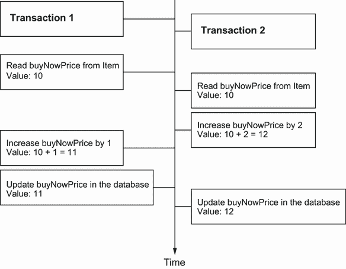
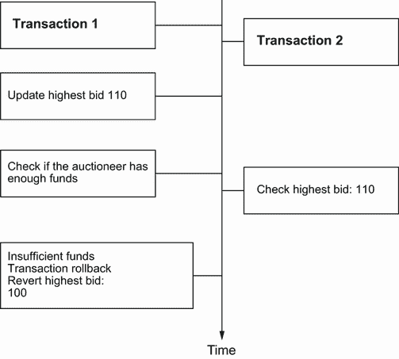
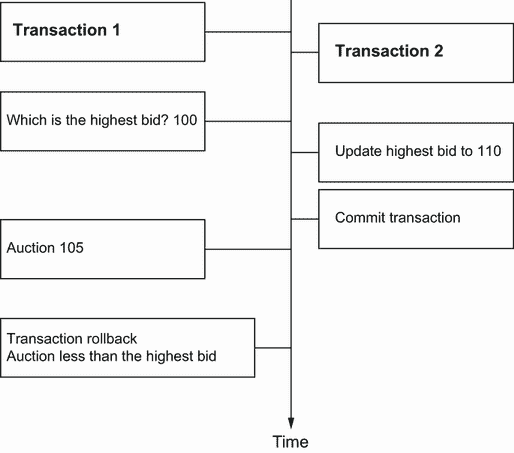
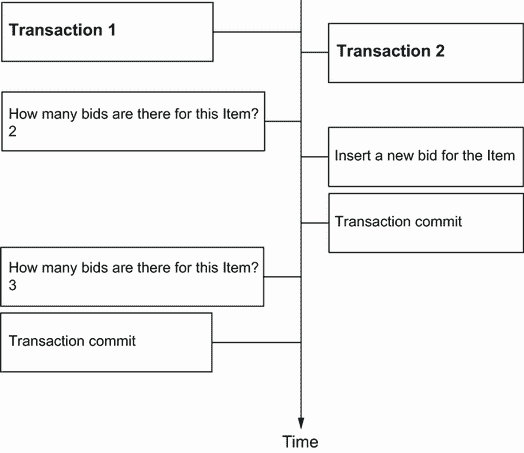
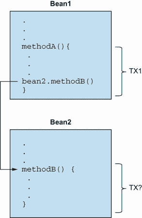

# 11 事务和并发

本章涵盖

+   定义数据库和系统事务基础

+   使用 Hibernate 和 JPA 控制并发访问

+   使用非事务性数据访问

+   使用 Spring 和 Spring Data 管理事务

在本章中，我们最终将讨论事务：如何在应用程序中创建和控制并发作业单元。一个**作业单元**是一组原子的操作，事务允许我们设置作业单元的边界，并帮助我们隔离一个作业单元与另一个作业单元。在多用户应用程序中，我们可能也会并发地处理这些作业单元。

为了处理并发，我们首先将关注最低级别的作业单元：数据库和系统事务。你将学习事务界定和如何在 Java 代码中定义作业单元的 API。我们将演示如何使用悲观和乐观策略来保持隔离和控制并发访问。系统的整体架构影响事务的范围；糟糕的架构可能导致脆弱的事务。

然后我们将基于不使用显式事务访问数据库分析一些特殊情况以及 JPA 功能。最后，我们将演示如何使用 Spring 和 Spring Data 处理事务。

让我们从一些背景信息开始。

JPA 2 中的主要新功能

对于悲观锁定，有新的锁定模式和异常：

+   你可以在`Query`上设置锁定模式，悲观或乐观。

+   你可以在调用`EntityManager#find()`、`refresh()`或`lock()`时设置锁定模式。对于悲观锁定模式，也标准化了锁定超时提示。

当抛出新的`QueryTimeoutException`或`LockTimeoutException`时，事务不需要回滚。

持久化上下文现在可以处于一个**未同步**模式，并且禁用了自动刷新。这允许我们将修改排队，直到我们加入一个事务，并将`EntityManager`的使用与事务解耦。

## 11.1 事务基础

应用功能要求一次性完成几件事情。例如，当拍卖结束时，CaveatEmptor 应用程序必须执行三个不同的任务：

1.  找到拍卖物品的最高出价（最高金额）。

1.  向物品的卖家收取拍卖费用。

1.  通知卖家和成功的竞标者。

如果由于外部信用卡系统故障而无法收取拍卖费用，会发生什么？业务需求可能声明所有列出的操作必须成功，或者没有任何操作必须成功。如果是这样，我们将这些步骤统称为一个**事务**或**作业单元**。如果只有单个步骤失败，整个作业单元必须失败。

### 11.1.1 ACID 属性

*ACID*代表*原子性、一致性、隔离性、持久性*。*原子性*是指事务中的所有操作作为一个原子单元执行。此外，事务允许多个用户同时使用相同的数据，而不会损害数据的*一致性*（与数据库完整性规则一致）。特定的事务不应对其他并发运行的事务可见；它们应在*隔离*下运行。事务中做出的更改应该是*持久*的，即使系统在事务成功完成后失败。

此外，我们希望事务的*正确性*。例如，业务规则规定应用程序只向卖家收费一次，而不是两次。这是一个合理的假设，但我们可能无法用数据库约束来表示它。因此，事务的正确性是应用程序的责任，而一致性是数据库的责任。这些事务属性共同定义了*ACID*标准。

### 11.1.2 数据库和系统事务

我们还提到了*系统*和*数据库*事务。再次考虑最后一个例子：在结束拍卖的工作单元中，我们可能在数据库系统中标记出价。然后，在同一个工作单元中，我们与外部系统通信以向卖家的信用卡收费。这是一个跨越几个系统的交易，涉及在可能多个资源上的协调从属事务，例如数据库连接和外部计费处理器。本章重点介绍跨越一个系统和一个数据库的事务。

数据库事务必须简短，因为打开的事务消耗数据库资源，并可能由于对数据的排他性锁定而阻止并发访问。单个数据库事务通常只涉及单个数据库操作批次。

要在系统事务中执行所有数据库操作，我们必须设置这个工作单元的边界。我们必须开始事务，并在某个时刻提交更改。如果在执行数据库操作或提交事务时发生错误，我们必须回滚更改以保持数据的一致性。这个过程定义了*事务边界*，并且根据我们使用的技巧，涉及在代码中手动定义事务边界。通常，开始和结束事务的事务边界可以设置为在应用程序代码中程序化或声明化。我们将演示这两种方法，在处理 Spring 和 Spring Data 时，我们将重点关注声明化事务。

注意：本章中的所有示例都在任何 Java SE 环境中工作，无需特殊的运行时容器。因此，从现在起，您将看到程序化事务边界代码，直到我们转向特定的 Spring 应用程序示例。

接下来，我们将关注 ACID 属性中最复杂的一个方面：如何将并发运行的作业单位彼此隔离。

## 11.2 控制并发访问

数据库（以及其他事务性系统）试图确保事务**隔离性**，这意味着从每个并发事务的角度来看，似乎没有其他事务正在进行。传统上，数据库系统通过锁定来实现隔离。一个事务可以在数据库中的特定数据项上放置一个锁，暂时阻止其他事务对该项的读取和/或写入访问。一些现代数据库引擎使用多版本并发控制（MVCC）来实现事务隔离，供应商通常认为这更具有可伸缩性。我们将基于锁定模型分析隔离，但我们的大多数观察结果也适用于 MVCC。

数据库如何实现并发控制对于 Java 持久性应用至关重要。应用程序可能继承数据库管理系统提供的隔离保证，但框架可能在这些之上，允许你以资源无关的方式启动、提交和回滚事务。如果你考虑到数据库供应商在实现并发控制方面多年的经验，你会看到这种方法的优点。此外，Java 持久性中的某些特性可以提高隔离保证，超过数据库提供的保证，无论是你明确使用这些特性还是由于设计。

我们将分几个步骤讨论并发控制。首先，我们将探索最底层：数据库提供的交易隔离保证。之后，你将看到 Java 持久性在应用层面的悲观和乐观并发控制特性，以及 Hibernate 可以提供的其他隔离保证。

### 11.2.1 理解数据库级别的并发

当我们谈论隔离时，你可以假设两个事务要么是隔离的，要么不是。当我们谈论数据库事务时，完全隔离的代价很高。你无法停止整个世界来专门访问多用户在线事务处理（OLTP）系统中的数据。因此，有几种隔离级别可供选择，这些级别自然地削弱了完全隔离，但增加了系统的性能和可伸缩性。

事务隔离问题

首先，让我们检查在削弱完全事务隔离时可能出现的几个问题。ANSI SQL 标准根据哪些现象是可允许的来定义标准的事务隔离级别。

当两个并发事务同时更新数据库中的相同信息时，会发生**丢失更新**。第一个事务读取一个值。第二个事务在第一个事务之后不久开始读取相同的值。第一个事务更改并写入更新后的值，而第二个事务用其自己的更新覆盖该值。因此，第一个事务的更新丢失了，被第二个事务覆盖。*最后提交的胜出*。这发生在未实现并发控制、并发事务未隔离的系统中的系统。这如图 11.1 所示。`buyNowPrice`字段由两个事务更新，但只有一次更新发生，另一次更新丢失了。



图 11.1 丢失更新：两个事务在未隔离的情况下更新相同的数据。

如果事务 2 读取了事务 1 所做的更改，而这些更改尚未提交，则发生**脏读**。这是危险的，因为事务 1 所做的更改可能会稍后回滚，而事务 2 将读取无效的数据。这如图 11.2 所示。



图 11.2 脏读：事务 2 从事务 1 读取未提交的数据。

如果一个事务在两次读取数据项时读取到不同的状态，则发生**不可重复读**。例如，另一个事务可能在两次读取之间向数据项写入并提交，如图 11.3 所示。



图 11.3 不可重复读：在事务 1 执行过程中，最高出价发生了变化。

当一个事务执行两次查询，第二次查询的结果包括第一次查询中不可见的数据（因为添加了某些内容），或者包含更少的数据（因为删除了某些内容）时，就称发生了**幻读**。这不必一定是完全相同的查询。另一个事务在两次查询执行之间插入或删除数据会导致这种情况，如图 11.4 所示。



图 11.4 幻读：事务 1 在第二次查询中读取了新数据。

现在既然你已经了解了可能发生的所有不良情况，我们可以定义事务隔离级别并查看它们可以防止哪些问题。

ANSI 隔离级别

标准的隔离级别由 ANSI SQL 标准定义，但它们并不特定于 SQL 数据库。Spring 定义了完全相同的隔离级别，我们将使用这些级别来声明所需的交易隔离级别。随着隔离级别的提高，成本会更高，性能和可扩展性会严重下降：

+   *未提交读隔离*—不允许丢失更新的系统在未提交读隔离下运行。如果一个未提交的事务已经写入了一行，则一个事务可能无法写入该行。然而，任何事务都可以读取任何行。DBMS 可以使用独占写锁来实现此隔离级别。

+   *可重复读隔离*—在可重复读隔离模式下运行的系统不允许丢失更新、脏读或不可重复读。可能会发生幻读。读事务不会阻止其他事务访问行，但未提交的写事务会阻止所有其他事务访问该行。

+   *可重复读隔离*—在可重复读隔离模式下运行的系统不允许丢失更新、脏读或不可重复读。可能会发生幻读。读事务会阻止写事务，但不会阻止其他读事务，而写事务会阻止所有其他事务。

+   *可串行化隔离*—这是最严格的隔离级别，可串行化，模拟串行执行，就像事务一个接一个地执行，而不是并发执行。数据库管理系统（DBMS）可能无法仅使用行级锁来实现可串行化隔离。相反，DBMS 必须提供一些其他机制，以防止新插入的行对已执行查询并返回该行的交易可见。一种简单的机制是在写入后独占锁定整个数据库表，以防止发生幻读。

表 11.1 总结了 ANSI 隔离级别及其解决的问题。

表 11.1 ANSI 隔离级别及其解决的问题

| 隔离级别 | 幻读 | 不可重复读 | 脏读 | 丢失更新 |
| --- | --- | --- | --- | --- |
| `READ_UNCOMMITTED` | – | – | – | + |
| `READ_COMMITTED` | – | – | + | + |
| `REPEATABLE_READ` | – | + | + | + |
| `SERIALIZABLE` | + | + | + | + |

DBMS 如何实现其锁定系统各不相同；每个供应商都有不同的策略。你应该研究你的 DBMS 文档，以了解更多关于其锁定系统、锁如何升级（例如，从行级到页面到整个表）以及每个隔离级别对系统性能和可扩展性的影响。

了解所有这些技术术语的定义固然很好，但这对我们如何为应用程序选择隔离级别有何帮助？

选择隔离级别

开发者（包括我们自己）在生产应用程序中经常不确定使用哪种事务隔离级别。过高的隔离级别会损害高度并发应用程序的可扩展性。隔离不足可能导致微妙且难以复现的 bug，我们直到系统在高负载下运行时才会发现这些问题。

注意，在以下解释中，我们将提到*乐观锁*（带有版本控制），这是一个在本章后面部分分析的概念。当需要为您的应用选择隔离级别时，您可能需要回顾这一部分。毕竟，选择正确的隔离级别高度依赖于特定场景。以下讨论应被视为建议，而不是刻在石头上的教条。

Hibernate 尽力使数据库的事务语义尽可能透明。尽管如此，持久化上下文缓存和版本控制会影响这些语义。在 JPA 应用中选择一个合理的数据库隔离级别是什么？

首先，对于几乎所有场景，都应该消除*读取未提交*的隔离级别。允许一个事务未提交的更改被另一个事务使用是非常危险的。一个事务的回滚或失败将影响其他并发事务。第一个事务的回滚可能会将其他事务一同拉下，或者甚至可能使它们处于不正确的数据库状态（例如，拍卖物品的卖家可能会被收取两次费用——这与数据库完整性规则一致，但却是错误的）。可能的情况是，最终被回滚的事务所做的更改无论如何都会被提交，因为它们可能被另一个成功的事务读取并传播！你可以为了调试目的使用*读取未提交*的隔离级别，以跟踪长插入查询的执行，对聚合函数（如`SUM(*)`或`COUNT(*)`）做一些粗略估计。

其次，大多数应用不需要*可序列化*的隔离级别。幻读通常不会造成问题，而这个隔离级别往往扩展性不佳。现有的应用中很少在生产环境中使用可序列化隔离级别，而是依赖于在特定情况下有效强制序列化操作的选择性悲观锁。

接下来，让我们考虑*可重复读*。这个级别在数据库事务持续期间为查询结果集提供可重复性。这意味着如果我们多次查询数据库，我们不会读取已提交的更新，但幻读仍然可能发生：新行可能会出现，而我们认为存在的行可能会消失，如果另一个事务同时提交更改。尽管我们有时可能想要可重复读，但我们通常不需要在每个事务中都使用它们。

JPA 规范假定*读取提交*是默认的隔离级别。这意味着我们必须处理不可重复读和幻读。

假设我们正在启用对领域模型实体的版本控制，这是 Hibernate 可以为我们自动完成的。持久化上下文缓存和版本控制的组合已经为我们提供了可重复读隔离的大部分优点。持久化上下文缓存确保了一个事务加载的实体实例的状态与其他事务所做的更改相隔离。如果我们在一个工作单元中两次检索相同的实体实例，第二次查找将在持久化上下文缓存中解决，而不会击中数据库。因此，我们的读取是可重复的，我们不会看到冲突的已提交数据。（尽管如此，我们仍然可能遇到幻读，但这些通常更容易处理。）此外，版本控制切换到“先提交者胜出”。因此，对于几乎所有多用户 JPA 应用程序，启用实体版本控制后，所有数据库事务的“读取提交”隔离级别是可以接受的。

Hibernate 保留数据库连接的隔离级别；它不会改变级别。尽管大多数产品默认为读取提交隔离级别，但 MySQL 默认为可重复读。我们可以通过几种方式更改默认事务隔离级别或当前事务的设置。

首先，我们可以检查 DBMS 是否在其专有配置中有一个全局事务隔离级别设置。如果 DBMS 支持标准的 SQL 语句`SET SESSION CHARACTERISTICS`，我们可以执行它来设置在此特定数据库会话（这意味着数据库的特定连接，而不是 Hibernate 的`Session`）中启动的所有事务的设置。（这意味着数据库的特定连接，而不是 Hibernate 的`Session`）。SQL 还标准化了`SET TRANSACTION`语法，该语法设置当前事务的隔离级别。最后，JDBC `Connection` API 提供了`setTransactionIsolation()`方法，根据其文档，“尝试更改此连接的事务隔离级别。”在 Hibernate/JPA 应用程序中，我们可以从本地的`Session` API 获取 JDBC `Connection`。

通常，数据库连接默认处于读取提交隔离级别。有时，应用程序中的特定工作单元可能需要不同的、通常更严格的隔离级别。我们不应该改变整个事务的隔离级别，而应该使用 Jakarta Persistence API 在相关数据上获取额外的锁。这种细粒度锁定在高度并发的应用程序中更具可伸缩性。JPA 提供了乐观版本检查和数据库级别的悲观锁定。

### 11.2.2 乐观并发控制

当并发修改很少且在单元工作后期检测冲突可行时，以乐观方式处理并发是合适的。JPA 提供自动版本检查作为乐观冲突检测过程。

前面的章节可能有些枯燥；现在是时候看看一些代码了。首先，我们将启用版本控制，因为默认情况下它是关闭的。大多数多用户应用程序，尤其是 Web 应用程序，应该为任何并发修改的`@Entity`实例依赖版本控制，以实现更用户友好的*先提交者胜出*。

在启用自动版本检查后，我们将了解手动版本检查是如何工作的，以及何时需要使用它。

注意：要能够从源代码执行示例，您首先需要运行 Ch11.sql 脚本。

启用版本控制

我们可以通过在实体类的特殊额外属性上使用`@Version`注解来启用版本控制，如下所示。

列表 11.1 在映射实体上启用版本控制

```
Path: Ch11/transactions/src/main/java/com/manning/javapersistence/ch11
➥ /concurrency/Item.java

@Entity
public class Item {
    @Version
    private long version;
    //  . . .
}
```

在这个例子中，每个实体实例都携带一个数字版本。它映射到`ITEM`数据库表的额外列中；通常，列名默认为属性名，这里为`VERSION`。属性和列的实际名称并不重要——如果我们认为`VERSION`是数据库管理系统中的保留关键字，我们可以将其重命名。

我们可以在类中添加一个`getVersion()`方法，但不应该有 setter 方法，并且应用程序不应该修改该值。Hibernate 会自动更改版本值：在持久化上下文刷新期间，每当发现`Item`实例被标记为脏时，它就会增加版本号。版本是一个简单的计数器，除了并发控制之外没有其他有用的语义值。我们可以使用`int`、`Integer`、`short`、`Short`或`Long`来代替`long`；如果版本号达到数据类型的限制，Hibernate 会将其包装并从零开始。

在刷新期间增加检测到的脏`Item`实例的版本号后，Hibernate 在执行`UPDATE`和`DELETE` SQL 语句时比较版本。例如，假设在一个工作单元中我们加载一个`Item`并更改其名称，如下所示。

列表 11.2 Hibernate 自动增加和检查版本

```
Path: /Ch11/transactions/src/test/java/com/manning/javapersistence/ch11
➥ /concurrency/Versioning.java – firstCommitWins()

   EntityManager em1 = emf.createEntityManager();
   em1.getTransaction().begin();
Item item = em1.find(Item.class, ITEM_ID);                             Ⓐ
// select * from ITEM where ID = ?
assertEquals(0, item.getVersion());                                    Ⓑ
item.setName("New Name");
// . . .  Another transaction changes the record
*assertThrows*(OptimisticLockException.class, () -> em1.flush());        Ⓒ
// update ITEM set NAME = ?, VERSION = 1 where ID = ? and VERSION = 0
```

Ⓐ 通过标识符检索实体实例将使用`SELECT`从数据库中加载当前版本。

Ⓑ `Item`实例的当前版本是`0`。

Ⓒ 当持久化上下文刷新时，Hibernate 会检测到脏的`Item`实例并增加其版本到`1`。SQL `UPDATE`现在执行版本检查，将新版本存储在数据库中，但只有当数据库版本仍然是`0`时。

注意到 SQL 语句，特别是`UPDATE`及其`WHERE`子句。此更新只有在数据库中存在`VERSION = 0`的行时才会成功。JDBC 将更新的行数返回给 Hibernate；如果该结果为零，则意味着`ITEM`行已不存在或不再具有版本`0`。Hibernate 在刷新期间检测到这种冲突，并抛出`javax.persistence.OptimisticLockException`异常。

现在想象有两个用户同时执行这个工作单元，如图 11.1 所示。第一个提交的用户将更新`Item`的名称并将增加的版本`1`刷新到数据库中。第二个用户的刷新（和提交）将失败，因为他们的`UPDATE`语句在数据库中找不到版本为`0`的行。数据库版本是`1`。因此，*第一个提交获胜*，我们可以捕获`OptimisticLockException`并专门处理它。例如，我们可以向第二个用户显示以下消息：“你正在处理的数据已被其他人修改。请使用新鲜数据重新开始你的工作单元。点击重启按钮继续。”

哪些修改会触发实体版本的递增？Hibernate 在实体实例脏时递增版本。这包括实体所有脏的值类型属性，无论它们是单值（如`String`或`int`属性），嵌入的（如`Address`），还是集合。例外的是使用`mappedBy`标记为只读的`@OneToMany`和`@ManyToMany`关联集合。在这些集合中添加或删除元素不会增加拥有实体实例的版本号。你应该知道，JPA 中没有任何标准化的内容——不要依赖于两个 JPA 提供者在访问共享数据库时实施相同的规则。

如果我们不希望在特定属性的值发生变化时增加实体实例的版本，我们可以使用`@org.hibernate.annotations.OptimisticLock(excluded = true)`注解该属性。

你可能不喜欢数据库模式中额外的`VERSION`列。或者，你已经在实体类上有一个“最后更新”的时间戳属性以及匹配的数据库列。Hibernate 可以使用时间戳而不是额外的计数器字段来检查版本。

使用共享数据库进行版本控制

如果多个应用程序访问数据库，并且它们并不都使用 Hibernate 的版本控制算法，我们将遇到并发问题。一个简单的解决方案是使用数据库级别的触发器和存储过程：一个`INSTEAD OF`触发器可以在任何`UPDATE`操作时执行一个存储过程；它将代替更新操作。在存储过程中，我们可以检查应用程序是否增加了行的版本；如果版本没有更新或者版本列没有被包含在更新中，我们知道这个语句不是由 Hibernate 应用程序发送的。然后我们可以在应用`UPDATE`之前在存储过程中增加版本。

使用时间戳进行版本控制

如果数据库模式已经包含一个时间戳列，如`LASTUPDATED`或`MODIFIED_ON`，我们可以将其映射以进行自动版本检查，而不是使用额外的计数器字段。

列表 11.3 启用时间戳版本控制

```
Path: Ch11/transactions2/src/main/java/com/manning/javapersistence/ch11
➥ /timestamp/Item.java

@Entity
public class Item {
    @Version
       // Optional: @org.hibernate.annotations.Type(type = "dbtimestamp")
    private LocalDateTime lastUpdated;
    //  . . .
}
```

此示例将`LASTUPDATED`列映射到`java.time.LocalDateTime`属性；`Date`或`Calendar`类型也可以与 Hibernate 一起使用。JPA 标准没有为版本属性定义这些类型；JPA 仅考虑`java.sql.Timestamp`是可移植的。这不太吸引人，因为我们不得不在域模型中导入那个 JDBC 类。我们应该尽量将像 JDBC 这样的实现细节从域模型类中排除，以便它们可以在尽可能多的环境中进行测试、实例化、序列化和反序列化。

理论上，使用时间戳进行版本控制稍微不太安全，因为两个并发事务可能在同一毫秒内同时加载和更新相同的`Item`；这一点由于 JVM 通常没有毫秒级的精度（您应该检查您的 JVM 和操作系统文档以获取保证的精度）而加剧。此外，在集群环境中从 JVM 检索当前时间并不一定安全，因为节点的时间可能没有同步，或者时间同步的精度不如您所需的交易负载精度。

您可以通过在版本属性上放置一个`@org.hibernate.annotations.Type(type="dbtimestamp")`注解来切换为从数据库机器检索当前时间。Hibernate 现在在更新之前会向数据库请求当前时间，这为同步提供了一个单一的时间源。并非所有 Hibernate SQL 方言都支持此功能，因此请检查配置方言的来源。此外，每次增量都会产生访问数据库的开销。

我们建议新项目依赖数字计数器的版本控制，而不是时间戳。如果您正在使用遗留数据库模式或现有的 Java 类，可能无法引入版本或时间戳属性和列。如果是这种情况，Hibernate 提供了一个替代策略。

无版本号或时间戳的版本控制

如果您没有版本或时间戳列，Hibernate 仍然可以执行自动版本控制。这种版本控制的替代实现将当前数据库状态与 Hibernate 检索实体实例（或持久化上下文最后刷新）时的持久属性未修改的值进行比较。

您可以使用专有的 Hibernate 注解`@org.hibernate.annotations.OptimisticLocking`来启用此功能：

```
Path: Ch11/transactions3/src/main/java/com/manning/javapersistence/ch11
➥ /versionall/Item.java

@Entity
@org.hibernate.annotations.OptimisticLocking(
    type = org.hibernate.annotations.OptimisticLockType.ALL)
@org.hibernate.annotations.DynamicUpdate
public class Item {
    //  . . .
}
```

对于这个策略，您还必须启用`UPDATE`语句的动态 SQL 生成，使用`@org.hibernate.annotations.DynamicUpdate`，如第 5.3.2 节所述。

Hibernate 现在执行以下 SQL 来刷新一个`Item`实例的修改：

```
update ITEM set NAME = 'New Name'
    where ID = 123
        and NAME = 'Old Name'
        and PRICE = '9.99'
        and DESCRIPTION = 'Some item for auction'
        and ...
        and SELLER_ID = 45
```

Hibernate 在`WHERE`子句中列出所有列及其最后已知值。如果任何并发事务修改了这些值中的任何一个，或者甚至删除了该行，则此语句将返回零行更新。然后 Hibernate 在刷新时抛出异常。

或者，如果你切换到`OptimisticLockType.DIRTY`，Hibernate 只包括修改过的属性在限制条件中（在这个例子中是`NAME`）。这意味着两个工作单元可以并发修改同一个`Item`，而 Hibernate 只有在它们都修改了相同值类型的属性（或外键值）时才会检测到冲突。最后一条 SQL 摘录的`WHERE`子句将简化为`where ID = 123 and NAME = 'Old Name'`。其他人可以并发修改价格，Hibernate 不会检测到任何冲突。只有当应用程序并发修改名称时，我们才会得到`javax.persistence.OptimisticLockException`。

在大多数情况下，仅检查脏属性并不是业务实体的好策略。如果描述发生变化，改变商品的价格可能是不合适的！这种策略也不适用于分离实体和合并：如果我们把分离的实体合并到一个新的持久化上下文中，我们不知道“旧”值。分离的实体实例将不得不携带一个版本号或时间戳以进行乐观并发控制。

Java 持久性中的自动版本控制可以防止两个并发事务尝试对同一份数据提交修改时丢失更新。版本控制还可以在我们需要时帮助我们手动获得额外的隔离保证。

手动版本检查

这里有一个需要可重复数据库读取的场景：想象一下，拍卖系统中有一些类别，每个`Item`都位于一个`Category`中。这是`Item#category`实体关联的常规`@ManyToOne`映射。

假设你想要汇总几个类别中所有商品的价格。这需要查询每个类别中的所有商品以累加价格。问题是，如果你在查询和遍历所有类别和商品时有人将一个`Item`从一个`Category`移动到另一个`Category`，会发生什么？在有提交读隔离的情况下，同一个`Item`可能在你的程序运行期间出现两次！

要使“获取每个类别的商品”读取可重复，JPA 的`Query`接口有一个`setLockMode()`方法。查看以下列表中的过程。

列表 11.4 在刷新时请求版本检查以确保可重复读取

```
Path: /Ch11/transactions/src/test/java/com/manning/javapersistence/ch11
➥ /concurrency/Versioning.java – manualVersionChecking()

   EntityManager em = emf.createEntityManager();
   em.getTransaction().begin();

BigDecimal totalPrice = BigDecimal.ZERO;
for (Long categoryId : CATEGORIES) {
    List<Item> items =                                            Ⓐ
        em.createQuery("select i from Item i where i.category.id = :catId", 
 ➥ Item.class)
            .setLockMode(LockModeType.OPTIMISTIC)
            .setParameter("catId", categoryId)
            .getResultList();
    for (Item item : items)
        totalPrice = totalPrice.add(item.getBuyNowPrice());
}
  em.getTransaction().commit();                                   Ⓑ
em.close();
assertEquals("108.00", totalPrice.toString());
```

Ⓐ 对于每个`Category`，以`OPTIMISTIC`锁定模式查询所有`Item`实例。Hibernate 现在知道它必须在刷新时检查每个`Item`。

Ⓑ 对于之前通过锁定查询加载的每个`Item`，Hibernate 在刷新期间执行一个`SELECT`。它检查每个`ITEM`行的数据库版本是否仍然与加载时相同。如果任何`ITEM`行版本不同或行不再存在，将抛出`OptimisticLockException`。

不要被*锁定*术语所迷惑：JPA 规范没有明确说明每个`LockModeType`是如何实现的。对于`OPTIMISTIC`，Hibernate 执行版本检查；实际上没有涉及任何锁。我们必须像前面解释的那样在`Item`实体类上启用版本控制；否则，我们无法使用 Hibernate 的乐观`LockModeType`s。

Hibernate 不会对手动版本检查的`SELECT`语句进行批处理或优化；如果我们汇总 100 个项目，在刷新时我们会得到 100 个额外的查询。正如我们在本章后面将要展示的，一种悲观的策略可能在这个特定情况下是一个更好的解决方案。

为什么持久化上下文缓存不能防止并发修改问题？

“获取特定类别中的所有项目”查询返回一个`ResultSet`中的项目数据。然后 Hibernate 查看这些数据中的主键值，并首先尝试在持久化上下文缓存中解决每个`Item`的其余详细信息——它检查是否已经使用该标识符加载了`Item`实例。

然而，这个缓存在这个示例过程中并没有帮助：如果一个并发事务将项目移动到另一个类别，该项目可能会在不同的`ResultSet`s 中多次返回。Hibernate 将执行其持久化上下文查找并说，“哦，我已经加载了那个`Item`实例；让我们使用我们已经在内存中的内容。”Hibernate 甚至没有意识到分配给项目的类别已经改变，或者项目再次出现在不同的结果中。

因此，这是一个持久化上下文的可重复读特性隐藏了并发提交的数据的案例。我们需要手动检查版本号来确定在我们预期数据不会改变的时候，数据是否已经发生了变化。

如前例所示，`Query`接口接受一个`LockModeType`。`TypedQuery`和`NamedQuery`接口也支持显式锁定模式，使用相同的`setLockMode()`方法。

JPA 中有一个额外的乐观锁定模式，可以强制实体版本的递增。

强制版本递增

如果两个用户同时为同一拍卖物品出价会发生什么？当用户提交新的出价时，应用程序必须做两件事：

1.  从数据库中检索`Item`的当前最高`Bid`。

1.  将新的`Bid`与最高`Bid`进行比较；如果新的`Bid`更高，它必须存储在数据库中。

在这两个步骤之间可能存在竞争条件。如果在读取最高`Bid`和放置新的`Bid`之间，另一个`Bid`被提交，你将看不到它。这种冲突是不可见的，即使启用了`Item`的版本控制，也无法帮助。在程序过程中，`Item`永远不会被修改。然而，强制`Item`的版本递增可以使冲突变得可检测。

列表 11.5 强制实体实例的版本递增

```
Path: /Ch11/transactions/src/test/java/com/manning/javapersistence/ch11
➥ /concurrency/Versioning.java – forceIncrement()

   EntityManager em = emf.createEntityManager();
   em.getTransaction().begin();
Item item = em.find(                                          Ⓐ
    Item.class,
    ITEM_ID,
    LockModeType.OPTIMISTIC_FORCE_INCREMENT
);
Bid highestBid = queryHighestBid(em, item);
// . . .  Another transaction changes the record
Bid newBid = new Bid(
        new BigDecimal("45.45"),
        item,
        highestBid);
em.persist(newBid);                                           Ⓑ
assertThrows(RollbackException.class,
                   () -> em.getTransaction().commit());       Ⓒ
em.close();
```

Ⓐ `find()` 接受一个 `LockModeType`。`OPTIMISTIC_FORCE_INCREMENT` 模式告诉 Hibernate，在加载检索到的 `Item` 后，即使它在工作单元中从未被修改，也应增加其版本。

Ⓑ 代码持久化了一个新的 `Bid` 实例；这不会影响 `Item` 实例的任何值。在 `BID` 表中插入了一行新记录。如果没有强制版本增加的 `Item`，Hibernate 不会检测到并发提交的出价。

Ⓒ 当刷新持久化上下文时，Hibernate 执行一个 `INSERT` 以持久化新的 `Bid`，并强制执行带有版本检查的 `Item` 的 `UPDATE`。如果有人在此过程中并发修改了 `Item` 或与此过程同时提交了一个 `Bid`，Hibernate 将抛出异常。

对于拍卖系统，并发提交出价当然是一个频繁的操作。在许多情况下，当我们插入或修改数据并希望聚合的某些根实例的版本增加时，手动增加版本是有用的。

注意，如果我们没有使用 `Bid#item` 实体关联的 `@ManyToOne`，而是有一个 `@ElementCollection` 的 `Item#bids`，向集合中添加一个 `Bid` 将会增加 `Item` 的版本。强制增加在这种情况下是不必要的。你可能想回顾第 8.3 节中关于父/子歧义以及聚合和 ORM 一起工作的讨论。

到目前为止，我们一直关注乐观并发控制：我们预计并发修改很少，因此我们不阻止并发访问，并在晚些时候检测冲突。然而，有时我们知道冲突将频繁发生，并且我们希望对某些数据放置排他锁。这需要一种悲观的方法。

### 11.2.3 显式悲观锁定

让我们重复上一节“手动版本检查”中演示的程序，但这次使用悲观锁定而不是乐观版本检查。我们再次总结几个类别中所有项目的总价。这是与前面列表 11.5 中显示的相同代码，但 `LockModeType` 不同。

列表 11.6 悲观锁定数据

```
Path: /Ch11/transactions/src/test/java/com/manning/javapersistence/ch11
➥ /concurrency/Locking.java – pessimisticReadWrite()

   EntityManager em = emf.createEntityManager();
   em.getTransaction().begin();

BigDecimal totalPrice = BigDecimal.ZERO;
for (Long categoryId : CATEGORIES) {
    List<Item> items =                                           Ⓐ
        em.createQuery("select i from Item i where i.category.id = :catId", 
        ➥ Item.class)
            .setLockMode(LockModeType.PESSIMISTIC_READ)
            .setHint("javax.persistence.lock.timeout", 5000)
            .setParameter("catId", categoryId)
            .getResultList();
    for (Item item : items)                                      Ⓑ
        totalPrice = totalPrice.add(item.getBuyNowPrice());
    // . . .  Another transaction tries to obtain a lock and fails
}
em.getTransaction().commit();                                    Ⓒ
em.close();
assertEquals(0, totalPrice.compareTo(new BigDecimal("108")));
```

Ⓐ 对于每个 `Category`，以 `PESSIMISTIC_READ` 锁定模式查询所有 `Item` 实例。Hibernate 使用 SQL 查询锁定数据库中的行。如果另一个事务持有冲突锁，如果可能，等待 5 秒。如果无法获得锁，查询将抛出异常。

Ⓑ 如果查询成功返回，我们知道我们持有对数据的排他锁，并且没有其他事务可以以排他锁访问它或修改它，直到此事务提交。

Ⓒ 事务完成后提交时，锁被释放。

JPA 规范定义了 `PESSIMISTIC_READ` 锁定模式保证可重复读。JPA 还标准化了 `PESSIMISTIC_WRITE` 模式，并提供了额外的保证：除了可重复读之外，JPA 提供商必须序列化数据访问，并且不能发生幻读。

实现这些要求取决于 JPA 提供者。对于这两种模式，Hibernate 在加载数据时将`FOR UPDATE`子句附加到 SQL 查询。这将在数据库级别对行进行锁定。Hibernate 使用的锁类型取决于`LockModeType`和 Hibernate 数据库方言：

+   在 H2 数据库中，查询语句为`SELECT * FROM ITEM ... FOR UPDATE`。因为 H2 数据库只支持一种类型的排他锁，所以 Hibernate 为所有悲观模式生成相同的 SQL 语句。

+   另一方面，PostgreSQL 支持共享读锁：`PESSIMISTIC_READ`模式将`FOR SHARE`附加到 SQL 查询。`PESSIMISTIC_WRITE`使用带有`FOR UPDATE`的排他写锁。

+   在 MySQL 中，`PESSIMISTIC_READ`转换为`LOCK IN SHARE MODE`，而`PESSIMISTIC_WRITE`转换为`FOR UPDATE`。

检查你的数据库方言。锁是通过`getReadLockString()`和`getWriteLockString()`方法配置的。

JPA 中悲观锁的持续时间是一个单独的数据库事务。这意味着我们无法使用排他锁来阻塞并发访问超过单个数据库事务的时间。当数据库锁无法获取时，会抛出异常。

将此与乐观方法进行比较，Hibernate 在提交时而不是在查询时抛出异常。在悲观策略中，我们知道一旦锁定查询成功，我们就可以安全地读取和写入数据。在乐观方法中，我们寄希望于最好的结果，但可能在稍后提交时感到惊讶。

离线锁

悲观数据库锁仅保留在一个事务中。其他锁实现是可能的：例如，内存中的锁，或数据库中的所谓*锁表*。这类锁的常见名称是*离线锁*。

悲观锁超过单个数据库事务通常会导致性能瓶颈：每次数据访问都涉及对全局同步锁管理器的额外锁检查。然而，乐观锁是长运行会话（如你将在下一章中看到的）的完美并发控制策略，并且性能良好。根据冲突解决策略——它决定了检测到冲突后会发生什么——应用程序的用户可能会像喜欢阻塞并发访问一样喜欢乐观锁。他们也可能欣赏应用程序在其他人查看相同数据时不会将他们锁定在特定屏幕之外。

我们可以通过`javax.persistence.lock.timeout`提示来配置数据库等待获取锁并阻塞查询的时间（以毫秒为单位）。与提示一样，Hibernate 可能会根据数据库产品忽略它。例如，H2 数据库不支持特定查询的锁超时，只支持连接的全局锁超时（默认为 1 秒）。在某些方言中，例如 PostgreSQL 和 Oracle，将`0`作为锁超时将`NOWAIT`子句附加到 SQL 字符串中。

我们已经演示了应用于 `Query` 的锁超时提示。我们也可以为 `find()` 操作设置超时提示：

```
Path: /Ch11/transactions/src/test/java/com/manning/javapersistence/ch11
➥ /concurrency/Locking.java – findLock()

EntityManager em = emf.createEntityManager();
em.getTransaction().begin();

Map<String, Object> hints = new HashMap<>();
hints.put("javax.persistence.lock.timeout", 5000);

Category category =            Ⓐ
        em.find(
                Category.class,
                CATEGORY_ID,
                LockModeType.PESSIMISTIC_WRITE,
                Hints
        );

category.setName("New Name");

em.getTransaction().commit();
em.close();
```

Ⓐ 如果方言支持，执行 `SELECT ... FOR UPDATE WAIT 5000`。

当无法获取锁时，Hibernate 抛出 `javax.persistence.LockTimeoutException` 或 `javax.persistence.PessimisticLockException`。如果 Hibernate 抛出 `PessimisticLockException`，则必须回滚事务，并且工作单元结束。另一方面，超时异常对事务不是致命的。Hibernate 抛出哪种异常再次取决于 SQL 方言。例如，因为 H2 不支持每语句锁超时，所以我们总是得到 `PessimisticLockException`。

即使没有启用实体版本化，我们也可以使用 `PESSIMISTIC_READ` 和 `PESSIMISTIC_WRITE` 锁模式。它们转换为数据库级别的锁的 SQL 语句。

特殊的 `PESSIMISTIC_FORCE_INCREMENT` 模式需要版本化实体。在 Hibernate 中，此模式执行一个 `FOR UPDATE NOWAIT` 锁（或方言支持的任何内容；检查其 `getForUpdateNowaitString()` 实现）。然后，在查询返回后立即，Hibernate 增加版本并对每个返回的实体实例执行 `UPDATE`。这向任何并发事务表明我们已经更新了这些行，即使我们尚未修改任何数据。此模式很少有用，除了在本章前面讨论的“强制版本增量”部分中讨论的聚合锁定之外。

那么 READ 和 WRITE 锁模式呢？

这些是来自 JPA 1.0 的旧锁模式，你应该不再使用它们。`LockModeType.READ` 等同于 `OPTIMISTIC`，而 `LockModeType.WRITE` 等同于 `OPTIMISTIC_FORCE_INCREMENT`。

如果我们启用悲观锁，Hibernate 只锁定与实体实例状态相对应的行。换句话说，如果我们锁定一个 `Item` 实例，Hibernate 将锁定 `ITEM` 表中的其行。如果我们有一个联合继承映射策略，Hibernate 将识别这一点并锁定超表和子表中的适当行。这也适用于实体的任何二级表映射。因为 Hibernate 锁定整个行，所以任何外键在该行中的关系也将被有效地锁定：如果 `SELLER_ID` 外键列在 `ITEM` 表中，则 `Item#seller` 关联将被锁定，但实际的 `Seller` 实例不会被锁定！`Item` 的集合或其他关联也不会被锁定，其中外键在其他表中。

扩展锁作用域

JPA 2.0 定义了 `PessimisticLockScope.EXTENDED` 选项。它可以作为一个查询提示通过 `javax.persistence.lock.scope` 设置。如果启用，持久化引擎将锁定数据的范围扩展到包括被锁定实体集合和关联连接表中的任何数据。

在 DBMS 中使用排他锁时，你可能会遇到事务失败，因为你遇到了死锁情况。让我们看看如何避免这种情况。

### 11.2.4 避免死锁

如果 DBMS 依赖于排他锁来实现事务隔离，则可能会发生死锁。考虑以下工作单元，按特定顺序更新两个`Item`实体实例：

```
EntityManager em = emf.createEntityManager();
em.getTransaction().begin();
Item itemOne = em.find(Item.class, ITEM_ONE_ID);
itemOne.setName("First new name");
Item itemTwo = em.find(Item.class, ITEM_TWO_ID);
itemTwo.setName("Second new name");
em.getTransaction().commit();
em.close();
```

当持久化上下文被刷新时，Hibernate 执行两个 SQL `UPDATE`语句。第一个`UPDATE`锁定代表`Item`一的行，第二个`UPDATE`锁定`Item`二：

```
update ITEM set ... where ID = 1;       Ⓐ
update ITEM set ... where ID = 2;       Ⓑ
```

Ⓐ 锁定行 1

Ⓑ 尝试锁定行 2

如果一个类似的过程，以相反的`Item`更新顺序执行，在并发事务中，可能会（或可能不会！）发生死锁：

```
update ITEM set ... where ID = 2;       Ⓐ
update ITEM set ... where ID = 1;       Ⓑ
```

Ⓐ 锁定行 2

Ⓑ 尝试锁定行 1

在死锁的情况下，两个事务都被阻塞，无法前进，每个都在等待锁被释放。死锁的可能性通常很小，但在高度并发的应用程序中，两个 Hibernate 应用程序可能会执行这种交错更新的操作。请注意，我们可能在测试期间看不到死锁（除非我们编写了正确的测试）。当应用程序在生产中必须处理高事务负载时，死锁可能会突然出现。通常，DBMS 在超时后终止其中一个死锁事务，该事务失败；然后另一个事务可以继续进行。或者，DBMS 可能会自动检测死锁情况并立即中止其中一个事务。

应该尽量避免事务失败，因为它们在应用程序代码中很难恢复。一个解决方案是在更新单行时以**serializable**模式运行数据库连接，这将锁定整个表。并发事务必须等待第一个事务完成其工作。或者，第一个事务可以在你`SELECT`数据时获取所有数据的排他锁，如前节所示。然后任何并发事务也必须等待这些锁被释放。

一种替代的实用优化可以显著降低死锁的概率，即按主键值对`UPDATE`语句进行排序：Hibernate 应始终在更新数据被应用程序加载和修改的顺序之前更新主键为`1`的行，无论数据以何种顺序加载和修改。您可以通过`hibernate.order_updates`配置属性为整个持久化单元启用此优化。Hibernate 随后按修改的实体实例和集合元素的主键值升序排序执行所有`UPDATE`语句。（如前所述，请确保您完全理解您的 DBMS 产品的事务和锁定行为。Hibernate 从 DBMS 继承了其大部分事务保证；例如，您的 MVCC 数据库产品可能避免读锁，但可能依赖于排他锁来实现写隔离，您可能会看到死锁。）

我们没有机会提到`EntityManager#lock()`方法。它接受一个已加载的持久化实体实例和一个锁定模式。它执行与`find()`和`Query`中看到的相同的锁定操作，只不过它不会加载实例。此外，如果版本化实体正在以悲观方式锁定，`lock()`方法将在数据库上立即执行版本检查，并可能抛出`OptimisticLockException`。如果数据库表示不再存在，Hibernate 将抛出`EntityNotFoundException`。最后，`EntityManager#refresh()`方法也接受一个锁定模式，具有相同的语义。

我们现在已经涵盖了最低级别的并发控制——数据库——以及 JPA 的乐观和悲观锁定特性。我们还有一个并发方面需要检查：在事务外访问数据。

## 11.3 非事务性数据访问

默认情况下，JDBC `Connection`处于*自动提交*模式。这种模式对于执行临时的 SQL 很有用。

想象一下，你使用 SQL 控制台连接到数据库，并运行几个查询，甚至更新和删除行。这种交互式数据访问是临时的；大多数时候，你没有计划或一系列你认为是一个工作单元的语句。数据库连接上的默认自动提交模式非常适合这种数据访问——毕竟，你不想为每个你编写和执行的 SQL 语句都输入`begin transaction`和`end transaction`。

在自动提交模式下，每个发送到数据库的 SQL 语句都会开始和结束一个（短）数据库事务。你实际上是在非事务模式下工作，因为你的会话与 SQL 控制台之间没有任何原子性或隔离保证。（唯一的保证是单个 SQL 语句是原子的。）

根据定义，应用程序总是执行一系列计划的语句。因此，你可以因此始终创建事务边界来将语句分组为原子且相互隔离的单位似乎是合理的。然而，在 JPA 中，与自动提交模式相关联的是特殊行为，你可能需要它来实现长时间运行的会话。你可以在自动提交模式下访问数据库并读取数据。

### 11.3.1 在自动提交模式下读取数据

考虑以下示例，它加载了一个`Item`实例，更改了其`name`，然后通过刷新撤销了该更改。

当我们创建`EntityManager`时，没有任何事务是活跃的。持久化上下文将处于一种特殊的未同步模式；Hibernate 不会自动刷新。你可以访问数据库来读取数据，此类操作执行一个`SELECT`，该操作在自动提交模式下发送到数据库。

通常，当你执行一个`Query`时，Hibernate 会刷新持久化上下文。如果上下文是非同步的，则不会发生刷新，查询将返回旧的、原始的数据库值。具有标量结果的查询是不可重复的：你将看到数据库中存在的任何值，以及 Hibernate 在`ResultSet`中接收到的值。即使在同步模式下，这也不是可重复读。

获取一个托管实体实例涉及在当前持久化上下文中进行查找，在 JDBC 结果集序列化期间。从持久化上下文中返回已加载的具有更改名称的实例；忽略数据库中的值。这是一个即使没有系统事务也能重复读取实体实例的情况。

如果你尝试手动刷新持久化上下文以存储新的`Item#name`，Hibernate 会抛出`javax.persistence.TransactionRequiredException`异常。在非同步模式下执行`UPDATE`是不允许的，因为你将无法回滚更改。

你可以使用`refresh()`方法回滚使用该方法所做的更改。它从数据库中加载当前的`Item`状态，并覆盖你在内存中做的更改。

列表 11.7 在自动提交模式下读取数据

```
Path: Ch11/transactions4/src/test/java/com/manning/javapersistence/ch11
➥ /concurrency/NonTransactional.java

EntityManager em = emf.createEntityManager();                   Ⓐ
Item item = em.find(Item.class, ITEM_ID);                       Ⓑ
item.setName("New Name");
assertEquals(                                                   Ⓒ
     "Original Name",
     em.createQuery("select i.name from Item i where i.id = :id", String.class)
       .setParameter("id", ITEM_ID).getSingleResult()
);
assertEquals(                                                   Ⓓ
     "New Name",
     em.createQuery("select i from Item i where i.id = :id". Item.class)
               .setParameter("id", ITEM_ID).getSingleResult().getName()
);
// em.flush();                                                  Ⓔ
em.refresh(item);                                               Ⓕ
assertEquals("Original Name", item.getName());
em.close();
```

Ⓐ 在创建`EntityManager`时没有活动的事务。

Ⓑ 访问数据库以读取数据。

Ⓒ 因为上下文是非同步的，所以不会发生刷新，查询返回旧的、原始的数据库值。

Ⓓ 从持久化上下文中返回具有更改名称的已加载`Item`实例；忽略数据库中的值。

Ⓔ 你不能在非同步模式下执行`UPDATE`，因为你将无法回滚更改。

Ⓕ 回滚使用`refresh()`方法所做的更改。

在非同步持久化上下文中，你可以使用`find()`、`getReference()`、`refresh()`或查询在自动提交模式下读取数据。你也可以按需加载数据：如果你访问它们，代理将被初始化，如果你开始遍历它们的元素，集合将被加载。但是，如果你尝试使用除`LockModeType.NONE`之外的方式刷新持久化上下文或锁定数据，将会发生`TransactionRequiredException`异常。

到目前为止，自动提交模式似乎并不很有用。事实上，许多开发者经常出于错误的原因依赖自动提交：

+   许多小的每语句数据库事务（这就是自动提交的含义）不会提高应用程序的性能。

+   你不会提高应用程序的可伸缩性。你可能会认为，与每个 SQL 语句的许多小事务相比，一个运行时间较长的数据库事务可能会更长时间地持有数据库锁，但这是一个次要的担忧，因为 Hibernate 在事务中尽可能晚地写入数据库（在提交时刷新），因此数据库已经持有写锁一段时间了。

+   如果应用程序并发修改数据，自动提交提供较弱的隔离保证。在自动提交模式下，基于读取锁的重复读取是不可能的。（持久化上下文缓存在这里自然有所帮助。）

+   如果你的数据库管理系统有 MVCC（例如，Oracle 或 PostgreSQL），你可能会想使用其 *快照隔离* 功能来避免不可重复读取和幻读。每个事务都获得其自己的数据快照；你只能看到在事务开始之前的数据（数据库内部版本）。在自动提交模式下，快照隔离没有意义，因为没有事务范围。

+   如果你使用自动提交，你的代码将更难以理解。任何阅读你代码的人都将必须特别注意持久化上下文是否与事务关联，或者它是否处于未同步模式。如果你总是将操作分组在系统事务中，即使你只读取数据，每个人都可以遵循这个简单的规则，难以发现的并发问题的可能性就会降低。

那么，未同步持久化上下文有哪些好处？如果刷新不会自动发生，你可以在事务之外准备和 *排队* 修改。

### 11.3.2 排队修改

以下示例使用未同步的 `EntityManager` 存储一个新的 `Item` 实例。

你可以使用 `persist()` 在未同步的持久化上下文中保存一个临时实体实例。Hibernate 仅通过调用数据库序列来获取一个新的标识符值，并将其分配给实例。该实例将在上下文中处于持久状态，但 SQL `INSERT` 尚未发生。请注意，这仅适用于 *预插入* 标识符生成器；请参阅第 5.2.5 节。

当你准备好存储更改时，你必须使用事务将持久化上下文与事务关联。当事务提交时，通常会发生同步和刷新。Hibernate 将所有排队操作写入数据库。

```
Path: Ch11/transactions4/src/test/java/com/manning/javapersistence/ch11
➥ /concurrency/NonTransactional.java

EntityManager em = emf.createEntityManager();
Item newItem = new Item("New Item");
em.persist(newItem);                     Ⓐ
assertNotNull(newItem.getId());
em.getTransaction().begin();             Ⓑ
if (!em.isJoinedToTransaction()) {
    em.joinTransaction();
}
em.getTransaction().commit();            Ⓒ
em.close();
```

Ⓐ 调用 `persist()` 以保存一个具有未同步持久化上下文的临时实体实例。

Ⓑ 使用事务将持久化上下文与事务关联。

Ⓒ 当事务提交时发生同步和刷新。

分离的实体实例的合并更改也可以排队：

```
Path: Ch11/transactions4/src/test/java/com/manning/javapersistence/ch11
➥ /concurrency/NonTransactional.java

detachedItem.setName("New Name");
EntityManager em = emf.createEntityManager();
Item mergedItem = em.merge(detachedItem);     Ⓐ
em.getTransaction().begin();
em.joinTransaction();
em.getTransaction().commit();                 Ⓑ
em.close();
```

Ⓐ 当你 `merge()` 时，Hibernate 会在自动提交模式下执行一个 `SELECT`。

Ⓑ Hibernate 将 `UPDATE` 延迟到关联事务提交。

排队也适用于实体实例的删除和 `DELETE` 操作：

```
Path: Ch11/transactions4/src/test/java/com/manning/javapersistence/ch11
➥ /concurrency/NonTransactional.java

EntityManager em = emf.createEntityManager();
Item item = em.find(Item.class, ITEM_ID);
em.remove(item);
em.getTransaction().begin();
em.joinTransaction();
em.getTransaction().commit();
em.close();
```

因此，未同步的持久化上下文允许你将持久化操作与事务解耦。能够在事务（和客户端/服务器请求）之外排队数据修改的能力是持久化上下文的主要特性之一。

Hibernate 的手动刷新模式

Hibernate 提供了 `Session#setFlushMode()` 方法，以及额外的 `FlushMode.MANUAL`。这是一个更方便的开关，它禁用了持久化上下文的任何自动刷新，即使在联合事务提交时也是如此。使用此模式，您必须显式调用 `flush()` 以与数据库同步。在 JPA 中，想法是“事务提交应始终写入任何未决更改”，因此读取与写入通过 *非同步* 模式分离。如果您不同意这一点或不想自动提交语句，请通过 `Session` API 启用手动刷新。然后，您可以为所有工作单元拥有常规的事务边界，包括可重复读甚至来自您的 MVCC 数据库的快照隔离，但仍然将更改排队在持久化上下文中以供稍后执行，并在事务提交之前手动 `flush()`。

## 11.4 使用 Spring 和 Spring Data 管理事务

我们现在将继续并演示如何使用 Spring 和 Spring Data 实现事务。Spring 使用的交易模型适用于不同的 API，例如 Hibernate、JPA 和 Spring Data JPA。事务的管理可以是程序性的（正如我们之前所演示的）或声明性的，通过注解（这是我们将在本章的这一部分主要使用的）。

Spring 事务抽象的关键由 `org.springframework.transaction.PlatformTransactionManager` 接口定义。

```
public interface PlatformTransactionManager extends TransactionManager {
    TransactionStatus getTransaction(
 ➥ @Nullable TransactionDefinition definition)
                                     throws TransactionException;
    void commit(TransactionStatus status) throws TransactionException;
    void rollback(TransactionStatus status) throws TransactionException;
}
```

通常，这个接口不会直接使用。您将要么通过注解声明性地标记事务，或者您最终可能使用 `TransactionTemplate` 进行程序性事务定义。

Spring 使用之前讨论的 ANSI 隔离级别。为了复习，请回顾 11.2.1 节，特别是表 11.1，它总结了隔离级别和它们解决的问题。

### 11.4.1 事务传播

Spring 处理事务传播问题。简而言之，如果 `method-A` 是事务性的并且它调用 `method-B`，那么从事务的角度来看，后者将如何表现？请看图 11.5：

1.  `bean-1` 包含事务性的 `method-A`，它在事务 `TX1` 中执行。

1.  `method-A` 调用也是事务性的 `bean-2.method-B()`。



图 11.5 事务传播概念

`method-B` 将在哪个事务中执行？

Spring 通过 `org.springframework.transaction.annotation.Propagation` 枚举定义了可能的传播列表：

+   `REQUIRED` — 如果存在事务，则执行将在该事务内继续。否则，将创建新的事务。`REQUIRED` 是 Spring 中事务的默认传播。

+   `SUPPORTS` — 如果存在事务，则执行将在该事务内继续。否则，不会创建新的事务。

+   `MANDATORY`—如果存在事务，则执行将在该事务内继续。否则，将抛出 `TransactionRequiredException` 异常。

+   `REQUIRES_NEW`—如果存在事务，则它将被挂起，并将启动一个新事务。否则，无论如何都将创建一个新事务。

+   `NOT_SUPPORTED`—如果存在事务，则它将被挂起，并将继续非事务性执行。否则，执行将简单地继续。

+   `NEVER`—如果存在事务，则将抛出 `IllegalTransactionStateException` 异常。否则，执行将简单地继续。

+   `NESTED`—如果存在事务，则将创建此事务的子事务，并同时创建一个保存点。如果子事务失败，执行将回滚到此保存点。如果没有原始事务，则将创建一个新事务。

表 11.2 总结了 Spring 中可能的事务传播（T1 和 T2 分别是事务 1 和事务 2）。

表 11.2 Spring 中的事务传播

| 事务传播 | 调用方法中的事务 | 被调用方法中的事务 |
| --- | --- | --- |
| `REQUIRED` | 无 | T1 |
| T1 | T1 | `SUPPORTS` |
| 无 | 无 | T1 |
| T1 | `MANDATORY` | 无 |
| 异常 | T1 | T1 |
| `REQUIRES_NEW` | 无 | T1 |
| T1 | T2 | `NOT_SUPPORTED` |
| 无 | 无 | T1 |
| 无 | `NEVER` | 无 |
| 无 | T1 | 异常 |
| `NESTED` | 无 | T1 |
| T1 | 带保存点的 T2 |  |

### 11.4.2 事务回滚

Spring 事务定义了默认的回滚规则：对于 `RuntimeException`，事务将被回滚。此行为可以被覆盖，并且我们可以指定哪些异常会自动回滚事务，哪些不会。这是通过 `@Transactional` 注解属性 `rollbackFor`、`rollbackForClassName`、`noRollbackFor`、`noRollbackForClassName` 来实现的。这些属性确定的行为总结在表 11.3 中。

表 11.3 事务回滚规则

| 属性 | 类型 | 行为 |
| --- | --- | --- |
| `rollbackFor` | 扩展 `Throwable` 的 `Class` 对象数组 | 定义必须导致回滚的异常类 |
| `rollbackForClassName` | 扩展 `Throwable` 的类名数组 | 定义必须导致回滚的异常类名 |
| `noRollbackFor` | 扩展 `Throwable` 的 `Class` 对象数组 | 定义必须不导致回滚的异常类 |
| `noRollbackForClassName` | 扩展 `Throwable` 的类名数组 | 定义必须不导致回滚的异常类名 |

### 11.4.3 事务属性

`@Transactional` 注解定义了表 11.4 中的属性。在这里，我们将处理已经检查的隔离和传播以及其他属性。所有元信息都将转换到事务性操作执行的水平。

表 11.4 `@Transactional` 注解属性

| 属性 | 类型 | 行为 |
| --- | --- | --- |
| `isolation` | `Isolation` 枚举 | 声明隔离级别，遵循 ANSI 标准。 |
| `propagation` | `Propagation` 枚举 | 遵循表 11.2 中的值的传播设置。 |
| `timeout` | `int`（秒） | 超时后事务将自动回滚。 |
| `readOnly` | `boolean` | 声明事务是只读的还是读写。只读事务允许进行优化，从而使其更快。 |

`@Transactional`注解可以应用于接口、接口中的方法、类或类中的方法。一旦应用于接口或类，注解就会接管该类或接口的所有方法。您可以通过以不同的方式注解特定方法来更改行为。此外，一旦应用于接口或接口中的方法，注解就会由实现该接口的类或实现该接口的相应方法接管。行为可以被覆盖。因此，为了实现细粒度的行为，建议将`@Transactional`注解应用于类的方法。

### 11.4.4 程序化事务定义

在使用 Spring 的应用程序时，声明式事务管理通常是首选的方法。它需要编写的代码更少，行为是通过注解提供的元信息确定的。然而，仍然可以使用`TransactionTemplate`类进行程序化事务管理。

一旦创建`TransactionTemplate`对象，就可以通过以下方式程序化地定义事务的行为：

```
TransactionTemplate transactionTemplate;
// . . .
transactionTemplate.setIsolationLevel(
        TransactionDefinition.ISOLATION_REPEATABLE_READ);
transactionTemplate.setPropagationBehavior(
        TransactionDefinition.PROPAGATION_REQUIRES_NEW);
transactionTemplate.setTimeout(5);
transactionTemplate.setReadOnly(false);
```

一旦定义，`TransactionTemplate`对象通过`execute`方法支持回调方法，该方法接收一个`TransactionCallback`作为参数，如下面的代码所示。事务中要执行的操作在`doInTransaction`方法中定义。

```
transactionTemplate.execute(new TransactionCallback() {
   public Object doInTransaction(TransactionStatus status) {
     //operations to be executed in transaction
   }
});
```

由于`TransactionCallback`是一个函数式接口（它甚至带有`@FunctionalInterface`注解），前面的代码片段可以缩短如下：

```
transactionTemplate.execute(status -> {
  // operations to be executed in transaction
});
```

### 11.4.5 使用 Spring 和 Spring Data 进行事务开发

我们一直在开发 CaveatEmptor 应用程序，现在我们准备实现一个功能，该功能将记录我们在处理项目时的操作结果。我们将使用 Spring Data JPA 开始实现，首先创建`ItemRepositoryCustom`接口及其方法，如列表 11.8 所示。这样的接口被称为*片段接口*，其目的是通过自定义功能扩展仓库，这些功能将由后续实现提供。

列表 11.8 `ItemRepositoryCustom`接口

```
Path: Ch11/transactions5-springdata/src/main/java/com/manning
➥ /javapersistence/ch11/repositories/ItemRepositoryCustom.java

public interface ItemRepositoryCustom {
    void addItem(String name, LocalDate creationDate);
    void checkNameDuplicate(String name);
    void addLogs();
    void showLogs();
    void addItemNoRollback(String name, LocalDate creationDate);
}
```

接下来，我们将创建一个`ItemRepository`接口，它扩展了`JpaRepository`和之前声明的`ItemRepositoryCustom`接口。此外，我们将声明`findByName`方法，遵循 Spring Data JPA 的命名约定。

列表 11.9 `ItemRepository`接口

```
Path: Ch11/transactions5-springdata/src/main/java/com/manning
➥ /javapersistence/ch11/repositories/ItemRepository.java

public interface ItemRepository extends JpaRepository<Item, Long>,
                 ItemRepositoryCustom {
    Optional<Item> findByName(String name);
}
```

然后，我们将创建 `LogRepositoryCustom` 接口及其方法，如列表 11.10 所示。同样，这是一个片段接口，其目的是扩展存储库以提供由后续实现提供的自定义功能。

列表 11.10 `LogRepositoryCustom` 接口

```
Path: Ch11/transactions5-springdata/src/main/java/com/manning
➥ /javapersistence/ch11/repositories/LogRepositoryCustom.java

public interface LogRepositoryCustom {
    void log(String message);
    void showLogs();
    void addSeparateLogsNotSupported();
    void addSeparateLogsSupports();
}
```

我们现在将创建 `LogRepository` 接口，它扩展了 `JpaRepository` 以及之前声明的 `LogRepositoryCustom` 接口。

列表 11.11 `LogRepository` 接口

```
Path: Ch11/transactions5-springdata/src/main/java/com/manning
➥ /javapersistence/ch11/repositories/LogRepository.java

public interface LogRepository extends JpaRepository<Log, Integer>,
                 LogRepositoryCustom {
}
```

接下来，我们将为 `ItemRepository` 提供一个实现类。这个类名中的 `Impl` 结尾是关键部分。它与 Spring Data 无关，并且仅实现了 `ItemRepositoryCustom`。在注入 `ItemRepository` 实例时，Spring Data 必须创建一个代理类；它将检测到 `ItemRepository` 实现了 `ItemRepositoryCustom`，并将查找名为 `ItemRepositoryImpl` 的类作为自定义存储库实现。因此，注入的 `ItemRepository` 实例的方法将与 `ItemRepositoryImpl` 类的方法具有相同的行为。

列表 11.12 `ItemRepositoryImpl` 类

```
Path: Ch11/transactions5-springdata/src/main/java/com/manning
➥ /javapersistence/ch11/repositories/ItemRepositoryImpl.java

public class ItemRepositoryImpl implements ItemRepositoryCustom {

    @Autowired                                                              Ⓐ
    private ItemRepository itemRepository;                                  Ⓐ

    @Autowired                                                              Ⓐ
    private LogRepository logRepository;                                    Ⓐ

    @Override
    @Transactional(propagation = Propagation.MANDATORY)                     Ⓑ
    public void checkNameDuplicate(String name) {
        if (itemRepository.findAll().stream().map(item ->                   Ⓒ
            item.getName()).filter(n -> n.equals(name)).count() > 0) {      Ⓒ
            throw new DuplicateItemNameException("Item with name " + name + Ⓒ
                  " already exists");                              
        }
    }

    @Override
    @Transactional                                                          Ⓓ
    public void addItem(String name, LocalDate creationDate) {
        logRepository.log("adding item with name " + name);
        checkNameDuplicate(name);
        itemRepository.save(new Item(name, creationDate));
    }

    @Override
    @Transactional(noRollbackFor = DuplicateItemNameException.class)        Ⓔ
    public void addItemNoRollback(String name, LocalDate creationDate) {
        logRepository.save(new Log(
           "adding log in method with no rollback for item " + name));
        checkNameDuplicate(name);
        itemRepository.save(new Item(name, creationDate));
    }

    @Override
    @Transactional                                                          Ⓓ
    public void addLogs() {
        logRepository.addSeparateLogsNotSupported();
    }

    @Override
    @Transactional                                                          Ⓓ
    public void showLogs() {
        logRepository.showLogs();
    }

}
```

Ⓐ 自动装配 `ItemRepository` 和 `LogRepository` 实例。

Ⓑ `MANDATORY` 传播行为：Spring Data 将检查是否已有事务正在进行，并继续使用该事务。否则，将抛出异常。

Ⓒ 如果存在具有给定名称的 `Item`，则抛出 `DuplicateItemNameException`。

Ⓓ 默认传播行为是 `REQUIRED`。

Ⓔ 在出现 `DuplicateItemNameException` 的情况下不会回滚事务。

接下来，我们将为 `LogRepository` 提供一个实现类。正如 `ItemRepositoryImpl` 的情况一样，这个类名中的 `Impl` 结尾是关键部分。它仅实现了 `LogRepositoryCustom`。当我们注入 `LogRepository` 实例时，Spring Data 将检测到 `LogRepository` 实现了 `LogRepositoryCustom`，并将查找名为 `LogRepositoryImpl` 的类作为自定义存储库实现。因此，注入的 `LogRepository` 实例的方法将与 `LogRepositoryImpl` 类的方法具有相同的行为。

列表 11.13 `LogRepositoryImpl` 类

```
Path: Ch11/transactions5-springdata/src/main/java/com/manning
➥ /javapersistence/ch11/repositories/LogRepositoryImpl.java

public class LogRepositoryImpl implements LogRepositoryCustom {
    @Autowired                                                     Ⓐ
    private LogRepository logRepository;                           Ⓐ

    @Override
    @Transactional(propagation = Propagation.REQUIRES_NEW)         Ⓑ
    public void log(String message) {
        logRepository.save(new Log(message));                      Ⓒ
    }

    @Override
    @Transactional(propagation = Propagation.NOT_SUPPORTED)        Ⓓ
    public void addSeparateLogsNotSupported() {
        logRepository.save(new Log("check from not supported 1"));
        if (true) throw new RuntimeException();
        logRepository.save(new Log("check from not supported 2"));
    }

    @Override
    @Transactional(propagation = Propagation.SUPPORTS)             Ⓔ
    public void addSeparateLogsSupports() {
        logRepository.save(new Log("check from supports 1"));
        if (true) throw new RuntimeException();
        logRepository.save(new Log("check from supports 2"));
    }

    @Override
    @Transactional(propagation = Propagation.NEVER)                Ⓕ
    public void showLogs() {
        System.out.println("Current log:");
        logRepository.findAll().forEach(System.out::println);
    }

}
```

Ⓐ 自动装配 `LogRepository` 实例。

Ⓑ `REQUIRES_NEW` 传播行为。Spring Data 将在单独的事务中执行日志记录，独立于调用 `log` 方法的最终事务。

Ⓒ `log` 方法会将消息保存到存储库中。

Ⓓ `NOT_SUPPORTED` 传播行为。如果已有事务正在进行，它将被挂起，并将继续执行非事务性操作。否则，执行将简单地继续。

Ⓔ `SUPPORTS` 传播行为。如果已有事务正在进行，执行将在该事务内继续。否则，不会创建事务。

Ⓕ `NEVER` 传播行为。如果已有事务正在进行，将抛出 `IllegalTransactionStateException`。否则，执行将简单地继续。

我们现在将编写一系列测试来验证我们刚刚编写的交易方法的操作行为。

列表 11.14 `TransactionPropagationTest` 类

```
Path: Ch11/transactions5-springdata/src/test/java/com/manning
➥ /javapersistence/ch11/concurrency/TransactionPropagationTest.java

@ExtendWith(SpringExtension.class)
@ContextConfiguration(classes = {SpringDataConfiguration.class})
public class TransactionPropagationTest {

    @Autowired                                                              Ⓐ
    private ItemRepository itemRepository;                                  Ⓐ

    @Autowired                                                              Ⓐ
    private LogRepository logRepository;                                    Ⓐ

    @BeforeEach                                                             Ⓑ
    public void clean() {                                                   Ⓑ
        itemRepository.deleteAll();                                         Ⓑ
        logRepository.deleteAll();                                          Ⓑ
    }

    @Test
    public void notSupported() {
        assertAll(
                () -> assertThrows(RuntimeException.class, () ->            Ⓒ
                                   itemRepository.addLogs()),               Ⓒ
                () -> assertEquals(1, logRepository.findAll().size()),      Ⓓ
                () -> assertEquals("check from not supported 1",            Ⓓ
                        logRepository.findAll().get(0).getMessage())        Ⓓ
        );
        logRepository.showLogs();                                           Ⓔ
    }

    @Test
    public void supports() {
        assertAll(
                () -> assertThrows(RuntimeException.class, () ->            Ⓕ
                         logRepository.addSeparateLogsSupports()),          Ⓕ
                () -> assertEquals(1, logRepository.findAll().size()),      Ⓖ
                () -> assertEquals("check from supports 1",                 Ⓖ
                         logRepository.findAll().get(0).getMessage())       Ⓖ
        );
        logRepository.showLogs();                                           Ⓗ
    }

    @Test
    public void mandatory() {
        IllegalTransactionStateException ex =                               Ⓘ
            assertThrows(IllegalTransactionStateException.class,            Ⓘ
               () -> itemRepository.checkNameDuplicate("Item1"));           Ⓘ
        assertEquals("No existing transaction found for transaction marked  Ⓘ
          with propagation 'mandatory'", ex.getMessage());                  Ⓘ
    }

    @Test
    public void never() {
        itemRepository.addItem("Item1", LocalDate.of(2022, 5, 1));          Ⓙ
        logRepository.showLogs();                                           Ⓙ

        IllegalTransactionStateException ex =                               Ⓚ
           assertThrows(IllegalTransactionStateException.class,             Ⓚ
                        () -> itemRepository.showLogs());                   Ⓚ
        assertEquals(                                                       Ⓚ
        "Existing transaction found for transaction marked with propagation Ⓚ
         'never'", ex.getMessage());                                        Ⓚ
    }

    @Test
    public void requiresNew() {
        itemRepository.addItem("Item1", LocalDate.of(2022, 5, 1));
        itemRepository.addItem("Item2", LocalDate.of(2022, 3, 1));
        itemRepository.addItem("Item3", LocalDate.of(2022, 1, 1));

        DuplicateItemNameException ex =                                     Ⓛ
           assertThrows(DuplicateItemNameException.class, () ->             Ⓛ
             itemRepository.addItem("Item2", LocalDate.of(2016, 3, 1)));    Ⓛ
        assertAll(
                () -> assertEquals("Item with name Item2 already exists",   Ⓜ
                                   ex.getMessage()),                        Ⓜ
                () -> assertEquals(4, logRepository.findAll().size()),      Ⓝ
                () -> assertEquals(3, itemRepository.findAll().size())      Ⓝ
        );

        System.out.println("Logs: ");
        logRepository.findAll().forEach(System.out::println);

        System.out.println("List of added items: ");
        itemRepository.findAll().forEach(System.out::println);
    }

    @Test
    public void noRollback() {
        itemRepository.addItemNoRollback("Item1", 
 ➥ LocalDate.of(2022, 5, 1));
        itemRepository.addItemNoRollback("Item2", 
 ➥ LocalDate.of(2022, 3, 1));
        itemRepository.addItemNoRollback("Item3", 
 ➥ LocalDate.of(2022, 1, 1));

        DuplicateItemNameException ex =                                     Ⓞ
            assertThrows(DuplicateItemNameException.class,                  Ⓞ
              () -> itemRepository.addItem("Item2",                         Ⓞ
                     LocalDate.of(2016, 3, 1)));                            Ⓞ
        assertAll(
             () -> assertEquals("Item with name Item2 already exists",      Ⓟ
                                ex.getMessage()),                           Ⓟ
             () -> assertEquals(4, logRepository.findAll().size()),         Ⓠ
             () -> assertEquals(3, itemRepository.findAll().size())         Ⓠ
        );

        System.out.println("Logs: ");
        logRepository.findAll().forEach(System.out::println);

        System.out.println("List of added items: ");
        itemRepository.findAll().forEach(System.out::println);
    }
}
```

Ⓐ 自动装配 `ItemRepository` 和 `LogRepository` 实例。

Ⓑ 在每个测试执行之前，所有 `Item` 实体和所有 `Log` 实体都会从仓库中移除。

Ⓒ `addLogs` 方法启动一个事务，但它调用 `addSeparateLogsNotSupported` 方法，这将在显式抛出异常之前挂起已启动的事务。

Ⓓ 在抛出异常之前，`logRepository` 能够保存一条消息。

Ⓔ `showLog` 方法将以非事务方式显示一条消息。

Ⓕ `addSeparateLogsSupports` 方法将显式抛出异常。

Ⓖ 在抛出异常之前，`logRepository` 能够保存一条消息。

Ⓗ `showLog` 方法将以非事务方式显示一条消息。

Ⓘ `checkNameDuplicate` 方法只能在事务中执行，因此在没有事务的情况下调用它将抛出 `IllegalTransactionStateException`。我们还会检查异常中的消息。

Ⓙ 在将 `Item` 添加到仓库后，可以安全地从 `LogRepository` 调用 `showLogs` 方法而不需要事务。

Ⓚ 然而，我们无法在事务中从 `LogRepository` 调用 `showLogs` 方法，因为从 `ItemRepository` 调用的 `showLogs` 方法是事务性的。

Ⓛ 尝试在仓库中插入重复的 `Item` 将会抛出 `DuplicateItemNameException`。

Ⓜ 然而，即使在异常之后，日志消息也会持久化，因为它是在单独的事务中添加的。

Ⓝ 仓库将包含 4 条 `Log` 消息（每个尝试插入一个 `Item`，无论成功与否），但只有 3 个 `Item`（重复的 `Item` 被拒绝）。

Ⓞ 尝试在仓库中插入重复的 `Item` 将会抛出 `DuplicateItemNameException`。

Ⓟ 然而，即使在异常之后，日志消息也会持久化，因为事务没有被回滚。`ItemRepository` 的 `addItemNoRollback` 方法不会对 `DuplicateItemNameException` 进行回滚。

Ⓠ 仓库将包含 4 条 `Log` 消息（每个尝试插入一个 `Item`，无论成功与否），但只有 3 个 `Item`（重复的 `Item` 被拒绝）。

## 摘要

+   Hibernate 依赖于数据库的并发控制机制，但由于自动版本化和持久化上下文缓存，在事务中提供了更好的隔离保证。

+   事务边界可以编程设置，并且您可以处理异常。

+   您可以使用乐观并发控制和显式悲观锁定。

+   您可以在事务之外使用自动提交模式和未同步的持久化上下文。

+   您可以使用 Spring 和 Spring Data 与事务一起工作，使用各种属性定义和配置事务。
