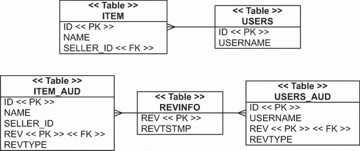

# 13 过滤数据

本章涵盖

+   级联状态转换

+   监听和拦截事件

+   使用 Hibernate Envers 进行审计和版本控制

+   动态过滤数据

在本章中，我们将分析许多不同的策略，用于在数据通过 Hibernate 引擎时进行*过滤*。当 Hibernate 从数据库加载数据时，我们可以通过过滤器透明地限制应用程序看到的数据。当 Hibernate 将数据存储在数据库中时，我们可以监听事件并执行辅助程序：例如，我们可以编写审计日志或将租户标识符分配给记录。

在本章的四个主要部分中，我们将探讨以下数据过滤功能和 API：

+   首先，您将学习如何对实体实例的状态变化做出反应，并将状态变化*级联*到相关实体。例如，当`User`被保存时，Hibernate 可以传递性和自动保存所有相关的`BillingDetails`。当`Item`被删除时，Hibernate 可以删除与该`Item`相关联的所有`Bid`实例。我们可以通过在实体关联和集合映射中使用特殊属性来启用此标准 JPA 功能。

+   Jakarta Persistence 标准包括生命周期*回调*和*事件监听器*。事件监听器是我们编写的具有特殊方法的类，当实体实例的状态发生变化时（例如，Hibernate 加载它或即将从数据库中删除它时），Hibernate 会调用这些方法。这些回调方法也可以在实体类上，并带有特殊注解。这为我们提供了一个在状态转换发生时执行自定义副作用的机会。Hibernate 还具有几个专有扩展点，允许在引擎内部较低级别拦截生命周期事件。

+   一个常见的副作用是编写*审计日志*；这样的日志通常包含有关更改的数据、何时进行更改以及谁进行了修改的信息。一个更复杂的审计系统可能需要存储多个数据版本和*时间视图*；例如，我们可能希望要求 Hibernate 加载数据“就像上周那样。”这是一个复杂的问题，我们将介绍 Hibernate Envers，这是一个专门用于 JPA 应用程序版本控制和审计的子项目。

+   最后，我们将检查*数据过滤器*，这些过滤器也作为专有 Hibernate API 提供。这些过滤器向 Hibernate 执行的 SQL `SELECT` 语句添加自定义限制。因此，我们可以在应用层有效地定义数据的自定义受限视图。例如，我们可以应用一个过滤器，限制按销售区域或其他授权标准加载的数据。

我们将从用于传递性状态变化的级联选项开始。

注意 要能够执行源代码中的示例，您首先需要运行 Ch13.sql 脚本。

## 13.1 级联状态转换

当实体实例的状态发生变化——例如从*临时*状态变为*持久*状态时——关联的实体实例也可能包含在这个状态转换中。这种状态转换的*级联*默认情况下是未启用的；每个实体实例都有独立的生命周期。但对于实体之间的某些关联，我们可能希望实现细粒度的生命周期依赖。

例如，在第 8.3 节中，我们创建了 `Item` 和 `Bid` 实体类之间的关联。在这种情况下，不仅当它们被添加到 `Item` 时，`Bid` 的出价会自动持久化，而且当拥有 `Item` 被删除时，它们也会自动删除。我们实际上使 `Bid` 成为一个依赖于另一个实体 `Item` 的实体类。

在那个关联映射中启用的级联设置是 `CascadeType .PERSIST` 和 `CascadeType.REMOVE`。我们还研究了特殊的 `orphanRemoval` 开关以及数据库级别（使用外键 `ON DELETE` 选项）的级联删除如何影响应用程序。

因此，我们在第八章中简要介绍了如何处理 *级联* 状态。在本节中，我们将分析一些其他较少使用的级联选项。

### 13.1.1 可用的级联选项

表 13.1 总结了 Hibernate 中可用的最重要的级联选项。注意每个选项是如何与 `EntityManager` 或 `Session` 操作相关联的。

表 13.1 实体关联映射的级联选项

| 选项 | 描述 |
| --- | --- |
| `CascadeType.PERSIST` | 当一个实体实例使用 `EntityManager #persist()` 存储时，在刷新时间任何关联的实体实例也会被设置为持久状态。 |
| `CascadeType.REMOVE` | 当一个实体实例使用 `EntityManager #remove()` 删除时，在刷新时间任何关联的实体实例也会被删除。 |
| `CascadeType.DETACH` | 当一个实体实例使用 `EntityManager#detach()` 从持久上下文中移除时，任何关联的实体实例也会被分离。 |
| `CascadeType.MERGE` | 当一个临时或分离的实体实例使用 `EntityManager#merge()` 合并到持久上下文时，任何关联的临时或分离的实体实例也会被合并。 |
| `CascadeType.REFRESH` | 当一个持久实体实例使用 `EntityManager#refresh()` 刷新时，任何关联的持久实体实例也会被刷新。 |
| `CascadeType.REPLICATE` | 当一个分离的实体实例使用 `Session#replicate()` 复制到数据库中时，任何关联的分离实体实例也会被复制。 |
| `CascadeType.ALL` | 这是一个简写，用于启用映射关联的所有级联选项。 |

在 `org.hibernate.annotations .CascadeType` 枚举中定义了更多的级联选项。然而，今天唯一有趣的选择是 `REPLICATE` 和 `Session#replicate()` 操作。所有其他 `Session` 操作都有在 `EntityManager` API 上的标准化等效或替代方案，因此我们可以忽略这些设置。

我们已经检查了 `PERSIST` 和 `REMOVE` 选项。让我们分析传递性分离、合并、刷新和复制。

### 13.1.2 传递性分离和合并

我们希望从数据库中检索 `Item` 和其 `bids` 并在分离状态下处理这些数据。`Bid` 类使用 `@ManyToOne` 映射这个关联。它与 `Item` 中的 `@OneToMany` 集合映射是双向的：

```
Path: Ch13/cascade/src/main/java/com/manning/javapersistence/ch13/filtering
➥ /cascade/Item.java

\1
public class Item {
    @OneToMany(
        mappedBy = "item",
        cascade = {CascadeType.DETACH, CascadeType.MERGE}
    )
    private Set<Bid> bids = new HashSet<>();
    //  . . .
}
```

传递性分离和合并通过 `DETACH` 和 `MERGE` 级联类型启用。现在我们可以加载 `Item` 并初始化其 `bids` 集合：

```
Path: Ch13/cascade/src/test/java/com/manning/javapersistence/ch13/filtering
➥ /Cascade.java

Item item = em.find(Item.class, ITEM_ID);
assertEquals(2, item.getBids().size());      Ⓐ
em.detach(item);                             Ⓑ
```

Ⓐ 访问 `item.getBids()` 初始化了 bids 集合（它是延迟初始化的）。

Ⓑ `EntityManager#detach()` 操作是级联的：它将 `Item` 实例以及集合中的所有 `bids` 从持久化上下文中清除。如果 `bids` 没有被加载，它们不会被分离。（当然，我们也可以关闭持久化上下文，从而有效地分离 *所有* 加载的实体实例。）

在分离状态下，我们可以更改 `Item#name`，创建一个新的 `Bid` 并将其与 `Item` 相关联：

```
Path: Ch13/cascade/src/test/java/com/manning/javapersistence/ch13/filtering
➥ /Cascade.java

item.setName("New Name");
Bid bid = new Bid(new BigDecimal("101.00"), item);
item.addBid(bid);
```

由于我们正在处理分离的实体状态和集合，我们必须特别注意身份和相等性。如第 10.3 节所述，我们应该在 `Bid` 实体类上重写 `equals()` 和 `hashCode()` 方法：

```
Path: Ch13/cascade/src/main/java/com/manning/javapersistence/ch13/filtering
➥ /cascade/Bid.java

@Entity
public class Bid {
    @Override
    public boolean equals(Object o) {
 if (this == o) return true;
 if (o instanceof Bid bid) {
              return Objects.equals(id, bid.id) &&
                     Objects.equals(amount, bid.amount) &&
                     Objects.equals(item, bid.item);
        }
        return false;
    }

    @Override
    public int hashCode() {
        return Objects.hash(id, amount, item);
    }
}
```

两个 `Bid` 实例在它们具有相同的 `id`、相同的 `amount` 以及与相同的 `Item` 相关联时是 *相等的*。

一旦我们在分离状态下完成修改，下一步就是存储更改。使用一个新的持久化上下文，我们可以合并分离的 `Item` 并让 Hibernate 检测更改。

使用 `merge` 方法，Hibernate 将合并一个分离实例。首先，它检查持久化上下文中是否已经包含具有给定标识符值的实体。如果没有，则从数据库中加载实体。Hibernate 足够智能，知道在合并过程中它还需要引用的实体，因此它会立即在同一 SQL 查询中获取它们。

当刷新持久化上下文时，Hibernate 检测实体在合并过程中是否有某些属性发生变化。引用的实体也可能被存储：

```
Path: Ch13/cascade/src/test/java/com/manning/javapersistence/ch13/filtering
➥ /Cascade.java

Item mergedItem = em.merge(item);             Ⓐ
// select i.*, b.*
//  from ITEM i
//    left outer join BID b on i.ID = b.ITEM_ID
//  where i.ID = ?
for (Bid b : mergedItem.getBids()) {          Ⓑ
    assertNotNull(b.getId());
}
em.flush();                                   Ⓒ
// update ITEM set NAME = ? where ID = ?
// insert into BID values (?, ?, ?,  . . . )
```

Ⓐ Hibernate 合并了分离的 `item`。没有具有给定标识符值的 `Item`，因此从数据库中加载了 `Item`。Hibernate 在合并过程中通过相同的 SQL 查询获取 `bids`。然后，Hibernate 将分离的 `item` 值复制到加载的实例中，并将其以持久状态返回给我们。相同的程序应用于每个 `Bid`，Hibernate 将检测到其中一个 `bids` 是新的。

Ⓑ 在合并过程中，Hibernate 使新的 `Bid` 持久化。现在它已经分配了一个标识符值。

Ⓒ 当我们刷新持久化上下文时，Hibernate 检测到在合并过程中 `Item` 的 `name` 发生了变化。新的 `Bid` 也将被存储。

使用集合进行级联合并是一个强大的功能；考虑如果没有 Hibernate，我们需要编写多少代码来实现这个功能。

合并时积极获取关联

在 13.1.2 节中的最后一个代码示例中，我们说 Hibernate 足够智能，能够在合并分离的`Item`时加载`Item#bids`集合。当关联启用了`CascadeType.MERGE`时，Hibernate 总是积极使用`JOIN`加载实体关联。在上述情况下，这是聪明的，因为`Item#bids`已经被初始化、分离并修改。当使用`JOIN`合并时，加载集合是必要且最优的，但如果我们将一个未初始化的`bids`集合或未初始化的`seller`代理的`Item`实例合并，Hibernate 将在合并时使用`JOIN`获取集合和代理。合并初始化返回的管理的`Item`上的这些关联。`CascadeType.MERGE`导致 Hibernate 忽略并有效地覆盖任何`FetchType.LAZY`映射（如 JPA 规范允许的）。

我们接下来的示例更为简单，允许级联刷新相关实体。

### 13.1.3 级联刷新

`User`实体类与`BillingDetails`存在一对一的关系：应用程序的每个用户可能有几张信用卡、银行账户等。如果您想查看`BillingDetails`类，请查看第七章中的映射。

我们可以将`User`和`BillingDetails`之间的关系映射为一个单向的一对多实体关联：

```
Path: Ch13/cascade/src/main/java/com/manning/javapersistence/ch13/filtering
➥ /cascade/User.java

@Entity
@Table(name = "USERS")
public class User {
    @OneToMany(cascade = {CascadeType.PERSIST, CascadeType.REFRESH})
    @JoinColumn(name = "USER_ID", nullable = false)
    private Set<BillingDetails> billingDetails = new HashSet<>();
    //  . . .
}
```

为此关联启用的级联选项是`PERSIST`和`REFRESH`。`PERSIST`选项简化了存储账单详情；当我们向已持久化的`User`集合中添加`BillingDetails`实例时，它们变得持久化。

`REFRESH`级联选项确保当我们重新加载`User`实例的状态时，Hibernate 也会刷新与`User`关联的每个`BillingDetails`实例的状态。例如，当我们`refresh()`管理的`User`实例时，Hibernate 会将操作级联到管理的`BillingDetails`，并使用 SQL `SELECT`刷新每个实例。如果这些实例中没有任何一个留在数据库中，Hibernate 将抛出`EntityNotFoundException`。然后，Hibernate 刷新`User`实例，并积极加载整个`billingDetails`集合以发现任何新的`BillingDetails`：

```
Path: Ch13/cascade/src/test/java/com/manning/javapersistence/ch13/filtering
➥ /Cascade.java

User user = em.find(User.class, USER_ID);                      Ⓐ
assertEquals(2, user.getBillingDetails().size());              Ⓑ
for (BillingDetails bd : user.getBillingDetails()) {
    assertEquals("John Doe", bd.getOwner());
}
// Someone modifies the billing information in the database!
em.refresh(user);                                              Ⓒ
// select * from CREDITCARD join BILLINGDETAILS where ID = ?
// select * from BANKACCOUNT join BILLINGDETAILS where ID = ?
// select * from USERS
//  left outer join BILLINGDETAILS
//  left outer join CREDITCARD
//  left outer JOIN BANKACCOUNT
// where ID = ?
for (BillingDetails bd : user.getBillingDetails()) {
    assertEquals("Doe John", bd.getOwner());
}
```

Ⓐ 从数据库中加载`User`实例。

Ⓑ 当我们遍历元素或调用`size()`时，它的懒加载`billingDetails`集合会被初始化。

Ⓒ 当我们`refresh()`管理的`User`实例时，Hibernate 会将操作级联到管理的`BillingDetails`，并使用 SQL `SELECT`刷新每个实例。

这是一个 Hibernate 不够聪明的例子。首先，它为持久化上下文中每个由集合引用的 `BillingDetails` 实例执行一个 SQL `SELECT`。然后它再次加载整个集合以查找任何添加的 `BillingDetails`。Hibernate 显然可以用一个 `SELECT` 来完成这个操作。

我们希望在另一个事务修改记录后刷新记录，因此我们必须记住 MySQL 的默认事务隔离级别是 `REPEATABLE_READ`，而大多数其他数据库是 `READ_COMMITTED`。我们启动了一个事务，然后启动了第二个事务，在第一个事务执行刷新操作之前，第二个事务提交了其更改。为了使第一个事务能够看到第二个事务的更改，我们需要更改 JDBC 驱动程序上的隔离级别。这就是为什么我们提供了以下配置 URL：

```
Path: Ch13/cascade/src/main/resources/META-INF/persistence.xml

<property name="javax.persistence.jdbc.url"
value="jdbc:mysql://localhost:3306/CH13_CASCADE? 
➥ sessionVariables=transaction_isolation=
➥ 'READ-COMMITTED'&amp;serverTimezone=UTC"/>
```

由于更改仅限于配置级别，只要 `persistence.xml` 文件包含正确的配置，代码将继续在不同的数据库上正确工作。

最后的级联选项是针对仅 Hibernate 的 `replicate()` 操作。

### 13.1.4 级联复制

我们在 10.2.7 节中首先检查了复制。这个非标准操作在 Hibernate `Session` API 中可用。其主要用例是将数据从一个数据库复制到另一个数据库。

考虑 `Item` 和 `User` 之间的多对一实体关联映射：

```
Path: Ch13/cascade/src/main/java/com/manning/javapersistence/ch13/filtering
➥ /cascade/Item.java

@Entity
public class Item {
    @ManyToOne(fetch = FetchType.LAZY)
    @JoinColumn(name = "SELLER_ID", nullable = false)
    @org.hibernate.annotations.Cascade(
        org.hibernate.annotations.CascadeType.REPLICATE
    )
    private User seller;
    //  . . .
}
```

在这里，我们使用 Hibernate 注解启用 `REPLICATE` 级联选项。接下来，我们将从源数据库加载 `Item` 和其 `seller`：

```
Path: Ch13/cascade/src/test/java/com/manning/javapersistence/ch13/filtering
➥ /Cascade.java

em = emf.createEntityManager();
em.getTransaction().begin();
Item item = em.find(Item.class, ITEM_ID);
assertNotNull(item.getSeller().getUsername());    Ⓐ
em.getTransaction().commit();
em.close();
```

Ⓐ 懒加载 `Item#seller`。

在我们关闭持久化上下文后，`Item` 和 `User` 实体实例处于分离状态。接下来，我们连接到数据库并写入分离的数据：

```
Path: Ch13/cascade/src/test/java/com/manning/javapersistence/ch13/filtering
➥ /Cascade.java

EntityManager otherDatabase = //  . . .  get EntityManager
otherDatabase.getTransaction().begin();
otherDatabase.unwrap(Session.class)
    .replicate(item, ReplicationMode.OVERWRITE);
// select ID from ITEM where ID = ?
// select ID from USERS where ID = ?
otherDatabase.getTransaction().commit();
// update ITEM set NAME = ?, SELLER_ID = ?,  . . .  where ID = ?
// update USERS set USERNAME = ?,  . . .  where ID = ?
otherDatabase.close();
```

当我们在分离的 `Item` 上调用 `replicate()` 时，Hibernate 执行 SQL `SELECT` 语句以确定 `Item` 和其 `seller` 是否已经在数据库中存在。然后，在提交时，当持久化上下文被刷新，Hibernate 将 `Item` 和 `seller` 的值写入目标数据库。在先前的例子中，这些行已经存在，因此我们会看到每个的 `UPDATE` 操作，覆盖数据库中的值。如果目标数据库不包含 `Item` 或 `User`，则进行两个 `INSERT` 操作。

## 13.2 监听和拦截事件

在本节中，我们将分析 JPA 和 Hibernate 中可用的三个不同的自定义事件监听器和持久化生命周期拦截器的 API。它们允许我们做几件事情：

+   使用标准的 JPA 生命周期回调方法和事件监听器。

+   编写一个专有的 `org.hibernate.Interceptor` 并在 `Session` 上激活它。

+   使用 Hibernate 核心引擎的扩展点与 `org.hibernate.event` 服务提供程序接口（SPI）。

让我们从标准的 JPA 回调开始。它们提供了对持久化、加载和删除生命周期事件的简单访问。

### 13.2.1 JPA 事件监听器和回调

假设我们想在存储新的实体实例时记录一条消息。实体监听器类必须有一个隐式或显式的无参数公共构造函数。它不需要实现任何特殊接口。实体监听器是无状态的；JPA 引擎会自动创建和销毁它。这意味着当我们需要更多上下文信息时可能会很困难，但我们将演示一些可能性。

首先，我们将编写一个生命周期事件监听器，其中包含一个带有`@PostPersist`注解的回调方法，如下所示。我们可以将实体监听器类的任何方法注解为持久化生命周期事件的回调方法。

列表 13.1 当实体实例被存储时通知管理员

```
Path: Ch13/callback/src/main/java/com/manning/javapersistence/ch13
➥ /filtering/callback/PersistEntityListener.java

public class PersistEntityListener {
    @PostPersist                                            Ⓐ
    public void logMessage(Object entityInstance) {
        User currentUser = CurrentUser.INSTANCE.get();      Ⓑ
        Log log = Log.INSTANCE;
        log.save(
            "Entity instance persisted by "
                + currentUser.getUsername()
                + ": "
                + entityInstance
        );
    }
}
```

Ⓐ 带有`@PostPersist`注解的`logMessage()`方法，在新的实体实例存储到数据库后会被调用。

Ⓑ 我们需要当前登录用户的上下文信息和访问日志信息。一个原始的解决方案是使用线程局部变量和单例；`CurrentUser`和`Log`的来源在示例代码中。

实体监听器类的回调方法有一个单一的`Object`参数：参与状态变化的实体实例。如果我们只为特定实体类型启用回调，我们可以声明该参数为该特定类型。回调方法可以有任何类型的访问权限；它不必是公开的。它不能是静态的或最终的，并且不返回任何值。如果回调方法抛出未检查的`RuntimeException`，Hibernate 将中止操作并将当前事务标记为回滚。如果回调方法声明并抛出检查的`Exception`，Hibernate 将将其包装并作为`RuntimeException`处理。

我们只能在实体监听器类中使用每个回调注解一次；也就是说，只能有一个方法被注解为`@PostPersist`。表 13.2 总结了所有可用的回调注解。

表 13.2 生命周期回调注解

| 注解 | 描述 |
| --- | --- |
| `@PostLoad` | 在实体实例被加载到持久化上下文之后触发，无论是通过标识符查找、通过导航和代理/集合初始化，还是通过查询。在刷新已持久化的实例后也会触发。 |
| `@PrePersist` | 在对实体实例调用`persist()`时立即调用。如果实体被发现为瞬态，并且在瞬态状态被复制到持久实例之后调用`merge()`，也会调用。如果我们启用了`CascadeType.PERSIST`，也会为关联实体调用。 |
| `@PostPersist` | 在执行使实体实例持久化的数据库操作并分配标识符值之后调用。这可能是在调用`persist()`或`merge()`时，或者在持久化上下文刷新时（如果标识符生成器是预插入的，见第 5.2.5 节）。如果启用了`CascadeType.PERSIST`，也会为关联实体调用。 |
| `@PreUpdate`, `@PostUpdate` | 在持久化上下文与数据库同步之前和之后执行；即，在刷新之前和之后。仅在实体状态需要同步时触发（例如，因为它被认为是脏的）。 |
| `@PreRemove`, `@PostRemove` | 在调用`remove()`或实体实例通过级联被移除时触发，以及在持久化上下文刷新后数据库中记录的删除操作之后。 |

实体监听器类必须对任何我们想要拦截的实体启用，例如这个`Item`：

```
Path: Ch13/callback/src/main/java/com/manning/javapersistence/ch13
➥ /filtering/callback/Item.java

@Entity
@EntityListeners(
    PersistEntityListener.class
)
public class Item {
    //  . . .
}
```

`@EntityListeners`注解接受一个监听器类数组，如果我们有多个拦截器。如果有多个监听器为同一事件定义了回调方法，Hibernate 将按声明的顺序调用监听器。

我们不需要编写一个单独的实体监听器类来拦截生命周期事件。例如，我们可以在`User`实体类上实现`logMessage()`方法：

```
Path: Ch13/callback/src/main/java/com/manning/javapersistence/ch13
➥ /filtering/callback/User.java

@Entity
@Table(name = "USERS")
public class User {
    @PostPersist
    public void logMessage(){
        User currentUser = CurrentUser.INSTANCE.get();
        Log log = Log.INSTANCE;
        log.save(
                                "Entity instance persisted by "
                + currentUser.getUsername()
                + ": "
                + this
        );
    }
    //  . . .
}
```

注意，实体类上的回调方法没有任何参数：参与状态变化的“当前”实体是`this`。在单个类中不允许对同一事件进行重复回调，但我们可以通过多个监听器类或监听器和实体类中的回调方法来拦截同一事件。

我们还可以为整个层次结构中的实体超类添加回调方法。如果我们想禁用特定实体子类的超类回调，我们可以用`@ExcludeSuperclassListeners`注解该子类。如果我们想禁用特定实体的默认实体监听器，我们可以用`@ExcludeDefaultListeners`注解标记它：

```
Path: Ch13/callback/src/main/java/com/manning/javapersistence/ch13
➥ /filtering/callback/User.java

@Entity
@Table(name = "USERS")
@ExcludeDefaultListeners
public class User {
    //  . . .
}
```

JPA 事件监听器和回调提供了一个基本的框架，用于使用我们自己的程序来响应生命周期事件。Hibernate 还有一个更细粒度和更强大的替代 API：`org.hibernate.Interceptor`。

### 13.2.2 实现 Hibernate 拦截器

假设我们想在单独的数据库表中记录数据修改的审计日志。例如，我们可能想记录每个`Item`的创建和更新事件的信息。审计日志包括用户、事件的时间和日期、发生的事件类型以及被更改的`Item`的标识符。

审计日志通常使用数据库触发器来处理。另一方面，有时让应用程序负责会更好，特别是如果需要在不同的数据库之间进行移植时。

我们需要几个元素来实现审计日志。首先，我们必须标记我们想要启用审计日志的实体类。接下来，我们定义要记录的信息，例如用户、日期、时间和修改类型。最后，我们将所有这些通过一个自动创建审计跟踪的`org.hibernate.Interceptor`结合起来。

首先，我们将创建一个标记接口，`Auditable`：

```
Path: Ch13/interceptor/src/main/java/com/manning/javapersistence/ch13
➥ /filtering/interceptor/Auditable.java

public interface Auditable {
    Long getId();
}
```

此接口要求持久化实体类通过 getter 方法公开其标识符；我们需要这个属性来记录审计跟踪。为特定的持久化类启用审计日志记录是微不足道的。我们将它添加到类声明中，例如对于`Item`：

```
Path: /model/src/main/java/org/jpwh/model/filtering/interceptor/Item.java

@Entity
public class Item implements Auditable {
    //  . . .
}
```

现在我们可以创建一个新的持久化实体类，`AuditLogRecord`，其中包含我们想要在审计数据库表中记录的信息：

```
Path: Ch13/interceptor/src/main/java/com/manning/javapersistence/ch13
➥ /filtering/interceptor/AuditLogRecord.java

@Entity
public class AuditLogRecord {
    @Id
    @GeneratedValue(generator = Constants.ID_GENERATOR)
    private Long id;
    @NotNull
    private String message;
    @NotNull
    private Long entityId;
    @NotNull
    private Class<? extends Auditable> entityClass;
    @NotNull
    private Long userId;
    @NotNull
    private LocalDateTime createdOn = LocalDateTime.now();
    //  . . .
}
```

我们希望在 Hibernate 在数据库中插入或更新`Item`时存储`AuditLogRecord`的实例。Hibernate 拦截器可以自动处理此操作。我们不需要在`org.hibernate.Interceptor`中实现所有方法，而是扩展`EmptyInterceptor`并仅覆盖我们需要的那些方法，如列表 13.2 所示。我们需要访问数据库来写入审计日志，因此拦截器需要一个 Hibernate `Session`。

我们还希望在每条审计日志记录中存储当前登录用户的标识符。我们将声明的`inserts`和`updates`实例变量将是这个拦截器存储其内部状态集合的地方。

列表 13.2 Hibernate 拦截器记录修改事件

```
Path: Ch13/interceptor/src/test/java/com/manning/javapersistence/ch13
➥ /filtering/AuditLogInterceptor.java

public class AuditLogInterceptor extends EmptyInterceptor {
    private Session currentSession;
    private Long currentUserId;
    private Set<Auditable> inserts = new HashSet<>();
    private Set<Auditable> updates = new HashSet<>();
    public void setCurrentSession(Session session) {
        this.currentSession = session;
    }
    public void setCurrentUserId(Long currentUserId) {
        this.currentUserId = currentUserId;
    }
    public boolean onSave(Object entity, Serializable id,             Ⓐ
                            Object[] state, String[] propertyNames,
                            Type[] types)
        throws CallbackException {
        if (entity instanceof Auditable aud) {
            inserts.add(aud);
        }
        return false;                                                 Ⓑ
    }
    public boolean onFlushDirty(Object entity, Serializable id,       Ⓒ
                               Object[] currentState,
                               Object[] previousState,
                               String[] propertyNames, Type[] types)
        throws CallbackException {
        if (entity instanceof Auditable aud) {
            updates.add(aud);
        }
        return false;                                                 Ⓓ
    }
    //  . . .
}
```

Ⓐ 当实体实例被持久化时，将调用此方法。

Ⓑ 状态没有被修改。

Ⓒ 当在持久化上下文刷新期间检测到实体实例为脏时，将调用此方法。

Ⓓ 当前状态`currentState`没有被修改。

拦截器收集`inserts`和`updates`中的修改`Auditable`实例。请注意，在`onSave()`中，可能没有分配标识符值给给定的实体实例。Hibernate 保证在刷新期间设置实体标识符，因此实际的审计日志轨迹是在`postFlush()`回调中编写的，该回调在列表 13.2 中没有显示。此方法在持久化上下文刷新完成后被调用。

现在，我们将编写我们之前收集的所有插入和更新的审计日志记录：

```
Path: Ch13/interceptor/src/test/java/com/manning/javapersistence/ch13
➥ /filtering/AuditLogInterceptor.java

public class AuditLogInterceptor extends EmptyInterceptor {
    //  . . .
    public void postFlush(@SuppressWarnings("rawtypes") Iterator iterator) 
    ➥ throws CallbackException {
        Session tempSession =                              Ⓐ
            currentSession.sessionWithOptions()
                .connection()
                .openSession();
        try {
            for (Auditable entity : inserts) {             Ⓑ
                tempSession.persist(
                    new AuditLogRecord("insert", entity, currentUserId)
                );
            }
            for (Auditable entity : updates) {
                tempSession.persist(
                    new AuditLogRecord("update", entity, currentUserId)
                );
            }
            tempSession.flush();                           Ⓒ
        } finally {
            tempSession.close();
            inserts.clear();
            updates.clear();
        }
    }
}
```

Ⓐ 我们无法访问原始持久化上下文——当前执行此拦截器的`Session`。在拦截器调用期间，`Session`处于脆弱状态。Hibernate 允许我们使用`sessionWithOptions()`方法创建一个新的`Session`，该`Session`从原始`Session`继承一些信息。新的临时`Session`与原始`Session`使用相同的事务和数据库连接。

Ⓑ 我们使用临时`Session`为每个插入和更新存储一个新的`AuditLogRecord`。

Ⓒ 我们独立于原始`Session`刷新和关闭临时`Session`。

我们现在可以启用此拦截器：

```
Path: Ch13/interceptor/src/test/java/com/manning/javapersistence/ch13
➥ /filtering/AuditLogging.java

EntityManager em = emf.createEntityManager();
SessionFactory sessionFactory = emf.unwrap(SessionFactory.class);
Session session = sessionFactory.withOptions().
        interceptor(new AuditLogInterceptor()).openSession();
```

启用默认拦截器

如果我们想要为任何`EntityManager`默认启用拦截器，我们可以将`hibernate.ejb.interceptor`属性在 persistence.xml 中设置为一个实现`org.hibernate.Interceptor`的类。请注意，与会话作用域的拦截器不同，Hibernate 共享这个默认拦截器，因此它必须是线程安全的！示例`AuditLogInterceptor`不是线程安全的。

现在，这个`Session`已经启用了`AuditLogInterceptor`，但拦截器还必须配置为当前的`Session`和登录用户标识符。这涉及到一些类型转换以访问 Hibernate API：

```
Path: Ch13/interceptor/src/test/java/com/manning/javapersistence/ch13
➥ /filtering/AuditLogging.java

AuditLogInterceptor interceptor =
    (AuditLogInterceptor) ((SessionImplementor) session).getInterceptor();
interceptor.setCurrentSession(session);
interceptor.setCurrentUserId(CURRENT_USER_ID);
```

现在`Session`已经准备好使用，并且每次我们使用它存储或修改`Item`实例时，都会写入一个审计跟踪。

Hibernate 拦截器是灵活的，并且与 JPA 事件监听器和回调方法不同，当事件发生时，我们能够访问更多上下文信息。话虽如此，Hibernate 允许我们通过其基于可扩展事件系统的核心事件系统进一步深入。

### 13.2.3 核心事件系统

Hibernate 的核心引擎基于事件和监听器的模型。例如，如果 Hibernate 需要保存一个实体实例，它会触发一个事件。任何监听此类事件的人都可以捕获它并处理数据的保存。因此，Hibernate 通过一组默认监听器实现了其所有核心功能，这些监听器可以处理所有 Hibernate 事件。

Hibernate 的设计是开放的：我们可以为 Hibernate 事件编写和启用自己的监听器。我们可以替换现有的默认监听器或扩展它们以执行副作用或附加程序。替换事件监听器是罕见的；这样做意味着我们的监听器实现可以处理 Hibernate 的核心功能的一部分。

实质上，`Session`接口（及其更窄的表亲`EntityManager`）的所有方法都与一个事件相关联。`find()`和`load()`方法触发一个`LoadEvent`，默认情况下，此事件由`DefaultLoadEventListener`处理。

自定义监听器应实现它想要处理的事件的适当接口，并/或扩展 Hibernate 提供的便利基类之一，或任何默认事件监听器。以下是一个自定义加载事件监听器的示例。

列表 13.3 自定义加载事件监听器

```
Path: Ch13/interceptor/src/test/java/com/manning/javapersistence/ch13
➥ /filtering/SecurityLoadListener.java

public class SecurityLoadListener extends DefaultLoadEventListener {
    public void onLoad(LoadEvent event, LoadType loadType)
        throws HibernateException {
        boolean authorized =
            MySecurity.isAuthorized(
                event.getEntityClassName(), event.getEntityId()
            );
        if (!authorized) {
            throw new MySecurityException("Unauthorized access");
        }
        super.onLoad(event, loadType);
    }
}
```

此监听器执行自定义授权代码。应将监听器视为一个单例，这意味着它在持久化上下文中是共享的，因此不应将任何与事务相关的状态作为实例变量保存。有关原生 Hibernate 中所有事件和监听器接口的列表，请参阅`org.hibernate.event`包的 API Javadoc。

我们在 persistence.xml 中为每个核心事件启用了监听器：

```
Path: Ch13/interceptor/src/main/resources/META-INF/persistence.xml

<properties>
    // . . .
    <property name="hibernate.ejb.event.load" value=
      "com.manning.javapersistence.ch13.filtering.SecurityLoadListener"/>
</properties>
```

配置设置的属性名始终以`hibernate.ejb.event`开头，后面跟着我们想要监听的事件类型。您可以在`org.hibernate.event.spi.EventType`中找到所有事件类型的列表。属性的值可以是一个以逗号分隔的监听器类名列表；Hibernate 将按指定顺序调用每个监听器。

我们很少需要扩展 Hibernate 核心事件系统以添加自己的功能。大多数时候，`org.hibernate.Interceptor`足够灵活。然而，拥有更多选项并且能够以模块化方式替换 Hibernate 核心引擎的任何部分是有帮助的。

在上一节中我们展示的审计日志实现非常简单。如果我们需要为审计记录更多信息，例如实体的实际更改属性值，我们会考虑使用 Hibernate Envers。

## 13.3 使用 Hibernate Envers 进行审计和版本控制

Envers 是 Hibernate 套件中的一个项目，专注于审计日志和保留数据库中的多个数据版本。这与你可能已经熟悉的版本控制系统类似，例如 Subversion 和 Git。

启用 Envers 后，当我们向应用程序的主要表中添加、修改或删除数据时，数据的一个副本将自动存储在单独的数据库表中。Envers 内部使用你在上一节中看到的 Hibernate 事件 SPI。Envers 监听 Hibernate 事件，当 Hibernate 在数据库中存储更改时，Envers 会创建数据的一个副本并在其自己的表中记录一个修订。

Envers 将所有数据修改分组在一个工作单元中——即在一个事务中——作为一个带有修订号的更改集。我们可以使用 Envers API 编写查询以检索历史数据，给定一个修订号或时间戳；例如，“找到上周五所有的`Item`实例。”

一旦你在你的应用程序中启用了 Envers，你将能够轻松地与之工作，因为它基于注解。它将为你提供在数据库中轻松保留多个数据版本的选择，而你几乎不需要做任何工作。权衡是它将创建大量的额外表（但你将能够控制你想要审计的表）。

### 13.3.1 启用审计日志

一旦我们将 Envers 的 JAR 文件放在类路径上（我们将将其作为 Maven 依赖项包含），Envers 就可以无需进一步配置即可使用。我们可以通过`@org.hibernate.envers.Audited`注解有选择地为一个实体类启用审计日志。

列表 13.4 启用`Item`实体的审计日志

```
Path: Ch13/envers/src/main/java/com/manning/javapersistence/ch13
➥ /filtering/envers/Item.java

@Entity
@org.hibernate.envers.Audited
public class Item {
    @NotNull
    private String name;
    @OneToMany(mappedBy = "item")
    @org.hibernate.envers.NotAudited
    private Set<Bid> bids = new HashSet<>();
    @ManyToOne(fetch = FetchType.LAZY)
    @JoinColumn(name = "SELLER_ID", nullable = false)
    private User seller;
    //  . . .
}
```

我们现在已为`Item`实例及其所有属性启用了审计日志。要禁用特定属性的审计日志，我们可以用`@NotAudited`注解它。在这种情况下，Envers 忽略`bids`但审计`seller`。我们还需要在`User`类上启用`@Audited`以启用审计。

Hibernate 现在将生成（或期望）额外的数据库表来存储每个`Item`和`User`的历史数据。图 13.1 显示了这些表的架构。



图 13.1 `Item`和`User`实体的审计日志表

`ITEM_AUD`和`USERS_AUD`表是存储`Item`和`User`实例修改历史的地方。当我们修改数据并提交事务时，Hibernate 会在`REVINFO`表中插入一个新的版本号和时间戳。然后，对于每个更改集中涉及的修改和审计的实体实例，其数据的一个副本将存储在审计表中。版本号列上的外键将更改集链接在一起。`REVTYPE`列包含更改的类型：实体实例在事务中是插入、更新还是删除。Envers 永远不会自动删除任何版本信息或历史数据；即使我们在`remove()`一个`Item`实例之后，我们仍然可以在`ITEM_AUD`中找到其之前的版本。

让我们运行一些事务来看看这是如何工作的。

### 13.3.2 创建审计跟踪

在以下代码示例中，我们将查看涉及`Item`及其`seller`（卖家）、`User`的几个事务。我们将创建并存储一个`Item`和一个`User`，然后修改这两个实例，最后删除`Item`。

你应该已经熟悉这段代码。当我们使用`EntityManager`工作时，Envers 会自动创建审计跟踪：

```
Path: Ch13/envers/src/test/java/com/manning/javapersistence/ch13/filtering
➥ /Envers.java

EntityManager em = emf.createEntityManager();
em.getTransaction().begin();
User user = new User("johndoe");
em.persist(user);
Item item = new Item("Foo", user);
em.persist(item);
em.getTransaction().commit();
em.close();

Path: Ch13/envers/src/test/java/com/manning/javapersistence/ch13/filtering
➥ /Envers.java

EntityManager em = emf.createEntityManager();
em.getTransaction().begin();
Item item = em.find(Item.class, ITEM_ID);
item.setName("Bar");
item.getSeller().setUsername("doejohn");
em.getTransaction().commit();
em.close();

Path: Ch13/envers/src/test/java/com/manning/javapersistence/ch13/filtering
➥ /Envers.java

EntityManager em = emf.createEntityManager();
em.getTransaction().begin();
EntityManager em = JPA.createEntityManager();
Item item = em.find(Item.class, ITEM_ID);
em.remove(item);
em.getTransaction().commit();
em.close();
```

Envers 通过记录三个更改集来透明地写入此事务序列的审计跟踪。为了访问这些历史数据，我们首先必须获取表示我们想要访问的更改集的版本号。

### 13.3.3 查找版本

使用 Envers 的`AuditReader` API，我们可以找到每个更改集的版本号。主要的 Envers API 是`AuditReader`。它可以通过`EntityManager`访问。给定一个时间戳，我们可以找到在该时间戳之前或在该时间戳上做出的更改集的版本号。如果我们没有时间戳，我们可以获取所有涉及特定审计实体实例的版本号。

列表 13.5 获取更改集的版本号

```
Path: Ch13/envers/src/test/java/com/manning/javapersistence/ch13/filtering
➥ /Envers.java

AuditReader auditReader = AuditReaderFactory.get(em);                      Ⓐ
Number revisionCreate =                                                    Ⓑ
            auditReader.getRevisionNumberForDate(TIMESTAMP_CREATE);
Number revisionUpdate =
        auditReader.getRevisionNumberForDate(TIMESTAMP_UPDATE);
Number revisionDelete  =
     auditReader.getRevisionNumberForDate(TIMESTAMP_DELETE);
List<Number> itemRevisions =
      auditReader.getRevisions(Item.class, ITEM_ID);                       Ⓒ
assertEquals(3, itemRevisions.size());
for (Number itemRevision : itemRevisions) {
  Date itemRevisionTimestamp = auditReader.getRevisionDate(itemRevision);  Ⓓ
  //  . . .
}
List<Number> userRevisions =
      auditReader.getRevisions(User.class, USER_ID);                       Ⓔ
assertEquals(2, userRevisions.size());
```

Ⓐ 访问 Envers 的`AuditReader` API。

Ⓑ 查找在给定时间戳之前或在该时间戳上做出的更改集的版本号。

Ⓒ 如果没有时间戳，此操作将找到所有给定`Item`被创建、修改或删除的更改集。在我们的例子中，我们创建了`Item`，然后修改了它，最后删除了它。因此，我们有三个版本。

Ⓓ 如果我们有版本号，我们可以获取 Envers 记录更改集时的日志时间戳。

Ⓔ 我们创建并修改了`User`，因此有两个版本。

在列表 13.5 中，我们假设我们要么知道事务的（近似）时间戳，要么有实体标识值，这样我们就可以获取其版本。如果我们两者都没有，我们可能想通过查询探索审计日志。如果我们必须在应用程序的用户界面中显示所有更改集的列表，这也很有用。

以下代码发现`Item`实体类的所有版本，并加载每个`Item`版本和该更改集的审计日志信息：

```
Path: Ch13/envers/src/test/java/com/manning/javapersistence/ch13/filtering
➥ /Envers.java

AuditQuery query = auditReader.createQuery()                             Ⓐ
    .forRevisionsOfEntity(Item.class, false, false);
@SuppressWarnings("unchecked")
List<Object[]> result = query.getResultList();                           Ⓑ
for (Object[] tuple : result) {
    Item item = (Item) tuple[0];                                         Ⓒ
    DefaultRevisionEntity revision = (DefaultRevisionEntity)tuple[1];
    RevisionType revisionType = (RevisionType)tuple[2];
    if (revision.getId() == 1) {                                         Ⓓ
        assertEquals(RevisionType.ADD, revisionType);
        assertEquals("Foo", item.getName());
    } else if (revision.getId() == 2) {
        assertEquals(RevisionType.MOD, revisionType);
        assertEquals("Bar", item.getName());
    } else if (revision.getId() == 3) {
        assertEquals(RevisionType.DEL, revisionType);
        assertNull(item);
    }
}
```

Ⓐ 如果我们不知道修改时间戳或修订版本号，我们可以使用`forRevisionsOfEntity()`编写查询以获取特定实体的所有审计跟踪详情。

Ⓑ 此查询以`List`的`Object[]`形式返回审计跟踪详情。

Ⓒ 每个结果元组包含特定修订版本的实体实例、修订详细信息（包括修订版本号和时间戳），以及修订类型。

Ⓓ 修订类型指示 Envers 创建修订版本的原因——实体实例是否在数据库中插入、修改或删除。

修订版本号是顺序递增的；较高的修订版本号总是实体实例的较新版本。我们现在在审计跟踪中有三个更改集的修订版本号，这使我们能够访问历史数据。

### 13.3.4 访问历史数据

使用修订版本号，我们可以访问`项目`及其`卖家`的不同版本。

列表 13.6 加载实体实例的历史版本

```
Path: Ch13/envers/src/test/java/com/manning/javapersistence/ch13/filtering
➥ /Envers.java

Item item = auditReader.find(Item.class, ITEM_ID, revisionCreate);   Ⓐ
assertEquals("Foo", item.getName());
assertEquals("johndoe", item.getSeller().getUsername());
Item modifiedItem = auditReader.find(Item.class,                     Ⓑ
        ITEM_ID, revisionUpdate);
assertEquals("Bar", modifiedItem.getName());
assertEquals("doejohn", modifiedItem.getSeller().getUsername());
Item deletedItem = auditReader.find(Item.class,                      Ⓒ
        ITEM_ID, revisionDelete);
assertNull(deletedItem);
User user = auditReader.find(User.class,                             Ⓓ
        USER_ID, revisionDelete);
assertEquals("doejohn", user.getUsername());
```

Ⓐ 给定一个修订版本，`find()`方法返回一个经过审计的实体实例版本，此操作加载了创建后的`项目`。

Ⓑ 此更改集的`卖家`也会自动检索。

Ⓒ 在此修订版本中，`项目`已被删除，因此`find()`返回`null`。

Ⓓ 示例中在此修订版本中没有修改`用户`，因此 Envers 返回其最接近的历史修订版本。

`AuditReader#find()`操作仅检索单个实体实例，类似于`EntityManager#find()`。但返回的实体实例**不是**持久状态：持久上下文不管理它们。如果我们修改`项目`的旧版本，Hibernate 不会更新数据库。请将`AuditReader` API 返回的实体实例视为分离的或只读的。

`AuditReader`还有一个用于执行任意查询的 API，类似于原生 Hibernate `Criteria` API。

列表 13.7 查询历史实体实例

```
Path: Ch13/envers/src/test/java/com/manning/javapersistence/ch13/filtering
➥ /Envers.java

AuditQuery query = auditReader.createQuery()                            Ⓐ
    .forEntitiesAtRevision(Item.class, revisionUpdate);
query.add(AuditEntity.property("name").like("Ba", MatchMode.START));    Ⓑ
query.add(AuditEntity.relatedId("seller").eq(USER_ID));                 Ⓒ
query.addOrder(AuditEntity.property("name").desc());                    Ⓓ
query.setFirstResult(0);                                                Ⓔ
query.setMaxResults(10);
assertEquals(1, query.getResultList().size());
Item result = (Item)query.getResultList().get(0);
assertEquals("doejohn", result.getSeller().getUsername());
```

Ⓐ 此查询返回受特定修订版本和更改集限制的`项目`实例。

Ⓑ 我们可以进一步限制查询；这里`项目#名称`必须以“Ba”开头。

Ⓒ 限制可以包括实体关联；例如，我们正在寻找由特定`用户`销售的`项目`的修订版本。

Ⓓ 我们可以排序查询结果。

Ⓔ 我们可以分页浏览大量结果。

Envers 支持投影。以下查询仅检索特定版本的`项目#名称`：

```
Path: Ch13/envers/src/test/java/com/manning/javapersistence/ch13/filtering
➥ /Envers.java

AuditQuery query = auditReader.createQuery()
    .forEntitiesAtRevision(Item.class, revisionUpdate);
query.addProjection(AuditEntity.property("name"));
assertEquals(1, query.getResultList().size());
String result = (String)query.getSingleResult();
assertEquals("Bar", result);
```

最后，我们可能希望将实体实例回滚到较旧版本。这可以通过`Session#replicate()`操作和覆盖现有行来完成。以下示例从第一个更改集加载`用户`实例，然后使用较旧版本覆盖数据库中的当前`用户`：

```
Path: Ch13/envers/src/test/java/com/manning/javapersistence/ch13/filtering
➥ /Envers.java

User user = auditReader.find(User.class, USER_ID, revisionCreate);
em.unwrap(Session.class)
    .replicate(user, ReplicationMode.OVERWRITE);
em.flush();
em.clear();
user = em.find(User.class, USER_ID);
assertEquals("johndoe", user.getUsername());
```

Envers 还会跟踪此更改作为审计日志中的更新；这只是`用户`实例的另一个新修订版本。

时间数据是一个复杂的话题，我们鼓励您阅读 Envers 参考文档以获取更多信息。向审计日志添加详细信息，例如更改的用户，并不困难。文档还展示了如何配置不同的跟踪策略和自定义 Envers 使用的数据库模式。

接下来，假设你不想看到数据库中的所有数据。例如，当前登录的应用程序用户可能没有查看所有内容的权限。通常，我们会在查询中添加一个条件并动态地限制结果。但是，如果我们必须处理像安全这样的问题，这会变得很困难，因为我们必须定制应用程序中的大多数查询。我们可以使用 Hibernate 的动态数据过滤器来集中和隔离这些限制。

## 13.4 动态数据过滤器

动态数据过滤的第一个用例与数据安全相关。CaveatEmptor 中的`User`可能有一个`ranking`属性，它是一个简单的整数：

```
Path: /model/src/main/java/org/jpwh/model/filtering/dynamic/User.java

@Entity
@Table(name = "USERS")
public class User {
    @NotNull
    private int ranking = 0;
    //  . . .
}
```

现在假设用户只能对其他用户提供的具有相同或更低排名的物品进行竞标。从商业角度来说，我们可能有几个由任意排名（一个数字）定义的用户组，并且用户只能与具有相同或更低排名的人进行交易。

为了实现这一要求，我们必须定制所有从数据库加载`Item`实例的查询。我们需要检查我们想要加载的`Item#seller`是否与当前登录用户的排名相同或更低。Hibernate 可以用动态过滤器为我们完成这项工作。

### 13.4.1 定义动态过滤器

首先，我们将定义一个具有名称和它接受的动态运行时参数的过滤器。我们可以将此定义的 Hibernate 注解放置在我们的领域模型中的任何实体类上或`package-info.java`元数据文件中：

```
Path: Ch13/dynamic/src/main/java/com/manning/javapersistence/ch13/filtering
➥ /dynamic/package-info.java

@org.hibernate.annotations.FilterDef(
    name = "limitByUserRanking",
    parameters = {
        @org.hibernate.annotations.ParamDef(
            name = "currentUserRanking", type = "int"
        )
    }
)
```

这个示例将此过滤器命名为`limitByUserRanking`；请注意，过滤器名称必须在持久化单元中是唯一的。它接受一个类型为`int`的运行时参数。如果我们有多个过滤器定义，我们可以在`@org.hibernate.annotations.FilterDefs`中声明它们。

现在过滤器处于非活动状态；没有任何指示表明它应该应用于`Item`实例。我们必须在我们想要过滤的类或集合上应用和实现该过滤器。

### 13.4.2 应用动态过滤器

我们希望将定义的过滤器应用于`Item`类，以便如果登录用户没有必要的排名，则没有任何物品可见：

```
Path: Ch13/dynamic/src/main/java/com/manning/javapersistence/ch13/filtering
➥ /dynamic/Item.java

@Entity
@org.hibernate.annotations.Filter(
    name = "limitByUserRanking",
    condition = """
        :currentUserRanking >= (
                select u.RANKING from USERS u
                where u.ID = SELLER_ID
            )"""
)
public class Item {
    //  . . .
}
```

上一段代码中的`condition`是一个直接传递给数据库系统的 SQL 表达式，因此我们可以使用任何 SQL 运算符或函数。如果一条记录应该通过过滤器，它必须评估为`true`。在这个例子中，我们使用子查询来获取物品卖家的`ranking`。未命名的列，如`SELLER_ID`，指的是映射到实体类的表。如果当前登录用户的排名不大于或等于子查询返回的排名，则`Item`实例将被过滤掉。我们可以通过在`@org.hibernate.annotations.Filters`中分组来应用多个过滤器。

如果为特定的工作单元启用，一个定义并应用的过滤器将过滤掉任何不满足条件的`Item`实例。让我们启用它。

### 13.4.3 启用动态过滤器

我们已经定义了一个数据过滤器并将其应用于持久化实体类。它仍然没有过滤任何内容——它必须在应用程序中为特定的工作单元启用并参数化，使用`Session` API：

```
Path: Ch13/dynamic/src/test/java/com/manning/javapersistence/ch13/filtering
➥ /DynamicFilter.java

org.hibernate.Filter filter = em.unwrap(Session.class)
    .enableFilter("limitByUserRanking");
filter.setParameter("currentUserRanking", 0);
```

我们通过名称启用过滤器，该方法返回一个`Filter`，我们可以在其中动态设置运行时参数。我们必须设置我们定义的参数；这里设置为排名 0。这个例子然后过滤掉由在这个`Session`中排名更高的`User`销售的`Item`。

`Filter`的其他有用方法是`getFilterDefinition()`，它允许我们遍历参数名称和类型，以及`validate()`，如果忘记设置参数，它将抛出`HibernateException`。我们还可以使用`setParameterList()`设置参数列表；这主要在 SQL 限制包含带有量词运算符的表达式（例如`IN`运算符）时有用。

现在每次我们在过滤的持久化上下文中执行 JPQL 或标准查询时，都会限制返回的`Item`实例：

```
Path: Ch13/dynamic/src/test/java/com/manning/javapersistence/ch13/filtering
➥ /DynamicFilter.java

List<Item> items = em.createQuery("select i from Item i", Item.class).getResultList();
// select * from ITEM where 0 >=
//  (select u.RANKING from USERS u where u.ID = SELLER_ID)

Path: Ch13/dynamic/src/test/java/com/manning/javapersistence/ch13/filtering
➥ /DynamicFilter.java

CriteriaBuilder cb = em.getCriteriaBuilder();
CriteriaQuery<Item> criteria = cb.createQuery(Item.class);
criteria.select(criteria.from(Item.class));
List<Item> items = em.createQuery(criteria).getResultList();
// select * from ITEM where 0 >=
//  (select u.RANKING from USERS u  where u.ID = SELLER_ID)
```

注意 Hibernate 如何动态地将 SQL 限制条件追加到生成的语句中。

当你第一次尝试动态过滤器时，你很可能会遇到通过标识符检索的问题。你可能期望`em.find(Item.class, ITEM_ID)`也会被过滤。但这并不是事实：Hibernate 不会将过滤器应用于通过标识符的检索操作。其中一个原因是数据过滤条件是 SQL 片段，而通过标识符的查找可能在第一级持久化上下文缓存中完全在内存中解决。类似的推理也适用于多对一或一对一的关联过滤。如果一个多对一关联被过滤（例如，如果你调用`anItem.getSeller()`返回`null`），关联的基数会改变！你将不知道项目是否有卖家，或者你是否被允许看到它。

但你可以动态地过滤集合访问。

### 13.4.4 过滤集合访问

到目前为止，调用`someCategory.getItems()`返回了所有由该`Category`引用的`Item`实例。这可以通过对集合应用过滤器来限制：

```
Path: Ch13/dynamic/src/main/java/com/manning/javapersistence/ch13/filtering
➥ /dynamic/Category.java

@Entity
public class Category {
    @OneToMany(mappedBy = "category")
    @org.hibernate.annotations.Filter(
        name = "limitByUserRanking",
        condition = """
            :currentUserRanking >= (
                    select u.RANKING from USERS u
                    where u.ID = SELLER_ID
                    )"""
    )
    private Set<Item> items = new HashSet<>();
    //  . . .
}
```

如果我们现在在`Session`中启用过滤器，那么遍历`Category# items`集合的所有迭代都会被过滤：

```
Path: Ch13/dynamic/src/test/java/com/manning/javapersistence/ch13/filtering
➥ /DynamicFilter.java

filter.setParameter("currentUserRanking", 0);
Category category = em.find(Category.class, CATEGORY_ID);
assertEquals(1, category.getItems().size());
```

如果当前用户的排名是 0，当我们访问集合时只会加载一个`Item`。排名为 100 时，我们可以看到更多数据：

```
Path: Ch13/dynamic/src/test/java/com/manning/javapersistence/ch13/filtering
➥ /DynamicFilter.java

filter.setParameter("currentUserRanking", 100);
category = em.find(Category.class, CATEGORY_ID);
assertEquals(2, category.getItems().size());
```

您可能已经注意到，两个过滤器应用的 SQL 条件是相同的。如果所有过滤器应用的 SQL 限制都相同，那么我们可以在定义过滤器时将其设置为默认条件，这样我们就不必重复它：

```
Path: Ch13/dynamic/src/main/java/com/manning/javapersistence/ch13/filtering
➥ /dynamic/package-info.java

@org.hibernate.annotations.FilterDef(
    name = "limitByUserRankingDefault",
    defaultCondition= """
            :currentUserRanking >= (
                    select u.RANKING from USERS u
                    where u.ID = SELLER_ID
                )""",
    parameters = {
        @org.hibernate.annotations.ParamDef(
            name = "currentUserRanking", type = "int"
        )
    }
)
```

动态数据过滤器有许多其他优秀的用例。我们看到了在任意安全相关条件下对数据访问的限制。这可能包括用户排名、用户必须属于的特定组或用户被分配的角色。数据可能带有区域代码（例如，所有销售团队的商务联系人）。或者也许每个销售人员只处理覆盖他们地区的相关数据。

## 摘要

+   级联状态转换是持久化引擎中生命周期事件的预定义反应。

+   级联提供了选项：传递性分离和合并，级联刷新和复制。

+   您可以实现事件监听器和拦截器，以便在 Hibernate 加载数据和存储数据时添加自定义逻辑。

+   您可以使用 Hibernate Envers 进行审计日志记录和在数据库中保留多个版本的数据（类似于版本控制系统）。

+   您可以使用 Envers 查询历史数据。

+   您可以使用动态数据过滤器，这样 Hibernate 就可以自动将其生成的查询中添加任意 SQL 限制。

+   您可以定义动态过滤器，应用和启用过滤器，并过滤集合访问。
