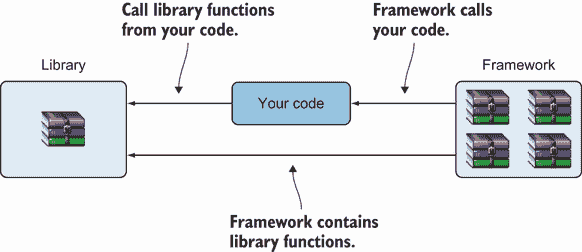
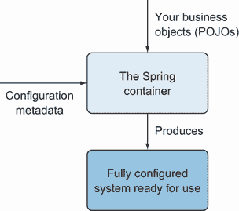

# 14 集成 JPA 和 Hibernate 与 Spring

本章涵盖

+   介绍 Spring 框架和依赖注入

+   检查数据访问对象（DAO）设计模式

+   使用 DAO 设计模式创建和生成 Spring JPA 应用程序

+   使用 DAO 设计模式创建和生成 Spring Hibernate 应用程序

在本章中，我们将分析几种将 Spring 和 Hibernate 集成的不同可能性。Spring 是一个轻量级但同时也灵活通用的 Java 框架。它是开源的，可以在 Java 应用程序的任何一层使用。我们将研究 Spring 框架背后的原则（*依赖注入*，也称为 *控制反转*），并且我们将使用 Spring 与 JPA 或 Hibernate 一起构建 Java 持久化应用程序。

注意：要执行源代码中的示例，你首先需要运行 Ch14.sql 脚本。

## 14.1 Spring 框架和依赖注入

Spring 框架为开发 Java 应用程序提供了一个全面的架构。它处理基础设施，以便你可以专注于你的应用程序，并使你能够从普通的 Java 对象（POJOs）构建应用程序。

Rod Johnson 于 2002 年创建了 Spring，始于他的书籍 *Expert One-on-One J2EE Design and Development*（Johnson，2002）。Spring 背后的基本思想是简化传统的企业应用程序设计方法。要快速了解 Spring 框架的功能，Laurențiu Spilcă 的书籍 *Spring Start Here*（Spilcă，2021）是一个很好的资源。

一个 Java 应用程序通常由协作解决问题的对象组成。程序中的对象相互依赖。你可以使用设计模式（工厂、构建器、代理、装饰器等）来组合类和对象，但这种负担在开发者这边。

Spring 实现了各种设计模式。Spring 框架的 *依赖注入* 模式（也称为 *控制反转*，或 IoC）支持创建由不同组件和对象组成的应用程序。

框架的关键特征正是这种依赖注入或 IoC。当你从 JDK 或库中调用方法时，你处于控制地位。相比之下，使用框架时，控制是反转的：框架调用 *你*（见图 14.1）。你必须遵循框架提供的范式并填写自己的代码。框架定义了一个骨架，而你插入特性来填充这个骨架。你的代码处于框架的控制之下，框架调用它。这样，你可以专注于实现业务逻辑，而不是设计。



图 14.1 你的代码调用库。框架调用你的代码。

Spring 框架下受控的对象的创建、依赖注入和一般生命周期由一个容器管理。容器将结合应用程序类和配置信息（元数据）以获得一个可运行的应用程序（图 14.2）。因此，容器是 IoC 原则的核心。



图 14.2 Spring IoC 容器的功能

由 IoC 容器管理的对象被称为 *beans*。beans 构成了 Spring 应用的骨架。

## 14.2 使用 Spring 和 DAO 模式的 JPA 应用程序

在本节中，我们将探讨如何使用 Spring 和数据访问对象（DAO）设计模式构建 JPA 应用程序。DAO 设计模式创建了一个数据库的抽象接口，支持访问操作而不暴露数据库的任何内部信息。

你可能会争辩说，我们已创建并使用过的 Spring Data JPA 存储库已经做到了这一点，这是真的。在本章中，我们将演示如何构建 DAO 类，并讨论何时应优先选择这种方法而不是使用 Spring Data JPA。

CaveatEmptor 应用程序包含 `Item` 和 `Bid` 类（列表 14.1 和 14.2）。现在将使用 Spring 框架来管理实体。`BID` 和 `ITEM` 表之间的关系将通过 `BID` 表侧的外键字段保持。带有 `@javax.persistence.Transient` 注解的字段将排除在持久化之外。

列表 14.1 `Item` 类

```
Path: Ch14/spring-jpa-dao/src/main/java/com/manning/javapersistence/ch14
➥ /Item.java

@Entity
\1 Item {

    @Id                                                               Ⓐ
    @GeneratedValue(generator = "ID_GENERATOR")                       Ⓐ
    private Long id;                                                  Ⓐ

    @NotNull                                                          Ⓑ
    @Size(                                                            Ⓑ
            min = 2,                                                  Ⓑ
            max = 255,                                                Ⓑ
            message = "Name is required, maximum 255 characters."     Ⓑ
    )                                                                 Ⓑ
    private String name;                                              Ⓑ

    @Transient                                                        Ⓒ
    private Set<Bid> bids = new HashSet<>();                          Ⓒ

    // . . .
}
```

Ⓐ `id` 字段是一个生成的标识符。

Ⓑ `name` 字段不为空，且大小必须在 2 到 255 个字符之间。

Ⓒ 每个 `Item` 都有一个对其 `Bid` 集合的引用。该字段被标记为 `@Transient`，因此它被排除在持久化之外。

我们将关注 `Bid` 类，如现在所示。它也是一个实体，`Item` 和 `Bid` 之间的关系是一对多。

列表 14.2 `Bid` 类

```
Path: Ch14/spring-jpa-dao/src/main/java/com/manning/javapersistence/ch14
➥ /Bid.java

@Entity
public class Bid {

    @Id                                                     Ⓐ
    @GeneratedValue(generator = "ID_GENERATOR")             Ⓐ
    private Long id;                                        Ⓐ

    @NotNull                                                Ⓑ
    private BigDecimal amount;                              Ⓑ

    @ManyToOne(optional = false, fetch = FetchType.LAZY)    Ⓒ
    @JoinColumn(name = "ITEM_ID")                           Ⓒ
    private Item item;                                      Ⓒ
    // . . .
}
```

Ⓐ `Bid` 实体类包含 `id` 字段作为生成的标识符。

Ⓑ `amount` 字段不应为空。

Ⓒ 每个 `Bid` 都有一个非可选的对其 `Item` 的引用。获取将是延迟的，连接列的名称是 `ITEM_ID`。

要实现 DAO 设计模式，我们首先将创建两个接口，`ItemDao` 和 `BidDao`，并声明将要实现的操作访问：

```
Path: Ch14/spring-jpa-dao/src/main/java/com/manning/javapersistence/ch14
➥ /dao/ItemDao.java

public interface ItemDao {
    Item getById(long id);

    List<Item> getAll();

    void insert(Item item);

    void update(long id, String name);

    void delete(Item item);

    Item findByName(String name);
}
```

`BidDao` 接口声明如下：

```
Path: Ch14/spring-jpa-dao/src/main/java/com/manning/javapersistence/ch14
➥ /dao/BidDao.java

public interface BidDao {
    Bid getById(long id);

    List<Bid> getAll();

    void insert(Bid bid);

    void update(long id, String amount);

    void delete(Bid bid);

    List<Bid> findByAmount(String amount);
}
```

`@Repository` 是一个标记注解，表示该组件代表一个 DAO。除了将注解的类标记为 Spring 组件外，`@Repository` 还会捕获持久化特定的异常并将它们转换为 Spring 未检查的异常。`@Transactional` 将使类内部的所有方法都具有事务性，如第 11.4.3 节所述。

`EntityManager`本身不是线程安全的。我们将使用`@PersistenceContext`，以便容器注入一个线程安全的代理对象。除了在容器管理的实体管理器上注入依赖项之外，`@PersistenceContext`注解还有参数。将持久化类型设置为`EXTENDED`可以保持整个 bean 的生命周期中的持久化上下文。

`ItemDao`接口的实现，`ItemDaoImpl`，如下所示。

列表 14.3 `ItemDaoImpl`类

```
Path: Ch14/spring-jpa-dao/src/main/java/com/manning/javapersistence/ch14
➥ /dao/ItemDaoImpl.java

@Repository                                                             Ⓐ
@Transactional                                                          Ⓐ
public class ItemDaoImpl implements ItemDao {
    @PersistenceContext(type = PersistenceContextType.EXTENDED)         Ⓑ
    private EntityManager em;                                           Ⓑ

    @Override                                                           Ⓒ
    public Item getById(long id) {                                      Ⓒ
        return em.find(Item.class, id);                                 Ⓒ
    }

    @Override                                                           Ⓓ
    public List<Item> getAll() {                                        Ⓓ
        return (List<Item>) em.createQuery("from Item", Item.class)     Ⓓ
                              .getResultList();                         Ⓓ
    }

    @Override                                                           Ⓔ
    public void insert(Item item) {                                     Ⓔ
        em.persist(item);                                               Ⓔ
        for (Bid bid : item.getBids()) {                                Ⓔ
            em.persist(bid);                                            Ⓔ
        }                                                               Ⓔ
    }

    @Override                                                           Ⓕ
    public void update(long id, String name) {                          Ⓕ
        Item item = em.find(Item.class, id);                            Ⓕ
        item.setName(name);                                             Ⓕ
        em.persist(item);                                               Ⓕ
    }

    @Override                                                           Ⓖ
    public void delete(Item item) {                                     Ⓖ
        for (Bid bid : item.getBids()) {                                Ⓖ
            em.remove(bid);                                             Ⓖ
        }                                                               Ⓖ
        em.remove(item);                                                Ⓖ
    }

    @Override                                                           Ⓗ
    public Item findByName(String name) {                               Ⓗ
        return em.createQuery("from Item where name=:name", Item.class) Ⓗ
                .setParameter("name", name).getSingleResult();          Ⓗ
    }
}
```

`ItemDaoImpl`类被注解为`@Repository`和`@Transactional`。

`EntityManager em`字段注入到应用程序中，因为它被注解为`@PersistenceContext`。持久化类型`EXTENDED`意味着持久化上下文在整个 bean 的生命周期中保持。

通过`id`检索`Item`。

检索所有`Item`实体。

将`Item`及其所有`Bid`持久化。

更新`Item`的`name`字段。

移除属于一个`Item`及其本身的`Item`的所有出价。

通过`name`搜索`Item`。

`BidDao`接口的实现，`BidDaoImpl`，如下所示。

列表 14.4 `BidDaoImpl`类

```
Path: Ch14/spring-jpa-dao/src/main/java/com/manning/javapersistence/ch14
➥ /dao/BidDaoImpl.java

@Repository                                                                 Ⓐ
@Transactional                                                              Ⓐ
public class BidDaoImpl implements BidDao {
    @PersistenceContext(type = PersistenceContextType.EXTENDED)             Ⓑ
    private EntityManager em;                                               Ⓑ

    @Override                                                               Ⓒ
    public Bid getById(long id) {                                           Ⓒ
        return em.find(Bid.class, id);                                      Ⓒ
    }

    @Override                                                               Ⓓ
    public List<Bid> getAll() {                                             Ⓓ
        return em.createQuery("from Bid", Bid.class).getResultList();       Ⓓ
    }

    @Override                                                               Ⓔ
    public void insert(Bid bid) {                                           Ⓔ
        em.persist(bid);                                                    Ⓔ
    }

    @Override                                                               Ⓕ
    public void update(long id, String amount) {                            Ⓕ
        Bid bid = em.find(Bid.class, id);                                   Ⓕ
        bid.setAmount(new BigDecimal(amount));                              Ⓕ
        em.persist(bid);                                                    Ⓕ
    }

    @Override                                                               Ⓖ
    public void delete(Bid bid) {                                           Ⓖ
        em.remove(bid);                                                     Ⓖ
    }

    @Override                                                               Ⓗ
    public List<Bid> findByAmount(String amount) {                          Ⓗ
        return em.createQuery("from Bid where amount=:amount", Bid.class)   Ⓗ
          .setParameter("amount", new BigDecimal(amount)).getResultList();  Ⓗ
    }
}

```

`BidDaoImpl`类被注解为`@Repository`和`@Transactional`。

`EntityManager em`字段注入到应用程序中，因为它被注解为`@PersistenceContext`。将持久化类型设置为`EXTENDED`意味着持久化上下文在整个 bean 的生命周期中保持不变。

通过`id`检索`Bid`。

检索所有`Bid`实体。

持久化一个`Bid`。

更新`Bid`的`amount`字段。

移除一个`Bid`。

通过`amount`搜索`Bid`。

为了与数据库交互，我们将提供一个特殊的类`DatabaseService`，该类将负责填充数据库并从其中删除信息。

列表 14.5 `DatabaseService`类

```
Path: Ch14/spring-jpa-dao/src/test/java/com/manning/javapersistence/ch14
➥ /DatabaseService.java

public class DatabaseService {

    @PersistenceContext(type = PersistenceContextType.EXTENDED)       Ⓐ
    private EntityManager em;                                         Ⓐ

    @Autowired                                                        Ⓑ
    private ItemDao itemDao;                                          Ⓑ

    @Transactional                                                    Ⓒ
    public void init() {                                              Ⓒ
        for (int i = 0; i < 10; i++) {                                Ⓒ
            String itemName = "Item " + (i + 1);                      Ⓒ
            Item item = new Item();                                   Ⓒ
            item.setName(itemName);                                   Ⓒ
            Bid bid1 = new Bid(new BigDecimal(1000.0), item);         Ⓒ
            Bid bid2 = new Bid(new BigDecimal(1100.0), item);         Ⓒ

            itemDao.insert(item);                                     Ⓒ
        }                                                             Ⓒ
    }

    @Transactional                                                    Ⓓ
    public void clear() {                                             Ⓓ
        em.createQuery("delete from Bid b").executeUpdate();          Ⓓ
        em.createQuery("delete from Item i").executeUpdate();         Ⓓ
    }

}
```

`EntityManager em`字段注入到应用程序中，因为它被注解为`@PersistenceContext`。将持久化类型设置为`EXTENDED`可以保持整个 bean 的生命周期中的持久化上下文。

`ItemDao`的`itemDao`字段注入到应用程序中，因为它被注解为`@Autowired`。因为`ItemDaoImpl`类被注解为`@Repository`，Spring 将创建属于此类的所需 bean，以在此处注入。

生成 10 个`Item`对象，每个对象有 2 个`Bid`，并将它们插入到数据库中。

删除之前插入的所有`Bid`和`Item`对象。

Spring 的标准配置文件是一个 Java 类，它创建并设置所需的 bean。`@EnableTransactionManagement`注解将启用 Spring 的基于注解的事务管理功能。当使用 XML 配置时，此注解由`tx:annotation-driven`元素镜像。每次与数据库的交互都应发生在事务边界内，Spring 需要一个事务管理器 bean。

我们将为应用程序创建以下配置文件。

列表 14.6 `SpringConfiguration` 类

```
Path: Ch14/spring-jpa-dao/src/test/java/com/manning/javapersistence/ch14
➥ /configuration/SpringConfiguration.java

@EnableTransactionManagement                                                Ⓐ
public class SpringConfiguration {
    @Bean                                                                   Ⓑ
    public DataSource dataSource() {                                        Ⓑ
        DriverManagerDataSource dataSource = new DriverManagerDataSource(); Ⓑ
        dataSource.setDriverClassName("com.mysql.cj.jdbc.Driver");          Ⓒ
        dataSource.setUrl(                                                  Ⓓ
           "jdbc:mysql://localhost:3306/CH14_SPRING_HIBERNATE               Ⓓ
 ➥ ?serverTimezone=UTC");                                     Ⓓ
        dataSource.setUsername("root");                                     Ⓔ
        dataSource.setPassword("");                                         Ⓕ
        return dataSource;                                                  Ⓑ
    }

    @Bean                                                                   Ⓖ
    public DatabaseService databaseService() {                              Ⓖ
        return new DatabaseService();                                       Ⓖ
    }

    @Bean                                                                   Ⓗ
    public JpaTransactionManager                                            Ⓗ
           transactionManager(EntityManagerFactory emf){                    Ⓗ
        return new JpaTransactionManager(emf);                              Ⓗ
    }

    @Bean                                                                   Ⓘ
    public LocalContainerEntityManagerFactoryBean entityManagerFactory() {  Ⓘ
        LocalContainerEntityManagerFactoryBean                              Ⓘ
        localContainerEntityManagerFactoryBean =                            Ⓘ
                new LocalContainerEntityManagerFactoryBean();               Ⓘ
        localContainerEntityManagerFactoryBean                              Ⓙ
               .setPersistenceUnitName("ch14");                             Ⓙ
        localContainerEntityManagerFactoryBean.setDataSource(dataSource()); Ⓚ
        localContainerEntityManagerFactoryBean.setPackagesToScan(           Ⓛ
            "com.manning.javapersistence.ch14");                            Ⓛ
        return localContainerEntityManagerFactoryBean;                      Ⓘ
    }

    @Bean                                                                   Ⓜ
    public ItemDao itemDao() {                                              Ⓜ
        return new ItemDaoImpl();                                           Ⓜ
    }

    @Bean                                                                   Ⓝ
    public BidDao bidDao() {                                                Ⓝ
        return new BidDaoImpl();                                            Ⓝ
    }
}
```

Ⓐ `@EnableTransactionManagement` 注解启用了 Spring 的基于注解的事务管理功能。

Ⓑ 创建一个数据源豆。

Ⓒ 指定 JDBC 属性——驱动程序。

Ⓓ 数据库的 URL。

Ⓔ 用户名。

Ⓕ 此配置中没有密码。修改凭证以与您的机器上的凭证对应，并在实际使用中设置密码。

Ⓖ Spring 将使用此 `DatabaseService` 豆来填充和清除数据库。

Ⓗ 基于实体管理器工厂创建一个事务管理器豆。

Ⓘ `LocalContainerEntityManagerFactoryBean` 是一个工厂豆，它根据 JPA 标准容器引导合同生成一个 `EntityManagerFactory`。

Ⓙ 设置持久化单元名称，该名称在 persistence.xml 中定义。

Ⓚ 设置数据源。

Ⓛ 设置扫描实体类的包。豆位于 `com.manning .javapersistence.ch14`，因此我们将此包设置为扫描包。

Ⓜ 创建一个 `ItemDao` 豆。

Ⓝ 创建一个 `BidDao` 豆。

此配置信息由 Spring 用于创建和注入构成应用程序骨干的豆。我们可以使用替代的 XML 配置，并且 application-context.xml 文件反映了 SpringConfiguration .java 中完成的工作。我们只想强调我们之前提到的一点：在 XML 中，我们通过 `tx:annotation-driven` 元素启用 Spring 的基于注解的事务管理功能，并引用事务管理器豆：

```
Path: Ch14/spring-jpa-dao/src/test/resources/application-context.xml

<tx:annotation-driven transaction-manager="txManager"/>
```

使用 `SpringExtension` 扩展将 Spring 测试上下文与 JUnit 5 Jupiter 测试集成，通过实现几个 JUnit Jupiter 扩展模型回调方法。

对于所有注入的 `EntityManager` 豆，使用类型 `PersistenceContextType.`*EXTENDED* 是很重要的。如果我们使用默认的 `PersistenceContextType.TRANSACTION` 类型，则在事务执行结束时返回的对象将变为分离的。将其传递给 `delete` 方法会导致“IllegalArgumentException: Removing a detached instance”异常。

是时候测试我们为持久化 `Item` 和 `Bid` 实体所开发的功能了。

列表 14.7 `SpringJpaTest` 类

```
Path: Ch14/spring-jpa-dao/src/test/java/com/manning/javapersistence/ch14
➥ /SpringJpaTest.java

@ExtendWith(SpringExtension.class)                                         Ⓐ
@ContextConfiguration(classes = {SpringConfiguration.class})               Ⓑ
//@ContextConfiguration("classpath:application-context.xml")               Ⓒ
public class SpringJpaTest {

    @Autowired                                                             Ⓓ
    private DatabaseService databaseService;                               Ⓓ

    @Autowired                                                             Ⓓ
    private ItemDao itemDao;                                               Ⓓ

    @Autowired                                                             Ⓓ
    private BidDao bidDao;                                                 Ⓓ

    @BeforeEach                                                            Ⓔ
    public void setUp() {                                                  Ⓔ
        databaseService.init();                                            Ⓔ
    }

    @Test                                                                  Ⓕ
    public void testInsertItems() {                                        Ⓕ
        List<Item> itemsList = itemDao.getAll();                           Ⓕ
        List<Bid> bidsList = bidDao.getAll();                              Ⓕ
        assertAll(                                                         Ⓕ
                () -> assertNotNull(itemsList),                            Ⓕ
                () -> assertEquals(10, itemsList.size()),                  Ⓕ
                () -> assertNotNull(itemDao.findByName("Item 1")),         Ⓕ
                () -> assertNotNull(bidsList),                             Ⓕ
                () -> assertEquals(20, bidsList.size()),                   Ⓕ
                () -> assertEquals(10,                                     Ⓕ
                                   bidDao.findByAmount("1000.00").size())  Ⓕ
        );                                                                 Ⓕ
    }

    @Test                                                                  Ⓖ
    public void testDeleteItem() {                                         Ⓖ
        itemDao.delete(itemDao.findByName("Item 2"));                      Ⓖ
        assertThrows(NoResultException.class,                              Ⓗ
                     () -> itemDao.findByName("Item 2"));                  Ⓗ
    }

    // . . .

    @AfterEach                                                             Ⓘ
    public void dropDown() {                                               Ⓘ
        databaseService.clear();                                           Ⓘ
    }

}
```

Ⓐ 使用 `SpringExtension` 扩展测试。如前所述，这将通过实现几个 JUnit Jupiter 扩展模型回调方法将 Spring TestContext 框架集成到 JUnit 5 中。

Ⓑ 使用之前展示的 `SpringConfiguration` 类中定义的豆配置 Spring 测试上下文。

Ⓒ 或者，我们可以使用 XML 配置测试上下文。代码中的 Ⓑ 或 Ⓒ 行中只能有一个是活动的。

Ⓓ 自动装配一个 `DatabaseService` 豆、一个 `ItemDao` 豆和一个 `BidDao` 豆。

Ⓔ 在每个测试执行之前，通过注入的 `DatabaseService` 的 `init` 方法初始化数据库的内容。

Ⓕ 检索所有 `Item` 和所有 `Bid` 并进行验证。

Ⓖ 通过 `name` 字段查找 `Item` 并从数据库中删除它。我们将使用 `PersistenceContextTyp`e`.EXTENDED` 为所有注入的 `EntityManager` 实例。否则，将其传递给 `delete` 方法将导致“IllegalArgument-Exception: Removing a detached instance”异常。

Ⓗ 在数据库中成功删除 `Item` 后，再次尝试查找它将抛出 `NoResultException`。其余的测试可以在源代码中轻松调查。

Ⓘ 每次测试执行后，数据库的内容都会被注入的 `DatabaseService` 中的 `clear` 方法清除。

我们应该在何时应用 Spring 框架和 DAO 设计模式这样的解决方案？以下是一些我们推荐使用该解决方案的情况：

+   你可能希望将控制实体管理器和事务的任务交给 Spring 框架（记住这是通过 *控制反转* 实现的）。权衡是，你将失去调试事务的可能性。只是要注意这一点。

+   你可能想创建自己的 API 来管理持久化，或者你无法使用 Spring Data，或者你不想使用 Spring Data。这可能发生在你需要控制非常特定的操作时，或者你想要移除 Spring Data 的开销（包括团队采用它的时间、在现有项目中引入新依赖项以及 Spring Data 的执行延迟，如第 2.7 节所述）。

+   在特定情况下，你可能希望将实体管理器和事务处理交给 Spring 框架，同时仍然不实现自己的 DAO 类。

我们希望改进我们的 Spring 持久化应用程序的设计。接下来的几节将致力于使其更加通用，并使用 Hibernate API 而不是 JPA。我们将关注第一个解决方案和我们的新版本之间的差异，并讨论如何引入这些更改。

## 14.3 使用 Spring 和 DAO 的 JPA 应用程序的泛化

如果我们仔细查看我们创建的 `ItemDao` 和 `BidDao` 接口以及 `ItemDaoImpl` 和 `BidDaoImpl` 类，我们会发现一些不足之处：

+   存在类似的操作，如 `getById`、`getAll`、`insert` 和 `delete`，它们主要区别在于它们接收的参数类型或返回的结果类型。

+   `update` 方法接收一个特定的属性的值作为第二个参数。如果我们需要更新实体的不同属性，我们可能需要编写多个方法。

+   类似于 `findByName` 或 `findByAmount` 这样的方法与特定的属性相关联。我们可能需要为使用不同属性查找实体编写不同的方法。

因此，我们将引入一个 `GenericDao` 接口。

列表 14.8 `GenericDao` 接口

```
Path: Ch14/spring-jpa-dao-gen/src/main/java/com/manning/javapersistence
➥ /ch14/dao/GenericDao.java

public interface GenericDao<T> {
   T getById(long id);                                                   Ⓐ

   List<T> getAll();                                                     Ⓐ

   void insert(T entity);                                                Ⓑ

   void delete(T entity);                                                Ⓑ

   void update(long id, String propertyName, Object propertyValue);      Ⓒ

   List<T> findByProperty(String propertyName, Object propertyValue);    Ⓒ

}
```

Ⓐ `getById` 和 `getAll` 方法具有通用的返回类型。

Ⓑ `insert` 和 `update` 方法具有通用的输入，`T entity`。

Ⓒ `update` 和 `findByProperty` 方法将接收 `propertyName` 和新的 `propertyValue` 作为参数。

我们将创建一个 `GenericDao` 接口的抽象实现，称为 `AbstractGenericDao`，如列表 14.9 所示。在这里，我们将编写所有 DAO 类的共同功能，并让具体类实现它们的特定功能。

我们将在应用程序中注入一个 `EntityManager` 字段 `em`，并使用 `@PersistenceContext` 进行注解。将持久化类型设置为 `EXTENDED` 可以在整个 bean 的生命周期中保持持久化上下文。

列表 14.9 `AbstractGenericDao` 类

```
Path: Ch14/spring-jpa-dao-gen/src/main/java/com/manning/javapersistence
➥ /ch14/dao/AbstractGenericDao.java

@Repository                                                                  Ⓐ
@Transactional                                                               Ⓐ
public abstract class AbstractGenericDao<T> implements GenericDao<T> {

    @PersistenceContext(type = PersistenceContextType.EXTENDED)              Ⓑ
    protected EntityManager em;                                              Ⓑ
    private Class<T> clazz;                                                  Ⓒ

    public void setClazz(Class<T> clazz) {                                   Ⓒ
        this.clazz = clazz;                                                  Ⓒ
    }

    @Override                                                                Ⓓ
    public T getById(long id) {                                              Ⓓ
        return em.createQuery(                                               Ⓓ
                "SELECT e FROM " + clazz.getName() + " e WHERE e.id = :id",  Ⓓ
                 clazz).setParameter("id", id).getSingleResult();            Ⓓ
    }

    @Override                                                                Ⓔ
    public List<T> getAll() {                                                Ⓔ
        return em.createQuery("from " +                                      Ⓔ
                               clazz.getName(), clazz).getResultList();      Ⓔ
    }

    @Override                                                                Ⓕ
    public void insert(T entity) {                                           Ⓕ
        em.persist(entity);                                                  Ⓕ
    }

    @Override                                                                Ⓖ
    public void delete(T entity) {                                           Ⓖ
        em.remove(entity);                                                   Ⓖ
    }

    @Override
    public void update(long id, String propertyName, Object propertyValue) { Ⓗ
        em.createQuery("UPDATE " + clazz.getName() + " e SET e." +           Ⓗ
                 propertyName + " = :propertyValue WHERE e.id = :id")        Ⓗ
                .setParameter("propertyValue", propertyValue)                Ⓗ
                .setParameter("id", id).executeUpdate();                     Ⓗ
    }

    @Override
    public List<T> findByProperty(String propertyName,                       Ⓘ
                                  Object propertyValue) {                    Ⓘ
        return em.createQuery(                                               Ⓘ
               "SELECT e FROM " + clazz.getName() + " e WHERE e." +          Ⓘ
                propertyName + " = :propertyValue", clazz)                   Ⓘ
                .setParameter("propertyValue", propertyValue)                Ⓘ
                .getResultList();                                            Ⓘ
    }
}
```

Ⓐ `AbstractGenericDao` 类被注解为 `@Repository` 和 `@Transactional`。

Ⓑ `EntityManager` 的 `EXTENDED` 持久化类型将保持整个 bean 生命周期的持久化上下文。该字段是 `protected` 的，最终将被子类继承和使用。

Ⓒ `clazz` 是 DAO 将在其上工作的有效 `Class` 字段。

Ⓓ 使用 `clazz` 实体和将 `id` 作为参数执行一个 `SELECT` 查询。

Ⓔ 使用 `clazz` 实体和获取结果列表执行一个 `SELECT` 查询。

Ⓕ 持久化 `entity`。

Ⓖ 删除 `entity`。

使用 `propertyName`、`propertyValue` 和 `id` 执行一个 `UPDATE` 操作。

Ⓘ 使用 `propertyName` 和 `propertyValue` 执行一个 `SELECT`。

`AbstractGenericDao` 类提供了大部分通用 DAO 功能。它只需要对特定 DAO 类进行一点定制。`ItemDaoImpl` 类将扩展 `AbstractGenericDao` 类并覆盖一些方法。

列表 14.10 扩展 `AbstractGenericDao` 的 `ItemDaoImpl` 类

```
Path: Ch14/spring-jpa-dao-gen/src/main/java/com/manning/javapersistence
➥ /ch14/dao/ItemDaoImpl.java

public class ItemDaoImpl extends AbstractGenericDao<Item> {    Ⓐ

    public ItemDaoImpl() {                                     Ⓑ
        setClazz(Item.class);                                  Ⓑ
    }

    @Override                                                  Ⓒ
    public void insert(Item item) {                            Ⓒ
        em.persist(item);                                      Ⓒ
        for (Bid bid : item.getBids()) {                       Ⓒ
            em.persist(bid);                                   Ⓒ
        }                                                      Ⓒ
    }

    @Override                                                  Ⓓ
    public void delete(Item item) {                            Ⓓ
        for (Bid bid: item.getBids()) {                        Ⓓ
            em.remove(bid);                                    Ⓓ
        }                                                      Ⓓ
        em.remove(item);                                       Ⓓ
    }

}
```

Ⓐ `ItemDaoImpl` 扩展了 `AbstractGenericDao` 并通过 `Item` 进行泛型化。

Ⓑ 构造函数将 `Item.class` 设置为要管理的实体类。

Ⓒ 持久化 `Item` 实体及其所有 `Bid` 实体。`EntityManager em` 字段是从 `AbstractGenericDao` 类继承而来的。

Ⓓ 删除属于 `Item` 及其本身的全部投标。

`BidDaoImpl` 类将简单地扩展 `AbstractGenericDao` 类，并设置要管理的实体类。

列表 14.11 扩展 `AbstractGenericDao` 的 `BidDaoImpl` 类

```
Path: Ch14/spring-jpa-dao-gen/src/main/java/com/manning/javapersistence
➥ /ch14/dao/BidDaoImpl.java

public class BidDaoImpl extends AbstractGenericDao<Bid> {     Ⓐ

    public BidDaoImpl() {                                     Ⓑ
        setClazz(Bid.class);                                  Ⓑ
    }

}
```

Ⓐ `BidDaoImpl` 扩展了 `AbstractGenericDao` 并通过 `Bid` 进行泛型化。

Ⓑ 构造函数将 `Bid.class` 设置为要管理的实体类。所有其他方法都从 `AbstractGenericDao` 继承而来，并且以这种方式完全可重用。

需要对配置和测试类进行一些小的更改。`SpringConfiguration` 类现在将声明两个 DAO 实例作为 `GenericDao`：

```
Path: Ch14/spring-jpa-dao-gen/src/test/java/com/manning/javapersistence
➥ /ch14/configuration/SpringConfiguration.java

@Bean
public GenericDao<Item> itemDao() {
    return new ItemDaoImpl();
}

@Bean
public GenericDao<Bid> bidDao() {
    return new BidDaoImpl();
}
```

`DatabaseService` 类将注入 `itemDao` 字段作为 `GenericDao`：

```
Path: Ch14/spring-jpa-dao-gen/src/test/java/com/manning/javapersistence
➥ /ch14/DatabaseService.java

@Autowired
private GenericDao<Item> itemDao;
```

`SpringJpaTest` 类将注入 `itemDao` 和 `bidDao` 字段作为 `GenericDao`：

```
Path: Ch14/spring-jpa-dao-gen/src/test/java/com/manning/javapersistence
➥ /ch14/SpringJpaTest.java

@Autowired
private GenericDao<Item> itemDao;

@Autowired
private GenericDao<Bid> bidDao;
```

我们现在已经使用 JPA API 开发了一个易于扩展的 DAO 类层次结构。我们可以重用已经编写的通用功能，或者我们可以快速覆盖特定实体的一些方法（如 `ItemDaoImpl` 的情况）。

现在让我们转向使用 Spring 和 DAO 模式实现 Hibernate 应用程序的替代方案。

## 14.4 使用 Spring 和 DAO 模式实现的 Hibernate 应用程序

现在我们将展示如何使用 Spring 和 DAO 模式与 Hibernate API。正如我们之前提到的，我们将强调这种方法与之前应用程序之间的差异。

调用 `sessionFactory.getCurrentSession()` 将创建一个新的 `Session`（如果不存在的话）。否则，它将使用 Hibernate 上下文中的现有会话。当事务结束时，会话将自动刷新和关闭。在单线程应用程序中使用 `sessionFactory.getCurrentSession()` 是理想的，因为使用单个会话将提高性能。在多线程应用程序中，会话不是线程安全的，因此您应该使用 `sessionFactory.openSession()` 并显式关闭打开的会话。或者，因为 `Session` 实现了 `AutoCloseable` 接口，它可以在 try-with-resources 块中使用。

由于 `Item` 和 `Bid` 类以及 `ItemDao` 和 `BidDao` 接口保持不变，我们将转向 `ItemDaoImpl` 和 `BidDaoImpl`，看看它们现在是什么样子。

列表 14.12 使用 Hibernate API 的 `ItemDaoImpl` 类

```
Path: Ch14/spring-hibernate-dao/src/main/java/com/manning/javapersistence
➥ /ch14/dao/ItemDaoImpl.java

@Repository                                                                 Ⓐ
@Transactional                                                              Ⓐ
public class ItemDaoImpl implements ItemDao {
    @Autowired                                                              Ⓑ
    private SessionFactory sessionFactory;                                  Ⓑ

    @Override                                                               Ⓒ
    public Item getById(long id) {                                          Ⓒ
        return sessionFactory.getCurrentSession().get(Item.class, id);      Ⓒ
    }

    @Override                                                               Ⓓ
    public List<Item> getAll() {                                            Ⓓ
        return sessionFactory.getCurrentSession()                           Ⓓ
                .createQuery("from Item", Item.class).list();               Ⓓ
    }

    @Override                                                               Ⓔ
    public void insert(Item item) {                                         Ⓔ
        sessionFactory.getCurrentSession().persist(item);                   Ⓔ
        for (Bid bid : item.getBids()) {                                    Ⓔ
            sessionFactory.getCurrentSession().persist(bid);                Ⓔ
        }                                                                   Ⓔ
    }

    @Override                                                               Ⓕ
    public void update(long id, String name) {                              Ⓕ
        Item item = sessionFactory.getCurrentSession().get(Item.class, id); Ⓕ
        item.setName(name);                                                 Ⓕ
        sessionFactory.getCurrentSession().update(item);                    Ⓕ
    }

    @Override                                                               Ⓖ
    public void delete(Item item) {                                         Ⓖ
        sessionFactory.getCurrentSession()                                  Ⓖ
            .createQuery("delete from Bid b where b.item.id = :id")         Ⓖ
            .setParameter("id", item.getId()).executeUpdate();              Ⓖ
        sessionFactory.getCurrentSession()                                  Ⓖ
            .createQuery("delete from Item i where i.id = :id")             Ⓖ
            .setParameter("id", item.getId()).executeUpdate();              Ⓖ
    }

    @Override
    public Item findByName(String name) {                                   Ⓗ
        return sessionFactory.getCurrentSession()                           Ⓗ
                 .createQuery("from Item where name=:name", Item.class)     Ⓗ
                 .setParameter("name", name).uniqueResult();                Ⓗ
    }
}
```

Ⓐ `ItemDaoImpl` 类被注解为 `@Repository` 和 `@Transactional`。

Ⓑ `SessionFactory sessionFactory` 字段在应用程序中被注入，因为它被注解为 `@Autowired`。

Ⓒ 通过 `id` 检索一个 `Item`。调用 `sessionFactory.getCurrentSession()` 将创建一个新的 `Session`（如果不存在的话）。

Ⓓ 检索所有 `Item` 实体。

Ⓔ 持久化一个 `Item` 及其所有的 `Bid`。

Ⓕ 更新 `Item` 的 `name` 字段。

Ⓖ 删除属于 `Item` 及其本身的全部投标。

Ⓗ 通过 `name` 搜索一个 `Item`。

`BidDaoImpl` 类也将反映之前使用 JPA 和 `EntityManager` 实现的功能，但它将使用 Hibernate API 和 `SessionFactory`。

在 `SpringConfiguration` 类中也有重要的更改。从 JPA 转换到 Hibernate，要注入的 `EntityManagerFactory` Bean 将被 `SessionFactory` 替换。同样，要注入的 `JpaTransactionManager` Bean 将被 `HibernateTransactionManager` 替换。

列表 14.13 使用 Hibernate API 的 `SpringConfiguration` 类

```
Path: Ch14/spring-hibernate-dao/src/test/java/com/manning/javapersistence
➥ /ch14/configuration/SpringConfiguration.java

@EnableTransactionManagement                                                Ⓐ
public class SpringConfiguration {

    @Bean                                                                   Ⓑ
    public LocalSessionFactoryBean sessionFactory() {                       Ⓑ
        LocalSessionFactoryBean sessionFactory =                            Ⓑ
             new LocalSessionFactoryBean();                                 Ⓑ
        sessionFactory.setDataSource(dataSource());                         Ⓒ
        sessionFactory.setPackagesToScan(                                   Ⓒ
             new String[]{"com.manning.javapersistence.ch14"});             Ⓒ
        sessionFactory.setHibernateProperties(hibernateProperties());       Ⓓ

        return sessionFactory;                                              Ⓑ
    }

    private Properties hibernateProperties() {                              Ⓔ
        Properties hibernateProperties = new Properties();                  Ⓔ
        hibernateProperties.setProperty(AvailableSettings.HBM2DDL_AUTO,     Ⓔ
                                                         "create");         Ⓔ
        hibernateProperties.setProperty(AvailableSettings.SHOW_SQL,         Ⓔ
                                                         "true");           Ⓔ
        hibernateProperties.setProperty(AvailableSettings.DIALECT,          Ⓔ
                             "org.hibernate.dialect.MySQL8Dialect");        Ⓔ

        return hibernateProperties;                                         Ⓔ
    }

    @Bean                                                                   Ⓕ
    public DataSource dataSource() {                                        Ⓕ
        DriverManagerDataSource dataSource = new DriverManagerDataSource(); Ⓕ
        dataSource.setDriverClassName("com.mysql.cj.jdbc.Driver");          Ⓖ
        dataSource.setUrl(                                                  Ⓗ
       "jdbc:mysql://localhost:3306/CH14_SPRING_HIBERNATE?serverTimezone=   Ⓗ
        ➥ UTC ");                                                          Ⓗ
        dataSource.setUsername("root");                                     Ⓘ
        dataSource.setPassword("");                                         Ⓙ
        return dataSource;                                                  Ⓕ
    }

    @Bean                                                                   Ⓚ
    public DatabaseService databaseService() {                              Ⓚ
        return new DatabaseService();                                       Ⓚ
    }

    @Bean                                                                   Ⓛ
    public HibernateTransactionManager transactionManager(                  Ⓛ
                                       SessionFactory sessionFactory) {     Ⓛ
        HibernateTransactionManager transactionManager                      Ⓛ
            = new HibernateTransactionManager();                            Ⓛ
        transactionManager.setSessionFactory(sessionFactory);               Ⓛ
        return transactionManager;                                          Ⓛ
    }

    @Bean                                                                   Ⓜ
    public ItemDao itemDao() {                                              Ⓜ
        return new ItemDaoImpl();                                           Ⓜ
    }

    @Bean                                                                   Ⓝ
    public BidDao bidDao() {                                                Ⓝ
        return new BidDaoImpl();                                            Ⓝ
    }
}
```

Ⓐ `@EnableTransactionManagement` 注解将启用 Spring 的基于注解的事务管理功能。

Ⓑ `LocalSessionFactoryBean` 是要注入的 `sessionFactory` 对象。

Ⓒ 设置数据源和要扫描的包。

Ⓓ 设置将从单独的方法中提供的 Hibernate 属性。

Ⓔ 在单独的方法中创建 Hibernate 属性。

Ⓕ 创建一个数据源 Bean。

Ⓖ 指定 JDBC 属性——驱动程序。

Ⓗ 数据库的 URL。

Ⓘ 用户名。

Ⓙ 此配置中没有密码。修改凭据以匹配您机器上的凭据，并在实际操作中使用密码。

Ⓚ 将使用 `DatabaseService` bean 来填充和清除数据库。

Ⓛ 基于会话工厂创建一个事务管理器 bean。每次与数据库的交互都应该在事务边界内进行，因此 Spring 需要一个事务管理器 bean。

Ⓜ 创建一个 `ItemDao` bean。

Ⓝ 创建一个 `BidDao` bean。

我们可以使用 XML 配置的替代方案，并且 application-context.xml 文件应该反映 SpringConfiguration.java 中完成的工作。启用 Spring 的基于注解的事务管理功能是通过 `tx:annotation-driven` 元素实现的，该元素引用一个事务管理器 bean，而不是使用 `@EnableTransactionManagement` 注解。

我们现在将演示如何泛型化使用 Hibernate API 而不是 JPA 的应用程序。像往常一样，我们将关注与初始解决方案的差异以及如何引入这些更改。

## 14.5 泛型化使用 Spring 和 DAO 的 Hibernate 应用程序

请记住我们之前为使用数据访问对象 (DAO) 的 JPA 解决方案确定的缺点：

+   存在类似的操作，如 `getById`、`getAll`、`insert` 和 `delete`，它们主要区别在于接收的参数类型或返回的结果类型。

+   `update` 方法接收一个特定属性的值作为第二个参数。如果我们需要更新实体的不同属性，我们可能需要编写多个方法。

+   如 `findByName` 或 `findByAmount` 这样的方法与特定的属性相关联。我们可能需要为使用不同属性查找实体编写不同的方法。

为了解决这些缺点，我们引入了 `GenericDao` 接口，如前所述在列表 14.8 中所示。该接口由 `AbstractGenericDao` 类（列表 14.9）实现，现在需要使用 Hibernate API 重新编写。

列表 14.14 使用 Hibernate API 的 `AbstractGenericDao` 类

```
Path: Ch14/spring-hibernate-dao-gen/src/main/java/com/manning
➥ /javapersistence/ch14/dao/AbstractGenericDao.java

@Repository                                                                  Ⓐ
@Transactional                                                               Ⓐ
public abstract class AbstractGenericDao<T> implements GenericDao<T> {

    @Autowired                                                               Ⓑ
    protected SessionFactory sessionFactory;                                 Ⓑ
    private Class<T> clazz;                                                  Ⓒ

    public void setClazz(Class<T> clazz) {                                   Ⓒ
        this.clazz = clazz;                                                  Ⓒ
    }

    @Override                                                                Ⓓ
    public T getById(long id) {                                              Ⓓ
        return sessionFactory.getCurrentSession()                            Ⓓ
           .createQuery("SELECT e FROM " + clazz.getName() +                 Ⓓ
                        " e WHERE e.id = :id", clazz)                        Ⓓ
           .setParameter("id", id).getSingleResult();                        Ⓓ
    }

    @Override                                                                Ⓔ
    public List<T> getAll() {                                                Ⓔ
        return sessionFactory.getCurrentSession()                            Ⓔ
           .createQuery("from " + clazz.getName(), clazz).getResultList();   Ⓔ
    }

    @Override                                                                Ⓕ
    public void insert(T entity) {                                           Ⓕ
        sessionFactory.getCurrentSession().persist(entity);                  Ⓕ
    }

    @Override
    public void delete(T entity) {                                           Ⓖ
        sessionFactory.getCurrentSession().delete(entity);                   Ⓖ
    }

    @Override                                                                Ⓗ
    public void update(long id, String propertyName, Object propertyValue) { Ⓗ
        sessionFactory.getCurrentSession()                                   Ⓗ
          .createQuery("UPDATE " + clazz.getName() + " e SET e." +           Ⓗ
                propertyName + " = :propertyValue WHERE e.id = :id")         Ⓗ
          .setParameter("propertyValue", propertyValue)                      Ⓗ
          .setParameter("id", id).executeUpdate();                           Ⓗ
    }

    @Override                                                                Ⓘ
    public List<T> findByProperty(String propertyName,                       Ⓘ
   Object propertyValue) {                                                   Ⓘ
        return sessionFactory.getCurrentSession()                            Ⓘ
       .createQuery("SELECT e FROM " + clazz.getName() + " e WHERE e." +     Ⓘ
           propertyName + " = :propertyValue", clazz)                        Ⓘ
       .setParameter("propertyValue", propertyValue).getResultList();        Ⓘ
    }
}
```

Ⓐ `AbstractGenericDao` 类被注解为 `@Repository` 和 `@Transactional`。

Ⓑ `SessionFactory sessionFactory` 字段被注入到应用程序中，因为它被注解为 `@Autowired`。它是 `protected` 的，以便被子类继承和使用。

Ⓒ `clazz` 是 DAO 将在其上工作的有效 `Class` 字段。

Ⓓ 使用 `clazz` 实体和设置 `id` 作为参数执行一个 `SELECT` 查询。

Ⓔ 使用 `clazz` 实体执行一个 `SELECT` 查询并获取结果列表。

Ⓕ 持久化 `entity`。

Ⓖ 移除 `entity`。

Ⓗ 使用 `propertyName`、`propertyValue` 和 `id` 执行一个 `UPDATE` 操作。

Ⓘ 使用 `propertyName` 和 `propertyValue` 执行一个 `SELECT` 操作。

当 `ItemDaoImpl` 和 `BidDaoImpl` 扩展 `AbstractGenericDao` 类时，我们将自定义该类，这次使用 Hibernate API。

`ItemDaoImpl` 类将扩展 `AbstractGenericDao` 类并重写其中的一些方法。

列表 14.15 使用 Hibernate API 的 `ItemDaoImpl` 类

```
Path: Ch14/spring-jpa-hibernate-gen/src/main/java/com/manning
➥ /javapersistence/ch14/dao/ItemDaoImpl.java

public class ItemDaoImpl extends AbstractGenericDao<Item> {              Ⓐ

    public ItemDaoImpl() {                                               Ⓑ
        setClazz(Item.class);                                            Ⓑ
    }

    @Override                                                            Ⓒ
    public void insert(Item item) {                                      Ⓒ
        sessionFactory.getCurrentSession().persist(item);                Ⓒ
        for (Bid bid : item.getBids()) {                                 Ⓒ
            sessionFactory.getCurrentSession().persist(bid);             Ⓒ
        }                                                                Ⓒ
    }

    @Override                                                            Ⓓ
    public void delete(Item item) {                                      Ⓓ
        sessionFactory.getCurrentSession()                               Ⓓ
           .createQuery("delete from Bid b where b.item.id = :id")       Ⓓ
           .setParameter("id", item.getId()).executeUpdate();            Ⓓ
        sessionFactory.getCurrentSession()                               Ⓓ
           .createQuery("delete from Item i where i.id = :id")           Ⓓ
           .setParameter("id", item.getId()).executeUpdate();            Ⓓ
    }

}
```

Ⓐ `ItemDaoImpl` 扩展了 `AbstractGenericDao` 并通过 `Item` 进行泛型化。

Ⓑ 构造函数将`Item.class`设置为要管理的实体类。

Ⓒ 持久化`Item`实体及其所有`Bid`实体。`sessionFactory`字段继承自`AbstractGenericDao`类。

Ⓓ 删除属于`Item`及其本身的全部投标。

`BidDaoImpl`类将简单地扩展`AbstractGenericDao`类，并设置要管理的实体类。

列表 14.16 使用 Hibernate API 的`BidDaoImpl`类

```
Path: Ch14/spring-hibernate-dao-gen/src/main/java/com/manning
➥ /javapersistence/ch14/dao/BidDaoImpl.java

public class BidDaoImpl extends AbstractGenericDao<Bid> {    Ⓐ

    public BidDaoImpl() {                                    Ⓑ
        setClazz(Bid.class);                                 Ⓑ
    }

}
```

Ⓐ `BidDaoImpl`扩展了`AbstractGenericDao`并由`Bid`泛化。

Ⓑ 构造函数将`Bid.class`设置为要管理的实体类。所有其他方法都继承自`AbstractGenericDao`，并且以此方式完全可重用。

我们已经使用 Hibernate API 开发了一个易于扩展的 DAO 类层次结构。我们可以重用已经编写的通用功能，或者我们可以快速覆盖特定实体的一些方法（就像我们对`ItemDaoImpl`所做的那样）。

## 摘要

+   依赖注入设计模式是 Spring 框架的基础，支持创建由不同组件和对象组成的应用程序。

+   您可以使用 Spring 框架和 DAO 模式开发 JPA 应用程序。Spring 控制`EntityManager`、事务管理器以及应用程序使用的其他 bean。

+   您可以将 JPA 应用程序泛化以提供一个通用且易于扩展的 DAO 基类。DAO 基类包含所有派生 DAO 需要继承的通用行为，并将允许它们仅实现其特定的行为。

+   您可以使用 Spring 框架和 DAO 模式开发 Hibernate 应用程序。Spring 控制`SessionFactory`、事务管理器以及应用程序使用的其他 bean。

+   您可以将 Hibernate 应用程序泛化以提供一个通用且易于扩展的 DAO 基类。DAO 基类包含所有派生 DAO 需要继承的通用行为，并将允许它们仅实现其特定的行为。
