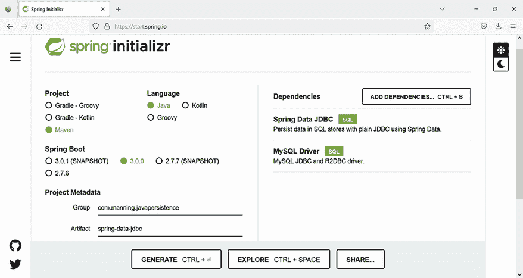

# 15 使用 Spring Data JDBC

本章涵盖

+   开始一个 Spring Data JDBC 项目

+   在 Spring Data JDBC 中处理查询和查询方法

+   使用 Spring Data JDBC 建立关系

+   使用 Spring Data JDBC 建模嵌入式实体

我们在第二章介绍了 Spring Data：它是一个包含许多项目的母项目，这些项目的目的是通过遵循 Spring 框架原则来简化对关系型数据库和 NoSQL 数据库的访问。在第四章中，我们详细探讨了 Spring Data JPA 项目的原则和能力。Spring Data JDBC 的目的在于高效地处理基于 JDBC 的仓库。它是这个家族中的较新项目，并且它并不提供所有 JPA 功能，例如缓存或懒加载，因此它提供了一个更简单、更有限的 ORM。然而，它正在不断发展，并在每个版本中引入新功能。

当我们已经有 JPA、Hibernate 和 Spring Data JPA 等替代方案时，为什么还需要 Spring Data JDBC 呢？事实是，对象/关系映射（ORM）使项目变得复杂，你已经在之前的章节中清楚地看到了这一点。有些情况下，我们可能希望消除这种复杂性，并利用当今最受欢迎的 Java 框架 Spring 的好处。我们有什么替代方案？

如果我们回顾传统的 JDBC，我们必须记住它的缺点，比如自己打开和关闭连接或手动处理异常——总的来说，我们不得不处理大量的服务代码。

Spring Data JDBC 允许我们创建自己的查询以在数据库上执行，但它也有自己的 ORM，并使用 JPA、Hibernate 和 Spring Data JPA 已经使用的概念：实体、仓库和`@Query`注解。Spring Data JDBC 不使用 JPQL，也没有可移植性。查询必须以纯 SQL 编写，并且必须是特定于数据库供应商的。实体加载必须通过 SQL 查询完成，要么是完整的，要么是不存在的。缓存和懒加载不可用。会话和脏检查不存在；我们必须显式保存实体。

此外，在撰写本章时，Spring Data JDBC 不支持模式生成。我们可以像在 Hibernate 或 Spring Data JPA 中那样声明我们的实体，但 DDL 命令需要编写和运行。

让我们创建一个使用 Spring Data JDBC 的项目，并分析其能力以支持我们在引入新功能时的需求。

## 15.1 创建一个 Spring Data JDBC 项目

在本章中，我们将创建一个应用程序，它将使用 Spring Data JDBC 作为持久化框架来管理和持久化 CaveatEmptor 用户，这与我们在第四章中使用 Spring Data JPA 所做的一样。我们将创建一个 Spring Boot 应用程序来使用 Spring Data JDBC。

要开始，我们将使用 Spring Initializr 网站([`start.spring.io/`](https://start.spring.io/))创建一个新的 Spring Boot 项目（图 15.1），具有以下特性：

+   组：com.manning.javapersistence

+   工件：spring-data-jdbc

+   描述：Spring Data JDBC 项目

我们还将添加以下依赖项：

+   Spring Data JDBC（这将向 Maven pom.xml 文件中添加 `spring-boot-starter-data-jdbc`）

+   MySQL 驱动程序（这将向 Maven pom.xml 文件中添加 `mysql-connector-java`）

注意：要执行源代码中的示例，您首先需要运行 Ch15.sql 脚本。



图 15.1 使用 Spring Data JDBC 和 MySQL 创建新的 Spring Boot 项目

项目骨架包含四个文件：

+   SpringDataJdbcApplication，包括一个骨架 `main` 方法

+   SpringDataJdbcApplicationTests，包括一个骨架测试方法

+   application.properties，最初为空

+   pom.xml，包括 Maven 需要的管理信息

下面的列表中显示的 pom.xml 文件包括我们添加以启动 Spring Data JDBC 项目的依赖项：我们将使用 Spring Data JDBC 框架来访问 MySQL 数据库，我们需要该驱动程序。

列表 15.1 pom.xml Maven 文件

```
Path: Ch15/spring-data-jdbc/pom.xml

\1
   <dependency>                                                    Ⓐ
      <groupId>org.springframework.boot</groupId>                  Ⓐ
      <artifactId>spring-boot-starter-data-jdbc</artifactId>       Ⓐ
   </dependency>                                                   Ⓐ

   <dependency>                                                    Ⓑ
      <groupId>mysql</groupId>                                     Ⓑ
      <artifactId>mysql-connector-java</artifactId>                Ⓑ
      <scope>runtime</scope>                                       Ⓑ
   </dependency>                                                   Ⓑ
   <dependency>                                                    Ⓒ
      <groupId>org.springframework.boot</groupId>                  Ⓒ
      <artifactId>spring-boot-starter-test</artifactId>            Ⓒ
      <scope>test</scope>                                          Ⓒ
   </dependency>                                                   Ⓒ
</dependencies>
```

Ⓐ `spring-boot-starter-data-jdbc` 是 Spring Boot 用于通过 Spring Data JDBC 连接到关系型数据库的启动依赖项。

Ⓑ `mysql-connector-java` 是 MySQL 的 JDBC 驱动程序。它是一个运行时依赖项，意味着它仅在运行时需要包含在类路径中。

Ⓒ `spring-boot-starter-test` 是 Spring Boot 用于测试的启动依赖项。它仅在测试编译和执行阶段需要。

application.properties 文件可以包含应用程序将使用的各种属性。Spring Boot 将自动从类路径中查找并加载 application.properties 文件，并且 Maven 将 src/main/resources 文件夹添加到类路径中。由于初始化脚本默认仅对嵌入式数据库运行，而我们使用的是 MySQL，因此我们必须通过设置初始化模式 `spring.sql.init.mode` 为 `always` 来强制执行脚本。配置文件如下所示。

列表 15.2 application.properties 文件

```
Path: Ch15/spring-data-jdbc/src/main/resources/application.properties

spring.datasource.url=jdbc:mysql://localhost:3306/CH15_SPRINGDATAJDBC
➥ ?serverTimezone=UTC                                                      Ⓐ
spring.datasource.username=root                                             Ⓑ
spring.datasource.password=                                                 Ⓑ
spring.jpa.properties.hibernate.dialect=org.hibernate.dialect.MySQL8Dialect Ⓒ
spring.sql.init.mode=always                                                 Ⓓ
```

Ⓐ 数据库的 URL。

Ⓑ 访问数据库的凭证。请用您机器上的凭证替换它们，并在实际生活中使用密码。

Ⓒ 数据库方言，MySQL。

Ⓓ SQL 初始化模式是 `always`，因此 SQL 文件将始终执行，重新创建数据库模式。

自动执行的 SQL 脚本将类似于以下列表中的脚本，删除并重新创建 `USERS` 表。在启动时，Spring Boot 将始终执行类路径中的 schema.sql 和 data.sql 文件。

列表 15.3 schema.sql 文件

```
Path: Ch15/spring-data-jdbc/src/main/resources/schema.sql

DROP TABLE IF EXISTS USERS;

CREATE TABLE USERS (
   ID INTEGER AUTO_INCREMENT PRIMARY KEY,
   USERNAME VARCHAR(30),
   REGISTRATION_DATE DATE
);
```

现在，我们将定义与 `USERS` 表对应的实体类，如下列 15.4 所示。我们将使用一些特定的 Spring 注解来配置类如何映射到数据库中的表：

+   `org.springframework.data.relational.core.mapping.Table`——这与之前使用的 `javax.persistence.Table` 不同，后者是 JPA 特有的。

+   `org.springframework.data.annotation.Id`——这与之前使用的 `javax.persistence.Id` 不同，后者是 JPA 特有的。我们在数据库中定义了相应的列作为 `ID` `INTEGER` `AUTO_INCREMENT` `PRIMARY` `KEY`，因此数据库将负责生成自动递增的值。

+   `org.springframework.data.relational.core.mapping.Column`——这与之前使用的 `javax.persistence.Column` 不同，后者是 JPA 特有的。对于列名，Spring Data JDBC 将将类字段定义中使用的驼峰式转换为表列定义中使用的蛇形命名。

列表 15.4 `User` 类

```
Path: Ch15/spring-data-jdbc/src/main/java/com/manning/javapersistence/ch15
➥ /model/User.java

@Table("USERS")                              Ⓐ
public class User {                          Ⓐ

    @Id                                      Ⓑ
    @Column("ID")                            Ⓒ
    private Long id;

    @Column("USERNAME")                      Ⓓ
    private String username;

    @Column("REGISTRATION_DATE")             Ⓔ
    private LocalDate registrationDate;

    //constructors, getters and setters
}
```

Ⓐ 使用 `@Table` 注解标注 `User` 类，明确指出对应的表是 `USERS`。

Ⓑ 使用 `@Id` 注解标注 `id` 字段。

Ⓒ 使用 `@Column("ID")` 注解标注 `id` 字段，指定数据库中的对应列。这是默认值。

Ⓓ 使用 `@Column("USERNAME")` 注解标注用户名字段，指定数据库中的对应列。这是默认值。

Ⓔ 使用 `@Column("REGISTRATION_DATE")` 注解标注 `registrationDate` 字段，指定数据库中的对应列。这是默认值。

我们还将创建一个扩展 `CrudRepository` 的 `UserRepository` 接口，从而提供对数据库的访问。

列表 15.5 `UserRepository` 接口

```
Path: Ch15/spring-data-jdbc/src/main/java/com/manning/javapersistence/ch15
➥ /repositories/UserRepository.java

@Repository
public interface UserRepository extends CrudRepository<User, Long> {
    List<User> findAll();
}
```

`UserRepository` 接口扩展了 `CrudRepository<User, Long>`。这意味着它是一个 `User` 实体仓库，具有 `Long` 标识符。记住，`User` 类有一个被标注为 `@Id` 的 `id` 字段，类型为 `Long`。我们可以直接调用从 `CrudRepository` 继承的方法，如 `save`、`findAll` 或 `findById`，而无需任何其他附加信息即可执行对数据库的常规操作。Spring Data JDBC 将创建一个实现 `UserRepository` 接口的代理类并实现其方法。

注意：值得回顾我们在第 4.3 节中提到的内容：“`CrudRepository` 是一种通用的、与技术无关的持久化接口，我们不仅可以用于 JPA/关系数据库，正如你迄今为止所看到的。”

我们只重写了 `findAll` 方法，使其返回 `List<User>` 而不是 `Iterable<User>`。这将简化我们未来的测试。作为所有未来测试的基类，我们将编写 `SpringDataJdbcApplicationTests` 抽象类。

Spring Boot 添加到最初创建的类的`@SpringBootTest`注解将告诉 Spring Boot 搜索主配置类（例如，被`@SpringBootApplication`注解的类），并创建用于测试的`ApplicationContext`。如您所回忆的，Spring Boot 添加到包含`main`方法的类的`@SpringBootApplication`注解将启用 Spring Boot 自动配置机制，允许扫描应用程序所在的包，并允许我们在上下文中注册额外的 bean。

使用`@TestInstance(TestInstance.Lifecycle.PER_CLASS)`注解，我们将要求 JUnit 5 创建一个测试类的单个实例，并为其所有测试方法重用。这将允许我们将`@BeforeAll`和`@AfterAll`注解的方法设置为非静态，并直接在它们内部使用自动装配的`UserRepository`实例字段。被`@BeforeAll`注解的非静态方法将在所有扩展`SpringDataJdbcApplicationTests`的类的测试之前执行一次，并将`generateUsers`方法内部创建的用户列表保存到数据库中。被`@AfterAll`注解的非静态方法将在所有扩展`SpringDataJdbcApplicationTests`的类的测试之后执行一次，并将从数据库中删除所有用户。

列表 15.6 `SpringDataJdbcApplicationTests`抽象类

```
Path: Ch15/spring-data-jdbc/src/test/java/com/manning/javapersistence/ch15
➥ /SpringDataJdbcApplicationTests.java

@SpringBootTest
@TestInstance(TestInstance.Lifecycle.PER_CLASS)
abstract class SpringDataJdbcApplicationTests {
    @Autowired                                    Ⓐ
    UserRepository userRepository;                Ⓐ

    @BeforeAll
    void beforeAll() {
        userRepository.saveAll(generateUsers());
    }

    private static List<User> generateUsers() {
        List<User> users = new ArrayList<>();

        User john = new User("john", LocalDate.of(2020, Month.APRIL, 13));

        //create and set a total of 10 users

        users.add(john);
        //add a total of 10 users to the list

        return users;
    }

    @AfterAll
    void afterAll() {
        userRepository.deleteAll();
    }

}
```

Ⓐ 自动装配一个`UserRepository`实例。这是由于`@SpringBootApplication`注解的存在，它使得 Spring Boot 能够扫描应用程序所在的包，并在上下文中注册这些 bean。

下一个测试将扩展这个类并使用已经填充的数据库。为了测试现在属于`UserRepository`的方法，我们将创建`FindUsersUsingQueriesTest`类并遵循编写测试的相同方法：我们将调用仓库方法并验证其结果。

列表 15.7 `FindUsersUsingQueriesTest`类

```
Path: Ch15/spring-data-jdbc/src/test/java/com/manning/javapersistence/ch15
➥ /FindUsersUsingQueriesTest.java

public class FindUsersUsingQueriesTest extends 
➥ SpringDataJdbcApplicationTests{

    @Test
    void testFindAll() {
        List<User> users = userRepository.findAll();
        assertEquals(10, users.size());
    }
}
```

## 15.2 在 Spring Data JDBC 中处理查询

我们现在将探讨在 Spring Data JDBC 中处理查询。我们将从使用查询构建器机制定义查询开始，然后继续到限制查询结果、排序和分页、流式处理结果、使用修改查询以及创建自定义查询。

### 15.2.1 使用 Spring Data JDBC 定义查询方法

我们将通过添加`email`、`level`和`active`字段来扩展`User`类。用户可能有不同的级别，这将允许他们执行特定操作，例如在某个金额以上出价。用户可能是活跃的或退休的（这意味着他们在 CaveatEmptor 拍卖系统中不再活跃）。

我们的目标是编写一个程序，该程序可以处理涉及查找具有特定级别、活跃或不活跃、给定用户名或电子邮件、或具有给定注册日期在特定时间间隔内的用户的用例。

列表 15.8 修改后的`User`类

```
Path: Ch15/spring-data-jdbc2/src/main/java/com/manning/javapersistence/ch15
➥ /model/User.java

@Table(name = "USERS")
public class User {

    @Id
    private Long id;

    private String username;

    private LocalDate registrationDate;

    private String email;

    private int level;

    private boolean active;

    //constructors, getters and setters
}
```

由于我们现在负责执行 DDL 命令，我们可以修改类路径上 schema.sql 文件的内容。

列表 15.9 修改后的 schema.sql 文件

```
Path: Ch15/spring-data-jdbc2/src/main/resources/schema.sql

DROP TABLE IF EXISTS USERS;

CREATE TABLE USERS (
   ID INTEGER AUTO_INCREMENT PRIMARY KEY,
   ACTIVE BOOLEAN,
   USERNAME VARCHAR(30),
   EMAIL VARCHAR(30),
   LEVEL INTEGER,
   REGISTRATION_DATE DATE
);
```

我们现在将向`UserRepository`接口添加新的查询数据库的方法，并在新创建的测试中使用它们。

列表 15.10 带有新方法的`UserRepository`接口

```
Path: Ch15/spring-data-jdbc2/src/main/java/com/manning/javapersistence/ch15
➥ /repositories/UserRepository.java

public interface UserRepository extends CrudRepository<User, Long> {
   List<User> findAll();
   Optional<User> findByUsername(String username);
   List<User> findAllByOrderByUsernameAsc();
   List<User> findByRegistrationDateBetween(LocalDate start, 
 ➥ LocalDate end);
   List<User> findByUsernameAndEmail(String username, String email);
   List<User> findByUsernameOrEmail(String username, String email);
   List<User> findByUsernameIgnoreCase(String username);
   List<User> findByLevelOrderByUsernameDesc(int level);
   List<User> findByLevelGreaterThanEqual(int level);
   List<User> findByUsernameContaining(String text);
   List<User> findByUsernameLike(String text);
   List<User> findByUsernameStartingWith(String start);
   List<User> findByUsernameEndingWith(String end);
   List<User> findByActive(boolean active);
   List<User> findByRegistrationDateIn(Collection<LocalDate> dates);
   List<User> findByRegistrationDateNotIn(Collection<LocalDate> dates);
   // . . .
}
```

查询方法的目的在于从数据库中检索信息。从 2.0 版本开始，Spring Data JDBC 提供了一个类似于 Spring Data JPA 的查询构建器机制——它根据方法名称创建仓库方法的操作行为。请记住，查询机制会从方法名称中移除前缀和后缀，如`find...By`、`get...By`、`query...By`、`read...By`和`count...By`，然后解析剩余部分。

与 Spring Data JPA 类似，Spring Data JDBC 会查看方法的返回类型。如果我们想查找一个`User`并将其返回在`Optional`容器中，方法返回类型将是`Optional<User>`。

方法的名称需要遵循确定结果查询的规则。目前定义的查询方法可能只能使用可以包含在`WHERE`子句中的属性，但不能使用连接。如果方法命名错误（例如，实体属性在查询方法中不匹配），则在加载应用程序上下文时将得到错误。表 15.1 总结了在构建 Spring Data JDBC 查询方法及其结果条件中使用的必要关键字。对于更全面的列表，请参阅附录 C。

表 15.1 Spring Data JDBC 中的关键字使用及其结果条件

| 关键字 | 示例 | 条件 |
| --- | --- | --- |
| `Is`、`Equals` | `findByUsername(String name)``findByUsernameIs(String name)``findByUsernameEquals(String name)` | `username` `=` `name` |
| `And` | `findByUsernameAndRegistrationDate(String name, LocalDate date)` | `username` `=` `name` `and` `registration_date` `=` `date` |
| `Or` | `findByUsernameOrRegistrationDate(String name, LocalDate date)` | `username` `=` `name` `or` `registrationdatev=` `name` |
| `LessThan` | `findByRegistrationDateLessThan(LocalDate date)` | `registrationdate` `<` `date` |
| `LessThanEqual` | `findByRegistrationDateLessThanEqual(LocalDate date)` | `registrationdate <= date` |
| `GreaterThan` | `findByRegistrationDateGreaterThan(LocalDate date)` | `registrationdate` `>` `date` |
| `GreaterThanEqual` | `findByRegistrationDateGreaterThanEqual(LocalDate date)` | `registrationdate` `>=` `date` |
| `Between` | `findByRegistrationDateBetween(LocalDate from, LocalDate to)` | `registrationdate between from and to` |
| `OrderBy` | `findByRegistrationDateOrderByUsernameDesc(LocalDate date)` | `registrationdate` `=` `date` `order` `by` `username` `desc` |
| `Like` | `findByUsernameLike(String name)` | `username` `like` `name` |
| `NotLike` | `findByUsernameNotLike(String name)` | `username` `not` `like` `name` |
| `Before` | `findByRegistrationDateBefore(LocalDate` `date)` | `registrationdate` `<` `date` |
| `After` | `findByRegistrationDateAfter(LocalDate` `date)` | `registrationdate` `>` `date` |
| `Null`, `IsNull` | `findByRegistrationDate(Is)Null()` | `registrationdate` `is` `null` |
| `NotNull`, `IsNotNull` | `findByRegistrationDate(Is)NotNull()` | `registrationdate` `is` `not null` |
| `Not` | `findByUsernameNot(String` `name)` | `username` `<>` `name` |

我们将通过为每个用户配置新引入的字段`email`、`level`和`active`来扩展`SpringDataJdbcApplicationTests`抽象类，这是我们的测试的基础类。

列表 15.11 更新的`SpringDataJdbcApplicationTests`抽象类

```
Path: Ch15/spring-data-jdbc2/src/test/java/com/manning/javapersistence/ch15
➥ /SpringDataJdbcApplicationTests.java

@SpringBootTest
@TestInstance(TestInstance.Lifecycle.PER_CLASS)
abstract class SpringDataJdbcApplicationTests {
    // . . .
    private static List<User> generateUsers() {
        List<User> users = new ArrayList<>();

        User john = new User("john", LocalDate.of(2020, Month.APRIL, 13));
        john.setEmail("john@somedomain.com");
        john.setLevel(1);
        john.setActive(true);

        //create and set a total of 10 users

        users.add(john);
        //add a total of 10 users to the list

        return users;
    }

    // . . .
}
```

下一个测试扩展了这个类并使用已经填充的数据库。我们想要解决的使用案例是获取满足特定条件（例如在给定区间内的注册日期）的用户或用户列表或按用户名排序。为了测试现在属于`UserRepository`的方法，我们将创建`FindUsersUsingQueriesTest`类并遵循编写测试的相同方法：调用仓库方法并验证其结果。

列表 15.12 `FindUsersUsingQueriesTest`类

```
Path: Ch15/spring-data-jdbc2/src/test/java/com/manning/javapersistence/ch15
➥ /FindUsersUsingQueriesTest.java

public class FindUsersUsingQueriesTest extends 
➥ SpringDataJdbcApplicationTests{

    @Test
    void testFindAll() {
        List<User> users = userRepository.findAll();
        assertEquals(10, users.size());
    }

    @Test
    void testFindUser() {
        User beth = userRepository.findByUsername("beth").get();
        assertEquals("beth", beth.getUsername());
    }

    @Test
    void testFindAllByOrderByUsernameAsc() {
        List<User> users = userRepository.findAllByOrderByUsernameAsc();
        assertAll(() -> assertEquals(10, users.size()),
                () -> assertEquals("beth", users.get(0).getUsername()),
                () -> assertEquals("stephanie",
                       users.get(users.size() - 1).getUsername()));
    }

    @Test
    void testFindByRegistrationDateBetween() {
        List<User> users = userRepository.findByRegistrationDateBetween(
                LocalDate.of(2020, Month.JULY, 1),
                LocalDate.of(2020, Month.DECEMBER, 31));
        assertEquals(4, users.size());
    }

    //more tests
}
```

### 15.2.2 限制查询结果、排序和分页

与 Spring Data JPA 类似，`first`和`top`关键字（等效使用）可以限制查询方法的结果。`top`和`first`关键字后面可以跟一个可选的数值，表示要返回的最大结果大小。如果这个数值缺失，结果大小将是 1。

`Pageable`是一个用于分页信息的接口。在实际应用中，我们使用实现该接口的`PageRequest`类。这个类可以指定页码、页面大小和排序标准。

我们想要解决的使用案例包括获取一定数量的用户（例如按用户名或注册日期排序的第一个用户）或具有特定级别的前几个用户，按注册日期排序，或者按页获取大量用户，这样我们可以轻松地操作它们。

我们将向`UserRepository`接口添加以下方法。

列表 15.13 在`UserRepository`中限制查询结果、排序和分页

```
Path: Ch15/spring-data-jdbc2/src/main/java/com/manning/javapersistence/ch15
➥ /repositories/UserRepository.java

Optional<User> findFirstByOrderByUsernameAsc();
Optional<User> findTopByOrderByRegistrationDateDesc();
Page<User> findAll(Pageable pageable);
List<User> findFirst2ByLevel(int level, Sort sort);
List<User> findByLevel(int level, Sort sort);
List<User> findByActive(boolean active, Pageable pageable);
```

这些方法遵循查询构建器机制所需的模式（总结在表 15.1 中），但这次它们的目的是限制查询结果，以便我们可以进行排序和分页。例如，`Optional<User> findFirstByOrderByUsernameAsc()`方法将按用户名的升序获取第一个用户（结果是`Optional`，所以最终可能不存在）。`Page<User> findAll(Pageable pageable)`方法将按页获取所有用户。我们将编写以下测试来验证这些新添加的方法如何工作。

列表 15.14 测试限制查询结果、排序和分页

```
Path: Ch15/spring-data-jdbc2/src/test/java/com/manning/javapersistence/ch15
➥ /FindUsersSortingAndPagingTest.java

public class FindUsersSortingAndPagingTest extends
             SpringDataJdbcApplicationTests {

    @Test
    void testOrder() {

        User user1 = userRepository.findFirstByOrderByUsernameAsc().get();  Ⓐ
        User user2 =                                                        Ⓐ
             userRepository.findTopByOrderByRegistrationDateDesc().get();   Ⓐ
        Page<User> userPage = userRepository.findAll(PageRequest.of(1, 3)); Ⓑ
        List<User> users = userRepository.findFirst2ByLevel(2,              Ⓒ
                                          Sort.by("registrationDate"));     Ⓒ

        assertAll(
                () -> assertEquals("beth", user1.getUsername()),
                () -> assertEquals("julius", user2.getUsername()),
                () -> assertEquals(2, users.size()),
                () -> assertEquals(3, userPage.getSize()),
                () -> assertEquals("beth", users.get(0).getUsername()),
                () -> assertEquals("marion", users.get(1).getUsername())
        );

    }

    @Test
    void testFindByLevel() {
        Sort.TypedSort<User> user = Sort.sort(User.class);                  Ⓓ

        List<User> users = userRepository.findByLevel(3,                    Ⓔ
                   user.by(User::getRegistrationDate).descending());        Ⓔ
        assertAll(
                () -> assertEquals(2, users.size()),
                () -> assertEquals("james", users.get(0).getUsername())
        );

    }

    @Test
    void testFindByActive() {
        List<User> users = userRepository.findByActive(true,                Ⓕ
                   PageRequest.of(1, 4, Sort.by("registrationDate")));      Ⓕ
        assertAll(
                () -> assertEquals(4, users.size()),
                () -> assertEquals("burk", users.get(0).getUsername())
        );

    }
}
```

Ⓐ 第一个测试按用户名的升序和按注册日期的降序找到第一个用户。

Ⓑ 查找所有用户，将它们分成页面，并返回第 1 页，大小为 3（页码从 0 开始）。

Ⓒ 查找前两个等级为 2 的用户，并按注册日期排序。

Ⓓ 第二个测试在 `User` 类上定义了一个排序标准。`Sort.TypedSort` 扩展了 `Sort` 并可以使用方法句柄来定义排序的属性。

Ⓔ 查找等级为 3 的用户，并按注册日期降序排序。

Ⓕ 第三个测试按注册日期排序活动用户，将它们分成页面，并返回第 1 页，大小为 4（页码从 0 开始）。

### 15.2.3 流式结果

返回多个结果的查询方法可以使用标准 Java 接口，如 `Iterable`、`List` 和 `Set`。与 Spring Data JPA 一样，Spring Data JDBC 支持 `Streamable`，它可以作为 `Iterable` 或任何集合类型的替代品。它允许我们连接 `Streamable`s 并直接过滤和映射元素。

我们将解决的用例是作为流获取结果，而不必等待整个用户集合或用户页面被获取。这样，我们可以快速开始处理流中流入的第一个结果。与集合不同，流只能消费一次，且不可变。

我们将在 `UserRepository` 接口中添加以下方法。

列表 15.15 在 `UserRepository` 中添加返回 `Streamable` 的方法

```
Path: Ch15/spring-data-jdbc2/src/main/java/com/manning/javapersistence/ch15
➥ /repositories/UserRepository.java

Streamable<User> findByEmailContaining(String text);
Streamable<User> findByLevel(int level);
```

我们将编写以下测试来验证这些新添加的方法如何与数据库交互并提供结果作为流。流作为 `try` 块的资源给出，因此它将被自动关闭。另一种选择是显式调用 `close()` 方法。否则，流将保持与数据库的底层连接。

列表 15.16 测试返回 `Streamable` 的方法

```
Path: Ch15/spring-data-jdbc2/src/test/java/com/manning/javapersistence/ch15
➥ /QueryResultsTest.java

@Test
void testStreamable() {
    try(Stream<User> result =                                        Ⓐ
           userRepository.findByEmailContaining("someother")         Ⓐ
            .and(userRepository.findByLevel(2))                      Ⓑ
            .stream().distinct())  {                                 Ⓒ
      assertEquals(6, result.count());                               Ⓓ
   }
}
```

Ⓐ 测试将调用 `findByEmailContaining` 方法来搜索包含 `someother` 单词的电子邮件。

Ⓑ 测试将结果 `Streamable` 与提供等级 2 用户的 `Streamable` 连接起来。

Ⓒ 它将将其转换为流并保留不同的用户。

Ⓓ 检查结果流包含 6 个用户。

### 15.2.4 @Query 注解

我们可以使用 `@Query` 注解来创建可以指定自定义查询的方法。使用 `@Query` 注解，方法名称不需要遵循任何命名约定。自定义查询可以是参数化的，但与 Spring Data JPA 不同，参数只能通过名称识别，并且它们必须使用 `@Param` 注解在查询中绑定。与 Spring Data JPA 不同，我们不使用 JPQL 而是使用 SQL。因此，没有可移植性——如果你更改数据库供应商，你必须重写查询。

我们将在 `UserRepository` 接口中添加两个新方法。这些方法将使用 `@Query` 注解，并且它们的生成行为将取决于这些查询的定义。

列表 15.17 在 `UserRepository` 接口中使用 `@Query` 注解的方法

```
Path: Ch15/spring-data-jdbc2/src/main/java/com/manning/javapersistence/ch15
➥ /repositories/UserRepository.java

@Query("SELECT COUNT(*) FROM USERS WHERE ACTIVE = :ACTIVE")                 Ⓐ
int findNumberOfUsersByActivity(@Param("ACTIVE") boolean active);           Ⓐ

@Query("SELECT * FROM USERS WHERE LEVEL = :LEVEL AND ACTIVE = :ACTIVE")     Ⓑ
List<User> findByLevelAndActive(@Param("LEVEL") int level, @Param("ACTIVE") Ⓑ
                                boolean active);                            Ⓑ
```

Ⓐ `findNumberOfUsersByActivity`方法将返回活跃用户的数量。

Ⓑ `findByLevelAndActive`方法将返回具有给定命名参数`level`和`active`状态的用户。`@Param`注解将查询的`:LEVEL`参数与方法的`level`参数匹配，将查询的`:ACTIVE`参数与方法的`active`参数匹配。

为这些查询方法编写测试相对简单，与之前的示例类似。它们可以在本书的源代码中找到。

### 15.2.5 修改查询

我们可以使用`@Modifying`注解定义修改方法。例如，`INSERT`、`UPDATE`和`DELETE`查询以及 DDL 语句修改数据库的内容。`@Query`注解可以将修改查询作为参数，并且可能需要绑定参数。在撰写本文时，Spring Data JDBC 不支持删除方法的查询推导（与 Spring Data JPA 不同）。

我们将添加新的方法，这些方法带有`@Query`注解，到`UserRepository`接口中，但这次查询将更新或删除`USERS`表中的记录。

列表 15.18 向`UserRepository`接口添加修改方法

```
Path: Ch15/spring-data-jdbc2/src/main/java/com/manning/javapersistence/ch15
➥ /repositories/UserRepository.java

@Modifying
@Query("UPDATE USERS SET LEVEL = :NEW_LEVEL WHERE LEVEL = :OLD_LEVEL")
int updateLevel(@Param("OLD_LEVEL") int oldLevel, 
➥ @Param("NEW_LEVEL")int newLevel);                   Ⓐ

@Modifying
@Query("DELETE FROM USERS WHERE LEVEL = :LEVEL")
int deleteByLevel(@Param("LEVEL") int level);          Ⓑ
```

Ⓐ `updateLevel`方法将更改具有`oldLevel`的用户`level`并将其设置为`newLevel`。该方法还带有`@Modifying`注解。

Ⓑ `deleteByLevel`方法将删除所有具有作为`@Query`注解参数的`level`的用户，正如方法注解所指示的。该方法也带有`@Modifying`注解。

为这些查询方法编写测试相对简单，与之前的示例类似。它们可以在本书的源代码中找到。

## 15.3 使用 Spring Data JDBC 建模关系

管理类之间的关联和表之间的关系是 ORM 问题的核心。我们在第八章中探讨了这些问题的可能解决方案，使用 JPA 和 Spring Data JPA，现在我们将探讨 Spring Data JDBC 提供的方法。

### 15.3.1 使用 Spring Data JDBC 建模一对一关系

Spring Data JPA 可以使用 JPA 注解`@OneToOne`、`@OneToMany`、`@ManyToMany`来建模实体之间的关系。Spring Data JDBC 使用与 JPA 不同的机制。我们将从使用`User`和`Address`实体在 Spring Data JDBC 中建模实体之间的一对一关系开始。每个`User`将只有一个`Address`，每个`Address`将属于一个`User`。

如前所述，Spring Boot 在启动时将始终执行类路径上的 schema.sql 文件。如下所示列表中，它将删除并重新创建`ADDRESSES`和`USERS`表。

列表 15.19 一对一关系的 schema.sql 文件

```
Path: Ch15/spring-data-jdbc3/src/main/resources/schema.sql

DROP TABLE IF EXISTS ADDRESSES;
DROP TABLE IF EXISTS USERS;

CREATE TABLE USERS (
   ID INTEGER AUTO_INCREMENT PRIMARY KEY,
   ACTIVE BOOLEAN,
   USERNAME VARCHAR(30),
   EMAIL VARCHAR(30),
   LEVEL INTEGER,
   REGISTRATION_DATE DATE
);

CREATE TABLE ADDRESSES (
  USER_ID INTEGER AUTO_INCREMENT PRIMARY KEY,
  STREET VARCHAR(30) NOT NULL,
  CITY VARCHAR(20) NOT NULL
);
```

`@MappedCollection` 注解（自 Spring Data JDBC 1.1 引入）可以用于一对一直接引用的类型。`USERS` 表的 `ID` 字段将成为 `ADDRESSES` 表的外键，`ADDRESSES` 表中对应的字段是 `USER_ID`。在 `User` 中只有一个 `Address` 引用将使关系成为一对一。在 `User` 类中，对 `Address` 字段的引用将如下所示：

```
Path: Ch15/spring-data-jdbc3/src/main/java/com/manning/javapersistence/ch15
➥ /model/User.java

@Table("USERS")
public class User {

    @Id
    private Long id;

    // . . .

    @MappedCollection(idColumn = "USER_ID")
    private Address address;
```

`Address` 类也将被注解为 `@Table`，因为它将对应于数据库中的不同表：

```
Path: Ch15/spring-data-jdbc3/src/main/java/com/manning/javapersistence/ch15
➥ /model/Address.java

@Table("ADDRESSES")
public class Address {
// . . .
```

我们将创建两个仓库。第一个是为 `User` 实体：

```
Path: Ch15/spring-data-jdbc3/src/main/java/com/manning/javapersistence/ch15
➥ /repositories/UserOneToOneRepository.java

public interface UserOneToOneRepository extends 
➥ CrudRepository<User, Long> {

}
```

第二个是为 `Address` 实体：

```
Path: Ch15/spring-data-jdbc3/src/main/java/com/manning/javapersistence/ch15
➥ /repositories/AddressOneToOneRepository.java

public interface AddressOneToOneRepository extends
                 CrudRepository<Address, Long> {
}
```

我们将使用这些仓库来填充数据库并执行测试：

```
Path: Ch15/spring-data-jdbc3/src/test/java/com/manning/javapersistence/ch15
➥ /UserAddressOneToOneTest.java

@SpringBootTest
@TestInstance(TestInstance.Lifecycle.PER_CLASS)
public class UserAddressOneToOneTest {

    @Autowired
    private UserOneToOneRepository userOneToOneRepository;

    @Autowired
    private AddressOneToOneRepository addressOneToOneRepository;

    // . . .

    @Test
    void oneToOneTest() {

        assertAll(
                () -> assertEquals(10, userOneToOneRepository.count()),
                () -> assertEquals(10, addressOneToOneRepository.count())
        );

    }
    // . . .
}
```

### 15.3.2 使用 Spring Data JDBC 建模嵌入实体

我们现在继续在 Spring Data JDBC 中对嵌入实体的建模。我们希望将 `User` 实体和 `Address` 类嵌入到 `User` 中。

自动执行的 SQL 脚本如下所示。将只有一个表，`USERS`，它将嵌入地址信息。

列表 15.20 嵌入实体的 schema.sql 文件

```
Path: Ch15/spring-data-jdbc4/src/main/resources/schema.sql

DROP TABLE IF EXISTS USERS;

CREATE TABLE USERS (
   ID INTEGER AUTO_INCREMENT PRIMARY KEY,
   ACTIVE BOOLEAN,
   USERNAME VARCHAR(30),
   EMAIL VARCHAR(30),
   LEVEL INTEGER,
   REGISTRATION_DATE DATE,
   STREET VARCHAR(30) NOT NULL,
    CITY VARCHAR(20) NOT NULL
);
```

地址将被嵌入到 `USERS` 表中。如果嵌入的 `STREET` 和 `CITY` 列为空，则 `address` 字段为 `null`。在 `User` 类中，对 `Address` 字段的引用将如下所示：

```
Path: Ch15/spring-data-jdbc4/src/main/java/com/manning/javapersistence/ch15
➥ /model/User.java

@Table("USERS")
public class User {

    @Id
    private Long id;

    // . . .

    @Embedded(onEmpty = Embedded.OnEmpty.USE_NULL)
    private Address address;
```

`Address` 类将不再被注解为 `@Table`，因为它将不再对应于数据库中的不同表——所有信息都将嵌入到 `USERS` 表中。

```
Path: Ch15/spring-data-jdbc4/src/main/java/com/manning/javapersistence/ch15
➥ /model/Address.java

public class Address {
// . . .
```

我们将为 `User` 实体创建一个单独的仓库。

```
Path: Ch15/spring-data-jdbc4/src/main/java/com/manning/javapersistence/ch15
➥ /repositories/UserAddressEmbeddedRepository.java

public interface UserAddressEmbeddedRepository extends
                CrudRepository<User, Long> {

}
```

然后，我们将使用此仓库来填充数据库并执行测试。

```
Path: Ch15/spring-data-jdbc4/src/test/java/com/manning/javapersistence/ch15
➥ /UserAddressEmbeddedTest.java

@SpringBootTest
@TestInstance(TestInstance.Lifecycle.PER_CLASS)
public class UserAddressEmbeddedTest {

    @Autowired
    private UserAddressEmbeddedRepository userAddressEmbeddedRepository;

    // . . .

    @Test
    void embeddedTest() {

        assertEquals(10, userAddressEmbeddedRepository.count());

    }
    // . . .
}
```

### 15.3.3 使用 Spring Data JDBC 建模一对多关系

现在我们将转向 Spring Data JDBC 中一对多关系的建模。我们有 `User` 实体和 `Address` 实体。每个用户可以有多个地址。

自动执行的 SQL 脚本如下所示。将有两个表，`USERS` 和 `ADDRESSES`。

列表 15.21 用于一对多关系的 schema.sql 文件

```
Path: Ch15/spring-data-jdbc5/src/main/resources/schema.sql

DROP TABLE IF EXISTS ADDRESSES;
DROP TABLE IF EXISTS USERS;

CREATE TABLE USERS (
   ID INTEGER AUTO_INCREMENT PRIMARY KEY,
   ACTIVE BOOLEAN,
   USERNAME VARCHAR(30),
   EMAIL VARCHAR(30),
   LEVEL INTEGER,
   REGISTRATION_DATE DATE
);

CREATE TABLE ADDRESSES (
  ID INTEGER AUTO_INCREMENT PRIMARY KEY,
  USER_ID INTEGER,
  STREET VARCHAR(30) NOT NULL,
  CITY VARCHAR(20) NOT NULL,
  FOREIGN KEY (USER_ID)
    REFERENCES USERS(ID)
        ON DELETE CASCADE
  );
```

`USERS` 表的 `ID` 字段将成为 `ADDRESSES` 表的外键，`ADDRESSES` 表中对应的字段是 `USER_ID`。在 `User` 中有一组 `Address` 引用将表示一个 `User` 有多个 `Address`。在 `User` 类中，对 `Addresses` 的引用将如下所示：

```
Path: Ch15/spring-data-jdbc5/src/main/java/com/manning/javapersistence/ch15
➥ /model/User.java

@Table("USERS")
public class User {

    @Id
    private Long id;

    // . . .

    @MappedCollection(idColumn = "USER_ID")
    private Set<Address> addresses = new HashSet<>();
```

`Address` 类也将被注解为 `@Table`，因为它将对应于数据库中的不同表：

```
Path: Ch15/spring-data-jdbc5/src/main/java/com/manning/javapersistence/ch15
➥ /model/Address.java

@Table("ADDRESSES")
public class Address {
// . . .
```

我们将创建两个仓库：一个用于 `User` 实体，另一个用于 `Address` 实体。第二个仓库将包含一个额外的方法。即使 `countByUserId` 方法的名称遵循了 Spring Data JDBC 和 Spring Data JPA 中讨论的模式，该方法仍需要注解为 `@Query`，因为 `userId` 不存在于 `Address` 类中：

```
Path: Ch15/spring-data-jdbc5/src/main/java/com/manning/javapersistence/ch15
➥ /repositories/AddressOneToManyRepository.java

public interface AddressOneToManyRepository
                 extends CrudRepository<Address, Long> {

    @Query("SELECT COUNT(*) FROM ADDRESSES WHERE USER_ID = :USER_ID")
    int countByUserId(@Param("USER_ID") Long userId);
}
```

我们将使用仓库来填充数据库并执行测试：

```
Path: Ch15/spring-data-jdbc5/src/test/java/com/manning/javapersistence/ch15
➥ /UserAddressOneToManyTest.java

@SpringBootTest
@TestInstance(TestInstance.Lifecycle.PER_CLASS)
public class UserAddressOneToManyTest {

    @Autowired
    private UserOneToManyRepository userOneToManyRepository;

    @Autowired
    private AddressOneToManyRepository addressOneToManyRepository;

   // . . .

   @Test
   void oneToManyTest() {

      assertAll(
           () -> assertEquals(10, userOneToManyRepository.count()),
           () -> assertEquals(20, addressOneToManyRepository.count()),
           () -> assertEquals(2,

➥ addressOneToManyRepository.countByUserId(users.get(0).getId()))
      );

    }
    // . . .
}
```

### 15.3.4 使用 Spring Data JDBC 建模多对多关系

我们现在将转向使用 Spring Data JDBC 建模多对多关系。我们有`User`和`Address`实体。每个`User`可以有多个`Address`，每个`Address`也可以有多个`User`。我们还需要手动引入一个对应于`USERS_ADDRESSES`中间表的类，该类将建模多对多关系。

自动执行的 SQL 脚本将如下所示。将有三个表：`USERS`、`ADDRESSES`和`USERS_ADDRESSES`。

列表 15.22 多对多关系的 schema.sql 文件

```
Path: Ch15/spring-data-jdbc6/src/main/resources/schema.sql

DROP TABLE IF EXISTS USERS_ADDRESSES;
DROP TABLE IF EXISTS USERS;
DROP TABLE IF EXISTS ADDRESSES;

CREATE TABLE USERS (
   ID INTEGER AUTO_INCREMENT PRIMARY KEY,
   ACTIVE BOOLEAN,
   USERNAME VARCHAR(30),
   EMAIL VARCHAR(30),
   LEVEL INTEGER,
   REGISTRATION_DATE DATE
);

CREATE TABLE ADDRESSES (
  ID INTEGER AUTO_INCREMENT PRIMARY KEY,
  STREET VARCHAR(30) NOT NULL,
  CITY VARCHAR(20) NOT NULL
);

CREATE TABLE USERS_ADDRESSES (
  USER_ID INTEGER,
  ADDRESS_ID INTEGER,
  FOREIGN KEY (USER_ID)
    REFERENCES USERS(ID)
       ON DELETE CASCADE,
  FOREIGN KEY (ADDRESS_ID)
    REFERENCES ADDRESSES(ID)
       ON DELETE CASCADE
);
```

为了建模多对多关系，`User`类将与中间类`UserAddress`连接。在`User`内部拥有`UserAddress`引用集合将表明一个`User`有多个`UserAddress`。`USERS`表的`ID`字段将在`USERS_ADDRESSES`表中作为外键，对应字段为`USER_ID`。在`User`类中，对`Addresses`的引用将如下所示：

```
Path: Ch15/spring-data-jdbc6/src/main/java/com/manning/javapersistence/ch15
➥ /model/User.java

@Table("USERS")
public class User {

    @Id
    private Long id;

    // . . .

    @MappedCollection(idColumn = "USER_ID")
    private Set<UserAddress> addresses = new HashSet<>();
```

`Address`类也将使用`@Table`注解，因为它将对应于数据库中的不同表：

```
Path: Ch15/spring-data-jdbc6/src/main/java/com/manning/javapersistence/ch15
➥ /model/Address.java

@Table("ADDRESSES")
public class Address {
// . . .
```

此外，我们还将创建`UserAddress`类并使用`@Table`注解，因为它将对应于数据库中的不同表。它将只包含`Address`的 ID，因为`User`类保持了一组`UserAddress`类型的引用。

```
Path: Ch15/spring-data-jdbc6/src/main/java/com/manning/javapersistence/ch15
➥ /model/UserAddress.java

@Table("USERS_ADDRESSES")
public class UserAddress {
    private Long addressId;

    public UserAddress(Long addressId) {
        this.addressId = addressId;
    }

    public Long getAddressId() {
        return addressId;
    }
}
```

我们将创建三个仓库：一个用于`User`实体，一个用于`Address`实体，还有一个用于`UserAddress`实体。第三个仓库将包含一个额外的方法：尽管`countByUserId`方法的名字遵循了 Spring Data JDBC 和 Spring Data JPA 中讨论的模式，但该方法需要使用`@Query`注解，因为`userId`不存在于`UserAddress`类中。

```
Path: Ch15/spring-data-jdbc6/src/main/java/com/manning/javapersistence/ch15
➥ /repositories/UserAddressManyToManyRepository.java

public interface UserAddressManyToManyRepository extends
                 CrudRepository<UserAddress, Long> {

    @Query("SELECT COUNT(*) FROM USERS_ADDRESSES WHERE USER_ID = :USER_ID")
    int countByUserId(@Param("USER_ID") Long userId);

}
```

我们将使用仓库来填充数据库并执行测试：

```
Path: Ch15/spring-data-jdbc6/src/test/java/com/manning/javapersistence/ch15
➥ /UserAddressManyToManyTest.java

@SpringBootTest
@TestInstance(TestInstance.Lifecycle.PER_CLASS)
public class UserAddressManyToManyTest {

    @Autowired
    private UserAddressManyToManyRepository 
 ➥ userAddressManyToManyRepository;

    @Autowired
    private AddressManyToManyRepository addressManyToManyRepository;

    @Autowired
    private UserManyToManyRepository userManyToManyRepository;

   // . . .

   @Test
   void manyToManyTest() {

      assertAll(
            () -> assertEquals(10, userManyToManyRepository.count()),
            () -> assertEquals(3, addressManyToManyRepository.count()),
            () -> assertEquals(20, 
                  ➥ userAddressManyToManyRepository.count()),
            () -> assertEquals(2,
                  userAddressManyToManyRepository.countByUserId(
                                                  users.get(0).getId()))
         );

    }

    // . . .
}
```

为了总结并最终比较和对比 Spring Data JPA 和 Spring Data JDBC 当前的功能，请查看表 15.2。我们在此总结了最重要的功能，例如可移植性、在项目中学习和采用它的复杂性、查询推导、原生 SQL 的使用、注解的使用、关系建模、缓存和延迟加载、会话和脏检查。

表 15.2 Spring Data JPA 功能与 Spring Data JDBC 功能对比

| Spring Data JPA | Spring Data JDBC |
| --- | --- |
| 数据库无关且可移植 | 通常，数据库特定 |
| 通过对象/关系映射（ORM）介绍复杂性 | 简单一些，但仍然遵循 Spring 框架的原则 |
| 基于实体自动生成模式 | 通过程序员侧的 DDL 命令生成模式 |
| 从第一个版本开始就有查询推导 | 从 2.0 版本开始就有查询推导 |
| 使用带有 JPQL 代码和原生 SQL 的查询进行注解 | 只使用原生 SQL 的查询 |
| 可以使用 JPA 注解重用类 | 使用 `org.springframework.data` 包中的注解 |
| 通过 `@OneToMany`、`@Embedded` 等注解在实体之间建模关系 | 主要在程序员的一侧通过类的设计来建模关系 |
| 缓存和延迟加载 | 没有缓存，没有延迟加载 |
| 会话和脏跟踪 | 没有会话，没有脏跟踪 |

注意：Spring Data JDBC 是一个年轻的项目，目前正处于全面开发阶段。预计在不久的将来将添加许多新功能。

## 摘要

+   您可以使用 Spring Boot 创建和配置一个 Spring Data JDBC 项目，并添加逐步方法来查询数据库和建模不同类型的关系。

+   您可以通过遵循框架 2.0 版本中介绍的 Spring Data JDBC 查询构建器机制来定义和使用一系列查询方法来访问存储库。

+   Spring Data JDBC 的功能包括限制查询结果、排序、分页、流式结果和 `@Query` 注解。

+   您可以使用修改查询来创建和更新实体。

+   您可以使用 Spring Data JDBC 来建模实体之间的一对一、一对多和多对多关系，以及内嵌实体。
