# 16 使用 Spring Data REST 工作环境

本章涵盖

+   介绍 REST 应用程序

+   创建 Spring Data REST 应用程序

+   使用 ETags 进行条件请求

+   限制对存储库、方法和字段的访问

+   使用 REST 事件进行工作

+   使用投影和摘录

*表征状态转移*（REST）是创建网络服务的软件架构风格；它还提供了一套约束。美国计算机科学家罗伊·菲尔丁（Roy Fielding），也是 HTTP 规范的作者之一，首先定义了 REST，在他的博士论文中提出了 REST 原则（Fielding，2000）。遵循此 REST 架构风格的服务称为*RESTful 网络服务*，它们允许互联网和计算机系统之间的互操作性。请求系统可以使用一组众所周知的无状态操作（`GET`、`POST`、`PUT`、`PATCH`、`DELETE`）来访问和操作表示为文本的网络资源。无状态操作不依赖于任何其他先前操作；它必须包含所有必要的信息，以便服务器理解。

## 16.1 介绍 REST 应用程序

我们首先定义术语*客户端*和*资源*来描述使 API 成为 RESTful 的因素。*客户端*是使用 RESTful API 的人或软件。例如，使用 RESTful API 对领英网站执行操作的程序员是客户端，但客户端也可以是网页浏览器。当我们访问领英网站时，我们的浏览器是调用网站 API 并在屏幕上显示获取信息的客户端。*资源*可以是 API 可以获取信息的任何对象。在领英 API 中，资源可以是消息、照片或用户。每个资源都有一个唯一的标识符。

REST 架构风格定义了六个约束（[`restfulapi.net/rest-architectural-constraints/`](https://restfulapi.net/rest-architectural-constraints/））:

+   *客户端-服务器—*客户端与服务器分离，各自有其关注点。最常见的是，客户端关注用户表示，而服务器关注数据存储和领域模型逻辑——包括数据和行为的领域概念模型。

+   *无状态—*服务器在请求之间不保留任何关于客户端的信息。每个客户端的请求都包含响应该请求所需的所有信息。客户端在其一侧保持状态。

+   *统一接口—*客户端和服务器可以独立于彼此进行演化。它们之间的统一接口使得它们松散耦合。

+   *分层系统—*客户端没有方法来确定它是否直接与服务器或中介交互。层可以动态添加和移除。它们可以提供安全性、负载均衡或共享缓存。

+   *可缓存—*客户端能够缓存响应。响应定义自己是否可缓存。

+   *代码按需（可选）—*服务器能够暂时自定义或扩展客户端的功能。服务器可以将一些逻辑传输到客户端，客户端可以执行这些逻辑，例如 JavaScript 客户端脚本。

RESTful 网络应用程序提供有关其资源的信息，这些资源通过 URL 进行标识。客户端可以针对此类资源执行操作；它可以创建、读取、更新或删除资源。

REST 架构风格不是特定于协议的，但最广泛使用的协议是 HTTP 上的 REST。HTTP 是基于请求和响应的同步应用程序网络协议。

要使我们的 API 成为 RESTful，我们必须在开发时遵循一系列规则。RESTful API 将将信息传输到客户端，客户端使用这些信息作为访问资源的状态的表示。例如，当我们调用 LinkedIn API 来访问特定用户时，API 将返回该用户的状态（姓名、传记、职业经验、帖子）。REST 规则使 API 更易于理解，对于新加入团队的程序员来说更简单易用。

状态的表示可以是 JSON、XML 或 HTML 格式。客户端使用 API 向服务器发送以下信息：

+   我们想要访问的资源标识符（URL）。

+   我们想要服务器对该资源执行的操作。这是一个 HTTP 方法，其中最常见的是 `GET`、`POST`、`PUT`、`PATCH` 和 `DELETE`。

例如，使用 LinkedIn RESTful API 获取特定 LinkedIn 用户需要我们有一个标识用户的 URL，并使用 HTTP 方法 `GET`。

## 16.2 创建 Spring Data REST 应用程序

我们的首要目标是创建一个 Spring Data REST 应用程序，该程序将提供一个浏览器界面来与数据库交互，并管理持久化 CaveatEmptor 用户。为此，我们将访问 Spring Initializr 网站 ([https://start.spring.io/](https://start.spring.io/)) 并创建一个新的 Spring Boot 项目（图 16.1），具有以下特性：

+   组：com.manning.javapersistence

+   软件包：spring-data-rest

+   描述：Spring Data REST

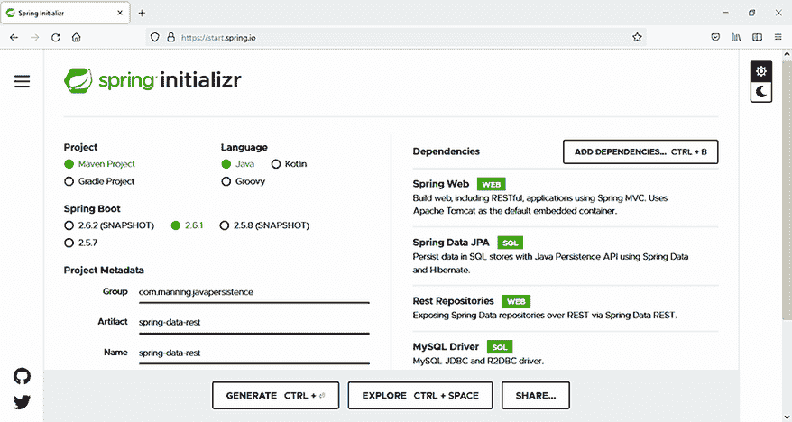

图 16.1 使用 Spring Data REST 和 MySQL 创建新的 Spring Boot 项目

我们还将添加以下依赖项：

+   Spring Web (这将在 Maven pom.xml 文件中添加 `spring-boot-starter-web`)

+   Spring Data JPA (这将在 Maven pom.xml 文件中添加 `spring-boot-starter-data-jpa`)

+   REST 仓库（这将在 Maven pom.xml 文件中添加 `spring-boot-starter-data-rest`)

+   MySQL 驱动程序（这将在 Maven pom.xml 文件中添加 `mysql-connector-java`)

注意：要执行源代码中的示例，您首先需要运行 Ch16.sql 脚本。

下面的列表中的 pom.xml 文件包括了启动 Spring Data REST 项目时我们添加的依赖项。这个 Spring Data REST 应用程序将访问一个 MySQL 数据库，因此我们需要驱动程序。

列表 16.1 `pom.xml` Maven 文件

```
Path: Ch16/spring-data-rest/pom.xml

<dependency>                                                    Ⓐ
    <groupId>org.springframework.boot</groupId>                 Ⓐ
    <artifactId>spring-boot-starter-web</artifactId>            Ⓐ
</dependency>                                                   Ⓐ
<dependency>                                                    Ⓑ
    <groupId>org.springframework.boot</groupId>                 Ⓑ
    <artifactId>spring-boot-starter-data-jpa</artifactId>       Ⓑ
</dependency>                                                   Ⓑ
<dependency>                                                    Ⓒ
    <groupId>org.springframework.boot</groupId>                 Ⓒ
    <artifactId>spring-boot-starter-data-rest</artifactId>      Ⓒ
</dependency>                                                   Ⓒ
<dependency>                                                    Ⓓ
    <groupId>mysql</groupId>                                    Ⓓ
    <artifactId>mysql-connector-java</artifactId>               Ⓓ
    <scope>runtime</scope>                                      Ⓓ
</dependency>                                                   Ⓓ
```

Ⓐ `spring-boot-starter-web` 是 Spring Boot 用于构建 Web 应用程序的启动依赖项。

Ⓑ `spring-boot-starter-data-jpa` 是 Spring Boot 用于通过 Spring Data JPA 连接到关系型数据库的启动依赖项。

Ⓒ `spring-boot-starter-data-rest` 是 Spring Boot 用于 Spring Data REST 应用程序的启动依赖项。

Ⓓ `mysql-connector-java` 是 MySQL 的 JDBC 驱动程序。它是一个运行时依赖项，因此仅在运行时需要在类路径中。

下一步是填写 Spring Boot 的 `application.properties` 文件，该文件可以包含应用程序将使用的各种属性。Spring Boot 将自动从类路径中查找并加载 `application.properties` 文件——Maven 将 `src/main/resources` 文件夹添加到类路径中。

在 Spring Boot 应用程序中提供参数有几种方式，.properties 文件只是其中之一。参数也可以来自源代码或作为命令行参数——有关详细信息，请参阅 Spring Boot 文档。

对于我们的应用程序，`application.properties` 配置文件将如下所示。

列表 16.2 `application.properties` 文件

```
Path: Ch16/spring-data-rest/src/main/resources/application.properties

server.port=8081                                                            Ⓐ
spring.datasource.url=jdbc:mysql://localhost:3306/CH16_SPRINGDATAREST
➥ ?serverTimezone=UTC                                                      Ⓑ
spring.datasource.username=root                                             Ⓒ
spring.datasource.password=                                                 Ⓒ
spring.jpa.properties.hibernate.dialect=org.hibernate.dialect.MySQL8Dialect Ⓓ
spring.jpa.show-sql=true                                                    Ⓔ
spring.jpa.hibernate.ddl-auto=create                                        Ⓕ
```

Ⓐ 应用程序将在端口 8081 上启动。

Ⓑ 数据库的 URL。

Ⓒ 访问数据库的凭证。将它们替换为您的机器上的凭证，并在实际生活中使用密码。

Ⓓ 数据库的方言是 MySQL。

Ⓔ 在它们执行时显示 SQL 查询。

Ⓕ 在每次应用程序执行时重新创建表。

`User` 类现在将包含一个由 `@Version` 注解的字段。如第 11.2.2 节所述，每当修改后的 `User` 实例被持久化时，字段值都会递增。第 16.3 节将演示如何使用此字段通过 ETags 进行条件 REST 请求。

列表 16.3 修改后的 `User` 类

```
Path: Ch16/spring-data-rest/src/main/java/com/manning/javapersistence/ch16
➥ /model/User.java

@Entity
public class User {

    @Id
    @GeneratedValue
    private Long id;

    @Version
    private Long version;

    private String name;
    private boolean isRegistered;

    private boolean isCitizen;

    //constructors, getters and setters
}
```

用户将参与由 `Auction` 类表示的拍卖。拍卖由 `auctionNumber`、`seats` 的数量和 `users` 集合来描述。

列表 16.4 `Auction` 类

```
Path: Ch16/ spring-data-rest/src/main/java/com/manning/javapersistence/ch16
➥ /model/Auction.java

public class Auction {

    private String auctionNumber;
    private int seats;
    private Set<User> users = new HashSet<>();

    //constructors, getters and methods
}
```

参与拍卖的用户将从 CSV 文件中读取，在 `CsvDataLoader` 类中。我们将使用 `@Bean` 注解创建一个 Bean，该 Bean 将由 Spring 管理并注入到应用程序中。

列表 16.5 `CsvDataLoader` 类

```
Path: Ch16/spring-data-rest/src/main/java/com/manning/javapersistence/ch16
➥ /beans/CsvDataLoader.java

public class CsvDataLoader {

    @Bean                                                                   Ⓐ
    public Auction buildAuctionFromCsv() throws IOException {
        Auction auction = new Auction("1234", 20);                          Ⓑ
        try (BufferedReader reader = new BufferedReader(                    Ⓒ
             new FileReader("src/main/resources/users_information.csv"))) { Ⓒ
            String line = null;
            do {
                line = reader.readLine();                                   Ⓓ
                if (line != null) {
                    User user = new User(line);                             Ⓔ
                    user.setIsRegistered(false);                            Ⓔ
                    auction.addUser(user);                                  Ⓔ
                }
            } while (line != null);

        }

        return auction;                                                     Ⓕ
    }
}
```

Ⓐ 方法的结果将是一个由 Spring 管理的 Bean。

Ⓑ 创建 `Auction` 对象。

Ⓒ 使用 CSV 文件中的信息。

Ⓓ 逐行读取。

Ⓔ 从读取的信息中创建用户，配置它，并将其添加到拍卖中。

Ⓕ 返回 `Auction` Bean。

`UserRepository` 接口扩展了 `JpaRepository<User, Long>`，继承了 JPA 相关的方法，并管理 `User` 实体，具有 `Long` 类型的 ID。

列表 16.6 `UserRepository` 接口

```
Path: Ch16/spring-data-rest/src/main/java/com/manning/javapersistence/ch16
➥ /repositories/UserRepository.java

public interface UserRepository extends JpaRepository<User, Long> {

}
```

Spring Boot 应用程序将导入在`CsvDataLoader`类中创建的 bean，并自动装配它。它还将创建一个类型为`ApplicationRunner`的 bean。这是一个 Spring Boot 功能接口（一个只有一个抽象方法的接口），它提供了访问应用程序参数的权限。这个`ApplicationRunner`接口被创建，并且它的单个方法将在`SpringApplication`的`run()`方法完成之前执行。

列表 16.7 `Application`类

```
Path: Ch16/spring-data-rest/src/main/java/com/manning/javapersistence/ch16
➥ /Application.java

@SpringBootApplication

@Import(CsvDataLoader.class)                                                Ⓐ
public class Application {

    @Autowired                                                              Ⓑ
    private Auction auction;                                                Ⓑ

    public static void main(String[] args) {
        SpringApplication.run(Application.class, args);
    }

    @Bean                                                                   Ⓒ
    ApplicationRunner configureRepository(UserRepository userRepository) {  Ⓒ
        return args -> {                                          

            for (User user : auction.getUsers()) {                          Ⓒ
                userRepository.save(user);                                  Ⓒ
            }

        };
    }
}
```

Ⓐ 导入`CsvDataLoader`类及其创建的`Auction` bean。

Ⓑ 自动装配导入的`Auction` bean。

Ⓒ 浏览拍卖中的所有用户，并将它们保存到仓库中。

我们可以在浏览器中访问 Spring Data REST 应用程序（http://localhost:8081/users），如图 16.2 所示。我们可以获取用户信息，并轻松地在记录之间导航。Spring Data REST 将公开要访问的 API 信息，并为每个记录提供链接。

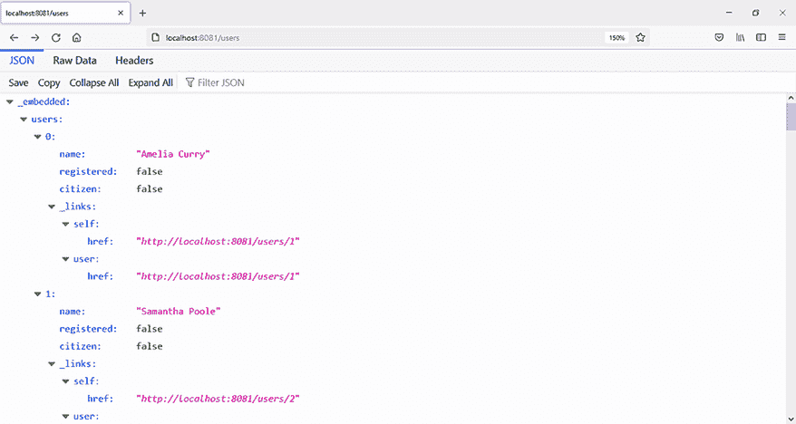

图 16.2 从浏览器访问 Spring Data REST 应用程序

我们可以使用 REST 客户端测试这个 REST API 端点。IntelliJ IDEA Ultimate 版提供了一个这样的 REST 客户端，但您也可以使用不同的客户端（如 cURL 或 Postman）。我们可以执行以下命令（见图 16.3）：

```
GET http://localhost:8081/users/1
```

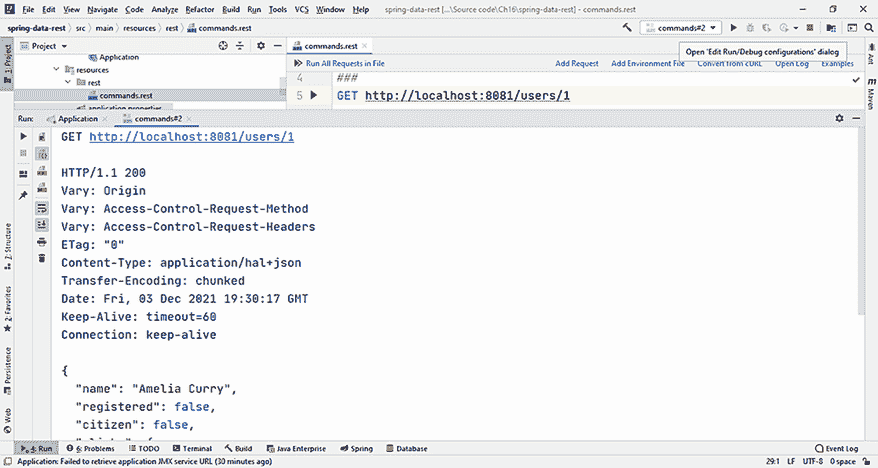

图 16.3 在 IntelliJ IDEA Ultimate 版 REST 客户端中执行`GET http://localhost:8081/users/1`命令的结果

## 16.3 使用 ETags 进行条件请求

网络上的任何信息交换都需要时间。信息越小，我们的程序运行得越快。但何时以及如何减少从服务器检索和通过网络传输的信息量呢？

假设我们需要多次执行如下命令：

```
GET http://localhost:8081/users/1
```

我们将每次访问服务器，并将相同的信息发送到网络。这是低效的，我们希望限制客户端和服务器之间交换的数据量。

我们可以使用 ETags 进行条件请求，避免发送未更改的信息。ETag 是 Web 服务器返回的 HTTP 响应头。它将帮助我们确定给定 URL 的内容是否已修改，从而允许我们进行条件请求。

在`User`类中，有一个被`@Version`注解的字段：

```
@Version
   \1 Long version;
```

此字段也将用作 ETag。当我们向服务器执行此请求时，

```
GET http://localhost:8081/users/1
```

答案将在头部包含记录的版本（0），作为 ETag（见图 16.4）：

```
HTTP/1.1 200
Vary: Origin
Vary: Access-Control-Request-Method
Vary: Access-Control-Request-Headers
ETag: "0"
```

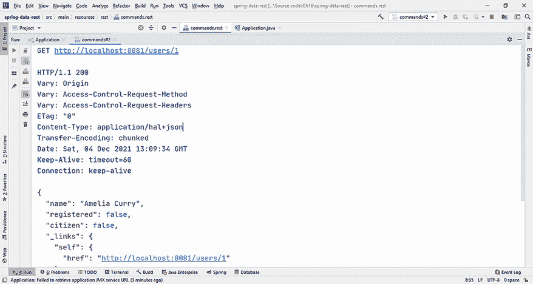

图 16.4 服务器的回答，包括头部上的 ETag，表示实体版本

使用这些信息，我们现在可以执行一个条件请求，并且只有当 ETag 与 0 不同时，才能获取 ID 为 1 的用户信息。

```
GET http://localhost:8081/users/1
If-None-Match: "0"
```

服务器响应将是 304（未修改）响应代码，以及一个空正文（见图 16.5）：

```
HTTP/1.1 304
Vary: Origin
Vary: Access-Control-Request-Method
Vary: Access-Control-Request-Headers
ETag: "0"
Date: Sat, 04 Dec 2021 13:19:11 GMT
Keep-Alive: timeout=60
Connection: keep-alive

<Response body is empty>
```

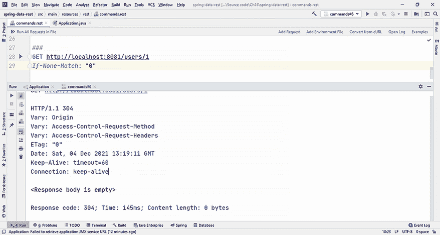

图 16.5 对于匹配现有 ETag 的记录，服务器响应没有正文。

现在，我们可以修改 ID 为 1 的用户的内 容，执行一个`PATCH`命令。我们使用`PATCH`而不是`PUT`，因为`PATCH`只会更新请求中包含的字段，而`PUT`将用新的实体替换整个实体。

```
PATCH http://localhost:8081/users/1
Content-Type: application/json
{
  "name": "Amelia Jones",
  "isRegistered": "true"
}
```

服务器响应将是 204（无内容）成功响应代码，ETag 将是记录增加的版本（1）（见图 16.6）：

```
HTTP/1.1 204
Vary: Origin
Vary: Access-Control-Request-Method
Vary: Access-Control-Request-Headers
ETag: "1"
Date: Sat, 04 Dec 2021 13:25:57 GMT
Keep-Alive: timeout=60
Connection: keep-alive

<Response body is empty>
```

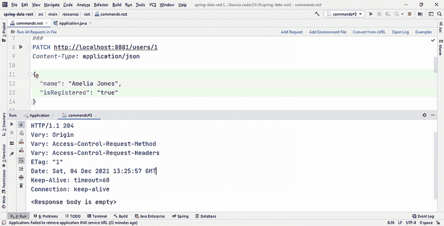

图 16.6 修复用户后，服务器响应将 ETag 增加到 1。

现在，我们可以重新执行条件请求，以获取 ID 为 1 的用户的详细信息，前提是 ETag 与 0 不同：

```
GET http://localhost:8081/users/1
If-None-Match: "0"
```

由于记录的版本已从 0 更改为 1，条件请求将获得带有 200（成功）响应代码和用户全部信息的响应（见图 16.7）：

```
HTTP/1.1 200
Vary: Origin
Vary: Access-Control-Request-Method
Vary: Access-Control-Request-Headers
ETag: "1"
```

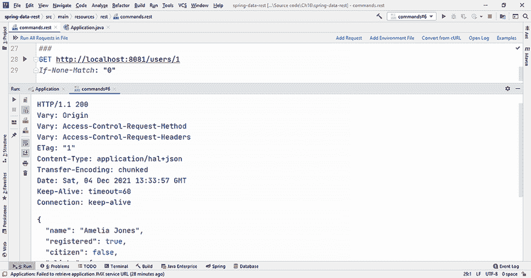

图 16.7 服务器响应包括关于用户的全部信息，ETag 从 0 变为 1。

## 16.4 限制对存储库、方法和字段的访问

Spring Data REST 默认将所有公共顶级存储库接口导出。但实际用例通常需要限制对特定方法、字段甚至整个存储库的访问。我们可以使用`@RepositoryRestResource`注解来阻止导出*接口*或自定义端点的访问。

例如，如果管理实体是`User`，Spring Data REST 将默认将其导出到`/users`路径。我们可以通过使用`@RepositoryRestResource`注解的`exported = false`选项来阻止整个存储库的导出。存储库将看起来像这样：

```
@RepositoryRestResource(path = "users", exported = false)

public interface UserRepository extends JpaRepository<User, Long> {

}
```

对此存储库执行的任何命令都将导致错误。例如，执行

```
GET http://localhost:8081/users/1
```

将从服务器生成 404（未找到）响应代码（见图 16.8）：

```
HTTP/1.1 404
Vary: Origin
Vary: Access-Control-Request-Method
Vary: Access-Control-Request-Headers
Content-Type: application/json
```

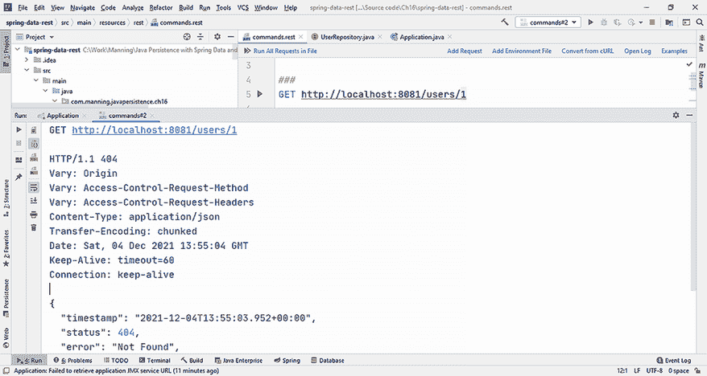

图 16.8 阻止导出存储库将阻止 REST 接口的任何交互。

为了方便，我们将使用带有默认选项的`@RepositoryRestResource`注解来处理`UserRepository`接口。

默认情况下，Spring Data REST 还将导出存储库接口的所有方法，但我们可以使用`@RestResource(exported = false)`注解来阻止对这些*方法*的访问。对于`UserRepository`接口，我们不会导出删除方法。

列表 16.8 `UserRepository`接口

```
Path: Ch16/spring-data-rest/src/main/java/com/manning/javapersistence/ch16
➥ /repositories/UserRepository.java

@RepositoryRestResource(path = "users")                             Ⓐ
public interface UserRepository extends JpaRepository<User, Long> {

    @Override
    @RestResource(exported = false)                                 Ⓑ
    void deleteById(Long id);

    @Override
    @RestResource(exported = false)                                 Ⓑ
    void delete(User entity);
}
```

Ⓐ 使用`@RepositoryRestResource`注解将存储库导出到`/users`路径。这是默认选项。

使用`@RestResource(exported = false)`注解来阻止导出存储库的删除方法。

如果我们现在执行`DELETE`命令，

```
DELETE http://localhost:8081/users/1
```

服务器将响应 405（方法不允许）的响应代码，因为删除方法没有被导出（见图 16.9）。允许的方法有`GET`、`HEAD`、`PUT`、`PATCH`和`OPTIONS`：

```
HTTP/1.1 405
Vary: Origin
Vary: Access-Control-Request-Method
Vary: Access-Control-Request-Headers
Allow: GET,HEAD,PUT,PATCH,OPTIONS
```

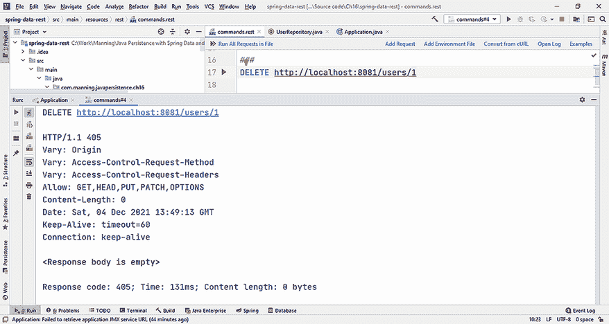

图 16.9 删除方法不再由 Spring Data REST 导出，服务器也不允许。

我们可以通过使用`@JsonIgnore`注解来限制对特定字段的访问，并在 REST 接口中不暴露它们。例如，我们可以在`User`类中，在`isRegistered`方法上使用此注解：

```
@JsonIgnore
public boolean isRegistered() {
   return isRegistered;
}
```

通过浏览器访问存储库将不再提供`isRegistered`字段信息。您可以在图 16.10 中看到这一点，并与图 16.2 进行比较。

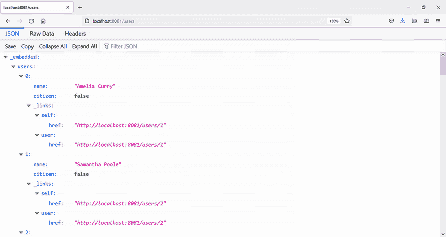

图 16.10 REST 客户端不再获取`isRegistered`信息。

## 16.5 使用 REST 事件

在某些情况下，我们可能需要在特定事件发生时向应用程序的行为添加副作用。当与实体一起工作时，REST 应用程序可以发出 10 种不同类型的事件。所有这些都扩展了`org.springframework.data .rest.core.event.RepositoryEvent`类，并属于同一个`org.springframework.data.rest.core.event`包：

+   `BeforeCreateEvent`

+   `AfterCreateEvent`

+   `BeforeSaveEvent`

+   `AfterSaveEvent`

+   `BeforeLinkSaveEvent`

+   `AfterLinkSaveEvent`

+   `BeforeDeleteEvent`

+   `AfterDeleteEvent`

+   `BeforeLinkDelete`

+   `AfterLinkDelete`

这些事件可以有两种处理方式：

+   编写注解处理程序

+   编写`ApplicationListener`

让我们看看这两种选项。

### 16.5.1 编写注解处理程序

要通过编写`AnnotatedHandler`来添加副作用，我们可以创建一个带有`@RepositoryEventHandler`注解的 POJO 类。这个注解告诉 Spring 管理的`BeanPostProcessor`，这个类必须检查其处理方法。`BeanPostProcessor`将浏览带有此注解的类的所有方法，并检测与不同事件对应的注解。

事件处理程序 bean 必须在容器控制之下。我们可以将类注解为`@Service`（这是一个`@Component`的子类型），这样它就会被`@ComponentScan`或`@SpringBootApplication`考虑。

我们跟踪的事件的实体由注解方法的第一个参数的类型提供。在以下示例中，处理程序的方法将有一个`User`实体作为参数。

注解方法和事件之间的关系总结在表 16.1 中。

表 16.1 `AnnotatedHandler`注解及其对应的事件

| 注解 | 事件 |
| --- | --- |
| `@HandleBeforeCreate` `@HandleAfterCreate` | `POST`事件 |
| `@HandleBeforeSave` `@HandleAfterSave` | `PUT`和`PATCH`事件 |
| `@HandleBeforeDelete` `@HandleAfterDelete` | `DELETE`事件 |
| `@HandleBeforeLinkSave` `@HandleAfterLinkSave` | 将链接对象保存到存储库 |
| `@HandleBeforeLinkDelete` | `@HandleAfterLinkDelete` | 从存储库中删除链接对象 |

在以下列表中展示了带有`@RepositoryEventHandler`注解的 POJO 类`UserRepositoryEventHandler`。

列表 16.9 `UserRepositoryEventHandler`类

```
Path: Ch16/spring-data-rest-events/src/main/java/com/manning
➥ /javapersistence/ch16/events/UserRepositoryEventHandler.java

@RepositoryEventHandler                                 Ⓐ
@Service                                                Ⓑ
public class UserRepositoryEventHandler {
    @HandleBeforeCreate                                 Ⓒ
    public void handleUserBeforeCreate(User user) {     Ⓓ
      //manage the event
    }

    //other methods
}
```

Ⓐ 使用`@RepositoryEventHandler`注解注解类，以告知 Spring `BeanPostProcessor`检查其处理方法。

Ⓑ 使用`@Service`注解注解类，使其处于容器的控制之下。

Ⓒ 使用`@HandleBeforeCreate`注解方法，将其与`POST`事件关联。

Ⓓ 该方法以实体`User`作为第一个参数，表示我们正在跟踪的事件的类型。

### 16.5.2 编写 ApplicationListener

要通过编写一个`ApplicationListener`来添加副作用，我们将扩展`AbstractRepositoryEventListener`抽象类。这个类通过事件发生的实体类型进行了泛化。它将监听事件并调用相应的方法。我们将自定义监听器注解为`@Service`（这是一个`@Component`的子类型），这样它就会被`@ComponentScan`或`@SpringBootApplication`考虑。

`AbstractRepositoryEventListener`抽象类已经包含了一系列空的受保护方法来处理事件。我们需要覆盖并仅将我们感兴趣的公开。

方法与事件之间的关系总结在表 16.2 中。

表 16.2 `ApplicationListener`方法和相应的事件

| 方法 | 事件 |
| --- | --- |
| `onBeforeCreate` | `onAfterCreate` | `POST`事件 |
| `onBeforeSave` | `onAfterSave` | `PUT`和`PATCH`事件 |
| `onBeforeDelete` | `onAfterDelete` | `DELETE`事件 |
| `onBeforeLinkSave` | `onAfterLinkSave` | 将链接对象保存到存储库 |
| `onBeforeLinkDelete` | `onAfterLinkDelete` | 从存储库中删除链接对象 |

扩展了`AbstractRepositoryEventListener`抽象类的`RepositoryEventListener`类包含了响应事件的函数。它将在以下列表中展示。

列表 16.10 `RepositoryEventListener`类

```
Path: Ch16/spring-data-rest-events/src/main/java/com/manning
➥ /javapersistence/ch16/events/RepositoryEventListener.java

@Service                                                Ⓐ
public class RepositoryEventListener extends            Ⓑ
        AbstractRepositoryEventListener<User> {         Ⓑ

    @Override                                           Ⓒ
    public void onBeforeCreate(User user) {             Ⓒ
       //manage the event
    }
    //other methods
}
```

Ⓐ 使用`@Service`注解注解类，使其处于容器的控制之下。

Ⓑ 通过`User`实体扩展`AbstractRepositoryEventListener`，这是事件发生的实体。

Ⓒ 该方法以`User`实体作为第一个参数，表示我们正在跟踪的事件的类型。

现在我们可以运行应用程序并执行以下 REST 命令：

```
POST http://localhost:8081/users
Content-Type: application/json
{
  "name": "John Smith"
}
```

处理器和监听器将对事件做出反应，并作为副作用生成额外的行为，如图 16.11 所示。

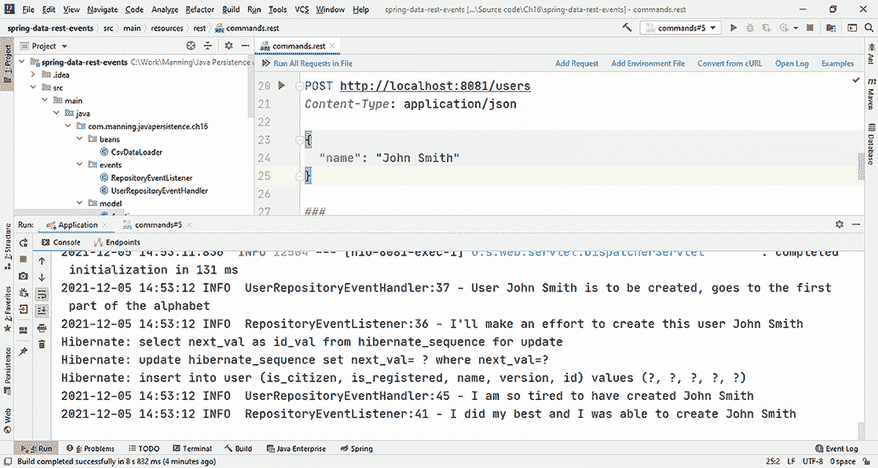

图 16.11 处理器和监听器对 REST 事件做出反应产生的额外行为（副作用）

处理事件（使用处理器和使用监听器）的两种方法提供类似的行为，并且它们处理相同类型的事件。在其他条件相同的情况下，处理器提供仅在声明性级别（类和方法上的注解）工作的优势，而监听器要求我们扩展一个现有的抽象类，这意味着它们挂在一个现有的层次结构中，这意味着层次结构设计的自由度较低。

## 16.6 使用投影和摘录

Spring Data REST 提供了您正在处理的域模型的默认视图，但现实世界的用例可能需要对其进行更改或适应特定需求。您可以使用投影和摘录来实现这一点，提供导出信息的特定视图。

我们将添加新的`Address`类到项目中。它将包含一些字段，我们希望使用`toString`方法显示其中的信息。

列表 16.11 `Address`类

```
Path: Ch16/spring-data-rest-projections/src/main/java/com/manning
➥ /javapersistence/ch16/model/Address.java

@Entity
public class Address {

   @GeneratedValue
   @Id
   private Long id;
   private String street, zipCode, city, state;

   //constructors and methods

   public String toString() {
      return String.format("%s, %s %s, %s", street, zipCode, city, state);
   }
}
```

`User`和`Address`之间存在一对一的关系，因为我们已经在`User`实体中引入了一个新字段：

```
@OneToOne(cascade = CascadeType.ALL, orphanRemoval = true)
private Address address;
```

`CascadeType.ALL`选项将导致持久化操作级联到相关实体。`orphanRemoval=true`参数指定我们希望在`Address`不再被`User`引用时永久删除它。您可以回顾第八章以获取有关这些选项的更多详细信息。

如果我们访问 http://localhost:8081/users/1 URL，我们将获得 ID 为 1 的用户的默认视图，显示所有字段以及地址字段，如图 16.12 所示。

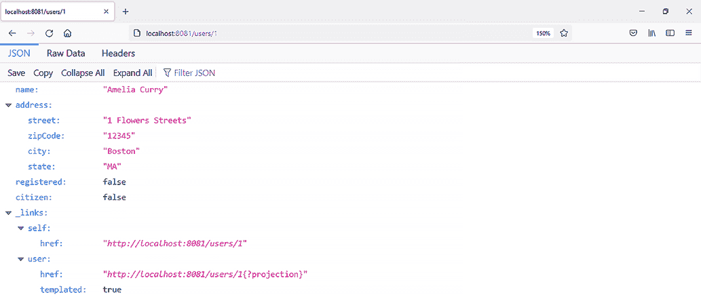

图 16.12 带有地址的用户默认视图

现在我们将添加新的`UserProjection`接口到项目中（列表 16.12）。借助`@Projection`注解，我们可以在`User`实体上创建`summary`投影，这将仅导出用户名称和地址，根据`toString`方法显示的方式。我们将使用 Spring 表达式语言（SpEL）来完成此操作。

列表 16.12 `UserProjection`接口

```
Path: Ch16/spring-data-rest-projections/src/main/java/com/manning
➥ /javapersistence/ch16/model/UserProjection.java

@Projection(name = "summary", types = User.class)    Ⓐ
public interface UserProjection {

   String getName();                                 Ⓑ

   @Value("#{target.address.toString()}")            Ⓒ
   String getAddress();                              Ⓒ
}
```

Ⓐ 投影名为`summary`，并应用于`User`实体。

Ⓑ 由于字段名为`name`，我们需要编写一个`getName`方法来导出它，遵循 getter 名称约定。

Ⓒ 根据由`toString`方法显示的方式导出`address`。我们使用`@Value`注解，包含一个 SpEL 表达式。我们还需要遵循 getter 名称约定，因此该方法被命名为`getAddress`。

如果我们访问 http://localhost:8081/users/1?projection=summary URL（包含作为参数的投影名称），我们将获得 ID 为 1 的用户的视图，显示`name`字段和由`toString`方法提供的地址。这如图 16.13 所示。

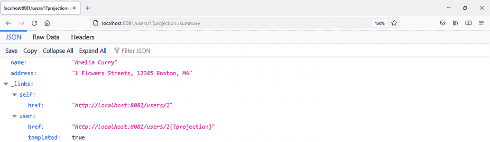

图 16.13 由`summary`投影提供的带有地址的用户视图

我们可能希望在集合的整体级别应用投影的默认视图。在这种情况下，我们需要前往已经定义的仓库，并使用`@RepositoryRestResource`注解的`excerptProjection = UserProjection.class`选项，如列表 16.13 所示。

列表 16.13 修改后的`UserRepository`接口

```
Path: Ch16/spring-data-rest-projections/src/main/java/com/manning
➥ /javapersistence/ch16/repositories/UserRepository.java

@RepositoryRestResource(path = "users",
                        excerptProjection = UserProjection.class)
public interface UserRepository extends JpaRepository<User, Long> {
}
```

如果我们访问 http://localhost:8081/users/ URL，我们将获得所有用户的视图，根据投影定义显示，如图 16.14 所示。

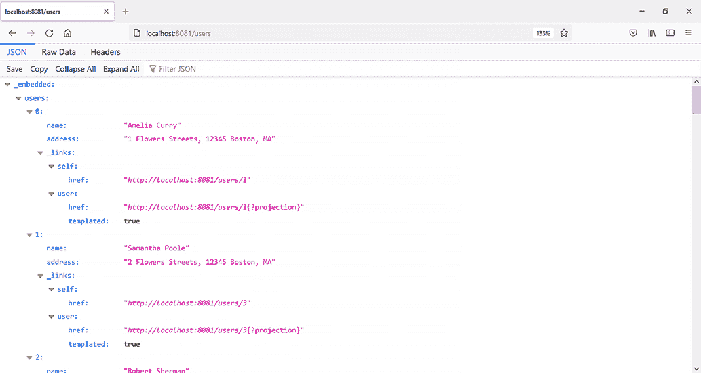

图 16.14 根据`summary`投影显示的整个`users`集合视图

## 摘要

+   使用 Spring Boot，您可以创建和配置一个 Spring Data REST 项目，以提供与数据库交互的接口，以及管理和持久化信息。

+   您可以使用 ETags 来执行高效请求，从服务器获取数据，避免传输客户端已经拥有的信息。

+   您可以限制对仓库、方法和字段的访问，并仅导出您希望允许的信息和操作。

+   您可以与 REST 事件一起工作，并通过处理程序和监听器来管理它们。它们可以通过元信息或通过扩展现有类来工作。

+   您可以使用投影和摘录来提供根据不同用户需求定制的仓库信息视图。
