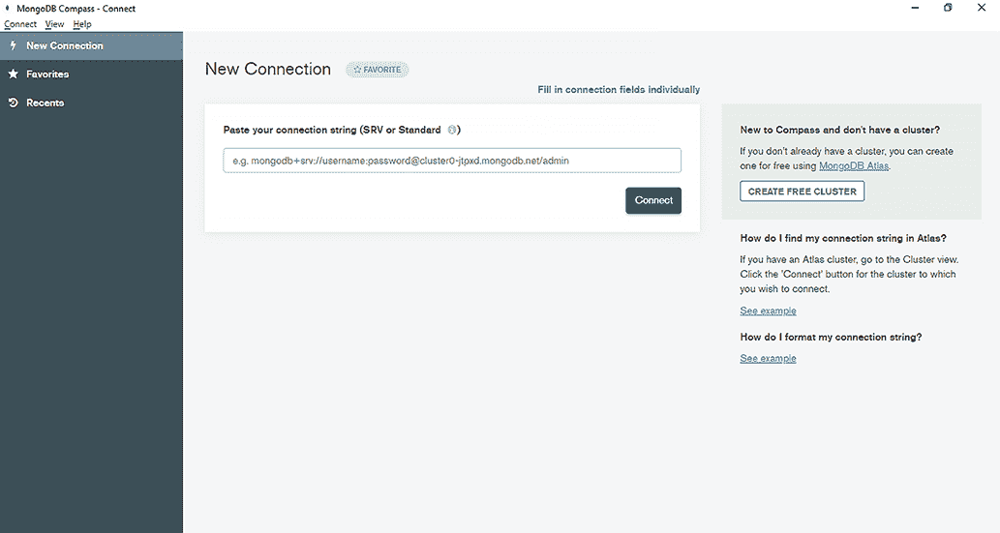
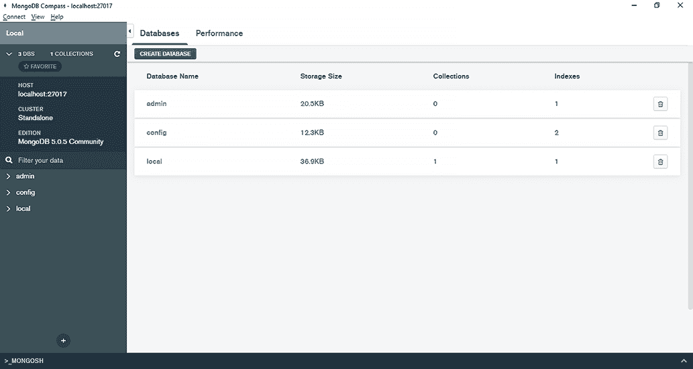
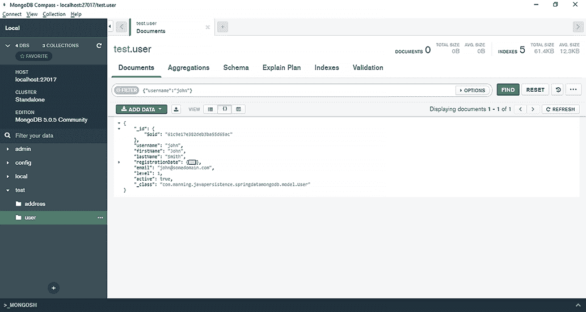
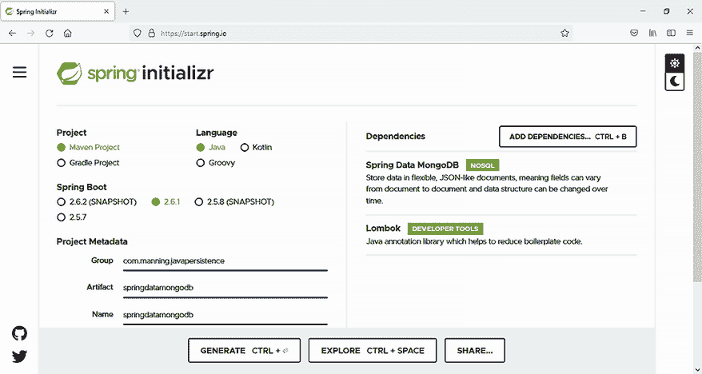

# 17 使用 Spring Data MongoDB

本章涵盖

+   介绍 MongoDB

+   检查 Spring Data MongoDB

+   使用 MongoRepository 访问数据库

+   使用 MongoTemplate 访问数据库

文档型数据库是 NoSQL 数据库的一种类型，其中信息以键/值存储。MongoDB 就是这样一种数据库程序。Spring Data MongoDB 作为更大的 Spring Data 项目的一部分，简化了 Java 程序与 MongoDB 文档数据库的交互。

## 17.1 介绍 MongoDB

MongoDB 是一个开源的文档型 NoSQL 数据库。MongoDB 使用类似 JSON 的文档来存储信息，并使用数据库、集合和文档的概念。

+   *数据库*—数据库代表集合的容器。安装 MongoDB 后，您通常会获得一组数据库。

+   *集合* —在关系数据库管理系统（RDBMS）的世界中，集合类似于表。一个集合可能包含一组文档。

+   *文档*—一个文档代表一组键/值对，相当于 RDBMS 中的行。属于同一集合的文档可能具有不同的字段集。集合中多个文档共有的字段可能包含不同类型的数据—这种情况下称为动态模式。

表 17.1 总结了关系数据库和无 SQL 数据库 MongoDB 之间的术语等效关系。

表 17.1 比较术语：RDBMS 与 MongoDB

| 关系数据库 | MongoDB |
| --- | --- |
| 数据库 | 数据库 |
| 表 | 集合 |
| 行 | 文档 |
| 列 | 字段 |

您可以在此处下载 MongoDB 社区版安装包：[`www.mongodb.com/try/download/community`](https://www.mongodb.com/try/download/community)。根据您的操作系统，安装说明可以在此处找到：[`docs.mongodb.com/manual/administration/install-community/`](https://docs.mongodb.com/manual/administration/install-community/).

安装 MongoDB 后，您可以打开 MongoDB Compass 程序，如图 17.1 所示。MongoDB Compass 是用于与 MongoDB 数据库交互和查询的图形用户界面。



列表 17.1 打开 MongoDB Compass 程序

点击连接按钮，您将连接到本地服务器，如图 17.2 所示。



列表 17.2 连接到本地 MongoDB 服务器

MongoDB 集合中的数据以 JSON 格式表示。描述我们 CaveatEmptor 应用程序用户的典型 MongoDB 文档可能看起来像这样：

```
{
"_id":{
    "$oid":"61c9e17e382deb3ba55d65ac"
},
"username":"john",
"firstName":"John",
"lastName":"Smith",
"registrationDate":{
    "$date":"2020-04-12T21:00:00.000Z"
},
"email":"john@somedomain.com",
"level":1,
"active":true,
"_class":"com.manning.javapersistence.springdatamongodb.model.User"
}
```

要选择满足特定条件的文档，您可以在 MongoDB Compass 程序中使用过滤器编辑框插入查询过滤器参数。例如，要选择用户名为“john”的文档，您需要插入查询过滤器`{"username":"john"}`并点击查找按钮，如图 17.3 所示。



列表 17.3 从 MongoDB 集合中选择文档

关于您可能想要执行的 MongoDB CRUD 操作的详细信息，请参阅官方文档：[`docs.mongodb.com/manual/crud/`](https://docs.mongodb.com/manual/crud/)。

## 17.2 介绍 Spring Data MongoDB

Spring Data MongoDB 是 Spring Data 项目的一部分，它允许 Java 程序使用 MongoDB，遵循 Spring Data 方法：仓库和自定义对象映射抽象、注解、基于仓库方法名的动态查询创建、与其他 Spring 项目的集成以及 Spring Boot。

为了演示 Spring Data MongoDB，我们将创建一个应用程序来管理和持久化 CaveatEmptor 用户。我们将创建一个使用 Spring Data MongoDB 的 Spring Boot 应用程序。为此，请访问 Spring Initializr 网站 ([`start.spring.io/`](https://start.spring.io/)) 并创建一个新的 Spring Boot 项目（见图 17.4），具有以下特性：

+   组：com.manning.javapersistence

+   艺术品：springdatamongodb

+   描述：Spring Data MongoDB



列表 17.4 使用 Spring Data MongoDB 创建新的 Spring Boot 项目

我们还将添加以下依赖项：

+   Spring Data MongoDB（这将向 Maven pom.xml 文件中添加 `spring-boot-starter-data-mongodb`）

+   Lombok（这将向 Maven pom.xml 文件中添加 `org.projectlombok,lombok`）

`pom.xml` 文件（列表 17.1）包括我们之前添加到启动项目的依赖项：对 Spring Data MongoDB 框架和 Lombok 的依赖。Lombok 是一个 Java 库，可以通过注解自动创建构造函数、获取器和设置器，从而减少样板代码。Lombok 有其不足之处，包括以下这些：您需要为 IDE 安装插件以理解注解，并避免对缺失的构造函数、获取器和设置器发出警告；并且您无法在生成的代码中设置断点进行调试（但在这类方法中进行调试的情况很少）。

列表 17.1 Maven 的 pom.xml 文件

```
Path: Ch17/springdatamongodb/pom.xml

\1                                                     Ⓐ
    <groupId>org.springframework.boot</groupId>                  Ⓐ
    <artifactId>spring-boot-starter-data-mongodb</artifactId>    Ⓐ
</dependency>                                                    Ⓐ
<dependency>                                                     Ⓑ
    <groupId>org.projectlombok</groupId>                         Ⓑ
    <artifactId>lombok</artifactId>                              Ⓑ
</dependency>                                                    Ⓑ
```

Ⓐ `spring-boot-starter-data-mongodb` 是 Spring Boot 用于通过 Spring Data 连接到 MongoDB 数据库的启动依赖项。

Ⓑ `Lombok` 允许我们减少样板代码，并依赖自动生成的构造函数、获取器和设置器。

我们下一步是填写 Spring Boot 应用程序的应用程序.properties 文件，该文件可以包含应用程序将使用的各种属性。Spring Boot 将自动从类路径中查找并加载 application.properties，并且 Maven 将 src/main/resources 文件夹添加到类路径中。应用程序.properties 配置文件如列表 17.2 所示。

列表 17.2 应用程序.properties 文件

```
Path: Ch17/springdatamongodb/src/main/resources/application.properties

logging.level.org.springframework.data.mongodb.core.MongoTemplate=DEBUG   Ⓐ
spring.data.mongodb.auto-index-creation=true                              Ⓑ
```

Ⓐ Spring Data MongoDB 应用程序以 DEBUG 级别记录查询。因此，要启用查询记录，我们必须将日志级别设置为 DEBUG。

Ⓑ 在 Spring Data MongoDB 中，索引的创建默认是禁用的。通过将 `spring.data.mongodb.auto-index-creation` 属性设置为 `true` 来启用它。

`User` 类现在将包含特定于 Spring Data MongoDB 的注解。表 17.2 检查了几个注解和类，然后我们将通过操作 `User` 类来观察它们在实际中的应用。

表 17.2 Spring Data MongoDB 注解和类

| Spring Data MongoDB 注解/类 | 含义 |
| --- | --- |
| `@Document` | 一个要持久化到 MongoDB 的域对象 |
| `@Indexed` | 一个由 MongoDB 索引的字段 |
| `@CompoundIndexes` | 一个用于复合索引的容器注解；它定义了一个多个 `@CompoundIndex` 注解的集合 |
| `@CompoundIndex` | 注解一个类以在多个字段上使用复合索引 |
| `IndexDirection` | 一个枚举，用于确定索引方向：`ASCENDING`（默认）或 `DESCENDING` |

`org.springframework.data.mongodb.core.mapping` 包包括 `@Document` 注解，而与索引相关的注解和枚举属于 `org.springframework.data.mongodb.core.index` 包。

对于 MongoDB 应用程序，我们还将使用一系列属于 `org.springframework.data.annotation` 包的核心 Spring Data 注解，如表 17.3 所示。

表 17.3 Spring Data 核心注解

| Spring Data 注解 | 含义 |
| --- | --- |
| `@Id` | 标记字段为标识符 |
| `@Transient` | 一个瞬态字段，它不会被持久化，也不会被持久化框架检查 |
| `@PersistenceConstructor` | 标记构造函数为持久化框架在从数据库检索信息时使用的首选构造函数 |

本章使用 Lombok 库通过注解自动创建构造函数、获取器和设置器，从而减少了样板代码。属于 `lombok` 包的最重要 Lombok 注解列于表 17.4 中。

表 17.4 Lombok 注解

| Lombok 注解 | 含义 |
| --- | --- |
| `@NoArgsConstructor` | 自动为它注解的类创建一个公共的无参数构造函数 |
| `@Getter` | 自动为它注解的字段创建一个公共的获取器 |
| `@Setter` | 自动为它注解的字段创建一个公共的设置器 |

Spring Data MongoDB 应用程序使用的 `User` 类在列表 17.3 中展示。注有 `@Transient` 的 `password` 字段将不会被保存到 MongoDB 数据库中——有许多情况下，您可能希望秘密信息，如密码，不被持久化。注有 `@PersistenceConstructor` 的构造函数将由 Spring Data MongoDB 在从数据库检索信息时使用。构造函数的 `ip` 参数注有 `@Value ("#root.ip ?: '192.168.1.100'")`，这意味着如果在从数据库检索文档时 `ip` 值不存在，它将自动采用此默认值。

列表 17.3 `User` 类

```
Path: Ch17/springdatamongodb/src/main/java/com/manning/javapersistence
➥ /springdatamongodb/model/User.java

@NoArgsConstructor
@Document
@CompoundIndexes({
        @CompoundIndex(name = "username_email",
                       def = "{'username' : 1, 'email': 1}"),
        @CompoundIndex(name = "lastName_firstName",
                       def = "{'lastName' : 1, 'firstName': 1}")
})
public class User {

    @Id
    @Getter
    private String id;

    @Getter
    @Setter
    @Indexed(direction = IndexDirection.ASCENDING)
    private String username;

    //fields annotated with @Getter and @Setter

    @Getter
    @Setter
    @Transient
    private String password;

    //another constructor

    @PersistenceConstructor
    public User(String username, String firstName, String lastName,
                @Value("#root.ip ?: '192.168.1.100'") String ip) {
        this.username = username;
        this.firstName = firstName;
        this.lastName = lastName;
        this.ip = ip;
    }
}
```

## 17.3 使用 MongoRepository 访问数据库

`UserRepository` 接口扩展了 `MongoRepository<User, String>`，继承了 MongoDB 相关的方法并管理具有 `String` 类型 ID 的 `User` 文档。

列表 17.4 `UserRepository` 接口

```
Path: Ch17/springdatamongodb/src/main/java/com/manning/javapersistence
➥ /springdatamongodb/repositories/UserRepository.java

public interface UserRepository extends MongoRepository<User, String> {
}
```

### 17.3.1 使用 Spring Data MongoDB 定义查询方法

我们将向 `UserRepository` 接口添加新方法，以便我们可以查询数据库中的某些特定文档并在测试中使用它们。

查询方法的目的在于从数据库中检索信息。Spring Data MongoDB 提供了一个查询构建器机制，类似于 Spring Data JPA 提供的——它将根据方法名称创建仓库方法的操作。请记住，查询机制会从方法名称中移除前缀和后缀，如 `find...By`、`get...By`、`query...By`、`read...By` 和 `count...By`，然后解析剩余部分。

与 Spring Data JPA 类似，Spring Data MongoDB 会查看方法的返回类型。如果我们想找到一个 `User` 并将其返回在 `Optional` 容器中，那么方法的返回类型将是 `Optional<User>`。

列表 17.5 新方法的 `UserRepository` 接口

```
Path: Ch17/springdatamongodb/src/main/java/com/manning/javapersistence
➥ /springdatamongodb/repositories/UserRepository.java

public interface UserRepository extends MongoRepository<User, String> {
   Optional<User> findByUsername(String username);
   List<User> findByLastName(String lastName);
   List<User> findAllByOrderByUsernameAsc();
   List<User> findByRegistrationDateBetween(LocalDate start, 
   ➥ LocalDate end);
List<User> findByUsernameAndEmail(String username, String email);
List<User> findByUsernameOrEmail(String username, String email);
List<User> findByUsernameIgnoreCase(String username);
List<User> findByLevelOrderByUsernameDesc(int level);
List<User> findByLevelGreaterThanEqual(int level);
List<User> findByUsernameContaining(String text);
List<User> findByUsernameLike(String text);
List<User> findByUsernameStartingWith(String start);
List<User> findByUsernameEndingWith(String end);
List<User> findByActive(boolean active);
List<User> findByRegistrationDateIn(Collection<LocalDate> dates);
List<User> findByRegistrationDateNotIn(Collection<LocalDate> dates);
}
```

方法的名称需要遵循确定结果查询的规则。如果方法命名错误（例如，查询方法中的实体属性不匹配），则在加载应用程序上下文时将得到错误。表 17.5 总结了构建 Spring Data MongoDB 查询方法中使用的必要关键字及其产生的条件。对于更完整的列表，请参阅附录 D。

表 17.5 Spring Data MongoDB 中关键字的使用及其产生的条件

| 关键字 | 示例 | 条件 |
| --- | --- | --- |
| `Is,` `Equals` | `findByUsername(String name)` `findByUsernameIs(String name)` `findByUsernameEquals(String name)` | `{"username":"name"}` |
| `And` | `findByUsernameAndEmail(String username, String email)` | `{"username":"username",` `"email":"email"}` |
| `Or` | `findByUsernameOrEmail(String username, String email)` | `{` `"$or"` `:` `[{ "username"` `:` `"username"},` `{` `"email"` `:` `"email"}]}` |
| `LessThan` | `findByRegistrationDateLessThan(LocalDate date)` | `{` `"registrationDate"` `: {` `"$lt"` `:` `{` `"$date"` `: "date"}}}` |
| `LessThanEqual` | `findByRegistrationDateLessThanEqual(LocalDate date)` | `{` `"registrationDate"` `: {` `"$lte"` `:` `{` `"$date"` `: "date"}}}` |
| `GreaterThan` | `findByRegistrationDateGreaterThan(LocalDate date)` | `{` `"registrationDate"` `: {` `"$gt"` `:` `{` `"$date"` `: "date"}}}` |
| `GreaterThanEqual` | `findByRegistrationDateGreaterThanEqual(LocalDate date)` | `{` `"registrationDate"` `: {` `"$gte"` `:` `{` `"$date"` `: `"date"}}}` |
| `Between` | `findByRegistrationDateBetween(LocalDate from, LocalDate to)` | `"registrationDate"` `:` `{ "$gte"` `:` `{` `"$date"` `: "from"},` `"$lte"` `:` `{ "$date"` `: "to"}}}` |
| `OrderBy` | `findByRegistrationDateOrderByUsernameDesc(LocalDate date)` | `"registrationDate": { "$date": "date"}}` |
| `Like` | `findByUsernameLike(String name)` | `{ "username": { "$regularExpression": { "pattern": "name", "options": ""}}}` |
| `NotLike` | `findByUsernameNotLike(String name)` | `{ "username": { "$not": { "$regularExpression": { "pattern": "name", "options": ""}}}}` |
| `Before` | `findByRegistrationDateBefore(LocalDate date)` | `{ "registrationDate": { "$lt": { "$date": "date"}}}` |
| `After` | `findByRegistrationDateAfter(LocalDate date)` | `{ "registrationDate": { "$gt": { "$date": "date"}}}` |
| `Null, IsNull` | `findByRegistrationDate(Is)Null()` | `{ "registrationDate": null}` |
| `NotNull, IsNotNull` | `findByRegistrationDate(Is)NotNull()` | `{ "registrationDate": { "$ne": null}}` |
| `Not` | `findByUsernameNot(String name)` | `{ "username": { "$ne": "name"}}` |

作为所有未来测试的基础类，我们将编写`SpringDataJdbcApplicationTests`抽象类（列表 17.6）。

`@SpringBootTest`注解由 Spring Boot 添加到最初创建的类中，它将告诉 Spring Boot 搜索主配置类（例如，被`@SpringBootApplication`注解的类）并创建用于测试的`ApplicationContext`。如您所回忆的，Spring Boot 添加到包含`main`方法的类上的`@SpringBootApplication`注解将启用 Spring Boot 自动配置机制，启用对应用程序所在包的扫描，并允许在上下文中注册额外的 bean。

使用`@TestInstance(TestInstance.Lifecycle.PER_CLASS)`注解，我们将要求 JUnit 5 创建一个测试类的单个实例，并为其所有测试方法重用。这将使我们能够将`@BeforeAll`和`@AfterAll`注解的方法设置为非静态，并直接在它们内部使用自动装配的`UserRepository`实例字段。被`@BeforeAll`注解的非静态方法将在所有扩展`SpringDataJdbcApplicationTests`的类的测试之前执行一次，并将`generateUsers`方法内部创建的用户列表保存到数据库中。被`@AfterAll`注解的非静态方法将在所有扩展`SpringDataJdbcApplicationTests`的类的测试之后执行一次，并从数据库中删除所有用户。

列表 17.6 `SpringDataJdbcApplicationTests`抽象类

```
Path: Ch17/springdatamongodb/src/test/java/com/manning/javapersistence
➥ /springdatamongodb/SpringDataMongoDBApplicationTests.java

@SpringBootTest
@TestInstance(TestInstance.Lifecycle.PER_CLASS)
abstract class SpringDataJdbcApplicationTests {
    @Autowired                                    Ⓐ
    UserRepository userRepository;                Ⓐ

    @BeforeAll
    void beforeAll() {
        userRepository.saveAll(generateUsers());
    }

    private static List<User> generateUsers() {
        List<User> users = new ArrayList<>();

        User john = new User("john", "John", "Smith");
        john.setRegistrationDate(LocalDate.of(2020, Month.APRIL, 13));
        john.setEmail("john@somedomain.com");
        john.setLevel(1);
        john.setActive(true);
        john.setPassword("password1");

        //create and set a total of 10 users

        users.add(john);
        //add a total of 10 users to the list

        return users;
    }
    @AfterAll
    void afterAll() {
        userRepository.deleteAll();
    }

}

```

Ⓐ 自动装配一个`UserRepository`实例。这是由于`@SpringBootApplication`注解，它启用了对应用程序所在包的扫描并在上下文中注册了 bean。

下一个测试将扩展这个类并使用已经填充的数据库。为了测试现在属于 `UserRepository` 的方法，我们将创建 `FindUsersTest` 类并遵循相同的测试编写方法：调用存储库方法并验证其结果。回想一下，在 JUnit 5 中，测试类和方法只需要是包私有的就足够了；它们不需要是公共的。

列表 17.7 `FindUsersTest` 类

```
Path: Ch17/springdatamongodb/src/test/java/com/manning/javapersistence
➥ /springdatamongodb/FindUsersTest.java

class FindUsersTest extends SpringDataJdbcApplicationTests{

    @Test
    void testFindAll() {
        List<User> users = userRepository.findAll();
        assertEquals(10, users.size());
    }

    @Test
    void testFindUser() {
        User beth = userRepository.findByUsername("beth").get();
        assertAll(
            () -> assertNotNull(beth.getId()),
            () -> assertEquals("beth", beth.getUsername())
        );
    }

    @Test
    void testFindAllByOrderByUsernameAsc() {
        List<User> users = userRepository.findAllByOrderByUsernameAsc();
        assertAll(() -> assertEquals(10, users.size()),
                  () -> assertEquals("beth", users.get(0).getUsername()),
                  () -> assertEquals("stephanie", users.get(users.size() -
                                                      1).getUsername()));
    }

    @Test
    void testFindByRegistrationDateBetween() {
        List<User> users = userRepository.findByRegistrationDateBetween(
                LocalDate.of(2020, Month.JULY, 1),
                LocalDate.of(2020, Month.DECEMBER, 31));
        assertEquals(4, users.size());
    }

    //more tests
}
```

### 17.3.2 限制查询结果、排序和分页

正如 Spring Data JPA 和 Spring Data JDBC 一样，`first` 和 `top` 关键字（等效使用）可以限制查询方法的结果。`top` 和 `first` 关键字后面可以跟一个可选的数值，表示要返回的最大结果大小。如果这个数值缺失，结果大小将是 1。

`Pageable` 是一个分页信息的接口，在实践中我们使用实现它的 `PageRequest` 类。这个类可以指定页码、页面大小和排序标准。

我们在这里要解决的问题将是获取一定数量的用户（例如按用户名或注册日期找到第一个用户，或者按给定等级找到第一个用户，并按注册日期排序），或者按页获取大量用户，这样我们就可以轻松地操作它们。

为了限制查询结果并进行排序和分页，我们将向 `UserRepository` 接口添加以下方法。

列表 17.8 在 `UserRepository` 中限制查询结果、排序和分页

```
Path: Ch17/springdatamongodb/src/main/java/com/manning/javapersistence
➥ /springdatamongodb/repositories/UserRepository.java

Optional<User> findFirstByOrderByUsernameAsc();
Optional<User> findTopByOrderByRegistrationDateDesc();
Page<User> findAll(Pageable pageable);
List<User> findFirst2ByLevel(int level, Sort sort);
List<User> findByLevel(int level, Sort sort);
List<User> findByActive(boolean active, Pageable pageable);
```

这些方法使用表 17.5 中介绍的查询构建器机制，但这次是为了限制查询结果，进行排序和分页。例如，`Optional<User> findFirstByOrderByUsernameAsc()` 方法将按用户名获取第一个用户（结果是一个 `Optional`，所以最终可能不存在）。`Page<User> findAll(Pageable pageable)` 方法将按页获取所有用户。我们将编写以下测试来验证这些新添加的方法是否正常工作。

列表 17.9 测试限制查询结果、排序和分页

```
Path: Ch17/springdatamongodb/src/test/java/com/manning/javapersistence
➥ /springdatamongodb/FindUsersSortingAndPagingTest.java

class FindUsersSortingAndPagingTest extends SpringDataJdbcApplicationTests {
    @Test
    void testOrder() {

        User user1 = userRepository.findFirstByOrderByUsernameAsc().get();  Ⓐ
        User user2 =                                                        Ⓐ
             userRepository.findTopByOrderByRegistrationDateDesc().get();   Ⓐ
        Page<User> userPage = userRepository.findAll(PageRequest.of(1, 3)); Ⓑ
        List<User> users = userRepository.findFirst2ByLevel(2,              Ⓒ
                                          Sort.by("registrationDate"));     Ⓒ

        assertAll(
                () -> assertEquals("beth", user1.getUsername()),
                () -> assertEquals("julius", user2.getUsername()),
                () -> assertEquals(2, users.size()),
                () -> assertEquals(3, userPage.getSize()),
                () -> assertEquals("beth", users.get(0).getUsername()),
                () -> assertEquals("marion", users.get(1).getUsername())
        );

    }

    @Test
    void testFindByLevel() {
        Sort.TypedSort<User> user = Sort.sort(User.class);                  Ⓓ

        List<User> users = userRepository.findByLevel(3,                    Ⓔ
                   user.by(User::getRegistrationDate).descending());        Ⓔ
        assertAll(
                () -> assertEquals(2, users.size()),
                () -> assertEquals("james", users.get(0).getUsername())
        );

    }

    @Test
    void testFindByActive() {
        List<User> users = userRepository.findByActive(true,                Ⓕ
                   PageRequest.of(1, 4, Sort.by("registrationDate")));      Ⓕ
        assertAll(
                () -> assertEquals(4, users.size()),
                () -> assertEquals("burk", users.get(0).getUsername())
        );
    }
}
```

Ⓐ 第一次测试将按用户名升序找到第一个用户，按注册日期降序找到第一个用户。

Ⓑ 查找所有用户，将它们分成页面，并返回第 1 页，大小为 3（页码从 0 开始）。

Ⓒ 查找前两个等级为 2 的用户，并按注册日期排序。

Ⓓ 第二次测试将在 `User` 类上定义一个排序标准。`Sort.TypedSort` 扩展了 `Sort` 并可以使用方法处理程序来定义排序属性。

Ⓔ 查找等级为 3 的用户，并按注册日期降序排序。

Ⓕ 第三次测试将找到活跃用户，按注册日期排序，并将它们分成页面，并返回第 1 页，大小为 4（页码从 0 开始）。

### 17.3.3 流式传输结果

返回多个结果的查询方法可以使用标准的 Java 接口，如 `Iterable`、`List`、`Set`。与 Spring Data JPA 和 Spring Data JDBC 类似，Spring Data MongoDB 支持 `Streamable`，它可以作为 `Iterable` 或任何集合类型的替代品。它允许我们连接 `Streamable`s 并直接过滤和映射元素。

我们在这里要解决的问题是以流的形式获取结果，而不是等待整个用户集合或一页用户被获取。这样我们就能快速开始处理流到我们这里的第一批结果。与集合不同，流只能被消费一次，且是不可变的。

我们将在 `UserRepository` 接口中添加以下方法。

列表 17.10 在 `UserRepository` 接口中添加返回 `Streamable` 的方法

```
Path: Ch17/springdatamongodb/src/main/java/com/manning/javapersistence
➥ /springdatamongodb/repositories/UserRepository.java

Streamable<User> findByEmailContaining(String text);
Streamable<User> findByLevel(int level);
```

我们将编写以下测试来验证这些新添加的方法如何与数据库交互，并提供作为流的结果。流作为 `try` 块的资源被自动关闭。另一种选择是显式调用 `close()` 方法。否则，流将保持与数据库的底层连接。

列表 17.11 测试返回 `Streamable` 的方法

```
Path: Ch17/springdatamongodb/src/test/java/com/manning/javapersistence
➥ /springdatamongodb/QueryResultsTest.java

@Test
void testStreamable() {
    try(Stream<User> result =                                    Ⓐ
           userRepository.findByEmailContaining("someother")     Ⓐ
            .and(userRepository.findByLevel(2))                  Ⓑ
            .stream().distinct())  {                             Ⓒ
      assertEquals(7, result.count());                           Ⓓ
   }
}
```

Ⓐ 测试将调用 `findByEmailContaining` 方法，搜索包含 `"someother"` 单词的电子邮件。

Ⓑ 测试将结果 `Streamable` 与 `Streamable` 连接，提供二级用户。

Ⓒ 它将将其转换为流并保留不同的用户。

Ⓓ 检查结果流包含 7 个用户。

### 17.3.4 `@Query` 注解

我们可以通过使用 `@org.springframework.data.mongodb.repository.Query` 注解来创建可以指定自定义查询的方法。使用这个 `@Query` 注解，方法名不需要遵循任何命名约定。自定义查询将有一个 MongoDB 查询过滤器作为参数，并且这个查询过滤器可以进行参数化。

我们将在 `UserRepository` 接口中添加新方法：它们将被 `@Query` 注解标记，并且它们的生成行为将取决于这些查询的定义。`value` 参数将指示要执行的查询过滤器。`fields` 参数将指示要包含或排除在结果中的字段。表 17.6 总结了最常见的查询操作和相应的 `@Query` 参数。对于完整的列表，请参阅 Spring Data MongoDB 文档。

表 17.6 查询操作及相应的 `@Query` 参数

| 操作 | `@Query` 参数 |
| --- | --- |
| 获取给定字段的 数据 | `value = { 'field' : ?0}` |
| 获取给定正则表达式的数据 | `value = { 'lastName' : { $regex: ?0 } }` |
| 获取字段大于参数的数据 | `value = { 'field' : { $gt: ?0 } }` |
| 获取字段大于或等于参数的数据 | `value = { 'field' : { $gte: ?0 } }` |
| 获取字段小于参数的数据 | `value = { 'field' : { $lt: ?0 } }` |
| 获取字段小于或等于参数的数据 | `value = { 'field' : { $lte: ?0 } }` |
| 查询中仅包含一个字段 | `fields = "{field : 1}"` |
| 从查询中排除一个字段 | `fields = "{field : 0}"` |

查询过滤器是`@Query`注解的参数：`?0`占位符将引用方法的第一个参数，`?1`占位符将引用方法的第二个参数，依此类推，如下所示。

列表 17.12 在`UserRepository`中限制查询结果、排序和分页

```
Path: Ch17/springdatamongodb/src/main/java/com/manning/javapersistence
➥ /springdatamongodb/repositories/UserRepository.java

@Query("{ 'active' : ?0 }")                                              Ⓐ
List<User> findUsersByActive(boolean active);                            Ⓐ

@Query("{ 'lastName' : ?0 }")                                            Ⓑ
List<User> findUsersByLastName(String lastName);                         Ⓑ

@Query("{ 'lastName' : { $regex: ?0 } }")                                Ⓒ
List<User> findUsersByRegexpLastName(String regexp);                     Ⓒ

@Query("{ 'level' : { $gte: ?0, $lte: ?1 } }")                           Ⓓ
List<User> findUsersByLevelBetween(int minLevel, int maxLevel);          Ⓓ

@Query(value = "{}", fields = "{username : 1}")                          Ⓔ
List<User> findUsernameAndId();                                          Ⓔ

@Query(value = "{}", fields = "{_id : 0}")                               Ⓕ
List<User> findUsersExcludeId();                                         Ⓕ

@Query(value = "{'lastName' : { $regex: ?0 }}", fields = "{_id : 0}")    Ⓖ
List<User> findUsersByRegexpLastNameExcludeId(String regexp);            Ⓖ
```

Ⓐ `findUsersByActive` 方法将返回具有给定`active`状态的用户。

Ⓑ `findUsersByLastName` 方法将返回具有给定`lastName`的用户。

Ⓒ `findUsersByRegexpLastName` 方法将返回与`?0`占位符匹配的`lastName`的用户，该占位符引用了方法的第一个参数的正则表达式。

Ⓓ `findUsersByLevelBetween` 方法将返回具有大于或等于`?0`占位符的`level`的用户，该占位符引用了方法的第一个参数，并且小于或等于`?1`占位符，该占位符引用了方法的第二个参数。

Ⓔ `findUsernameAndId` 方法将选择所有用户（因为`value`参数是`{}`），并且只返回`id`和`username`字段（因为`fields`参数是`{username : 1}`）。

Ⓕ `findUsersExcludeId` 方法将选择所有用户（因为`value`参数是`{}`），并将`id`从返回的字段中排除（因为`fields`参数是`{_id : 0}`）。

Ⓖ `findUsersByRegexpLastNameExcludeId` 方法将选择与给定正则表达式匹配的`lastName`的用户，并将`id`从返回的字段中排除。

为这些查询方法编写测试相当直接，并且与之前的示例相似。它们可以在本书的源代码中找到。

## 17.4 示例查询

在我们检查 Spring Data JPA 时，第四章讨论了示例查询（QBE）。它是一种不需要编写经典查询来包含实体和属性的查询技术。它允许动态查询创建，并包含三个部分：一个探测器、一个`ExampleMatcher`和一个`Example`。

探测器是一个已经设置了属性的域对象。`ExampleMatcher`提供了关于匹配特定属性的规则。`Example`将探测器和`ExampleMatcher`组合在一起并生成查询。多个`Example`可以复用单个`ExampleMatcher`。

如前所述，这些是最适合 QBE 的使用场景：

+   当你想要将代码的工作与底层数据存储 API 解耦时

+   当你想要频繁更改域对象的内部结构而不将其传播到现有查询时

+   当你正在构建一组静态或动态约束以查询存储库时

QBE 有一些限制：

+   它仅支持对`String`属性进行起始/结束/包含/正则表达式匹配，以及其他类型的精确匹配。

+   它不支持嵌套或分组属性约束，例如`{"$or":[ {"username":"username"},{{"lastName":"lastName", "email":"email"}}]}`。

我们不会向`UserRepository`接口添加更多方法。相反，我们将编写测试来构建探针、`ExampleMatcher`和`Example`。以下列表将创建一个简单的探针和一个设置了`lastName`的用户。

列表 17.13 查询示例测试

```
Path: Ch17/springdatamongodb/src/test/java/com/manning/javapersistence
➥ /springdatamongodb/QueryByExampleTest.java

User probe = new User(null, null, "Smith");                             Ⓐ
List<User> result = userRepository.findAll(Example.of(probe));          Ⓑ
assertThat(result).hasSize(2)                                           Ⓒ
        .extracting("username").contains("john", "burk");               Ⓒ
```

Ⓐ 初始化一个`User`实例并为它设置一个`lastName`。这代表探针。

Ⓑ 执行查询以找到所有与探针匹配的用户。

Ⓒ 验证查询所有与探针匹配的用户返回了 2 个文档，并且包含`username`为`john`和`burk`的文档。

我们现在可以使用构建器模式创建`ExampleMatcher`。任何`null`引用属性都将被匹配器忽略。然而，我们需要明确忽略原始类型的属性。如果它们没有被忽略，它们将带有默认值包含在匹配器中，这将改变生成的查询。

列表 17.14 使用匹配器测试的查询示例

```
Path: Ch17/springdatamongodb/src/test/java/com/manning/javapersistence
➥ /springdatamongodb/QueryByMatcherTest.java

ExampleMatcher matcher = ExampleMatcher.matching()                        Ⓐ
                                       .withIgnorePaths("level")          Ⓐ
                                       .withIgnorePaths("active");        Ⓐ
User probe = new User();                                                  Ⓑ
probe.setLastName("Smith");                                               Ⓑ
List<User> result = userRepository.findAll(Example.of(probe, matcher));   Ⓒ

assertThat(result).hasSize(2)                                             Ⓓ
        .extracting("username").contains("john", "burk");                 Ⓓ
```

Ⓐ 使用构建器模式创建`ExampleMatcher`。我们明确忽略`level`和`active`属性，它们是原始类型。如果它们没有被忽略，它们将带有默认值（`level`为 0 和`active`为`false`）包含在匹配器中，并改变生成的查询。

Ⓑ 创建并设置一个`User`探针。

Ⓒ 执行查询以找到所有与探针匹配的用户。

Ⓓ 验证查询所有与探针匹配的用户返回了 2 个文档，并且包含`username`为`john`和`burk`的文档。

## 17.5 引用其他 MongoDB 文档

Spring Data MongoDB 不支持关系数据库中我们考察的一对一、一对多和多对多关系。该框架不支持在另一个文档内嵌入文档。然而，可以使用 DBRefs 从另一个文档引用文档。DBRef 将包括集合名称和另一个文档 ID 字段的值，以及可选的另一个数据库名称。

要使用 DBRefs，我们将创建另一个带有`@Document`注解的类和另一个 MongoDB 仓库，并在类内部使用`@DBRef`注解引用新添加的文档。

我们将添加的新`Address`类如下所示。它像任何对应 MongoDB 文档的类一样带有`@Document`注解，字段带有 Lombok 的`@Getter`注解，表示自动生成 getter。

列表 17.15 修改后的`Address`类

```
Path: Ch17/springdatamongodb2/src/main/java/com/manning/javapersistence
➥ /springdatamongodb/model/Address.java

@Document
public class Address {

    @Id
    @Getter
    private String id;

    @Getter
    private String street, zipCode, city, state;

    // . . .

}
```

下一个列表显示了新的`AddressRepository`接口。它扩展了`MongoRepository<Address, String>`，继承了 MongoDB 相关方法，并管理`Address`文档，具有`String`类型的 ID。

列表 17.16 `AddressRepository` 接口

```
Path: Ch17/springdatamongodb2/src/main/java/com/manning/javapersistence
➥ /springdatamongodb/repositories/AddressRepository.java

public interface AddressRepository extends 
➥ MongoRepository<Address, String> {
}
```

我们将修改 `User` 类以包含一个 `address` 字段，该字段引用 `Address` 文档。我们将使用 `@DBRef` 注解，表示该字段将使用 DBRef 存储方式。我们还将使用 `@Field` 注解该字段，该注解可以在文档内部提供自定义名称。

列表 17.17 修改后的 `User` 类

```
Path: Ch17/springdatamongodb2/src/main/java/com/manning/javapersistence
➥ /springdatamongodb/model/User.java

@NoArgsConstructor
@Document
@CompoundIndexes({
        @CompoundIndex(name = "username_email",
                       def = "{'username' : 1, 'email': 1}"),
        @CompoundIndex(name = "lastName_firstName",
                       def = "{'lastName' : 1, 'firstName': 1}")
})
public class User {

    // . . .

    @DBRef
    @Field("address")
    @Getter
    @Setter
    private Address address;

          // . . .

}
```

描述具有地址的用户的一个 MongoDB 文档可能看起来像这样：

```
{
    "_id": {
        "$oid": "61cb2fcfff98d570824fef66"
    },
    "username": "john",
    "firstName": "John",
    "lastName": "Smith",
    "registrationDate": {
        "$date": "2020-04-12T21:00:00.000Z"
    },
    "email": "john@somedomain.com",
    "level": 1,
    "active": true,
    "address": {
        "$ref": "address",
        "$id": {
            "$oid": "61cb2fcbff98d570824fef30"
        }
    },
    "_class": "com.manning.javapersistence.springdatamongodb.model.User"
}
```

描述地址的一个 MongoDB 文档可能看起来像这样：

```
{
    "_id": {
        "$oid": "61cb2fcbff98d570824fef30"
    },
    "street": "Flowers Street",
    "zipCode": "1234567",
    "city": "Boston",
    "state": "MA",
    "_class": "com.manning.javapersistence.springdatamongodb.model.Address"
}
```

注意，操作如保存和删除在文档之间不会级联。如果我们保存或删除一个文档，我们必须显式地保存或删除引用的文档。

为引用其他文档的 MongoDB 文档编写测试相对简单，并且与之前的示例类似。它们可以在本书的源代码中找到。

## 17.6 使用 MongoTemplate 访问数据库

`MongoTemplate` 是一个提供对 MongoDB 数据库 CRUD 操作访问的类。`MongoTemplate` 实现了 `MongoOperations` 接口。`MongoOperations` 中的方法命名与 MongoDB 驱动程序 `Collection` 对象的方法类似，以方便理解和使用 API。

### 17.6.1 通过 MongoTemplate 配置对数据库的访问

要将我们的 Spring Boot 应用程序连接到 MongoDB，我们将扩展 `AbstractMongoClientConfiguration` 类。此类为 Spring Data MongoDB 的 Java 配置提供支持。我们可以通过 `MongoDatabaseFactory` 接口和 `MongoTemplate` 的实现来连接到 MongoDB。

`AbstractMongoClientConfiguration` 类提供了两个可以在 Spring Boot 应用程序中使用的 Bean：

```
@Bean
public MongoTemplate mongoTemplate(MongoDatabaseFactory databaseFactory,
                                   MappingMongoConverter converter) {
    return new MongoTemplate(databaseFactory, converter);
}

@Bean
public MongoDatabaseFactory mongoDbFactory() {
    return new SimpleMongoClientDatabaseFactory(this.mongoClient(),
                                                this.getDatabaseName());
}
```

我们将创建一个 `MongoDBConfig` 类，该类扩展 `AbstractMongoClientConfiguration`，并且我们只重写 `getDatabaseName()` 方法来指示我们的 Spring Boot 应用程序连接到 `test` 数据库，如下所示。

列表 17.18 `MongoDBConfig` 类

```
Path: Ch17/springdatamongodb3/src/main/java/com/manning/javapersistence
➥ /springdatamongodb/configuration/MongoDBConfig.java

@Configuration
public class MongoDBConfig extends AbstractMongoClientConfiguration {
    @Override
    public String getDatabaseName() {
        return "test";
    }
}
```

### 17.6.2 使用 MongoTemplate 执行 CRUD 操作

要在数据库中插入文档，我们可以使用 `MongoTemplate` 的 `insert` 方法。该方法被重载，以下代码片段使用了带有对象作为参数的方法，或者一个对象集合及其类。

```
Path: Ch17/springdatamongodb3/src/test/java/com/manning/javapersistence
➥ /springdatamongodb/template/SpringDataMongoDBApplicationTests.java

mongoTemplate.insert(GenerateUsers.address);
mongoTemplate.insert(generateUsers(), User.class);
```

`save` 方法有不同的行为：如果 `id` 已经存在于数据库中，它执行更新操作；否则，它执行插入操作。该方法也是重载的；以下代码片段使用了带有对象和集合名称作为参数的方法：

```
Path: Ch17/springdatamongodb3/src/test/java/com/manning/javapersistence
➥ /springdatamongodb/template/SaveUpdateTest.java

mongoTemplate.save(user, "user");
```

我们将使用 `org.springframework.data.mongodb.core.query.Query` 对象来定义检索 MongoDB 文档的准则、投影和排序。使用默认构造函数初始化的此类 `Query` 将对应于集合中的所有文档。例如，我们可以使用如下代码片段从集合中删除所有文档：

```
Path: Ch17/springdatamongodb3/src/test/java/com/manning/javapersistence
➥ /springdatamongodb/template/SpringDataMongoDBApplicationTests.java

mongoTemplate.remove(new Query(), User.class);
mongoTemplate.remove(new Query(), Address.class);
```

我们可以使用不同的标准来修改`Query`对象。这里我们将构建一个查询来查找具有`level` 1 的用户：

```
Path: Ch17/springdatamongodb3/src/test/java/com/manning/javapersistence
➥ /springdatamongodb/template/FindAndModifyTest.java

Query query = new Query();
query.addCriteria(Criteria.where("level").is(1));
```

我们可以构建一个查询来查找具有给定`username`和`email`的用户：

```
Path: Ch17/springdatamongodb3/src/test/java/com/manning/javapersistence
➥ /springdatamongodb/template/FindUsersTest.java

Query query1 = new Query();
query1.addCriteria(Criteria.where("username").is("mike")
      .andOperator(Criteria.where("email").is("mike@somedomain.com")));
```

我们可以类似地构建一个查询来查找具有给定`username`或`email`的用户：

```
Path: Ch17/springdatamongodb3/src/test/java/com/manning/javapersistence
➥ /springdatamongodb/template/FindUsersTest.java

Query query2 = new Query(new Criteria().
               orOperator(Criteria.where("username").is("mike"),
                       Criteria.where("email").is("beth@somedomain.com")));
```

要更新文档，我们可以使用属于`org.springframework.data.mongodb.core.query.Update`类的对象。这样的对象必须设置为新值以替换旧值。`updateFirst`更新找到的第一个符合给定标准的文档。以下代码将找到`User`类中具有`level` 1 的第一个文档，并将其更新为`level` 2。然后我们可以使用`find`方法获取所有剩余的具有`level` 1 的用户：

```
Path: Ch17/springdatamongodb3/src/test/java/com/manning/javapersistence
➥ /springdatamongodb/template/UpdateFirstTest.java

Query query = new Query();
query.addCriteria(Criteria.where("level").is(1));

Update update = new Update();
update.set("level", 2);
mongoTemplate.updateFirst(query, update, User.class);

List<User> users = mongoTemplate.find(query, User.class);
```

`updateMulti`更新所有找到的符合给定标准的文档。以下代码将找到`User`类中所有具有`level` 1 的文档，并将它们更新为`level` 2：

```
Path: Ch17/springdatamongodb3/src/test/java/com/manning/javapersistence
➥ /springdatamongodb/template/UpdateMultiTest.java

Query query = new Query();
query.addCriteria(Criteria.where("level").is(1));

Update update = new Update();
update.set("level", 2);
mongoTemplate.updateMulti(query, update, User.class);
```

`findAndModify`方法与`updateMulti`类似，但它返回修改前的对象。在以下代码片段中，我们检查`findAndModify`方法返回的对象是否仍然具有旧的`level`值：

```
Path: Ch17/springdatamongodb3/src/test/java/com/manning/javapersistence
➥ /springdatamongodb/template/FindAndModifyTest.java

Query query = new Query();
query.addCriteria(Criteria.where("level").is(1));

Update update = new Update();
update.set("level", 2);
User user = mongoTemplate.findAndModify(query, update, User.class);

assertEquals(1, user.getLevel());
```

`upsert`方法将查找符合某些给定标准的文档。如果找到，它将更新它；如果没有找到，它将创建一个新的文档，该文档结合了查询和更新对象。方法名称是`update`和`insert`的组合，MongoDB 将根据文档是否已存在来决定要做什么。以下代码片段使用`getMatchedCount()`方法检查是否有一个文档与查询匹配，并使用`getModifiedCount()`方法检查是否有一个文档被更新：

```
Path: Ch17/springdatamongodb3/src/test/java/com/manning/javapersistence
➥ /springdatamongodb/template/UpsertTest.java

Query query = new Query();
query.addCriteria(Criteria.where("level").is(1));

Update update = new Update();
update.set("level", 2);
UpdateResult result = mongoTemplate.upsert(query, update, User.class);

assertAll(
        () -> assertEquals(1, result.getMatchedCount()),
        () -> assertEquals(1, result.getModifiedCount())
);
```

您可以通过访问`MongoTemplate`在书籍的源代码中找到对 MongoDB 的综合测试。

关于两种方法`MongoRepository`和`MongoTemplate`的比较，请参阅表 17.7。

表 17.7 比较`MongoRepository`和`MongoTemplate`

|  | 优点 | 缺点 |
| --- | --- | --- |
| `MongoRepository` |

+   遵循 Spring Data JPA 和 Spring Data JDBC 仓库的方法。

+   允许我们通过查询构建器机制模式快速创建方法，通过它们的名称定义其行为。

|

+   提供了执行基本 CRUD 操作的方法，这些操作与文档的所有字段一起工作。

+   更新文档必须在步骤中执行（查找、修改相关字段、保存）或使用带有`@Query`注解的方法。

|

| `MongoTemplate` |
| --- |

+   提供了如`updateFirst`、`updateMulti`、`findAndModify`、`upsert`等原子操作。

+   原子操作有利于并发应用程序的工作。

+   `Update`对象允许我们选择仅更新字段。

|

+   更冗长，需要编写的代码更多，尤其是对于简单操作。

|

## 概述

+   您可以使用 Spring Boot 创建和配置一个 Spring Data MongoDB 项目。

+   您可以创建文档类，并使用 Spring Data MongoDB 注解来定义简单和复合索引，将字段标记为瞬态，并定义持久化构造函数。

+   您可以构建扩展`MongoRepository`的自定义接口，并按照查询构建器机制创建自定义方法，以与 MongoDB 数据库进行交互。

+   您可以使用 Spring Data MongoDB 的能力来限制查询结果、排序、分页以及流式传输结果。

+   您可以使用`@Query`注解来定义自定义查询，并且可以使用示例查询（Query by Example，QBE）查询技术来与查询交互。

+   您可以配置应用程序以使用`MongoTemplate`来对 MongoDB 数据库执行 CRUD 操作。
