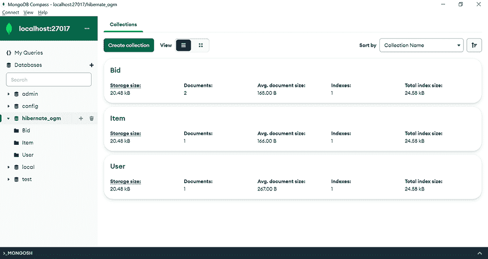
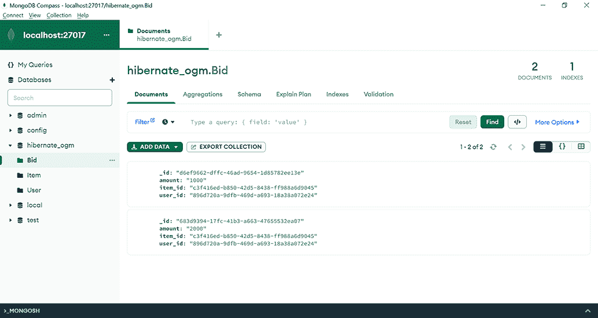

# 18 使用 Hibernate OGM

本章涵盖

+   介绍 Hibernate OGM

+   构建 MongoDB Hibernate OGM 简单应用程序

+   切换到 Neo4j NoSQL 数据库

数据库的世界极其多样和复杂。除了与不同的关系数据库系统合作所面临的挑战外，NoSQL 世界可能还会增加这些挑战。持久性框架的一个目标是要确保代码的可移植性，因此我们现在将探讨 Hibernate OGM 的替代方案以及它是如何尝试支持与 NoSQL 数据库一起工作的 JPA 解决方案的。

## 18.1 介绍 Hibernate OGM

NoSQL 数据库是一种以不同于关系表的形式存储数据的数据库。通常，NoSQL 数据库提供灵活的模式优势，这意味着数据库的设计者不需要在持久化数据之前确定模式。在需求快速变化的应用程序中，这可能是开发速度的一个重要优势。

根据它们用于存储数据格式的不同，可以将 NoSQL 数据库进行分类：

+   文档导向数据库，如我们在第十七章中介绍的 MongoDB，使用类似 JSON 的文档来存储信息。

+   图导向数据库使用图来存储信息。图由节点和边组成：节点的作用是存储数据，边表示节点之间的关系。Neo4j 是此类数据库的一个例子。

+   键值数据库使用映射结构来存储数据。键标识记录，而值表示数据。Redis 是此类数据库的一个例子。

+   广度列存储使用表、行和列来存储数据。这些与传统的关系数据库之间的区别在于，同一表的行之间的列的名称和格式可以不同。这种能力被称为动态列。Apache Cassandra 是此类数据库的一个例子。

我们之前的许多演示都使用了 JPA 和 Hibernate 来与关系数据库交互。这使我们能够编写可移植的应用程序，独立于关系数据库供应商，并通过框架管理供应商之间的差异。

Hibernate OGM 将关系数据库的可移植性概念扩展到 NoSQL 数据库。可移植性可能需要以影响执行速度为代价，但总体来说，它提供的优势多于不足。OGM 代表对象-网格映射器。它重用了 Hibernate Core 引擎、API 和 JPQL，不仅能够与关系数据库交互，还能与 NoSQL 数据库交互。

Hibernate OGM 支持一系列 NoSQL 数据库，在本章中我们将使用 MongoDB 和 Neo4j。

## 18.2 构建 MongoDB Hibernate OGM 简单应用程序

我们将开始构建一个由 Maven 管理的简单 Hibernate OGM 应用程序。我们将检查涉及的步骤、需要添加到项目中的依赖项以及需要编写的持久性代码。

我们首先将使用 MongoDB 作为文档导向的 NoSQL 数据库。然后，我们将修改我们的应用程序以使用 Neo4j，这是一个图导向的 NoSQL 数据库。我们只更改一些必要的依赖项和配置——我们不会触及使用 JPA 和 JPQL 的代码。

### 18.2.1 配置 Hibernate OGM 应用程序

在 Maven pom.xml 文件中，我们将在`dependencyManagement`部分添加`org.hibernate.ogm:hibernate-ogm-bom`。BOM 是*材料清单*的缩写。将 BOM 添加到`dependencyManagement`块实际上不会将依赖项添加到项目中，但它是一个意向声明。稍后在依赖项部分找到的传递依赖项将由这个初始声明控制版本。

接下来，我们将在依赖项部分添加另外两个东西：`hibernate-ogm-mongodb`，这是与 MongoDB 一起工作所需的，以及`org.jboss.jbossts :jbossjta`，这是一个 Hibernate OGM 需要支持的 JTA（Java 事务 API）实现。

我们还将使用 JUnit 5 进行测试和 Lombok，这是一个 Java 库，可以通过注解自动创建构造函数、获取器和设置器，从而减少样板代码。如前所述（在第 17.2 节中），Lombok 有其自身的不足：你需要一个 IDE 插件来理解注解，并且不会对缺少构造函数、获取器和设置器进行抱怨；并且你无法在生成的代码中设置断点进行调试（但调试生成代码的需要相当罕见）。

结果的 Maven pom.xml 文件如下所示。

列表 18.1 pom.xml Maven 文件

```
Path: Ch18/hibernate-ogm/pom.xml

\1
    <dependencies>
        <dependency>
            <groupId>org.hibernate.ogm</groupId>
            <artifactId>hibernate-ogm-bom</artifactId>
            <type>pom</type>
            <version>4.2.0.Final</version>
            <scope>import</scope>
        </dependency>
    </dependencies>
</dependencyManagement>

<dependencies>
    <dependency>
        <groupId>org.hibernate.ogm</groupId>
        <artifactId>hibernate-ogm-mongodb</artifactId>
    </dependency>
    <dependency>
        <groupId>org.jboss.jbossts</groupId>
        <artifactId>jbossjta</artifactId>
    </dependency>
    <dependency>
        <groupId>org.projectlombok</groupId>
        <artifactId>lombok</artifactId>
        <version>1.18.24</version>
    </dependency>
    <dependency>
        <groupId>org.junit.jupiter</groupId>
        <artifactId>junit-jupiter-engine</artifactId>
        <version>5.8.2</version>
        <scope>test</scope>
    </dependency>
</dependencies>
```

现在，我们将继续处理持久化单元的标准配置文件，即 src/main/resources/META-INF/persistence.xml。

列表 18.2 `persistence.xml`配置文件

```
Path: Ch18/hibernate-ogm/src/main/resources/META-INF/persistence.xml

<persistence-unit name="ch18.hibernate_ogm">                                Ⓐ
    <provider>org.hibernate.ogm.jpa.HibernateOgmPersistence</provider>      Ⓑ
    <properties>
        <property name="hibernate.ogm.datastore.provider" value="mongodb"/> Ⓒ
        <property name="hibernate.ogm.datastore.database"                   Ⓓ
                  value="hibernate_ogm"/>                                   Ⓓ
        <property name="hibernate.ogm.datastore.create_database"            Ⓔ
                           value="true"/>                                   Ⓔ
    </properties>
</persistence-unit>
```

Ⓐ `persistence.xml`文件配置了`ch18.hibernate_ogm`持久化单元。

Ⓑ API 的供应商特定提供者实现是 Hibernate OGM。

Ⓒ 数据存储提供者是 MongoDB。

Ⓓ 数据库的名称是`hibernate_ogm`。

Ⓔ 如果数据库不存在，将会创建它。

### 18.2.2 创建实体

现在，我们将创建代表应用程序实体的类：`User`、`Bid`、`Item`和`Address`。它们之间的关系将是单对多、多对一或嵌入式类型。

列表 18.3 `User`类

```
Path: Ch18/hibernate-ogm/src/main/java/com/manning/javapersistence
➥ /hibernateogm/model/User.java

@Entity
@NoArgsConstructor
public class User {

    @Id                                                                     Ⓐ
    @GeneratedValue(generator = "ID_GENERATOR")                             Ⓐ
    @GenericGenerator(name = "ID_GENERATOR", strategy = "uuid2")            Ⓐ
    @Getter
    private String id;

    @Embedded                                                               Ⓑ
    @Getter 
    @Setter
    private Address address;                                                Ⓑ

    @OneToMany(mappedBy = "user", cascade = CascadeType.PERSIST)            Ⓒ
    private Set<Bid> bids = new HashSet<>();                                Ⓒ

    // . . . 

}
```

Ⓐ ID 字段是由`ID_GENERATOR`生成器生成的标识符。这个生成器使用`uuid2`策略，它产生一个唯一的 128 位 UUID。有关生成器策略的回顾，请参阅第 5.2.5 节。

Ⓑ 地址没有自己的标识符；它是可嵌入的。

Ⓒ `User`和`Bid`之间存在一对一的关系，这通过`Bid`侧的`user`字段进行映射。`CascadeType.PERSIST`表示持久化操作将从父`User`传播到子`Bid`。

`Address`类没有自己的持久化标识符，并且它是可嵌入的。

列表 18.4 `Address`类

```
Path: Ch18/hibernate-ogm/src/main/java/com/manning/javapersistence
➥ /hibernateogm/model/Address.java

@Embeddable
@NoArgsConstructor
public class Address {

   //fields with Lombok annotations, constructor
}
```

`Item`类将包含一个与`User`中类似的生成策略的`id`字段。`Item`和`Bid`之间的关系将是一对多，级联类型将传播持久化操作从父级到子级。

列表 18.5 `Item`类

```
Path: Ch18/hibernate-ogm/src/main/java/com/manning/javapersistence
➥ /hibernateogm/model/Item.java

@Entity
@NoArgsConstructor
public class Item {

    @Id
    @GeneratedValue(generator = "ID_GENERATOR")
    @GenericGenerator(name = "ID_GENERATOR", strategy = "uuid2")
    @Getter
    private String id;

    @OneToMany(mappedBy = "item", cascade = CascadeType.PERSIST)
    private Set<Bid> bids = new HashSet<>();
     // . . . 

  }
```

### 18.2.3 使用 MongoDB 应用程序

要将实体从应用程序持久化到 MongoDB，我们将编写使用常规 JPA 类和 JPQL 的代码。这意味着我们的应用程序可以与关系型数据库以及各种 NoSQL 数据库一起工作。我们只需要更改一些配置。

要以与关系型数据库相同的方式使用 JPA，我们首先初始化一个`EntityManagerFactory`。`ch18.hibernate_ogm`持久化单元在 persistence.xml 中已声明。

列表 18.6 初始化`EntityManagerFactory`

```
Path: Ch18/hibernate-ogm/src/test/java/com/manning/javapersistence
➥ /hibernateogm/HibernateOGMTest.java

public class HibernateOGMTest {

    private static EntityManagerFactory entityManagerFactory;

    @BeforeAll
    static void setUp() {
        entityManagerFactory = 
              Persistence.createEntityManagerFactory("ch18.hibernate_ogm");
    }
     // . . . 

}
```

在执行`HibernateOGMTest`类中的每个测试之后，我们将关闭`EntityManagerFactory`。

列表 18.7 关闭`EntityManagerFactory`

```
Path: Ch18/hibernate-ogm/src/test/java/com/manning/javapersistence
➥ /hibernateogm/HibernateOGMTest.java

@AfterAll
static void tearDown() {
    entityManagerFactory.close();
}
```

在执行`HibernateOGMTest`类中的每个测试之前，我们将一些实体持久化到 NoSQL MongoDB 数据库。我们的代码将使用 JPA 进行这些操作，它不知道它是在与关系型数据库还是非关系型数据库交互。

列表 18.8 将数据持久化以进行测试

```
Path: Ch18/hibernate-ogm/src/test/java/com/manning/javapersistence
➥ /hibernateogm/HibernateOGMTest.java

@BeforeEach
void beforeEach() {
    EntityManager entityManager =                                           Ⓐ
                 entityManagerFactory.createEntityManager();                Ⓐ

    try {
        entityManager.getTransaction().begin();                             Ⓑ

        john = new User("John", "Smith");                                   Ⓒ
        john.setAddress(new Address("Flowers Street", "12345", "Boston"));  Ⓒ

        bid1 = new Bid(BigDecimal.valueOf(1000));                           Ⓒ
        bid2 = new Bid(BigDecimal.valueOf(2000));                           Ⓒ

        item = new Item("Item1");                                           Ⓒ

        bid1.setItem(item);                                                 Ⓒ
        item.addBid(bid1);                                                  Ⓒ

        bid2.setItem(item);                                                 Ⓒ
        item.addBid(bid2);                                                  Ⓒ

        bid1.setUser(john);                                                 Ⓒ
        john.addBid(bid1);                                                  Ⓒ

        bid2.setUser(john);                                                 Ⓒ
        john.addBid(bid2);                                                  Ⓒ

        entityManager.persist(item);                                        Ⓓ
        entityManager.persist(john);                                        Ⓓ

        entityManager.getTransaction().commit();                            Ⓔ
    } finally {
        entityManager.close();                                              Ⓕ
    }
}
```

Ⓐ 使用现有的`EntityManagerFactory`创建一个`EntityManager`。

Ⓑ 开始一个事务。如您所回忆的，使用 JPA 的操作需要是事务性的。

Ⓒ 创建并设置要持久化的实体。

Ⓓ 持久化`Item`实体和`User`实体。由于从`Item`和`User`引用的`Bid`实体使用`CascadeType.PERSIST`，持久化操作将从父级传播到子级。

Ⓔ 提交之前启动的事务。

Ⓕ 关闭之前创建的`EntityManager`。

我们将使用 JPA 查询数据库。我们将使用`entityManager.find`方法，就像与关系型数据库交互时一样。正如之前讨论的，每次与数据库的交互都应该在事务边界内进行，即使我们只是在读取数据，因此我们将启动并提交事务。

列表 18.9 使用 JPA 查询 MongoDB 数据库

```
Path: Ch18/hibernate-ogm/src/test/java/com/manning/javapersistence
➥ /hibernateogm/HibernateOGMTest.java

@Test
void testCRUDOperations() {
    EntityManager entityManager =                                           Ⓐ
                                entityManagerFactory.createEntityManager(); Ⓐ

    try {
        entityManager.getTransaction().begin();                             Ⓑ

        User fetchedUser = entityManager.find(User.class, john.getId());    Ⓒ
        Item fetchedItem = entityManager.find(Item.class, item.getId());    Ⓒ
        Bid fetchedBid1 = entityManager.find(Bid.class, bid1.getId());      Ⓒ
        Bid fetchedBid2 = entityManager.find(Bid.class, bid2.getId());      Ⓒ
               assertAll(                                                   Ⓓ
                () -> assertNotNull(fetchedUser),                           Ⓓ
                () -> assertEquals("John", fetchedUser.getFirstName()),     Ⓓ
                () -> assertEquals("Smith", fetchedUser.getLastName()),     Ⓓ
                () -> assertNotNull(fetchedItem),                           Ⓓ
                () -> assertEquals("Item1", fetchedItem.getName()),         Ⓓ
                () -> assertNotNull(fetchedBid1),                           Ⓓ
                () -> assertEquals(new BigDecimal(1000),                    Ⓓ
                                       fetchedBid1.getAmount()),            Ⓓ
                () -> assertNotNull(fetchedBid2),                           Ⓓ
                () -> assertEquals(new BigDecimal(2000),                    Ⓓ
                                       fetchedBid2.getAmount())             Ⓓ
        );
               entityManager.getTransaction().commit();                     Ⓔ
    } finally {
        entityManager.close();                                              Ⓕ
    }
}
```

Ⓐ 使用现有的`EntityManagerFactory`创建一个`EntityManager`。

Ⓑ 开始一个事务；操作需要是事务性的。

Ⓒ 根据实体的`id`检索之前持久化的`User`、`Item`和`Bid`。

Ⓓ 确认检索到的信息包含我们之前持久化的内容。

Ⓔ 提交之前启动的事务。

Ⓕ 关闭之前创建的`EntityManager`。

我们可以在执行此测试后检查 MongoDB 数据库的内容。打开 MongoDB Compass 程序，如图 18.1 所示。MongoDB Compass 是一个用于与 MongoDB 数据库交互和查询的 GUI。它将显示在执行测试后创建了三个集合。这证明了使用 JPA 编写的代码能够在 Hibernate OGM 的帮助下与 NoSQL MongoDB 数据库交互。



图 18.1 使用 JPA 和 Hibernate OGM 编写的测试在 MongoDB 内部创建了三个集合。

我们还可以检查创建的集合，并查看它们是否包含从测试中持久化的文档（这应该在 `afterEach()` 方法之前查看，该方法会删除新添加的文档并运行）。例如，`Bid` 集合包含两个文档，如图 18.2 所示。



图 18.2 `Bid` 集合包含从测试中持久化的两个文档。

我们还将使用 JPQL 查询数据库。JPQL（Jakarta Persistence Query Language，之前称为 Java Persistence Query Language）是一种独立于平台的面向对象查询语言。

我们之前使用 JPQL 查询与 SQL 方言无关的关系型数据库，现在我们将使用 JPQL 与 NoSQL 数据库交互。

列表 18.10 使用 JPQL 查询 MongoDB 数据库

```
Path: Ch18/hibernate-ogm/src/test/java/com/manning/javapersistence
➥ /hibernateogm/HibernateOGMTest.java

@Test
void testJPQLQuery() {
    EntityManager entityManager =                                          Ⓐ
            entityManagerFactory.createEntityManager();                    Ⓐ
    try {
        entityManager.getTransaction().begin();                            Ⓑ
        List<Bid> bids = entityManager.createQuery(                        Ⓒ
             "SELECT b FROM Bid b ORDER BY b.amount DESC", Bid.class)      Ⓒ
            .getResultList();                                              Ⓒ
        Item item = entityManager.createQuery(                             Ⓓ
             "SELECT i FROM Item i", Item.class)                           Ⓓ
                     .getSingleResult();                                   Ⓓ
        User user = entityManager.createQuery(                             Ⓔ
             "SELECT u FROM User u", User.class).getSingleResult();        Ⓔ
        assertAll(() -> assertEquals(2, bids.size()),                      Ⓕ
                () -> assertEquals(new BigDecimal(2000),                   Ⓕ
                                   bids.get(0).getAmount()),               Ⓕ
                () -> assertEquals(new BigDecimal(1000),                   Ⓕ
                                   bids.get(1).getAmount()),               Ⓕ
                () -> assertEquals("Item1", item.getName()),               Ⓕ
                () -> assertEquals("John", user.getFirstName()),           Ⓕ
                () -> assertEquals("Smith", user.getLastName())            Ⓕ
        );
        entityManager.getTransaction().commit();                           Ⓖ
    } finally {
        entityManager.close();                                             Ⓗ
    }
}
```

Ⓐ 在现有 `EntityManagerFactory` 的帮助下创建一个 `EntityManager`。

Ⓑ 开始一个交易；操作需要是事务性的。

Ⓒ 创建一个 JPQL 查询以按 `amount` 降序从数据库中获取所有 `Bid`。

Ⓓ 创建一个 JPQL 查询以从数据库中获取 `Item`。

Ⓔ 创建一个 JPQL 查询以从数据库中获取 `User`。

Ⓕ 检查通过 JPQL 获取的信息是否包含我们之前持久化的内容。

Ⓖ 提交之前开始的交易。

Ⓗ 关闭之前创建的 `EntityManager`。

如前所述，我们希望保持数据库干净，测试独立，因此我们将在 `HibernateOGMTest` 类中每个测试执行后清理插入的数据。我们的代码将使用 JPA 进行这些操作，它不知道它是在与关系型数据库还是非关系型数据库交互。

列表 18.11 每个测试执行后清理数据库

```
Path: Ch18/hibernate-ogm/src/test/java/com/manning/javapersistence
➥ /hibernateogm/HibernateOGMTest.java

@AfterEach
void afterEach() {
    EntityManager entityManager =                                          Ⓐ
            entityManagerFactory.createEntityManager();                    Ⓐ
    try {
        entityManager.getTransaction().begin();                            Ⓑ
        User fetchedUser = entityManager.find(User.class, john.getId());   Ⓒ
        Item fetchedItem = entityManager.find(Item.class, item.getId());   Ⓒ
        Bid fetchedBid1 = entityManager.find(Bid.class, bid1.getId());     Ⓒ
        Bid fetchedBid2 = entityManager.find(Bid.class, bid2.getId());     Ⓒ

        entityManager.remove(fetchedBid1);                                 Ⓓ
        entityManager.remove(fetchedBid2);                                 Ⓓ
        entityManager.remove(fetchedItem);                                 Ⓓ
        entityManager.remove(fetchedUser);                                 Ⓓ

        entityManager.getTransaction().commit();                           Ⓔ
    } finally {
        entityManager.close();                                             Ⓕ
    }
}
```

Ⓐ 在现有 `EntityManagerFactory` 的帮助下创建一个 `EntityManager`。

Ⓑ 开始一个交易；操作需要是事务性的。

Ⓒ 根据实体的 `id` 获取之前持久化的 `User`、`Item` 和 `Bid`。

Ⓓ 删除之前持久化的实体。

Ⓔ 提交之前开始的交易。

Ⓕ 关闭之前创建的 `EntityManager`。

## 18.3 切换到 Neo4j NoSQL 数据库

Neo4j 也是一个 NoSQL 数据库，具体来说是一个图型数据库。与使用类似 JSON 的文档来存储数据的 MongoDB 不同，Neo4j 使用图来存储数据。图由节点组成，节点保存数据，边表示关系。Neo4j 可以以桌面版本或嵌入式版本（我们将用于我们的演示）运行。有关 Neo4j 功能的全面指南，请参阅 Neo4j 网站：[`neo4j.com/`](https://neo4j.com/)。

Hibernate OGM 促进了在不同 NoSQL 数据库之间快速且高效地切换，即使它们在内部使用不同的范式来存储数据。目前，Hibernate OGM 支持 MongoDB，这是我们已演示如何与之交互的文档型数据库，以及 Neo4j，一个我们希望快速切换到的图型数据库。

Hibernate OGM 的效率在于我们仍然可以使用之前提供的 JPA 代码来定义实体并描述与数据库的交互。该代码保持不变。我们只需要在配置层面进行更改：我们需要将 Hibernate OGM MongoDB 依赖项替换为 Hibernate OGM Neo4j，并且需要将持久化单元配置从 MongoDB 更改为 Neo4j。

我们将更新 Maven pom.xml 文件，以包含 Hibernate OGM Neo4j 依赖项。

列表 18.12 包含 Hibernate OGM Neo4j 依赖项的 pom.xml 文件

```
Path: Ch18/hibernate-ogm/pom.xml

<dependency>
    <groupId>org.hibernate.ogm</groupId>
    <artifactId>hibernate-ogm-neo4j</artifactId>
</dependency>
```

我们还将替换 src/main/resources/META-INF/persistence.xml 中的持久化单元配置。

列表 18.13 Neo4j 的 persistence.xml 配置文件

```
Path: Ch18/hibernate-ogm/src/main/resources/META-INF/persistence.xml

<persistence-unit name="ch18.hibernate_ogm">                                Ⓐ
        <provider>org.hibernate.ogm.jpa.HibernateOgmPersistence</provider>  Ⓑ
        <properties>
            <property name="hibernate.ogm.datastore.provider"               Ⓒ
                           value="neo4j_embedded" />                        Ⓒ
            <property name="hibernate.ogm.datastore.database"               Ⓓ
                           value="hibernate_ogm" />                         Ⓓ
            <property name="hibernate.ogm.neo4j.database_path"              Ⓔ
                           value="target/test_data_dir" />                  Ⓔ
        </properties>
    </persistence-unit>
```

Ⓐ `persistence.xml` 文件配置了 `ch18.hibernate_ogm` 持久化单元。

Ⓑ API 的供应商特定提供者实现是 Hibernate OGM。

Ⓒ 数据存储提供者是 Neo4j；数据库是嵌入式的。

Ⓓ 数据库的名称是 `hibernate_ogm`。

Ⓔ 数据库路径位于 test_data_dir，在 Maven 创建的目标文件夹中。

与 MongoDB 相同，应用程序的功能在 Neo4j 中也将保持不变。使用 Hibernate OGM，代码保持不变，JPA 可以访问不同类型的 NoSQL 数据库。更改仅限于配置层面。

## 摘要

+   您可以使用 MongoDB 和设置与数据库交互所需的 Maven 依赖项来创建一个简单的 Hibernate OGM 应用程序。

+   您可以使用 MongoDB 提供者和 MongoDB 数据库来配置持久化单元。

+   您可以创建仅使用 JPA 注释和功能来创建的实体，并将它们持久化到 MongoDB 数据库中，验证实体在 MongoDB 中的插入。

+   您可以通过仅更改 Maven 依赖项和持久化单元配置，从文档型 MongoDB 数据库切换到图型 Neo4j 数据库。

+   您可以在不修改现有代码的情况下，将之前创建的仅使用 JPA 注释的实体持久化到 Neo4j 数据库中。
