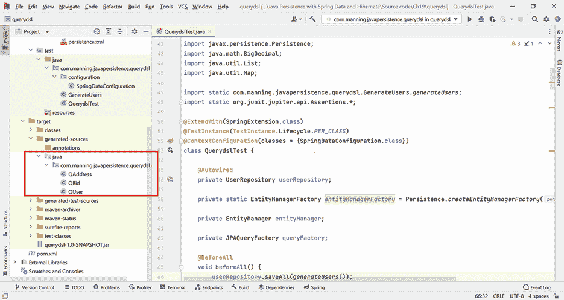

# 19 使用 Querydsl 查询 JPA

本章涵盖

+   介绍 Querydsl

+   创建 Querydsl 应用程序

+   使用 Querydsl 查询数据库

查询数据库对于检索符合特定标准的信息至关重要。本章重点介绍 Querydsl，这是从 Java 程序中查询数据库的替代方案之一。Querydsl 名称中的“dsl”部分指的是领域特定语言（DSLs），这些语言是针对特定应用领域的语言。例如，查询数据库就是这样一种领域。

在本章中，我们将检查 Querydsl 的最重要的功能，并将它们应用于一个 Java 持久化项目中。有关 Querydsl 的全面文档，请参阅其网站：[`querydsl.com/`](http://querydsl.com/)。

## 19.1 介绍 Querydsl

从 Java 程序内部查询数据库有多种替代方案。您可以使用 SQL，自从 JDBC 早期以来就可以这样做。这种方法的缺点是缺乏可移植性（查询依赖于数据库和特定的 SQL 方言）以及缺乏类型安全和静态查询验证。

JPQL（Jakarta Persistence Query Language）是一个进步，它是一个面向对象的查询语言，与数据库无关。这意味着没有可移植性的缺乏，但仍然缺乏类型安全和静态查询验证。

Spring Data 允许我们使用查询构建器机制创建方法，并使用 JPQL 和 SQL 查询注解方法（尽管这些仍然有之前提到的缺点）。查询构建器机制也有缺点，即需要预先定义方法，并且它们的名称在编译时不会进行静态检查。

Criteria API 允许您使用 Java API 构建类型安全和可移植的查询。虽然它解决了之前提出的替代方案的缺点，但它最终变得极其冗长，并创建了难以阅读的代码。

Querydsl 保留了类型安全和可移植性的重要思想。此外，它减少了 Criteria API 的冗长性，并且它创建的代码比使用 Criteria API 创建的代码更容易阅读和理解。

## 19.2 创建 Querydsl 应用程序

我们将首先创建一个由 Maven 管理依赖项的 Querydsl 应用程序。我们将检查涉及到的步骤，需要添加到项目中的依赖项，将要管理的实体，以及如何借助 Querydsl 编写查询。

注意 要执行源代码中的示例，您首先需要运行 Ch19.sql 脚本。

### 19.2.1 配置 Querydsl 应用程序

我们将在 Maven pom.xml 文件中添加两个依赖项：`querydsl-jpa` 和 `querydsl-apt`。`querydsl-jpa` 依赖项是需要在 JPA 应用程序中使用 Querydsl API 所必需的。`querydsl-apt` 依赖项是需要在代码编译之前处理 Java 文件中的注解所必需的。

`querydsl-apt` 中的 APT 代表注解处理工具，使用它，应用程序管理的实体将在所谓的 Q 类型（Q 代表“查询”）中进行复制。这意味着每个 `Entity` 实体将有一个相应的 `QEntity`，它将在构建时生成，Querydsl 将使用它来查询数据库。此外，实体的每个字段都将使用特定的 Querydsl 类在 `QEntity` 中进行镜像。例如，`String` 字段将镜像到 `StringPath` 字段，`Long` 字段到 `NumberPath<Long>` 字段，`Integer` 字段到 `NumberPath<Integer>` 字段，依此类推。

生成的 Maven pom.xml 文件将包含以下列表中显示的依赖项。

列表 19.1 包含 APT 插件的 pom.xml Maven 文件

```
Path: Ch19/querydsl/pom.xml

\1
    <groupId>com.querydsl</groupId>
    <artifactId>querydsl-jpa</artifactId>
    <version>5.0.0</version>
</dependency>
<dependency>
    <groupId>com.querydsl</groupId>
    <artifactId>querydsl-apt</artifactId>
    <version>5.0.0</version>
    <scope>provided</scope>
</dependency>
```

`querydsl-apt` 依赖项的作用域指定为 `provided`。这意味着依赖项仅在构建时需要，当 Maven 生成之前引入的 Q 类型时。然后它就不再需要了，因此它不会包含在应用程序工件中。

要使用 Querydsl，我们还需要在 Maven pom.xml 文件中包含 Maven APT 插件。此插件将在构建过程中负责生成 Q 类型。由于我们在项目中使用 JPA 注解，实际执行此操作的类是 `com.querydsl.apt.jpa.JPAAnnotationProcessor`。如果我们使用 Hibernate API 和注解，则必须使用 `com.querydsl.apt.hibernate.HibernateAnnotationProcessor`。

我们还必须指出生成的 Q 类型将驻留的输出目录：在 `target` Maven 文件夹内。包含所有这些内容的 pom.xml 文件如下所示。

列表 19.2 包含 APT 插件的 pom.xml Maven 文件

```
Path: Ch19/querydsl/pom.xml

<plugin>
  <groupId>com.mysema.maven</groupId>
  <artifactId>apt-maven-plugin</artifactId>
  <version>1.1.3</version>
  <executions>
    <execution>
      <goals>
         <goal>process</goal>
      </goals>
      <configuration>
         <outputDirectory>target/generated-sources/java</outputDirectory>   Ⓐ
         <processor>com.querydsl.apt.jpa.JPAAnnotationProcessor</processor> Ⓑ
      </configuration>
    </execution>
  </executions>
</plugin>
```

Ⓐ 生成的 Q 类型将位于 `target/generated-sources/java` 文件夹中。

Ⓑ 使用 `com.querydsl.apt.jpa.JPAAnnotationProcessor` 类生成 Q 类型。

我们现在将转到持久化单元的标准配置文件，位于 src/main/resources/META-INF/persistence.xml。此文件如下所示。

列表 19.3 persistence.xml 配置文件

```
Path: Ch19/querydsl/src/main/resources/META-INF/persistence.xml

<persistence-unit name="ch19.querydsl">                                      Ⓐ
        <provider>org.hibernate.jpa.HibernatePersistenceProvider</provider>  Ⓑ
        <properties> 
            <property name="javax.persistence.jdbc.driver"                   Ⓒ
                      value="com.mysql.cj.jdbc.Driver"/>                     Ⓒ
            <property name="javax.persistence.jdbc.url" value="jdbc:mysql:// Ⓓ
             ➥ localhost:3306/CH19_QUERYDSL?serverTimezone=UTC"/>           Ⓓ
            <property name="javax.persistence.jdbc.user" value="root"/>      Ⓔ
            <property name="javax.persistence.jdbc.password" value=""/>      Ⓕ

            <property name="hibernate.dialect"                               Ⓖ
                   value="org.hibernate.dialect.MySQL8Dialect"/>             Ⓖ
            <property name="hibernate.show_sql" value="true"/>               Ⓗ
            <property name="hibernate.format_sql" value="true"/>             Ⓘ
            <property name="hibernate.hbm2ddl.auto" value="create"/>         Ⓙ
        </properties>
    </persistence-unit>
```

Ⓐ persistence.xml 文件配置了 ch19.querydsl 持久化单元。

Ⓑ 由于 JPA 只是一个规范，我们需要指出 API 的供应商特定 `PersistenceProvider` 实现。我们定义的持久化将由 Hibernate 提供商支持。

Ⓒ JDBC 属性——驱动程序。

Ⓓ 数据库的 URL。

Ⓔ 用户名。

Ⓕ 访问无密码。我们运行的程序所在的机器上已安装 MySQL 8，访问凭证来自 persistence.xml。您应修改凭证以与您机器上的凭证相匹配。

Ⓖ Hibernate 方言是 MySQL8，因为我们将要交互的数据库是 MySQL Release 8.0。

Ⓗ 执行时显示 SQL 代码。

Ⓘ Hibernate 将格式化 SQL 并在 SQL 字符串中生成注释，以便我们知道 Hibernate 执行 SQL 语句的原因。

Ⓙ 每次程序执行时，数据库将从零开始创建。这对于自动化测试来说很理想，因为我们希望在每次测试运行时都使用一个干净的数据库。

### 19.2.2 创建实体

我们现在将创建代表应用程序实体的类：`User`、`Bid`和`Address`。它们之间的关系将是单对多、多对一或内嵌类型。

列表 19.4 `User`类

```
Path: Ch19/querydsl/src/main/java/com/manning/javapersistence/querydsl
➥ /model/User.java

@Entity
@NoArgsConstructor
public class User {

    @Id                                                             Ⓐ
    @GeneratedValue(generator = Constants.ID_GENERATOR)             Ⓐ
    @Getter
    private Long id;

    @Embedded                                                       Ⓑ
    @Getter
    @Setter
    private Address address;                                        Ⓑ

    @OneToMany(mappedBy = "user", cascade = CascadeType.ALL)        Ⓒ
    private Set<Bid> bids = new HashSet<>();                        Ⓒ

    // . . .
}
```

Ⓐ ID 字段是由`Constants.ID_GENERATOR`生成器生成的标识符。关于生成器的复习，请回顾第五章。

Ⓑ 地址没有自己的标识符；它是可嵌入的。

Ⓒ `User`和`Bid`之间存在一对一的关系，这由`Bid`侧的`user`字段映射。`CascadeType.ALL`表示所有操作都将从父`User`传播到子`Bid`。

`Address`类没有自己的持久化标识符，它将是可嵌入的。

列表 19.5 `Address`类

```
Path: Ch19/querydsl/src/main/java/com/manning/javapersistence/querydsl
➥ /model/User.java

@Embeddable
@NoArgsConstructor
public class Address {

   //fields with Lombok annotations, constructor
}
```

`Bid`类将包含一个具有类似生成策略的`id`字段，就像`User`一样。`Bid`和`User`之间的关系将是多对一，非可选的，并且抓取类型将是懒加载。

列表 19.6 `Bid`类

```
Path: Ch19/querydsl/src/main/java/com/manning/javapersistence/querydsl
➥ /model/Bid.java

@Entity
@NoArgsConstructor
public class Bid {

    @Id
    @GeneratedValue(generator = Constants.ID_GENERATOR)
    private Long id;

    @ManyToOne(optional = false, fetch = FetchType.LAZY)
    @Getter
    @Setter
    private User user;

    // . . .

}
```

`UserRepository`接口扩展了`JpaRepository<User, Long>`。它管理`User`实体，并具有`Long`类型的 ID。我们只使用这个 Spring Data JPA 接口来方便地填充数据库以测试 Querydsl。

列表 19.7 `UserRepository`接口

```
Path: Ch19/querydsl/src/main/java/com/manning/javapersistence/querydsl
➥ /repositories/UserRepository.java

public interface UserRepository extends JpaRepository<User, Long> {

}
```

### 19.2.3 创建查询所需的数据

为了填充和操作数据库，我们需要一个`SpringDataConfiguration`类和一个`GenerateUsers`类。我们已经多次使用这种方法，所以在这里我们只简要回顾这些类的功能。

列表 19.8 `SpringDataConfiguration`类

```
Path: Ch19/querydsl/src/test/java/com/manning/javapersistence/querydsl
➥ /configuration/SpringDataConfiguration.java

@EnableJpaRepositories("com.manning.javapersistence.querydsl.repositories") Ⓐ
public class SpringDataConfiguration {
    @Bean
    public DataSource dataSource() {                                        Ⓑ
        // . . .                                                            Ⓑ
        return dataSource;                                                  Ⓑ
    }

    @Bean
    public JpaTransactionManager                                            Ⓒ
           transactionManager(EntityManagerFactory emf) {                   Ⓒ
        return new JpaTransactionManager(emf);                              Ⓒ
    }

    @Bean
    public JpaVendorAdapter jpaVendorAdapter() {                            Ⓓ
        HibernateJpaVendorAdapter jpaVendorAdapter = new                    Ⓓ
                 HibernateJpaVendorAdapter();                               Ⓓ
        // . . .                                                            Ⓓ
        return jpaVendorAdapter;                                            Ⓓ
    }

    @Bean
    public LocalContainerEntityManagerFactoryBean entityManagerFactory() {  Ⓔ
        LocalContainerEntityManagerFactoryBean                              Ⓔ
          localContainerEntityManagerFactoryBean =                          Ⓔ
                new LocalContainerEntityManagerFactoryBean();               Ⓔ
        // . . .                                                            Ⓔ
        return localContainerEntityManagerFactoryBean;                      Ⓔ
    }
}
```

Ⓐ `@EnableJpaRepositories`注解将扫描被注解配置类的包以查找 Spring Data 仓库。

Ⓑ 创建一个数据源 bean 来保存 JDBC 属性：驱动程序、数据库 URL、用户名和密码。

Ⓒ 基于实体管理器工厂创建一个事务管理器 bean。每次与数据库的交互都应在事务边界内进行，Spring Data 需要一个事务管理器 bean。

Ⓓ 创建并配置一个 JPA 供应商适配器 bean，这是 JPA 与 Hibernate 交互所需的。

Ⓔ 创建并配置一个`LocalContainerEntityManagerFactoryBean`——这是一个工厂 bean，它产生一个`EntityManagerFactory`。

`GenerateUsers`类包含`generateUsers`方法，该方法创建用户及其相关出价列表。

列表 19.9 `GenerateUsers`类

```
Path: Ch19/querydsl/src/test/java/com/manning/javapersistence/querydsl
➥ /GenerateUsers.java

public class GenerateUsers {

    public static Address address = new Address("Flowers Street",
                                                "1234567", "Boston", "MA");

    public static List<User> generateUsers() {
        List<User> users = new ArrayList<>();

        User john = new User("john", "John", "Smith");
        john.setRegistrationDate(LocalDate.of(2020, Month.APRIL, 13));
        john.setEmail("john@somedomain.com");
        john.setLevel(1);
        john.setActive(true);
        john.setAddress(address);

        Bid bid1 = new Bid(new BigDecimal(100));
        bid1.setUser(john);
        john.addBid(bid1);

        Bid bid2 = new Bid(new BigDecimal(110));
        bid2.setUser(john);
        john.addBid(bid2);

        // . . .
   }
}
```

## 19.3 使用 Querydsl 查询数据库

如前所述，Maven APT 插件将在构建过程中生成 Q 类型。根据提供的配置（参见列表 19.2），这些源将在`target/generated-sources/java`文件夹中生成（参见图 19.1）。我们将使用这些生成的类来查询数据库。



图 19.1 在`target`文件夹中生成的 Q 类型

首先，我们必须填充数据库，为此，我们将使用`User-Repository`接口。我们还将使用`EntityManagerFactory`和创建的`EntityManager`来开始使用`JPAQueryFactory`和`JPAQuery`。我们需要一个`JPAQueryFactory`实例来处理查询，它将通过接受一个`EntityManager`参数的构造函数创建。然后，`JPAQueryFactory`将创建`JPAQuery`实例，以有效地查询数据库。

我们将使用`SpringExtension`扩展测试。这个扩展用于将 Spring 测试上下文与 JUnit 5 Jupiter 测试集成。

在执行测试之前，我们将使用之前生成的用户及其相应的出价填充数据库。在每次测试之前，我们将创建一个`EntityManager`并开始一个事务。因此，与数据库的每次交互都将发生在事务边界内。目前，我们不会在这个类内部执行查询，但随着测试和查询将立即添加（从列表 19.11 开始），我们将我们的类命名为`QuerydslTest`。

列表 19.10 `QuerydslTest`类

```
Path: Ch19/querydsl/src/test/java/com/manning/javapersistence/querydsl
➥ /QuerydslTest.java

@ExtendWith(SpringExtension.class)                                          Ⓐ
@TestInstance(TestInstance.Lifecycle.PER_CLASS)                             Ⓑ
@ContextConfiguration(classes = {SpringDataConfiguration.class})            Ⓒ
class QuerydslTest {

    @Autowired                                                              Ⓓ
    private UserRepository userRepository;                                  Ⓓ

    private static EntityManagerFactory entityManagerFactory =              Ⓔ
                   Persistence.createEntityManagerFactory("ch19.querydsl"); Ⓔ

    private EntityManager entityManager;                                    Ⓕ

    private JPAQueryFactory queryFactory;                                   Ⓕ

    @BeforeAll                                                              Ⓖ
    void beforeAll() {                                                      Ⓖ
        userRepository.saveAll(generateUsers());                            Ⓖ
    }                                                                       Ⓖ

    @BeforeEach                                                             Ⓗ
    void beforeEach() {                                                     Ⓗ
        entityManager = entityManagerFactory.createEntityManager();         Ⓗ
        entityManager.getTransaction().begin();                             Ⓗ
        queryFactory = new JPAQueryFactory(entityManager);                  Ⓗ
    }                                                                       Ⓗ

    @AfterEach                                                              Ⓘ
    void afterEach() {                                                      Ⓘ
        entityManager.getTransaction().commit();                            Ⓘ
        entityManager.close();                                              Ⓘ
    }                                                                       Ⓘ

    @AfterAll                                                               Ⓙ
    void afterAll() {                                                       Ⓙ
        userRepository.deleteAll();                                         Ⓙ
    }                                                                       Ⓙ

}
```

Ⓐ 使用`SpringExtension`扩展测试。

Ⓑ JUnit 将为执行所有测试创建测试类的唯一实例，而不是每个测试一个实例。这样我们就能将`UserRepository`字段自动装配为实例变量。

Ⓒ Spring 测试上下文是通过之前展示的`SpringDataConfiguration`类中定义的 bean 进行配置的。

Ⓓ 通过 Spring 的自动装配注入一个`UserRepository` bean。它将被用来轻松地填充和清理数据库。

Ⓔ 初始化一个`EntityManagerFactory`以与数据库通信。这个`EntityManagerFactory`将创建`JPAQueryFactory`所需的`EntityManager`。

Ⓕ 声明应用程序所需的`EntityManager`和`JPAQueryFactory`。

Ⓖ 使用之前生成的用户和出价填充数据库，供测试使用。

Ⓗ 通过将`EntityManager`作为参数传递给其构造函数来创建一个`JPAQueryFactory`。

Ⓘ 在每个测试结束时，提交事务并关闭`EntityManager`。

Ⓙ 在所有测试执行结束时，清理数据库。

### 19.3.1 数据过滤

如前所述，应用程序管理的实体将在所谓的 Q 类型中进行复制。这意味着每个`Entity`实体将有一个相应的`QEntity`，它将在构建时生成，Querydsl 将使用它来查询数据库。由 Maven APT 插件生成的 Q 类型类每个都包含其类型的静态实例：

```
public static final QUser user = new QUser("user");
public static final QBid bid = new QBid("bid");
public static final QAddress address = new QAddress("address");
```

这些实例将被用来查询数据库。我们首先通过调用 `queryFactory.selectFrom(user)` 获取一个 `JPAQuery` 实例。然后我们将使用这个 `JPAQuery` 实例来构建查询的子句。我们将使用 `where` 方法通过给定的 `Predicate` 进行过滤，并使用 `fetchOne` 方法从数据库中获取单个元素。如果找不到满足条件的元素，`fetchOne` 返回 `null`，如果找到多个满足条件的元素，则抛出 `NonUniqueResultException`。

例如，为了获取具有给定 `username` 的 `User`，我们将编写以下列表中的代码。

列表 19.11 通过 `username` 查找 `User`

```
Path: Ch19/querydsl/src/test/java/com/manning/javapersistence/querydsl
➥ /QuerydslTest.java

@Test
void testFindByUsername() {

    User fetchedUser = queryFactory.selectFrom(QUser.user)             Ⓐ
            .where(QUser.user.username.eq("john"))                     Ⓑ
            .fetchOne();                                               Ⓒ

    assertAll(                                                         Ⓓ
            () -> assertNotNull(fetchedUser),                          Ⓓ
            () -> assertEquals("john", fetchedUser.getUsername()),     Ⓓ
            () -> assertEquals("John", fetchedUser.getFirstName()),    Ⓓ
            () -> assertEquals("Smith", fetchedUser.getLastName()),    Ⓓ
            () -> assertEquals(2, fetchedUser.getBids().size())        Ⓓ
    );                                                                 Ⓓ

}
```

Ⓐ 使用属于 `JPAQueryFactory` 类的 `selectFrom` 方法开始构建查询。此方法将获取创建的 Q 类型实例 `QUser.user` 作为参数，并将返回一个 `JPAQuery`。

Ⓑ `where` 方法将根据给定的与 `username` 相关的 `Predicate` 进行过滤。

Ⓒ `fetchOne` 方法将尝试从数据库中获取单个元素。

Ⓓ 验证获取的数据是预期的数据。

以下 SQL 查询由 Hibernate 生成：

```
select
    *
from
    User user0_
where
    user0_.username=?

select
    *
from
    Bid bids0_
where
    bids0_.user_id=?
```

我们可以使用 `and` 或 `or` 等方法通过多个 `Predicate` 进行过滤，每个方法都接收一个 `Predicate`。例如，为了过滤 `level` 和 `active` 字段，我们可以编写以下代码：

```
List<User> users = (List<User>)queryFactory.from(QUser.user)
                                .where(QUser.user.level.eq(3)
                                .and(QUser.user.active.eq(true))).fetch();
```

以下 SQL 查询由 Hibernate 生成：

```
select
    *
from
    User user0_
where
    user0_.level=?
    and user0_.active=?
```

### 19.3.2 排序数据

为了排序数据，我们将使用 `orderBy` 方法，它可以接收多个表示排序标准的参数。例如，为了按 `username` 排序 `User` 实例，我们将编写以下代码。

列表 19.12 按 `username` 排序 `User` 实例

```
Path: Ch19/querydsl/src/test/java/com/manning/javapersistence/querydsl
➥ /QuerydslTest.java

@Test
void testOrderByUsername() {

    List<User> users = queryFactory.selectFrom(QUser.user)                 Ⓐ
            .orderBy(QUser.user.username.asc())                            Ⓑ
            .fetch();                                                      Ⓒ

    assertAll(                                                             Ⓓ
            () -> assertEquals(users.size(), 10),                          Ⓓ
            () -> assertEquals("beth", users.get(0).getUsername()),        Ⓓ
            () -> assertEquals("burk", users.get(1).getUsername()),        Ⓓ
            () -> assertEquals("mike", users.get(8).getUsername()),        Ⓓ
            () -> assertEquals("stephanie", users.get(9).getUsername())    Ⓓ
    );                                                                     Ⓓ
}
```

Ⓐ 使用属于 `JPAQueryFactory` 类的 `selectFrom` 方法开始构建查询。此方法将获取创建的 Q 类型实例 `QUser.user` 作为参数，并将返回一个 `JPAQuery`。

Ⓑ 按 `username` 顺序排序结果。`orderBy` 方法是重载的，可以接收多个排序标准。 

Ⓒ `fetch` 方法将获取 `User` 实例的列表。

Ⓓ 验证获取的数据是预期的数据。

以下 SQL 查询由 Hibernate 生成：

```
select
    *
from
    User user0_
order by
    user0_.username asc
```

### 19.3.3 分组数据和聚合操作

为了分组数据，我们将使用 `groupBy` 方法，它接收用于分组的表达式。此类查询将返回一个 `List<Tuple>`。`com.querydsl.core.Tuple` 对象是一个包含用于分组的键及其对应值的键/值对。例如，以下代码按 `amount` 对 `Bid` 实例进行计数。

列表 19.13 按金额分组投标

```
Path: Ch19/querydsl/src/test/java/com/manning/javapersistence/querydsl
➥ /QuerydslTest.java

@Test
void testGroupByBidAmount() {

    NumberPath<Long> count = Expressions.numberPath(Long.class, "bids");    Ⓐ

    List<Tuple> userBidsGroupByAmount =                                     Ⓑ
        queryFactory.select(QBid.bid.amount,                                Ⓒ
                            QBid.bid.id.count().as(count))                  Ⓒ
                    .from(QBid.bid)                                         Ⓒ
                    .groupBy(QBid.bid.amount)                               Ⓓ
                    .orderBy(count.desc())                                  Ⓔ
                    .fetch();                                               Ⓕ

    assertAll(                                                              Ⓖ
            () -> assertEquals(new BigDecimal("120.00"),                    Ⓖ
                        userBidsGroupByAmount.get(0).get(QBid.bid.amount)), Ⓖ
            () -> assertEquals(2, userBidsGroupByAmount.get(0).get(count))  Ⓖ
    );                                                                      Ⓖ

}
```

Ⓐ 保持 `count()` 表达式，因为我们稍后构建查询时需要多次使用它。

Ⓑ 返回一个 `List<Tuple>`，包含用于分组的键/值对及其对应的值。

Ⓒ 从 `Bid` 中选择 `amount` 和相同 `amount` 的计数。

Ⓓ 按 `amount` 值进行分组。

Ⓔ 按相同金额的记录数进行排序。

Ⓕ 获取 `List<Tuple>` 对象。

Ⓖ 验证检索到的数据是否符合预期。

以下 SQL 查询由 Hibernate 生成：

```
select
    bid0_.amount as col_0_0_,
    count(bid0_.id) as col_1_0_
from
    Bid bid0_
group by
    bid0_.amount
order by
    col_1_0_ desc
```

要使用聚合操作并获取`Bid`的最大值、最小值和平均值，我们可以使用`max`、`min`和`avg`方法，如下面的代码所示：

```
queryFactory.from(QBid.bid).select(QBid.bid.amount.max()).fetchOne();
queryFactory.from(QBid.bid).select(QBid.bid.amount.min()).fetchOne();
queryFactory.from(QBid.bid).select(QBid.bid.amount.avg()).fetchOne();
```

以下 SQL 查询由 Hibernate 生成：

```
select
   max(bid0_.amount) as col_0_0_
   from
   Bid bid0_

    select
        min(bid0_.amount) as col_0_0_
    from
        Bid bid0_

    select
        avg(bid0_.amount) as col_0_0_
    from
        Bid bid0_
```

### 19.3.4 使用子查询和连接

要使用子查询，我们将使用`JPAExpressions`静态工厂方法（如`select`）创建子查询，并使用`from`和`where`等方法定义查询参数。我们将把子查询传递给主查询的`where`方法。例如，以下列表选择具有给定`amount`的`Bid`的`User`。

列表 19.14 使用子查询

```
Path: Ch19/querydsl/src/test/java/com/manning/javapersistence/querydsl
➥ /QuerydslTest.java

@Test
void testSubquery() {

    List<User> users = queryFactory.selectFrom(QUser.user)                  Ⓐ
            .where(QUser.user.id.in(                                        Ⓑ
                    JPAExpressions.select(QBid.bid.user.id)                 Ⓒ
                            .from(QBid.bid)                                 Ⓒ
                            .where(QBid.bid.amount.eq(                      Ⓒ
                                        new BigDecimal("120.00")))))        Ⓒ
            .fetch();                                                       Ⓓ

    List<User> otherUsers = queryFactory.selectFrom(QUser.user)             Ⓔ
            .where(QUser.user.id.in(                                        Ⓔ
                    JPAExpressions.select(QBid.bid.user.id)                 Ⓔ
                            .from(QBid.bid)                                 Ⓔ
                            .where(QBid.bid.amount.eq(                      Ⓔ
                                        new BigDecimal("105.00")))))        Ⓔ
            .fetch();                                                       Ⓔ

    assertAll(                                                              Ⓕ
            () -> assertEquals(2, users.size()),                            Ⓕ
            () -> assertEquals(1, otherUsers.size()),                       Ⓕ
            () -> assertEquals("burk", otherUsers.get(0).getUsername())     Ⓕ
    );                                                                      Ⓕ
}
```

Ⓐ 使用属于`JPAQueryFactory`类的`selectFrom`方法开始构建查询。

Ⓑ 将子查询作为`where`方法的参数传递。

Ⓒ 创建子查询以获取`amount`为 120.00 的`Bid`。

Ⓓ 检索结果。

Ⓔ 为`amount`为 105.00 的`Bid`创建类似的查询和子查询。

Ⓕ 验证检索到的数据是否符合预期。

以下 SQL 查询由 Hibernate 生成：

```
select
    *
from
    User user0_
where
    user0_.id in (
        select
            bid1_.user_id
        from
            Bid bid1_
        where
            bid1_.amount=?
    )
```

要使用连接，我们将使用`innerJoin`、`leftJoin`和`outerJoin`方法来定义连接，并使用`on`方法来声明连接的条件（一个`Predicate`）。

列表 19.15 使用连接

```
Path: Ch19/querydsl/src/test/java/com/manning/javapersistence/querydsl
➥ /QuerydslTest.java

@Test
void testJoin() {

    List<User> users = queryFactory.selectFrom(QUser.user)                Ⓐ
            .innerJoin(QUser.user.bids, QBid.bid)                         Ⓑ
            .on(QBid.bid.amount.eq(new BigDecimal("120.00")))             Ⓒ
            .fetch();                                                     Ⓓ

    List<User> otherUsers = queryFactory.selectFrom(QUser.user)           Ⓔ
            .innerJoin(QUser.user.bids, QBid.bid)                         Ⓔ
            .on(QBid.bid.amount.eq(new BigDecimal("105.00")))             Ⓔ
            .fetch();                                                     Ⓔ

    assertAll(                                                            Ⓕ
            () -> assertEquals(2, users.size()),                          Ⓕ
            () -> assertEquals(1, otherUsers.size()),                     Ⓕ
            () -> assertEquals("burk", otherUsers.get(0).getUsername())   Ⓕ
    );                                                                    Ⓕ
}
```

Ⓐ 使用属于`JPAQueryFactory`类的`selectFrom`方法开始构建查询。

Ⓑ 将内部连接到`Bid`。

Ⓒ 将连接条件定义为`Predicate`以使`Bid`的`amount`为 120.00。

Ⓓ 检索结果。

Ⓔ 为`amount`为 105.00 的`Bid`创建类似的连接。

Ⓕ 验证检索到的数据是否符合预期。

以下 SQL 查询由 Hibernate 生成：

```
select
   *
from
    User user0_
inner join
    Bid bids1_
        on user0_.id=bids1_.user_id
        and (
            bids1_.amount=?
        )
```

### 19.3.5 更新实体

要更新实体，我们将使用`JPAQueryFactory`类的`update`方法，使用`where`方法定义将过滤要更新的实体的`Predicate`（可选），使用`set`方法定义要进行的更改，并使用`execute`方法有效地执行更新。

列表 19.16 更新信息

```
Path: Ch19/querydsl/src/test/java/com/manning/javapersistence/querydsl
➥ /QuerydslTest.java

@Test
void testUpdate() {

    queryFactory.update(QUser.user)                                       Ⓐ
            .where(QUser.user.username.eq("john"))                        Ⓑ
            .set(QUser.user.email, "john@someotherdomain.com")            Ⓒ
            .execute();                                                   Ⓓ

    entityManager.getTransaction().commit();                              Ⓔ

    entityManager.getTransaction().begin();                               Ⓕ

    assertEquals("john@someotherdomain.com",                              Ⓖ
            queryFactory.select(QUser.user.email)                         Ⓖ
                    .from(QUser.user)                                     Ⓖ
                    .where(QUser.user.username.eq("john"))                Ⓖ
                    .fetchOne());                                         Ⓖ

}
```

Ⓐ 使用属于`JPAQueryFactory`类的`update`方法开始构建查询。

Ⓑ 定义更新时的`where`条件（可选）。

Ⓒ 使用`set`方法定义对实体进行的更改。

Ⓓ 有效地执行更新操作。

Ⓔ 在`@BeforeEach`注解的方法中提交开始的交易。

Ⓕ 在`@AfterEach`注解的方法中提交新的交易。

Ⓖ 通过检索修改后的实体来检查更新结果。

以下 SQL 查询由 Hibernate 生成：

```
update
    User
set
    email=?
where
    username=?
```

### 19.3.6 删除实体

要删除实体，我们将使用`JPAQueryFactory`类的`update`方法，使用`where`方法定义将过滤要删除的实体的`Predicate`（可选），并使用`execute`方法有效地执行删除。

在这里，Querydsl 存在一个大问题。在 Querydsl 参考文档（[`querydsl.com/static/querydsl/latest/reference/html/`](http://querydsl.com/static/querydsl/latest/reference/html/)）中，关于使用 JPA 的 `DELETE` 查询的第 2.1.11 节指出，“JPA 中的 DML 子句不考虑 JPA 级级联规则，并且不提供细粒度的二级缓存交互。” 因此，`User` 类中 `@OneToMany` 注解的级联属性被忽略；在通过 Querydsl 删除查询删除之前，必须先选择用户并手动删除他们的出价。

作为额外证据，如果用户要通过 `userRepository.delete(burk);` 指令被删除，`@OneToMany` 级联属性将被适当考虑，并且不需要手动处理用户的出价。

列表 19.17 删除信息

```
Path: Ch19/querydsl/src/test/java/com/manning/javapersistence/querydsl
➥ /QuerydslTest.java

@Test
void testDelete() {

    User burk = (User) queryFactory.from(QUser.user)                      Ⓐ
                .where(QUser.user.username.eq("burk"))                    Ⓐ
                .fetchOne();                                              Ⓐ
    if (burk != null) {                                                   Ⓑ
        queryFactory.delete(QBid.bid)                                     Ⓑ
                    .where(QBid.bid.user.eq(burk))                        Ⓑ
                    .execute();                                           Ⓑ
    }                                                                     Ⓑ

    queryFactory.delete(QUser.user)                                       Ⓒ
            .where(QUser.user.username.eq("burk"))                        Ⓓ
            .execute();                                                   Ⓔ

    entityManager.getTransaction().commit();                              Ⓕ
    entityManager.getTransaction().begin();                               Ⓖ
    assertNull(queryFactory.selectFrom(QUser.user)                        Ⓗ
            .where(QUser.user.username.eq("burk"))                        Ⓗ
            .fetchOne());                                                 Ⓗ

}
```

Ⓐ 查找用户 `burk`。

Ⓑ 删除属于之前找到用户的出价。

Ⓒ 使用属于 `JPAQueryFactory` 类的 `delete` 方法开始构建查询。

Ⓓ 定义要删除的 `where` 条件（可选）。

Ⓔ 有效地执行删除操作。

Ⓕ 在 `@BeforeEach` 注解的方法中提交开始的事务。

Ⓖ 在 `@AfterEach` 注解的方法中提交一个新的事务。这就是为什么在这个列表中，`commit` 事务出现在 `begin` 事务之前。

Ⓗ 通过尝试获取实体来检查删除的结果。如果实体不再存在，`fetchOne` 方法将返回 `null`。

以下 SQL 查询由 Hibernate 生成：

```
delete
from
    User
where
    username=?
```

如果 `User` 有需要先删除的子 `Bid`，则此查询不足。这揭示了 MySQL 的另一个特定问题：当 Hibernate 创建模式时，在 `bid` 表的 `user_id` 列上定义外键约束时，没有添加 `ON DELETE CASCADE` 子句。否则，无论 Querydsl 是否忽略 `@OneToMany` 级联属性，此单个 `DELETE` 查询都将是足够的。

Querydsl API 不提供插入功能。对于插入实体，您可以使用 `EntityManager`（JPA）、`Session`（Hibernate）或存储库（Spring Data JPA）。

## 摘要

+   SQL、JPQL、Criteria API、Spring Data 等查询替代方案有缺点：缺乏可移植性、缺乏类型安全和静态查询验证，以及冗长。Querydsl 解决了类型安全和可移植性的重要思想，并减少了冗长。

+   您可以创建一个持久化应用程序来使用 Querydsl，定义其配置和实体，并持久化和查询数据。

+   要使用 Querydsl，需要将其依赖项添加到应用程序中。Maven APT（注解处理工具）在构建时用于创建 Q 类型，这些类型复制了实体。

+   您可以使用核心 Querydsl 类 `JPAQueryFactory` 和 `JPAQuery` 来构建查询，用于检索、更新和删除数据。

+   您可以创建查询以筛选、排序和分组数据，以及执行连接、更新和删除操作。
