# 20 测试 Java 持久化应用程序

本章涵盖

+   介绍测试金字塔并检查其上下文中的持久化测试

+   创建用于测试的持久化应用程序

+   使用 Spring TestContext 框架

+   使用 Spring 配置文件测试 Java 持久化应用程序

+   使用执行监听器测试 Java 持久化应用程序

所有代码都需要进行测试。在开发过程中，我们编写代码、编译和运行。当我们运行时，我们有时会测试代码的工作方式。测试持久化应用程序涉及的内容不止这些。在这些情况下，我们的代码与外部数据库交互，我们的程序的工作方式可能依赖于它。

## 20.1 介绍测试金字塔

在前面的章节中，我们专注于开发与数据库交互的代码。我们探讨了不同的替代方案，不同的框架，并与各种数据库进行了交互。现在我们需要确保我们的程序是安全和没有错误的。我们需要能够在不创建错误的情况下引入更改，在不影响旧功能的情况下添加新功能，以及在不破坏现有功能的情况下重构代码。这就是本章的目的。

应用程序可以手动测试，但如今大多数测试都是自动执行的，并且针对不同的级别。单体应用程序的软件测试的不同级别可以被视为一个金字塔，如图 20.1 所示。我们可以定义以下软件测试级别（从低到高）：

+   *单元测试*—单元测试是金字塔的基础。它通过在隔离状态下测试每个单元，以确定它是否按预期工作，来关注方法或类（单个单元）。

+   *集成测试*—将单独验证的软件组件组合成更大的聚合体并一起测试。

+   *系统测试*—在完整的系统上执行测试，以评估其是否符合规范。系统测试不需要了解设计或代码，但关注整个系统的功能。

+   *验收测试*—验收测试使用场景和测试用例来检查应用程序是否满足最终用户的期望。

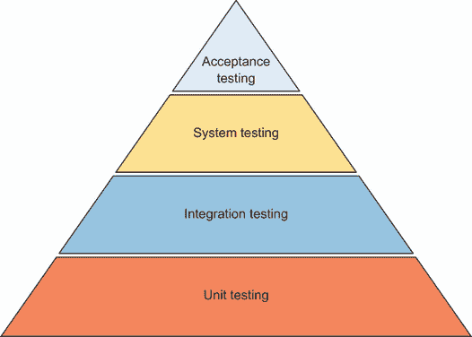

图 20.1 测试金字塔的底部级别（单元测试）较大，而较高的测试级别较小。它们从检查单个单元开始，一直上升到验证软件如何满足用户需求。

测试持久化应用程序属于集成层。我们将代码与数据库交互结合起来，并且依赖于数据库的工作方式。我们希望保持测试行为在重复执行测试之间的一致性，并保持数据库内容与运行测试之前相同。在接下来的章节中，我们将探讨实现这些目标的最佳方法。

## 20.2 创建用于测试的持久化应用程序

我们将创建一个 Spring Boot 持久化应用程序，以便我们可以测试其功能。为此，请访问 Spring Initializr 网站([`start.spring.io/`](https://start.spring.io/))并创建一个新的 Spring Boot 项目（图 20.2），具有以下特性：

+   组：com.manning.javapersistence

+   工件：测试

+   描述：持久化测试

我们还将添加以下依赖项：

+   Spring Data JPA（这将在 Maven pom.xml 文件中添加`spring-boot-starter-data-jpa`）。

+   MySQL 驱动程序（这将在 Maven pom.xml 文件中添加`mysql-connector-java`）。

+   Lombok（这将在 Maven pom.xml 文件中添加`org.projectlombok,lombok`）。

+   使用 Hibernate validator 进行 Bean 验证（这将在 Maven pom.xml 文件中添加`spring-boot-starter-validation`）。

+   `spring-boot-starter-test`依赖项将被自动添加。

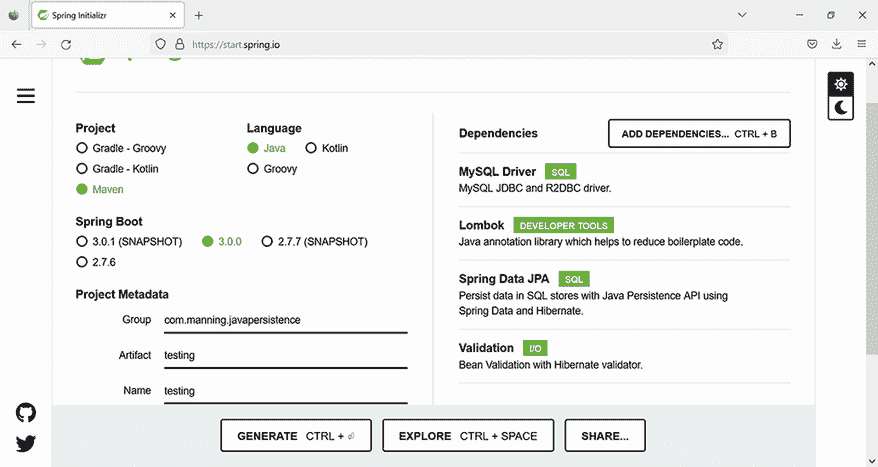

图 20.2 创建一个将使用 MySQL 数据库的 Spring Boot 项目

注意：要执行源代码中的示例，您首先需要运行 Ch20.sql 脚本。

下面的列表中的 pom.xml 文件包括我们在创建 Spring Boot 项目时添加的依赖项。我们将创建一个访问 MySQL 数据库的 Spring 持久化应用程序，我们需要驱动程序，我们还需要验证一些字段。

列表 20.1 pom.xml Maven 文件

```
Path: Ch20/1 spring testing/pom.xml

   \1                                                         Ⓐ
       <groupId>org.springframework.boot</groupId>                      Ⓐ
       <artifactId>spring-boot-starter-data-jpa</artifactId>            Ⓐ
   </dependency>                                                        Ⓐ
   <dependency>                                                         Ⓑ
       <groupId>org.springframework.boot</groupId>                      Ⓑ
       <artifactId>spring-boot-starter-validation</artifactId>          Ⓑ
   </dependency>                                                        Ⓑ
   <dependency>                                                         Ⓒ
       <groupId>mysql</groupId>                                         Ⓒ
       <artifactId>mysql-connector-java</artifactId>                    Ⓒ
       <scope>runtime</scope>                                           Ⓒ
   </dependency>                                                        Ⓒ
   <dependency>                                                         Ⓓ
       <groupId>org.projectlombok</groupId>                             Ⓓ
       <artifactId>lombok</artifactId>                                  Ⓓ
       <optional>true</optional>                                        Ⓓ
   </dependency>                                                        Ⓓ
   <dependency>                                                         Ⓔ
       <groupId>org.springframework.boot</groupId>                      Ⓔ
       <artifactId>spring-boot-starter-test</artifactId>                Ⓔ
       <scope>test</scope>                                              Ⓔ
   </dependency>                                                        Ⓔ
```

Ⓐ `spring-boot-starter-data-jpa`是 Spring Boot 用于通过 Spring Data JPA 连接到关系型数据库的启动依赖项。

Ⓑ `spring-boot-starter-validation`是用于使用 Hibernate Validator 进行 Java Bean 验证的启动依赖项。

Ⓒ `mysql-connector-java`是 MySQL 的 JDBC 驱动程序。它是一个运行时依赖项，因此仅在运行时需要在类路径中。

Ⓓ `Lombok`将允许我们减少样板代码，依靠自动生成的构造函数、获取器和设置器。

Ⓔ `spring-boot-starter-test`是用于测试 Spring Boot 应用程序的启动依赖项，包括 JUnit 5 库。

下一步是填写 Spring Boot 应用程序的 application.properties 文件。此文件可以包含应用程序将使用的各种属性。Spring Boot 将自动从类路径中查找并加载 application.properties；Maven 将 src/main/resources 文件夹添加到类路径中。对于本章的演示，application.properties 配置文件将类似于列表 20.2。

列表 20.2 application.properties 文件

```
Path: Ch20/1 spring testing/src/main/resources/application.properties 

spring.datasource.url=jdbc:mysql://localhost:3306/
➥ CH20_TESTING?serverTimezone=UTC                                          Ⓐ
spring.datasource.username=root                                             Ⓑ
spring.datasource.password=                                                 Ⓑ
spring.jpa.properties.hibernate.dialect=org.hibernate.dialect.MySQL8Dialect Ⓒ
spring.jpa.show-sql=true                                                    Ⓓ
spring.jpa.hibernate.ddl-auto=create                                        Ⓔ
```

Ⓐ 数据库的 URL。

Ⓑ 访问数据库的凭据。用您机器上的凭据替换它们，并在实际生活中使用密码。

Ⓒ 数据库的方言，MySQL。

Ⓓ 在执行时显示 SQL 查询。

Ⓔ 在应用程序的每次执行中重新创建表。

注意：在 Spring Boot 应用程序中提供参数的方法有很多种，.properties 文件只是其中之一。在替代方案中，参数可能来自源代码或作为命令行参数。有关详细信息，请参阅 Spring Boot 文档。

我们将要测试的应用程序将包括两个实体，`User`和`Log`。以下列表示例显示了`User`实体。它将有一个生成的`id`和一个带有长度验证的`name`字段。无参数构造函数、获取器和设置器将由 Lombok 生成。

列表 20.3 `User`类

```
Path: Ch20/1 spring testing/src/main/java/com/manning/javapersistence
➥ /testing/model/User.java

@Entity
@NoArgsConstructor
public class User {

    @Id
    @GeneratedValue
    @Getter
    private Long id;

    @NotNull
    @Size(
            min = 2,
            max = 255,
            message = "Name is required, maximum 255 characters."
    )
    @Getter
    @Setter
    private String name;

    public User(String name) {
        this.name = name;
    }

}
```

以下列表示例显示了`Log`实体。它将有一个生成的`id`和一个带有长度验证的`info`字段。无参数构造函数、获取器和设置器将由 Lombok 生成。

列表 20.4 `Log`类

```
Path: Ch20/1 spring testing/src/main/java/com/manning/javapersistence
➥ /testing/model/Log.java

@Entity
@NoArgsConstructor
public class Log {

    @Id
    @GeneratedValue
    @Getter
    private Long id;

    @NotNull
    @Size(
            min = 2,
            max = 255,
            message = "Info is required, maximum 255 characters."
    )
    @Getter
    @Setter
    private String info;

    public Log(String info) {
        this.info = info;
    }
}
```

为了管理这两个实体，我们将创建两个扩展`JpaRepository`的仓库接口：`UserRepository`和`LogRepository`：

```
public interface UserRepository extends JpaRepository<User, Long> {
}

public interface LogRepository extends JpaRepository<Log, Long> {

}
```

## 20.3 使用 Spring TestContext 框架

Spring TestContext 框架旨在提供集成测试支持，因此它非常适合测试持久层。它与我们一起使用的测试框架无关，我们将使用 JUnit 5。我们将检查属于`org.springframework.test.context`包的其基本类和注解。

Spring TestContext 框架的入口点是`TestContextManager`类。它的目标是管理一个单一的`TestContext`并向注册的监听器发送事件。我们将在第 20.8 节中详细检查监听器。

我们将编写一个测试，将`User`实体保存到数据库中，并使用注入的`UserRepository`再次检索它。

列表 20.5 `SaveRetrieveUserTest`类

```
Path: Ch20/1 spring testing/src/test/java/com/manning/javapersistence
➥ /testing/SaveRetrieveUserTest.java

@SpringBootTest
class SaveRetrieveUserTest {

    @Autowired
    private UserRepository userRepository;

    @Test
    void saveRetrieve() {
        userRepository.save(new User("User1"));
        List<User> users = userRepository.findAll();

        assertAll(
                () -> assertEquals(1, users.size()),
                () -> assertEquals("User1", users.get(0).getName())
        );
    }

}
```

如果我们反复运行这个测试几次，它总是会成功，所以我们可能会尝试修改它，并使用 JUnit 5 的`@RepeatedTest(2)`注解来注释`saveRetrieve`测试方法。这将在一个类执行中运行两次。修改后的测试将如下所示。

列表 20.6 使用`@RepeatedTest`的`SaveRetrieveUserTest`类

```
Path: Ch20/1 spring testing/src/test/java/com/manning/javapersistence
➥ /testing/SaveRetrieveUserTest.java

@SpringBootTest
class SaveRetrieveUserTest {

    @Autowired
    private UserRepository userRepository;

    @RepeatedTest(2)
    void saveRetrieve() {
        userRepository.save(new User("User1"));
        List<User> users = userRepository.findAll();

        assertAll(
                () -> assertEquals(1, users.size()),
                () -> assertEquals("User1", users.get(0).getName())
        );
    }

}
```

让我们现在运行修改后的测试。出人意料还是不出人意料，它第一次执行会成功，第二次执行会失败，从数据库中获取两个`User`而不是一个（见图 20.3）。

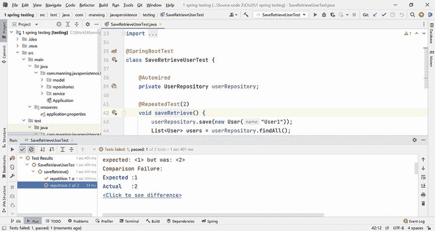

图 20.3 `@RepeatedTest`第一次执行会成功，第二次执行会失败，因为第一次测试执行后数据库被留下脏数据。

这种情况发生是因为第一次测试执行插入的行没有被删除，第二次测试在表中找到了它，并添加了一个。我们可以跟踪在类运行时执行的 SQL 命令。

在运行两个测试之前，执行的 SQL 命令处理表（重新）创建：

```
drop table if exists hibernate_sequence
drop table if exists log
drop table if exists user
create table hibernate_sequence (next_val bigint)
insert into hibernate_sequence values ( 1 )
create table log (id bigint not null, info varchar(255) not null, 
➥ primary key (id))
create table user (id bigint not null, name varchar(255) not null, 
➥ primary key (id))
```

在运行每个测试之前，以下 SQL 命令被执行，向表中插入一个新行：

```
select next_val as id_val from hibernate_sequence for update
update hibernate_sequence set next_val= ? where next_val=?
insert into user (name, id) values (?, ?)
select user0_.id as id1_1_, user0_.name as name2_1_ from user user0_
```

第二次测试的执行将在表中找到一个现有行，将添加一个新的行，因此会失败，因为它期望找到单个行。我们将不得不寻找替代方案，以确保在每个测试结束时数据库的内容与运行之前相同。

## 20.4 @DirtiesContext 注解

Spring TestContext 框架提供的一个替代方案是使用 `@DirtiesContext` 注解。`@DirtiesContext` 注解承认测试方法或测试类会改变 Spring 上下文，Spring TestContext 框架将从头开始重新创建它，并将其提供给下一个测试。该注解可以应用于方法或类。其效果可以在每个测试方法执行之前或之后应用，或者可以在测试类执行之前或之后应用。

我们将修改测试类，如下所示。

列表 20.7 使用 `@DirtiesContext` 的 `SaveRetrieveUserTest` 类

```
Path: Ch20/1 spring testing/src/test/java/com/manning/javapersistence
➥ /testing/SaveRetrieveUserTest.java

@SpringBootTest
@DirtiesContext(classMode = 
➥ DirtiesContext.ClassMode.AFTER_EACH_TEST_METHOD)    Ⓐ
class SaveRetrieveUserTest {

    @Autowired
    private UserRepository userRepository;

    @RepeatedTest(2)
    void saveRetrieve() {
        // . . .  
    }

}
```

Ⓐ 在每个测试方法执行后重新创建 Spring 上下文。

如果我们现在运行修改后的测试，它将在第一次和第二次执行中成功（见图 20.4）。这意味着在运行第一次测试之后，第二次测试的执行将不再遇到脏数据库。

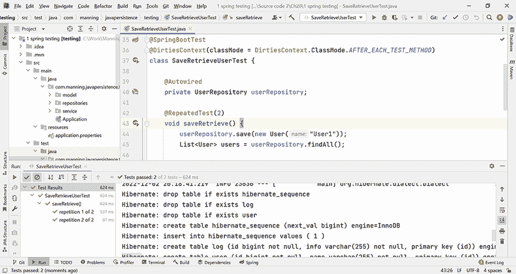

图 20.4 `@DirtiesContext` 注解的测试将在第一次和第二次都成功。

在运行每个测试之前，执行的 SQL 命令处理表（重新）创建和在表中插入一行：

```
drop table if exists hibernate_sequence
drop table if exists log
drop table if exists user
create table hibernate_sequence (next_val bigint)
insert into hibernate_sequence values ( 1 )
create table log (id bigint not null, info varchar(255) not null, 
➥ primary key (id))
create table user (id bigint not null, name varchar(255) not null, 
➥ primary key (id))
select next_val as id_val from hibernate_sequence for update
update hibernate_sequence set next_val= ? where next_val=?
insert into user (name, id) values (?, ?)
select user0_.id as id1_1_, user0_.name as name2_1_ from user user0_
```

这些命令执行了两次，一次在每个测试之前。不仅如此，Spring Boot 标签（也在图 20.4 的底部显示）也将显示两次——每次应用程序启动时各一次。

`@DirtiesContext` 注解在方法级别上的功能在图 20.5 中得到演示。

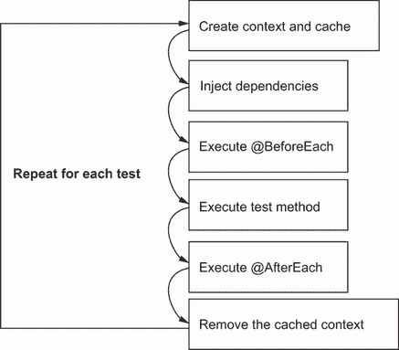

图 20.5 在每个测试方法执行之前，`@DirtiesContext` 注解在方法级别上会创建上下文和缓存，并在执行后移除它们。

这个解决方案是可行的，但它带来了与每个测试执行中表重新创建和应用程序重新初始化相关的性能成本。让我们探索更多替代方案。

## 20.5 @Transactional 执行

我们在第十一章中详细探讨了事务。事务控制原子操作组，要么完全成功，要么完全失败。使用 Spring 和 Spring Data 以及 `@Transactional` 注解管理事务在第 11.4 节中进行了详细说明。我们现在要应用的想法是运行每个测试都是事务性的，并在执行结束时回滚事务。

默认情况下，由于`TransactionalTestExecutionListener`的存在，执行测试时我们的事务将自动回滚。我们将在第 20.8 节中详细讨论监听器；现在，只需注意它们可以在测试执行时提供一些额外的操作。默认行为可以通过`@Commit`和`@Rollback`注解进行修改。因此，如果我们想让测试在执行结束时提交，我们可以用`@Commit`或`@Rollback(false)`来注解它。

为了在测试执行过程中跟踪事务的活跃状态，我们将使用`TransactionSynchronizationManager`类。这个类负责管理线程的资源以及事务同步。它的`isActualTransactionActive()`方法将检查当前是否存在活跃的`Transaction`对象。

在以下列表中，我们将创建一个测试类，用`@Transactional`注解它，并跟踪类的方法中的事务状态。

列表 20.8 `TransactionalTest`类

```
Path: Ch20/1 spring testing/src/test/java/com/manning/javapersistence
➥ /testing/TransactionalTest.java

@SpringBootTest
@Transactional
class TransactionalTest {

    // . . . 

    @BeforeAll
    static void beforeAll() {
        System.out.println("beforeAll, transaction active = " + 
              TransactionSynchronizationManager.isActualTransactionActive());
    }

    @BeforeEach
    void beforeEach() {
        System.out.println("beforeEach, transaction active = " + 
               TransactionSynchronizationManager.isActualTransactionActive());
    }

    @RepeatedTest(2)
    void storeRetrieve() {
        // . . . 
        System.out.println("end of method, transaction active = " + 
               TransactionSynchronizationManager.isActualTransactionActive());
    }

    @AfterEach
    void afterEach() {
        System.out.println("afterEach, transaction active = " + 
               TransactionSynchronizationManager.isActualTransactionActive());
    }

    @AfterAll
    static void afterAll() {
        System.out.println("afterAll, transaction active = " + 
               TransactionSynchronizationManager.isActualTransactionActive());
    }

}
```

执行日志将告诉我们，在`@BeforeAll`和`@AfterAll`方法中事务不活跃，但在`@BeforeEach`和`@AfterEach`方法以及测试方法本身内部是活跃的。如前所述，默认情况下，事务将在测试结束时回滚，因此`@RepeatedTest`对所有执行都将成功：

```
beforeAll, transaction active = false
beforeEach, transaction active = true
end of method, transaction active = true
afterEach, transaction active = true
beforeEach, transaction active = true
end of method, transaction active = true
afterEach, transaction active = true
afterAll, transaction active = false
```

这种方法仍然存在一个陷阱，我们将演示它。我们引入了一个单独的`UserService`类，其中包含一个事务方法，如下所示。

列表 20.9 `UserService`类

```
Path: Ch20/1 spring testing/src/main/java/com/manning/javapersistence
➥ /testing/service/UserService.java

@Service
public class UserService {

    @Autowired
    private UserRepository userRepository;

    @Transactional
    public void saveTransactionally(User user) {
        userRepository.save(user);
    }
}
```

我们将从`TransactionalTest`类内部的`@RepeatedTest`中调用此方法，以以事务方式持久化用户。

列表 20.10 调用`saveTransactionally`方法

```
Path: Ch20/1 spring testing/src/test/java/com/manning/javapersistence
➥ /testing/TransactionalTest.java

@SpringBootTest
@Transactional
class TransactionalTest {

    // . . . 

    @RepeatedTest(2)
    void storeRetrieve() {
        List<User> users = buildUsersList();
        userRepository.saveAll(users);
        assertEquals(getIterations(), userRepository.findAll().size());

        userService.saveTransactionally(users.get(0));

        System.out.println("end of method, transaction active = " + 
               TransactionSynchronizationManager.isActualTransactionActive());
    }

    // . . . 

}
```

`UserService`中的`saveTransactionally`方法具有没有其他参数的`@Transactional`注解。默认传播行为是`REQUIRED`（见第 11.4 节）。由于测试已经有一个正在运行的事务，`saveTransactionally`方法将在同一个事务中执行，并且所有内容将在测试结束时回滚。

我们可以将`saveTransactionally`方法的注解更改为`@Transactional(propagation = Propagation.REQUIRES_NEW)`。这将挂起测试中执行的事务，启动一个新的事务，并提交它，如图 20.6 所示。

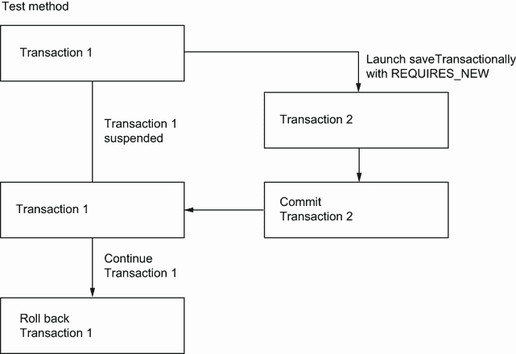

图 20.6 `saveTransactionally`方法的事务将被提交，而测试方法的事务将被回滚。

`saveTransactionally`的事务已被提交。因此，再次运行测试时将遇到数据库中的现有记录，测试将失败（见图 20.7）。

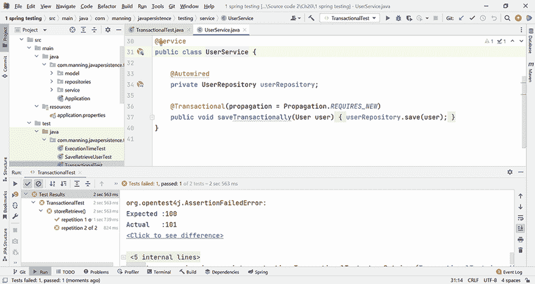

图 20.7 在`saveTransactionally`方法单独提交其事务的情况下连续运行两个测试将导致第二个测试失败。

结论是，即使你以事务方式运行测试，也要注意启动单独事务中方法的陷阱。这可能导致奇怪的错误。此外，使用这种方法进行调试可能很困难。

为了比较使用 `@DirtiesContext` 和使用 `@Transactional` 的性能，我们执行了一系列 10 个测试，记录数从 100 逐步增加到 2,000。MySQL 上的结果如图 20.8 所示。

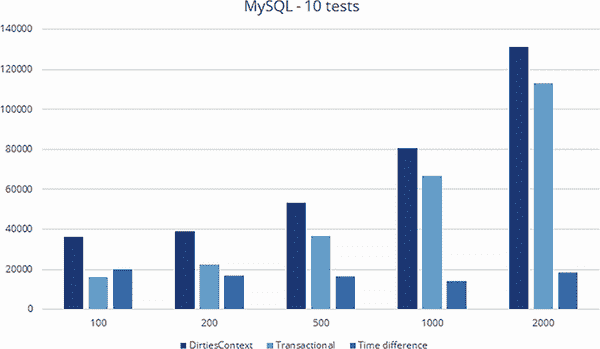

图 20.8 使用 `@DirtiesContext` 和 `@Transactional` 在 MySQL 上执行时间（毫秒）以及记录数从 100 到 2,000 的变化

H2 上的结果如图 20.9 所示。我们使用这个内存数据库执行了相同的 10 个测试系列，记录数从 100 逐步增加到 2,000。

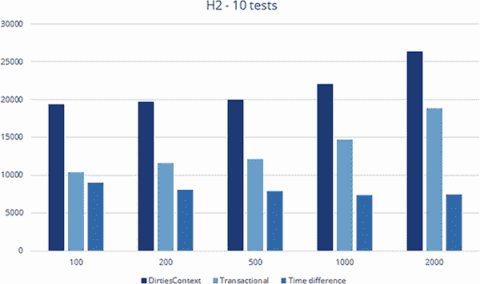

图 20.9 使用 `@DirtiesContext` 和 `@Transactional` 在 H2 上执行时间（毫秒）以及记录数从 100 到 2,000 的变化

分析 MySQL 和 H2 的结果，我们可以看到使用 `@DirtiesContext` 和 `@Transactional` 的执行时间差异大致是恒定的。它不依赖于记录数，而是依赖于上下文重新初始化的次数。结论是，你应该谨慎使用 `@DirtiesContext`。将带有此注解的测试推送到 CI/CD（持续集成/持续开发）环境将严重增加它们的执行时间。

## 20.6 @BeforeTransaction 和 @AfterTransaction 注解

我们现在将检查 `@BeforeTransaction` 和 `@AfterTransaction` 注解。正如它们的名称所暗示的，它们指示在事务执行前后要执行的方法。为了我们的分析，我们将检查确实在这些方法内部没有活跃的事务。

使用 `Assumptions.assumeFalse` JUnit 5 方法，我们将指示运行测试的一个先决条件是当时没有活跃的事务；否则测试将不会运行。所以如果假设未满足，测试将被终止。如果断言未满足，测试将失败。

列表 20.11 使用 `@BeforeTransaction` 和 `@AfterTransaction`

```
Path: Ch20/1 spring testing/src/test/java/com/manning/javapersistence
➥ /testing/TransactionsManagementTest.java

@SpringBootTest
@Transactional
class TransactionsManagementTest {

    @Autowired
    private UserRepository userRepository;

    @Autowired
    private LogRepository logRepository;

    @BeforeTransaction
    void beforeTransaction() {
        Assumptions.assumeFalse(
             TransactionSynchronizationManager.isActualTransactionActive());
    }

    // . . . 

    @AfterTransaction
    void afterTransaction() {
        Assumptions.assumeFalse(
             TransactionSynchronizationManager.isActualTransactionActive());

    }

}
```

这里还有一个需要避免的陷阱：在 `@BeforeTransaction` 或 `@AfterTransaction` 方法中持久化数据的可能性。因为这些是在事务外部执行的，数据将不会被回滚，并会影响数据库的内容。更严重的是，如果我们持久化了测试中没有检查的数据（例如，`Log` 实体，而我们的测试验证的是 `User` 实体），我们的测试将始终执行正确，但会在它们后面留下已提交的数据，如下面的列表所示。

列表 20.12 在 `@BeforeTransaction`/`@AfterTransaction` 中持久化实体

```
Path: Ch20/1 spring testing/src/test/java/com/manning/javapersistence
➥ /testing/TransactionsManagementTest.java

@SpringBootTest
@Transactional
class TransactionsManagementTest {

    @Autowired
    private UserRepository userRepository;

    @Autowired
    private LogRepository logRepository;

    @BeforeTransaction
    void beforeTransaction() {
        Assumptions.assumeFalse(
             TransactionSynchronizationManager.isActualTransactionActive());
        logRepository.save(new Log("@BeforeTransaction"));
    }

    // . . . 

    @AfterTransaction
    void afterTransaction() {
        Assumptions.assumeFalse(
             TransactionSynchronizationManager.isActualTransactionActive());
        logRepository.save(new Log("@AfterTransaction"));

    }

}
```

## 20.7 使用 Spring 配置文件

默认情况下，Spring Boot 创建一个 main/resources/application.properties 文件来保存应用程序的配置。但经常会有需要根据用户的配置文件区分属性的情况。Spring Boot 将允许我们在这种情况下将属性分开，默认情况下在名为 main/resources/application-profilename.properties 的文件中，并允许我们在配置文件之间切换。

一个现实生活中的用例是当你有一个针对程序员的配置文件，在开发期间使用嵌入式数据库，以及另一个针对生产的配置文件，使用真实数据库。程序员希望能够快速执行他们的测试，而在生产环境中，测试将在真实环境中运行。

开发配置的详细信息如下所示。它针对 H2 数据库，并在执行期间显示 SQL 查询，因为程序员对跟踪它们感兴趣。

列表 20.13 application-dev.properties 文件

```
Path: Ch20/2 spring profiles/src/main/resources
➥ /application-dev.properties

spring.datasource.url=jdbc:h2:mem:ch20_testing
spring.datasource.username=sa
spring.datasource.password=
spring.jpa.properties.hibernate.dialect=org.hibernate.dialect.H2Dialect
spring.jpa.show-sql=true
spring.jpa.hibernate.ddl-auto=create
```

生产配置的详细信息如下所示。它针对 MySQL 数据库，并在执行期间不会显示 SQL 查询，因为这将在生产中消耗资源。

列表 20.14 application-prod.properties 文件

```
Path: Ch20/2 spring profiles/src/main/resources
➥ /application-prod.properties

spring.datasource.url=
➥ jdbc:mysql://localhost:3306/CH20_TESTING?serverTimezone=UTC
spring.datasource.username=root
spring.datasource.password=
spring.jpa.properties.hibernate.dialect=org.hibernate.dialect.MySQL8Dialect
spring.jpa.show-sql=false
spring.jpa.hibernate.ddl-auto=create
```

要在开发期间在 H2 数据库上运行测试，我们必须选择`dev`配置文件。例如，这可以通过在 application.properties 文件中完成。

列表 20.15 包含 dev 配置文件的 application.properties 文件

```
Path: Ch20/2 spring profiles/src/main/resources/application.properties

spring.profiles.active=dev
```

为了展示在配置文件之间切换有多简单，我们将运行一个测试，该测试将保存并从数据库中检索一个实体。

列表 20.16 `SpringProfilesTest`类

```
Path: Ch20/2 spring profiles/src/test/java/com/manning/javapersistence
➥ /testing/SpringProfilesTest.java

@SpringBootTest
@Transactional
class SpringProfilesTest {

    @Autowired
    private UserRepository userRepository;

    @Test
    void storeUpdateRetrieve() {
        List<User> users = buildUsersList();
        userRepository.saveAll(users);

        assertEquals(getIterations(), userRepository.findAll().size());
    }

}
```

要成功运行此测试，我们需要在 pom.xml 文件中包含 H2 驱动依赖项。

列表 20.17 包含 H2 驱动依赖项的 pom.xml 文件

```
Path: Ch20/2 spring profiles/pom.xml

<dependency>
   <groupId>com.h2database</groupId>
   <artifactId>h2</artifactId>
   <version>1.4.200</version>
   <scope>runtime</scope>
</dependency>
```

在`dev`配置文件上运行测试的结果显示在图 20.10 中：`dev`配置文件使用内存中的 H2 数据库。

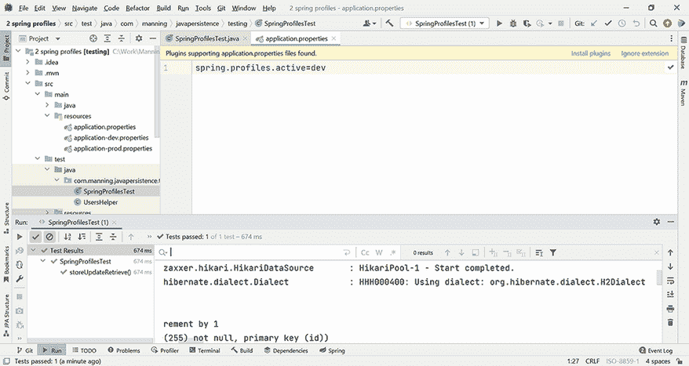

图 20.10 在`dev`配置文件上运行测试的结果，使用 H2 数据库并显示 SQL 查询的执行

要在生产环境中在 MySQL 数据库上运行测试，我们必须选择`prod`配置文件。例如，这可以通过在 application.properties 文件中完成。

列表 20.18 包含 prod 配置文件的 application.properties 文件

```
Path: Ch20/2 spring profiles/src/main/resources/application.properties

spring.profiles.active=prod
```

作为修改活动配置的替代方案，我们可以在测试级别使用`@ActiveProfiles`注解，如图 20.19 所示。此注解将覆盖在 application.properties 中设置的配置文件，但将需要我们修改和重新编译代码。

列表 20.19 `SpringProfilesTest`类

```
Path: Ch20/2 spring profiles/src/test/java/com/manning/javapersistence
➥ /testing/SpringProfilesTest.java

@SpringBootTest
@Transactional
@ActiveProfiles("prod")
class SpringProfilesTest {
   // . . .  
}
```

要成功运行此测试，我们需要在 pom.xml 文件中包含 MySQL 驱动依赖项。

列表 20.20 包含 MySQL 驱动依赖项的 pom.xml 文件

```
Path: Ch20/2 spring profiles/pom.xml

<dependency>
   <groupId>mysql</groupId>
   <artifactId>mysql-connector-java</artifactId>
   <scope>runtime</scope>
</dependency>
```

在 `prod` 配置文件上运行测试的结果如图 20.11 所示。与 `dev` 配置文件不同，此配置文件使用 MySQL 数据库。

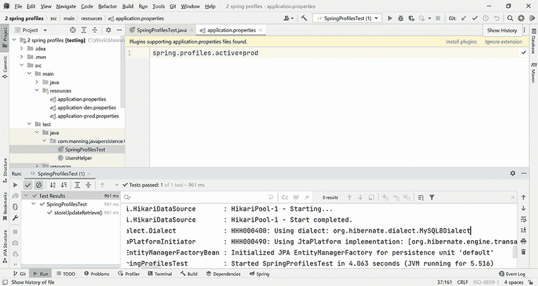

图 20.11 在 `prod` 配置文件上运行测试的结果，使用 MySQL 数据库且不显示 SQL 查询的执行

## 20.8 使用测试执行监听器

控制测试执行生命周期的 一种方式是使用 JUnit 5 注解：`@BeforeAll`、`@AfterAll`、`@BeforeEach` 和 `@AfterEach`。在某些情况下，这可能会不方便。例如，如果我们需要为多个测试使用相同的 `@BeforeEach` 和 `@AfterEach` 行为，我们需要创建一个包含这些方法的基类，并创建多个子类，以便在运行测试时继承并执行它们。这会导致我们的测试挂在一个类层次结构中。或者，我们可以考虑使用测试执行监听器，使用 `TestExecutionListener` 接口和 `@TestExecutionListeners` 注解，从而将控制测试生命周期的行为分离出来。

默认情况下，Spring 为每个测试提供了一些已实现的 `TestExecutionListener`。对我们来说最有兴趣的是 `DependencyInjectionTestExecutionListener`，它支持测试实例的依赖注入，以及 `TransactionalTestExecutionListener`，它支持测试的事务性执行和回滚。我们在 20.3.2 节中提到，默认情况下，由于 `TransactionalTestExecutionListener`，执行测试时事务将自动回滚——这对于测试持久性和在执行测试后留下干净数据库至关重要。

`TestExecutionListener` 接口定义了一系列空默认方法，这些方法比 JUnit 5 生命周期方法更细粒度，并且按照表 20.1 所示的顺序执行。

表 20.1 `TestExecutionListener` 接口中的默认方法

| 方法 | 描述 |
| --- | --- |
| `beforeTestClass` | 在 JUnit 5 的 `@BeforeAll` 方法之前执行 |
| `prepareTestInstance` | 准备提供的测试上下文的测试实例 |
| `beforeTestMethod` | 在 JUnit 5 的 `@BeforeEach` 方法之前执行 |
| `beforeTestExecution` | 在测试方法之前执行 |
| `afterTestExecution` | 在测试方法之后执行 |
| `afterTestMethod` | 在 JUnit 5 的 `@AfterEach` 方法之后执行 |
| `afterTestClass` | 在 JUnit 5 的 `@AfterAll` 方法之后执行 |

我们将编写自己的监听器，实现 `TestExecutionListener` 接口，覆盖所有方法，并从每个方法中打印一条消息，这样我们就可以跟踪使用此监听器注解的测试的执行。

正如 20.3.2 节中所述，我们将通过使用`TransactionSynchronizationManager`类及其`isActualTransactionActive()`方法来跟踪测试执行期间活跃的事务，该方法将检查是否存在当前活跃的`Transaction`对象。我们的监听器如下所示。

列表 20.21 `DatabaseOperationsListener`类

```
Path: Ch20/3 spring listeners/src/test/java/com/manning/javapersistence
➥ /testing/listeners/DatabaseOperationsListener.java

public class DatabaseOperationsListener implements TestExecutionListener {

    @Override
    public void beforeTestClass(TestContext testContext) {
        System.out.println("beforeTestClass, transaction active = " + 
            TransactionSynchronizationManager.isActualTransactionActive());
    }

    @Override
    public void afterTestClass(TestContext testContext) {
        System.out.println("afterTestClass, transaction active = " + 
            TransactionSynchronizationManager.isActualTransactionActive());
    }

    @Override
    public void beforeTestMethod(TestContext testContext) {
        System.out.println("beforeTestMethod, transaction active = " + 
            TransactionSynchronizationManager.isActualTransactionActive());
    }

    @Override
    public void afterTestMethod(TestContext testContext) {
        System.out.println("afterTestMethod, transaction active = " + 
            TransactionSynchronizationManager.isActualTransactionActive());
    }

    @Override
    public void beforeTestExecution(TestContext testContext) {
        System.out.println("beforeTestExecution, transaction active = " + 
            TransactionSynchronizationManager.isActualTransactionActive());
    }

    @Override
    public void afterTestExecution(TestContext testContext) {
        System.out.println("afterTestExecution, transaction active = " + 
            TransactionSynchronizationManager.isActualTransactionActive());
    }

    @Override
    public void prepareTestInstance(TestContext testContext) {
        System.out.println("prepareTestInstance, transaction active = " + 
            TransactionSynchronizationManager.isActualTransactionActive());
    }

}
```

我们将创建自己的测试，将其注解为使用新的`DatabaseOperationsListener`，并打印生命周期方法和测试本身的消息，以跟踪其执行。

列表 20.22 `ListenersTest`类

```
Path: Ch20/3 spring listeners/src/test/java/com/manning/javapersistence
➥ /testing/ListenersTest.java

@SpringBootTest
@Transactional
@TestExecutionListeners(value = {DatabaseOperationsListener.class})
class ListenersTest {

    @Autowired
    private UserRepository userRepository;

    @BeforeAll
    static void beforeAll() {
        System.out.println("@BeforeAll");
    }

    @BeforeEach
    void beforeEach() {
        System.out.println("@BeforeEach");
    }

    @Test
    void storeUpdateRetrieve() {
        TestContextManager testContextManager = new 
                           TestContextManager(getClass());
        System.out.println(
           "testContextManager.getTestExecutionListeners().size() = " 
         + testContextManager.getTestExecutionListeners().size());
       List<User> users = buildUsersList();
       userRepository.saveAll(users);
       assertEquals(getIterations(), userRepository.findAll().size());

    }

    @AfterEach
    void afterEach() {
        System.out.println("@AfterEach");
    }

    @AfterAll
    static void afterAll() {
        System.out.println("@AfterAll");
    }

}
```

如果我们现在运行这个测试，它将因为`NullPointerException`而失败，如图 20.12 所示。

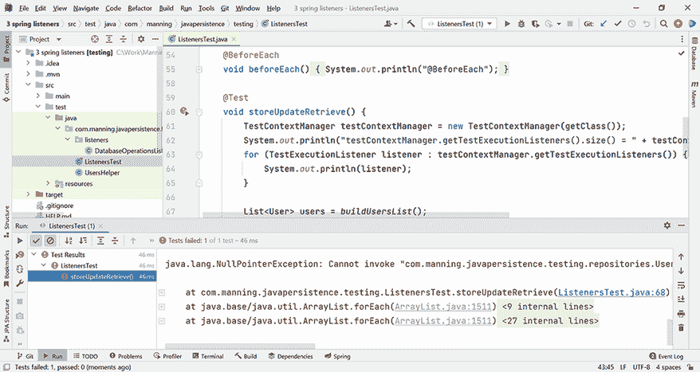

图 20.12 初始注解了我们的自定义监听器的测试因`NullPointerException`而失败。

如果我们检查正在发生的事情，我们会注意到与数据库交互的对象的`userRepository`引用是`null`。正如控制台消息所展示的，在`TestContextManager`中只注册了一个监听器，即我们的`DatabaseOperationsListener`。之前需要的支持测试实例依赖注入的`DependencyInjectionTestExecutionListener`，以及因此对`userRepository`的依赖注入支持，现在不再注册。这是因为，一旦我们引入了自己的监听器，默认监听器就不再自动注册。

为了解决这个问题，我们将使用`MERGE_WITH_DEFAULTS`选项作为合并模式，如下所示。

列表 20.23 将默认监听器与我们的自定义监听器合并

```
Path: Ch20/3 spring listeners/src/test/java/com/manning/javapersistence
➥ /testing/ListenersTest.java

@SpringBootTest
@Transactional
@TestExecutionListeners(value = {
        DatabaseOperationsListener.class}, mergeMode = 
           TestExecutionListeners.MergeMode.MERGE_WITH_DEFAULTS)
class ListenersTest {
      // . . . 
}
```

如果我们现在再次运行测试，我们将能够跟踪方法执行的顺序，无论是从监听器还是从 JUnit 5 的生命周期方法。我们还会注意到注册的监听器数量现在是 15，这意味着有 14 个默认监听器和我们的自定义监听器：

```
beforeTestClass, transaction active = false
@BeforeAll
prepareTestInstance, transaction active = false
beforeTestMethod, transaction active = true
@BeforeEach
beforeTestExecution, transaction active = true
testContextManager.getTestExecutionListeners().size() = 15
afterTestExecution, transaction active = true
@AfterEach
afterTestMethod, transaction active = true
@AfterAll
afterTestClass, transaction active = false
```

表 20.2 总结了 Spring TestContext 框架中最重要的注解，这些注解用于测试持久化应用程序。您将能够使用 Spring TestContext 框架中的这些注解来测试您的持久化应用程序。该框架为集成测试提供了强大的支持，而持久化应用程序测试属于集成测试范畴。在此基础上，您可以继续构建系统测试和验收测试，正如我们在本章开头介绍测试金字塔时演示的那样。有关测试 Java 应用程序的一般信息和关于验收测试的特定信息，您可以参考我的书籍《JUnit in Action》，第三版（Tudose，2020）。

表 20.2 用于测试持久化应用程序的最重要的 Spring TestContext 框架注解

| 注解 | 描述 |
| --- | --- |
| `@DirtiesContext` | 测试执行期间底层 Spring 上下文发生了变化，应该重新初始化。 |
| `@BeforeTransaction` | 应在具有 Spring `@Transactional`注解的任何方法之前执行此空方法。 |
| `@AfterTransaction` | 应在具有 Spring `@Transactional` 注解的任何方法之后执行 void 方法。 |
| `@Rollback` | 对于事务性测试，测试完成后将回滚事务。这是默认行为，可以通过 `@Rollback(false)` 或 `@Commit` 进行更改。 |
| `@Commit` | 对于事务性测试，测试完成后将提交事务。 |
| `@ActiveProfiles` | 指定在 Spring 上下文中哪些配置配置文件将处于活动状态。 |
| `@TestExecutionListeners` | 配置要注册到 `TestContextManager` 的测试执行监听器。 |

通过可预测和安全的测试，只有在代码中存在问题时才会失败，而不是由于外部因素（例如脏数据库中的不适当内容），您作为程序员的职业生涯将会更加美好！

## 摘要

+   测试金字塔由单元、集成、系统和验收级别组成。持久化测试可以在集成级别进行分类。

+   您可以使用 Spring Boot 创建和配置持久化应用程序，并在其中管理实体和仓库。

+   您可以使用 Spring 测试上下文框架创建持久化测试，并使用 `@DirtiesContext` 或 `@Transactional` 来管理它们。

+   您可以使用 Spring 配置文件来测试访问各种数据库并具有不同配置的 Java 持久化应用程序。

+   您可以创建自定义测试执行监听器以跟踪测试的生命周期，并与它以及默认监听器一起工作。
