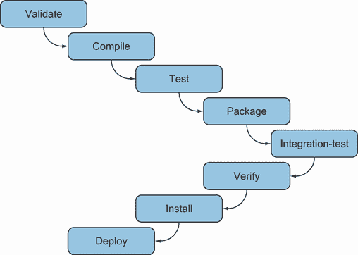

# 附录 A. Maven

Maven ([`maven.apache.org`](https://maven.apache.org)) 可以被视为一个源构建 *环境*。为了更好地理解 Maven 的工作原理，你需要了解 Maven 背后的关键点（原则）。从 Maven 项目的开始，就为软件架构制定了一些基本规则。这些规则旨在简化使用 Maven 的开发，并使开发者更容易实现构建系统。

Maven 的一个基本思想是构建系统应该尽可能简单：软件工程师不应该花费大量时间来实现构建系统。应该能够轻松地从零开始启动一个新项目，然后快速开始软件开发。本附录详细描述了 Maven 的核心原则，并从开发者的角度解释了它们的含义。

## A.1 约定优于配置

*约定优于配置* 是一个软件设计原则，旨在减少软件工程师需要做出的配置数量，而不是引入我们必须严格遵循的常规规则。这样，我们可以跳过繁琐的项目配置，专注于我们工作的更重要部分。

约定优于配置是 Maven 项目中最强的原则之一。其应用的一个例子是构建过程的文件夹结构。使用 Maven，我们需要的所有目录都已经为我们定义好了。例如，src/main/java/ 是 Maven 为项目 Java 代码指定的位置，src/test/java 是项目单元测试的位置，target 是构建文件夹，等等。

这听起来很棒，但我们不是在项目中失去了灵活性吗？如果我们想将源代码放在另一个文件夹中怎么办？Maven 易于配置：它提供了约定，但我们可以在任何点上覆盖这些约定，并使用我们选择的配置。

## A.2 强依赖管理

强依赖管理是 Maven 引入的第二个关键点。当 Maven 项目开始时，Java 项目的默认构建系统是另一个构建工具，Ant。使用 Ant，我们必须分发我们项目的依赖项，这意味着每个项目都必须负责它所需的依赖项，而单个项目的依赖项可能分布在不同的位置。此外，相同的依赖项可能被不同的项目使用，但每个项目可能位于不同的位置，导致资源重复。

Maven 引入了 *中央仓库* 的概念：互联网上存储所有类型工件（依赖项）的位置。Maven 构建工具通过读取项目的构建描述符，下载必要的工件版本，并将它们包含在应用程序的类路径中，来解析这些工件。这样，我们只需要在我们的构建描述符的依赖项部分列出一次依赖项。以下是一个示例：

```
<dependencies>
     <dependency>
        <groupId>mysql</groupId>
        <artifactId>mysql-connector-java</artifactId>
        <version>8.0.29</version>
     </dependency>
     <dependency>
        <groupId>org.springframework.data</groupId>
        <artifactId>spring-data-jpa</artifactId>
        <version>2.7.0</version>
     </dependency>
</dependencies>
```

此后，我们可以在任何其他机器上自由构建软件。我们不需要将依赖项捆绑到我们的项目中。

Maven 还引入了本地仓库的概念：硬盘上的一个文件夹（UNIX 中的 ~/.m2/repository/ 和 Windows 中的 C:\Users\<UserName>\.m2\repository\），Maven 将从中下载中央仓库中的工件。在我们构建项目之后，我们的工件将被安装在本地仓库中，以便其他项目稍后使用，这样既简单又整洁。

开发者可能加入由 Maven 管理的项目，并且只需要访问项目的源代码。Maven 从中央仓库下载所需的依赖项，并将它们带到本地仓库，在那里它们将可供同一开发者可能工作的其他项目使用。

## A.3 Maven 构建生命周期

Maven 的另一个非常强的原则是*构建生命周期*。Maven 项目围绕定义构建、测试和分发特定工件的过程构建。Maven 项目只能生成一个工件。这样，我们可以使用 Maven 构建项目工件、清理项目的文件夹结构或生成项目文档。这些是三个内置的 Maven 生命周期：

+   *默认*—用于生成项目工件

+   *清理*—用于清理项目

+   *站点*—用于生成项目文档

这些生命周期中的每一个都由几个阶段组成。要导航某个生命周期，构建过程将遵循其阶段（见图 A.1）。



图 A.1 Maven 默认生命周期的阶段，从验证到部署

这些是默认生命周期的阶段：

1.  *验证*—验证项目是否正确，以及所有必要的信息是否可用。

1.  *编译*—编译项目的源代码。

1.  *测试*—使用合适的单元测试框架（例如，在这种情况下可能是 JUnit 5）测试编译后的源代码。测试不应需要将代码打包或部署。

1.  *打包*—将编译后的代码打包成可分发格式，例如.jar 文件。

1.  *集成测试*—在可以运行集成测试的环境中处理和部署包（如果需要）。

1.  *验证*—运行任何检查以验证包是否有效并满足质量标准。

1.  *安装*—将包安装到本地仓库中，以便在本地项目中作为依赖项使用。

1.  *部署*—在集成或发布环境中，将最终包复制到远程仓库以与其他开发者和项目共享。

这里，再次强调 Maven 推崇的约定优于配置原则。这些阶段已经按照这里列出的顺序定义。Maven 以非常严格的顺序调用这些阶段；阶段按列表中的顺序依次执行，以完成生命周期。如果我们调用这些阶段中的任何一个——例如，在我们的项目主目录中键入 `mvn compile`——Maven 首先验证项目，然后尝试编译项目的源代码。

最后一点：将这些阶段视为扩展点是有用的。我们可以在这些阶段附加额外的 Maven 插件，并编排它们的执行顺序和方式。

## A.4 基于插件的架构

我们在这里将要提到的 Maven 的最后一个特性是其基于插件的架构。我们提到 Maven 是一个源构建环境。更具体地说，Maven 是一个插件执行源构建环境。项目的核心非常小，但项目的架构允许将多个插件附加到核心。这样，Maven 构建了一个环境，其中可以执行不同的插件。

在给定的生命周期中，每个阶段都附加了多个插件，并且 Maven 按照插件声明的顺序在通过给定阶段时调用它们。以下是一些核心 Maven 插件：

+   *清理*—在构建后进行清理

+   *编译器*—编译 Java 源代码

+   *部署*—将构建的工件部署到远程仓库

+   *安装*—将构建的工件安装到本地仓库中

+   *资源*—将资源复制到输出目录，以便包含在 .jar 文件中

+   *站点*—生成包含当前项目信息的站点

+   *Surefire*—在隔离的类加载器中运行 JUnit 测试

+   *验证器*—验证某些条件是否存在（对集成测试很有用）

除了这些核心 Maven 插件之外，还有许多其他 Maven 插件可用于许多情况，例如 WAR（用于打包 Web 应用程序）和 Javadoc（用于生成项目文档）。

插件在构建配置文件的 `plugins` 部分声明，如下例所示：

```
<build>
    <plugins>
        <plugin>
            <artifactId>maven-surefire-plugin</artifactId>
            <version>2.22.2</version>
        </plugin>
    </plugins>
</build>
```

插件声明可以有一个`groupId`、`artifactId`和`version`。这样，插件看起来就像依赖项。实际上，插件的处理方式与依赖项相同；它们像依赖项一样被下载到本地仓库。当我们指定一个插件时，`groupId`和`version`参数是可选的；如果我们没有声明它们，Maven 会寻找具有指定`artifactId`和以下`groupId`之一的插件：`org.apache.maven.plugins`或`org.codehaus.mojo`。由于版本是可选的，Maven 会尝试下载最新可用的插件版本。指定插件版本强烈推荐，以防止自动更新和非可重复构建。我们可能已经使用最新更新的 Maven 插件构建了我们的项目；但后来，如果其他开发者尝试使用相同的配置进行相同的构建，并且如果 Maven 插件在此之后已被更新，使用最新的更新可能会导致非可重复构建。

## A.5 Maven 项目对象模型（POM）

Maven 默认有一个名为 pom.xml 的构建描述符（简称*项目对象模型*）。我们不是强制性地指定我们想要做的事情；我们声明性地指定项目本身的一般信息，如下所示。

列表 A.1 非常简单的 pom.xml

```
<project>
   <modelVersion>4.0.0</modelVersion>
   <groupId>com.manning.javapersistence</groupId>
   <artifactId>example-pom</artifactId>
   <packaging>jar</packaging>
   <version>1.0-SNAPSHOT</version>
</project>
```

这段代码看起来真的很简单，不是吗？但可能有一个大问题：Maven 是如何仅凭这么少的信息就能构建源代码的？

答案在于 pom.xml 文件的继承功能。每个简单的 pom.xml 都从 Super POM 继承了大部分功能。就像在 Java 中，每个类都从`java.lang.Object`类继承某些方法一样，Super POM 赋予了每个 pom.xml 文件 Maven 功能。

为了进一步类比 Java 和 Maven，Maven 的 pom.xml 文件可以相互继承；就像在 Java 中，一些类可以作为其他类的父类。如果我们想使用列表 A.1 中的 pom 作为我们的父 pom，我们只需要将其`packaging`值更改为`pom`。父项目和聚合（多模块）项目只能将`pom`作为打包值。我们还需要在我们的父 pom 中定义哪些模块是子模块。

列表 A.2 包含子模块的父 pom.xml

```
<project>
   <modelVersion>4.0.0</modelVersion>
   <groupId>com.manning.javapersistence</groupId>
   <artifactId>example-pom</artifactId>
   <packaging>pom</packaging>                                       
   <version>1.0-SNAPSHOT</version>
   <modules>
         <module>example-module</module>                           
   </modules>
</project>
```

列表 A.2 是列表 A.1 的扩展。我们通过将包声明为`pom`类型并添加一个`modules`部分来声明这个`pom`是一个聚合模块。`modules`部分通过提供项目文件夹（在本例中为 example-module）的相对路径来列出我们的模块拥有的所有子模块。

以下列表显示了子 pom.xml。

列表 A.3 继承父 pom.xml 的 pom.xml

```
<project>
  <modelVersion>4.0.0</modelVersion>
  <parent>
    <groupId>com.manning.javapersistence</groupId>
    <artifactId>example-pom</artifactId>
    <version>1.0-SNAPSHOT</version>
  </parent>
  <artifactId>example-child</artifactId> 
</project>
```

记住，这个 pom.xml 位于父 XML 声明的文件夹中（在本例中为 example-module）。

这里有两点值得关注。首先，因为我们从某个其他 pom 继承，所以我们不需要为子 pom 指定`groupId`和`version`；其次，Maven 期望这些值与父 pom 中的值相同。

进一步类比 Java，似乎有理由询问 pom 文件可以从其父文件继承哪些类型的对象。以下是 pom 文件可以从其父文件继承的所有元素：

+   依赖项

+   开发者和贡献者

+   插件及其配置

+   报告列表

在父 pom 文件中指定的每个这些元素都会自动在子 pom 文件中指定。

## A.6 安装 Maven

安装 Maven 是一个三步过程：

1.  从 [`maven.apache.org`](https://maven.apache.org) 下载最新发行版，并将其解压缩/解 tar 到您选择的目录中。

1.  定义一个指向您已安装 Maven 的位置的 `M2_HOME` 环境变量。

1.  将 `M2_HOME\bin` (`M2_HOME/bin` 在 UNIX 上) 添加到您的 `PATH` 环境变量中，这样您就可以在任何目录中输入 `mvn`。
