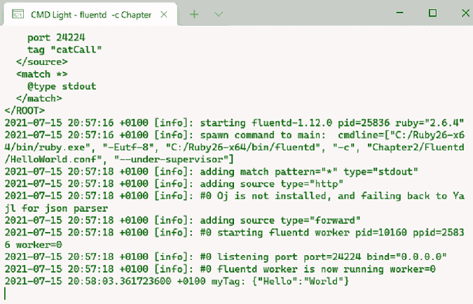
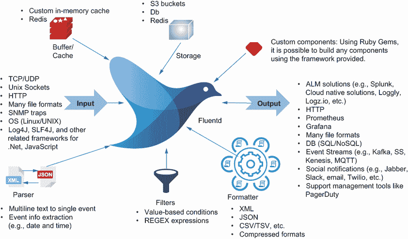
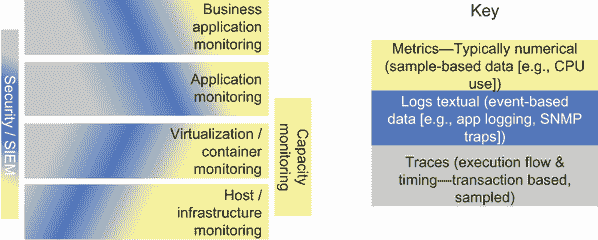
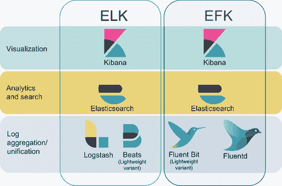
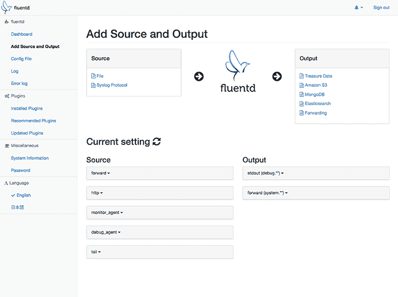

# 1 Fluentd 简介

本章涵盖

+   检查日志和日志事件的使用案例

+   确定日志统一的价值

+   区分日志分析和统一日志

+   理解监控概念

+   理解 Fluentd 和 Fluent Bit

在深入了解 Fluentd 之前，我们应该首先关注使用 Fluentd 等工具的动机。日志如何帮助我们？日志分析是什么，为什么日志统一是必要的？这些问题是我们将在本章中努力回答的。我们将强调日志可以帮助或使我们能够实现的活动类型。

让我们退一步，理解一些关于系统如何衡量和监控的当代思考；理解这些想法意味着我们可以更有效地使用我们的工具。毕竟，一个工具的好坏取决于创建配置或生成用于日志事件的用户的技能。

在我们这样做的时候，探索 Fluentd 如何演变以及它为什么在行业中占据其位置是值得的。如果你正在考虑 Fluentd 作为可能的工具，或者想要为其采用做出案例，那么了解它的“起源故事”是有帮助的，因为这将告诉我们 Fluentd 可能被如何看待。

## 1.1 Fluentd 的简短介绍

由于你在看这本书，我们假设你至少听说过 Fluentd，可能对其有一个模糊的了解。让我们从 Fluentd 和 Fluent Bit 的“简短介绍”开始。

Fluentd 及其兄弟产品 Fluent Bit 的主要目的是从各种可能的来源（如网络交换机、操作系统、自定义应用程序和预构建应用程序，包括平台即服务和软件即服务）捕获日志事件。然后，它将这些事件传递到适当的工具，以便对日志事件进行处理，提取意义和洞察，并可能触发操作。Fluentd 的主要工作不是自己执行详细的日志分析，尽管它可以提取意义，如果需要，更深入的分析可以集成到其配置中。

通过统一影响我们解决方案操作的日志来源的日志事件，我们有看到整体情况的机会。例如，数据库中的错误是否是应用程序返回给用户的错误的原因，或者数据库错误是操作系统无法写入存储的症状？ 

### 1.1.1 什么是日志事件？

我们已经用日志事件来描述 Fluentd，那么什么算是**日志事件**呢？日志事件最好这样描述：

+   日志事件是可读的信息，主要是文本性的。文本信息可以从非结构化到高度结构化。

+   每个日志事件都有一个时间点，由时间戳定义（通常是绝对时间 01:00:00 1 Jan 1970，但可能是相对时间 +0.60），或者时间可以通过日志事件在一系列事件中的位置来推断。

+   每个事件都与一个显式或隐式的位置关联，该位置可以与在物理或逻辑位置上运行的组件关联。

让我们举例说明。任何有编程经验的人都会很可能认出图 1.1 中显示的截图是日志输出的摘录。在这种情况下，输出是由 Fluentd 生成的。如您所见，事件有一个时间戳；一个位置，它来自事件发生的宿主；以及一些额外的半结构化内容。



图 1.1 Fluentd 的日志输出

### 1.1.2 Fluentd 与中间件的比较

与中间件（例如，Apache Camel、MuleSoft、Oracle SOA Suite）合作过的人会欣赏将 Fluentd 描述为一种专注于日志的企业服务总线这一想法。图 1.2 展示了这一点，其中包含了输入和输出的概念以及路由和转换日志事件的能力。随着本书的深入，这一点将变得更加明显。



图 1.2 展示不同类型的 Fluentd 插件及其与核心关系的插图

备注：如果您想进一步探索这个类比，您可以考虑阅读 Tijs Rademakers 和 Jos Dirksen 所著的《开源企业服务总线实战》（Manning，2008）的 liveBook 版本，网址为[`mng.bz/Nx6n`](http://mng.bz/Nx6n)。

定义 *中间件* 是一个通用术语，涵盖为软件应用提供服务的软件，这些服务超出了操作系统可提供的服务。通常这涉及到连接不同的软件组件。有时它可以被描述为“软件胶水”。

定义 *企业服务总线* 是一种特定的中间件类别，用于以近乎实时的方式在软件组件之间传递数据。这通常包括不同软件组件执行顺序的排序。

## 1.2 我们为什么会产生日志？

我们出于各种原因创建日志条目。日志的一些用例可能只需要很少的时间，但在需要时却非常有价值。我们所能想到的几乎所有用例都将属于以下类别之一：

+   *调试* *—*知道在某个场景中哪些代码部分正在执行，使得隔离错误变得容易。是的，我们有调试器等工具，但通常在日志中添加几行信息来帮助也是同样容易的。其中一些日志消息将被保留，以确保在生产过程中一切运行正常。在其他情况下，日志消息的某些行可能在我们开发或测试软件时被禁用。请注意，我们绝不会建议尝试使用调试器连接到生产环境。允许生产系统记录用于调试的信息应该是在理解可能后果的情况下进行的（本书后面我们将探讨为什么是这样）。

+   *意外数据值或异常情况发生* — 当代码遇到超出范围的数据值时，有时最好是标记并继续执行，就像你会在以下情况中看到的那样：

    +   在 switch 语句中使用默认条件，当代码应该有一个你在 switch 中允许的值时。但由于其他地方的变化或错误，你的代码需要优雅地处理这种情况并使其为人所知（例如，经典的问题是在表现层[UI]与后端支持的数据值不同）：

        ```
        switch (caseSwitch)
          {
               case 1:
                  // do something expected
                  break;
               case 2:
                  // do something expected
                  break;
               default:
                  System.Diagnostics.Debug.Write("Unexpected " + caseSwitch);
                  // unexpected path – log this as it may be indicative
             // of a bug
                  break;
           }
        ```

    +   应用防御性编程。例如，在使用对象变量之前，检查它是否不为空——这是一个在首次加载配置数据时确保一切如预期的标准操作。

    +   当处理连接问题的代码遇到错误，你将回退并再次尝试时，需要报告这种情况。这样我们才能从日志中了解影响用户体验的缓慢响应的原因。

+   *审计和安全* — 我们生活在一个内部和外部行为者试图获取数据以进行非法使用的世界中。为了帮助我们监视滥用行为，我们需要了解正在发生的事情。事件需要被记录，如果没有报告。有时这是为了寻找异常行为模式，有时是为了表明系统已经按照预期完成了所有操作。我们经常看到这种用法案例被称为*取证日志*或*应用安全监控*以及*安全信息和事件管理*（SIEM）。将可以创建审计跟踪的日志事件汇集在一起是很重要的。单个异常事件可能微不足道。但当你看到同一种事件以不寻常的方式定期发生时，随着时间的推移，它可能指向更可疑的事情。

记录、安全和日志取证

为了深入了解日志取证，本文提供了一些关于使用日志的现实情况的见解：[`bit.ly/Fluentd-ForensicLogging`](http://bit.ly/Fluentd-ForensicLogging)。此外，这篇 Gartner 文章也为这一领域增添了更多色彩：[`bit.ly/AppSecurityMonitoring`](http://bit.ly/AppSecurityMonitoring)。

美国国家标准与技术研究院（NIST）还在“计算机安全日志管理指南”中提供了关于安全目的日志记录的优秀指南（[`mng.bz/ExWd`](http://mng.bz/ExWd)）。虽然标题可能暗示内容是为安全专家准备的，但它确实为 IT 行业的任何人提供了进入这种日志应用的良好途径。

+   *根本原因分析*—有时我们看到一个问题，但原因并不明显。通常这是因为我们只查看一小部分组件的日志。例如，一个基于其日志的应用程序似乎随着时间的推移而变慢，但没有内存泄漏的证据。只有当我们从所有来源汇总日志时，我们才能确定原因，并将其他问题作为副作用分离出来。例如，我们的应用程序可能运行良好。然而，我们在同一服务器上使用另一个服务，该服务从未正确释放 CPU 线程，导致服务器逐渐耗尽资源以运行所有应用程序。但这种情况只有在所有信息都展示在一起时才能被发现。

+   *确定性能问题的原因*—如*Prometheus* ([`prometheus.io/`](https://prometheus.io/))和*Grafana* ([`grafana.com/`](https://grafana.com/))这样的工具因收集指标数据以提供正在运行的软件性能的见解而闻名。虽然数据可能显示正在发生的事情，但它并不一定告诉你原因。是文本日志描述了正在发生的事情——无论是数据库查询日志还是应用程序线程跟踪。

+   *异常检测*—虽然一个系统在测试解决方案时可能看起来运行得很好并产生预期的结果，但在系统的常规操作中，结果中可能会出现异常。日志记录可以通过在出现异常时帮助找到日志事件之间的相关性，从而促进此类问题的检测，提供原因的指示。

    这种情况的例子之一是 20 世纪 90 年代英特尔奔腾 FDIV 错误的发生，其中特定奔腾处理器的设计错误意味着尽管软件运行完美，但在某些特定条件下的一些计算产生了错误的结果。如果我们即使在软件按预期运行时记录事件，如重要计算的结果，那么就更容易发现任何可能的异常，并检查活动以确定异常的来源（更多详情，见[`en.wikipedia.org/wiki/Pentium_FDIV_bug`](https://en.wikipedia.org/wiki/Pentium_FDIV_bug))）。

    另一个可以观察到的异常例子是在生产环境中运行我们的应用程序，其中我们与其他进程共享资源。我们的测试环境显示一切正常，但在生产中，我们遇到了内存不足错误。这些场景可能源于测试条件与生产环境略有不同，在生产环境中，我们可能能够使用比生产条件中可用的更多内存。查看正在运行的其他内容以及错误周围的细节可以帮助诊断资源冲突问题。虽然不像芯片缺陷那样引人注目，但仍然是一个可能具有挑战性的隔离问题。

+   *运营效率和故障排除*—成熟的、高质量的日志事件可以包括错误代码的使用。错误代码可以链接到特定问题，并提供有关如何解决问题的指导。

+   *确定何时触发后续操作* *—*使用日志事件来识别特定的需求并自动启动流程，而不是需要人工干预。

    这对于软件和硬件环境脆弱且理解不充分但运营上至关重要的传统状态尤其有帮助；人们会变得对改变持谨慎态度（或者甚至可能无法为现成解决方案实施改变）。因此，为了实施诸如错误预防措施等任务，我们需要在监控的应用程序之外实施解决方案。这可能仅仅是监视报告成功的完成消息，此时可以启动下一个操作或错误预防。

## 1.3 发展中的理念

关于日志管理和日志应用的理念在过去四五年里发展了很多；这部分是由于容器化的快速进展。Docker 和 Kubernetes 以及单个小型服务（微服务/宏服务/迷你服务）的有效增长，以支持动态和超规模环境，意味着部署的应用程序在本质上更加短暂。其他因素，如*DevOps*的广泛采用，也在一定程度上得到了发展。最终结果是，发展出了一些值得注意的概念。

### 1.3.1 四个黄金信号

*可观测性*可能是现代监控概念中最早发展起来的。关于可观测性的讨论从 2016 年开始逐渐获得主流认可，并出现在了一些参考文本中，如谷歌的网站可靠性工程（SRE）指南（可在[`landing.google.com/sre/sre-book/toc/`](https://landing.google.com/sre/sre-book/toc/)找到）。这个想法并不新颖；只是定义得很好。

可观测性本质上是指我们应该跟踪或观察并测量软件正在做什么，以便管理和理解一个系统。行业思维已经将这个前提发展到了跟踪四个特定的信号，通常被称为 SRE 的*四个黄金信号*：延迟、错误、流量和饱和度。这四个信号有时被称为*指标*、*度量*或*指标*（语言是可互换的；就我个人而言，我认为*信号*这个词非常二元，而生活很少是那样的）。以下是这些信号的含义：

+   *延迟* *—*处理请求所需的时间。延迟的增长可能表明由于需求的增加或缺乏性能调整，软件或配置可能存在潜在的性能问题。

+   *错误* *—*可能影响服务的问题及其频率，以及它们是否可以自我恢复（例如，无法获取数据库连接意味着回退并重试）。随着我们继续阅读本书，我们将看到 Fluentd 在处理错误方面将发挥其独特的作用。

+   *流量* *—*流量的增加可能表明需求增长或恶意意图，这取决于流量下降时效果的增加或减少。

+   *饱和度* *—*反映系统满载或使用程度（例如，CPU 和磁盘利用率）。一旦系统超过某个饱和阈值，性能下降将会发生，因为操作系统需要投入更多努力来管理其有限的资源。

仅从日志中推导出所有四个信号并不理想（例如，服务降级需要我们持有多个性能指标并在一段时间内进行比较），但半合理的日志记录使用时间戳可以产生所提供的信号。延迟可以通过第一个和最后一个日志事件发生的时间差来推导；例如，吞吐量可以通过日志条目量来表示。

### 1.3.2 可观测性的三个支柱

另一个在业界变得流行的可观测性视角与我们所监控事物的特性有关。在监控时收集的信息类型可以通过几种定义之一来描述。因此，可观测性由三个支柱或核心思想组成：

+   *指标* *—*通常为数值型，用于量化事物的状态。我们随后会定期采样环境中的数据点（例如，CPU 利用率）。

+   *日志* *—*主要是文本型但基于事件，因此具有时间和描述的特性（例如，简单网络管理协议 [SNMP] 捕获）。

+   *跟踪* *—*追踪执行流程以及事务和子事务执行不同步骤所需的时间。跟踪日志主要是数值型，由代码执行进入和离开解决方案不同部分的时戳组成。为了提供这些时间的上下文，标识符，如事务 ID 和入口和出口点，被识别。

每个人都会熟悉指标，因为我们都有过需要查看 CPU 工作强度或因内存不足或硬盘存储空间不足而遇到限制的经历。

跟踪最强烈地与*OpenTracing*倡议([`opentracing.io/`](https://opentracing.io/))和*云原生计算基金会*（*CNCF*）项目*Jaeger*([`jaegertracing.io/`](https://jaegertracing.io/))相关联。OpenTracing 与名为 OpenCensus([`opencensus.io/`](https://opencensus.io/))的项目结合，形成了*OpenTelemetry*([`opentelemetry.io/`](https://opentelemetry.io/))。然而，日志可能也会对这个领域做出贡献，因为特定的日志条目可能作为跟踪中的测量点——尤其是在传统解决方案中。存在一种风险，人们会将跟踪与日志的思考合并。通常，人们希望将跟踪性能信息关联回日志，以便日志可以作为确定低性能发生位置的关键诊断工具。然而，每个支柱可用的工具具有不同的差异和优势。我们可以通过考虑 Jaeger 对执行路径（跟踪）的可视化与 Fluentd 解析日志事件并触发操作的能力来看到这一点。虽然这些 CNCF 项目将跟踪推到了前台，但这个想法并不新颖，许多服务总线解决方案（如 Oracle SOA Suite 和 MuleSoft）都有某种跟踪机制。区别在于*OpenTracing*和*OpenTelemetry*试图推动标准化。

我们看到这些标准正在被开源实现框架和商业解决方案所采用。这与 Fluentd 有何关联？根据日志输出，它可以代表一种追踪执行（例如，记录交易、标识符、代码库中的执行点和时间）的方式。换句话说，追踪是一种特殊的日志。这种关系以及支持的部署模型使得 Fluentd 和 Fluent Bit 能够成为 OpenTelemetry 解决方案的一部分。因此，OpenTelemetry 协议（OTLP）被纳入 Fluentd。所有这些措施在解决方案的不同层级（从基础设施到业务逻辑）中发挥作用，如图 1.3 所示。



图 1.3 将可观察性三要素应用于解决方案堆栈

各层的定义如下：

+   *商业应用监控*—这代表的是纯粹的业务应用监控或业务活动监控（BAM），与描述业务流程执行语言（BPEL）等内容的业务任务测量相关。

+   *应用监控*—这反映了传统应用和中间件/工作流技术（如 Oracle 的 SOA Suite 或 Microsoft 的 BizTalk 支撑 BPEL 实现）的监控。

+   *虚拟机/容器监控*—这衡量的是共享主机计算服务的引擎是否为虚拟化环境（们）提供了适当的资源级别。它监控以确保虚拟化硬件运行顺畅。

+   *主机/基础设施监控*—这可以检测硬件问题，例如存储容量、过热 CPU、风扇故障等。

注意：有关 BAM 的更多信息，请参阅 Tijs Rademakers 在《Activiti in Action》的 liveBook 版本（Manning，2012）中的内容[`mng.bz/DxgR`](http://mng.bz/DxgR)。

在这两个概念中，我认为四个信号更好地被视为衡量标准。通过测量每个信号所描述的数据，信号将指示某事是否正确或错误。更重要的是，接收到的信号变化是否显示出趋势或模式，至少意味着被监控的解决方案不再恶化？理想情况下，我们希望看到一个持续改进的趋势。无论如何，这些信息不会给你关于根本问题的信息。例如，显示系统高度饱和的信号不会告诉你为什么系统会饱和，这可能发生在代码陷入无限循环时。对于这一点，你仍然需要了解软件正在做什么。这并不是说信号是错误的；毫无疑问，它们是提供问题线索的最佳方式。但我相信，通过这三个支柱的视角，我们可以更深入地理解软件行为中的因果关系，从而更好地理解正在发生或没有发生的事情。

你可能已经注意到，在日志记录的原因（用于调试、审计等）中，各种活动将由组织中的不止一两个人处理。一旦组织规模超过一定规模，我们就会有在不同领域工作的专业人士。角色的专业化给不同的工具带来了压力。虽然许多监控工具都有插件功能等，但它们可能不支持每个个体的需求。这可能导致我们在企业 IT 环境中拥有多个工具，在某些组织中，人员和组织政治将进一步复杂化 IT 工具环境。然而，它们都需要来自同一源系统的数据混合。

## 1.4 日志统一

Fluentd、Logstash 和其他相关工具有时被称为*日志统一工具*。但这是什么意思，一个统一工具应该具备哪些价值？让我们更深入地看看统一的价值，并将其与其他相关概念区分开来。

剑桥高阶英汉双解词典将*统一*描述为“将事物或人聚集或结合的行为或过程”([`mng.bz/lax2`](http://mng.bz/lax2))。这正是我们使用 Fluentd 的目的——从不同的来源收集日志事件，并使用单一工具将它们汇集在一起，以便处理日志事件并将其发送到适当的端点解决方案。

这种能力是必不可少的，因为它提供了许多显著的好处；我们在查看日志应用时已经提到了一些。当我们把这些价值点汇集在一起时，我们可以大致将它们分为日志来源和基于日志的洞察。

日志源的优势包括以下内容：

+   它简化了定位和检索日志和日志事件的任务。通过单一平台，定位相关日志事件变得远更容易。我们可以将日志事件路由到方便的位置/工具，而不是需要访问多个平台，这些平台可能有多个不同的位置和访问日志事件的方式。

+   随着虚拟化、容器化和最近的服务即函数的出现，逻辑的托管变得短暂，因此，在信息丢失之前轻松收集日志信息的方法比以往任何时候都更加关键。使用 Fluentd，我们可以将这些短暂环境中配置轻量级进程，将日志事件推送到持久的位置。

+   单一技术可以将来自不同来源或目标的日志事件汇集在一起。因此，日志事件管理变得更加容易和可访问。我们不必掌握所有不同方式捕获和存储日志事件的方法（例如，Syslog、SNMP、Log4J 以及许多其他日志形式和协议），因为 Fluentd 使这变得更容易。

+   操作系统复杂，由许多离散的过程和应用组成。通常，离散组件会附带自己的日志。我们需要将这些组件汇集在一起，以追踪事件通过不同的组件。一些问题已经通过操作系统和网络设备采用了一小群标准（如 Syslog 和 SNMP 陷阱）来解决。

    人们很容易认为 Syslog 和 SNMP 可以满足我们所有的日志需求。但软件不仅仅是使用 SNMP 或 Syslog 的操作系统组件的集合，因此我们需要在另一个统一层面上将这些来源汇集起来。例如，Syslog 主要是一个 Linux 解决方案；它使用 UDP 意味着存在事件丢失的风险，UDP 有大小限制。数据结构和预定义值以基础设施为中心，仅举 Syslog 约束的几个例子。

+   在网络和互联网时代，我们的应用程序通过许多不同的管理设备传递事件，这实际上改变了我们的通信可能被中断的地点数量。在如此大规模的分布中统一日志事件，将问题缩小到可管理的规模。

基于日志的洞察包括以下内容：

+   它更容易创建日志事件的全面视图，使我们更容易看到因果关系。

+   将日志统一到分析平台中，可以利用以下过程来利用数据

    +   在一个可访问的位置搜索所有日志

    +   在生产环境中识别趋势和模式

    +   提取分析数据，以预测未来可能的行为

    +   通过观察用户行为来确定系统是否受到滥用或恶意行为的模式

+   一个统一化平台为我们提供了一个从被动的事件后分析方法转向识别问题并在它们发生时积极采取行动的机会。这可能会扩展到我们识别预警信号并积极采取行动以避免问题的位置。能够变得积极的能力来自于统一化工具过滤、路由和应用日志事件意义的能力。

+   基础设施即服务（IaaS）和平台即服务（PaaS）带来了全新的动态变化和路由复杂性。因此，日志的统一化减少了跟踪可能影响我们解决方案的因素的挑战规模。

虽然我们已经讨论了日志统一化的原因和内容，但我们还应该将其与其他与处理日志事件相关的概念区分开来，尤其是日志分析。

注意：有关 SNMP 的更多信息，请参阅 Jamie Riedesel（Manning，2021 年）所著的《软件遥测》的 liveBook 版本，链接为[`livebook.manning.com/book/software-telemetry/chapter-2/155`](https://livebook.manning.com/book/software-telemetry/chapter-2/155)。

### 1.4.1 日志统一化与日志分析的比较

许多日志空间中的工具都属于日志分析类别，其重点在于应用数据分析技术，如模式搜索，在多个数据记录中使用复杂规则。这种处理通常与大数据和搜索引擎技术相关联。其中最著名的可能是 Splunk，作为一个纯商业产品，以及 Elasticsearch，作为一个开源解决方案，同时提供商业选项。

日志事件需要被摄入到分析引擎中，以便能够执行日志分析。这些分析过程可能包括事件相关性（例如，确定哪些系统或组件产生最多的错误，或者故障频率与一天中特定事件的关系）。如果需要，可以将日志事件手动输入到引擎中。通常，像 Splunk 这样的分析产品具有使用分析引擎中更常见的协议来收集或聚合日志事件的工具。然后，将这些服务部署到多个位置以收集不同的日志源。这是一个简单的聚合行为，因为收集不是智能的；只有在它们进入分析引擎之前，才有可能有效地处理日志事件。收集器通常不具有与统一化工具相同的连接性和配置水平。

区别在于，日志分析引擎的优势在于将搜索和计算科学应用于大量日志，而不是日志事件的收集和路由。而统一化工具的优势在于获取和传递日志事件，它通常具有相对简单的分析能力，例如事件随时间的变化计数。

这两种技术都有一些标准功能，涉及将意义转化为数据（即数据变为可用信息的过程）。没有这些能力，任何解决方案都无法非常有效。这两种技术都有强大的事件过滤能力，但应用方式不同。

定义 *日志路由是指* 将日志事件提取后通过中间件工具，例如 Fluentd，导向需要这些日志事件的应用程序。

定义 *日志聚合* 指的是将日志事件提取并发送到一个中央位置进行处理。

## 1.5 软件栈

自从 2000 年以来，业界一直在讨论软件栈（有些人将这个术语归功于 MySQL 的共同创始人 David Axmark 和 Michael “Monty” Widenius），当时最知名的栈被命名为：LAMP 栈（Linux、Apache、MySQL、PHP）。我们所说的 *软件栈* 指的是一组标准的产品组合（通常是开源产品），它们一起用于提供软件解决方案。另一个知名的栈是 MEAN（MongoDB、Express、AngularJS、Node.js）。完整的栈列表可以在 [`en.wikipedia.org/wiki/Solution_stack`](https://en.wikipedia.org/wiki/Solution_stack) 找到。

软件栈或解决方案栈

值得注意的是，人们经常将 *软件栈* 和 *解决方案栈* 互换使用。在大多数情况下，这是合理的；栈提供了一个完整的解决方案，例如日志管理；我们只需要应用配置。

但在栈提供了构建解决方案所需的所有元素的情况下，这就不成立了；MEAN 栈包含了构建许多解决方案的所有组件，但你必须将你自己的软件添加到 MEAN 栈中才能提供解决方案。

### 1.5.1 ELK 栈

在软件领域中，用于日志处理的最佳知名栈是 ELK（Elasticsearch、Logstash、Kibana）。这个产品组合提供了使用 Elasticsearch 进行日志分析、通过 Kibana 进行可视化和使用 Logstash 进行日志路由和聚合的能力。ELK 栈之所以能够如此完美地结合在一起，是因为这三个组件（虽然都是开源的）都是由 Elastic（[www.elastic.co](http://www.elastic.co)）开发的，Elastic 与 Red Hat 一样，采用基于开源的商业模式取得了成功。

虽然单一供应商为这些组件提供了整洁的集成和相互补充的功能，但也意味着开发工作可能会受到供应商的商业模式和企业目标的重度影响。对于 Elastic 来说，这是为了向 ELK 栈的不同部分销售更多服务和企业扩展。这个问题可以通过由外部和中立组织（如 Apache、CNCF 或 Linux 基金会）管理的开源产品来解决。但 ELK 并不受此类治理。

不幸的是，作为此堆栈的一部分，Logstash 受到了它偏向于将 Elasticsearch 作为日志事件的最终解决方案（这可能有效也可能无效）的印象的影响。Logstash 确实为除 Elasticsearch 之外的产品提供了插件。然而，可以争辩说，这些插件必须来自想要在 ELK 堆栈中与 Elasticsearch 竞争的供应商，或者 Elastic 必须实施它们以保持竞争力。相比之下，Fluentd 的创始人没有自己的分析产品作为日志事件发送的首选位置。我们还可以考虑 CNCF 对 Fluentd 的采用作为一种隐含的认可，即它不受这些偏见的影响。此外，Fluentd 围绕的社区产生了更多的插件，使其比 Logstash 更灵活。

这导致了被称为 EFK 的变体堆栈，它正在获得关注（Elasticsearch, Fluentd, Kibana）。由于 Fluentd 为 Elasticsearch 和 Kibana 提供了插件，这个替代堆栈被视为具有同等的能力，但具有更大的统一灵活性。例如，OpenShift 采用了 EFK 来管理日志事件（见 [`mng.bz/YwDj`](https://shortener.manning.com/YwDj)）。

如图 1.4 所示，ELK 和 EFK 都有轻量级、较小的统一能力变体。Beat 与 Logstash 的关系与 Fluent Bit 与 Fluentd 的关系相同（关于 Beats 和 Fluent Bit 的更多内容将在本章后面介绍）。



图 1.4 ELK 与 EFK 软件堆栈对比，展示了堆栈之间的差异以及每个堆栈中涉及的产品

### 1.5.2 比较 Fluentd 和 Logstash

在表 1.1 中，我们尝试总结了两款产品的不同之处。它们有很多共同点，这也是为什么在堆栈中可以用 Fluentd 替换 Logstash 的原因。然而，也有一些值得强调的差异。

表 1.1 Fluentd 和 Logstash 对比

| 方面 | Fluentd | Logstash |
| --- | --- | --- |
| 主要贡献者和产品治理 | Treasure Data，由 CNCF 管理 | Elastic |
| 商业支持版本 | 是 | 是（更稳健的选项，因为支持可以涵盖整个堆栈） |
| 可用的插件 | ~500 | ~200 |
| 配置风格 | 声明式——使用标签 | 过程式——使用 if-then-else 构造。 |
| 性能 | 与 Logstash 相比，内存占用较低 | 与 Fluentd 相比，内存占用较高 |
| 缓存 | 默认提供高度可配置的缓存选项，包括文件和内存缓存 | 具有固定大小的内存队列 |
| 语言/运行时机器 | CRuby—不需要核心运行时 | JRuby，依赖于 Java 运行时 (JVM) |

### 1.5.3 Fluentd 和 Fluent Bit 之间的关系

Fluentd 拥有一个基于 C 的小型内核，但大部分产品是用 Ruby 构建的。这带来了一些权衡。与 Ruby 相关的核心权衡是它在解释器上运行（尽管有几个变体使用 Java 虚拟机、Truffle 等代替原始解释器，如 Logstash 使用的 JRuby）。Ruby 使用名为 Gems 的打包工具来提供额外的库甚至应用程序。为了使 Fluentd 能够在物联网（IoT）场景中使用，需要为智能电表或树莓派等设备提供更小的资源占用。创建 Fluentd 最小占用版本的目标导致了 Fluent Bit 的诞生。Fluent Bit 提供了 Fluentd 部分功能，专注于将日志事件路由到更集中的位置。然后可以更有效地处理日志事件（过滤、转换、丰富等），正如您期望 Fluentd 那样。表 1.2 展示了 Fluentd 和 Fluent Bit 之间的差异。

表 1.2 Fluentd 与 Fluent Bit 对比

| 方面 | Fluentd | Fluent Bit |
| --- | --- | --- |
| 开发语言 | 使用 C 和 Ruby 编写 | 使用 C 编写以最小化部署占用空间 |
| 依赖项 | 依赖于 RubyGems | 无依赖（除非自定义） |
| 存储和内存占用 | 内存需求约为 20 MB，具体取决于配置和插件 | 约 150 Kb |
| 可用的插件 | 能够利用大约 300 个预构建和第三方插件 | 限制为内置插件和 30 个其他扩展。输入 | 输出 | CPU 状态 | Fluentd TreasureKernel 消息 | HTTP | 内存状态 | 图书馆 | 串行接口 | Elasticsearch | TCP | InfluxDB | 日志文件 | NATS | Docker | 统计数据 | MQTT | Treasure Data 服务 |
| 操作系统支持 | 提供适用于各种操作系统预构建安装程序，涵盖大多数 Windows、OS X、Linux 版本 | 基于 CentOS、Debian（及其衍生版本，如 Raspbian）和 Ubuntu 的多种小尺寸 Linux 变体，适用于 x86 和 AArch 处理器。其他基于 BSD 的 Unix 操作系统可能得到支持，但对于插件没有保证。 |

尽管存在这些差异，但 Fluent Bit 和 Fluentd 还是完全能够协同工作，正如我们在本书后面的内容中将会看到的。物联网并不是唯一适合使用 Fluent Bit 的用例。当考虑微服务时，对于某些容器来说，小尺寸和快速启动时间是非常理想的。我们将在本书后面的内容中探讨微服务的部署可能性以及 Fluentd 或 Fluent Bit 的使用。 

### 1.5.4 Logstash 与 Beats 之间的关系

Beats 与 Logstash 之间的关系与 Fluentd 与 Fluent Bit 之间的关系略有不同。首先，Beats 实际上是一套小型组件集合，用于收集特定类型的数据。每个单独的 Beat 解决方案都是基于名为 *libbeat* 的 Go 库构建的，与 Logstash 使用 Java 相比。Beats 家族包括以下内容：

+   *Filebeat*—收集日志文件（具有特定模块以处理 Apache、服务器日志等）

+   *Packetbeat*—收集网络数据包数据（DNS、HTTP、ICMP 等）

+   *Metricbeat*—收集服务器指标

+   *Heartbeat* *—* 提供正常运行时间监控

+   *Auditbeat* *—* 收集审计事件，通过 systemd ([`mng.bz/6Z9o`](http://mng.bz/6Z9o)) 和 Auditd ([`mng.bz/oa5d`](http://mng.bz/oa5d)) 在 Linux 上监控活动

+   *Winlogbeat*—集成到 Windows 操作系统，运行 PowerShell 脚本和 Sysmon 等

+   *Functionbeat*—与无服务器解决方案协同工作，目前仅限于 AWS (Amazon Web Services)

libbeat 库已作为开源软件提供。这使得第三方，包括开源社区，使用该框架构建更多 Beat 解决方案变得更加容易（并提供了代码独立性的保证）。所有 Beats 都使用共享的数据结构定义来传递收集的数据。

## 1.6 日志路由作为安全手段

随着基础设施越来越多地由配置驱动，而不是物理盒子和电缆，数据可以进入和离开环境的位置可以迅速增加，因为这只是一个配置新点的问题，数据可以进出。最好限制数据在公共网络和私有网络之间传输的点数——这仅仅是拥有后端（或反向）代理的许多原因之一。在纯聚合模型中，日志代理的每个节点都希望直接与聚合点通信。如果解决方案可以容忍网络代理，则可以减轻这种情况。但使用更了解正在路由的内容的代理，如 Fluentd，不是更好吗？

定义 *代理* 是代表客户端从一台或多台服务器检索资源的服务器。检索到的资源随后返回给请求者，看起来就像是从代理服务器本身发出的。如果部署在执行计算的（通常是轻量级）客户端而不是服务器附近，则代理被描述为后端或反向代理。代理通常通过实现流量缓存和应用通过控制数据进入和离开网络的方式来优化网络负载。

如我们所见，Fluentd 的日志路由功能允许我们使用 Fluentd 节点作为日志的路由器/整合器，这意味着我们可以控制网络暴露，以及考虑其他几个方面。

在 Fluentd 中的安全考虑不仅限于配置路由来控制网络中的日志的入网和出网。Fluentd 支持使用 SSL/TLS 证书，以确保 Fluentd 节点之间或 Fluentd 与其他网络服务（例如 MongoDB）之间传输的数据是安全的。这通过验证真实性和加密数据的能力提高了安全性。今天，安全需要成为我们行动的各个方面的一个方面，而不仅仅是附加的；我们将在适当的地方直接解决这些问题。

## 1.7 日志事件生命周期

另一个值得考虑的视角是日志事件的周期。当某种类型的软件组件生成日志条目时，为了从中获得价值，它需要通过一个生命周期，如图 1.5 所示。


图 1.5 日志事件的典型生命周期

如图 1.5 所示，我们首先从捕获日志事件（*信息源捕获*）开始，随着事件的流动，它获得了更多的意义和价值。基于我们之前讨论的内容，任何日志统一工具，包括 Fluentd，在信息源捕获以及*结构*和*路由*阶段最为有效。*聚合*和*分析*阶段将看到针对单个事件的特性，但将依赖于聚合和分析聚合日志。*可视化数据*是产品的薄弱环节。鉴于这些工具的路由和连接能力，通过连接合适的服务，*通知*和*警报*阶段可以轻松实现。不仅如此，这一阶段还有可能向上移动，因为我们并不总是需要分析产品来决定是否需要通知和警报。

如图中所示，Fluentd 等工具在生命周期上半部分（从捕获到聚合以及部分分析阶段）支持得非常好。下半部分则由日志分析（*聚合*和*分析*，*可视化数据*，*通知*和*警报*）得到很好的支持。

## 1.8 Fluentd 的演变

在本节中，我们将探讨导致 Fluentd 创建及其快速普及的事件。图 1.6 显示了 Fluentd 演变过程中的关键事件的时序图。


图 1.6 影响 Fluentd 的关键事件的时序图

### 1.8.1 Treasure Data

Fluentd 的起源可以追溯到 2011 年，当时通过使用 Hadoop，**大数据**正在影响主流 IT。作为硅谷的一家初创公司，Treasure Data 成立是为了围绕基于 Hadoop 的半结构化数据处理创造价值。Treasure Data 发现它需要一个工具来帮助它从多个来源捕获数据并将数据摄取到 Hadoop 数据存储中。因此，它着手构建 Fluentd，并使用 Apache 2 许可证（[www.apache.org/licenses/LICENSE2.0](http://www.apache.org/licenses/LICENSE2.0)）将其作为免费和开源软件（FOSS）发布。这使得构建、扩展和利用工具变得容易。因此，除了为 Treasure Data 工作的开发者之外，其他开发者也对 Fluentd 做出了贡献并进行了扩展。

**注意**：想了解更多关于 Hadoop 的信息，请查看 John T. Wolohan 所著的《Mastering Large Datasets with Python》的 liveBook 版本（Manning, 2020），链接为[`mng.bz/do2o`](http://mng.bz/do2o)。

2013 年，由于 AWS 推荐在其平台上进行数据收集，Fluentd 得到了很大的推动。这进一步得到了谷歌使用 Fluentd 与其 BigQuery 产品相结合，并将其纳入其监控解决方案的帮助。

Treasure Data 背景

Treasure Data 成立于 2011 年，旨在通过使用 Hadoop 等大数据技术来提供商业价值。然而，Sadayuki Furuhashi 和 Treasure Data 的团队发现他们需要一个工具来帮助他们捕获和摄取数据，于是着手构建 Fluentd。它于 2011 年 10 月作为开源软件发布。自 2011 年以来，Treasure Data 已开发出几个专业领域，如客户信息系统和物联网（IoT）。

自那时起，Treasure Data 已被微处理器公司 Arm 收购（随后 Arm 又被 NVIDIA 收购），并从 SoftBank Group Corp.中分离出来成为一个业务。然而，Fluentd 对 Treasure Data 仍然很重要，并且团队继续是 GitHub 上几个重要开源项目（包括 Fluentd 和 Fluent Bit）的非常活跃的贡献者。

### 1.8.2 CNCF

Fluentd 的下一个重大事件是它被云原生计算基金会（CNCF）采用。CNCF 的存在受到了谷歌和 Linux 基金会的强烈影响，旨在为 Kubernetes 提供一个中立的家园。Kubernetes 旨在在一台或多台服务器上运行多个容器，容器托管一个或多个不同的应用程序。更不用说容器可以根据需要在不同服务器上启动和关闭。从这个角度来看，收集和路由日志数据是一个关键挑战，而 Fluentd 的功能可以很好地解决这个问题。

Fluentd 与 CNCF 的历史

谷歌向 CNCF 捐赠了 Kubernetes，使得竞争企业能够更有效地在 Kubernetes 及其生态系统中协作。像 CNCF 的母公司 Linux Foundation 一样，所有项目都是开源的，并得到了许多贡献者的支持。Fluentd 是 Kubernetes 之后第一个受到 CNCF 治理的项目，因此它是一个早期的毕业生。

### 1.8.3 与主要云供应商 PaaS/IaaS 的关系

基础设施即服务（IaaS）和平台即服务（PaaS）解决方案受到了 CNCF 项目的启发，同时也影响了 CNCF 项目。这些技术有最好的机会被云平台服务所整合或支持。当涉及到 Fluentd 时，我们已经看到主要供应商（AWS、Azure、Google、Oracle、DigitalOcean、阿里巴巴等）采取了以下行动之一：

+   直接利用 Fluentd 满足自己的需求（例如，谷歌、甲骨文）

+   将其打包为更大服务的一部分（Bitnami、Google Stackdriver）

+   将他们的各种服务暴露为输入或输出，以便他们的服务可以访问（AWS—S3、RDS、CloudWatch、Beanstalk 等）

例如，AWS 为其存储服务提供了输出插件。AWS 的 CloudWatch 解决方案可以接收和发送日志信息到 Fluentd。正如我们所见，谷歌早期就采用了 Fluentd。

除了 IaaS 云服务之外，还有一系列专门针对日志分析的平台即服务（PaaS）服务，从 Loggly([www.loggly.com](https://www.loggly.com))到 Datadog([www.datadoghq.com](https://www.datadoghq.com))。这些供应商已经为 Fluentd 提供了插件，因此客户将这些日志数据路由到这些服务变得轻而易举。

## 1.9 Fluentd 和 Fluent Bit 在哪里可以使用？

Fluentd 和 Fluent Bit 可以用于或适应几乎任何情况，从在容器中运行到部署在物联网设备上，再到大型机解决方案。正如我们所见，Fluent Bit 的体积足够小，可以在广泛的物联网设备上运行，这在某种程度上反映了 Arm 对 Treasure Data 的收购。Fluentd 和 Fluent Bit 一起覆盖了至少 90%今天使用的操作系统平台。正如已经讨论过的，Fluentd 与云服务配合良好，但它并不局限于云，也可以在更传统的虚拟化或专用服务器部署中工作。

更相关的问题应该是，部署 Fluentd 或 Fluent Bit 是否会让你工作更轻松？你应该使用 Fluent Bit 还是 Fluentd？

使用 Fluentd 和 Fluent Bit，从基本的笔记本电脑或台式机，到服务器，无论是物理的还是虚拟的，运行 Windows 和 Linux 操作系统，都可以无忧无虑地进行。这意味着在我们继续本书的其余部分，将 Fluentd 投入实际应用应该是可能的。可能的例外是第八章，当我们运行 Kubernetes 和 Docker 时，这将需要更多的计算能力，但我们仍然在谈论中端桌面或笔记本电脑。但了解 Fluentd 的限制可以帮助我们超越这一点。

### 1.9.1 平台限制

除了操作系统和硬件之外，平台限制很小。最基本的环境只需要能够运行 Ruby 引擎。Ruby 被多种基于标准的包安装方式支持（yum、Homebrew、apt、Windows 的 RubyInstaller 等）。为所有标准操作系统进行安装很简单，包管理器应有助于解决任何依赖性问题。但对于不太常见的环境，Ruby 也提供了“从源码”安装指南（www.ruby-lang.org/）。如果 Fluentd 本身没有预构建的安装选项——考虑到已涵盖的预构建安装程序（RPM、Deb、MSI 和 RubyGems），那么 Fluentd 网站 ([`fluentd.org`](https://fluentd.org)) 提供了如何从源代码进行安装的详细信息。

根据需要设置的配置，Fluentd 可能需要额外的插件。Fluentd 插件通常使用 RubyGems（Ruby 组件的开源包管理器；[`rubygems.org/`](https://rubygems.org/)）进行部署。如果需要严格的网络控制，可以从本地位置安装 Gems。

如果需要，还有预构建的解决方案可以部署到 Docker 和 Kubernetes。我们将在本书的后面部分讨论 Fluentd 作为 Kubernetes 部署的问题。

最后一个选项——虽然我们认为这是可能的，但我们还没有听说有人尝试过——是通过使用 GraalVM ([`www.graalvm.org/docs/getting-started/`](https://www.graalvm.org/docs/getting-started/)) 创建 Fluentd 的平台原生二进制文件。GraalVM 是一种下一代语言虚拟机，它集成了 Java（JVM）和包括 Ruby 在内的其他几种语言解释器包（[`github.com/oracle/truffleruby`](https://github.com/oracle/truffleruby)）。但 GraalVM 也可以为 Java 和其他支持的语言创建平台原生二进制文件。

部署 Fluentd 后，它需要读取一个或多个配置文件，这些文件告诉 Fluentd（通常在生产中作为守护进程安装）它应该做什么。

定义 A *守护进程* 是一种作为后台进程运行的计算机程序，通常在操作系统启动和关闭时由操作系统启动和停止。这个术语更常与基于 Linux 和 Unix 的操作系统相关联。通常，设计为以这种方式运行的应用程序其名称将以 *d* 结尾；例如，*syslogd* 是在 Linux 中实现系统日志（Syslog）的守护进程。在 Windows 操作系统中，这些进程被称为 *Windows 服务*。

因此，任何部署位置都需要能够读取文件，并且理想情况下允许对 Fluentd 的文件进行更新。Fluent Bit 可以使用配置文件，甚至可以从命令行参数中解释配置。

## 1.10 基于 Fluentd UI 的编辑

Fluentd 确实有一个浏览器提供的用户界面。图 1.7 展示了 UI 屏幕之一，以展示其外观。

当涉及到使用 Fluentd 的 UI 时，它可以执行一系列任务，例如

+   编辑配置文件

+   从停止和启动的角度管理 Fluentd 实例

+   获取插件修补或安装

+   检查 Fluentd 的日志

我们将直接关注本书的配置文件，因为这有助于探索更复杂的细微差别，并且比 UI 更成熟。一旦完成 Fluentd 的安装，我们将在第二章中简要浏览 UI。



图 1.7 Fluentd UI 的一部分

除了基于 Web 的 UI 之外，还有一个用于 Microsoft 的 Visual Studio Code 的插件，可以帮助在编辑配置文件时进行语法高亮。此插件可用于帮助解决诸如缺少括号等典型问题。此插件可以从 Visual Studio Code 内部或从[`mng.bz/GOeA`](http://mng.bz/GOeA)下载。其他编辑器，如 Sublime Text，也有开源包/插件来支持 Fluentd 配置文件的语法编辑。

Fluent Bit 的 UI？

考虑到使 Fluent Bit 的占用空间尽可能小，引入 UI 将与这一原则相悖。典型的 Fluent Bit 使用是将日志事件源和转发到聚合点，在那里可以进一步处理事件（例如，Fluentd 或日志分析工具）。这意味着配置应该相对简单，对 UI 的需求有限。集成 UI 的案例将与最小化占用空间的目标相悖。

## 1.11 插件

如前所述，Fluentd 的插件在覆盖范围和深度上超过了大多数，如果不是所有竞争者。我们无法在以下章节中涵盖每个可能的插件，因此我们将专注于那些有助于说明核心思想和代表大多数 Fluentd 部署可能遇到的情况的插件。

但鉴于插件的范畴，了解可用的内容和可能实现的内容是值得的。Fluentd 插件可以分为以下类别，并且对于每个类别，我们都提供了一些示例：

+   输入

    +   *文件存储*—AWS S3, 文本文件（HTTP 日志文件等）

    +   *数据源*—MongoDB, MySQL, 通用 SQL（适用于所有 ANSI SQL 数据库）

    +   *事件源*—AWS Kinesis, Kafka, AWS CloudWatch, GCP Pub/Sub, RabbitMQ

    +   *操作系统*—系统，HTTP 端点，dstat，SNMP

    +   *应用服务器*—IIS (Internet Information Services), WebSphere, Tomcat

+   输出

    +   *文件存储*—AWS S3, Google Cloud Storage, 文件

    +   *数据库存储*—BigQuery, MongoDB, InfluxDB, MySQL, SQL Server

    +   *事件存储*—Kafka, Google Stackdriver, AWS CloudWatch, Prometheus

    +   *日志分析工具*—Splunk, Datadog, Elasticsearch

    +   *通知*—Slack, 邮件, HipChat, Twitter, Twilio, PagerDuty

+   日志/事件操作（解析器、过滤器、格式化器）

    +   *Map*—日志格式映射器

    +   *数值监控器*—生成与日志相关的统计数据

    +   *文本转 JSON*

    +   *键/值解析*

    +   *GeoIP*—根据公开信息将 IP 地址转换为地理位置（关于 GeoIP 的更多信息，请参阅 Julien Vehent（Manning, 2018）所著的《Securing DevOps》的 liveBook 版本，详情请见 [`mng.bz/raJJ`](http://mng.bz/raJJ)）

    +   *JWT*—处理 JSON Web Tokens（关于此的更多背景信息可以在 Prabath Siriwardena（Manning, 2022）所著的《OpenID Connect in Action》的 liveBook 版本中找到，详情请见 [`mng.bz/VlMy`](http://mng.bz/VlMy)）

    +   *红字删除*—对敏感数据值进行屏蔽，使得未经授权的人无法看到

    +   *格式化器*—将数据布局成不同的结构以及可能的不同的表示法（例如，XML 到 JSON）

+   存储

    +   *缓存*—Redis, Memcached

    +   *持久化存储*—本地文件，SQL 数据库，S3 块存储

+   *服务发现*—配置以查找理解 Fluentd 通信机制的其它节点

注意：可用的 Fluentd 插件完整列表由 [www.fluentd.org/plugins/all](https://www.fluentd.org/plugins/all) 管理。

## 1.12 如何使用 Fluentd 使操作任务更简单

在本章中，我们探讨了 Fluentd 可以帮助解决的一些场景和用例。随着本书的进展，我们将介绍更多场景并观察其复杂性的增加。

### 1.12.1 可操作的日志事件

而不是等到日志事件收集在一起后再对内容进行处理，可以创建配置，以便在接收到它们时立即进行处理。这种处理可能包括过滤以找到需要立即关注的事件。如果一个系统记录了一个通常只在解决方案失败前很短的时间内发生的事件——例如，操作系统进入恐慌状态（关于内核恐慌的更多信息，请见 [`wiki.osdev.org/Kernel_Panic`](https://wiki.osdev.org/Kernel_Panic)）——那么一旦检测到该事件，我们就可以通过近实时通道（如 PagerDuty 或 Slack）向负责处理此类事件的人发送消息（我们将在第四章中说明 Slack 场景）。但可操作的日志事件可以很容易地扩展到更远，例如触发脚本以执行自动修复（例如，清除或存档旧日志文件，以免耗尽存储空间）。

### 1.12.2 使日志更有意义

可操作的事件也可以扩展，以提供一种使日志事件更具意义的方法。在更大、寿命更长的组织中，有一些仍然是业务关键性的遗留解决方案（它们通常非常大，包含大量逻辑以确保符合很少人理解的要求）。因此，替换成本可能非常高，没有人愿意承担修改的风险，即使是为了改善日志消息以简化支持。但这些问题是可以解决的；那些看似无辜但如果不立即采取补救措施就会带来灾难的日志消息可以被修改，添加诸如错误代码等内容。运维人员可以轻松找到操作协议。

意义的运用可以更进一步；一些日志的结构可能不符合标准格式，如 JSON 和 XML。但 Fluentd 可以用来快速和早期地强加结构，因此，下游的日志事件可以更有效地处理。如果一个应用程序意外地记录了敏感数据，那么越早移除或屏蔽此类信息，就越好。否则，所有下游的日志处理解决方案都必须实施更加严格的设置，因为它们将接收敏感数据，如信用卡数据（*PCI 合规性*）、个人数据（*通用数据保护条例*）或受类似立法约束的数据。如果这些问题成为问题，并且日志的来源无法修复，Fluentd 可以过滤或修改日志事件以屏蔽此类内容。

### 1.12.3 多语言环境

在过去的 10 年里，不同的编程语言数量激增。因此，我们经常讨论*多语言*环境，在这种环境中，许多不同的语言被用于端到端解决方案；例如，R 或 Python 可能被用来从数据中提取深层含义，而 Web 界面可以用 JavaScript 编写。后端解决方案可能是 Java、Scala、Clojure、.Net (.NET)和 PHP。与相同后端协同工作的厚客户端应用程序可以用 C#、VB.Net 或 Swift 编写。在这些类型的环境中，我们需要一个对应用程序实现语言中立的解决方案。Fluentd 提供了这样的解决方案，但许多语言都有库，允许以优化的方式直接将日志事件传递到 Fluentd。

### 1.12.4 多个目标

多个目标问题体现了在大型组织中，团队通常专注于特定任务的事实，例如信息安全。不同的团队希望使用不同的工具来支持他们的专业领域——例如，算法在检测表示恶意安全活动的模式方面特别有效。

### 1.12.5 控制日志数据成本

日志事件，就像任何运营数据一样，需要存储，在移动时消耗网络容量，这会产生成本。当大量未压缩或未过滤的文本从云服务提供商的网络中流出并通过企业的互联网连接进行通信时，这种成本可能会很明显。然而，与此同时，我们又不希望过度节俭地对待日志记录；否则，我们将永远无法理解正在发生的事情。Fluentd 可以通过过滤和存储一些日志事件以本地化方式帮助解决这个问题，其中日志事件的价值有限。但可以进一步帮助的日志信息可以发送到中央位置。不仅如此，传输还可以通过压缩机制（批量日志事件可以高度压缩）进行优化。

### 1.12.6 日志到指标

之前我们介绍了可观测性的三个支柱（日志、追踪、指标）。在某些情况下，我们希望通过查看日志的生命迹象（即事件是否已被创建）来获取指标，例如日志事件的发生次数，或者哪个进程是活跃的或已死亡的。通过插件，可以生成此类度量并使用 Prometheus 和 Grafana 共享此类数据。

这可以通过 Fluentd 监控其自身已部署节点的可能性来扩展——当涉及到复杂的分布式用例时，这也可能非常理想。毕竟，Fluentd 只是一块软件，因此与其他代码一样容易受到错误的影响。

### 1.12.7 快速运营整合

公司的合并和收购可以推动对运营资源（如运营团队）整合的需求。这种整合将比整合主要 IT 系统的任何流程都要快。我们可以通过日志统一轻松地将日志数据导向当前运营支持团队工具，以监控和减少将新系统纳入运营组织的时间和精力。

## 摘要

+   影响现代监控思维的核心理念来源于诸如谷歌的四个黄金信号和可观测性的三个支柱等思想。

+   日志分析不同于日志统一，它侧重于一个平台来挖掘日志数据。相比之下，日志统一是关于将日志汇集在一起并将内容导向必要的工具。

+   Fluentd 和 Fluent Bit 最初是 Treasure Data 的开源倡议，后来在 CNCF 的治理下运营。

+   Fluentd 和 Fluent Bit 并未与任何分析平台对齐。考虑到与 CNCF 的关联，Fluentd 已被 IaaS 和 PaaS 供应商采用，无论是作为监控产品或服务的一部分，还是作为 Fluentd 与其产品之间的支持连接。

+   Fluentd 在微服务领域得到了广泛的应用，但它同样可以很好地适应遗留环境。

+   Fluentd 提供了广泛的插件，并有一个框架，允许在需要时开发自定义插件。

+   Fluent Bit 在高度可插拔性和微小优化的足迹之间进行了权衡。

+   Fluentd 和 Fluent Bit 都可以支持大多数平台，并提供预构建的工件。两者都是开源解决方案；几乎可以在任何可想象的平台之上构建内核和插件。

+   日志记录的应用范围广泛，在整个软件生命周期中都能提供价值。

+   Fluentd 支持广泛的用例，从调试分布式解决方案到运营监控。

+   了解 Fluentd 如何融入 EFK 软件栈，以及 ELK 和 EFK 软件栈之间的区别。
