# 2 Fluentd 的概念、架构和部署

本章节涵盖

+   概述 Fluentd 的架构和核心概念

+   检查 Fluentd、Fluent Bit 和 Fluent UI 的先决条件和部署

+   执行 Fluentd 和 Fluent Bit 的基本配置

+   介绍配置文件结构

第一章探讨了 Fluentd 可以帮助我们的理论、行业趋势和用例。本章讨论了 Fluentd 的工作方式，包括部署和运行最简单的配置以实现传统开发者的“Hello World”。

## 2.1 架构和核心概念

当你驾驶汽车时，如果你对车辆的动力方式（例如，汽油、柴油、电力、液化石油气）有一些基本的了解，那么驾驶会容易得多。这种理解带来的心智模型意味着我们可以学习预期什么——我们是否可以预期听到发动机的轰鸣声，发动机是否可能熄火，以及齿轮如何工作（如果有）。同样地，在我们开始使用 Fluentd 和 Fluent Bit 之前，花时间了解这些工具的工作原理是值得的。基于此，我们应该熟悉 Fluentd 的一些构建块，这将有助于心智模型的形成。

### 2.1.1 日志事件的组成

第一章介绍了日志事件的概念。理解 Fluentd 如何定义日志事件是欣赏 Fluentd 工作方式中最关键的事情，因此让我们看看它的组成。每个日志事件都作为一个单独的 JSON 对象进行管理，该对象由三个必需的、不重复的元素组成，如这里所述并在图 2.1 中所示：

+   *标签*——每个日志事件都与一个标签相关联。标签通常最初通过配置与源相关联，但可以在配置中进一步操作。Fluentd 可以通过使用标签对日志事件应用必要的条件操作（路由、过滤等）。当使用 HTTP 接口时，标签可以在调用中定义，正如我们将会看到的。

+   *时间戳*——这来自日志信息或由输入插件应用。这确保了事件按顺序保持，这是统一多个日志源和尝试理解组件之间事件序列时的一个基本考虑因素。这些数据以自纪元（1970 年 1 月 1 日 00:00:00 UTC）以来的纳秒数存储。

+   *记录*——记录是在分离出时间后的核心事件信息。这意味着我们可以在不担心定位事件的时间戳和基本控制所需的标签的情况下处理日志内容，正如我们在本书后面的内容中将会看到的。这提供了即时的好处；每当从 Fluentd 感知适配器传入日志事件时，我们可以避免对时间的初始解析。可以将记录转换为更详细的结构，使其更容易处理。我们将在本书后面的内容中看到如何给数据赋予更多意义。

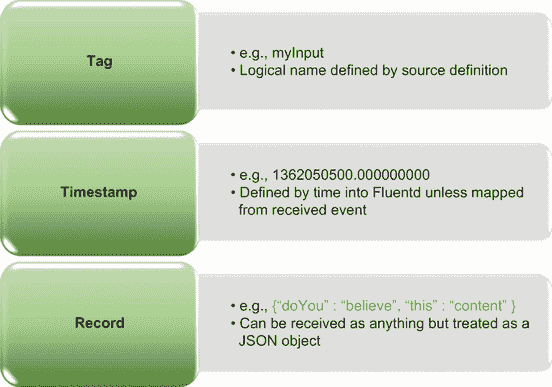

图 2.1 日志事件的组成

一旦捕获，其他插件就可以与现有的标签一起工作，根据需要对其进行修改、添加和扩展。在处理标签时，可以应用通配符和其他逻辑。例如，如果我们有与一个解决方案（称为子系统 1、2 和 3）相关的几个单独的日志（我们可以称它们为子系统 1、2 和 3），我们可以将每个日志文件标记为 App.Subsystem1、App.Subsystem2 和 App.Subsystem3。然后可以通过使用通配符（例如，App.*）来处理日志的处理。我们可以设置过滤器以更具体地处理特定子系统的日志事件（例如，App.Subsystem2）。

### 2.1.2 处理时间

考虑到时间戳在日志中的重要性，所有需要协同工作的系统都必须针对一个共同的时钟/时间进行报告。此外，时间不应受夏令时调整的影响。如果没有这一点，每次时钟回拨时，日志就会失去同步。当时钟向前移动时，日志将看到没有记录日志事件的异常期。这可能会触发任何基于时间的分析（例如事件吞吐量分析、错误之间平均时间的测量、监视心跳事件等）的异常。

由于系统可能跨越多个时区协同工作，这一考虑因素更加复杂。因此，所有系统都需要运行在共同同意的时间上。解决这个问题的典型方法是将系统链接到协调世界时（UTC）。然而，当我们需要在多个服务器上对时间戳有毫秒级的精度以确保正确顺序时，需要某种东西来保持它们同步。

时间同步是通过将服务器链接到一个公共时间源，然后使用协议请求时间以进行对齐来处理的。这个协议被称为*网络时间协议*（*NTP*）。在配置服务器时，强烈建议确保 NTP 已配置。许多技术和服务提供商提供免费的标准 NTP 服务以进行同步。但这有一个限制；当前时间到达不同服务器的时间可能相差几毫秒或纳秒（取决于 NTP 服务的位置）。这被称为*时钟*或*时间偏移*。尽管尽了最大努力，但在跨多个服务器聚合时，日志条目偶尔可能会出现不一致的情况。

NTP 和时钟偏移

关于 NTP 和时钟偏移的更详细信息可以在[www.ietf.org/rfc/rfc1305.txt](https://www.ietf.org/rfc/rfc1305.txt)找到。

大多数操作系统都提供了一个可以激活（如果默认不是激活状态）并配置为与 NTP 服务器同步的 NTP 客户端进程（或守护进程）。NTP 服务器越近，时钟偏移的风险就越低。

### 2.1.3 Fluentd 的架构

Fluentd 的操作由一个配置文件指定（该配置文件可能包含其他配置文件，但这一点将在本书的后续部分进行说明）。配置文件描述了何时以及在某些情况下如何应用插件。Fluentd 的核心中集成了大量插件，因此无需额外安装——例如，类似于 Linux `tail -f` 命令的 tail 插件。对于那些不太熟悉 Linux/Unix 工具的用户，`tail -f` 命令提供了在文件被添加时在控制台上查看其内容的手段。

在第一章，我们介绍了插件的概念，并通过一些示例进行了说明。在我们在此基础上进一步探讨并更详细地检查插件类型之前，我们应该明确一个术语问题。如果你阅读 Fluentd 文档，它提到了 *directives*；这些可以与插件类型重叠。但插件类型与指令之间的关系并非一对一，因为插件可以有支持或辅助关系，因此并非指令。在本章的后续部分，当我们查看“Hello World”示例时，我们将看到指令和插件，以及 Fluentd 如何知道从哪里获取配置文件。

以下列表侧重于核心插件类型及其与我们所识别的指令的映射。除此之外，我们还突出了更常见的插件互相关系：

+   *输入*—在配置文件的术语中，输入插件将与 *源* 指令相关联。输入可以利用 *解析器* 插件，这些插件可以从原始日志文本中提取结构化意义。例如，它们可以从消息文本中提取关键值，如后续处理所需的日志事件分类。输入范围从文件到数据存储到直接 API 集成。

+   *输出* *——*作为插件类型，这些为我们提供了存储（例如，文件、数据库）或连接到另一个系统（包括另一个 Fluentd 节点）以传递日志事件的手段。输出插件与配置文件中的 *match* 指令相匹配——这一点在此阶段可能并不明显，但当我们展示 Fluentd 的使用时，将会变得更加明显。输出插件可以利用 *格式化器*、*过滤器*、*缓冲区* 和 *服务发现* 插件。更通用的输入插件有相应的输出。

+   *缓冲区* *——*缓冲区插件类型专注于批量收集和临时缓存日志事件，以便优化 I/O 工作量。随着我们继续阅读本书，我们将更深入地探讨这个问题。

+   *过滤器* *——*这种插件类型通过应用规则来控制日志事件可以流向何处。此插件与 *输出* 插件相关联。

+   *解析器* *—*此插件的任务是从日志事件中提取关键值，并应用到捕获的内容中。当从日志文件等来源获取内容时，这是关键，这些内容将有效作为单行文本开始。这可以从*正则表达式*和*grok*到特定领域的逻辑。

+   *格式化器* *—*当内容输出时，需要以数据可以被消费组件处理的方式生成。例如，结构化内容以便 Prometheus 或 Grafana 可以消费，它们期望特定的结构或用于 PagerDuty 的易于阅读的消息。因此，格式化器插件在*match*指令中由输出插件使用。

+   *存储* *—*正如我们很快将看到的，Fluentd 的性能和效率是我们处理日志事件的方式的一种权衡。存储日志事件意味着我们可以保留事件（通常是临时性的）直到它们需要被处理。临时存储，如缓存，可以给我们带来性能提升，但存在在故障中丢失事件的风险。因此，一些存储选项因此更具持久性以减轻这种风险。本书中我们将以几种不同的方式使用存储插件。

+   *服务发现* *—*当使用此插件时，它通常与输出插件协同工作。其目的是帮助连接到其他 Fluentd 节点，正如我们将在本书后面探讨的那样。此类插件解决如何在网络中识别/找到目标服务器，从可重载配置中的服务器 IP 列表到使用 DNS 记录的特定部分。

在图 2.2 中，我们展示了 Fluentd 的核心构建块，以及存在以帮助扩展、采用和使用 Fluentd 的支持元素。请注意，图中实现的特定插件只是标准部署中构建的插件的一个子集，以及 Fluentd 可部署和使用的那些插件的一小部分。随着我们继续阅读本书，所有这些构建块都将被深入探讨，从调整引擎的配置到插件基础如何为控制所有插件行为提供基础。但理解不同的构建块及其关系从一开始就会有所帮助。

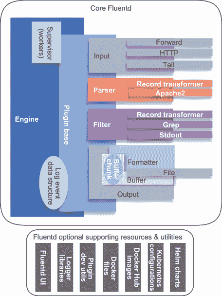

图 2.2 Fluentd 架构视图，展示了核心构建块和根据您的环境可用的可选支持资源

### 2.1.4 Fluent 配置执行顺序

+   *日志事件在 Fluentd 或 Fluent Bit 实例中仅被消费一次*，除非 Fluentd 被明确告知复制日志事件（使用 Fluentd 核心中的功能，我们将在本书后面讨论）。这种排序在图 2.3 中得到了说明。

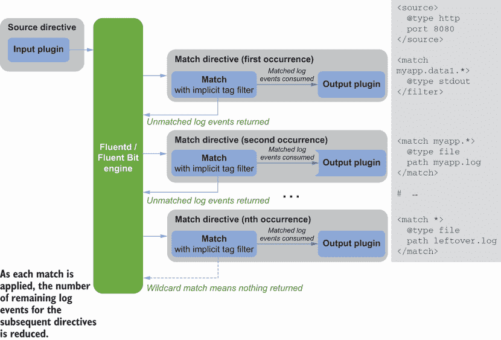

图 2.3 Fluentd 配置中顺序影响示意图

+   *在配置文件中定义操作顺序是重要的*。除非事件被复制，否则第一个匹配事件的指令将成为消费者。因此，作为一个一般实践

    +   当你希望所有日志事件都执行共同操作时，在配置中尽早定义这些指令，但为后续的定向指令复制它们。

    +   通配符指令应在配置的后期定义。

    +   目标指令应先于通配符指令[。](https://hub.docker.com/u/fluent)

+   *Fluentd 默认是单线程的*。这有助于确保时间序列不受损害。可以通过更改配置将 Fluentd 配置为并发运行（多进程而不是多线程），我们将在第七章中探讨这一点。这意味着，如果你创建了一系列复杂的日志事件操作，Fluentd 可能无法像事件创建那样快速处理事件。这意味着已经形成了瓶颈。有避免这种情况的策略，但这将进一步复杂整个过程。

单线程与多线程

多线程的挑战多种多样，从运行线程多于处理器核心时的协调开销到互斥线程锁（两个线程互相等待）。当涉及到时间序列事件时，保持顺序或纠正顺序是很重要的。如果不小心应用，多线程可能会创建可能导致事件顺序错乱的竞争条件。为了更好地理解竞争条件，一个很好的资源是[`devopedia.org/race-condition-software -软件竞争条件`](https://devopedia.org/race-condition-software)。

### 2.1.5 指令

之前，我们提到了 Fluentd 中的指令，很容易混淆指令和插件。指令提供了一个框架，用于将插件分组以实现逻辑任务，例如将日志事件输出到目的地。你会看到指令的声明方式与 XML 元素相同，通过使用尖括号开始和结束。在元素内，可以提供属性，例如标签过滤，就像`match`示例那样。在指令中，我们随后识别插件并以其名称-值对的形式提供其配置。随着我们接触到更复杂的示例，你会看到我们可以嵌套事物，包括辅助插件。

如果一个命令或插件必须直接由使 Fluentd 处理日志事件流逻辑调用，那么它就是一个指令。虽然在这个阶段这个概念非常抽象，但随着我们通过本书及其示例的进展，这个想法和微妙之处将变得更加明显。如图 2.4 所示，我们可以可视化配置文件中出现的指令、插件和辅助插件。

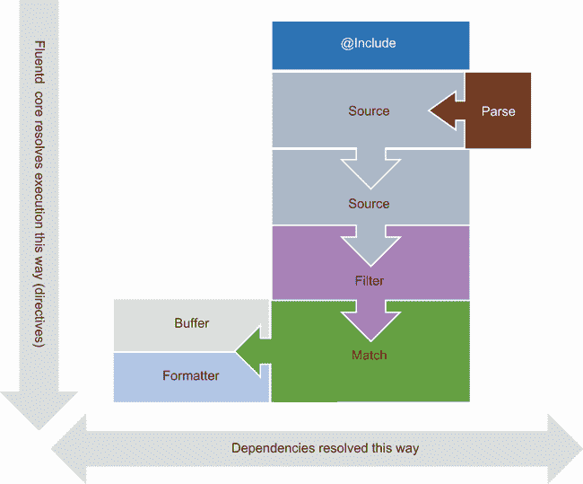

图 2.4 在 Fluentd 执行顺序的上下文中，Fluentd 指令（中间列—源、过滤器、匹配）与原生插件（解析器、缓冲区、格式化器）之间的关系

图 2.4 中展示的指令总结在表 2.1 中。我们将在本书的第二部分深入探讨这些指令。

表 2.1 Fluentd 指令

| 指令 | 描述 |
| --- | --- |
| *源* | 源指令告诉 Fluentd 接收/源日志事件，正如我们刚才看到的。 |
| *匹配* | 这涉及将日志事件与其他操作匹配，包括日志事件的输出。 |
| *过滤器* | 这控制哪些事件应由一个或多个进程处理—通常称为管道。 |
| *@include* | 这告诉 Fluentd 引入其他配置文件以组装一组完整的操作，就像传统代码中的导入或包含语句一样。 |
| *标签* | 标签为日志事件提供了一种分组机制，这比仅使用标签提供了显著更多的功能。 |
| *系统* | 这告诉 Fluentd 如何配置和内部行为（例如，日志级别的设置）。 |

### 2.1.6 将时间要求付诸实践

如果你想看看自己到目前为止吸收了多少，试着回答这些问题。答案将跟随这些问题。

1.  Fluentd/Fluent Bit 中日志事件的三个关键元素是什么？

1.  推荐将时区连接到哪个时间服务器？

答案

1.  我们在第 2.1.1 节中介绍了这些内容；日志事件的元素是

    +   *时间戳* *—*日志事件发生的表示

    +   *记录* *—*日志事件的主体

    +   标签—与每个日志条目相关联并用于路由日志事件

1.  如您所忆，在第 2.1.2 节中，我们建议使用 UTC 链接您的 NTP 服务器。

## 2.2 Fluentd 的部署

在本节中，我们将部署 Fluentd 和 LogGenerator（有时称为 LogSimulator）等工具，以便我们能够运行“Hello World”场景。

后续的示例和练习。Fluentd 和模拟器的所有配置文件都可以在本书的 GitHub 仓库中找到（[`mng.bz/Axyo`](http://mng.bz/Axyo)）。在仓库中，每个章节都有自己的文件夹集。请注意，仓库中的配置文件将与书中配置示例中显示的略有不同，因此它们可以包含有用的附加注释。我们假设完整的代码和配置示例将来自 Manning 或通过我们为本书的 GitHub 仓库下载。每个章节文件夹包含代码、配置和解决方案的子文件夹。LogGenerator（稍后将详细介绍）已从 GitHub 下载（[`github.com/mp3monster/LogGenerator`](https://github.com/mp3monster/LogGenerator)）并复制到章节的根文件夹中（例如，图 2.5 中显示的根文件夹）。

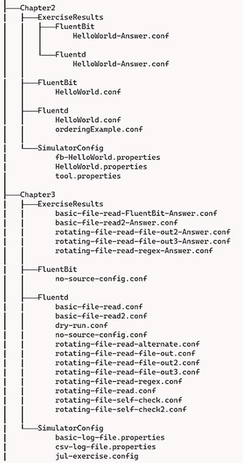

图 2.5 书中用于示例和解决方案的目录结构

注意：由于本书中使用了 Fluentd、Fluent Bit 和 LogSimulator，我们已经在章节中包含了相应的指令。在后续章节中，当我们使用其他工具和产品，可能是一章或两章，我们将在附录 A 中提供指令。

### 2.2.1 为本书示例部署 Fluentd

我们已经在第一章中确立，Fluentd 和 Fluent Bit 在部署到各种平台方面都非常强大。这给本书提出了一个有趣的挑战。我们是描述将 Fluentd 和 Fluent Bit 部署到最广泛的各种平台，还是只关注其中一种？我们是让你使用 Docker 并将所有内容打包成一个镜像吗？

本书采取的方法是首先支持 Windows；这是基于这样一个事实，即在尝试、原型设计和实验 Fluentd 的过程中，你很可能会使用台式机或笔记本电脑而不是企业服务器。Windows 是台式机和笔记本电脑上最占主导地位的操作系统，因此专注于这个环境是有意义的。

然而，为了让这本书中的指导更容易应用于企业服务器，或者如果你足够幸运拥有 Mac，或者你是一个忠实的 Linux 粉丝并且已经安装了你喜欢的 Linux 操作系统版本，我们已经突出了 Linux 和 Windows 之间的差异。大多数指令将包括 Linux 的等效指令。那些使用 Linux 或 macOS 的人很可能会知道，Linux 只是内核，而在此之上的层，例如 UI 层和安装管理器，在 Linux 各版本之间是不同的。这意味着你可能需要调整提供的命令，以便在你的特定操作系统版本上工作。

Docker 镜像

你也可以从 *Docker Hub* ([`hub.docker.com/r/fluent/fluentd/`](https://hub.docker.com/r/fluent/fluentd/)) 或直接从 Fluentd 的 GitHub 网站下载一个准备好的 Docker 镜像 ([`github.com/fluent/fluentd-docker-image`](https://github.com/fluent/fluentd-docker-image))。对于生产环境，这种方法值得考虑，并在第八章中进一步探讨。在本书的大部分内容中，除非你完全熟悉使用 Docker，否则利用 Docker 只会增加额外的努力。

### 2.2.2 Fluentd 的部署注意事项

在考虑将 Fluentd 部署到生产环境时，我们需要考虑*体积指标*——也就是说，需要捕获、过滤、路由和存储的日志数据量。在本书的第三部分，我们将关注 Fluentd 和 Fluent Bit 的可扩展性和分布式能力。但首先，让我们假设我们在一个不需要这种水平扩展的环境中工作。即使在简单的部署中，我们也应该意识到日志处理的计算工作量应该小于核心应用的计算工作量。记住，每次日志事件被存储或传输时，操作都会产生大量的 I/O 活动，这会带来计算开销。如果你熟悉底层计算机操作，你会欣赏到每个进程都伴随着开销：

+   每个网络消息都带有路由、验证和诸如消息大小之类的详细信息。

+   每次文件写入都需要使用硬件来定位一块可用于存储的物理存储空间，记录所使用存储块的详细信息，并机械地将写入设备定位到物理媒体上。

我们能在缓存中分组更多日志事件并将它们作为一个块传输，资源的使用效率就越高。就像生活中的所有事物一样，这里也有一个权衡。我们在写入存储之前进行缓存，这意味着数据到达日志事件处理末尾的速度会变慢。数据在处理过程中停留的时间越长，发生断电或组件故障导致数据丢失的可能性就越大。对于本章，我们只需要确保我们的环境有足够的资源来运行；在性能与数据丢失风险之间的权衡是不必要的。

### 2.2.3 Fluentd 最小占用

Fluentd 的资源需求在现代机器规格下是最小的（见表 2.2），但在处理小尺寸设置时仍值得注意。

表 2.2 Fluentd 最小硬件占用

| RubyInstaller 大小 | 130 MB |
| --- | --- |
| Ruby 安装存储需求（含 DevKit） | (基本 Ruby 80 MB，加上 DevKit 的 820 MB，总计 1 GB) |
| 内存需求 | ~20 MB |
| Fluentd 额外存储 | 300 KB |
| Ruby 最低版本 | Ruby 2.x（针对 Fluentd v1.x） |

### 2.2.4 Ruby 简单部署

要准备运行 Fluentd，我们首先需要安装 Ruby。这最好使用操作系统的最新稳定版本的 Ruby 包框架来完成。不同安装包的链接可以通过[www.ruby-lang.org](https://www.ruby-lang.org)找到。对于 Windows，我们通过访问包含相关链接的下载页面来完成此操作。对于 Windows，我们会转到[`rubyinstaller.org`](https://rubyinstaller.org)以获取 RubyInstaller。当我们进入第八章时，我们需要进行一些开发工作，因此我们应该安装 Ruby 的软件开发工具包（SDK）版本（在网站上显示为 Ruby+DevKit）。

下载完成后，运行安装程序；它将引导您定义首选位置，并询问您是否想安装 Mysys——回答是。Mysys 对于具有底层 C 依赖关系的 RubyGems（如与操作系统交互的插件）是必需的。几个与开发相关的工具，如 MinGW，允许 Ruby 开发使用 Windows 本地库。这意味着我们应该有 Mysys，我们建议使用 MinGW 完整安装来支持未来可能出现的任何开发需求。

注意：关于 DevKit 的更多信息可在 Ryan Bigg 等人编写的 liveBook 版本的《Rails4 实战》（Manning，2015）中找到，网址为 [`mng.bz/ZzAR`](http://mng.bz/ZzAR)。

安装程序应将 *Ruby* 添加到 Windows 的 `PATH` 环境变量中。（附录 A 提供了关于 `PATH` 环境变量的详细信息。）在检查时，您需要确认 Ruby 的 `bin` 文件夹已被包含。如果 Ruby 目录路径不在 `PATH` 环境变量中，我们需要按照附录 A 中的说明添加完整的 Ruby 路径。一旦设置好，应该可以执行命令 `ruby –version`，一旦路径被修改，Ruby 将显示已安装的版本。

注意：值得注意的一个名为 Chocolatey 的 Windows 开源软件包管理器（[`chocolatey.org/`](https://chocolatey.org/)），它感觉更像是一个 Linux 软件包管理器。Chocolatey 可以用作安装 Ruby 的替代方法。

对于 Linux 用户，所有主要的 Linux 操作系统都有一个相关的软件包管理器，并安装了最新的稳定版本——从 macOS 的 Homebrew 到 apt、yum、pkg 等。当有选择时，就像 Windows 一样，安装所有内容以支持第九章中进行的开发活动是值得的。与 Windows 一样，我们需要使用附录 A 中的说明确认路径已被正确设置。我们还可以使用相同的命令 `ruby –version` 验证 Ruby。此外，我们需要验证软件包管理器是否已包含 RubyGems 软件包管理器。通过运行命令 `gems help` 来检查这一点。这将返回 gems 帮助信息或失败。如果失败，则需要以下步骤（在以下步骤中将 `x.y.z` 替换为最新的稳定版本）：

```
wget http://production.cf.rubygems.org/rubygems/rubygems-x.y.z.tgz
tar xvf rubygems*
ruby setup.rb
```

### 2.2.5 Fluentd 的简单部署

Fluentd 可以通过多种不同的方式进行安装。Treasure Data（在第一章中介绍）为 Fluentd 提供了一个 Windows 安装程序，但需要注意的是，安装程序会在文件和文件夹名称中引入一个 *td* 前缀。Treasure Data 安装程序还包括了标准安装程序中未包含的额外插件。

使用 RubyGems 安装 Fluentd 及其依赖项有丰富的途径，各有其优势和细微差别。我们将使用以下原因使用 RubyGems 安装 Fluentd：

+   Gems 软件包安装器是平台无关的，因此安装过程对 Linux、Windows 和许多其他环境都是相同的。

+   Gems 是安装 Fluentd 核心未包含的插件的最简单方式。

+   我们已安装 Gems（用于帮助安装 Ruby 依赖项），因此我们可以保持我们的方法一致。

以这种方式安装 Fluentd，我们只需运行以下命令：

```
gem install fluentd
```

只要您连接到 [`rubygems.org/`](https://rubygems.org/)，相关的 Gems（包括依赖项）就会安全地下载和安装。在企业环境中，这些站点可能需要通过代理服务器或本地 gems 服务器访问。可以通过运行以下命令来测试安装：

```
fluentd –-help
```

这将显示 Fluentd 的帮助信息。它还应该能够看到在部署位置 `lib\ruby\gems\ 2.7.0\gems\`（以及其他操作系统的等效路径）中安装的 Fluentd 和其他 gems。

除了核心 Fluentd，安装还提供了一些辅助工具，其中一些我们将贯穿整本书使用。主要提供的工具总结在表 2.3 中。

表 2.3 安装时提供的 Fluentd 支持工具

| Fluentd 工具 | 工具描述 |
| --- | --- |
| `fluent-binlog-reader` | Fluentd 可以创建二进制日志文件（提供压缩和性能优势）——例如，在文件缓存时。此实用工具可用于读取文件并生成可读内容。 |
| `fluent-ca-generate` | 这是一个用于创建基本（自签名）证书的实用工具，可用于加密 Fluentd/Fluent Bit 节点之间的通信。 |
| `fluent-cat` | `fluent-cat` 工具提供了一种将单个日志消息注入 Fluentd 的方法；它确实需要配置前向插件。例如：`echo '{"message":"hello"}' | fluent-cat debug.log --host localhost --port 24224` 此命令将发送一个日志事件到配置为在端口 24224 上监听的本地 Fluentd 实例，使用前向插件。我们可以使用此功能来帮助测试路由、过滤和输出步骤。但，关键的是，它不允许我们检查输入插件配置（因此需要 LogSimulator）。 |
| `fluent-debug` | 这是一个用于远程调试的实用工具，与 Ruby 工具配合使用。 |
| `fluent-gem` | 这实际上是对 Ruby `gem` 命令的别名，它将列出所有可用的 gems。 |
| `fluent-plugin-config-format` | 这提供了一种查询插件以获取插件将支持的配置参数细节的方法。输出可以被视为一个 README 文档。由于某些插件实现可能支持多种类型的插件（例如，输入和输出），因此需要指定插件类型。例如（在 Windows 和 Linux 上），命令 `fluent-plugin-config-format -f txt input tail` 将检索 tail 输出插件配置细节的文本格式。此实用工具非常适合包含在自定义构建插件的持续集成管道中，因为它可以生成多种格式的文档。 |
| `fluent-plugin-generate` | 这为插件开发生成代码框架。模板包括 Gem 文件、README、插件的占位 Ruby 代码和一个骨架测试框架。 |

几个操作系统差异

基于 Linux 和 Unix 的操作系统支持一个 *中断信号* 的框架。这些信号可以发送到应用程序以控制其行为。其中最广为人知的是 SIGHUP。Fluentd 可以使用这些信号来触发操作，如重新加载配置文件，而无需重新启动。表 2.4 总结了基本的中断及其影响。

表 2.4 Linux 信号及其对 Fluentd 的响应

| Linux 信号 | 对 Fluentd 的影响 |
| --- | --- |
| SIGINT 或 SIGTERM | 这告诉 Fluentd 优雅地关闭，以便清除内存中的所有内容，并将任何文件缓冲区保留在干净的状态。如果另一个进程正在调用 Fluentd，最好先停止该进程，因为它可以防止关闭操作完成。 |
| SIGUSR1 | 这告诉 Fluentd 确保所有缓存的值，包括其日志事件，都被刷新到存储中，然后刷新文件句柄到文件存储。这然后基于一个名为 flush_interval 的系统环境变量重复进行。 |
| SIGUSR2 | 保护和优雅地处理配置的重新加载。它可以被认为是优雅的，因为它确保在重新加载配置之前任何缓存都安全地存储，因此不会丢失任何日志事件。 |
| SIGHUP | 这种中断最著名的是强制配置重新加载。它执行与 SIGUSR2 相同的操作，但还会刷新其内部日志，因此不会丢失任何内部日志信息。 |
| SIGCONT | 此信号将使 Fluentd 记录其内部状态——线程信息、内存分配等。 |

向 Fluentd 进程发送 Linux 杀死命令——例如，`kill -s USR1 3699`，其中 `3699` 代表 Fluentd 的进程 ID——将导致 Fluentd 将该信号解释为 SIGUSR1 信号。目前，没有 Windows 相当的发送这些信号的方法，尽管已经向项目提交了几个更改请求以实现这些功能。

文件句柄

在 Linux 文件系统中，任何时刻可以使用的文件句柄数量可以控制，与 Windows 不同，Windows 的这些限制完全由操作系统版本和架构（例如，32 位或 64 位）驱动。此外，Linux 使用文件句柄来表示真实文件，但这些句柄也代表诸如网络连接等事物。*默认的文件句柄数量可能对 Fluentd 来说过于限制性*。在生产环境中调整保持打开的文件句柄数量并不罕见。可以通过编辑配置文件或使用 Linux 的 `ulimit` 命令来操作文件句柄限制。更多详细信息可以在 [`linuxhint.com/linux_ulimit_command/`](https://linuxhint.com/linux_ulimit_command/) 找到。文件句柄的数量不应该成为提供的示例和场景的问题，但在生产环境中增加流量时，这是一个需要注意的事项。正确的文件句柄数量取决于正在写入的文件的数量和速度、支持的网络端口的数量等。

### 2.2.6 部署日志生成器

理想情况下，我们希望验证输入插件的配置，并确认诸如日志轮转等事物的配置。我们希望有一个配置驱动的实用工具，可以持续发送日志事件。我们有一个可用的工具在 [`github.com/mp3monster/LogGenerator`](https://github.com/mp3monster/LogGenerator)，将在后续章节中使用这个工具。此工具为我们提供了几个有用的功能：

+   取一个现有的日志文件，从现有的日志文件中回放日志事件，用当前的时间戳写入，并按照日志最初编写时的相同时间间隔写入日志。

+   取一个测试日志文件，描述时间间隔和日志正文，并按照事件之间的正确间隔回放。

+   根据模式编写日志文件，这意味着可以生成不同的日志格式。

+   通过 Java 日志框架发送日志以模拟使用日志框架的应用程序。

LogGenerator GitHub 仓库包含了关于如何使用该工具的扩展文档。该实用工具是用 Groovy 编写的，这意味着其核心是 Java，并且使用了标准的 Java 类和库。Groovy 相比 Java 增加了一些便利性。具体来说，它作为脚本执行以保持开发快速便捷，这意味着根据您的需求进行调整很容易；它包含了一些方便的类，使得处理 REST 和 JSON 非常容易。并不是每个人都想安装 Groovy 或修改脚本。因此，我们利用 Groovy 与 Java 的关系，将其编译并打包成 JAR 文件，使得在没有安装 Groovy 的情况下也可以执行。JAR 文件可以从 GitHub 下载。The JAR is available to download from GitHub as well.

Java 安装

要安装 Java，你可以使用包管理器或从[www.java.com/en/download/](https://www.java.com/en/download/)检索并下载。工具的实现已经完成，以便 Java 8 或更高版本可以工作。然而，你需要 Java 开发工具包（JDK）而不是 Java 运行时环境（JRE）。一旦 Java 下载并安装，你需要确保正确的版本已设置在你的`PATH`环境变量和`JAVA_HOME`中。我们假设你没有其他应用程序使用 Java，并且依赖于不同的 Java 版本。如果是这种情况，我们建议编写一个脚本，每次你启动一个新的控制台来运行 LogGenerator 时设置这些变量；这种方法在 Groovy 设置中得到了说明。你可以使用命令`java –version`来检查正在使用的 Java 版本。

Groovy 安装

如果你想要使用已准备好的 JAR 版本的 LogSimulator，你可以跳过这一节，但如果你想要使用 Groovy 版本，了解其工作方式或对其进行修改，你需要以下步骤。在安装了先决条件 Java 之后，我们现在可以安装 Groovy（从[`groovy.apache.org/download.html`](https://groovy.apache.org/download.html)下载或使用包管理器安装）。与 Java 一样，你也需要将 Groovy 设置在`PATH`环境变量和`GROOVY_HOME`中。你可以使用命令`groovy -–version`来确认 Groovy 是否已适当地安装。以下是一些示例代码片段，用于确保环境变量已设置。这是 Windows 的设置：

```
set JAVA_HOME=C:\Program Files\Java\jdk1.8.0_221
set PATH=%JAVA_HOME%\bin;%PATH%
echo Set Shell to Java
java -version
set GROOVY_HOME=C:\Program Files\Groovy-3.0.2\
set PATH=%GROOVY_HOME%\bin;%PATH%
echo Set Shell to Groovy
groovy --version
```

这个脚本的 Linux 版本将是

```
export JAVA_HOME=/usr/lib/jdk1.8.0_221
export PATH=$JAVA_HOME/bin:$PATH
echo Set Shell to Java
java -version
export GROOVY_HOME=/usr/lib/Groovy-3.0.2
export PATH=$GROOVY_HOME/bin;$PATH
echo Set Shell to Groovy
groovy --version
```

模拟器使用一个属性文件来控制其行为，并使用一个描述一系列日志条目的文件来重放。我们将在后面的章节中使用这个文件来查看日志轮转和其他行为是如何工作的。每一本书的章节都有一个包含相关属性文件和日志源的文件夹，以帮助理解该章节，如图 2.5 所示。按照之前推荐的方式，将 LogSimulator 复制到下载根文件夹中，然后运行以下命令：

```
groovy LogSimulator.groovy Chapter2\\SimulatorConfig\\tool.properties
```

我们可以在图 2.6 中看到一个示例，展示了将 LogSimulator 作为 Groovy 应用程序运行时的控制台输出。

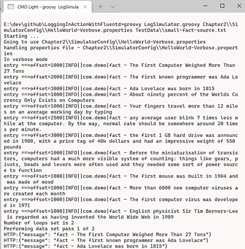

图 2.6 LogSimulator 在详细模式下使用 HelloWorld-Verbose.properties 文件和与相关 HelloWorld.conf 文件一起运行的 Fluentd 的示例输出

将 LogSimulator 作为 JAR 运行

要使用 LogSimulator 的 JAR 版本，需要将 JAR 文件下载到所有章节资源文件夹的父目录中。然后，可以将命令中的 Groovy LogSimulator.groovy 元素替换为`java -jar LogSimulator .jar`，因此命令将显示为

```
java -jar LogSimulator.jar Chapter2\\SimulatorConfig\\tool.properties
```

我们将假设你已经安装了 Groovy，并使用 Groovy 命令运行 LogGenerator，本书的其余部分将如此进行。但正如你所见，唯一的区别是命令中用于 Java 或 Groovy 以及 JAR 或 Groovy 文件的那个部分。如果你希望扩展工具并重新创建 jar 文件，GitHub 仓库包含了所有关于如何生成 JAR 文件的详细信息。

更详细地了解 LogSimulator

如果你想要深入了解正在发生的事情，那么请编辑 tool.properties 文件，将 `verbose` 属性从 `false` 更改为 `true`。这将显示在控制台日志中定义在文件 small-source.txt 中的日志条目。关于模拟器的所有属性都在[`github.com/mp3 monster/LogGenerator`](https://github.com/mp3monster/LogGenerator)的文档中解释。

### 2.2.7 安装 Postman

在我们的“Hello World”场景中，需要一个易于使用的工具来发送单个日志事件以练习 Fluentd 配置。虽然可以使用 cURL 等工具，但我们选择使用具有友好 UI 和跨多平台工作能力的 Postman。Postman 是一个广为人知的工具，支持大多数环境（Windows、macOS、Linux 等）。Postman 对个人用户免费，可以从 [www.postman.com/downloads/](https://www.postman.com/downloads/) 获取二进制文件。

对于 Windows，这是一个安装程序，将解决适当的文件位置。对于 Linux，下载的是一个 tarred gzip 文件，需要解压缩（例如，`tar -xvf Postman-linux-x64-8.6.2.tar.gz`）。一旦 Postman 安装/解压缩完成，请确保它可以启动——对于 Windows，可以使用安装的链接来完成。

## 2.3 使用 “Hello World” 使 Fluentd 生机勃勃

现在我们已经了解了 Fluentd 的架构并将其部署到环境中，让我们让它变得生动起来。

### 2.3.1 “Hello World” 场景

“Hello World” 场景非常简单。我们将利用 Fluentd 可以通过 HTTP 接收日志事件的事实，简单地查看控制台记录事件。首先，我们将使用 Postman 推送 HTTP 事件。下一步将是稍微扩展这个操作，使用 LogSimulator 发送日志事件。

### 2.3.2 “Hello World” 配置

在运行示例之前，让我们快速查看配置文件（见列表 2.1）。正如你所见，我们在配置文件中提供了一些注释。在配置文件中，我们可以通过在前面加上哈希（#）字符来在任何地方添加注释。在 `<system>` 和 `</system>` 之间的配置是 Fluentd 内部应该如何工作的指令；在这种情况下，使用 `Info` 级别日志。然后我们使用一个 *source* 指令来定义日志事件的来源，使用的是 `@type` 识别的内置 HTTP 插件功能。接下来的名称-值对被视为该插件的属性或属性。例如，在这里我们定义了使用 `port 18080` 来接收日志事件。

我们然后使用*match*指令定义一个输出。在*match*指令中的星号是一个通配符，告诉*match*指令任何标签都可以由输出插件处理，在这种情况下，标准输出，它将出现在控制台上。在这个示例中使用的配置文件被简化到最基本的形式，仅定义了每个插件的输入和输出参数以及一些说明性注释。

列表 2.1 Chapter2/Fluentd/HelloWorld.conf

```
# Hello World configuration will take events received on port 18080 using
# HTTP as a protocol

# set Fluentd's configuration parameters
<system>
    Log_Level info             ❶
</system>

# define the HTTP source which will provide log events
<source>                       ❷
    @type http                 ❸
    port 18080                 ❹
</source>

# accept all log events regardless of tag and write them to the console
<match *>                      ❺
    @type stdout
</match>
```

❶ 设置 Fluentd 的默认日志级别——因为我们已将级别设置为 info，这并不是严格必要的，因为那是默认值。

❷ 这是一个源指令。

❸ @type 表示插件类型。

❹ 在插件后面的行定义了该插件的配置参数。

❺ 匹配指令定义了哪些日志事件将被允许进入插件。

### 2.3.3 启动 Fluentd

由于 Fluentd 服务在我们的`PATH`中，我们可以在任何地方使用命令`fluentd`启动进程。然而，如果没有参数定义配置位置，工具将根据环境和安装过程在不同的位置查找。对于 Windows 和 Linux，Fluentd 将尝试解析位置`/etc/fluent/fluent.conf`。对于 Windows，除非在 Linux 子系统内运行命令，否则这将失败。我们不使用默认设置来启动 Fluentd。我们需要在 shell 中导航到您下载配置文件的位置，或者将配置文件的完整路径作为参数包含在内。然后运行以下命令：

```
fluentd -c HelloWorld.conf
```

要从下载资源的根目录运行 Fluentd 命令，这将是本书余下的标准，命令将是

```
fluentd -c ./Chapter2/Fluentd/HelloWorld.conf
```

这个命令将启动 Fluentd，我们将在控制台上看到启动时显示的信息，包括正在加载和检查的配置。当在 Windows 上运行 Fluentd 或 Fluent Bit 时，根据您的用户账户的权限，您可能会收到如图 2.7 所示的提示。这个提示发生是因为 Fluentd 和 Fluent Bit 默认会向网络公开访问点。

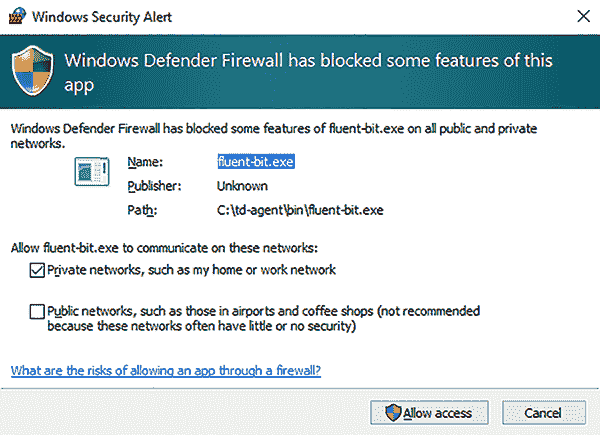


当然，我们应该允许访问。没有它，Fluentd 和 Fluent Bit 都将失败。在 Linux 环境中，等效的安全控制是通过 IPTables 规则和可能的 SELinux 配置来建立的。由于 Linux 环境比 Windows 环境变化更多，因此拥有一个好的 Linux 参考以帮助设置和排除任何限制是值得的。Manning 有几本这样的书籍，例如 David Clinton 的*Linux in Motion*([www.manning.com/livevideo/linux-in-motion](https://www.manning.com/livevideo/linux-in-motion))。

下一步是使用 Postman 发送日志事件。一旦 Postman 启动，我们需要配置它向 Fluentd 发送简单的 JSON 有效负载。图 2.8 显示了标题中的设置。

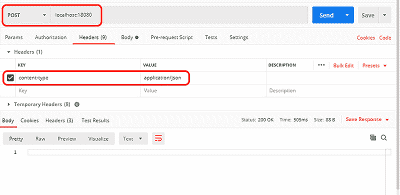

图 2.8 定义 JSON 有效载荷，使用 Postman 发送到 Fluentd

我们还需要设置 Body 内容，因为我们将要使用 POST 操作。通过在屏幕上选择 Body（以及原始选项），我们就可以键入 body 字段`{"Hello" : "World"}`。完成这些后，我们现在就可以发送了。我们在图 2.9 中看到了这个配置。

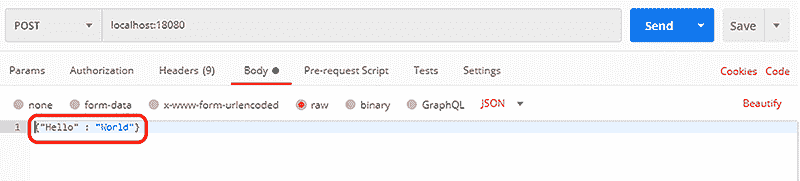

图 2.9 在 Postman 中设置消息体

在 Postman 中点击发送按钮。图 2.10 显示了结果。你可能已经注意到，在 API 调用中，我们没有为日志事件定义时间；因此，Fluentd 实例将应用当前系统时间。

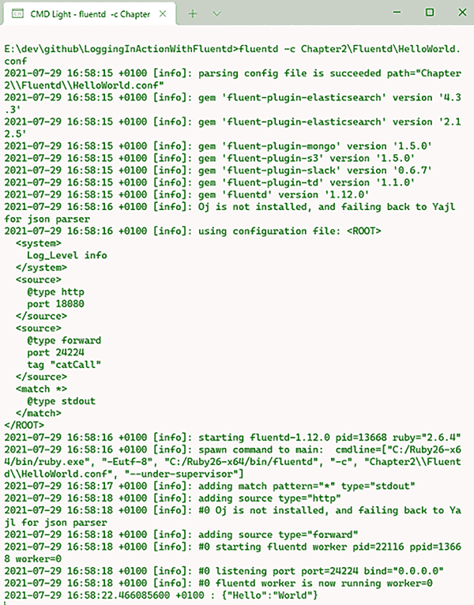

图 2.10 发送 REST 事件后的 Fluentd 输出——注意显示接收事件输出的最后一行

正如俗语所说，“这个配置就像一个巧克力茶壶一样有用”，但它确实说明了 Fluentd 的基本理念——能够接收日志事件并将它们（显式或隐式地）导向输出。让我们通过使用 LogSimulator 创建日志事件流来完成这个说明。

运行 LogSimulator 需要一个新的 shell 窗口。在 shell 中，你需要导航到配置已下载的位置。每个章节文件夹中都有一个名为 SimulatorConfig 的文件夹。根据章节的不同，你将找到一个或多个属性文件。在属性文件中，你会找到一系列键值对，这些键值对将控制 LogSimulator 的行为。这包括引用要回放或测试数据的日志文件。这些引用是相对的，这意味着我们需要在正确的文件夹中——章节的父文件夹中——才能成功启动模拟器。然后我们可以使用以下命令启动 LogSimulator

```
groovy LogSimulator.groovy Chapter2\SimulatorConfig\HelloWorld.properties
```

或者，如果你选择使用 JAR 文件

```
java -jar LogSimulator.jar Chapter2\SimulatorConfig\HelloWorld.properties
```

记得在 Linux 环境中纠正文件路径中的斜杠。LogSimulator 提供了一个配置，将使用相同的 HTTP 端点通过日志文件源发送日志事件。这将导致每个日志事件都在控制台上显示。

## 2.4 使用 Fluent Bit 的“Hello World”

如前所述，Fluent Bit 是用 C/C++ 编写的，这使得它的体积非常紧凑。这种做法的缺点是，为您的环境构建 Fluent Bit 需要更多的努力。您需要熟悉 Gnu 编译器集合（GCC）([`gcc.gnu.org/`](https://gcc.gnu.org/))，它通常在 Linux 平台上可用，或者跨平台的 C 编译器 Clang ([`clang.llvm.org/`](https://clang.llvm.org/))，它可以在 GCC 模式下工作。对于本书，我们不会进一步深入 C/C++ 编译的世界。这意味着下载一个预构建的二进制文件或使用支持的包管理器，如 apt 和 yum。对于 Windows，Treasure Data 提供了 Windows 二进制文件（可在 [`docs.fluentbit.io/manual/installation /windows`](https://docs.fluentbit.io/manual/installation/windows) 获取）。由于二进制文件由 Treasure Data 提供，创建的工件使用了前缀 *td*。为了简单起见，并与 Fluent Bit 的基本版本保持一致，我们建议下载 zip 版本。我们已经在我们的示例中使用了 zip 下载方法。

将 zip 文件解压到合适的位置（我们将假设为 `C:\td-agent`），作为安装位置。为了简化操作，值得将 bin 文件夹（例如，`C:\td-agent\bin`）添加到 `PATH` 环境变量中，就像我们之前对 Fluentd 所做的那样。

我们可以使用以下简单的命令来检查 Fluent Bit 是否已部署：

```
fluent-bit -–help
```

这将提示 Fluent Bit 在控制台上显示其帮助信息。

### 2.4.1 启动 Fluent Bit

显而易见的假设是，只要我们将 Fluentd 的配置文件限制在 Fluent Bit 部署中可用的插件范围内，我们就可以使用相同的配置文件。不幸的是并非如此——虽然配置文件相似，但它们并不相同。我们稍后会探讨它们之间的差异。但为了使用我们的“Hello World”示例运行 Fluent Bit，让我们从一个之前准备好的配置文件开始，使用以下命令

```
fluent-bit -c ./Chapter2/FluentBit/HelloWorld.conf
```

因此，Fluent Bit 将使用提供的配置启动。与 Fluentd 不同，Fluent Bit 对 HTTP 的支持较新，可能不会包含你想要的所有功能，具体取决于你阅读本书的时间。因此，在我们的发送 JSON 的场景中，我们可以匹配 Fluentd 的 HTTP 功能。如果你遇到 HTTP 功能限制，那么至少可以降级到使用 TCP 插件（HTTP 是 TCP 协议之上的一个层）。Fluent Bit 和 Fluentd 都支持 HTTP 操作以捕获状态信息和 HTTP 转发。在 TCP 层工作唯一的缺点是我们不能使用 Postman 发送调用。你可以使用其他知道如何向 TCP 套接字发送文本内容的工具来创建相同的效果。对于 Linux，*tc* 等实用程序可以做到这一点。在 Windows 环境中，没有相同的原生工具。你可以使用 PuTTY 等工具创建 Telnet 会话（[www.putty.org](https://www.putty.org)），而 LogSimulator 包含将文本日志事件发送到 TCP 端口的能力。对于 Fluent Bit，让我们使用 Postman 进行 HTTP，并使用 LogSimulator 进行 TCP。从 TCP 开始，以下命令将启动 LogSimulator，向它提供一个属性文件和一个要发送的日志事件文件。由于我们已经安装了这个工具，我们可以启动它。使用具有正确 Java 和 Groovy 版本的单独壳，我们可以运行以下命令

```
groovy LogSimulator.groovy Chapter2\SimulatorConfig\fb-HelloWorld.properties.\TestData\small-source.json
```

我们现在可以期待看到运行 LogSimulator 的壳正在将发送的事件报告到控制台。日志事件将以不同的时间间隔发送（控制台应该看起来像图 2.11 中的截图）。

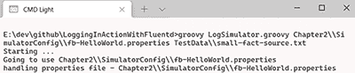

图 2.11 日志事件传输结束时的模拟器控制台输出

同时，另一个控制台中的 Fluent Bit 将开始报告接收事件，并将接收到的 JSON 有效载荷发送到其控制台。这如图 2.12 所示。

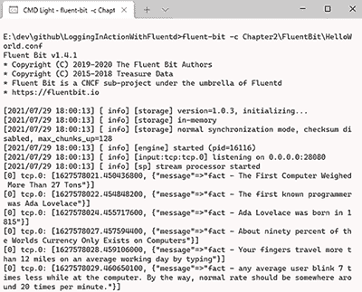

图 2.12 Fluent Bit 控制台输出示例

你可能已经注意到，在模拟器启动和看到 Fluent Bit 显示事件之间存在延迟。这反映了配置选项之一是接收到的日志消息缓存刷新到输出的时间间隔。正如我们将在本书后面发现的那样，这是我们可以在其中调整以帮助性能的领域之一。

现在是 HTTP

TCP 和 HTTP 配置之间的差异很小，因此你可以对 `Chapter2/FluentBit/HelloWorld.conf` 进行更改，或者使用提供的配置文件 `Chapter2/FluentBit/HelloWorld-HTTP.conf`。以下是需要应用的变化：

+   在输入部分，将 `Name tcp` 更改为 `Name http`。

+   由于我们一直在 Postman 中使用 18080 端口进行 HTTP，让我们在配置中更正端口，将 `port 28080` 替换为 `port 18080`。

保存应用后的这些更改。要查看 Fluent Bit 现在将如何工作，如果它仍在运行，请停止当前的 Fluent Bit 进程。然后像之前一样重新启动，或者使用提供的更改，从以下命令开始：

```
fluent-bit -c ./Chapter2/FluentBit/HelloWorld-HTTP.conf
```

一旦运行，使用与 Fluentd 相同的 Postman 设置发送事件，就像我们之前做的那样。

### 2.4.2 交替的 Fluent Bit 启动选项

Fluent Bit 也可以完全通过命令行进行配置。这使得配置 Fluent Bit 成为一个有效的方法，因为它简化了部署（不需要映射配置文件）。然而，这确实是以可读性为代价的。例如，我们可以使用以下方式重复相同的 Fluent Bit 配置：

```
fluent-bit -i tcp://0.0.0.0:28080 -o stdout
```

如果你使用之前设置的模拟器运行此命令，结果将与之前相同。Fluent Bit，就像 Fluentd 一样，并不局限于与单个日志事件源一起工作。我们可以通过向命令行添加额外的输入定义来展示这一点。在 Windows 环境中运行时，让我们将 `winlog` 事件添加到我们的输入中。对于 Linux 用户，你可以用 `cpu` 替换 `winlog` 源，并通过重复相同的练习，但使用以下命令来让 Fluent Bit 告诉我们更多关于它在做什么的信息：

```
fluent-bit -i tcp://0.0.0.0:28080 -i winlog -o stdout -vv
```

这次我们将看到几个不同之处。首先，当 Fluent Bit 启动时，它将给我们提供更多信息，包括清楚地显示正在手动管理的输入和输出。这是由于 `-vv`（更多内容将在下一节中介绍）。随着日志事件的发生，除了我们的日志模拟器事件外，`winlog` 信息将被交错。

Fluentd 和 Fluent Bit 内部日志级别

Fluentd 和 Fluent Bit 都支持相同的命令行参数，可以控制它们记录关于其活动多少信息（与接收到的任何与日志事件相关的日志级别信息相对）。除了由命令行控制外，此配置还可以通过配置文件设置。这两个工具都识别五个日志级别，并且当没有参数或配置应用时，中等级别（信息）用作默认日志级别。表 2.5 显示了日志级别、命令行参数和等效的配置设置。记住命令行参数的最简单方法是 `-v` 代表 *详细*，`-q` 代表 *安静*；更多的字母会增加详细程度或安静程度。

表 2.5 Fluentd 和 Fluent Bit 识别的日志级别

| 日志级别 | 命令行 | 配置设置 |
| --- | --- | --- |
| 跟踪 | `-vv` | `Log_Level trace` |
| 调试 | `-v` | `Log_Level debug` |
| 信息 |  | `Log_Level info` |
| 警告 | `-q` | `Log_Level warn` |
| 错误 | `-qq` | `Log_Level error` |

注意：只有当 Fluent Bit 编译时设置了 *构建标志* 以启用跟踪时，才会发生跟踪级别的设置。这可以通过 Fluent Bit 帮助命令（`fluent-bit -h` 或 `fluent-bit -–help`）来检查，以显示构建标志及其设置。跟踪级别的日志记录通常只在开发插件时需要。

### 2.4.3 Fluent Bit 配置文件比较

之前我们提到 Fluentd 和 Fluent Bit 配置不同。为了帮助说明差异，表 2.6 提供了并排的配置。

表 2.6 Fluentd 和 Fluent Bit 配置比较（使用 Fluent Bit 的 HTTP 配置）

| Fluent Bit | Fluentd |
| --- | --- |

|

```
# Hello World configuration will take events received 
# on port 18080 using TCP as a protocol

[SERVICE]
    Flush      1
    Daemon     Off
   Log_Level  info

# define the TCP source which will provide log events
[INPUT]
    Name  http
    Host  0.0.0.0
    Port  18080

# accept all log events regardless of tag and write
# them to the console
[OUTPUT]
    Name  stdout
    Match *
```

|

```
# Hello World configuration will take events received on port 18080 using
# HTTP as a protocol

# set Fluentd's configuration parameters
<system>
    Log_Level info
</system>

# define the HTTP source which will provide log events
<source>
    @type http
    port 18080
</source> # after a directive

# accept all log events regardless of tag and write them to the console
<match *>
    @type stdout
</match>
```

|

如果你想找出差异，那么你应该已经观察到了以下内容：

+   与通过打开和关闭尖括号 (`<>`) 定义指令不同，指令在方括号 (`[]`) 中，终止是通过后续指令或文件末尾隐式完成的。

+   `SERVICE` 替换了 *system* 用于定义通用配置。

+   `@type` 被替换为 `Name` 属性来定义要使用的插件。

+   *Match*，而不是指令中带有参数的指令名称，变成了 `Output`。*match* 子句随后由属性中的另一个名称-值对定义。

+   旧版本的 Fluent Bit 不支持 HTTP，因此事件需要通过 TCP 发送，但接收的事件仍然可以是 JSON 格式。

当并排查看配置时，细节并不太激进地不同，但它们足够显著，足以让人注意到。

### 2.4.4 Fluent Bit 配置文件详细说明

仔细查看配置文件和应用的规则，我们刚刚看到有一些相似之处，也有一些不同之处。在下面的列表中，我们突出了一些关键规则。

列表 2.2 第二章/FluentBit/HelloWorld.conf

```
# Hello World configuration will take events received 
# on port 18080 using TCP as a protocol

[SERVICE]                                ❶

    Flush      1                         ❷

    Daemon     Off                       ❸

    Log_Level  info                      ❹

# define the TCP source which will provide log events
[INPUT]                                  ❺

    Name    tcp
    Listen  0.0.0.0
    Port    18080

# accept all log events regardless of tag and write
# them to the console
[OUTPUT]         
    Name  stdout
    Match *                              ❻
```

❶ 所有 Fluent Bit 通用配置值都设置在本节中。

❷ Flush 属性控制 Fluent Bit 多频繁地将日志缓存刷新到输出通道（stdout 和 stderr）。在这种情况下，我们将其设置为 1 秒。

❸ 这告诉 Fluent Bit 启动时进程是否应以守护进程运行。

❹ 在配置文件中，缩进很重要，并且必须一致。建议的缩进是四个空格字符。与 YAML 文件一样，缩进表示父级和子级关系。在这种情况下，所有这些值都是这个输入的从属。

❺ 与源不同，Fluent Bit 配置使用输入和输出的术语。

❻ 在 Fluent Bit 中，控制哪些日志事件通过插件传递不是在输出声明中确定的，如 Fluentd 所示，而是通过一个单独的匹配属性。

与 Fluentd 一样，配置文件中的顺序很重要，尤其是在 `match` 语句中——例如，如果我们立即在当前的 `OUTPUT` 声明之前添加以下配置片段：

```
[OUTPUT]
    Name file
    Path ./test.out
    Match *
```

假设配置如下所示：

```
# send all log events to a local file called test.out
[OUTPUT]
    Name file
    Path ./test.out
    Match *

# accept all log events regardless of tag and write
# them to the console
[OUTPUT]         
    Name  stdout
    Match *      
```

我们是否应该期待日志出现在日志文件、stdout（即控制台）或两者都出现？答案是事件只会出现在文件中。这是因为我们在两个输出中都匹配了所有事件；然后是配置中的第一个输出定义获取了事件（即带有通配符 `match` 属性的日志文件；没有日志事件会到达 `stdout`）。

### 2.4.5 将 dummy 插件投入实际应用

为了测试一些细节，看看你是否能实现以下配置更改。在 Fluentd 和 Fluent Bit 中都有一个内置的输入插件，称为 *dummy*。修改相应的 HelloWorld.conf 文件，并包含源，然后依次启动 Fluentd 和 Fluent Bit，看看你得到什么结果。练习的结果包含在本章末尾。

答案

与在页面上填充配置文件不同，答案配置可以在下载的文件夹中找到，位于 Chapter2/ExerciseResults/Fluentd/HelloWorld-Answer.conf 和 Chapter2/ExerciseResults/FluentBit/HelloWorld-Answer.conf。

## 2.5 使用 Kubernetes 和容器部署 Fluentd

到目前为止，我们已经探讨了 Fluentd 和 Fluent Bit 的部署，你可能只是对主机的工作方式（原生部署、虚拟化和容器化）进行了最少的考虑。我们已经引用了一些机制，这些机制可以让我们进一步自动化或容器化这些工具。正如第一章所讨论的，Fluentd 与容器化和 Kubernetes 的使用有着紧密的联系。我们将简要地看看 Fluentd 在 Kubernetes 上下文中的配置方式；当我们到达本书的第三部分时，我们将深入探讨诸如扩展和容器化等细节。

建立 Kubernetes 环境的部署和容器化需要一本自己的书（我们推荐 Marko Lukša 的《Kubernetes in Action》，第 2 版；[www.manning.com/books/kubernetes-in-action-second-edition](https://www.manning.com/books/kubernetes-in-action-second-edition)）。然而，了解其基本操作原理是值得的；在我们接下来的章节中配置 Fluentd 时，你将能够欣赏到配置如何与 Kubernetes 部署相关联。它也可能激发你关于如何以及使用 Fluentd 监控微服务的想法。

### 2.5.1 Fluentd DaemonSet

Fluentd 是将日志管理集成到 Kubernetes 环境的选项之一。这通常是通过定义配置文件来实现的。Kubernetes 配置文件告诉 Kubernetes 如何在单个或多个工作节点（为 Kubernetes 集群提供计算能力的服务器）上运行 pod（协同工作的容器集合）和容器。在 Kubernetes 中，我们可以描述 pod 部署的不同方式，例如 ReplicaSets、Jobs 和 DaemonSets。例如，可以定义一些事情，使得 Fluentd 容器将在每个工作节点上执行，以收集该节点上所有本地容器运行的日志事件。这种 Kubernetes 中的配置类型被称为 *DaemonSet*，并且是 Kubernetes 为 Fluentd 常见的配置。正如我们将在本书后面看到的那样，这并不是部署 Fluentd 的唯一方法，我们也不限于一种部署模型。在下一个列表中，我们可以看到一个示例 DaemonSet 配置，用于应用配置文件和将日志事件路由到另一个 Fluentd 节点的参数。

列表 2.3 第二章/开箱即用的 Fluentd DaemonSet，用于转发

```
apiVersion: apps/v1   

kind: DaemonSet
metadata:
  name: fluentd
  namespace: kube-system
  labels:
    k8s-app: fluentd-logging
    version: v1
spec:
  selector:
    matchLabels:
      k8s-app: fluentd-logging
      version: v1
  template:
    metadata:
      labels:
        k8s-app: fluentd-logging
        version: v1
    spec:
      tolerations:
      - key: node-role.kubernetes.io/master        ❶

        effect: NoSchedule                         ❷

      containers:                                  ❸

      - name: fluentd
        image: fluent/fluentd-kubernetes-daemonset
[CA]:v1-debian-forward                             ❹

        env:                                       ❺

          - name:  FLUENT_FOWARD_HOST
            value: "REMOTE_ENDPOINT"
          - name:  FLUENT_FOWARD_PORT
            value: "18080"
        resources:                                 ❻

          limits:
            memory: 200Mi
          requests:
            cpu: 100m
            memory: 200Mi
        volumeMounts:                              ❼

        - name: varlog
          mountPath: /var/log
        - name: varlibdockercontainers
          mountPath: /var/lib/docker/containers
          readOnly: true
      terminationGracPeriodSeconds: 30
      volumes:                                     ❽

      - name: varlog
        hostPath:
          path: /var/log
      - name: varlibdockercontainers
        hostPath:
          path: /var/lib/docker/containers
```

❶ 告诉 Kubernetes 是否应该在主节点（控制节点）上运行 pod

❷ 告诉 Kubernetes 这是一项必须持续运行的任务，而不是按计划运行

❸ 识别 Kubernetes 将要使用的容器镜像，该镜像将运行 Fluentd

❹ 这是我们开始定义 pod 内部容器的地方。除了这里显示的内容外，每个容器还可以执行一些操作，例如定义启动命令——例如，定制每个 Fluentd 实例。

❺ 还可以通过这些名称-值对在容器实例内设置环境变量。在这种情况下，定义了几个变量，然后在配置文件中引用这些变量以指导转发插件。

❻ 可以定义资源配额，这样 Fluentd 就不会耗尽节点上其他进程的时间。但这可能会有其他后果。

❼ 描述容器内的一个挂载点，可以用来访问外部化存储

❽ 描述容器的外部存储在底层 Kubernetes 基础设施上的位置。在企业场景中，这可能是一个网络存储设备，如 SAN，或者在云中它将被映射到某种形式的块存储。这意味着我们可以将 Fluentd 生成的日志映射到共享位置，并且我们可以指导 Fluentd 实例去获取一个公共配置文件。

备注：DaemonSet 来自 [`mng.bz/nYea`](http://mng.bz/nYea)。

应该注意的是，在托管 Kubernetes 节点的基础设施中，可以直接在底层平台上运行 Fluentd 等进程。虽然这消除了 Kubernetes 的抽象层（及其相关开销），但也消除了使用 Kubernetes 管理和监控 Fluentd 运行的机会。我们仅在非常特殊的情况下推荐这样做。

注意：DaemonSets 被定义为在每个工作节点上提供基本操作。这可以是将日志事件直接发送到 Elasticsearch（如第一章中讨论的 EFK 堆栈的一部分）或将日志转发到各种云供应商的日志分析解决方案，例如 AWS CloudWatch。这些可以在 Fluentd GitHub([`mng.bz/2jng`](http://mng.bz/2jng))中找到。

图 2.13 说明了如何使用 DaemonSet 使用 Kubernetes 配置。通常，DaemonSet 配置会存储在共享配置仓库或文件系统中，然后通过像 kubectl 这样的工具传递给 Kubernetes，kubectl 是标准的 Kubernetes CLI 工具。我们假设 Fluentd 配置位于共享文件系统中，因此由 Fluentd 容器挂载以允许访问。另一种方法是通过 DaemonSet YAML 文件传递配置，或者直接将配置直接连接到 Docker 镜像。在 DaemonSet 中，Fluentd 配置具有的日志消费者可以将日志事件直接发送到 Elasticsearch，或者发送到 Kubernetes 配置使其可访问的集群外部的文件系统。当我们到达扩展 Fluentd 时，我们将进一步探讨这一点。

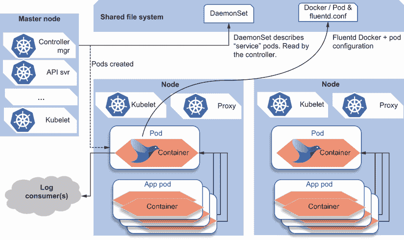

图 2.13 展示了 Fluentd 在 Kubernetes 中作为 DaemonSet 的部署模型。Kubernetes 集群中的每个独立服务器都有自己的 pod，运行着 Fluentd 容器。

### 2.5.2 Docker 化 Fluentd

就像几乎所有应用程序一样，除了手动安装或通过像 Ansible ([www.ansible.com](https://www.ansible.com))这样的工具自动化安装外，还可以使用 Docker 容器引擎部署 Fluentd 或 Fluent Bit。预定义的 Fluentd Docker 文件（即告诉 Docker 如何构建可执行镜像的文件）在 GitHub 仓库([`github.com/fluent/fluentd-docker-image`](https://github.com/fluent/fluentd-docker-image))中提供，包括解决不同的主机操作系统因素（例如，Debian 到 Windows）。Fluent Bit 在 GitHub 上也有更小的一组预定义 Docker 文件([`github.com/fluent/fluent-bit`](https://github.com/fluent/fluent-bit))。GitHub 仓库包含配置文件和脚本。已实现的镜像存储在 Docker Hub 上，可以在[`hub.docker.com/u/fluent`](https://hub.docker.com/u/fluent)找到 Fluentd，以及[`hub.docker.com/r/fluent/fluent-bit`](https://hub.docker.com/r/fluent/fluent-bit)找到 Fluent Bit。

## 2.6 使用 Fluentd UI

我们已经成功安装并运行了 Fluentd 和 Fluent Bit。但在两种情况下，控制都是通过命令行进行的。如果安装了 Web UI，Fluentd 也可以运行。Web UI 由执行 Fluentd 核心逻辑的同一进程提供服务。

### 2.6.1 使用 UI 安装 Fluentd

安装将触发 Fluentd 下载并安装一系列额外的 gem。这是因为它提供了将多个插件（除了基本提供的插件之外）纳入其中的手段。这意味着安装时间比仅安装 Fluentd 要长。安装 UI 的命令是

```
gem install -V fluentd-ui
fluentd-ui setup
```

安装完成后，我们可以使用以下命令启动 UI：

```
fluentd-ui start
```

这将启动一个 Fluentd 节点，其中包含一个 Web 服务器。可以通过打开端口 9292 来访问 Web UI（即，将浏览器指向`localhost:9292`将显示登录界面）。

使用 HTTPS 保护 Fluent-UI

Fluentd UI 通过 HTTP 运行；默认安装中不使用 SSL/TLS 证书。在开发/实验环境中这不太可能成为问题。但是，在生产环境中，不使用 SSL/TLS 和至少基本凭证运行则远非推荐的做法。这可以通过几种方式来解决：

+   在 Fluentd-ui 前面使用 Nginx 或 Apache 服务器实现反向代理——这是一种常见的保护未由 SSL/TLS 证书保护的 Web 内容的方法（有关如何操作的文档可在[`mng.bz/Ywne`](http://mng.bz/Ywne)找到）。这也意味着您的环境中将运行一个额外的进程，需要配置网络，以确保反向代理不会被绕过。

+   对于其网络层，Fluentd UI 使用 Ruby on Rails 框架([`ruby onrails.org/`](https://rubyonrails.org/))和 Ruby 应用程序服务器 Puma([`puma.io`](https://puma.io))。因此，可以配置 Puma 使用 SSL/TLS 证书。应用配置需要 Ruby 代码更改和启动参数，这将对 Fluent 代码库产生影响。这并不理想，因为任何更新都意味着需要重新应用这些更改。

+   我们不推荐在生产环境中使用 Fluentd UI。这看起来像是回避问题而不是解决问题。然而，这确实有很多优点。对于生产环境，您希望通过 Git 等工具控制 Fluentd 配置文件。这意味着不赋予用户在生产环境中使用 UI 进行配置更改的权限。更好的做法是让用户进行受控的更改，然后可以安全地部署。如果您在微服务或分布式环境中运行 Fluentd，仅允许从受控配置文件进行更改，这提供了驱动环境一致性和减少“配置漂移”机会的手段。

+   再次强调，我们只推荐将 Fluentd UI 用于实验目的，而不是在生产环境中使用。鉴于这一点，以下内容将提供足够的见解，使您能够欣赏 UI 支持的功能。

默认情况下，登录用户名为 *admin*，密码为 *changeme*。一旦登录，UI 所展示的界面将类似于图 2.14。由于 UI 具有反应性和响应性，可能会出现差异，导致布局根据查看 UI 的设备进行调整。

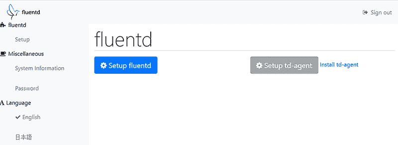

图 2.14 Fluentd UI 在没有任何配置的情况下启动

我们需要为 Fluentd 节点提供一些配置值以执行。点击设置 Fluentd 将带我们到一个 UI，通过该 UI 我们可以配置其行为。图 2.15 展示了一些相关的配置需求。

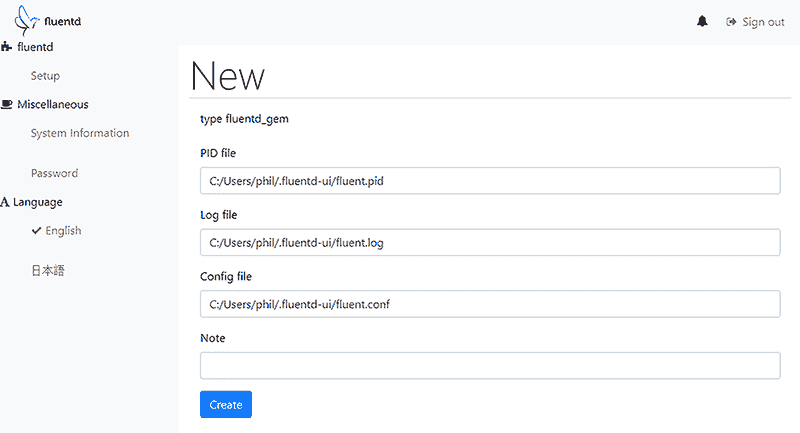

图 2.15 Fluentd UI 设置配置位置

配置字段使用默认值设置。将 Config File 选项切换到指向用于运行 Fluentd 的现有 HelloWorld.conf 文件。您可能还希望提供进程标识符（PID）和日志文件的备用位置。一旦我们在 UI 中点击创建按钮，如果位置和文件可以写入和读取，服务器进程将启动。然后 UI 将切换到不同的主页，如图 2.16 所示。

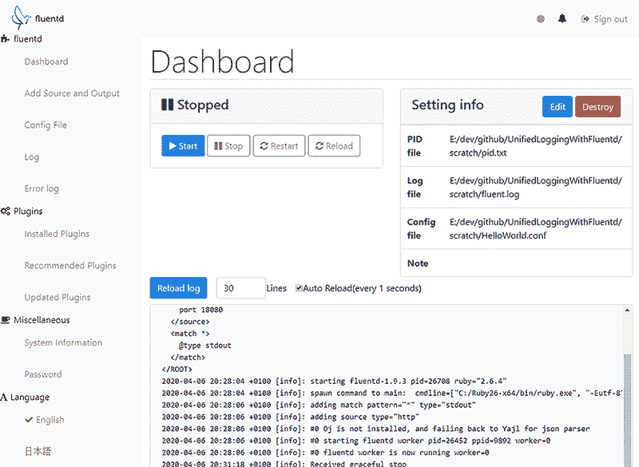

图 2.16 后端运行后的 Fluentd UI

左侧的导航菜单现在要丰富得多。Fluentd 子菜单提供了用于处理配置文件、访问日志以及任何错误日志的选项。显示的日志与控制台输出相同。导航菜单让我们可以看到已安装插件、推荐插件和更新插件的详细信息。

屏幕的核心部分留给了服务器产生的实时日志，以及用于启动和停止操作以及当前配置的控制。Config File 选项将显示正在使用的配置文件，并允许直接编辑配置文件。如果配置的 UI 选项出现问题，您可以求助于传统的编辑。添加源和输出选项允许使用 UI 作为引导的、基于表单的演示来捕获插件配置，以修改配置值。如图 2.17 所示，UI 为设置插件及其配置值提供了一个良好的逻辑流程。

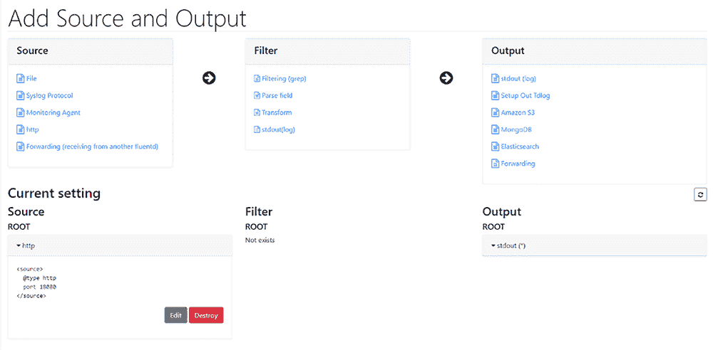

图 2.17 Fluentd UI 定义输入和输出

点击源、过滤器或输出元素之一将导航到配置该类型插件的 UI。例如，选择文件源将向您提供一个文件选择器 UI（如图 2.18 所示）。

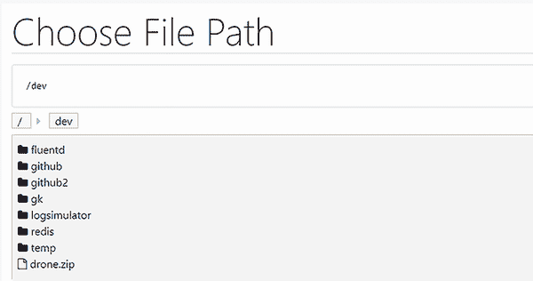

图 2.18 Fluentd UI 文件选择器作为文件插件配置的一部分

## 摘要

+   日志事件由一个标签、一个时间戳和一个包含核心日志事件的记录组成。

+   在将多个服务器日志合并在一起以确保正确日志顺序时，使用 NTP 进行机器时间同步至关重要。

+   Fluentd 和 Fluent Bit 可以部署在大多数环境中，因为基础设施需求非常小，应用程序依赖性最小。如有必要，您可以编译这些工具以在特定情况下工作。

+   部署 Fluentd 有多种方式，包括部署 Ruby 和 RubyGems，然后作为 gem 获取 Fluentd。

+   将 LogSimulator 部署以快速模拟日志事件源只需要 Java，但若要自定义此工具，则需要 Groovy。

+   Fluentd 可以与 Kubernetes 和 Docker 日志记录一起使用，也可以与传统的环境一起使用。我们可以为 Kubernetes 部署检索标准配置。

+   当部署在 Linux 主机上时，Fluentd 可以响应如 SIGINT 的信号以优雅地关闭，以及 SIGUSR2 信号以重新加载配置文件。

+   Fluentd UI 是 Fluentd 提供的附加工具之一。这提供了一个网页前端来可视化 Fluentd 环境的配置并观察 Fluentd 正在做什么。其他工具包括生成证书和列出可用插件的功能。

+   配置文件中定义配置的顺序很重要。

+   Fluentd 和 Fluent Bit 的自用日志可以配置为不同的日志级别。

+   Fluentd 和 Fluent Bit 的配置相似但并不相同。
