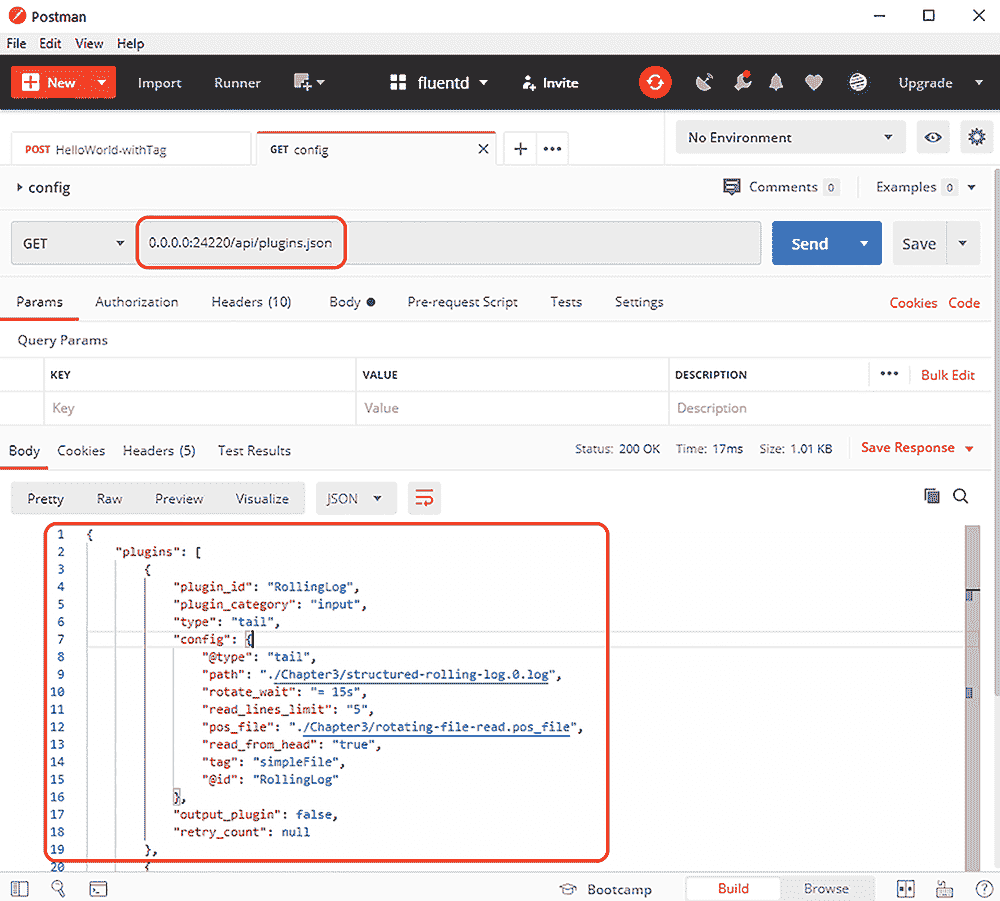
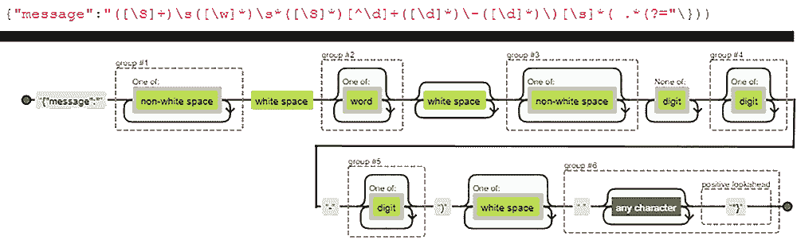

# 3 使用 Fluentd 捕获日志事件

本章涵盖

+   为日志文件的输入配置 Fluentd

+   通过 Fluentd 检查文件读取过程中停止和启动的影响

+   使用解析器从日志事件中提取更多意义

+   使用 API 进行 Fluentd 的自监控和外部监控

在建立了概念和架构基础，并运行了一个简单的配置之后，我们准备开始更详细地查看日志事件的捕获。在本章中，我们将重点关注捕获日志事件。但在我们这样做之前，让我们看看我们如何检查我们的 Fluentd 配置是否正确。

设置以跟踪和尝试配置

关于我们在书中如何呈现代码的简要说明。为了避免书籍因代码和 Fluentd 配置文件而变得臃肿，我们只包含了与讨论主题相关的配置和代码部分。但下载和 GitHub 仓库中引用的文件是完整的配置（[`github.com/mp3monster/LoggingInActionWithFluentd`](https://github.com/mp3monster/LoggingInActionWithFluentd)）。

仓库中包含了完整的配置和部分配置文件，这样您可以自行实现配置。此外，还包括了一些场景及其解决方案，这将使您能够尝试检验自己对书中观点的理解。

如果您跳过了前面的章节，您需要确保您已安装并配置了 LogSimulator（详情见第二章）或已按照[`github.com/mp3monster/LogGenerator`](https://github.com/mp3monster/LogGenerator)中记录的基本设置进行操作，包括任何故障排除技巧。

## 3.1 干运行以检查配置

在开发 Fluentd 配置时，我们不希望设置一个测试来发现配置错误。正如我们在开发代码时所做的，我们在尝试运行解决方案之前，会使用一种方法来检查代码。当配置或代码变得更加复杂时，这一点变得更加重要。

干运行配置文件使 Fluentd 加载配置并确认它可以根据语法正确性以及属性是否被识别以及提供的值是否有效来执行它。干运行选项是 Fluentd 命令行的一部分。要使用干运行功能，我们只需将 `–-dry-run` 添加到命令行参数中。任何配置错误都会在控制台输出中报告；例如：

```
2020-04-17 11:08:51 +0100 [error]: config error file="Chapter3/Fluentd/basic-file-read2.conf" error_class=Fluent::ConfigError error="'path' parameter is required"
```

这次干运行显示了一个插件缺少一个必需的属性；在这种情况下，失败的插件配置需要一个路径属性。

解决结构错误

如果错误更“结构化”，例如省略了声明性块的开始或结束——例如，当存在`<parse>`声明时却遗漏了`</parse>`——那么我们最有可能看到`backtrace`（堆栈跟踪）错误。Fluentd 将完成对它认为缺失内容的回溯错误。在这些情况下，建议可能是不正确的，而其他地方缺少的语法元素是原因。解决这类问题的最简单方法是确保你已经应用了良好的缩进并开始匹配开始和结束块。

干运行的成功执行将导致 Fluentd 优雅地停止。如果你使用默认的日志级别运行，那么将显示以下类型的消息：

```
2020-04-17 10:53:24 +0100 [info]: finished dry run mode
```

由于这被归类为*info*，如果你已经将 Fluentd 配置为更安静，你可能不会看到消息，只会看到 Fluentd 在没有错误的情况下停止。

Fluent Bit 目前没有类似的功能，部分原因是期望配置更简单。通过命令行通信来提供 Fluent Bit 配置的能力将更具挑战性。如果你的目标是使用命令行向 Fluent Bit 提供配置，我们建议你开始使用文件，直到配置完成且有效。然后删除新行和多余的空白字符——这可以通过在线工具（例如[browserling.com](https://www.browserling.com/))或仅使用 Linux 主机上的 awk 和 sed 来完成。这应该允许你将配置简化为单行，以便使用。

### 3.1.1 将验证 Fluentd 配置付诸实践

作为指定的团队 Fluentd 专家，你被要求检查几个配置。这是一个尝试使用 dry-run 功能来评估配置是否有效并必要时修复它的机会（如果你需要修复配置，可能值得制作原始配置的副本）。要验证的配置文件如下：

+   `Chapter3/Fluentd/basic-file-read.conf`

+   `Chapter3/Fluentd/dry-run.conf`

没有人想成为那个为每个人修复 Fluentd 配置的人，所以你可能需要考虑如何与你的同事分享以下问题的答案：

1.  你如何知道配置文件是有效的？

1.  你如何知道配置有误？

答案

1.  你应该已经发现`Chapter3/Fluentd/basic-file-read.conf`已经是有效的。我们知道这个配置文件是好的，因为当使用 dry-run 模式时，控制台输出不会报告任何错误消息并且应该干净地终止。进程将以以下消息终止（假设日志级别没有设置高于 info）：

    ```
    2020-04-17 10:53:24 +0100 [info]: finsihed dry run mode
    ```

1.  控制台日志输出将报告一个错误，反映为`Chapter3/Fluentd/dry-run.conf`识别出的配置问题。我们应该看到以下带有详细信息的消息：

    ```
    2020-04-17 10:54:00 +0100 [error]: config error file="Chapter3/Fluentd/basic-file-read2.conf" error_class=Fluent::ConfigError error="Missing '@type' parameter on <source> directive"
    ```

## 3.2 读取日志文件

当涉及到应用程序时，日志文件是日志事件最常见的来源。虽然效率不高，但文件创建和消耗是数据在进程之间共享（包括事件）的最古老方式。因此，*File* 插件是核心插件集的一部分。

第一步是在 Fluentd 配置文件中构建一个文件源。这可以通过将以下片段添加到 `Chapter3/Fluentd/no-source-config.conf` 的副本中（或使用 `Chapter3/Fluentd/basic-file-read.conf`）来完成：

列表 3.1 `Chapter3/Fluentd/basic-file-read.conf` 展示文件尾部

```
<source>
  @type tail                      ❶

  path ./Chapter3/basic-file.*    ❷
  read_lines_limit 5              ❸

  tag simpleFile
  <parse>                         ❹

    @type none
  </parse>
</source>
```

❶ 文件源插件被称为 tail，因为它在行为上有点像同名的 Linux 命令。

❷ 定义要捕获的文件

❸ 在开始处理事件之前应读取的最大行数

❹ 每个文件处理器都需要知道如何将文本行输入转换为日志事件。Fluentd 提供了几个标准解析器，从预定义格式到表达式处理器。

如配置摘录所示，我们已告诉 Fluentd 使用第三章文件夹中任何以 `basic-file` 开头的文件，并读取其内容而不进行任何形式的解析。在启动 Fluentd 之前，我们运行模拟器以查看输出内容。这可以通过以下命令完成

```
groovy LogSimulator.groovy ./Chapter3/SimulatorConfig/basic-log-file.properties ./TestData/small-source.txt
```

我们应该看到在第三章文件夹中创建了一个名为 `basic-log.txt` 的文件。该文件夹将只包含我们源文件的消息部分 `(TestData/small-source.txt`）。

生成日志文件后，我们现在可以启动 Fluentd 来查看会发生什么。这是通过以下命令完成的（记住我们正在使用第二章中解释的相对路径）

```
fluentd -c ./Chapter3/Fluentd/basic-file-read.conf
```

当 Fluentd 启动时，我们将看到控制台输出显示配置文件。不久之后，它将检测到文件并将其作为日志事件发送到控制台。

### 3.2.1 将 Fluentd 配置的适配应用到 Fluent Bit 中

您的团队已决定当前的配置要求足够简单，可以使用 Fluent Bit 而不是 Fluentd。作为在容器中部署解决方案的准备的一部分，您需要复制 `Chapter3/FluentBit/no-source-config.conf` 文件。然后应用适当的配置更改并运行 Fluent Bit 以测试配置。

答案

使用命令 `fluent-bit -c <配置文件>` 启动 Fluent Bit。您将生成的配置应该看起来像 `Chapter3/ExerciseResults/basic-file-read-FluentBit-Answer.conf` 中的配置。

可以使用以下命令启动模拟器

```
groovy LogSimulator.groovy ./Chapter3/SimulatorConfig/basic-log-file.properties ./TestData/source.txt
```

日志事件应作为结果显示在控制台上。

### 3.2.2 重新读取和继续读取日志文件

如果 Fluentd 需要停止（或需要被停止），但应用程序继续写入日志事件，那么当 Fluentd 重新启动时，它将收集它找到的所有日志事件，而不仅仅是 Fluentd 停止后写入的事件。在 Fluentd 与应用程序逻辑位于同一容器内的微服务中，这种行为可能是可接受的，并且由于 Fluentd 停止，Kubernetes pod 被关闭。然后启动一个新的容器实例。但在许多情况下，这还不够。幸运的是，这已经被考虑到了，Fluentd 有方法通过日志文件（们）跟踪其进度。如果配置没有跟踪其位置以从上次停止的地方继续，则会显示如下警告：

```
2020-04-14 17:07:09 +0100 [warn]: #0 'pos_file PATH' parameter is not set to a 'tail' source.
2020-04-14 17:07:09 +0100 [warn]: #0 this parameter is highly recommended to save the position to resume tailing.
```

如果你想消除这个警告，因为你不需要从上次停止的地方继续，那么需要在配置中添加一个额外的属性到尾部语句中：

```
read_from_head true
```

在许多情况下，尤其是在更传统的部署中，我们肯定会希望从上次读取的最后一个日志事件继续。我们应该引入一个属性，告诉 Fluentd 通过日志文件记录其进度

```
pos_file ./Chapter3/basic-file.pos
```

`pos_file`属性由尾部插件用于指定一个插件可以记录其通过日志文件（们）进度的文件。当 Fluentd 重新启动时，`pos_file`作为启动过程的一部分被检查，以确定从哪里开始。但仅`pos_file`本身并不能确保在 Fluentd 第一次启动时收集现有的日志条目。为了确保从开始收集所有日志事件，我们需要使用`read_from_head`属性并将其设置为`true`。

### 3.2.3 跟踪位置配置考虑因素

在使用位置文件时，需要考虑一些设计问题，例如当定义了`pos_file`时，尾部插件所使用的位置文件。这些考虑因素包括以下内容：

+   *避免在不同尾部配置之间共享文件。* 共享此类文件存在 I/O 冲突的风险，因为两个不同的线程试图同时写入它们的位置信息，从而导致文件损坏。这也适用于设置多个工作线程（我们将在查看 Fluentd 扩展时详细研究这一点）。

+   *你希望`pos_file`条目仅存在于日志文件存在期间。* 如果删除了日志文件，则需要删除跟踪文件。否则，在重启时，插件无法正确确定文件处理从哪里继续。在容器化环境中，这可能很棘手，因为文件系统可能完全是本地的，因此与容器一样短暂。如果日志文件的部分文件系统映射到容器外的持久存储，则可以克服这一点。

推荐：如果可能的话，在使用位置跟踪文件时，请将它们保存在与它们所跟踪的日志文件相同的文件夹中。这样做可以提高跟踪器和日志文件被一致处理（即保留或临时处理）的机会。当日志文件被清除时，`pos_file` 同时被清除的机会会更大。

注意：在`pos_file`的使用方面，Fluentd 和 Fluent Bit 之间存在一些差异。Fluent Bit 没有`pos_file`属性；相反，它使用`DB`作为此任务的属性。

尝试重新运行 Fluentd 配置，将上述更改应用于当前配置文件（或者运行带有`Chapter3/Fluentd/basic-file -read2.conf`的 Fluentd，其中包含位置文件在配置中）。

### 3.2.4 路径属性中的通配符

你可能已经注意到，在路径声明中配置使用了通配符（即星号，“`*`”），而不是文件扩展名。Fluentd 将以操作系统相同的方式接受通配符的使用。因此，可以通过单个*source*指令（或者如果你更喜欢，配置）读取多个文件。

如果你已经运行了之前的案例配置，这可以简单地说明。通过运行该配置，你应该在第三章文件夹中有一个名为`basic-file.txt`和`basic -file-read2.pos_file`的文件。删除`pos_file`，然后将`basic-file.txt`复制到`basic-file.log`。使用与上次相同的配置文件重新运行 Fluentd。在日志输出中，你会看到两条记录说`#0 following tail of ./Chapter3/basic-file.txt`和`#0 following the tail of ./Chapter3/basic-file.log`。如果你打开`pos_file`，你会看到每个文件都有一行。

注意：如果你在 Fluentd 仍在运行时尝试删除 pos 文件，Fluentd 仍然会持有该文件的句柄，这会阻止删除。因此，始终先关闭 Fluentd 进程。

这意味着在使用通配符时必须谨慎；如果应用程序需要在同一位置创建多个需要捕获的日志，这可能会带来优势。另一个可以极大帮助的使用案例是，如果你弹性扩展解决方案，例如配置为将日志记录到高性能网络存储设备的 Web 服务器。我们可以将 Fluentd 配置设置为针对单个文件夹位置，而不是为每个服务器的日志文件设置 Fluentd 配置。

在后一种情况下，如果每个 Web 服务器都有自己的日志文件，并且在 Fluentd 启动后启动了新的 Web 服务器，我们需要检测新的日志文件。默认情况下，Fluentd 每 60 秒检查一次匹配`path`属性的文件。这可以通过使用名为`refresh_interval`的属性并使用时间表达式来调整；例如，`refresh_interval 5s`表示每 5 秒检查一次。因此，那些新的 Web 服务器日志文件将在后续扫描中被捕获。这提供了一种简单的方法来适应自动扩展。

### 3.2.5 表达时间

当将时间定义为间隔，例如需要指定任务频率时，Fluentd 有一个时间数据类型，以及用于设置这些属性值的关联符号。对于时间数据类型属性，我们可以像表 3.1 所示那样表示时间值。

表 3.1 Fluentd 配置中表达时间类型值的符号

| 时间间隔 | 字符 | 示例 |
| --- | --- | --- |
| 秒 | s | 10s → 10 秒 0.1s → 100 毫秒 |
| 分钟 | m | 1m → 1 分钟 0.25m → 15 秒 |
| 小时 | h | 24h → 24 小时 0.25h → 15 分钟 |
| 天 | d | 1d → 1 天 0.5d → 12 小时 |

提供的数字将被视为整数。如果值不是整数，它将被处理为一个表示时间周期分数的浮点数。这种表示法适用于几乎所有用于表达时间间隔的标准 Fluentd 和 Fluent Bit 插件属性。

### 3.2.6 控制文件名中通配符的影响

正如我们刚才讨论的，通配符的使用可能很强大，但也伴随着风险，例如选择不需要的文件。我们可以应用几种策略来控制通配符的风险。

明确列出

如果所有文件名都提前知道，`path` 属性可以填充为一个以逗号分隔的文件列表。文件将以与通配符路径匹配多个文件相同的方式进行处理——如果我们在记录读取进度，每个文件将被读取并记录一个 pos 条目。`path` 属性可能看起来像这样：

```
path Chapter3/structured-rolling-log.0.log, ChapterN/another-rolling-log.0.log
```

与许多其他插件一样，可以更改路径中每个条目的分隔符。这是通过设置属性 `path_delimiter`（例如，`path_delimiter = ';'`）来完成的，这使得我们可以绕过任何奇怪的文件命名问题。

按日期文件夹进行日志排序

一些解决方案允许您配置日志记录，以便文件夹包含特定时间段的所有日志（一天、一个月等的所有日志）。这使得管理覆盖长期的多日志更容易。因此，Fluentd 能够使用日期元素（例如，`Chapter3/2020/08/30/app.log`）处理此类文件路径的结构。为了实现这种效果，我们需要修改配置，使其看起来像

```
path Chapter3/%Y/%m/%d/*.log
```

在附录 B 的“表达日期和时间”部分，有一个表格描述了不同的转义序列，例如 `%Y`、`%m,` 和 `%d`，如前例所示。

配置错误

Fluentd 擅长指示其配置中的错误。通常它们作为警告发布在 Fluentd 输出中，并附有解释。例如，将 `%B` 添加到文件名中会产生 `./Chapter3/structured-rolling-logMay.0.log not found. Continuing without tailing it`。这是有道理的；文件不存在。另一个错误处理的例子是使用转义序列处理不正确的日期属性，导致 Fluentd 将这些值视为普通文本并报告错误。

使用文件排除

另一种方法是使用`exclude_path`属性提供不应考虑的文件列表来排除文件。此属性的工作方式与`path`属性类似，因此它可以使用通配符或逗号分隔列表。例如：

```
exclude_path: ./Chapter3/*.zip, ./Chapter3/threadDump*.txt
```

此声明将防止从文件夹中收集任何具有.zip 或线程转储文件的文件。这是一种减轻意外选择不应捕获的文件的风险的好方法——例如，如果应用程序的日志也可能生成堆栈转储文件或打算发送给供应商进行分析的文档，并且这些文件位于与正常日志相同的文件位置。

只考虑最近更改的文件

我们可以告诉插件只考虑在一定时间范围内发生变化的文件。因此，我们可以假设在安装或重启后不久生成的/更改的任何文件都包含值得收集的日志事件；这是通过将属性`limit_recently_modified`设置为时间间隔值来完成的。例如：

```
limit_recently_modified: 2m
```

`limit_recently_modified`属性是时间数据类型的一个实例，因此它可以按照我们刚才描述的方式进行配置。

通过使用更改持续时间来控制要检查哪些日志文件，可以在几个方面有所帮助：

+   如果在相同位置保留了大量的日志文件（如日志轮转的情况——稍后将有更多介绍），那么我们可以控制在处理文件时可以回溯多远。

+   在实时用例中，例如来自制造线设备的日志事件，如果日志事件没有在特定时间范围内被捕获，那么该日志事件就变得冗余，因为什么也不能做。那么为什么还要浪费时间处理实际上已经过时的日志事件呢？

+   如果可用的计算能力较小，并且有大量的日志需要追回，你可以创建一个条件，即你永远不会追赶上当前生成的事件。限制回溯文件处理可以回溯多远，可以降低这种场景的风险。

需要仔细考虑这种配置的使用，以及检查新文件的频率。如果刷新间隔长于`limit_recently_modified`属性，那么当新文件被识别时，它们可能已经超出了限制的时间范围。

### 3.2.7 在操作中用分隔列表替换通配符

备份配置文件`Chapter3/Fluentd/basic-file-read2.conf`。将`basic-file.txt`复制到名为`basic-file.log`的文件中，然后再次复制该文件，以便这个副本被称为`basic-file.out`。修改 Fluentd 配置中的路径，以便通配符不在路径中，并使用逗号表示法添加.txt 和.out 文件。

使用我们之前使用的命令运行 Fluentd 和模拟器

+   `groovy LogSimulator.groovy ./Chapter3/SimulatorConfig/basic-log-file.properties ./TestData/source.txt`

+   `fluentd -c Chapter3/Fluentd/basic-file-read2.conf`

用分隔列表替换通配符的解决方案

配置文件的更改应导致属性看起来像`Chapter3/Fluentd/basic-file-read2-Answer.conf.`。与通配符运行一样，输出将包含两个日志文件（你可以从`pos_file`中看到，也可以通过查看控制台输出）。但额外的第三个文件没有被处理。

### 3.2.8 处理日志轮转

日志轮转是一种常见的解决方案，允许收集大量日志，同时避免日志文件变得过大，难以处理或无限消耗空间。日志轮转还简化了清除旧内容的过程，而不是修剪文件；你只需删除最旧的日志文件。

*tail* 输入插件可以处理日志轮转。默认的方法是定义配置，以便路径明确标识轮转中的主文件（例如，`path ./Chapter3/structured-rolling-log.0.log`）。通过排除包含日志的文件夹中的通配符，轮转意味着当文件轮转时，它们不会被文件夹重新扫描选中。因此，我们添加了`rotate_wait`属性。此属性规定了一个时间段，在此期间，当前文件（将轮转至`./Chapter3/structured-rolling-log.1.log`）继续被读取。这是必要的，因为日志写入者可能在新文件创建之前还没有完成将内容刷新到第一个文件，这可能导致错过旧文件的最终内容。因此，了解写入者可能需要多长时间完成是很重要的；如果不知道，你需要留出足够的时间，以便日志不会被生成得太快，以至于你永远无法赶上。我们已经创建了一个设置来展示这种行为。列表 3.2 显示了输入配置。

Rotate_wait: 建议的配置

每个案例都是不同的，并且取决于日志写入机制的工作方式。对于后端服务器，我们通常将 30 秒视为合理的权衡。这是基于不希望日志落后太多，因为追赶可能会在工作负载中产生峰值（因为我们正在追赶活动服务器上的日志事件），并且如果我们遇到节点问题，有很大机会我们会捕捉到灾难性事件之前的事件。

列表 3.2 Chapter3/Fluentd/rotating-file-read.conf

```
<source>
  @type tail
  path ./Chapter3/structured-rolling-log.0.log     ❶

  rotate_wait = 15s                                ❷

  read_lines_limit 5    
  tag simpleFile
  pos_file ./Chapter3/rotating-file-read.pos_file
  read_from_head true                              ❸

  <parse>
    @type none
  </parse>
</source>
```

❶ 注意没有通配符，尽管我们也可以使用 ./*/structured-rolling-log.0.log，只要其他章节文件夹仍然干净。

❷ 我们使用 3.2.5 节中描述的符号表示法，以合理的时间间隔表示我们的轮转控制。

❸ 确保我们从文件的开头读取。然而，这将是当前轮转的开始。

我们可以从所有章节文件夹下载到的文件夹中运行此配置的命令行。

```
fluentd -c ./Chapter3/Fluentd/rotating-file-read.conf
```

在第二个控制台中，运行以下命令：

```
groovy LogSimulator.groovy ./Chapter3/SimulatorConfig/jul-log-file.properties ./TestData/medium-source.txt
```

LogSimulator 使用配置利用了*标准 Java 实用工具日志*框架（Java 核心的一部分）来提供日志轮换行为。Java 的日志工作方式类似于广泛的日志框架（日志框架在第四部分中进一步探讨）。模拟器已被配置为多次遍历数据集。为了便于观察这种行为，模拟器为文件中的每一行添加了一个行计数器。迭代计数器被添加到每条消息的前面。因此，如果您跟踪输出，您将看到所有行都按照从 Fluentd 输出的正确顺序排列。如果您足够快，您还会在控制台上观察到这样的日志消息：

```
2020-04-24 16:29:42.966831500 +0100 simpleFile: {"message":"2020-04-24--16:29:42 INFO   com.demo  (36-1) Heres a picture of me with REM. Thats me in the corner"}
2020-04-24 16:29:42 +0100 [info]: #0 detected rotation of ./Chapter3/structured-rolling-log.0.log; waiting 15 seconds
2020-04-24 16:29:42 +0100 [info]: #0 following tail of ./Chapter3/structured-rolling-log.0.log
```

注意这些行中的第一个值`(36-1)`；这分别反映了从 LogSimulator 配置中得到的行号和迭代号，行号是从源日志的行开始的，迭代号是我们将日志条目传递给 Fluentd 以供其捕获的次数。第一行剩余的部分反映了日志消息。接下来的两行告诉我们 Fluentd 已经意识到轮换文件的变化，但在确保它从新的领先文件中读取之前，它将继续监控当前文件以查找任何需要刷新的最终内容。

警告：如果 Fluentd 必须重新启动，但应用程序继续运行，并且日志在 Fluentd 恢复之前轮换，那么使用`read_from_head true`将只会读取当前轮换开始的日志事件。Fluentd 停止和最新轮换之间的任何日志都不会被捕获。可以通过确保 Fluentd 在失败时自动重启，并使日志通常填充的时间超过 Fluentd 失败和恢复的时间来减轻这种影响。

如果需要在单个文件夹内使用多个属性使用通配符，则存在另一种方法：

+   `refresh_interval`——控制应该由通配符检测的文件列表更新的频率。

+   `limit_recently_modified`——这防止了由于通配符而被捕获的较旧日志文件在它们在定义的期间内未更改的情况下被使用。

+   `pos_file_compaction_interval`——这是每次访问位置跟踪器文件以整理其条目之间的间隔。根据配置，位置文件可能会积累条目，然后变得冗余。由于位置文件定期读取和更新，文件中的条目越少，对位置文件的处理就越高效。因此，最好定期进行一些清理工作。

这种方法依赖于日志文件定期写入；否则，日志将“中断”。一般来说，如果最后更新时间早于`limit_recently_modified`值，则日志文件将超出捕获范围。与之前一样，我们有一个包含输入的配置文件，如下所示。

列表 3.3 Chapter3/Fluentd/rotating-file-read-alternate.conf

```
<source>
  @type tail
  path ./Chapter3/structured-rolling-*.*.log     ❶
  read_lines_limit 5
  refresh_interval 30s                           ❷

  limit_recently_modified 5s                     ❸

  pos_file_compaction_interval 15s               ❹
  tag simpleFile
  pos_file ./Chapter3/rotating-file-read.pos_file
  read_from_head true
  <parse>
    @type none
  </parse>
</source>
```

❶ 路径现在有通配符。

❷ 如果需要设置日志，检查新日志文件的时间间隔，如 3.2.5 节中所述

❸ 为了避免意外读取旧日志，我们确定了一个必须更改文件的时间段。

❹ 清理界面

与前面的示例一样，Fluentd 实例可以通过以下方式启动

```
fluentd -c ./Chapter3/Fluentd/rotating-file-read-alternate.conf
```

对于要跟踪的日志事件，你可以使用上次相同的配置：

```
groovy LogSimulator.groovy ./Chapter3/SimulatorConfig/jul-log-file.properties ./TestData/medium-source.txt
```

警告：与处理日志轮换的主要方式一样，可能会丢失日志。此外，如果将 `limit_recently_modified` 属性设置得太短，新日志文件在当前文件进行最终刷新或文件句柄关闭时被选中，这可能会包括任何要写入存储的最终日志条目。这些最终文件操作可能会影响文件更改时间戳，触发 Fluentd 的文件扫描以检测旧日志文件是否在范围内。这可能会导致日志条目重叠，因为旧日志事件在较新的事件之后被收集。

## 3.3 自我监控

在前面的章节中，在日志轮换的场景中，可能会有丢失日志事件的外部机会。但是，Fluentd，就像任何好的应用程序一样，会记录其活动的事件。这意味着可以通过跟踪其日志事件来使用 Fluentd 监控其健康状况。除了 Fluentd 的日志之外，还有其他方法可以获得健康信息，我们将在后面看到。

### 3.3.1 HTTP 接口检查

Fluentd 提供了一个 HTTP 端点，它将提供有关实例设置的详细信息，如下面的列表所示。

列表 3.4 Chapter3/Fluentd/rotating-file-self-check.conf

```
<source>
  @type monitor_agent
  bind 0.0.0.0          ❶
  port 24220            ❷
</source>
```

❶ 绑定的地址（即本地服务器）

❷ 用于此服务要使用的端口

使用提供的配置（`fluentd -c Chapter3/Fluentd/ rotating-file-self-check.conf`）运行 Fluentd，然后像第二章中那样启动 Postman。然后将地址配置为 `0.0.0.0:24220/api/plugins.json`。正如你在 `bind` 属性中看到的，与其他插件一样，这关系到主机的 DNS 或 IP，而 `port` 属性与 URL 的端口号相匹配。接口可以描述为 `{bind}:{port}/api/plugins.json`。与第二章中的操作不同，那里的操作是 POST，我们需要将操作设置为 GET。完成设置后，点击发送按钮，我们将看到返回的运行配置的 HTTP 表示，如图 3.1 所示。



图 3.1 使用包含 monitor_agent 插件的 Fluentd API 返回结果的 Postman 示例

正如图 3.1 所示，URL 和结果被突出显示。如果你希望结果使用标签分隔值（*ltsv*）来表示，只需从 URL 中省略 `.json`。当输出设置为 JSON 时，URL 也可以处理几个额外的参数。例如，向 URL 中添加 `?debug=1` 将会提供一系列额外的状态信息（注意 `debug` 的值并不重要；参数的存在才是重要的）。可用于作为监控代理 URL 部分的所有参数的完整集合在表 3.2 中描述。

表 3.2 可用于调用 monitor_agent API 的 URI 参数

| URI 参数 | 描述 | 示例 |
| --- | --- | --- |
| *debug* | 将获取额外的插件状态信息以包含在响应中。参数设置的值并不重要。 | `?debug=0` |
| *with_ivars* | 使用此参数足以使 `instance_variables` 属性包含在响应中。我们将在本书后面的插件开发部分讨论实例变量。 | `?with_ivars=false` |
| *with_config* | 覆盖默认或显式设置的 `include_config`。提供的值必须是小写形式的 true；其他所有值都被视为 false。 | `?with_config=true` |
| *with_retry* | 覆盖默认或显式设置的 `include_config`。提供的值必须是小写形式的 true 或 false；其他所有值都被视为 false。 | `?with_retry=true` |
| *tag* | 这将返回的配置过滤，只返回与提供的标签名称链接的指令。 | `?tag=simpleFile` |
| *@id* | 这将响应过滤到特定的指令。如果配置没有显式的 ID，则值将是任意的。 | `?id= in_monitor_agent` |
| *@type* | 允许通过插件类型过滤结果。 | `?id=tail` |

我们还可以通过在源指令中添加 `tag` 和 `emit_interval` 属性来获取 Fluentd 定期报告的插件的基本状态。如果我们使用 `fluentd -c Chapter3/Fluentd/rotating-file-self-check2.conf`（或者你可以尝试编辑并添加这些属性到之前的配置中）来运行配置，我们可以看到这些设置的影响。当 Fluentd 运行时，我们每 10 秒钟将开始看到一些状态信息，如下面的片段所示：

```
2020-05-01 17:10:04.041641100 +0100 self: {"plugin_id":"in_monitor_agent","plugin_category":"input","type":"monitor_agent","output_plugin":false,"retry_count":null}
```

由于信息被标记，我们可以将此流量引导到中央监控点，从而节省了需要编写 HTTP 轮询脚本的需求。通过将以下列表中的源包含到配置文件中（在 `match` 之前），信息会被发送到相同的输出。

列表 3.5 Chapter3/Fluentd/rotating-file-self-check2.conf

```
<source>
  @type monitor_agent
  bind 0.0.0.0
  port 24220
  @id in_monitor_agent
  include_config true     ❶

  emit_interval 10s       ❷

</source>
```

❶ 告诉监控代理在代理的输出中包含配置信息

❷ 监控代理应多久运行一次自我检查和输出

## 3.4 在日志事件上施加结构

到目前为止，我们只看了最简单的日志文件；然而，很少有日志文件是这样的。它们越是有结构，我们就能更好地为日志事件赋予更多意义，并且使事件在 Fluentd 或下游解决方案中变得更容易操作。这意味着将解析器的类型从 none 更改为使用提供的插件之一。值得注意的是，我们可以将解析器分为两大类：

+   *产品特定解析器* --有些产品被广泛使用，以至于为它们专门开发了解析器，而不是使用具有详细配置的通用解析器。Apache 和 Nginx 就是这样的例子。这些解析器的优点是通常配置更简单，性能更高，因为代码被优化以处理特定的日志结构。

+   *通用解析器*——这些可以根据以下任一进行分组

    +   支持特定类型的文件表示法（例如，CSV，LTSV，将在稍后讨论）

    +   使用高度可配置的解析器技术（例如，Grok，正则表达式）

    这些解析器高度可配置，但同时也更加复杂。解析器的可配置性和灵活性越高，对每个事件的解析效率就越低。

默认情况下，有一系列解析器覆盖这些类别。除了透传解析器（称为 *none*）之外，其他解析器包括 CSV 和 JSON，以及针对网络服务器监控文件的特定解析器。这些与社区（开源）提供的其他解析器相辅相成。第 3.4.1 节描述了核心解析器，它们的工作原理以及它们何时可以提供帮助。第 3.4.2 节继续介绍一些值得了解的社区提供的解析器；这些并不反映所有可能的解析器的总和，但我们认为这些是值得了解的。

在审查了不同的选项后，我们将应用最常用的解析器之一——正则表达式——来处理日志事件。

### 3.4.1 标准解析器

apache2

*Apache* 和 *Nginx* 是目前生产中最主要的两个网络服务器，Apache 自 1990 年代中期以来一直可用。在企业内部应用监控的过程中，你很可能遇到 Apache 服务器，即使它被包含在更大的产品中。这个解析器和 Nginx 解析器被设计用来处理记录请求和响应的标准网络服务器日志。记录的细节包括以下内容：

+   主机

+   用户

+   方法（HTTP POST，GET 等）

+   URI

+   HTTP 请求和响应代码

+   负载大小

+   引用者

+   代理

apache_error

除了核心的 Apache 日志文件外，我们还需要捕获与 CGI 脚本等相关的单独错误以及诊断和调试信息。捕获的信息包括

+   级别（例如，警告，错误）

+   PID：进程标识符

+   与错误关联的客户端（例如，浏览器，应用程序）

+   错误信息

Nginx

此解析器处理捕获 HTTP 调用的标准 Nginx 访问日志。在插件的核心中，它通过应用正则表达式来捕获消息元素。这意味着修改 Nginx 配置将需要更改此解析器以进行正则表达式处理，并相应地调整标准正则表达式。捕获的属性包括

+   *远程地址*—远程地址

+   *用户*—远程用户

+   *方法*—HTTP 动词 post、get 等。

+   *路径*—Nginx 正在处理的 URL

+   *代码*—HTTP 状态码

+   *大小*—缓冲区大小

+   *引用者*—在调用被转接时提供的引用者身份

+   *代理*—通常是浏览器类型

+   *Http_x_forwarded_for*—如果发生了转发，记录转发步骤的 HTTP 头信息由该元素持有。

注意：有关 Nginx 日志的更多信息，可以从[`mng.bz/1joX`](http://mng.bz/1joX)获取

CSV

CSV 解析器是一个快速解析器，默认使用逗号作为字段分隔符。解析器默认通过使用 Ruby 自己的 CSV 处理器（见[`mng.bz/J12o`](http://mng.bz/J12o)）来工作。或者，可以通过设置`parser_type`属性为`fast`来使用一个优化的快速解析器（该解析器限制为识别引号的使用，以便分隔符可以像平常一样使用，并且多个引号作为转义模式[例如，"""]）。

一个优化的字符串解析器，用于将意义应用于 CSV 字符串，将始终优于通过执行我们的字符串处理或使用正则表达式解析器来应用意义。

然后，`keys`属性接受一个字段名称列表。`time_key`属性标识了哪些键用作日志事件的时间戳。分隔符可以通过分隔符属性从逗号更改为其他内容。

以下示例展示了使用优化选项的 CSV 解析器，而不是默认选项：

```
<parse>
  @type csv
  keys message, trans_id, time, host
  time_key time
  parser_type fast
</parse>
```

当应用于日志条目时，`"my quoted message, to you", 124, 2020/04/15 16:59:04, 192.168.0.1`将产生一个内部表示为

```
time: 1586966344
record:
{
  “message” : “my quoted message, to you”,
  “trans_id” : “124”,
  “host” : “192.168.0.1”
}
```

JSON

这将接收到的日志事件作为 JSON 有效载荷处理。将日志事件作为 JSON 结构处理以帮助理解，而不在日志文件大小上产生大量开销的趋势正在出现。这种趋势甚至在 Fluentd 中也有所体现；如您所记得，Fluentd 将日志事件视为 JSON 对象。

它将寻找一个名为`time`的根元素，将其作为日志事件的时间戳应用。与日志事件关联的标签可以在根元素中找到，作为`tag`。默认情况下，嵌套的 JSON 结构不会被处理。解析器可以轻松处理以下结构，尽管需要额外的注意来使`nested1`在以下 JSON 片段中作为 JSON 处理：

```
{
  “time” : “”,
  “tag” : “myAppTag.Source1”
  “field1” : “blah”,
  “field2” : “more blah”,
  “fieldNested” :
  {
    "nested1": "nested blah"
  }
  "fieldn": "enough of the blah"
}
```

如果需要，可以更改 JSON 解析器的实现以使用替代的 Ruby 实现。然而，默认解析器在多个基准测试中显示出是最高性能的。

TSV

这与 CSV 解析器非常相似。关键区别在于不支持转义和引号值。它假设默认分隔符为制表符字符（或转义序列 `\t`）。与 CSV 解析器一样，TSV 解析器可以更改分隔符（*分隔符* 属性）。它还期望 `keys` 和 `time_key` 属性定义 JSON 映射和时间戳。它还提供了一个额外的可选属性，称为 `null_value_pattern`，如果设置，则将找到的任何包含该值的值替换为 JSON 中的空字符串。例如，`null_value_pattern` '-' 意味着类似 `afield\t123\t-\totherField` 的行将导致

```
{
  “field1”  : ”afield”,
  “field2” : “123”,
  “field3” : “”,
  “field4” :”otherField”
}
```

LTSV

标签制表符分隔值（LTSV）是制表符分隔值的一种变体。关键区别在于，每个制表符分隔值都由一个标签和一个冒号形式的标签分隔符前缀。这意味着值具有语义意义，值顺序并不重要。因此，不需要大量逗号分隔符来表示空值，正如你在 CSV 文件中看到的那样。可以说，在日志数据方面（例如，没有额外的引号、字符、花括号），这比 JSON 更高效和宽容，并且只预留了三个字符——制表符、标签分隔符和换行符。JSON 中不允许使用其他字符。例如，`hostname:localhost/tip:127.0.0.1`（注意示例中间的制表符用 `/t` 表示）有两个标签——`hostname` 和 `ip`。LTSV 的详细文档可以在 [`ltsv.org/`](http://ltsv.org/) 找到，并包括指向有用工具的链接。

与 TSV 解析器一样，我们可以修改分隔符，以便可以使用除了制表符之外的字符。此外，可以使用 `label_delimiter` 属性来更改默认（冒号）标签分隔符。

MSGPACK

MessagePack 是一个开源标准和库，它内联描述了有效载荷，允许内容被移除或缩短。该格式在 Fluentd 的多个部分中得到支持（考虑到它是由负责 Fluentd 的同一团队开发的，这并不令人惊讶）。

它通过提供简短的字段和值描述符来实现。因此，可以通过删除冗余字符（如引号、空白等）来实现压缩。

此格式可用于 Fluentd 和 Fluent Bit 节点之间的通信，在跨越网络时尤其值得使用，尤其是在使用基于动态 HTTP 的压缩时（更多信息请参阅 [`msgpack.org/`](https://msgpack.org/) 和 [www.websiteoptimization.com/speed/tweak/compress/](https://www.websiteoptimization.com/speed/tweak/compress/))。例如，JSON 片段 `{"Fluentd": 1, "msgPackSupport":true}` 将被缩减为十六进制

```
82 a7 46 6c 75 65 6e 74 64 01 ae 6d 73 67 50 61 63 6b 53 75 70 70 6f 72 74 c3
```

这占用了 26 字节，压缩率为 68%。

考虑到这种效率，当你在跨广域网、云提供商等共享日志事件时，考虑使用 msgpack 是值得的，因为这些网络将根据数据量收费，并且可能受到带宽和延迟问题的影响。

多行

不幸的是，并非所有日志都像处理堆栈跟踪和堆栈转储时那样优雅，即单行代表一个事件。*多行*插件通过定义多个正则表达式（Regex）来解决这个问题。正则表达式允许解析日志行并提取所需的日志元素。为了使插件正常工作，它需要一个正则表达式来识别多行日志事件的起始行（以及由此推断的日志条目的结束）。这个正则表达式使用属性名`format_firstline`指定。在此属性之后，可以定义多达 20 个额外的正则表达式格式，按数字顺序排列。

有关正则表达式的工作方式，请参阅以下内容，但配置遵循模式

```
  @type multiline
  format_firstline <regex expression>
  format1 <regex expression>
  format2 <regex expression>
  ...
  formatN <regex expression>
</parse>
```

由于这两个插件之间的独特交互，多行插件作为解析器目前仅与*tail*输入插件一起提供。

如果应用程序的日志框架可以被配置为不产生多行输出（例如，Log4J 2 可以在其模式配置中支持这一点），那么至少值得考虑。这是因为多行解析器并不像大多数单行解析器那样高效。避免使用多行解析器的另一种策略是将像堆栈跟踪这样的日志事件写入单独的文件。单独的文件意味着我们可以在所有日志事件的一个子集上使用多行解析器。

无

这可以在必须定义解析器的地方使用（例如，在 tail 插件中）。但是不应用任何解析，整个日志行形成 Fluentd 记录。读取时间被设置为日志事件的值。

正则表达式

正则表达式解析器可能是可用的最强大的解析器选项，但作为结果，它也是最复杂的。在第 3.4.3 节中，我们将更深入地探讨正则表达式的使用。

系统日志

系统日志通常由操作系统和基础设施进程生成，但没有任何东西阻止应用程序使用该格式。syslog 条目的原始非官方结构被 IETF 正式化为*RFC 3164* ([`tools.ietf.org/html/rfc3164`](https://tools.ietf.org/html/rfc3164))。然后，在 2009 年被*RFC 5424* ([`tools.ietf.org/html/rfc5424`](https://tools.ietf.org/html/rfc5424))所取代。由于一些硬件可能需要多年才能更换，Fluentd 可以处理这两个标准。默认情况下，Fluentd 将假设原始标准，但您可以告诉 Fluentd 使用较新的标准，或者通过设置`message_format`属性为之一（*rfc3164*，*rfc5424*，*auto*）来使用负载来处理它。如果您知道将处理哪种格式，最好在配置中明确定义它。这样做可以消除在解析之前评估每个事件的负担。如果单个端点正在消耗这两种事件类型，您可能必须接受这种开销。

该插件有两个不同的算法用于处理事件--字符串处理逻辑和正则表达式（`regexp`）。目前，默认是*regex*，但将来这将被更改为默认使用字符串选项，这比`regexp`算法更快。如果您想强制使用算法，需要使用`parser_type`属性设置为*regexp*或字符串。

### 3.4.2 第三方解析器

除了核心解析器之外，还有一些第三方解析器。以下只是可能选项的一部分。然而，这些要么经过认证，要么下载量很大，因此它们很可能已经从广泛的使用中受益，并且由于代码是开源的，因此也受益于林纳斯定律。只要有足够的眼睛，所有错误都是浅显的--埃里克·雷蒙德）。

Fluentd 的多格式解析器插件

这尝试按照定义的顺序使用不同的格式模式以获得匹配。这可以从[`mng.bz/wnoO`](http://mng.bz/wnoO)获取。

Fluentd 的 Grok 解析器

这使用基于 Grok 的方法从日志条目中提取详细信息。它包括多行支持。这可以从[`github.com/fluent/fluent-plugin-grok-parser`](https://github.com/fluent/fluent-plugin-grok-parser)获取。使用 Grok 解析器的优点是 Grok 被 Logstash 用作过滤和解析机制；因此，利用 Grok 预定义的模式并在 Logstash 和 Fluentd 之间切换相对容易。

### 3.4.3 将正则表达式解析器应用于复杂日志

如前所述，正则表达式或常规表达式解析器可能是最强大但最难使用的。在大多数正则表达式的应用中，结果通常是单个结果、子字符串或字符串出现次数的计数。然而，当涉及到 Fluentd 时，我们需要正则表达式产生多个值返回，例如设置日志事件时间，将有效负载分解为 JSON 事件体中元素的第一个级别。让我们取一个正则表达式并将其分解以突出基本要点。但在我们能够这样做之前，我们需要与一个实际的日志条目一起工作。让我们运行日志模拟器配置，使用以下命令

```
groovy LogSimulator.groovy Chapter3/SimulatorConfig/jul-log-file2.properties ./TestData/medium-source.txt
```

注意，这与上一个例子略有不同，因此我们可以在 Fluentd 中看到几个可能性。查看生成的输出文件（仍然是`structuredrolling-log.0.log`），现在发送的有效负载看起来如下

```
2020-04-30--20:10:52 INFO   com.demo  (6-1) {"log":"A clean house is the sign of a broken computer"}
```

在这一输出行中，我们可以看到应用的精确到秒的时间戳，然后是一个空格，接着是日志级别，更多空格，然后是包名，后面跟着编号方案，如前所述。最后，核心日志条目被包装为一个 JSON 结构。当我们解析消息时，我们需要移除该 JSON 符号，因为它不应该出现在我们想要的 JSON 结构中。

目标是在 Fluentd 中结束结构如下，这样我们就可以使用这些值进行未来的操作：

```
{
  "level":"INFO",
  "class":"com.demo",
  "line":33,
  "iteration":1,
   "msg":"What is an astronauts favorite place on a computer? The Space bar!"
  }
```

下面是正则表达式，下面添加了字符位置，以便精确引用每个部分：

```
(?<time>\S+)\s(?<level>[A-Z]*)\s*(?<class>\S+)[^\d]*(?<line>[\d]*)
1234567890123456789012345678901234567890123456789012345678901234567
0        1         2         3         4         5         6

\-(?<iteration>[\d]*)\)[\s]+\{"log":"(?<msg>.*(?="\}))
89012345678901234567890123456789012345678901234567890123
  7         8         9         10        11        12
```

作为表达式的一部分，我们需要使用正则表达式定义文本组的能力。组的范围由开括号和闭括号定义（例如，字符 1 和 12）。为了将一些源文本分配给 JSON 元素，我们需要使用`?<name>`，其中 name 是将在 JSON 中出现的元素名称。在我们的情况下，这些值应该是`level`、`class`、`line`、`iteration`和`msg`。此外，我们还需要使用默认的`time`值捕获日志事件时间。例如，它可以在字符 2 和 8 之间看到，也可以在 16 和 23 之间看到。紧接着，我们可以使用正则表达式符号来描述要捕获的文本。为此，我们使用`\S`（字符 9 和 10），这意味着非空白字符；通过添加一个`+`（字符 11），我们声明这应该发生一次或多次。我们需要向解析器提供额外的配置，因为我们需要声明如何将消息的这一部分分解为特定的时间。

不符合模式的第一字符是时间和日志级别之间的空格--因此我们使用正则表达式表示单个空格（字符 13 和 14），然后开始日志级别的组。

表达式定义了日志级别，我们知道它将由一个或多个大写字母组成。方括号的使用表示值的选项（字符 24 和 28）。我们可以列出方括号内所有可能的字符，但为了可读性，我们选择在`A`和`Z`大写字母之间表示；`A`和`Z`之间的连字符（字符 27）表示这是一个范围。由于日志级别单词将是多个字符，我们使用星号来表示多个。这样就完成了日志级别。因此，在组外部，我们需要表示多个空白字符--即`\s*`（从 31 开始）。

我们可以遵循用于日期和时间的相同基本模式来处理路径或类字符串。这可以在字符 34 和 46 之间看到。为了将行传递到后续的有意义字符，我们定义了一个范围，使用正则表达式`\d`（字符 49 和 50），这意味着一个数字。然而，通过添加圆点(`^`)，我们否定后续的值--在这种情况下，任何非数字字符。这意味着我们将跳过空白和开括号。

线和迭代的组是相同的--需要多个数字，并且两个组之间用连字符分隔。连字符被转义（字符 68），因为它在正则表达式中有特殊意义。我们可以看到在字符 95 处的花括号也有相同的转义字符。

在花括号开始日志细节之后，我们知道文本是什么，因此我们可以将其放入表达式（从字符 97 开始）。这强调了在表达式中精确性的重要性，因为未转义的代码字符将被视为字面量，因此将期望在正则表达式中找到它们出现的位置。如果正则表达式没有按预期找到字面量字符，那么正在处理的字符串将被拒绝。

下一个新正则表达式技巧是使用点（字符 112）。这表示任何字符；当与后面的星号结合时，表达式就变成了任何字符的多次出现。这构成了一个有趣的挑战--我们如何阻止关闭引号和括号被消费到`msg`组中？这是通过使用子组定义`containing ?=`（字符 115 和 116）来实现的。这描述了当你找到该序列时，向前查看后续序列，然后停止分配文本到当前组。因此，匹配表达式是`"}",但由于花括号在正则表达式中具有特殊意义，我们必须使用另一个反斜杠来转义它。这意味着此之后的任何字符都将被忽略。

在附录 B 中，我们包含了正则表达式的详细信息，以便您快速参考构建您的表达式。请注意，如果您在其他地方研究正则表达式，虽然实现上高度相似，但您会发现一些细微的差异。请记住，这里的正则表达式是使用 Ruby 语言实现的。

为了完成解析器配置，我们需要告诉解析器哪个命名的分组代表日期和时间（通常简称为 *date-time* 或 *date-time-group* [DTG]）以及该日期和时间是如何表示的。在我们的例子中，日期和时间可以使用 `%Y-%m-%d--%T` 的模式来表示。由于时间元素是标准的，我们可以使用附录 B 中描述的短路格式（`%T`）。最后，让我们将这些信息拼凑在一起，并定义解析器属性（列表 3.6）。

正则表达式处理是一个丰富且复杂的特性

有关这个主题的书籍有很多，还有更多有专门章节的书籍。在这里，我们只是触及了表面，只提供了足够的信息来帮助你理解它在 Fluentd 上下文中的工作方式。投资一本书来帮助可能会有所帮助。此链接也可能有所帮助：[www.rubyguides.com/2015/06/ruby-regex/](https://www.rubyguides.com/2015/06/ruby-regex/)。

注意：当解析器表达式在处理过程中失败时，Fluentd 将生成一个警告日志条目。

列表 3.6 Chapter3/Fluentd/rotating-file-read-regex.conf--parse extract

```
  <parse>
    @type regexp                                    ❶

    Expression /(?<time>\S+)\s(?<level>[A-Z]*)
\s*(?<class>\S+)[^\d]*(?<line>[\d]*)\-(?<iteration>[\d]*)\)
[\s]+\{"log":"(?<msg>.*(?="\}))/                    ❷

    time_format %Y-%m-%d--%T                        ❸
    time_key time                                   ❹

  </parse>
```

❶ 我们在这里将解析器类型更改为正则表达式。

❷ 表达式需要在正斜杠之间提供。我们将在后面看到，可以在尾随斜杠之后添加额外的控制。

❸ time_format 允许我们更简洁地定义日期时间格式。

❹ time_key 用于告诉 Fluentd 使用哪个提取值作为时间戳。默认情况下，它将使用名为 time 的值，所以从技术上讲这是多余的。

这个配置可以通过重新启动模拟器来运行，就像我们为了获取示例值所做的那样，然后使用配置启动 Fluentd

```
fluentd -c Chapter3/Fluentd/rotating-file-read-regex.conf
```

由于 Fluentd 将处理后的事件流输出到控制台，你会看到如下条目：

```
2020-04-30 23:29:47.000000000 +0100 simpleFile: 
    {"level":"","class":"INFO","line":"50","iteration":"1","msg":
     "The truth is out there. Anybody got the URL"}
```

Fluentd 打印到控制台的每一行都将包含日志事件的日期和时间、时区偏移、事件标签和有效载荷，以正确结构的 JSON 格式，省略了时间。注意，所有的纳秒值都是 0。这是因为我们给 Fluentd 提供了一个没有纳秒精度的日志时间；因此，时间戳的这一部分被留在了 0。

更重要的是，你会注意到所有的 JSON 值都被引号包围，因此它们将被视为字符串。这可能不是问题。但既然已经走到这一步，不正确地定义数据类型就太遗憾了。这可能会使下游活动，如推断额外含义，更加有效。定义非字符串数据类型很简单。我们需要在解析器结构中添加属性类型，它包含一个以逗号分隔的列表，每个定义的值都按照 *name:type* 的格式描述。在我们的用例中，我们希望添加 `types line:integer,iteration:integer`。支持的类型列表如下

+   *string*—可以显式定义，但默认类型

+   *bool*—布尔值

+   *integer*—表示任何整数（即，没有小数位）

+   *浮点数*—表示任何十进制数

+   *时间*—将值转换为 Fluentd 内部表示时间的方式。我们可以扩展此描述时间应该如何转换。例如：

    +   *日期：时间：%d/%b/%Y:%H:%M*—*定义表示的格式*

    +   *日期：时间：Unix 时间*—*从 1970 年 1 月 1 日起的整数格式时间*

    +   *日期：时间：浮点数*—*相同的纪元点，但数字是浮点数*

+   *数组*—相同类型值的序列（例如，所有字符串，所有整数）

处理数组需要值之间有一个分隔符来分隔每个值。默认的分隔符是逗号，但可以通过添加一个冒号和分隔符字符来更改。例如，逗号分隔的数组可以定义为 `myList:array`。但如果我想用哈希替换分隔符，那么表达式将是 `myList:array:#`。

最后对 JSON 的操作涉及我们是否希望将日期时间戳包含在 JSON 中；毕竟，它已经在日志事件的主体中了。这可以通过向解析器属性中添加 `keep_time_key true` 来轻松完成。

我们可以添加所描述的更改（尽管提供的配置已经准备好了这些值但被注释掉了，所以您只需取消注释它们并像以前一样重新运行模拟器和 Fluentd）。这些更改的结果是日志条目将如下所示：

```
2020-05-01 00:14:25.000000000 +0100 simpleFile: 
    {"time":"2020-05-01--00:14:25","level":"","class":"INFO","line":75,"iteration":1,"msg":
     "I started a band called 999 megabytes we still havent gotten a gig"}
```

如果现在查看 JSON 主体，我们的数值元素不再带引号，时间戳出现在 JSON 负载中。

评估/检查正则表达式

正则表达式表达式可能具有挑战性；我们最不希望做的就是在整个 Fluentd 环境中运行日志来确定表达式是否完整。为此，Fluentd UI 配置支持 Regex 验证。

此外，还有一个名为 Fluentular 的免费网络工具（[`fluentular.herokuapp.com/`](https://fluentular.herokuapp.com/))，它允许您开发和测试表达式。

一些 IDE，例如微软的 Visual Studio Code，具有正则表达式工具来帮助可视化正在构建的正则表达式--例如，Regexp Explain ([`mng.bz/q2YA`](http://mng.bz/q2YA))。完成的正则表达式可以在以下图中看到。



使用 Regexp Explain 在 Visual Code 中可视化正则表达式（Regex），以帮助您了解解析器应该如何处理日志事件。这也可以通过 [`regexper.com/`](https://regexper.com/) 完成。

如果您仔细观察，您会注意到 `?<元素名称>` 缺失；然而，由于核心部分已经被分组，因此很容易看到这些部分需要添加的位置。如果使用分组，则将表达式导入 Fluentd 并添加元素变得容易。

### 3.4.4 将解析器配置投入实际应用

本练习旨在让您与解析器一起工作。模拟器配置 `Chapter3/SimulatorConfig/jul-log-file2-exercise.properties` 与之前的示例有所不同。复制用于说明解析器的 Fluentd 配置文件（`Chapter3/Fluentd/rotating-file-read-regex.conf`）。然后，修改解析器表达式，以确保所有输入值都作为日志事件的 JSON 元素正确表示，而不是像 Fluentd 默认那样仅作为有效载荷。可以使用命令运行日志模拟器配置的变体

```
groovy LogSimulator.groovy Chapter3/SimulatorConfig/jul-log-file2-exercise.properties ./TestData/medium-source.txt
```

运行修订后的 Fluentd 配置，并确定您的更改是否有效。

答案

解析器配置应类似于以下列表中所示的代码。

列表 3.7 Chapter3/ExerciseResults/rotating-file-read-regex-Answer.conf

```
  <parse>
    @type regexp 
    Expression /(?<time>\S+)\s(?<level>
[A-Z]*)\s*(?<class>\S+)[^\d]*(?<iteration>[\d]*)\-(?<line>[\d]*)\][\s]+
\{"event":"(?<msg>.*(?="\,))/
    time_format %Y-%m-%d--%T 
    time_key time            
  </parse>
```

完整的配置文件在 `Chapter3/ExerciseResults/rotating-file-read-regex-Answer.conf` 中提供。

## 摘要

+   可以使用 `dry_run` 选项验证 Fluentd 的配置，而无需启动实际的部署。

+   存储在日志文件中的日志事件格式可能范围很广，从非结构化到完全结构化。Fluentd 消费来自文件的日志事件的能力使其能够适应这种多样性水平。

+   Fluentd 可以处理日志文件复杂性——应用于日志文件的过程可能很复杂，例如处理日志轮转和跟踪 Fluentd 停止和启动后如何恢复的位置。

+   由于 Fluentd 的插件模型以及广泛的社区和供应商支持，可以处理广泛的日志事件源。

+   输入插件可以使用一系列现成的解析器（例如，CSV、Regex、LTSV、Web 服务器标准文件）来为日志事件应用结构和意义。

+   开发正则表达式（regex）配置可能具有挑战性，但存在工具可以简化这一挑战（例如，专为 Fluentd 设计的 Fluentular；Regexp Explain；以及其他工具）。

+   除了使用插件监控其他系统外，Fluentd 还可以配置为通过启用和使用 HTTP 端点来检查 Fluentd 的方法提供被监控的手段。
