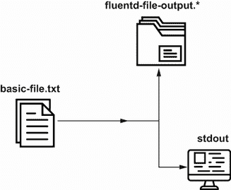
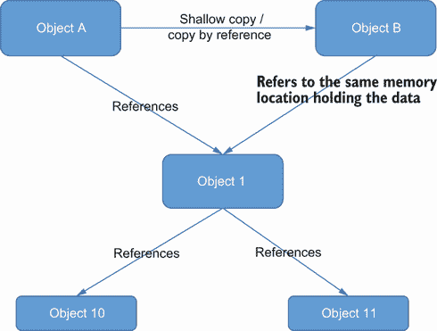
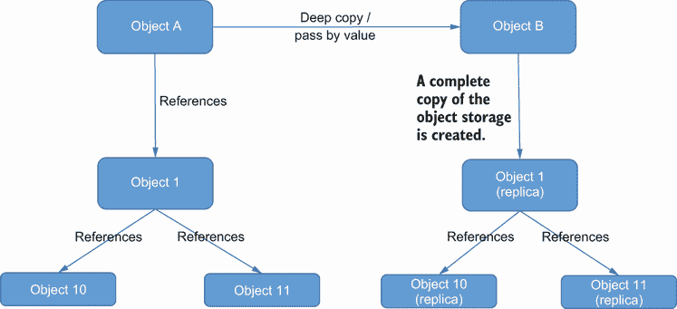
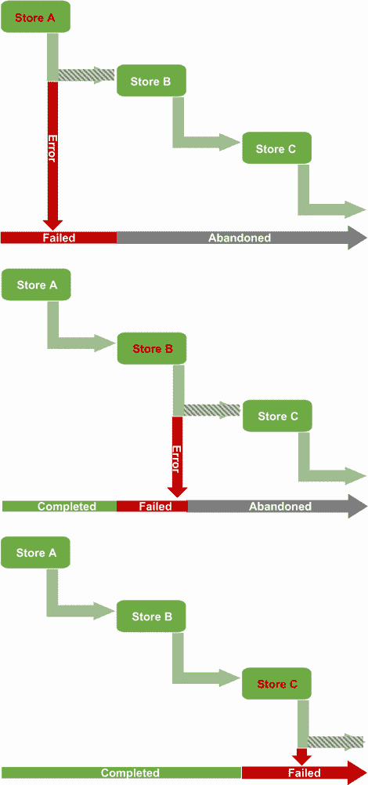
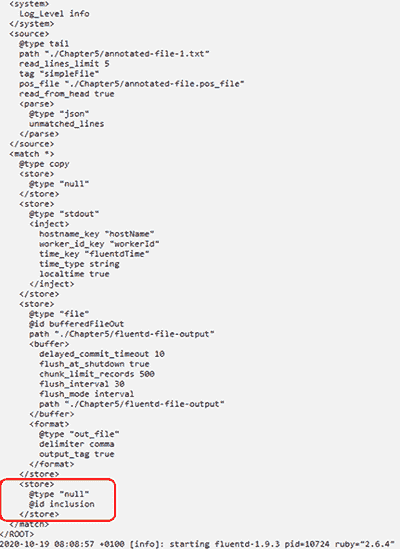
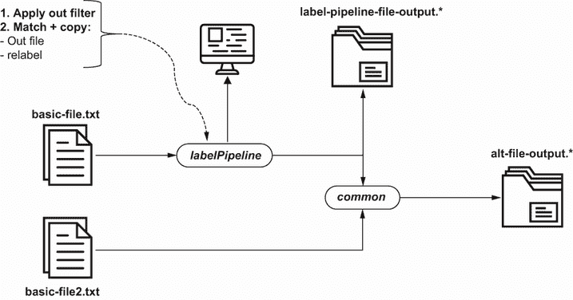

# 5 路由日志事件

本章涵盖

+   将日志事件复制到发送到多个输出

+   使用标签和标签路由日志事件

+   在 Fluentd 中观察过滤器并处理错误

+   应用包含以实现配置的重用

+   将额外的上下文信息注入日志事件

到目前为止，在这本书中，我们已经看到了如何捕获和存储日志事件。但在所有示例中，路由都是简单地所有事件都发送到同一个输出。然而，这可能远非理想。正如第一章所述，我们可能希望日志事件根据日志事件的类型发送到不同的工具。可能希望将日志事件发送到多个位置或一个都不发送。因此，在本章中，我们将探讨我们可以路由事件的不同方式。此外，我们还将查看一些较小的功能，这些功能可以帮助解决路由的挑战，例如在日志事件中添加信息以确保日志事件的来源在传输过程中不会丢失。

路由通常与个人或团队之间如何分配工作相一致。正如我们将看到的，使用包含功能支持多个团队可以各自在其 Fluentd 配置的部分上工作，而不会打扰他人并注入特定的配置值。例如，我们已经看到安全团队需要将日志事件的路由和过滤应用于他们的工具（并排除他们不感兴趣的事件）。相比之下，运维团队需要不同的工具中的日志事件。通过路由和包含功能，我们可以快速实现这一点。

本章不会涉及路由的一个方面是将日志事件转发到其他 Fluentd 节点，因为这最好在我们稍后查看扩展时解决。

## 5.1 通过复制达到多个输出

将日志事件发送到所有正确输出（s）的一种方法是通过确保所有输出都接收事件，并且每个输出包含一个或多个过滤器以阻止不需要的内容被输出。在本节中，我们将重点关注复制，稍后我们将讨论过滤，因为在过滤事物之前，我们需要将日志事件带到正确的位置。

如第二章所述，日志事件默认情况下由第一个合适的*match*指令消费，其中包含输出插件。为了允许日志事件在匹配指令内到达多个输出插件，我们需要使用复制插件（*@copy*）。

每个目的地都包含在匹配指令中定义的*store*声明中，该声明使用 XML 风格的标签`<store>`和`</store>`。虽然*store*可能并不总是作为一个插件名称看起来直观（许多输出是为了我们不会将其与存储关联的解决方案，如 Grafana），但值得记住的是，Fluentd 的更多插件是针对日志事件的检索和存储，而不是其他任何事情。图 5.1 中的图示说明了指令和插件在逻辑上以及配置文件编写方式上的相互关系。


图 5.1 使用 @copy 和 Store 的匹配指令元素层次结构可视化。从左到右阅读，我们看到配置块越来越详细和专注（即特定插件类型的缓冲区或格式化器）。存储配置块可以在复制插件内部出现一次或多次。

在每个存储配置块中，我们可以配置插件的使用。通常，这将是一个输出插件，但也可以很容易地是一个过滤器插件。存储插件的属性可以像在 `match` 指令中直接使用时一样进行配置。这包括使用辅助插件，如 `buffers`。

为了说明这一点，我们将使用文件输入，而不是像第三章中那样将日志事件从一个文件发送到另一个文件，我们将扩展配置以将输出发送到文件和控制台。我们可以在图 5.2 中看到这种表示。



图 5.2 使用存储和复制将日志事件发送到多个目标配置文件的可视化

要实现此功能，我们需要编辑 `match` 指令。最简单的方法是首先将现有的输出插件属性包裹在 `store` 标签内，然后添加下一个 `store` 开始和结束标签。有了 `store` 开始和结束标签，就可以配置每个输出插件。最后，在 `match` 指令的开始处引入 `@copy`。修改后的配置如下所示，其中包含两个 `store` 块，每个块包含一个输出插件（`file` 和 `stdout`）。您还会看到一个具有 `null` 输出插件类型的第三个 `store` 块，后面跟着一个 `@include` 指令。我们将在稍后解释这些。

列表 5.1 Chapter5/Fluentd/file-source-multi-out.conf——复制到多个输出

```
<match *>
  @type copy                ❶
    <store>
      @type null
    </store>
    <store>                 ❷

      @type stdout
    </store>
    <store>                 ❸
      @type file
      @id bufferedFileOut
      tag bufferedFileOut
      path ./Chapter5/fluentd-file-output
      <buffer>
        delayed_commit_timeout 10
        flush_at_shutdown true
        chunk_limit_records 500
        flush_interval 30
        flush_mode interval
      </buffer>
      <format>
        @type out_file
        delimiter comma
        output_tag true
      </format>
    </store>
    @include additionalStore.conf
</match>
```

❶ 声明要使用的插件

❷ 存储块的开始——每个存储反映要采取的操作。这通常是为了使用插件存储日志事件或将事件转发到另一个 Fluentd 节点。在这种情况下，我们只是写入控制台。

❸ 第三个存储路由到文件

让我们看看配置的结果。由于这使用文件源，我们需要运行 LogSimulator。因此，要运行此示例，需要以下命令：

+   `fluentd -c ./Chapter5/Fluentd/file-source-multi-out.conf`

+   `groovy LogSimulator.groovy ./Chapter5/SimulatorConfig/log-source-1.properties`

运行这些命令后，日志事件将很快出现在控制台上。一旦缓冲区达到写入点，将出现名为 `fluentd-file-output.<date>_<number>.log` 的文件。将文件内容与控制台内容进行比较是值得的，因为我们已经将额外的属性包含在有效负载中。

### 5.1.1 按引用或按值复制

在大多数，也许甚至是所有编程语言中，都存在浅拷贝和深拷贝的概念，有时称为*按引用复制*（如图 5.3 所示）和*按值复制*（如图 5.4 所示）。无论您习惯于哪种术语，*按引用复制*意味着每个副本通过引用同一块内存来达到日志事件的复制。如果日志事件被修改，那么这种变化会影响所有后续使用的所有副本。*按值复制*意味着获取一个新的内存块，并复制其内容。这意味着如果一个副本被修改，另一个副本不会受到影响，因为它是一个完整的克隆。虽然我们还没有看到需要做任何其他事情的理由，但在下一章中，我们将看到可以操纵日志事件的内容。



图 5.3 按引用复制时对象在内存中的存储方式

如图 5.3 所示，当对象 B 被创建为对象 A 的浅拷贝时，它们都指向包含内部对象（对象 1）的同一内存。因此，如果我们通过对象 B 更新对象 1，那么也会影响对象 A。



图 5.4 按值复制时对象在内存中的存储方式

在复制配置中，我们可以通过`copy_mode`属性来控制这种行为。复制模式有几种设置，其行为范围从按引用复制到按值复制：

+   *no_copy*—默认状态，实际上是按引用复制。

+   *浅拷贝*—这会深度复制第一层值。如果那些对象反过来又引用对象，它们仍然引用与原始对象相同的内存。在底层，这使用了 Ruby 的*dup*方法。虽然比深度复制快，但使用 dup 需要谨慎；它类似于嵌套对象的*no_copy*。

+   *深拷贝*—这是一个正确的按值复制，利用 Ruby 的*msgpack* gem。如果有疑问，这是我们推荐的方法。

+   *Marshal*—当 Ruby 的 msgpack 无法使用时，可以使用本地语言的物体序列化。对象被序列化（序列化）成一个字节流表示形式。然后字节流被反序列化（反序列化），并产生一个代表字节流的对象。

复制操作的工作原理

以下将帮助您更好地理解复制行为的工作原理：

+   Ruby dup（浅拷贝）：[`mng.bz/mxOP`](http://mng.bz/mxOP)

+   msgpack-ruby（深拷贝）：[`rubydoc.info/gems/msgpack`](https://rubydoc.info/gems/msgpack)

+   msgpack 序列化（marshal）：[`ruby-doc.org/core-2.6.3/Marshal.html`](https://ruby-doc.org/core-2.6.3/Marshal.html)

理想情况下，我们不需要担心按值复制，因为日志事件以良好的结构接收，并包含所有必要的状态信息，因此内容操作变得不必要。遗憾的是，世界并不完美；在使用复制功能时，请考虑默认选项是否合适；例如，我们是否需要操作一个目标而不是另一个目标的日志事件？使用标签创建“日志事件处理管道”会增加需要考虑如何复制的机会，正如我们将在本章后面看到的那样。

另一个需要注意的考虑因素是，在为不同的存储复制日志事件时，如果日志事件可以携带敏感数据，我们可能希望在大多数情况下对值进行编辑或屏蔽，但对于发送到安全部门的日志事件则不是这样。如果安全部门不希望受到任何数据屏蔽或编辑的影响，他们需要深度复制。

### 5.1.2 复制时的错误处理

在我们提供的示例配置中，两个输出都指向相同的本地硬件，并且需要一些独特的情况才会影响一个文件而不影响另一个。然而，假设输出被发送到远程服务，例如数据库或 Elasticsearch。在这种情况下，一个输出出现问题而另一个输出不受影响的可能性显著增加。例如，如果其中一个目标服务已被关闭或网络问题阻止了通信，我们的输出会发生什么？Fluentd 是否会将日志事件发送到可用的存储，或者除非它们全部可用，否则不发送到任何存储？

Fluentd 不会尝试应用*XA 事务*（也称为*两阶段提交*），因为它允许全有或全无的行为，因为此类事务的协调是资源密集型的，且协调需要时间。然而，默认情况下，它确实应用了次优方案；在某个输出失败的情况下，后续的输出将被放弃。例如，如果我们复制到三个存储，分别称为 Store A、Store B 和 Store C，它们在配置中按此顺序定义，并且我们未能将日志事件发送到 Store A，那么没有任何存储会收到该事件（参见图 5.5 的第一部分）。如果问题发生在 Store B，那么 Store A 将保留日志事件，但 Store C 将被放弃（参见图 5.5 的第二部分）。



图 5.5 存储错误如何影响包含的复制。每个图底部的条形图表示哪个存储会接收到数据值，哪个存储失败，以及哪个存储未执行操作。例如，在中间示例中，如果 Store B 失败，那么 Store A 将接收到日志事件，Store B 不会接收到事件，而 Store C 则不会进行通信。

但如果你在输出配置中有一个缓冲区，这可能会掩盖问题，因为缓冲区可能异步操作并包括回退和重试等选项。结果，如上所述，放弃重试等错误可能不会影响复制过程。鉴于这种方法，有选项可以按顺序排列复制块以反映输出优先级。

然而，如果你使用带有重试的异步缓冲区，缓冲区将允许执行继续到下一个存储。但如果它随后达到最大重试次数，它将失败该存储，但后续的存储操作可能已经成功。

如何应用优先级/顺序应取决于日志事件的值和输出能力。例如，使用输出插件允许使用*二级*辅助插件，如*secondary_file*。如果日志事件至关重要，以至于不能丢失，那么首先优先考虑本地 I/O 选项是最好的。如果日志事件的优先级是快速将其发送到远程中央服务（例如，Kafka 或 Splunk）并且失败，那么这意味着该事件在其他地方（例如，Prometheus 用于指标计算贡献）的帮助很小；因此，最好以最高优先级的目的地开始。

Fluentd 还提供另一种选项来定制此行为。在`<store>`声明中，可以添加`ignore_error`（例如，`<store ignore_error>`）参数。然后，如果该存储块中的输出导致错误，它将阻止错误级联，从而触发后续存储块被放弃。使用我们的示例三个存储，在存储 A 上设置`ignore_error`意味着无论是否将事件发送到存储 A，我们都会继续尝试使用存储 B。但如果存储 B 失败，那么存储 C 将不会收到该事件。

## 5.2 通过包含配置重用和扩展

随着 Fluentd 配置的发展、成熟以及可能引入多个日志事件处理路由，我们的 Fluentd 配置文件在大小和复杂性上都会增长。随着这种增长，我们也很可能发现一些配置可以重用（例如，不同的匹配定义想要重用相同的过滤器或格式化器），尤其是在尝试实现*DRY*（不要重复自己）的理想时。因此，在本节中，让我们探讨如何解决大型配置文件带来的挑战并最大化重用。

我们可以通过确保 Fluentd 配置操作以正确的顺序出现来尝试解决这个问题。使用标签过滤事件可能有效。这种方法可能会相当混乱，并且小的更改可能会以意想不到的方式干扰日志事件的流程。

另一种方法是尝试调整配置文件，以便在不同的上下文中重复使用部分内容。第一步是将需要重复使用的 Fluentd 配置隔离到自己的文件中，然后使用 `@include` 指令和文件名及路径，在需要该配置的任何地方使用。使用 `include` 语句，引用的文件将被合并到父配置文件中。这意味着我们可以重复使用配置和包含，这样就不需要操作 Fluentd 配置，指令的顺序也就不是问题。

在 Fluentd 启动期间，配置文件会被解析，并将包含指令替换为所包含文件的副本内容。这样，我们可以在需要的地方包含相同的配置文件。例如，如果我们有一个针对 Elasticsearch 的企业级设置，那么所有不同的 Fluentd 配置都可以引用单个文件来使用企业 Elasticsearch，并且可以针对单个文件应用更改，例如优化连接设置。当配置文件部署时，每个人都会继承这些更改。

*包含* 不必包含完整的配置；它可以很容易地包含单个属性。一个很好的例子是，当你想要将一些常见的 Ruby 逻辑（例如，检索一些安全凭证）重复使用到 Fluentd 配置中，正如我们稍后将要讨论的。同样，包含文件也可以用来注入配置块，例如 `store` 块，甚至是一个完整的附加配置文件，该文件也可以独立使用。在列表 5.2 中，我们通过在最后一个 `store` 标签定义的附加存储配置之后引入 `@include additionalStore.conf`，添加了几个包含项。这意味着我们可以为所有日志事件定义一个共同的目的地，并在其他配置文件中重复配置，以便在共同的位置记录所有事件，然后允许配置专注于目的地。

列表 5.2 Chapter5/Fluentd/file-source-multi-out2.conf—包含示例

```
<match *>
  @type copy  
    <store>
      @type null
    </store>
    <store>  
      @type stdout  
    </store>
    <store>  
      @type file
      @id bufferedFileOut
      tag bufferedFileOut
      path ./Chapter5/fluentd-file-output
      <buffer>
        delayed_commit_timeout 10
        flush_at_shutdown true
        chunk_limit_records 500
        flush_interval 30
        flush_mode interval
      </buffer>
      <format>
        @type out_file
        delimiter comma
        output_tag true
      </format>
    </store>
  @include additionalStore.conf    ❶

</match>

@include record-origin.conf        ❷
```

❶ 将外部文件整合到配置中，提供额外的存储声明

❷ 提供了一个完整的配置集，如果需要可以单独运行，或者可以重复使用

我们还添加了一个引用文件 `record-origin .conf` 的包含指令。这说明了当多个团队向单个运行时环境（例如，J2EE 服务器）贡献功能时，而不是所有团队都试图维护单个配置文件并处理冲突，每个团队都有自己的配置文件。但在执行时间，单个配置文件使用包含来将所有内容组合在一起。因此，Fluentd 节点需要在启动时合并所有配置。在 `record-origin .conf`（如果您查看 `record-origin.conf` 的内容），我们引入了一些新的插件，我们将在本章后面介绍。

让我们看看配置的结果。由于这使用文件源，我们需要运行 LogSimulator。因此，要运行此示例，需要以下命令：

+   `fluentd -c ./Chapter5/Fluentd/file-source-multi-out2.conf`

+   `groovy LogSimulator.groovy ./Chapter5/SimulatorConfig/log-source-1.properties`

**注意**：重要的是要记住，包含的内容可能会影响具有 `include` 声明的配置。因此，包含的位置和使用必须谨慎处理，因为指令和它们相关插件的最终顺序仍然适用，如第二章中所述。

如果 `include` 语句中包含文件的路径是相对的，那么参考点是带有 `include` 指令的文件位置。`include` 指令可以使用逗号分隔的列表，在这种情况下，列表顺序与插入顺序相关——例如，`@include file.conf, file2.conf` 表示 `file.conf` 在 `file2.conf` 之前被包含。如果 `include` 指令使用通配符（例如，`@include *.conf`），则插入顺序是按字母顺序的。

图 5.6 显示了干运行输出，并突出显示了 `include` 声明已被替换为包含的配置或配置片段内容。



图 5.6 显示了 Fluentd 启动时解析的包含文件（框内高亮显示）

**注意**：由于这个过程是纯文本替换，这意味着包含可以很容易地是一个空的占位符文件或配置片段。如果包含在文件中的位置不正确，可能会使整个配置无效。

### 5.2.1 使用空输出进行占位

在列表 5.2 中，提供的附加包含片段 (`@include additionalStore .conf`) 如列表 5.3 所示。这个 `store` 定义使用了空输出插件；它简单地丢弃接收到的日志事件。

在一个可能希望将日志事件输出到不同工具的不同团队的环境中工作时，放置空插件允许开发者构建一个服务，在 Fluentd 配置中放置占位符，以便其他团队替换。在许多方面，使用空插件是添加 `TODO` 代码注释的近似方法。

注意 `TODO` 是在代码中标记还有事情要做的一个常用标签。

列表 5.3 Chapter5/Fluentd/additionalStore.conf—包含配置片段

```
<store>
  @type null
  @id inclusion
</store>
```

### 5.2.2 将 MongoDB 输出包含到实际操作中

让我们将一些见解应用到这个场景中。知道在哪里最好地应用努力最好是由分析洞察驱动的。将错误事件直接导向数据库使得获取随时间显示发生错误及其频率的统计数据变得容易。当与对错误影响的欣赏相结合时，可以以最大价值的目标来定位努力。

我们需要将此应用到 `Chapter5/Fluentd/file-source-multi-out.conf`。为此，可以利用第四章中的工作，当时我们使用了 MongoDB 插件的 Fluentd。我们可以利用它来观察复制错误和使用 `ignore_error` 选项的影响。为此，创建一个 `Chapter5/Fluentd/file-source-multi-out.conf` 的副本，可以安全地进行修改。为了简单起见，让我们称这个副本为 `Chapter5/Fluentd/file-source-multi-out-exercise.conf`。我们需要将 `@type null` 替换为 MongoDB 输出配置。运行场景所需的命令是

+   `fluentd -c ./Chapter5/Fluentd/file-source-multi-out-exercise.conf`

+   `groovy LogSimulator.groovy ./Chapter5/SimulatorConfig/log-source-1.properties`

应用更改后，我们应该能够完成以下步骤：

1.  使用干运行功能检查配置。这应该会产生一个有效结果。

1.  通过启动 MongoDB 并重新运行 LogSimulator 和 Fluentd 来确认修改后的配置产生了预期的结果。

1.  如果我们无法连接到 MongoDB，请验证行为是否符合预期，并重复执行运行 LogSimulator 和 Fluentd 的相同操作。

1.  前一个步骤应该已经突出了 `ignore_error` 选项的缺失。修改 Fluentd 配置，将 `ignore_error` 选项添加到控制台输出配置中。重新运行配置和 LogSimulator。确认现在所需的行为是正确的。

答案

1.  修改后的 Fluentd 配置文件现在应该看起来像 `Chapter5/ExerciseResults/file-source-multi-out-Answer1.conf`，并且能够成功执行干运行。

1.  当 MongoDB 运行时，数据库应继续填充反映发送到文件的内容的事件，并且控制台仍然会显示内容。

1.  当 MongoDB 停止时，输出插件将开始出现错误，因为没有配置来确保问题不会级联影响其他插件。没有任何输出流会产生日志事件。这是因为默认位置是，一旦发生错误，后续输出插件不应执行。

1.  在配置中添加了`ignore_error`后，配置现在应类似于`Chapter5/ExerciseResults/file-source-multi-out-Answer2.conf`。由于 MongoDB 仍然停止，MongoDB 输出将失败，但失败不会停止控制台输出，但会阻止文件输出。

## 5.3 将上下文注入日志事件

提供更多信息和环境可以帮助我们处理日志事件。为此，我们可能需要操作预定义的日志事件属性并捕获额外的 Fluentd 值。本节将更详细地探讨这一点。

通过将此信息注入日志事件作为可识别的日志事件属性，我们可以在尝试使用过滤器排除指令时显式引用这些值，这将防止日志事件在事件序列中进一步处理。例如，假设与特定主机关联的日志事件被认为是不必要的，可以通过将属性集与主机名进行比较来停止信息传递。在这种情况下，我们可以应用一个带有排除指令的过滤器来阻止信息传递。

*注入*操作只能与匹配和过滤指令一起使用，这很遗憾，因为我们可能希望在源处应用它。尽管如此，如果需要，这并不是一个重大的挑战，正如我们很快就会看到的。使用我们的示例配置`Chapter5/Fluentd/record-origin.conf`，我们可以在列表 5.4 中看到注入的工作情况。

在配置时间数据注入时，可以配置时间的不同表示形式。这由`time_type`属性处理，它接受以下值

+   *字符串*—允许使用文本表示，并委托给`time_format`属性进行表示。`time_format`使用标准表示法，如附录 A 所述。

+   *浮点数*—从纪元开始的秒和纳秒（例如，`1510544836.154709804`）。

+   *Unix 时间*—这是从纪元开始的传统的秒表示。

在列表 5.4 中，我们选择了最易读的字符串格式。除了描述时间数据格式外，还可以通过包含`localtime`和`utc`属性来指定时间作为本地时间或 UTC 时间，这些属性接受布尔值。尝试设置这两个属性可能是许多问题的来源。

列表 5.4 Chapter5/Fluentd/record-origin.conf—注入声明

```
<match **>
  <inject>                    ❶
    hostname_key hostName     ❷

    worker_id_key workerId    ❸

    tag_key tag               ❹
    time_key fluentdTime      ❺
    time_type string          ❻

    localtime true        
  </inject>
  @type stdout
</match>
```

❶ 在通用匹配中注入声明

❷ 添加 Fluentd 的主机名并按提供的名称（例如，hostName）调用值

❸ 添加 worker_id 并按提供的名称调用它。这有助于当 Fluentd 有支持进程来分担工作时。

❹ 将标签放入记录输出并使用提供的名称

❺ 提供要包含的时间名称

❻ 定义日期时间的表示方式。在这里，我们说的是提供文本表示，但由于我们省略了用于定义格式的 `time_format` 值，因此使用标准格式。

`inject` 配置的属性与将已知值（如 `hostname`、`tag` 等）映射到日志事件记录中的属性相关。

要看到这个配置的实际效果，我们使用了 `monitor_agent` 和 `stdout`，所以我们只需要运行 Fluentd，命令为 `fluentd -c ./Chapter5/fluentd/record-origin.conf`。结果将出现在控制台，类似于以下内容

```
2020-05-18 17:42:41.021702900 +0100 self: {"plugin_id":"object:34e82cc", 
    "plugin_category":"output","type":"stdout","output_plugin":true,"retry_count":0,
    "emit_records":4,"emit_count":3,"write_count":0,"rollback_count":0,"slow_flush_count":0,
    "flush_time_count":0,"hostName":"Cohen","workerId":0,"tag":"self",
    "fluentdTime":"2020-05-18T17:42:41+01:00"}
```

在这个输出中，您将看到注入的值使用属性定义的名称出现在 JSON 结构的末尾；例如，`"hostName": "Cohen"`，其中 `Cohen` 是编写这本书所使用的电脑。

### 5.3.1 值提取

如果我们可以将某些值注入到日志事件的记录中，那么很明显，应该有一个计数器功能来从记录中提取值以设置日志事件的标签和时间戳。这种能力可以通过与源、过滤器和匹配指令一起工作的插件来利用。这为我们提供了一种根据日志事件记录内容动态设置标签的有用手段。动态设置标签使得基于标签的路由非常灵活。例如，如果日志事件有一个名为 `source` 的属性，而我们想将其用作路由的手段，我们可以使用 *extract* 操作。例如：

```
<inject>
  tag_key nameOfLogRecordAttribute
</inject>
```

不幸的是，只有一小部分可用的插件利用了 *extract* 辅助功能。其中一个是核心插件，它确实包含了我们尚未涉及的 *exec, which*。因此，当我们探索下一节的基于标签的路由时，我们将使用 `exec`，并探索它提供的有趣机会。

## 5.4 基于标签的路由

在到目前为止的所有章节中，我们总是在 *match* 声明中使用了通配符（例如，`<match *>`），但我们有机会在不同的阶段定义和更改标签值。我们已经看到标签在从 URI 中获取标签值到在配置中设置标签，甚至是从日志事件记录中提取标签的上下文中被操作。我们可以使用标签来控制哪些指令被执行，这是本节的主题。

我们可以通过更明确地定义匹配值来控制哪些指令将处理和消费日志事件。例如，一个名为 AppA 和 AppB 的两个输入配置包括设置相应标签为 `AppA` 和 `AppB` 的 `tag` 属性。现在，而不是 `match *`，我们将指令设置为 `<match AppA>` 和 `<match AppB>`。随着这一变化，匹配指令将只处理来自相关源的日志事件。

在我们的示例中，为了保持源简单，我们已配置了两个 `dummy` 源插件的实例以生成日志事件。我们添加了额外的属性来控制在不同频率（`rate` 属性表示每个生成的日志事件之间的秒数）和不同消息（`dummy` 属性）上的行为。

在以下列表中，我们展示了配置的关键元素（为了清晰起见，我们删除了一些配置元素；这可以通过省略号 [...] 来看到）。

列表 5.5 第五章/Fluentd/monitor-file-out-tag-match.conf—标签匹配

```
<source>                             ❶

  @type dummy
  dummy {"hello from":"App A"}
  auto_increment_key AppACounter
  tag AppA
  rate 5
</source>

<source>                             ❷

  @type dummy
  dummy {"Goodbye from":"App B"}
  auto_increment_key AppBIncrement
  tag AppB
  rate 3
</source>

<match AppB>                         ❸

    @type file                       ❹

    path ./Chapter5/AppB-file-output
    @id AppBOut
    <buffer> . . . </buffer>
    <format> . . . </format>  
</match>

<match AppA>                         ❺
    @type file
    path ./Chapter5/AppA-file-output
    @id AppAOut
    <buffer> . . . </buffer>
    <format> . . . </format>   
</match>
```

❶ 此配置文件中的两个源定义中的第一个，但请注意端口号不同，以及几个其他配置属性，因此源很容易区分。

❷ 第二个 self_monitor 源配置。最重要的是，注意源之间的标签名称差异。

❸ 两个匹配声明中的第一个。注意我们如何使用通配符字符来定义部分名称匹配。

❹ 将文件输出配置映射到每个匹配的不同输出文件（比较路径属性）

❺ 第二次匹配，这次没有任何通配符

可以使用以下命令运行此设置

```
fluentd -c ./Chapter5/Fluentd/ monitor-file-out-tag-match.conf
```

输出文件应反映不同的虚拟消息，因为路由将已从相关源导向。

尽管命名如此，仍然可以使用选择性的通配符与标签一起使用。如果我们通过添加一个额外的源并标记为 `AppAPart2` 来扩展此示例，我们可以捕获 `AppA` 和 `AppAPart2`。这是通过将 `<match AppA>` 修改为 `<match AppA*>` 来实现的。从新源捕获的日志事件将被纳入 `AppA` 输出。

这在列表 5.6 中得到了说明。如果我们不想重新引入通配符的使用，我们也可以在匹配声明中使用逗号分隔的标签列表；例如，`<match AppA, AppAPart2>`。为了说明通配符的行为，这次我们引入了另一个名为 *exec* 的源插件。exec 插件允许我们调用 OS 脚本并捕获结果。我们只是在 exec 语句中使用 more 命令（因为它在 Linux 和 Windows 上表现相同）。

列表 5.6 第五章/Fluentd/monitor-file-out-tag-match2.conf—标签匹配

```
<source>                                 ❶
  @type dummy
  dummy {"hello from":"App A"}
  auto_increment_key AppACounter
  tag AppA
  rate 5
</source>

<source>
  @type exec                             ❷
  command more .\TestData\valuePair.txt
  run_interval 7s
  tag AppAPart2
</source>

<source>                                 ❸
  @type dummy
  dummy {"Goodbye from":"App B"}
  auto_increment_key AppBIncrement
  tag AppB
  rate 3
</source>
<match AppB> . . . </match>              ❹

<match AppA*>                            ❺

    @type file
    path ./Chapter5/AppA-file-output
    @id AppAOut
    <buffer> . . . </buffer>
    <format> . . . </format>   
</match>
```

❶ 原始源，保持未更改

❷ 使用 exec 源插件添加的额外源

❸ 原始 AppB 源，保持不变

❹ AppB 的匹配保持未修改。

❺ AppA 的原始匹配现在已被修改以包含通配符，这意味着 AppA 和 AppAPart2 都将被匹配。这也可以表示为 <match AppA, AppAPart2>。

可以使用以下命令运行此设置

```
fluentd -c ./Chapter5/Fluentd/ monitor-file-out-tag-match2.conf
```

输出文件应反映不同的虚拟消息，但 `AppA` 输出现在应包括在预定义测试数据文件上执行 OS 命令的结果。

标签命名约定

尽管使用通配符字符来帮助选择不同指令的标签，而不考虑其位置，但通常有一个约定。标签命名通常遵循类似于命名空间的层次结构，使用点来分隔层次结构层（例如，`AppA.ComponentB.SubComponentC`）。现在通配符可以过滤不同的命名空间（例如，`AppA.*` 或 `AppA.ComponentB.*`）。例如，如果我们有一个托管多个不同服务的域的 Web 服务器，每个服务可能有一个或多个日志输出，我们可能会在标签约定中看到 `webserver.service .outputName` 的约定。

### 5.4.1 使用 exec 输出插件

列表 5.6 中所示的 exec 插件提供了一些有趣的机会。当插件无法帮助我们获取所需的信息时，我们有几种选择：

+   构建一个自定义插件（本书稍后将会探讨）。

+   创建一个独立的实用程序，可以直接通过 HTTP、UDP、转发插件将数据馈送到 Fluentd。

+   生成一个可以由 exec 插件调用的小型脚本。

使用 exec 插件可以轻松检索特定环境的信息或执行类似使用 *Wget* 和 *cURL* 等工具抓取网页输出的操作——这是屏幕抓取的现代版本。后者尤其有趣，因为可以从 Web 接口或 Web 端点中提取信息——例如，如果第三方提供了一个微服务（因此必须将其视为黑盒）——并且仍然可以有效地进行监控。如果第三方遵循了提供 `/health` 端点的最佳实践（更多信息请参阅 [`mng.bz/5KQz`](http://mng.bz/5KQz)），我们可以运行一个脚本来从对 `/health` 的 Wget 或 cURL 调用的响应中提取必要的值。

使用 exec 插件确实需要小心谨慎。每个 exec 进程都在自己的线程中执行，这样就不会在其他日志事件被触发时对其他日志事件的消费产生不利影响。然而，如果进程太慢，我们可能会遇到以下情况：

+   exec 插件可能会在最后一个尚未完成之前再次被触发，这可能导致创建出序事件（由于资源如何在线程之间共享，这种情况可能会发生）。

+   线程死亡可能发生，因为存在太多线程需要太多资源（如果缓冲区最终有太多线程，可能会出现此类问题）。

+   事件开始积压，因为逻辑会等待线程完成以分配给另一个 exec。

吸取的教训是思考 exec 在做什么；如果它运行缓慢或计算密集，那么在 Fluentd 中运行它可能是不明智的。我们可以考虑独立运行将结果写入文件的 exec 进程，并且与核心业务流程相比，日志管理应该相对较轻量。

### 5.4.2 将标签命名约定付诸实践

团队已经决定，日志配置应该反映 `domain.service.source` 的命名约定。当前的配置没有反映被调用的域为 Demo，服务被命名为 `AppA` 和 `AppB`，其中 `AppA` 有两个组件 `Part1` 和 `Part2`。你被要求更新配置文件 `monitor-file-out-tag-match2.conf` 以符合此约定。更改 `AppA` 的匹配指令，以便仅在 `AppA` 文件中捕获 `Part1`。注意额外的输入，因为 exec 源在输出中尚不需要。

答案

结果应该得到一个修改后的配置，看起来类似于 `Chapter5/ExerciseResults/monitor-file-out-tag-match-Answer.conf`。注意匹配条件是如何改变的。

### 5.4.3 将动态标签与提取结合使用

在 5.3.1 节中，我们看到了如何动态设置标签的解释。我们应该改进并重新运行 `monitor-file-out-tag-match2.conf`，以便 exec 源根据检索到的文件值设置标签。

答案

我们应该得到一个类似于 `Chapter5/ExerciseResults/monitor-file-out-tag-match-Answer2.conf` 的配置。注意，当我们运行这个配置时，使用 exec 源的日志事件内容将不再达到输出，因为我们已经更改了标签，所以它无法通过匹配条件。

## 5.5 标签插件

有可用的插件可以进一步帮助使用标签进行路由；让我们看看一些核心 Fluentd 之外的认证插件（表 5.1）。

当插件被描述为“认证”时，这意味着它们来自被 Fluentd 社区认可和信任的贡献者。由于这些插件不是 Fluentd 的核心部分，这意味着要使用这些插件，你需要安装它们，就像我们在第四章中为 MongoDB 所做的那样。

表 5.1 可帮助进行路由的基于标签的附加路由插件

| 插件名称和链接 | 描述 |
| --- | --- |
| *rewrite-tag-filter*[`github.com/fluent/fluent-plugin-rewrite-tag-filter`](https://github.com/fluent/fluent-plugin-rewrite-tag-filter) | 通过 `match` 指令中的一个或多个规则，插件会对日志事件应用正则表达式。然后，根据结果，标签会更改到指定的值。规则可以设置为可以选择是否将重写应用于正则表达式的真或假结果。如果成功，则使用新标签重新发出日志事件以继续匹配事件之后的过程。 |
| *route*[`github.com/tagomoris/fluent-plugin-route`](https://github.com/tagomoris/fluent-plugin-route) | 路由插件允许标签将日志事件定向到一个或多个操作，例如操纵日志事件并将其复制以通过另一个指令拦截。 |
| *rewrite*[`github.com/kentaro/fluent-plugin-rewrite`](https://github.com/kentaro/fluent-plugin-rewrite) | 这使得可以使用一个或多个规则修改标签，例如如果日志事件记录的属性与正则表达式匹配。因此，根据日志事件执行特定任务变得非常容易。 |

## 5.6 标签：将标签提升到新的水平

正如我们将在本节中看到的那样，标签指令使用了基于标签的路由的基本思想，并将其提升到了全新的水平。理想情况下，我们应该能够清楚地将一组指令组合在一起，以区分特定的日志事件组，但这可能具有挑战性。标签允许我们克服这一点。它们有两个方面：首先，可以使用`@label`属性将一个额外的属性链接到日志事件，这与标签链接的方式非常相似（尽管，与标签不同，标签不是日志事件数据结构的一部分）。其次，标签提供了一个指令`(<label labelName> ... </label>)`，我们使用它来分组其他按顺序执行的指令（例如，匹配和过滤器）。实际上，我们正在定义一个动作管道。为了在本书的其余部分区分这两个概念，我们将谈论标签作为日志事件的属性，并将指令作为将一个或多个指令链接在一起作为管道或标签管道的方式。

与标签相比，标签有一个限制。可以创建一个以逗号分隔的标签列表（例如，`<match basicFile,basicFILE2>`），但标签只能与该管道关联一个标签（例如，`<label myLabel>`）。你会发现尝试以相同方式匹配多个标签会导致错误——例如，`'find_label': common label not found (ArgumentError)`。这种情况发生是因为 Fluentd 确实会在启动时检查每个标签声明是否可以执行。

注意：与标签不同，命名约定通常在意义上更具有功能性。

### 5.6.1 使用 stdout 过滤器查看发生了什么

为了帮助说明这一点，我们将引入一个特殊的过滤器配置。与匹配指令不同，filters with stdout 的重要之处在于，即使事件满足过滤器规则，它也会由插件发出，以便被后续的内容消费。这种过滤器设置有点像开发者的`println`，有助于在代码开发过程中查看发生了什么。我们将在下一章更详细地探讨过滤器，但现在，让我们看看 stdout 插件在过滤器中的行为。

stdout 插件有效地接受所有事件；因此，以下过滤器将允许所有内容通过并发送详细信息到控制台：

```
<filter *>
    @type stdout
</filter>
```

此配置通常被称为 *filter_stdout*。使用此作为额外步骤将帮助我们说明标签管道的行为。这是查看 Fluentd 配置内部发生情况的一种便捷方式。

### 5.6.2 标签和标签路由的示例

为了说明基于标签的管道，我们创建了一个配置，该配置跟踪两个不同的文件（来自两个不同的日志模拟器）。模拟器输出结果的配置导致两种不同的消息结构（尽管两者都源自相同的数据源）。要观察差异，请在模拟器运行后比较 `basic-file.txt` 和 `basic-file2.txt`。

此配置将说明将标签应用于一个源而不是另一个源的使用。然后，在“pipeline”标签内，一个源（文件）将同时受到 stdout 过滤器（如第 5.6.1 节所述）和与另一个文件输出分开的文件输出的影响。以下列表中展示了这一点。与其他较大的配置一样，我们用省略号替换了部分内容，以便更容易阅读配置的相关方面。

列表 5.7 第五章/Fluentd/file-source-file-out-label-pipeline.conf 标签管道

```
<source>                                       
  @type tail
  path ./Chapter5/basic-file.txt
  read_lines_limit 5
  tag basicFile
  pos_file ./Chapter5/basic-file-read.pos_file
  read_from_head true
  <parse> @type none </parse>
  @label labelPipeline                     ❶

</source>

<source>                                   ❷

  @type tail
  path ./Chapter5/basic-file2.txt
  read_lines_limit 5
  tag basicFILE2
  pos_file ./Chapter5/basic-file-read2.pos_file
  read_from_head true
  <parse>  @type json </parse>
</source>
#### end - tail basic-file2

<label labelPipeline>                      ❸

  <filter *>                               ❹

    @type stdout
  </filter>

  <match *>                                ❺
      @type file
      path ./Chapter5/label-pipeline-file-output
      @id otherSelfOut
      <buffer> . . . </buffer>
      <format> . . . </format>
  </match>

  <match *>                                ❻

    @type stdout
  </match>
</label>                                   ❼

<match basicFILE2>                         ❽

    @type file
    path ./Chapter5/alt-file-output
    @id basicFILE2Out
    <buffer> . . . </buffer>
    <format> . . . </format>   
</match>
```

❶ 我们将源附加到它创建的事件上；在这种情况下，标签为 labelPipeline。这意味着对这些事件执行的操作步骤将在 <label labelPipeline> 块中执行。

❷ 此源未标记。因此，其日志事件将被下一个可以消耗标签 basicFILE2 的匹配博客拦截。

❸ 在标签块的开始处，任何具有匹配标签的日志事件将通过此操作序列，假设处理允许事件从插件输出。

❹ 使用 stdout 过滤器将日志事件推送到 stdout 并输出到下一个插件。

❺ 使用匹配将内容定向到文件。

❻ 由于前面的匹配将消耗日志事件，因此我们永远不会看到此 stdout 过滤器的任何结果。要将日志事件发送到 stdout 和文件，需要使用复制功能。

❼ 定义事件标签系列的结束

❽ 在标签之外，匹配将应用于所有无标签事件。

要运行此配置，我们需要运行以下命令

+   `fluentd -c Chapter5/Fluentd/file-source-file-out-label-pipeline.conf`

+   `groovy LogSimulator.groovy Chapter5/SimulatorConfig/basic-log -file.properties`

+   `groovy LogSimulator.groovy Chapter5/SimulatorConfig/basic-log -file2.properties`

当运行此设置时，日志事件可以在 `basic-file.txt` 和控制台上看到。此外，还将有两个更多文件，因为日志内容输出到 `label-pipeline-file-output.*_*.log` 和 `alt-file-output.*_*.log`（通配符代表日期和文件增量编号）。这两个文件都不应混合标签。

虽然定义的匹配表达式在标签管道内继续使用通配符，但仍然可以在管道内的指令上应用标签控制。如果您将配置设置编辑为与 <match basicFILE2> 对齐，您将看到日志在控制台上显示，但不在文件中。

### 5.6.3 连接管道

随着配置变得更加复杂，您可能需要创建管道并将它们链接在一起。这可以通过使用*relabel*插件来完成。Relabel 做它所说的；它更改与日志事件关联的标签。由于 relabel 是一个输出插件，日志事件可以更改标签并发出日志事件而不是消费它。例如，您可能有一个包含多个指令的标签，可以将日志事件转换为人类友好的表示并发送到像 Slack 这样的社交平台。但在您使用标签做那之前，您可能希望将日志事件通过一个标记管道的过滤器，排除所有代表常规业务事件的日志事件。

随着我们的 Fluentd 配置结构随着管道变得更加复杂，可视化正在发生的事情很有帮助，如图 5.7 所示。正如您所看到的，我们现在已经将`alt-file-output`的匹配项改为一个名为`common`的标记管道。为了说明 relabel 的使用，我们原始的`labelPipeline`（如我们在列表 5.7 中看到的）已经被修改。我们引入了一个*copy*插件来确保日志事件同时发送到输出和 relabel（突出显示存储声明不仅可以用于存储插件）。当我们运行此配置时，`alt-file-output`文件将现在包含两个来源。



图 5.7 标签路由示例，两个标签管道连接（labelPipeline 和 common）

我们可以使用以下命令运行配置

+   `fluentd -c Chapter5/Fluentd/file-source-multi-out-label-pipelines.conf`

+   `groovy LogSimulator.groovy Chapter5/SimulatorConfig/basic-log -file.properties`

+   `groovy LogSimulator.groovy Chapter5/SimulatorConfig/basic-log -file2.properties`

下面的列表显示了应用`relabel`的配置。注意再次使用省略号，这样您可以专注于关键元素。

列表 5.8 Chapter5/Fluentd/file-source-multi-out-label-pipelines.conf 中使用 relabel

```
<source>
  @type tail
  path ./Chapter5/basic-file.txt
  read_lines_limit 5
  tag basicFile
  pos_file ./Chapter5/basic-file-read.pos_file
  read_from_head true
  <parse> . . . </parse>
  @label labelPipeline                          ❶

</source>

<source>
  @type tail
  path ./Chapter5/basic-file2.txt
  read_lines_limit 5
  tag basicFILE2
  pos_file ./Chapter5/basic-file-read2.pos_file
  read_from_head true
  <parse> . . . </parse>
  @label common                               ❷

</source>

<label labelPipeline>
    <filter *>
    @type stdout
  </filter>

  <match *>
    @type copy                                ❸

    <store>
      @type file                              ❹
      path ./Chapter5/label-pipeline-file-output
      <buffer> . . . </buffer>
      <format> . . . </format>
    </store>
    <store>                                   ❺

      @type relabel                           ❻

      @label common                           ❼

    </store>
  </match>

</label>

<label common>                                ❽

  <match *>
      @type file
      path ./Chapter5/alt-file-output
      <buffer> . . . </buffer>
      <format> . . . </format>   
  </match>
</label>
```

❶ 这将此来源的日志事件链接到一个标签，就像我们在前面的例子中所做的那样。

❷ 将第二个来源设置为使用 common 标签而不是信任指令捕获日志事件

❸ 在 match 中使用 copy 插件，我们可以使日志事件被多个输出插件消费。

❹ 日志事件将首先被推送到文件输出插件。

❺ 由于使用了 copy 指令，我们可以强制日志事件被进一步的操作处理。

❻ 使用 relabel 插件更改日志事件的标签，直到此操作为'labelPipeline'

❼ 标签现在设置为 common；当我们离开这个匹配和标签块时，事件将被名为 common 的标签指令消费。

❽ 标签 common 开始，现在将接收来自两个来源的日志事件。一个来源的事件直接到达，另一个通过 labelPipeline 到达 common 管道。

### 5.6.4 标签排序

与标签不同，标签指令的相对位置并不重要，以我们当前在图 5.7 中显示的配置为例。虽然`labelPipeline`将触发使用`common`标签的重新标记，但`common`标签可以在`labelPipeline`之前声明。标签管道内的步骤在执行时仍然是顺序的。您可以通过提供的配置文件`Chapter5/Fluentd/file-source-multi-out-label-pipelines2.conf`看到并尝试这一点。在配置中，您可以看到

1.  一个曾经用于通用但已更改为使用标签`outOfSequence.`的重新标记声明。有了它，我们将过滤器移动到了新的标签部分。

1.  `outOfSequence`标签管道随后重定向到通用，就像我们之前所做的那样，如图 5.8 所示。配置文件的实际顺序反映了从左到右阅读图中的外观（忽略图中显示的流程）。


图 5.8 此配置说明标签不是顺序敏感的。

该场景可以使用以下命令执行

+   `fluentd -c Chapter5/Fluentd/file-source-multi-out-label-pipelines2.conf`

+   `groovy LogSimulator.groovy Chapter5/SimulatorConfig/basic-log-file-small.properties`

+   `groovy LogSimulator.groovy Chapter5/SimulatorConfig/basic-log-file2-small.properties`

模拟器属性已配置为使用小数据集，以便更容易确认，并且我们没有得到任何意外的循环。

注意：虽然我们已经说明了在不按顺序标记部分是可能的，但我们并不一定提倡这种做法。从某些方面来看，标签可以与*goto*语句相提并论，因此最好尝试将配置文件结构得尽可能线性。

### 5.6.5 特殊标签

Fluentd 的标签功能包括一个预定义的`@Error`标签。这意味着我们可以使用标签指令来定义一个处理错误的管道；这些错误可以在我们的配置中或在执行配置的插件中引发。这确实依赖于插件实现使用特定的 API（`emit_error_event`）。我们可以确信核心 Fluentd 插件实现将使用此 API，但检查第三方插件是否使用此功能而不是简单地写入 stdout 可能是有价值的。我们将在本书后面查看构建我们自己的插件时看到这一点。

因此，我们可以基于现有的 Fluentd 配置步骤来捕获这些错误。有了这个，我们可以做一些事情，比如重新标记日志事件，使其被常见的管道捕获，或者简单地将其直接发送到其自己的目的地。在下一个示例中，我们向之前的配置中添加了一个新的标签管道，该管道将写入其自己的文件，如下面的列表所示。

列表 5.9 使用@Error 的 Fluentd/file-source-multi-out-label-pipelines-error.conf

```
<source> . . . </source>

<source> . . . </source>

<label labelPipeline> . . . </label>

<label common> . . . </label>

<label @Error>            ❶

  <match *>               ❷

      @type file
      path ./Chapter5/error-file-output
      <buffer> . . . </buffer>
      <format>
        @type out_file
        delimiter comma
        output_tag true
      </format>   
  </match>
</label>
```

❶ 使用预定义的 @Error 标签开始管道。因此，任何设置此标签的插件都将在此管道中处理其错误。

❷ 匹配所有标签，一旦日志事件被标记为错误，就将其写入文件。但我们可以变得聪明一些，对不同标签关联的错误进行不同的处理。例如，需要更多紧急关注的特定标签错误可以发送到通知或协作工具。

小贴士：创建一个简单的通用管道来处理错误总是很有用的。该管道会引发某种问题票、社交通知（例如 Slack、Teams）或简单地发送电子邮件来通知 Fluentd 配置中的事件。然后，在所有配置中作为标准实践使用 `include`。因此，如果您没有特定的错误处理配置，则通用的答案将为您启动。

### 5.6.6 将通用管道投入实际应用

您被要求重构列表 5.8 中引用的配置，使其具有单个管道。这将允许通过包含将其服务纳入主配置。此更改将允许其他团队开发的所有不同日志事件路由更安全地进行。为了帮助这些团队，您应该创建一个包含空输出作为模板的额外管道。

答案

结果实际上涉及三个文件。核心是 `Chapter5/ExerciseResults/file-source-multi-out-label-pipelines-Answer.conf`。它使用 `@include` 引入配置 `Chapter5/ExerciseResults/label-pipeline-Answer.conf`，其中包含重构的逻辑，以及一个包含由 `Chapter5/ExerciseResults/label-pipeline-template-Answer.conf` 定义的空输出的模板。

## 摘要

+   Fluentd 提供了一个空输出插件，可以用作输出插件的占位符。该插件将简单地删除接收到的日志事件。

+   Fluentd 提供了一个 exec 插件，允许我们将外部进程的触发（如脚本）纳入配置。外部进程可以使用日志事件的参数来调用。

+   Fluentd 提供了多种机制来通过配置路由日志事件。其中最简单的是使用与每个日志事件关联的标签。

+   对于更复杂的路由，我们希望有一个“管道”式的动作，Fluentd 提供了标签构造。标签的使用还可以帮助我们简化配置文件中的配置值排序的复杂性。

+   Fluentd 通过使用我们可以分组和 `namespace` 标签的约定来提供命名约定。我们可以在配置中使用通配符来分组标签。

+   Fluentd 配置可以通过使用 `@include` 指令从多个文件组装。

+   如果 Fluentd 发生错误（例如，无法连接到 Elasticsearch 的实例），我们可以捕获错误并使用自定义 `@Error` 标签执行操作。
