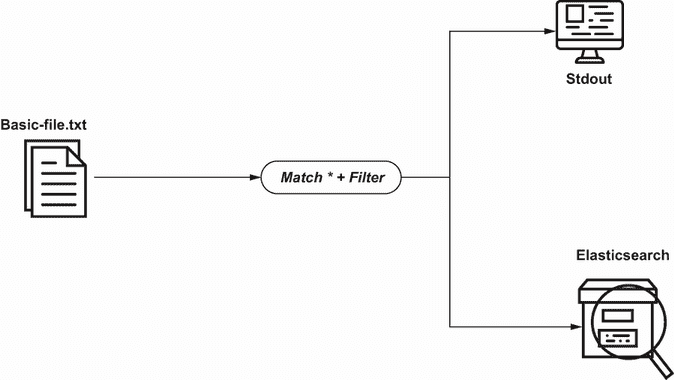
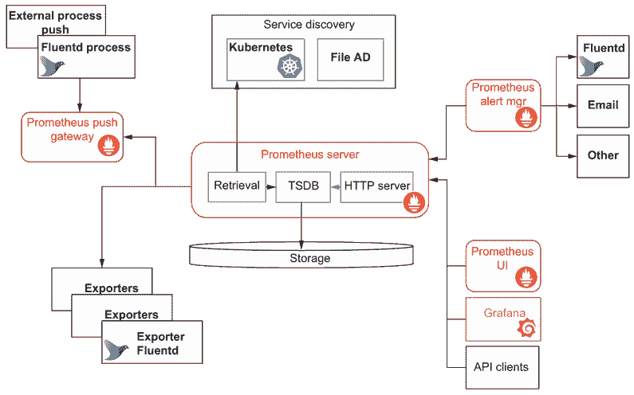

# 6 过滤和扩展

本章涵盖

+   应用过滤器来控制日志事件

+   实现 record_transformer 过滤器

+   从日志事件中提取信息

+   将环境信息注入到日志事件中

+   隐藏日志事件的元素以维护数据安全

在第五章中，我们提到了使用 filter 指令将日志事件发送到标准输出。虽然这种方式使用过滤器是有帮助的，但它几乎只是指令全部功能的附属品。filter 指令可以帮助我们

+   过滤掉特定的日志事件，以便只有特定的日志事件发送到特定的消费系统

+   过滤掉日志事件消息的特定部分，并允许我们将它们记录为日志事件的独特属性（最终使应用该数据中的逻辑更容易）

+   通过修改标签和时间戳来丰富日志事件，以反映日志事件记录本身的动态内容（例如，调整事件的上游缓存）

+   进一步丰富日志事件；例如

    +   使用基于公共 IP（称为 GeoIP）的插件添加地理位置信息

    +   通过识别日志事件中的信息来附加错误指导（例如，如果错误代码是通用的，但生成该代码的路径与某些内容匹配，则对日志进行注释，例如“根本原因是数据库连接错误”）

    +   添加上下文信息，这有助于你以后进行进一步分析（例如，Fluentd 的 worker_id 和 server_id）

+   应用更改以解决安全考虑（例如，匿名化、屏蔽和删除任何敏感数据，这些数据可能已进入日志事件）

+   从日志事件及其上下文中计算或外推新数据（例如，取两个时间戳并计算经过的时间）

+   过滤掉确认一切按预期运行的日志事件

本章将探讨为什么我们可能想要过滤日志事件，以及如何配置过滤器来完成这项工作。由于过滤器可以用来操纵事件日志，我们将探讨如何进行操作，是否应该这样做，以及为什么我们可能想要这样做。

## 6.1 过滤器的应用

我们刚刚简要概述了使用过滤器可能性的广泛性；让我们深入研究一些这些应用，以更好地理解为什么我们可能想要使用它们。

### 6.1.1 所有正常事件不需要分发

许多日志信息实际上会向我们表明事情正在按预期运行。获取这些事件很重要；正如著名的管理顾问和作家彼得·德鲁克所说：“你不能管理你无法衡量的东西。”也许更加相关的是，联合国秘书长达格·哈马舍尔德（经济学家）说：“一位好护士的持续关注可能和一位外科医生的重大手术一样重要。”换句话说，我们需要积极观察、量化并评估状态，以确保一切正常。这种持续、稳定的观察将使我们能够进行小的调整，以保持一切良好，而不是需要技能但重大的改变。

但我们不需要与每个人分享每个确认一切正常的日志事件。就像心脏监测器一样，当事情不正常时，所有的警报和信号都会响起，以确保每个人都意识到需要帮助。如果一切都在预期参数内，数据不会超出监控器的显示范围。例如，Elastic Beats 可以生成心跳日志事件，如`2017-12-17T19:17:42.667-0500 INFO [metrics] log/log.go:110 Non-zero metrics in the last 30s: beat.info.uptime.ms=30004 beat.memstats.gc_next=5046416`。这可能是不需要保留的日志消息，或者如果保留，也不需要分发，而是本地记录一段时间。

如果我们收到表示一切正常且不太可能提供更多洞察力的日志事件，我们是否需要将这些事件传播到下游系统？这意味着将更容易看到重要事件。通过过滤掉日常信息，我们也在控制成本。物理基础设施在需要更多硬件之前可以传输的最大数据量是有限的。我们根据带宽（即数据量）支付公共网络容量，因此消耗带宽分发每个“心跳”日志事件可能会积累成本，而收益却很少——更多的网络硬件、更多的带宽等等。在过去的几年里，观察到从云平台出口数据成本可以影响商业决策。换句话说，将数据从一个云推送到另一个位置需要花钱，而且这种成本可能会变得相当高。但我们不希望切断那百分之一的重要事件，这些事件值得传输。

### 6.1.2 在 haystack 中找到针

过滤可以用来隔离那些看似无害的事件，这些事件是即将到来的更严重问题的警告。这些情况发生在有人错误地将应该是一个警告日志事件分类为信息性或甚至调试性事件时。当你无法让日志生成更多有用的事件时（例如，现成的软件、无人愿意接触的遗留解决方案），能够识别和标记这类事件的能力很重要。

### 6.1.3 虚假紧急情况

总有一天，我们会遇到一个警告或错误日志发生的情况，问题会升级到管理层。关于必须优先解决的所有其他优先级的问题开始“大声疾呼”。但最终，问题的后果及其影响并不需要放弃一切；是的，发生了错误，但这并不是世界末日。所检测到的是一个本可以通过日常运营任务处理的问题。通过过滤器，我们可以定义规则，帮助我们区分“世界末日”事件和“请在登录时修复我并相应地指导信息”的事件。

更好的是，如果存在解决已知问题的操作步骤，我们将修复过程的引用添加到日志事件中。因此，当警报被触发时，它们已经与修复信息相关联。避免了不必要的升级，没有采取可能加剧问题的行动，等等。

### 6.1.4 重新分级

之前的应用场景是当日志事件可以被生成并标记为比其应有的日志级别更高的级别时——例如，使用`Error`而不是`Warning`或`Info`。和之前一样，如果人们无法或不愿意修复这个问题，那么我们可以在日志事件传递过程中修改它。这是通过操作日志事件来改变记录的日志级别到一个不那么令人警觉且更准确的分类来实现的。或者，通过给日志事件添加带有注释的额外属性来标记，这表明这是一个已知的错误日志级别。

### 6.1.5 未实现的日常维护

只要软件开发存在，业务驱动因素就会优先考虑功能性能力，而不是非功能性能力，如日常维护（例如存档或删除处理过的文件文件夹等）。当这是一个遗留应用程序的特征时，人们害怕改变任何东西以改进系统，比如自己清理，这种情况并不罕见。典型的结果是，常规支持流程是手动完成的，然后我们可以通过脚本自动化，只需在特定情况下运行。过滤掉日志中指示需要执行日常维护任务的指标（例如，Fluentd 捕获与磁盘空间相关的日志事件）是触发执行日常维护任务的小步骤。

## 6.2 为什么更改日志事件？

一些过滤器允许我们修改日志事件。我们为什么应该考虑这一点，这种能力如何帮助我们？有些人可能会争论，修改日志事件也是在篡改“原始真相”，那么我们甚至应该允许它吗？

### 6.2.1 更容易处理下游的意义

当我们处理日志事件时，我们通常需要从提供的日志中提取更多意义。日志事件是无结构的、半结构的，甚至是有结构的，但需要重新解析为合适的数据结构（例如，读取 JSON 文本文件）。结构可以帮助过滤、路由、创建新的报告指标，并使用日志事件数据进行度量。一旦我们投入了从日志事件中提取意义的努力，为什么不使其易于在下游重复使用呢？换句话说，应用 DRY（不要重复自己）的原则。因此，如果您已经提取了意义和结构，不要让人们以后再重复做这件事。只需将派生信息与日志事件一起传递。

### 6.2.2 添加上下文

为了正确处理事件，我们可能需要额外的上下文。当试图诊断为什么应用程序表现不佳时，查看事件周围发生的事情并不罕见——例如，服务器是否运行了大量的线程？有时很容易将此类上下文数据与日志事件关联起来。将额外上下文关联起来的最简单方法是将它添加到日志事件中。

### 6.2.3 记录我们何时对日志事件做出反应

我们已经提到了由于日志事件而采取某种行动的可能性。回顾起来，了解哪些事件触发了行动可能是有帮助的。向触发日志事件添加信息可能是一种更直接、更可接受的做法，而不是在之后关联单独的日志事件来显示因果关系。

### 6.2.4 数据编辑/掩码

当我们在开发软件时，在开发阶段记录正在处理的数据对象通常很有帮助。在开发和测试阶段这并不是问题，因为这只是测试数据。但如果数据包含敏感信息，例如可以用来识别个人的数据（*PII*，个人可识别信息），例如在医疗保健或信用卡使用中，这可能会成为一个挑战。任何处理此类数据的 IT 系统部分都将成为许多法律、立法和合同技术要求的对象。这些要求来自国际、国家和地区的数据法律，例如

+   *GDPR*（通用数据保护条例）

+   *HIPAA*（健康保险可携带性和问责制法案）和其他医疗保健立法

+   *PCI DSS*（支付卡行业数据安全标准）

您可以将此列表扩展到许多公司可能也希望以相同敏感性处理一些财务会计数据。明显的解决方案是修复软件，使其不记录数据或限制此类记录的影响，从而限制需要应用额外极其严格的控制、安全机制和报告的“爆炸半径”。Fluentd 提供了一个很好的方法来解决这个问题：

+   从日志中删除或红字/掩码数据。掩码通常是通过用无意义的值替换敏感值来完成的。红字是通过从通信中删除信息，或者简单地确保日志中不显示信息等方式来移除信息。我们可以看到在支付卡收据上用星号或哈希字符替换你的卡号来掩码数据。只要不能通过掩码恢复原始数据，任何掩码方法都可以使用。

+   将 Fluentd 与日志源协同定位，以限制需要满足提高数据安全要求的基础设施数量。提高安全范围的越小，“攻击面”就越小（即，可能受到恶意攻击尝试获取数据的服务器和软件组件数量就越少，越好）。

+   使用*RPC*（远程过程调用）技术直接将主应用程序的日志连接到 Fluentd，而不是使用日志文件，这样日志事件就是瞬时的。我们将在第十一章中看到更多关于直接将应用程序连接到 Fluentd 的内容。

安全不是成本

很容易误解这里所说的内容，得出结论认为安全是不受欢迎的成本，避免安全是好的。但现实是，今天，安全应该被视为一种资产，安全的应用是积极的卖点。像 Oracle 这样的 SaaS 解决方案提供商确实将他们的安全作为一项优点。数据丢失的成本影响，尤其是当影响程度没有限制或理解时，很容易超过没有投资于防范风险的节省。但潜在的影响范围越小，越好。如今，安全漏洞（恶意或意外）是“何时”的问题，而不是“是否”的问题。谚语“最坏打算，最好希望”非常恰当。

## 6.3 应用过滤器和解析器

在本节中，我们将探讨过滤器和解析器的实际配置和使用，以

+   管理日志事件的路由

+   操作日志事件

要操作日志事件，我们可能需要从中提取或赋予它们一些意义。为了提取这种意义，我们需要解析非结构化日志事件内容，因此我们将涉及到解析器的使用。

### 6.3.1 过滤器插件

作为指令的过滤器就像一个`match`，因为指令可以在声明中包含标签（例如，`<filter myApp>`或`<filter *>`）。区别在于，如果日志事件符合过滤器表达式，而不是日志事件被消费，它可以通过配置的下一部分而不需要复制操作，就像在第三章中用`match`指令所示。

在 Fluentd 核心中包含以下过滤器插件：

+   *record_transformer*—这是内置过滤器中最复杂的；同时也提供了一系列选项来操作日志事件。

+   *grep*—提供了定义关于日志事件属性的规则以从事件流中过滤掉它们的手段。可以提供多个表达式来定义累积规则。

+   *filter_parser*—结合了解析器插件的功能和过滤器。

+   *stdout*—我们已看到这个插件的工作。每个事件都可以通过过滤器，但也会写入 stdout。

Fluentd 内置了一组核心过滤器插件；除此之外，还有社区提供的过滤器插件。附录 C 包含了我们认为可能特别有帮助的附加插件详细信息。

### 6.3.2 应用 grep 过滤器

grep 解析器允许我们定义一个搜索表达式并将其应用于日志事件中的命名属性。例如，我们可以扩展我们的路由，使得具有日志条目的事件明确地引用文本中的计算机。这是以下场景的基础；虽然计算机引用相对无意义，但我们可以很容易地用已编目错误代码的引用替换或扩展它。例如，WebLogic 通知以 `BEA-000` 开头。

当我们在演示过滤器使用时，让我们使用一个不同的输出插件。第一章介绍了 EFK（Elasticsearch、Fluentd、Kibana），因此我们将把 Elasticsearch 加入到混合中，以展示更多这个堆栈（附录 A 提供了如何安装 Elasticsearch 的说明）。我们将使用的 Fluentd 配置如图 6.1 所示。



图 6.1 过滤器和 Elasticsearch 作为输出应用

我们可以使用 grep 插件来应用过滤器，该插件将执行一个正则表达式，其结果可以以二进制方式处理。结果将决定是否存储日志事件。所有这些操作都是通过将指令设置为 `regexp` 来完成的。我们需要定义一个键，即要检查的日志事件的元素。在这种情况下，我们想查看名为 `msg` 的核心日志事件。一旦我们确定了查看的位置，我们需要提供一个模式供正则表达式解析器查找。将此与属性名称结合，我们得到

```
<regexp>
    key msg
    pattern /computer/
 </regexp>
```

定义了过滤器后，我们需要将任何匹配的日志事件发送到我们的 Elasticsearch 安装。我们使用 `match` 指令和一个 `@type` 值为 `elasticsearch` 来完成此操作。Elasticsearch 插件具有极高的可配置性，超过 30 个属性，涵盖了从缓存控制到确定日志事件如何在 Elasticsearch 中填充和索引等行为。我们不会涵盖所有这些，因为这将导致一本解释 Elasticsearch 的书，而对于那本书，你最好阅读 Radu Gheorghe 等人所著的 *Elasticsearch in Action*（[www.manning.com/books/elasticsearch-in-action](http://www.manning.com/books/elasticsearch-in-action)）；然而，我们应该简要介绍你可能会遇到的最常见的属性。

与 MongoDB 连接一样，必须提供详细信息以解决服务器（`host` 和 `port` 属性）。可能需要访问凭证（`user` 和 `password`）。由于我们没有使用开箱即用的部署设置任何此类限制，因此我们不需要提供它们。通信方案或类型，如 `http` 或 `https`，将决定是否需要更多信息（例如，可以使用证书的位置）；端到端 SSL/TLS 总是良好的安全实践。

一旦定义了连接到 Elasticsearch 的方式，我们需要声明数据在 Elasticsearch 内部的位置（`index_name`）以及要提供的数据，例如是否将标签值包含在核心日志事件记录中（`include_tag_key, tag_key`）。记住，我们还设置了正在传递的数据的表示方式。由于 Elasticsearch 和 Logstash 之间的关系，插件允许我们告诉 Fluentd 将日志事件呈现为 Logstash 会将属性 `logstash_format` 设置为 `true` 是不足为奇的。

Elasticsearch 插件还利用辅助缓存插件；因此，我们需要考虑这可能会如何影响行为。为了方便和速度，让我们使用内存缓冲区，通过使用属性 `flush_interval 5s` 每隔 5 秒刷新一次。此配置可以在以下列表中看到。

列表 6.1 Chapter6/Fluentd/file-source-elastic-search-out.conf

```
  <filter *>                 ❶
    @type grep               ❷
    <regexp>                 ❸

      key msg
      pattern /computer/
    </regexp>
  </filter>

<match *>                    ❹

  @type elasticsearch
  host localhost
  port 9200
  scheme http                ❺

  reload_on_failure true
  index_name fluentd-book    ❻

  logstash_format false      ❼

  include_tag_key true       ❽

  tag_key key
  <buffer>
    flush_interval 5s
  </buffer>
</match>
```

❶ 允许过滤器处理任何标签

❷ 定义过滤器类型

❸ 定义应用于字段的正则表达式以及表达式，它需要产生二进制结果

❹ 所有通过过滤器的日志事件现在将由配置为写入文件的此匹配处理。

❺ 虽然我们不需要明确设置方案，因为它默认为 http 而不是 https，但包括它来提醒我们正在使用的低安全阈值是值得的。您还可以包括用户名和密码，如注释所示。

❻ 定义要使用的索引；如果未指定，则默认为 Fluentd

❷ 告诉 Elasticsearch 将数据添加到命名索引，而不是使用时间戳名称创建新的索引，就像 Logstash 连接那样

❽ 显示我们正在告诉 Elasticsearch 插件将日志事件标签包含在要存储的数据中，并给它命名为 key，如下一个属性所示

让我们看看配置的结果。由于这使用的是文件源，我们需要同时运行 LogSimulator。假设 Elasticsearch 也正在运行并已准备好，以下命令是运行示例所需的：

+   `fluentd -c ./Chapter6/Fluentd/file-source-elastic-search-out.conf`

+   `groovy logSimulator.groovy ./Chapter6/SimulatorConfig/log-source-1.properties`

我们可以通过 UI 工具验证 Elasticsearch 中的记录，通过查看索引内容来实现，我们将其配置为`fluentd-book`。（附录 A 也涵盖了为该目的设置 Elasticvue 的过程。）你应该会发现索引包含了我们发送到 stdout 的相同日志事件。

应该过滤日志事件吗？

我们可以更改日志事件的想法可能是一个有争议的话题。如果您更改原始日志事件，您是否在修改原始真相？用一个电视侦探的类比来说，篡改原始日志事件就像篡改犯罪现场。Fluentd 不应该像处理证据的保管链一样处理日志事件吗？一般来说，我会同意原始日志事件应该保留未做修改。然而，我们经常需要将附加信息关联到某个证据（继续我们的类比，弹道报告将被附加到相关武器上）。与其试图保持细节分离，不如仔细地附加细节可能更有帮助。

在现实世界中，我们使用的指导原则是保留日志事件的副本，不做任何修改，只有一个例外——信息安全。如果您需要屏蔽或删除数据，请考虑在安全的地方保留一份未受污染的副本，以便在必要时追溯。然后，任何经过处理、提取的值都可以与原始值一起保留。您可能考虑采用命名约定，这样当日志事件的这些元素被处理、构建或丰富时，起源就清晰了。

### 6.3.3 使用 record_transformer 插件更改日志事件

使用过滤器根据日志事件的内容控制哪些日志事件被处理或不被处理，这解决了许多之前描述的场景。修改日志事件以添加额外的上下文信息、派生值，或以更有意义和可用的方式提取和记录日志事件值，有助于解决其他提到的场景。

为了说明这如何工作，我们将在我们的日志事件中添加新的字段，除了标准字段之外，具体如下：

+   一个名为`computer`的字段，包含运行 Fluentd 的主机名称。

+   将`processed-`前缀应用于标准`*message*`，以说明现有值的修改。

+   示例日志消息包含一个包含`name`属性的 JSON 结构，该属性由`firstname`和`surname`组成。这种组合可能会使日志数据对 PII 规则敏感，因为它引用了一个可识别的个人。我们将提取`firstname`并创建一个新的日志事件属性`from`，并删除姓氏来解决这个问题。新的属性`from`可能没有理由；它确实允许我们看到如何复制元素。

我们日志事件的消息是结构化的，当接收时，将看起来像

```
{"msg": "something about computers",
 "name":
    {
       "firstname": "Computer",
       "surname": “AI”
    },
 "age": 404
}
```

记录指令

过滤器定义的关键部分是`record`指令。指令中的每一行代表一个字段名称和字段值。例如，如果我们想添加一个名为`myNewField`的新字段，其字面值为`aValue`，那么我们就会按照以下方式配置指令：

```
<record>
  myNewField aValue
</record>
```

仅包含设计时字面值并不能提供太多价值。为了告诉 Fluentd 它需要处理一个派生值，我们需要在`${}`内包装表达式。我们可以通过在括号内放置名称来引用日志事件中的其他字段（例如，`${msg}`）。要访问日志事件消息，我们使用`record["<字段名称>"]`的表示法（例如，`record["msg"]`）。`Record`是对一个函数的引用，该函数可供使用。

在`${}`字符内，我们被允许使用 Ruby 对象、函数和操作符的小子集，包括 Fluentd 提供的一些。为了允许这样做，我们可以在过滤器属性`enable_ruby`中包含一个属性；当它设置为`true`*时，*它将允许使用 Ruby 语言的全部功能。这默认为`false`，因为它会给解析器带来更多的工作，例如确保它可以解决依赖关系等；为了保持效率，最好除非必要，否则不要设置为`true`。

访问嵌套的 JSON 元素

要获取`firstname`元素，我们需要在日志事件的“消息”部分中导航 JSON 结构。这可以通过标准*record*方法完成——例如，`record["name"]["firstname"]`——这将遍历到`firstname`作为一个子属性，但需要该属性存在。如果结构的一部分是可选的，这可能会成为一个问题，因为路径中缺失的任何部分都会触发运行时错误。另一种方法是使用由`record`操作符提供的名为`dig`的函数。语法非常相似；然而，如果路径不存在，则提供一个 nil 结果而不是错误。`dig`函数是`record.dig`（`"msg", "name", `firstname``）。这确实需要将`*enable_ruby*`设置为工作状态。

删除 JSON 元素

`record_transformer` 包含几个属性，允许控制日志事件元素的组成。这可以通过在配置中使用可选属性来删除列表元素（`remove_keys`）或定义哪些元素（除了像标签这样的强制元素）应该保留（`keep_keys`）来实现。这包括遍历 JSON 结构的表示法（这也在插件的其它部分中工作）。配置中属性的顺序很重要。在我们的例子中，`remove_keys` 属性需要在 `record` 指令之后出现；否则，我们可能会发现自己没有元素可以复制。要删除结构中的特定元素，我们使用具有通过对象路径的 `remove_keys` 属性，例如 `$.name.surname`。在表示法中，`$`（美元符号）实际上代表了日志事件的根。然后，使用点表示法跟随属性名称来遍历结构。这确实回到了我们是否可以信任路径存在的先前的点。单个 `remove_keys` 属性可以通过将其作为逗号分隔的列表来扩展到更多元素；例如，`remove_keys $.name.surname, $.name.anotherName, $.somethingElse`。

值替换

记录操作符包含一个函数，允许我们替换 JSON 元素中的值。这在掩码数据和纠正值时是必要的，例如在 6.1.4 节中描述的错误消息级别。这是通过引用元素名称然后调用函数 `gsub` 并跟随包含要替换的值及其替换值的参数来完成的。例如，在我们的数据集中，`msg` 包含一些 `'I'` 的出现。使用表达式 `${record["msg"]`.gsub('I', 'We')}`，可以将 `'I'` 替换为 `'We'`。在下面的列表中，我们已经包含了这个表达式。我们不是用替换后的字符串替换 `msg`，而是添加了一个新属性，以便于比较。

列表 6.2 Chapter6/Fluentd/file-source-transformed-elastic-search-out.conf

```
<filter *>
  @type record_transformer
  enable_ruby true                                  ❶
  <record>
    computer ${hostname}                            ❷
    from ${record.dig("name", "firstname")}         ❸
    msg processed ${record["msg"]}                  ❹
    msg_gsub ${record["msg"].gsub('I ', 'We ')}     ❺

  </record>
  remove_keys $.name.surname                        ❻

</filter>

<filter *>
  @type stdout
  <inject>
     worker_id_key                                  ❼

  </inject>
</filter>
```

❶ 启用 Ruby 支持记录.dig 方法来定位值

❷ 使用已知的上下文值添加一个属性

❸ 通过查找子元素并检索其值来创建一个新值

❹ 通过添加文本内容修改 msg 元素

❺ 执行将 'I' 替换为 'We' 的字符串替换。包含一个空白字符以避免意外选中字符，换句话说。

❻ 删除姓氏元素以确保我们不会因为 PII 考虑而处于风险之中

❽ 这里显示的 inject 指令允许将进程的 worker_id 添加到日志事件中。inject 指令允许添加一些有用的值以提供额外的上下文。

让我们看看配置的结果。由于这使用了文件源，我们需要运行 LogSimulator。因此，要运行示例，需要以下命令：

+   `fluentd -c ./Chapter6/Fluentd/file-source-transformed-elastic-search-out.conf`

+   `groovy logSimulator.groovy ./Chapter6/SimulatorConfig/log-source-1.properties`

在开始 UI 以审查存储在 Elasticsearch 中 `fluentd-book-transformed` 索引中的日志事件之前，由于 stdout 过滤器，`record_transformer` 和 `inject` 指令的更改应该在控制台上可见。

预定义值

`record_transformer` 还通过提供一些预定义值来帮助，包括

+   *主机名*—计算机主机的名称

+   *时间*—当前时间

+   *标签*—当前日志事件的标签

启用 Ruby 标志后，我们可以通过使用 `${}` 扩展获取和设置值的能力，以访问任何公共类方法。例如，在类中使用方法将使用 `"${#`<class>`.`<method>`}"`，其中 `<class>` 是 Ruby 类的名称，而 `<method>` 是相应的公共类方法。`"#{Dir.getwd}"` 将检索当前工作目录。

### 6.3.4 过滤器解析器与记录转换器

`record_transformer` 插件为我们提供了将日志事件作为 JSON 有效负载工作的手段。如果日志事件只是一个简单的文本块，我们可能需要解析它以获取有意义的值。在第三章中，我们介绍了使用解析器从日志事件中提取意义的方法。我们看到的解析器，如 `regexp`，也与 `filter` 指令一起工作。因此，当 `regexp 表达式` 定义了要捕获为命名值的字符串部分时，解析器的行为被扩展，使得命名元素将成为顶级日志事件属性。

让我们将相同的表达式（包含在以下列表中）放入 `filter` 指令的上下文中。这里的基本区别是我们需要在解析器定义之前告诉 Fluentd 要处理哪个日志事件属性。这意味着我们可以针对日志事件的一个特定部分。如果我们想的话，我们还可以使用连续的过滤器来分解嵌套结构。在列表 6.3 中，我们期望输出产生额外的属性，称为 `time`、`level`、`class`、`line`、`iteration` 和 `msg`。像 `record_transformer` 插件一样，我们可以使用 `reserve_data` 配置元素确定处理的日志事件属性是否保留。我们可以通过添加 `remove_key_name_field` 并将其设置为 `true` 来使控制更加细致；如果解析过程成功，Fluentd 将仅删除原始属性。

列表 6.3 Chapter6/Fluentd/rotating-file-read-regex.conf—解析提取

```
<filter>
  @type parser
  key_name log                               ❶
  reserve_data true                          ❷

  <parse>
    @type regexp
    expression /(?<time>\S+)\s(?<level>[A..Z]*)\s*(?<class>\S+)[^\d]*(?<line>[\d]*)\-(?<iteration>[\d]*)\)[\s]+\{"log":"(?<msg>.*(?="\}))/
    time_format %Y-%m-%d--%T
    time_key time
    types line:integer,iteration:integer     ❸

    keep_time_key true
  </parse>
</filter>
```

❶ 识别要解析的日志事件属性

❷ 告诉 Fluentd 保留现有值，因此如果有更多属性，我们可以在下游检索它们

❸ 告诉 Fluentd 提取的值应该是什么数据类型，这使得进一步的转换更容易

## 6.4 使用 stdout 展示变更影响

由于生成日志的应用程序已经需要被安全锁定以限制记录此信息的影响，Fluentd 的安装将与源一起部署。由于操作日志事件是不被推荐的，因此已经决定

+   将其添加到 Fluentd 配置中，以便 stdout 输出显示未修改的日志事件，这样它们可以在一个受控但短暂的环境中观察到。

+   允许经过脱敏处理的修改后的日志事件进入 Elasticsearch。

`Chapter6/Fluentd/file-source-transformed-elastic-search-out.conf` 是进行必要更改的起点。

### 6.4.1 使用 stdout 展示更改影响的解决方案

您可以将您的配置修改与我们在 `Chapter6/ExerciseResults/file-source-transformed-elastic-search-out-Answer.conf` 中展示的解决方案实现进行比较。基本更改是带有类型设置为 stdout 的过滤器的位置。

## 6.5 从日志中提取设置键值

有时我们需要聪明一些，更动态地设置日志事件的次要属性（时间和标签）。这可能是因为我们不希望在标签配置中有一个静态值（我们通常设置为反映源），而是希望它动态地反映日志事件的属性。通过这样做，我们为自己设置了一个更有效地使用匹配表达式的过滤环境。例如，我们希望日志事件的标签反映微服务的名称，但我们从 Kubernetes 级别的 stdout 收集日志事件，因此单个源将反映多个服务。因此，我们需要从日志事件记录中提取作为标签所需的价值。

当涉及到时间戳时，我们可能希望将其调整为日志事件中的时间值，反映事件发生的时间而不是 Fluentd 捕获日志事件的时间。这可能是有必要的，因为事件生成和 Fluentd 获取它之间存在一些延迟。

`extract` 功能允许我们执行此类任务。与我们的过滤器和解析器不同，`extract` 指令可以集成到 `source`、`filter` 和 `match`（输出）插件，如 `exec`。extract 机制在用途上非常灵活，但它仅限于仅操作标签和时间日志事件属性。

`extract` 参数允许我们声明如何解释时间值。要使用的时间值可以是自纪元（1970 年 1 月 1 日午夜）以来的秒数。例如，`1601495341` 代表 2020 年 9 月 30 日星期三 19:49:01。另一种可能的格式是 *ISO 8601* 标准（更多信息请参阅 [www.w3.org/TR/NOTE-datetime](http://www.w3.org/TR/NOTE-datetime)）。

让我们考虑一个简单的例子。我们应该使用 `exec` 源插件获取的值来设置标签。就像我们之前对 `exec` 的使用一样，我们选择了一个简单且易于使用或适应不同操作系统的命令。我们还得到了一个结构化对象，因此无需在检索值之前解析有效负载。`source` 指令需要将 `tag` 属性设置为不会来自我们的 `exec` 插件的值。

为了确保我们可以看到数据变化的影响，让我们将 `run_interval` 设置为 10 秒。这意味着相同的文件将被捕获作为输入，但给我们时间在执行之间保存对文件的更改。尝试在运行配置时更改文件。我们已经告诉解析器确保 `exec` 命令被视为一个 JSON 对象。

最后，我们在提取中包含了 `tag_key` 属性；这告诉 Fluentd 哪个日志事件元素应该被检索并用于设置标签。我们将日志事件元素的副本复制到另一个标签中，以保留原始日志事件记录。此属性称为 `keep_tag_key`*，* 我们选择保留捕获的有效负载未做修改。这在下述列表中演示。

列表 6.4 Chapter6/Fluentd/exec-source-extract-stdout.conf

```
<source>
  @type exec
  command more TestData\exe-src.json
  run_interval 10s                     ❶

  tag exec
  <parse>
    @type json

 </parse>
  <extract>                            ❷
    tag_key msg                        ❸
    keep_tag_key true                  ❹
  </extract>
</source>

<match *>
  @type stdout
</match>
```

❶ 保持源捕获迭代，以便我们可以修改有效负载并看到后果

❷ 提取指令

❸ 识别将用作标签的元素名称

❹ 表示我们希望保留检索到的日志事件内容未做修改

要运行此配置，我们只需使用命令 `fluentd -c ./Chapter6/Fluentd/exec-source-extract-stdout.conf` 运行 Fluentd。一旦 Fluentd 开始运行，更改 `TestData\exe-src.json` 文件中的值，并查看更改如何影响标签。

## 6.6 使用 record_transformer 派生新的数据值

通过能够排除后续操作中的日志事件并从日志事件中提取特定值，我们现在可以考虑生成派生值和指标的可能性。例如，我们可能想了解错误发生的频率，或者哪些组件甚至哪些代码库的部分是错误的主要来源。虽然使用 Elasticsearch 或 Splunk 生成此类度量是可能的，但它们是在事件分析之后使用的。如果我们想更加主动，我们需要在事件发生时更动态地计算这些指标。

在第一章中，我们介绍了监控既包括基于文本的内容，也包括数值指标。日志事件和指标通常，但不总是，在基于时间的环境中使用（日志事件按时间顺序显示，指标通常测量诸如在一定时期内的值，如每秒的 CPU 使用情况等）。Fluentd 的核心没有生成基于时间序列的指标的能力。然而，一些由社区编写的插件，包括 Fluentd 核心的贡献者，可以提供一些基本的数值和时间序列度量。正如我们稍后将要看到的，有方法可以处理时间序列数据。

时间序列数据点并不是唯一有价值的数值数据，可能有助于解决问题。例如，警报是如何被触发的，可能是交易价值（单位价值×数量）的函数，或者系统尝试与数据库连接失败的时间或次数（当前时间-原始错误时间戳）。`record_transformer`可以通过取数据值并执行数学运算来生成数值指标值。

使用我们的示例数据集，我们可以考虑用出生年份替换年龄，因为表达式将是当前年份减去年龄。例如：

```
  <record>
    birthYr ${Date.today.year - record['age']}
  </record>
```

虽然这可能不是一个非常贴近现实世界的例子，但它确实展示了可能性的艺术。

注意：引用属性需要谨慎进行。如果使用不当，你可能会遇到一些日志事件属性被找到而其他属性没有被找到的奇怪行为。当使用`record['xxxx']`方法时，需要使用单引号。使用双引号是必要的，即使用 dig 方法，即`record.dig("xxxx")`。

### 6.6.1 将计算结果的合并到日志事件转换中付诸实践

有些人认为采用出生年份比年龄更不具个人色彩。这意味着你被要求修改存储在下游的日志数据。已经提出，应添加出生年份，并删除年龄属性。`Chapter6/Fluentd/file-source-transformed-elastic-search-out.conf`配置文件已被确定为合并必要更改的起点。可以使用相同的测试源（`./Chapter6/SimulatorConfig/log-source -1.properties`）来练习配置。为了便于识别此场景的输出，请在匹配配置中更改`index_name`。

答案

我们对配置的实现可以在`Chapter6/ExerciseResults/file-source-transformed-elastic-search-out-Answer2.conf`中看到。基本更改是在`record`指令中包含`birthYr ${Date.today.year - record ['age']}`，并在`remove_keys $.age`指令之后。结果可以通过使用之前描述的 UI 在 Elasticsearch 的内容中检查。

## 6.7 生成简单的 Fluentd 指标

Fluentd 在 CNCF 的控制下有一个优秀的合作伙伴项目，即 *Prometheus* ([`prometheus.io/`](https://prometheus.io/))，其作用是处理和创建基于指标的度量数据。Prometheus 通常也与 Grafana 相关联，用于可视化这些数据。Prometheus 和 Grafana 与微服务相关联。像 Fluentd 一样，在微服务生态系统之外使用这些工具并没有真正的限制或原因。

Fluentd 和 Prometheus 的合作关系

既然提到了 Prometheus，那么看看 Fluentd 如何与 Prometheus 的架构以及更广泛的指标和监控生态系统相契合是很有价值的。如图所示，Fluentd 在几个点上可以与 Prometheus 相关联。

如图所示，Fluentd 与 Prometheus 有几种可能的关系，包括

+   将数据推送到 Push Gateway 的数据源，Prometheus 可以从中计算指标。

+   以 Prometheus 格式提供的 Fluentd 内部指标流，供服务器处理（无需从 Push Gateway 进行准备步骤）。这是通过 monitor_agent 插件实现的。

+   通过 Alert Mgr 记录指标警报的通道



Prometheus 架构以及 Fluentd 如何与之相关

Fluentd 的 Prometheus 插件（通过 `fluent-gem install fluent-plugin-prometheus` 安装）提供了几个度量选项。Prometheus 插件允许我们在 `filter` 和 `match` 指令中创建度量值。

更多关于 Prometheus 插件的信息可以在 [`github.com/fluent/fluent-plugin-prometheus`](https://github.com/fluent/fluent-plugin-prometheus) 找到，有关 Prometheus 的信息可以在 [`prometheus.io`](https://prometheus.io) 找到。还有几本关于这个主题的书，例如 Morgan Bruce 和 Paulo A. Pereira（2018）的 Manning 出版的 *Microservices in Action* ([www.manning.com/books/microservices-in-action](http://www.manning.com/books/microservices-in-action))，这些书也可以提供帮助。

Prometheus 的价值在于处理事件序列数据，提取并提供度量数据。如果我们能够轻松避免将每个日志事件发送到 Prometheus（或任何其他工具）来计算基本指标，那么显然没有必要这样做。毕竟，为什么要传递所有这些数据呢？如前所述，有社区插件支持时间序列度量。我们认为，对于这些类型的请求，目前可用的插件值得考虑的是

+   fluent-plugin-datacounter ([`mng.bz/voX7`](http://mng.bz/voX7))

+   fluent-plugin-numeric-counter ([`mng.bz/4j9w`](http://mng.bz/4j9w))

这两个插件以类似的方式工作。数据计数器将根据正则表达式匹配来计数日志事件。数字计数器旨在将数值意义应用于值。例如，我们可以使用数字计数器来计数日志事件，如果事件属性有一个在 1 到 10 范围内的值。两者都在定义的周期内计数，并根据出现次数发射日志事件。

例如，在我们之前的过滤示例中，我们隔离了在事件的`msg`属性中提到单词*computer*的日志事件。我们可以将其改为记录每分钟包含对*computer*引用的日志事件数量，而不是过滤这些日志事件。

在列表 6.5 中，我们已修改配置，以便检查日志事件的元素是`msg`，如`count_key`属性所指定的。我们只定义了一个表达式，使用`pattern1`，并使用`count_interval`按照标准的 Fluentd 表示法定义了计数的时间段——在这种情况下，1 分钟。

列表 6.5 Chapter6/Fluentd/file-source-counted-elastic-search-out.conf

```
<match *>
  @type datacounter        ❶
  @id counted
   tag counted
  count_key msg            ❷
  count_interval 1m        ❸
  aggregate all
  output_messages yes
  pattern1 p1 computer     ❹

</match>

<match *>
  @type elasticsearch
  host localhost
  port 9200
  index_name fluentd-book-counted
  scheme http
  logstash_format true
  reload_on_failure true
  include_tag_key true
  tag_key tag
  <buffer>
    flush_interval 5s
  </buffer>
</match>
```

❶ 定义使用数据计数器插件的匹配指令

❷ 告诉插件要检查的日志事件元素

❸ 定义我们计数事件的周期

通过提供一系列数字模式，我们可以包括单个模式。

通常情况下，我们不会期望一个`match`指令在没有使用复制插件的情况下允许任何事件继续。然而，由于该插件利用了底层的发射辅助插件，它可以消费匹配的日志事件并发射新的事件供下游消费。要运行此配置，我们需要通过执行命令`fluent-gem install fluent-plugin-datacounter`来安装 fluent-gem。

插件内部处理线程和计时的方式意味着，当有传入的日志事件时，计算出的值不会写入 Elasticsearch。因此，根据时间，你可能不会立即看到写入的度量。

与之前 Elasticsearch 的场景一样，通过更改索引名称更容易看到存储的内容；例如，`fluentd-book-counted.` 假设 Elasticsearch 已准备好并正在运行，我们可以使用以下命令运行场景：

+   `fluentd -c ./Chapter6/Fluentd/file-source-counted-elastic-search-out.conf`

+   `groovy logSimulator.groovy ./Chapter6/SimulatorConfig/log-source-1.properties`

### 6.7.1 将日志事件计数投入实践

LogSimulator 提供了设置和更改日志事件播放速率的手段。尝试更改 Fluentd 配置文件中的`count_interval`，并修改 LogSimulator 配置以以不同的速度发送日志事件（`SimulatorConfig/log-source-1.properties`）。向`datacounter`添加一个模式以定位消息中的`Unix`出现次数。

答案

改变 LogSimulator 的速度会导致计数的日志事件数量发生变化。通过修改配置文件中的 `count_interval` 属性来改变计数周期。在 `match` 指令中定义的第二种模式应类似于 `pattern2 p2 Unix`。

## 摘要

+   Fluentd 过滤器可以隔离需要触发操作的特定日志事件，例如执行维护脚本。

+   在过滤器中应用 `record_transformation` 创建了修改事件以添加、删除和屏蔽内容的可能性，包括查看为什么修改日志事件有帮助的案例。

+   将 Fluentd 转换插件应用于日志事件中移除和屏蔽敏感数据，使我们能够限制满足法规要求（从额外的审计到建立更高安全配置的额外工作）的影响。

+   Fluentd 提供了导航 JSON 数据结构的方法，例如转换后的日志事件有效负载。因此，我们可以为事件处理应用更多的智能。例如，如果一个日志事件的客户属性识别出高价值客户，我们除了向 Ops 发出信号外，还可以向 CRM 系统发出信号。

+   事件标签、时间和记录值可以被修改。`extract` 和 `inject` 功能可以确保它们反映有意义的值——例如，将标签更改为反映日志事件记录，以便使用标签进行路由和过滤可以更加动态。

+   操作日志事件有优点也有缺点，从影响事件发生的准确记录或为下游使用提供有意义的日志数据。了解日志的潜在应用可以帮助我们确定最佳方案（例如，在可能的法律行动中使用需要未更改的日志）。

+   Fluentd 在 CNCF 的 Prometheus 部署中可以扮演多个角色，从向 Prometheus 提供特定事件及其事件属性，到捕获 Prometheus 输出数据并协助监控 Prometheus。
