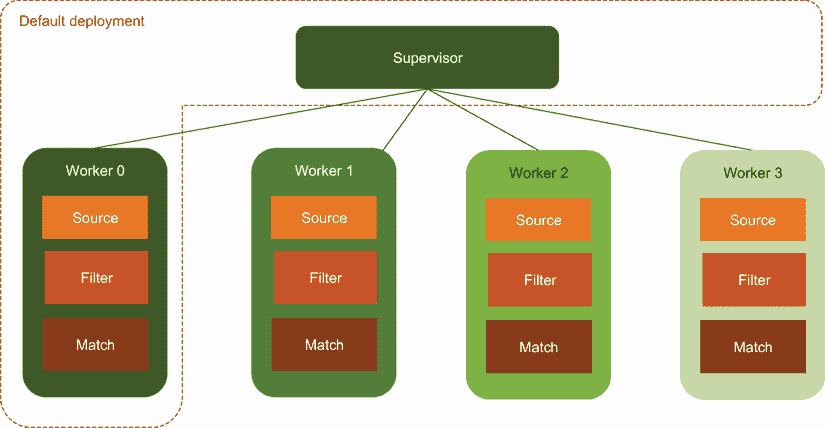
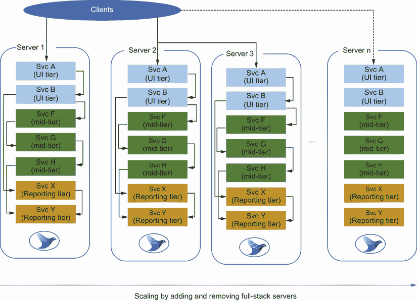
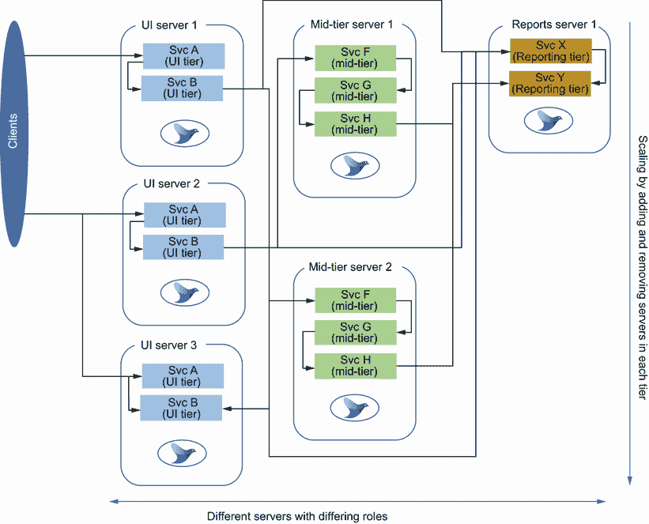
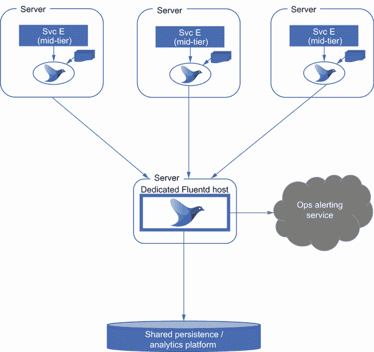
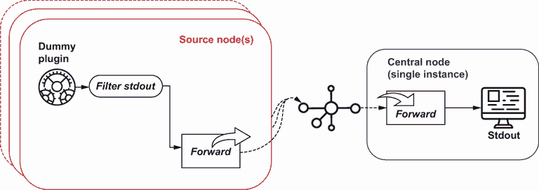
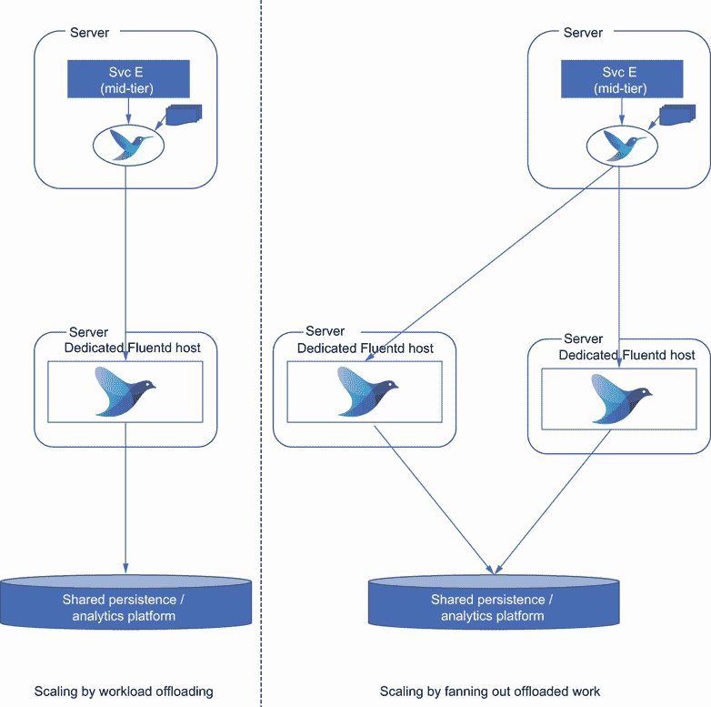
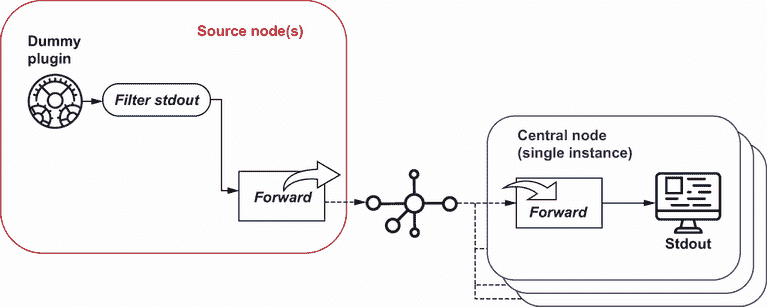
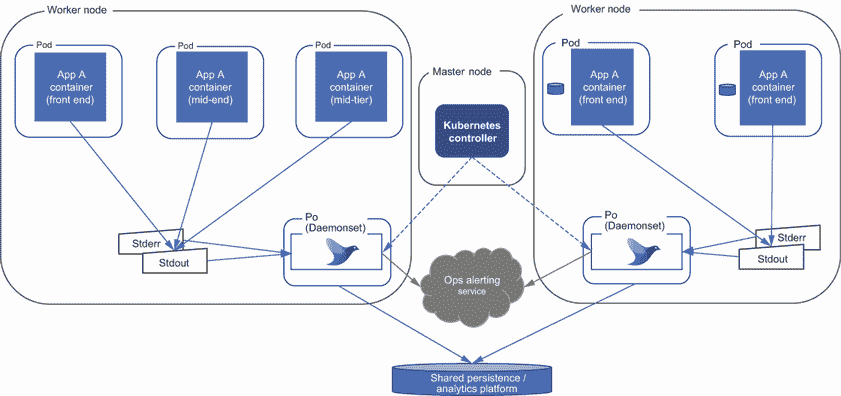
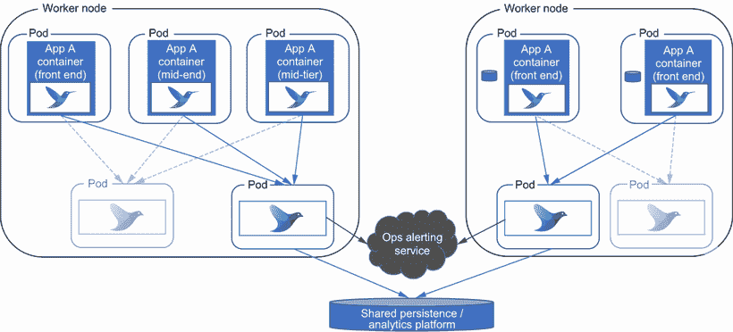
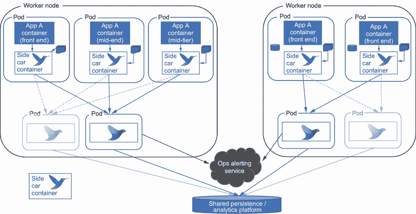

# 7 性能和扩展

本章涵盖

+   使用工作进程调整 Fluentd 以最大化资源

+   使用扇入和扇出模式部署 Fluentd

+   使用部署模式进行扩展

+   实施高可用性和部署

+   使用微服务模式与 Fluentd 结合

在前面的章节中，我们只使用了一个 Fluentd 实例。然而，我们生活在一个分布式、虚拟化和容器化的世界中，通常需要不止一个实例。除了分布式的考虑之外，我们还需要通过扩展（向服务器添加更多 CPU 或内存以支持更多进程和线程）和扩展（通过负载均衡部署额外的服务器实例以实现工作负载的分布）来支持弹性，以满足波动的需求（以及反向的缩放和缩减）。企业需要弹性来处理故障和灾难场景。为了提供良好的可用性，我们至少应该部署一个活动服务器和一个备用服务器，两个服务器都使用保持同步的配置文件。配置同步使得在第一个实例失败时能够迅速启动备用服务器（主动-被动）。在更严格的情况下，需要使用活动-活动部署，服务器分布在多个数据中心；这作为一种部署模式是非常常见的。在企业空间中，单服务器解决方案是非常罕见的。

本章将探讨可用的技术和功能，让我们可以使用工作进程和资源管理来扩展 Fluentd，并使用多个 Fluentd 节点进行扩展。通过扩展，我们还可以考虑增加弹性选项。由于 Fluentd 只需要很小的占用空间，我们可以在我们的桌面上实现一些技术和功能来扩展 Fluentd。

## 7.1 使用工作进程进行线程和进程的扩展

我们可以扩展 Fluentd 部署的一种方式是利用其生成额外子进程（工作进程）的能力，以利用现代机器具有多个可用于运行并发进程的 CPU 核心的事实。在配置任何扩展之前，了解 Fluentd 如何受其 Ruby 实现的影响以及 Ruby 如何处理线程至关重要。Ruby 有一个*全局解释器锁*（GIL），这意味着当一个进程不是 I/O 绑定时，它将阻塞其他任务（有关 GIL 和 Ruby 线程的更多详细信息，请参阅附录 E）。因此，任何计算密集型任务最好在单独的操作系统进程中执行，并使用操作系统来提供更有效的资源共享。一些插件会为你做这件事（例如，在使用 gzip 压缩时使用的 AWS S3 插件），但并非所有插件都这样做，因此我们必须非常注意这一点以进行性能优化。如果没有这种分离，Fluentd 进程将实际上被锁定，直到进程完成或释放线程。通常，Fluentd 作为路由日志事件的工具更有可能受到 I/O 绑定的影响——无论这种 I/O 是基于网络的还是最终是存储（即使是通过某种类型的数据库的物理存储间接地）。

Fluentd 通过启动称为*工作进程*的独立进程来解决线程锁定限制。默认情况下，Fluentd 有一个工作进程和一个控制器进程，但我们可以配置工作进程的数量。这实际上利用了操作系统通常将进程分配给 CPU 并在进程之间进行交换以给予它们 CPU 计算能力的公平比例的事实。如图 7.1 所示，每个工作进程将根据配置执行`source`、`filter`和`match`指令。

注意：当进程数量多于 CPU 核心数时，处理器将在进程之间进行交换。进程越多，交换就越多。交换活动需要付出少量的努力。如果你有太多的运行进程，你将花费更多的时间在进程交换上，而不是进行任何有意义的工作。



图 7.1 默认部署以及如何管理新工作进程

### 7.1.1 观察工作进程的实际操作

理解工作进程的行为的最佳方式是配置一个示例并观察实际发生了什么。展示工作进程最直接的方法是创建一个 Hello World 配置的变体。我们将建立多个工作进程，并将 dummy 源插件的应用分配给这些工作进程。使用 dummy 源插件意味着源没有影响行为的 I/O 依赖。相关的`match`指令然后将输出推送到 stdout。通过使用过滤器，我们可以将涉及该过程的哪个工作进程注入到日志事件中，这基于我们在上一章中学到的内容。

让我们定义我们将使用多少个工作进程，并将其添加到系统指令中，与我们已经设置的 `log_level` 属性并列。这是通过在 *system* 指令中设置 `workers` 属性来完成的。

为了明确定义每个工作进程的功能，我们将指令包裹在 `<worker x>` 指令中，其中 `x` 代表将执行指令的数字工作进程 ID。例如，`<worker 2>` 将使用第三个工作进程（ID 从 0 开始）。如果我们想有效地将更多资源（即工作进程）分配给特定的指令集，我们可以在指令中指定工作进程的范围。例如，`<worker 1-3>` 将将工作进程 1、2 和 3 分配以执行相同的活动。所有未分配指令的工作进程都将得到处理。因此，在我们的配置中，工作进程 0 将仅处理这些指令。

在列表 7.1 中，我们定义了四个工作进程，并且故意将后续指令留在了工作进程配置之外。结果是每个工作进程都会获取配置。这意味着我们可以共享一个公共输出——但是这需要小心处理，因为它可能产生不希望的结果。这些副作用可能包括丢失事件到存储损坏，例如多个进程尝试写入同一文件的问题。在我们的例子中，我们只是应用一个过滤器来提取`worker_id`，将其添加到日志事件中，并将其发送到`stdout`（控制台）。

列表 7.1 Chapter7/Fluentd/dummy-stdout-multiworker.conf—展示工作进程

```
<system>
  log_level info
  workers 4                                           ❶
</system>

<worker 0>                                            ❷
  <source>
    @type dummy
    tag w0
    auto_increment_key counter
    dummy {"hello":"from worker 0"}
  </source>
</worker>

<worker 1-2>                                          ❸
  <source>
    @type dummy
    tag w1
    auto_increment_key counter
    dummy {"hello":"from worker 1-2"}
  </source>
</worker>

<worker 3>
  <source>
    @type dummy
    tag w2
    auto_increment_key counter
    dummy {"hello":"from worker 3"}
  </source>
</worker>

<source>                                              ❹
  @type dummy
  tag w-any
  auto_increment_key counter
  dummy {"hello":"from workerless"}
</source>

<filter *>
  @type record_transformer
  enable_ruby
  <record>
    worker_id ${ENV['SERVERENGINE_WORKER_ID']}        ❺
  </record>
</filter>

<match *>
  @type stdout
</match>
```

❶ 声明工作进程的数量

❷ 特定于工作进程 0 的活动

❸ 定义两个工作进程的活动

❹ 定义工作进程之外的外部源——我们应该看到所有工作进程都会获取这个源。

❺ 使用过滤器添加涉及该日志事件的 worker ID

可以使用以下命令启动此配置

```
fluentd -c Chapter7/Fluentd/dummy-stdout-multiworker.conf
```

在检查 stdout 控制台之前，了解进程方面的情况是值得的。在 Windows 的命令控制台或 Linux 的 shell 中，应运行以下适当的命令：

```
Windows: tasklist /fi "IMAGENAME eq Ruby.exe"
Linux: ps -ef | grep ruby
```

这些命令将显示 Ruby 进程，其中包括 Fluentd 进程。因此，如果 Fluentd 是唯一运行的 Ruby 解决方案，你应该看到列出了五个进程。如果有其他 Ruby 解决方案正在运行，我们可以区分它们，因为 Fluentd 进程将具有相同或几乎相同的启动时间。这些进程由四个工作进程和一个控制器进程组成。

TIP 我们可以通过在 `<system>` 配置中使用 `process_name` 属性（例如，`process_name Fluentd`）来使进程更容易识别。

当 Fluentd 进程运行了一段时间后，我们可能想要关闭它们。现在这要复杂一些，因为我们有多个进程。对于 Windows，可以使用命令行 `taskkill /IM Ruby.exe /F` 来完成，Linux 的等效命令是 `pkill -f ruby`，前提是你没有运行其他 Ruby 进程。如果你有其他 Ruby 进程在运行，你必须隔离这些进程并手动逐个关闭它们。

通过查看使用 `dummy -stdout-multiworker.conf` 配置文件运行 Fluentd 的 stdout 结果，你应该能够看到以下情况发生（但请注意存在一定程度上的任意行为）：

+   带有标签 `w-any` 的日志事件将出现在任意的 `worker_id` 条目中。

+   与标签 `w0` 链接的日志（包括 `"hello":"from worker 0"`）将仅链接到 `"worker_id":"0"`。

+   与标签 `w1` 链接的日志（包括 `"hello":"from worker 1-2"`）将仅链接到 `"worker_id":"1"` 或 `"worker_id":"2"`。

### 7.1.2 工作进程限制

当使用工作进程时，需要考虑一些限制条件。这涉及到进程如何共享（或不能共享）资源，例如文件句柄。因此，如果你将多个工作进程分配给一个写入文件输出的 Fluentd 配置，文件需要被分开，因为只有一个工作进程可以正确地使用一个文件。我们可以通过设置文件路径包含 `worker_id` 来解决这个问题；例如，`path "logs/#{worker_id}/${tag}/%Y/%m/%d/logfile.out"`。

当插件使用 *server* 辅助插件或插件能够原生地处理端口的共享时，可以在工作进程之间共享端口。*forward* 插件是原生端口管理的例子。由于每个进程不能使用相同的端口，需要一个可靠的机制来克服这一点并选择合适的端口。当使用服务器辅助插件时，它将为每个工作进程分配连续的端口。因此，如果我们指定了使用四个工作进程，并定义了使用端口设置为 30000 的 *monitor_agent* 插件，那么工作进程 0 使用端口 30000，工作进程 1 使用 30001，工作进程 2 使用 30002，依此类推。如果你正在使用工作进程，请确保使用的端口是分开的。分离端口将避免潜在的端口冲突，因为算法会在多个工作进程的不同插件实例之间分配相同的端口。例如，指定端口 30000 然后 30002 给不同的插件，然后引入四个工作进程，将看到端口 30002 和 30003 试图被两个不同的插件使用。

### 7.1.3 控制输出插件线程

输出插件的线程行为可以通过使用名为 `num_threads` 的属性来控制。此值默认为 1。增加线程数可能会潜在地提高性能，因为它允许在某个线程被阻塞时在线程之间进行上下文切换。因此，任何进程中的延迟都可以更有效地被利用。但这也无法克服全局解释锁（GIL）的限制。

你可以考虑为输出插件使用此类配置，其中配置将工作负载分配到几个不同的目的地，因为一个线程工作直到结束或因 I/O 而必须停止。然后下一个线程，非 I/O 绑定，将被允许工作。这意味着我们获得了性能——而不是等待 I/O 释放和执行继续，我们交换正在执行的线程到可以进行工作的位置。

调整线程的使用是困难的，因为你必须知道进程的性能才能识别线程等待 I/O 等事物的潜力。由于线程切换的开销，存在一个点，等待 I/O 比交换线程更有效。这也可以通过操作系统级别的进程切换潜在水平而加剧。正确调整线程通常取决于运行现实的工作负载并测量性能，然后比较具有不同线程配置的测试运行，以查看性能实际上开始下降的地方。

### 7.1.4 内存管理优化

另一个可以调整的区域是 Ruby VM 层。这意味着调整垃圾收集和内存块分配。要在这一级别进行调整，你需要对 Ruby 实现的具体细节有很好的理解，以及帮助您分析配置如何影响性能的工具。在附录 E 中，我们提供了有助于 Ruby 的资源。

## 7.2 扩展和移动工作负载

第四章探讨了输出插件与缓冲区一起工作的能力，这将为我们提供一种优化每个 I/O 活动性能的手段，尤其是与内存缓冲区相关。除了缓冲区和线程及工作者的调整之外，扩展选项是关于工作负载分配。这可以通过以下方式实现

+   将日志事件馈送到像 Kafka 这样的事件流技术。

+   使用 Redis 或 Memcached 等工具进行大规模缓存。

+   利用 Fluentd 将日志事件传递到其他 Fluentd 节点的能力。这种能力提供了将工作负载移动到专用 Fluentd 节点的机会，要么是如果工作负载需要大量的额外计算能力而向外扩展，要么更可能是向内扩展，将来自许多较小节点的大量日志事件汇总到一两个 Fluentd 实例。

在以下章节中，我们将探讨输入/输出（有时称为*集中器*或*聚合网络*）和输出部署，因为它们使用相同的核心插件集实现。

Fluentd 的计算足迹非常小，我们可以运行一些配置来展示在单台机器上的设置。

### 7.2.1 输入/输出聚合和合并

部署多个 Fluentd 和 Fluent Bit 节点的最可能场景是支持集中器网络（扇入），尤其是在容器化环境中。此模型描述了两个或多个 Fluentd 节点收集日志事件并将事件传递给中央 Fluentd/Fluent Bit 实例。例如，正如我们将在本节后面看到的那样，日志事件可能起源于扇入“脊柱”末端的 Fluentd 节点。根据需要过滤日志事件，然后事件沿着脊柱流向扇子的中心——因此得名*扇入*或*集中器*。

让我们首先从更通用的形式开始，即与传统的虚拟化或原生硬件环境相关的日志聚合，这也可以在容器化部署中工作。然后我们将看到这与容器如何变化。

与应用程序架构和部署相关的扇入关系

处理高流量和/或需要高弹性级别的环境将看到应用程序软件分布在多个服务器上。我们可以配置服务器，使单个 Fluentd 实例可以看到每个服务器的日志文件，或者在每个服务器上部署 Fluentd（或 Fluent Bit）实例。打开服务器以便从其他服务器访问文件系统的一部分会带来安全挑战。每个服务器拥有 Fluentd 节点是一个更稳健且更安全的采用模式。更好的安全性来自于数据从 Fluentd 流向它所知道的位置，并且日志事件确定可以共享。这如图 7.2 所示。



图 7.2 展示了使用全栈模型进行扩展的情况，其中每个服务器都部署了所有功能。因此，调用序列更有可能保持在服务器内部。

扩展可以通过以下方式实现：

+   每个服务器都持有完整的解决方案栈（表示层、中间层，有时甚至包括后端存储）。

    当这种情况发生时，你可能会在单个服务器的日志中从端到端跟踪单个请求和响应。但是，将单个客户端的多个请求响应链接到同一后端（称为*服务器亲和性*）可能会使工作负载偏向特定服务器。这可能会影响动态扩展的有效性，因为新节点（s）仅承担新客户端。

+   将解决方案划分为逻辑部分并将部分分配给一个或多个特定服务器。我们经常将此称为具有服务器专门运行某一层的 N 层模型，例如，运行表示层的层；部署业务逻辑层的其他服务器；以及用于持久化层的其他服务器等。我们可以在图 7.3 中看到 N 层或三层部署。每种不同颜色的垂直部分代表一个层——左侧的 UI 或表示层，中间的中层（通常在三层时为业务层），以及在这种情况下，右侧的报告层。用户会话的服务器亲和力可能不太成问题，因此同一服务器可能看到同一用户会话的片段。

    

    图 7.3 在这种情况下，服务根据共同目的进行分组，以更有效地进行扩展。然而，在调用之后，端到端变得更加复杂。

    最终，从端到端跟踪用户会话的活动将需要我们将所有日志汇总在一起以查看完整情况。有时，只有在所有日志达到分析平台并定期处理之后，才会处理完整情况。这没问题，但我们已经强调，我们可能希望快速反应或主动触发日志事件处理中的操作。通过一个集中节点传递日志提供了几个好处：

    +   专门用于处理工作负载的节点允许为该工作调整资源。

    +   当配置变得复杂时，如果逻辑更加集中，则更容易，因为部署改进和细化涉及更少的部署——即使有自动化，通常节点越少越好。

    +   与需要凭证和访问凭证存储库（如 Vault）的大量节点相比，我们仅将此类细节的访问权限限制在更小的服务器集。因此，这些细节被滥用的可能性更小。如果存储凭证（或在使用相互传输层安全性 [TLS] 时使用证书）的方式不如 Vault 复杂，这一点至关重要。

    +   如果控制数据来源的数量，可以更容易地证明安全性。这尤其适用于日志的最终目的地位于网络之外的情况，因为这意味着需要出站访问的服务器数量受到限制。它还使得在涉及出站代理服务器时更容易处理。

图 7.4 阐述了如何使用具有相对较小占用空间的 Fluentd 节点的应用服务器部署此类配置。最外层（顶部）的 Fluentd 实例在将日志事件（可能过滤掉一些低价值/不需要的日志事件）传递给内部节点之前捕获日志事件（内部节点显示在底部），该内部节点由多个 Fluentd 节点提供数据。



图 7.4 一个示例集中器网络部署，多个 Fluentd 实例向专用服务器上的中心 Fluentd 实例提供数据，该服务器执行大部分工作

通常，人们会用一个位于中间的单个服务器来展示扇入配置；然而，这可能是服务器集群，尤其是在考虑超大规模环境时。这个模型作为扇入的特点是日志事件源的数量远大于中心执行核心日志事件处理的数量。

扇入 Fluentd 配置

让我们逐步了解这种集中器网络配置的设置。我们需要两个 Fluentd 配置文件，其中一个将用于作为输出使用`forward`插件表示的任意数量的源服务器。第二个配置使用`forward`作为输入以处理并将流量导向最终目的地。为了简化，我们将使用虚拟源插件而不是运行模拟器。为了使源节点易于识别，我们需要在日志事件中包含某些内容。通常我们可以使用节点主机名来做这件事，但由于我们是在单个机器上运行所有内容，这并没有帮助我们。另一种方法是检索环境变量并将其用作标签名称。只要环境变量的作用域限制在启动 Fluentd 实例所使用的 shell 的作用域内，这就会起作用。图 7.5 更详细地说明了配置。



图 7.5 多个运行相同配置的 Fluentd 节点如何向单个实例提供详细视图

为了将环境变量放入有效载荷中，我们在源中添加了一个过滤器，该过滤器获取标签值，并使用 Ruby 命令`"#{ENV["NodeName"]}"`设置；这检索了`NodeName`的值。

列表 7.2 Chapter7/Fluentd/dummy-foward1.conf—展示前向输出

```
<system>
  log_level info
</system>

<source>
  @type dummy
  tag "#{ENV["NodeName"]}"       ❶

  auto_increment_key counter
  dummy {"hello":"world"}
</source>

<filter *>
  @type stdout
  <inject>                       ❷
    tag_key fluentd_tag
  </inject>
</filter>

<match *>
    @type forward                ❸
    buffer_type memory
    flush_interval 2s            ❹

    <server>                     ❺
      host 127.0.0.1
      port 28080
    </server> 

  <secondary>                    ❻

    @type stdout
  </secondary>
</match>
```

❶ 在这里，我们正在获取环境变量以使每个实例独特。

❷ 将标签放入日志事件记录中

❸ 声明前向插件输出

❹ 在发送之前缓冲事件；为了方便，我们限制了这个时间。在现实世界中，你可能考虑一个更长的持续时间。

❺ 定义目标服务器以将日志事件定向到

❻ 如果我们无法与中心 Fluentd 实例通信，我们需要将日志事件发送到其他地方。在这个配置中，如果无法处理，我们只是将事件发送到控制台。你可能希望在生产场景中做更稳健的事情，比如将事件写入文件。

在启动 Fluentd 之前，用于运行 Fluentd 的 shell 需要`set`或`export`（Windows 或 Linux）`NodeName=Node1`。每个源节点都有一个新的编号。然后我们可以使用以下命令启动 Fluentd：

```
fluentd -c Chapter7/Fluentd/dummy-forward1.conf
```

重复启动 shell、设置环境变量和启动源 Fluentd 节点的步骤，以获得第二个生成日志事件并发送到中央 Fluentd 节点的 Fluentd 节点。

注意：如果环境变量未设置，并且 Fluentd 正在显示其配置（在 info 日志级别），您可以查看值是否已正确插入。如果值不存在，根据属性，您最多会观察到启动错误；最坏的情况下，系统将启动但似乎没有任何动作。这源于默认值可能被定义并被采用。例如，`port`属性将是`0`。

我们已经使用过滤器确保标签被捕获到日志事件中。此外，我们还可以利用`stdout`插件，以便发送者的控制台会显示我们应该在中央节点接收到的日志事件。理想情况下，我们需要运行几个 shell 并相应地设置环境变量。根据中央（消费）节点启动所需的时间，源节点将报告周期性网络错误，因为没有对网络调用的响应。

这将我们引向消费配置，它只是接受转发的事件并将它们推送到控制台。我们之前已经看到很多这样的内容，尽管`forward`插件的使用是新的。为了使 Fluentd 接收事件，我们需要定义一个 Fluentd 源，它绑定到网络地址和端口。这显然需要与发送者的配置相匹配。我们可以在以下列表中看到所有这些内容。

列表 7.3 第七章/Fluentd/forward-stdout.conf—说明将转发作为源

```
<system>
  log_level info
</system>

<source>             ❶
  @type forward
  port 28080         ❷

  bind 127.0.0.1
</source>

<match *>            ❸
  @type stdout
</match>
```

❶ 定义了输入转发插件的使用

❷ 绑定的网络地址（DNS 或 IP）—在我们的情况下是 localhost。这需要与发送者匹配。

❸ 显示在控制台上已发送的日志事件

定义了消费 Fluentd 节点后，我们可以启动单个实例（对于更常见的集中器网络）。一旦所有 Fluentd 节点开始通信，我们将在该节点的控制台中看到所有日志事件。因此，让我们使用以下命令启动消费者节点

```
fluentd -c Chapter7/Fluentd/forward-stdout.conf
```

当您查看现在生成的控制台输出时，应该看到包含在控制台输出中的节点名称会有所不同。这种变化反映了日志事件来自两个不同的 Fluentd 节点，因为我们已在配置中使标签值动态化。

注意：msgpack 插件的应用将有助于减少网络流量，因为可以将格式化器设置为 msgpack 用于转发插件。接收转发插件可以识别 msgpack 格式的事件并自动解包它们。因此，Fluentd 到 Fluentd 的流量传输非常高效。

### 7.2.2 扇出和工作负载分配

我们可以看到，通过将与应用工作负载位于同一节点的任务卸载到一个或多个专用 Fluentd 服务器上，我们可以如何增加可供 Fluentd 进程使用的计算工作量，如图 7.6 所示。如果我们只是卸载工作，那么使用 Fluent Bit 作为应用协同日志收集器可能是有意义的。Fluent Bit 更小，如果它能收集日志事件（记住 Fluent Bit 在插件选项上更为受限），它就可以轻松地转发到 Fluentd。然后我们使用下游的 Fluentd 来处理日志事件。回顾第一章以了解 Fluent Bit 与 Fluentd 的不同之处。



![图 7.6 工作分布的部署选项允许将更多计算能力分配给 Fluentd 处理日志事件，而不会影响原始应用程序，因为我们可以将日志事件路由到更多具有专用 Fluentd 容量的服务器]

扇出模式的运用并不常见，至少在我们经验中是这样。如果你发现自己正在使用不寻常的配置，那么审查情况以确保没有更大的问题是很值得的。例如，限制默认资源分配迫使需要扇出，但放宽或移除限制可以消除一些分布复杂性。

扇出配置的 Fluentd

在扇出和高可用性部署中，我们需要有能力将工作负载发送到可能多个节点。在高可用性的上下文中，发送流量到不同的节点将由通信丢失触发，而在扇出中，连接性是由工作负载共享驱动的。让我们检查这两个要求，因为它们在配置上存在一些共性。如图 7.7 所示，这次我们将只部署一个带有虚拟源生成器的节点，但将日志事件路由到多个消费者节点，这些节点将输出到控制台。



![图 7.7 Fluentd 扇出示例配置，一个节点将日志事件传递给多个节点进行处理]

与之前源节点配置的关键区别在于，`forward` 插件的配置现在需要指定多个服务器。在高可用性中，哪个节点应被视为主节点，哪个节点应作为备用节点必须得到解决。对于扇出，我们可能希望权衡一个节点相对于另一个节点的工作负载。所有这些都可以通过属性在配置中完成。对于多个服务器，如图 7.4 所示，我们可以简单地声明多个连续的服务器辅助插件 `<server>` 的属性块。由于这是一个基本的扇出，我们已添加一个 `weight` 属性来建立服务器之间工作负载的比例。在我们的例子中，这个比例是 10:1。如果未指定，则所有节点将应用相同的权重。

列表 7.4 Chapter7/Fluentd/dummy-forward2.conf—展示向多个服务器转发

```
<source>
  @type dummy
  tag dummy-fanout-source
  auto_increment_key counter
  dummy {"hello":"world"}
</source>

<filter *>
  @type stdout
  <inject>
    tag_key fluentd_tag
  </inject>
</filter>

<match *>
    @type forward
    buffer_type memory
    flush_interval 2s  
    <server>               ❶

      host 127.0.0.1
      port 28080
      weight 10            ❷

    </server> 
    <server>  
      host 127.0.0.1
      port 38080           ❸
      weight 1             ❹
    </server> 

  <secondary>
    @type stdout
  </secondary>
</match>
```

❶ 首个服务器定义及其不同的端口，这样我们就可以在同一主机上运行

❷ 定义权重，这将优先选择第一个服务器配置。如果未设置，此值默认为 60。

❸ 定义备用端口

❹ 权重设置为将流量从该服务器偏移

由于我们将在同一台机器上运行所有内容，因此形成扇出侧的 Fluentd 实例需要配置为在不同的网络端口上运行，以避免冲突。类似生产环境的 Fluentd 实例配置为在单独的服务器上运行，但使用相同的网络端口。利用我们在 7.2 列表中看到的命名技巧，我们可以使值配置驱动，避免需要具有不同值的多个配置文件。因此，每个节点都需要一个名为`NodePort`的环境变量，定义节点配置源侧使用的端口之一，如下所示。

列表 7.5 第七章/Fluentd/forward-stdout2.conf

```
<source>
  @type forward
  port "#{ENV["NodePort"]}"       ❶
  bind 127.0.0.1
</source>

<match *>
  @type stdout
</match>
```

❶ 动态设置端口号允许我们运行相同的配置两次。

让我们看看这种节点配置会发生什么。使用命令启动源节点。

```
fluentd -c Chapter7/Fluentd/dummy-forward2.conf
```

然后，我们需要为 Windows 配置一个带有命令`set NodePort=28080`的 shell，或者在基于 Linux 的环境中配置`export NodePort=28080`。一旦设置完成，我们就可以使用命令启动 Fluentd 实例。

```
fluentd -c Chapter7/Fluentd/forward-stdout2.conf
```

我们然后再次重复这些步骤，在设置/导出步骤中将`28080`替换为`38080`。

一切运行起来后，日志事件应该出现在运行`dummy-forward2.conf`配置的 Fluentd 实例的控制台上。设置比例后，我们应该看到日志大量偏向运行在端口 28080 上的节点。但是，如果你计算一个控制台到另一个控制台的更新数量，你不能保证看到使用 38080 端口的每个输出和另一个使用 10 个，因为比例是在我们想要发送输出时计算的。计算的结果将决定比例哪一侧。

轮询插件

另一种分配工作负载的方法是利用*轮询*插件。这是一个核心 Fluentd 输出插件，与`store`辅助插件一起工作。以下列表展示了这一点，其中`roundrobin`将输出轮询到每个单独识别的服务器。由于这是扇出实现，每个`store`块将使用一个`forward`插件，但这不是强制性的。

列表 7.6 第七章/Fluentd/dummy-forward3.conf—展示轮询的使用

```
<source>
  @type dummy
  tag dummy-fanout-source
  auto_increment_key counter
  dummy {"hello":"world"}
</source>

<filter *>
  @type stdout
  <inject>
    tag_key fluentd_tag_roundrobin
  </inject>
</filter>

<match *>
    @type roundrobin          ❶

    <store>                   ❷

      @type forward
      buffer_type memory
      flush_interval 1s 
      <server>                ❸
        host 127.0.0.1
        port 28080
      </server> 
    </store>
    <store>
      @type forward
      buffer_type memory
      flush_interval 1s       
      <server>
        host 127.0.0.1
        port 38080            ❹
      </server>
    </store>

  <secondary>
    @type stdout
  </secondary>
</match>
```

❶ 要获得轮询行为，我们需要将其用作输出插件。然后，它将依次使用每个存储辅助插件，就像复制插件使用所有存储辅助插件一样。

❷ 声明存储配置，但由于我们希望轮询平均使用每个目标，存储的配置只能有一个服务器。

❸ 目标服务器的定义

❹ 配置为使用不同端口的第二个服务器

让我们看看`roundrobin`与权重的行为对比。我们需要像之前一样启动；如果两个扇出节点的控制台没有为`NodePort`设置变量，我们需要重新建立设置。然后我们使用以下命令启动事件源 Fluentd 实例：

```
fluentd -c Chapter7/Fluentd/dummy-forward3.conf
```

然后使用相同的命令启动两个扇出节点实例：

```
fluentd -c Chapter7/Fluentd/forward-stdout2.conf
```

这次输出将始终一致地发送到备用控制台输出，因为`roundrobin`故意确保分配始终均匀。也可以应用`weight`属性，但这会破坏`roundrobin`的行为。

### 7.2.3 高可用性

高可用性配置与扇出配置并没有太大的区别。我们不是使用`weight`属性来分配工作负载，而是使用`standby`属性，并将一个节点设置为 true，另一个节点设置为 false。这里可以看到一个匹配插件服务器部分的示例：

```
    <server>
      name myserver1
      host 127.0.0.1
      port 28080
      standby false 
    </server> 
    <server>  
      name myserver2
      host 127.0.0.1
      port 38080
      standby true 
    </server> 
```

如片段所示，我们定义了两个服务器；例如，使用转发输出插件将是两个 Fluentd 实例，将日志事件发送到。当具有此配置的 Fluentd 实例启动时，它将尝试使用名为`myserver1`的服务器发送日志事件，因为它被标记为不是备用服务器。然而，如果此 Fluentd 实例与`myserver1`出现通信问题，它将把日志事件发送到名为`myserver2`的备用服务器。

在这个片段中，我们使用了`name`属性。通常，名称仅用于 Fluentd 日志记录和证书验证。但如您所见，使用`name`属性也可以帮助您确定哪个服务器是哪个，尤其是在使用 IP 地址而不是有意义的 DNS 名称时。

### 7.2.4 将高可用性比较付诸实践

您的客户想了解高可用性配置在设置和行为上的差异。您的团队已同意将配置文件`Chapter7/Fluentd/dummy-forward2.conf`和`Chapter7/Fluentd/forward-stdout2.conf`重构，以提供比较。

一旦配置被重构，运行这两个配置并关闭`Chapter7/Fluentd/forward-stdout2.conf`的单个实例。注意结果行为，以向客户展示差异。

答案

基于配置文件`Chapter7/Fluentd/dummy-forward2.conf`和`Chapter7/Fluentd/forward-stdout2.conf`的高可用性配置示例可以在`Chapter7/ExerciseResults/dummy-forward2-Answer.conf`和`Chapter7/ExerciseResults/forward-stdout2-Answer.conf`中找到。

配置中唯一重要的更改是移除`weight`属性，并在相关服务器配置中引入设置为`true`或`false`的`standby`属性。差异可以在节点启动后立即观察到（最好使用端口 38080 启动`dummy-forward2-Answer.conf`节点，这样它不会立即认为主目标节点已关闭并切换到备用）。控制台输出将只出现在监听端口 28080 的节点上。然而，当此节点关闭时，日志事件将传递到在端口 38080 上工作的 Fluentd 实例。

## 7.3 容器、本地和虚拟环境中的 Fluentd 扩展

到目前为止，我们已经探讨了如何从纯 Fluentd 节点到节点的角度扩展 Fluentd。在大多数你工作在虚拟化或本地硬件环境的情况下，你可以使用 Fluentd 或 Fluent Bit 实例部署的配置。这些部署可以描述为 Fluentd 与应用程序一起运行在虚拟机或服务器上。每个节点都在捕获应用程序日志事件以及来自宿主操作系统的日志事件。因此，扩展虚拟机或本地服务器将驱动 Fluentd 的扩展。

对于 Kubernetes 等容器化环境，我们有更多的选项和考虑因素，因为容器通常更细粒度（因此，需要一个完整的解决方案需要更多的容器）。我们有一个额外的抽象层，即 pods，编排要复杂得多。虽然我们将专注于 Kubernetes，但原则对于 OpenShift 和其他相关产品并没有很大不同。

### 7.3.1 Kubernetes 工作节点配置

不仅你的应用程序需要记录内容，编排层，如 Kubernetes、Apache Mesos、Docker Swarm 等（包括容器引擎本身）也需要。因此，Kubernetes 引擎在每个工作节点上创建了特殊的服务，它使用这些服务。部署将看起来如图 7.8 所示。所有单个容器中的日志事件都必须指向 stdout，以便此部署能够工作。



图 7.8 Fluentd 作为守护进程服务在 Kubernetes 环境中的部署示意图。Fluentd 收集所有 Pod 的 stdout 和 stderr 输出。

### 7.3.2 集群配置

每个集群模型看起来很像工作节点配置，但结构更严谨。这种结构是由于容器通过映射写入定义的位置，而不是简单地信任 stdout 和 stderr，并希望有人正在监听。这也使得对不同类型的日志进行分段并从中推断出一些意义变得更容易。现在容器只需要挂载集群范围内的文件系统，并将它们的日志写入文件，就像它们在本地运行时一样（将本地文件系统映射到共享存储是 Kubernetes 配置问题）。

当日志被写入文件系统时，带有 Fluentd 容器的 pod 只需使用 tail 插件（s）来捕获和处理日志文件。通过良好的目录和/或文件命名，我们可以定义关于日志文件格式的具体细节。了解日志文件来源可以确定特别重要的事情。这种做法在图 7.9 中得到了说明。


图 7.9 Kubernetes 集群共享日志捕获，其中 pod 将数据写入文件系统，然后 Fluentd pod 收集文件并进行处理

在图 7.9 中，我们提到了存储附加网络（SAN），这对于本地部署来说是非常理想的。它将提供磁盘冗余，并且通常情况下，存储会分配物理磁盘，从而提供高性能。在云环境中，您将使用块或文件存储样式来实现，并信任云提供商提供的质量服务和性能控制。

### 7.3.3 容器作为虚拟化

这反映了将现有环境作为现有环境并配置在容器中的简单想法，将具有自己操作系统的虚拟机转换为将操作系统工作委托给共享主机的容器。因此，逻辑部署可能看起来像图 7.10，其中每个容器托管应用程序和 Fluentd，或者更理想的是 Fluent Bit，如果它具有适当的适配器和更小的占用空间。



图 7.10 容器中的 Fluentd，正如您在虚拟化应用程序部署中所做的那样

### 7.3.4 边车模式

基于容器的技术，如 Kubernetes，有 pod 设计模式，如*边车* ([`mng.bz/nYNK`](http://mng.bz/nYNK))。边车模式的想法是在容器 pod 内部添加容器以提供支持服务；这可以包括提供安全性的代理层；这意味着将存在一个带有 Fluentd 或 Fluent Bit 的容器，以支持 pod 内的所有其他容器，如图 7.11 所示。这是最灵活的，对于 Fluentd 来说，配置也最容易，但需要容器和 pod 配置的更多复杂性。



图 7.11 使用此处所示的边车模式，使 Fluentd 对所有 pod 中的容器可用。

### 7.3.5 选项比较

在查看不同的部署模型后，我们应该花时间了解不同方法的优缺点。在表 7.1 中，我们提取了所描述的每个模式的优缺点，包括 Fluentd 和 Fluent Bit。

表 7.1 容器化环境中的 Fluentd 部署选项

| 方法 | 优点 | 缺点 |
| --- | --- | --- |
| Fluentd 作为工作节点的一部分 | 在部署方面最简单，因为它只涉及工作节点。无需更改 pod 或容器即可部署 Fluentd 的补丁。 | 将日志转换回更有意义的结构需要更多的工作。要为日志事件赋予意义需要一些上下文，例如理解应用程序或服务。缺点是应用程序上下文位于应用程序域（使用的服务）之外。Fluentd 补丁配置更改会影响整个工作节点。 |
| 应用容器中的 Fluentd | 将配置隔离到最小的组件。 | 更大的计算占用空间，运行大量 Fluentd 实例——这使得 Fluent Bit 成为一个更好的选择。 |
| 应用容器中的 Fluent Bit | 将配置隔离到最小的组件。比 Fluentd 占用更小的空间。 | 与其他模型相比，总计算工作量增加。但比 Fluentd 小。在可消费的输入类型方面存在限制，因为插件选项较少。Fluent Bit 在可用的插件方面不如 Fluentd 丰富，限制了在日志事件上执行的过程。 |
| Fluentd 作为边车 | 最小化 pod 内 Fluentd 实例的数量。服务意识与应用程序的 pod 相关联（例如，拦截特定的日志事件）。有可能使用通用的 Fluentd 容器并利用配置动态检索配置。 | 更复杂的 pod 配置。Fluentd 补丁过程更复杂，因为它会影响 pod。容器将比 Fluent Bit 变体稍大。 |
| Fluent Bit 作为边车 | 最小化 pod 内 Fluentd 实例的数量。服务意识与应用程序的 pod 定义相关联（例如，拦截特定的日志事件）。比 Fluentd 占用更小的空间。日志事件处理在应用程序上下文中进行。有可能使用通用的 Fluentd 容器并利用配置动态检索配置。 | 更复杂的 pod 配置。Fluentd 补丁过程更复杂，因为它会影响每个 pod。 |

## 7.4 保护 Fluentd 节点之间的流量

当在 Fluentd 节点之间通信时，你可能希望提供一定级别的安全性。使用未加密的网络流量可能导致凭证泄露，这不仅会影响 Fluentd 节点之间的身份验证，还会影响 Fluentd 与源或目标（如 Elasticsearch）之间的通信。我们已使获取凭证变得非常容易，当监听网络流量时。不仅凭证会泄露，而且传递的日志信息还会为攻击者提供了解决方案，了解你的解决方案可能如何工作，如果日志事件用于审计，则可能收集敏感数据等。使用 HTTPS 加密和 TLS（安全套接字层）的继任者可以缓解这些问题。

如果您的日志事件包含 PII 数据，则在传输和存储期间，应用程序和日志事件需要采取积极的安全配置。除了日志事件可能在云和数据中心之间通过不安全的网络（即互联网）进行通信的可能性之外，您还需要考虑所有这些因素。但安全性不应仅仅局限于采用 TLS，或者更好的是，相互 TLS（mTLS），正如我们很快将看到的。

设置 TLS 已不再是曾经那样令人畏惧的神秘技艺，部分原因可能是因为我们已经超越了在网络安全边缘终止 SSL/TLS 的想法，加密和解密的计算开销现在不再被视为如此繁重。但配置 SSL/TLS 仍然相当依赖于上下文，并且确实需要一些对 TLS 概念的基本理解（这是在其他书籍中深入探讨的主题，例如 Julien Vehent 的《Securing DevOps》，可在 [www.manning.com/books/securing-devops](https://www.manning.com/books/securing-devops) 购买）。因此，我们不会详细讨论适用于每个人的 TLS 配置过程，而是简要地看一下提供的支持。（附录 E 提供了各种资源的链接，可以帮助您自己应用 TLS。）随着当代安全方法采用“信任无一人”的立场，投入时间建立 TLS 安全性是值得的。

### 7.4.1 TLS 配置

当涉及到配置网络传输时，我们可以提供一系列传输配置。一些适配器直接利用辅助插件，因此有时会提供略微不同的属性名称。例如，`secure_forward` 在其配置的服务器部分使用 `tls_version`。相比之下，当直接使用传输助手时（这可以在源、过滤器和匹配指令中提供），该属性被称为 `version`。传输结构在配置中以 XML 标签表示，并包括一个指示传输类型（`udp`、`tcp`、`tls`）的元素。例如：

```
<transport tls>
     . . . 
</transport>
```

虽然我们一直专注于 TLS 以及抽象更多网络功能的插件，但我们也可以处理 TCP（传输控制协议）或 UDP（用户数据报协议）流量。然而，这些协议的使用需要更多的配置工作。

关于 TCP 和 UDP 的更多信息

关于如何使用这些协议的更多信息，以下资源将有所帮助：

+   [www.vpnmentor.com/blog/tcp-vs-udp/](https://www.vpnmentor.com/blog/tcp-vs-udp/)

+   [www.cs.dartmouth.edu/~campbell/cs60/socketprogramming.html](https://www.cs.dartmouth.edu/~campbell/cs60/socketprogramming.html)

+   [www.openssl.org/docs/](https://www.openssl.org/docs/)

TLS 版本和算法

可以通过 Fluentd 配置来控制可以支持的 TLS 版本。TLS 1.3（于 2018 年 8 月发布为 RFC 8446；[`tools.ietf.org/html/rfc8446`](https://tools.ietf.org/html/rfc8446)）是目前发布的最新标准版本。目前，Fluentd 默认使用的版本是 TLS 1.2，这反映了 TLS 1.2 是最广泛采用的。行业惯例建议使用可能的最新版本的 TLS（因为它是最安全的），并且仅在必要时适应较低版本。TLS 兼容性和加密选项可以通过`version`和`ciphers`属性来管理。

专门的前向插件用于 SSL/TLS

前向插件的安全版本适用于入站和出站操作，如前所述。这可以使用 gem 部署，就像所有插件一样。例如：

```
gem install fluent-plugin-secure-forward
```

此版本的插件仍然需要证书，但简化了配置并隐藏了传输层配置部分。

### 7.4.2 TLS 不仅仅是加密

使用 TLS 不仅仅是提供加密密钥，而且可以也应该验证为使用该证书的证书颁发机构（CA）提供的真实证书。通常，握手的一部分是客户端和服务器连接时。如果与证书颁发机构确认证书真实性的努力正在损害延迟，那么如果你完全处于一个受信任的网络环境中（例如，一个物理私有数据中心网络，但不是云托管网络），你可能考虑禁用检查。关闭此类检查与深度安全概念相违背，因此请考虑这可能会带来什么风险。如果你使用自签名证书，你需要走得更远，因为没有 CA 参与。需要额外的属性——`tls_insure_mode`和`tls_allow_self_signed_cert`——以防止 Fluentd 与 CA 检查证书。

### 7.4.3 证书和私钥存储

要使用证书，我们显然需要能够存储它和私钥。这些信息被定义为几个属性，包括适应 Windows 存储选项（更多信息，请参阅[`mng.bz/vo6M`](http://mng.bz/vo6M))。

无论证书存储在哪里，我们都需要通过`cert_path`（例如，`cert_path` `./myFluentd.crt`）告诉 Fluentd 证书的位置，以及私钥的位置，通过`private_key_path`（例如，`private_key_path` `./myFluentd.key`）。理想情况下，证书由公共或私有 CA 提供，可以联系以确认正在使用的证书的真实性。我们可以通过`client_cert_auth`属性（`true`或`false`）告诉 Fluentd 是否应该进行该验证。在自签名设置中，这必须是 false。

### 7.4.4 安全不仅仅是证书

确保通信安全不仅仅是应用 TLS。一些组织可能需要更多，例如传递用户名、密码和令牌。使用此类属性和令牌 ID 可以提供额外的保证。如果我们打算传递这样的敏感值，那么使用 TLS 应被视为强制性的。

## 7.5 凭证管理

我们面临挑战，Fluentd 配置文件没有在配置文件中加密和解密凭证的手段。因此，当 Fluentd 以明文形式启动时，用户名和密码需要出现在配置中。任何了解包含明文凭证的文件的系统管理员（sysadmin）都不会高兴，如果您与 IT 安全官员合作，他们将会更加关注。有一些策略可以限制这种风险；这些是我们看到或采用的策略。列表按照安全性的增强顺序排列：

1.  限制 Fluentd 文件的访问权限，使其非常严格。记住，这也意味着阻止或限制 Fluentd UI（如图 2 所示）的使用，以及 UI 的凭证。这种方法实际上是最基本的，如果涉及敏感数据如 PII，可能被认为不可接受。

    这可能需要设置和运行 Fluentd 或 Fluent Bit 的本地主机用户。这样的设置会带来一系列其他管理考虑因素。

1.  使用包含来分离核心配置和凭证。然后只需要将包含文件提交给严格的文件访问控制。这是一个改进，因为它允许您更自由地处理配置。但如果有很多凭证要处理，这可能会变得很麻烦，如果涉及 PII 数据，可能被认为不可接受。

1.  使用脚本包装 Fluentd 启动，在启动 Fluentd 之前，将凭证加载到 OS 会话中的环境变量中，然后启动 Fluentd。然后 Fluentd 配置将包含对环境变量的访问，正如我们之前所展示的。因此，配置文件在 Fluentd 解析文件之前没有敏感值。但我们可以将获取和解密环境变量的方法纳入脚本中。这允许您利用标准的 OS 安全功能。在容器化环境中，这可能会变得复杂，在多种 OS 类型的世界上，这意味着可能需要不同的配置。确实，不同的脚本将所需的凭证加载到内存中。

1.  另一个通常与更云原生方法相关联的组件，同样可以应用于传统部署环境，是使用 HashiCorp 的 Vault ([www.vaultproject.io](http://www.vaultproject.io))。Vault 提供了免费（开源）版本和带有额外功能的企业版（同步分布式密钥库）。然后我们可以将其嵌入到配置文件中，并使用 Vault CLI 或 API 调用 Vault 来检索所需的凭据。这解决了之前需要加载到操作系统环境中的问题。我们不会深入探讨如何将应用程序角色与 Vault 中可用的凭据对齐的详细具体信息，因为文档在 [www.vaultproject.io/docs/auth/approle](http://www.vaultproject.io/docs/auth/approle) 提供了出色的解释。

如果你在一个 Kubernetes 环境中工作，那么当然，你还有使用 Kubernetes 机密（更多关于此的信息在 [`mng.bz/4j4V`](http://mng.bz/4j4V)）的额外选项。Vault 有许多插件可以与其他原生凭据框架一起工作，例如 Kubernetes 的 Secrets、云供应商的凭据，或较旧的标准如 LDAP（轻量级目录访问协议）。

### 7.5.1 简单凭据使用案例

我们可以将用户名和密码凭据定义为 Fluentd 节点之间安全配置的一部分。这允许接收转发日志事件的 Fluentd 节点拥有更高的信任级别。

凭据显然与服务器相关联，因此在转发输出配置中，我们在 `server` 属性集中提供了 `username` 和 `password`。在下面的列表中，我们将 `dummy-forward.conf` 扩展以包含凭据。

列表 7.7 第七章/Fluentd/dummy-user-forward1.conf 使用用户凭据

```
<source>
  @type dummy
  tag "#{ENV["NodeName"]}"
  auto_increment_key counter
  dummy {"hello":"world"}
</source>

<filter *>
  @type stdout
  <inject>
    tag_key fluentd_tag
  </inject>
</filter>

<match *>
    @type forward
    buffer_type memory
    flush_interval 2s  
    compress gzip

    <security>                                    ❶

      shared_key hello
      self_hostname source_host
    </security>

    <server>
      host 127.0.0.1
      port 28080
      username hello-this-is-a-long-username      ❷
      password world-of-security-likes-long-passwords
    </server> 

  <secondary>
    @type stdout
  </secondary>
</match>
```

❶ 为了安全起见，必须提供一些必需的属性，包括逻辑名称和通用密钥。

❷ 提供用户凭据

基于 `forward-stdout.conf`，消费者端也需要相同的凭据来验证。在列表 7.8 中，我们展示了涉及的附加属性。消费者端将需要指定的用户名和密码，并在 `security` 结构中使用 `user_auth` 属性进行明确的指示。服务器逻辑名称应期望使用 `self_hostname` 属性定义转发日志事件，以及必需的安全属性 `shared_key`。

列表 7.8 第七章/Fluentd/forward-user-stdout.conf 使用凭据接收

```
<source>
  @type forward
  port 28080
  bind 127.0.0.1
  <security>                                    ❶
    user_auth true                              ❷
    self_hostname destination_host              ❸
    shared_key hello
    <user>                                      ❹
      username hello-this-is-a-long-username
      password world-of-security-likes-long-passwords
    </user> 
  </security>
</source>

<label @FLUENT_LOG>
  <match fluent.*>
    @type stdout
  </match>
</label>

<match *>
  @type stdout
</match>
```

❶ 启动安全配置

❷ 告知 Fluentd 我们必须应用用户身份验证

❸ 声明客户端如何识别此节点

❹ 声明预期到达的凭据

我们可以使用一个 shell 运行此配置：

```
fluentd -c Chapter7/Fluentd/forward-user-stdout.conf
```

此外，我们还需要运行另一个 Fluentd。在启动 Fluentd 之前，用于运行 Fluentd 的 shell 需要`set`或`export`（Windows 或 Linux）`NodeName =Node1`。每个源节点都有一个新的编号。然后我们可以启动 Fluentd：

```
fluentd -c Chapter7/Fluentd/dummy-user-forward1.conf
```

一切都应该像我们没有运行用户凭证时一样运行。然而，我们在消费者端验证凭证。停止客户端，更改密码，然后重新启动该 Fluentd 实例。现在这将因报告的密码问题而失败。

### 7.5.2 将证书投入实际应用

您的公司需要 Fluentd 部署跨越多个数据中心，以便安全团队能够在 WAN 上使用他们偏好的监控工具。您的首席安全官（CSO）对在节点间通信中应用了安全元素感到高兴。但他们不高兴的是凭证可能会以明文形式传输。CSO 批准了使用跨越公司网络的 Fluentd 节点，只要您能提供 SSL/TLS 配置来加密流量。数据中心没有直接互联网连接，无法从公共 CA 验证和直接分发证书。目前没有内部 CA，尽管未来有关于建立 CA 的讨论。基础设施团队表示，他们将为您分发自签名证书。因此，我们需要使用自签名证书来配置 Fluentd。为了证明基础设施团队能够满足证书要求并且他们理解需要什么，已经同意修改`dummy-user-forward1.conf`和`forward-user-stdout.conf`以包含使用自签名证书的过程，以证明这个过程。

答案

通过用虚拟文件替换证书或密钥文件来运行 Fluentd 节点，可以实现证明解决方案可行的过程。这应该会导致数据交换失败。

示例配置可以在配置文件`Chapter7/ExerciseResults/dummy-user-forward1-Answer.conf`和`Chapter7/ExerciseResults/forward-user-stdout1-Answer.conf`中找到。我们在 Fluentd 配置中引用了虚拟证书文件（如果使用，这将触发失败）。为了使其工作，您需要用适当的证书替换这些文件。由于证书包含详细信息并且有定义的有效期，您应该创建自己的证书并用您生成的证书替换虚拟文件。这是因为证书可以与身份相关联并且有定义的有效期。关于如何使用 OpenSSL（[www.openssl.org](https://www.openssl.org)）进行此操作的指南可以在 Justin Richer 和 Antonio Sanso 的《理解 API 安全》的 liveBook 版本中找到（Manning，2017）在[`mng.bz/QWvj`](http://mng.bz/QWvj)。

另一种方法是采用 Let’s Encrypt，它将提供一个自动化的机制来更新证书([`letsencrypt.org/`](https://letsencrypt.org/))。

在配置中，你会注意到我们选择从标准转发插件切换到安全转发插件，因此我们不需要显式设置传输层属性。我们还假设用于创建密钥和证书的密码短语是`your_secret`。要更改配置中保留的密码短语以与所使用的密码短语一致，你需要修改包含名为`ca_private_key_passphrase`属性的`forward-user-stdout1 -Answer.conf`，该属性需要正确的值。

要运行配置，我们需要使用以下命令启动 Fluentd 节点

```
fluentd -c Chapter7/ExerciseResults/forward-user-stdout1-Answer.conf
fluentd -c Chapter7/ ExerciseResults /dummy-user-forward1-Answer.conf
```

正如我们所看到的，Fluentd 在实现扩展、分配和弹性方面非常灵活。但这也意味着需要使用网络连接。我们应该尽可能保护我们的网络流量，就像我们努力保护单个服务器或容器一样。这意味着我们需要处理用于认证和加密的证书。证书的使用可能会使事情更具挑战性，但如果采用周密的策略，这些问题将会变得容易得多，这不仅适用于监控，也适用于应用程序通信。

## 摘要

+   Fluentd 的性能可以通过使用运行单个 CPU 进程的工作者或通过受 Ruby 工作方式约束的线程管理来调整。

+   工作者确实需要仔细考虑，以避免像将日志事件顺序错乱这样的错误。有一些策略可以帮助确定如何配置工作者，以便他们不会引入新的问题。

+   可以使用扇出和扇入模式来分配工作负载，以分散或集中处理日志事件。

+   可以通过 Fluentd 节点的分布式部署来实现高可用性。

+   相同的基本分配原则可以在微服务环境中应用。使用 Kubernetes 允许以多种不同的方式部署和使用 Fluentd。

+   不同 Fluentd 和 Fluent Bit 实例之间的通信应通过使用 SSL/TLS 证书来确保安全，并且应进一步通过使用凭证或令牌来增强。

+   安全性不仅应该解决 Fluentd 节点之间的通信问题，还应该扩展到向其他服务发送和检索日志事件，例如 Mongo 数据库或 Elasticsearch。
