# 8 使用 Docker 和 Kubernetes 驱动日志

本章节涵盖

+   设置 Docker 以使用 Fluentd 作为其日志驱动程序

+   理解用于 Kubernetes 日志的组件

+   优化 Kubernetes DaemonSets 以适应 Fluentd

+   配置 Fluentd 以收集 Kubernetes 组件日志事件

+   发现 Kubernetes 节点监控的工作原理

前几章提到了 Fluentd 与 Docker 和 Kubernetes 的关系，但我们专注于独立于这些技术运行 Fluentd 以最小化复杂性。这有助于支持观点，尽管与 CNCF 有关联，Fluentd 绝对不仅限于云原生用例。

在本章中，我们将探讨如何使用 Fluentd 与 Docker 和 Kubernetes 结合。我们应该认识到，Docker 和 Kubernetes 的更高级配置并非易事；这两种技术都值得拥有许多专门的书籍。我们可以将这些不同技术视为“蛋糕”的层，这些层构成了云原生微服务开发平台——每一层都增加了更多的复杂性、抽象和扩展。通常，每一层都假设对前一层的理解。操作系统提供了一个坚实的基础，容器通过 Docker 提供第一层。下一层是容器编排——对我们来说就是 Kubernetes（但其他如 Mesos 和 OpenShift 也存在）。可以添加另一层来提供像 Istio 或 Linkerd 这样的服务网格。然而，由于它们带来了从遥感到互信 TLS 的另一层组件，我们选择不涉及这一点。

然而，我们想要通过这些层的小部分来了解日志如何逐层适应每种技术。为了获得这个视角，我们假设您对 Docker 和 Kubernetes 有一个基本的概念理解。Docker 和 Kubernetes 的解释将仅限于高层次，因为我们旨在提供关于如何应用 Fluentd 和预构建解决方案以支持日志的见解。我们将尽可能保持设置和不同点的说明最小化，以便方法和考虑不需要对每一层有深入的实际经验。到本章结束时，您将掌握这些概念，并看到如何部署 Fluentd 与 Docker 和 Kubernetes 一起工作。如果您想了解更多关于这些技术的信息，附录 E 提供了额外的书籍资源推荐。

## 8.1 从 Docker Hub 获取开箱即用的 Fluentd

上一章展示了各种部署配置，包括适用于 Kubernetes 环境的模式。这些用例可以直接使用 Fluentd 和其他提供并由中央 Docker Hub 仓库发布的预定义容器来解决（[`hub.docker.com/r/fluent/fluentd/`](https://hub.docker.com/r/fluent/fluentd/)）。容器已配置，以便可以传递一个位置来写入输出日志文件——这允许使用适当的挂载点，并允许从容器外部访问日志，从而避免容器终止时丢失日志的问题。除了日志文件的位置外，我们还可以传递自己的自定义 Fluentd 配置，如果默认设置不足。默认设置包括以下内容：

+   端口 24224 用于接收使用转发插件的日志。

+   标记为 `Docker.**` 的日志被写入到 `/fluentd/log/docker.log.`。

+   所有其他日志都发送到 `/fluentd/log/data.*.log.`。

### 8.1.1 官方 Docker 镜像

根据 Docker Hub，Fluentd 有一个官方镜像。官方镜像意味着我们可以确信该镜像正在得到维护，并且可以在 [`hub.docker.com/_/fluentd`](https://hub.docker.com/_/fluentd) 找到（你需要至少一个免费的 Docker Hub 账户才能访问此链接）。这不是唯一可用的 Fluentd 提供的 Docker 镜像，但其他镜像并不提供相同的保证。除了官方镜像外，另一个特别感兴趣的镜像是由 DaemonSet 提供的，这在第二章中首次提到。你可能还记得，DaemonSet 提供了一种确保每个 Kubernetes 工作节点（主机机器）运行一个提供基础服务的 pod 的方法，例如日志记录和基础设施健康监控。如果你想将它们作为起点使用，Docker 文件可以在 Fluentd GitHub 仓库中找到。

如果你搜索 Docker Hub 上的 Fluentd，你会找到数百个条目。这是因为许多组织（包括许多希望让你轻松将日志事件发送到他们产品的供应商）使用 Fluentd 并有自己的镜像配置。值得记住的是，官方 Docker 镜像仅包括核心插件。要使用你自定义的或社区贡献的插件，需要修改 Docker 镜像以检索该插件并安装它，以及任何依赖项。值得考虑的是你选择使用的 Docker 镜像的来源。这样做将使我们能够跟踪镜像提供者是否维护最新的补丁和发布到操作系统和软件中，包括镜像中的 Fluentd。

### 8.1.2 Docker 日志驱动程序

日志驱动程序的目的在于捕获 `stdin`、`stdout` 和 `stderr`（即你会在控制台上看到的内容）的输出流，并将它们导向一个合适的目的地；否则，这些信息将会“消失在虚空中。”Docker 默认提供了一些捆绑的日志驱动程序，包括

+   *Fluentd*——与主机机器上的 Fluentd 前向端点通信。

+   *JSON 文件*——默认设置；使用 JSON 格式将事件存储在文件中。

+   *local*——基于文件存储，专为 Docker 操作优化。

+   *Syslog*——与 Syslog 产品集成。

+   *journald*——一个使用与 Syslog 相同 API 但产生更结构化文件的守护程序服务。它随 systemd 一起提供，systemd 提供了除 Linux 内核之外的一系列操作系统服务（[`mng.bz/XWZ6`](http://mng.bz/XWZ6)）。

+   *GELF*——Graylog 扩展日志格式；被多个日志框架如 Graylog 和 Logstash 采用（[`docs.graylog.org/en/4.0/pages/gelf.html`](https://docs.graylog.org/en/4.0/pages/gelf.html)）。

+   *ETW 日志*——Windows 日志事件（[`mng.bz/y4vq`](http://mng.bz/y4vq)）。

+   *Google Cloud Platform、AWS CloudWatch、Rapid7、Splunk*——一些为他们的服务提供日志驱动程序的供应商和平台。

除了这些 Docker 提供的日志驱动程序之外，你还可以构建自己的。但除非你想要将 Docker 日志与某个产品或平台紧密耦合，否则有很多选项无需进行开发。

### 8.1.3 为 Docker 日志驱动程序做好准备

要使用 Fluentd 日志驱动程序，我们需要安装 Docker（以及本章后续部分所需的 Kubernetes）。由于这些技术在 Windows 和 Linux 之间存在显著差异，我们将调整我们的方法以适应这两个平台（这种做法承认了许多人在 Windows 机器上工作，但在生产中经常使用 Linux）。微软和 Docker 已经做出了几个重大进步，允许 Linux 容器在 Windows 服务器上运行。这是通过使用 *Windows Linux 子系统*（*WSL*）实现的，但并非所有版本的 Windows 操作系统都提供 WSL（但如果你有使用 WSL 的条件，这是一个很好的前进方式）。在本章中，我们将专注于 Linux 容器。这意味着 Windows 用户需要与 WSL、*Hyper-V* 或 *VirtualBox* 合作。在附录 A 中，我们提供了帮助你设置的资源。

## 8.2 使用 Docker 日志驱动程序

Docker 提供了控制日志发生情况的方法。默认情况下，Docker 使用一个 JSON 日志驱动程序，它将日志写入`stdout`和`stderr`（即我们的控制台，除非你已更改了这些输出的路由）。有两种方法可以控制日志驱动程序，要么在 Docker 运行命令中添加额外的参数，要么修改 Docker 配置。区别在于，命令行方法意味着你可以为特定的 Docker 容器使用替代配置。命令行方法的缺点是每次都需要提供参数。

### 8.2.1 通过命令行使用 Docker 驱动程序

对于我们第一次使用日志驱动程序，我们将使用命令行方法。这是调整日志驱动程序行为最不具侵入性的方法；因此，实验配置控制涉及的最小破坏性更改。

我们将继续在我们的主机计算机上运行 Fluentd 配置来接收和输出日志事件。首先，我们将按照附录 A 中的指导，在 Linux 虚拟机（虚拟机）内部运行`Hello-World` Docker 镜像。如果你的主机操作系统是 Linux，这可能会显得有些奇怪，但这种方法有以下优点：

+   网络层的清晰分离，因为虚拟化层将提供除 Docker 层网络抽象之外的单独网络层。

+   保持所需的虚拟机数量和虚拟化产生的资源开销最低。

+   无论主机操作系统如何，结果都将相同。如果你的主机是 Windows，这尤其有益，因为它有助于强调 Fluentd 是平台无关的。

个人来说，这将在我的 Windows 10 Pro 主机上运行，该主机运行 Hyper-V 和 Ubuntu 18 LTS 虚拟机。这意味着我们将使用 Ubuntu 来运行 Docker 容器。我们可以将部署可视化如图 8.1 所示。

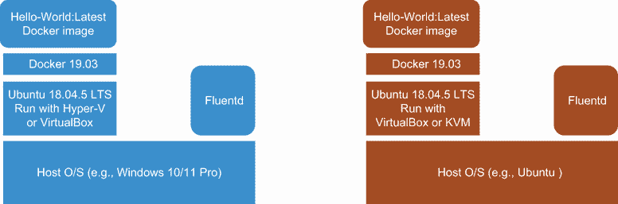

图 8.1 操作系统层、虚拟化和容器化层的使用，以确保我们的主机环境不会因为仅使用 Docker 而受到干扰

### 8.2.2 快速检查网络连接

获取正确的网络配置是使用 Docker、Kubernetes 和虚拟机时的重要考虑因素。这意味着始终值得进行快速简单的检查，以确保网络连接按预期工作，例如使用 curl 或 Postman 将 HTTP 日志事件发送到 Fluentd。为了帮助实现这一点并使用 Fluentd 日志驱动程序，我们已准备了一个简单的 Fluentd 配置，将接收到的任何内容发送到`stdout`。我们可以像以前多次做的那样，使用以下命令启动 Fluentd：

```
fluentd -c Chapter8/Fluentd/forwardstdout.conf
```

一旦 Fluentd 在 Linux 环境中运行，我们可以执行第二章中使用的“Hello World”测试的变体。在以下配置和命令中，我们需要将`w.x.y.z`替换为 Linux 虚拟机看到的宿主机的 IP 地址。您可以在 Windows 上使用`ipconfig`命令和在 Linux 主机上使用`ip addr show`命令（`ifconfig`也可能工作，但已弃用）来获取机器的 IP 地址。我们的测试命令在 Linux 虚拟机或容器上必须是

```
curl -X POST -H "Content-Type: application/json" -d '{"foo":"bar"}' http://w.x.y.z:18080/test
```

这应该在 Fluentd 在主机上运行的控制台上显示 JSON 详细信息`{"foo":"bar"}`。

严格的绑定控制

严格的绑定控制可以是一件非常好的事情。它们允许我们在处理可能位于具有多个网络连接的机器上的组件时应用安全控制，无论这些连接是物理的还是虚拟的（如 Docker 和 Kubernetes 环境中的情况）。对于`forward`等输入插件，绑定配置属性将确保 Fluentd 调用将通过相关网络进行。但是，当 Docker 和 Kubernetes 创建网络地址时，我们必须更加警觉。当连接失败时，很容易开始检查主机防火墙、网络配置等等。实际上，目标系统因为只监听一个特定的网络连接而存在故障。

### 8.2.3 运行 Docker 命令行

在设置和检查了我们的部署，特别是网络之后，我们可以继续使用 Docker 守护进程。我们不会构建自己的 Docker 镜像，而是从 Docker Hub 网站检索传统的“Hello World”镜像。`hello-world` Docker 镜像很简单，当人们在使用 Docker 时，这是一个好的起点。该镜像的详细信息可在[`hub.docker.com/_/hello-world`](https://hub.docker.com/_/hello-world)找到。

我们可以通过使用标签来指定特定的版本。标签添加在名称之后，用冒号分隔。由于`hello-world` Docker 镜像已经按照使用`latest`标签为最新稳定版本的习惯进行了标记，我们可以在命令中添加`:latest`。这可以通过在虚拟机上运行以下 Docker CLI 命令来完成

```
docker pull hello-world:latest
```

我们没有对 Docker 配置进行任何更改，这意味着当请求 Docker 守护进程运行我们的镜像时，我们将看到标准的 Docker 日志驱动程序行为。虽然 Docker 日志的位置可能不同，但通常我们应该在`/var/lib/docker`文件夹中找到它们，在那里我们将看到一个名为`containers`的文件夹。我们可以将其视为图 8.2 的第一部分中突出显示的内容，每个容器实例都使用其唯一的 ID 创建了自己的文件夹。当然，最初不会有任何容器。现在有了镜像的本地副本，我们应该通过 CLI 命令告诉 Docker 守护进程运行`hello-world`镜像

```
docker run hello-world
```

如果我们现在刷新对文件夹 `/var/lib/docker/containers` 的视图，该文件夹将新增一个条目，在图 8.2 的第二部分中被突出显示。在新容器的文件夹结构中，我们将看到一个具有长名称的日志文件（例如，Docker 镜像实例；例如，`b361e69a1 . . .`）。进入容器的文件夹，我们将看到该 Docker 实例的资源，包括一个名为`local-logs`的文件夹（在图 8.2 的第三部分中被突出显示）。最后，进入`local-logs`文件夹，我们可以看到名为`container.log`的容器日志文件（在图 8.2 的第四部分中被突出显示）。由于日志文件以自己的自定义格式存储（图 8.2 的第五部分），其内容将无法阅读。

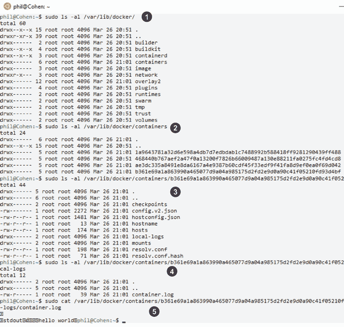

图 8.2 显示了包含 Docker 和每个容器实例的文件夹结构，随后是容器及其以自定义方式编码的日志的列表（屏幕截图中的数字在前面文本中已解释）

为了使事情更加实用，我们希望配置 Docker 使用更易于消费的格式来记录日志。我们可以覆盖默认设置，使 Docker 使用 Fluentd 日志驱动程序。这是通过告诉 Docker 守护进程使用带有参数`-–log-driver=fluentd`的替代方案来完成的。由于 Fluentd 驱动程序包含在 Docker 的部署中，我们不需要做更多的事情。我们还需要告诉驱动程序在哪里可以找到我们的 Fluentd 节点以接收日志事件。这和其他配置选项是通过参数`-–log-opt`来提供的，后面跟着一个由等号(`=`)分隔的名称-值对。在我们的情况下，我们需要提供主机机的 Fluentd 的地址（就像之前的 curl 命令一样）。由于 Docker 日志驱动程序可以使用转发插件（并从 msgpack 提供的压缩中受益），我们需要确保包括端口号在内的网络地址被提供。这导致运行`hello-world`的命令如下所示：

```
docker run –-log-driver=fluentd  --log-opt fluentd-address=w.x.y.z:28080 hello-world
```

执行该语句的结果将是看到 Docker 镜像的日志事件在 Fluentd 控制台上输出。如果 Docker 命令返回错误消息，例如

```
docker: Error response from daemon: failed to initialize logging driver: dial tcp w.x.y.z:28080: connect: connection refused.
```

那么网络或 Fluentd（例如，它没有绑定到正确的网络）存在问题。启动 Docker 镜像和目标 Fluentd 节点时的顺序也应该被注意。当迁移到与 Kubernetes 的容器编排时，这一点尤其重要，因为 Kubernetes 管理 pods 启动的顺序。在出现此类问题时，我们建议检查 Docker 配置的网络端口值，以确保允许容器外的网络流量。如果发生任何端口号映射，那么这是可以的。

Fluentd 驱动程序可以使用 Fluentd 提供的任何标准功能，例如使通信异步（即利用内存缓冲区功能；更多内容请参阅第九章）。但当我们转向完整的配置时，我们将探讨更多这些功能。

在图 8.3 中，我们可以看到运行我们的命令所生成的输出。注意日志事件中包含以下属性：

+   `container_id`—容器的完整 64 字符 ID，唯一标识单个容器。

+   `container_name`—容器启动时的容器名称。启动后的任何重命名操作都不会反映出来，直到重启。

+   `source`—详细说明日志是否来自`stdout`等。

+   `log`—来自源的内容（例如，`stdout`的一行）。

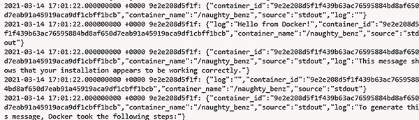

图 8.3 从 Docker 执行`hello-world`容器收到的 Fluentd 控制台输出

### 8.2.4 通过配置文件切换到驱动程序配置

证明参数化解决方案后，我们可以以更可读的方式推进配置，并添加相关的进一步选项。考虑到所有可能的配置选项，使用命令行进行高级配置将是一项具有挑战性的维护任务。默认情况下，更改 Docker 守护进程配置文件将影响所有正在运行的 Docker 镜像。Docker 命令行还允许我们使用参数`–-config`指向配置文件，后跟备用配置文件的名称。

Docker 守护进程将其配置（包括日志驱动程序配置）保存在一个名为`daemon.json`的文件中。对于 Linux 设置，文件的默认位置是`/etc/docker/`。如果你在 Windows 上使用 Docker 实例（而不是我们选择的间接方法），位置是`ProgramData\docker\ config\`（`ProgramData`通常位于 C 驱动器的根目录）。如果 Docker 设置完全运行在默认值上，则该文件可能不存在。

在守护进程配置文件中，我们明确希望包括日志驱动程序类型和连接到我们的 Fluentd 实例的设置。为此，我们在 JSON 文件中包含命令行参数的配置版本`"log-driver": "fluentd"`。在命令行中，我们还提供了`fluentd-address`属性。当涉及到`fluentd-address`时，我们可以提供地址为`tcp://w.x.y.z:28080`或作为对相关套接字文件的显式路径引用（例如，`unix:///usr/var/fluentd/fluent.sock`）。

除了地址之外，我们还应该直接引入与日志驱动程序和其他与日志相关的通用参数相关的几个附加参数。我们包括的一般设置是

+   `raw-logs`*—*应设置为`true`或`false`。如果指定为`false`，则应用完整的 ANSI 时间戳（例如，`YYYY-MM-DD HH:MM:SS`），并通过使用转义码关闭日志文本的着色。

+   `log-driver`—如用于设置日志驱动程序的命令行示例所示。

+   `log-level`—应用于 Docker 守护进程的日志过滤器阈值。接受的级别是`debug`、`info`、`warn`、`error`和`fatal`，默认为`info`。

在配置文件中，我们可以启动一个名为 `log-opts` 的内部属性组；这些特定的日志选项包括

+   `env`—我们可以要求驱动程序捕获并包含特定的环境变量。这通过定义一个以逗号分隔的列表来完成。就我们的目的而言，我们可以使用 `"os, customer"`。这假设已经设置了这样的值。也可以通过使用属性 `env-regex` 定义这个的正则表达式版本。

+   `labels`—这与 `env` 非常相似，在某种程度上，可以指定标签列表（Docker 元数据名称-值对），或者可以通过 `labels-regex` 提供正则表达式。

+   `fluentd-retry-wait`—每次连接失败后，在再次尝试之前应用一个等待期。该值需要包括持续时间类型（例如，`s` 表示秒，`h` 表示小时）。

+   `fluentd-max-retries`—在放弃之前尝试连接的最大次数。默认值为 `4294967295`——即 `(2**32 - 1)`。我们不希望事情因为那么多次重试而挂起。鉴于我们已经将重试设置为每秒一次，最多 10 分钟的重试就足够了，这意味着值为 `600`。

+   `fluentd-subsecond-precision`—允许我们在硬件支持的情况下，将时间戳精度设置为毫秒级。虽然默认值是 `false`，但明确设置它是有意义的，即使它只是默认值。通过明确设置值，我们会提醒自己我们不会拥有这样的精度。

+   `tag`—与日志事件记录关联的标签。这可以使用 Docker 定义的符号（附录 A 中有完整列表）构建。在我们的情况下，让我们使用以下表示法定义标签：`{{.ID}}-{{.ImageID}}`。

+   `fluentd-address`—与命令行配置一样，这是与 Fluentd 服务器通信的位置。这与参数方法一样，需要根据 Fluentd 实例的主机 IP 地址进行定制。

满足这些其他需求的结果意味着我们到达了列表 8.1 中所示的代码。以调试模式运行 Docker 守护进程是确保配置文件正确处理的最简单方法。这意味着这是一个守护进程服务，我们需要使用以下命令停止当前进程

```
sudo service docker stop
```

列表 8.1 第八章/Docker/daemon.json 配置文件，用于 Docker Fluentd 日志驱动程序

```
{
"log-driver" : "fluentd",                     ❶
"log-level": "debug",
"raw-logs": true,                             ❷

"log-opts": {
    "env": "os,customer",
    "labels": "production_status,dev",
    "fluentd-retry-wait": "1s",
    "fluentd-max-retries": "600",
    "fluentd-sub-second-precision": "false",
    "tag": "{{.ID}}-{{.ImageID}}",            ❸
    "fluentd-address": "w.x.y.z:28080"        ❹
  }
}
```

❶ 这告诉 Fluentd 使用 Fluentd 版本的日志驱动程序。

❷ 这设置 Docker 使用原始日志，因此不使用格式化，并应用 ANSI 时间戳。

❸ 这定制了用于日志事件的标签。

❹ 这指定了日志驱动程序中 Fluentd 服务器的位置。

一旦服务停止，我们需要将修改后的守护进程配置文件复制到默认位置 `/etc/docker/`。然后我们可以使用以下命令手动启动进程

```
sudo dockerd -D
```

这将启动 Docker 以调试模式，从默认位置获取配置。如果配置文件有任何问题，Docker 守护进程将几乎立即停止或生成有关无法解析配置的警告。信息将显示在控制台上，例如

```
unable to configure the Docker daemon with file /etc/docker/daemon.json: invalid character '\n' in string literal
```

一旦文件读取正常，Docker 守护进程将日志事件直接发送到我们的 Fluentd 实例，包括运行 `Hello-World` Docker 镜像时的输出。由于我们之前的命令已在前台启动了 Docker 守护进程，我们需要使用另一个 shell 来运行 Docker 镜像。我们可以使用之前的相同命令：

```
docker run hello-world
```

如果你感到勇敢，可以直接跳转到再次以服务形式运行 Docker。这意味着终止当前以调试模式执行的 Docker 守护进程。然后执行以下命令

```
sudo service docker start
```

当你对配置文件（`daemon.json`）的任何进一步更改有信心时，而不是手动运行 Docker 守护进程，我们可以采用简单地重启守护进程以强制它获取最新配置的方法。这是通过将 `start` 命令替换为 `restart` 来实现的。例如：

```
sudo service docker restart
```

假设你想验证配置属性是否已被 Docker 守护进程接受。在这种情况下，你可以运行命令 `docker --info`，这将显示所有正在使用的设置，包括控制台上的默认值。

## 8.3 Kubernetes 组件日志记录和 Fluentd 的使用

Kubernetes 的本质及其高度可插拔的模型意味着其生态系统可能会变得复杂。为了说明这一点，如果我们看看 Kubernetes 的容器化方面，Docker 可能是今天最占主导地位的容器技术。然而，通过 API 模型，Kubernetes 允许我们使用其他容器技术，如 *containerd* ([`containerd.io/`](https://containerd.io/)) 和 *cri-o* ([`cri-o.io/`](https://cri-o.io/))，这两者都受 CNCF 管理。部分复杂性通过 *Open Container Initiative* ([`opencontainers.org/`](https://opencontainers.org/)) 得到解决，它也受 CNCF 管理，有助于抽象容器实现与 Kubernetes 容器编排之间的交互。这里的基本问题是这如何影响我们以及 Fluentd 的使用？

这里重要的是，正如我们所看到的，我们可以配置 Docker 以捕获通过 `stdout` 和 `stderr` 传播的事件；因此，其他容器是否支持这种功能？并非所有容器在日志记录方面都像 Docker 那样成熟。许多容器只是与 Kubernetes 内部日志框架 *klog* ([`github.com/kubernetes/klog`](https://github.com/kubernetes/klog)) 保持一致，该框架在部署时采用 *journald* 的日志方法，否则将日志记录到默认文件位置。

Klog 的演变

Klog 追溯到 Google C++ 库（[`github.com/google/glog`](https://github.com/google/glog)）。由于 Kubernetes 是用 Go 实现的，C++ 库不是一种选择，因此在这个过程中，开发了一个 Go 实现（[`github.com/golang/glog`](https://github.com/golang/glog)）。从那时起，Kubernetes 开发者确定 glog 在容器化方面存在一些挑战，因此分叉了代码库，从而产生了 klog。API 基本上保持不变。在所有情况下，日志机制都经过优化以实现最佳性能；因此，插入和配置日志很大程度上取决于使用该库的应用程序提供的命令行选项，而不是配置文件。

### 8.3.1 Kubernetes 组件和结构化日志

在 Kubernetes 组件中，今天结构化日志的应用是一个不断发展的旅程。Kubernetes 中的所有组件尚未全部采用结构化日志（尽管这一状况正在改变）。我们应该准备好应对未来可能出现的任何额外系统组件或扩展可能不应用结构化日志的可能性。这强化了这样的建议：最好是积极采用第七章中概述的日志和部署模式（如 Fluentd 作为边车模式、与应用程序内嵌等），而不是试图从 Kubernetes 中提取日志。

### 8.3.2 Kubernetes 默认日志保留和日志轮转

当日志由于容器配置从容器传入 Kubernetes 时，Kubernetes 将将日志条目推送到每个容器实例的日志文件中。为了管理大小和日志轮转，我们的责任是建立一个日志轮转工具，它可以控制日志文件的数量以及它们轮转的频率。

Kubernetes 没有自己的日志轮转器；处理日志轮转挑战是 Kubernetes 工作节点部署者的责任。话虽如此，如果工作节点是使用 Kubernetes 提供的脚本（`kube-up.sh`，[`mng.bz/M25n`](http://mng.bz/M25n)）设置的，它将部署开源工具 logrotate（[`github.com/logrotate/logrotate`](https://github.com/logrotate/logrotate)）。logrotate 可以配置为保留指定数量的文件。某些 Linux 发行版已经部署了 logrotate，因此这是一个额外的配置问题。logrotate 的设置可能因 Linux 发行版而异，这仅仅是因为 Linux 配置的应用方式不同。某些发行版使用 systemd，而 logrotate 是其一部分。在 logrotate 还未部署的地方，通常可以通过选择 Linux 发行版的包管理器独立安装。

Logrotate 作为解决方案并不是跨平台的，因此，在 Windows 上运行 Kubernetes 需要另一个答案来实现日志轮转，这在查看 Kubernetes 关于此主题的讨论时并不明显，而且更具挑战性。无论日志轮转如何，klog 生成的日志在达到 1.8 GB 时会自动截断。因此，任何日志轮转都需要在达到该阈值之前建立。

当容器被移除时，Kubernetes 会自动删除所有除了当前日志文件之外的所有文件。如果捕获此类日志事件的进程落后太多，可能会丢失日志事件——在建立日志捕获时需要考虑的问题。

从这个例子中我们可以看出，在 Kubernetes 层面管理日志会面临挑战，这些挑战可能基于部署方法和基础设施设置的差异。因此，我们倾向于通过专注于我们能够看到更多一致性和更多控制手段的层中的日志捕获来最小化问题。我们无法完全忽视 Kubernetes 日志，但在其他地方拦截日志事件意味着 Kubernetes 日志事件的丢失并不那么关键。

Kubernetes 部署的简化

对于解决方案来说，简化 Kubernetes 部署是必要的。在 Kubernetes 生态系统中，已经开发了几种工具，如 Helm ([`helm.sh`](https://helm.sh)) 和 Rancher ([`rancher.com`](https://rancher.com))，以简化挑战。Helm（更占主导地位的解决方案）甚至将自己称为 Kubernetes 的包管理器。鉴于 Helm 的主导地位，Fluentd 的贡献者已经开发了 Helm 配置文件（称为 *charts*）以支持 Fluentd 部署。这些 charts 整合并定义了特定于部署的独特配置细节，然后 Helm 使用模板和脚本完成剩余部分。GitHub Fluentd 存储库中包含的 DaemonSet chart ([`github.com/fluent/helm-charts`](https://github.com/fluent/helm-charts)) 提供了一个基本起点，让您只需为特定需求应用配置。如果您参与 Kubernetes 部署的常规开发，我们建议调查 Helm 并利用 Fluentd charts。

### 8.3.3 使用 kubectl 进行日志记录

如您可能已经知道，*kubectl* 是与 Kubernetes 交互的主要 CLI 工具。当 Kubernetes 理解日志被写入的位置时，我们可以利用 kubectl 执行各种任务，例如跟踪一个或多个日志文件、将日志转发到不同的端口，以及支持日常的日志文件活动。而不是描述 kubectl 日志命令，所有详细信息都可以在 kubectl 命令参考中找到，请参阅[`mng.bz/aDJB`](http://mng.bz/aDJB)。

## 8.4 使用 Kubernetes 展示日志

我们需要收集 Kubernetes 进程日志，并了解内部容器进程，如 Kubelet 是否在记录错误。Kubernetes 有许多机制可以帮助我们检查容器的健康状况。然而，了解 Kubernetes 中一切运行正常，对于知道容器是否得到妥善照顾，或者节点是否缓慢失败至关重要。如果一个应用程序正在控制台记录日志，事件流向 Kubernetes，那么我们在哪里检索这些事件？

为了解决这个问题，我们将部署一个预构建的包含 LogSimulator 的 pod，该 pod 配置为将日志事件定向到`stdout`。日志事件将通过容器机制传播，并让 Fluentd 在 Kubernetes 层拦截它们，因此我们将捕获 Kubernetes 和容器内部日志。这可能会反映十二要素应用中描述的推荐设置（[`12factor.net/logs`](https://12factor.net/logs)）。但在许多方面，它代表了一个最坏的情况，因为我们必须投入精力来推导上下文（在`stdout`中分离可能来自平台或容器而不是应用程序的多个日志事件等）并重新结构日志事件。

在这一点上，如果你还没有按照附录 A 安装 minikube 作为我们的 Kubernetes 实现，那么现在正是理想的时间。一旦完成，你的环境将看起来像图 8.4 中所示的结构。

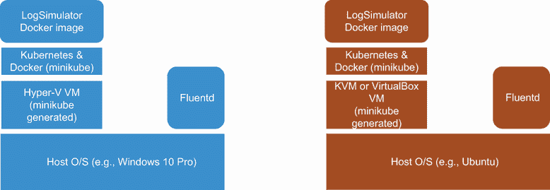

图 8.4 操作系统层、虚拟化和容器化使用的层次结构，以确保我们的宿主环境不会被 minikube 打扰

### 8.4.1 Kubernetes 设置

为了展示保持配置简洁的 Kubernetes 配置，我们将使用 minikube。Minikube 是 Kubernetes 的一个版本，经过精简以保持尽可能小的足迹。如果你还没有按照附录 A 中的说明进行操作，那么在 Linux 虚拟机上执行的第一步就是这一步。这也恰好是 Marko Lukša 在《Kubernetes 实战》一书中使用的 Kubernetes 实现（[`mng.bz/g4wE`](http://mng.bz/g4wE)）。一旦 minikube 安装完成，让我们启动它并使用 Kubernetes 仪表板查看初始状态。我们使用以下命令在 Windows 上执行此操作：

```
minikube start --vm-driver hyperv --hyperv-virtual-switch "Primary Virtual Switch"
```

Linux 的等效版本是

```
minikube start --vm-driver docker
```

这将建立一个单节点“集群”的 Kubernetes，简化到最小。本章的下载包包含 Linux shell 和 Windows 批处理脚本，这些脚本将执行此命令（使每次记住或复制命令变得容易得多）。然后我们可以在 Windows 或 Linux 上使用以下命令启动仪表板：

```
minikube dashboard
```

此命令启动一个前台进程，该进程将部署必要的 pod 以运行仪表板 UI 并提供仪表板页面 URL。当仪表板页面打开时，我们可以使用 UI 的左侧菜单进行导航，以查看当前部署了哪些守护进程集、部署和 pod（作为菜单的工作负载部分）。如图 8.5 所示，目前没有部署任何守护进程集。您将找到基本的 `hello-minikube` 部署及其关联的 pod 正在运行。

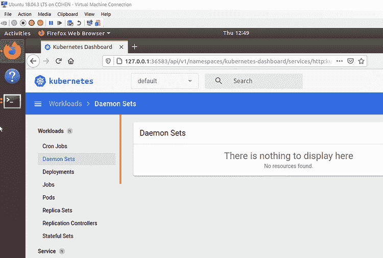

图 8.5 在 minikube 上运行的 Kubernetes 仪表板，目前只显示默认命名空间，而不是 kube 系统，或者大多数守护进程集将运行的地方。

使用所有命名空间简化导航

通过将 Kubernetes 标志旁边的下拉菜单设置为“所有命名空间”而不是默认（如图 8.5 所示）来简化 UI 导航，这将使查看详细信息更容易。否则，您在导航 UI 时可能会遇到障碍，想知道为什么看不到预期的信息，例如 Fluentd 守护进程集。在我们的环境中，显示所有内容（即，所有命名空间）不会有问题，尽管在生产设置中，我们不会推荐这样做。

### 8.4.2 创建日志以捕获

我们首先需要一个应用程序来生成日志事件，这样我们就可以观察一个日志守护进程集从 Kubernetes 和不直接将日志发送到端点（即，它们只是将日志发送到 `stdout` 和 `stderr`）的应用程序收集事件。为此，我们可以使用 LogSimulator 的容器化版本。默认情况下，该工具的容器化版本配置为循环遍历一个简单的数据集多次，然后停止。每个日志事件都简单地写入 `stdout`；因此，日志事件将被 Kubernetes 收集。当 LogSimulator 容器完成其运行时，它将停止容器，此时 Kubernetes 将介入以重启部署。LogSimulator Docker 镜像已经在 Docker Hub 中存在。以下列出的是在 pod 中使用此 Docker 镜像的 Kubernetes 配置，可以从 [`mng.bz/5KQB`](http://mng.bz/5KQB) 获取，该配置显示如下。由于不需要任何配置或外部端点，YAML 配置非常简单。

列表 8.2 第八章/LogGenerator/Kubernetes/log-simulator-deployment.yaml

```
apiVersion: apps/v1
kind: Deployment
metadata:
  name: log-simulator
  labels:
    app: log-simulator
spec:
  replicas: 1
  selector:
    matchLabels:
      app: log-simulator
  template:
    metadata:
      labels:
        app: log-simulator
    spec:
      containers:
      - name: log-simulator
        image: mp3monster/log-simulator:v1      ❶
```

❶ 这是 Docker Hub 镜像的引用，当部署时，将会被下载。如果需要部署此 pod 的新版本，必须在名称末尾的版本引用（即，:v1）进行更新。如果没有这样做，Kubernetes 将忽略请求，因为它已经有了该版本的 LogSimulator。

要部署此 pod，您需要确保环境变量 `LogSimulatorHome` 已定义，它引用了之前已安装的 LogGenerator 的根文件夹。或者，编辑提供的脚本（`deploy-log-sim-k8.bat` 或 `deploy-log-sim-k8.sh`），将环境变量引用替换为绝对路径。如果您使用脚本，它将始终尝试先删除任何可能存在的 pod 部署以确保安全。这意味着如果您想重新部署，则只需使用脚本。然后，在 shell 中，输入以下语句以自行发出部署命令：

```
minikube kubectl -- apply -f %LogSimulatorHome%\Kubernetes\log-simulator-deployment.yaml --namespace=default
```

Minikube 应该会确认部署为成功。

minikube CLI 和 kubectl 之间的差异

kubectl 和 minikube 命令之间的差异很小。Minikube 包装了 kubectl 的使用，以便 minikube 命令可以提供额外的命令和 kubectl 命令。如果您已安装 kubectl，则可以配置它将指令直接指向 Kubernetes 的 minikube 实例。然后，您可以将命令的前一部分，即显示为 `minikube kubectl –-` 的部分，替换为仅 `kubectl`。对于 Linux 主机，此方法的替代方法是向 Linux 环境中引入别名。这是通过使用命令 `- alias kubectl="minikube kubectl --`" 来完成的。现在，当您使用命令 `kubectl` 时，Linux 将将其替换为完整表达式。如果您发现自己需要经常在调用前加上 `sudo` 以确保正确的权限，则可以将此也包含到别名中。

理解 LogSimulator 的视图

在我们继续查看 DaemonSet 之前，值得“稍微窥视一下引擎盖下”看看正在发生的事情。因为我们之前已经启动了 Kubernetes 仪表板，我们可以使用它来帮助我们。我们需要访问 pod 列表（左侧菜单选项）；因此，我们将看到类似于图 8.6 中显示的列表。我们需要访问 `log-simulator` pod 实例，这可以通过点击以 `log-simulator` 开头的名称来完成。

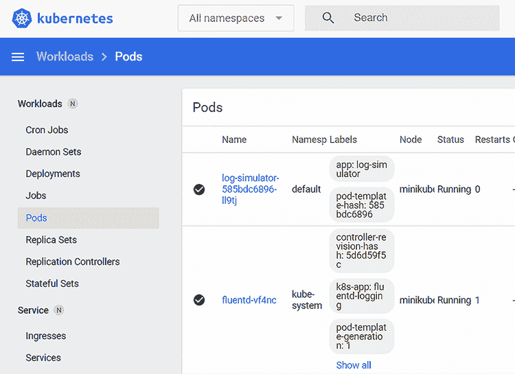

图 8.6 Kubernetes 仪表板显示包含我们的 LogSimulator 和 Fluentd 的 pod 实例

这将显示有关特定 pod 的详细信息，屏幕顶部将类似于图 8.7 中显示的详细信息。

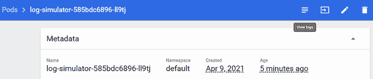

图 8.7 显示特定 log-simulator 实例的 Kubernetes 仪表板

如您在图 8.7 中所注意到的，图像右上角有四个图标。点击第一个图标将显示类似于图 8.8 的视图。该图显示了 LogGenerator 生成的 `stdout`。

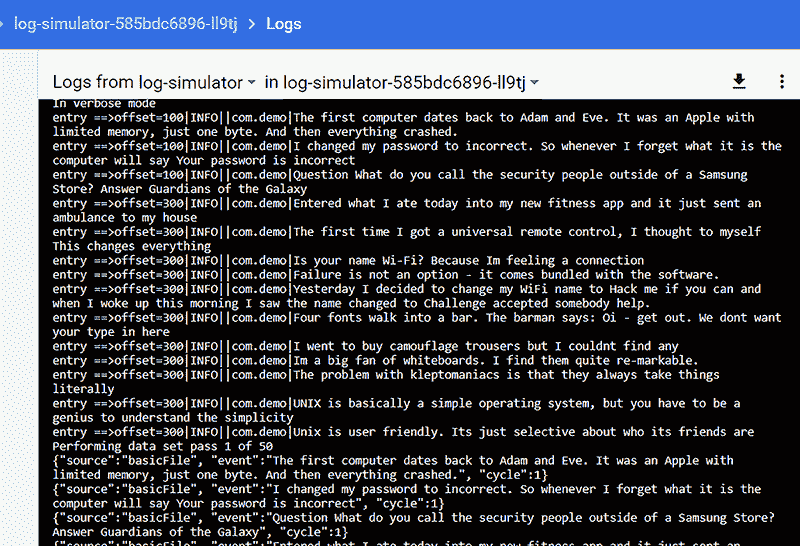

图 8.8 我们的 LogGenerator 实例的控制台（stdout），其简单配置生成要由我们的 Fluentd 设置收集的事件

虽然这很有用，并确认容器按预期运行，但我们还需要知道 Kubernetes 将输出推送到哪个文件，因为我们需要针对该文件设置一个 tail 输入插件。回到屏幕上，我们在图 8.7 中看到我们想要使用基于箭头的图标（从左数第二个），因为这将为我们提供正在执行的容器的 shell 视图。

值得注意的是，登录到由这个容器镜像提供的 shell 中，因为你会看到与应用程序相同的环境。任何容器探索都需要迅速完成——一旦 LogGenerator 完成生成日志事件，它就会停止。结果，我们的容器会死亡，带着我们的会话一起结束。如果你试图查看存在的日志，你不应该看到任何东西，因为日志事件将被捕获在运行 Kubernetes 的主机上，而不是在容器中。通过这样做，我们清楚地确立了我们的 Kubernetes 容器第一个要求的事实——即需要访问主机文件系统来收集生成的日志。

### 8.4.3 理解 Fluentd DaemonSet 的构建方式

我们第一次接触 Kubernetes 是在第二章，我们简要地查看了一下使用 Fluentd 提供的 DaemonSet。我们说过 Kubernetes 配置会变得复杂。然而，考虑到我们为 LogGenerator 使用的`Kubernetes.yaml`，这个问题很容易被质疑。让我们花点时间来了解一下 Fluentd 的 Kubernetes 和 Docker 资源所涉及的内容。与此相关的有几个关键仓库，具体如下：

+   *Kubernetes DaemonSet in GitHub*—这是大多数必要的实现细节所在 ([`mng.bz/6ZXo`](http://mng.bz/6ZXo))。

+   *Docker 文件基础镜像*—([`github.com/fluent/fluentd-docker-image`](https://github.com/fluent/fluentd-docker-image))。这些是 Docker 基础镜像，包括用于帮助生成不同操作系统变体的模板机制。

+   *Docker Hub 仓库*—这是从 Docker 镜像中拉取 Kubernetes 配置的地方 ([`hub.docker.com/u/fluent`](https://hub.docker.com/u/fluent))。一个或多个 Docker 镜像根据提供的配置形成一个 pod。

+   *元数据过滤器*—这被集成到 DaemonSet 中 ([`mng.bz/oa2d`](http://mng.bz/oa2d))。元数据过滤器通过添加额外的上下文来丰富 Kubernetes 日志记录，帮助你更好地理解正在发生的事情。

当你访问 Fluentd 的 DaemonSet GitHub 仓库时，你会看到一系列 YAML 文件。Fluentd 社区提供了一系列标准化的配置，用于捕获 Kubernetes 日志并将内容发送到单个目的地。这些配置包括将内容转发到另一个 Fluentd 节点，发送到 AWS、Azure 和 Google 提供的各种云原生服务，以及像 Graylog、Loggly 这样的专用服务，以及更常见的目标 Elasticsearch 和 Syslog。

当检查 Kubernetes YAML 配置时，你会发现它们在本质上都非常相似，具有以下特点：

+   设置镜像，使其将在 kube-system 命名空间中部署

+   引用合适的容器镜像

+   定义可以在相关 Fluentd 配置文件中使用以连接外部服务的环境变量——通常是目标解决方案的主机和端口等详细信息

+   指定应分配给容器的资源数量

+   定义需要在容器内可见的主机文件位置——特别是`/var/log`和`/var/lib/docker/containers`——以及路径在容器内应该如何显示。

配置中没有显示的是，可以设置和传递一些额外的环境变量，从而进一步改变容器的行为；例如，是否尝试与 systemd 交互。但我们很快就会看到这一点。我们可以假设“真正的魔法”发生在容器中，因此也在 Docker 文件中。

Kubernetes Docker 镜像

如果你查看存储库根目录下的 README，你会看到一个 Docker 拉取命令列表，其中每个守护进程类型都有一个或多个引用。查看列表时，你会注意到它们已经被分为两大组：`x86_64 镜像`和`arm64_images`。这种需求可能直到我们想起 Docker 文件最终必须引用特定于计算机硬件的二进制文件时才变得明显。这是在虚拟化或容器化解决方案中使用更通用的包管理器的一个缺点。这意味着我们有很多 Docker 镜像需要维护。

Kubernetes Docker 镜像也是使用模板生成的，但我们可以将活动描述为以下事情：

+   建立对相关 Docker 镜像的依赖

+   设置 Ruby 和 Gem，包括将环境变量定义到适当的位置

+   安装各种 gem 文件

+   配置涵盖 Fluentd、systemd、Kubernetes、Prometheus 的文件

以[`github.com/fluent/fluentd-kubernetes-daemonset/tree/master/docker-image/v1.12/arm64/debian-forward/conf,`](https://github.com/fluent/fluentd-kubernetes-daemonset/tree/master/docker-image/v1.12/arm64/debian-forward/conf)为例，我们可以详细检查配置和文件关系。图 8.9 也提供了文件关系的视觉表示：

+   `Fluent.conf` 位于根容器中，并使用 `include` 机制引入其他配置文件的内容，正如我们在第五章中看到的。此配置文件还有一个匹配项，在转发守护进程集的情况下，匹配所有日志事件并将它们发送到目标服务器。值得注意的是，转发配置不包括任何安全措施（没有 TLS 等）；如果日志不敏感，这不是问题。但如果它们是敏感的，那么您需要用包含必要配置的配置文件替换它们。我们将在本章后面看到如何做到这一点。

    systemd 和 Prometheus 的配置受环境变量控制，具体来说，存在 `FLUENTD_SYSTEMD_CONF` 和 `FLUENTD_PROMETHEUS_CONF` 的设置。

    需要 `Kubernetes.conf`，因此它被包含在内。最后，`conf.d` 文件夹中的任何配置都被包含，因此可以通过任何特定的自定义来扩展配置。

    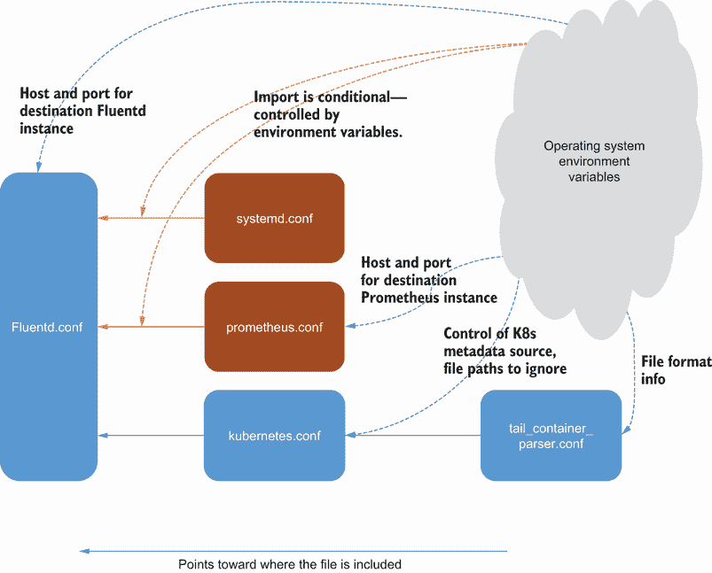

    图 8.9 配置文件之间的关系及其受环境变量影响的表现

+   `Prometheus.conf` 文件很简单。它定义了 Prometheus 输入插件的使用以及 `Prometheus_output_monitor` 用于监控 Prometheus。环境变量定义了服务器的地址，包括 `bind`、`port` 以及如果指标 URI 不同，则使用变量 `FLUENTD_PROMETHEUS_BIND`、`FLUENTD_PROMETHEUS_PORT` 和 `FLUENTD_PROMETHEUS_PATH` 分别定义 `path`。

+   `Systemd.conf` 文件定义了 Docker、Kubelet（使用 systemd 源插件）的来源（Kubernetes 节点控制器和 bootkube 服务）。值得注意的是，此插件独立于 Fluent Git 仓库，并且是独立编写的（详细信息请参阅 [`github.com/fluent-plugin-systemd`](https://github.com/fluent-plugin-systemd)）。

+   `Kubernetes.conf` 文件是配置中包含的最有趣的部分。像 systemd 一样，它也使用外部插件，这次是一个名为 `kubernetes_metadata` 的过滤器（详细信息可在 [`github.com/fabric8io/fluent-plugin-kubernetes_metadata_filter`](https://github.com/fabric8io/fluent-plugin-kubernetes_metadata_filter) 找到）。过滤器的任务是将额外的元数据合并到日志事件中或从日志事件中排除。这是通过使用环境变量 `FLUENT_FILTER_KUBERNETES_URL` 或结合 `KUBERNETES_SERVICE_HOST` 和 `KUBERNETES_SERVICE_PORT` 与 Kubernetes API 端点通信来完成的。这需要从日志事件中获取元数据以获取从 Kubernetes API 获取信息的基本上下文。信息可以来自 journald，如果正在使用它，或者可能来自日志文件名。与插件一起使用的某些属性要么假定默认值，要么直接嵌入到容器中。可以配置的控制映射到插件属性如下：

    +   `KUBERNETES_VERIFY_SSL`—`verify_ssl` 设置一个标志，指示是否应该检查 SSL/TLS 证书。如果你的环境有用于证书的证书颁发机构，我们建议将其设置为是。

    +   `KUBERNETES_CA_FILE`—此属性提供了 Kubernetes 服务器证书验证的 CA 文件路径。

    +   `FLUENT_KUBERNETES_METADATA_SKIP_LABELS`—如果设置为 `true`，则不要从元数据中检索标签。

    +   `FLUENT_KUBERNETES_METADATA_SKIP_CONTAINER_METADATA`—如果设置为 `true`，则不会包含与容器镜像和 `image_id` 相关的元数据。

    +   `FLUENT_KUBERNETES_METADATA_SKIP_MASTER_URL`—如果设置为 `true`，则不会包含 `master_url` 元数据。

    +   `FLUENT_KUBERNETES_METADATA_SKIP_NAMESPACE_METADATA`—如果设置为 `true`，则不会包含如 `namespace_id` 这样的元数据。

    +   `FLUENT_KUBERNETES_WATCH`—当设置为 `true` 时，它告诉插件监视 Kubernetes API 服务器持有的 pod 元数据的变化。

为了让过滤器执行任何有意义的事情，配置需要包含源。在这种情况下，使用了多次 tail 源插件来捕获在文件夹 `/var/log/containers/*.log`、`/var/log/salt/minion`、`/var/log/startupscript.log`、`/var/log/docker.log`、`/var/log/etcd.log`、`/var/log/kubelet.log`、`/var/log/kube-apiserver.log`、`/var/log/kube-controller-manager.log`、`/var/log/kube-scheduler.log`、`/var/log/rescheduler.log`、`/var/log/glbc.log`、`/var/log/cluster-autoscaler.log` 和 `/var/log/kubernetes/kube-apiserver-audit.log` 中生成的任何日志。你可能已经认出了这些是核心 Kubernetes 进程的日志文件。基于此，我们应该看到日志事件被捕获，只要我们的容器日志事件被写入 Kubernetes 主机上的 `/var/log/containers/` 文件夹中的某个位置。

Kubernetes 中的 Fluent Bit

我们主要关注 Fluentd 与 Docker 和 Kubernetes 结合作为主要方式，以提供一种灵活的方式来捕获日志事件。但在容器化环境中，考虑到 Fluent Bit 具有更小的占用空间，应该考虑使用它，尤其是如果目标是将日志事件推送到专门的 Fluentd 节点或日志分析平台，如 Elasticsearch，并使用这些部分来执行“重负载”。值得注意的是，Fluent Bit 在 GitHub 上有自己的项目，提供 Docker 基础设置，并扩展不同环境和操作系统（如 Debian、CentOS、Raspbian 和 Amazon Linux）的 Docker 镜像。这些 Docker 镜像支持一些可能的目标，以及作为 Kubernetes 中的 DaemonSet 部署的 Fluent Bit 配置。

## 8.5 查看主机日志

在本章早期，我们窥视了 LogGenerator 容器可以看到的环境，并确定它看不到主机上的任何部分，因此看不到任何日志。这是因为我们没有配置容器挂载文件系统。文件夹挂载不是必需的，因为我们信任容器捕获`stdout`并将内容放在合适的位置。然而，当我们演示这种行为时，我们控制着 Docker。现在 Docker 将由 Kubernetes 管理。此外，我们需要考虑如何监控 Kubernetes 本身。对预构建的 Fluentd 资源的审查表明日志内容位于`/var/log`。Minikube 提供了一个方便的工具，允许轻松访问主机环境。一旦我们可以访问主机，我们就可以检查环境以定位相关的日志文件并了解需要捕获的内容。使用新的 shell（Windows 或 Linux），我们可以使用以下命令

```
minikube ssh
```

这将为我们提供一个安全的 shell 进入主机环境。让我们使用以下命令查看当前配置中看到的文件夹

```
ls -al /var/log/containers
```

结果可能并不像预期的那样，因为这是一个指向`/var/log/pods`中文件的符号链接文件夹，如图 8.10 所示。幸运的是，每个人都可以看到这些链接。

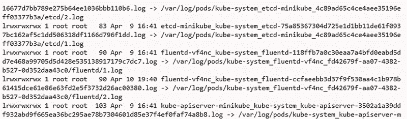

图 8.10 查看文件夹`/var/log/containers`的结果——你可以看到列出的文件作为 pods 文件夹中另一个文件的符号链接

如果我们跟随链接到`/var/log/pods`，我们会看到每个链接解析到一个文件夹，该文件夹反映了 pods 的实例，如图 8.11 所示。

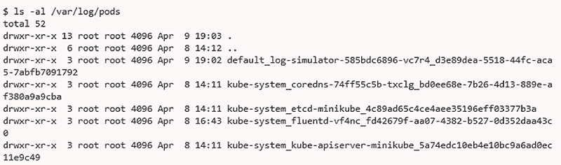

图 8.11 查看文件夹`/var/log/pods`的结果，结果竟然是目录

检查一个之前部署到默认命名空间（因此有`default_`前缀）的 pod 文件夹，例如`log-simulator`，我们看到一个包含递增日志文件编号的文件夹和另一层符号链接，如图 8.12 所示。

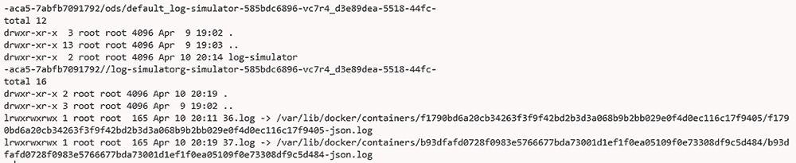

图 8.12 `/var/log/pods`中的一个 pod 文件夹的内容，这些文件夹再次是文件系统另一部分的符号链接

通过链接进入 `/var/lib/docker/containers` 会带来一个新的挑战——权限被大大限制，我们需要使用 `sudo` 命令来列出文件夹的内容，如图 8.13 所示。

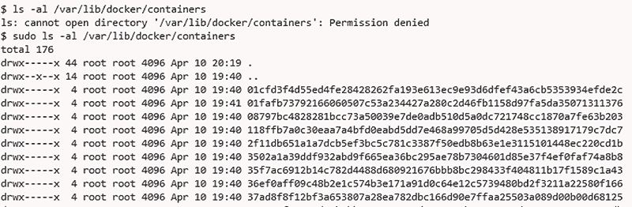

图 8.13 这里可以看到 /var/lib/docker/containers 受限的内容；请注意非常受限的权限。

如果我们查看这些文件夹中的一个，我们会发现图 8.14 中显示的日志文件。但最后几个步骤只有在提升权限的情况下才有效。这也帮助我们理解了预定义配置中使用的不同文件路径。这意味着在 YAML 文件中，我们需要确保挂载具有适当的权限。这也确认了容器内部的路径与主机相同。

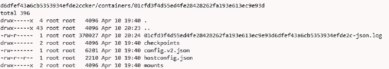

图 8.14 在克服了限制之后，我们可以看到 `/var/lib/docker/containers` 的内容，其中包括一个真正的日志文件而不是另一个符号链接。

我们还应该注意，minikube 的日志访问安全性非常粗粒度，因此，如果你可以看到一个日志，那么如果你与主机交互，你将能够访问所有日志。在生产环境中，从安全角度来看，这并不是非常理想。结论是，如果你对容器化环境中的日志敏感，请直接使用如第七章中讨论的 sidecar 等模式来控制可见性。更积极地控制你容器的日志事件意味着你不会受到 Kubernetes 中访问控制管理方式的影响。

在文件系统中导航可以清楚地看出，Kubernetes 的配置并非易事。这让我们回到了这样一个观点：我们能够在容器和应用程序层面进行更多监控，事情就会变得更容易。

## 8.6 配置 Kubernetes 日志 DaemonSet

根据概述，我们可以合理地假设我们可以复制配置 YAML 来建立用于日志记录的 Kubernetes DaemonSet。我们可以利用 Fluentd 在我们的配置中提供的现有 Docker 镜像。YAML 配置需要提供特定的环境变量值并将文件系统的正确部分挂载。如果我们想让 DaemonSet 也应用一些自定义配置，我们需要将额外的配置文件映射到系统中。

而不是设置很多环境值来控制当前的 Fluentd 配置，我们可以看看如何将 Fluentd 指向一个替代配置文件并注入修改后的配置。这也给了我们机会来解决 Docker 文件中的内容布局问题，这可能会影响下游应用程序。

### 8.6.1 准备 Fluentd 配置以供使用

使用定制的 Fluentd 配置，我们可以通过修改 Docker 构建来部署它。然而，一种更优雅的方法是利用 Kubernetes 配置的功能。这意味着如果我们想更改配置，我们只需要重新部署配置更改，而不是更改 Docker 镜像及其重新部署的后续步骤。这是可能的，因为 Fluentd Docker 文件通过环境变量和适当放置的附加配置文件来配置 Fluentd，这些配置文件可以通过 include 语句获取。

在建立 Fluentd 配置后，我们需要使其准备好被容器消费。我们将使用 Kubernetes 配置映射来完成此操作，我们将在稍后对其进行更多解释。我们需要首先将配置映射部署到 Kubernetes 中，以便进行引用。配置映射可以包含在我们的核心 Kubernetes YAML 文件中，或者我们可以使用 Fluentd 文件，将其转换为合适的格式，并单独部署配置。后一种方法更可取，因为我们可以使用第三章中看到的 Fluentd dry-run 功能来验证配置，然后再部署。如果配置嵌入在更大的配置文件中，验证步骤将无法进行。

Fluentd 配置映射与 kube-system 命名空间相关联，以匹配标准 Fluentd 守护进程集部署到该命名空间的事实。使用此命名空间是有意义的；在这种情况下，我们正在配置和部署一个 Kubernetes 全局服务。列表 8.3 显示了我们要引入的 Fluentd 配置。如您所见，它从容器和 Pod 中收集日志并将日志事件发送到可配置的目标。我们还需要注意配置映射的名称（`fluentd-conf`），因为它将在 YAML 文件中引用。与 LogSimulator 部署一样，我们捆绑了一个批处理和 shell 脚本，移除了任何以前的配置（`deploy-config.bat`和`.sh`）。

要部署配置文件，我们需要使用 minikube 命令：

```
minikube kubectl -- create configmap fluentd-conf –from-file=Fluentd/custom.conf --namespace=kube-system
```

如果您想确认部署，请使用仪表板查看配置并选择配置映射（从左侧菜单）。然后，在仪表板的中心部分，您将看到所有的配置映射，包括我们的`fluentd-conf`。通过点击我们的配置映射名称，可以显示配置映射的内容。您可能会看到每行以`\r;`结尾，这是 Linux 对回车符的编码，在文件处理时不会出现任何问题。

列表 8.3 第八章/Fluentd/custom.conf 覆盖 Kubernetes 的配置

```
<system>
    Log_Level debug
</system>

<source>
  @type tail
  path /var/log/containers/*.log
  read_from_head true
  read_lines_limit 25
  tag deamonset
  path_key sourcePath
  emit_unmatched_lines true
  <parse>
    @type none
  </parse>
</source>

<source>
  @type tail
  path /var/log/pods/*/*.log
  read_from_head true
  read_lines_limit 25
  tag deamonset2
  path_key sourcePath
  emit_unmatched_lines true
  <parse>
    @type none
  </parse>
</source>

<source>                                        ❶

  @type tail
  path /var/lib/docker/containers/*.log
  read_from_head true
  read_lines_limit 25
  tag deamonset3  
  path_key sourcePath
  emit_unmatched_lines true
  <parse>
    @type none
  </parse>
</source>

<match *>
    @type forward
    <buffer>                                    ❷

      buffer_type memory
      flush_interval 2s  
    </buffer>
    <server>
      host "#{ENV['FLUENT_FOWARD_HOST']}"       ❸
      port "#{ENV['FLUENT_FOWARD_PORT']}"
    </server> 
</match>
```

❶ 此源是安全文件系统的一部分，需要设置权限以允许 Fluentd 读取。

❷ 我们设置了一个非常短暂的缓冲区，以便我们可以快速看到事件流过；鉴于我们的部署，网络开销不是问题。

❸ 允许通过 Kubernetes 配置文件驱动对服务器的寻址

通过 Kubernetes 将内容传递到容器

Kubernetes 提供了多种方式将内容作为挂载路径共享到容器中。选项的数量如此之多，以至于《Kubernetes in Action》有数章专门讨论这个主题。本质上，不同的技术可能会影响容器是否可以修改文件系统，存储是否在容器生命周期之后持久化等问题。ConfigMap 是不可变的（只读），这对于我们的场景是理想的。根据使用的选项，ConfigMap 的内容可以通过环境变量、命令行值和文件来消费。然而，它们的大小有限，所以如果希望传递一个要重放的日志文件，可能不适合使用。

当将文件共享到由 Kubernetes 管理的容器中时，我们必须注意，接收共享文件夹的容器中已经存在的任何内容将被共享内容覆盖。因此，将新配置推送到容器需要谨慎操作。例如，在标准的 Docker 设置中仅替换 `Kubernetes.conf` 文件是不明智的，因为它与所有配置文件共享一个公共文件夹。通过采用在容器中使用的将新配置文件放入不同位置并修改 Fluentd 通过环境变量获取的配置文件路径的方法，我们可以避免此类问题。这意味着如果我们愿意，我们可以包括标准的 Kubernetes 和 Prometheus 配置，并在必要时替换它们。

### 8.6.2 创建我们的 Kubernetes 部署配置

让我们调整并部署标准 Fluentd 仓库的 DaemonSet 到我们的 minikube 环境中。为此，我们需要本地下载文件，因为我们需要做一些调整。这可以通过使用原始视图中的 `wget` 命令（[`mng.bz/OGpE`](http://mng.bz/OGpE)）或使用 `git clone` 命令来完成。我的首选是 `wget`（这是在 Docker 文件等中检索大量内容的最简单方法），其命令如下：

```
wget https://raw.githubusercontent.com/fluent/fluentd-kubernetes-daemonset/master/fluentd-daemonset-forward.yaml
```

我们需要添加以下内容并进行以下修改：

1.  设置我们想要将日志事件转发到的 Fluentd 节点的位置值。这意味着我们应该将文本 `REMOTE_ENDPOINT` 替换为主机机的地址或 IP（例如，`192.168.1.2`）。`FLUENT_FOWARD_PORT` 的值也需要从 `18080` 更改为 `28080`。这是为了反映我们在 Fluentd 节点配置中使用的端口。

    在生产环境中，我们始终建议使用 DNS 地址。这样，环境中的任何变化或通过负载均衡扩展 Fluentd 都会从配置中隐藏。这需要了解 Kubernetes 中 DNS 的处理方式，但这不是本书的主题。

1.  在 YAML 的 `env` 部分中添加环境变量 `FLUENTD_SYSTEMD_CONF`，并将其值设置为 `"FALSE"`。

1.  在同一部分覆盖 `FLUENTD_CONF` 环境变量，使其指向我们通过 ConfigMap 提供的 `custom.conf` 文件。

1.  在 YAML 文件的容器部分添加一个 `securityContext` 部分，将 `privileged` 属性设置为 `true` 以克服之前确定的权限挑战。

1.  为我们的 ConfigMap 添加 `volumeMount` 条目，以便定义路径。这意味着在 `volumeMounts` 部分添加一个额外的名称 `config-volume`，`mountPath` 为 `/fluentd/etc/custom`。

1.  我们接着将名为 `config-volume` 的卷部分（链接卷和 `VolumeMounts`）作为一个附加条目引用，其属性为 `configMap`，然后通过 `name` 引用，这是我们之前设置的 `fluentd-conf`。

由于我们对现有配置进行了定制，您仍然会参考 Docker 文件中定义的 Docker 镜像，网址为 [`mng.bz/p2dz`](http://mng.bz/p2dz)。实际的 Docker 镜像将来自 Docker Hub，网址为 [`mng.bz/QWvG`](http://mng.bz/QWvG)。定制 Kubernetes YAML 文件的结果可以在下面的列表中看到。

列表 8.4：针对我们的需求修改的 Chapter8/Kubernetes/fluentd-daemonset.yaml

```
apiVersion: apps/v1
kind: DaemonSet
metadata:
  name: fluentd
  namespace: kube-system
  labels:
    k8s-app: fluentd-logging
    version: v1
spec:
  selector:
    matchLabels:
      k8s-app: fluentd-logging
      version: v1
  template:
    metadata:
      labels:
        k8s-app: fluentd-logging
        version: v1
    spec:
      tolerations:
      - key: node-role.kubernetes.io/master
        effect: NoSchedule
      containers:
      - name: fluentd
        image: fluent/fluentd-kubernetes-daemonset:v1-debian-forward     ❶

        env:
          - name:  FLUENT_FOWARD_HOST                                    ❷

            value: "192.168.1.2"
          - name:  FLUENT_FOWARD_PORT
            value: "28080"
          - name: FLUENTD_SYSTEMD_CONF
            value: "FALSE"
          - name: FLUENTD_CONF                                           ❸
            value: "custom/custom.conf"
        resources:
          limits:
            memory: 200Mi
          requests:
            cpu: 100m
            memory: 200Mi
        volumeMounts:
        - name: varlog
          mountPath: /var/log
        - name: varlibdockercontainers
          mountPath: /var/lib/docker/containers
          readOnly: true        
        - name: config-volume                                            ❹

          mountPath: /fluentd/etc/custom/
        securityContext:                                                 ❺

          privileged: true
      terminationGracePeriodSeconds: 30
      volumes:
      - name: varlog
        hostPath:
          path: /var/log
      - name: varlibdockercontainers
        hostPath:
          path: /var/lib/docker/containers
      - name: config-volume                                              ❻
        configMap:
          name: fluentd-conf         
```

❶ 我们继续参考预构建的 Fluentd Docker 镜像设置，用于管理 Kubernetes 的日志。

❷ 通过环境变量设置要转发日志事件的 IP 和端口

❸ 覆盖 Fluentd 启动时使用的配置文件的位置

❹ 定义了容器将看到的挂载位置。然后，此路径映射到 Kubernetes 外部的文件系统，确保日志可以安全保留。

❺ 为了使容器能够访问在探索宿主服务器时看到的受限制的文件夹和文件，设置了额外的安全设置。

❻ 将卷映射到之前加载到 Kubernetes 中的 ConfigMap

### 8.6.3 将 Fluentd for Kubernetes 的实现付诸实践

利用第三章和第七章中获得的理解，并利用现有的 Fluentd 配置文件为 DaemonSet（见 [`mng.bz/XWZv`](http://mng.bz/XWZv)）构建一个简单的单个配置文件，该文件可以跟踪 Kubernetes 集群中的任何相关文件。随着日志事件的收集，将它们转发到之前使用 Docker 日志驱动配置的 Fluentd 节点。

答案

下载包中提供了一个简单的 Fluentd 配置，如列表 8.4 所示，我们将利用它进行以下步骤。但您也可以将您的配置替换到下一步中。

### 8.6.4 在 minikube 上部署

在部署 DaemonSet 之前，我们应该启动本地 Fluentd 实例，准备接收日志事件。这与我们之前多次使用的命令相同。

```
fluentd -c Chapter8/Fluentd/forwardstdout.conf
```

下一步是将我们的 DaemonSet 部署到 Kubernetes：

```
minikube kubectl -- apply -f Kubernetes/fluentd-daemonset.yaml --namespace=kube-system
```

再次，我们在下载包中创建了一个批处理和 shell 脚本，名为 `deploy -deamonset.bat` 或 `.sh`，它将删除任何现有的部署并将当前配置推送到 Kubernetes。你可以通过选择菜单选项“守护集”（在左侧导航菜单下的“工作负载”下）使用仪表板确认其他资产的守护集部署；这应该列出 `fluentd`。点击标题将显示包含我们的容器的 pod 的详细信息。

如果 Kubernetes 处于稳定的空闲状态，我们可能立即看不到任何日志。我们可以通过重新部署我们的 LogSimulator 配置来解决此问题，就像我们在本章前面使用脚本 `deploy-log-sim-k8` 所做的那样。这将迅速导致 Kubernetes 发送各种事件，包括来自 LogSimulator 容器的 `stdout` 日志事件。我们可以在图 8.15 中看到输出示例。

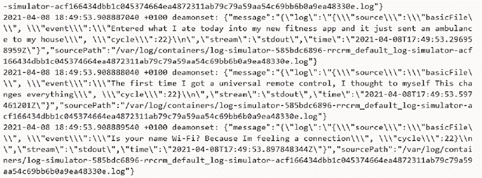

图 8.15 接收到的日志事件在我们的接收 Fluentd 节点

### 8.6.5 整理

在运行 Kubernetes 并检索各种 Docker 镜像和 minikube 资产后，你会达到想要清除或刷新环境的地步。其中一个简单但出色的功能是 minikube 可以通过单个命令完全清除环境以释放资源，因为你已经完成，或者如果你想再次验证一切，可以重置并重新开始。这是通过以下命令完成的

```
minikube delete
```

## 8.7 Kubernetes 配置实战

我们已经建立了一个基本配置，使我们能够看到 Kubernetes 环境中的日志事件。然而，该配置尚未达到企业级。为了达到企业级，我们需要改进该配置。你的挑战是确定必要的更改，并按照提供的配置进行必要的修改。

### 8.7.1 答案

你已识别的更改应包括以下要点：

+   尾部源没有在文件中记录其跟踪位置；因此，重启可能会重复日志事件。

+   记录的 `pos_file` 需要映射到一个挂载点，这样如果 pod 重新启动，位置信息就不会丢失。

+   尾部配置需要解决日志轮转管理的问题。

+   应该提供额外的 Kubernetes 指标和 Prometheus 信息，并通过配置进行控制。

+   Kubernetes 核心组件（在 kube-system 命名空间中）的日志应该单独标记为托管应用程序和接收端，以分离标签。

+   利用 Kubernetes 插件为日志事件添加额外的元数据。

+   调整 Fluentd 中的缓存以更符合生产环境，并考虑 Kubernetes 提供的资源。

+   应该将日志级别从调试移动到信息。

## 8.8 需要监控和记录的更多 Kubernetes

我们已经解决了 Kubernetes 的核心日志考虑因素，但还有一些额外的领域您应该了解，可能需要进一步考虑。Kubernetes 正在持续发展和快速扩展。因此，某些功能可能不会提供，因为运行的部署不是最新版本，或者如果您使用的是托管服务，服务提供商可能根据不同的能力以不同的方式实现了某些功能。当然，您可能希望将 Kubernetes 与 Istio 或 Linkerd 等网格框架叠加，这将有自己的日志。我们认为以下领域是跟踪核心 Kubernetes 最有价值的领域。

### 8.8.1 节点监控

到目前为止，我们关注的是与我们的容器相关的核心日志。但您可能还希望监控 Kubernetes 节点基础结构的健康状态。在这方面有各种选择，包括在本地节点上使用 Fluentd 或 Fluent Bit 并监控服务器的原始统计信息。然而，在某些环境中可能不允许这样做。Kubernetes 还提供了一个名为 *Node Problem Detector* 的额外 DaemonSet 服务。

节点问题 DaemonSet 是 minikube 的一个可选附加组件，以及一些云供应商和其他人提供的预构建 Kubernetes 集群也采用这种方法。因此，需要启用 DaemonSet。节点问题检测器监控内核日志文件，并根据配置报告特定问题，这些配置可以通过 ConfigMap 覆盖，就像我们修改 Fluentd 配置一样。检测器包括一个导出元素，将信息发送到不同的端点，包括 Kubernetes API 服务器和 Stackdriver，后者与我们的 Fluentd Daemon 集成。

更多关于此服务的信息可以在 [`github.com/kubernetes/node-problem-detector`](https://github.com/kubernetes/node-problem-detector) 找到。

### 8.8.2 终止消息

在 pod 的配置中，可以配置与 pod 终止相关的信息记录。因此，在发生异常终止的情况下，可以进行事后诊断。在容器配置中，可以通过 `terminationMessagePath` 属性（默认为 `/dev/termination-log`）为 Kubernetes 指定容器中终止消息的路径。我们需要验证 Kubernetes 配置确保日志事件被导向 Fluentd 可以抓取的位置，或者 Fluentd 知道如何从 Kubernetes 获取这些信息。更多相关信息可以在 [`mng.bz/y4aB`](http://mng.bz/y4aB) 找到。

## 摘要

+   默认的 Docker 日志驱动程序以这种方式工作，即无法通过标准的 Fluentd 插件直接跟踪其日志文件（例如，使用压缩）。

+   Fluentd 可以用作 Docker 的日志驱动程序，这使得访问和使用 Docker 日志事件变得更加容易。

+   Fluentd GitHub 仓库包括预定义的 DaemonSet 配置。为了适应操作系统差异以及将日志直接路由到如 Elasticsearch 等服务的可能性，预构建镜像中也提供了替代的 Fluentd 配置。

+   Kubernetes 配置，如 minikube，相当复杂，通过符号链接的间接层次使得在想要监控的情况下确定哪些文件是真实日志变得困难。

+   利用 Kubernetes 的 ConfigMaps 功能，可以定制或扩展开箱即用的 Fluentd 配置。因此，预构建的 Fluentd Docker 镜像可以捕获日志事件并将它们发送到不同的 Fluentd 节点。
