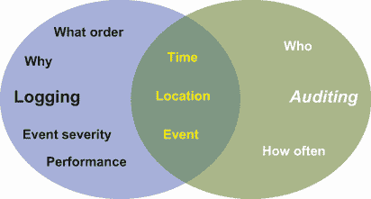
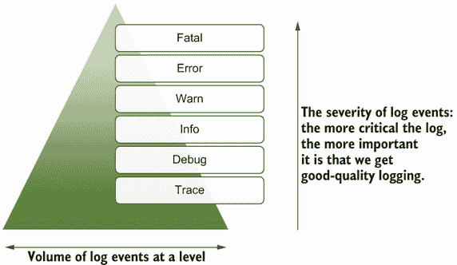

# 10 日志最佳实践

本章涵盖

+   将日志级别应用于过滤和优先处理操作

+   识别良好日志的特征

+   利用良好的日志简化操作活动

+   理解立法对日志的影响

+   提高日志记录的编码实践

使用的这项技术仅与日志事件本身一样好，无论日志条目是如何生成的，无论是应用程序写入 stdout、stderr、OS 事件框架还是日志框架。为了最大化技术投资，我们需要使日志事件及其创建尽可能有效。

我们已经深入探讨了技术，因此我们也需要对日志事件做同样的事情。本章将探讨在业务数据方面应该记录什么，不应该记录什么，并检查哪些信息可以使日志事件更有帮助。有了这些，我们将确定一些实践来帮助从日志事件中获得价值。我们系统处理的业务数据可能受到各种合同和法律要求的影响。因此，我们将探讨一些更知名的立法需求，一些减轻其影响的选项，以及可以帮助我们识别可能影响日志使用其他立法需求的来源。

## 10.1 审计事件与日志事件对比

何时一个事件是审计事件，何时是日志事件？让我们先定义这两个事件是什么（图 10.1）：

+   *审计事件*——这些通常是记录一个动作、事件或数据状态，这些状态需要保留以提供可能在未来某个时刻需要解决合规性问题（如会计流程或安全）的正式记录。许多这些动作将由用户触发。

+   *日志事件*——这些记录了已经发生的事情；日志事件将出于技术原因提供，范围从显示交易是如何处理的到报告意外情况以显示代码是如何执行的。



图 10.1 展示日志和审计之间关系的维恩图

从描述中，你可以看到相当程度的重叠。这种重叠源于日志作为一种技术机制可以用来满足审计要求，并且两者都有一个共同的数据核心。审计事件通常由结构良好的内容组成，偏向于与安全相关的事件，如登录和注销。问题是关于事件路由到的工具是否适合审计相关任务。所有这些都指向这样一个事实，即像 Fluentd 这样的日志统一工具可以支持审计需求；我们需要专注于确保事件中的信息是合适的，并且将其发送到合适的工具进行分析。

## 10.2 日志级别和严重性

回到第一章，我们讨论了日志消息将如何在不同时间支持不同的角色，无论你是工作在 DevOps 组织（开发团队也负责运营）还是在经典分离的运营和开发团队中。一些日志有助于开发和测试，其他日志有助于故障排除，还有一些日志有助于审计、安全和性能跟踪。最简单的事情就是给每个日志分配一个反映日志事件代表影响的日志级别或严重性。典型的日志级别有*追踪*、*调试*、*信息*、*警告*、*错误*和*致命*。事件严重性和这些严重级别可以追溯到 20 世纪 80 年代和 Syslog 的开发。Syslog 如何做的许多方面已经随着 IETF（互联网工程任务组；[`tools.ietf.org/html/rfc5424`](https://tools.ietf.org/html/rfc5424)）而成为标准。但正如我们稍后将看到的，这些级别与相关活动之间存在关联。

注意：是否应该使用诸如*严重性*或*日志级别*之类的术语来描述日志事件？IETF 讨论了严重性；然而，这带有暗示日志信息与不良事物相关的含义。然而，日志应该合法地生成以指示一切按预期运行。因此，包括我自己在内，许多人使用*日志级别*这个术语来避免与*严重性*一词相关的含义。

当然，关键在于对日志级别所代表内容的共同理解。日志条目的误分类是日志事件中常见的错误，这就是为什么我们在前面的章节中提到了使用 Fluentd 纠正这些问题的可能性。但这也意味着我们应该明确，并且团队就级别的含义达成一致。以下各节提供了一个共同的日志级别定义集。

### 10.2.1 追踪

主要用于开发活动，执行可以写入日志的简单事件，以指示正在执行的方法。这使我们能够确认/验证执行路径是否符合预期。

当谈到*开放追踪*和*开放遥测*的概念时，我们确实需要将这些技术与分类区分开来。这些技术收集显示“事务”如何在我们环境中流动的“追踪”信息。开放追踪依赖于所实现追踪的粒度。如果追踪反映了事务流程中执行的技术步骤，例如，进入和离开组件、函数等，那么我们将看到一个细粒度和全面的追踪，并且应该使用追踪分类进行记录。如果追踪反映了业务视角（例如，执行与将商品运入仓库相关的所有操作），那么我们将看到粗粒度细节，这最好在信息级别进行记录。

### 10.2.2 调试

此级别旨在共享日志数据以支持任何开发和调试活动。此日志级别应信息丰富，以便轻松进行故障排除或重新创建运营问题，因为它将提供对软件正在做什么的最深入了解。此类信息的生成应涉及开发人员和参与更详细故障排除的人员。我们经常看到此级别的日志记录被使用，而不是试图使用 IDE 调试器并将其附加到正在运行的软件上。

这些日志消息最容易被意外记录过多信息（例如，个人或财务数据），因为整个数据对象可以轻松地被记录。在非生产环境中，这通常不会成为问题，因为数据很可能是合成的。这也意味着很容易忽视生产中的风险。

通过以下方式可以解决记录敏感数据的风险

+   制定包括如何记录或不记录数据在内的详细标准的规范，并测试流程以确保不会记录合成事件数据。

+   在生产环境中全面禁止启用调试级别的日志记录（生产永远不应该有调试级别的日志记录）。在出现严重的运营问题时，帮助诊断重大运营问题的诱惑会很高，而设置调试级别日志的后果直到太晚才会被忽视。

### 10.2.3 信息（信息）

这是日常操作环境中日志的典型阈值。它应该提供足够的日志信息，以便在系统似乎行为不正确时进行诊断任务。记录的信息应包括如下细节

+   在启动和部署期间记录的软件版本等。

+   审计日志，如什么和谁，通过如会话 ID 等细节（这涉及到个人数据安全的问题，我们将在稍后更深入地讨论）。

+   影响决策逻辑的数据值。

+   与源和目标交互，例如其他服务的 URI 或数据库。

### 10.2.4 警告

当事情没有按预期进行时，存在出现错误的风险，但软件可以继续执行。例如，数据库连接失败，代码支持回滚或成功的重试操作。这可能会导致一个警告，说明它未能连接，然后在重试时出现错误，或者完全回滚并放弃事务。

警告不应需要立即干预，但应表明可能需要补救。这应包括处理意外路径，并因此采取行动。

警告理想情况下应与操作指导文档相关联，例如建议维护流程可能需要比维护计划预期的更早执行，或者已经自动采取了缓解措施，例如增加资源。其他警告操作可能包括审查交易是如何完成的，因为系统没有按常规处理它，或者代码假设了某些不正确的事情。

我们还应该考虑我们的解决方案具有防御性，检查事物是否接近危险阈值，并创建警告。例如，这可能包括确保有足够的磁盘容量来应对当前的数据增长速度。其他防御措施应包括验证接收到的数据，即使它来自可信的来源。

### 10.2.5 错误

这用于记录需要干预的事件；例如，对一个假设始终有值的空数据结构执行操作可能会触发空指针异常。这可能会创建一个进程无法干净完成的情况，因此需要反映为错误。为了帮助解决错误，日志事件需要阐明错误原因。错误发生的代码位置对于有效地应用改进至关重要。这意味着开发人员需要在错误日志事件中获取可消费的信息以帮助实施改进，而运维人员需要详细信息以确定需要哪些修复措施。

当发生错误时，我们不仅需要一个解决方案，还需要对数据进行操作上的纠正（例如，除以零导致计算值未更新）。因此，信息必须也被运维人员和发展/支持团队清楚地理解。错误代码可能有益，因为修复步骤可以在不淹没代码大量文本的情况下进行记录。

错误应尽量优雅地失败——也就是说，它们被处理并尽量减少干扰（例如，记录请求的交易然后允许后续交易在没有被污染的情况下处理）。

### 10.2.6 致命

这种错误仅在例外情况下使用，例如当应用程序必须意外终止时。终止可能是不优雅的。与错误一样，信息需要尽可能全面。然而，对于致命错误，可能存在可以收集的信息的限制——例如，由于文件系统失败而导致的致命错误将限制获取可能影响问题原因的相关数据值的能力。

再次强调，错误代码可以是有帮助的，既可以指导恢复任务，又可以通过提供不依赖于构建良好错误消息的底层原因的指示。

### 10.2.7 扩展或创建自己的日志级别

这些定义并不意味着你不能制定自己的级别，但它们在使用框架和确保共同理解方面具有重大影响。例如，我时常在想错误级别是否应该被拆分——一些错误需要立即干预，因为如果不干预，它们可能是致命事件的先兆。而一些错误意味着不良的结果，但它们可以等到正常工作时间再解决。考虑一个夜间的工资发放——由于公式不允许某人在一个月内获得 0 小时工资，导致了一个除以零的错误。虽然这是一个错误并且需要解决，但它是否应该停止所有人的工资发放？

日志级别具有严重性的层次结构，随之而来的是发生频率。跟踪日志可能非常普遍，但致命的日志事件应该非常罕见。我们可以在图 10.2 中看到这一点。如果我们添加一个新的日志级别，它将如何融入这个层次结构？



图 10.2 日志级别作为严重性和发生频率的层次结构

虽然创建额外的或不同的日志级别是可能的，但我得出结论，改变日志级别与行业规范相悖，就像逆流游泳一样，我决定采用清晰定义的日志级别。如果你正在考虑定制日志级别，底线是要准备好投入相当多的努力，从传达日志级别细节到弄清楚所有受影响的内容，再到确定日志框架设置。

考虑到之前描述的重叠，审计事件应该使用日志级别吗？通常，审计事件应该是良性的，因此应该记录在 info 级别，如第 10.2.3 节所示。然而，如果你的审计包括财务考虑，那么像账户余额的借记/贷记失败交易这样的失败交易应该成为审计跟踪的一部分，并反映事件的重大性。因此，事件可能需要人工干预，这将创建后续的审计事件，显示可能的干预。值得考虑将日志事件链接起来以获得更好的洞察。

## 10.3 清晰的语言

编写日志条目有时会感觉枯燥乏味，搜索日志文件也不吸引人。在消息中包含笑话（或者更糟）以使日志更有趣，或者添加当我们的代码而不是简单直接的语言时容易搜索的随机关键词，这种诱惑是存在的。问题是，你将不再是查看这些消息的人。有相当大的可能性，需要与日志一起工作的人可能不使用你使用的语言作为他们的第一语言，因此消息的含义将不会被理解。在记录异常时使用像`Geronimo ...`或“代码的一大步”这样的轻松话语，对大多数人来说可能是轻松的，但它可能引起混淆，或者更糟，将来可能冒犯到某人——所以，抱歉，现在是时候变得无聊、简单和直接了。使用措辞使日志搜索更容易是好的，但不能以牺牲理解的风险为代价。

与此类似，我们应该仔细选择我们在日志消息中使用的词语。这很重要，因为我们确实经常使词语的含义超载。例如，当使用 API 时，有些人将术语视为仅仅是接口规范，就像你在 OpenAPI、Blueprint 和 Swagger 等技术中看到的那样。其他人实际上是指实现 Swagger、Open API 或 Blueprint 定义背后逻辑的代码。这个问题不仅仅是一个 IT 问题；它发生在我们使用的业务领域或编写软件的过程中。

## 10.4 人类和机器可读性

强调日志需要既易于人类阅读又易于机器读取的需求似乎非常明显。但当我们编写日志事件条目时，很容易专注于对我们人类来说读起来好的内容，而忘记我们可能希望使日志事件可操作，这意味着我们应该确保日志事件尽可能结构化。例如，如果我有一个日志条目说“收到了过去的时间戳 12345678”，它可以变成`{"IncorrectData": "12345678", "AttributeImpacted": "schedule", "DataType": "date-time", "Reason": "date past"}`。阅读日志消息可能需要一点更多的认知努力，但后一种格式在处理上可以有很多可能性，从错误原因到我们表示值的方式。

## 10.5 上下文是关键

理解任何日志事件都需要上下文。当我们开发和使用跟踪和调试日志时，上下文在一定程度上是我们所知的，可能是隐含的，因为代码的位置将是上下文的一部分，或者正在运行的测试场景将是上下文。但当我们进入生产环境时，上下文可能不会是隐含的，因此我们需要使其明确。上下文的关键在于我们如何回答以下问题：

+   *什么*——正在报告什么，是一个错误还是仅仅是一个跟踪？

+   *何时*——日期和时间。如果你使用某种形式的日志框架，这部分是容易的。

+   *位置*——日志事件源在代码和基础设施中的位置。

+   *原因*——当涉及到信息和更高日志级别的日志级别时，我们提供信息的原因是至关重要的。是即将发生问题，还是我们在报告你想跟踪的事情，比如登录操作？

+   *谁*——谁触发了操作？谁的数据可能会受到影响？

让我们更详细地探讨这些点。

### 10.5.1 上下文：内容

日志事件的“内容”部分通过在事件中包含日志级别来部分解决。对于跟踪日志事件，当结合位置信息时，事件被记录的事实可能就足够了。对于信息日志级别及以上，我们将提供一些额外的细节：这个信息记录是为了审计目的吗？发生了什么类型的错误？警告与什么相关（例如，存储空间不足）？最佳地支持“内容”的是允许识别事务的细节，包括事务类型。事务数据或代理，如事务的唯一 ID（这样我们就可以查找实际的事务数据），应该提供足够的洞察力；例如，如果事务缺少对相关数据的引用，我们需要看到该值没有被设置。

### 10.5.2 上下文：何时

日志框架为您解决了大部分问题，无需任何努力，但很可能会回到服务器的系统时钟。在第二章中，我们强调了时区、时钟偏差等问题的影响。如果你在寻找一个运行在采用夏令时的时区（因为有人查看时间戳，它看起来不正确，因为他们正在应用夏令时，但日志没有）或全球分布式的解决方案时，这些问题可能会让你陷入困境。因此，你需要知道服务器所在的时区。一个选择是将时区配置到日志框架中，但更好的做法是将所有服务器对齐到协调世界时（UTC）。

当尝试将日志分析与用户错误报告对齐时，你需要明确用户正在工作的时区以及错误报告是按照他们的时间还是系统时间记录的。

### 10.5.3 上下文：位置

命名代码位置需要了解代码是如何处理的。当代码被用于商业解决方案，并且可能使用*混淆*和*最小化*工具时，这一点尤为重要，尤其是在基于脚本的解决方案，如 JavaScript 中。因此，依赖于反射来获取代码位置的细节可能是不有帮助的。尽管有一些工具，但一些混淆提供者会包括映射信息，以便根据正确信息识别原始代码。

注意：有关代码最小化和混淆的更多信息，请参阅以下资源：

+   Jeremy L. Wagner（Manning，2016 年）所著的《Web Performance in Action》的 liveBook 版本，可在[`mng.bz/g4RV`](http://mng.bz/g4RV)找到

+   [`mng.bz/p26z`](http://mng.bz/p26z)

应用程序通常是多线程的（例如，Java）或在 I/O 等待时进行上下文切换（例如，Node.js），并且它们是单线程的。上下文切换意味着我们一次不处理一个事务，因此理解感兴趣事件之前或之后的事件是否相关可能变得具有挑战性。这可以通过包含事务 ID 或会话 ID，或者利用日志事件的一部分开放跟踪或开放遥测 ID 来克服。一些日志框架会在它们的配置中帮助您捕获线程或进程 ID。例如，在 Fluentd 中，我们可以利用日志文件输出中的*WorkerId*。

“Where”也可能受到软件版本的影响。在生产环境中，我们可能同时拥有同一逻辑的多个版本，以支持诸如

+   运行 A/B 部署以帮助评估某个实现是否改善了用户体验

+   以高可用性运行，因此软件更新需要滚动更新来发生

这里还有另一种看待它的方法：你注意到这本书中有一张图像渲染得不是很好。你联系了 Manning。为了帮助你，我们需要知道哪个图是错误的。如果这个问题之前已经出现过，并在新版本的书中被修复了呢？这并不是说每个日志事件都需要发布每个版本信息方面，但我们确实需要让它容易提供足够的信息。也许当我们记录错误或更糟的情况时，这些信息会被写入日志。这是一个在日志事件中注入信息可能有所帮助的领域。如果日志事件被识别为软件中异常的重新发布，例如错误，那么 Fluentd 可以检索正在运行的软件版本并将其注入到日志中供将来参考。

### 10.5.4 上下文：为什么

这归结于事件发生的原因——是错误还是仅仅是一个显示代码位置（跟踪）或应用程序当前状态（调试）的信号？随着我们向更高层次（警告、错误和致命在我们的分类中）移动，“为什么”变得更加重要，并且仅从日志级别来看不那么明显。信息级别的日志事件可能是一个审计或系统当前状态的定期快照，无论事情是好是坏——例如，记录消息队列的深度。然而，日志事件消费者需要能够理解事件生成的原因。经过一些思考，这很容易解决。

可以包含一个简单的属性，例如“当前状态”或“审计操作”，以及共享数据。实际上，我们在许多情况下为日志事件提供了一个二级分类。鉴于我们提供了额外的元数据，我们可能会在开发组织内部保持一致性的情况下对其进行结构化。

当涉及到报告警告和错误时，原因回到了触发警告或错误的原因。这是主要错误，还是之前问题产生的副作用？试图表明错误是原因还是效果是困难的。如果我们能确定，我们应该明确指出；如果不能，我们可能给日志事件消费者一些关于可能性的提示。编码此类信息可能很复杂且难以测试。但很容易链接到错误代码并提供确认原因或效果的步骤。

我们通过事件生成的记录需要清楚地提供信息，以帮助进行诊断，不仅限于操作层面，还包括代码中是否可能需要更多防御性代码或更好的数据验证。由于解决方案目前处于不愉快的路径上，我们不应害怕提供更多信息——只要它不会引发敏感问题，我们将在稍后讨论。对于错误处理路径，我们处于一个性能不应成为考虑因素的位置，因为这部分代码库应该很少执行。一般来说，信息过少比信息过多要糟糕得多。

### 10.5.5 上下文：谁

记录“谁”可能会很棘手。正如我们稍后将看到的，记录可识别为个人的信息将使我们的日志处理受到立法、合同和商业要求的约束。尽管如此，我们将在本章稍后更深入地探讨这一点。重要的是要考虑何时需要“谁”，以及我们是否可以安全地使用其他数据作为真实身份的代理。例如，也许“谁”仅在登录会话期间相关，因此我们只需要携带会话 ID 并使用它。如果我们需要将会话中的操作归因于特定个人，我们将以安全的方式单独记录。那个会话 ID 同样可以是交易或订单 ID 等。

当记录诸如失败的登录或不需要特定个人的应用程序交互等事件时，我们可能仍然需要一个“谁”的值，例如原始 IP 地址。例如，单个服务器的 ping 可能无害（活跃服务报告可能只是这样做），但来自同一位置的真正快速重复发生则不好。然而，拥有那个 IP 意味着可以确定是同一系统在调用，因此可以确定要阻止的对象。

“谁”上下文的应用

与客户的 DevOps 团队合作，我们发现客户的安全团队雇佣了一家第三方组织定期对所有面向互联网的服务器进行探测。我们弄清楚了发生了什么，因为我们看到我们的 API 网关服务器定期报告来自几个 IP 地址的非法请求。一旦我们确定了模式和记录的详细信息，如 IP 来源、时间和 HTTP 请求，我们就向安全团队提出了怀疑，他们确认了第三方组织的使用。

不要忘记，“谁”可能是一个系统或应用程序组件。例如，在处理工资单时，该活动是由调度器触发的。因此，了解哪个调度器或调度器触发了该过程是有帮助的。

### 10.5.6 捕获上下文的一个实用清单

解决什么、何时、何地、为什么以及谁的问题可能有些抽象。我个人尝试通过以下问题来解决这个问题：

+   事件来自代码的哪个位置？

+   如果你的代码在生产中有多个版本的可能性？如果是这样，那么哪个版本就变得很重要。

+   事务是如何处理的？如果需要修复问题的数据影响，这一点尤为重要。

+   哪个服务器、进程或线程遇到了问题？如果问题是与基础设施相关的，你需要知道它关联的是哪个服务器、虚拟机或容器。

+   错误的原因是否可以识别（例如，除以零作为一个错误标识了参与错误的数据值）？错误日志能否追踪回代码中的某个位置？至少，表达错误的性质，如果可行的话，相关的数据值（例如，除以零错误——说明被除以零的内容以及相关的值）。

+   在特定路径中执行是由哪些数据值引起的？

## 10.6 错误代码

作为开发者，我们倾向于从自己的角度来编写日志细节。在一个 DevOps 组织中，开发团队也处理操作，这是可以的。但许多大型组织可能会选择采用*信息技术基础设施库（ITIL**）的方法来处理错误和问题管理，或者你可能有一个人们在你无法触及的地方部署的产品；我们需要考虑得更长远一些。对我们来说，ITIL 的一个重要方面是其对已知错误的定义：

*已知错误是一个有记录的根本原因和解决方案的问题。已知错误在其生命周期内通过问题管理流程进行管理。每个已知错误的详细信息都记录在已知错误记录中，这些记录存储在已知错误数据库（KEDB）中。通常，已知错误由问题管理识别，但已知错误也可能由其他服务管理学科提出，例如事件管理*。

更多信息可以在[`mng.bz/enpQ`](http://mng.bz/enpQ)找到

简而言之，一个组织将记录错误及其解决方案。这就是我们为什么分配错误代码的原因。错误代码允许我们提供一个简单的查找，以便将错误与适当的文档相关联。文档应描述错误并提供详细信息，包括要执行的一组补救措施（如果这涉及到将系统恢复到最佳状态而不损坏或丢失数据，这是必不可少的）。当然，如果日志事件在真正出错之前被记录并采取行动，那么这些行动可能是预防性的。

错误的原因可能是用户操作或已捕获的应用程序中的错误；无论哪种情况，我们都应该在日志信息中添加错误代码。最好不要在 UI 中弹出错误代码，因为这可能会削弱用户对产品的信心。但这不应阻止你在用户操作触发问题时将错误代码链接到适合用户的消息。

错误代码使得客户能够轻松地查找错误代码、描述和推荐响应，以便将其纳入 KEDB（已知错误数据库）。构建这样的错误代码内容可能看起来要求很高；但这远非如此。在开发软件时，最简单的解决方案是使用一个协作的电子表格来分配错误 ID，确保 ID 是唯一的。然后，从开发人员那里获取预期的简要描述。构建解决方案文档可以稍后进行。

使用错误代码的一个好处是，它使得错误文档的标准化和国际化变得相对容易。错误代码与语言和地区无关；一旦你有了代码，你就可以在适当的语言中查找代码文档。

你可以在软件开发过程中融入各种额外的技巧，例如将文档包含到代码管理工具中。因此，你可以在代码中发布文档，以便细节与你的发布流程相关联。代码质量工具可以查找错误或致命日志条目，并应用正则表达式来查看是否有错误代码与之相关联，等等。

错误代码编号

创建错误代码编号的一些建议：

+   如果没有以字母字符为前缀，不要在数字前使用前导零——这可能会导致数字处理时被截断，或者为格式化（例如，指定长度和前缀字符的数字字符串）增加额外的工作。然后，如果将该数字转换回字符串，它将不再匹配作为信息查找的关键字。

+   不要从 1 开始；最好从全范围的最低位开始（例如，1000）。

+   使用搜索工具（例如，1000）使错误代码易于查找，因为代码不太可能被索引，而 AppErr1000 则更有可能被索引。例如，Oracle 将它们的数据库错误代码以 ORA 为前缀，而 WebLogic 以 BEA 开头；因此，它们更有可能被索引，在搜索中更独特。

+   很有诱惑力简单地在一个代码块（类、接口、头文件，取决于你的语言）中记录所有错误代码；毕竟，有一个地方可以查找，并且可以从代码生成文档。但这是不被推荐的。你最终会得到一个所有内容都会依赖且不断变化的代码，而系统正在开发中。每个错误代码的增加都会导致代码变更，并产生巨大的依赖影响。这种影响巨大的代码变更将引发担忧（即使它们没有正当理由）并产生对变更的阻力。

    最好在共享知识库中编译详细信息，例如维基或协作知识库，这样每个人都可以维护而无需担心。请注意，在代码中定义错误代码的本地子集是可以的——这应用了 DRY 原则。例如，与特定模块相关的错误代码可以一起定义，因为添加错误代码很可能会与模块开发同时进行。

+   将错误代码分组为家族，就像在 HTTP RFC 中看到的那样，但对此要实际；一个错误代码可能在逻辑上属于两个分组（例如，与数据库连接错误——这是数据库问题还是网络连接问题？）。

+   这并不一定意味着要预留数字范围。然而，代码可以前缀或后缀一个简短代码来在产品或子系统级别提供范围；例如，BEA-00000 和 ORA-00000 表示两个不同 Oracle 产品（WebLogic 和 Oracle 数据库）的错误代码。

+   如果你从不同的异常中使用了相同的错误代码，尝试在辅助信息中区分其来源点。

+   考虑错误代码的消费者；一个错误可能来自单一位置，但有不同的原因，因此为原因使用不同的错误代码。这将使支持团队的工作或修复变得更加容易。

### 10.6.1 使用标准错误

一些技术提供代码来表示成功和错误，这些代码已经得到了很好的记录，例如 HTTP（RFC [`tools.ietf.org/html/rfc7231#section-6`](https://tools.ietf.org/html/rfc7231#section-6)）；其他包括 SMTP（电子邮件服务）、Oracle WebLogic 服务器等。在我们的日志中使用这些代码有助于通过共同的意义和理解提供更多上下文，只要它们被正确使用。例如，简单地使用标准 HTTP 200 或 400 代码的做法并不帮助。使用 HTTP 413 代码告诉请求者他们发送了过多的数据要有效得多，更有意义，而且这还会在日志中显示任何网络路由设备。

预定义错误代码的使用确实需要谨慎判断，因为软件中的异常类可以被视为错误代码的特殊形式。但是，正如我们将在本章后面看到的，这些情况可能导致清晰度下降。

### 10.6.2 代码不仅可以用于错误

错误代码是最重要的唯一可识别的消息。将代码与操作流程文档（而不是用户流程）关联的原则意味着你可以将事件回溯到特定的操作建议，这些建议可能包括执行数据库优化过程到存档日志文件。

## 10.7 过少记录或过多记录？

将什么内容放入日志可能会很棘手。有时很容易将整个数据结构/对象整个放入日志事件中，假设它都是相关的。这种方法提出了两个挑战：

+   因此，记录的数据量可能会变得非常大，过度增加计算和存储的工作量。

+   很可能你最终会记录敏感细节。

当处理日志需要付出过多努力时，代码应用条件控制并没有什么可以阻止的，因此当我们需要大量信息时，我们可以获取到。更糟糕的是——是配置控制记录的信息还是修改代码以获取足够的信息？底线是调整日志框架配置以避免过多的日志输出，这比修改代码更可取，至少从配置文件变更周期可能更快这一点来看是这样的。软件变更治理控制可能会在发布时要求更高的谨慎，从而减慢日志文件将支持的任务。

问题在于记录整个数据结构可能导致日志包含敏感数据，如个人或信用卡数据，这两者都有严格的规则来保护包含此类数据的任何内容。重要的是在日志中提供足够的信息上下文，而不写入任何敏感数据。如果事件被记录到安全的存储中，例如数据库，我们就有可能为该事件分配一个 ID。然后，其余的日志可以通过记录记录的事件 ID 来实现。如果需要，这允许你在不分散日志值的情况下回到数据上下文。

这部分问题不仅涉及到我们如何编写应用程序日志，还涉及到我们解决方案的设计。最好的例子是处理 HTTP 调用。在我们实施 Web 应用程序时，在 HTTP 调用到达我们的应用服务器之前，HTTP 流量将穿过防火墙、负载均衡器、代理、网络路由器和其他基础设施元素。即使你有史上最好的 HTTPS 配置，头部信息也必须可读，以便将流量路由到目的地。通常，这些组件会记录 URI 和通常所有的 HTTP 头部。头部可能包含有关处理请求和响应的详细信息（例如，头部包含指示基础设施是否可以缓存内容的属性）。最终结果是，如果你将敏感值放入有效载荷 URI 或头部，敏感信息可能会意外地被记录。

如果你有一个捕获敏感数据的本地日志文件，并且没有修复代码的方法，我们需要控制由此产生的问题。一种方法是使用 Fluentd 通过一些逻辑处理日志事件，以去除敏感数据。在将日志发送到或简单地写入单独的本地文件之前实施这种逻辑可以帮助控制影响（有些人可能会说是敏感数据被记录的“爆炸半径”）。通过配置应用程序的日志，使其尽可能短暂，并且原始日志永远不会备份或复制到任何地方，这种策略可以得到进一步的帮助。

### 10.7.1 什么算是敏感信息？

决定什么数据是敏感的可能会很棘手，因为它可能由许多因素驱动：

+   数据的商业估值

+   立法要求

+   信息公开领域的后果

许多复杂性来自立法的拼凑，不仅在国际上，而且在各国国内。例如，在欧洲，所有国家都批准了*GDPR*（通用数据保护条例），越来越多的国家采用了类似的立法（例如，澳大利亚）。但在欧盟内部，一些国家有额外的立法，因此仅遵守 GDPR 可能是不够的。在美国，控制措施既有联邦的也有州驱动的，加利福尼亚州领先并采用了类似 GDPR 的立法，但并非所有州都效仿。

由于 GDPR 似乎是许多人的起点，因此值得探讨它试图实现的目标以及它可能产生的影响。核心原则如下：

+   合法性、公平性和透明度原则

+   目的限定原则

+   数据最小化原则

+   准确性原则

+   储存限制原则

+   完整性和保密性原则

+   责任原则

这些原则向下延伸，为那些我们保留数据的人赋予了几项权利：

+   个人有权知道为什么保留他们的个人数据以及这些数据将用于什么目的。

+   个人有权要求获取关于他们的存储信息。

+   个人可以要求更正数据中的任何不准确之处。

+   个人可以行使“被遗忘”的权利，这意味着所有数据都将被删除。

+   个人可以要求限制其个人数据的用途。

此外，组织必须能够向负责监督 GDPR 合规性的机构（例如，英国的*信息专员办公室*）证明其行动的合理性；例如：

+   数据存储的时间长度。

+   证明采取了确保完整性和保密性的行动。

正如您所看到的，这有一些深远的影响。例如，如果您的系统正在处理工资数据，那么当涉及某人工资的数据被记录时，日志文件就会成为大量安全要求的对象。如果这是您自己的个人数据，您希望它得到与应用程序中副本相同的安全处理。在一些国家，有法律权利被遗忘（即，从所有系统中删除个人的所有记录）。这不仅会创建从应用程序中删除数据的任务——这是容易的部分——而且可能还需要定位和删除任何可能执行处理的服务器上的个人日志条目，以及备份等。仅找到这样的细节本身就非常耗时。这还包括确保日志文件安全以及确保对日志文件访问可防御的要求。

所有这些导致了一个论点：虽然日志数据对于问题诊断、审计等等很重要，但我们应尽可能减少放入日志中的敏感数据。控制已记录的数据，我们就可以消除这些日志需要遵守所有规则的需求。

如果需要保留敏感数据，那么如果可能的话，请将其单独保存。当您无法将其单独保存时，不要在日志数据源之间使用临时日志，并确保最终目的地安全。在 Fluentd 方面，这意味着通过以安全方式配置的前向插件来确保“数据在传输中”的安全（例如，实施 TLS，控制密钥和证书的访问）。如果数据存储在临时或临时文件中，那么为临时文件的安全设置（“数据静止”）就更加复杂。这包括诸如文件系统的访问控制、对文件应用适当的加密以及创建和管理加密密钥的所有工作。潜在的挑战可能包括需要实施正式流程来管理存储数据的物理驱动器的处置，即使它是临时的。别忘了，这也适用于在文件缓冲区使用时创建的文件。

回到日志分析和日志统一的思想，其基本原理是在必要时才记录敏感数据，并且只将其保存在足够安全的位置。最小化日志事件传输中的“接触”点。对待日志就像对待实际数据一样。

注意：可以从全球律师事务所 DLA Piper（[www.dlapiperdataprotection.com](http://www.dlapiperdataprotection.com)）免费查看关于数据保护法的全球视角。附录 E 包含多个链接，可以帮助您快速找到可能影响您日志（或应用程序）的立法。

### 10.7.2 GDPR 只是开始

国家立法并不总是关于数据处理的地点或数据代表的公司或公民的国籍。它可能来自其他来源；另一个众所周知的安全要求来源是支付卡行业（PCI）数据安全标准（DSS）。PCI 专注于处理支付卡，如信用卡。所需的安全级别基于处理的交易总额，有具体、详细的要求，涵盖基础设施、软件和运营流程。如果卡数据被记录在日志中，毫无疑问，日志将需要遵守 PCI 规则。像个人数据一样，这些规则也适用于存储日志的硬件、处理日志的应用程序以及日志信息对用户的可见性（即开发人员和运维人员）。

许多组织已经采取措施来定义敏感数据以及他们认为可接受的使用的声明（合规性的一部分）。这对于特定环境来说是一个很好的参考点。在提供服务的地方，服务条款和条件也可能决定什么被认为是敏感的。但作为一个经验法则，以下被认为是敏感的：

+   任何使个人唯一可识别的数据，例如个人地址或社会保障号码（即*个人可识别信息*，或*PII*）。

+   任何可能对组织或个人产生财务影响的数据，因为信息泄露可能会造成严重损害。这包括诸如收费和信用卡、银行账户和财务报告（此类信息提前泄露可能导致在证券交易所上市公司的内部交易）等数据。

+   任何与个人相关的临床数据。

到目前为止，我们已从试图最小化其安全影响的角度来查看日志。当日志得到良好定义和管理时，可以有助于证明符合商业和法律要求——例如，记录谁何时访问了信息，以及，可能更重要的是，何时拒绝了访问。这些信息可用于证明正确的控制措施，并且可以使其具有操作上的可执行性。

为了说明这一点，以下是一些其他立法或标准的例子，其中日志事件的用途可以提供审计轨迹以解决对立法要求的合规性问题：

+   萨班斯-奥克斯利法案（SOX）([`mng.bz/Bxl8`](http://mng.bz/Bxl8))及其变体，如 J-SOX（日本）、C-SOX（加拿大）和 TC-SOX（土耳其）。

+   健康保险可携带性和问责法案（HIPAA）([www.hhs.gov/hipaa/index.html](http://www.hhs.gov/hipaa/index.html))。

+   ISO/IEC 27001。虽然这不是由立法驱动的规则集，但这是一套最佳实践标准，可以认证([www.iso.org/isoiec-27001-information-security.html](http://www.iso.org/isoiec-27001-information-security.html))。

数据风险：一个类比

处理敏感数据的风险有点抽象，所以让我们看看一个类比。想象它是有毒的；数据有多敏感反映了毒液有多危险。如果你喜欢可视化，考虑一个无毒蛇作为低风险数据项，而非常敏感的数据，如政府身份证，就像水母。然而，有了合适的设备、环境和专业知识，被咬或蛰的风险很小。无毒蛇的咬伤可能很痛苦，如果未得到治疗，可能成为感染源；更有毒的蛰或咬伤是严重的，但如果准备充分并且有抗毒血清，你会在及时治疗下存活。问题不仅仅是数据有多有毒；而是有多少毒液（有多少咬或蛰）——换句话说，数据的数量。我们可以限制日志文件中处理的数据的数量和敏感性；风险越低，必要的预防措施就越简单。

## 10.8 日志结构和格式

通过对消息应用结构，可以使信息更具可操作性，因为处理日志的逻辑可以从数据中提取意义。假设我们遇到了数据库连接错误，这产生了结构化的日志事件。实现一个解析表达式来检索数据库连接器错误代码和数据库详细信息并不困难。这可以通过 Fluentd 完成，因此可以向相关的数据库团队发送信号。日志分析工具可以对相同的数据采取行动，但警报会晚些时候发出，可能已经发生了更多问题。但是，日志分析可以通过检查历史记录来确定问题是否重复发生，如果是的话，频率是多少，以及是否有注册问题的节点（s）的共性。

日志的结构化不仅限于此，我们还需要在时间戳、日志级别、位置、线程 ID 等细节周围有一个结构，这些细节有助于提供上下文。有一些行业公认的格式。图 10.3 提供了与应用逻辑通常相关的一些格式的详细信息。


图 10.3 当结合使用时，将提供优秀的日志事件和强大的机制，以便在必要时使用

### 10.8.1 将制作日志条目以准备应用程序发布投入实际应用

作为开发团队的一部分，你的基于服务器的应用程序已经具备了足够的特性。Beta 测试和早期采用者客户正在成功使用你的软件。管理层认识到，为了提供成本效益的支持，需要提供文档以避免系统管理员感到沮丧和不必要的支持电话。此外，良好的支持文档将有助于防止支持请求返回到开发团队。你被要求确定需要实现什么，以及实施所需的时间，以及是否可以采取措施来最小化销售活动启动前的等待时间。

答案

有很多事情可以做，没有单一的正确答案，除了在本章讨论的基础上进行构建。在估计这样的任务时，最简单的事情是搜索当前活动的代码库中的日志事件，并记录事件类型。然后估计评估日志事件与图 10.3 中所示的不同因素的努力。务实地说，如果估计被压缩，最好是采用自上而下的方法（见图 10.2）。

在处理代码检查和修改日志事件所估计的努力之外，你还需要估计生成支持文档的努力。如果你通过网站等渠道提供文档，而不是将其嵌入到代码中，那么在文档完成之前，软件发布就可以开始了。显然，有一种诱惑是不完成这项任务，而是专注于下一个产品版本。相反，不解决这个问题将直接影响到支持电话的数量，包括那些被升级回开发者的电话，即使在更传统的组织安排中也是如此。

## 10.9 如果可能，请使用框架

大多数编程语言都提供日志框架，要么作为基础语言的一部分，要么作为库（我们将在第十一章中更深入地解释这些）。采用日志框架可以帮助以多种方式改进你的日志。潜在的好处包括以下内容：

+   日志数据的统一性。

    +   日志级别的统一性

    +   日志条目的结构

+   为你管理的附加上下文信息（例如，如果框架理解 OpenTracing，它可以拉取跟踪上下文值）。

+   框架可以让我们通过配置来控制查看的内容，这使得确定需要多少或多少日志变得更加容易。

+   重要的是，在容器化环境中登录时，如果我们不需要重新解析文本输出以应用上下文和意义，我们可以节省大量的努力。这节省了处理能力，许多日志框架允许我们直接输出机制，从而有助于避免这种开销。

使用许多第三方或语言原生解决方案之一是首选的，因为它们已被验证并证明有效。即使是帮助你驱动一致性的简化代码片段也是很有价值的。我在职业生涯开始时工作的关键任务系统就属于这一类别。如果你选择使用 Homebrew，我们强烈建议采用行业标准格式，以便更容易地将数据导入其他工具。

## 10.10 开发实践

我们已经看到了一些可以积极改善情况的方法。但是，有些常见的开发实践在本质上可能是负面的，即使意图是积极表达的。

### 10.10.1 重新抛出异常

捕获并重新抛出异常（在代码中拥有捕获块并使用 throw 语句再次引发异常的行为）是一种不良实践，可能会对日志产生不希望的影响，因为通常情况下，当捕获到异常时，它会被记录。这意味着如果你捕获并重新抛出异常，你很可能会为同一个问题产生多个日志事件。当分析问题所在时，你增加了确定哪个日志事件是问题首次实际发生的负担，并且增加了警报的数量，这使你更接近于“通知风暴”。

通知或警报风暴

如果你将日志事件链接到通知机制，如电子邮件或 Slack，那么通知或警报风暴是需要警惕的。如果你不断收到相同的错误，例如当逻辑陷入无限循环中尝试做某事（例如，尝试向没有存储空间的文件写入），那么你最终会在通知渠道中饱和相同的消息。最终结果是每个人都关闭并取消订阅通知；更糟糕的是，系统认为你的应用程序生成垃圾邮件，并将其阻止。幸运的是，有一些技术可以抑制此类场景，例如 Fluentd 中的过滤器([`mng.bz/OG6E`](http://mng.bz/OG6E))或日志框架本身。例如，Log4j2 提供了一个 BurstFilter([`mng.bz/YgKA`](http://mng.bz/YgKA))，而 Log4Net 有一个扩展，可以执行类似的功能([`mng.bz/GG1O`](http://mng.bz/GG1O))。

### 10.10.2 使用标准异常和错误结构

我对使用编程语言的标准异常的看法可能是一个更有争议的点，因为我并不完全同意标准异常应该被抛出的说法。例如，Joshua Bloch 的《Effective Java》（Addison-Wesley Professional；第 3 版，2017 年）提倡，如果你有防御性代码，并且你接收到的值是 null（在 Ruby 中是 nil）但不应该是，那么你的代码应该使用语言自己的`NullPointerException`或`IllegalArgumentException`。提出的论点是你可以从代码重用中受益，而且阅读你的 API 的人会更容易理解 API。虽然重用考虑可能有其价值，但使用语言预定义的异常类，因为它将有助于可理解的定义，这更多是关于良好的命名约定，而不是对代码的洞察。

真正的问题出现在查看日志事件时；很难确定这个异常是由于防御性编码还是潜在的 bug 导致的。区别在于防御性编码指向一个可能的上游问题。如果有人添加了防御性检查，那么很可能有人考虑了可能出现的问题以及如何使事物处于可恢复状态。

虽然我的例子和最佳实践的引用主要集中在 Java 上，但基础原则适用于支持异常框架的语言，Python 和 Ruby 是两个例子。其他语言，如 Go，有错误结构和处理不同结构类型返回的能力。所以，这个问题亟待解决，答案是什么？

回到 Java，从我的角度来看，创建一个简单的单行类，该类扩展了一个具有清晰、有意义的名称的基础类（例如，`class IllegalBufferConfigurationException extends IllegalArgumentException`）并没有什么问题。毕竟，这就是语言如何应用继承来处理 Java 中的原生异常（例如，`NullPointerException`扩展了`Exception`类）。Ruby 的大致对应物是`ArgumentError`，它扩展了`StandardError`，而`StandardError`又扩展了`Exception`。如果一个异常名称很好，那么它将清楚地说明为什么抛出异常。它还会告诉读者正在防御的具体场景以及 API 调用者应该或不应该做什么。所以当我们看到像`NullPointerException`这样的通用异常时，我们很可能会看到一个更基本的问题，一个尚未考虑过的问题。如果我们已经考虑了一个问题，我们可能知道补救措施可能是什么。

### 10.10.3 字符串构造作为不记录日志的理由

在日志记录时，我们有时需要通过组合几个元素来构建日志消息，以产生实用的信息级别。将数据转换为字符串并将它们连接起来需要一点 CPU 努力时间。让我们假设一下，我们正在创建一个 info 级别的日志消息，因此如果有人将日志过滤器阈值设置为警告，那么日志消息可能会被过滤掉。在这种情况下，构建日志消息的 CPU 努力实际上是浪费的。这已经被用作不费心在代码中实现日志记录的论据，因为日志消息的构建消耗了处理努力而没有获得任何收益。

这个论点试图从我的角度来看合理化不投资评估日志将如何帮助实现适当的代码。我们有技术手段可以最小化成本。但也许更重要的是，与开发者尝试调查和理解他人代码的成本相比，少量 CPU 循环的成本确实有利于帮助开发者。我并不是提倡编写效率低下的代码。然而，为了支持性和可维护的代码（包括合理的日志记录）而增加的计算周期成本远远小于节省的开发者努力成本。

回到实际的技术手段以避免浪费，我所知道的每个日志框架都提供了查询当前设置的日志级别的手段，允许代码决定是否构建日志负载有任何价值。这些有时被称为“守卫”函数，可以像这样应用：

```
Logger.ifDebug
{
    myLogMessage = '{"attribute:" + aStringValue + ","
  ➥ + aArrayOfKeyValues.toJSON + "}"
    Logger.debug (myLogMessage)
}
```

显然，精确的代码将根据所使用的框架和特定语言的语法而有所不同，但您应该明白这个要点。

在过去 5 到 10 年中，我们看到大多数主流语言都发展出了支持 Lambda 或惰性执行的能力。这意味着我们现在可以编写代码，守卫是隐式的，如果隐式条件得到解决，那么后续的表达式才会被评估和执行。例如：

```
LOGGER.atDebug().log('{"attribute:" + aStringValue + "," + aArrayOfKeyValues.toJSON + "}")
```

结果是可忽略的计算成本和优化，同时不丢失日志代码的存在。再加上编译器、虚拟机和解释器所看到的性能改进。我们在获得性能——以 GraalVM 和 Quarkus 作为例子。当你考虑这一点时，我们正在看到更多的效率提升，这远远超过了不编写日志语句所带来的提升。

更多关于 Quarkus 和 GraalVM 的信息

+   Quarkus 和微服务开发：请参阅 John Clingan 和 Ken Finnigan 著的《Kubernetes 原生微服务》的 liveBook 版本，[`mng.bz/zQ5Q`](http://mng.bz/zQ5Q)。

+   GraalVM 简介：请参阅 Benjamin Evans 等人著的《扎实的 Java 开发者》（第 2 版）的 liveBook 版本，[`mng.bz/0w96`](http://mng.bz/0w96)。

+   GraalVM 主页：[www.graalvm.org/](https://www.graalvm.org/)

+   Quarkus 主页：[`quarkus.io/`](https://quarkus.io/)

## 摘要

+   使用清晰、简单的语言，并在适当的情况下，将错误代码与日志事件关联，将显著简化对日志的理解，并基于日志事件采取任何必要的行动。

+   良好的日志事件将包括超出日志级别的上下文信息，包括诸如指示相关进程在哪个服务器上运行等详细信息。

+   立法可能会影响日志事件，尤其是当日志生成包括诸如 PII 或信用卡数据等内容时。因此，对日志数据施加了广泛的额外安全控制和限制。

+   一些组织还会将内部数据如商业价值（例如，产品或服务的利润率）进行分类。在创建或传输日志事件时，理解组织的敏感性非常重要，以确保遵守与记录此类数据相关的组织要求。

+   使用错误代码与日志事件结合使用的价值是显著的，从确定问题起源于系统的哪个部分到使修复说明易于识别。

+   将行业标准应用于记录的内容可以加速对数据和其含义的理解。
