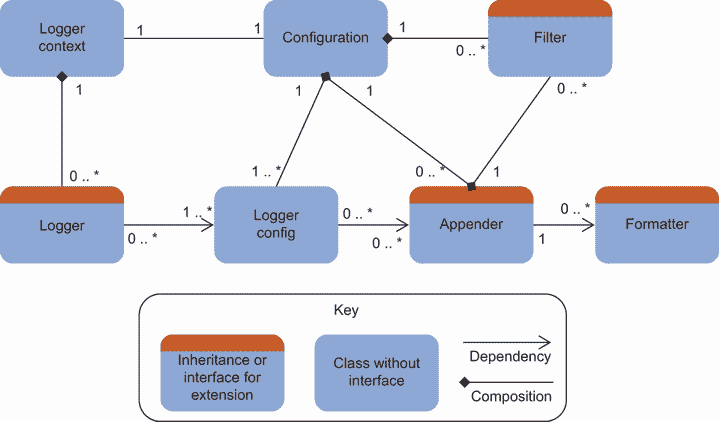
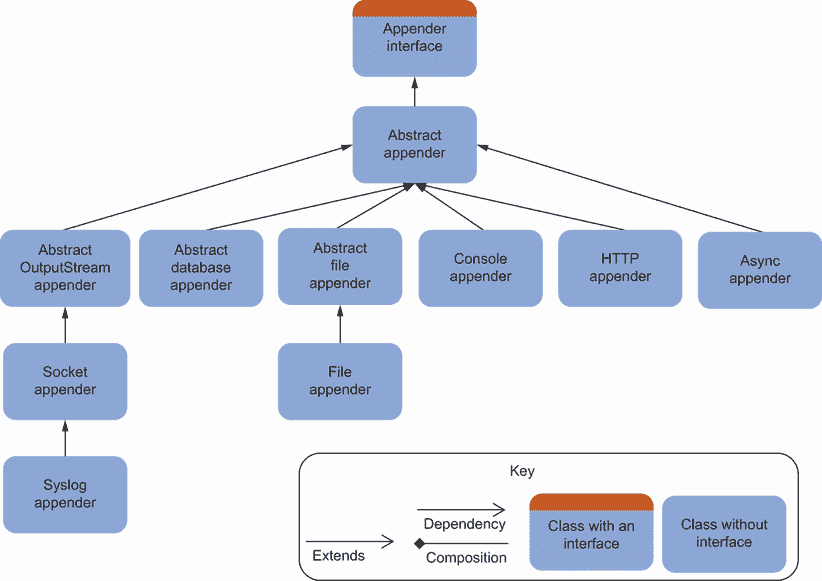

# 11 日志框架

本章涵盖

+   检查日志框架的特性

+   为应用程序选择日志框架

+   直接从日志框架调用 Fluentd

+   从没有框架的应用程序中调用 Fluentd

在上一章中，我们探讨了如何创建具有最大意义和价值的日志事件。我们还可以通过使用日志框架来轻松地从日志中获取更多价值。如今，大多数编程语言都能够使用日志框架。在某些情况下，第三方日志框架比语言原生功能出现得更早，并成为了一种事实上的标准。其他日志框架则作为应用程序容器或平台的一部分出现，以解决原生解决方案中感知或证明的弱点。

本章将探讨日志框架的格局，因为它们在能力和设计上存在许多共同点。对这一点的理解将帮助我们欣赏“可能的技艺”，并在选择框架时做出明智的决定。我们还将探讨不同语言的更主导框架是否能够支持直接连接到 Fluentd 的能力。Fluentd 也通过为多种语言提供日志库来帮助我们在这个领域，因此我们将研究这些库，以了解它们如何适应我们拥有的选项。

如果框架或 Fluentd 库不是选项，我们显然可以让我们的应用程序写入文件。我们已经看到 Fluentd 可以消费此类信息。但是通过文件连接比直接连接应用程序效率低。如果你在与 AWS Lambda 和 Oracle Cloud Functions、Microsoft Azure Functions、Google Functions 或通过 Fn Project（[`fnproject.io/`](https://fnproject.io/)）自托管函数一起工作，你会认识到这些服务非常短暂。因此，这些非常短暂的服务在高效日志记录方面更具挑战性。尝试连接到存储可能配置更复杂，连接速度更慢，因此更适合基于网络的日志记录。因此，我们将探讨如何更直接地与 Fluentd 通信。

## 11.1 日志框架的价值

无论日志框架的起源如何，它们都在一定程度上解决了以下关键主题：

+   提供一种使用日志级别分类轻松输出日志事件的方法

+   允许通过配置控制发送的日志事件

+   将日志事件定向到不同的输出形式，例如文件、stdout、HTTP 等。

虽然日志级别可以追溯到 Syslog 标准（RFC 5424，[`tools.ietf.org/html/rfc5424`](https://tools.ietf.org/html/rfc5424)）以用于应用程序开发（与导致 RFC 5424 定义的操作系统级别工具相比），但影响日志库的最强因素之一是 *Apache Log4J*。这种影响可以归因于 Apache 软件基金会将该设计和实现移植到多种不同的语言。但它的作用远不止于此。尽管基于相同的需求可以得出非常相似甚至相同的答案，但你可以在许多其他语言的日志框架中看到非常相似甚至相同的 API 和功能。一些与 Apache 软件基金会无关的日志框架公开承认借鉴了 Log4J 的设计原则。为了保持开放和透明，我进入开源领域是在我开始使用 Java 1.2 时，因此我的观点可能有些偏见。

跟随 Log4J 路线的美丽之处在于第三方可以实施框架的某些部分，因此应用程序不会看到任何差异。然而，配置可能会改变行为，例如日志的存储方式，从平面文件到数据库。我们将在下一两个部分中更详细地了解这一点。

注意：对 Log4J 的引用可能会引起一些混淆，因为有两个版本——Log4J 和 Log4J2。当今天提到 Log4J 时，可以假设它指的是版本 2。版本 1 在 2015 年被宣布已结束其生命周期。版本 1 和 2 在理念上并没有根本的不同。但版本 2 是为了解决版本 1 实现的一些弱点而重写的；这意味着实现可以编写以利用新的语言特性。

## 11.2 日志框架的典型结构

由于 Log4J 在许多日志框架和语言中的影响，最好从检查 Log4J 结构开始。我们可以轻松理解和掌握其他框架。图 11.1 展示了这种结构以及与不同类的关系（我们使用了经过一些调整的 UML 类符号，如图所示；[www.omg.org/spec/UML/](https://www.omg.org/spec/UML/))。我们可以看到涉及的类或模块是 *Logger Context*、*Configuration*、*Filter*、*Logger*、*Logger Config*、*Formatter* 和 *Appender*。



图 11.1 使用 UML 类符号表示的常见日志结构，包括表示关系中的数量，如 0 或 1 到多

在接下来的部分中，我们将描述每个组件所扮演的角色。我们根据它们的逻辑对日志框架的使用和行为影响程度对组件进行了排序。

### 11.2.1 日志上下文

这是应用程序中框架的基础。它负责保留对特定日志记录器对象的引用。它将处理任何配置文件，根据需要创建必要的日志记录器对象。

日志记录器上下文通常是一个“一站式”商店，用于处理所有日志元素；在应用程序中，这个类用于检索一个将处理相关日志事件的对象（由日志记录器对象的实例表示）。当对日志记录器上下文请求一个日志记录器对象时，它可以推导或使用参数来确定提供哪个日志记录器对象。如果没有与提供的标识符（通常是一个逻辑名称或类路径）关联的特定日志记录配置，则将提供默认的日志记录行为。

根据实现，它还可能协调任何细节，例如连接池等。这是唯一一个可以确定只有一个对象的地方，使其成为所有 Log4J 配置值的根。

### 11.2.2 追加器

追加器的任务是最容易关联的，也是处理日志事件的关键。根据具体的日志记录框架实现，追加器可能被称为*适配器*或*传输器*，因为这一层负责接收日志事件并将它们发送到适当的目的地。例如：

+   使用 TCP/IP 消息等技术进行传输

+   使用对 Logstash 等服务进行 API 调用的方式

+   将日志事件写入或追加到文件的末尾（因此得名）

每个追加器将使用过滤器来控制它可能需要追加哪些日志事件。追加器还可以使用格式化程序将事件的内部表示转换为输出方式；这可以从 JSON 到制表符分隔的行。某些类型的追加器只能以特定方式发出日志事件；这种关系有时可以简化并合并为单个类或模块。

在日志记录框架的配置中，可以看到配置了多个不同的追加器，以将某些事件发送到多个目的地，并使用不同的日志级别。

### 11.2.3 日志记录器

可以定义多个日志记录器（或仅使用上下文默认值），以便不同的应用程序部分可以以不同的方式使用日志记录。例如，为记录官方审计事件和通用应用程序审计跟踪使用单独的日志记录器。官方审计事件可能需要发送到数据库，并且所有事件，包括审计，都应该发送到日志记录框架。然后可以在代码中选择这些日志记录器。将会有不同的配置与不同的日志记录器相关联，例如使用哪个追加器、应用哪些过滤器等。

通过拥有多个日志记录器，我们可以从为代码库的不同部分调整配置中受益，甚至可以为应用程序的部分拥有多个配置（例如，将错误记录到`stdout`并将所有内容记录到文件中）。

### 11.2.4 过滤器

过滤器确定哪些日志事件应该被发出，主要是通过确定日志事件是否在配置中设置的阈值之上或之下。由于过滤器与附加器相关联，可以配置不同的日志级别到不同的日志目的地。例如，我可以将控制台附加器的日志级别设置为 `Warning`，并将文件附加器的日志级别设置为 `Info`。结果是只有 `Warning` 和 `Error` 事件会发送到控制台，但文件中包含了更多细节。

### 11.2.5 格式化器

如附加器所述，格式化器的任务是构建附加器输出，以便日志条目以所需或需要的方式呈现（例如，以 12 小时或 24 小时格式显示时间）。一些附加器将允许灵活性（例如，文件附加器）。

### 11.2.6 配置

通常，我们希望通过配置而不是代码来驱动应用程序的日志记录，因为这样可以在不必要进行侵入性代码更改的情况下配置日志。这也使得配置的验证过程更加迅速。它允许我们根据部署环境来改变日志的处理方式。例如，我们可能为开发机器配置一个将所有内容发送到 `stdout` 的配置。然而，在测试和生产环境中，配置被设置为将日志发送到 Elasticsearch。

### 11.2.7 日志记录器配置

日志记录器配置是特定日志记录器总日志配置的一个子集（参见第 11.2.3 节）。这将跟踪相关的配置部分并将其转换为代码中的正确对象。这可能包括使用工厂设计模式等。

## 11.3 附加器结构

通常，通过继承或封装的层次结构来构建附加器，以便每一层复杂性都可以利用更简单的操作。最终，这将取决于标准接口定义，以便无论附加器如何，它们都以相同的方式进行编排，就像 Fluentd 对其插件所做的那样。在图 11.2 中，我们可以看到 Log4J 是如何通过从实现接口并提供公共逻辑的基本类进行继承来组织其附加器的。然后从这个派生层扩展，提供一组基本附加器，例如控制台附加器。从这个派生层，我们看到层叠构建了专业化的增加。这最显著的是 `AbstractOutputStreamAppender`，它随后用于一般的套接字用例，并进一步专门化以将日志发送到符合 Syslog 的解决方案。



图 11.2 Log4J 的一些附加器关系的 UML 表示

## 11.4 日志框架概览

日志框架的数量相当多，大多数语言都有本地的能力以及开源框架。在附录 E 中，我们收集了一系列常用语言的日志框架列表。我们还提供了一些关于主导框架的详细信息，其中一些是语言本地的选项，以及如何获取更多信息。

除了日志记录框架之外，一些库提供了程序化接口以及 API 与几个不同流行框架之间的映射。熟悉 Log4J 的人可能听说过*SL4J* ([www.slf4j.org](http://www.slf4j.org))，它抽象了 Java 本地的日志框架 Log4J，另一个叫做 Logback。因此，可以透明地切换日志框架。有了这些抽象，需要一种实例化所需日志框架的方法。这可以通过实现工厂([`mng.bz/KB00`](http://mng.bz/KB00))或依赖注入([`mng.bz/DxZw`](http://mng.bz/DxZw))模式来实现。这种抽象的另一个例子是.NET 本地的日志记录（更多详情请见[`mng.bz/9KV1`](http://mng.bz/9KV1))。

## 11.5 选择框架

当评估要采用的日志框架时，应考虑一些因素以帮助选择最合适的框架。我们开发了一套问题，这些问题将帮助你评估需求并选择满足这些需求的框架。通过审查这些问题，将有助于确定你在日志框架方面的优先级。一旦这些问题被赋予了某种形式的优先级，评估框架与问题的匹配程度将更容易，以查看它们如何满足你的需求。问题如下：

+   可用的追加器有哪些？它们是否仅限于一种类型的追加器，例如文件？是否有现成的追加器可以与你的日志统一解决方案一起工作，例如 Fluentd 或 Logstash？

+   是否可以定制或优化追加器的行为？例如，日志轮转或网络端口和地址是否可配置？

+   是否可以根据应用程序的不同部分定制日志事件的输出？例如，应用程序框架（如 Spring 或 Core .Net）的日志阈值设置为`Warning`和`Error`，但你的自定义逻辑可以设置阈值为`Info`。

+   定制日志配置（不使用代码）有多容易？你可能希望调整日志记录，如果存在操作问题，理想情况下可以更新或覆盖默认的日志配置，以选择性地获取更多信息。

+   框架为你提供了多少信息（例如，为跟踪点提供方法和类名）以及正确结构的时戳？

+   是否可以定制日志输出格式（例如，JSON，XML）？这个问题反映了前一章中提到的最佳日志具有结构，允许日志事件既可读性又可机器读取。

+   脚印有多紧凑（这在物联网用例中很重要）？对于物联网和移动解决方案，我们需要有一个紧凑的脚印来限制资源使用。

+   您能否使日志输出安全——使用 TLS、加密文件等？安全性是否足够处理所处理的数据？

+   框架会对我的应用程序的吞吐量/性能产生重大影响吗，尤其是在最终的 I/O 阶段？日志是否会变成一个线程阻塞机制？

+   日志框架的 API 是否易于使用？如果应用程序代码中的调用难以使用，开发者可能会避免创建日志事件。理想情况下，接口将是直观的，但拥有良好的支持文档进行参考可能非常有价值，尤其是对于刚开始他们职业生涯的开发者。

而不是评估所有可能的选择，尝试缩小选择范围是值得的。附录 E 中的 E.11 表格中的细节可以在这里有所帮助，因为它们反映了我们认为最重要的和/或最占主导地位的日志框架。

### 11.5.1 将优化应用程序日志投入实际应用

您组织中的 Fluentd 采用情况良好，您被要求确定当前使用的日志框架是否能够满足未来的需求，或者 Fluentd 的成功是否允许支持更改日志框架的情况。使用所描述的因素，评估您的开发团队正在使用的当前解决方案。将其与一个替代方案进行比较（查看附录 E，看看是否提供了替代选项）。

答案

由于我们显然无法为这个练习提供特定的解决方案，我们希望您已经发现您已经在使用一个日志框架，并且它与您的需求很好地匹配。如果您的日志框架并不非常适合，您可能已经发现了问题。如果您还没有确定当前框架的问题，这份考虑事项列表应该有助于确定问题。

## 11.6 Fluentd 自身的日志和追加器

如果正在使用的日志框架没有提供针对 Fluentd 的特定支持，会发生什么？有几种方法可以克服这个问题。一种方法是通过使用 Fluentd 提供的库。

根据语言的不同，Fluentd 日志库的实现可能包含之前描述的一些或所有结构，例如追加器和过滤器。这些实现可能与本地语言的日志库一起工作并扩展它，例如 Python 和 Ruby。在其他情况下，Fluentd 库与框架不匹配，通常在没有本地语言日志库或已确立的占主导地位解决方案的情况下。在这些情况下，库将更加直接，并且需要直接从您的代码中使用。

您可能已经建立了一个没有连接到 Fluentd 功能的日志框架，并且 Fluentd 提供的库不会自动集成到框架中。在这些情况下，可能可以找到额外的开源软件来包装或扩展 Fluentd 库，以便在框架结构中使用。我们可以仅通过配置来更改日志事件的处理方式，而不会影响应用程序代码。当然，您也可以创建代码来填补这个差距。根据语言、Fluentd 库和框架的组合，这最棘手的部分很可能是如何向 Fluentd 库提供配置值。

在表 11.1 中，我们可以看到 Fluentd 如何通过库支持不同的编程语言。我们还建议了其他开源选项，这些选项将允许日志代码与 Fluentd 通信。

表 11.1 Fluentd 可以直接或间接集成到本地或常用框架中的位置

| 语言 | 是否有本地日志库 | Fluentd 日志库 | 其他开源解决方案 |
| --- | --- | --- | --- |
| Erlang | Y | [`github.com/fluent/fluent-logger-erlang`](https://github.com/fluent/fluent-logger-erlang) |  |
| Go | N | [`github.com/fluent/fluent-logger-golang`](https://github.com/fluent/fluent-logger-golang) |
| Java | N | [`github.com/fluent/fluent-logger-java`](https://github.com/fluent/fluent-logger-java) | Log4J: [`github.com/tuxetuxe/fluentd4log4j`](https://github.com/tuxetuxe/fluentd4log4j) |
| Node.js | N | [`github.com/fluent/fluent-logger-node`](https://github.com/fluent/fluent-logger-node) | 直接与 Log4JS 集成 |
| OCaml | N | [`github.com/fluent/fluent-logger-ocaml`](https://github.com/fluent/fluent-logger-ocaml) |  |
| Perl | N | [`github.com/fluent/fluent-logger-perl`](https://github.com/fluent/fluent-logger-perl) | Log4perl: [`metacpan.org/pod/Log::Log4perl::Appender::Fluent`](https://metacpan.org/pod/Log::Log4perl::Appender::Fluent) |
| PHP | N | [`github.com/fluent/fluent-logger-php`](https://github.com/fluent/fluent-logger-php) | [`github.com/Seldaek/monolog`](https://github.com/Seldaek/monolog) |
| Python | Y | [`github.com/fluent/fluent-logger-python`](https://github.com/fluent/fluent-logger-python) |  |
| Ruby | Y | [`github.com/fluent/fluent-logger-ruby`](https://github.com/fluent/fluent-logger-ruby) |  |
| Scala | N | [`github.com/fluent/fluent-logger-scala`](https://github.com/fluent/fluent-logger-scala) | 通过 Logback 与 SLF4S 的兼容性 |

如果您没有合适的日志框架或包装层，那么您可以直接在核心应用程序代码中使用 Fluentd 日志库。与所有事情一样，这种方法也有其优缺点。因此，在表 11.2 中，我们列出了直接使用库的优缺点，以帮助您做出明智的决定。

表 11.2 使用 Fluentd 自带的日志框架的优缺点

| 优点 | 缺点 |
| --- | --- |
| 脚本占用小，因为它只为输出到 Fluentd 提供支持 | 锁定使用 Fluentd。对于打包解决方案，你最好不要尝试强制其日志工作方式与它提供的选项不同。这可能更适合考虑一个自定义插件或找到一个折衷的配置。 |
| Fluentd 日志库提供了与其他框架相同的程序员接口，提供了可比的开发体验。但 Fluentd 服务器在处理日志事件方面提供了比日志框架更复杂的处理能力。 |  |
| 与 Fluentd 的通信是通过网络进行的。使用 msgpack 压缩意味着高效的通信，并可以限制托管复杂性（例如，容器的外部存储，FaaS 的存储复杂性）。 |  |

将日志直接发送到 Fluentd 的最终可能选项是利用框架的插件通过 TCP/IP 或 HTTP(s)进行通信，并使用这些协议发送日志事件。这些路径意味着你没有任何库依赖（假设你的编程语言可以提供基本的网络功能）。

## 11.7 直接将应用程序日志记录到 Fluentd 的示例

现在我们已经了解了日志框架的结构，选择日志框架时需要考虑的因素，以及在没有框架的情况下直接将日志发送到 Fluentd 的可能性，让我们看看不同的直接日志记录方法在现实中是如何表现的。每个示例都将进一步偏离理想的抽象连接到 Fluentd，但将展示如何实现直接通信。在每种情况下，我们将传输一个简单的日志消息到 Fluentd。

对于这些示例，我们选择使用 Python，因为它

+   支持使用 Fluentd 库与其本地的日志框架一起使用，以展示最理想的选项

+   是一种广泛使用的语言，其语言结构易于阅读并映射到其他语言

+   是一种脚本语言，因此不需要额外的努力来设置和运行编译过程（与 Java、C#等相比）

+   与 Fluentd 的实现语言不同，因此有助于说明与 Fluentd 合作的语言无关性

### 11.7.1 使用日志框架的 Python：使用 Fluentd 库

在大多数情况下，将 Fluentd 库直接插入到日志框架中是理想的，因为我们可以在不更改任何代码的情况下配置不同的日志记录方式。让我们从创建由配置文件驱动的日志框架的代码开始；然后我们的应用程序使用该框架记录日志事件。为了实现这个示例，我们需要建立一些代码和配置，我们将在接下来的列表中回顾：

+   一个简单的 Python 测试应用程序，用于使用日志框架并生成日志事件

+   一个配置文件，用于告知日志框架如何以及记录什么

+   一个 Fluentd 服务器和配置，以便它可以接收日志事件

在第 11.1 节中显示的代码中，我们可以看到 Python 测试应用程序，它从配置文件中创建一个配置对象，并将其传递到日志上下文中，然后请求一个日志记录器对象。有了日志对象，我们可以多次使用该对象。在我们的示例中，我们然后在日志消息中构建内容——这里，日期时间的字符串表示。然后日志框架被调用两次，一次作为文本消息，再次作为 JSON 结构。当您查看代码时，请注意 Fluentd 引用的完全缺失。这一切都是根据配置由日志框架为我们处理的。

列表 11.1 第十一章/clients/log-conf.py—测试 Python 客户端—配置信息

```
import logging
import logging.config
import yaml

with open('logging.yaml') as fd:                           ❶
    conf = yaml.load(fd, Loader=yaml.FullLoader)

logging.config.dictConfig(conf['logging'])

log = logging.getLogger()                                  ❷

now = datetime.datetime.now().strftime("%d-%m-%Y %H-%M-%S")
log.warning ('from log-conf.py at ' + now)                 ❸
log.info ('{"from": "log-conf.py", "now": '+now+'"}')      ❹
```

❶ 加载配置文件，该文件将描述所需的日志设置

❷ 获取正确的日志记录器对象；由于没有提供特定的名称，我们将得到默认设置

❸ 生成日志事件

❹ 对于传递给库的日志事件，最好是创建 JSON。但首先构建 JSON 对象会分散我们试图说明的重点。

第 11.2 节中显示的配置是应用程序中加载的详细信息，并由日志框架解释以建立所需的日志方式。只有配置将驱动日志通过定义 *处理器*（或使用我们之前描述的命名方式称为附加器）直接与 Fluentd 通信。注意配置实体如何关联回图 11.1 中所示的结构，其中日志记录器通过名称引用处理器（附加器），处理器引用用于与 Fluentd 一起工作的格式化程序。在这里，过滤器没有解耦，而是在日志记录器和处理器中使用 `level` 属性指定。

列表 11.2 第十一章/clients/logging.yaml—测试 Python 客户端：配置

```
logging:
  version: 1

  formatters:                                        ❶
    fluent_fmt:
      '()': fluent.handler.FluentRecordFormatter     ❷

      format:
        level: '%(levelname)s'
        hostname: '%(hostname)s'
        where: '%(module)s.%(funcName)s'

  handlers:                                          ❸

    fluent:
      class: fluent.handler.FluentHandler            ❹
      host: localhost
      tag: test
      port: 18090
      level: DEBUG
      formatter: fluent_fmt

  loggers:                                           ❺

    '': # root logger
      handlers: [fluent]
      level: DEBUG
      propagate: False   
```

❶ 定义日志事件将如何表示

❷ 我们仍然需要告诉日志框架哪个类将实现格式化器接口。在这里，我们有一个用于 Fluentd 的自定义格式化器，因此服务器将接收到正确结构的日志事件。

❸ 定义处理器（附加器）并提供与我们的 Fluentd 节点通信所需的配置

❹ 识别知道如何实际与 Fluentd 服务器通信的类

❺ 定义默认日志记录器对象和默认设置，并将默认日志配置链接到相关处理器

为了使 Fluentd 能够与示例一起工作，我们提供了一个配置文件。如果您查看第 11.3 节中的配置文件，您将看到配置了两个来源。使用 `forward` 输入插件的来源将接收日志事件。您可以通过比较配置文件中的端口号和日志记录器 YAML 文件来确认这一点；我们将在稍后使用另一个来源。

列表 11.3 第十一章/fluentd/http.conf—简单的 HTTP 来源

```
<system>
    Log_Level debug      ❶

</system>
<source>
    @type http
    port 18080
    <parse>
      @type none         ❷

    </parse>
</source>

<source>
    @type http
    port 18085
    <parse>
        @type json      ❸
    </parse>
</source>

<source>                ❹
    @type forward
    port 18090
</source>

<match *>
    <format>
        @type json
    </format>
    @type stdout
</match>
```

❶ 将日志设置为调试以帮助我们理解正在发生的事情。鉴于 HTTP 的行为高度可配置，让我们确保假设的配置是兼容的。

❷ 在这个阶段，我们不必担心预期的结构，将日志事件作为通过 HTTP 接收的单个字符串处理。

使用不同的端口，我们可以通过 HTTP 以 JSON 结构获取日志事件。

使用转发插件，我们可以以 JSON 文本或使用 msgpack 压缩的形式接收有效负载。

要启动，我们需要两个 shell 窗口；在导航到包含所有提供资源的文件夹后，可以使用以下命令启动 Fluentd：

```
fluentd -c Chapter11/Fluentd/http.conf
```

这之后，导航到`Chapter11/clients`文件夹并执行以下命令

```
python log-conf.py
```

执行后，您将看到 Fluentd 服务器将以 JSON 格式将生成的日志事件写入控制台。

### 11.7.2 直接调用 Fluentd 附加器

现在，让我们看看如何使用 Fluentd Python 库直接从我们的应用程序而不是日志框架中查看代码可能的样子。虽然这是 Python 实现，但大多数支持的语言的日志库工作方式相似。显然，由于编程语言的工作方式限制，每种实现可能都有所不同。例如，Go 没有像 Python 和 Java 那样的类和继承，而是有模块和类型。

为了便于比较直接调用 Fluentd 日志库的方法与使用日志框架的方法，我们创建了一个新的 Python 测试客户端，如列表 11.4 所示。第一个明显的区别是我们需要显式地将 Fluentd 库导入到我们的代码中。我们的代码不再建立日志上下文和日志对象，而是与一个发送者交互，这是一个特定的实现，即附加器（或 Python 所说的处理器）。发送者对象使用连接到 Fluentd 所需的配置来构建（当然，您也可以从通用配置文件中检索这些数据）。与之前一样，我们正在构建要放入日志事件消息中的时间。然后，最后，我们可以使用 Fluent 库的`emit`或`emit_with_timestamp`函数来传输日志事件。emit 函数需要将有效负载表示为哈希表（或使用 Python 的命名，即字典）。

列表 11.4 Chapter11/clients/log-fluent.py—直接使用 Fluentd 库

```
import datetime, time
from fluent import handler, sender                               ❶

fluentSender =
   sender.FluentSender('test', host='localhost', port=18090)     ❷

now = datetime.datetime.now().strftime("%d-%m-%Y %H-%M-%S")
fluentSender.emit_with_time('', int(time.time()),
➥{'from': 'log-fluent','at': now})                              ❸
```

直接依赖 Fluentd 库的导入

创建 Fluentd 处理器的实例

发送日志事件

要看到此场景运行，需要重新启动 Fluentd，就像我们在 11.7.1 节中所做的那样。这意味着当收到日志事件时，它们将在 Fluentd 的控制台会话中显示。然后，在第二个 shell 中，我们需要在`Chapter11/clients`文件夹中运行以下命令

```
python log-fluent.py
```

### 11.7.3 仅使用 Python 的日志库的示例

在之前的示例中，日志记录直接使用了 Fluentd 日志库（使用其发送对象）和间接使用（使用 Python 日志框架和配置）。这次，我们将探讨在不使用 Fluentd 库的情况下如何工作。如果您检查 Fluentd 库的代码，您会发现该库使用我们在第三章和第四章中遇到的 msgpack 压缩机制。Msgpack 是 Fluentd 的一部分，而不是 Python 日志本身的本地部分。因此，当仅使用本地层工作时，我们无法从 msgpack 提供的压缩中受益。克服这一点的唯一方法是我们实现自己的格式化代码，该代码使用 msgpack。

在不开发自己版本的 Fluentd 库的情况下，下一个选项是使用预构建的 Python 日志处理器（或我们称之为附加器）直接与 Fluentd 通信。这种方法对 Python 来说价值不大。但如果您想在另一种语言中使用比较方法，这可能是有必要的。

由于并非所有语言都能从 Fluentd 库中受益，让我们看看在没有这种帮助的情况下需要如何实现。在这种情况下，我们将利用预构建的 `HTTPHandler`（大多数语言都有类似的功能）。与前面的示例一样，我们提供了另一个客户端实现，如列表 11.5 所示。为了使其工作，我们实例化一个 Python `HTTPHandler` 用于日志记录，并包含必要的连接细节。请注意，在连接中，我们分别提供了服务器地址和 URL 路径。Fluentd 预期的是一个路径，而不是尝试与根地址通信。我们提供了一个自定义格式化程序并将其附加到处理器上。然后我们通过相同的格式化过程来形成日志事件的一部分，并使用日志事件字符串调用日志记录器对象。

使用预构建的 HTTPHandler 意味着 Fluentd 配置需要包含一个 HTTP 源插件，这我们已经完成了。

列表 11.5 Chapter11/clients/log-simple.py—直接使用 Fluentd 库

```
import logging, logging.handlers                              ❶
import datetime
testHandler = logging.handlers.HTTPHandler('localhost:18080',
➥ '/test', method='POST')                                    ❷

custom_format = {
  'host': '%(hostname)s',
  'where': '%(module)s.%(funcName)s',
  'type': '%(levelname)s',
  'stack_trace': '%(exc_text)s'
}
myFormatter = logging.Formatter(custom_format)
testHandler.setFormatter(myFormatter)

log = logging.getLogger("test")                               ❸
log.addHandler(testHandler)                                   ❹
now = datetime.datetime.now().strftime("%d-%m-%Y %H-%M-%S")
log.warn ('{"from":"log-simple", "at" :'+now+'"}')            ❺
```

❶ 需要导入日志和处理器所需的核心类

❷ 创建 HTTPHandler 并提供详细信息；在受保护的生产环境中，这还包括使用证书。

❸ 如果尚未存在，则创建要使用的记录器

❹ 我们将创建的日志处理器添加到根日志对象中，以便使用。

❺ 调用处理器。在实现特定语言的代码版本时，理想情况下您会使用库来生成 JSON，而不是手动注入。

要运行此示例，请像之前一样打开两个外壳。导航到根文件夹，然后启动 Fluentd。一旦运行，请在每个外壳中使用以下命令执行 Python 脚本（对于 Python 脚本，请从 `Chapter11/clients` 文件夹执行）：

```
fluentd -c Chapter11/Fluentd/http.conf
python log-simple.py
```

### 11.7.4 无 Python 的 logging 或 Fluentd 库的示例

虽然在现实世界中没有停止使用 Python 日志框架的理由，但在其他语言中可能没有这样的选择，所以让我们看看这可能会是什么样子。为了保持连贯性和便于比较，我们将使用 Python 来演示这一点。大多数语言都提供了与 HTTP 服务交互的手段，而不需要任何依赖。我们可以与 Fluentd HTTP 源插件交互，因为我们已经消除了 Fluentd 的日志库。但现在我们负责构建所有的 HTTP 头部，处理 HTTP 连接以保持其开启，以及关闭连接，如列表 11.6 所示。这个列表遵循了之前客户端文件的相同模式，以便于进行并排比较。

如您所见，代码通过填充诸如内容类型和内容长度等详细信息来填充头部。这在很多方面应该感觉熟悉，因为这些几行代码与我们第二章中“Hello World”场景中配置 Postman 的方式完全相同。由于这是使用 HTTP 连接，我们再次没有从 msgpack 压缩中受益。

列表 11.6 Chapter11/clients/log.py—无任何支持的日志记录

```
import httplib, urllib
import datetime

message = '{"from":"log.py", "at":"'+datetime.datetime.now().strftime
➥ ("%d-%m-%Y %H-%M-%S")+'"}'
headers = {"Content-Type": "application/JSON", "Accept": "text/plain",
➥ "Content-Length":len(message)}                     ❶
conn = httplib.HTTPConnection("localhost:18085")      ❷
conn.request("POST", "/test", message, headers)       ❸

response = conn.getresponse()
print response.status, response.reason
conn.close()                                          ❹
```

❶ 手动填充 HTTP 头部属性

❷ 创建连接

❸ 发送日志事件

❹ 我们负责关闭资源。

假设 Fluentd 服务器仍然在运行之前的示例中，那么我们只需要运行命令（从 `Chapter11/clients` 文件夹）

```
python log.py
```

如前所述，我们应该期待看到日志事件被写入 Fluentd 服务器控制台。

### 11.7.5 将 Fluentd 调用端口到另一种语言的实现

您所在的公司正在其制造设施中试用一些具有自定义功能的智能设备。目前已知这些试用智能设备支持包括 Java、Python 和 Ruby 在内的几种核心语言。已经提出了一种观点，即智能设备在需要或必须发送数据时会调用中央服务器。这样做可以通过在需要时才开启无线电源来节省电池电量。这个原则可以应用于记录智能设备遇到的问题。为了尽可能保持软件占用空间最小，您被要求不要添加任何额外的库。您被要求提供一个概念证明，以证明设备是否可以直接与您当前的 Fluentd 基础设施通信，而不是需要一个作为智能设备和 Fluentd 之间代理的定制解决方案。

答案

我们的主要语言是 Java 和 Groovy（Groovy 运行在 Java 虚拟机上）。我们已经使用原生 HTTP 调用创建了一个小的 Groovy 示例，用于连接 Fluentd 服务器。这个示例可以在 `Chapter11/ExerciseResults/native-fluentd .groovy` 中找到。Groovy 虽然带来了一些开销，但允许我们快速地生成证明，因为我们不需要设置构建和打包环境（我们已经在书中介绍了 Groovy 的设置）。

你应该已经使用你喜欢的语言产生了类似的结果，并使用我们简单的 Fluentd 配置或你自己的配置来展示结果。

### 11.7.6 使用通用 appender：要点

正如你所见，使用通用协议是可能的，但这确实增加了开发工作量。此外，如果不付出更多努力，你将无法获得 msgpack 的好处，也不知道库已经被验证。因此，如果你不能使用预构建的 Fluentd 库，考虑寻找或开发一个包装器，该包装器将翻译日志框架与 Fluentd 库提供的接口之间的工作方式。

## 摘要

+   如果事件日志可以直接从应用程序发送，而不必求助于使用中介，如文件，那么可以从中获得效率。

+   许多日志框架具有一组共同的特征，尽管它们通常被称作不同的名称。这些特征包括一个抽象的机制，用于将日志发送到一种消费者类型（称为*appender*、*handler*或*sender*）。另一个共同元素是一个解耦的格式化器，它将待表示的日志事件转换为下游可以理解的形式。

+   在审查日志框架时，需要就框架提出一些问题，以确定其适用性：它是否有为 Fluentd 或其他组件提供的本地 appender？是否可以回退到写入文件？是否可以通过 HTTP(S)或 TCP/IP 传输日志事件？

+   Fluentd 提供了一系列支持各种编程语言的日志库，包括 Ruby、Java、Python 等。在某些情况下，这些库可以与语言的本地日志框架集成。
