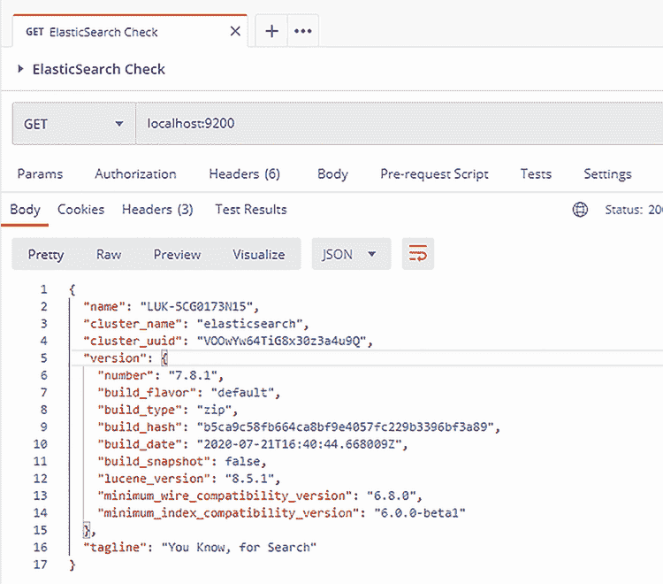
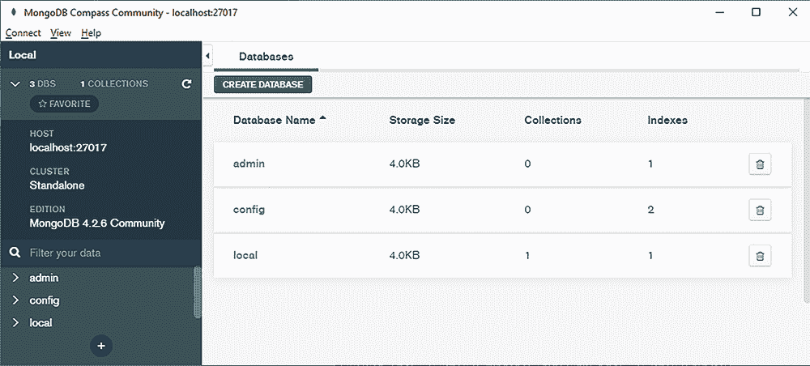
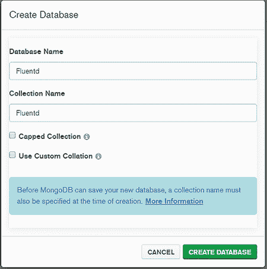
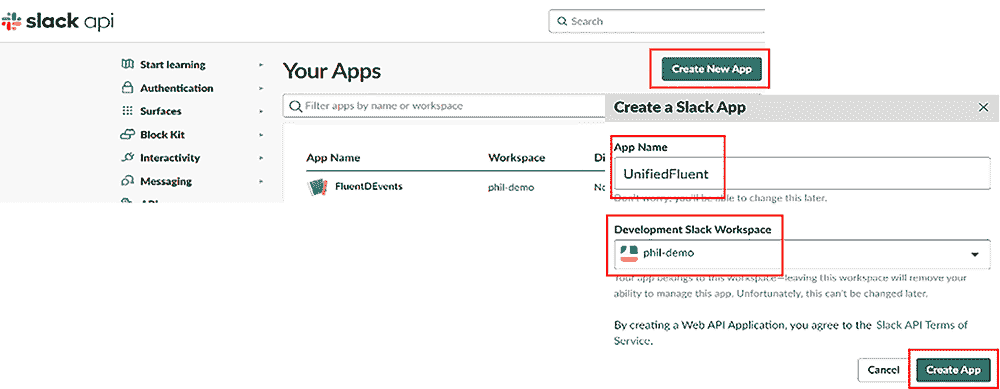
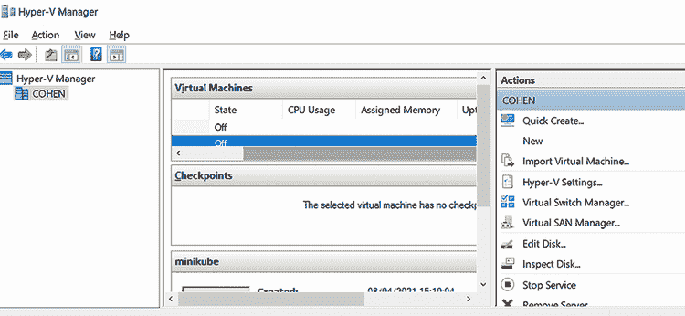
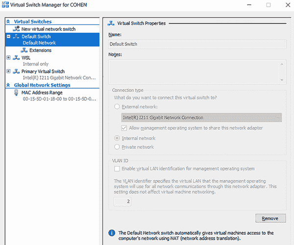

# 附录 A. 安装额外的工具和服务

## A.1 工具安装概述

本书除了运行 Fluentd 所需的组件和工具外，还使用了其他组件和工具。这些有助于说明 Fluentd 如何工作以及如何与其他功能集成，例如 MongoDB 和 Elasticsearch。第二章探讨了 Fluentd 和 Fluent Bit 的安装和配置，因为它们是本书的核心，包括 Fluentd 对 Ruby 的依赖以及 LogGenerator 的使用。如果您想尝试书中描述的场景，您将不得不下载并安装附录中描述的工具。

以下章节提供了足够的细节，以安装支持本书中示例的工具。如果没有指定安装值，则应假定默认值。要将安装转换为生产级部署，您需要查阅额外的资源，其中许多资源可在附录 E 中找到。

尽管我们已经努力确保涵盖 Windows 和 Linux 的安装，但与它们相关的 Linux 版本和包管理器（yum、apt 等）很多，这使得事情变得复杂。为了测试 Linux 说明，我们使用了 Ubuntu 18 LTE。这意味着您可能需要调整特定 Linux 版本的操作步骤。如果您可以访问社交媒体或在线 Manning 论坛，请随时分享这些调整。

注意：正如您可能知道的，Linux 和 Windows 的目录和文件路径在使用正斜杠和反斜杠时有所不同。本书中使用的许多工具无论在哪个操作系统上都可以使用相同的命令。因此，我们没有为这两种类型的操作系统提供相同的命令。我们假设您将能够识别何时根据您的平台反转反斜杠。

## A.2 创建环境变量和修改 PATH

设置环境变量和扩展`PATH`环境变量是一个常见的需求。让我们以设置 JAVA 为例来总结如何完成这项工作。后续安装将参考本节。要检查`PATH`是否可能需要修改，我们可以在 Windows 上使用`echo %PATH%`和在 Linux 上使用`echo $PATH`来查看其值。

### A.2.1 Windows

以下操作需要谨慎进行，因为它代表系统级更改。在以下命令中，将`<path addition>`替换为新路径——例如，`c:\java\bin`：

```
setx path "%path%;<path addition>"
```

关于`setx`的更多文档，请参阅[`mng.bz/jyAP`](http://mng.bz/jyAP)。

在 Windows 中，您可以通过设置 UI 和搜索环境变量来进行更改。这将定位用于操作`PATH`和其他环境变量的 UI 元素。具体步骤在不同版本的 Windows 之间略有不同。如果您使用这种方法，任何 shell 窗口都需要重新启动才能看到更改。

### A.2.2 Linux

根据你的 Linux 版本，如果你安装了桌面 UI，它很可能提供基于 UI 的更新`PATH`的解决方案。然而，鉴于可用的 UI 多样性，没有标准答案，但这是一个常见需求，因此网络搜索应该会给出答案。

在以下命令中，将 `<path addition>` 替换为相关路径（例如，`/etc/java/bin`）。这将把该目录添加到执行命令的 shell 的路径中：

```
export PATH="$PATH:<path addition>"
```

要使更改在系统范围内生效，将之前的命令添加到 shell 脚本中（例如，`setup-for-fluentd.sh`），并将 shell 脚本保存在`/etc/profile.d`文件夹中。确保 shell 脚本可执行（如果需要，运行`chmod a+x setup-for-fluentd.sh`）。有关在 Linux 中操作`PATH`的更多信息，请参阅[`bit.ly/SetLinuxPath`](https://bit.ly/SetLinuxPath)。

## A.3 Java 和 Groovy

这些两个元素的核心细节在第二章中有所介绍，因为它们是使用 LogSimulator 的基本要素。如果你希望在包管理器之外工作，可以在此处检索适当的安装资源：

+   Java: [www.java.com/en/download/manual.jsp](https://www.java.com/en/download/manual.jsp)

+   Groovy: [`groovy-lang.org/install.html`](https://groovy-lang.org/install.html)

如果你希望将 LogSimulator 用作 Groovy 实用工具，那么建议你注意与 Java 的兼容性细节，尤其是考虑到 Java 发布周期更快。并非所有版本都是长期版本，因此需要测试兼容性。

## A.4 Postman

在第二章中，我们使用了 Postman 来发送基本的 HTTP 日志事件。可以通过访问[`identity.getpostman.com/login`](https://identity.getpostman.com/login)以简化浏览器的方式使用 Postman；它确实需要一个免费账户来设置。或者，可以从[www.postman.com/downloads](https://www.postman.com/downloads)安装桌面解决方案。

## A.5 Elasticsearch

本节探讨了 Elasticsearch 的基本设置。Elasticsearch 是一个常用的日志分析活动存储库，因此是 Fluentd 的重要目标。我们只涵盖足够的内容，以便我们能够使用 Fluentd，因此，要更全面地了解 Elasticsearch，请参阅 Radu Gheorghe 等人撰写的《Elasticsearch In Action》（Manning，2015）一书，可在[`www.manning.com/books/elasticsearch-in-action`](https://www.manning.com/books/elasticsearch-in-action)找到。

### A.5.1 核心 Elasticsearch 安装

可以下载 Elasticsearch 的二进制文件，这些文件可以从 [`www.elastic.co/downloads/elasticsearch`](https://www.elastic.co/downloads/elasticsearch) 获取。这包括针对不同 Linux 版本的包管理器版本，以及 zip 和 tar 格式。为此，我们将使用 zip 或 gzip/tar，具体取决于平台。下载后，解压缩压缩文件。对于 Windows，我们将假设 `c:\dev\elasticsearch` 为目标，以及类似 `/usr/bin/elasticsearch` 的路径。Windows 安装需要安装 Microsoft Universal C Runtime Library（可从 [`mng.bz/W7M1`](http://mng.bz/W7M1) 下载）。

为了方便起见，将 Elasticsearch 的 bin 文件夹（例如，`C:\dev\elasticsearch-x.y.z\bin`，其中 `x.y.z` 是版本号）添加到 `PATH` 中，如 A.2 节中所述。如果您遇到任何问题，Elasticsearch 提供了一套全面的说明，可在 [`mng.bz/8l2w`](http://mng.bz/8l2w) 找到。

要启动 Elasticsearch，我们可以运行 shell 脚本 `elasticsearch` bat 或 bash 脚本。或者，可以使用 `elasticsearch-service` 脚本将其添加、移除和控制为服务，以下是一些参数：

+   安装

+   移除

+   启动

+   停止

Linux 中守护进程服务的等价物是 `elasticsearch -d -p pid`，其中 `pid` 代表一个用于存储服务详细信息的文件。可以使用 `Postman` 在 `localhost:9200` 上执行 GET 请求来验证 Elasticsearch 的安装和启动。成功的结果将返回一个 JSON 有效负载，反映 Elasticsearch 服务器的状态。这如图 A.1 所示。



图 A.1 使用 Postman 验证 Elasticsearch 安装

### A.5.2 Elasticsearch UI 安装

要查看 Elasticsearch 的内容，而不是使用 Postman 构建表达式，我们可以利用可用的 UI 之一。为了本书的目的，我们发现 Elasticvue 既有易用性，又非常简单易安装。Elasticvue 可以从 [`elasticvue.com`](https://elasticvue.com) 获取，并提供作为 Chrome、Firefox、Microsoft Edge 的浏览器扩展、Web 应用或 Docker 镜像的安装。我们采用了 Chrome 扩展，因为它无需配置，并且本地运行以适应 localhost 地址。此安装需要您从 Elasticvue 网站链接到 Chrome 商店，然后点击“添加到 Chrome”按钮。

一旦启动了 Elasticsearch 并打开了扩展，您只需确认要连接的服务器（http:/./localhost:9200）。一旦连接，Elasticvue 将提供有关服务器的统计信息，选择索引菜单将显示索引。这包括在运行示例后我们将使用的那些索引。

### A.5.3 Fluentd 插件用于 Elasticsearch

Fluentd 的`td_agent`版本包含 Elasticsearch 插件`out_elasticsearch`。然而，未经修改的 Fluentd 版本并不包含它。因此，有必要使用命令`fluent-gem install fluent-plugin-elasticsearch`手动安装插件。

## A.6 Mongo 数据库

我们首先在第四章中使用了 MongoDB 作为备选输出目标。MongoDB 在企业和社区版中都可用。我们将坚持使用社区版，因为它提供了我们需要的功能，并且不受商业许可的约束。除了核心 MongoDB，我们还想拥有 MongoDB 图形用户界面（GUI）*Compass*，它也有不同的版本。我们将使用免费版。

### A.6.1 Mongo DB 安装

MongoDB 为 Windows 提供 MSI 安装程序，并为 Linux 和 macOS（RPM、DMG）等提供其他包管理工具。您可以通过访问[www.mongodb.com/download-center/community](http://www.mongodb.com/download-center/community)下载当前版本。

注意：RPM 代表*Red Hat Package Manager*，DMG 代表*磁盘镜像*。

我们将假设使用 MSI 安装的最新稳定版本，因为它简单快捷，非常适合在开发环境中设置。在生产环境中，您更有可能根据您的基础设施和用例采用不同的安装策略——例如，在微服务环境中使用 Docker 或检索本地二进制文件和手动编写的配置文件以利用网络存储解决方案，如 SANs（存储区域网络）。

根据您的操作系统权限，您可能需要在 Windows 中以本地管理员身份运行 MongoDB 或在 Linux 中使用基于 root 的权限（使用`sudo`）。在标准的操作系统配置中，这无疑是必要的。

下载 MSI 后，开始安装。安装程序是自我解释的；请确保您选择推荐的*完整*设置。几个进一步的步骤后，安装程序将提供安装 Compass 的选项；请确保此选项被勾选。

### A.6.2 MongoDB 配置

安装完成后，应启动 Compass，它将提供一个连接按钮（如果您的包管理器安装没有启动 Compass，请手动启动）。Compass 将显示一个带有基本设置的屏幕。点击图 A.2 所示的连接按钮。



图 A.2 通过 Compass UI 工具查看的 MongoDB 数据库

最后一步是建立一个用于存储日志事件的数据库。点击图 A.2 所示的创建数据库按钮。此操作将带我们到一个弹出窗口，该窗口将要求输入数据库和集合名称。为了我们的目的，我们将它们都称为`Fluentd`，如图 A.3 所示。



图 A.3 MongoDB Compass 创建数据库弹出窗口——为我们的示例定义数据库的最简单方法

我们不想指定任何 MongoDB 限制（固定集合）或对集合的定制。这意味着确保复选框没有被勾选。有了这个，我们就完成了 MongoDB 的设置，你可以点击创建数据库。

完成后，你将在列表中看到 Fluentd 数据库的添加，以及作为安装部分提供的默认数据库（admin、config 和 local），如图 A1 所示。如果你点击 Fluentd 数据库，你将看到数据库集合的视图。

最后一步是将 MongoDB 二进制文件添加到 `PATH` 变量中，以便运行一些简单的命令来快速刷新环境。确切的路径将取决于安装的版本以及任何从安装默认值中更改的安装配置值。一个典型的位置是 `C:\Program Files\MongoDB\Server\4.2\bin,` 其中 `4.2` 是 MongoDB 的版本号。应用此更改的步骤在 A.2 节中有详细说明。在 Linux 上设置 `PATH` 需要指向 MongoDB 二进制文件安装位置的路径，该路径将位于以下形式的文件夹中：`mongodb-linux-x86_64-4.2.0/bin`。这个文件夹的位置将更依赖于包管理器，但 `/usr/bin` 将是常规做法。

## A.7 Slack

Slack ([`slack.com`](https://slack.com)) 云服务有一个免费使用层，可以用作你的私有 Slack 工作空间。我们建议你为使用 Fluentd 的工作设置自己的空间，以保持事情简单。这也意味着，如果你尝试使用与工作相关的 Slack 工作空间，在设置应用程序令牌时遇到权限限制的问题，你将不会有任何问题。

如果你刚开始使用 Slack，你会发现网页界面已经足够，但将应用安装到设备（手机、平板或桌面）上会提供更好的体验（[`slack.com/downloads`](https://slack.com/downloads)），尤其是当需要将应用置于后台而不是保持另一个浏览器标签页打开时。

下一步将是设置 Fluentd 所需的令牌。使用 Fluentd 网页界面选项“添加功能”，选择“入站 Web 钩子”>“机器人”>“权限”，然后点击保存更改。

在个人 Slack 工作空间中，我们需要使用 Slack 管理界面来配置一个应用以获取应用令牌。最简单的方法是在浏览器中登录 Slack 后直接跳转到 [`api.slack.com/apps`](https://api.slack.com/apps)。点击创建新应用的按钮，如图 A.4 所示。我们需要提供一个应用名称（我们建议您也将其用于插件配置中的 `username` 属性）并确保您的工作空间已选择为“开发 Slack 工作空间”选项；然后点击创建应用。UI 将提示您启用 webhooks。一旦完成，使用左侧菜单，我们需要选择 OAuth 和权限。屏幕底部是作用域的配置。我们特别想要修改 Bot Tokens 的作用域。可用的 API 作用域列表添加了 `chat:write` 和 `chat:write:public`，并确保 `incoming-webhook` 已经包含在内。完成这些后，您将在页面顶部看到两个令牌。我们需要复制 Bot User OAuth Access Token，因为当与 Fluentd 一起工作时需要它。然后点击重新安装应用按钮。现在 Slack 的配置已经完成。



图 A.4 Slack UI 创建“应用”界面，以及相应的表单，其中所需值已突出显示

## A.8 设置 Docker 和 Kubernetes

本节涵盖了 Docker 和 Kubernetes 的安装，以支持第八章。本节有点棘手，因为 Linux 操作系统在软件包管理和已安装的软件方面有所不同。为了本节的目的，当涉及到 Linux 时，我们将假设使用 Ubuntu 18.04 或更高版本。这意味着 Windows 用户需要一些先决步骤。

如果您的 Linux 版本不是 Ubuntu（例如，Fedora、Debian），由于软件包管理器等原因，步骤可能会有所不同。在这种情况下，有几个选项：

+   使用 Docker 等工具设置 Ubuntu 容器实例，并连接到容器，这在很多方面可能和 Ubuntu 一样。

+   根据您的 Linux 发行版自行调整命令。

+   按照虚拟机的 Linux 版本设置，这将在后面进行解释。

第八章使用了虚拟机来仅与 Docker 一起工作，并使用了 minikube*，*这是一个 CNCF 支持的小型 Kubernetes 部署，用于运行本章的 Kubernetes 相关内容。通过在虚拟化环境中执行 Docker 相关活动，我们不会意外地污染 Kubernetes 设置或您可能已经使用 Docker 进行的工作。

采用 minikube 也意味着我们有了与 Marko Lukša（Manning Publications，2017 年）的书籍《Kubernetes in Action》中相同的本地部署方法。根据您的环境和部署方法，如果您的平台是 Windows，minikube 将使用 VirtualBox 或 Hyper-V；如果是在原生 Linux 环境中运行，则使用 Docker。

### A.8.1 Windows 环境准备

预先条件将取决于正在运行的 Windows 版本。对于 Windows 10 和 11 家庭版或更旧的 Windows 版本，你的选择有限，这意味着需要按照下一节所述安装和使用 VirtualBox。Windows 10 专业版或更高版本提供了一些选项：

+   使用 Windows Hyper-V 管理器创建一个 Ubuntu 虚拟机；有关如何进行此操作的 Microsoft 文档可在 [`docs.microsoft.com/en-us/virtualization/hyper-v-on-windows/quick-start/quick-create-virtual-machine`](https://docs.microsoft.com/en-us/virtualization/hyper-v-on-windows/quick-start/quick-create-virtual-machine) 找到。

    如果采用这种方法，你可能还需要采取额外的步骤以确保可以在 Windows 主机和 Ubuntu 虚拟机之间复制和粘贴。这个解决方案的详细信息可以在 [`docs.microsoft.com/en-us/troubleshoot/windows-server/virtualization/copy-paste-not-work-hyper-v-vm-vmconnect-enhanced-session-mode`](https://docs.microsoft.com/en-us/troubleshoot/windows-server/virtualization/copy-paste-not-work-hyper-v-vm-vmconnect-enhanced-session-mode) 找到。

+   替代方案（也是我的首选）是利用 Windows Subsystem for Linux (WSL) 2。这提供了一个在 Windows 原生和 Linux 之间切换的更简单的方法。设置这些步骤更为复杂，因为你需要安装 Docker Desktop ([www.docker.com/products/docker-desktop](http://www.docker.com/products/docker-desktop)) 并从 Microsoft 下载和安装几个额外的组件。这些步骤的详细信息可以在 [`docs.microsoft.com/en-gb/windows/wsl/install-win10`](https://docs.microsoft.com/en-gb/windows/wsl/install-win10) 找到。

    当设置 WSL 和 Ubuntu 发行版（我们的推荐）时，我们观察到在运行 Docker 命令，如 `docker -–version` 以验证安装时，并非所有内容都报告正确。据报道，使用 Docker Desktop 的配置可能不正确，但在 UI 中看起来是正确的。在这种情况下，我们在 Docker Desktop 中禁用了 WSL2 选项，保存了更改，然后在没有 Ubuntu 运行的情况下，返回 Docker Desktop 设置并重新启用了 WSL2。接下来，我们启动了我们的 Ubuntu 实例；一旦运行，问题就自行解决了。

### A.8.2 VirtualBox 方法

VirtualBox ([www.virtualbox.org](http://www.virtualbox.org)) 是一个 Oracle 支持的开源项目，旨在为桌面提供虚拟化，覆盖 Windows、macOS 和 Linux。它确实需要主机具有 AMD 或 Intel 芯片组。如果你使用 Hyper-V 虚拟化，VirtualBox 在 Windows 上将无法工作，并且它可能对 BIOS/UEFI 设置敏感。关于这个主题的更多信息可以在 [www.howtogeek.com/213795/how-to-enable-intel-vt-x-in-your-computers-bios-or-uefi-firmware](http://www.howtogeek.com/213795/how-to-enable-intel-vt-x-in-your-computers-bios-or-uefi-firmware) 找到。

第一步是从下载页面（[www.virtualbox.org/wiki/Downloads](http://www.virtualbox.org/wiki/Downloads)）下载 VirtualBox，提供 Windows 可执行文件作为安装程序或适用于您 Linux 版本的相关软件包。下载完成后，运行安装过程以设置好。一旦安装了 VirtualBox 的核心，建议您安装扩展包，该扩展包可在下载页面上找到。

下一步是获取 Ubuntu 虚拟操作系统的构建。这可以通过以下任一方式完成：

+   从 VirtualBox 网站下载预构建的虚拟镜像，尽管提供的 Ubuntu 镜像已经过时。或者，使用像 OSBoxes（[www.osboxes.org/ubuntu-server/](https://www.osboxes.org/ubuntu-server/)）这样的网站，它提供可以导入到 VirtualBox 中的预构建镜像。使用此方法意味着您需要确保有 root 权限用户的凭据。

+   使用 VirtualBox 创建虚拟镜像的详细信息请参阅[`mng.bz/Ex0O`](http://mng.bz/Ex0O)。

### A.8.3 为与 Docker 一起使用准备 Ubuntu 镜像

镜像组织好后，建议您登录到 Ubuntu 镜像并运行以下命令，以确保包管理器是最新的：

```
sudo apt-get update
sudo apt-get upgrade
```

接下来，让我们使用以下命令验证`curl`实用程序是否可用：

```
curl -–version
```

如果响应返回正面并带有版本信息，那么我们就完成了。如果没有，则需要以下命令来安装`curl`：

```
sudo apt-get install curl
```

在我们的安装需求中，下一个是 Docker。这可以通过 shell 命令完成：

```
sudo apt-get install Docker.io
```

如果您有任何首选的实用程序、Linux 快捷键等，现在是配置它们的最佳时机。

在这个阶段，我们建议您停止 VirtualBox 虚拟机并导出 VM，以便在需要回到干净状态时有一个可用的起始状态。这意味着如果您想放弃当前 VM 并重新开始，只需停止您正在使用的 VM，删除它，并导入导出的镜像即可。

### A.8.4 Kubernetes 安装

此安装过程在您开始使用 Kubernetes 之前并不需要，但需要提前执行 Docker 步骤，因为它们建立了一些先决条件。在计算能力方面，您至少需要 2 个 CPU、2GB 的 RAM 和 20GB 的存储空间。您能提供给 minikube 的资源越多，体验就越好。

我们曾考虑在虚拟机内部运行 minikube 的可能性，因此步骤将与主机是 Windows 还是 Linux 无关。但对于大多数不太可能需要它的用户来说，这会是一个更复杂的设置。

Windows 上的 Minikube

如果您打算在 Windows 平台上部署 minikube，我们建议使用*Chocolatey 包管理器*，这就是我们将部署 minikube 的方式。其他方法在 minikube 网站上详细说明，请参阅[`minikube.sigs.k8s.io/docs/start/`](https://minikube.sigs.k8s.io/docs/start/)。

注意：Chocolatey ([`chocolatey.org/`](https://chocolatey.org/)) 为 Windows 提供了类似 Linux 软件包管理器的体验。对于不绑定到正式 Microsoft 安装体验的应用程序（如 MSIs），使用它来处理设置环境变量、处理依赖关系和清理等工作是值得的，这比尝试记住手动安装步骤来反转要好得多。安装 Chocolatey 的过程在 [`chocolatey.org/install`](https://chocolatey.org/install) 上有明确的说明。

需要使用以管理员身份运行的 `cmd` 命令行（在开始菜单中的 `cmd` 选项上右键单击以获取管理员选项）来执行这些步骤。在 `cmd` 命令行中，我们需要使用以下命令安装 minikube 的核心：

```
choco install minikube
```

接下来，我们需要 Kubernetes 命令行界面（CLI），称为 *kubectl*，可以使用以下命令进行安装：

```
choco install kubernetes-cli
```

这两个步骤已经将 minikube 建立到环境中。由于 minikube 在 Windows 主机上使用 Hyper-V，您可能希望在 Hyper-V 中设置一个额外的虚拟网络，以避免与现有任何其他虚拟化设置发生网络冲突。为此，可以从开始菜单或使用命令行通过以下命令启动 Hyper-V 管理器：

```
Virtmgmt.msc
```

我们需要在 Hyper-V 管理器 UI 的右侧单击虚拟交换机管理器选项，如图 A.5 所示。



图 A.5 带有虚拟交换机管理器选项的 Hyper-V 管理 UI

当虚拟交换机管理器 UI 显示时，我们使用列表顶部的“新建虚拟网络交换机”选项来创建一个新的交换机。新的交换机设置显示在右侧。交换机需要设置为“内部”选项。一旦创建名为“主虚拟交换机”的交换机（名称至关重要，因为当您创建 minikube 集群时，我们将引用此名称），配置应类似于图 A.6 中显示的详细信息。



图 A.6 虚拟交换机配置

Linux 版本的 Minikube

对于 Linux，操作系统需要安装适当的虚拟机管理程序，例如 KVM（基于内核的虚拟机）。由于这个过程可能因操作系统版本的不同而有所变化，我们建议您查阅您的操作系统文档以获取详细信息。以下描述了 Ubuntu 的步骤，这些步骤适用于许多 Linux 版本。

首先，我们需要检查硬件是否支持虚拟化；这可以通过以下命令完成：

```
egrep -c '(vmx|svm)' /proc/cpuinfo
```

结果为 1 或更大表示计算机硬件可以支持虚拟化。你可能希望通过检查操作系统是 32 位还是 64 位以及有多少资源可用来确定主机是否能够良好运行。我们将假设这不是问题。下一步是安装虚拟化功能。这些功能在 Linux 版本之间可能略有不同，但对于 Ubuntu 18.10 或更高版本，命令是

```
sudo apt-get install qemu-kvm libvirt-daemon-system libvirt-clients bridge-utils
```

下一步是确保你有使用虚拟化的权限；这是通过以下命令完成的：

```
sudo adduser 'id -un' libvirtd
sudo adduser 'id -un' kvm
```

每个这些命令都将确认你的用户添加。下一步是再次登录以使更改生效。可以使用以下命令检查安装和配置，这些命令将指示能够连接到虚拟机管理程序并访问`libvirt-sock`：

```
virsh list --all
sudo ls -la /var/run/libvirt/libvirt-sock
```

我们需要确保文件夹`/dev/kvm`的所有权和权限正确。这是通过以下命令完成的

```
sudo chown root:libvirtd /dev/kvm
```

再次，需要登录循环才能使更改生效。最后一步取决于你是否想使用虚拟化 GUI；这可以通过以下命令安装

```
sudo apt-get install virt-manager
```

在虚拟化成功设置之后，这个过程变得稍微简单一些，因为它只使用 Docker，并且不会创建额外的虚拟化层。第一步是使用`curl`获取 Debian 软件包，然后使用以下命令安装下载的软件包

```
curl -LO https://storage.googleapis.com/minikube/releases/latest/minikube_latest_amd64.debsudo dpkg -i minikube_latest_amd64.deb
```

我们需要安装`conntrack`服务并确保安装了支持 Linux OS 内部连接管理的`apt-transport-housings`软件包。这可以通过以下命令完成

```
sudo apt-get install conntrack
sudo apt-get install apt-transport-https
```

将 Kubernetes 键命令行工具以`kubectl`的形式拥有是有帮助的。我们可以使用以下命令安装它：

```
curl -LO "https://dl.k8s.io/release/$(curl -L -s \
https://dl.k8s.io/release/stable.txt)/bin/linux/amd64/kubectl"
sudo install -o root -g root -m 0755 kubectl /usr/local/bin/kubectl
kubectl version --client
```

最后一步是安装 minikube。这可以通过以下命令完成：

```
wget https://storage.googleapis.com/minikube/releases/latest/minikube-linux-amd64
sudo cp minikube-linux-amd64 /usr/local/bin/minikube
sudo chmod +x /usr/local/bin/minikube
```

我们应该可以使用以下命令验证 minikube 的安装：

```
minikube version
```

## A.9 支持 Ruby 开发库和工具

对于第八章，其中我们实现自定义插件，我们建议安装额外的 RubyGems 以帮助开发。可以使用以下命令添加 RubyGems

```
gem install <name of ruby gem>
```

你只需要将`<name of ruby gem>`替换为以下推荐添加的内容：

+   `test-unit`

+   `ruby-lint`

如果你想了解更多关于这些工具的信息，链接在附录 E 中提供，以及所有其他有用的资源信息。

## A.10 Redis

第八章使用了 Redis 来演示自定义插件的开发。它是领先的内存缓存解决方案之一。根据我们的需求，安装是最小的。Redis 可以在 Linux 平台上以几种不同的方式安装：

+   按照 Redis 快速入门指南（[`redis.io/topics/quickstart`](https://redis.io/topics/quickstart)），它将带你通过下载源代码并运行 make 工具生成合适的可执行文件的过程。

+   或者按照 [`redis.io/download`](https://redis.io/download) 中的步骤获取包管理器解决方案。在两种情况下，您都希望使用最新的稳定版本。作为替代，Redis 可以使用 apt-get 包管理器（例如 Ubuntu）或 Snapcraft ([`snapcraft.io/`](https://snapcraft.io/)) 安装。

为了让 Windows 采用这种方法，您需要使用带有 WSL 的 Windows 10 Pro。可以通过 [`github.com/ServiceStack/redis-windows`](https://github.com/ServiceStack/redis-windows) 获取一个纯 Windows 版本。还有一个流行的社区版本可在 [`github.com/dmajkic/redis/downloads`](https://github.com/dmajkic/redis/downloads) 获取；虽然这个版本非常陈旧，但它具有满足我们需求的特性。另一种选择是运行预打包的 Docker 解决方案，这将使一些必要的步骤变得更加复杂，因为我们需要使用 Redis CLI。

一旦下载并构建/安装，您需要将二进制文件的路径添加到您的路径中，如 A.2 节中所述。这应该会同时获取服务器和 CLI。

### A.10.1 Redis gem

除了核心 Redis 服务器外，我们还需要一个可以与 Redis 通信的 Ruby 库。这可以通过以下命令快速获取和安装：

```
gem install Redis
```

这将下载并安装最新的稳定 gem 到您的 gem 库中，以便使用。如果您想了解更多信息，这个 gem 的文档可以在 [`github.com/redis/redis-rb`](https://github.com/redis/redis-rb) 找到。

## A.11 Python

在第十一章，为了说明如何使用默认适配器，我们使用了 Python。Python 的安装取决于您的操作系统。对于 Windows，最直接的方法是从 [Python.org](https://www.python.org/) 下载 MSI 文件。对于 Linux，使用操作系统包管理器将是安装的最佳方法。

当涉及到使用 Python 2.x 或 3.x 时，许多人仍在使用 Python 2.x，尽管它已经达到了其生命周期的终点。我们提倡采用 Python 3；我们已经检查了使用这两个版本的小型应用程序。对于 Windows，我们建议使用 Python Switcher 工具（更多详情请见 [`mng.bz/Nx51`](http://mng.bz/Nx51)）来允许在不同 Python 版本之间切换。对于 Linux，如果需要，最佳选择是利用 Alternatives 功能（Linux 通用描述可以在 [www.lifewire.com/alternatives-linux-command-4091710](http://www.lifewire.com/alternatives-linux-command-4091710) 找到，Ubuntu 的详细说明可以在 [`mng.bz/DxDw`](http://mng.bz/DxDw) 找到）。

在安装了 Python 之后，还需要两个额外的库，可以使用 *Python 的包安装器*（PIP）来安装，使用以下命令：

```
pip install pyyaml
pip install fluent-logger
```

根据您查看文件的首选方式，您可能希望为您的首选 IDE 安装或添加一个插件，以便更容易地处理 Python 和 YAML 文件。

## A.12 密钥库

在本书中，我们提到了 HashiCorp 的 Vault 的使用。虽然这不是必需的，但您可以考虑尝试使用 Fluentd 来使用它。HashiCorp 制作了一份出色的安装指南，将整个过程分解为几个相当简单的步骤。详细信息可以在 [`mng.bz/laJ8`](http://mng.bz/laJ8) 找到。由于步骤相对简单，我们将在这里总结它们，如果您需要更多信息，请参考 Vault 教程中的开发模式设置部分：

1.  从 [www.vaultproject.io/downloads](http://www.vaultproject.io/downloads) 下载适用于您的操作系统的正确二进制文件。

1.  将 zip 文件解压到合适的位置（例如，`c:\vault` 或 `/usr/bin/vault`）。

1.  将安装位置添加到 `PATH` 环境变量中（参见章节 A.2）。

1.  运行命令 `vault -install-autocomplete;` 这将添加它能够添加到您环境中的任何命令行实用程序。

1.  使用命令 `vault server-dev` 以开发模式启动 Vault 服务器。请注意，命令执行开始附近输出的内容将在控制台上显示一个密钥和令牌。您需要记住这些信息，因为根令牌将在一分钟内需要。

1.  使用 Windows 的 set 命令或 Linux 的 export 命令设置两个环境变量：

    +   `VAULT_ADDR=http://127.0.0.1:8200`

    +   `VAULT_TOKEN=<Root Token>`

完成这些步骤后，您可以使用命令 vault status 验证设置的状态。请注意，每次 Vault 重新启动时，令牌都会更改，并且所持有的秘密将为空。这种行为发生是因为 Vault 正在以开发模式运行，其中开发模式是非持久的。
