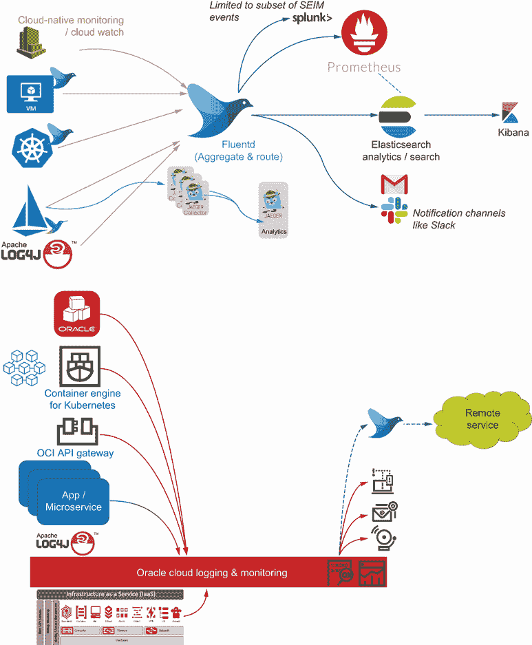
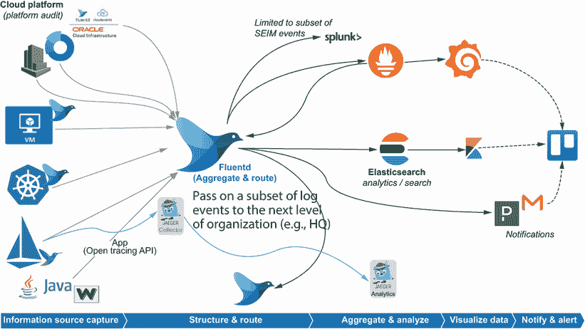

# 附录 D. 现实世界用例

## D.1 在现实世界用例中使用 Fluentd

在整本书中，我们专注于解释如何使用 Fluentd。解释主要集中在特定领域，而不是提供整体视角。本附录试图纠正这一点，通过提供一个更全面的图景。

本附录选取了几个类似的现实世界场景并将它们融合在一起，以避免泄露任何客户信息。将这些案例结合起来，我们还能够融入更多的经验教训。我们不会深入具体配置细节，因为它们已在本书的核心部分有所涵盖，但这应该有助于您理解我们为什么重视某些功能。

## D.2 设置场景

我们的组织大约 30 年前作为一个单一国家的零售商开始，并迅速增长。这种增长是由以下因素驱动的：

+   获得自己的制造能力，因为其产品针对每个客户都是定制的。

+   扩大其零售范围至反映市场变化的关联产品线。

+   在商业上，零售单位作为独立的企业建立，要么由主要公司的子公司全资拥有，要么与门店经理共同拥有；还有一些传统的特许经营商。这种结构赋予了商店一定程度的自主性和个人责任。这意味着独立零售商可以成为集团的一部分，外部投资（共同拥有或特许经营权的股份）有助于增长。

+   技术采用是由简化流程和因此提高零售吞吐量的目标所驱动的。这意味着移动设备采用的增长，以及与基于互联网的销售渠道的缓慢互动。

+   在过去 20 年中，国际扩张在欧洲、亚太地区（包括中国）和北美进行。

在内部，组织在地理业务和运营方面是分割的。

+   零售

+   制造和分销

+   企业（涵盖营销、会计、外部供应链采购等）

一个中央 IT 部门支持企业系统、在区域或制造站点级别使用的核心解决方案，以及零售 IT 解决方案。尽管如此，垂直部门所拥有的自主性创造了存在影子或灰色 IT 的条件。这一点进一步由区域运营拥有自己的与区域业务对齐的 IT 团队而加剧。企业总部和主要的 IT 运营，包括软件开发，位于欧洲。

一些 IT 解决方案反映了组织的年龄和增长；一些企业解决方案已经经历了多年的累积扩展、修补和定制，显然已经过时且脆弱。这导致了人们不愿进行变革，并且已经启动了一些重大计划，用商业现货（COTS）或 SaaS 方法来替换一些遗留系统。影子 IT 导致了本地 SaaS 和“集成”的局部涌现。欧洲 IT 主要由其自身的本地数据中心主导。然而，较新的地理区域更快速地采用云计算，而不是寻求为运营 IT 和支持中心投入资本。目前，零售是一个本地化方案，因为广域网通信被认为不够稳健，无法允许零售地点在出现故障时继续运营。在世界的某些部分，商店的网络质量、可靠性和带宽不足以支持远程托管解决方案的所有需求。

除了商业现货（COTS）之外，内部开发的零售和制造解决方案通常包含企业知识产权或简化业务流程。组织在制造和零售空间中看到了越来越多的互联设备。这种互联性要么是由于自然的信息技术演变，要么是因为组织委托第三方构建解决方案或对标准商业产品进行独特的定制化，这些产品通过平板电脑提供。

大部分系统集成是通过消息传递、共享数据库或 FTP 实现的。零售和制造能力最依赖于消息传递，因为商店订单到制造的时间敏感性强，反映了动态库存分配（这些解决方案是定制构建的）。

软件变更的推出往往比较缓慢，这通常源于对脆弱的遗留解决方案的担忧。在非欧洲地理区域外的延误，由于对软件变更和运营支持挑战缺乏理解，使得人们抵制变革，这一问题变得更加严重。讽刺的是，这反而加剧了问题，因为来自欧洲的压力要求推出升级，意味着推出往往涉及大量的变更。

现有的运营和监控成熟度取决于地理位置，欧洲是最成熟和发达的。然而，监控主要是基础设施层面的参与。应用层面的监控较弱。业务层面的监控是通过经典的零售和供应链报告指标（如销售额和订单）而不是从更现代的视角来衡量任务在其流程的不同阶段。

一些问题来自地理和市场领导力（市场份额、创新、法规变化）的持续增长驱动。有时，这些压力并不有助于跟上非功能性考虑因素，因为它们随着增长和技术债务而演变。这对许多成熟组织来说并不罕见，但嵌入到组织 DNA 中的持续增长增加了压力。IT 动量通常通过新的功能性能力来衡量，当然在解决债务直到债务影响交付时也会带来一些挑战。

正如你所见，这不是一个云原生组织，但它开始摸索进入云，需要了解如何解决监控，无论是本地还是处理云。

### D.2.1 运营挑战

值得关注组织在运营中遇到的一些问题。解决这些问题将通过监控改进的交付带来业务价值，包括采用 Fluentd。

核心系统的第三线和第四线支持来自欧洲的 IT 发展，这些地区不提供 24/7 的支持。在不同时区工作的区域运营必须为自己的区域零售提供自己的支持。中央支持通常归结为组织政治和员工提供加班支持的好意。

欧洲开发，能够有效地使用基本的 DevOps 实践支持本地地理，但对其他地区的需求认识不足。DevOps 往往是避免写下来的原因，因此本地理解很大程度上是通过口头和协作行为。不同的地理区域不是开发过程的积极参与者，也没有从协作知识转移中受益，这意味着他们缺乏对内部解决方案的了解。这导致了人们以他们未预期的方式使用解决方案的问题。快速而简陋的流程来恢复问题，导致对运营失败缺乏洞察力（没有保留日志或环境镜像/快照），这使得欧洲 IT 难以调查和制定预防措施。

## D.3 引入监控

IT 系统有效地形成了一系列从店铺到区域运营中心和从区域中心到企业中心的星形结构。这可以在图 D.1 中看到。制造和分销也直接连接到中心和全球中心。这使其适合采用监控作为一系列集中器网络。这也非常适合，因为大多数中心都有最大量的事件/交易通过，这意味着这些区域的问题具有最大的商业影响。

图 D.1 商业中的关键“参与者”及其在组织内（以及信息流）的关系

第一个目标是让区域中心系统聚合和统一其日志数据。根据 80/20 原则，我们寻找标准技术和通用系统（通常是源自中央 IT 能力的系统）来创建标准化的日志事件捕获配置。还实施了简单的阈值警报。警报反映了重大阈值违规（在它们变得关键之前）并生成了日志事件。在通过日志调查问题时，我们可以看到历史上可能存在某种性能问题（通常是磁盘存储耗尽最为严重）。

在将基础设施日志与应用程序日志对齐本可以显示这些措施的情况下，想要结合基础设施监控导致了冲突的政治，因为基础设施团队认为他们的监控已经成熟。他们不是问题的来源。IaaS 活动没有看到基础设施团队参与的事实也没有帮助。

我们敦促开发团队编制异常情况清单，并使用错误代码作为构建更好的支持文档的第一步。这为区域团队提供了附加和共享他们自己的运营流程的途径。随着时间的推移，我们实现了 CI/CD 代码质量检查以检测错误代码的分配，并使采用游戏化。

在统一日志方面取得进展，我们更好地理解了不同部署中可能发生的情况——一些问题的警告信号已被识别，但直到太晚才被认识到。因此，通过使用分组电子邮件为众所周知的指标提供警报。

其他候选指标开始受到关注，这触发了收集更多诊断信息的脚本，例如消息队列深度，捕获对队列的最后访问时间。

随着对监控产生结果的信心增强，无论是本地运营团队还是中央 IT 资源都能更好地了解正在发生的事情，扩展监控的接受度得到了实施。将特定事件转发到中央 IT 团队也有助于确认当企业中心的数据分发过程成为问题来源时。通过检查日志以确定预期发生的事情，一些问题开始被识别。随着能力的整合，标志包括

+   清理工作没有按时进行。

+   软件部署并不总是遵循中央团队的建议。因此，当预期或需要时，自动化流程并没有触发。

+   手动清理工作并不始终得到一致执行，通常是因为额外的清理步骤通过电子邮件传递，没有达到每个人，或者没有作为更结构化的流程添加到文档中。

+   一些业务流程在不同地理区域比预期花费了更长的时间。结果，预演数据积累超过了预期，产生了问题。

+   当需要处理警告指示时，并未得到解决。

+   一些应用程序逻辑不够防御性，允许用户执行企业其他部分不期望的操作——例如，当通信基础设施假定此类数据只会是几个 Kb 大小时，产品图片的大小为 GB。

其中一些发现肯定需要非常小心地处理，因为错误和沟通问题为任何有组织议程的人提供了燃料，并且经常会发生大量的指责。

### D.3.1 监控的扩展

在地理枢纽和实验室取得良好进展后，相同的做法被重复用于零售运营。这必须更加小心地进行，因为任何被认为会影响零售运营的事情都是一个敏感问题。一个主要挑战是向枢纽发送足够的信息以提供合适的价值，同时不消耗宝贵的带宽。

日志聚合主要集中在商店的服务器端解决方案上，而不是具有设备原生应用的移动平台。为了获得有意义的见解而理解原生应用最终成为一个与核心监控努力分离的问题。由于商店应用程序处理 PII 数据，商店服务器被紧密锁定，偶尔会出现错误的数据条目进入不应存在的 UI，导致 PII 数据偶尔出现在日志条目中。随后对进一步过滤日志事件的需求导致对日志事件应用数据掩码，甚至是在本地。

### D.3.2 监控的精细化

随着运营洞察开始反馈给中央 IT 团队，一些开发团队从使用 Java 日志记录到文件转变为直接记录到 Fluentd 代理。在这些地方采用此方法时，我们在开发期间使用了一种配置，确保日志事件被写入文件而不是中央日志存储能力。日志集中化程度取决于是否愿意部署额外的软件以及由谁部署。这意味着开发者并没有将 Fluentd 的引入视为过程中的干扰，因为他们习惯于查看日志文件以帮助确认代码按预期工作。但这也有助于促进日志记录的改进，因为我们仍然可以设置过滤器来突出潜在问题，例如意外记录敏感数据项。

## D.4 云困境

虽然云的影响在很大程度上是 SaaS 或 IaaS 的问题，但我们在成熟的 PaaS 中看到的挑战越来越多，是使用云原生服务，而不是“低代码”风格的 PaaS，例如 MuleSoft、Dell Boomi 和 Oracle 的集成云，这些是程度不同的封闭生态系统。AWS、Azure、Oracle 和 Google 都提供了云原生服务，为他们的 Kubernetes 服务提供了类似 Fluentd 的能力。因此，当使用 AWS 的 Kubernetes 或 Oracle 的区块链时，我们应该使用供应商的实现，还是明确实例化 Fluentd 并配置 Kubernetes 使用我们的 Fluentd，而不是开箱即用的日志和监控？我们可以在图 D.2 中清楚地看到这一点，其中使用云主机自然解决方案利用云原生技术和云主机对齐的方法。

图 D.2 这说明了使用云原生解决方案进行日志记录的云中立方法（顶部）与特定供应商模型之间的差异，在特定供应商模型中，所有日志事件都将进入由云服务提供商处理的透明监控层，而在云中立方法中，你需要在基础设施即代码中适应网络需求。

这并不是一个容易回答的问题。如果我们使用提供的服务并从集成、自动扩展、自动修补等中受益，我们必须接受随之而来的供应商锁定。或者我们必须采取 IaaS 方法并自行部署 Fluentd，这意味着可以使用任何 IaaS 云服务提供商，但我们必须自行修补和扩展。我们已经决定通过几个问题来回答这个问题：

+   通过成为云服务提供商无关，你获得了哪些价值？

+   对于软件供应商来说，好处是显而易见的——在消费者基础方面的最大潜力。但现实是，你最终可能会将适配器集成到你支持最多的云中，因为这有利于客户。有关于 Zoom 能够快速切换云服务提供商以实现实质性节省的高知名度故事，以及 Dropbox 决定离开 AWS，因为他们达到了一个规模，这意味着私有数据中心提供了更好的经济性。

+   你是否可能需要多个云服务提供商或以混合方式运营？

+   对于真正全球性的解决方案，今天的现实是，你很可能会需要部署到多个云中。这仅仅是因为并非每个供应商在每个地理区域都有实质性存在。你可能会遇到特定的国家数据限制，这可能意味着使用特定的供应商（例如，撰写本文时，Azure 在东欧没有存在，而 Google 在非洲没有存在）。

+   此外，除非你是拥有深厚资金的大客户，否则你不会在数据中心解决方案中使用云，例如 AWS 的 Outpost 或 Oracle 的云客户，整个云平台部署到位于你数据中心的服务器机架上。这意味着存在多个实施和配置问题。这可能不是在中国运营的选项，因为许多 IT 供应商对提供的产品和地点有限制。

+   你的 IT 团队有多大，能力如何？

+   解决相同问题的方法越多变，IT 团队或部门需要的技能就越多。假设你的 IT 组织在人员方面需要非常精简。在这种情况下，一套标准的技术有很多优势。团队可以使用更小、更专注的工具集来发展他们的专业知识。更深入地掌握这些工具，并最大化投资。我们并不是说所有监控问题都可以通过 Fluentd 来解决，但为什么需要掌握三四个日志统一工具，如果有一个就足够了呢？

+   你的监控需求或策略是否可能让你进入专业领域？

+   对于那些可能需要大量调整或你正在推动标准工具可能性的边界的情况，云服务提供商的服务模式可能比解决方案造成更多问题。你将无法像完全控制代码和部署时那样，根据你独特的环境定制他们的平台。

探索这些问题无疑会揭示采用 Fluentd 或类似 ELK 堆栈是否是正确的选择。

## D.5 解决方案

在区域枢纽级别达成的解决方案看起来与图 D.3 中的图表相似。企业监控看起来会很相似，尽管随着时间的推移，源的数量显著增加，因为监控已成为更标准的实践。

图 D.3 监控概述解决方案与日志事件生命周期的对比

仓库和制造中心会有一些相似之处，尽管比枢纽简单得多，因为它们没有使用容器化，并且正在运行的系统套件较小。

## D.6 结论

希望你能从这一点看出，我们在书中涵盖的 Fluentd 技术中的几个帮助了一个面临挑战的组织实现价值。你会注意到，Fluentd 的应用并不局限于任何特定类型的平台或技术。虽然 Fluentd 受到 CNCF 的监管，但这反映的是它可以帮助解决现代云挑战的事实，而不是它专门为此背景设计。

从本课程中我们最大的收获之一是，实施监控能力的组织需要确保其文化和实施监控的方法已经准备好并能够接受必要的变革。虽然硬件监控被视为常态（毕竟，你已经投入了大量的资本，所以你希望确保它能够自我回报），但应用监控和日志的使用往往没有得到同样的重视。在形成这个例子的案例中，问题必须变得非常严重，才会在解决这些问题上做出重大承诺。
