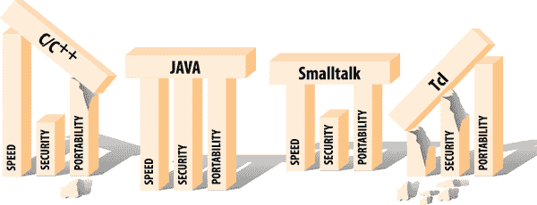

# 第一章：现代语言

当今软件开发者面临的最大挑战和最激动人心的机遇在于利用网络的力量。无论今天创建的应用程序的预期范围或受众如何，几乎肯定会在由全球计算资源连接的机器上运行。网络的日益重要性正对现有工具提出新的要求，并推动对全新类型应用程序的迅速增长需求。

作为用户，我们希望软件能够一直正常工作，在任何平台上都表现良好，并且与其他应用程序兼容。我们希望动态应用程序能够利用连接的世界，并能够访问各种不同和分布的信息源。我们希望真正分布式的软件可以无缝扩展和升级。我们希望智能应用程序能够在云中为我们漫游，搜寻信息并作为电子使者服务。我们已经知道想要什么样的软件已有一段时间了，但真正开始得到这样的软件，实际上是在过去几年里。

历史上的问题在于构建这些应用程序的工具一直不足够完善。速度和可移植性的要求在很大程度上是互相矛盾的，而安全性则大多被忽视或误解。过去，真正可移植的语言往往又臃肿、解释性差且运行速度慢。这些语言之所以流行，除了其高级功能外，还因为它们的可移植性。快速语言通常通过绑定到特定平台来提供速度，因此它们只能在一定程度上满足可移植性要求。甚至有一些语言督促程序员编写更好、更安全的代码，但它们主要是可移植语言的衍生物，并遭遇同样的问题。Java 是一种现代语言，同时解决了这三个方面：可移植性、速度和安全性。这就是为什么在其推出近三十年后，它仍然是编程世界的主导语言。

# Java 的介绍

Java 编程语言被设计为一种机器无关的编程语言，既安全到足以在网络上传输，又强大到可以替代本地可执行代码。Java 解决了在这里提出的问题，并在互联网的发展中扮演了重要角色，导致我们今天的现状。

Java 已经成为基于网络的应用程序和网络服务的首选平台。这些应用程序使用诸如 Java Servlet API、Java Web Services 以及许多流行的开源和商业 Java 应用服务器和框架的技术。Java 的可移植性和速度使其成为现代业务应用程序的首选平台。运行在开源 Linux 平台上的 Java 服务器是当今商业和金融界的核心。

最初，大多数对 Java 的热情集中在其构建 Web 嵌入式应用程序，即*applets*的能力上。但在早期，Java 编写的 applets 和其他客户端图形用户界面（GUIs）是有限的。如今，Java 拥有 Swing，一个用于构建 GUI 的高级工具包。这一发展使 Java 成为开发传统客户端应用软件的可行平台，尽管许多其他竞争者已经进入了这个拥挤的领域。

本书将向您展示如何使用 Java 完成实际编程任务。在接下来的章节中，我们将向您介绍 Java 的各种特性，包括文本处理、网络编程、文件处理以及使用 Swing 构建桌面应用程序。

## Java 的起源

Java 的种子在 1990 年由 Sun Microsystems 的创始人及首席研究员比尔·乔伊（Bill Joy）播下。当时，Sun 在一个相对较小的工作站市场中竞争，而微软则开始主导更为主流的基于 Intel 的 PC 世界。当 Sun 错过了 PC 革命的机会后，乔伊退居到科罗拉多州的阿斯彭，致力于高级研究。他坚信通过简单的软件完成复杂任务的理念，并创立了名为 Sun Aspen Smallworks 的公司。

在乔伊在阿斯彭组建的小团队中的原始成员中，詹姆斯·戈斯林（James Gosling）将被铭记为 Java 的奠基人。戈斯林在 1980 年代初因编写 Gosling Emacs 而成名，Gosling Emacs 是第一版用 C 语言编写且运行在 Unix 上的流行 Emacs 编辑器。Gosling Emacs 很快被 Emacs 原始设计者编写的免费版本 GNU Emacs 所取代。当时，戈斯林已转向设计 Sun 的网络可扩展窗口系统（NeWS），该系统在 1987 年短暂地与 X Window System 竞争 Unix GUI 桌面的控制权。尽管有些人认为 NeWS 优于 X，但由于 Sun 将其保持为专有且未发布源代码，而 X 的主要开发者成立了 X Consortium 并采取了相反的方法，NeWS 最终失利。

设计 NeWS 让戈斯林（Gosling）意识到将表达语言与网络感知的窗口化 GUI 集成的强大功能。它还让 Sun 了解到，互联网编程社区最终将拒绝接受任何专有标准，无论其多么优秀。NeWS 的失败播下了 Java 许可证方案和开放（即便不是“开源”）代码的种子。戈斯林将他学到的知识带到了比尔·乔伊（Bill Joy）新成立的阿斯彭项目。1992 年，项目的工作促成了 Sun 子公司 FirstPerson, Inc.的成立。其使命是将 Sun 带入消费电子世界。

FirstPerson 团队致力于开发信息设备软件，如手机和个人数字助理（PDA）。目标是通过廉价红外线和传统分组网络实现信息和实时应用程序的传输。内存和带宽限制要求代码小巧高效。应用程序的性质还要求它们安全可靠。Gosling 和他的队友开始用 C++ 编程，但很快发现这种语言对于任务来说过于复杂、笨重且不安全。他们决定从头开始，并开始开发了被称为 "C++ 减减" 的东西。

随着苹果 Newton 的失败（苹果最早的手持电脑），PDA 的时代还未到来变得显而易见，因此 Sun 将 FirstPerson 的努力转向了互动电视（ITV）。ITV 机顶盒的编程语言选择是 Java 的近祖语言 Oak。尽管 Oak 具有优雅和提供安全交互的能力，但它无法拯救 ITV 的失利。客户不喜欢它，Sun 很快放弃了这个概念。

那时，Joy 和 Gosling 聚在一起为他们的创新语言制定新策略。那是 1993 年，对 Web 的兴趣爆发带来了新的机遇。Oak 是小巧、安全、架构无关和面向对象的。恰好这些特点也是通用、适应互联网的编程语言的要求之一。Sun 迅速转变了焦点，并稍作调整，Oak 成为了 Java。

## 成长过程

可以毫不夸张地说，Java（以及面向开发者的捆绑包 Java 开发工具包或 JDK）如火如荼地流行起来。甚至在其正式发布之前，当 Java 仍然是一个非产品时，几乎所有主要行业参与者都跟随了 Java 的热潮。Java 的许可证持有者包括 Microsoft、Intel、IBM 和几乎所有主要硬件和软件供应商。然而，尽管有这些支持，Java 在最初几年经历了许多挫折和成长的痛苦。

由于 Sun 和 Microsoft 之间关于 Java 分发和其在 Internet Explorer 中使用的违约和反垄断诉讼一系列事件，阻碍了其在全球最常见的桌面操作系统——Windows 上的部署。Microsoft 参与 Java 也成为一个更大联邦诉讼的焦点，这场诉讼涉及公司严重的反竞争行为。法庭证词显示，这家软件巨头试图通过在其语言版本中引入不兼容性来破坏 Java。与此同时，Microsoft 推出了自己的基于 Java 的语言 C#（C-sharp），作为其 .NET 计划的一部分，并取消了在 Windows 中包含 Java 的计划。C# 自成一派，近年来的创新比 Java 更多。

但 Java 在各种平台上继续传播。当我们开始查看 Java 架构时，你会发现 Java 的许多激动人心之处来自 Java 应用程序运行的自包含虚拟机环境。Java 经过精心设计，以便支持体系结构可以在现有计算机平台上以软件形式实现，或者在定制硬件上实现。Java 的硬件实现用于某些智能卡和其他嵌入式系统。你甚至可以购买带有 Java 解释器的“可穿戴”设备，例如戒指和狗牌。Java 的软件实现可用于所有现代计算机平台，甚至包括便携式计算设备。今天，Java 平台的一个衍生是谷歌的 Android 操作系统的基础，该操作系统为数十亿台手机和其他移动设备提供动力。

2010 年，Oracle Corporation 收购了 Sun Microsystems，并成为 Java 语言的管理者。在其任期开始时有些波折，Oracle 起诉谷歌使用 Java 语言开发 Android，并失败了。2011 年 7 月，Oracle 发布了 Java 标准版 7^(1)，这是一个重要的 Java 版本，包括一个新的 I/O 包。2017 年，Java 9 引入了模块，以解决 Java 应用程序编译、分发和执行方面长期存在的一些问题。Java 9 还启动了一个快速更新流程，其中一些 Java 版本被指定为“长期支持”，其他版本则为标准的短期版本。（有关这些和其他版本的更多信息，请参见“Java 路线图”。）Oracle 继续领导 Java 开发；但是，它还通过将主要的 Java 部署环境移动到昂贵的商业许可证，同时提供一个免费的 OpenJDK 选项，保留了许多开发人员喜欢和期望的可访问性，使 Java 世界分裂。

# 一个虚拟机

在我们继续深入之前，了解 Java 所需的环境更有帮助。如果你对我们接下来要提到的内容不太理解，也没关系。你可能会在后面的章节中看到任何陌生的术语都会得到解释。我们只是想为你提供 Java 生态系统的概览。该生态系统的核心是*Java 虚拟机*（JVM）。

Java 既是一种编译语言，也是一种解释语言。Java 源代码被转换成简单的二进制指令，类似于普通的微处理器机器码。然而，C 或 C++源代码被转换为特定型号处理器的本机指令，而 Java 源代码被编译成一种通用格式——称为*字节码*的虚拟机指令。

Java 字节码由 Java 运行时解释器执行。运行时系统执行硬件处理器的所有常规活动，但是在安全的虚拟环境中执行。它执行基于堆栈的指令集，并像操作系统一样管理内存。它创建和操作原始数据类型，并加载和调用新引用的代码块。最重要的是，它是根据严格定义的开放规范执行所有这些操作，任何希望生产符合 Java 规范的虚拟机的人都可以实现。虚拟机和语言定义共同提供了完整的规范。没有基本 Java 语言留下未定义或依赖于实现的特性。例如，Java 指定了其所有原始数据类型的大小和数学属性，而不是由平台实现决定。

Java 解释器相对轻量且小巧；它可以以适合特定平台的任何形式实现。解释器可以作为单独的应用程序运行，也可以嵌入到其他软件中，如 Web 浏览器中。总之，这意味着 Java 代码具有隐式的可移植性。相同的 Java 应用程序字节码可以在任何提供 Java 运行时环境的平台上运行，如图 1-1 所示。您无需为不同的平台制作替代版本的应用程序，也无需向最终用户分发源代码。


###### 图 1-1\. Java 运行时环境

Java 代码的基本单元是*类*。与其他面向对象的语言一样，类是小型、模块化的应用组件，包含可执行代码和数据。编译后的 Java 类以包含 Java 字节码和其他类信息的通用二进制格式分发。类可以离散维护，并存储在本地文件或网络服务器上。在运行时，类根据应用程序的需要动态定位和加载。

除了特定于平台的运行时系统之外，Java 还有一些包含架构相关方法的基本类。这些*本地方法*作为 Java 虚拟机与现实世界之间的门户。它们在主机平台上以本地编译语言实现，并提供对网络、窗口系统和主机文件系统等资源的低级访问。然而，绝大部分的 Java 是用 Java 自身编写的——从这些基本部分引导出来的，并因此具有可移植性。这包括像 Java 编译器这样重要的 Java 工具，也是用 Java 编写的，因此在所有 Java 平台上以完全相同的方式可用，无需移植。

从历史上看，解释器一直被认为速度较慢，但 Java 不是传统的解释性语言。除了将源代码编译成可移植的字节码外，Java 还经过精心设计，使得运行时系统的软件实现可以通过即时将字节码编译为本地机器代码来进一步优化性能。这称为动态或*即时*（JIT）编译。通过 JIT 编译，Java 代码可以像本地代码一样快速执行，并保持其可移植性和安全性。

这个 JIT 特性是在想要比较语言性能的人中经常被误解的一个点。编译后的 Java 代码在运行时只有一个内在的性能惩罚，用于安全性和虚拟机设计——数组边界检查。除此之外，所有其他部分都可以像静态编译语言一样优化到本地代码。此外，Java 语言包含比许多其他语言更多的结构信息，提供了更多类型的优化可能性。还要记住，这些优化可以在运行时进行，考虑到实际应用程序的行为和特性。什么可以在编译时完成，而在运行时不能更好地完成？嗯，这其中存在一个时间上的权衡。

传统的即时编译（JIT）的问题在于优化代码需要时间。虽然 JIT 编译器可以产生不错的结果，但在应用程序启动时可能会遇到显著的延迟。对于长期运行的服务器端应用通常不是问题，但对于客户端软件和运行在性能有限设备上的应用程序来说，这是一个严重的问题。为了解决这个问题，Java 的编译器技术，称为 HotSpot，使用了一种称为*自适应编译*的技巧。如果你看一下实际程序花费时间在做什么，会发现它们几乎全部时间都在反复执行一小部分代码。虽然这部分反复执行的代码可能只占总程序的一小部分，但其行为决定了程序的整体性能。自适应编译允许 Java 运行时利用新型优化，这是静态编译语言无法做到的，因此有时声称 Java 代码在某些情况下可以比 C/C++ 运行得更快。

为了充分利用这种自适应能力，HotSpot 起初是一个普通的 Java 字节码解释器，但有所不同：它在执行过程中测量（profile）代码，以查看哪些部分被重复执行。一旦确定了代码中哪些部分对性能至关重要，HotSpot 将这些部分编译为最佳的本机机器代码。由于它仅将程序的一小部分编译为机器代码，因此它可以花费必要的时间来优化这些部分。程序的其余部分可能根本不需要编译——只需要解释——从而节省内存和时间。事实上，Java 虚拟机可以以两种模式之一运行：客户端和服务器，它们确定虚拟机是强调快速启动时间和内存节约，还是强调性能。自 Java 9 以来，如果最小化应用程序的启动时间非常重要，您还可以使用*提前编译*（AOT）。

此时一个自然的问题是，为什么每次应用程序关闭时都要丢弃所有这些好的分析信息呢？嗯，Sun 在 Java 5.0 发布中部分解决了这个问题，通过使用共享的只读类以优化的形式持久存储。这显著减少了在给定机器上运行许多 Java 应用程序的启动时间和开销。这样做的技术是复杂的，但思路很简单：优化需要快速执行的程序部分，而不必担心其余部分。

当然，“其余部分”中可能包含进一步优化的代码。2022 年，OpenJDK 的[雷登项目](https://oreil.ly/pZnd5)启动，旨在进一步减少启动时间，最小化 Java 应用程序的大尺寸，并减少所有先前提到的优化所需的时间。雷登项目提出的机制相当复杂，因此我们在本书中不会讨论它们。但我们想要强调不断努力开发和改进 Java 及其生态系统的工作。即使在其首次亮相 30 年之后，Java 仍然是一种现代语言。

# Java 与其他语言比较

Java 的开发者在选择功能时汲取了许多年使用其他语言进行编程的经验。值得一提的是，不论你有其他编程经验还是需要了解背景的新手，都应该花点时间将 Java 与一些其他语言在高层面进行比较。虽然本书确实希望你对计算机和软件应用有一定的了解，但我们并不指望你对任何特定的编程语言有所了解。当我们通过比较提到其他语言时，希望这些评论都是不言而喻的。

至少有三个支撑通用编程语言的支柱是必需的：可移植性、速度和安全性。图 1-2 显示了 Java 与创建时流行的几种语言的比较。



###### 图 1-2\. 编程语言比较

你可能听说过 Java 很像 C 或 C++，但这只在表面上是真的。当你首次看到 Java 代码时，你会发现其基本语法看起来像 C 或 C++。但相似之处就止步于此。Java 绝非是 C 的直接后裔或是下一代 C++。如果你比较语言特性，你会发现 Java 实际上更多地与 Smalltalk 和 Lisp 等高度动态的语言相似。事实上，Java 的实现与本地的 C 相去甚远。

如果你熟悉当前的语言格局，你会注意到这个比较中缺少了一种流行的语言 C#。C#主要是微软对 Java 的回应，诚然在其上面加了一些便利之处。鉴于它们共同的设计目标和方法（如使用虚拟机、字节码和沙箱），这些平台在速度或安全特性上并没有显著的区别。C#和 Java 一样具有高度的可移植性。与 Java 类似，C#在很大程度上借鉴了 C 语法，但实际上更接近动态语言的亲戚。大多数 Java 开发人员发现学习 C#相对容易，反之亦然。你在从一种语言转向另一种语言时，大部分时间会花在学习标准库上。

突出的是，这些语言与 Java 表面上的相似之处值得注意。Java 在语法上大量借鉴了 C 和 C++，因此你会看到简洁的语言结构，包括大量的花括号和分号。Java 奉行 C 的哲学，即一个优秀的语言应该紧凑；换句话说，它应该足够小而规范，以至于程序员能够一次性掌握其所有能力。就像 C 可以通过库进行扩展一样，Java 类的包可以被添加到核心语言组件中以扩展其词汇量。

C 之所以成功，是因为它提供了一个功能丰富的编程环境，具有高性能和可接受的可移植性。Java 也试图在功能性、速度和可移植性之间取得平衡，但其方式大不相同。C 为了可移植性而牺牲了一些功能性；Java 最初为了可移植性而牺牲了速度。Java 还解决了 C 没有解决的安全问题（尽管在现代系统中，许多这些问题现在已在操作系统和硬件中得到解决）。

Perl、Python 和 Ruby 等脚本语言仍然很受欢迎。脚本语言也可以适用于安全的、网络化的应用程序，这并不是没有道理的。但大多数脚本语言不太适合于严肃的、大规模的编程。人们对脚本语言的吸引力在于它们是动态的；它们是快速开发的强大工具。一些脚本语言，例如 Tcl（在 Java 开发时更受欢迎），也有助于程序员完成特定任务，比如快速创建图形界面，而这是更通用的语言觉得难以驾驭的。脚本语言在源代码级别也非常易于移植。

与 Java 不同，JavaScript 是一种由网景公司最初为网络浏览器开发的基于对象的脚本语言。它作为一种网页浏览器常驻语言，用于动态、交互式、基于网络的应用程序。JavaScript 的名称来源于它与 Java 的集成和相似之处，但比较实际上在这里结束了。然而，JavaScript 在浏览器之外也有重要的应用，比如 Node.js，^(2)，并且在各个领域的开发者中继续备受青睐。有关 JavaScript 的更多信息，请参阅 David Flanagan（O'Reilly）撰写的*[JavaScript: 权威指南](https://oreil.ly/qj5Jt)*。

脚本语言的问题是它们对程序结构和数据类型相当随意。它们有简化的类型系统，通常不提供变量和函数的复杂作用域。这些特点使得它们不太适合构建大型、模块化的应用程序。速度是脚本语言的另一个问题；这些语言通常高级、通常由源代码解释，使得它们的速度相当慢。

对于各个脚本语言的支持者可能会对这些概括提出异议，毫无疑问，在某些情况下他们是正确的。最近几年，脚本语言已经有所改进，尤其是 JavaScript，它已经投入了大量的研究来提高性能。但基本的权衡是不可否认的：脚本语言诞生为系统编程语言的松散、不太结构化的选择，它们通常对于各种原因不太适合用于大型或复杂的项目。

Java 提供了一些脚本语言的基本优势：它高度动态，还具有低级语言的额外好处。Java 具有一个强大的正则表达式包，可与 Perl 一起用于处理文本。它还具有简化使用集合、变量参数列表、方法的静态导入等语言功能的语法糖，使其更加简洁。

逐步开发面向对象组件，再加上 Java 的简洁性，使得能够快速开发和轻松变更应用程序成为可能。研究表明，基于语言特性，使用 Java 开发比使用 C 或 C++更快。Java 还配备了大量的标准核心类，用于常见任务，如构建 GUI 和处理网络通信。Maven 中央仓库是一个外部资源，拥有大量的库和包，可以快速集成到您的环境中，帮助您解决各种新的编程问题。除了这些特性，Java 还具有更静态语言的可扩展性和软件工程优势。它提供了一个安全的结构，可以构建更高级别的框架（甚至其他语言）。

正如我们之前所说，Java 在设计上类似于 Smalltalk 和 Lisp 等语言。然而，这些语言主要用作研究工具，而不是用于开发大规模系统。其中一个原因是这些语言从未开发出标准的可移植绑定到操作系统服务，如 C 标准库或 Java 核心类。Smalltalk 被编译为解释的字节码格式，并且可以动态地即时编译为本地代码，就像 Java 一样。但 Java 通过使用字节码验证器改进了设计，以确保编译后的 Java 代码的正确性。这个验证器使 Java 在性能上优于 Smalltalk，因为 Java 代码需要较少的运行时检查。Java 的字节码验证器还有助于处理安全问题，而 Smalltalk 则没有这方面的解决方案。

在本章的其余部分，我们将从宏观角度介绍 Java 语言。我们将解释 Java 的新特性和不那么新的特性，以及其背后的原因。

# 设计的安全性

毫无疑问，你肯定听说过 Java 被设计为一种安全语言。但是安全是指什么？安全免受什么或者谁的影响？Java 安全功能中最引人注目的是那些使新类型的动态可移植软件成为可能的功能。Java 提供了几层保护，防止危险缺陷代码以及更加恶意的事物，如病毒和木马。在接下来的部分中，我们将看看 Java 虚拟机体系结构如何在代码运行之前评估其安全性，以及 Java 的*类加载器*（Java 解释器的字节码加载机制）如何在不信任的类周围构建防护墙。这些功能为可以基于应用程序的基础安全策略提供了基础。

在本节中，我们将看一下 Java 编程语言的一些常规特性。也许比具体的安全特性更重要的是，虽然在安全争论中经常被忽略，但 Java 通过解决常见的设计和编程问题提供了安全性。Java 的目标是尽可能地安全，以避免程序员自己制造的简单错误，以及我们从遗留软件中继承的错误。Java 的目标是保持语言简单，提供已证明其有用的工具，并在需要时让用户在语言之上构建更复杂的设施。

## 简化，简化，简化……

在 Java 中，简单规则。由于 Java 从一张干净的纸开始，它避开了在其他语言中已经被证明混乱或有争议的功能。例如，Java 不允许程序员定义的运算符重载（在某些语言中，允许程序员重新定义基本符号如+和-的含义）。Java 没有源代码预处理器，因此它没有宏、`#define`语句或条件源代码编译之类的东西。这些构造主要存在于其他语言中以支持平台依赖性，因此从这个意义上讲，它们在 Java 中是不需要的。条件编译通常也用于调试，但 Java 的复杂运行时优化和诸如断言之类的特性更加优雅地解决了这个问题。^(4)

Java 为组织类文件提供了一个明确定义的*包*结构。包系统允许编译器处理一些传统*make*工具（用于从源代码构建可执行文件的工具）的功能。编译器还可以直接处理已编译的 Java 类，因为所有类型信息都得到了保留；不像 C/C++中那样需要外部的源“头”文件。所有这些意味着 Java 代码需要更少的上下文来阅读。事实上，你有时可能会发现查看 Java 源代码比参考类文档更快。

Java 也采用了一种与其他语言不同的结构特性。例如，Java 仅支持单一继承类层次结构（每个类只能有一个“父”类），但允许多继承接口。*接口*，类似于 C++中的抽象类，指定了对象的行为而不定义其实现。这是一个非常强大的机制，允许开发人员为对象行为定义一个“合约”，该合约可以独立于任何特定对象实现而被使用和引用。Java 中的接口消除了对类的多重继承及相关问题的需求。

正如您将在第四章中看到的，Java 是一种相当简单和优雅的编程语言，这仍然是它吸引人的重要原因。

## 类型安全和方法绑定

语言的一种属性是它所使用的*类型检查*的类型。一般来说，语言被归类为*静态*或*动态*，这指的是在编译时已知变量信息的数量与应用程序运行时已知信息的数量。

在严格静态类型的语言中，比如 C 或 C++，数据类型在源代码编译时就已经确定了。编译器通过这个特性获益，因为它能够在代码执行之前捕获许多种类的错误。例如，编译器不会允许你将浮点值存储在整数变量中。因此，代码不需要运行时类型检查，因此可以编译成小巧且快速的形式。但是，静态类型的语言是不灵活的。它们不像具有动态类型检查的语言那样自然地支持集合，并且在应用程序运行时无法安全地导入新的数据类型。

相比之下，诸如 Smalltalk 或 Lisp 之类的动态语言具有一个在应用程序执行时管理对象类型并执行必要类型检查的运行时系统。这些类型的语言允许更复杂的行为，并在许多方面更为强大。然而，它们通常更慢，不太安全，并且更难调试。

语言之间的差异被类比为汽车种类之间的差异。像 C++这样的静态类型语言类似于跑车：相当安全和快速，但只有在平整的道路上才有用。而高度动态的语言，如 Smalltalk 更像越野车：它们为你提供了更多自由，但可能有些笨拙。在郊外呼啸而过可能很有趣（有时也更快），但你也可能会被卡在沟里或被熊攻击。

语言的另一个属性是它将方法调用与其定义绑定的方式。在静态语言（如 C 或 C++）中，方法的定义通常在编译时绑定，除非程序员另有规定。另一方面，诸如 Smalltalk 之类的语言被称为*late binding*，因为它们在运行时动态地定位方法的定义。早期绑定对于性能至关重要；它让应用程序在运行时不需要为了查找方法而产生额外的开销。但是晚期绑定更加灵活。在一个支持动态加载新类型并且只有运行时系统能够确定要运行哪个方法的面向对象语言中，它也是必需的。

Java 提供了 C++ 和 Smalltalk 的一些优点；它是一种静态类型、后期绑定的语言。Java 中的每个对象都有一个在编译时就确定的明确类型。这意味着 Java 编译器可以像 C++ 一样进行静态类型检查和使用分析。因此，你不能将一个对象分配给错误类型的变量，也不能在对象上调用不存在的方法。Java 编译器甚至进一步防止你使用未初始化的变量和创建不可达的语句（见第四章）。

然而，Java 也完全支持运行时类型。Java 运行时系统跟踪所有对象，并能在执行期间确定它们的类型和关系。这意味着你可以在运行时检查对象以确定其类型。与 C 或 C++ 不同，Java 运行时系统检查从一个对象类型到另一个对象类型的强制转换，并且可以使用一定程度的类型安全加载新类型的动态加载对象。由于 Java 使用后期绑定，因此可以编写在运行时替换某些方法定义的代码。

## 增量开发

Java 将所有数据类型和方法签名信息从源代码到编译后的字节码形式都携带在一起。这意味着 Java 类可以逐步开发。你自己的 Java 源代码也可以安全地与编译器从未见过的其他源代码的类一起编译。换句话说，你可以编写引用二进制类文件的新代码，而不会失去源代码提供的类型安全性。

Java 不会遭受“脆弱基类”问题的困扰。在诸如 C++ 的语言中，基类的实现可以被有效冻结，因为它有许多派生类；改变基类可能需要重新编译所有派生类，这对类库开发者来说是一个特别困难的问题。Java 通过动态定位类内的字段来避免这个问题。只要一个类保持其原始结构的有效形式，它就可以在不破坏从它派生或使用它的其他类的情况下进化。

## 动态内存管理

Java 与低级语言（如 C 或 C++）之间一些最重要的区别涉及 Java 如何管理内存。Java 消除了对任意内存区域的即兴引用（在其他语言中称为*指针*），并在语言中添加了一些高级数据结构。Java 还有效且自动地清理未使用的对象（称为*垃圾收集*）。这些特性有效地消除了许多安全性、可移植性和优化方面的难题。

仅仅通过垃圾收集就已经拯救了无数程序员免受 C 或 C++ 中显式内存分配和释放带来的最大编程错误的困扰。除了在内存中维护对象外，Java 运行时系统还跟踪所有对这些对象的引用。当一个对象不再使用时，Java 会自动将其从内存中删除。在很大程度上，你可以简单地忽略不再使用的对象，并确信解释器会在适当的时候清理它们。

Java 使用了一个复杂的垃圾收集器，它在后台运行，这意味着大多数垃圾收集发生在空闲时间：在 I/O 暂停、鼠标点击或键盘敲击之间。一些运行时系统，如 HotSpot，具有更先进的垃圾收集机制，可以区分对象的使用模式（如短期使用与长期使用），并优化它们的收集。Java 运行时现在可以根据应用程序的行为自动调整内存的最佳分配。通过这种运行时分析，自动内存管理比大多数勤勉管理资源的程序员更快，这是一些老派程序员难以相信的。

我们说过 Java 没有指针。严格来说，这种说法是正确的，但也有误导性。Java 提供的是*引用*——一种更安全的指针。引用是一个强类型的对象句柄。在 Java 中，除了原始数值类型，所有对象都通过引用访问。你可以使用引用来构建所有 C 程序员习惯用指针构建的常规数据结构，如链表、树等。唯一的区别是，使用引用时必须以类型安全的方式进行操作。

在 Java 中，引用不能像在 C 等语言中更改指针那样更改。引用是一个原子事物；你不能通过除将其分配给对象外的任何方式操纵引用的值。引用是按值传递的，你不能通过超过单一间接级别来引用对象。保护引用是 Java 安全性的基本方面之一。这意味着 Java 代码必须遵循规则；它不能窥视不应该窥视的地方以规避这些规则。

最后，我们应该提到，在 Java 中，数组（基本上是索引列表）是真正的一级对象。它们可以像其他对象一样动态分配和分配。数组知道它们自己的大小和类型。虽然你不能直接定义或子类化数组类，但它们确实基于其基本类型的关系具有良好定义的继承关系。语言中的真正数组减少了指针算术的需求，比如在 C 或 C++ 中使用的那种。

## 错误处理

Java 的根源在于网络设备和嵌入式系统。对于这些应用程序，具有健壮和智能的错误管理是很重要的。Java 具有处理*异常*的强大机制，与较新的 C++实现类似。异常提供了一种更自然和优雅的处理错误的方式。异常允许您将错误处理代码与正常代码分离，从而实现更清晰、更易读的应用程序。

当发生异常时，它会导致程序执行流转移到预先指定的“catch”代码块。异常携带一个对象，其中包含引发问题的情况信息。Java 编译器要求方法要么声明它可以生成的异常，要么自己捕获并处理它们。这将错误信息提升到与方法参数和返回类型同等重要的水平。作为 Java 程序员，你清楚地知道你必须处理的异常情况，并且在编写正确的软件时，编译器提供了帮助，使它们不会未被处理。

## 线程

现代应用程序需要高度的并行性。即使是非常专注的应用程序也可能拥有复杂的用户界面，这需要并发活动。随着计算机速度的提高，用户对占用其时间的不相关任务越来越没有耐心。线程为客户端和服务器应用程序提供了有效的多处理和任务分配。Java 使得线程易于使用，因为它们的支持内置于语言中。

并发很好，但编程中线程还有更多内容，不仅仅是同时执行多个任务。在大多数情况下，线程需要*同步*（协调），没有显式语言支持可能会很棘手。Java 支持基于*监视器*模型的同步，这是一种用于访问资源的锁定和解锁系统。关键字`synchronized`指定了方法和代码块，用于在对象内部进行安全的、序列化的访问。还有简单的原始方法，用于在线程之间等待和信号传递，这些线程对同一对象感兴趣。

Java 拥有一个高级并发包，提供了强大的实用程序，解决了多线程编程中的常见模式，例如线程池、任务协调和复杂的锁定。通过并发包及其相关实用程序的添加，Java 提供了任何语言中一些最先进的与线程相关的实用程序。而且，当您需要许多线程时，您可以利用 Java 19 中作为预览功能开始的 Project Loom 虚拟线程的世界。

尽管一些开发者可能永远不需要编写多线程代码，但学习使用线程编程是掌握 Java 编程的重要组成部分，也是所有开发者应该掌握的技能。请参阅第九章讨论这个主题。特别是“虚拟线程”介绍了虚拟线程并突出了它们的一些性能优势。

## 可伸缩性

正如我们早先指出的，Java 程序主要由类组成。在类的基础上，Java 提供了*包*，这是一种将类组织成功能单元的结构层。包为组织类提供了命名约定，并在 Java 应用程序中提供了第二层次的组织控制，用于控制变量和方法的可见性。

在一个包内，类要么是公共可见的，要么受到外部访问的保护。包形成了更接近应用程序级别的另一种作用域。这有助于构建可重用的组件，这些组件在系统中协同工作。包还有助于设计可扩展的应用程序，而不至于使代码变得紧密耦合成一团。重用和规模问题在 Java 9 中增加的模块系统中得到了真正的强化。^(6)

# 实施安全性

创建一个防止自己踩到坑的语言是一回事；创建一个防止别人踩到坑的语言则是另一回事。

*封装*是将数据和行为隐藏在类内部的概念；它是面向对象设计的重要组成部分。它帮助你编写干净、模块化的软件。然而，在大多数语言中，数据项的可见性只是程序员与编译器之间关系的一部分。这是语义问题，而不是关于在运行程序环境中实际数据安全性的断言。

当 C++的创造者**Bjarne Stroustrup**选择关键字`private`来指定 C++类中的隐藏成员时，他可能考虑的是保护开发者免受其他开发者代码中混乱细节的干扰，而不是保护开发者的类和对象免受他人病毒和特洛伊木马的攻击。在 C 或 C++中，任意的类型转换和指针算术使得在不违反语言规则的情况下就能轻易违反类的访问权限。考虑以下代码：

```java
// C++ code
class Finances {
    private:
        char creditCardNumber[16];
        // ...
};

main() {
    Finances finances;

    // Forge a pointer to peek inside the class
    char *cardno = (char *)&finances;
    printf("Card Number = %.16s\n", cardno);
}
```

在这个小小的 C++ 情节中，我们编写了一些违反`Finances`类封装的代码，并提取了一些秘密信息。这种花招——滥用无类型指针——在 Java 中是不可能的。如果这个例子看起来不现实，请考虑保护运行环境基础（系统）类免受类似攻击的重要性。如果不受信任的代码可以破坏提供对真实资源（如文件系统、网络或窗口系统）访问的组件，那么它肯定有机会窃取你的信用卡号码。

Java 随着互联网的发展而成长，以及那里充斥着的不受信任的来源。它曾经需要比现在更多的安全性，但它仍然保留了一些安全特性：类加载器处理从本地存储或网络加载类，而所有系统安全性最终都依赖于 Java 验证器，它保证了传入类的完整性。

Java 字节码验证器是 Java 运行时系统的一个特殊模块和固定部分。然而，类加载器是可以由不同应用程序（如服务器或网页浏览器）不同实现的组件。所有这些部分都需要正常工作，以确保 Java 环境的安全性。

## 验证器

Java 的第一道防线是*字节码验证器*。验证器在运行前读取字节码，并确保它表现良好，遵守 Java 字节码规范的基本规则。受信任的 Java 编译器不会生成不符合规范的代码。然而，一个恶作剧的人可以故意组装出有问题的 Java 字节码。检测这些问题就是验证器的工作。

一旦代码经过验证，它就被认为是免受某些无意或恶意错误的安全的。例如，经过验证的代码不能伪造引用或违反对象的访问权限（如我们的信用卡示例）。它不能执行非法强制类型转换或以非预期的方式使用对象。它甚至不能引起某些类型的内部错误，比如溢出或下溢出内部堆栈。这些基本保证构成了 Java 安全性的基础。

也许你会想，这种安全性在很多解释性语言中是隐含的吧？确实，你不应该用一个虚假的 BASIC 代码行来破坏 BASIC 解释器，但要记住，大多数解释性语言的保护发生在更高的级别。这些语言通常有重量级的解释器，在运行时做大量的工作，因此它们必然更慢、更繁琐。

相比之下，Java 字节码是一个相对轻量级的低级指令集。在执行之前静态验证 Java 字节码的能力，使得 Java 解释器在后续全速运行时可以安全地运行，而无需昂贵的运行时检查。这是 Java 中的一个基本创新。

验证器是一种类型的数学“定理证明器”。它逐步通过 Java 字节码并应用简单的归纳规则来确定字节码的某些行为方面。这种分析是可能的，因为编译后的 Java 字节码包含比其他类似语言的目标代码更多的类型信息。字节码还必须遵守一些额外的规则，以简化其行为。首先，大多数字节码指令只操作单个数据类型。例如，在堆栈操作中，对于对象引用和 Java 中每种数值类型都有单独的指令。类似地，将每种类型的值移入和移出本地变量也有不同的指令。

其次，任何操作产生的对象类型始终是预先知道的。没有字节码操作会消耗值并产生多个可能类型的值作为输出。因此，始终可以查看下一个指令及其操作数，并知道将产生的值的类型。

因为操作总是产生已知类型，所以可以通过查看起始状态来确定堆栈和本地变量中所有项目的类型在未来任何时间的类型。在任何给定时间收集到的所有这些类型信息称为堆栈的*类型状态*。这是 Java 在运行应用程序之前尝试分析的内容。此时，Java 并不了解堆栈和变量项的实际值；它只知道它们是什么类型的项。但这已足够强制执行安全规则，并确保对象不被非法操纵。

为了使分析堆栈的类型状态变得可行，Java 对其字节码指令的执行添加了额外的限制：所有到达代码中同一点的路径必须具有完全相同的类型状态。

## 类加载器

Java 通过*类加载器*添加了第二层安全性。类加载器负责将 Java 类的字节码带入解释器中。每个从网络加载类的应用程序都必须使用类加载器来处理此任务。

加载和通过验证的类保持与其类加载器相关联。因此，类基本上根据其来源被分隔成不同的命名空间。当一个加载的类引用另一个类名时，新类的位置由原始类加载器提供。这意味着从特定源检索的类可以限制只与从同一位置检索的其他类进行交互。例如，一个支持 Java 的网络浏览器可以使用类加载器为从给定 URL 加载的所有类构建一个单独的空间。还可以使用基于加密签名类的复杂安全性来实现类加载器。

类搜索始终从内置的 Java 系统类开始。这些类是从 Java 解释器的*classpath*指定的位置加载的（参见第三章）。 Classpath 中的类仅由系统加载一次，不可替换。这意味着应用程序无法用其自己的版本替换基本系统类以改变其功能。

# 应用程序和用户级安全性

在有足够的能力做一些有用事情和有权做任何想做的事之间存在一条细微的界线。Java 提供了一个安全环境的基础，其中不受信任的代码可以被隔离、管理和安全执行。然而，除非您满足于将该代码保持在一个小黑盒子中并仅为其自身运行，否则您将不得不授予它至少某些系统资源的访问权限，以使其有用。每种访问方式都伴随着一定的风险和利益。例如，在云服务环境中，授予不受信任（未知）代码访问云服务器文件系统的优点是，它可以比您下载并在本地处理大文件更快地找到和处理。相关的风险是，该代码可能会绕过云服务器并可能发现不应查看的敏感信息。

在一端，运行应用程序仅仅为其提供了一个资源——计算时间——它可能会用于有益用途或者草率地浪费。防止不受信任的应用程序浪费您的时间甚至尝试“拒绝服务”攻击是困难的。在另一端，一个强大的、受信任的应用程序可能理所当然地需要访问各种系统资源（如文件系统、进程创建或网络接口）；恶意应用程序可能会对这些资源造成严重破坏。这里的信息是，您必须在程序中解决重要且有时复杂的安全问题。

在某些情况下，简单要求用户“确认”请求可能是可以接受的。Java 语言提供了实现任何所需安全策略的工具。然而，你选择什么策略最终取决于你是否信任所涉代码的身份和完整性。这就是数字签名发挥作用的地方。

数字签名与证书一起，是验证数据确实来自所声称的源并且在传输过程中未被修改的技术。如果 Boofa 银行签署其支票应用程序，您可以验证该应用实际来自银行而不是冒名顶替者，并且未被修改。因此，您可以告知您的系统信任具有 Boofa 银行签名的代码。

# Java 路线图

随着对 Java 的不断更新，很难跟踪目前有哪些功能可用，什么被承诺了，以及有些功能已经存在了一段时间。以下部分构成了 Java 过去、现在和未来的一张路线图。至于 Java 的版本，Oracle 的发布说明包含了良好的总结，并链接到进一步的细节。如果你在工作中使用旧版本，请考虑阅读[Oracle 技术资源文档](https://oreil.ly/oi6eL)。

## 过去：Java 1.0–Java 20

Java 1.0 为 Java 开发提供了基本框架：语言本身以及让你编写小程序和简单应用程序的包。虽然 1.0 已经正式过时，但仍然存在一些符合其 API 的小程序。

Java 1.1 取代了 1.0，在 Abstract Window Toolkit（Java 的原始 GUI 工具包）中进行了重大改进，引入了新的事件模式、反射和内部类等新的语言功能以及许多其他关键功能。Java 1.1 是多年来大多数版本的 Netscape 和 Microsoft Internet Explorer 本地支持的版本。出于各种政治原因，浏览器世界在这种状态下冻结了很长时间。

Java 1.2，由 Sun 称为“Java 2”，是 1998 年 12 月的一个重大发布。它提供了许多改进和新增内容，主要是在捆绑到标准发行版中的 API 集合方面。最显著的增加是将 Swing GUI 包含为核心 API 和全新的完整 2D 绘图 API。Swing 是 Java 的高级 UI 工具包，具有远远超过旧 AWT 的功能。 （Swing、AWT 和其他一些包有时被称为 JFC，或 Java 基础类）。Java 1.2 还为 Java 添加了适当的集合 API。

Java 1.3 于 2000 年初发布，添加了一些小的功能，但主要集中在性能上。通过 1.3 版本，Java 在许多平台上显著提高了性能，并且 Swing 接收了许多错误修复。在此期间，Java 企业 API 如 Servlets 和 Enterprise JavaBeans 也得到了成熟。

Java 1.4 于 2002 年发布，集成了一组新的重要 API 和许多期待已久的功能。这包括语言断言、正则表达式、首选项和日志 API、面向高容量应用的新 I/O 系统、标准 XML 支持、AWT 和 Swing 的基本改进，以及大大成熟的 Java Servlets API 用于 Web 应用程序。

Java 5，发布于 2004 年，是一次重大的发布，引入了许多期待已久的语言语法增强功能，包括泛型、类型安全的枚举、增强型 for 循环、可变参数列表、静态导入、基本类型的自动装箱和拆箱，以及类的高级元数据。新的并发 API 提供了强大的线程能力，还添加了类似于 C 语言的格式化打印和解析 API。远程方法调用（RMI）也进行了全面改进，消除了对编译的存根和骨架的需要。标准 XML API 中也有重大的新增功能。

Java 6，于 2006 年末发布，是一个相对较小的版本，未向 Java 语言添加任何新的语法特性，但捆绑了诸如 XML 和 Web 服务的新扩展 API。

Java 7，发布于 2011 年，代表了一次相当重要的更新。在发布 Java 6 后的五年中，语言进行了几次小的调整，例如允许在`switch`语句中使用字符串（稍后详述！），同时还有主要的新增内容，比如`java.nio`新 I/O 库。

Java 8，于 2014 年发布，完成了一些在 Java 7 中因版本发布日期反复推迟而被删除的功能，如 lambda 表达式和默认方法。此版本还对日期和时间支持进行了一些工作，包括创建不可变日期对象的能力，在支持的 lambda 中非常方便。

Java 9，经历了一些延迟后于 2017 年发布，引入了模块系统（Project Jigsaw），以及 Java 的交互式命令行工具：*jshell*。在本书的剩余部分中，我们将大量使用*jshell*来快速探索 Java 的许多特性。Java 9 还从 JDK 中删除了 JavaDB。

Java 10，于 2018 年初在 Java 9 之后不久发布，更新了垃圾回收，并引入了其他功能，如根证书到 OpenJDK 构建。添加了对不可修改集合的支持，并删除了旧的外观包（如苹果的 Aqua）的支持。

Java 11，于 2018 年末发布，添加了标准的 HTTP 客户端和传输层安全性（TLS）1.3。JavaFX 和 Java EE 模块被移除（JavaFX 被重新设计为独立库）。Java 小程序也被移除。与 Java 8 一样，Java 11 是 Oracle 的长期支持（LTS）版本之一。某些版本，如 Java 8、Java 11、Java 17 和 Java 21，将会得到更长时间的支持。Oracle 试图改变客户和开发者与新版本互动的方式，但仍有充分的理由选择已知的版本。您可以在 Oracle 技术网络的[Oracle Java SE 支持路线图](https://oreil.ly/Ba97c)中详细了解 Oracle 的思路和计划。

Java 12，于 2019 年初发布，添加了一些次要的语言语法增强，如预览版的 switch 表达式。

Java 13，于 2019 年 9 月发布，包括更多语言特性预览，如文本块，以及套接字 API 的重大重新实现。根据官方设计文档，这一令人印象深刻的努力提供了“更简单和现代化的实现，易于维护和调试。”

Java 14，于 2020 年 3 月发布，增加了更多语言语法增强预览，如记录，更新了垃圾收集功能，并移除了 Pack200 工具和 API。还将在 Java 12 首次预览的`switch`表达式移出预览状态并纳入标准语言。

Java 15，于 2020 年 9 月发布，将文本块（多行字符串）支持从预览状态移出，并添加了隐藏类和密封类，允许新的方式限制对某些代码的访问。（密封类保持为预览功能。）文本编码支持也更新到 Unicode 13.0。

Java 16，于 2021 年 3 月发布，保持密封类处于预览状态，但将记录移出预览状态。扩展了网络 API 以包括 Unix 域套接字。还为 Streams API 添加了列表输出选项。

Java 17，于 2021 年 9 月发布，作为 LTS 版本，将密封类升级为语言的常规特性。增加了`switch`语句的模式匹配预览功能，并在 macOS 上进行了多项改进。现在可以使用数据报套接字加入多播组。

Java 18，于 2022 年 3 月发布，最终将 UTF-8 设置为 Java SE API 的默认字符集。引入了一个适用于原型设计或测试的简单静态 Web 服务器，并扩展了 IP 地址解析的选项。

Java 19，于 2022 年 9 月发布，预览了虚拟线程、结构化并发和记录模式。Unicode 支持升级到了版本 14.0，并添加了一些额外的日期时间格式。

Java 20，于 2023 年 3 月发布，最终移除了早在 JDK 1.2 中标记为不安全的多达 20 年的多线程操作（停止/暂停/恢复）。改进了字符串解析以支持图素，例如组合表情符号。

## 现在：Java 21

本书涵盖了截至 2023 年 9 月发布的 Java 21 的所有最新改进。随着每六个月一次的发布节奏，当您阅读本书时，新版本的 JDK 几乎肯定已经推出。如上所述，Oracle 希望开发人员将这些发布视为功能更新。除了覆盖虚拟线程的示例，Java 17 足以处理本书中的代码。在我们使用更新功能的罕见情况下，我们将注明所需的最低版本。在阅读时，您无需“跟进”，但如果您在已发布的项目中使用 Java，请考虑查看 Oracle 的官方路线图，以确定保持最新状态是否有意义。

### 功能概述

下面是当前 Java 核心 API 中最重要的功能的简要概述，这些功能位于标准库之外：

-   *Java 数据库连接（JDBC）*

与数据库交互的通用设施（Java 1.1 中引入）。

*远程方法调用（RMI）*

Java 的分布式对象系统。RMI 允许您在网络上运行某处的服务器上托管的对象的方法调用（Java 1.1 中引入）。

*Java 安全性*

控制访问系统资源的设施，结合统一的加密接口。Java 安全性是签名类的基础。

*Java 桌面*

从 Java 9 开始的大量功能的通用收集，包括 Swing UI 组件；“可插入的外观和感觉”，允许您自定义和主题整个 UI 本身；拖放；2D 图形；打印；图像和声音的显示、播放和操作；以及可以与视觉或其他障碍的人使用的特殊软件和硬件集成的无障碍功能。

*国际化*

能够编写能够适应用户希望使用的语言和区域设置的程序。程序会自动以适当的语言显示文本（Java 1.1 中引入）。

*Java 命名和目录接口（JNDI）*

用于查找资源的通用服务。JNDI 统一访问目录服务，如 LDAP、Novell 的 NDS 等。

以下是“标准扩展”API。有些与 Java 标准版捆绑在一起，如用于处理 XML 和 Web 服务的 API；有些必须单独下载并与您的应用程序或服务器一起部署：

*JavaMail*

用于编写电子邮件软件的统一 API。

*Java 媒体框架*

另一个用于协调显示多种媒体的通用组件的收集，包括 Java 2D、Java 3D、Java 语音（用于语音识别和合成）、Java 音频（高质量音频）、Java TV（用于互动电视和类似应用程序）等。

*Java Servlets*

一个能让您在 Java 中编写服务器端 Web 应用程序的设施。

*Java 加密*

密码算法的实际实现。（出于法律原因，此包已从 Java 安全性中分离出来。）

*可扩展标记语言/可扩展样式表语言（XML/XSL）*

用于创建和操作 XML 文档的工具，验证它们，将它们映射到 Java 对象，以及使用样式表进行转换。

我们将尽量涉及这些特性。对我们来说很不幸（但对于 Java 软件开发者来说很幸运），Java 环境变得如此丰富，以至于不可能在一本书中涵盖所有内容。我们会注意到其他覆盖我们无法深入讲解的主题的书籍和资源。

## 未来展望

现在的 Java 绝对不是新手，但它仍然是 Web 和应用程序开发中最受欢迎的平台之一。尤其是在 Web 服务、Web 应用框架和 XML 工具领域。虽然 Java 并没有像预期的那样主导移动平台，但你可以使用 Java 语言和核心 API 为 Google 的 Android 移动操作系统编程，Android 操作系统在全球亿万台设备上使用。在 Microsoft 阵营，源自 Java 的 C# 语言已经接管了大量的 .NET 开发，并将核心 Java 语法和模式带到了这些平台。

JVM 本身也是一个有趣的探索和成长领域。新语言不断涌现，以利用 JVM 的功能集和普及度。[Clojure](https://clojure.org) 是一种强大的函数式语言，拥有越来越多的粉丝，应用范围从业余爱好者到最大的零售商。还有 [Kotlin](https://kotlinlang.org)，这是一种通用语言，正以极大的热情占据 Android 开发市场。它在新环境中 gaining traction，同时保持与 Java 的良好互操作性。

目前 Java 最令人兴奋的变化领域可能是在朝着更轻量、更简单的业务框架发展，并且将 Java 平台与动态语言结合起来，用于脚本编写网页和扩展。还有更多有趣的工作等待着我们。

你有多个选择用于 Java 开发环境和运行时系统。Oracle 的 Java 开发工具包可在 macOS、Windows 和 Linux 上使用。访问 [Oracle 的 Java 网站](https://oreil.ly/rDigu) 获取有关获取最新官方 JDK 的更多信息。

自 2017 年起，Oracle 官方支持开源 OpenJDK 的更新。个人和小型（甚至中型）公司可能会发现这个免费版本足够使用。该版本的发布滞后于商业 JDK 的发布，并且不包括 Oracle 的技术支持，但 Oracle 已明确表示将坚定地维护 Java 的免费和开放访问。书中的所有示例都是使用 OpenJDK 编写和测试的。你可以通过 [OpenJDK 网站](https://openjdk.org) 从“马嘴”（Oracle?）那里获取更多详细信息。

快速   为了快速安装 Java 19 的免费版本（足够应付本书中的几乎所有示例，尽管我们会提到一些后续版本的语言特性），Amazon 在线提供了其 [Corretto](https://oreil.ly/DVjwL) 发行版，配有友好的、熟悉的安装程序，支持所有三大主流平台。第二章将指导你在 Windows、macOS 和 Linux 上进行基本的 Corretto 安装。

也有一系列受欢迎的 Java 集成开发环境（IDE）。我们将在本书中讨论其中之一：JetBrains 的免费社区版[IntelliJ IDEA](https://oreil.ly/gpGao)。这款一体化开发环境让您可以使用先进的工具编写、测试和打包软件。

# 练习

每章结束时，我们都会提供一些问题和代码练习供您复习。问题的答案可以在附录 B 中找到。代码练习的解决方案包含在[GitHub](https://github.com/l0y/learnjava6e)的其他代码示例中。（附录 A 提供了下载和使用本书代码的详细信息。）我们鼓励您回答这些问题并尝试这些练习。如果您不得不返回章节并阅读更多内容以找到答案或查找某些方法名称，不要担心！这就是目的！学习如何使用本书作为参考将在未来派上用场。

1.  目前谁在维护 Java？

1.  Java 的开源开发工具包的名称是什么？

1.  Java 安全运行字节码的两个主要组件是什么？

^(1) 标准版（SE）这个名词早在 Java 历史的早期出现，当 Sun 发布了 J2EE 平台或 Java 2 企业版时。现在企业版改名为“Jakarta EE”。

^(2) 如果你对 Node.js 感兴趣，请查看 Andrew Mead 的[*学习 Node.js 开发*](https://oreil.ly/Dl_FL)和 Shelley Powers 的[*学习 Node*](https://oreil.ly/ZRl15)，位于 O’Reilly 网站上。

^(3) 例如，查看 G. Phipps 的[“比较 Java 和 C++的观察到的错误和生产率率”](https://oreil.ly/zgpMa)，*软件—实践与经验*，第 29 卷，1999 年。

^(4) 断言不在本书的讨论范围内，但在你对 Java 有更深入了解后，它们是一个值得探索的话题。你可以在[Oracle Java SE Documentation](https://oreil.ly/-giQD)中找到一些基本的详情。

^(5) 车辆类比的荣誉归功于 Marshall P. Cline，*C++ FAQ*的作者。

^(6) 模块不在本书的讨论范围内，但它们是 Paul Bakker 和 Sander Mak（O’Reilly）的[*Java 9 模块化*](https://oreil.ly/TLbpl)的唯一焦点。
