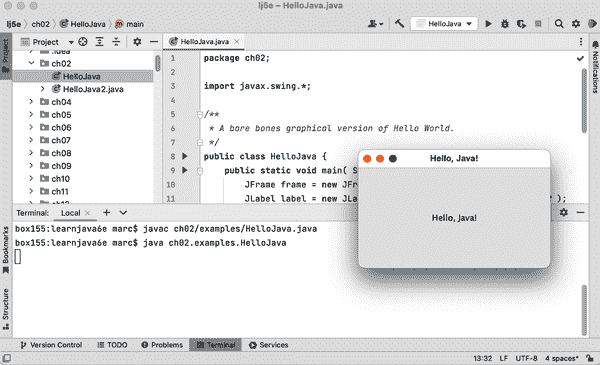

# 第二章。第一个应用程序

在深入讨论 Java 语言之前，让我们先通过一些工作代码来熟悉一下。在本章中，我们将构建一个友好的小应用程序，展示本书中使用的许多概念。我们将利用这个机会介绍 Java 语言和应用程序的一般特性。

这一章还作为 Java 面向对象和多线程方面的简要介绍。如果这些概念对你来说是新的，我们希望在这里首次接触 Java 时能够有一个简单而愉快的体验。如果你已经在其他面向对象或多线程编程环境中工作过，你应该会特别欣赏 Java 的简洁和优雅。本章仅旨在为你提供 Java 语言的概览和它的使用感受。如果你在这里介绍的任何概念上有困难，可以放心，它们将在本书的后面更详细地介绍。

我们无法过分强调在学习新概念时进行实验的重要性，无论是在这里还是在整本书中。不要只是阅读示例——运行它们。在可以的情况下，我们将向你展示如何使用 *jshell*（详见“尝试 Java”）实时尝试。本书示例的源代码可以在 [GitHub](https://github.com/l0y/learnjava6e) 找到。编译这些程序并尝试运行它们。然后，将我们的示例变成你的示例：玩弄它们，改变它们的行为，打破它们，修复它们，并希望在此过程中享受一些乐趣。

# Java 工具和环境

虽然只需使用 Oracle 的开源 Java 开发工具包（OpenJDK）和一个简单的文本编辑器（如 vi 或 Notepad）就可以编写、编译和运行 Java 应用程序，但今天绝大多数 Java 代码都是使用集成开发环境（IDE）编写的。使用 IDE 的好处包括将 Java 源代码的一切功能集中到一个视图中，具有语法高亮显示、导航帮助、源代码控制、集成文档、构建、重构和部署等功能。因此，我们将跳过学术性的命令行处理，从一个流行的免费 IDE — IntelliJ IDEA CE（社区版）开始。如果你不喜欢使用 IDE，可以使用命令行命令 **`javac HelloJava.java`** 进行编译，**`java HelloJava`** 运行即将出现的示例。

IntelliJ IDEA 需要安装 Java。本书涵盖 Java 21 语言功能，因此尽管本章的示例可以与旧版本一起使用，但最好安装 JDK 21 以确保本书中的所有示例都能编译通过。（Java 19 也有所有最重要的功能可用，尽管其中许多技术上处于“预览”模式。）JDK 包含几个开发工具，我们将在第三章中讨论这些工具。你可以通过在命令行中输入**`java -version`**来检查已安装的版本。如果没有安装 Java，或者版本旧于 JDK 19，你应该安装一个更新的版本，如在“安装 JDK”中讨论的那样。本书示例所需的仅仅是基本的 JDK。

## 安装 JDK

需要在开头声明的是，你可以自由下载和使用 Oracle 的官方商业[JDK](https://oreil.ly/sYaZm)用于个人使用。Oracle 下载页面提供了最新版本和最新的长期支持版本（目前版本都是 21），并附有旧版本的链接，以便管理遗留兼容性。例如，Java 8 和 Java 11 仍然是许多大型组织后端的重要版本。

然而，如果计划在任何商业或共享环境中使用 Java，Oracle JDK 现在带有严格的（并且付费的）许可条款。因此，基于此等理由，我们主要使用之前提到的 OpenJDK，如在“成长”中所述。不幸的是，这个开源版本并不包括所有不同平台的安装程序。但由于是开源的，其他团体可以介入并提供任何缺失的部分，事实上已经有几个基于 OpenJDK 的安装程序包存在。亚马逊一直以[Corretto](https://oreil.ly/W7noE)名义发布及时的安装程序。我们将在本章中介绍 Corretto 在 Windows、Mac 和 Linux 上的基本安装步骤。

对于那些希望使用最新版本且不介意进行一些配置工作的用户，可以考虑安装 OpenJDK。虽然不像使用典型的本地安装程序那样简单，但在你选择的操作系统上安装 OpenJDK 通常只需解压下载的文件到一个文件夹，并确保几个环境变量（`JAVA_HOME`和`PATH`）设置正确。无论你使用哪种操作系统，如果要使用 OpenJDK，你需要前往[Oracle 的 OpenJDK 下载页面](http://jdk.java.net)。在那里，他们列出了当前的版本以及任何可用的早期访问版本。

### 在 Linux 上安装 Corretto

对于流行的 Debian 和 Red Hat 发行版，你可以下载相应的文件（*.deb* 或 *.rpm*），然后使用你通常的包管理器安装 JDK。用于通用 Linux 系统的文件是一个可以在你选择的任何共享目录中解压的压缩 tar 文件（*tar.gz*）。我们将介绍解压和配置这个压缩的`tar`文件的步骤，因为它适用于大多数 Linux 发行版。这些步骤使用 Java 的 17 版本，但适用于所有当前和 LTS 版本的 Corretto 下载。

决定你想要安装 JDK 的位置。我们将把我们的存储在 */usr/lib/jvm* 中，但其他发行版可能使用其他位置，如 */opt*、*/usr/share* 或 */usr/local*。如果你是系统上唯一使用 Java 的用户，你甚至可以在你的家目录下解压文件。使用你喜欢的终端应用程序，切换到你下载文件的目录，并运行以下命令来安装 Java：

```java
~$ cd Downloads

~/Downloads$ sudo tar xzf amazon-corretto-17.0.5.8.1-linux-x64.tar.gz \
  --directory /usr/lib/jvm

~/Downloads$ /usr/lib/jvm/amazon-corretto-17.0.5.8.1-linux-x64/bin/java -version
openjdk version "17.0.5" 2022-10-18 LTS
OpenJDK Runtime Environment Corretto-17.0.5.8.1 (build 17.0.5+8-LTS)
OpenJDK 64-Bit Server VM Corretto-17.0.5.8.1 (build 17.0.5+8-LTS, mixed mode,
 sharing)
```

你可以看到版本信息的第一行以`LTS`结尾。这是确定你是否使用长期支持版本的简单方法。Java 成功解压后，你可以通过设置`JAVA_HOME`和`PATH`环境变量来配置终端以使用该版本：

```java
$ export JAVA_HOME=/usr/lib/jvm/amazon-corretto-17.0.5.8.1-linux-x64
$ export PATH=$JAVA_HOME/bin:$PATH
```

你可以使用 `-version` 标志来检查 Java 的版本，如 图 2-1 中所示，以测试这个设置是否工作。

你需要通过更新启动或 rc 脚本来使`JAVA_HOME`和`PATH`的更改永久化。例如，如果你使用`bash`作为你的 shell，你可以将 图 2-1 中的两行`export`命令添加到你的 *.bashrc* 文件中。


###### 图 2-1\. 在 Linux 上验证你的 Java 版本

### 在 macOS 上安装 Corretto

对于 macOS 系统的用户，[Corretto 下载](https://oreil.ly/W7noE) 和安装过程非常简单。选择你想使用的 JDK 版本，然后从随后的下载页面中选择 *.pkg* 链接。双击下载的文件以启动向导。

在 图 2-2 中显示的安装向导并不允许进行太多的实际定制。JDK 将被安装在运行 macOS 的磁盘上，其文件夹位于 */Library/Java/JavaVirtualMachines* 目录下，并将以符号链接形式链接到 */usr/bin/java*。虽然你可以选择备用的安装位置，例如在具有独立硬盘的 macOS 上，但默认设置适用于本书的目的。


###### 图 2-2\. macOS 中的 Corretto 安装向导

安装完成后，您可以通过打开通常位于全局*应用程序*文件夹下*实用工具*文件夹中的*终端*应用程序来测试 Java。键入**`java -version`**，您应该看到类似于图 2-3 的输出。我们在此系统上安装了版本 19，但您应该在输出中看到您下载的版本号。


###### 图 2-3\. 在 macOS 中验证您的 Java 版本

### 在 Windows 上安装 Corretto

Windows 上的 Corretto 安装程序（从[亚马逊的网站](https://oreil.ly/W7noE)下载*.msi*文件）遵循典型的 Windows 安装向导，如图 2-4 所示。您可以按照简短的提示接受默认设置，或者如果熟悉管理任务（如配置环境变量和注册表条目），也可以进行微调。如果提示允许安装程序对系统进行更改，请继续选择是。


###### 图 2-4\. Windows 中的 Corretto 安装向导

或许您不经常在 Windows 中使用命令行，但新版本的 Windows 中的*终端*应用程序（或旧版本中的*命令提示符*应用程序）具有与 macOS 或 Linux 中类似应用程序相同的功能。从 Windows 菜单中，您可以搜索`term`或`cmd`，如图 2-5 所示。


###### 图 2-5\. 在 Windows 中定位终端应用程序

单击相应的结果以启动您的终端，并通过键入**`java -version`**来检查 Java 的版本。在我们的示例中，我们运行的是版本 19；您应该看到与图 2-6 类似的输出，但带有您的版本号。


###### 图 2-6\. 在 Windows 中检查 Java 版本

当然，您可以继续使用终端，但现在您还可以将其他应用程序（如 IntelliJ IDEA）指向已安装的 JDK，并简单地使用这些工具。说到 IntelliJ IDEA，让我们更详细地看一下其安装步骤。

## 安装 IntelliJ IDEA 并创建项目

IntelliJ IDEA 是一款 IDE，可以在[JetBrains 的网站](https://oreil.ly/Lo9Xk)上找到。对于本书的目的和一般开始使用 Java，Community Edition 就足够了。下载是一个可执行安装程序或压缩存档：在 Windows 上是*.exe*，在 macOS 上是*.dmg*，在 Linux 上是*.tar.gz*。安装程序（和存档）都遵循标准程序，应该感觉很熟悉。如果您需要一点额外的指导，JetBrains 网站上的[安装指南](https://oreil.ly/wjooh)是一个很好的资源。

让我们创建一个新项目。在应用程序菜单中选择 文件 → 新建 → 项目，并在对话框顶部的“名称”字段中输入 **`Learning Java`**，如 图 2-7 所示。选择一个 JDK（版本 19 或更高版本），确保选中“添加示例代码”复选框。


###### 图 2-7\. 新建 Java 项目对话框

您可能会注意到对话框左侧的生成器列表。默认的“新项目”非常适合我们的需求。但您可以使用 Kotlin 或 Android 等模板启动其他项目。默认包括一个带有可执行 `main()` 方法的最小 Java 类。接下来的章节将更详细地介绍 Java 程序的结构以及可以放置在这些程序中的命令和语句。在左侧选择默认选项后，点击“创建”按钮。（如果看到下载共享索引的提示，请选择“是”。共享索引并不是必需的，但会让 IDEA 运行得更快。）您应该会得到一个包含 *Main.java* 文件的简单项目，如 图 2-8 所示。


###### 图 2-8\. IDEA 中的 `Main` 类

恭喜！现在您有一个 Java 程序。您将运行此示例，并在此基础上增加一些特色。接下来的章节将展示更多有趣的示例，逐步组合更多 Java 元素。尽管如此，我们始终会在类似的设置中构建这些示例。这些起步步骤是您的良好开始。

## 运行项目

从 IDEA 提供的简单模板开始，这样可以让您顺利运行您的第一个程序。回顾 图 2-8。注意代码编辑器左侧第 1 和第 2 行旁边的绿色三角形，分别位于 `Main` 类和 `main()` 方法旁边。IDEA 理解 `Main` 可以被执行。您可以单击任何这些按钮来运行您的代码。（在左侧项目大纲中的 *src* 文件夹下列出的 `Main` 类也有一个小绿色“播放”按钮。）您可以右键单击该类条目，并选择 `Run ‘Main.main()’` 选项，如 图 2-9 所示。


###### 图 2-9\. 运行您的 Java 项目

无论您使用编辑器边栏按钮还是上下文菜单，现在可以运行您的代码了。您应该能在编辑器底部的运行选项卡中看到“Hello World!”消息显示，类似于 图 2-10。


###### 图 2-10\. 我们的第一个 Java 程序输出

IDE 也包括一个方便的终端选项。这允许你打开一个具有命令提示符的标签或窗口。你可能不经常需要这个选项，但它绝对会派上用场。例如，在 IDEA 中，你可以从 View → Tool Windows → Terminal 菜单选项中打开终端标签，或者通过点击主窗口底部的 Terminal 快捷方式来打开，如 Figure 2-11 所示。


###### Figure 2-11\. IntelliJ IDEA 中的终端标签

在 VS Code 中，你可以使用 Terminal → New Terminal 菜单选项来打开一个类似的 IDE 部分，如 Figure 2-12 所示。


###### Figure 2-12\. Microsoft 的 VS Code 中的终端标签

随时可以自行尝试终端。在 IDE 中打开终端窗口后，导航至 *Learning Java* 文件夹。（大多数 IDE 会自动在项目的基本目录下打开终端。）使用 *java* 命令来运行我们的 `Main` 程序，如 Figure 2-13 所示。



###### Figure 2-13\. 在终端标签中运行 Java 程序

无论你选择哪种方式，再次祝贺你！你现在已经成功运行了你的第一个 Java 程序！

## 抓取示例

代码示例和练习解决方案可以在线获取，位于本书的 [GitHub 仓库](https://github.com/l0y/learnjava6e)。GitHub 已成为公共及私有开源项目的事实标准云存储库站点。GitHub 除了简单的源代码存储和版本控制外，还有许多有用的工具。如果你打算开发一个希望与他人共享的应用程序或库，值得在 GitHub 上设置一个账户并深入探索。幸运的是，你也可以仅仅通过下载公共项目的 ZIP 文件来使用它，如 Figure 2-14 所示。


###### Figure 2-14\. 从 GitHub 下载 ZIP 文件

你应该获得一个名为 *learnjava6e-main.zip* 的文件（因为你正在抓取这个仓库的“main”分支的存档）。如果你熟悉 GitHub 的其他项目，可以随意克隆该仓库，但静态 ZIP 文件包含了你阅读本书其余部分时尝试示例所需的一切内容。当你解压下载时，你会找到所有包含示例的章节文件夹，以及一个完成的 *game* 文件夹，其中包含一个有趣、轻松的苹果投掷游戏，以帮助在整本书中展示的许多编程概念统一应用。在接下来的章节中，我们将详细介绍示例和游戏。

如前所述，您可以从 ZIP 文件中的命令行直接编译和运行示例。您也可以将代码导入到您喜欢的 IDE 中。附录 A 详细介绍了如何将这些示例最佳地导入到 IntelliJ IDEA 中，但其他流行的 IDE，如微软的 VS Code，也可以工作。

# HelloJava

为了遵循介绍性编程文本的传统，我们将从 Java 的“Hello World”应用程序等效开始，即`HelloJava`。

在完成之前，我们会对这个示例进行几次修改（`HelloJava`，`HelloJava2`等），添加功能并介绍新概念。但让我们从最简版本开始。在您的工作空间中创建一个名为*HelloJava.java*的新文件（如果您使用的是 IDEA，可以从菜单中操作：文件 → 新建 → Java 类。然后给它一个名字*HelloJava*，不要带后缀，文件名后缀*.java*会自动添加）。接着，填写与创建新项目时提供的`Main`演示相同的`main()`方法即可。

```java
// ch02/examples/HelloJava.java

public class HelloJava {
  public static void main(String[] args) {
    System.out.println("Hello, Java!");
  }
}
```

这个五行程序声明了一个名为`HelloJava`的类和非常重要的`main()`方法。它使用了一个预定义的方法`println()`来输出一些文本。这是一个*命令行程序*，意味着它在终端或 DOS 窗口中运行，并在那里打印输出。这种方法有点老派，所以在进一步之前，我们将为`HelloJava`添加一个图形用户界面（GUI）。现在不要担心代码；只需跟着这里的进展走，稍后我们会回来解释。

替换包含`println()`方法的行，我们将使用一个`JFrame`对象将窗口显示在屏幕上。我们可以用以下三行代码替换`println`行：

```java
// filename: ch02/examples/HelloJava.java
// method:   main()
    JFrame frame = new JFrame("Hello, Java!");
    frame.setSize(300, 150);
    frame.setVisible(true);
```

这段代码创建了一个标题为“Hello, Java!”的`JFrame`对象。`JFrame`代表一个图形窗口。为了显示它，我们简单地通过调用`setSize()`方法配置它在屏幕上的大小，并通过调用`setVisible()`方法使其可见。

如果我们停在这里，我们会在屏幕上看到一个空窗口，窗口的标题是“Hello, Java!”。但我们想要的是把我们的消息放在窗口里，而不只是在顶部。为了把东西放在窗口里，我们需要再加几行代码。以下完整的示例添加了一个`JLabel`对象，在我们的窗口中心显示文本。顶部额外的`import`行是必需的，告诉 Java 编译器在哪里找到我们使用的`JFrame`和`JLabel`对象的定义：

```java
// ch02/examples/HelloJava.java
package ch02.examples;

import javax.swing.*;

public class HelloJava {
  public static void main(String[] args) {
    JFrame frame = new JFrame("Hello, Java!");
    frame.setSize(300, 150);
    JLabel label = new JLabel("Hello, Java!", JLabel.CENTER);
    frame.add(label);
    frame.setVisible(true);
  }
}
```

现在，要编译和运行这个源代码，可以右键单击你的*HelloJava.java*类，然后使用上下文菜单，或者在编辑器左边的绿色箭头之一上单击。参见图 2-15。


###### 图 2-15\. 运行 HelloJava 应用程序

你应该看到在图 2-16 中显示的声明。再次祝贺，你现在已经运行了你的第二个 Java 应用程序！花点时间沉浸在你的显示器的光辉中。


###### 图 2-16\. HelloJava 应用程序的输出

请注意，当您点击窗口的关闭按钮时，窗口会关闭，但您的程序仍在运行。（我们很快将修复此关闭行为。）要停止 IDEA 中的 Java 应用程序，请单击绿色播放按钮右侧的红色方形“停止”按钮。如果您在命令行上运行示例，请键入 Ctrl-C。

`HelloJava`可能是一个小程序，但背后的工作却不少。这几行代码代表了一个令人印象深刻的冰山尖端。表面下的是 Java 语言及其 Swing 库提供的功能层级。请记住，在本章中，我们将快速涵盖大量内容，以便向您展示整体情况。我们将尽量提供足够的细节，以便深入理解每个示例中发生的事情，但将详细说明推迟到适当的章节。这既适用于 Java 语言的元素，也适用于适用于它们的面向对象概念。说了这么多，现在让我们来看看我们第一个示例中正在发生的事情。

## 类

第一个示例定义了一个名为`HelloJava`的类：

```java
public class HelloJava {
  // ...
}
```

类是大多数面向对象语言的基本构建块。*类*是一组具有关联功能的数据项，可以对这些数据执行操作。类中的数据项称为*变量*或有时称为*字段*；在 Java 中，函数称为*方法*。面向对象语言的主要好处在于类单元中数据和功能的关联以及类能够*封装*或隐藏细节，使开发人员不必担心低级细节。我们将在第五章中详细展开这些优点，填充类的结构。

在应用程序中，一个类可以表示具体的东西，比如屏幕上的一个按钮或电子表格中的信息，也可以表示更抽象的东西，比如排序算法或视频游戏角色的无聊感。例如，代表电子表格的类可能具有表示其各个单元格值的变量，并且执行对这些单元格的操作的方法，如“清除行”或“计算值”。

我们的`HelloJava`类是一个完整的 Java 应用程序，全部定义在一个类中。它只定义了一个方法，`main()`，其中包含了我们程序的主体：

```java
public class HelloJava {
  public static void main(String[] args) {
    // ...
  }
}
```

当应用程序启动时，首先调用的是`main()`方法。标记为`String [] args`的部分允许我们向应用程序传递*命令行参数*。我们将在下一节中详细讨论`main()`方法。

最后，虽然这个版本的 `HelloJava` 没有将任何变量定义为其类的一部分，但它确实在其 `main()` 方法中使用了两个变量，`frame` 和 `label`。我们以后还会详细介绍变量。

## main() 方法

当我们运行示例时，可以看到运行 Java 应用程序意味着选择一个特定的类，并将其名称作为参数传递给 Java 虚拟机。当我们这样做时，`java` 命令会查找我们的 `HelloJava` 类，看它是否包含了具有恰当形式的特殊方法名为 `main()`。它有，这个方法就会被执行。如果 `main()` 方法不存在，我们将收到一个错误消息。`main()` 方法是应用程序的入口点。每个独立的 Java 应用程序都包含至少一个具有 `main()` 方法的类，该方法执行启动程序其余部分所需的操作。

我们的 `main()` 方法设置了一个窗口（一个 `JFrame`）来容纳 `HelloJava` 类的可视输出。现在，`main()` 在应用程序中承担着所有工作。但在面向对象的应用程序中，我们通常将责任委托给许多不同的类。在我们示例的下一个版本中，我们将执行这样的拆分——创建第二个类——我们将看到随着示例的演变，`main()` 方法保持不变，仅保持启动过程。

让我们快速浏览一下我们的 `main()` 方法，这样你就知道它的作用。首先，`main()` 创建了一个 `JFrame`，这个窗口将容纳我们的示例：

```java
    JFrame frame = new JFrame("Hello, Java!");
```

代码中这一行的 `new` 关键字非常重要。`JFrame` 是一个代表屏幕上窗口的类的名称，但这个类本身只是一个模板，就像一个建筑计划一样。`new` 关键字告诉 Java 分配内存并实际创建一个特定的 `JFrame` 对象。在这种情况下，括号内的参数告诉 `JFrame` 在其标题栏中显示什么。我们本可以省略“Hello, Java!”文本，并使用空括号创建一个没有标题的 `JFrame`，但这仅仅是因为 `JFrame` 明确允许我们这样做。

当框架窗口首次创建时，它们非常小。在显示 `JFrame` 之前，让我们将其大小设置为合理的值：

```java
    frame.setSize(300, 150);
```

这是在特定对象上调用方法的一个例子。在这种情况下，`setSize()` 方法由 `JFrame` 类定义，并影响我们放置在变量 `frame` 中的特定 `JFrame` 对象。与框架一样，我们还创建了 `JLabel` 的实例来在窗口内部保存我们的文本：

```java
    JLabel label = new JLabel("Hello, Java!", JLabel.CENTER);
```

`JLabel` 很像一个实际的标签。它在特定位置保存一些文本——在我们的框架上，在这种情况下。这是一个非常面向对象的概念：使用对象来保存一些文本，而不是简单地调用一个方法来“绘制”文本并继续。这背后的原理将在稍后变得更清楚。

接下来，我们必须将标签放入我们创建的框架中：

```java
    frame.add(label);
```

在这里，我们调用一个名为`add()`的方法，将我们的标签放在`JFrame`内。`JFrame`是一种可以容纳物件的容器。稍后我们会详细讨论这个。`main()`的最后任务是显示窗体窗口及其内容，否则它们将是不可见的。一个看不见的窗口会使应用程序变得非常无聊：

```java
    frame.setVisible(true);
```

这就是整个`main()`方法。当我们在本章的示例中继续前进时，它将在其周围进化的`HelloJava`类基本保持不变。

## 类和对象

类是应用程序部分的蓝图；它包含组成该组件的方法和变量。在应用程序运行时，可以存在许多给定类的个体工作副本。这些个体化的实例被称为该类的*实例*或*对象*。给定类的两个实例可能包含不同的数据，但它们始终具有相同的方法。

以`Button`类为例。只有一个`Button`类，但一个应用程序可以创建许多不同的`Button`对象，每个都是同一类的一个实例。此外，两个`Button`实例可能包含不同的数据，也许给每个提供不同的外观和执行不同的操作。在这个意义上，类可以被认为是制造它所代表的对象的模具，就像一个曲奇饼干切割机在计算机的内存中制造它的工作实例一样。正如你后来会看到的，类实际上可以在其实例之间共享信息，但现在这个解释足够了。第五章中有关类和对象的完整内容。

在 Java 中，术语*对象*非常通用，有时几乎可以与*类*互换使用。对象是所有面向对象语言中以某种形式引用的抽象实体。我们将*对象*用作类的实例的通用术语。因此，我们可能会将`Button`类的一个实例称为按钮，一个`Button`对象，或者不加区分地称为对象。在接下来的章节中，你会经常看到这个术语，并且第五章会更详细地讨论类和对象。

在上一个示例中，`main()`方法创建了`JLabel`类的一个实例，并在`JFrame`类的一个实例中显示它。你可以修改`main()`以创建许多`JLabel`的实例，也许每个在一个单独的窗口中。

## 变量和类类型

在 Java 中，每个类都定义了一个新的*类型*（数据类型）。你可以声明这种类型的变量，然后它可以保存该类的实例。例如，变量可以是`Button`类型，并保存`Button`类的实例，或者是`SpreadSheetCell`类型，并保存`SpreadSheetCell`对象，就像它可以是更简单的类型之一，比如`int`或`char`。变量具有类型并且不能简单地保存任何类型的对象，这是 Java 的另一个重要特性，确保了代码的安全性和正确性。

暂时不考虑`main()`方法中使用的变量，我们的简单`HelloJava`示例中只声明了另一个变量。它出现在`main()`方法的声明中：

```java
  public static void main(String [] args) {
    // ...
  }
```

就像其他语言中的函数一样，Java 中的方法声明一个接受*参数*（变量）的列表作为*参数*，并指定这些参数的类型。在这种情况下，主`method`要求在调用时，传递一个名为`args`的`String`对象数组作为参数。`String`是 Java 中表示文本的基本对象。正如我们早些时候暗示的那样，Java 使用`args`参数将任何提供给 Java 虚拟机的命令行参数传递到你的应用程序中（我们这里没有使用它们，但稍后会用到）。

到目前为止，我们宽泛地讨论变量保存对象的问题。实际上，具有类类型的变量不会保存对象——它们只是引用对象。*引用*是指向对象的指针或句柄。如果你声明一个类类型的变量但没有为其分配对象，它将被赋予默认值`null`，表示“无值”。如果你尝试像操作指向真实对象一样使用具有`null`值的变量，将会发生运行时错误，即`NullPointerException`。

当然，对象引用必须来自某处。在我们的例子中，我们使用`new`运算符创建了两个对象。稍后在本章节，我们会更详细地讨论对象的创建。

## HelloComponent

到目前为止，我们的`HelloJava`示例一直包含在一个单独的类中。实际上，因为它的简单性，它真的只是一个大方法。尽管我们已经使用了一些对象来显示我们的 GUI 消息，但我们自己的代码并没有展示任何面向对象的结构。

嗯，我们现在要通过添加第二个类来修正这个问题。为了在本章节中有所建树，我们将接管`JLabel`类的工作（再见，`JLabel`！），并将其替换为我们自己的图形类：`HelloComponent`。我们的`HelloComponent`类将从简单开始，只在固定位置显示我们的“Hello, Java!”消息。稍后我们会添加更多功能。

我们的新类代码很简单；我们只需要几行代码。首先，我们需要在*HelloJava.java*文件的顶部加上另一个`import`语句：

```java
import java.awt.*;
```

此行告诉编译器在哪里找到我们需要填充`HelloComponent`逻辑的额外类。这就是那个逻辑：

```java
class HelloComponent extends JComponent {
  public void paintComponent(Graphics g) {
    g.drawString("Hello, Java!", 125, 95);
  }
}
```

`HelloComponent`类定义可以放在我们的`HelloJava`类的上方或下方。然后，要在`main()`方法中使用我们的新类来替换引用标签的两行代码：

```java
    // Delete or comment out these two lines
    //JLabel label = new JLabel("Hello, Java!", JLabel.CENTER);
    //frame.add(label);

    // And add this line
    frame.add(new HelloComponent());
```

这次当您编译*HelloJava.java*时，请查看生成的*.class*文件。（这些文件将位于您当前目录（如果您正在使用终端）或您选择放置 IDEA 项目的*Learn Java/out/production/Learn Java*文件夹中。在 IDEA 中，您也可以在项目导航窗格的左侧展开*out*文件夹。）无论您如何安排源代码中的类，您都应该看到两个二进制类文件：*HelloJava.class*和*HelloComponent.class*。运行代码应该看起来很像`JLabel`版本，但是如果您调整窗口大小，您会注意到我们的新组件不会自动调整以使文本居中。

那么我们到底做了什么，为什么要如此费力地侮辱完全正常的`JLabel`组件？我们创建了我们的新`HelloComponent`类，扩展了一个称为`JComponent`的通用图形类。*扩展*一个类只是指向现有类添加功能，从而创建一个新类。我们将在下一节更详细地介绍这个过程。

在我们当前的示例中，我们创建了一种新的`JComponent`类型，其中包含一个称为`paintComponent()`的方法，负责绘制我们的消息。`paintComponent()`方法接受一个名为（有些简洁）`g`的参数，类型为`Graphics`。当调用`paintComponent()`方法时，将一个`Graphics`对象分配给`g`，我们在方法体中使用它。稍后我们会详细介绍`paintComponent()`和`Graphics`类。至于为什么这样做，待我们稍后为我们的新组件添加各种新功能时，您就会理解。

## 继承

Java 类以父子层次结构排列，其中父类和子类分别称为*超类*和*子类*。我们将在第五章中更深入地探讨这些概念。在 Java 中，每个类都恰好有一个超类（一个单一的父类），但可能有许多子类。唯一的例外是`Object`类，它位于整个类层次结构的顶端；它没有超类。（可以提前查看在图 2-17 中显示的 Java 类层次结构的一个小片段。）

在前面示例中声明我们的类时，使用关键字`extends`指定`HelloComponent`是`JComponent`类的一个子类：

```java
class HelloComponent extends JComponent { ... }
```

子类可以*继承*其超类的一些或所有变量和方法。继承使得子类可以访问其超类的变量和方法，就像它自己声明了它们一样。子类可以添加自己的变量和方法，并且还可以*覆盖*或改变继承方法的含义。当我们使用子类时，被覆盖的方法被子类自己的版本所隐藏（替换）。通过这种方式，继承提供了一个强大的机制，使得子类可以改进或扩展其超类的功能。

例如，假设电子表格类可以派生为新的科学电子表格类，其中内置了特殊的常量。在这种情况下，科学电子表格的源代码可能声明了用于特殊常量的变量，但新的科学类仍然具有构成标准电子表格正常功能的所有变量（和方法）。同样，这些标准元素是从父电子表格类继承而来。这也意味着科学电子表格保持其作为电子表格的身份；它仍然可以执行较简单电子表格的所有功能。这个想法，即更具体的类仍然可以执行更一般的父类或祖先的所有职责，具有深远的意义。我们称这个想法为*多态性*，我们将在整本书中继续探讨它。多态性是面向对象编程的基础之一。

我们的 `HelloComponent` 类是 `JComponent` 类的一个子类，并继承了许多在我们源代码中没有明确声明的变量和方法。这使得我们微小的类能够在 `JFrame` 中作为组件使用，仅需少量定制。

## `JComponent` 类

`JComponent` 类提供了构建各种 UI 组件的框架。特定的组件，如按钮、标签和列表框，都作为 `JComponent` 的子类来实现。

我们提到子类可以继承一个方法并重写它以实现某些特定行为。但是为什么我们要改变已经对超类有效的东西的行为呢？许多类从最小功能开始。最初的程序员希望其他人来添加有趣的部分。`JComponent` 就是这样的一个类。它为您处理与计算机窗口系统的大量通信，但它留下了空间让您添加特定的呈现和行为细节。

`paintComponent()` 方法是 `JComponent` 类的一个重要方法；我们重写它来实现我们特定组件在屏幕上的显示方式。`paintComponent()` 的默认行为根本不进行任何绘制。如果我们在子类中没有重写它，我们的组件将会是空的。在这里，我们重写 `paintComponent()` 来做一些稍微有趣的事情。我们不重写 `JComponent` 的任何其他继承成员，因为它们提供了基本功能和合理的默认值，适用于这个（微不足道的）示例。随着 `HelloJava` 的发展，我们将深入研究继承成员并使用额外的方法。我们还会添加一些特定于应用程序的方法和变量，以满足 `HelloComponent` 的需求。

`JComponent` 实际上是另一个被称为 Swing 的冰山的顶端。Swing 是 Java 的 UI 工具包，在我们的示例中通过顶部的 `import` 语句表示；我们将在 第十二章 中详细讨论 Swing。

## 关系和指向

您可以将子类化视为创建一个“is a”关系，其中子类“is a”其超类的一种。因此，`HelloComponent` 是 `JComponent` 的一种。当我们提到对象的一种类型时，我们指的是该对象类的任何实例或其任何子类的任何实例。稍后，我们将更详细地查看 Java 类层次结构，并看到 `JComponent` 本身是 `Container` 类的子类，后者进一步派生自一个称为 `Component` 的类，如 图 2-17 所示。

在这个意义上，`HelloComponent` 对象是 `JComponent` 的一种，而 `JComponent` 又是 `Container` 的一种，所有这些最终都可以被认为是 `Component` 的一种。正是从这些类中，`HelloComponent` 继承了它的基本 GUI 功能，以及（稍后我们将讨论的）嵌入在其中的其他图形组件的能力。


###### 图 2-17\. Java 类层次结构的部分

`Component` 是顶级 `Object` 类的一个子类，因此所有这些类都是 `Object` 的类型。Java API 中的每个其他类都从 `Object` 继承行为，`Object` 定义了一些基本方法，正如你将在 第五章 中看到的。我们将继续使用 *object*（小写 *o*）一词以通用方式指代任何类的实例；我们将使用 `Object` 来具体指代这个类的类型。

## 包和导入

我们之前提到我们示例的第一行告诉 Java 在哪里找到我们使用的一些类：

```java
import javax.swing.*;
```

具体来说，它告诉编译器我们将使用来自 Swing GUI 工具包的类（在本例中是`JFrame`、`JLabel`和`JComponent`）。这些类组织成一个名为`javax.swing`的 Java *包*。在 Java 中，包是按目的或应用程序相关联的一组类。同一包中的类彼此之间具有特殊的访问权限，并且可能被设计为紧密协作。

包名称采用点分隔的分层方式命名，例如`java.util`和`java.util.zip`。包中的类通常存储在匹配其包名称的嵌套文件夹中。它们的“全名”或正确术语称为*完全限定名称*中也包含包的名称作为其一部分。例如，`JComponent`类的完全限定名称是`javax.swing.JComponent`。我们本可以直接用这个名字引用它，而不使用`import`语句：

```java
class HelloComponent extends javax.swing.JComponent {...}
```

使用完全限定名称可能会令人厌烦。语句`import javax.swing.*`使我们能够通过它们的简单名称引用`javax.swing`包中的所有类。我们不必使用完全限定名称来引用`JComponent`、`JLabel`和`JFrame`类。

当我们添加第二个示例类时，我们看到在给定的 Java 源文件中可能会有一个或多个`import`语句。这些`import`语句有效地创建了一个“搜索路径”，告诉 Java 在何处寻找我们用简单、未限定名称引用的类。（实际上它并不是路径，但它避免了可能导致错误的模糊名称。）我们已经看到的`import`使用点星(`.*`)符号来指示整个包应该被导入。但你也可以指定单个类。例如，我们当前的示例只使用了`java.awt`包中的`Graphics`类。我们本可以使用`import java.awt.Graphics`而不是使用通配符`*`来导入所有抽象窗口工具包（AWT）的类。但是，我们预计稍后会使用此包中的几个其他类。

`java.`和`javax.`包层次结构是特殊的。任何以`java.`开头的包都是核心 Java API 的一部分，并且在支持 Java 的任何平台上都可用。`javax.`包通常表示核心平台的标准扩展，可能已安装或未安装。然而，近年来，许多标准扩展已添加到核心 Java API 中而未重命名。`javax.swing`包就是一个例子；尽管其名称如此，它仍然是核心 API 的一部分。Figure 2-18 展示了一些核心 Java 包，展示了每个包中的一个或两个典型类。


###### 图 2-18\. 一些核心 Java 包

`java.lang` 包含 Java 语言本身所需的基本类； 这个包被自动导入，这就是为什么在我们的示例中使用 `String` 或 `System` 等类名时不需要 `import` 语句的原因。 `java.awt` 包含较旧的图形窗口系统的类； `java.net` 包含网络类； 依此类推。

随着您对 Java 的经验越来越丰富，您将意识到熟练掌握可用于您的包、它们的作用以及何时以及如何使用它们是成为成功的 Java 开发人员的关键部分。

## `paintComponent()` 方法

我们的 `HelloComponent` 类的源代码定义了一个方法，`paintComponent()`，它重写了 `JComponent` 类的 `paintComponent()` 方法：

```java
  public void paintComponent(Graphics g) {
    g.drawString("Hello, Java!", 125, 95);
  }
```

当我们的示例需要在屏幕上绘制自己时，将调用 `paintComponent()` 方法。 它接受一个参数，一个 `Graphics` 对象，并且不会向其调用者返回任何类型的值（`void`）。

*修饰符* 是放置在类、变量和方法之前的关键字，用于改变它们的可访问性、行为或语义。 在这里 `paintComponent()` 被声明为 `public`，这意味着它可以被除了 `HelloComponent` 之外的类中的方法调用。 在这种情况下，是 Java 窗口环境调用我们的 `paintComponent()` 方法。 相比之下，被声明为 `private` 的方法或变量只能从它自己的类中访问。

`Graphics` 对象，`Graphics` 类的一个实例，表示特定的图形绘制区域。（它也被称为*图形上下文*。） 它包含可以用于在此区域绘制的方法，以及表示特征的变量，如剪切或绘图模式。 我们在 `paintComponent()` 方法中收到的特定 `Graphics` 对象对应于我们的 `HelloComponent` 屏幕上的区域，位于我们的框架内部。

`Graphics` 类提供了用于呈现形状、图像和文本的方法。 在 `HelloComponent` 中，我们调用我们的 `Graphics` 对象的 `drawString()` 方法来在指定的坐标上书写我们的消息。

正如我们之前所见，我们通过将一个点（`.`）和其名称附加到持有它的对象上来访问对象的方法。 我们以这种方式调用了 `Graphics` 对象（由我们的 `g` 变量引用）的 `drawString()` 方法：

```java
    g.drawString("Hello, Java!", 125, 95);
```

在这里，我们可以看到如何重写继承的方法提供了新的功能。 单独看，`JComponent` 的实例不知道要向用户显示什么信息，也不知道如何响应鼠标点击等操作。 我们扩展了 `JComponent` 并添加了一点自定义逻辑：我们在屏幕上显示一点文本。 但是我们还可以做得更多！

# HelloJava2: 续集

现在我们已经掌握了一些基础知识，让我们让我们的应用程序更加交互。以下小升级允许我们用鼠标拖动消息文本。如果你是新手程序员，这个升级可能并不那么小。不要担心！我们将在后面的章节中仔细查看这个示例中涉及的所有主题。现在，享受玩这个例子，并将其用作创建和运行 Java 程序的机会，即使你对代码内部感觉不那么自在。

我们将这个示例称为`HelloJava2`，而不是通过继续扩展旧示例来引起混淆，但这里和以后的主要变化在于向`HelloComponent`类添加功能，并简单地对名称进行相应的更改，以保持它们的清晰性（例如，`HelloComponent2`，`HelloComponent3`等）。刚刚看到继承的作用，你可能会想知道为什么我们不创建`HelloComponent`的子类，并利用继承来构建我们之前示例的基础上扩展其功能。嗯，在这种情况下，这并没有提供太多优势，所以为了清晰起见，我们简单地重新开始。

连续两个斜杠表示该行的其余部分是注释。我们已经向`HelloJava2`添加了一些注释，以帮助你跟踪一切：

```java
//file: HelloJava2.java
import java.awt.*;
import java.awt.event.*;
import javax.swing.*;

public class HelloJava2 {
  public static void main(String[] args) {
    JFrame frame = new JFrame("HelloJava2");
    frame.add(new HelloComponent2("Hello, Java!"));
    frame.setDefaultCloseOperation(JFrame.EXIT_ON_CLOSE);
    frame.setSize(300, 300);
    frame.setVisible(true);
  }
}

class HelloComponent2 extends JComponent
    implements MouseMotionListener {
  String theMessage;
  int messageX = 125, messageY = 95; // Coordinates of the message

  public HelloComponent2(String message) {
    theMessage = message;
    addMouseMotionListener(this);
  }

  public void paintComponent(Graphics g) {
    g.drawString(theMessage, messageX, messageY);
  }

  public void mouseDragged(MouseEvent e) {
    // Save the mouse coordinates and paint the message.
    messageX = e.getX();
    messageY = e.getY();
    repaint();
  }

  public void mouseMoved(MouseEvent e) { }
}
```

如果你正在使用 IDEA，请创建一个名为*HelloJava2*的新 Java 类，并复制上面的代码。如果你继续使用终端，请将此示例的文本放入一个名为*HelloJava2.java*的新文件中。无论哪种方式，你都希望像以前一样进行编译。你应该得到新的类文件*HelloJava2.class*和*HelloComponent2.class*作为结果。

如果你在 IDEA 中进行跟进，请点击`HelloJava2`旁边的运行按钮。如果你使用终端，请使用以下命令运行示例：

```java
C:\> java HelloJava2
```

随意用你自己的胜利性评论替换“Hello, Java!”消息，并享受用鼠标拖动文本多个小时的乐趣。注意，现在当你点击窗口的关闭按钮时，应用程序会正常退出；当我们讨论事件时，我们将在稍后解释这一点。让我们深入了解一下发生了什么变化。

## 实例变量

我们在我们的示例中向`HelloComponent2`类添加了一些变量：

```java
    int messageX = 125, messageY = 95;
    String theMessage;
```

`messageX`和`messageY`是保存我们可移动消息的当前坐标的整数。我们已经将它们设置为默认值，应该将消息放置在窗口的大致中心。Java 整数是 32 位有符号数，因此它们可以轻松保存我们的坐标值。变量`theMessage`是`String`类型，可以保存`String`类的实例。

您应该注意，这三个变量声明在类定义的大括号内，但不是在该类的任何特定方法内。这些变量称为*实例*变量，它们属于整个对象。每个类的各个实例中都会有它们的独立副本。实例变量始终对它们所属类内的所有方法可见（并可用）。根据其修饰符，它们也可能可以从类外部访问。

除非另有初始化（程序员术语表示设置某物的第一个值），否则实例变量将被设置为其类型的默认值：`0`、`false`或`null`，具体取决于其类型。数值类型被设置为`0`，布尔变量被设置为`false`，类类型变量始终具有`null`值。

实例变量与方法参数和其他在特定方法作用域内声明的变量不同。后者称为*局部*变量。它们实际上是只能被方法内部代码看到的私有变量。Java 不会初始化局部变量，因此您必须自行分配值。如果尝试使用尚未分配值的局部变量，您的代码将生成编译时错误。局部变量只在方法执行期间存在，然后消失，除非其他内容保存了它们的值。每次调用方法时，都会重新创建其局部变量，并且必须为其分配值。

我们已经使用了新的变量来使我们之前单调的`paintComponent()`方法更加动态。现在`drawString()`调用中的所有参数都由这些变量确定。

## 构造方法

`HelloComponent2`类包含一种特殊类型的方法，称为*构造方法*。构造方法用于设置类的新实例。当创建一个新对象时，Java 为其分配存储空间，将实例变量设置为它们的默认值，并调用类的构造方法来执行任何应用级别的设置。

构造方法的名称始终与其类的名称相同。例如，`HelloComponent2`类的构造方法称为`HelloComponent2()`。构造方法没有返回类型，但您可以将它们视为创建其类类型对象的方法。与其他方法一样，构造方法可以有参数。它们的唯一使命是配置和初始化新创建的类实例，可能使用传递给它们的参数中的信息。

使用`new`运算符创建对象时，需指定类的构造方法和任何必要的参数。¹ 创建的对象实例作为返回值返回。在我们的示例中，`main()`方法中通过以下行创建了一个新的`HelloComponent2`实例：

```java
    frame.add(new HelloComponent2("Hello, Java!"));
```

这一行实际上做了两件事情。为了更清楚地表达，我们可以将它们写成两个单独的行，这样更容易理解：

```java
    HelloComponent2 newObject = new HelloComponent2("Hello, Java!");
    frame.add(newObject);
```

第一行是重要的一行，这里创建了一个新的`HelloComponent2`对象。`HelloComponent2`的构造函数接受一个`String`作为参数，并且按照我们的安排使用该参数来设置在窗口中显示的消息。通过 Java 编译器的一些魔法，Java 源代码中的引号文本被转换为一个`String`对象（参见第八章对`String`类的更深入讨论）。第二行简单地将我们的新组件添加到框架中，以使其可见，就像我们在前面的示例中所做的那样。

顺便说一下，如果你想让我们的消息可配置，你可以将构造函数调用改为以下形式之一：

```java
    HelloComponent2 newobj = new HelloComponent2(args[0]);
```

现在你可以在运行应用程序时通过以下命令在命令行传递文本：

```java
C:\> java HelloJava2 "Hello, Java!"
```

`args[0]`指的是第一个命令行参数。在我们讨论数组时，它的意义会变得更清晰（参见第四章）。如果你在使用 IDE，你需要配置它以接受你的参数然后再运行它。IntelliJ IDEA 有一个叫做*run configuration*的东西，你可以在点击绿色播放按钮时从弹出的菜单中编辑它。Run configuration 有很多选项，但我们关注的是“Program Arguments”文本框，如图 2-19 所示。请注意，在命令行和 IDE 中，你必须用双引号将你的短语括起来，以确保文本被视为一个参数。如果你不加引号，`Hello,`和`Java!`会被视为两个独立的参数。


###### 图 2-19\. IDEA 对话框用于提供命令行参数

`HelloComponent2`的构造函数接着做了两件事情：它设置了`theMessage`实例变量的文本，并调用了`addMouseMotionListener()`。这个方法是事件机制的一部分，我们接下来会讨论它。它告诉系统：“嘿，我对任何涉及鼠标移动的事情感兴趣”：

```java
  public HelloComponent2(String message) {
    theMessage = message;
    addMouseMotionListener(this);
  }
```

特殊的只读变量`this`用于显式地引用我们的对象（“当前”对象上下文）在调用`addMouseMotionListener()`时。一个方法可以使用`this`来引用持有它的对象的实例。因此，以下两个语句是将值赋给`theMessage`实例变量的等效方式：

```java
    theMessage = message;
```

或者：

```java
    this.theMessage = message;
```

通常，我们会使用更短的、隐式形式来引用实例变量，但当我们必须显式地将对象的引用传递给另一个类中的方法时，我们会需要使用`this`。我们经常传递这样的引用，以便其他类中的方法可以调用我们的公共方法或使用我们的公共变量。

## 事件

`HelloComponent2`的最后两个方法，`mouseDragged()`和`mouseMoved()`，告诉 Java 传递任何可能从鼠标获取的信息。每当用户执行操作，比如在键盘上按键，移动鼠标，或者可能在触摸屏上撞击头部时，Java 就会生成一个*事件*。事件代表发生的动作；它包含关于动作的信息，比如时间和位置。大多数事件与应用程序中特定的 GUI 组件相关联。例如，按下键盘可以对应将字符输入到特定的文本输入字段中。点击鼠标按钮可以激活屏幕上的特定按钮。甚至只是在屏幕的某个区域内移动鼠标也可以触发效果，如突出显示文本或更改光标的形状。

要处理这些事件，我们已经导入了一个新的包，`java.awt.event`，它提供了特定的`Event`对象，我们用这些对象来从用户那里获取信息。（请注意，导入`java.awt.*`并不会自动导入`event`包。导入不是递归的。包实际上并不包含其他包，即使层次命名方案会暗示它们包含。）

其中有数十种事件类，包括`MouseEvent`、`KeyEvent`和`Action​E⁠vent`。在大多数情况下，这些事件的含义相当直观。当用户使用鼠标时，会发生`MouseEvent`，当用户按下或释放键时会发生`KeyEvent`，等等。`ActionEvent`有点特殊；我们将在第十二章中看到它的运作。现在，我们将专注于处理`MouseEvent`。

Java 中的 GUI 组件为特定类型的用户操作生成事件。例如，如果您在组件内部点击鼠标，组件将生成鼠标事件。对象可以请求从一个或多个组件接收事件，方法是通过将事件源的*监听器*注册到该组件。例如，要声明监听器希望接收组件的鼠标移动事件，可以调用该组件的`addMouseMotionListener()`方法，并将监听器对象作为参数传递。这就是我们示例在其构造函数中正在执行的操作。在这种情况下，组件调用其自己的`addMouseMotionListener()`方法，并将参数`this`传递进去，意思是“我希望接收自己的鼠标移动事件”。

这就是我们注册以接收事件的方式。但是我们如何实际获取它们呢？这就是我们类中两个与鼠标相关的方法的作用。`mouseDragged()`方法在监听器上自动调用以接收用户拖动鼠标时生成的事件，即移动鼠标并点击任意按钮。当用户在未点击按钮的情况下移动鼠标时，`mouseMoved()`方法被调用。

在这种情况下，我们将这些方法放在我们的`HelloComponent2`类中，并让它注册自己作为监听器。这对于我们的新文本拖动组件来说是完全适当的。更普遍地说，良好的设计通常规定事件监听器应该作为*适配器类*来实现，这样可以更好地分离 GUI 和“业务逻辑”。适配器类是一个方便的中间类，它实现了接口的所有方法并提供一些默认行为。我们将在第十二章中详细讨论事件、监听器和适配器。

我们的`mouseMoved()`方法很无聊：它什么也不做。我们忽略简单的鼠标移动，保留我们的注意力在拖动上。但是我们必须提供某种实现——即使是空实现——因为`MouseMotionListener`接口包含它。另一方面，我们的`mouseDragged()`方法有一些内容。窗口系统会重复调用此方法，以向我们提供用户拖动鼠标时鼠标位置的更新。这是它的工作方式：

```java
  public void mouseDragged(MouseEvent e) {
    messageX = e.getX();
    messageY = e.getY();
    repaint();
  }
```

`mouseDragged()`的唯一参数是一个`MouseEvent`对象，`e`，它包含关于此事件的所有信息。我们通过调用它的`getX()`和`getY()`方法询问`MouseEvent`来告诉我们鼠标当前位置的`x`和`y`坐标。我们将这些保存在`messageX`和`messageY`实例变量中，以便在其他地方使用。

事件模型的美妙之处在于您只需要处理您想要的事件类型。如果您不关心键盘事件，您就不会为它们注册监听器；用户可以随心所欲地输入，而您则不会受到干扰。如果没有特定类型事件的监听器，Java 甚至不会生成它。结果是，事件处理非常高效。²

在讨论事件时，我们应该提到我们在`HelloJava2`中添加的另一个小的补充：

```java
    frame.setDefaultCloseOperation(JFrame.EXIT_ON_CLOSE);
```

此行告诉框架在单击其关闭按钮时退出应用程序。它被称为“默认”关闭操作，因为这种操作像几乎每个其他 GUI 交互一样，都受事件控制。我们可以注册一个窗口监听器来在用户单击关闭按钮时通知我们，并采取任何我们喜欢的操作，但这种方便的方法处理了常见情况。

最后，我们在这里绕了几个其他问题。系统如何知道我们的类包含必要的`mouseDragged()`和`mouseMoved()`方法？这些名称从哪里来？为什么我们必须提供一个不做任何事情的`mouseMoved()`方法？这些问题的答案与接口有关。在处理完`repaint()`的一些未完成的事务后，我们将涉及接口。

## `repaint()`方法

因为我们在拖动鼠标时更改消息的坐标，所以我们希望`HelloComponent2`重新绘制自己。我们通过调用`repaint()`来实现这一点，这会请求系统在稍后的时间重新绘制屏幕。我们不能直接调用`paintComponent()`，即使我们想这样做，因为我们没有要传递给它的图形上下文。

我们可以使用`JComponent`类的`repaint()`方法来请求重新绘制我们的组件。`repaint()`会导致 Java 窗口系统在下一个可能的时间调用我们的`paintComponent()`方法；Java 会提供必要的`Graphics`对象，如[图 2-20](https://learnjava6-CHP-2-FIG-16)所示。


###### 图 2-20\. 调用`repaint()`方法

这种操作模式不仅仅是因为没有正确的图形上下文而带来的不便。它的最大优势在于重绘行为由其他部分处理，而我们可以自由地继续进行我们的业务。Java 系统有一个单独的专用执行线程来处理所有的`repaint()`请求。它可以根据需要调度和合并`repaint()`请求，这有助于防止在像滚动这样的绘图密集型场景中使窗口系统不堪重负。另一个优点是，所有的绘图功能必须通过我们的`paintComponent()`方法封装；我们不会被诱惑将它分散到应用程序的各个部分（这可能会增加维护的难度）。

## 接口

现在是时候解决我们之前避开的一些问题了：系统如何知道在鼠标事件发生时调用`mouseDragged()`？它仅仅是知道`mouseDragged()`是我们事件处理方法必须具有的某种魔法名称吗？不完全是；答案涉及到接口的讨论，这是 Java 语言中最重要的特性之一。

接口的第一个迹象出现在引入`HelloComponent2`类的代码行上。我们说这个类*实现*了`MouseMotionListener`接口：

```java
class HelloComponent2 extends JComponent implements MouseMotionListener {
  // ...
  public void mouseMoved(MouseEvent e) {
    // Your own logic goes here
  }

  public void mouseDragged(MouseEvent e) {
    // Your own logic goes here
  }
}
```

本质上，*接口*是类必须具有的方法列表；这个特定的接口要求我们的类具有称为`mouseDragged()`和`mouseMoved()`的方法。接口并不规定这些方法必须做什么；事实上，我们的`mouseMoved()`根本什么也不做。它确实指出这些方法必须以`MouseEvent`作为参数并且返回无值（这就是`void`的含义）。

接口是您、代码开发人员和编译器之间的契约。通过声明您的类实现`MouseMotionListener`接口，您表示这些方法将供系统的其他部分调用。如果您没有提供它们，将会发生编译错误。这就是为什么我们需要一个`mouseMoved()`方法的原因；即使我们提供的这个方法什么也不做，`MouseMotionListener`接口也要求我们必须有一个。

Java 分发版附带许多定义类必须执行的接口。编译器与类之间的这种契约概念非常重要。有许多情况，如我们刚刚看到的，您并不关心某个东西的具体类别；您只关心它具备某些功能，例如监听鼠标事件。接口为我们提供了一种根据对象能力而不知道或不关心其实际类型来操作对象的方式。在我们作为面向对象语言使用 Java 方面，它们是一个极其重要的概念。我们将在第五章中详细讨论它们。

第五章 还讨论了接口如何为 Java 规则提供了某种逃脱口，即任何新类只能扩展一个类（“单继承”）。在 Java 中，一个类只能扩展一个类，但可以实现任意多个接口。接口可以用作数据类型，可以扩展其他接口（但不能扩展类），并且可以被类继承（如果类 A 实现了接口 B，则 A 的子类也实现了 B）。关键的区别在于，类并不实际从接口继承方法；接口仅仅指定了类必须拥有的方法。

# 再见和再见

嗯，是时候告别 `HelloJava` 了。我们希望您已经对 Java 语言的一些特性以及编写和运行 Java 程序的基础有了一定的了解。这个简短的介绍应该有助于您探索使用 Java 进行编程的详细内容。如果您对这里介绍的一些材料感到有些困惑，不要灰心。我们将在整本书中的各自章节中再次详细讨论这里介绍的所有主要内容。这个教程旨在通过让您理解重要的概念和术语，使您的大脑为下次听到它们时有所准备。

在下一章中，我们将更好地了解 Java 世界的工具。我们将详细了解我们已经介绍的命令，比如 *javac*，以及其他重要的实用程序。继续阅读，向 Java 开发人员中的几位新朋友打招呼！

## 复习问题

这里有一些复习问题，以确保您掌握了本章的关键内容：

1.  您用什么命令来编译 Java 源文件？

1.  当运行 Java 类时，JVM 如何知道从何处开始？

1.  在创建新类时，能够扩展多个类吗？

1.  在创建新类时，能够实现多个接口吗？

1.  哪个类代表图形应用程序中的主窗口？

## 代码练习

对于你的第一个编程练习，³ 创建一个`GoodbyeJava`类，它的功能与第一个 HelloJava 程序一样，只是显示“Goodbye, Java!”的消息而已。尝试命令行版本或图形版本——或两者都试试！随意复制原始程序的尽可能多的部分。记得编译并运行你的`GoodbyeJava`类，以帮助练习执行 Java 应用程序的过程。在接下来的几章中，你肯定会得到更多的练习，但是现在更多地熟悉你的 IDE 或者*javac*和*java*命令将有助于你阅读接下来的几章。

¹ *参数*和*参数*这两个术语经常被交替使用。这大多数情况下都没问题，但从技术上讲，当定义方法或构造函数时，你提供参数的类型和名称。在调用方法或构造函数时，你提供参数来填充这些参数。

² Java 1.0 中的事件处理是一个完全不同的故事。在早期，Java 没有事件监听器的概念，所有的事件处理都是通过覆盖基础 GUI 类中的方法来完成的。这种做法效率低下，导致设计不佳，高度专业化的组件层出不穷。

³ 你可以在源代码的*exercises*文件夹中找到每章编程挑战的解决方案。 附录 A 包含了关于下载和使用源代码的详细信息。 附录 B 包含了每章末尾问题的答案以及对每章代码解决方案的提示。
