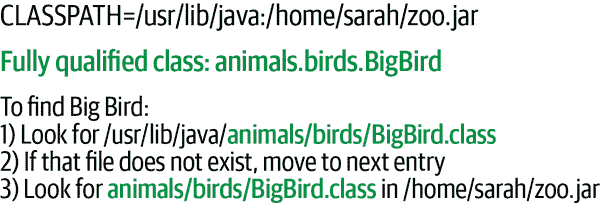

# 第三章 工具介绍

虽然您几乎可以肯定大部分 Java 开发都会在诸如 VS Code 或 IntelliJ IDEA 的 IDE 中进行，但您下载的 JDK 中包含了构建 Java 应用程序所需的所有核心工具。当我们编写 Java 源代码时，Java 编译器—*javac*—将我们的源代码转换为可用的字节码。当我们想要测试该字节码时，Java 命令本身—*java*—是我们用来执行程序的工具。当我们编译并使所有类一起工作时，Java 存档工具—*jar*—允许我们将这些类捆绑起来进行分发。在本章中，我们将讨论一些这些命令行工具，您可以使用它们来编译、运行和打包 Java 应用程序。JDK 中还包含许多其他开发工具，例如用于交互式工作的 *jshell* 或用于反编译类文件的 *javap*。我们无法在本书中讨论所有这些工具，但无论何时另一个工具可能有用，我们都会提到它。（而且我们肯定会看看 *jshell*。它非常适合快速尝试新的类或方法。）

我们希望您能熟悉这些命令行工具，即使您通常不在终端或命令窗口中工作。这些工具的一些功能在 IDE 中不易访问。您可能还会遇到 IDE 不实用或根本无法使用的情况。例如，系统管理员和 DevOps 工程师通常只能通过文本连接访问其在时髦数据中心运行的服务器。如果您需要通过这种连接修复 Java 问题，这些命令行工具将是必不可少的。

# JDK 环境

安装 JDK 后，*java* 运行命令通常会自动出现在您的路径中（可用于运行），尽管并非总是如此。此外，除非将 Java 的 *bin* 目录添加到执行路径中，否则 JDK 提供的许多其他命令可能不可用。为确保无论您的设置如何都能访问所有工具，以下命令展示了如何在 Linux、macOS 和 Windows 上正确配置开发环境。您需要为 Java 的位置定义一个新的环境变量，并将该 *bin* 文件夹追加到现有的路径变量中。（操作系统使用 *环境变量* 存储应用程序运行时可以使用和可能共享的信息碎片。）当然，您需要根据您安装的 Java 版本更改我们示例中的路径：

```java
# Linux
export JAVA_HOME=/usr/lib/jvm/jdk-21-ea14
export PATH=$PATH:$JAVA_HOME/bin

# Mac OS X
export JAVA_HOME=/Users/marc/jdks/jdk-21-ea14/Contents/Home
export PATH=$PATH:$JAVA_HOME/bin

# Windows
set JAVA_HOME=c:\Program Files\Java\jdk21
set PATH=%PATH%;%JAVA_HOME%\bin
```

在 macOS 上，情况可能更加混乱，因为操作系统的最新版本预装了 Java 命令的“存根”。苹果不再提供自己的 Java 实现，因此如果您尝试运行这些命令之一，操作系统将提示您在那时下载 Java。

如果有疑问，确定 Java 是否已安装以及您正在使用的工具版本的首选测试是在*java*和*javac*命令上使用`-version`标志：

```java
% java -version

openjdk version "21-ea" 2023-09-19
OpenJDK Runtime Environment (build 21-ea+14-1161)
OpenJDK 64-Bit Server VM (build 21-ea+14-1161, mixed mode, sharing)

% javac -version

javac 21-ea
```

我们版本输出中的`ea`表示这是一个“早期访问”版本。（在我们撰写本版本时，Java 21 仍在测试中。）

# Java 虚拟机

Java 虚拟机（VM）是实现 Java 运行时系统并执行 Java 应用程序的软件。它可以是像 JDK 附带的*java*命令一样的独立应用程序，也可以内置到像 Web 浏览器这样的较大应用程序中。通常，解释器本身是一个本地应用程序，为每个平台提供，然后启动用 Java 语言编写的其他工具。例如，Java 编译器和 IDE 通常直接使用 Java 实现，以最大化其可移植性和可扩展性。例如，Eclipse 是一个纯 Java 应用程序。

Java 虚拟机执行 Java 的所有运行时活动。它加载 Java 类文件，验证来自不受信任来源的类，并执行编译后的字节码。它管理内存和系统资源。良好的实现还执行动态优化，将 Java 字节码编译成本机机器指令。

# 运行 Java 应用程序

独立 Java 应用程序必须至少有一个包含名为`main()`的方法的类，这是启动时要执行的第一段代码。要运行应用程序，请启动 VM，将该类指定为参数。您还可以指定要传递给应用程序的选项以及解释器的参数：

```java
% java [interpreter options] class_name [program arguments]
```

类应指定为完全限定的类名，包括包名（如果有）。但是，请注意，不要包含*.class*文件扩展名。以下是您可以在*ch03/examples*文件夹中终端中尝试的一些示例：

```java
% cd ch03/examples
% java animals.birds.BigBird
% java MyTest
```

解释器在*classpath*中搜索类，*classpath*是存储类的目录和存档文件的列表。您可以通过类似于上面的`JAVA_HOME`的环境变量或使用命令行选项*`-classpath`*指定类路径。如果两者都存在，则 Java 使用命令行选项。我们将在下一节详细讨论类路径。

您还可以使用*java*命令启动“可执行”Java ARchive（JAR）文件：

```java
% java -jar spaceblaster.jar
```

在这种情况下，JAR 文件包含有启动类的元数据，该启动类包含`main()`方法的名称，并且类路径变为 JAR 文件本身。我们将在“JAR 文件”中更详细地讨论 JAR 文件。

如果您主要在 IDE 中工作，请记住，您仍然可以使用我们在“运行项目”中提到的内置终端选项尝试之前的命令。

加载第一个类并执行其`main()`方法后，应用程序可以引用其他类，启动其他线程，并创建其用户界面或其他结构，如图 3-1 所示。


###### 图 3-1。启动 Java 应用程序

`main()` 方法必须具有正确的*方法签名*。方法签名是定义方法的一组信息。它包括方法的名称、参数和返回类型，以及类型和可见性修饰符。`main()` 方法必须是一个 `public`、`static` 方法，它以 `String` 对象数组作为参数，并且不返回任何值（`void`）：

```java
  public static void main (String [] myArgs)
```

`main()` 是一个 `public` 和 `static` 方法的事实仅意味着它是全局可访问的，并且可以直接按名称调用。我们将在第四章和第五章讨论可见性修饰符如 `public` 的含义和 `static` 的含义。

`main()` 方法的单个参数，`String` 对象数组，保存传递给应用程序的命令行参数。参数的名称无关紧要；只有类型是重要的。在 Java 中，`myArgs` 的内容是一个数组。（关于数组的更多信息，请参阅第四章。）在 Java 中，数组知道它们包含多少个元素，并且可以愉快地提供该信息：

```java
    int numArgs = myArgs.length;
```

`myArgs[0]` 是第一个命令行参数，依此类推。

Java 解释器继续运行，直到初始类文件的 `main()` 方法返回，以及它启动的任何线程也退出。（关于线程的更多信息，请参阅第九章。）被指定为*守护*线程的特殊线程在应用程序的其余部分完成时自动终止。

## 系统属性

虽然可以从 Java 中读取主机环境变量，但 Oracle 不建议将其用于应用程序配置。相反，Java 允许您在启动 VM 时向应用程序传递任意数量的*系统属性*值。系统属性只是可通过静态 `System.getProperty()` 方法对应用程序可用的名称-值字符串对。您可以使用这些属性作为为应用程序提供一般配置信息的更结构化和可移植的替代方案，而不是使用命令行参数和环境变量。您可以使用命令行将每个系统属性传递给解释器，使用 `-D` 选项后跟 `name`=`value`。例如：

```java
% java -Dstreet=sesame -Dscene=alley animals.birds.BigBird
```

然后，您可以通过以下方式在程序中访问 `street` 属性的值：

```java
    String street = System.getProperty("street");
```

当然，应用程序可以以无数其他方式获取其配置，包括通过文件或在运行时通过网络。

# 类路径

*路径*的概念应该对于任何在 DOS 或 Unix 平台工作过的人都很熟悉。它是一个环境变量，为应用程序提供了一个查找资源的位置列表。最常见的例子是可执行程序的路径。在 Unix shell 中，`PATH` 环境变量是一个由冒号分隔的目录列表，用户键入命令名称时按顺序搜索这些目录。类似地，Java 的 `CLASSPATH` 环境变量是一个包和 Java 类搜索的位置列表。

类路径的一个元素可以是目录或 JAR 文件。JAR 文件是简单的归档文件，包括描述每个归档内容的额外文件（元数据）。JAR 文件是使用 JDK 的 *jar* 实用程序创建的。许多用于创建 ZIP 归档的工具都是公开可用的，可以用来检查或创建 JAR 文件[¹]。归档格式使得大量类及其资源可以分发在一个单一的、紧凑的文件中；Java 运行时根据需要自动从归档中提取单个类文件。我们将在 “jar 实用程序” 中更详细地了解 JAR 文件和 *jar* 命令。

设置类路径的具体方法和格式因系统而异。我们来看看如何做到这一点。

## Unix 和 macOS 上的 CLASSPATH

在 Unix 系统上（包括 macOS），你可以使用冒号分隔的目录和类存档文件设置 `CLASSPATH` 环境变量：

```java
% export CLASSPATH=/home/vicky/Java/classes:/home/josh/lib/foo.jar:.
```

此示例指定了一个类路径，其中包括三个位置：用户主目录中的一个目录，另一个用户目录中的一个 JAR 文件，以及当前目录，通常用点 (`.`) 表示。类路径的最后一个组件，当前目录，在你进行类调试时非常有用。

## Windows 上的 CLASSPATH

在 Windows 系统上，`CLASSPATH` 环境变量是由分号分隔的目录和类存档文件列表：

```java
C:\> set CLASSPATH=C:\home\vicky\Java\classes;C:\home\josh\lib\foo.jar;.
```

Java 启动器和其他命令行工具知道如何找到*核心类*，即每个 Java 安装中包含的类。例如 `java.lang`、`java.io`、`java.net` 和 `javax.swing` 包中的类都是核心类，因此你不需要在类路径中包含这些类的库或目录。

## CLASSPATH 通配符

`CLASSPATH` 环境变量也可以包括“*”通配符，匹配目录中的所有 JAR 文件。例如：

```java
% export CLASSPATH=/home/sarah/libs/*
```

要找到其他类，Java 解释器按照它们列出的顺序搜索类路径中的元素。搜索结合了路径位置和完全限定类名的组成部分。例如，考虑对`animals.birds.BigBird`类的搜索，如图 3-2 所示。搜索类路径目录*/usr/lib/java*意味着解释器在*/usr/lib/java/animals/birds/BigBird.class*寻找单个类文件。在类路径上搜索 ZIP 或 JAR 归档，比如*/home/sarah/zoo.jar*，意味着解释器在该归档中查找*animals/birds/BigBird.class*文件。



###### 图 3-2\. 在类路径中查找完全限定名称

对于 Java 运行时的*java*和 Java 编译器*javac*，类路径也可以使用*`-classpath`*选项指定。例如，在 Linux 或 macOS 机器上：

```java
% javac -classpath /home/pat/classes:/utils/utils.jar:. Foo.java
```

在 Windows 上基本相同，但您必须遵循系统路径分隔符（分号）并使用驱动器字母来启动绝对路径。

如果您未指定`CLASSPATH`环境变量或命令行选项，则类路径默认为当前目录（`.`）；这意味着当前目录中的文件通常是可用的。如果更改类路径并且不包括当前目录，则这些文件将不再可访问。

我们怀疑许多新手学习 Java 时遇到的问题与类路径有关。特别注意在开始时设置和检查类路径。如果您在 IDE 中工作，可能会减轻部分或全部管理类路径的负担。然而，理解类路径并确切知道在应用程序运行时其中包含什么，对您的长期心理健康非常重要。

## 模块

Java 9 引入了*模块*方法用于 Java 应用程序。模块允许更精细的、高性能的应用程序部署，即使应用程序非常大。 （对于大型应用程序，模块并不是必需的。如果符合您的需求，可以继续使用经典的类路径方法。）使用模块需要额外的设置，因此我们不会在本书中详细讨论它们，但是更大的、商业分发的应用程序可能是基于模块的。如果开始考虑将工作分享到公共存储库之外，请查看[*Java 9 模块化*](https://oreil.ly/Wjs1q)（Paul Bakker 和 Sander Mak 著，O’Reilly）以获取更多详细信息和帮助模块化您自己的大型项目。

# Java 编译器

*javac* 命令行实用程序是 JDK 中的编译器。该编译器完全用 Java 编写，因此适用于支持 Java 运行时系统的任何平台。*javac* 将 Java 源代码转换为包含 Java 字节码的编译类。按照惯例，源文件以 *.java* 扩展名命名；生成的类文件以 *.class* 扩展名结尾。每个源代码文件被视为单个编译单元。（如你将在第五章中看到，给定编译单元中的类共享某些特性，如 `package` 和 `import` 语句。）

*javac* 允许每个文件一个公共类，并坚持文件必须与类名相同。如果文件名和类名不匹配，*javac* 将发出编译错误。单个文件可以包含多个类，只要这些类中只有一个是公共的，并且命名与文件名相同。避免将太多类打包到单个源文件中。在 *.java* 文件中将类打包在一起只是表面上将它们关联起来。

继续，在 *ch03/examples/animals/birds* 文件夹中创建一个名为 *Bluebird.java* 的新文件。你可以使用你的集成开发环境（IDE）完成此步骤，或者你可以打开任何旧文本编辑器并创建一个新文件。创建文件后，将以下源代码放入文件中：

```java
package animals.birds;

public class Bluebird {
}
```

接下来，使用以下命令进行编译：

```java
% cd ch03/examples
% javac animals/birds/Bluebird.java
```

我们的小文件目前什么都没做，但编译应该正常工作。你不应该看到任何错误。

与 Java 解释器不同，它只需类名作为参数，*javac* 需要一个文件名（包括 *.java* 扩展名）来处理。前述命令会在与源文件相同的目录下生成类文件 *Bluebird.class*。尽管在这个例子中看到类文件与源文件在同一目录下很好，但对于大多数真实应用程序，你需要将类文件存储在类路径中的适当位置。

你可以使用 *javac* 的 *`-d`* 选项来指定用于存储 *javac* 生成的类文件的替代目录。指定的目录被用作类层次结构的根，因此 *.class* 文件被放置在此目录或其子目录中，这取决于类是否包含在包中。（如果需要，编译器会自动创建中间子目录。）例如，我们可以使用以下命令将 *Bluebird.class* 文件创建在 */home/vicky/Java/classes/animals/birds/Bluebird.class*：

```java
% javac -d /home/vicky/Java/classes Bluebird.java
```

你可以在单个 *javac* 命令中指定多个 *.java* 文件；编译器为每个给定的源文件创建一个类文件。只要这些类在类路径中以源代码或编译形式存在，你不需要列出类引用的其他类。在编译期间，Java 使用类路径解析所有其他类引用。

Java 编译器比一般的编译器更智能。例如，*javac* 比较所有类的源文件和类文件的修改时间，并根据需要重新编译它们。已编译的 Java 类会记住它编译自哪个源文件，只要源文件可用，*javac* 就可以在需要时重新编译它。在前面的例子中，如果类`BigBird`引用另一个类，比如`animals.furry.Grover`，*javac* 就会在`animals.furry`包中寻找源文件*Grover.java*，如果需要的话，会重新编译该文件，以更新*Grover.class*类文件。

默认情况下，*javac* 只检查直接从其他源文件引用的源文件。这意味着，如果你有一个过时的类文件，只有一个更新的类文件引用它，可能不会被注意到并重新编译。因此，大多数项目使用像[Gradle](https://gradle.org)这样的实际构建工具来管理构建、打包等等，有很多其他的理由也是如此。

最后，需要注意的是，*javac* 可以编译应用程序，即使只有一些类的编译（二进制）版本可用。你不需要所有对象的源代码。Java 类文件包含源文件包含的所有数据类型和方法签名信息，因此针对二进制类文件进行编译和针对 Java 源代码进行编译一样好。（当然，如果需要进行更改，你仍然需要源文件。）

# 尝试 Java

Java 9 引入了一个叫做*jshell*的实用工具，允许你尝试 Java 代码的片段并立即看到结果。*jshell* 是一个 REPL—即读取-求值-输出循环。许多语言都有它们，在 Java 9 之前有许多第三方变体可用，但没有一个内置在 JDK 本身。让我们更仔细地看看它的能力。

你可以使用操作系统中的终端或命令窗口，或者在 IntelliJ IDEA 中打开一个终端选项卡，如图 Figure 3-3 所示。只需在命令提示符处输入**`jshell`**，你将看到一些版本信息以及如何在 REPL 中查看帮助的快速提醒。


###### 图 3-3\. 在 IDEA 中启动 jshell

现在让我们继续尝试那个帮助命令：

```java
|  Welcome to JShell -- Version 19.0.1
|  For an introduction type: /help intro

jshell> /help intro
|
|                                   intro
|                                   =====
|
|  The jshell tool allows you to execute Java code, getting immediate results.
|  You can enter a Java definition (variable, method, class, etc),
|  like:  int x = 8
|  or a Java expression, like:  x + x
|  or a Java statement or import.
|  These little chunks of Java code are called 'snippets'.
|
|  There are also the jshell tool commands that allow you to understand and
|  control what you are doing, like:  /list
|
|  For a list of commands: /help
```

*jshell* 非常强大，虽然在本书中我们不会使用它的所有功能。但是，在剩余大部分章节中，我们肯定会用它来尝试 Java 代码。回想一下我们的`HelloJava2`示例，“HelloJava2: The Sequel”。你可以直接在 REPL 中创建像`JFrame`这样的 UI 元素，然后操作它们，同时得到即时反馈！无需保存、编译、运行、编辑、保存、编译、运行等等。让我们试一试：

```java
jshell> JFrame frame = new JFrame("HelloJava2")
|  Error:
|  cannot find symbol
|    symbol:   class JFrame
|  JFrame frame = new JFrame("HelloJava2");
|  ^----^
|  Error:
|  cannot find symbol
|    symbol:   class JFrame
|  JFrame frame = new JFrame("HelloJava2");
|                     ^----^
```

糟糕！*jshell*很聪明，功能丰富，但也非常字面。记住，如果你想使用默认包中没有包含的类，你必须导入它。这在 Java 源文件中是真实的，在使用*jshell*时也是如此。让我们再试一次：

```java
jshell> import javax.swing.*

jshell> JFrame frame = new JFrame("HelloJava2")
frame ==> javax.swing.JFrame[frame0,0,23,0x0,invalid,hidden ... led=true]
```

好多了。可能有点奇怪，但比以前好多了。我们的`frame`对象已经创建了。`==>`箭头后面的额外信息只是关于我们的`JFrame`的细节，比如它的大小（`0x0`）和屏幕上的位置（`0,23`）。其他类型的对象将显示其他细节。让我们像之前一样给我们的框架设置宽度和高度，并将我们的框架显示在屏幕上，以便我们可以看到它：

```java
jshell> frame.setSize(300,200)

jshell> frame.setLocation(400,400)

jshell> frame.setVisible(true)
```

你应该看到一个窗口在你眼前弹出！它将会展示现代的装饰，如图 3-4 所示。


###### 图 3-4\. 从 jshell 显示`JFrame`

顺便说一句，在 REPL 中不要担心犯错。你会看到一个错误消息，但你可以纠正错误并继续。举个例子，想象一下试图在改变框架大小时打字错误：

```java
jshell> frame.setsize(300,100)
|  Error:
|  cannot find symbol
|    symbol:   method setsize(int,int)
|  frame.setsize(300,100)
|  ^-----------^
```

Java 区分大小写，所以`setSize()`和`setsize()`不一样。*jshell*提供与 Java 编译器类似的错误信息，但是在线呈现。纠正这个错误，并观察框架变小一点（图 3-5)！


###### 图 3-5\. 改变我们的框架大小

真棒！嗯，也许这不那么有用，但我们刚刚开始。让我们使用`JLabel`类添加一些文本：

```java
jshell> JLabel label = new JLabel("Hi jshell!")
label ==> javax.swing.JLabel[,0,0,0x0, ...rticalTextPosition=CENTER]

jshell> frame.add(label)
$8 ==> javax.swing.JLabel[,0,0,0x0, ...text=Hi, ...]
```

Neat, but why didn’t our label show up in the frame? We’ll go into much more detail on this in 第十一章，但在 Java 中，有些图形变化在显示到屏幕上之前会先积累起来。这是一个非常高效的技巧，但有时会让你措手不及。让我们强制框架重新绘制自己（图 3-6）：

```java
jshell> frame.revalidate()

jshell> frame.repaint()
```


###### 图 3-6\. 向我们的框架添加`JLabel`

现在我们可以看到我们的标签了。有些操作会自动触发对`revalidate()`或`repaint()`的调用。例如，在我们显示框架之前添加到框架的任何组件，将会在我们显示框架时立即出现。或者我们可以类似地删除标签。再次观察，看看当我们立即在删除标签后改变框架大小时会发生什么（图 3-7）：

```java
jshell> frame.remove(label) // as with add(), things don't change immediately

jshell> frame.setSize(400,150)
```


###### 图 3-7\. 删除标签并调整我们的框架大小

看到了吗？我们有了一个新的、更苗条的窗口，没有标签——全部都没有强制重绘。我们将在后面的章节中继续处理 UI 元素，但让我们尝试对标签做一些微调，只是为了向你展示在文档中查找的新想法或方法有多容易。例如，我们可以使标签的文本居中，结果就像图 3-8 那样：

```java
jshell> frame.add(label)
$45 ==> javax.swing.JLabel[,0,0,300x278,...,text=Hi jshell!,...]

jshell> frame.revalidate()

jshell> frame.repaint()

jshell> label.setHorizontalAlignment(JLabel.CENTER)
```


###### 图 3-8\. 将文本居中显示在我们的标签上

我们知道这又是一次快速浏览，其中包含几段代码可能还不太容易理解。为什么 `CENTER` 全部大写？为什么在我们的居中对齐之前使用类名 `JLabel`？我们现在无法回答每一个问题，但我们希望您跟着输入，可能会犯一些小错误，然后纠正它们，看到结果会让您想要了解更多。我们希望确保您拥有在阅读本书的其余部分时继续参与的工具。就像许多其他技能一样，编程除了阅读之外还受益于实践！

# JAR 文件

Java ARchive（JAR）文件是 Java 的手提箱。它们是将 Java 应用程序的所有部分打包成一个紧凑的包用于分发或安装的标准和可移植的方式。您可以将任何东西放入 JAR 文件中：Java 类文件、序列化对象、数据文件、图像、音频等。JAR 文件还可以携带一个或多个数字签名，以证明其完整性和真实性，附加到文件整体或文件中的单个项目上。

Java 运行时系统可以直接从 `CLASSPATH` 环境变量中的归档文件加载类文件，如前所述。包含在您的 JAR 文件中的非类文件（数据、图像等）也可以通过应用程序使用 `getResource()` 方法从类路径中检索。使用此功能，您的代码不需要知道任何资源是普通文件还是 JAR 归档的成员。无论给定的类或数据文件是 JAR 文件中的项目还是类路径上的单个文件，您始终可以以标准方式引用它，并让 Java 的类加载器解析其位置。

存储在 JAR 文件中的项目使用标准 ZIP 文件压缩进行压缩。² 压缩使得通过网络下载类文件变得更快。快速调查标准 Java 发行版显示，典型的类文件在压缩时可以缩小约 40%。包含英文单词的文本文件，如 HTML 或 ASCII，通常可以压缩至原始大小的十分之一或更少。（另一方面，图像文件通常在压缩时不会变小，因为大多数常见的图像格式本身就是压缩格式。）

## jar 实用程序

JDK 提供的 *jar* 实用程序是用于创建和读取 JAR 文件的简单工具。其用户界面并不特别友好。它模仿 Unix 的磁带归档命令 *tar*。如果您熟悉 *tar*，您将会认出以下命令，它们都采用了 图 3-9 中的格式：

`jar -cvf jar 文件路径 [ 路径 ] [ …​ ]`

创建包含 *`路径`*(们) 的 *`jar 文件`*。

`jar -tvf jar 文件 [ 路径 ] [ …​ ]`

列出 *`jar 文件`* 的内容，可选地仅显示 *`路径`*(们)。

`jar -xvf jar 文件 [ 路径 ] [ …​ ]`

提取 *`jar 文件`* 的内容，可选地仅提取 *`路径`*(们)。


###### 图 3-9\. *jar* 命令行工具的重要元素

在这些命令中，标志字母 `c`、`t` 和 `x` 告诉 *jar* 它是在创建归档、列出归档内容还是从归档中提取文件。`f` 标志表示接下来的参数是要操作的 JAR 文件的名称。

###### 提示

可选的 `v` 标志告诉 *jar* 命令在显示有关文件信息时要详细。在详细模式下，你将获得有关文件大小、修改时间和压缩比率的信息。

命令行中的后续项目（除了告诉 *jar* 要做什么以及 *jar* 应该操作的文件之外的几乎所有内容）被视为归档项目的名称。如果你正在创建一个归档，你列出的文件和目录将被放入其中。如果你正在提取，只有你列出的文件名会从归档中提取。（如果你没有列出任何文件，则 *jar* 会提取归档中的所有内容。）

例如，假设我们刚刚完成了我们的新游戏“Space Blaster”。与游戏相关的所有文件都在三个目录中。Java 类本身位于 *spaceblaster/game* 目录中，*spaceblaster/images* 包含游戏的图像，*spaceblaster/docs* 包含相关游戏数据。我们可以用这个命令将所有这些打包成一个归档：

```java
% jar -cvf spaceblaster.jar spaceblaster/
```

因为我们请求了详细输出，*jar* 告诉我们它正在做什么：

```java
added manifest
adding: spaceblaster/(in = 0) (out= 0)(stored 0%)
adding: spaceblaster/docs/(in = 0) (out= 0)(stored 0%)
adding: spaceblaster/docs/help1.html(in = 502) (out= 327)(deflated 34%)
adding: spaceblaster/docs/help2.html(in = 562) (out= 360)(deflated 35%)
adding: spaceblaster/game/(in = 0) (out= 0)(stored 0%)
adding: spaceblaster/game/Game.class(in = 362) (out= 270)(deflated 25%)
adding: spaceblaster/game/Planetoid.class(in = 606) (out= 418)(deflated 31%)
adding: spaceblaster/game/SpaceShip.class(in = 1084) (out= 629)(deflated 41%)
adding: spaceblaster/images/(in = 0) (out= 0)(stored 0%)
adding: spaceblaster/images/planetoid.png(in = 3434) (out= 3439)(deflated 0%)
adding: spaceblaster/images/spaceship.png(in = 2760) (out= 2765)(deflated 0%)
```

*jar* 创建了文件 *spaceblaster.jar* 并添加了目录 *spaceblaster*，将 *spaceblaster* 中的目录和文件添加到了归档中。在详细模式下，*jar* 报告了通过压缩归档文件获得的节省。

我们可以用这个命令解包归档：

```java
% jar -xvf spaceblaster.jar
```

解压 JAR 文件就像解压 ZIP 文件一样。文件夹会在命令发出的位置创建，文件会按照正确的层次结构放置。我们还可以通过提供一个额外的命令行参数来提取单个文件或目录：

```java
% jar -xvf spaceblaster.jar spaceblaster/docs/help2.html
```

这将提取 *help2.html* 文件，但它将被放置在 *spaceblaster/docs* 文件夹中——这两者如有需要将被创建。当然，通常你不必解压 JAR 文件来使用其内容；Java 工具知道如何自动从归档中提取文件。如果你只想看看 JAR 文件里面有什么，可以用下面的命令列出我们 JAR 文件的内容：

```java
% jar -tvf spaceblaster.jar
```

这是输出结果。它列出了所有文件、它们的大小和创建时间：

```java
     0 Tue Feb 07 18:33:20 EST 2023 META-INF/
    63 Tue Feb 07 18:33:20 EST 2023 META-INF/MANIFEST.MF
     0 Mon Feb 06 19:21:24 EST 2023 spaceblaster/
     0 Mon Feb 06 19:31:30 EST 2023 spaceblaster/docs/
   502 Mon Feb 06 19:31:30 EST 2023 spaceblaster/docs/help1.html
   562 Mon Feb 06 19:30:52 EST 2023 spaceblaster/docs/help2.html
     0 Mon Feb 06 19:41:14 EST 2023 spaceblaster/game/
   362 Mon Feb 06 19:40:22 EST 2023 spaceblaster/game/Game.class
   606 Mon Feb 06 19:40:22 EST 2023 spaceblaster/game/Planetoid.class
  1084 Mon Feb 06 19:40:22 EST 2023 spaceblaster/game/SpaceShip.class
     0 Mon Feb 06 16:30:06 EST 2023 spaceblaster/images/
  3434 Mon Feb 06 16:30:06 EST 2023 spaceblaster/images/planetoid.png
  2760 Mon Feb 06 16:27:26 EST 2023 spaceblaster/images/spaceship.png
```

如果在解压或创建操作中省略详细标志，你将看不到任何输出（除非出现问题）。对于目录内容操作，如果省略详细标志，它只会简单打印每个文件或目录的路径和名称，不提供任何额外信息。

### JAR 清单

请注意，*jar*命令会自动向我们的存档中添加一个名为*META-INF*的目录。*META-INF*目录包含描述 JAR 文件内容的文件。它始终至少包含一个文件：*MANIFEST.MF*。*MANIFEST.MF*文件通常包含一个“打包列表”，列出存档中的重要文件，以及每个条目的可定义属性集。

清单是一个包含一组以`关键字: 值`形式的行的文本文件。清单默认情况下大部分是空的，只包含 JAR 文件版本信息：

```java
Manifest-Version: 1.0
Created-By: 1.7.0_07 (Oracle Corporation)
```

还可以使用数字签名对 JAR 文件进行签名。这样做时，为存档中的每个项目向清单添加摘要（校验和）信息（如下所示），*META-INF*目录将包含存档中项目的数字签名文件：

```java
Name: com/oreilly/Test.class
SHA1-Digest: dF2GZt8G11dXY2p4olzzIc5RjP3=
...
```

当你创建存档时，可以通过指定自己的补充清单文件来向清单描述中添加自己的信息。这是存储关于存档文件的其他简单属性信息的一种可能的位置，例如版本或作者信息。

例如，我们可以创建一个包含以下`关键字: 值`行的文件：

```java
Name: spaceblaster/images/planetoid.gif
RevisionNumber: 42.7
Artist-Temperament: moody
```

要将此信息添加到我们存档中的清单中，请将其放在当前目录中名为*myManifest.mf*³的文件中，并执行以下*jar*命令：

```java
% jar -cvmf myManifest.mf spaceblaster.jar spaceblaster
```

请注意，在紧凑的标志列表中，我们包含了一个额外的选项`m`，它指定*jar*应从命令行给定的文件中读取额外的清单信息。*jar*如何知道哪个文件是哪个文件？因为`m`位于`f`之前，它期望在创建的 JAR 文件名称之前找到清单文件名称信息。如果您认为这很笨拙，那么您是对的；如果名称顺序不对，*jar*会执行错误操作。幸运的是，更正起来很容易：只需删除不正确的文件，并使用正确顺序的名称创建一个新文件。

如果你感兴趣，应用程序可以使用`java.util.jar.Manifest`类从 JAR 文件中读取自己的清单信息。其详细信息超出了我们本书所需的范围，但可以自由查阅文档中的`java.util.jar`包。Java 应用程序可以对 JAR 文件的内容进行相当多的操作。

### 使 JAR 文件可运行

现在回到我们的新清单文件。除了属性之外，您还可以在清单文件中放入几个特殊值。其中之一是`Main-Class`，允许您指定一个包含 JAR 中主`main()`方法的类：

```java
Main-Class: spaceblaster.game.Game
```

第五章有关于包名称的更多信息。如果将此信息添加到您的 JAR 文件清单中（使用前面描述的`m`选项），则可以直接从 JAR 运行应用程序：

```java
% java -jar spaceblaster.jar
```

遗憾的是，大多数操作系统已经放弃了从文件浏览器中双击 JAR 应用程序的能力。这些天，用 Java 编写的专业桌面应用程序通常具有可执行包装器（例如 Windows 中的 *.bat* 文件或 Linux 或 macOS 中的 *.sh* 文件）以获得更好的兼容性。

# 工具总结

在 Java 生态系统中显然有很多工具——它们在最初将所有内容捆绑到 Java 开发“套件”中时就已经取得了正确的名称。您不会立即使用上述所有工具，因此如果工具列表看起来有点令人不知所措，请不要担心。当您需要时，我们将专注于使用 *javac* 编译器和 *jshell* 交互式实用工具。本章的目标是确保您知道现有的工具，以便在需要时可以返回查看详细信息。

## 复习问题

1.  哪个语句允许您访问您的应用程序中的 Swing 组件？

1.  哪个环境变量决定 Java 编译或执行时查找类文件的位置？

1.  不解压即可查看 JAR 文件内容的选项是什么？

1.  在 *MANIFEST.MF* 文件中需要哪个条目才能使 JAR 文件可执行？

1.  什么工具允许您以交互方式尝试 Java 代码？

## 代码练习

本章的编程挑战不需要任何编程。相反，我们想看看如何创建和执行 JAR 文件。此练习允许您练习从 JAR 文件启动 Java 应用程序。首先，在您安装示例的任何位置的 *quiz* 文件夹中找到交互式复习应用程序 *lj6review.jar*。使用 *java* 命令（Java 17 或更高版本）的 `-jar` 标志启动复习应用程序：

```java
% cd quiz
% java -jar lj6review.jar
```

一旦开始，您可以通过回答本书所有章节的复习问题来测试您的记忆和新技能。当然不是一次性完成！但是随着您的阅读进展，您可以继续返回复习应用程序。该应用程序以多项选择题的形式呈现每章末尾的相同问题。如果您答错了，我们还提供了一些简要的解释，这将帮助您指出正确的方向。

如果您想查看幕后情况，这个小型复习应用程序的源代码包含在 *quiz/src* 文件夹中。

## 高级代码练习

对于额外的挑战，创建一个可执行的 JAR 文件。编译 *HelloJar.java* 并将生成的类文件（应该有两个）与 *manifest.mf* 文件一起放入您的归档文件中。将 JAR 文件命名为 *hello.jar*。您需要进行一些修改：您将需要更新 *manifest.mf* 文件以指示主类。在这个应用程序中，`HelloJar` 类包含启动所需的 `main()` 方法。完成后，您应该能够从终端窗口或 IDE 中的终端选项卡执行以下命令：

```java
% java -jar hello.jar
```

一个友好的图形化问候，类似于我们的`HelloComponent`示例从`HelloComponent`应该会在您的屏幕上弹出。不要偷懒！我们使用了“JAR 清单”中提到的一些方法来读取清单文件的内容。如果您仅编译和运行应用程序而不创建 JAR 文件，您的问候将不会那么称赞。

最后，如果您喜欢，可以查看程序的源代码。它包含了我们将在下一章中讨论的一些 Java 的新元素。

¹ JAR 文件基本上是带有额外元数据的传统 ZIP 文件。因此，Java 也支持传统 ZIP 格式的存档，但这种情况很少见。

² 您甚至可以使用标准的 ZIP 实用程序来检查或解压 JAR 文件。

³ 实际名称完全由您决定，但*.mf*文件扩展名是常见的。

⁴ 如果您在构建这个 JAR 文件时遇到任何问题，附录 B 中的练习解决方案包含更详细的步骤帮助您。
