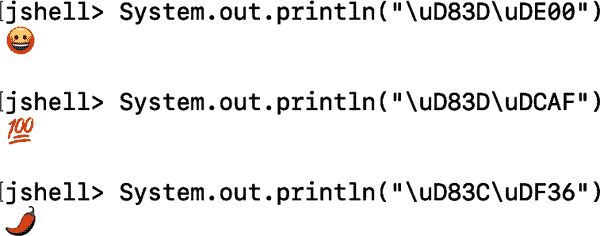
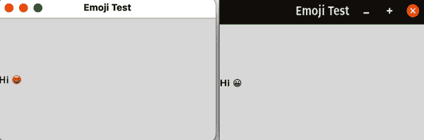
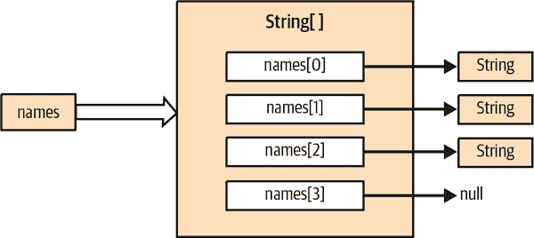
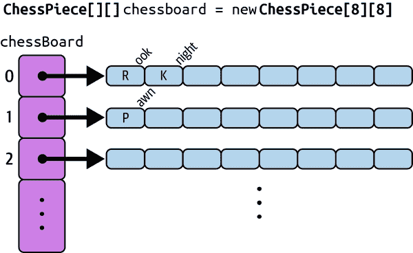
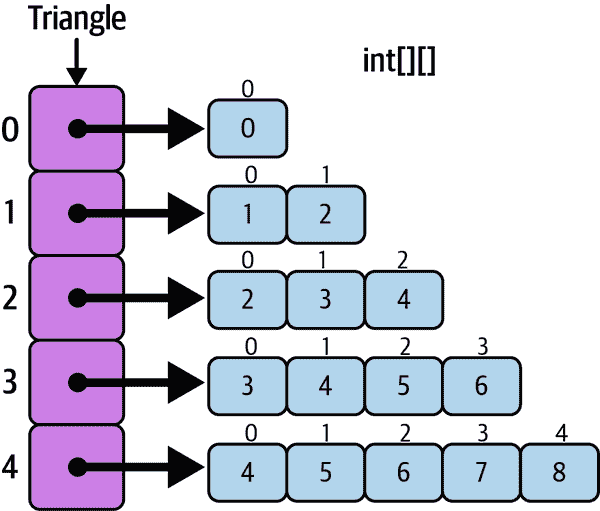

# 第四章：Java 语言

作为人类，我们通过反复试验来学习口语的微妙之处。我们学会了在动词旁边放置主语以及如何处理时态和复数等问题。当然，我们在学校学习了高级语言规则，但即使是最年幼的学生也可以向老师提出可理解的问题。计算机语言也具有类似的特点：有作为可组合构建块的“词类”。有声明事实和提出问题的方式。在这一章中，我们将研究 Java 中的这些基本编程单元。试错仍然是一位伟大的老师，因此我们还将看看如何玩转这些新单元并练习您的技能。

由于 Java 的语法源自 C 语言，我们会对该语言的某些特性进行比较，但不需要事先了解 C 语言。第五章在此基础上讨论了 Java 的面向对象的一面，并完成了对核心语言的讨论。第七章讨论了泛型和记录，这些特性增强了 Java 语言中类型工作的方式，使您能够更灵活、更安全地编写某些类型的类。

之后，我们将深入 Java API，看看语言能做什么。本书的其余部分充满了在各种领域做有用事情的简短示例。如果在这些介绍性章节之后您有任何问题，我们希望您在查看代码时能得到解答。当然，总是有更多东西要学习！在此过程中，我们将尝试指出其他资源，这些资源可能有助于希望在我们覆盖的主题之外继续他们的 Java 学习旅程的人们。

对于刚开始编程旅程的读者来说，网络可能会是一个不断的伴侣。许多许多网站、维基百科文章、博客文章以及[Stack Overflow](https://oreil.ly/XHO1v)的整体都可以帮助您深入研究特定主题或回答可能出现的小问题。例如，虽然本书涵盖了 Java 语言及如何使用 Java 及其工具编写有用程序，但我们并未详细讨论像[算法](https://oreil.ly/hXXGL)这样的低级核心编程主题。这些编程基础将自然出现在我们的讨论和代码示例中，但您可能会喜欢一些超链接的支线，以帮助巩固某些想法或填补我们必然遗漏的空白。

如前所述，本章中许多术语可能会让您感到陌生。如果偶尔感到有些困惑，不必担心。由于 Java 的广泛应用，我们不得不偶尔省略解释或背景细节。随着您的学习进展，我们希望您有机会重新阅读一些早期章节。新的信息有点像拼图游戏。如果您已经连接了一些相关的知识点，那么添加新的知识点就会更容易。当您花时间编写代码，这本书逐渐成为您的参考书而不是指南时，这些早期章节的主题会更加容易理解。

# 文本编码

Java 是一种面向互联网的语言。由于各个用户使用多种不同的语言进行交流和书写，Java 必须能够处理大量的语言。它通过 Unicode 字符集进行国际化处理，这是一个支持大多数语言文字的全球标准[¹]。Java 的最新版本基于 Unicode 14.0 标准，内部使用至少两个字节来表示每个符号。您可能还记得来自《过去：Java 1.0–Java 20》的内容，Oracle 致力于跟踪最新的 Unicode 标准发布情况。您使用的 Java 版本可能包含更新的 Unicode 版本。

Java 源代码可以使用 Unicode 编写，并以任意数量的字符编码进行存储。这使得 Java 相对友好，可以包含非英语内容。程序员可以在向用户显示信息的同时，还可以在其自己的类、方法和变量名称中使用 Unicode 丰富的字符集。

Java 的`char`类型和`String`类本地支持 Unicode 值。文本在内部使用字符数组或字节数组进行存储；但 Java 语言和 API 对您来说是透明的，通常您不需要考虑这些细节。Unicode 对 ASCII 也非常友好（ASCII 是英语中最常见的字符编码）。前 256 个字符被定义为与 ISO 8859-1（Latin-1）字符集中的前 256 个字符相同，因此 Unicode 实际上与最常见的英语字符集向后兼容。此外，Unicode 的一种最常见的文件编码称为 UTF-8，保留了 ASCII 值的单字节形式。编译后的 Java 类文件默认使用此编码，因此对于英语文本，存储保持紧凑。

大多数平台无法显示所有当前定义的 Unicode 字符。作为一种解决方法，Java 程序可以使用特殊的 Unicode 转义序列进行编写。Unicode 字符可以用以下转义序列表示：

```java
\uxxxx
```

*`xxxx`* 是一个包含一到四个十六进制数字的序列。转义序列表示一个 ASCII 编码的 Unicode 字符。这也是 Java 用来在不支持它们的环境中输出（打印）Unicode 字符的形式。Java 附带了用于在特定编码中读写 Unicode 字符流的类，包括 UTF-8。

与技术领域中许多长寿的标准一样，Unicode 最初设计时有很多额外的空间，以至于没有任何可想象的字符编码需要超过 64K 个字符。唉。自然，我们已经超越了这个限制，一些 UTF-32 编码正在广泛流通。最值得注意的是，分散在消息应用程序中的表情符号字符超出了 Unicode 字符的标准范围。（例如，标准笑脸表情符号的 Unicode 值为 1F600。）Java 支持这些字符的多字节 UTF-16 转义序列。并不是每个支持 Java 的平台都支持表情符号输出，但您可以启动 *jshell* 来查看您的环境是否可以显示表情符号（参见 图 4-1）。



###### 图 4-1\. 在 macOS Terminal 应用程序中打印表情符号

尽管如此，使用这些字符要小心。我们必须使用屏幕截图确保您可以在 Mac 上看到 *jshell* 中运行的这些可爱的小东西。您可以使用 *jshell* 来测试您自己的系统。您可以创建一个与我们的 `HelloJava` 类似的最小图形应用程序，例如 `HelloJava`。创建一个 `JFrame`，添加一个 `JLabel`，并使框架可见：

```java
jshell> import javax.swing.*

jshell> JFrame f = new JFrame("Emoji Test")
f ==> javax.swing.JFrame[frame0 ...=true]

jshell> f.add(new JLabel("Hi \uD83D\uDE00"))
$12 ==> javax.swing.JLabel[ ...=CENTER]

jshell> f.setSize(300,200)

jshell> f.setVisible(true)
```

希望您看到笑脸，但这将取决于您的系统。图 4-2 显示了我们在 macOS 和 Linux 上进行此精确测试时得到的结果。



###### 图 4-2\. 在各种系统上测试表情符号的显示效果

并不是说您不能在应用程序中使用或支持表情符号，只是您必须注意输出特性的差异。确保您的用户在运行您的代码时有良好的体验。

###### 警告

在导入 Swing 包中的图形组件时，要注意使用正确的 `javax` 前缀而不是标准的 `java` 前缀。有关 Swing 的所有内容，请参阅 第十二章。

# 注释

现在我们知道程序文本是如何存储的，我们可以专注于要存储的内容！程序员经常在代码中包含 *注释* 来帮助解释复杂的逻辑部分或为其他程序员提供阅读代码的指南。（很多时候，“其他程序员”是几个月或几年后的您自己。）注释中的文本完全被编译器忽略。注释对您的应用程序的性能或功能没有影响。因此，我们非常支持编写良好的注释。Java 支持既可以跨多行的 C 风格 *块注释*，用 `/*` 和 `*/` 分隔，也可以跨一行的 C++ 风格 *行注释*，用 `//` 表示：

```java
    /*  This is a
 multiline
 comment.    */

    // This is a single-line comment
    // and so // is this
```

块注释具有起始和结束序列，并且可以覆盖大量文本。但是，它们不能“嵌套”，这意味着您不能将一个块注释放在另一个块注释内部，以免与编译器发生冲突。单行注释只有一个起始序列，并且由行的结束界定；单行内的额外 `//` 指示符没有效果。行注释对于方法内的短注释非常有用；它们不与块注释冲突。您仍然可以将单行注释出现的代码块包裹在块注释中。这通常称为 *注释掉* 代码段的常用技巧——用于调试大型应用程序。由于编译器忽略所有注释，您可以在行或代码块周围放置注释，以查看在删除该代码时程序的行为如何。²

## Javadoc 注释

特殊的以 `/**` 开头的块注释表示 *文档注释*。文档注释旨在被自动化文档生成器提取，例如 JDK 自带的 *javadoc* 程序或许多集成开发环境中的上下文感知工具提示。文档注释以接下来的 `*/` 结束，就像常规的块注释一样。在文档注释中，以 `@` 开头的行被解释为文档生成器的特殊指令，为其提供有关源代码的信息。按照惯例，文档注释的每一行都以 `*` 开头，如下例所示，但这是可选的。文档注释中每行的前导空格和每行的 `*` 都会被忽略：

```java
/**
 * I think this class is possibly the most amazing thing you will
 * ever see. Let me tell you about my own personal vision and
 * motivation in creating it.
 * <p>
 * It all began when I was a small child, growing up on the
 * streets of Idaho. Potatoes were the rage, and life was good...
 *
 * @see PotatoPeeler
 * @see PotatoMasher
 * @author John 'Spuds' Smith
 * @version 1.00, 19 Nov 2022
 */
class Potato { ... }
```

*javadoc* 命令行工具通过读取源代码并提取嵌入的注释和 `@` 标签为类创建 HTML 文档。在此示例中，标签在类文档中创建作者和版本信息。`@see` 标签生成到相关类文档的超文本链接。

编译器也会查看文档注释；特别是它对 `@deprecated` 标签感兴趣，这意味着该方法已被声明为过时，应在新程序中避免使用。编译后的类包含有关任何已弃用方法的信息，因此当您在代码中使用已弃用的功能时，编译器会警告您（即使源代码不可用）。

文档注释可以出现在类、方法和变量定义之上，但某些标签可能并不适用于所有这些情况。例如，`@exception` 标签只能应用于方法。表 4-1 总结了文档注释中使用的标签。

表格 4-1\. 文档注释标签

| 标签 | 描述 | 适用于 |
| --- | --- | --- |
| `@see` | 相关的类名 | 类、方法或变量 |
| `@code` | 源代码内容 | 类、方法或变量 |
| `@link` | 相关的 URL | 类、方法或变量 |
| `@author` | 作者姓名 | 类 |
| `@version` | 版本字符串 | 类 |
| `@param` | 参数名和描述 | 方法 |
| `@return` | 返回值的描述 | 方法 |
| `@exception` | 异常名称和描述 | 方法 |
| `@deprecated` | 声明一个项目已过时 | 类、方法或变量 |
| `@since` | 记录项目添加的 API 版本 | 变量 |

Javadoc 注释中的标签代表关于源代码的*元数据*；换句话说，它们提供了关于代码结构或内容的描述信息，严格来说，这些信息并不是应用程序的一部分。一些额外的工具扩展了 Javadoc 风格标签的概念，包括与 Java 程序相关的其他元数据，这些元数据与编译后的代码一起传递，并且可以更方便地被应用程序用来影响其编译或运行时行为。Java 的*注解*功能提供了一种更正式和可扩展的方式，用于向 Java 类、方法和变量添加元数据。这些元数据在运行时也是可用的。

## 注解

`@` 前缀在 Java 中还有另一个作用，与标签类似。Java 支持 *注解* 的概念，作为标记某些内容以便进行特殊处理的一种方式。您将注解应用于代码*之外*的地方。注解可以提供对编译器或您的 IDE 有用的信息。例如，`@SuppressWarnings` 注解会导致编译器（通常也包括您的 IDE）隐藏关于潜在问题（如无法访问的代码）的警告。当您开始在 “Advanced Class Design” 中创建更有趣的类时，可能会看到您的 IDE 向您的代码中添加 `@Overrides` 注解。此注解告诉编译器执行一些额外的检查；这些检查旨在帮助您编写有效的代码，并在您（或您的用户）运行程序之前捕捉错误。

您甚至可以创建自定义注解来与其他工具或框架一起使用。虽然深入讨论注解超出了本书的范围，但我们希望您了解它们，因为像 `@Overrides` 这样的标签将出现在我们的代码中，以及您可能在网上找到的示例或博客文章中。

# 变量和常量

尽管向代码添加注释对于生成可读性强、易于维护的文件至关重要，但在某些时候，你必须开始编写一些可编译的内容。编程是操纵这些内容的艺术。几乎所有语言中，此类信息存储在变量和常量中，以便程序员更轻松地使用。Java 同时具备这两者。*变量*存储您计划随时间改变和重用的信息（或者是预先不知道的信息，如用户的电子邮件地址）。*常量*存储的是不会变化的信息。即使在我们的简单入门程序中，我们也已经看到了这两种元素的示例。回顾一下我们在 “HelloJava” 中的简单图形标签：

```java
import javax.swing.*;

public class HelloJava {
  public static void main(String[] args) {
    JFrame frame = new JFrame("Hello, Java!");
    JLabel label = new JLabel("Hello, Java!", JLabel.CENTER);
    frame.add(label);
    frame.setSize(300, 300);
    frame.setVisible(true);
  }
}
```

在这段代码中，`frame`是一个变量。我们在第 5 行用`JFrame`类的新实例装载它。然后我们在第 7 行中再次使用同一个实例来添加我们的标签。我们再次重用变量在第 8 行中设置我们框架的大小，在第 9 行中使其可见。所有这些重用正是变量发挥作用的地方。

第 6 行包含一个常量：`JLabel.CENTER`。常量包含一个在程序执行过程中永远不会改变的特定值。不会改变的信息似乎奇怪地存储起来——为什么不每次都直接使用这些信息呢？常量比它们的数据更容易使用；`Math.PI`可能比它代表的值`3.141592653589793`更容易记住。而且，由于您可以在代码中选择常量的名称，另一个好处是您可以以有用的方式描述信息。`JLabel.CENTER`可能仍然有点难以理解，但至少单词`CENTER`至少给了您一些关于正在发生的事情的提示。

使用命名常量还允许更简单地进行未来的更改。如果您编写了某种资源的最大数量，如果只需更改给定给常量的初始值，那么修改该限制要容易得多。如果您使用像 5 这样的文字数字，每次代码需要检查最大值时，您都必须搜索所有的 Java 文件来跟踪每个 5 的出现并进行更改——如果那个特定的 5 确实是指资源限制的话。这种手动搜索和替换容易出错，也非常乏味。

我们将在下一节中详细了解变量和常量的类型和初始值。与往常一样，可以随意使用*jshell*自己探索和发现其中的一些细节！由于解释器的限制，您不能在*jshell*中声明自己的顶级常量。您仍然可以使用类似`JLabel.CENTER`定义的常量或在自己的类中定义它们。

尝试将以下语句输入*jshell*中，使用`Math.PI`计算并将圆的面积存储在变量中。这个练习还证明了重新分配常量是行不通的。（再次说明，我们必须介绍一些新概念，比如*赋值*——将一个值放入变量中——以及乘法运算符`*`。如果这些命令仍然感觉奇怪，请继续阅读。我们将在本章的其余部分更详细地讨论所有这些新元素。）

```java
jshell> double radius = 42.0;
radius ==> 42.0

jshell> Math.PI
$2 ==> 3.141592653589793

jshell> Math.PI = 3;
|  Error:
|  cannot assign a value to final variable PI
|  Math.PI = 3;
|  ^-----^

jshell> double area = Math.PI * radius * radius;
area ==> 5541.769440932396

jshell> radius = 6;
radius ==> 6.0

jshell> area = Math.PI * radius * radius;
area ==> 113.09733552923255

jshell> area
area ==> 113.09733552923255
```

注意当我们尝试将`Math.PI`设置为`3`时的编译器错误。在声明和初始化它们之后，您可以更改`radius`甚至`area`。但是变量一次只能保存一个值，所以最新的计算是仅存留在变量`area`中的东西。

# 类型

编程语言的*类型系统*描述了它的*数据元素*（我们刚刚提到的变量和常量）如何与内存中的存储关联以及它们如何彼此关联。在*静态类型*语言中，如 C 或 C ++，数据元素的类型是一个简单的、不变的属性，通常直接对应于一些底层的硬件现象，比如寄存器或指针值。在*动态类型*语言中，如 Smalltalk 或 Lisp，变量可以被分配任意元素，并且可以在其生命周期内有效地改变它们的类型。在这些语言中，需要大量的开销来验证运行时发生的事情。脚本语言，如 Perl，通过提供极其简化的类型系统来实现易用性，在这种类型系统中，只有特定的数据元素可以存储在变量中，并且值被统一到一个通用的表示形式中，比如字符串。

Java 结合了静态类型语言和动态类型语言的许多最佳特性。与静态类型语言一样，在 Java 中每个变量和编程元素都有一个在编译时已知的类型，因此运行时系统通常不必在代码执行时检查类型之间的赋值的有效性。与传统的 C 或 C ++不同，Java 还维护关于对象的运行时信息，并使用这些信息来允许真正的动态行为。Java 代码可以在运行时加载新类型并以完全面向对象的方式使用它们，从而允许*强制转换*（在类型之间转换）和完整的*多态性*（将多个类型的特征结合在一起）。Java 代码还可以在运行时“反射”或检查其自身的类型，从而允许高级的应用行为，如可以与编译程序动态交互的解释器。

Java 数据类型分为两类。*原始类型*表示语言中具有内置功能的简单值；它们表示数字、布尔（true 或 false）值和字符。*引用类型*（或类类型）包括对象和数组；它们被称为引用类型，因为它们“引用”一个大的数据类型，该数据类型是通过“引用”传递的，我们稍后会解释。*泛型*是对现有类型进行细化的引用类型，同时提供编译时类型安全性。例如，Java 有一个`List`类，可以存储一系列项。使用泛型，您可以创建一个`List<String>`，它是一个只能包含`String`的`List`。或者我们可以创建一个包含`JLabel`对象的`List<JLabel>`的列表。我们将在第七章中看到更多关于泛型的内容。

## 原始类型

数字、字符和布尔值是 Java 的基本元素。与一些其他（也许更纯粹的）面向对象语言不同，它们不是对象。对于那些希望将原始值视为对象的情况，Java 提供了“包装”类。（稍后详细介绍。）将原始值视为特殊值的主要优势在于，Java 编译器和运行时可以更容易地优化它们的实现。原始值和计算仍然可以映射到硬件上，就像在低级语言中一直做的那样。

Java 的一个重要的可移植性特性是原始类型的精确定义。例如，你永远不用担心 `int` 在特定平台上的大小；它始终是一个 32 位的有符号数字。数值类型的“大小”决定了你可以存储的值有多大（或多精确）。例如，`byte` 类型是一个 8 位的有符号值，用于存储从 -128 到 127 的小数字。³ 上述的 `int` 类型可以处理大部分数值需求，存储大约 +/- 20 亿之间的值。表 4-2 总结了 Java 的原始类型及其容量。

表格 4-2\. Java 原始数据类型

| 类型 | 定义 | 大致范围或精度 |
| --- | --- | --- |
| `boolean` | 逻辑值 | `true` 或 `false` |
| `char` | 16 位，Unicode 字符 | 64K 字符 |
| `byte` | 8 位，有符号整数 | -128 到 127 |
| `short` | 16 位，有符号整数 | -32,768 到 32,767 |
| `int` | 32 位，有符号整数 | -2.1e9 到 2.1e9 |
| `long` | 64 位，有符号整数 | -9.2e18 到 9.2e18 |
| `float` | 32 位，IEEE 754，浮点数 | 6-7 位有效十进制位数 |
| `double` | 64 位，IEEE 754 | 15 位有效十进制位数 |

###### 注

如果你有 C 语言背景，可能会注意到原始类型看起来像是在 32 位机器上 C 标量类型的理想化，你是对的。这就是它们的设计初衷。Java 的设计者做了一些改变，比如支持 16 位字符用于 Unicode，并且放弃了特定指针。但总体而言，Java 原始类型的语法和语义源自于 C 语言。

那么为什么还要有大小？再次回到效率和优化。足球比赛中的进球数很少超过个位数 —— 它们可以放在一个 `byte` 变量中。然而，观看这场比赛的球迷人数则需要更大的东西。在所有世界杯国家的所有足球比赛中，所有球迷花费的总金额则需要更大的东西。通过选择合适的大小，你可以给编译器提供最佳的优化机会，从而使你的应用程序运行更快、消耗更少的系统资源，或者两者兼而有之。

一些科学或密码应用程序需要您存储和操作非常大（或非常小）的数字，并且重视准确性而非性能。如果需要比原始类型提供的更大数字，请查看`java.math`包中的`BigInteger`和`BigDecimal`类。这些类提供接近无限大小或精度。（如果您想看到这些大数字的实际应用，我们在“创建自定义约简器”中使用`BigInteger`计算阶乘值。）

### 浮点精度

Java 中的浮点运算遵循[IEEE 754](https://oreil.ly/ssh7S)国际规范，这意味着浮点计算的结果通常在不同的 Java 平台上相同。但是，Java 允许在支持的平台上进行扩展精度。这可能会导致高精度操作结果中出现极小值和晦涩的差异。大多数应用程序永远不会注意到这一点，但如果要确保应用程序在不同平台上产生*完全相同*的结果，可以在包含浮点操作的类上使用特殊关键字`strictfp`作为类修饰符（我们在第五章中介绍类）。然后，编译器禁止这些特定于平台的优化。

### 变量声明和初始化

您使用类型名称后跟一个或多个逗号分隔的变量名称在方法和类内部声明变量。例如：

```java
    int foo;
    double d1, d2;
    boolean isFun;
```

你可以选择在声明变量时使用适当类型的表达式进行初始化：

```java
    int foo = 42;
    double d1 = 3.14, d2 = 2 * 3.14;
    boolean isFun = true;
```

如果未初始化作为类成员声明的变量（参见第五章），这些变量将设置为默认值。在这种情况下，数值类型默认为适当类型的零，字符设置为空字符（`\0`），布尔变量的值为`false`。（引用类型也有默认值`null`，但我们很快会在“引用类型”中详细讨论。）

另一方面，局部变量在方法内声明，仅在方法调用期间存在，必须在使用之前显式初始化。正如我们将看到的，编译器强制执行此规则，因此不会忘记。

### 整数文字

可以用二进制（基数 2）、八进制（基数 8）、十进制（基数 10）或十六进制（基数 16）指定整数文字。在处理低级文件或网络数据时，二进制、八进制和十六进制基数主要用于表示单个位的有用分组：1、3 和 4 位。十进制值没有这样的映射，但对于大多数数字信息来说，它们更加人性化。十进制整数由以字符 1–9 开头的数字序列指定：

```java
    int i = 1230;
```

二进制数由前导字符`0b`或`0B`（零“b”）表示，后跟一组零和一：

```java
    int i = 0b01001011;            // i = 75 decimal
```

八进制数与十进制数的区别在于简单的前导零：

```java
    int i = 01230;             // i = 664 decimal
```

十六进制数以前导字符`0x`或`0X`（零“x”）开头，后面跟着一组数字和表示十进制值 10 到 15 的字符 a-f 或 A-F：

```java
    int i = 0xFFFF;            // i = 65535 decimal
```

整数字面值的类型是`int`，除非它们后缀为`L`，表示它们将作为`long`值产生：

```java
    long l = 13L;
    long l = 13;           // equivalent: 13 is converted from type int
    long l = 40123456789L;
    long l = 40123456789;  // error: too big for an int without conversion
```

（小写字母`l`也可以工作，但应避免使用，因为它经常看起来像数字`1`。）

当数值类型在赋值或涉及“更大”范围的类型的表达式中使用时，它可以*提升*到更大的类型。在上一个示例的第二行中，数字`13`具有`int`的默认类型，但在赋值给`long`变量时被提升为`long`类型。

某些其他数值和比较操作也会导致这种算术提升，以及涉及多种类型的数学表达式。例如，当将`byte`值乘以`int`值时，编译器首先将`byte`提升为`int`：

```java
    byte b = 42;
    int i = 43;
    int result = b * i;  // b is promoted to int before multiplication
```

你永远不能反过来将数值赋给一个具有较小范围的类型而不进行显式*转换*，显式转换是一种特殊的语法，你可以使用它告诉编译器你需要什么类型：

```java
    int i = 13;
    byte b = i;        // Compile-time error, explicit cast needed
    byte b = (byte) i; // OK
```

第三行中括号中的`(byte)`短语是我们的变量`i`之前的内容。由于可能存在精度损失，从浮点数到整数类型的转换总是需要显式转换的。

最后也许是最不重要的，你可以通过在数字之间使用“_”（下划线）字符来为你的数字字面值添加一点格式。如果你有特别长的数字串，你可以像下面的例子一样分开它们：

```java
    int RICHARD_NIXONS_SSN = 567_68_0515;
    int for_no_reason = 1___2___3;
    int JAVA_ID = 0xCAFE_BABE;
    long grandTotal = 40_123_456_789L;
```

下划线只能出现在数字之间，不能出现在数字的开头或结尾，也不能出现在`L`长整型标识符旁边。在*jshell*中试试一些大数字。注意，如果你试图存储一个`long`值而没有`L`标识符，你会得到一个错误。你可以看到格式化实际上只是为了方便你。它不会被存储；只有实际值被保留在你的变量或常量中：

```java
jshell> long m = 41234567890;
|  Error:
|  integer number too large
|  long m = 41234567890;
|           ^

jshell> long m = 40123456789L;
m ==> 40123456789

jshell> long grandTotal = 40_123_456_789L;
grandTotal ==> 40123456789
```

尝试一些其他例子。了解你认为可读性如何是有用的。这也可以帮助你学习可用或需要的促进和转换的类型。没有什么比立即反馈更能强调这些细微差别了！

### 浮点字面值

浮点值可以用十进制或科学计数法指定。浮点字面值的类型是`double`，除非它们后缀为`f`或`F`，表示它们是较小精度的`float`值。与整数字面值一样，你可以使用下划线字符来格式化浮点数，但同样，只能在数字之间使用。你不能把它们放在开头、结尾、小数点旁边或数字的`F`标识符旁边：

```java
    double d = 8.31;
    double e = 3.00e+8;
    float f = 8.31F;
    float g = 3.00e+8F;
    float pi = 3.1415_9265F;
```

### 字符字面值

可以将文字符值指定为单引号字符或转义的 ASCII 或 Unicode 序列，同样在单引号内：

```java
    char a = 'a';
    char newline = '\n';
    char smiley = '\u263a';
```

通常你会处理收集到`String`中的字符，但仍然有些地方需要单个字符。例如，如果你在应用程序中处理键盘输入，可能需要逐个处理每个`char`键按。

## 引用类型

在像 Java 这样的面向对象语言中，通过创建*类*从简单的基本类型创建新的复杂数据类型。然后每个类作为语言中的新类型。例如，在 Java 中创建一个名为`Car`的新类，也隐式地创建了一个名为`Car`的新类型。项目的类型决定了它的使用方式和可以分配的位置。与基本类型一样，`Car`类型的项目通常可以分配给`Car`类型的变量或作为接受`Car`值的方法的参数传递。

类型不仅仅是一个简单的属性。类可以与其他类有关系，它们所代表的类型也一样。在 Java 中，所有类都存在于父子层次结构中，其中子类或*子类*是其父类的特殊化类型。相应的类型也具有相同的关系，其中子类的类型被视为父类的子类型。因为子类继承其父类的所有功能，子类类型的对象在某种意义上等同于或扩展了父类型。子类型的对象可以用来替换父类型的对象。

例如，如果你创建一个新的类，`Dog`，它继承自`Animal`，那么新类型`Dog`被视为`Animal`的子类型。`Dog`类型的对象可以在任何需要`Animal`类型对象的地方使用；`Dog`类型的对象可以被分配给`Animal`类型的变量。这被称为*子类型多态性*，是面向对象语言的主要特征之一。我们将在第五章更详细地研究类和对象。

Java 中的基本类型被用作“按值”传递。这意味着当将像`int`这样的基本值分配给变量或作为参数传递给方法时，其*值*会被复制。另一方面，引用类型（类类型）始终通过“引用”访问。*引用*是对象的句柄或名称。引用类型变量保存的是指向其类型对象（或子类型，如前所述）的“指针”。当你将引用分配给变量或传递给方法时，只会复制引用，而不是对象本身。引用类似于 C 或 C++中的指针，但其类型严格执行。引用值本身不能显式创建或更改。你必须分配一个适当的对象以给引用类型变量赋予引用值。

让我们通过一个例子来运行。我们声明了一个名为 `myCar` 的类型为 `Car` 的变量，并将其赋值为一个合适的对象：⁴

```java
    Car myCar = new Car();
    Car anotherCar = myCar;
```

`myCar` 是一个引用类型的变量，它持有对新构造的 `Car` 对象的引用。（暂时不要担心创建对象的细节；我们将在第五章中介绍。）我们声明了第二个 `Car` 类型的变量 `anotherCar`，并将其赋值给同一个对象。现在有两个相同的引用：`myCar` 和 `anotherCar`，但只有一个实际的 `Car` 对象实例。如果我们改变 `Car` 对象本身的状态，无论使用哪个引用查看，都会看到相同的效果。我们可以通过 *jshell* 试一下看一些幕后情况：

```java
jshell> class Car {}
|  created class Car

jshell> Car myCar = new Car()
myCar ==> Car@21213b92

jshell> Car anotherCar = myCar
anotherCar ==> Car@21213b92

jshell> Car notMyCar = new Car()
notMyCar ==> Car@66480dd7
```

注意创建和赋值的结果。在这里，您可以看到 Java 引用类型带有一个指针值（`21213b92`，`@` 的右侧）和它们的类型（`Car`，`@` 的左侧）。当我们创建一个新的 `Car` 对象 `notMyCar` 时，我们得到一个不同的指针值。`myCar` 和 `anotherCar` 指向同一个对象；`notMyCar` 指向第二个独立的对象。

### 推断类型

现代版本的 Java 在许多情况下不断改进了推断变量类型的能力。从 Java 10 开始，您可以在声明和初始化变量时使用 `var` 关键字，让编译器推断正确的类型：

```java
jshell> class Car2 {}
|  created class Car2

jshell> Car2 myCar2 = new Car2()
myCar2 ==> Car2@728938a9

jshell> var myCar3 = new Car2()
myCar3 ==> Car2@6433a2
```

注意在 *jshell* 中创建 `myCar3` 时的（确实有点丑陋的）输出。尽管我们没有像为 `myCar2` 那样明确给出类型，编译器可以轻松地理解要使用的正确类型，并且实际上我们得到了一个 `Car2` 对象。

### 传递引用

对象引用以相同的方式传递给方法。在这种情况下，要么 `myCar` 要么 `anotherCar` 将作为某个假设类中某个假设方法 `myMethod()` 的等效参数：

```java
    myMethod(myCar);
```

一个重要但有时令人困惑的区别是，引用本身是一个值（一个内存地址）。当您将其分配给变量或在方法调用中传递时，该值会被复制。根据我们之前的例子，在方法中传递的参数（从方法的角度来看是一个局部变量）实际上是对 `Car` 对象的第三个引用，除了 `myCar` 和 `anotherCar`。

该方法可以通过调用 `Car` 对象的方法或更改其变量来改变 `Car` 对象的状态。然而，`myMethod()` 无法改变调用者对 `myCar` 引用的理解：也就是说，该方法无法将调用者的 `myCar` 指向不同的 `Car` 对象；它只能更改自己的引用。这在我们后面讨论方法时会更加明显。

引用类型总是指向对象（或 `null`），对象总是由类定义的。与原生类型类似，如果在声明变量实例或类变量时未初始化，编译器将分配默认值 `null`。此外，像原生类型一样，具有引用类型的局部变量默认情况下 *不* 初始化，因此必须在使用之前设置自己的值。然而，两种特殊类型的引用类型——数组和接口——在指定它们所指向的对象类型时有些微不同。

在 Java 中，*数组* 是一种有趣的对象类型，自动创建以容纳某种其他类型的对象集合，称为*基本类型*。数组中的单个元素将具有该基本类型。（因此，类型为 `int[]` 的数组的一个元素将是 `int`，类型为 `String[]` 的数组的一个元素将是 `String`。）声明数组隐式创建了新的类类型，设计为其基本类型的容器，稍后在本章中您将看到。

*接口* 稍微复杂些。接口定义了一组方法，并为该集合赋予了相应的类型。实现接口方法的对象可以用该接口类型引用，以及其自身的类型。变量和方法参数可以声明为接口类型，就像其他类类型一样，任何实现接口的对象都可以分配给它们。这增加了类型系统的灵活性，使 Java 能够跨越类层次结构的边界，并使对象有效地具有多种类型。我们还将在第五章中详细讨论接口。

*泛型类型* 或 *参数化类型*，正如我们之前提到的，是 Java 类语法的一个扩展，允许在类与其他 Java 类型交互时进行额外的抽象。泛型允许程序员专门化一个类而不更改该类的任何代码。我们将在第七章中详细介绍泛型。

## 关于字符串的一点说明

Java 中的字符串是对象；因此它们属于引用类型。`String` 对象在 Java 编译器中有一些特殊的帮助，使它们看起来更像原始类型。在 Java 源代码中，字面字符串值（在双引号之间的一系列字符或转义序列）将由编译器转换为 `String` 对象。您可以直接使用 `String` 字面值，将其作为方法的参数传递，或将其赋值给 `String` 类型变量：

```java
    System.out.println("Hello, World...");
    String s = "I am the walrus...";
    String t = "John said: \"I am the walrus...\"";
```

在 Java 中，`+`符号被 *重载* 以处理字符串和常规数字。重载是一种在允许您使用相同方法名或操作符号处理不同数据类型的语言中使用的术语。对于数字，`+`执行加法。对于字符串，`+`执行 *连接*，这是程序员称之为将两个字符串粘在一起的操作。虽然 Java 允许方法的任意重载（详见“方法重载”），`+`是 Java 中少数几个重载的运算符之一：

```java
    String quote = "Fourscore and " + "seven years ago,";
    String more = quote + " our" + " fathers" +  " brought...";

    // quote is now "Fourscore and seven years ago,"
    // more is now " our fathers brought..."
```

Java 从串联的字符串文字构建单个`String`对象，并将其作为表达式的结果提供。（有关所有`String`的更多信息，请参见第八章。）

# 语句和表达式

Java 的 *语句* 出现在方法和类中。它们描述 Java 程序的所有活动。变量声明和赋值，例如前一节中的内容，都是语句，基本的语言结构如 if/then 条件和循环也是语句。（在本章后面的部分中会进一步介绍这些结构。）以下是 Java 中的几个语句：

```java
    int size = 5;
    if (size > 10)
      doSomething();
    for (int x = 0; x < size; x++) {
      doSomethingElse();
      doMoreThings();
    }
```

*表达式*产生值；Java 评估表达式以生成结果。这个结果可以作为另一个表达式的一部分或者语句中使用。方法调用、对象分配和当然数学表达式都是表达式的例子：

```java
    // These are all valid Java expressions
    new Object()
    Math.sin(3.1415)
    42 * 64
```

Java 的一个原则是保持事情简单和一致。为此，在没有其他约束的情况下，Java 中的评估和初始化总是按照它们在代码中出现的顺序进行——从左到右，从上到下。您将看到此规则用于赋值表达式的评估，方法调用和数组索引等多种情况。在其他一些语言中，评估的顺序更复杂，甚至是实现相关的。Java 通过精确定义代码的评估方式，消除了这种危险因素。

这并不意味着你应该开始编写晦涩和复杂的语句。在复杂的方式中依赖表达式的评估顺序是一个不好的编程习惯，即使它能工作。它生成的代码难以阅读，更难修改。

## 语句

在任何程序中，语句执行真正的魔法。语句帮助我们实现本章开头提到的那些算法。事实上，它们不仅仅是帮助，它们恰恰是我们使用的编程成分；算法中的每一步都对应一个或多个语句。语句通常做四件事中的一件：

+   收集输入以分配给变量

+   写输出（到你的终端，到一个`JLabel`等等）

+   做出关于执行哪些语句的决定

+   重复一个或多个其他语句

Java 中的语句和表达式都出现在一个*代码块*中。代码块包含一系列由开放大括号（`{`）和闭合大括号（`}`）括起来的语句。代码块中的语句可以包括变量声明和我们之前提到的大多数其他类型的语句和表达式：

```java
  {
    int size = 5;
    setName("Max");
    // more statements could follow...
  }
```

从某种意义上讲，方法只是带有参数并且可以通过其名称调用的代码块——例如，一个假设的方法`setUpDog()`可能会像这样开始：

```java
  setUpDog(String name) {
    int size = 5;
    setName(name);
    // do any other setup work ...
  }
```

变量声明在 Java 中是*有作用域的*。它们仅限于其封闭的代码块内部——也就是说，你不能在最近的大括号外部看到或使用变量：

```java
    {
      // Scopes are like Vegas...
      // What's declared in a scope, stays in that scope
      int i = 5;
    }

    i = 6;  // Compile-time error, no such variable i
```

通过这种方式，你可以使用代码块任意分组语句和变量。然而，代码块最常见的用途是定义用于条件或迭代语句中的一组语句。

### `if/else`条件语句

编程中的一个关键概念是做出决策。“如果这个文件存在”或“如果用户有 WiFi 连接”都是计算机程序和应用程序经常做出的决策的示例。Java 使用流行的`if/else`语句来进行许多此类决策。⁵ Java 将`if/else`子句定义如下：

```java
    if (condition)
      statement1;
    else
      statement2;
```

在英语中，你可以将`if/else`语句理解为“如果条件为真，则执行`statement1`。否则，执行`statement2`。”

`condition`是一个布尔表达式，必须用括号括起来。*布尔表达式*本身是一个*布尔值*（`true`或`false`）或者求值为这些值之一的表达式。⁶ 例如，`i == 0`是一个布尔表达式，用于测试整数`i`是否持有值`0`：

```java
// filename: ch04/examples/IfDemo.java
    int i = 0;
    // you can use i now to do other work and then
    // we can test it to see if anything has changed
    if (i == 0)
      System.out.println("i is still zero");
    else
      System.out.println("i is most definitely not zero");
```

前面示例的整体本身就是一个语句，并且可以嵌套在另一个`if/else`子句中。`if`子句具有执行“一行代码”或一个代码块的常见功能。我们将在下一节讨论的循环中看到相同的模式。如果你只有一个语句要执行（就像前面片段中简单的`println()`调用一样），你可以在`if`测试或`else`关键字之后放置那个单独的语句。如果你需要执行多于一个语句，你可以使用一个代码块。代码块的形式如下：

```java
    if (condition) {
      // condition was true, execute this block
      statement;
      statement;
      // and so on...
    } else {
      // condition was false, execute this block
      statement;
      statement;
      // and so on...
    }
```

在这里，对于被选中的任何分支，代码块中的所有语句都会执行。当我们需要做更多事情而不仅仅是打印一条消息时，我们可以使用这种形式。例如，我们可以保证另一个变量，也许是`j`，不是负数。

```java
// filename: ch04/examples/IfDemo.java
    int j = 0;
    // you can use j now to do work like i before,
    // then make sure that work didn't drop
    // j's value below zero
    if (j < 0) {
      System.out.println("j is less than 0! Resetting.");
      j = 0;
    } else {
      System.out.println("j is positive or 0\. Continuing.");
    }
```

注意，我们在`if`子句中使用了大括号，其中有两个语句，并在`else`子句中使用了一个单独的`println()`调用。如果你愿意，你总是可以使用一个代码块。但如果只有一个语句，那么带有大括号的代码块是可选的。

### switch 语句

许多语言支持常见的“多个之一”条件，通常称为*switch*或*case*语句。给定一个变量或表达式，`switch`语句提供多个可能匹配的选项。我们确实指的是*可能*。一个值不必匹配任何`switch`选项；在这种情况下什么也不发生。如果表达式确实匹配一个`case`，那么执行该分支。如果有多个`case`匹配，那么第一个匹配将获胜。

Java `switch`语句最常见的形式是接受一个整数（或可以自动提升为整数类型的数值类型参数）或字符串，并在多个常量`case`分支中选择：^（7）

```java
    switch (expression) {
      case constantExpression :
        statement;
      [ case constantExpression :
        statement;  ]
      // ...
      [ default :
        statement;  ]
    }
```

每个分支的 case 表达式必须在编译时评估为不同的常量整数或字符串值。字符串使用`String`的`equals()`方法进行比较，我们将在第八章中详细讨论这个方法。

您可以指定一个可选的`default`情况来捕获未匹配的条件。当执行时，switch 简单地找到与其条件表达式匹配的分支（或默认分支）并执行相应的语句。但故事并没有结束。也许有些出乎意料的是，`switch`语句然后继续执行匹配分支后面的分支，直到达到 switch 的末尾或称为`break`的特殊语句。这里有几个例子：

```java
// filename: ch04/examples/SwitchDemo.java
    int value = 2;

    switch(value) {
      case 1:
        System.out.println(1);
      case 2:
        System.out.println(2);
      case 3:
        System.out.println(3);
    }
    // prints both 2 and 3
```

使用`break`来终止每个分支更为常见：

```java
// filename: ch04/examples/SwitchDemo.java
    int value = GOOD;

    switch (value) {
      case GOOD:
        // something good
        System.out.println("Good");
        break;
      case BAD:
        // something bad
        System.out.println("Bad");
        break;
      default:
        // neither one
        System.out.println("Not sure");
        break;
    }
    // prints only "Good"
```

在这个例子中，只执行一个分支——`GOOD`、`BAD`或默认值。`switch`的“继续进行”行为在你想用同一个语句（们）覆盖几种可能的情况值而不是复制大量代码时是合理的：

```java
// filename: ch04/examples/SwitchDemo.java
    int value = MINISCULE;
    String size = "Unknown";

    switch(value) {
      case MINISCULE:
      case TEENYWEENY:
      case SMALL:
        size = "Small";
        break;
      case MEDIUM:
        size = "Medium";
        break;
      case LARGE:
      case EXTRALARGE:
        size = "Large";
        break;
    }

    System.out.println("Your size is: " + size);
```

该示例有效地将六个可能的值分组为三个案例。并且这种分组功能现在可以直接出现在表达式中。Java 12 以预览功能提供了*switch 表达式*，并在 Java 14 中经过完善后成为永久功能。

例如，与上面示例中打印尺寸名称不同，我们可以直接将我们的尺寸标签分配给一个变量：

```java
// filename: ch04/examples/SwitchDemo.java

    int value = EXTRALARGE;

    String size = switch(value) {
      case MINISCULE, TEENYWEENY, SMALL -> "Small";
      case MEDIUM -> "Medium";
      case LARGE, EXTRALARGE -> "Large";
      default -> "Unknown";
    }; // note the semicolon! It completes the switch statement

    System.out.println("Your size is: " + size);
    // prints "Your size is Large"
```

注意新的“箭头”（一个连字符后跟大于符号）语法。您仍然使用单独的`case`条目，但是使用这种表达式语法，案例值以逗号分隔的列表形式给出，而不是作为单独的级联条目。然后在列表和返回值之间使用`->`。这种形式可以使`switch`表达式更加紧凑和（希望）更可读。

### do/while 循环

在控制哪个语句执行下一个（程序员术语中的控制流或流程控制）的另一个主要概念是重复。计算机非常擅长重复做事。使用循环来重复代码块。在 Java 中有许多不同类型的循环语句。每种类型的循环都有其优缺点。现在让我们来看看这些不同类型。

`do` 和 `while` 迭代语句会持续运行，只要布尔表达式（通常称为循环的条件）返回`true`值。这些循环的基本结构很简单：

```java
    while (condition)
      statement; // or block

    do
      statement; // or block
    while (condition);
```

`while`循环非常适合等待某些外部条件，例如获取新的电子邮件：

```java
    while(mailQueue.isEmpty())
      wait();
```

当然，这个假设的`wait()`方法需要有一个限制（通常是时间限制，比如等待一秒钟），这样它就会完成并给循环另一个运行的机会。但一旦你有了一些电子邮件，你也希望处理所有到达的消息，而不仅仅是一个。同样，`while`循环是完美的。如果需要在循环中执行多于一个语句的代码块，可以使用花括号内的语句块。考虑一个简单的倒计时打印机：

```java
// filename: ch04/examples/WhileDemo.java

    int count = 10;
    while(count > 0) {
      System.out.println("Counting down: " + count);
      // maybe do other useful things
      // and decrement our count
      count = count - 1;
    }
    System.out.println("Done");
```

在这个例子中，我们使用`>`比较运算符来监视我们的`count`变量。我们希望在倒计时为正时继续工作。在循环体内，我们打印出当前的`count`值，然后将其减少一再重复。当我们最终将`count`减少到`0`时，循环将停止，因为比较返回`false`。

不同于`while`循环首先测试其条件，`do-while`循环（或更常见的仅`do`循环）总是至少执行其语句主体一次。一个典型的例子是验证用户输入。你知道你需要获取一些信息，所以你在循环的主体中请求该信息。循环的条件可以检测错误。如果有问题，循环将重新开始并再次请求信息。该过程可以重复，直到你的请求无错误返回，并且你知道你有了良好的信息。

```java
    do {
      System.out.println("Please enter a valid email: ");
      String email = askUserForEmail();
    } while (email.hasErrors());
```

再次，`do` 循环的主体至少执行一次。如果用户第一次给出有效的电子邮件地址，我们就不重复循环。

### `for`循环

另一种流行的循环语句是`for`循环。它擅长计数。`for`循环的最一般形式也是来自于 C 语言的传统。它看起来可能有点凌乱，但却紧凑地表示了相当多的逻辑：

```java
    for (initialization; condition; incrementor)
      statement; // or block
```

变量初始化部分可以声明或初始化仅限于`for`主体范围内的变量。然后，`for`循环开始可能的一系列轮次，首先检查条件，如果为真，则执行主体语句（或块）。在每次执行主体后，评估增量表达式，以便在下一轮开始之前更新变量。考虑一个经典的计数循环：

```java
// filename: ch04/examples/ForDemo.java

    for (int i = 0; i < 100; i++) {
      System.out.println(i);
      int j = i;
      // do any other work needed
    }
```

这个循环将执行 100 次，打印从 0 到 99 的值。我们声明并初始化一个变量`i`为零。我们使用条件子句来检查`i`是否小于 100。如果是，Java 就执行循环体。在增量子句中，我们将`i`增加一。 （我们将在下一节“表达式”中进一步讨论比较运算符如`<`和`>`，以及增量快捷方式`++`。）`i`增加后，循环回到条件检查。Java 重复执行这些步骤（条件、循环体、增量），直到`i`达到 100。

请记住变量`j`只在块内可见（仅对其中的语句可见），并且在`for`循环后的代码中将无法访问。如果`for`循环的条件在第一次检查时返回`false`（例如，如果我们在初始化子句中将`i`设置为 1000），则永远不会执行循环体和增量部分。

你可以在`for`循环的初始化和增量部分中使用多个逗号分隔的表达式。例如：

```java
// filename: ch04/examples/ForDemo.java

    // generate some coordinates
    for (int x = 0, y = 10; x < y; x++, y--) {
      System.out.println(x + ", " + y);
      // do other stuff with our new (x, y)...
    }
```

你也可以在初始化块中从`for`循环外部初始化现有变量。如果希望在其他地方使用循环变量的结束值，则可能会这样做。这种做法通常不受欢迎：容易出错，使代码难以理解。尽管如此，它是合法的，你可能会遇到这种情况，它对你来说是最合理的：

```java
    int x;
    for(x = 0; x < someHaltingValue; x++) {
      System.out.print(x + ": ");
      // do whatever work you need ...
    }
    // x is still valid and available
    System.out.println("After the loop, x is: " + x);
```

实际上，如果你想使用已经有一个良好起始值的变量，完全可以省略初始化步骤：

```java
    int x = 1;
    for(; x < someHaltingValue; x++) {
      System.out.print(x + ": ");
      // do whatever work you need ...
    }
```

注意，你仍然需要分号来分隔初始化步骤和条件。

### 增强的 for 循环

Java 的称为“增强的`for`循环”的特性类似于其他一些语言中的`foreach`语句，可以迭代数组或其他类型的集合中的一系列值：

```java
    for (varDeclaration : iterable)
      statement_or_block;
```

增强的`for`循环可以用来遍历任何类型的数组以及实现了`java.lang.Iterable`接口的任何 Java 对象。（我们将在第五章详细讨论数组、类和接口。）这包括 Java 集合 API 的大多数类（参见第七章）。以下是一些示例：

```java
// filename: ch04/examples/EnhancedForDemo.java

    int [] arrayOfInts = new int [] { 1, 2, 3, 4 };
    int total = 0;

    for(int i  : arrayOfInts) {
      System.out.println(i);
      total = total + i;
    }
    System.out.println("Total: " + total);

    // ArrayList is a popular collection class
    ArrayList<String> list = new ArrayList<String>();
    list.add("foo");
    list.add("bar");

    for(String s : list)
      System.out.println(s);
```

此示例中，我们还未讨论数组或`ArrayList`类及其特殊语法。我们展示的是增强的`for`循环语法，它可以迭代数组和字符串值列表。这种形式的简洁性使得在需要处理项目集合时非常流行。

### break/continue

Java 的 `break` 语句及其朋友 `continue` 也可以通过跳出来缩短循环或条件语句。`break` 使 Java 停止当前循环（或 `switch`）语句并跳过其余部分。Java 继续执行后续代码。在下面的示例中，`while` 循环无休止地进行，直到 `watchForErrors()` 方法返回 `true`，触发 `break` 语句停止循环，并在标记为“`while` 循环后”处继续执行：

```java
    while(true) {
      if (watchForErrors())
        break;
      // No errors yet so do some work...
    }
    // The "break" will cause execution to
    // resume here, after the while loop
```

`continue` 语句使 `for` 和 `while` 循环通过返回到它们检查条件的点来进行下一次迭代。以下示例打印数字 0 到 9，跳过数字 5：

```java
// filename: ch04/examples/ForDemo.java

    for (int i = 0; i < 10; i++) {
      if (i == 5)
        continue;
      System.out.println(i);
    }
```

`break` 和 `continue` 语句看起来像 C 语言中的那些，但是 Java 的形式具有将标签作为参数并跳出代码多个级别到标记点作用域的额外能力。这种用法在日常 Java 编码中并不常见，但在特殊情况下可能很重要。以下是具体表现：

```java
    labelOne:
      while (condition1) {
        // ...
        labelTwo:
          while (condition2) {
            // ...
            if (smallProblem)
              break; // Will break out of just this loop

            if (bigProblem)
              break labelOne; // Will break out of both loops
          }
        // after labelTwo
      }
    // after labelOne
```

诸如代码块、条件和循环之类的封闭语句可以用像 `labelOne` 和 `labelTwo` 这样的标识符标记。在此示例中，没有参数的 `break` 或 `continue` 具有与前面示例相同的效果。`break` 使处理恢复到标记为“`labelTwo` 后”的点；`continue` 立即导致 `labelTwo` 循环返回到其条件测试。

我们可以在 `smallProblem` 语句中使用 `break labelTwo` 语句。它与普通的 `break` 语句具有相同的效果，但是像在 `bigProblem` 语句中看到的 `break labelOne` 语句会跳出两个级别并在标记为“`labelOne`之后”的点处继续。类似地，`continue labelTwo` 将作为正常的 `continue`，但 `continue labelOne` 将返回到 `labelOne` 循环的测试。多级 `break` 和 `continue` 语句消除了对 C/C++ 中备受诟病的 `goto` 语句的主要理由。⁸

现在我们不会讨论几个 Java 语句。 `try`、`catch` 和 `finally` 语句用于异常处理，正如我们将在 第六章 中讨论的那样。Java 中的 `synchronized` 语句用于协调多个执行线程之间的访问语句；有关线程同步的讨论，请参阅 第九章。

### 不可达语句

最后需要注意的是，Java 编译器会将*无法到达的语句*标记为编译时错误。无法到达的语句是指编译器判断永远不会被调用的语句。当然，你的程序中可能有很多方法或代码块实际上从未被调用过，但编译器仅检测那些可以在编译时“证明”永远不会被调用的部分。例如，一个在方法中有无条件`return`语句的方法会导致编译时错误，就像编译器能够判断永远不会被满足的条件语句一样：

```java
    if (1 < 2) {
      // This branch always runs and the compiler knows it
      System.out.println("1 is, in fact, less than 2");
      return;
    } else {
      // unreachable statements, this branch never runs
      System.out.println("Look at that, seems we got \"math\" wrong.");
    }
```

在完成编译之前，您必须纠正无法到达的错误。幸运的是，大多数此类错误只是易于修复的拼写错误。在极少数情况下，此编译器检查揭示了逻辑而非语法上的错误，您总是可以重新排列或删除无法执行的代码。

## 表达式

表达式在评估时会产生一个结果或值。表达式的值可以是数值类型，如算术表达式；引用类型，如对象分配；或特殊类型`void`，这是一个不返回值的方法声明的类型。在最后一种情况下，表达式仅用于其*副作用*；即，它除了产生值之外还执行的工作。编译器知道表达式的类型。在运行时产生的值将具有这种类型，或者在引用类型的情况下，具有兼容的（可分配的）子类型。（关于此兼容性的更多内容，请参见第五章。）

我们已经在示例程序和代码片段中看到了几个表达式。在“赋值”一节中，我们还将看到更多表达式的例子（参见#learnjava6-CHP-4-SECT-5.2.2）。

### 运算符

运算符帮助您以各种方式组合或改变表达式。它们“操作”表达式。Java 支持几乎所有来自 C 语言的标准运算符。这些运算符在 Java 中的优先级与它们在 C 中的优先级相同，如表 4-3 所示。⁹

表 4-3\. Java 运算符

| 优先级 | 运算符 | 操作数类型 | 描述 |
| --- | --- | --- | --- |
| 1 | ++, — | 算术 | 自增和自减 |
| 1 | +, - | 算术 | 正负号 |
| 1 | ~ | 整数 | 按位取反 |
| 1 | ! | 布尔 | 逻辑非 |
| 1 | `(` *`类型`* `)` | 任意 | 强制类型转换 |
| 2 | *, /, % | 算术 | 乘法、除法、取余 |
| 3 | +, - | 算术 | 加法和减法 |
| 3 | + | 字符串 | 字符串连接 |
| 4 | << | 整数 | 左移 |
| 4 | >> | 整数 | 带符号右移 |
| 4 | >>> | 整数 | 无符号右移 |
| 5 | <, <=, >, >= | 算术 | 数值比较 |
| 5 | `instanceof` | 对象 | 类型比较 |
| 6 | ==, != | 原始类型 | 值的相等性和不等性 |
| 6 | ==, != | 对象 | 引用的相等性和不等性 |
| 7 | & | 整型 | 按位与 |
| 7 | & | 布尔 | 逻辑与 |
| 8 | ^ | 整型 | 按位异或 |
| 8 | ^ | 布尔 | 逻辑异或 |
| 9 | &#124; | 整型 | 按位或 |
| 9 | &#124; | 布尔 | 逻辑或 |
| 10 | && | 布尔 | 条件与 |
| 11 | &#124;&#124; | 布尔 | 条件或 |
| 12 | ?: | N/A | 条件三元操作符 |
| 13 | = | 任意类型 | 赋值 |

我们还应注意百分号（`%`）操作符不严格是模运算而是余数运算，它可能具有负值。尝试在*jshell*中玩一些这些操作符，以更好地理解它们的效果。如果你对编程有些陌生，熟悉运算符及其优先级顺序尤其有助于你。即使在代码中执行日常任务时，你也会经常遇到表达式和操作符：

```java
jshell> int x = 5
x ==> 5

jshell> int y = 12
y ==> 12

jshell> int sumOfSquares = x * x + y * y
sumOfSquares ==> 169

jshell> int explicitOrder = (((x * x) + y) * y)
explicitOrder ==> 444

jshell> sumOfSquares % 5
$7 ==> 4
```

Java 还添加了一些新的操作符。正如我们所见，你可以使用`+`操作符来进行`String`值的连接。因为 Java 中所有的整数类型都是有符号的，你可以使用`>>`操作符进行带符号右移操作。`>>>`操作符将操作数视为无符号数进行右移操作，不进行符号扩展。作为程序员，我们不需要像以前那样经常操纵变量中的各个位，因此你可能不经常看到这些移位操作符。如果它们确实出现在你阅读的在线编码或二进制数据解析示例中，请随时进入*jshell*查看它们的工作原理。这种玩法是我们对*jshell*最喜欢的用法之一！

### 赋值

虽然声明和初始化变量被视为没有结果值的语句，但仅变量赋值实际上是一个表达式：

```java
    int i, j;   // statement with no resulting value
    int k = 6;  // also a statement with no result
    i = 5;      // both a statement and an expression
```

通常，我们仅依赖赋值的副作用，就像上面的前两行那样，但赋值也可以作为表达式的一部分的值使用。一些程序员会利用这一事实同时将给定值赋给多个变量：

```java
    j = (i = 5);
    // both j and i are now 5
```

在大量依赖评估顺序（在这种情况下，使用复合赋值）可能会使代码变得晦涩和难以阅读。我们不推荐这样做，但这种类型的初始化确实在在线示例中出现过。

### 空值

表达式`null`可以被赋给任何引用类型。它表示“无引用”。`null`引用不能用于引用任何东西，试图这样做会在运行时生成`NullPointerException`异常。请回顾来自“引用类型”的内容，`null`是未初始化的类和实例变量的默认值；确保在使用引用类型变量之前执行初始化，以避免该异常。

### 变量访问

点（`.`）运算符用于选择类或对象实例的成员（我们将在以下章节详细讨论成员）。它可以检索对象实例（对象）的实例变量的值或类的静态变量的值。它还可以指定要在对象或类上调用的方法：

```java
    int i = myObject.length;
    String s = myObject.name;
    myObject.someMethod();
```

引用类型表达式可以通过选择进一步的变量或方法来在复合评估中使用（在一个表达式中多次使用点操作）：

```java
    int len = myObject.name.length();
    int initialLen = myObject.name.substring(5, 10).length();
```

第一行通过调用`String`对象的`length()`方法找到我们的`name`变量的长度。在第二种情况下，我们采取了一个中间步骤，并要求`name`字符串的子字符串。`String`类的`substring`方法也返回一个`String`引用，我们要求其长度。像这样的连续操作也称为*链式*方法调用。我们已经经常使用的一种链式选择操作是在`System`类的变量`out`上调用`println()`方法：

```java
    System.out.println("calling println on out");
```

### 方法调用

方法是存在于类中的函数，可以通过类或其实例访问，具体取决于方法的类型。调用方法意味着执行其主体语句，传入任何必需的参数变量，并可能返回一个值。方法调用是一个表达式，其结果是一个值。该值的类型是方法的*返回类型*：

```java
    System.out.println("Hello, World...");
    int myLength = myString.length();
```

在这里，我们在不同对象上调用了方法`println()`和`length()`。`length()`方法返回一个整数值；`println()`的返回类型是`void`（无返回值）。值得强调的是，`println()`产生*输出*，但没有*值*。我们无法像上面的`length()`那样将该方法赋给一个变量：

```java
jshell> String myString = "Hi there!"
myString ==> "Hi there!"

jshell> int myLength = myString.length()
myLength ==> 9

jshell> int mistake = System.out.println("This is a mistake.")
|  Error:
|  incompatible types: void cannot be converted to int
|  int mistake = System.out.println("This is a mistake.");
|                ^--------------------------------------^
```

方法占据了 Java 程序的大部分内容。虽然您可以编写一些完全存在于类的单个`main()`方法内的微不足道的应用程序，但很快您会发现需要分解它们。方法不仅使您的应用程序更易读，还为您打开了复杂、有趣和*有用*的应用程序的大门，这些应用程序如果没有方法，根本不可能实现。确实，请回顾我们在“HelloJava”中用于`JFrame`类的几种方法定义的图形化 Hello World 应用程序。

这些都是简单的示例，但在第五章中，当同一类中存在具有相同名称但参数类型不同的方法，或者当在子类中重新定义方法时，情况会变得更加复杂。

### 语句、表达式和算法

让我们组装一组不同类型的语句和表达式来实现一个实际目标。换句话说，让我们编写一些 Java 代码来实现一个算法。一个经典的算法示例是欧几里得算法，用于查找两个数的最大公约数（GCD）。它使用重复减法的简单（虽然乏味）过程。我们可以使用 Java 的 `while` 循环、`if/else` 条件语句和一些赋值来完成这项工作：

```java
// filename: ch04/examples/EuclidGCD.java

    int a = 2701;
    int b = 222;
    while (b != 0) {
      if (a > b) {
        a = a - b;
      } else {
        b = b - a;
      }
    }
    System.out.println("GCD is " + a);
```

它并不花哨，但它有效——这正是计算机程序擅长执行的任务类型。这就是你在这里的原因！嗯，你可能不是为了计算 2701 和 222 的最大公约数（顺便说一句，是 37），但你确实在这里开始制定解决问题的算法，并将这些算法转化为可执行的 Java 代码。

希望编程难题的几个拼图能够逐渐形成完整的图景。但如果这些想法仍然模糊，不要担心。整个编码过程需要大量的实践。在本章的一个编码练习中，我们希望您尝试将上述代码块放入 `main()` 方法内的一个真实的 Java 类中。尝试更改 `a` 和 `b` 的值。在 第八章 中，我们将看到如何将字符串转换为数字，以便您可以再次运行程序，将两个数作为参数传递给 `main()` 方法，如 图 2-10 所示，而无需重新编译。

### 对象创建

Java 中的对象是使用 `new` 操作符分配的：

```java
    Object o = new Object();
```

对 `new` 的参数是类的 *构造函数*。构造函数是一个与类名相同的方法，用于指定创建对象实例所需的任何参数。`new` 表达式的值是所创建对象类型的引用。对象总是有一个或多个构造函数，尽管它们可能不总是对您可见。

我们详细查看了对象创建的细节在 第五章。暂时只需注意对象创建也是一种类型的表达式，其结果是一个对象引用。一个小小的奇特之处是 `new` 的绑定比点 (`.`) 选择器“更紧密”。这个细节的一个流行的副作用是，你可以创建一个新对象并在其上调用一个方法，而不必将对象分配给引用类型变量。例如，你可能只需要一天中的当前小时数，而不需要 `Date` 对象中的其余信息。你不需要保留对新创建日期的引用，你可以简单地通过链式操作获取所需的属性：

```java
jshell> int hours = new Date().getHours()
hours ==> 13
```

`Date` 类是一个表示当前日期和时间的实用类。在这里，我们使用 `new` 运算符创建了 `Date` 的一个新实例，并调用其 `getHours()` 方法来获取当前小时数作为整数值。`Date` 对象引用的生命周期足够长，以服务于 `getHours()` 方法调用，然后被释放并最终进行垃圾回收（参见“垃圾回收”）。

以这种方式从一个新对象引用调用方法是一种风格问题。显然，分配一个中间变量作为 `Date` 类型以保存新对象，然后调用其 `getHours()` 方法会更清晰。然而，像我们上面获取小时数那样结合操作是常见的。随着你学习 Java 并熟悉其类和类型，你可能会采纳其中一些模式。但在此之前，不要担心在代码中“啰嗦”。在你阅读本书的过程中，清晰和可读性比风格华丽更重要。

### instanceof 运算符

你可以使用 `instanceof` 运算符来在运行时确定对象的类型。它测试一个对象是否与目标类型相同或是其子类型。（再次提醒，后续将详细介绍这个类层次结构！）这与询问对象是否可以分配给目标类型的变量相同。目标类型可以是类、接口或数组类型。`instanceof` 返回一个 `boolean` 值，指示对象是否与类型匹配。让我们在 *jshell* 中尝试一下：

```java
jshell> boolean b
b ==> false

jshell> String str = "something"
str ==> "something"

jshell> b = (str instanceof String)
b ==> true

jshell> b = (str instanceof Object)
b ==> true

jshell> b = (str instanceof Date)
|  Error:
|  incompatible types: java.lang.String cannot be converted to java.util.Date
|  b = (str instanceof Date)
|       ^-^
```

最后的 `instanceof` 测试返回一个错误。由于其强大的类型感知能力，Java 在编译时经常能捕获到不可能的组合。与不可达代码类似，编译器在你修复问题之前不会让你继续进行。

`instanceof` 运算符还能正确地报告对象是否是数组类型：

```java
    if (myVariable instanceof byte[]) {
      // now we're sure myVariable is an array of bytes
      // go ahead with your array work here...
    }
```

还要注意 `null` 的值不被视为任何类的实例。无论你给变量什么类型，下面的测试都会返回 `false`：

```java
jshell> String s = null
s ==> null

jshell> Date d = null
d ==> null

jshell> s instanceof String
$7 ==> false

jshell> d instanceof Date
$8 ==> false

jshell> d instanceof String
|  Error:
|  incompatible types: java.util.Date cannot be converted to java.lang.String
|  d instanceof String
|  ^
```

因此，`null` 永远不是任何类的“实例”，但 Java 仍然跟踪变量的类型，并且不会让你在不兼容类型之间测试（或强制转换）。

# 数组

数组是一种特殊类型的对象，可以容纳有序的元素集合。数组元素的类型称为数组的*基本类型*；它包含的元素数量是其*长度*的固定属性。Java 支持所有基本类型和引用类型的数组。例如，要创建一个基本类型为 `byte` 的数组，你可以使用 `byte[]` 类型。类似地，你可以使用 `String[]` 来创建基本类型为 `String` 的数组。

如果您在 C 或 C++ 中做过任何编程，Java 数组的基本语法应该看起来很熟悉。您可以创建指定长度的数组，并使用*索引*运算符`[]`访问元素。然而，与这些语言不同，Java 中的数组是真正的一流对象。数组是特殊的 Java `array`类的实例，并在类型系统中有对应的类型。这意味着要使用数组，就像使用任何其他对象一样，您首先声明适当类型的变量，然后使用`new`运算符创建其实例。

数组对象在 Java 中与其他对象有三个不同之处：

+   当我们声明新类型的数组时，Java 隐式地为我们创建了一个特殊的`Array`类类型。要使用数组，不一定需要严格了解此过程，但后续了解其结构及其与 Java 中其他对象的关系会有所帮助。

+   Java 允许我们使用`[]`运算符访问和分配数组元素，使得数组看起来像许多有经验的程序员所期望的样子。我们可以实现自己的类来模拟数组，但必须使用像`get()`和`set()`这样的方法，而不是使用特殊的`[]`符号。

+   Java 提供了一个相应的`new`运算符的特殊形式，让我们能够使用`[]`符号构造具有指定长度的数组实例，或直接从值的结构化列表初始化它。

数组使得处理相关信息块变得容易，比如文件中的文本行或者这些行中的单词。我们在本书的示例中经常使用它们；在本章和接下来的章节中，您将看到许多使用`[]`符号创建和操作数组的示例。

## 数组类型

数组变量由基本类型后跟空括号`[]`表示。另外，Java 还接受括号放置在数组名称后的 C 风格声明。

下面的声明是等效的：

```java
    int[] arrayOfInts;   // preferred
    int [] arrayOfInts;  // spacing is optional
    int arrayOfInts[];   // C-style, allowed
```

在每种情况下，我们将`arrayOfInts`声明为整数数组。数组的大小尚不成问题，因为我们只是声明了一个数组类型的变量。我们还没有创建`array`类的实际实例，也没有与之关联的存储。甚至在声明数组类型变量时指定数组长度是不可能的。大小严格是数组对象本身的一个函数，而不是对它的引用。

引用类型的数组可以以相同的方式创建：

```java
    String[] someStrings;
    JLabel someLabels[];
```

## 数组的创建和初始化

您可以使用`new`运算符创建数组的实例。在`new`运算符之后，我们用方括号括起来的整数表达式指定数组的基本类型及其长度。我们可以使用此语法为我们最近声明的变量创建具有实际存储的数组实例。由于允许表达式，我们甚至可以在括号内做一点计算：

```java
    int number = 10;
    arrayOfInts = new int[42];
    someStrings = new String[ number + 2 ];
```

我们还可以将声明和分配数组的步骤组合起来：

```java
    double[] someNumbers = new double[20];
    Component[] widgets = new Component[12];
```

数组索引从零开始。因此，`someNumbers[]` 的第一个元素索引为 `0`，最后一个元素索引为 `19`。创建后，数组元素本身被初始化为其类型的默认值。对于数值类型，这意味着元素最初为零：

```java
    int[] grades = new int[30];
    // first element grades[0] == 0
    // ...
    // last element grades[19] == 0
```

对象数组的元素是对象的引用 —— 就像个别变量指向的那样 —— 但它们实际上不包含对象的实例。因此，每个元素的默认值是 `null`，直到我们分配适当对象的实例为止：

```java
    String names[] = new String[42];
    // names[0] == null
    // names[1] == null
    // ...
```

这是一个重要的区别，可能会导致混淆。在许多其他语言中，创建数组的行为与为其元素分配存储空间相同。在 Java 中，新分配的对象数组实际上只包含引用变量，每个变量的值为 `null`。¹¹ 这并不意味着空数组没有关联的内存；内存用于保存这些引用（数组中的空“槽”）。图 4-3 描述了前述示例中 `names` 数组的情况。



###### 图 4-3\. 一个 Java 数组

我们将 `names` 变量构建为字符串数组（`String[]`）。这个特定的 `String[]` 对象包含四个 `String` 类型的变量。我们已经为前三个数组元素分配了 `String` 对象。第四个元素具有默认值 `null`。

Java 支持 C 风格的花括号 `{}` 结构来创建数组并初始化其元素：

```java
jshell> int[] primes = { 2, 3, 5, 7, 7+4 };
primes ==> int[5] { 2, 3, 5, 7, 11 }

jshell> primes[2]
$12 ==> 5

jshell> primes[4]
$13 ==> 11
```

隐式创建了一个正确类型和长度的数组对象，并将逗号分隔的表达式列表的值分配给其元素。注意，我们没有在此处使用 `new` 关键字或数组类型。Java 推断从赋值中使用 `new`。

我们还可以在对象数组中使用 `{}` 语法。在这种情况下，每个表达式必须评估为可以分配给数组基本类型或值 `null` 的对象。以下是一些示例：

```java
jshell> String[] verbs = { "run", "jump", "hide" }
verbs ==> String[3] { "run", "jump", "hide" }

jshell> import javax.swing.JLabel

jshell> JLabel yesLabel = new JLabel("Yes")
yesLabel ==> javax.swing.JLabel...

jshell> JLabel noLabel = new JLabel("No")
noLabel ==> javax.swing.JLabel...

jshell> JLabel[] choices={ yesLabel, noLabel,
   ...> new JLabel("Maybe") }
choices ==> JLabel[3] { javax.swing.JLabel ... ition=CENTER] }

jshell> Object[] anything = { "run", yesLabel, new Date() }
anything ==> Object[3] { "run", javax.swing.JLabe ... 2023 }
```

下面的声明和初始化语句是等价的：

```java
    JLabel[] threeLabels = new JLabel[3];
    JLabel[] threeLabels = { null, null, null };
```

显然，当您有大量要存储的内容时，第一个示例更好。大多数程序员只有在准备好要存储在数组中的真实对象时才使用花括号初始化。

## 使用数组

数组对象的大小可以通过公共变量 `length` 获得：

```java
jshell> char[] alphabet = new char[26]
alphabet ==> char[26] { '\000', '\000' ... , '\000' }

jshell> String[] musketeers = { "one", "two", "three" }
musketeers ==> String[3] { "one", "two", "three" }

jshell> alphabet.length
$24 ==> 26

jshell> musketeers.length
$25 ==> 3
```

`length` 是数组的唯一可访问字段；它是一个变量，不像许多其他语言中的方法。令人高兴的是，编译器会在您偶尔使用括号，比如 `alphabet.length()` 时提醒您。

在 Java 中，数组访问就像许多其他语言中的数组访问一样；您通过在数组名称后放置整数值表达式来访问元素。此语法既适用于访问个别现有元素，也适用于分配新元素。我们可以这样获取我们的第二个火枪手：

```java
// remember the first index is 0!
jshell> System.out.println(musketeers[1])
two
```

以下示例创建了一个名为`keyPad`的`JButton`对象数组。然后，使用我们的方括号和循环变量作为索引填充数组：

```java
    JButton[] keyPad = new JButton[10];
    for (int i=0; i < keyPad.length; i++)
      keyPad[i] = new JButton("Button " + i);
```

记住，我们也可以使用增强型`for`循环来遍历数组值。在这里，我们将使用它来打印我们刚刚分配的所有值：

```java
    for (JButton b : keyPad)
      System.out.println(b);
```

尝试访问超出数组范围的元素会生成`ArrayIndexOutOfBoundsException`。这是一种`RuntimeException`，因此您可以自行捕获和处理它（如果确实预期会发生），或者像我们将在第六章中讨论的那样忽略它。这是 Java 用于包装此类可能有问题的代码的`try/catch`语法的一小段示例：

```java
    String [] states = new String [50];

    try {
      states[0] = "Alabama";
      states[1] = "Alaska";
      // 48 more...
      states[50] = "McDonald's Land";  // Error: array out of bounds
    } catch (ArrayIndexOutOfBoundsException err) {
      System.out.println("Handled error: " + err.getMessage());
    }
```

复制一段元素从一个数组到另一个数组是一个常见的任务。一种复制数组的方法是使用`System`类的低级`arraycopy()`方法：

```java
    System.arraycopy(source, sourceStart, destination, destStart, length);
```

以下示例将之前示例中的`names`数组的大小加倍：

```java
    String[] tmpVar = new String [ 2 * names.length ];
    System.arraycopy(names, 0, tmpVar, 0, names.length);
    names = tmpVar;
```

在这里，我们分配并分配一个临时变量`tmpVar`作为一个新的数组，大小是`names`的两倍。我们使用`arraycopy()`将`names`的元素复制到新数组中。最后，我们将临时数组赋给`names`。如果在将新数组分配给`names`后没有剩余对旧数组`names`的引用，那么旧数组将在下一轮进行垃圾回收。

或许更简单的完成相同任务的方法是使用`java.util.Arrays`类的`copyOf()`或`copy` `OfRange()`方法：

```java
jshell> byte[] bar = new byte[] { 1, 2, 3, 4, 5 }
bar ==> byte[5] { 1, 2, 3, 4, 5 }

jshell> byte[] barCopy = Arrays.copyOf(bar, bar.length)
barCopy ==> byte[5] { 1, 2, 3, 4, 5 }

jshell> byte[] expanded = Arrays.copyOf(bar, bar.length+2)
expanded ==> byte[7] { 1, 2, 3, 4, 5, 0, 0 }

jshell> byte[] firstThree = Arrays.copyOfRange(bar, 0, 3)
firstThree ==> byte[3] { 1, 2, 3 }

jshell> byte[] lastThree = Arrays.copyOfRange(bar, 2, bar.length)
lastThree ==> byte[3] { 3, 4, 5 }

jshell> byte[] plusTwo = Arrays.copyOfRange(bar, 2, bar.length+2)
plusTwo ==> byte[5] { 3, 4, 5, 0, 0 }
```

`copyOf()`方法接受原始数组和目标长度。如果目标长度大于原始数组长度，则新数组将填充（用零或空值）。`copyOfRange()`接受起始索引（包含）和结束索引（不包含），以及所需的长度，如果需要还会填充。

## 匿名数组

通常情况下，创建*一次性*数组非常方便：即在一个地方使用并且不再在其他任何地方引用的数组。这样的数组不需要名称，因为在该上下文中再也不会引用它们。例如，您可能想创建一组对象以作为某个方法的参数传递。创建普通命名数组很容易，但如果您实际上不使用数组（如果您只将数组用作某个集合的容器），则不需要命名该临时容器。Java 使创建“匿名”（无名称）数组变得非常容易。

假设您需要调用一个名为`setPets()`的方法，该方法接受一个`Animal`对象数组作为参数。假设`Cat`和`Dog`是`Animal`的子类，下面是如何使用匿名数组调用`setPets()`的示例：

```java
    Dog pete = new Dog ("golden");
    Dog mj = new Dog ("black-and-white");
    Cat stash = new Cat ("orange");
    setPets (new Animal[] { pete, mj, stash });
```

语法看起来类似于变量声明中数组初始化。我们隐式定义数组的大小，并使用大括号符号填充其元素。但是，因为这不是变量声明，所以我们必须显式使用`new`运算符和数组类型来创建数组对象。

## 多维数组

Java 支持以数组形式的多维数组。你可以使用类似 C 的语法创建多维数组，使用多个方括号对，每个维度一个。你还可以使用这种语法访问数组中各种位置的元素。以下是一个表示虚构棋盘的多维数组示例：

```java
    ChessPiece[][] chessBoard;
    chessBoard = new ChessPiece[8][8];
    chessBoard[0][0] = new ChessPiece.Rook;
    chessBoard[1][0] = new ChessPiece.Pawn;
    chessBoard[0][1] = new ChessPiece.Knight;
    // setup the remaining pieces
```

图 4-4 展示了我们创建的数组的数组。



###### 图 4-4\. 一个棋子数组的数组

这里，`chessBoard`被声明为`ChessPiece[][]`类型的变量（`ChessPiece`数组的数组）。这个声明隐式地创建了`ChessPiece[]`类型。该示例说明了用于创建多维数组的`new`操作符的特殊形式。它创建了一个`ChessPiece[]`对象的数组，然后依次将每个元素转换为`ChessPiece`对象的数组。然后我们通过索引`chessBoard`来指定特定`ChessPiece`元素的值。

当然，你可以创建超过两个维度的数组。以下是一个略显不切实际的例子：

```java
    Color [][][] rgb = new Color [256][256][256];
    rgb[0][0][0] = Color.BLACK;
    rgb[255][255][0] = Color.YELLOW;
    rgb[128][128][128] = Color.GRAY;
    // Only 16 million to go!
```

我们可以指定多维数组的部分索引以获取具有较少维度的数组类型对象的子数组。在我们的示例中，变量`chessBoard`的类型为`ChessPiece[][]`。表达式`chessBoard[0]`是有效的，指的是`chessBoard`的第一个元素，它在 Java 中是`ChessPiece[]`类型的。例如，我们可以逐行填充我们的棋盘：

```java
    ChessPiece[] homeRow =  {
      new ChessPiece("Rook"), new ChessPiece("Knight"),
      new ChessPiece("Bishop"), new ChessPiece("King"),
      new ChessPiece("Queen"), new ChessPiece("Bishop"),
      new ChessPiece("Knight"), new ChessPiece("Rook")
    };

    chessBoard[0] = homeRow;
```

我们不一定需要使用单个`new`操作指定多维数组的维度大小。`new`操作符的语法允许我们留下某些维度的大小未指定。至少需要指定第一维（数组的最重要的维度）的大小，但可以将任意数量的尾部较次要的数组维度大小留空。我们可以稍后赋予适当的数组类型值。

我们可以使用这种技术创建一个布尔值的简化版棋盘，该棋盘可以假设跟踪给定方格的占用状态：

```java
    boolean [][] checkerBoard = new boolean [8][];
```

这里，`checkerBoard`被声明并创建，但其元素，下一级的八个`boolean[]`对象，保持为空。使用这种类型的初始化，直到我们显式创建一个数组并分配给它，`checkerBoard[0]`都是`null`，如下所示：

```java
    checkerBoard[0] = new boolean [8];
    checkerBoard[1] = new boolean [8];
    // ...
    checkerBoard[7] = new boolean [8];
```

前两个片段的代码等效于：

```java
    boolean [][] checkerBoard = new boolean [8][8];
```

你可能希望将数组的维度留空是为了能够存储稍后给我们的数组。

注意，由于数组的长度不是其类型的一部分，棋盘中的数组不一定需要具有相同的长度；换句话说，多维数组不一定是矩形的。考虑下图所示的整数“三角形”数组，其中第一行有一列，第二行有两列，依此类推：图 4-5。



###### 图 4-5。一个三角形的数组

章节末尾的练习给了你机会设置和初始化这个数组！

# 类型、类和数组，哦，我的天啊！

Java 有各种类型用于存储信息，每种类型都有自己表示信息字面量的方式。随着时间的推移，你会熟悉和适应`int`、`double`、`char`和`String`。但不要着急——这些基本构建块正是*jshell*设计用来帮助你探索的东西。检查你对变量可以存储什么的理解总是值得的。特别是数组可能会受益于一些实验。你可以尝试不同的声明技术，并确认你掌握了如何访问单维和多维结构中的各个元素。

你也可以在*jshell*中玩耍，例如我们的`if`分支和`while`循环语句的简单控制流。在偶尔输入多行代码片段时需要一点耐心，但我们无法过分强调，随着你将更多 Java 细节加载到你的大脑中，玩耍和实践是多么有用。编程语言当然不像人类语言那样复杂，但它们仍然有许多相似之处。你可以像学习英语（或你用来阅读本书的语言，如果你有翻译的话）一样获得 Java 的读写能力。即使你不立即理解细节，你也会开始感受代码的意图。

Java 的某些部分，如数组，显然是充满细节的。我们之前注意到数组在 Java 语言中是特殊数组类的实例。如果数组有类，它们在类层次结构中的位置以及它们如何相关呢？这些都是很好的问题，但在回答它们之前，我们需要更多地讨论 Java 的面向对象方面。这是第五章的主题。现在，只需相信数组适合于类层次结构即可。

## 复习问题

1.  Java 在编译后的类中默认使用哪种文本编码格式？

1.  用什么字符来包围多行注释？这些注释可以嵌套吗？

1.  Java 支持哪些循环结构？

1.  在一系列`if/else if`测试中，如果多个条件为真会发生什么？

1.  如果你想将美国股市的总市值（大约在 2022 财年结束时为 31 万亿美元）以整数美元的形式存储，你可以使用什么原始数据类型？

1.  表达式`18 - 7 * 2`的计算结果是什么？

1.  你如何创建一个数组来保存一周中每天的名称？

## 代码练习

对于你的编码练习，我们将建立在本章的两个示例之上：

1.  将欧几里得的最大公约数算法实现为名为`Euclid`的完整类。回顾算法的基础：

    ```java
        int a = 2701;
        int b = 222;
        while (b != 0) {
          if (a > b) {
            a = a - b;
          } else {
            b = b - a;
          }
        }
        System.out.println("GCD is " + a);
    ```

    为了你的输出，你能想到一种方法来显示`a`和`b`的原始值以及共同的分母吗？理想的输出应该像这样：

    ```java
    % java Euclid
    The GCD of 2701 and 222 is 37
    ```

1.  尝试将前一节的三角形数组扩展为一个简单的类或者在*jshell*中。下面是一种方法：

    ```java
        int[][] triangle = new int[5][];
        for (int i = 0; i < triangle.length; i++) {
          triangle[i] = new int [i + 1];
          for (int j = 0; j < i + 1; j++)
            triangle[i][j] = i + j;
        }
    ```

    现在扩展该代码以将`triangle`的内容打印到屏幕上。要帮助记忆，可以使用`System.out.println()`方法打印数组元素的值：

    ```java
        System.out.println(triangle[3][1]);
    ```

    你的输出可能会是一个长长的垂直数字列，像这样：

    ```java
    0
    1
    2
    2
    3
    4
    3
    4
    5
    6
    4
    5
    6
    7
    8
    ```

## 高级练习

1.  如果你想要更多挑战，尝试将输出排列成一个视觉三角形。上面的语句会将一个元素打印到一行。内置的`System.out`对象还有另一个输出方法：`print()`。这个方法在打印传入的参数后不会打印换行符。你可以链式调用几个`System.out.print()`来产生一行输出：

    ```java
        System.out.print("Hello");
        System.out.print(" ");
        System.out.print("triangle!");
        System.out.println(); // We do want to complete the line
        // Output:
        // Hello triangle!
    ```

    最终的输出应该类似于这样：

    ```java
    % java Triangle
    0
    1 2
    2 3 4
    3 4 5 6
    4 5 6 7 8
    ```

¹ 查看官方[Unicode 网站](http://www.unicode.org)获取更多信息。有趣的是，作为“过时和古老”的列在 Unicode 标准中不再支持的脚本之一是爪哇语——印度尼西亚爪哇岛人的历史语言。

² 使用注释来“隐藏”代码比简单删除代码更安全。如果你想要恢复代码，只需去掉注释分隔符。

³ Java 使用一种称为“二进制补码”的技术来存储整数。这种技术使用数值开头的一位来确定它是正值还是负值。这种技术的一个怪癖是，负数范围总是比正数范围大一。

⁴ 在 C++中的可比较代码如下：

`Car& myCar = *(new Car());`

`Car& anotherCar = myCar;`

⁵ 我们说它流行是因为许多编程语言都有这个相同的条件语句。

⁶ “布尔”一词来自英国数学家乔治·布尔，他为逻辑分析奠定了基础。这个词应该是大写的，但许多计算机语言使用小写的“boolean”类型，包括 Java。你无论在网上看到哪个版本都会看到两种变体。

⁷ 我们在这里不会涉及其他形式，但 Java 也支持在`switch`语句中使用枚举类型和类匹配。

⁸ 跳转到命名标签仍然被认为是不良形式。

⁹ 你可能还记得术语*优先级*——以及它的可爱记忆口诀，“请原谅我亲爱的舅舅萨利”——来自高中代数。Java 首先计算(p)括号，然后计算(e)指数，接着是(m)乘法和(d)除法，最后是(a)加法和(s)减法。

¹⁰ 计算机以两种方式表示整数：有符号整数允许负数，而无符号整数不允许。例如，有符号字节的范围是-128…​127。无符号字节的范围是 0…​255。

¹¹ 在 C 或 C++中的类比是指针数组。然而，在 C 或 C++中，指针本身是二、四或八字节的值。实际上，分配指针数组实际上是分配某些指针值的存储空间。概念上类似于引用数组，尽管引用本身不是对象。我们无法操作引用或引用的部分，除非通过赋值，它们的存储需求（或缺乏需求）不是高级 Java 语言规范的一部分。
