# 第五章\. Java 中的对象

在本章中，我们深入探讨了 Java 的面向对象的特性。术语*面向对象设计*指的是将应用程序分解为一些*对象*的艺术，这些对象是自包含的应用程序组件，彼此协作。目标是将您的问题分解为更简单、更易处理和维护的小问题。多年来，基于对象的设计已经证明其效果，而像 Java 这样的面向对象语言为编写从非常小到非常大的应用程序提供了坚实的基础。Java 是从头开始设计为一种面向对象的语言，所有 Java API 和库都围绕着稳固的基于对象的设计模式构建。

对象设计的*方法论*是一个系统或一组规则，旨在帮助您将应用程序分解为对象。通常这意味着将现实世界的实体和概念（有时称为*问题域*）映射到应用程序组件中。各种方法论尝试帮助您将应用程序因子化为一组良好的可重用对象。从原则上讲，这是有益的，但问题在于良好的面向对象设计仍然更多地是艺术而不是科学。虽然您可以从现成的设计方法中学习，但没有一种方法适用于所有情况。事实上，经验无可替代。

我们不会在这里试图强行推荐某种方法论；有很多书可以做到这一点。¹ 相反，我们会在你开始的过程中提供一些常识性的提示。

# 类

类是 Java 应用程序的构建块。*类* 可以包含方法（函数）、变量、初始化代码，以及稍后我们将讨论的其他类（这些类通常被打包在*包*中，帮助你组织更大的项目。即使是我们到目前为止看到的简单示例中，每个类也属于某个包。*接口* 可以描述在其他不同的类之间存在的某些共同点。类可以通过扩展彼此相关联，通过实现接口与接口相关联。图 5-1 展示了这段非常密集的段落中的思想。

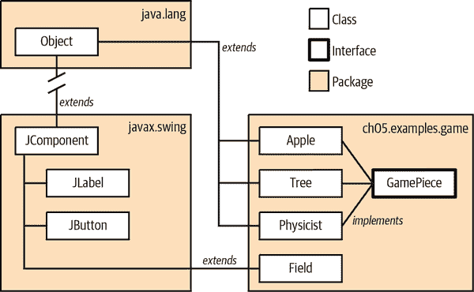

###### 图 5-1\. 类、接口和包概述

`Object`（在左上角）是 Java 中每个其他类的基础类。它是核心 Java 包`java.lang`的一部分。Java 还有一个用于其图形用户界面元素的包`javax.swing`。在该包内，`JComponent`类定义了所有图形元素的低级通用属性，如框架、按钮和画布。例如，`JLabel`类*扩展*了`JComponent`类。这意味着`JLabel`继承了`JComponent`的细节，但添加了特定于标签的内容。您可能注意到`JComponent`本身也从`Object`继承，或者至少最终会返回到`Object`。为了简洁起见，我们省略了中间的类和包。

你也可以定义自己的类和包。例如，右下角的`ch05.examples.game`包是我们为一个简单游戏构建的自定义包，允许物理学家扔苹果。（牛顿会报仇的！）在这个包中，我们有一些类，如`Apple`和`Field`，它们是我们应用程序的一部分。你还可以看到`GamePiece`接口，它包含所有游戏元素的一些共同必需元素，并由`Apple`、`Tree`和`Physicist`类实现。（在我们的游戏中，`Field`类是所有游戏元素显示的地方，但它本身不是一个游戏元素。注意它并没有实现`GamePiece`接口。）

本章将详细介绍每个概念，并提供更多示例。我们强烈建议您在学习过程中尝试这些示例，并使用*jshell*工具（在“尝试 Java”中讨论）来帮助巩固对新主题的理解。

## 声明和实例化类

类（class）作为制作实例（instances）的蓝图，这些实例是运行时对象（独立副本），实现了类的结构。你使用`class`关键字和自己选择的名称声明一个类。例如，在我们的游戏中，物理学家、苹果和树都是很好的类对象。在类中，我们添加存储详细信息或其他有用信息的变量，以及描述我们可以对类实例执行的方法。

让我们从苹果类开始。按照（强烈的！）约定，类名以大写字母开头。这使得`Apple`成为一个很好的名称使用。我们不会立即将我们游戏苹果的每一个细节放入类中，只是一些元素，帮助说明类、变量和方法如何结合在一起：

```java
package ch05.examples;

class Apple {
  float mass;
  float diameter = 1.0f;
  int x, y;

  boolean isTouching(Apple other) {
    // Code will eventually go here that performs
    // distance calculations and returns true if
    // this apple is touching another apple
  }

  // More methods will go here as we fill out more
  // details of our apple
}
```

`Apple`类包含四个变量：`mass`、`diameter`、`x`和`y`。它还定义了一个名为`isTouching()`的方法，该方法以另一个`Apple`的引用作为参数，并返回一个布尔值作为结果。变量和方法声明可以以任何顺序出现，但变量初始化器不能对稍后出现的其他变量进行“前向引用”。（在我们的小片段中，`diameter`变量可以使用`mass`变量来帮助计算其初始值，但`mass`不能使用`diameter`变量来执行相同的操作。）一旦我们定义了`Apple`类，我们就可以为我们的游戏创建一个`Apple`对象（该类的实例），如下所示：

```java
    // Two steps, the declaration then the instantiation
    Apple a1;
    a1 = new Apple();

    // Or all in one line...
    Apple a2 = new Apple();
```

请记住，我们对变量`a1`的声明并没有创建一个`Apple`对象；它只是创建一个引用类型为`Apple`的变量。我们仍然需要使用`new`关键字创建对象，就像前面代码片段的第二行所示。但是你可以将这些步骤合并成一行，就像我们对`a2`变量所做的那样。当然，在幕后仍然是分开的动作。有时，合并声明和初始化的方式会比多行版本更易读。

现在我们创建了一个`Apple`对象，我们可以访问它的变量和方法，就像我们在第四章的几个例子中或者甚至我们的图形“Hello”应用程序中看到的那样。尽管这并不是非常令人兴奋，但我们现在可以构建另一个类`PrintAppleDetails`，它是一个完整的应用程序，用于创建一个`Apple`实例并打印其详细信息：

```java
package ch05.examples;

public class PrintAppleDetails {
  public static void main(String args[]) {
    Apple a1 = new Apple();
    System.out.println("Apple a1:");
    System.out.println("  mass: " + a1.mass);
    System.out.println("  diameter: " + a1.diameter);
    System.out.println("  position: (" + a1.x + ", " + a1.y +")");
  }
}
```

如果你编译并运行这个示例，你应该在你的终端或 IDE 的终端窗口中看到以下输出：

```java
Apple a1:
  mass: 0.0
  diameter: 1.0
  position: (0, 0)
```

但是，为什么`a1`没有质量呢？如果你回顾一下我们为`Apple`类声明变量的方式，我们只初始化了`diameter`。所有其他变量由于它们是数值类型，都会得到 Java 分配的默认值`0`。² 我们理想情况下希望有一个更有趣的苹果。让我们看看如何提供这些有趣的部分。

## 访问字段和方法

一旦你获得了对象的引用，你就可以使用点符号来使用和操作它的变量和方法，就像你在第四章的几个例子中或者我们的图形“Hello”应用程序中看到的那样。让我们创建一个新类`PrintAppleDetails2`，为我们的`a1`实例提供一些质量和位置的值，然后打印新的详细信息：

```java
package ch05.examples;

public class PrintAppleDetails2 {
  public static void main(String args[]) {
    Apple a1 = new Apple();
    System.out.println("Apple a1:");
    System.out.println("  mass: " + a1.mass);
    System.out.println("  diameter: " + a1.diameter);
    System.out.println("  position: (" + a1.x + ", " + a1.y +")");
    // fill in some information on a1
    a1.mass = 10.0f;
    a1.x = 20;
    a1.y = 42;
    System.out.println("Updated a1:");
    System.out.println("  mass: " + a1.mass);
    System.out.println("  diameter: " + a1.diameter);
    System.out.println("  position: (" + a1.x + ", " + a1.y +")");
  }
}
```

这是新的输出：

```java
Apple a1:
  mass: 0.0
  diameter: 1.0
  position: (0, 0)
Updated a1:
  mass: 10.0
  diameter: 1.0
  position: (20, 42)
```

太棒了！`a1`看起来好多了。但再看看代码。我们不得不重复打印对象详细信息的三行代码。这种精确复制的情况需要一个*方法*。

方法允许我们在类内部“做事情”。举个简单的例子，我们可以通过一个方法改进`Apple`类，提供这些打印语句：

```java
public class Apple {
  float mass;
  float diameter = 1.0f;
  int x, y;

  // other apple-related variables and methods

  public void printDetails() {
    System.out.println("  mass: " + mass);
    System.out.println("  diameter: " + diameter);
    System.out.println("  position: (" + x + ", " + y +")");
  }
}
```

将这些详细语句重新定位后，我们可以创建比其前身更为简洁的`PrintAppleDetails3`：

```java
package ch05.examples;

public class PrintAppleDetails3 {
  public static void main(String args[]) {
    Apple a1 = new Apple();
    System.out.println("Apple a1:");

    // We can use our new method!
    a1.printDetails();

    // fill in some information on a1
    a1.mass = 10.0f;
    a1.x = 20;
    a1.y = 42;
    System.out.println("Updated a1:");
    // And look! We can easily reuse the same method
    a1.printDetails();
  }
}
```

再看看我们添加到`Apple`类的`printDetails()`方法。在类内部，我们可以通过名称直接访问类的变量和调用方法。打印语句只使用像`mass`和`diameter`这样的简单名称。

或者考虑填写`isTouching()`方法。我们可以使用自己的`x`和`y`坐标，不需要任何特殊前缀。但要访问其他苹果的坐标，我们需要回到点表示法。这是使用一些数学（在“java.lang.Math 类”中会有更多）和我们在“if/else 条件语句”中看到的`if/then`语句来编写该方法的一种方式：

```java
// File: ch05/examples/Apple.java

  public boolean isTouching(Apple other) {
    double xdiff = x - other.x;
    double ydiff = y - other.y;
    double distance = Math.sqrt(xdiff * xdiff + ydiff * ydiff);
    if (distance < diameter / 2 + other.diameter / 2) {
      return true;
    } else {
      return false;
    }
  }
```

让我们填充我们的游戏并创建一个使用几个`Apple`对象的`Field`类。它作为成员变量创建实例，并在`setupApples()`和`detectCollision()`方法中与这些对象一起工作，调用`Apple`方法并通过引用`a1`和`a2`访问这些对象的变量，在图 5-2 中可视化：

```java
package ch05.examples;

public class Field {
  Apple a1 = new Apple();
  Apple a2 = new Apple();

  public void setupApples() {
    a1.diameter = 3.0f;
    a1.mass = 5.0f;
    a1.x = 20;
    a1.y = 40;
    a2.diameter = 8.0f;
    a2.mass = 10.0f;
    a2.x = 70;
    a2.y = 200;
  }

  public void detectCollisions() {
    if (a1.isTouching(a2)) {
      System.out.println("Collision detected!");
    } else {
      System.out.println("Apples are not touching.");
    }
  }
}
```

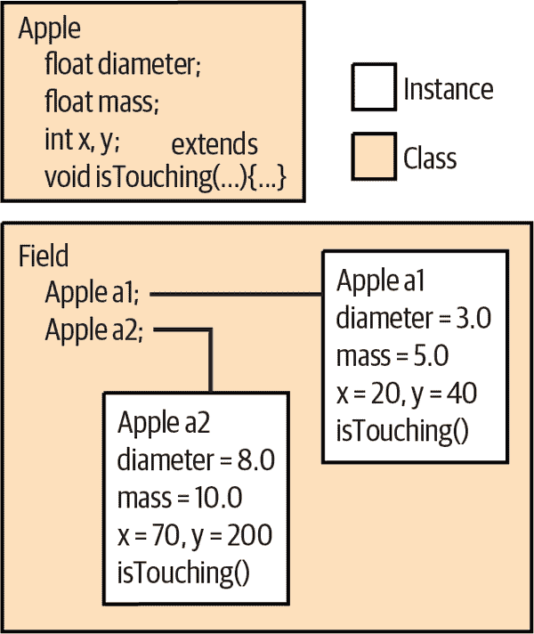

###### 图 5-2\. `Apple`类的实例

我们可以通过应用程序的另一个迭代`PrintAppleDetails4`证明`Field`可以访问苹果的变量和方法：

```java
package ch05.examples;

public class PrintAppleDetails4 {
  public static void main(String args[]) {
    Field f = new Field();
    f.setupApples();
    System.out.println("Apple a1:");
    f.a1.printDetails();
    System.out.println("Apple a2:");
    f.a2.printDetails();
    f.detectCollisions();
  }
}
```

我们应该看到熟悉的苹果细节，然后是两个苹果是否接触的答案：

```java
% java PrintAppleDetails4
Apple a1:
  mass: 5.0
  diameter: 3.0
  position: (20, 40)
Apple a2:
  mass: 10.0
  diameter: 8.0
  position: (70, 200)
Apples are not touching.

```

太好了，正如我们所预期的那样。

在继续阅读之前，请尝试更改苹果的位置以使它们接触。您得到了预期的输出吗？

### 访问修饰符预览

影响类成员是否可以从另一个类访问的几个因素。您可以使用可见性修饰符`public`、`private`和`protected`来控制访问；类也可以放置在*包*中，这会影响它们的范围。例如，`private`修饰符指定变量或方法仅供类本身的其他成员使用。在前面的示例中，我们可以将变量`diameter`的声明更改为`private`：

```java
class Apple {
  // ...
  private float diameter;
  // ...
}
```

现在我们无法从`Field`访问`diameter`：

```java
class Field {
  Apple a1 = new Apple();
  Apple a2 = new Apple();
  // ...
  void setupApples() {
    a1.diameter = 3.0f; // Compile-time error
    // ...
    a2.diameter = 8.0f; // Compile-time error
    // ...
  }
  // ...
}
```

如果我们仍然需要以某种方式访问`diameter`，通常会向`Apple`类添加公共`getDiameter()`和`setDiameter()`方法：

```java
public class Apple {
  private float diameter = 1.0f;
  // ...

  public void setDiameter(float newDiameter) {
    diameter = newDiameter;
  }

  public float getDiameter() {
    return diameter;
  }
  // ...
}
```

创建这样的方法是一个良好的设计规则，因为它允许将来在更改值的类型或行为时具有灵活性。我们将在本章后面更详细地查看包、访问修饰符以及它们如何影响变量和方法的可见性。

## 静态成员

正如我们所说，实例变量和方法与类的实例相关联并通过其实例访问（即通过特定对象，如前面示例中的`a1`或`f`）。相反，使用`static`修饰符声明的成员位于类中并由类的所有实例共享。使用`static`修饰符声明的变量称为*静态变量*或*类变量*；同样，这些类型的方法称为*静态方法*或*类方法*。静态成员作为标志和标识符非常有用，可以从任何地方访问。我们可以向我们的`Apple`示例添加一个静态变量来存储由于重力而产生的加速度的值。这使我们可以在开始动画化我们的游戏时计算扔苹果的轨迹：

```java
class Apple {
  // ...
  static float gravAccel = 9.8f;
  // ...
}
```

我们已将新的`float`变量`gravAccel`声明为`static`。这意味着它与类关联，而不是与单个实例关联，如果我们更改它的值（直接或通过任何`Apple`实例），则该值会对所有`Apple`对象更改，如图 5-3 所示。

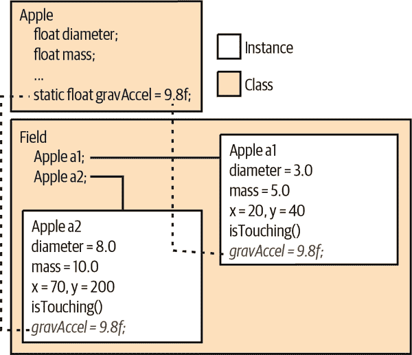

###### 图 5-3\. 类的所有实例共享的静态变量

你可以类似于访问实例成员的方式访问静态成员。在我们的`Apple`类中，我们可以像访问任何其他变量一样引用`gravAccel`：

```java
class Apple {
  // ...
  float getWeight () {
    return mass * gravAccel;
  }
  // ...
}
```

然而，由于静态成员存在于类本身中，而不依赖于任何实例，因此我们还可以直接通过类访问它们。例如，如果我们想在火星上扔苹果，我们不需要像`a1`或`a2`这样的`Apple`对象来获取或设置变量`gravAccel`。相反，我们可以使用类来更改变量以反映火星上的条件：

```java
    Apple.gravAccel = 3.7f;
```

这会改变类及其所有实例的`gravAccel`值。我们不必手动设置每个`Apple`实例在火星上下落。静态变量对于在运行时共享的任何类型的数据非常有用。例如，您可以创建方法来注册您的对象实例，以便它们可以进行通信，或者以便您可以跟踪它们的所有实例。使用静态变量定义常量值也很常见。在这种情况下，我们使用`static`修饰符以及`final`修饰符。因此，如果我们只关心受地球引力影响的苹果，我们可能会如下更改`Apple`：

```java
class Apple {
  // ...
  static final float EARTH_ACCEL = 9.8f;
  // ...
}
```

在这里，我们遵循了一个常见的约定，并使用大写字母和下划线（如果名称有多个单词）命名了我们的常量。`EARTH_ACCEL`的值是一个常量；您可以通过类`Apple`或其实例访问它，但不能更改其值。

只有真正常量的事物才重要使用`static`和`final`的组合。编译器允许在引用它们的类中“内联”这些值。这意味着如果你改变了一个`static final`变量，你可能需要重新编译所有使用该类的代码（这确实是在 Java 中唯一需要这样做的情况）。静态成员对于构造实例本身所需的值也很有用。例如，我们可以声明多个静态值来表示不同大小的`Apple`对象：

```java
class Apple {
  // ...
  static int SMALL = 0, MEDIUM = 1, LARGE = 2;
  // ...
}
```

然后我们可以在设置`Apple`大小的方法中使用这些选项，或者在稍后讨论的特殊构造函数中使用：

```java
    Apple typicalApple = new Apple();
    typicalApple.setSize(Apple.MEDIUM);
```

再次，在`Apple`类内部，我们也可以直接通过名称使用静态成员。无需前缀`Apple.`：

```java
class Apple {
  // ...
  void resetEverything() {
    setSize (MEDIUM);
    // ...
  }
  // ...
}
```

# 方法

到目前为止，我们的示例类还相当简单。我们保留一些信息，比如苹果有质量，田地有几个苹果等等。但是我们也触及了让这些类做一些事情的想法。例如，我们的各种`PrintAppleDetails`类在运行程序时有一系列步骤要执行。正如我们之前简要提到的，在 Java 中，这些步骤被打包成一个方法。对于`PrintAppleDetails`来说，这就是`main()`方法。

每当您有步骤要执行或决策要做时，都需要一个方法。除了在我们的`Apple`类中存储诸如`mass`和`diameter`之类的变量外，我们还添加了一些包含动作和逻辑的代码片段。方法对于类来说如此基本，以至于我们甚至在正式讨论它们之前就不得不创建几个！想想`Apple`中的`printDetails()`方法或`Field`中的`setupApples()`方法。即使是我们的第一个简单程序也需要一个`main()`方法。

希望到目前为止我们讨论的方法都足够直接，可以从上下文中跟随。但是方法可以做的远不止打印出几个变量或计算距离。它们可以包含本地变量声明和其他在方法被调用时执行的 Java 语句。方法还可以向调用者返回一个值。它们总是指定一个返回类型，可以是原始类型、引用类型，或特殊的`void`，表示没有返回值。方法可以接受参数，这些参数是由方法的调用者提供的值。

下面是一个接受参数的简单方法的示例：

```java
class Bird {
  int xPos, yPos;

  double fly (int x, int y) {
    double distance = Math.sqrt(x*x + y*y);
    flap(distance);
    xPos = x;
    yPos = y;
    return distance;
  }
  // other bird things ...
}
```

在这个例子中，类`Bird`定义了一个方法`fly()`，它接受两个整数参数`x`和`y`。它使用`return`关键字返回一个`double`类型的值作为结果。

我们的方法有固定数量的参数（两个）；但是，方法可以有*可变长度的参数列表*，允许方法指定可以接受任意数量的参数，并在运行时自行排序。³

## 本地变量

我们的 `fly()` 方法声明了一个名为 `distance` 的局部变量，用于计算飞行距离。局部变量是临时的；它们仅存在于其方法的作用域（代码块）内。局部变量在方法被调用时分配；它们通常在方法返回时被销毁。它们无法从方法外部引用。如果方法在不同线程中并发执行，每个线程都有自己版本的方法的局部变量。方法的参数在方法的作用域内也充当局部变量；唯一的区别是它们通过方法的调用者传递来初始化。

在方法内创建并分配给局部变量的对象在方法返回后可能会存在或不存在。正如我们将在 “对象销毁” 中详细看到的那样，这取决于对象是否仍然有任何引用。如果创建对象并将其分配给局部变量，然后从未在其他任何地方使用该对象，则当局部变量从作用域中消失时，该对象不再被引用，因此垃圾收集器将移除该对象。但是，如果我们将对象分配给对象的实例变量，将其作为参数传递给另一个方法，或者将其作为返回值返回，则可能会由另一个变量持有其引用而保存下来。

## 遮蔽

如果一个局部变量或方法参数与实例变量同名，则局部变量 *遮蔽* 或隐藏了方法作用域内的实例变量名称。这听起来可能有点奇怪，但当实例变量具有常见或明显的名称时，这种情况经常发生。例如，我们可以在我们的 `Apple` 类中添加一个 `move` 方法。我们的方法将需要一个新的坐标，告诉它将苹果放在哪里。坐标参数的简单选择可能是 `x` 和 `y`。但是我们已经有了相同名称的实例变量，用于保存苹果的当前位置：

```java
class Apple {
  int x, y;

  public void moveTo(int x, int y) {
    System.out.println("Moving apple to " + x + ", " + y);
    // actual move logic would go here ...
  }
}
```

如果苹果当前位于位置（20, 40），你调用了 `moveTo(40, 50),` 你觉得 `println()` 语句会显示什么？在 `moveTo()` 中，`x` 和 `y` 仅指代那些具有这些名称的方法参数。输出将是：

```java
    Moving apple to 40, 50
```

如果我们无法访问 `x` 和 `y` 实例变量，我们怎么移动苹果呢？Java 理解遮蔽并提供了一种解决这些情况的机制。

### “this” 引用

每当需要显式引用当前对象或当前对象的成员时，你都可以使用特殊引用`this`。通常情况下，你不需要使用`this`，因为对当前对象的引用是隐式的；在类内部使用明确命名的实例变量时就是这种情况。但是，你可以使用`this`显式引用对象中的实例变量，即使它们被隐藏了。以下示例显示了如何使用`this`允许参数名称遮蔽实例变量名称。这是一种相当常见的技术，因为它避免了必须编造替代名称。这里是我们如何使用`this`来实现我们的`moveTo()`方法，其中包含了被遮蔽变量：

```java
class Apple {
  int x, y;
  float diameter = 1.0f;

  public void moveTo(int x, int y) {
    System.out.println("Moving apple to " + x + ", " + y);
    // store the new x value
    this.x = x;
    // store the new y value if it is high enough
    if (y > diameter) {
      this.y = y;
    } else {
      // otherwise set y to the height of the apple
      this.y = (int)diameter;
    }
  }
}
```

在这个例子中，表达式`this.x`引用了实例变量`x`并将其赋值给本地变量`x`的值，否则它会隐藏它的名称。对于`this.y`我们做了同样的事情，但是稍作保护，以确保我们不会将苹果移动到地面以下。请注意，在此方法中`diameter`没有被遮蔽。由于在`moveTo()`中没有`diameter`参数，因此在使用它时我们不必说`this.diameter`。

在前面的示例中，我们唯一需要使用`this`的原因是因为我们使用了隐藏实例变量的参数名称，并且我们想要引用这些实例变量。你还可以在任何时候使用`this`引用，以便将“当前”封闭对象的引用传递给其他方法，就像我们在我们的“Hello Java”应用程序的图形版本中为“HelloJava2: The Sequel”所做的那样。

## 静态方法

静态方法（有时称为类方法），像静态变量一样，属于类而不是类的各个实例。这是什么意思呢？首先，*静态方法*存在于任何特定实例之外。它可以通过类名和点运算符调用，而无需任何对象的存在。因为它不绑定到特定对象，静态方法只能访问类的其他静态成员（静态变量和其他静态方法）。它不能直接访问任何实例变量或调用任何实例方法，因为这样做会需要问：“在哪个实例上？”静态方法可以通过与实例方法相同的语法从实例中调用，但重要的是它们也可以独立使用。

我们的`isTouching()`方法使用了一个静态方法`Math.sqrt()`，它由`java.lang.Math`类定义；我们将在第八章详细探讨这个类。现在，需要注意的重要一点是，`Math`是一个类的名称，而不是`Math`对象的实例。⁴因为静态方法可以在类名可用的任何地方调用，类方法更接近于 C 风格函数。静态方法特别适用于执行与实例无关或在实例上工作的实用方法。例如，在我们的`Apple`类中，我们可以从我们在“访问字段和方法”中创建的常量中枚举所有可用大小为人类可读字符串。

```java
class Apple {
  public static final int SMALL = 0;
  public static final int MEDIUM = 1;
  public static final int LARGE = 2;
  // other apple things...

  public static String[] getAppleSizes() {
    // Return names for our constants
    return new String[] { "SMALL", "MEDIUM", "LARGE" };
  }
}
```

在这里，我们定义了一个静态方法`getAppleSizes()`，它返回一个包含苹果尺寸名称的字符串数组。我们将该方法设置为静态，因为无论给定`Apple`实例的大小如何，大小列表始终相同。如果需要，我们仍然可以从`Apple`实例中使用`getAppleSizes()`，就像一个实例方法一样。例如，我们可以将（非静态）`printDetails`方法更改为打印大小名称而不是确切的直径：

```java
  public void printDetails() {
    System.out.println("  mass: " + mass);
    // Print the exact diameter:
    //System.out.println("  diameter: " + diameter);
    // Or a nice, human-friendly approximate
    String niceNames[] = getAppleSizes();
    if (diameter < 5.0f) {
      System.out.println(niceNames[SMALL]);
    } else if (diameter < 10.0f) {
      System.out.println(niceNames[MEDIUM]);
    } else {
      System.out.println(niceNames[LARGE]);
    }
    System.out.println("  position: (" + x + ", " + y +")");
  }
```

然而，我们也可以从其他类中调用它，使用`Apple`类名和点符号。例如，第一个`PrintAppleDetails`类可以使用类似的逻辑来打印一个总结性语句，使用我们的静态方法和静态变量，就像这样：

```java
public class PrintAppleDetails {
  public static void main(String args[]) {
    String niceNames[] = Apple.getAppleSizes();
    Apple a1 = new Apple();
    System.out.println("Apple a1:");
    System.out.println("  mass: " + a1.mass);
    System.out.println("  diameter: " + a1.diameter);
    System.out.println("  position: (" + a1.x + ", " + a1.y +")");
    if (a1.diameter < 5.0f) {
      System.out.println("This is a " + niceNames[Apple.SMALL] + " apple.");
    } else if (a1.diameter < 10.0f) {
      System.out.println("This is a " + niceNames[Apple.MEDIUM] + " apple.");
    } else {
      System.out.println("This is a " + niceNames[Apple.LARGE] + " apple.");
    }
  }
}
```

在这里，我们有我们可靠的`Apple`类的实例`a1`，但我们不需要`a1`来获取大小列表。请注意，我们在`a1`甚至存在之前加载了漂亮名称列表。但一切仍然正常，如输出所示：

```java
Apple a1:
  mass: 0.0
  diameter: 1.0
  position: (0, 0)
This is a SMALL apple.
```

静态方法还在各种设计模式中发挥着重要作用，其中你将类的`new`操作符的使用限制为一个方法——一个称为*工厂方法*的静态方法。我们将在“构造函数”中进一步讨论对象构造。工厂方法没有命名约定，但是在类似这样的用法中很常见：

```java
    Apple bigApple = Apple.createApple(Apple.LARGE);
```

我们不会编写任何工厂方法，但是在查找类似于 Stack Overflow 的网站上的问题时，你可能会发现它们。

## 初始化局部变量

与实例变量不同，如果我们没有提供显式值，局部变量必须在使用之前进行初始化。如果尝试访问未分配值的局部变量，将会收到编译时错误：

```java
  // instance variables always get default values if
  // you don't initialize them
  int foo;

  void myMethod() {
    // local variables do not get default values
    int bar;

    foo += 1;  // This is ok, foo has the value 0
    bar += 1;  // compile-time error, bar is uninitialized

    bar = 99;  // This is ok, we're setting bar's initial value
    bar += 1;  // Now this calculation is ok
  }
```

注意，这并不意味着你在声明它们时总是要初始化局部变量，只是在第一次引用它们之前必须为它们赋值。当在条件语句内部进行赋值时，会出现更微妙的可能性：

```java
  void myMethod {
    int bar;
    if (someCondition) {
      bar = 42;
    }
    bar += 1;   // Still a compile-time error, bar may not be initialized
  }
```

在这个例子中，仅当`someCondition`为`true`时，才会初始化`bar`。编译器不会让你这么赌博，因此在`if`语句之后使用`bar`会被标记为错误。

我们可以通过几种方法来纠正这种情况。我们可以提前将变量初始化为默认值，或者将使用移动到条件内部。我们还可以确保控制流不通过其他方式到达未初始化的变量，这取决于对我们特定应用程序有意义的内容。例如，如果`someCondition`为假，我们可以简单地确保在`else`分支中为`bar`分配一个值。或者我们可以突然从方法返回：

```java
  void myMethod {
    int bar;
    if (someCondition) {
      bar = 42;
    } else {
      return;
    }
    bar += 1;  // This is ok!
  }
```

在这种情况下，要么`someCondition`为真，`bar`被设置为 42，要么为假并从`myMethod()`返回。不可能在未初始化状态下访问`bar`，所以编译器允许在条件语句之后使用`bar`。

为什么 Java 对局部变量如此挑剔？在其他语言（如 C 或 C++）中，最常见（也是最隐秘）的错误之一就是忘记初始化局部变量。在那些语言中，局部变量以看似随机的值开始，给程序员带来各种各样的沮丧。Java 试图帮助你，强制你分配好、已知的值。

## 参数传递和引用

在第四章的开头，我们描述了原始类型（通过复制按值传递）和对象（通过引用传递）之间的区别。既然你对 Java 中的方法有了更好的掌握，让我们通过一个例子来详细说明：

```java
  // declare a method with some arguments
  void myMethod(int num, SomeKindOfObject o) {
    // do some useful stuff with num and o
  }

  // use the method
  int i = 0;
  SomeKindOfObject obj = new SomeKindOfObject();
  myMethod(i, obj);
```

这段代码调用了`myMethod()`，并传递了两个参数。第一个参数`i`是按值传递的；当调用方法时，`i`的值被复制到方法的第一个参数（一个名为`num`的局部变量）中。如果`myMethod()`改变了`num`的值，它只改变了它自己的局部变量。我们的`i`不会受影响。

同样地，Java 将`obj`的引用副本放入`myMethod()`的参数`o`中。但由于它是一个引用，`obj`和`o`都指向同一个对象。通过`o`或`obj`进行的任何更改都会影响实际的对象实例。如果我们改变了，比如说，`o.size`的值，这种更改在`myMethod()`内部的`o.size`和`myMethod()`完成后调用者的`obj.size`上都是可见的。然而，如果`myMethod()`重新分配引用`o`以指向不同的对象，那么这个分配只影响它的局部变量引用。将`o`赋给其他东西不会影响调用者的变量`obj`，它仍然指向原始对象。

将引用传递给方法让我们体验了我们之前提到的`this`关键字的另一种用法。你可以使用`this`将当前对象的引用传递给其他对象。让我们看一些代码来看看这是如何工作的：

```java
class Element {
  int num;
  double weight;

  void printMyDetails() {
    System.out.println(this);
  }
}
```

当然，我们的例子是刻意构造的，但语法是正确的。在 `printMyDetails()` 方法内部，我们调用了我们的老朋友 `System.out.println()`。我们传递给 `println()` 的参数是 `this`，意味着我们希望打印当前元素对象。在后面的章节中，我们将处理更复杂的对象关系，并且我们经常需要访问当前实例。`this` 关键字提供了这种访问权限。

## 原始类型的包装器

正如我们在“原始类型”中简要提到的，Java 世界在类类型（对象）和原始类型（数字、字符和布尔值）之间存在分歧。出于效率原因，Java 接受了这种权衡。当您在进行数字计算时，希望您的计算是轻量级的；使用对象来表示原始类型会复杂化性能优化。虽然不常见，但有时需要将原始值存储为对象。对于这些场合，Java 为每个原始类型提供了标准的包装器类，如表 5-1 所示。

表 5-1\. 原始类型包装器

| 原始类型 | 包装器 |
| --- | --- |
| `void` | `java.lang.Void` |
| `boolean` | `java.lang.Boolean` |
| `char` | `java.lang.Character` |
| `byte` | `java.lang.Byte` |
| `short` | `java.lang.Short` |
| `int` | `java.lang.Integer` |
| `long` | `java.lang.Long` |
| `float` | `java.lang.Float` |
| `double` | `java.lang.Double` |

包装器类的实例封装了其对应类型的单个值。它是一个不可变对象，用于容纳值并允许您稍后检索它。您可以从原始值或值的 `String` 表示构造包装器对象。以下语句是等价的：

```java
    Float pi = new Float(3.14);
    Float pi = new Float("3.14");
```

数字包装器的构造函数在解析字符串时遇到错误时会抛出 `NumberFormatException`。

每个数字包装器都实现了 `java.lang.Number` 接口，该接口提供了访问其各种原始形式值的“value”方法。您可以使用 `doubleValue()`、`floatValue()`、`longValue()`、`intValue()`、`shortValue()` 和 `byteValue()` 方法检索标量值：

```java
    Double size = new Double (32.76);

    double d = size.doubleValue();     // 32.76
    float f = size.floatValue();       // 32.76f
    long l = size.longValue();         // 32L
    int i = size.intValue();           // 32
```

这段代码等效于将原始 `double` 值转换为各种类型。

这些包装器最常用的情况是当您想要将原始值传递给需要对象的方法时。例如，在第七章中，我们将学习 Java 集合，这是一组用于处理对象组（如列表、集合和映射）的复杂类。集合仅适用于对象类型，因此在存储原始类型时必须进行包装。正如我们将在下一节看到的，Java 会自动透明地处理此包装过程。但现在让我们手动做一下。正如我们将看到的，`List` 是 `Object` 的可扩展集合。我们可以使用包装器在 `List` 中存储简单的数字（以及其他对象）：

```java
    // Manually wrapping an integer
    List myNumbers = new ArrayList();
    Integer thirtyThree = new Integer(33);
    myNumbers.add(thirtyThree);
```

在这里，我们创建了一个`Integer`包装器对象，以便我们可以将该数字插入`List`中，使用接受对象的`add()`方法。稍后，当我们从`List`中提取元素时，我们可以如下恢复`int`值：

```java
    // Manually unwrapping an integer
    Integer theNumber = (Integer)myNumbers.get(0);
    int n = theNumber.intValue();           // 33
```

令人高兴的是，Java 可以自动完成这些工作的大部分。Java 调用原始类型的自动包装和拆包称为*自动装箱*。正如我们之前提到的，允许 Java 为我们完成这些工作使得代码更加简洁和安全。编译器大部分时间都会为我们隐藏包装类的使用，但它确实在内部使用。以下是包含额外类型信息（在计算机语言术语中称为*泛型*）并使用自动装箱的另一个示例：

```java
    // Using autoboxing and generics
    List<Integer> myNumbers = new ArrayList<Integer>();
    myNumbers.add(33);
    int n = myNumbers.get(0);
```

注意，我们没有创建任何`Integer`包装器的显式实例，尽管在声明变量时我们在尖括号（`<Integer>`）中包含了额外的类型信息。我们将在第七章中看到更多有关泛型的内容。

## 方法重载

*方法重载*是在类中定义多个具有相同名称的方法的能力；当调用该方法时，编译器根据传递给方法的参数选择正确的方法。这意味着重载方法必须具有不同数量或类型的参数。在“方法重写”中，我们将查看*方法重写*，它发生在我们在子类中声明具有相同签名的方法时。

方法重载（也称为*特定多态性*）是一种强大而有用的特性。其理念是创建能够在不同类型参数上以相同方式操作的方法。这造成了单个方法能够在许多类型的参数上操作的假象。标准`PrintStream`类中的`print()`方法就是方法重载的一个很好的例子。正如你现在可能已经推断出的那样，你可以使用以下表达式打印几乎任何东西的字符串表示：

```java
    System.out.print(argument);
```

变量`out`是一个对象引用（一个`PrintStream`），它定义了`print()`方法的九个不同的“重载”版本。这些版本接受以下类型的参数：`Object`、`String`、`char[]`、`char`、`int`、`long`、`float`、`double`和`boolean`：

```java
class PrintStream {
  void print(Object arg) { ... }
  void print(String arg) { ... }
  void print(char[] arg) { ... }
  // ...
}
```

您可以使用任何这些类型之一作为参数调用`print()`方法，并且该值将以适当的方式打印出来。在没有方法重载的语言中，这将需要更多的繁琐操作，例如为每种对象类型命名一个唯一的打印方法。在这种情况下，您需要确定每种数据类型使用哪种方法。

在 Java 中，`print()` 方法已经被重载以支持两种引用类型：`Object` 和 `String`。如果我们尝试使用其他引用类型调用 `print()` 方法会怎样呢？比如，一个 `Date` 对象？当没有精确的类型匹配时，编译器会寻找一个可接受的、*可赋值的* 匹配。由于 `Date` 类，像所有类一样，是 `Object` 的子类，因此可以将 `Date` 对象赋给类型为 `Object` 的变量。因此，这是一个可接受的匹配，编译器选择了 `Object` 版本的方法。

如果有多个可能的匹配怎么办？例如，如果我们想打印字面值 `"Hi there"`，那么这个字面值既可以分配给 `String`（因为它是一个 `String`），也可以分配给 `Object`，即 `String` 的父类。在这种情况下，编译器决定哪个匹配“更好”并选择该方法。在这种情况下，它选择了 `String` 版本。

选择 `String` 版本的直觉解释是，`String` 类在继承层次结构中与我们的字面值 `"Hi there"` 类型“更接近”。它是一个*更具体* 的匹配。更严格地说，可以说，如果第一个方法的参数类型都可以赋值给第二个方法的参数类型，则给定方法比另一个方法更具体。在这种情况下，`String` 方法更具体，因为类型 `String` 可以赋值给类型 `Object`。反之则不成立。

如果您非常注意，您可能已经注意到我们说编译器解析重载的方法。方法重载不是在运行时发生的事情；这是一个重要的区别。在编译期间做出这个决定意味着一旦选择了重载的方法，即使包含调用方法的类稍后被修订并添加了更具体的重载方法，选择也是固定的，直到代码重新编译。

这种编译时选择与 *重写* 方法形成对比，后者在运行时定位并可以找到，即使在调用类编译时它们不存在也可以。在实践中，这种区别通常对您不会有太大影响，因为您可能会同时重新编译所有必要的类。我们将在本章后面讨论方法重写。

# 对象创建

Java 中的对象被分配在系统的“堆”内存空间中。然而，与其他一些语言不同的是，我们不需要自行管理该内存。Java 会为您处理内存的分配和释放。在您使用`new`操作符创建对象时，Java 明确为其分配存储空间。更重要的是，当对象不再被引用时，通过垃圾回收机制将其移除。

## 构造函数

对象使用`new`运算符分配，使用*构造函数*。构造函数是一个与其类名相同且没有返回类型的特殊方法。当创建新的类实例时调用它，这为类设置对象使用的机会。构造函数像其他方法一样可以接受参数，并且可以重载。然而，它们不像其他方法那样被继承：

```java
class Date {
  int day;
  // other date variables ...

  // Simple "default" constructor
  Date() {
    day = currentDay();
  }

  Date(String date) {
    day = parseDay(date);
  }

  // other Date methods ...
}
```

在此代码片段中，`Date`类有两个构造函数。第一个不带参数；它被称为*默认构造函数*。默认构造函数有着特殊的角色：如果您没有为类定义任何构造函数，编译器将为您提供一个空的默认构造函数。默认构造函数是在您通过不带参数调用其构造函数创建对象时调用的函数。

在这里，我们已实现了默认构造函数，以便它通过调用一个假设的方法`currentDay()`设置实例变量`day`，该方法可能知道如何查找当前日期。第二个构造函数接受一个`String`参数。在这种情况下，`String`包含一个可以解析为设置`day`变量的日期字符串。有了这些构造函数，我们可以通过以下方式创建`Date`对象：

```java
    Date now = new Date();
    Date christmas = new Date("Dec 25, 2022");
```

在每种情况下，Java 根据重载方法选择的规则在编译时选择适当的构造函数。

如果以后删除了分配的对象的所有引用，则它将被垃圾收集，我们将很快讨论：

```java
    christmas = null;  // christmas is now fair game for the garbage collector
```

将此引用设置为`null`意味着它不再指向`"Dec 25, 2022"`日期对象。将变量`christmas`设置为其他任何值将产生相同的效果。除非另一个变量也引用原始日期对象，否则日期现在是不可访问的，并且可以被垃圾收集。我们并不建议您必须将引用设置为`null`才能进行值的垃圾收集。通常情况下，当局部变量超出范围时，这种情况自然发生，但是对象的实例变量（通过引用）会随着对象本身的生存而存在，而静态变量则会永久存在。

在这里，您可以使用与其他方法相同的可见性修饰符（`public`、`private`或`protected`）声明构造函数，以控制它们的可访问性。然而，您不能将构造函数设为`abstract`、`final`或`synchronized`。我们将在本章后面详细讨论`abstract`、`final`和可见性修饰符，并将在第九章中讨论`synchronized`。

## 使用重载构造函数

构造函数可以使用`this`和`super`引用的特殊形式引用同一类或直接超类中的另一个构造函数。我们将在这里讨论第一种情况，并在更多地讨论创建子类（通常简称为子类化）和继承之后返回超类构造函数的情况。构造函数可以使用自引用方法调用`this()`来调用其类中的另一个重载构造函数，以选择所需的构造函数。如果一个构造函数调用另一个构造函数，则*必须将其作为其第一条语句*进行：

```java
class Car {
  String model;
  int doors;

  Car(String model, int doors) {
    this.model = model;
    this.doors = doors;
    // other, complicated stuff
  }

  Car(String model) {
    this(model, 4 /* doors */);
  }
}
```

在这个例子中，类`Car`有两个构造函数。第一个更明确的构造函数接受指定汽车型号和车门数量的参数。第二个构造函数只接受模型作为参数，并调用第一个构造函数，使用默认值四个车门。这种方法的优点在于，您可以让单个构造函数完成所有复杂的设置工作；其他更方便的构造函数只需将适当的参数传递给该主要构造函数。

对`this()`的特殊调用必须出现作为我们委托构造函数中的第一条语句。语法以这种方式受限是因为在调用构造函数时需要确定一个清晰的命令链。在链的末端，Java 会调用超类的构造函数（如果我们在代码中没有明确调用它），以确保继承成员在继续之前被正确初始化。

在调用超类构造函数后的链中，当前类的实例变量的初始化器被评估。在这一点之前，我们甚至不能引用我们类的实例变量。在我们讨论完继承之后，我们将再次详细解释这种情况。

目前，您只需知道，您只能作为构造函数的第一条语句调用第二个构造函数（委托给它）。例如，以下代码是非法的并导致编译时错误：

```java
  Car(String m) {
    int doors = determineDoors();
    this(m, doors);   // Error: constructor call
                        // must be first statement
  }
```

简单的模型名称构造函数在调用更明确的构造函数之前不能进行任何额外的设置。它甚至不能引用实例成员来获取常量值：

```java
class Car {
  final int default_doors = 4;

  Car(String m) {
    this(m, default_doors); // Error: referencing
                              // uninitialized variable
  }
}
```

实例变量`defaultDoors`在设置对象的构造函数调用链的后续过程中才被初始化，因此编译器不允许我们访问它。幸运的是，我们可以通过使用静态变量而不是实例变量来解决这个特定的问题：

```java
class Car {
  static final int DEFAULT_DOORS = 4;

  Car(String m) {
    this(m, DEFAULT_DOORS);  // Okay!
  }
}
```

类的静态成员在首次加载到虚拟机时初始化。编译器可以确定这些静态成员的值，因此在构造函数中访问它们是安全的。

# 对象销毁

现在我们已经看到了如何创建对象，是时候谈谈如何销毁它们了。如果你习惯于使用 C 或 C++进行编程，那么你可能已经花费了时间来追踪你的代码中的*内存泄漏*。程序员通常会因为创建对象（消耗内存）而忘记在对象不再需要时销毁它们（返回分配的内存）而导致内存泄漏。Java 会为你处理对象销毁；你不必担心传统的内存泄漏问题，可以专注于更重要的编程任务。⁵

## 垃圾回收

Java 使用一种称为*垃圾回收*的技术来删除不再需要的对象。垃圾收集器是 Java 的收割者。它在后台徘徊，潜伏着对象并等待它们的死亡。它找到它们并观察它们，定期计算对它们的引用，以确定它们的寿命何时结束。当一个对象的所有引用都消失了，它不再可访问时，垃圾收集机制会声明该对象*不可达*，并将其空间收回到可用资源池中。一个不可达的对象是指在运行应用程序的任何“活”引用组合中都无法找到的对象。

垃圾收集使用各种算法；Java 虚拟机架构并不需要特定的方案。然而，值得注意的是，一些 Java 的实现是如何完成这项任务的。最初，Java 使用了一种称为“标记-清除”的技术。在这种方案中，Java 首先遍历所有可访问对象引用的树，并将它们标记为存活的。然后它扫描堆，寻找未标记的可识别对象。使用这种技术，Java 可以找到堆上的对象，因为它们以特定的方式存储，并且在其句柄中具有特定的位签名，这不太可能自然产生。这种算法不会因循环引用问题而混乱，即对象可以相互引用并且在它们死亡时仍然看起来存活（Java 会自动处理此问题）。然而，这种方案并不是最快的方法，并且会导致程序暂停。自那时以来，实现已经变得更加复杂。

现代 Java 垃圾收集器在不强制执行任何长时间延迟的情况下有效地持续运行 Java 应用程序。因为它们是运行时系统的一部分，它们还可以完成一些静态无法完成的任务。例如，Java 将内存堆分为几个区域，用于存放估计生命周期不同的对象。短生命周期对象被放置在堆的特定部分，这大大减少了回收它们所需的时间。生命周期较长的对象可以被移动到堆的其他不那么易变的部分。在最近的实现中，垃圾收集器甚至可以通过根据实际应用程序性能调整堆分区大小来“调优”自己。自从早期版本以来，Java 的垃圾收集改进非常显著，这也是 Java 现在速度大致相当于许多传统语言的原因之一，那些语言把内存管理的负担放在程序员的肩上。

一般来说，你不需要关心垃圾回收过程。但是一种垃圾回收方法在调试时可能会有用。你可以通过调用`System.gc()`方法显式地促使垃圾收集器进行一次完整的清理。这个方法完全依赖于实现，并且可能什么都不做，但是如果你希望在执行某个活动之前确保 Java 至少尝试清理内存，你可以使用它。

# 包

即使我们只用简单的例子，你可能也注意到在 Java 中解决问题需要创建类。在上面的游戏类中，我们有苹果、树和游戏场地等等。对于更复杂的应用程序或库，你可能会有数百甚至数千个类。你需要一种方法来组织这些内容，Java 使用*包*的概念来完成这项任务。让我们看几个例子。

回顾我们在第二章中的第二个 Hello World 示例。文件的前几行向我们展示了代码的所在地的很多信息：

```java
package ch02.examples;

import javax.swing.*;

public class HelloJava {
  public static void main(String[] args) {
    JFrame frame = new JFrame("Hello, Java!");
    JLabel label = new JLabel("Hello, Java!", JLabel.CENTER);
    // ...
  }
}
```

我们根据该文件中的主类(`HelloJava`)将 Java 文件命名为*HelloJava.java*。当我们讨论如何组织文件中的内容时，你可能自然会想到使用文件夹来进一步组织这些文件。这基本上就是 Java 所做的。在这个例子中，我们使用`package`关键字并为其指定一个包名`ch02.examples`。包映射到文件夹名称的方式与类映射到文件名的方式类似。因此，从安装本书示例的目录开始，这个类应该可以在文件*ch02/examples/HelloJava.java*中找到。回顾一下图 5-1，我们将一些类分组到它们的包中。例如，如果你正在查看我们在`HelloJava`中使用的 Swing 组件的 Java 源代码，你会发现一个名为*javax*的文件夹，它下面有一个名为*swing*的文件夹，而在其中你会找到像*JFrame.java*和*JLabel.java*这样的文件。

每个类都属于一个包。包名遵循与其他 Java 标识符相同的一般规则，并且按约定全部小写。如果不指定包，Java 将把你的类分配给“默认”包。对于一次性演示，使用默认包是可以的，但除此之外，你应该使用 `package` 来为你的类指定包。默认包有几个限制——例如，默认包中的类无法与 *jshell* 一起使用——并且不应该仅用于测试之外的用途。

## 导入类

Java 的一个最大优势在于其庞大的支持库集合，涵盖商业和开源许可下的各种库。需要导出 PDF 吗？有适合的库。需要导入电子表格吗？也有适合的库。需要从云中的 Web 服务器控制地下室的智能灯泡吗？同样有适合的库。如果计算机正在执行某项任务，几乎总能找到一个 Java 库来帮助你编写执行该任务的代码。

要使用这些优秀的库中的任何一个，你可以使用巧妙命名的 `import` 关键字进行*导入*。我们在 `HelloJava` 的示例中使用了 `import`，这样我们就可以从 Swing 图形库中添加框架和标签组件。你可以导入单个类或整个包。让我们看一些例子。

### 导入单个类

在编程中，你经常会听到“少即是多”的最大。少量代码更易维护。少量开销意味着更高的吞吐量，等等。（尽管在追求这种编码方式时，我们确实要提醒您遵循爱因斯坦的另一句名言：“事物应该尽可能简单，但不应过于简单。”）如果你只需要来自外部包的一个或两个类，你可以精确导入这些类。这可以使你的代码更易读——其他人可以确切知道你将使用哪些类。

让我们重新审视之前 `HelloJava` 的片段。我们使用了全局导入（下一节会详细介绍），但我们可以通过仅导入我们需要的类来稍微优化一下，如下所示：

```java
package ch02.examples;

import javax.swing.JFrame;
import javax.swing.JLabel;

public class HelloJava {
  public static void main(String[] args) {
    JFrame frame = new JFrame("Hello, Java!");
    JLabel label = new JLabel("Hello, Java!", JLabel.CENTER);
    // ...
  }
}
```

这种类型的导入设置显然更加冗长，但同样，它意味着任何阅读或编译你代码的人都知道它的确切依赖关系。许多集成开发环境甚至有一个“优化导入”功能，可以自动查找这些依赖关系并逐个列出。一旦你习惯了列出和看到这些明确的导入，你会惊讶地发现它们在定位自己在一个新的（或者说是长期遗忘的）类时是多么有用。

### 导入整个包

当然，并非每个包都适合单独导入。同样是 Swing 包，`javax.swing` 就是一个很好的例子。如果你正在编写图形桌面应用程序，几乎肯定会使用 Swing，以及大量的组件。你可以使用我们之前忽略的语法来导入包中的每个类：

```java
import javax.swing.*;

public class HelloJava {
  public static void main(String[] args) {
    JFrame frame = new JFrame("Hello, Java!");
    JLabel label = new JLabel("Hello, Java!", JLabel.CENTER);
    // ...
  }
}
```

`*`是类导入的通配符。这种导入语句的版本告诉编译器准备好使用包中的每个类。你会经常看到这种类型的导入语句，例如 AWT、Swing、utilities 和 I/O 等常见 Java 包。再次强调，它适用于任何包，但在可以更具体的情况下，你将获得一些编译时性能提升，并提高代码的可读性。

###### 警告

尽管使用通配符`import`自然而然地包括命名包的类以及任何子包中的类，Java 不允许递归导入。如果你需要一些来自`java.awt`的类和更多来自`java.awt.event`的类，你必须为每个包提供单独的`import`语句。

### 跳过导入

你有另一种选择可以在你的代码中直接使用其他包的完全限定名称来使用外部类。例如，我们的`HelloJava`类使用了`javax.swing`包中的`JFrame`和`JLabel`类。如果需要，我们可以只导入`JLabel`类：

```java
import javax.swing.JLabel;

public class HelloJava {
  public static void main(String[] args) {
    javax.swing.JFrame frame = new javax.swing.JFrame("Hello, Java!");
    JLabel label = new JLabel("Hello, Java!", JLabel.CENTER);
    // ...
  }
}
```

对于在我们创建框架的一行中显得过于冗长的情况，但在具有已经很长的导入列表的大类中，一次性的用法实际上可以使你的代码更易读。这种完全限定名称的使用通常指向文件中仅使用此类的情况。如果你多次使用该类，你将`import`它或其包。这种全名使用方式从不是必需的，但你偶尔会在现实中看到它。

## 自定义包

随着你继续学习 Java 并编写更多代码并解决更大的问题，无疑会开始积累越来越多的类。你可以使用包来帮助组织这些类。使用`package`关键字声明自定义包，然后将带有你的类的文件放置在与包名对应的文件夹结构中。作为一个快速提醒，包使用全小写名称（按约定）以句点分隔，例如我们的图形界面包`javax.swing`。

包名的另一个广泛应用的约定是称为“反向域名”命名。除了与 Java 直接关联的包外，第三方库和其他贡献的代码通常使用公司或个人电子邮件地址的域名进行组织。例如，Mozilla 基金会向开源社区贡献了各种 Java 库。大多数这些库和工具将位于以 Mozilla 的域名*mozilla.org*反向命名的包中：`org.mozilla`。这种反向命名有一个方便的（也是预期的）副作用，即保持顶层文件夹结构相对较小。对于使用来自`com`和`org`顶级域的库的好规模的项目来说，这并不少见。

如果你在自己的项目中构建包，与任何公司或合同工作无关，你可以使用你的电子邮件地址，并进行反向，类似于公司域名。另一个在线分发代码的流行选项是使用你的托管提供商的域名。例如，GitHub 托管了许多，*许多* Java 爱好者和爱好者的项目。你可能会创建一个名为`com.github.myawesomeproject`的包（其中`myawesomeproject`显然应替换为你的实际项目名称）。请注意，像 GitHub 这样的网站上的存储库通常允许在包名称中不合法的名称。你可能有一个名为`my-awesome-project`的存储库，但在包名称的任何部分中都不允许使用破折号。通常这些非法字符会被简单地省略以创建一个有效的名称。

你可能已经注意到，我们将这本书中的各种示例放在了包中。虽然在包内组织类 *内部* 是一个毫无明确最佳实践的难题，但我们采取了一种方法，旨在使读者在阅读书籍时能轻松找到示例。对于每一章的完整示例，你会看到一个像`ch05.examples`这样的包。对于正在进行的游戏示例，我们使用了一个`game`子包。我们将章节末尾的练习放在了`ch05.exercises`中。

###### 注意

当你编译一个打包的类时，你需要告诉编译器实际文件在文件系统中的位置，因此你使用它的路径，路径元素之间用你的文件系统分隔符（通常是`/`或`\`）分隔开。另一方面，当你运行一个打包的类时，你指定它的完全限定的，点分隔的名称。

如果你使用的是一个集成开发环境（IDE），它将很高兴为你管理这些包问题。只需创建和组织你的类，并继续识别启动你程序的主类。

## 成员可见性和访问

我们已经谈到了在声明变量和方法时可以使用的访问修饰符。将某些内容设置为`public`意味着任何地方都可以看到你的变量或调用你的方法。将某些内容设置为`protected`意味着任何子类都可以访问变量，调用方法，或者重写方法，以提供适合你子类的替代功能。`private`修饰符表示该变量或方法仅在类本身内部可用。

包影响`protected`成员。除了可以被任何子类访问外，这些成员还可被同一包中的其他类看到和重写。如果你完全省略修饰符，包也会起作用。考虑一些自定义包`mytools.text`中的示例文本组件，如图 5-4 所示。

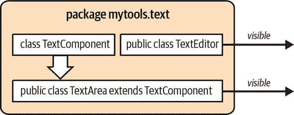

###### 图 5-4\. 包和类的可见性

类`TextComponent`没有修饰符。它具有*默认*可见性或“包私有”可见性。这意味着同一包中的其他类可以访问该类，但是包外的任何类都不能访问。这对于特定于实现的类或内部辅助类非常有用。您可以在构建代码时自由使用包私有元素，但其他程序员只能使用您的`public`和`protected`元素。图 5-5 显示了更多细节，包括子类和外部类使用示例类的变量和方法。

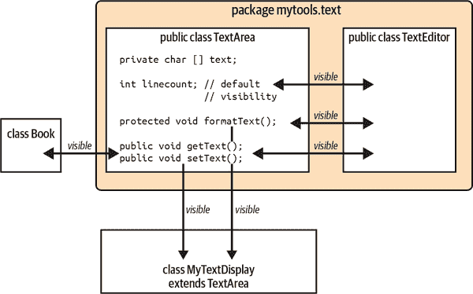

###### 图 5-5\. 包和成员可见性

请注意，扩展`TextArea`类可以让您访问公共的`getText()`和`setText()`方法，以及`protected`方法`formatText()`。但是`MyTextDisplay`（稍后在“子类化和继承”中详细介绍）无法访问包私有变量`linecount`。然而，在我们创建`TextEditor`类的`mytools.text`包中，我们可以访问`linecount`以及那些是`public`或`protected`的方法。我们用于存储内容的内部变量`text`保持私有，除了`TextArea`类本身之外，其他任何人都无法访问它。

表格 5-2 总结了 Java 中可用的可见性级别；一般情况下从最严格到最不严格的顺序排列。方法和变量始终在声明类内部可见，因此该表不涉及该范围。

表 5-2\. 可见性修饰符

| 修饰符 | 类外可见性 |
| --- | --- |
| `private` | 无 |
| 无修饰符（默认） | 包内的类 |
| `protected` | 包内和包外子类 |
| `public` | 所有类 |

## 使用包编译

您已经看到了使用完全限定的类名编译简单示例的几个示例。如果您不使用 IDE，还有其他选项可供选择。例如，您可能希望编译给定包中的所有类。如果是这样，您可以这样做：

```java
% javac ch02/examples/*.java
% java ch02.examples.HelloJava
```

请注意，对于商业应用程序，您经常会看到包含多个段的更复杂的包名称。正如我们之前提到的，一个常见做法是反转公司的互联网域名。例如，O’Reilly 的这本书可能更适合使用类似于`com.oreilly.learningjava6e`的完整包前缀。每个章节将是该前缀下的一个子包。在这些包中编译和运行类非常简单，只是有点啰嗦：

```java
% javac com/oreilly/learningjava6e/ch02/examples/*.java
% java com.oreilly.learningjava6e.ch02.examples.HelloJava
```

*javac*命令还了解基本的类依赖关系。如果您的主类使用同一源代码层次结构中的几个其他类，即使它们不都在同一个包中，编译该主类也会“捎带”其他依赖类并将它们一起编译。

虽然简单程序中可能只有一个包中的几个类，但实际上更可能依赖于你的 IDE 或诸如 Gradle 或 Maven 等构建管理工具。这些工具超出了本书的范围，但在线上有很多关于它们的参考资料。特别是 Maven，它在管理具有许多依赖的大型项目方面非常流行。请参阅[*Maven: The Definitive Guide*](https://oreil.ly/ya4DY)（O’Reilly），由 Maven 的创始人 Jason Van Zyl 及其 Sonatype 团队撰写，详细探讨这一强大工具的功能和能力。⁶

# 高级类设计

你可能还记得在 “HelloJava2: The Sequel” 中，我们在同一个文件中有两个类。这简化了编写和编译过程，但并没有赋予任何一个类对另一个类的特殊访问权限。当你开始思考更复杂的问题时，你会遇到更高级的类设计，它不仅仅是方便，而且是编写可维护代码的关键。

## 子类化与继承

Java 中的类存在层次结构。你可以使用 `extends` 关键字在 Java 中声明一个类作为另一个类的*子类*。子类从其*超类*那里*继承*变量和方法，并且可以像在子类内部声明的一样使用它们：

```java
class Animal {
  float weight;

  void eat() {
    // do eating stuff
  }
  // other animal stuff
}

class Mammal extends Animal {
  // inherits weight
  int heartRate;

  // inherits eat()
  void breathe() {
    // respire
  }
}
```

在这个例子中，类型为 `Mammal` 的对象同时具有实例变量 `weight` 和方法 `eat()`，它们是从 `Animal` 继承而来的。

一个类只能*扩展*另一个类。使用正确的术语，Java 允许对类实现*单继承*。本章后面我们将讨论接口，它们取代了其他语言中的*多继承*。

子类可以进一步被子类化。通常情况下，通过子类化可以通过添加变量和方法来专门化或改进类（不可以通过子类化移除或隐藏变量或方法）。例如：

```java
class Cat extends Mammal {
  // inherits weight and heartRate
  boolean longHair;

  // inherits eat() and breathe()
  void purr() {
    // make nice sounds
  }
}
```

`Cat` 类是 `Mammal` 的一种类型，最终是 `Animal` 的一种类型。`Cat` 对象继承了 `Mammal` 对象的所有特征，并且进而继承了 `Animal` 对象的特征。此外，`Cat` 还通过 `purr()` 方法和 `longHair` 变量提供了额外的行为。我们可以在图示中表示类之间的关系，如 Figure 5-6 所示。

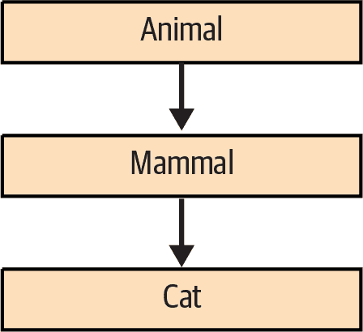

###### 图 5-6\. 类层次结构

子类继承其超类中未标记为 `private` 的所有成员。正如我们即将讨论的那样，其他可见性级别影响了类的继承成员能否从类外部及其子类中看到，但至少，子类始终具有与其父类相同的可见成员集合。因此，子类的类型可以被视为其父类的*子类型*，子类型的实例可以在任何允许使用父类型实例的地方使用。考虑以下示例：

```java
    Cat simon = new Cat();
    Animal creature = simon;
```

在这个例子中，`Cat` 实例 `simon` 可以赋值给 `Animal` 类型变量 `creature`，因为 `Cat` 是 `Animal` 的子类型。同样地，接受 `Animal` 对象的任何方法也将接受 `Cat` 实例或任何 `Mammal` 类型的实例。这是面向对象语言如 Java 中多态性的重要方面。我们将看到它如何用于细化类的行为，以及为其添加新的能力。

### 阴影变量

我们已经看到，与实例变量同名的局部变量会*遮蔽*（隐藏）实例变量。类似地，子类中的实例变量可以遮蔽其父类中同名的实例变量，如 图 5-7 所示。

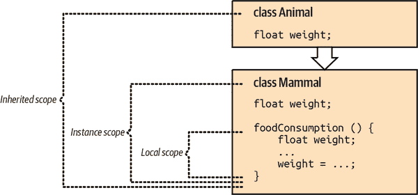

###### 图 5-7\. 阴影变量的作用域

变量 `weight` 在三个地方声明：作为 `Mammal` 类的 `foodConsumption()` 方法中的局部变量，作为 `Mammal` 类本身的实例变量，以及作为 `Animal` 类的实例变量。您在代码中引用的实际变量将取决于您正在工作的作用域以及您如何限定对它的引用。

在前面的例子中，所有变量都是相同类型的。稍微更有可能的使用阴影变量的情况是改变它们的类型。例如，我们可以在需要十进制值而不是整数值的子类中用 `double` 变量来阴影 `int` 变量。我们可以在不改变现有代码的情况下做到这一点，因为顾名思义，当我们阴影变量时，我们并不是替换它们，而是遮蔽它们。两个变量仍然存在；超类的方法看到原始变量，子类的方法看到新版本。各种方法看到的变量是在编译时确定的。

这是一个简单的例子：

```java
class IntegerCalculator {
  int sum;
  // other integer stuff ...
}

class DecimalCalculator extends IntegerCalculator {
  double sum;
  // other floating point stuff ...
}
```

在这个例子中，我们阴影实例变量 `sum`，将其类型从 `int` 改变为 `double`。类 `IntegerCalculator` 中定义的方法看到整数变量 `sum`，而类 `DecimalCalculator` 中定义的方法看到浮点数变量 `sum`。然而，对于给定的 `DecimalCalculator` 实例，这两个变量都是实际存在的，并且它们可以具有独立的值。事实上，`DecimalCalculator` 继承自 `IntegerCalculator` 的任何方法实际上看到整数变量 `sum`。如果这听起来令人困惑——确实如此。在可能的情况下，应避免使用阴影。但是并非总是能够避免，所以我们希望确保您已经看到了一些例子，尽管有些有点牵强。

因为 `DecimalCalculator` 中存在这两个变量，我们需要一种方法来引用从 `IntegerCalculator` 继承的变量。我们可以使用 `super` 关键字作为引用的限定符：

```java
    int s = super.sum;
```

在 `DecimalCalculator` 中，以这种方式使用的 `super` 关键字选择了在超类中定义的 `sum` 变量。我们稍后将更详细地解释 `super` 的用法。

关于遮蔽变量的另一个重要观点是，当我们通过一个不太派生的类型（父类型）的变量引用对象时，它们的工作方式是如何的。例如，我们可以通过一个`IntegerCalculator`类型的变量来引用一个`DecimalCalculator`对象。如果我们这样做，然后访问变量`sum`，我们得到的是整数变量，而不是小数变量：

```java
    DecimalCalculator dc = new DecimalCalculator();
    IntegerCalculator ic = dc;

    int s = ic.sum;       // accesses IntegerCalculator sum
```

如果我们使用显式转换到`IntegerCalculator`类型来访问对象，或者将实例传递给接受该父类型的方法时，情况也是如此。

重申一下，变量的遮蔽使用是有限的。在其他方面，抽象化变量的使用比使用复杂的作用域规则要好得多。然而，在我们讨论如何使用方法做同样的事情之前，理解这里的概念是很重要的。当方法遮蔽其他方法或者用正确的术语说，*重写*其他方法时，我们会看到一种不同而且更动态的行为。在子类中重写方法非常常见且非常强大。

### 方法重写

我们已经看到我们可以在一个类中声明重载的方法（具有相同名称但不同数量或类型的参数的方法）。重载方法的选择方式与我们在类中描述的方式一样，包括继承的方法。这意味着子类可以定义额外的重载方法，以补充超类提供的重载方法。

子类不仅可以这样做；它还可以定义一个与其超类中方法签名（名称和参数类型）完全相同的方法。在这种情况下，子类中的方法会覆盖超类中的方法，并有效地替换其实现，如图 5-8 所示。通过重写方法来改变对象行为被称为*子类型多态性*。这是大多数人在谈论面向对象语言的强大功能时所考虑的用法。

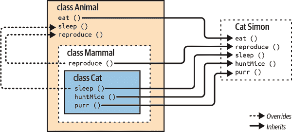

###### 图 5-8\. 方法重写

在图 5-8 中，`Mammal`重写了`Animal`的`reproduce()`方法，可能是为了将方法专门化为哺乳动物生产活仔的行为。`Cat`对象的睡眠行为也被重写，以与一般`Animal`的不同，可能是为了适应猫的小睡。`Cat`类还增加了更独特的行为，如咕噜声和捕猎老鼠。

从你目前看到的内容来看，重写方法可能看起来像是在超类中遮蔽方法，就像变量一样。但是重写的方法实际上比这更强大。当对象在其继承层次结构中具有多个方法实现时，位于“最派生”类中（层次结构最低端）的方法始终会重写其他方法，即使我们通过一个超类类型的引用来引用对象。⁹

例如，如果我们有一个`Cat`实例分配给一个更一般类型`Animal`的变量，并且我们调用它的`sleep()`方法，我们仍然得到`Cat`类中实现的`sleep()`方法，而不是`Animal`类中的方法：

```java
    Cat simon = new Cat();
    Animal creature = simon;
    // ...
    creature.sleep();       // accesses Cat sleep();
```

换句话说，对于行为（调用方法）来说，一个`Cat`表现得像一个`Cat`，无论你是否将其称为这样。你可能记得，通过我们的`Animal`变量`creature`访问一个被屏蔽的变量将在`Animal`类中找到该变量，而不是`Cat`类中。然而，因为方法是*动态定位*的，首先搜索子类，运行时会调用`Cat`类中适当的方法，即使我们将其更一般地视为`Animal`对象。这意味着对象的*行为*是动态的。我们可以将专门的对象处理为更一般的类型，并且仍然利用它们的行为专用实现。

## 抽象类和方法

有时你没有一个好的默认行为来实现一个方法。想想动物如何交流。狗会叫。猫会喵。牛会哞。实际上没有标准的声音。在 Java 中，你可以创建一个*抽象*方法来精确定义一个方法应该如何看起来，而不指定任何特定的行为。在声明方法时使用`abstract`修饰符。而不是提供方法体，你只需在定义末尾加上一个分号。考虑我们动物的`makeSound()`方法：

```java
public class Animal {
  float weight;
  // other animal traits ...

  public abstract void makeSound(int duration);
  // other animal behaviors ...
}
```

注意，我们制作声音的方法有一个完整的签名（回顾“运行 Java 应用程序”）。它是`void`（没有返回值），并且接受一个`int`类型的参数。但是它没有方法体。这种类型的方法明确设计为被覆盖。你不能调用一个抽象方法；你会得到一个编译时错误。在你可以使用它之前，你必须创建一个提供抽象方法逻辑的新子类：

```java
public class Cat extends Animal {
  // ...
  public void makeSound(int duration) {
    for (int count = 0; count < duration; count++) {
      // assume our sound takes one second to make and we can
      // repeat the sound to match the requested duration
      System.out.println("meow!");
    }
  }
  // ...
}
```

现在我们有了一个`Cat`的实例，我们可以调用`makeSound()`方法，编译器知道该怎么做了。但是因为`Animal`现在包含一个抽象方法，我们不能创建该类的实例。要使用`Animal`，我们必须创建一个子类并像我们的`Cat`一样填写`makeSound()`。

实际上，如果我们在我们的类中包含一个抽象方法，我们还必须将该类本身声明为抽象。我们上面的`Animal`片段将不能编译。我们在类声明时使用相同的`abstract`关键字：

```java
public abstract class Animal {
  // Notice the class definition needs the "abstract" modifier

  public abstract void makeSound(int duration);
  // ...
}
```

此声明告诉编译器（和其他开发人员），你设计这个类来作为一个更大程序的一部分。你期望（事实上，要求）子类扩展你的抽象类并填补任何缺失的细节。这些子类反过来可以被实例化并且可以执行真正的工作。

抽象类仍然可以包含典型的、带有方法体的方法。例如，对于`Animal`，我们可以添加一些动物体重的帮助方法：

```java
public abstract class Animal {
  private double weight;
  // ...
  public abstract void makeSound(int duration);
  // ...

  public void setWeight(double w) {
    this.weight = w;
  }

  public double getWeight() {
    return weight;
  }
}
```

这是一种常见且良好的设计实践。你的`Animal`类包含尽可能多的基本共享信息和行为。但是对于不共享的事物，你可以创建一个具有所需特性和操作的子类。

## 接口

Java 通过接口扩展了抽象方法的概念。通常希望指定一组抽象方法来定义对象的某种行为，而不将其与任何具体实现绑定。在 Java 中，这称为*接口*。接口定义了一个类必须实现的一组方法。在 Java 中，如果一个类实现了所需的方法，它可以声明它*implements*一个接口。与扩展抽象类不同，实现接口的类不必继承自继承层次结构的任何特定部分或使用特定实现。

接口有点像童子军的徽章。一个学会如何建造鸟屋的童子军可以穿着一个带有鸟屋图案的布贴或肩带四处走动。这向世界宣告：“我知道如何建造鸟屋。”同样，接口是为对象定义一组行为的方法列表。实现接口中列出的每个方法的任何类都可以在编译时声明它实现了该接口，并且佩戴一种额外的类型——接口的类型，作为它的徽章。

*接口类型*就像类类型。你可以声明变量为接口类型，可以声明方法的参数接受接口类型，也可以指定方法的返回类型为接口类型。在每种情况下，你都在说任何实现接口的对象（即佩戴了正确徽章的对象）都可以担任这个角色。在这个意义上，接口与类层次结构是正交的。它们跨越了一个物品属于什么类型的界限，而是仅通过它可以做什么来处理它。你可以为任何给定的类实现尽可能多的接口。Java 中的接口在其他语言中大部分需要多重继承的需求（以及真正的多重继承所带来的混乱复杂性）都得到了解决。

接口在本质上看起来像一个纯`abstract`类（只有`abstract`方法的类）。你使用`interface`关键字定义一个接口，并列出它的方法，但不带有任何具体内容，只有原型（签名）：

```java
interface Driveable {
  boolean startEngine();
  void stopEngine();
  float accelerate(float acc);
  boolean turn(Direction dir);
}
```

前面的例子定义了一个名为`Driveable`的接口，其中包含四个方法。这是可以接受的，但不是必须的，将接口中的方法声明为`abstract`修饰符；我们在这里没有这样做。更重要的是，接口的方法始终被视为`public`，你可以选择将它们声明为`public`。为什么是`public`？因为接口的使用者否则可能看不到它们，并且接口通常旨在描述对象的行为，而不是其实现方式。

接口定义了能力，因此通常根据它们的能力命名接口是很常见的。`Driveable`、`Runnable`和`Updateable`是很好的接口名称。任何实现了所有方法的类都可以通过在其类定义中使用特殊的`implements`子句声明它实现了该接口。例如：

```java
class Automobile implements Driveable {
  // Automobile traits could go here ...

  // build all the Driveable methods
  public boolean startEngine() {
    if (notTooCold)
      engineRunning = true;
    // ...
  }

  public void stopEngine() {
    engineRunning = false;
  }

  public float accelerate(float acc) {
    // ...
  }

  public boolean turn(Direction dir) {
    // ...
  }

  // Do other car things ...
}
```

在这里，类`Automobile`实现了`Driveable`接口的方法，并使用`implements`关键字声明自己是`Driveable`类型。

如图 5-9 所示，另一个类，如`Lawnmower`，也可以实现`Driveable`接口。该图示例了`Driveable`接口被两个不同类实现的情况。虽然`Automobile`和`Lawnmower`可能都来源于某种原始类型的车辆，但在这种情况下并非如此。

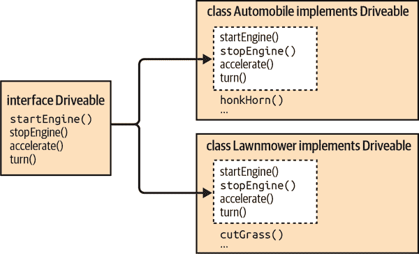

###### 图 5-9\. 实现`Driveable`接口

在声明接口之后，我们有了一个新的类型，`Driveable`。我们可以声明`Driveable`类型的变量，并分配任何`Driveable`对象的实例：

```java
    Automobile auto = new Automobile();
    Lawnmower mower = new Lawnmower();
    Driveable vehicle;

    vehicle = auto;
    vehicle.startEngine();
    vehicle.stopEngine();

    vehicle = mower;
    vehicle.startEngine();
    vehicle.stopEngine();
```

`Automobile`和`Lawnmower`都实现了`Driveable`，因此它们可以被视为该类型的可互换对象。

正如我们之前提到的，接口在 Java 的功能和流行性中起着至关重要的作用。我们将在剩余的章节中一直使用它们。如果它们还不太明白，请继续阅读并继续进行代码练习。你将会更多地通过实践来掌握它们。练习并不总是能够达到完美，但它确实会使某些东西变得不那么奇怪和晦涩。

## 内部类

所有我们在本书中到目前为止看到的类都是*顶级*的，“独立的”类，它们在文件和包级别声明。但是在 Java 中，类实际上可以在任何作用域级别声明，在任何花括号中——换句话说，几乎可以放置任何其他 Java 语句的地方。这些*内部类*作为变量一样属于另一个类或方法，并且其可见性可能被限制在其范围内。

内部类是用于结构化代码的一个有用且美观的功能。它们的姊妹类，*匿名内部类*，是一种更强大的简写方式，使得在 Java 的静态类型环境中似乎可以动态创建新类型的对象。在 Java 中，匿名内部类扮演其他语言中*闭包*的角色的一部分，产生处理状态和行为独立于类的效果。（你还可以在许多内部或匿名内部类适用的地方使用*lambda*。Lambda 封装了逻辑的片段，在许多函数式语言和 LISP 中都很常见。我们将在第十一章中更详细地介绍它们。）

然而，当我们深入其内部工作时，我们会发现内部类并不像它们看起来那样美观或动态。内部类只是一种语法糖；Java 运行时不支持它们。相反，编译器将内部类的代码映射到一个巧妙命名的常规类。作为程序员，您可能永远不需要知道这一点；您可以像任何其他语言构造一样依赖内部类。但是，您应该了解它们的工作原理，以更好地理解编译后的代码，并注意一些潜在的副作用。

内部类本质上是嵌套类。例如：

```java
class Animal {
  double weight;

  class Brain {
    double volume;
    // more brain stuff ...
  }
}
```

在这里，类`Brain`是一个内部类：它是在`Animal`类的范围内声明的类。虽然具体的含义需要稍作解释，但我们先从 Java 尝试尽可能使其与其他成员（方法和变量）在同一级别的作用域中的含义相同开始。例如，让我们向`Animal`类添加一个方法：

```java
class Animal {
  double weight;

  class Brain {
    double volume;
    // more brain stuff ...
  }

  void performBehavior() { ... }
}
```

内部类`Brain`，方法`performBehavior()`和变量`weight`都在`Animal`的范围内。因此，在`Animal`的任何地方，我们都可以直接通过名称引用`Brain`，`performBehavior()`和`weight`。在`Animal`内部，我们可以调用`Brain`的构造函数（`new Brain()`）获取一个`Brain`对象或者调用`performBehavior()`执行该方法的功能。但这些元素在没有额外限定的情况下通常无法在`Animal`类外部访问。

在内部`Brain`类和`performBehavior()`方法的主体内，我们可以直接访问`weight`变量以及`Animal`类的所有其他方法和变量。因此，正如`performBehavior()`方法可以使用`Brain`类并创建`Brain`实例一样，`Brain`类内的方法可以调用`Animal`的`performBehavior()`方法或处理`weight`变量。`Brain`类在其范围内“看到”`Animal`类的所有方法和变量。

一个大脑对`Animal`的变量和方法的访问具有重要的后果。从`Brain`内部，我们可以调用`performBehavior()`方法；也就是说，在`Brain`的实例内部，我们可以调用`Animal`的实例的`performBehavior()`方法。那么，是哪个`Animal`的实例呢？如果我们周围有几个`Animal`对象（比如几只`Cat`和`Dog`），我们需要知道我们调用的是谁的`performBehavior()`方法。类定义“内部”另一个类定义是什么意思？答案是`Brain`对象总是存在于单个`Animal`实例内：即在创建时告知它的那个实例。我们将包含任何`Brain`实例的对象称为*封闭实例*。

`Brain`对象不能存在于`Animal`对象的封闭实例之外。无论何处看到`Brain`的实例，它都将与`Animal`的实例相连。虽然可能从其他地方（可能是另一个类）构造`Brain`对象，但`Brain`始终需要一个`Animal`的封闭实例来“容纳”它。如果你确实找到了`Animal`类的`Brain`，它仍将明确与`Animal`关联为`Animal.Brain`类。与`performBehavior()`方法一样，可以应用修饰符来限制其可见性。所有通常的可见性修饰符都适用，内部类也可以声明为`static`，我们将在后面的章节中讨论。

## 匿名内部类

现在我们来到了最精彩的部分。作为一个一般规则，我们的类封装得越深、作用域越有限，我们在命名它们时就越自由。我们在早期迭代器示例中看到了这一点。这不仅仅是一个纯粹的审美问题。命名是写可读性强、可维护的代码的重要组成部分。一般来说，使用最简洁、最有意义的名称。作为一个推论，避免为只会被使用一次的临时对象赋予名称。

匿名内部类是`new`操作语法的扩展。当你创建一个匿名内部类时，你将类声明与分配该类的实例结合在一起，有效地创建一个“一次性”类和一个实例。在`new`关键字之后，你指定一个类的名称或一个接口，然后是一个类体。类体成为一个内部类。它要么扩展指定的类，要么在接口的情况下，被期望实现该接口。创建并返回该类的单个实例作为值。

例如，我们可以重新审视来自“HelloJava2: The Sequel”的图形应用程序。您可能还记得，该应用程序创建了一个扩展`JComponent`并实现`MouseMotionListener`接口的`HelloComponent2`。现在这个例子是否更有意义了呢？我们从不指望`HelloComponent2`会响应来自其他组件的鼠标移动事件。创建一个匿名内部类来特别移动我们的“Hello”标签可能更合理。

实际上，由于`HelloComponent2`真正只用于我们的演示，我们可以*重构*（这是优化或改进已经工作的代码的常见开发者过程），将那个单独的类重构为内部类。现在我们对构造函数和继承了解更多后，我们也可以将我们的类扩展为`JFrame`，而不是在我们的`main()`方法内构建一个窗体。为了给这个新重构的部分增添点亮色，我们可以将我们的鼠标监听器代码移动到专门为我们的自定义组件设计的匿名内部类中。

这里是我们的`HelloJava3`，已经进行了这些巧妙的重构：

```java
package ch05.examples;

import java.awt.*;
import java.awt.event.*;
import javax.swing.*;

public class HelloJava3 extends JFrame {
  public static void main(String[] args) {
    HelloJava3 demo = new HelloJava3();
    demo.setVisible(true);
  }

  public HelloJava3() {
    super("HelloJava3");
    add(new HelloComponent3("Hello, Inner Java!"));
    setDefaultCloseOperation(JFrame.EXIT_ON_CLOSE);
    setSize(300, 300);
  }

  class HelloComponent3 extends JComponent {
    String theMessage;
    int messageX = 125, messageY = 95; // message coordinates

    public HelloComponent3(String message) {
      theMessage = message;
      addMouseMotionListener(new MouseMotionListener() {
        public void mouseDragged(MouseEvent e) {
            messageX = e.getX();
            messageY = e.getY();
            repaint();
        }

        public void mouseMoved(MouseEvent e) { }
      });
    }

    public void paintComponent(Graphics g) {
      g.drawString(theMessage, messageX, messageY);
    }
  }
}
```

尝试编译和运行此示例。它应该与原始的`HelloJava2`应用程序行为完全相同。真正的区别在于我们如何组织类以及谁能访问它们（以及其中的变量和方法）。与`HelloJava2`相比，`HelloJava3`可能看起来有点累赘，并且对于这样一个小的演示而言，它很冗长。

随着您开发更复杂的应用程序，内部类和接口的功能将开始发挥作用。通过使用这些功能的结构和规则进行练习，将有助于您长期编写更易于维护的代码。

# 组织内容并为失败做计划

类是 Java 中最重要的概念。它们构成了每个可执行程序、可移植库或助手的核心。我们已经查看了类的内容以及类在较大项目中如何相互关联。我们了解了如何根据我们编写的类来创建和销毁对象。我们还看到了内部类（和匿名内部类）如何帮助我们编写更易于维护的代码。当我们深入研究诸如第 9 章中的线程和第 12 章中的 Swing 等更深入的主题时，我们将会看到更多这些内部类。

在构建类时，请牢记以下几点指导方针：

尽可能隐藏实现细节

永远不要公开比您需要的更多的对象内部信息。这是构建可维护、可重用代码的关键。避免在对象中使用公共变量，其中一个值得注意的例外是常量。相反，定义*访问器*方法来设置和返回值。即使它们是简单的类型也很有用——考虑一下像`getWeight()`和`setWeight()`这样的方法。在不破坏依赖于它们的其他类的情况下，您将能够修改和扩展对象的行为。

使用组合而不是继承

只有在必要时才对对象进行特化。当您使用现有形式的对象作为新对象的一部分时，您正在*组合*对象。当您改变或完善对象的行为（通过子类化）时，您正在使用*继承*。尽量通过组合而不是继承来重用对象。当您组合对象时，您正在充分利用现有的工具。继承涉及到打破对象的封装，因此只有在确实有优势时才这样做。问问自己，您是否真的需要继承整个类（您希望它成为该对象的“一种”吗？）还是您只需在自己的类中包含该类的一个实例并将一些工作委托给该包含的实例。

将对象之间的关系最小化，并尝试将相关对象组织在包中。

Java 包（回顾图 5-1）还可以隐藏对不是普遍兴趣的类的访问。只公开您打算其他人使用的类。您的对象之间的耦合度越低，以后重用它们就越容易。

即使在小项目中，我们也可以应用这些原则。*ch05/examples* 文件夹包含我们将用来创建苹果投掷游戏的类和接口的简单版本。花一点时间看看`Apple`、`Tree` 和`Physicist` 类如何实现`GamePiece` 接口，就像每个类都包括的`draw()` 方法一样。注意`Field` 扩展了`JComponent`，以及主游戏类`AppleToss` 扩展了`JFrame`。您可以看到这些简单的组件如何一起运行在图 5-10 中。

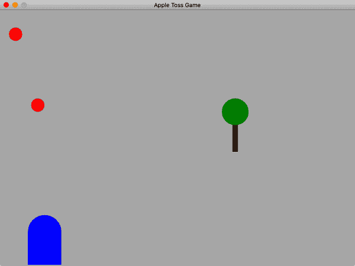

###### 图 5-10. 我们的第一个游戏类在操作中

本章的最后一个编码练习将帮助您入门。查看类中的注释。尝试调整一些东西。再添加一个树。更多的实践总是有好处的。在接下来的章节中，我们将继续构建这些类，因此熟悉它们如何配合将会更容易。

无论您如何组织类中的成员、包中的类或项目中的包，都将不得不处理错误。有些错误是您在编辑器中修复的简单语法错误。其他错误更有趣，可能只在程序实际运行时出现。下一章将涵盖 Java 对这些问题的概念，并帮助您处理它们。

## 复习问题

1.  Java 中的主要组织单位是什么？

1.  您使用什么运算符来从类创建对象（或实例）？

1.  Java 不支持经典的多重继承。Java 提供了哪些替代机制？

1.  如何组织多个相关类？

1.  如何在您自己的代码中包含来自其他包的类以供使用？

1.  如何称呼在另一个类的作用域内定义的类？这样的类在某些情况下有哪些有用的特征？

1.  如何称呼一个设计为被重写的方法，它有一个名称、返回类型和参数列表，但没有方法体？

1.  什么是重载方法？

1.  如果您希望确保没有其他类可以使用您定义的变量，应该使用哪种访问修饰符？

## 编码练习

1.  对于您的第一个编码实践，创建一个能够交流的小动物园。*ch05/exercises/Zoo.java* 文件包含了创建几种动物并让它们通过内部类“说话”的完整概述。首先，通过完成的`Lion`内部类的例子填写`Gibbon`类的`speak()`方法。当您编译并运行您的`Zoo`时，您应该看到类似这样的输出（当然，您自己的动物叫声）：

    ```java
    % cd ch05/exercises
    % javac Zoo.java
    % java Zoo
    Let&rsquo;s listen to some animals!
    The lion goes "roar"
    The gibbon goes "hoot"
    ```

1.  现在向动物园添加您自己的动物。创建一个类似于`Lion` 的新内部类。为您的动物填写适当的声音，并将它们添加到`listen()` 方法的输出部分。您的新输出将类似于：

    ```java
    % java Zoo
    Let&rsquo;s listen to some animals!
    The lion goes "roar"
    The gibbon goes "hoot"
    The seal goes "bark"
    ```

1.  让我们来清理一下`listen()`方法。我们目前为每个动物使用单独的`print()`和`println()`方法。如果我们添加另一个（或几个）动物，那将需要复制、粘贴和调整输出行——这些任务可能会引入错误。在`Animal`中添加另一个抽象方法称为`getSpecies()`。在子类中，此方法应返回动物的名称作为`String`，例如上面的“狮子”或“海豹”。

    有了这个方法，重构输出部分以将你的动物放入一个小数组中，然后使用循环生成输出。（可以编辑现有的`Zoo`类。我们的解决方案在一个新类`Zoo2`中，这样你可以查看这个问题的解决方案以及上一个练习的解决方案。）

1.  运行苹果投掷游戏。使用“自定义包”中讨论的步骤编译和运行*ch05/exercises/game*文件夹中的`ch05.exercises.game.AppleToss`类。

## 高级练习

1.  对于更高级的挑战，让我们通过创建一种新类型的障碍物来扩展我们的苹果投掷游戏。使用`Tree`类作为模板创建`Hedge`类。你可以将你的篱笆绘制为绿色的矩形。要绘制一个矩形：

    ```java
      public void paintComponent(Graphics g) {
        // x and y set the upper left corner
        g.fillRect(x,y,width,height);
      }
    ```

    在你的田野上添加一道篱笆。最终游戏应该看起来像图 5-11 那样。

    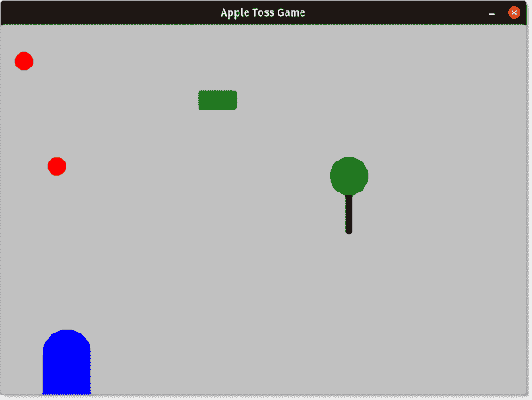

    ###### 图 5-11。我们田野上的新篱笆障碍物

我们将在整本书中继续扩展这个游戏，但现在请随意进行一些扩展。尝试绘制其他形状或更改当前元素的颜色。[在线文档](https://oreil.ly/_dhQy)`Graphics`类对你有所帮助。

¹ 一旦你对基本面向对象的概念有了一些经验，你可能想看看《*设计模式：可复用面向对象软件的基础*》（Addison-Wesley）由 Erich Gamma 等人编写。这本书总结了多年来得到改进的有用面向对象设计。许多这些模式出现在 Java API 的设计中。

² `char`也得到一个 0，但通常表示为空字符`\0`。`boolean`变量默认为`false`，引用类型默认为`null`。

³ 我们不深入讨论这些参数列表的细节，但如果你感兴趣并想自己阅读一些内容，请在网上搜索程序员术语“varargs”。

⁴ 原来`Math`类根本无法实例化。它仅包含静态方法。尝试调用`new Math()`将导致编译器错误。

⁵ 仍然有可能在 Java 中编写代码，无意中永久持有对象（我们确定是无意的），不断消耗更多的内存。这并不是一个内存泄漏，而更像是囤积。在 Java 中这种囤积通常比 C 中的内存泄漏更容易追踪。

⁶ Maven 已经在 Java 中改变了依赖管理的格局，甚至其他基于 JVM 的语言现在也可以找到像[Gradle](https://gradle.org)这样基于 Maven 成功的工具。

⁷ 请注意，设计我们的计算器的更好方式是拥有一个抽象的`Calculator`类，有两个独立的子类：`IntegerCalculator`和`DecimalCalculator`。

⁸ 鸭嘴兽是一个非常不寻常的产卵哺乳动物。我们可以在`Mammal`的子类中再次重写`Platypus`的`reproduce()`行为。

⁹ 在 Java 中，重写的方法就像 C++中的`virtual`方法一样。
