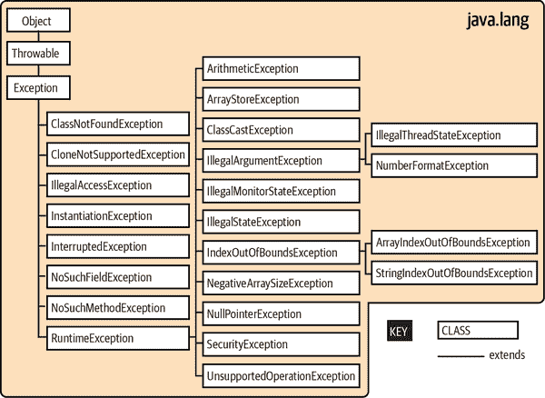
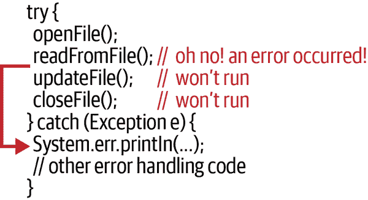
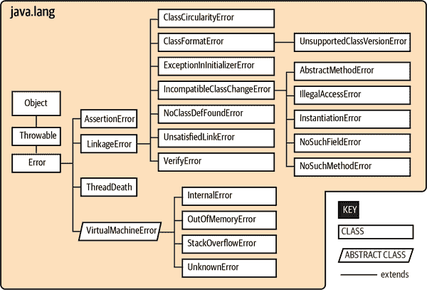
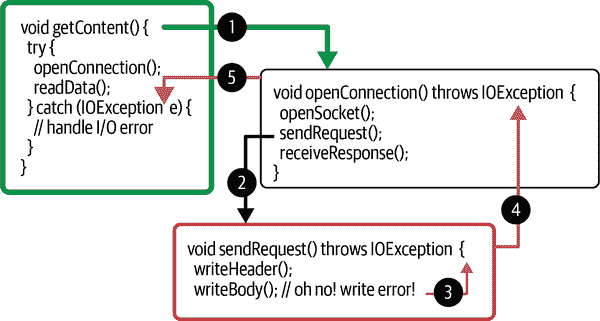

# 第六章 错误处理

在现实世界中，你总会遇到错误。你如何处理这些错误可以显示你代码的质量。

Java 的根源是嵌入式系统——运行在专用设备内部的软件，例如手持计算机、手机以及我们今天可能认为属于物联网（IoT）一部分的高级烤面包机。在这些应用中，稳健地处理软件错误尤为重要。大多数用户都认为，他们的手机经常崩溃或者他们的面包（甚至房子）因为某些软件故障而烧焦是不可接受的。鉴于我们无法消除软件错误的可能性，有条不紊地识别和处理应用级错误是朝正确方向迈出的良好步骤。

一些语言完全将处理错误的责任交给程序员。语言本身不提供帮助来识别错误类型，也没有简便的工具来处理它们。例如，在 C 语言中，函数通常通过返回一个“不合理”的值（如习惯上的 `-1` 或 `null`）来表示失败。作为程序员，你必须知道什么构成了一个糟糕的结果以及它意味着什么。在正常的数据流路径中传递错误值的限制通常让人感到尴尬。¹ 更糟糕的问题是，某些类型的错误几乎可以在任何地方合法地发生，而在软件的每个点显式测试它们是缓慢且昂贵的。

在本章中，我们将探讨 Java 如何处理问题。我们将讨论异常的概念，看看它们为何如何以及何时出现，以及如何在何处处理它们。我们还将研究错误和断言。*错误*是更严重的问题，通常在运行时无法修复，但仍可以记录以进行调试。*断言*是通过事先验证安全条件来使你的代码免受异常或错误的流行方法。

# 异常

Java 提供了一个优雅的解决方案，通过异常来帮助程序员解决常见的编码和运行时问题。（Java 异常处理与 C++ 中的异常处理类似，但并非完全相同。）*异常* 表示异常条件或错误条件。当问题发生时，运行时将控制（或“抛出”）到您代码中的一个特定指定的部分，该部分可以处理（或“捕获”）这种条件。通过这种方式，错误处理与程序的正常流程无关。我们不需要为所有方法返回特殊值；错误通过一个单独的机制处理。Java 可以在非常深的嵌套过程中传递控制并在需要时在单个位置处理错误，或者错误可以立即在其源头处理。一些标准的 Java 方法仍然返回特殊值，比如 `-1`，但这些通常仅限于期望和处理特殊值相对简单的情况。²

您必须指定方法可能抛出的任何已知异常，编译器会确保调用方法的代码处理它们。通过这种方式，Java 对方法可能产生的错误信息的处理与其参数和返回类型的重要性水平相同。您可能仍然决定忽略一些错误，但在 Java 中，您必须明确地这样做。（我们将讨论运行时异常和错误，这些异常不需要此显式声明。）

## 异常和错误类

异常由 `java.lang.Exception` 类及其子类的实例表示。`Exception` 的子类可以保存不同种类异常条件的专用信息（可能还有行为）。然而，它们更常见的是简单的“逻辑”子类，仅用于标识新的异常类型。Figure 6-1 展示了 `java.lang` 包中 `Exception` 的子类。它应该让你对异常如何组织有所感觉。大多数包定义它们自己的异常类型，这些类型通常是 `Exception` 本身或其重要子类 `RuntimeException` 的子类，我们马上会谈到。

例如，让我们看另一个重要的异常类：`java.io.IOException`。`IOException` 类扩展了 `Exception` 并且有许多自己的子类，用于典型的 I/O 问题，比如 `FileNotFoundException`。请注意类名是多么明确（和有用）。许多网络异常进一步扩展了 `IOException` —— 它们确实涉及输入和输出 —— 但按照惯例，像 `MalformedURLException` 这样的异常属于 `java.net` 包，与其他网络类一起。



###### 图 6-1\. `java.lang.Exception` 的子类

在出现错误条件的地方，运行时会创建一个`Exception`对象。它可以设计为包含描述异常条件所需的任何信息。它还包括用于调试的完整堆栈跟踪。*堆栈跟踪*是调用所有方法及其调用顺序的列表，从您的`main()`方法到抛出异常的地方（有时可能很冗长）。`Exception`对象作为参数传递到处理代码块，与控制流一起。这就是*抛出*和*捕获*这些术语的来源：`Exception`对象从代码的一个点抛出并在另一个点被捕获，执行恢复，如图 6-2 所示。



###### 图 6-2。异常发生时的控制流

Java 还为不可恢复错误定义了`java.lang.Error`类。`java.lang`包中`Error`的子类如图 6-3 所示。一个显著的`Error`类型是`AssertionError`，它被 Java 的`assert`语句（本章后面将更详细地介绍此语句）用来指示失败。其他一些包定义了它们自己的`Error`子类，但是`Error`的子类比`Exception`的子类要少得多（也不太有用）。通常情况下，您不需要在代码中担心这些错误；它们旨在指示致命问题或虚拟机错误，通常会导致 Java 解释器显示消息并退出。Java 的设计人员积极不鼓励开发人员尝试捕获或恢复这些错误，因为它们应该指示一个致命的程序错误，可能是在 JVM 本身中而不是常规情况中。

`Exception`和`Error`都是`Throwable`的子类。`Throwable`类是可以使用`throw`语句“抛出”的对象的基类。虽然你在技术上可以扩展`Throwable`自己，但如果你想创建自己的可抛出类型，通常应该只扩展`Exception`、`Error`或它们的某个子类。



###### 图 6-3。`java.lang.Error`的子类

## 异常处理

要捕获和处理斜体文本例外，您可以将代码块包装在`try/catch`守卫语句中：

```java
    try {
      readFromFile("foo");
      // do other file things ...
    } catch (Exception e) {
      // Handle error
      System.out.println("Exception while reading file: " + e);
    }
```

在这个示例中，任何发生在`try`语句块内部的异常都会被传递到`catch`子句以进行可能的处理。`catch`子句的作用类似于一个方法；它指定了它想要处理的异常类型。如果被调用，该子句会接收`Exception`对象作为参数。在这里，我们将对象赋给变量`e`，并打印出来以及相应的消息。

我们可以自己尝试一下。回想一下使用欧几里得算法计算最大公约数（GCD）的简单程序，这是在第四章中完成的。我们可以增强该程序，允许用户通过`main()`方法中的`args[]`数组将两个数字`a`和`b`作为命令行参数传递。然而，该数组是`String`类型的。如果我们稍微作弊，从“解析基本数字”中借用一些代码，我们可以使用文本解析方法将这些字符串转换为`int`值。然而，如果我们未传递有效数字，该解析方法可能会抛出异常。这里是我们新的`Euclid2`类的样子：

```java
public class Euclid2 {
  public static void main(String args[]) {
    int a = 2701;
    int b = 222;
    // Only try to parse arguments if we have exactly 2
    if (args.length == 2) {
      try {
        a = Integer.parseInt(args[0]);
        b = Integer.parseInt(args[1]);
      } catch (NumberFormatException nfe) {
        System.err.println("Arguments were not both numbers.");
        System.err.println("Using defaults.");
      }
    } else {
      System.err.print("Wrong number of arguments");
      System.err.println(" expected 2).");
      System.err.println("Using defaults.");
    }
    System.out.print("The GCD of " + a + " and " + b + " is ");
    while (b != 0) {
      if (a > b) {
        a = a - b;
      } else {
        b = b - a;
      }
    }
    System.out.println(a);
  }
}
```

请注意，我们仅将`try/catch`限制为潜在有问题的代码。在方法中看到几个不同的`try/catch`块是很常见的。这个小范围允许我们更好地将`catch`块中的代码调整为我们预期的任何问题。在这种情况下，我们知道可能会从用户那里得到一些不良输入，因此我们可以检查非常具体的`NumberFormatException`并为用户打印友好的消息。

如果我们从终端窗口运行此程序或在 IDE 中使用命令行参数选项，就像我们在图 2-10 中所做的那样，我们现在可以在不重新编译的情况下找到多个数对的 GCD。

```java
$ javac ch06/examples/Euclid2.java
$ java ch06.examples.Euclid2
The GCD of 18 and 6 is 6

$ java ch06.examples.Euclid2 547832 2798
The GCD of 547832 and 2798 is 2
```

但是，如果我们传入的参数不是数字，我们将得到`NumberFormatException`并看到我们的错误消息。但是，请注意，我们的代码可以优雅地恢复并仍然提供一些输出。这种恢复是错误处理的本质：

```java
$ java ch06.examples.Euclid2 apples oranges
Arguments were not both numbers.
Using defaults.
The GCD of 2701 and 222 is 37
```

`try`语句可以有多个指定不同类型（子类）的`Exception`的`catch`子句：

```java
    try {
      readFromFile("foo");
      // do any other file things
    } catch (FileNotFoundException e) {
      // Handle file not found
    } catch (IOException e) {
      // Handle read error
    } catch (Exception e) {
      // Handle all other errors
    }
```

`catch`子句按顺序评估，并且 Java 选择第一个可分配的匹配项。最多只执行一个`catch`子句，这意味着异常应该从最具体到最通用进行列出。在前面的示例中，我们预期假设的`readFromFile()`方法可能会抛出两种不同类型的异常：一种是文件未找到，另一种是更一般的读取错误。也许文件存在，但我们没有权限打开它。`FileNotFoundException`是`IOException`的子类，因此如果我们交换了前两个`catch`子句，更通用的`IOException`子句将捕获缺少文件异常。

如果完全颠倒`catch`子句的顺序会怎样？您可以将`Exception`的任何子类分配给父类型`Exception`，因此该子句捕获*每个*异常。如果您使用类型为`Exception`的`catch`，请始终将其放置在可能的最后一个子句中。它的作用类似于`switch`语句中的`default`情况，并处理任何剩余可能性。

`try/catch` 方案的一个优点是，`try` 块中的任何语句都可以假定该块中的所有前面语句都成功执行了。不会因为忘记检查方法的返回值而突然出现问题。如果早期语句失败，执行立即跳转到 `catch` 子句；`try` 内部的后续语句将不会执行。

使用多个 `catch` 子句的另一种选择是使用单个 `catch` 子句处理多个离散的异常类型，使用 *或语法*（使用管道字符“|”写成）：

```java
    try {
      // read from network...
      // write to file..
    } catch (ZipException | SSLException e) {
      logException(e);
    }
```

使用这种“|”语法，我们可以在同一个 `catch` 子句中接收两种类型的异常。

我们传递给日志方法的 `e` 变量的实际类型是什么？我们可以对它做什么？在这种情况下，`e` 的类型既不是 `ZipException` 也不是 `SSLException`，而是 `IOException`，它是这两种异常的最近公共祖先（它们都可以分配到的最近的父类类型）。在许多情况下，两个或多个参数异常类型之间的最近公共类型可能只是 `Exception`，所有异常类型的父类。

使用多类型 `catch` 子句捕获这些离散异常类型与仅捕获共同父异常类型的区别在于，我们将 `catch` 限制为仅这些特定枚举的异常类型。我们不会捕获任何其他 `IOException` 类型。将多类型 `catch` 子句与按照特定到广泛类型的顺序排列结合使用，可以在处理异常时提供很大的灵活性。在适当的情况下，您可以合并错误处理逻辑并避免重复代码。此功能还有更多细微差别，我们在讨论“抛出”和“重新抛出”异常后将返回这个话题。

## 冒泡上升

如果我们没有捕获异常会怎么样？它会去哪里？如果没有包围的 `try/catch` 语句，异常会从它产生的方法中弹出（停止该方法的进一步执行），并从该方法中抛出到其调用者。如果调用方法有 `try` 子句，控制将传递给相应的 `catch` 子句。否则，异常会继续向上传播到调用堆栈中的上一方法。异常会一直冒泡直到被捕获，或者直到从程序顶部弹出并以运行时错误消息终止程序。有时情况可能更为复杂；编译器可能会强制你在途中处理异常。“已检查和未检查的异常”更详细地讨论了这种区别。

让我们看另一个例子。在 图 6-4 中，方法 `getContent()` 在 `try/catch` 语句内调用方法 `openConnection()`（图中步骤 1）。然后，`openConnection()` 调用方法 `sendRequest()`（步骤 2），后者调用方法 `write()` 以发送一些数据。



###### 图 6-4\. 异常传播

在这个图中，第二次调用`write()`抛出了一个`IOException`（步骤 3）。由于`sendRequest()`方法中没有`try/catch`语句来处理这个异常，它会再次从调用它的`openConnection()`方法（步骤 4）抛出。但是`openConnection()`也没有捕获这个异常，所以它会再次被抛出（步骤 5）。最后，它被`getContent()`方法中的`try`语句捕获，并由其`catch`子句处理。请注意，每个可能抛出异常的方法必须使用`throws`子句声明可以抛出特定类型的异常。我们将在“检查异常和未检查异常”中讨论这个问题。

在代码的早期添加一个高级别的`try`语句也可以帮助处理可能从后台线程冒出的错误。我们将在第九章中详细讨论线程，但是在更大更复杂的程序中，未捕获的异常可能导致调试困难。

## 堆栈跟踪

因为异常可能在被捕获和处理之前冒出相当长的距离，我们需要一种方法来确定它被抛出的确切位置。了解到问题代码是如何被触发的也很重要。哪些方法调用了哪些其他方法来到达这一点？对于调试，所有异常都可以通过打印它们的*堆栈跟踪*来列出它们的起源方法以及它们到达那里所经历的所有嵌套方法调用。当用户使用`printStackTrace()`方法打印堆栈跟踪时，最常见的是看到一个堆栈跟踪：

```java
    try {
      // complex, deeply nested task
    } catch (Exception e) {
      // dump information about where the exception occurred
      e.printStackTrace(System.err);
    }
```

这样的异常堆栈跟踪可能看起来像这样：

```java
java.io.FileNotFoundException: myfile.xml
      at java.io.FileInputStream.<init>(FileInputStream.java)
      at java.io.FileInputStream.<init>(FileInputStream.java)
      at MyApplication.loadFile(MyApplication.java:137)
      at MyApplication.main(MyApplication.java:5)
```

此堆栈跟踪指示在`MyApplication`类的`main()`方法的第 5 行（在您的源代码中）调用了`loadFile()`方法。然后，`loadFile()`方法尝试在第 137 行构造`FileInputStream`，它抛出了`FileNotFound``Exception`异常。

一旦堆栈跟踪到达 Java 系统类（如`FileInputStream`），行号可能会丢失。如果代码已经优化，也可能会发生这种情况。通常可以通过暂时禁用优化来找到确切的行号，但有时可能需要其他调试技术。我们将在本章后面讨论许多这些技术。

`Throwable`类中的方法允许您通过使用`getStackTrace()`方法以编程方式检索堆栈跟踪信息。（回想一下，`Throwable`是`Exception`和`Error`的父类。）该方法返回一个`StackTraceElement`对象数组，每个对象表示堆栈上的一个方法调用。您可以使用`getFileName()`、`getClassName()`、`getMethodName()`和`getLineNumber()`方法询问`StackTraceElement`关于该方法位置的详细信息。数组的第一个元素是堆栈的顶部，导致异常的最后一行代码；随后的元素逐步回退到原始`main()`方法，直到最后一个元素。

## 检查异常和未检查异常

我们之前提到过，Java 要求我们明确地处理错误，但并不需要在每种情况下都要求明确处理每种可能的错误类型。因此，Java 异常被分为两类：*已检查*和*未检查*。大多数应用程序级异常都是已检查的，这意味着任何抛出它的方法必须在其定义中用特殊的`throws`子句声明它，如下所示：

```java
  void readFile(String s) throws IOException, InterruptedException {
    // do some I/O work, maybe using threads for background processing
  }
```

我们的`readFile()`方法预计会抛出两种类型的异常：通过自身生成异常（正如我们将在“抛出异常”中讨论的那样），以及忽略在其内部发生的异常。目前，你只需知道方法必须声明其可能抛出或允许抛出的已检查异常。

`throws`子句告诉编译器，方法可能是该类型已检查异常的来源，并且调用该方法的任何人必须准备好处理它。然后，调用者必须使用`try/catch`块处理它，或者反过来，声明自己可以从自身抛出异常。

相反，属于`java.lang.RuntimeException`类或`java.lang.Error`类的子类的异常是未检查的。请参见图 6-1，了解`RuntimeException`的子类。忽略这些异常的可能性不是编译时错误；方法也不必声明它们可能会抛出它们。在其他方面，未检查异常的行为与其他异常相同。您可以选择捕获它们，但在这种情况下，您不是必须的。

已检查异常旨在涵盖应用程序级问题，例如丢失文件和不可用网络主机。作为优秀的程序员（和正直的公民），我们应该设计软件，从这些类型的情况中优雅地恢复。未检查异常旨在处理系统级问题，例如“数组索引超出范围”。虽然这些可能表明应用程序级编程错误，但它们几乎可以在任何地方发生。幸运的是，因为它们是未检查异常，你不必在每一个数组操作中都包装一个`try/catch`语句，也不必声明所有调用方法都可能是它们的来源。

总结一下，已检查异常是合理的应用程序应尝试优雅处理的问题。未检查异常（运行时异常或错误）是我们不希望软件通常能够恢复的问题，但您可以向用户提供礼貌且希望有用的消息，说明发生了什么。错误类型，例如“内存不足”错误，是我们通常无法从中恢复的条件。

## 抛出异常

我们可以抛出自己的异常——可以是`Exception`的实例，它的一个现有子类，或我们自己的专门异常类。我们所需做的就是创建适当异常类的实例，并用`throw`语句抛出它：

```java
    throw new IOException();
```

执行会停止，并转移到最接近的封闭的`try/catch`语句，该语句能够处理异常类型。请注意，我们没有将新异常放入变量中。在这里，保留对我们创建的`IOException`对象的引用没有多少意义，因为`throw`语句会立即停止当前代码的执行流程。

异常的另一种构造方法允许我们指定带有错误消息的字符串：

```java
    throw new IOException("Sunspots!");
```

您可以通过使用`Exception`对象的`getMessage()`方法来检索此字符串。不过，通常情况下，您可以直接打印异常对象本身以获取消息和堆栈跟踪信息。

按照惯例，所有类型的`Exception`都有一个像这样的`String`构造函数。“太阳黑子！”消息是异想天开的，但并不是非常有用。通常情况下，您会抛出一个更具体的`Exception`子类，它捕获关于故障的额外细节或至少提供更有用的字符串解释。这里是另一个例子：

```java
  public void checkRead(String s) throws SecurityException {
    // ...
    if (new File(s).isAbsolute() || (s.indexOf("..") != -1))
      throw new SecurityException(
          "Access to file : "+ s +" denied.");
    // ...
  }
```

在这段代码中，我们部分实现了一个检查非法路径的方法。如果找到了一个，我们会抛出一个带有关于违规行为的一些信息的`SecurityException`。

当然，我们可以在`Exception`的专门子类中包含任何其他有用的信息。不过，通常情况下，仅仅有一个新类型的异常已经足够了，因为它足以帮助控制流程。例如，如果我们正在构建一个程序来读取和解析网页的内容，我们可能希望制作我们自己的异常类型来指示特定的失败：

```java
class ParseException extends Exception {
  private int lineNumber;

  ParseException() {
    super();
    this.lineNumber = -1;
  }

  ParseException(String desc, int lineNumber) {
    super(desc);
    this.lineNumber = lineNumber;
  }

  public int getLineNumber() {
    return lineNumber;
  }
}
```

请参见“构造函数”以获取有关类和类构造函数的完整描述。我们这里的`Exception`类体简单地允许按照传统方式（通用或带有少量额外信息）创建`ParseException`。现在我们有了我们的新异常类型，我们可以防范像这样任何格式不当的内容：

```java
    // Get some input from a file and parse it
    try {
      parseStream(input);
    } catch (ParseException pe) {
      // Bad input... We can even tell them which line was bad!
      System.err.println("Bad input on line " + pe.getLineNumber());
    } catch (IOException ioe) {
      // Other, low-level communications problem
    }
```

即使没有特殊信息（比如我们的输入导致问题的行号），我们的自定义异常也能让我们区分解析错误和同一段代码中的其他 I/O 错误。

### 异常的链接和重新抛出

有时，您会希望根据异常采取一些操作，然后立即抛出一个新的异常。在构建处理低级详细异常并由更易于管理的高级异常表示的框架时，这是常见的做法。例如，您可能想在通信包中捕获`IOException`，可能执行一些清理工作，然后抛出自己的高级异常，也许类似于`LostServerConnection`。

您可以通过简单捕获异常然后抛出新异常的方式来完成这一点，但是这样会丢失重要信息，包括原始“因果”异常的堆栈跟踪。为了处理这个问题，您可以使用*异常链*技术。这意味着您在抛出的新异常中包含原因异常。Java 明确支持异常链。基本的`Exception`类可以用异常作为参数或标准的`String`消息和异常来构造：

```java
    throw new Exception("Here's the story...", causalException);
```

您可以稍后使用`getCause()`方法访问包装的异常。更重要的是，如果打印异常或向用户显示异常，Java 会自动打印两个异常及其各自的堆栈跟踪。

您可以在自己的异常子类中添加这种构造方法（委托给父构造函数）。您还可以通过在构造自己的异常后并在抛出异常之前使用`Throwable`方法`initCause()`显式设置因果异常来利用此模式：

```java
    try {
      // ...
    } catch (IOException cause) {
      Exception e =
        new IOException("What we have here is a failure to communicate...");
      e.initCause(cause);
      throw e;
    }
```

有时仅需执行一些日志记录或采取一些中间操作，然后重新抛出原始异常即可：

```java
    try {
      // ...
    } catch (IOException cause) {
      log(cause); // Log it
      throw cause;  // re-throw it
    }
```

当异常中不包含足够的信息来进行本地处理时，您会看到这种模式出现。您可以利用可用的信息做些事情（比如在调试期间打印错误消息以帮助），但是您没有足够的信息来解决问题。您必须传递异常，并希望某个资源更丰富的调用方法知道该怎么做。

## 尝试蠕动

`try`语句对它保护的语句施加了一个条件。它表示如果其中发生异常，剩余的语句将被放弃。这对局部变量初始化有影响。如果编译器无法确定放置在`try/catch`块内的局部变量赋值是否会发生，它就不会允许我们使用该变量。例如：

```java
  void myMethod() {
    int foo;

    try {
      foo = getResults();
    }
    catch (Exception e) {
      // handle our exception ...
    }

    int bar = foo; // Compile-time error: foo may not have been initialized
  }
```

在这个示例中，我们无法在指定的地方使用`foo`，因为有可能从未给它赋值。一种选择是将`bar`的赋值移到`try`语句内部：

```java
    try {
      foo = getResults();
      int bar = foo;  // Okay because we get here only
                      // if previous assignment succeeds
    }
    catch (Exception e) {
      // handle our exception ...
    }
```

有时这样做效果很好。然而，如果我们稍后在`myMethod()`中想使用`bar`，我们就会遇到同样的问题。如果不小心的话，我们可能会将所有内容都引入到`try`语句中。然而，如果在`catch`子句中控制方法的传递，情况就会发生变化：

```java
    try {
      foo = getResults();
    }
    catch (Exception e) {
      // log our exception or show the user a warning message
      return;
    }
    int bar = foo;  // Okay because we get here only
                    // if previous try block succeeds
```

编译器足够聪明，知道如果`try`子句中发生错误，我们就不会达到`bar`赋值，因此允许我们引用`foo`。您的代码可能有不同的要求；我们只是希望您意识到这些选项。

## 最终子句

如果我们在一个 `catch` 子句中退出方法之前有重要的事情要做怎么办？为了避免在每个 `catch` 分支中重复代码并使清理更加明确，您可以使用 `finally` 子句。 `finally` 子句可以在 `try` 块及其相关的 `catch` 子句之后添加。 `finally` 子句体中的任何语句都保证会在控制权离开 `try` 体时执行，无论是否抛出异常：

```java
    try {
      // Do something here
    }
    catch (FileNotFoundException e) {
      // handle a missing file ...
    }
    catch (IOException e) {
      // handle other file problems ...
    }
    catch (Exception e) {
      // eek, handle even bigger problems ...
    }
    finally {
      // Any cleanup here is always executed
    }
```

在此示例中，清理点处的语句最终会被执行，无论控制权如何离开 `try`。如果控制权转移到 `catch` 子句之一，则在 `catch` 完成后执行 `finally` 中的语句。如果没有 `catch` 子句处理异常，则在异常传播到下一级之前执行 `finally` 中的语句。

即使 `try` 中的语句执行干净，或者我们执行 `return`、`break` 或 `continue`，`finally` 子句中的语句仍然会执行。为了保证某些操作将运行，我们甚至可以在没有任何 `catch` 子句的情况下使用 `try` 和 `finally`：

```java
    try {
      // Do something here that might cause an exception
      return;
    } finally {
      System.out.println("Whoo-hoo!");
    }
```

发生在 `catch` 或 `finally` 子句中的异常会被正常处理；在执行 `finally` 之后，搜索包围异常 `try/catch` 的范围开始于异常 `try` 语句之外。

## 使用资源的尝试

`finally` 子句的一个常见用途是确保清理 `try` 子句中使用的资源，无论代码如何退出该块。考虑打开网络套接字（有关详细信息，请参见 第十三章）：

```java
    try {
      Socket sock = new Socket(...);
      // work with the socket
    } catch(IOException e) {
      // handle our network problem ...
    } finally {
      if (sock != null) { sock.close(); }
    }
```

这里所说的“清理”是指释放昂贵的资源或关闭与诸如文件、网络套接字或数据库等事物的连接。在某些情况下，这些资源可能会在 Java 回收垃圾时自动清理，但最好的情况是，这将在未来的某个未知时间发生。在最坏的情况下，清理可能永远不会发生，或者可能在您耗尽资源之前不会发生。您应该始终防范这些情况。

然而，在现实世界中，保持对这种资源分配的控制存在两个问题。首先，需要额外的工作来在所有代码中执行正确的清理模式，包括重要的事项，如我们的假设示例中所示的空值检查。其次，如果您在单个 `finally` 块中操作多个资源，您的清理代码本身可能会引发异常（例如，在 `close()` 上），并且使工作未完成。

“使用资源的尝试”形式的 `try` 子句可以帮助。在这种扩展形式中，您在 `try` 关键字后的括号中放置一个或多个资源初始化语句。当控制权离开 `try` 块时，这些资源将自动“关闭”：

```java
    try (
      Socket sock = new Socket("192.168.100.1", 80);
      FileWriter file = new FileWriter("foo");
    )
    {
      // work with sock and file
    } catch (IOException e) {
      // ...
    }
    // Both sock and file have been cleaned up by this point
```

在此示例中，我们在`try-with-resources`子句中初始化了一个`Socket`对象和一个`FileWriter`对象，并且可以在`try`语句的主体中使用它们。当控制离开`try`语句时，无论是因为成功完成还是因为异常，Java 都会通过调用它们各自的`close()`方法自动关闭这两个资源。Java 按你构造它们的相反顺序关闭这些资源，因此你可以适应它们之间的任何依赖关系。

Java 支持任何实现了`AutoCloseable`接口的类的此行为（目前超过一百种不同的内置类实现了该接口）。该接口的`close()`方法被规定用于释放与对象相关联的所有资源，并且你也可以轻松地在自己的类中实现这一点。现在，使用`try-with-resources`时，我们不必专门添加任何代码来关闭文件或套接字；它会自动完成。

`try-with-resources`解决的另一个问题是在关闭操作期间抛出异常的麻烦情况。回顾我们在先前示例中使用`finally`子句进行清理的情况，如果`close()`方法引发了异常，新异常将在那一点抛出，完全放弃`try`子句体中的原始异常。但是`try-with-resources`保留了原始异常。如果在`try`体内发生异常，并且在随后的自动关闭操作中引发了一个或多个异常，将是`try`体中的原始异常将向上传递给调用方。让我们看一个例子：

```java
    try (
      // potential exception #3
      Socket sock = new Socket("192.168.100.1", 80);
      // potential exception #2
      FileWriter file = new FileWriter("foo");
    )
    {
      // work with sock and file // potential exception #1
    }
```

一旦`try`块开始执行，如果在异常点#1 处发生异常，Java 将尝试按相反的顺序关闭两个资源，导致可能在位置#2 和#3 出现异常。在这种情况下，调用代码仍将接收到异常#1。然而，异常#2 和#3 并未丢失；它们仅仅是“抑制”了。你可以通过抛出给调用方的异常的`getSuppressed()`方法来检索它们。此方法返回所有被抑制的异常的数组。

## 性能问题

由于 Java 虚拟机的实现方式，使用`try`块来防范抛出异常是免费的，这意味着它不会增加代码的执行开销。然而，抛出异常是不免费的。当抛出异常时，Java 必须定位适当的`try/catch`块，并在运行时执行其他耗时的活动。

这就是为什么你应该只在真正的“异常”情况下抛出异常，并避免在预期的条件下使用它们，特别是在性能是一个问题时。例如，如果你有一个循环，每次通过可能更好地执行一次小的测试，并避免`try`块，而不是在循环运行过程中可能多次抛出异常。另一方面，如果异常只在亿万次中抛出一次，你可能希望消除小测试的开销，并且不必担心抛出那个非常罕见异常的成本。一般的规则应该是异常用于异常情况，而不是例行或预期条件（比如文件结束或缺少的网络资源）。

# 断言

Java 支持断言（assertions）作为验证程序状态的另一种机制。*断言* 是在应用程序运行时执行的一种简单的通过/失败测试某些条件的方式。你可以使用断言来“健全检查”你的代码。断言与其他类型的测试不同，因为它们检查在逻辑层面上不应该被违反的条件：如果断言失败，意味着你编写的某些代码未能完成其工作，应用程序通常会以适当的错误消息停止运行。Java 语言直接支持断言，并且可以在运行时打开或关闭它们，以消除将其包含在代码中带来的任何性能损失。

使用断言来测试应用程序的正确行为是一种简单但强大的技术，用于确保软件质量。它填补了编译器可以自动检查的软件方面与那些由“单元测试”或人工测试更普遍检查的方面之间的空白。断言测试你对程序行为的假设，并将这些假设转化为保证（至少在激活断言时是这样）。

如果你以前有编程经验，可能见过类似以下的内容：³

```java
    if (!condition)
      throw new AssertionError("fatal error: 42");
```

在 Java 中，断言等同于这个例子，但你使用`assert`关键字。它接受一个布尔条件和一个可选的表达式值。如果断言失败，将抛出`AssertionError`，通常导致 Java 应用程序停止运行。中止应用程序的想法是，断言失败揭示了代码中的逻辑缺陷，作为程序员，你有责任找出并修复这个缺陷。

可选表达式可以评估为原始值或对象类型。无论哪种方式，它的唯一目的是将其转换为字符串，并在断言失败时显示给用户。通常情况下，你会显式地使用一个字符串消息。以下是一些示例：

```java
    assert false;
    assert (array.length > min);
    assert a > 0 : a  // shows value of a to the user
    assert foo != null :  "foo is null!" // shows message "foo is null!" to user
```

在失败的情况下，前两个断言仅打印一个通用消息。第三个打印`a`的值，最后一个打印`foo is null!`消息。

断言的重要之处不仅在于它们比等效的`if`条件更简洁，而且你可以在运行应用程序时启用或禁用它们。禁用断言意味着它们的测试条件甚至不会被评估，因此在你的代码中包含它们不会产生性能惩罚（除了在加载时可能仍然占用一小部分类文件空间之外）。

## 启用和禁用断言

你可以在运行时打开或关闭断言。当禁用时，断言仍然存在于类文件中，但不会被执行，也不会消耗 CPU 时间。你可以为整个应用程序、按包或甚至按类启用和禁用断言。请记住，断言是为了*你*在开发过程中的理智检查而设计的。它们通常不是为了被你的最终用户所看到。在你开发项目时使用它们，但在“生产”中禁用它们是一种常见的策略。

在 Java 中，默认情况下，断言是关闭的。要为你的代码启用它们，请使用`java`命令标志`-ea`或`-enableassertions`：

```java
% java -ea MyApplication
```

要为特定类启用断言，请附加类名：

```java
% java -ea:com.oreilly.examples.Myclass MyApplication
```

要仅为特定包启用断言，附加包名称后跟省略号（…​）：

```java
% java -ea:com.oreilly.examples... MyApplication
```

当你为一个包启用断言时，Java 还会启用所有下级包的断言（例如，`com.oreilly.examples.text`）。然而，你可以通过使用相应的`-da`或`-disableassertions`标志来对个别包或类进行否定，以实现更有选择性的操作。你可以将所有这些组合起来，实现任意分组，就像这样：

```java
% java -ea:com.oreilly.examples... \
    -da:com.oreilly.examples.text \
    -ea:com.oreilly.examples.text.MonkeyTypewriters \
    MyApplication
```

此示例为整个`com.oreilly.examples`包启用了断言，排除了包`com.oreilly.examples.text`，但然后为该包中的`MonkeyTypewriters`类启用了异常。

## 使用断言

断言是对代码中应该稳定的事物的规则的强制执行，否则这些事物将不会被检查。你可以在任何想要验证编译器可能无法检查的程序行为假设的地方使用断言来增加安全性。

一个常见的情况是测试多个条件或值，其中应始终找到一个。在这种情况下，作为默认或“穿透”行为的断言失败表明代码有问题。例如，假设我们有一个称为`direction`的值，它应始终包含两个常量之一，`LEFT`或`RIGHT`：

```java
    if (direction == LEFT)
      goLeft();
    else if (direction == RIGHT)
      goRight()
    else
      assert false : "bad direction";
```

对于开关的默认情况也是一样的：

```java
    switch (direction) {
      case LEFT:
        goLeft();
        break;
      case RIGHT:
        goRight();
        break;
      default:
        assert false;
    }
```

一般来说，您不应该使用断言来检查方法的参数有效性。您希望这种验证行为成为应用程序的一部分，而不仅仅是可以关闭的质量控制测试。方法需要有效的输入作为其*前置条件*的一部分，如果未满足任何前置条件，通常应该抛出异常。使用异常将前置条件提升为方法与用户之间的“合同”一部分。然而，在返回结果之前使用断言检查方法的正确性是有用的。这些封装检查被称为*后置条件*。

有时候确定什么是前置条件或者不是前置条件取决于您的观点。例如，当一个方法在类内部使用时，其前置条件可能已由调用它的方法保证。类的公共方法在违反前置条件时可能会抛出异常，但私有方法可能使用断言，因为它们的调用者总是与正确行为密切相关的代码。

# 真实世界的异常

Java 采用异常作为错误处理技术，使得开发者编写健壮代码变得更加简单。编译器强制您提前考虑检查异常。未经检查的异常肯定会出现，但断言可以帮助您注意这些运行时问题，希望能够避免崩溃。

使用 try-with-resources 功能使开发者在处理有限系统资源（如文件和网络连接）时更加简洁和“正确”。正如我们在本章开头提到的，其他语言当然也有处理这些问题的设施或习惯。作为一种语言，Java 努力帮助您深思熟虑代码中可能出现的问题。您越是解决这些问题，您的应用程序（以及您的用户）就会更加稳定。

到目前为止，我们的许多示例都很直接，并且实际上并不需要任何复杂的错误检查。请放心，我们将探讨更多需要异常处理的有趣代码。后续章节将涵盖多线程编程和网络编程等主题。这些主题充满了可能在运行时出现问题的情况，例如大型计算失控或 WiFi 连接断开。原谅这句双关语，但您很快就会学习到所有这些新的异常技巧！

## 复习问题

1.  在您的代码中管理潜在异常时，应该使用哪个语句？

1.  编译器在哪些异常情况下要求您处理或抛出？

1.  在 `try` 块中使用后，您应该将任何清理代码放在哪里？

1.  当禁用时，断言会对性能产生多大的影响？

## 代码练习

1.  *Pause.java*程序位于*ch06/exercises*文件夹中，无法编译。它使用了`Thread.sleep()`方法来暂停程序五秒钟。这个`sleep()`方法可能会抛出一个已检查异常。修复程序使其能够编译和运行。（我们将在第九章中更深入地学习线程和`Thread.sleep()`。）

1.  练习包括我们在第二章中另一个“Hello, World”程序的变体，名为`HelloZero`。使用断言确保图形消息的初始 x 和 y 坐标大于零。

    尝试运行程序并启用断言。如果将负数赋值给其中一个坐标，会发生什么？再次运行程序，但不要禁用断言。（记住，“禁用”是默认行为，所以只需不启用它们。）在这种情况下会发生什么？

## 高级练习

1.  假设最大公约数（GCD）为 1 是一个错误情况，我们需要标记它。创建一个名为`Euclid3`的新类，它将执行查找 GCD 的常规工作，但如果公约数为 1，则会抛出异常。（可以从其他欧几里得类中复制开始。）创建一个名为`GCDException`的自定义异常类，将导致异常的数字对作为异常的详细信息存储起来。

    修改`Euclid3`以测试是否存在最大公约数为 1，并在结果为 1 时抛出新的`GCDException`异常。（提供两个素数是确保结果为 1 的快速方法。）

    在添加任何异常处理代码之前，请尝试编译。*javac*是否提醒您有异常？应该会！继续添加`try/catch`保护或编辑`main()`方法的定义以抛出异常。如果您处理了新的异常，请确保向用户输出包含捕获异常中“坏”数字的友好错误消息。

¹ 在 C 语言中，有些相对晦涩的`setjmp()`和`longjmp()`语句可以保存代码执行的点，并能从深埋的位置无条件地返回到该点。从某种有限的意义上来说，这正是我们在本章中探讨的 Java 异常的功能。

² 例如，AWT `Image` 类的`getHeight()`方法如果高度尚未知晓，则返回`-1`。这并不表示发生了错误；一旦图像加载完成，高度将会得到更新。在这种情况下，抛出异常会显得过度，并可能影响性能。

³ 如果您已经做过一些编程，希望您的错误消息不会像这样难以理解！错误消息越有帮助和解释性，就越好。
