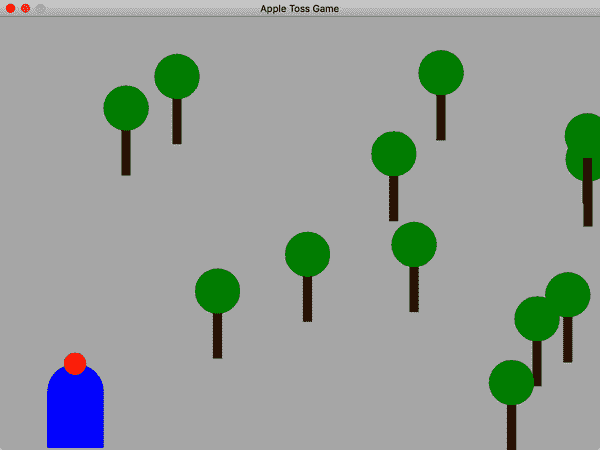

# 第八章 文本和核心实用程序

如果你按顺序阅读本书，你已经学习了所有关于核心 Java 语言构造的内容，包括语言的面向对象方面和线程的使用。现在是时候转变思路，开始讨论组成标准 Java 包并随每个 Java 实现提供的类集合了。Java 的核心包是其最显著的特点之一。许多其他面向对象的语言具有类似的功能，但没有一个像 Java 那样拥有如此广泛的标准化类和工具集。这既是 Java 成功的反映，也是其成功的原因之一。

# 字符串

我们将首先仔细查看 Java 的`String`类（更具体地说是`java.lang.String`）。因为与`String`一起工作如此基础，了解它们的实现方式及其可执行的操作是非常重要的。`String`对象封装了一系列 Unicode 字符。在内部，这些字符存储在常规的 Java 数组中，但`String`对象嫉妒地保护这个数组，并且只能通过其自己的 API 访问它。这是为了支持`String`是不可变的想法；一旦创建了`String`对象，就无法更改其值。对`String`对象的许多操作似乎会改变字符串的字符或长度，但实际上它们只是返回一个新的`String`对象，该对象复制或内部引用原始所需的字符。Java 实现会努力将在同一类中使用的相同字符串合并为共享字符串池，并在可能的情况下共享`String`的部分。

所有这一切最初的动机都是性能。不可变的`String`可以节省内存，并且 Java 虚拟机可以优化它们的使用以提高速度。但它们并非神奇。为了避免在性能受到影响的地方创建过多的`String`对象，您应该对`String`类有基本的理解。^(1)

## 构造字符串

字面字符串在源代码中用双引号定义，并可以分配给`String`变量：

```java
    String quote = "To be or not to be";
```

Java 会自动将字面字符串转换为`String`对象，并将其分配给变量。

`String`对象在 Java 中跟踪其自身的长度，因此不需要特殊的终止符。您可以使用`length()`方法获取`String`的长度。您还可以通过使用`isEmpty()`测试零长度字符串：

```java
    int length = quote.length();
    boolean empty = quote.isEmpty();
```

`String`可以利用 Java 中唯一的重载运算符`+`进行字符串连接。以下两行产生的字符串是等效的：

```java
    String name = "John " + "Smith";
    // or, equivalently:
    String name = "John ".concat("Smith");
```

对于大于一个名称的文本块，Java 13 引入了文本块。我们可以通过使用三个双引号来标记多行块的开始和结束，轻松存储一首诗。这个特性甚至以聪明的方式保留了前导空格：最左边的非空格字符成为左侧的“边缘”。在后续行中，在该边缘左侧的空格将被忽略，但该边缘后面的空格将被保留。考虑在*jshell*中重新制作我们的诗：

```java
jshell> String poem = """
   ...> Twas brillig, and the slithy toves
   ...>    Did gyre and gimble in the wabe:
   ...> All mimsy were the borogoves,
   ...>    And the mome raths outgrabe.
   ...> """;
poem ==> "Twas brillig, and ... the mome raths outgrabe.\n"

jshell> System.out.print(poem);
Twas brillig, and the slithy toves
   Did gyre and gimble in the wabe:
All mimsy were the borogoves,
   And the mome raths outgrabe.

jshell>
```

在源代码中嵌入长文本通常不是您想做的事情。对于超过几十行的文本，第十章介绍了从文件加载`String`的方法。

除了从文字表达中生成字符串外，你还可以直接从字符数组构造`String`：

```java
    char [] data = new char [] { 'L', 'e', 'm', 'm', 'i', 'n', 'g' };
    String lemming = new String(data);
```

你还可以从字节数组构造一个`String`：

```java
    byte [] data = new byte [] { (byte)97, (byte)98, (byte)99 };
    String abc = new String(data, "ISO8859_1");
```

在这种情况下，`String`构造函数的第二个参数是字符编码方案的名称。`String`构造函数使用它来将指定编码中的原始字节转换为运行时选择的内部编码。如果不指定字符编码，则使用系统上的默认编码方案。^(2)

相反，`String`类的`charAt()`方法允许你以类似数组的方式访问`String`的字符：

```java
    String s = "Newton";
    for (int i = 0; i < s.length(); i++)
      System.out.println(s.charAt(i) );
```

此代码逐个打印字符串的字符。

`String`类实现`java.lang.CharSequence`接口，这个概念将`String`定义为字符序列，并指定了`length()`和`charAt()`方法作为获取字符子集的方式。

## 从事物中获取字符串

Java 中的对象和原始类型可以被转换为一个默认的文本表示作为`String`。对于诸如数字之类的原始类型，字符串应该是显而易见的；对于对象类型，则由对象本身控制。我们可以通过静态的`String.valueOf()`方法获取项目的字符串表示。这个方法的各种重载版本接受每个原始类型：

```java
    String one = String.valueOf(1); // integer, "1"
    String two = String.valueOf(2.384f);  // float, "2.384"
    String notTrue = String.valueOf(false); // boolean, "false"
```

Java 中的所有对象都有一个从`Object`类继承而来的`toString()`方法。对于许多对象，这个方法返回一个有用的结果，显示对象的内容。例如，`java.util.Date`对象的`toString()`方法返回它表示的日期格式化为字符串。对于不提供表示的对象，字符串结果只是一个可以用于调试的唯一标识符。当针对对象调用`String.valueOf()`方法时，它会调用对象的`toString()`方法并返回结果。使用这个方法的唯一真正的区别是，如果传递给它一个空对象引用，它会为你返回`String`“null”，而不是产生`NullPointerException`：

```java
    Date date = new Date();
    // Equivalent, e.g., "Fri Dec 19 05:45:34 CST 1969"
    String d1 = String.valueOf(date);
    String d2 = date.toString();

    date = null;
    d1 = String.valueOf(date);  // "null"
    d2 = date.toString();  // NullPointerException!
```

字符串连接在内部使用`valueOf()`方法，因此如果使用加号运算符（+）“添加”对象或原始类型，则会得到一个`String`：

```java
    String today = "Today's date is :" + date;
```

有时你会看到人们使用空字符串和加号运算符（+）作为快捷方式来获取对象的字符串值。例如：

```java
    String two = "" + 2.384f;
    String today = "" + new Date();
```

这有点欺骗，但确实有效，而且视觉上简洁。

## 比较字符串

标准的 `equals()` 方法可以比较字符串是否 *相等*；它们必须按相同顺序包含完全相同的字符。你可以使用 `equalsIgnoreCase()` 方法以不区分大小写的方式检查字符串的等价性：

```java
    String one = "FOO";
    String two = "foo";

    one.equals(two);             // false
    one.equalsIgnoreCase(two);   // true
```

在 Java 中，初学者常见的错误是在需要 `equals()` 方法时使用 `==` 运算符比较字符串。请记住，Java 中字符串是对象，`==` 测试对象的 *身份*：即测试两个被测试参数是否是同一个对象。在 Java 中，很容易创建两个具有相同字符但不是同一个字符串对象的字符串。例如：

```java
    String foo1 = "foo";
    String foo2 = String.valueOf(new char [] { 'f', 'o', 'o' });

    foo1 == foo2         // false!
    foo1.equals(foo2)  // true
```

这个错误特别危险，因为它通常对比较“字面字符串”（直接在代码中用双引号声明的字符串）有效。这是因为 Java 尝试通过组合它们来有效管理字符串。在编译时，Java 找出给定类中的所有相同字符串，并为它们创建一个对象。这是安全的，因为字符串是不可变的，不能改变，但这确实为此比较问题留下了空间。

`compareTo()` 方法比较 `String` 的词法值与另一个 `String`，使用 Unicode 规范比较两个字符串在“字母表”中的相对位置。（我们用引号是因为 Unicode 不仅包含英语字母的许多更多字符。）它返回一个整数，小于、等于或大于零：

```java
    String abc = "abc";
    String def = "def";
    String num = "123";

    if (abc.compareTo(def) < 0) { ... }  // true
    if (abc.compareTo(abc) == 0) { ... } // true
    if (abc.compareTo(num) > 0) { ... }  // true
```

`compareTo()` 方法返回的实际值有三种可能性，你不能真正使用它们。任何负数，比如 `-1`、`-5` 或 `-1,000`，仅意味着第一个字符串“小于”第二个字符串。`compareTo()` 方法严格按照 Unicode 规范中字符的位置比较字符串。这对简单文本有效，但不能很好地处理所有语言变体。如果你需要更复杂的比较及更广泛的国际化支持，请查阅 [java.text.Collator 类的文档](https://oreil.ly/KrVCG)。

## 搜索

`String` 类提供了几个简单的方法来查找字符串中的固定子字符串。`startsWith()` 和 `endsWith()` 方法分别与 `String` 的开头和结尾的参数字符串进行比较：

```java
    String url = "http://foo.bar.com/";
    if (url.startsWith("http:"))  // true
```

`indexOf()` 方法搜索字符或子字符串的第一个出现位置，并返回起始字符位置，如果未找到子字符串，则返回 `-1`：

```java
    String abcs = "abcdefghijklmnopqrstuvwxyz";
    int i = abcs.indexOf('p');     // 15
    int i = abcs.indexOf("def");   // 3
    int I = abcs.indexOf("Fang");  // -1
```

类似地，`lastIndexOf()` 向后搜索字符串中字符或子字符串的最后一个出现位置。

`contains()` 方法处理一个非常常见的任务，即检查目标字符串中是否包含给定的子字符串：

```java
    String log = "There is an emergency in sector 7!";
    if  (log.contains("emergency")) pageSomeone();

    // equivalent to
    if (log.indexOf("emergency") != -1) ...
```

对于更复杂的搜索，可以使用正则表达式 API，它允许您查找和解析复杂模式。我们将在本章后面讨论正则表达式。

## 字符串方法摘要

表 8-1 总结了 `String` 类提供的方法。我们包含了本章未讨论的几种方法。可以在 *jshell* 中尝试这些方法，或者查看[在线文档](https://oreil.ly/lbM1R)。

表 8-1\. 字符串方法

| 方法 | 功能 |
| --- | --- |
| `charAt()` | 获取字符串中特定位置的字符 |
| `compareTo()` | 比较字符串与另一个字符串 |
| `concat()` | 将字符串与另一个字符串连接起来 |
| `contains()` | 检查字符串是否包含另一个字符串 |
| `copyValueOf()` | 返回与指定字符数组等效的字符串 |
| `endsWith()` | 检查字符串是否以指定后缀结尾 |
| `equals()` | 比较字符串与另一个字符串是否相等 |
| `equalsIgnoreCase()` | 忽略大小写比较字符串与另一个字符串 |
| `getBytes()` | 将字符从字符串复制到字节数组 |
| `getChars()` | 将字符串中的字符复制到字符数组 |
| `hashCode()` | 返回字符串的哈希码 |
| `indexOf()` | 在字符串中搜索字符或子字符串的第一次出现位置 |
| `intern()` | 从全局共享字符串池中获取字符串的唯一实例 |
| `isBlank()` | 如果字符串长度为零或仅包含空白字符，则返回 true |
| `isEmpty()` | 如果字符串长度为零，则返回 true |
| `lastIndexOf()` | 在字符串中搜索字符或子字符串的最后一次出现位置 |
| `length()` | 返回字符串的长度 |
| `lines()` | 返回由行终止符分隔的流 |
| `matches()` | 确定整个字符串是否与正则表达式模式匹配 |
| `regionMatches()` | 检查字符串的区域是否与另一个字符串的指定区域匹配 |
| `repeat()` | 返回重复给定次数的此字符串的连接 |
| `replace()` | 将字符串中所有出现的字符替换为另一个字符 |
| `replaceAll()` | 使用模式替换字符串中所有正则表达式模式的匹配项 |
| `replaceFirst()` | 使用模式替换字符串中第一次出现的正则表达式模式 |
| `split()` | 使用正则表达式模式作为分隔符，将字符串拆分为字符串数组 |
| `startsWith()` | 检查字符串是否以指定前缀开头 |
| `strip()` | 根据 [`Character.isWhitespace()`](https://oreil.ly/NK1Nl) 定义，移除字符串的前导和尾随空白 |
| `stripLeading()` | 类似于 `strip()`，移除前导空白 |
| `stripTrailing()` | 类似于 `strip()`，移除尾随空白 |
| `substring()` | 返回字符串的子串 |
| `toCharArray()` | 返回字符串的字符数组 |
| `toLowerCase()` | 将字符串转换为小写 |
| `toString()` | 返回对象的字符串值 |
| `toUpperCase()` | 将字符串转换为大写 |
| `trim()` | 删除前导和尾随空白，这里定义为任何 Unicode 位置（称为其*代码点*）小于或等于 32 的字符（“空格”字符） |
| `valueOf()` | 返回值的字符串表示形式 |

# 字符串的用途

解析和格式化文本是一个庞大而开放的主题。到目前为止，在本章中，我们只研究了字符串的原始操作—创建、搜索和将简单值转换为字符串。现在我们想要转向更结构化的文本形式。Java 有一套丰富的 API 用于解析和打印格式化的字符串，包括数字、日期、时间和货币值。我们将在本章中涵盖大多数这些主题，但我们将等待在“本地日期和时间”中讨论日期和时间格式化。

我们将从*解析*开始—从字符串中读取原始数字和值，并将长字符串切割成标记。然后我们将看一下正则表达式，Java 提供的最强大的文本解析工具。正则表达式允许您定义任意复杂度的模式，搜索它们并从文本中解析它们。 

## 解析原始数字

在 Java 中，数字、字符和布尔值是原始类型—而不是对象。但是对于每种原始类型，Java 还定义了一个*原始包装*类。具体来说，`java.lang`包包括以下类：`Byte`、`Short`、`Integer`、`Long`、`Float`、`Double`、`Character`和`Boolean`。我们在“原始类型的包装器”中谈到过这些，但我们现在提到它们是因为这些类包含了解析其各自类型的静态实用方法。每个这些原始包装类都有一个静态的“parse”方法，它读取一个`String`并返回相应的原始类型。例如：

```java
    byte b = Byte.parseByte("16");
    int n = Integer.parseInt("42");
    long l = Long.parseLong("99999999999");
    float f = Float.parseFloat("4.2");
    double d = Double.parseDouble("99.99999999");
    boolean b = Boolean.parseBoolean("true");
```

你可以找到其他将字符串转换为基本类型并再次转换的方法，但这些包装类方法简单直接易于阅读。在`Integer`和`Long`的情况下，您还可以提供一个可选的*radix*参数（数字系统的基数；例如，十进制数字的基数为 10）来转换带有八进制或十六进制数字的字符串。（处理诸如加密签名或电子邮件附件等内容时，非十进制数据有时会出现。）

## 分词文本

你很少会遇到只有一个数字要解析或只有你需要的单词的字符串。将长字符串解析为由一些*分隔符字符*（如空格或逗号）分隔的单个单词或*标记*是一项更常见的编程任务。

程序员们谈论标记（tokens）作为讨论文本中不同值或类型的通用方式。标记可以是一个简单的单词，一个用户名，一个电子邮件地址或一个数字。让我们看几个例子。

考虑下面的样本文本。第一行包含由单个空格分隔的单词。剩下的一对行包括以逗号分隔的字段：

```java
    Now is the time for all good people

    Check Number, Description,      Amount
    4231,         Java Programming, 1000.00
```

Java 有几种（不幸地重叠）处理此类情况的方法和类。我们将使用 `String` 类中强大的 `split()` 方法。它利用正则表达式允许你根据任意模式分割字符串。我们稍后会讨论正则表达式，但现在为了向你展示它是如何工作的，我们先告诉你必要的魔法。

`split()` 方法接受描述分隔符的正则表达式。它使用该表达式将字符串分割成一个较小的 `String` 数组：

```java
    String text1 = "Now is the time for all good people";
    String [] words = text1.split("\\s");
    // words = "Now", "is", "the", "time", ...

    String text2 = "4231,         Java Programming, 1000.00";
    String [] fields = text2.split("\\s*,\\s*");
    // fields = "4231", "Java Programming", "1000.00"
```

在第一个例子中，我们使用了正则表达式 `\\s`，它匹配单个空白字符（空格、制表符或换行符）。在我们的 `text1` 变量上调用 `split()` 返回一个包含八个字符串的数组。在第二个例子中，我们使用了一个更复杂的正则表达式 `\\s*,\\s*`，它匹配由任意量的可选空白字符包围的逗号。这将我们的文本减少为三个漂亮整洁的字段。

# 正则表达式

现在是时候在我们通过 Java 的旅程中稍作停顿，进入 *正则表达式* 的领域了。正则表达式，简称 *regex*，描述了一个文本模式。正则表达式与许多工具一起使用——包括 `java.util.regex` 包、文本编辑器和许多脚本语言——提供了复杂的文本搜索和字符串操作能力。

正则表达式可以帮助你在大文件中找到所有的电话号码。它们可以帮助你找到带有特定区号的所有电话号码。它们可以帮助你找到没有特定区号的所有电话号码。你可以使用正则表达式在网页源码中找到链接。甚至可以使用正则表达式在文本文件中进行一些编辑。例如，你可以查找带有括号区号的电话号码，如 (123) 456-7890，并将其替换为更简单的 123-456-7890 格式。正则表达式的强大之处在于，你可以找到文本块中带有括号的 *每一个* 电话号码，并对其进行转换，而不仅仅是一个特定的电话号码。

如果你已经熟悉了正则表达式的概念以及它们如何与其他语言一起使用，你可能想要快速浏览一下这一部分，但不要完全跳过。至少，你需要稍后查看本章中的 “The java.util.regex API”，它涵盖了使用它们所需的 Java 类。如果你想知道正则表达式到底是什么，那就准备好一罐或一杯你最喜欢的饮料吧。你将在几页之内了解到文本操作工具中最强大的工具，以及一种语言中的微小语言。

## 正则表达式符号

正则表达式（regex）描述了文本中的模式。通过 *模式*，我们指的是几乎可以想象出的任何你可以单纯从文本中的文字了解的特征，而不必真正理解它们的含义。这包括诸如单词、单词组合、行和段落、标点、大写或小写，以及更一般地说，具有特定结构的字符串和数字。 （想想电话号码、电子邮件地址或邮政编码之类的东西。）使用正则表达式，你可以搜索字典中所有包含字母“q”但其旁边没有它的“u”的单词，或者以相同字母开头和结尾的单词。一旦你构建了一个模式，你就可以使用简单的工具在文本中搜索它，或确定给定的字符串是否与之匹配。

### 一次编写，一次逃避

正则表达式构成了一种简单的编程语言形式。想一想我们之前引用的例子。我们需要类似一种语言来描述甚至是简单模式——比如电子邮件地址——它们具有共同的元素但形式上也有些变化。

计算机科学教科书会将正则表达式分类为计算机语言的底层，无论是从它们能描述的内容还是你可以用它们做什么来看。但是，它们仍然有可能非常复杂。与大多数编程语言一样，正则表达式的元素很简单，但你可以将它们组合起来创建一些相当复杂的东西。而这种潜在的复杂性正是事情开始变得棘手的地方。

由于正则表达式适用于字符串，而 Java 代码中的字符串无处不在，因此具有非常紧凑的表示法是很方便的。但紧凑的表示法可能很神秘，经验表明，编写一个复杂的语句要比稍后再次阅读它要容易得多。这就是正则表达式的诅咒。你可能会发现自己在一个深夜、咖啡因推动的灵感时刻，写下一个辉煌的模式来简化你程序的其余部分到一行。然而，当你第二天回来阅读这一行时，它可能对你来说就像埃及象形文字一样难以理解。更简单通常更好，但如果你能更清晰地将问题分解为几个步骤，也许你应该这样做。

### 转义字符

现在您已经得到了适当的警告，在我们重建您之前，我们还需要介绍一件事情。正则表达式的表示法不仅可能有些复杂，而且在普通的 Java 字符串中使用时也有些模糊。表示法的一个重要部分是转义字符——带有反斜杠的字符。例如，在正则表达式表示法中，转义字符`\d`（反斜杠`d`）是任意单个数字字符（0-9）的缩写。然而，您不能简单地在 Java 字符串中写`\d`，因为 Java 使用反斜杠来表示自己的特殊字符和指定 Unicode 字符序列（`\uxxxx`）。幸运的是，Java 给了我们一个替代方案：*转义的反斜杠*：两个反斜杠（`\\`）。它代表一个字面上的反斜杠。规则是，当您希望在正则表达式中出现反斜杠时，必须用额外的一个反斜杠对其进行转义：

```java
    "\\d" // Java string that yields \d in a regex
```

它变得更加奇怪了！因为正则表达式表示法本身使用反斜杠来表示特殊字符，所以它必须为自己提供相同的“逃逸舱口”。如果您希望您的正则表达式匹配一个字面上的反斜杠，您需要双倍反斜杠。它看起来像这样：

```java
    "\\\\"  // Java string yields two backslashes; regex yields one
```

本节中大多数“魔术”运算符字符都作用于它们之前的字符，所以如果要保留它们的字面意义，就必须对它们进行转义。这些字符包括`.`、`*`、`+`、`{}`和`()`。一个可以匹配标准美国电话号码（带有括号内的区号）的表达式看起来是这样的：

```java
    "\\(\\d\\d\dd\\) \\d\\d\\d-\\d\\d\\d\\d"
```

如果您需要创建一个表达式的一部分，其中包含许多字面上的字符，您可以使用特殊的分隔符`\Q`和`\E`来帮助您。出现在`\Q`和`\E`之间的任何文本都会自动转义。 （您仍然需要 Java 的`String`转义——对于反斜杠，双反斜杠，但不是四倍。）还有一个名为`Pattern.quote()`的静态方法，它执行相同的操作，返回您给定字符串的正确转义版本。

当我们在处理这些示例时，我们还有一个建议可以帮助您保持冷静。在实际的 Java 字符串（在其中必须加倍所有反斜杠）上面写出纯正则表达式，我们也倾向于在其中包含一个带有希望匹配的文本示例的注释。这里再次是带有这种注释方法的美国电话号码示例：

```java
    // US phone number: (123) 456-7890
    // regex: \(\d\d\d\) \d\d\d-\d\d\d\d
    "\\(\\d\\d\dd\\) \\d\\d\\d-\\d\\d\\d\\d"
```

还有别忘了*jshell*！它可以是一个非常强大的测试和调整模式的场所。我们将在[“java.util.regex API”](https://learnjava6-CHP-8-SECT-3.2)中看到几个在*jshell*中测试模式的例子。但首先，让我们看看更多可以用来构造模式的元素。

### 字符和字符类

现在，让我们深入了解实际的正则表达式语法。正则表达式的最简单形式是纯文本，它没有特殊含义，直接（逐个字符）与输入匹配。这可以是一个或多个字符。例如，在下面的字符串中，模式`s`可以匹配单词“rose”和“is”中的字符`s`：

```java
    "A rose is $1.99."
```

模式`rose`只能匹配字面上的单词 `rose`。但这并不是非常有趣。我们通过引入一些特殊字符和字符“类”的概念来提高一点难度：

*任何字符：点*（`.`）

特殊字符点 (`.`) 匹配任何单个字符。模式 `.ose` 匹配“rose”、“nose”、“_ose”（空格后跟“ose”），或者任何其他字符后跟序列“ose”。两个点匹配任何两个字符（“prose”、“close”），依此类推。点操作符非常广泛；通常仅在*行终止符*（换行符、回车符或两者的组合）时停止。将 `.` 视为表示所有字符的类。

*空白或非空白字符：*`\s`, `\S`

特殊字符 `\s` 匹配空白字符。*空白字符*包括与文本中的视觉空间相关的任何字符，或标记行尾的字符。常见的空白字符包括文字空格字符（按键盘空格键时得到的内容）、`\t`（制表符）、`\r`（回车符）、`\n`（换行符）和 `\f`（换页符）。对应的特殊字符 `\S` 则相反，匹配*非*空白字符。

*数字或非数字字符*：`\d`, `\D`

`\d` 匹配从 0 到 9 的任何数字。`\D` 则相反，匹配除数字外的所有字符。

*字母或非字母字符*：`\w`, `\W`

`\w` 匹配通常在“单词”中找到的字符，例如大写和小写字母 A–Z，a–z，数字 0–9 和下划线字符 (_)。`\W` 匹配除这些字符以外的所有内容。

### 自定义字符类

您可以使用方括号 (`[ ]`) 定义自己的字符类，包围您想要的字符。以下是一些示例：

```java
    [abcxyz]     // matches any of a, b, c, x, y, or z
    [02468]      // matches any even digit
    [aeiouAEIOU] // matches any vowel, upper- or lowercase
    [AaEeIiOoUu] // also matches any vowel
```

特殊 `x-y` *范围表示法* 可以用作连续运行的字母数字字符的简写：

```java
    [LMNOPQ]     // Explicit class of L, M, N, O, P, or Q
    [L-Q]        // Equivalent shorthand version
    [12345]      // Explicit class of 1, 2, 3, 4, or 5
    [1-5]        // Equivalent shorthand version
```

在方括号内将插入符号 (`^`) 作为第一个字符会反转字符类，匹配除了方括号中包括的字符以外的任何字符：

```java
    [^A-F]       // G, H, I, ..., a, b, c, 1, 2, $, #... etc.
    [^aeiou]     // Any character that isn't a lowercase vowel
```

嵌套字符类简单地将它们连接成一个单一的类：

```java
    [A-F[G-Z]\s] // A-Z plus whitespace
```

您可以使用 `&&` 逻辑 AND 表示法（类似于我们在 [“运算符”](https://example.org/operators) 中看到的布尔运算符）来取*交集*（共同的字符）：

```java
    [a-p&&[l-z]] // l, m, n, o, p
    [A-Z&&[^P]]  // A through Z except P
```

### 位置标记

模式 `[Aa] rose`（包括大写或小写字母 A）在以下短语中匹配三次：

```java
    "A rose is a rose is a rose"
```

位置字符允许您指定匹配在行内的相对位置。最重要的是 `^` 和 `$`，分别匹配行的开头和结尾：

```java
    ^[Aa] rose  // matches "A rose" at the beginning of line
    [Aa] rose$  // matches "a rose" at end of line
```

要更加精确一些，`^` 和 `$` 匹配“输入”的开头和结尾，通常这是单行。如果您处理多行文本，并希望匹配单个大字符串内行的开头和结尾，可以通过标志打开“多行”模式，如后面在 [“特殊选项”](https://example.org/special_options) 中描述。

位置标记符`\b`和`\B`匹配单词边界（空格、标点或行的开头或结尾），或非单词边界（单词的中间），分别如下。例如，第一个模式匹配“rose”和“rosemary”，但不匹配“primrose”。第二个模式匹配“primrose”和“prose”，但不匹配单词开头的“rose”或独立的“rose”：

```java
    \brose      // rose, rosemary, roses; NOT prose
    \Brose      // prose, primrose; NOT rose or rosemary
```

当需要查找或排除前缀或后缀时，通常使用这些位置标记符。

### 迭代（多重性）

简单地匹配固定字符模式将无法使我们走得更远。接下来，我们看一下可以计数字符（或更一般地说，模式的出现次数，正如我们将在“模式”中看到的那样）的操作符。

*任意（零个或多个迭代）：星号*（`*`）

在字符或字符类之后放置星号（`*`）表示“允许任意数量的该类型字符”——换句话说，零个或更多。例如，下面的模式匹配具有任意数量前导零的数字（可能没有）：

```java
    0*\d   // match a digit with any number of leading zeros
```

*一些（一个或多个迭代）：加号* (`+`)

加号（+）表示“一个或多个”迭代，等同于 XX*（模式后跟模式星号）。例如，下面的模式匹配一个带有一个或多个数字的数字，加上可选的前导零：

```java
    0*\d+   // match a number (one or more digits) with optional
            // leading zeros
```

在表达式开头匹配零似乎是多余的，因为零是一个数字，因此会被表达式中`\d+`部分匹配。然而，稍后我们将展示如何使用正则表达式分析字符串并仅获取想要的部分。在这种情况下，您可能希望去掉前导零，只保留数字。

*可选（零个或一次迭代）：问号*（`?`）

问号操作符（`?`）允许零次或一次迭代。例如，下面的模式匹配信用卡过期日期，中间可能有或可能没有斜杠：

```java
    \d\d/?\d\d  // match four digits with optional slash in the middle
```

*范围（介于 x 和 y 次迭代之间，包括 x 和 y）*：`{x,y}`

`{x,y}` 花括号范围运算符是最常见的迭代运算符。它指定一个精确的匹配范围。一个范围接受两个参数：一个下界和一个上界，用逗号分隔。这个正则表达式匹配任何具有五到七个字符的单词：

```java
    \b\w{5,7}\b  // match words with 5, 6, or 7 characters
```

*至少 x 次或更多次迭代（y 是无穷大）*：`{x,}`

如果省略上界，只留下范围中的悬挂逗号，上界将变为无限大。这是指定具有无最大次数的最小出现次数的方法。

### 替换

竖线（`|`）操作符表示逻辑 OR 操作，也称为*替换*或*选择*。`|`操作符不操作单个字符，而是应用于其两侧的所有内容。它将表达式分成两部分，除非受到括号分组的限制。例如，对解析日期的稍微天真的方法可能如下所示：

```java
    \w+, \w+ \d+, \d+|\d\d/\d\d/\d\d  // pattern 1 OR pattern 2
```

在这个表达式中，左侧匹配诸如“Fri, Oct 12, 2001,” 这样的模式，右侧匹配“10/12/01”。

以下正则表达式可能用于匹配具有*net*、*edu*和*gov*三个域名中的电子邮件地址之一：

```java
    \w+@[\w.]+\.(net|edu|gov)
    // email address ending in .net, .edu, or .gov
```

这个模式在真实有效的电子邮件地址方面并不完整。但它确实突显了如何使用交替来构建具有一些有用特性的正则表达式。

### 特殊选项

几个特殊选项会影响正则表达式引擎的匹配方式。这些选项可以通过两种方式应用：

+   你可以在`Pattern.compile()`步骤中提供一个或多个特殊参数（标志）（见“java.util.regex API”）。

+   你可以在你的正则表达式中包含一个特殊的代码块。

我们将在这里展示后一种方法。为此，在一个特殊块`(?`*`x`*`)`中包含一个或多个标志，其中*`x`*是我们想要打开选项的标志。通常，你在正则表达式的开头这样做。你也可以通过添加减号来关闭标志`(?-`*`x`*`)`，这允许你对模式的部分区域应用标志。

可用以下标志：

*不区分大小写*：`(?i)`

`(?i)`标志告诉正则表达式引擎在匹配时忽略字符大小写。例如：

```java
    (?i)yahoo   // matches Yahoo, yahoo, yahOO, etc.
```

*点全部*：`(?s)`

`(?s)`标志打开了“点任意”模式，允许点字符匹配任何内容，包括行尾字符。如果你要匹配跨多行的模式，这很有用。`s`代表“单行模式”，这个名字有点令人困惑，来源于 Perl。

*多行模式*：`(?m)`

默认情况下，`^`和`$`实际上不匹配行的开头和结尾（由回车或换行符组合定义）。相反，它们匹配整个输入文本的开头或结尾。在许多情况下，“一行”与整个输入是同义的。

如果你有一个大文本块需要处理，通常会出于其他原因将该块分成单独的行。如果你这样做，检查给定行是否符合正则表达式将会很简单，并且`^`和`$`将会按预期行为。然而，如果你想要在包含多行的整个输入字符串上使用正则表达式（由那些回车或换行符组合分隔），你可以打开多行模式`(?m)`。此标志导致`^`和`$`匹配文本块内单个行的开头和结尾，*以及*整个块的开头和结尾。具体来说，这意味着第一个字符之前的位置，最后一个字符之后的位置，以及字符串内的行终止符之前和之后的位置。

*Unix 行*：`(?d)`

`(?d)`标志将`^`、`$`和`.`特殊字符的行终止符定义限制为仅 Unix 风格的换行符（`\n`）。默认情况下，也允许回车换行符（`\r\n`）。

## java.util.regex API

现在我们已经讨论了如何构建正则表达式的理论部分，困难的部分已经过去了。剩下的就是调查 Java API，看看如何应用这些表达式。

### 模式

正如我们所说，我们写成字符串形式的正则表达式模式实际上是描述如何匹配文本的小程序。在运行时，Java 正则表达式包将这些小程序编译成一种可以针对某个目标文本执行的形式。几个简单的便捷方法直接接受字符串以用作模式。

静态方法`Pattern.matches()`接受两个字符串——一个正则表达式和一个目标字符串——并确定目标是否与正则表达式匹配。如果您想在应用程序中进行快速测试，这非常方便。例如：

```java
    Boolean match = Pattern.matches("\\d+\\.\\d+f?", myText);
```

这行代码可以测试字符串`myText`是否包含类似“42.0f.”这样的 Java 风格浮点数。请注意，字符串必须完全匹配才能被认为是匹配的。如果你想查看一个小模式是否包含在较大的字符串中，但不关心字符串的其余部分，你必须使用`Matcher`，如`Matcher`中所述。

让我们尝试另一个（简化的）模式，一旦我们开始让多个玩家相互竞争，我们可以在我们的游戏中使用。许多登录系统使用电子邮件地址作为用户标识符。当然，这样的系统并不完美，但电子邮件地址将符合我们的需求。我们希望邀请用户输入他们的电子邮件地址，但在使用之前，我们希望确保它看起来是有效的。正则表达式可以快速进行这样的验证[³]。

就像编写算法来解决编程问题一样，设计正则表达式需要您将模式匹配问题分解为易于处理的部分。如果我们考虑电子邮件地址，几个模式立即显而易见。最明显的是每个地址中间的`@`符号。依赖于这个事实的一个天真（但比没有好！）的模式可以构建如下：

```java
    String sample = "my.name@some.domain";
    Boolean validEmail = Pattern.matches(".*@.*", sample);
```

但这个模式太宽容了。它确实能够识别有效的电子邮件地址，但也会识别许多无效的地址，比如`"bad.address@"`或`"@also.bad"`甚至`"@@"`。让我们在*jshell*中测试一下：

```java
jshell> String sample = "my.name@some.domain";
sample ==> "my.name@some.domain"

jshell> Pattern.matches(".*@.*", sample)
Pattern.matches(".*@.*", sample)$2 ==> true

jshell> Pattern.matches(".*@.*", "bad.address@")
Pattern.matches(".*@.*", "bad.address@")$3 ==> true

jshell> Pattern.matches(".*@.*", "@@")
Pattern.matches(".*@.*", "@@")$4 ==> true
```

试着自己制造一些更糟糕的例子。你很快就会发现，我们简单的电子邮件模式确实太简单了。

我们如何做出更好的匹配？一个快速的调整是使用`+`修饰符而不是`*`。升级后的模式现在要求`@`符号两边至少有一个字符。但我们对电子邮件地址还了解其他一些情况。例如，地址的左半部分（名称部分）不能包含`@`字符。同样，域部分也不能包含。对于这种下一个升级，我们可以使用自定义字符类：

```java
    String sample = "my.name@some.domain";
    Boolean validEmail = Pattern.matches("[^@]+@[^@]+", sample);
```

这个模式更好一些，但仍然允许一些无效地址，比如`"still@bad"`，因为域名至少有一个名称，后面跟着一个点(`.`)，然后是顶级域(TLD)，比如“oreilly.com.” 所以也许可以像这样设置一个模式：

```java
    String sample = "my.name@some.domain";
    Boolean validEmail = Pattern.matches("[^@]+@[^@]+\\.(com|org)", sample);
```

那个模式修复了我们在像`"still@bad"`这样的地址上的问题，但我们可能有点过火了。有许多、许多顶级域名后缀 —— 即使我们忽略了随着新的顶级域名后缀的添加而保持该列表的问题，也无法合理地列出所有顶级域名后缀。^(4) 所以让我们稍微退一步。我们会保留域名部分的“点”，但移除特定的顶级域名后缀，只接受简单的字母序列：

```java
    String sample = "my.name@some.domain";
    Boolean validEmail = Pattern.matches("[^@]+@[^@]+\\.[a-z]+", sample);
```

好多了。我们可以添加最后一个微调，以确保我们不用担心地址的大小写，因为所有电子邮件地址都是不区分大小写的。只需在我们的模式字符串的开头添加`(?i)`标志即可：

```java
    String sample = "my.name@some.domain";
    Boolean validEmail = Pattern.matches("(?i)[^@]+@[^@]+\\.[a-z]+", sample);
```

再次强调，这绝不是一个完美的电子邮件验证器，但它绝对是一个很好的开始，足以满足我们虚拟的登录系统的需求：

```java
jshell> Pattern.matches("(?i)[^@]+@[^@]+\\.[a-z]+", "good@some.domain")
$1 ==> true

jshell> Pattern.matches("(?i)[^@]+@[^@]+\\.[a-z]+", "good@oreilly.com")
$2 ==> true

jshell> Pattern.matches("(?i)[^@]+@[^@]+\\.[a-z]+", "oreilly.com")
$3 ==> false

jshell> Pattern.matches("(?i)[^@]+@[^@]+\\.[a-z]+", "bad@oreilly@com")
$4 ==> false

jshell> Pattern.matches("(?i)[^@]+@[^@]+\\.[a-z]+", "me@oreilly.COM")
$5 ==> true

jshell> Pattern.matches("[^@]+@[^@]+\\.[a-z]+", "me@oreilly.COM")
$6 ==> false
```

在这些例子中，我们只需一次输入完整的`Pattern.matches(…​)`行。之后只需简单地按向上箭头、编辑，然后按回车键即可获取接下来的五行。你能找出我们最终模式中导致匹配失败的缺陷吗？

###### 注意

如果你想调整验证模式并进行扩展或改进，请记住你可以使用键盘的上箭头在*jshell*中“重复使用”行。使用向上箭头检索前一行。确实，你可以使用上箭头和下箭头来导航你最近的所有行。在一行内，使用左箭头和右箭头移动、删除、添加或编辑你的命令。然后只需按回车键运行新修改的命令 —— 你不需要在按回车键之前将光标移动到行尾。

### `Matcher`

`Matcher`关联模式与字符串，并提供测试、查找和迭代匹配项的工具。`Matcher`是“有状态的”。例如，`find()`方法每次调用时都会尝试找到下一个匹配项。但你可以通过调用其`reset()`方法来清除`Matcher`并重新开始。

要创建一个`Matcher`对象，首先需要使用静态的`Pattern.compile()`方法将模式字符串编译成一个`Pattern`对象。有了该模式对象后，你可以使用`matcher()`方法获取你的`Matcher`，如下所示：

```java
    String myText = "Lots of text with hyperlinks and stuff ...";
    Pattern urlPattern = Pattern.compile("https?://[\\w./]*");
    Matcher matcher = urlPattern.matcher(myText);
```

如果你只对“一次大匹配”感兴趣 —— 也就是说，你期望你的字符串要么与模式匹配要么不匹配 —— 你可以使用`matches()`或`lookingAt()`。这些方法大致对应于`String`类的`equals()`和`startsWith()`方法。`matches()`方法询问字符串是否完全匹配模式（没有多余的字符串字符）并返回`true`或`false`。`lookingAt()`方法做同样的事情，只是它只询问字符串是否以该模式开头，并不在乎模式是否使用完所有字符串的字符。

更普遍地，您希望能够搜索字符串并找到一个或多个匹配项。为此，可以使用`find()`方法。每次调用`find()`返回模式的下一个匹配项的`true`或`false`，并在内部记录匹配文本的位置。您可以使用`Matcher start()`和`end()`方法获取匹配文本的起始和结束字符位置，或者简单地使用`group()`方法检索匹配的文本。例如：

```java
import java.util.regex.*;

// ...

    String text="A horse is a horse, of course of course...";
    String pattern="horse|course";

    Matcher matcher = Pattern.compile(pattern).matcher(text);
    while (matcher.find())
      System.out.println(
        "Matched: '"+matcher.group()+"' at position "+matcher.start());
```

前面的代码片段打印了单词“horse”和“course”的起始位置（总共四个）：

```java
    Matched: 'horse' at position 2
    Matched: 'horse' at position 13
    Matched: 'course' at position 23
    Matched: 'course' at position 33
```

### 字符串拆分

非常常见的需求是根据某个分隔符（例如逗号）将字符串解析为一堆字段。这是一个如此常见的问题，以至于`String`类中包含了一个专门用于此目的的方法。`split()`方法接受一个正则表达式，并返回围绕该模式分割的子字符串数组。考虑以下字符串和`split()`调用：

```java
    String text = "Foo, bar ,   blah";
    String[] badFields = text.split(",");
    // { "Foo", " bar ", "   blah" }
    String[] goodFields = text.split("\\s*,\\s*");
    // { "Foo", "bar", "blah" }
```

第一个`split()`返回一个`String`数组，但是使用逗号进行简单分隔的结果意味着我们的`text`变量中的空格字符仍然粘在更有趣的字符上。我们得到了`“Foo”`作为一个单词，正如预期的那样，但接着我们得到了`“bar<space>”`，最后是`“<space><space><space>blah”`。哎呀！第二个`split()`也产生一个`String`数组，但这次包含了预期的`“Foo”, “bar”`（没有尾随空格），和`“blah”`（没有前导空格）。

如果你在代码中要多次使用这样的操作，你应该编译模式并使用它的`split()`方法，该方法与`String`中的版本相同。`String split()`方法等同于：

```java
    Pattern.compile(pattern).split(string);
```

正如我们之前提到的，关于正则表达式的知识远远超出了我们在这里介绍的几个正则表达式功能。查看[模式文档](https://oreil.ly/L8BUD)。在自己的*jshell*上玩耍。修改*ch08/examples/ValidEmail.java*文件，看看能否创建更好的电子邮件验证器！这绝对是一个需要实践的主题。

# 数学工具

当然，字符串操作和模式匹配并不是 Java 唯一能做的操作。Java 直接支持整数和浮点数算术。通过`java.lang.Math`类支持更高级别的数学运算。正如您所见，基本数据类型的包装类允许您将它们视为对象处理。包装类还包含一些基本转换的方法。

让我们快速浏览一下 Java 中的内置算术功能。Java 通过抛出`ArithmeticException`来处理整数算术中的错误：

```java
    int zero = 0;

    try {
      int i = 72 / zero;
    } catch (ArithmeticException e) {
      // division by zero
    }
```

要在这个示例中生成错误，我们创建了中间变量`zero`。编译器有点狡猾。如果我们直接尝试除以`0`，它会抓住我们。

另一方面，浮点算术表达式不会抛出异常。相反，它们会采用在表 8-2 中显示的特殊超出范围值。

表 8-2\. 特殊浮点值

| 值 | 数学表示 |
| --- | --- |
| `POSITIVE_INFINITY` | 1.0/0.0 |
| `NEGATIVE_INFINITY` | -1.0/0.0 |
| `NaN` | 0.0/0.0 |

下面的例子生成一个无限的结果：

```java
    double zero = 0.0;
    double d = 1.0/zero;

    if (d == Double.POSITIVE_INFINITY)
      System.out.println("Division by zero");
```

特殊值`NaN`（不是一个数字）表示将零除以零的结果。这个值在数学上有特殊的区别，即它不等于自身（`NaN != NaN`计算结果为`true`）。使用`Float.isNaN()`或`Double.isNaN()`来测试`NaN`。

## `java.lang.Math` 类

`java.lang.Math` 类是 Java 的数学库。它包含一系列静态方法，涵盖了所有常见的数学操作，如 `sin()`、`cos()` 和 `sqrt()`。`Math` 类不是很面向对象（不能创建 `Math` 的实例）。相反，它只是一个方便的静态方法的容器，更像是全局函数。正如我们在第五章看到的，可以使用静态导入功能将静态方法和常量的名称直接导入到我们类的范围内，并通过它们简单而不加修饰地使用它们。

表 8-3 总结了 `java.lang.Math` 中的方法。

Table 8-3\. `java.lang.Math` 中的方法

| 方法 | 参数类型 | 功能 |
| --- | --- | --- |
| `Math.abs(a)` | `int`, `long`, `float`, `double` | 绝对值 |
| `Math.acos(a)` | `double` | 反余弦 |
| `Math.asin(a)` | `double` | 反正弦 |
| `Math.atan(a)` | `double` | 反正切 |
| `Math.atan2(a,b)` | `double` | 矩形到极坐标转换的角度部分 |
| `Math.ceil(a)` | `double` | 大于或等于 `a` 的最小整数 |
| `Math.cbrt(a)` | `double` | `a` 的立方根 |
| `Math.cos(a)` | `double` | 余弦 |
| `Math.cosh(a)` | `double` | 双曲余弦 |
| `Math.exp(a)` | `double` | `Math.E` 的 `a` 次幂 |
| `Math.floor(a)` | `double` | 小于或等于 `a` 的最大整数 |
| `Math.hypot(a,b)` | `double` | 精确计算 `sqrt()` 的 `a`2 + `b`2 |
| `Math.log(a)` | `double` | `a` 的自然对数 |
| `Math.log10(a)` | `double` | `a` 的以 10 为底的对数 |
| `Math.max(a, b)` | `int`, `long`, `float`, `double` | 值 `a` 或 `b` 更接近 `Long.MAX_VALUE` |
| `Math.min(a, b)` | `int`, `long`, `float`, `double` | 值 `a` 或 `b` 更接近 `Long.MIN_VALUE` |
| `Math.pow(a, b)` | `double` | `a` 的 `b` 次幂 |
| `Math.random()` | `None` | 随机数生成器 |
| `Math.rint(a)` | `double` | 将双精度值转换为双精度格式中的整数值 |
| `Math.round(a)` | `float`, `double` | 四舍五入到整数 |
| `Math.signum(a)` | `float`, `double` | 获取数字的符号，为 1.0，-1.0 或 0 |
| `Math.sin(a)` | `double` | 正弦 |
| `Math.sinh(a)` | `double` | 双曲正弦 |
| `Math.sqrt(a)` | `double` | 平方根 |
| `Math.tan(a)` | `double` | 正切 |
| `Math.tanh(a)` | `double` | 双曲正切 |
| `Math.toDegrees(a)` | `double` | 将弧度转换为角度 |
| `Math.toRadians(a)` | `double` | 将角度转换为弧度 |

方法 `log()`、`pow()` 和 `sqrt()` 可能会抛出运行时的 `ArithmeticException`。方法 `abs()`、`max()` 和 `min()` 都针对所有标量值（`int`、`long`、`float` 和 `double`）进行了重载，并返回相应的类型。`Math.round()` 的版本接受 `float` 或 `double`，分别返回 `int` 或 `long`，其余的方法均操作并返回 `double` 值：

```java
    double irrational = Math.sqrt(2.0); // 1.414...
    int bigger = Math.max(3, 4);  // 4
    long one = Math.round(1.125798); // 1
```

只是为了突显静态导入选项的便利性，请在 *jshell* 中尝试这些简单的函数：

```java
jshell> import static java.lang.Math.*

jshell> double irrational = sqrt(2.0)
irrational ==> 1.4142135623730951

jshell> int bigger = max(3,4)
bigger ==> 4

jshell> long one = round(1.125798)
one ==> 1
```

`Math` 还包含静态的最终双精度常量 `E` 和 `PI`。例如，要找到圆的周长：

```java
    double circumference = diameter  * Math.PI;
```

### 数学的实际应用

我们已经介绍了如何在 “访问字段和方法” 中使用 `Math` 类及其静态方法。我们可以再次使用它，通过随机化树木出现的位置使我们的游戏更加有趣。`Math.random()` 方法返回一个大于或等于 0 且小于 1 的随机 `double`。通过一些算术运算和舍入或截断，您可以使用该值创建任何所需范围内的随机数。特别地，将该值转换为所需范围的方法如下：

```java
    int randomValue = min + (int)(Math.random() * (max - min));
```

试一试！尝试在 *jshell* 中生成一个随机的四位数。您可以将 `min` 设置为 1,000，将 `max` 设置为 10,000，如下所示：

```java
jshell> int min = 1000
min ==> 1000

jshell> int max = 10000
max ==> 10000

jshell> int fourDigit = min + (int)(Math.random() * (max - min))
fourDigit ==> 9603

jshell> fourDigit = min + (int)(Math.random() * (max - min))
fourDigit ==> 9178

jshell> fourDigit = min + (int)(Math.random() * (max - min))
fourDigit ==> 3789
```

要放置我们的树木，我们需要两个随机数来获取 x 和 y 坐标。我们可以设置一个边缘周围的范围，通过在边缘周围留出一些空白来保持树木在屏幕上。对于 x 坐标，可能会像这样：

```java
  private int goodX() {
    // at least half the width of the tree plus a few pixels
    int leftMargin = Field.TREE_WIDTH_IN_PIXELS / 2 + 5;
    // now find a random number between a left and right margin
    int rightMargin = FIELD_WIDTH - leftMargin;

    // And return a random number starting at the left margin
    return leftMargin + (int)(Math.random() * (rightMargin - leftMargin));
  }
```

设置一个类似的方法来查找 y 值，你应该会看到类似于 图 8-1 中显示的图像。您甚至可以使用我们在 第五章 中讨论过的 `isTouching()` 方法，以避免将任何树木放置在与我们的物理学家直接接触的位置。这是我们升级后的树木设置循环：

```java
  for (int i = field.trees.size(); i < Field.MAX_TREES; i++) {
    Tree t = new Tree();
    t.setPosition(goodX(), goodY());

    // Trees can be close to each other and overlap,
    // but they shouldn't intersect our physicist
    while(player1.isTouching(t)) {
      // We do intersect this tree, so let's try again
      System.err.println("Repositioning an intersecting tree...");
      t.setPosition(goodX(), goodY());
    }
    field.addTree(t);
  }
```



###### 图 8-1\. 随机分布的树木

尝试退出游戏并再次启动它。您应该会看到每次运行应用程序时树木的不同位置。

## 大/精确数值

如果 `long` 和 `double` 类型对您来说不够大或精确，那么 `java.math` 包提供了两个类，`BigInteger` 和 `BigDecimal`，支持任意精度的数字。这些功能齐全的类具有大量方法，用于执行任意精度数学运算并精确控制余数的舍入。在以下示例中，我们使用 `BigDecimal` 来添加两个非常大的数字，然后创建一个带有 100 位小数的分数：

```java
    long l1 = 9223372036854775807L; // Long.MAX_VALUE
    long l2 = 9223372036854775807L;
    System.out.println(l1 + l2); // -2 ! Not good.

    try {
      BigDecimal bd1 = new BigDecimal("9223372036854775807");
      BigDecimal bd2 = new BigDecimal(9223372036854775807L);
      System.out.println(bd1.add(bd2) ); // 18446744073709551614

      BigDecimal numerator = new BigDecimal(1);
      BigDecimal denominator = new BigDecimal(3);
      BigDecimal fraction =
          numerator.divide(denominator, 100, BigDecimal.ROUND_UP);
      // 100-digit fraction = 0.333333 ... 3334
    }
    catch (NumberFormatException nfe) { }
    catch (ArithmeticException ae) { }
```

如果您为了乐趣实施加密或科学算法，`BigInteger` 是至关重要的。反过来，`BigDecimal` 可在涉及货币和财务数据的应用程序中找到。除此之外，您可能不太需要这些类。

# 日期和时间

如果没有适当的工具，处理日期和时间可能会很繁琐。Java 包含三个类来处理简单的情况。`java.util.Date` 类封装了一个时间点。`java.util.GregorianCalendar` 类继承自抽象类 `java.util.Calendar`，在时间点和日历字段（如月份、日期和年份）之间进行转换。最后，`java.text.DateFormat` 类知道如何生成和解析多种语言和区域设置下的日期和时间的字符串表示。

虽然 `Date` 和 `Calendar` 类涵盖了许多用例，但它们缺乏精确性和其他功能。出现了几个第三方库，旨在使开发人员更容易处理日期、时间和时间段。Java 8 在这方面提供了非常必要的改进，引入了 `java.time` 包。本章的其余部分将探讨该包，但你仍然会遇到很多 `Date` 和 `Calendar` 的示例，因此了解它们的存在是有用的。正如始终如此，[在线文档](https://oreil.ly/Behlk) 是回顾我们未涉及的 Java API 部分的宝贵资源。

## 本地日期和时间

`java.time.LocalDate` 类代表您本地区域的无时间信息的日期。想象一年一度的事件，例如每年的冬至，即 12 月 21 日。类似地，`java.time.LocalTime` 表示没有任何日期信息的时间。也许你的闹钟每天早上 7:15 分响起。`java.time.LocalDateTime` 存储日期和时间值，例如与眼科医生的约会（这样您就可以继续阅读关于 Java 的书）。所有这些类都提供了静态方法来创建新实例，可以使用适当的数值和 `of()` 方法，或者使用 `parse()` 方法解析字符串。让我们进入 *jshell* 并尝试创建一些示例：

```java
jshell> import java.time.*

jshell> LocalDate.of(2019,5,4)
$2 ==> 2019-05-04

jshell> LocalDate.parse("2019-05-04")
$3 ==> 2019-05-04

jshell> LocalTime.of(7,15)
$4 ==> 07:15

jshell> LocalTime.parse("07:15")
$5 ==> 07:15

jshell> LocalDateTime.of(2019,5,4,7,0)
$6 ==> 2019-05-04T07:00

jshell> LocalDateTime.parse("2019-05-04T07:15")
$7 ==> 2019-05-04T07:15
```

创建这些对象的另一个很棒的静态方法是 `now()`，它会提供当前的日期、时间或日期时间，正如你期望的那样：

```java
jshell> LocalTime.now()
$8 ==> 15:57:24.052935

jshell> LocalDate.now()
$9 ==> 2023-03-31

jshell> LocalDateTime.now()
$10 ==> 2023-03-31T15:57:37.909038
```

很棒！在导入 `java.time` 包后，您可以为特定时刻或“现在”创建每个 `Local…​` 类的实例。您可能已经注意到用 `now()` 创建的对象包括时间的秒和纳秒。如果需要，您可以向 `of()` 和 `parse()` 方法提供这些值。虽然这里没有太多激动人心的内容，但一旦您拥有这些对象，您可以做很多事情。继续阅读！

## 比较和操作日期和时间

使用 `java.time` 类的一个重要优势是可用于比较和修改日期和时间的一致方法集。例如，许多聊天应用程序会显示消息发送“多久前”的信息。`java.time.temporal` 子包正是我们所需的：`ChronoUnit` 接口。它包含几个日期和时间单位，如 `MONTHS`, `DAYS`, `HOURS`, `MINUTES` 等。这些单位可用于计算时间差。例如，我们可以使用 `between()` 方法在 *jshell* 中计算创建两个示例日期时间所需的时间：

```java
jshell> LocalDateTime first = LocalDateTime.now()
first ==> 2023-03-31T16:03:21.875196

jshell> LocalDateTime second = LocalDateTime.now()
second ==> 2023-03-31T16:03:33.175675

jshell> import java.time.temporal.*

jshell> ChronoUnit.SECONDS.between(first, second)
$12 ==> 11
```

视觉检查显示，确实花费大约 11 秒的时间输入创建我们的 `second` 变量的行。查看 [ChronoUnit 的文档](https://oreil.ly/BhCr2) 获取完整列表，但你将获得从纳秒到千年的全范围。

这些单位还可以帮助你使用 `plus()` 和 `minus()` 方法操作日期和时间。例如，设置一周后的提醒：

```java
jshell> LocalDate today = LocalDate.now()
today ==> 2023-03-31

jshell> LocalDate reminder = today.plus(1, ChronoUnit.WEEKS)
reminder ==> 2023-04-07
```

很棒！但是这个 `reminder` 示例提出了你可能需要偶尔执行的另一个操作。你可能希望在第 7 天的特定时间提醒。你可以使用 `atDate()` 或 `atTime()` 方法轻松在日期、时间和日期时间之间进行转换：

```java
jshell> LocalDateTime betterReminder = reminder.atTime(LocalTime.of(9,0))
betterReminder ==> 2023-04-07T09:00
```

现在你将在上午 9 点收到提醒。但是，如果你在亚特兰大设置提醒然后飞往旧金山，闹钟会在什么时候响？`LocalDateTime` 是本地的！所以 `T09:00` 部分无论你何时运行程序都是上午 9 点。但是如果你要处理像安排会议这样涉及不同时区的事情，就不能忽视不同的时区了。幸运的是 `java.time` 包也考虑到了这一点。

## 时区

新 `java.time` 包的作者鼓励你尽可能使用时间和日期类的本地变体。支持时区意味着向你的应用程序添加复杂性——他们希望你尽可能避免这种复杂性。但是有许多场景是无法避免支持时区的。你可以使用 `ZonedDateTime` 和 `OffsetDateTime` 类处理带“区域”日期和时间。区域变体理解命名时区和夏令时调整等内容。偏移量变体是与 UTC/Greenwich 的恒定简单数值偏移量。

大多数用户界面上使用日期和时间的地方会使用命名区域方法，因此让我们看一下创建带区域日期时间的方法。为了附加一个区域，我们使用 `ZoneId` 类，它具有用于创建新实例的常见 `of()` 静态方法。你可以提供一个区域区作为 `String` 来获取你的区域值：

```java
jshell> LocalDateTime piLocal = LocalDateTime.parse("2023-03-14T01:59")
piLocal ==> 2023-03-14T01:59

jshell> ZonedDateTime piCentral = piLocal.atZone(ZoneId.of("America/Chicago"))
piCentral ==> 2023-03-14T01:59-05:00[America/Chicago]
```

现在，你可以确保巴黎的朋友可以在正确的时刻加入你，使用命名为 `withZoneSameInstant()` 的方法：

```java
jshell> ZonedDateTime piAlaMode =
piCentral.withZoneSameInstant(ZoneId.of("Europe/Paris"))
piAlaMode ==> 2023-03-14T07:59+01:00[Europe/Paris]
```

如果您有其他朋友并非方便位于主要都会区域，但您也希望他们参与，您可以使用`ZoneId`的`systemDefault()`方法以编程方式选择他们的时区：

```java
jshell> ZonedDateTime piOther =
piCentral.withZoneSameInstant(ZoneId.systemDefault())
piOther ==> 2023-03-14T02:59-04:00[America/New_York]
```

我们在美国东部时区的笔记本电脑上运行*jshell*。`piOther`的输出正如预期的那样。`systemDefault()`时区 ID 是一种非常方便的方式，可以快速调整来自其他时区的日期时间，以便与用户的时钟和日历匹配。在商业应用中，您可能希望让用户告诉您他们首选的时区，但通常`systemDefault()`是一个很好的猜测。

## 解析和格式化日期和时间

对于使用字符串创建和显示我们的本地日期时间和带区域的日期时间，我们一直依赖于遵循 ISO 值的默认格式。这些通常在我们需要接受或显示日期和时间的任何地方起作用。但是正如每个程序员所知，“通常”并非“总是”。幸运的是，您可以使用实用类`java.time.format.DateTimeFormatter`来帮助解析输入和格式化输出。

`DateTimeFormatter`的核心在于构建一个格式字符串，该字符串管理解析和格式化。您可以通过在表 8-4 中列出的部分选项来构建格式。这里我们仅列出了部分选项，但这些选项应该能够涵盖您遇到的大部分日期和时间。请注意，在使用上述字符时大小写是敏感的！

表 8-4。流行且有用的`DateTimeFormatter`元素

| 字符 | 描述 | 示例 |
| --- | --- | --- |
| a | 上午/下午 | PM |
| d | 一个月中的日期 | 10 |
| E | 一周中的日期 | 周二; Tuesday; T |
| G | 纪元 | BCE, CE |
| k | 一天中的时钟小时数（1-24） | 24 |
| K | 上午/下午的小时数（0-11） | 0 |
| L | 月份 | 7 月; July; J |
| h | 上午/下午的时钟小时数（1-12） | 12 |
| H | 一天中的小时数（0-23） | 0 |
| m | 一个小时中的分钟数 | 30 |
| M | 月份 | 7; 07 |
| s | 分钟的秒数 | 55 |
| S | 秒的小数部分 | 033954 |
| u | 年份（不包含纪元） | 2004; 04 |
| y | 纪元年份 | 2004; 04 |
| z | 时区名称 | 太平洋标准时间; PST |
| Z | 时区偏移 | +0000; -0800; -08:00 |

举例来说，如果要创建一个常见的美国短格式，您可以使用`M`、`d`和`y`字符。您可以通过静态的`ofPattern()`方法来构建格式化器。现在，您可以使用（并重复使用）任何日期或时间类的`parse()`方法来使用该格式化器：

```java
jshell> import java.time.format.DateTimeFormatter

jshell> DateTimeFormatter shortUS =
   ...> DateTimeFormatter.ofPattern("MM/dd/yy")
shortUS ==> Value(MonthOfYe ...) ... (YearOfEra,2,2,2000-01-01)

jshell> LocalDate valentines = LocalDate.parse("02/14/23", shortUS)
valentines ==> 2023-02-14

jshell> LocalDate piDay = LocalDate.parse("03/14/23", shortUS)
piDay ==> 2023-03-14
```

正如我们之前提到的，格式化器可以双向工作。只需使用您的格式化器的`format()`方法，即可生成日期或时间的字符串表示：

```java
jshell> LocalDate today = LocalDate.now()
today ==> 2023-12-14

jshell> shortUS.format(today)
$30 ==> "12/14/23"

jshell> shortUS.format(piDay)
$31 ==> "03/14/23"
```

当然，格式化器同样适用于时间和日期时间！

```java
jshell> DateTimeFormatter military =
   ...> DateTimeFormatter.ofPattern("HHmm")
military ==> Value(HourOfDay,2)Value(MinuteOfHour,2)

jshell> LocalTime sunset = LocalTime.parse("2020", military)
sunset ==> 20:20

jshell> DateTimeFormatter basic =
   ...> DateTimeFormatter.ofPattern("h:mm a")
basic ==> Value(ClockHourOfAmPm)': ... ,SHORT)

jshell> basic.format(sunset)
$42 ==> "8:20 PM"

jshell> DateTimeFormatter appointment =
DateTimeFormatter.ofPattern("h:mm a MM/dd/yy z")
appointment ==>
Value(ClockHourOfAmPm)':' ...
0-01-01)' 'ZoneText(SHORT)
```

注意，在接下来的`ZonedDateTime`部分中，我们将时区标识符（`z`字符）放在了最后——这可能不是您预期的位置！

```java
jshell> ZonedDateTime dentist =
ZonedDateTime.parse("10:30 AM 11/01/23 EST", appointment)
dentist ==> 2023-11-01T10:30-04:00[America/New_York]

jshell> ZonedDateTime nowEST = ZonedDateTime.now()
nowEST ==> 2023-12-14T09:55:58.493006-05:00[America/New_York]

jshell> appointment.format(nowEST)
$47 ==> "9:55 AM 12/14/23 EST"
```

我们希望说明这些格式的强大之处。您可以设计一个格式，以适应非常广泛的输入或输出样式。传统数据和设计不良的 Web 表单显然是直接需要`DateTimeFormatter`帮助的例子。

### 解析错误

尽管您可以随时利用这种解析能力，但有时候事情会出错。遗憾的是，您看到的异常通常过于模糊，无法立即派上用场。考虑以下尝试解析包含小时、分钟和秒的时间：

```java
jshell> DateTimeFormatter withSeconds =
   ...> DateTimeFormatter.ofPattern("hh:mm:ss")
withSeconds ==>
Value(ClockHourOfAmPm,2)':' ...
Value(SecondOfMinute,2)

jshell> LocalTime.parse("03:14:15", withSeconds)
|  Exception java.time.format.DateTimeParseException:
|  Text '03:14:15' could not be parsed: Unable to obtain
|  LocalTime from TemporalAccessor: {MinuteOfHour=14, MilliOfSecond=0,
|  SecondOfMinute=15, NanoOfSecond=0, HourOfAmPm=3,
|  MicroOfSecond=0},ISO of type java.time.format.Parsed
|        at DateTimeFormatter.createError (DateTimeFormatter.java:2020)
|        at DateTimeFormatter.parse (DateTimeFormatter.java:1955)
|        at LocalTime.parse (LocalTime.java:463)
|        at (#33:1)
|  Caused by: java.time.DateTimeException:
  Unable to obtain LocalTime from ...
|        at LocalTime.from (LocalTime.java:431)
|        at Parsed.query (Parsed.java:235)
|        at DateTimeFormatter.parse (DateTimeFormatter.java:1951)
|        ...
```

糟糕！Java 在无法解析字符串输入时会抛出`DateTimeParseException`异常。在我们上面的例子中，即使正确从字符串中解析了字段，但未提供足够的信息来创建`LocalTime`对象时，Java 也会抛出异常。也许不太明显，但我们的时间`“3:14:15,”`可能是下午或清晨。我们选择的`hh`模式作为小时的原因是罪魁祸首。我们可以选择一个使用明确的 24 小时制的小时模式，或者添加显式的上午/下午元素：

```java
jshell> DateTimeFormatter valid1 =
   ...> DateTimeFormatter.ofPattern("hh:mm:ss a")
valid1 ==> Value(ClockHourOfAmPm,...y,SHORT)

jshell> DateTimeFormatter valid2 =
   ...> DateTimeFormatter.ofPattern("HH:mm:ss")
valid2 ==> Value(HourOfDay,2)': ... Minute,2)

jshell> LocalTime piDay1 =
   ...> LocalTime.parse("03:14:15 PM", valid1)
piDay1 ==> 15:14:15

jshell> LocalTime piDay2 =
   ...> LocalTime.parse("03:14:15", valid2)
piDay2 ==> 03:14:15
```

如果您曾经遇到`DateTimeParseException`，但您的输入看起来是格式正确的匹配，请确保您的格式本身包括创建日期或时间所需的所有内容。关于这些异常的最后一点思考：如果您的日期不自然地包括一个诸如`CE`的纪元指示符，您可能需要使用非助记符`u`字符来解析年份。

有关`DateTimeFormatter`的详细信息还有很多，*很多*。对于这一点，相较于大多数实用程序类而言，阅读[在线文档](https://oreil.ly/rhosl)是值得的。

## 格式化日期和时间

现在您知道如何创建、解析和存储日期和时间了，接下来需要展示这些便捷的数据。幸运的是，您可以使用同一格式化程序创建用于解析日期和时间的漂亮、易读的字符串。还记得我们的`withSeconds`和`military`格式化程序吗？您可以获取当前时间并快速将其转换为任何格式，如下所示：

```java
jshell> DateTimeFormatter withSeconds =
   ...> DateTimeFormatter.ofPattern("hh:mm:ss")
withSeconds ==> Value(ClockHou ... OfMinute,2)

jshell> DateTimeFormatter military =
   ...> DateTimeFormatter.ofPattern("HHmm")
military ==> Value(HourOfDay,2)Value(MinuteOfHour,2)

jshell> LocalTime t = LocalTime.now()
t ==> 09:17:34.356758

jshell> withSeconds.format(t)
$7 ==> "09:17:34"

jshell> military.format(t)
$8 ==> "0917"
```

您可以使用从 Table 8-4 中显示的部分构建任何日期或时间模式，以生成这种格式化的输出。进入*jshell*并尝试创建几个格式。您可以使用`LocalTime.now()`和`LocalDate.now()`方法创建一些易于格式化测试的目标。

## 时间戳

`java.time`理解的另一个流行日期时间概念是时间戳。在任何需要跟踪信息流的情况下，您都需要记录信息生成或修改的确切时间。您仍然会看到`java.util.Date`类用于存储这些时间点，但`java.time.Instant`类提供了生成时间戳所需的一切，同时还具备`java.time`包中其他类的所有其他优势：

```java
jshell> Instant time1 = Instant.now()
time1 ==> 2019-12-14T15:38:29.033954Z

jshell> Instant time2 = Instant.now()
time2 ==> 2019-12-14T15:38:46.095633Z

jshell> time1.isAfter(time2)
$54 ==> false

jshell> time1.plus(3, ChronoUnit.DAYS)
$55 ==> 2019-12-17T15:38:29.033954Z
```

如果您的工作中涉及日期或时间，`java.time`包将是一个非常有用的助手。 您有一套成熟、设计良好的工具，用于处理这些数据——无需第三方库！

# 其他有用的工具

我们已经查看了 Java 的一些构建块，包括字符串和数字，以及其中一个最受欢迎的组合——日期——在`LocalDate`和`LocalTime`类中。 我们希望这些实用程序的范围为您展示了 Java 如何处理您可能会遇到的许多元素。

请务必阅读关于`java.util`、`java.text`和`java.time`包的文档，以了解更多可能有用的工具。 例如，您可以查看使用`java.util.Random`生成图 8-1 中树木随机坐标的方法。 有时，“实用程序”工作实际上是复杂的，并需要仔细的细节注意。 在线搜索其他开发人员编写的代码示例甚至完整库可能加快您的工作进度。

接下来，我们将开始构建这些基本概念。 Java 之所以如此受欢迎，是因为它除了包含基础支持外，还包括更高级技术的支持。 其中之一是“线程”功能，它们已经内置。 线程提供了更好的访问现代强大系统的方式，即使处理许多复杂任务，您的应用程序也能保持高效。 我们将向您展示如何利用这一标志性特性在第九章中。

## 复习问题

1.  哪个类包含常量π？ 需要导入该类以使用π吗？

1.  哪个包含了用于替代原`java.util.Date`类的更好的替代品？

1.  用于格式化日期以便用户友好输出的类应该是哪个？

1.  您会在正则表达式中使用什么符号来帮助匹配“yes”和“yup”这两个单词？

1.  如何将字符串“42”转换为整数 42？

1.  如何比较两个字符串（例如“yes”和“YES”），以忽略任何大写？

1.  哪个运算符用于连接字符串？

## 代码练习

让我们重新审视我们的图形化 Hello Java 应用程序，并使用本章讨论的一些新实用程序和字符串功能进行升级。 您可以从*exercises/ch08*文件夹中的`HelloChapter8`类开始。 我们希望程序支持一些用于消息和初始位置的命令行参数。

您的程序应接受 0、1 或 2 个参数：

+   零参数应该将文本“Hello, utilities!”居中开始。

+   一个参数应该被视为要显示的消息；应该居中开始：

    +   请记住，多个单词的消息必须用引号括起来。

    +   如果消息是单词`today`，您的代码应生成一个格式化日期以用作消息。

+   两个参数分别表示消息和初始坐标以确定显示位置：

    +   坐标应为带有逗号和可选空格分隔的一对数字的引用字符串。以下都是有效的坐标字符串：

        +   `150,150`

        +   `50, 50`

        +   `100, 220`

    +   坐标参数也可以是单词`random`，意味着您的代码应生成一个随机的初始位置。

以下是一些示例：

```java
$ java HelloChapter8
// "Hello, utilities!" centered in the window
$ java HelloChapter8 "It works!"
// "It works!" centered in the window
$ java HelloChapter8 "I feel cornered" "20,20"
// "I feel cornered" in the upper left corner
```

如果用户尝试传递三个或更多参数，您的代码应生成错误消息并退出。

从测试参数数量开始。如果您的程序至少获得一个参数，请使用第一个参数作为消息。如果获得两个参数，您需要拆分坐标并将其转换为数字。如果您获得`random`参数，请确保生成的随机数将使消息保持可见。（您可以假设消息的默认长度是合理的；如果更长的消息右侧被截断，这是可以接受的。）

使用几次运行测试您的解决方案。尝试不同的坐标。尝试随机化选项。连续几次尝试随机化选项以确保起始位置确实改变。如果在第二个参数中拼写`random`错误会发生什么？

对于进一步的升级：尝试编写一个正则表达式来接受一些`random`的变体，同时忽略大小写：

+   `random`

+   `rand`

+   `rndm`

+   `r`

始终可以在附录 B 中找到关于这个问题的一些提示。我们的解决方案位于源代码的*ch08/exercises*文件夹中。

^(1) 当存在疑问时，请测量它！如果您的`String`操作代码干净且易于理解，请不要重写它，直到有人向您证明它速度太慢。有可能他们是错误的。不要被相对比较所愚弄。毫秒比微秒慢一千倍，但对于您应用程序的整体性能可能是可以忽略不计的。

^(2) 在大多数平台上，默认的编码是 UTF-8。您可以在[官方 Javadoc 文档](https://oreil.ly/UarRO)中获取有关 Java 支持的字符集、默认集和标准集的更多详细信息。

^(3) 验证电子邮件地址比我们在这里能够解决的要困难得多。正则表达式可以涵盖大多数有效的地址，但如果您正在为商业或其他专业应用程序进行验证，您可能希望调查第三方库，例如来自[Apache Commons](https://oreil.ly/JEjEk)的库。

^(4) 如果您手头有几十万美元，欢迎[申请您自己的定制全球顶级域名](https://oreil.ly/lMRnm)。

^(5) `float` 类型是“单精度”的，而 `double` 类型则是“双精度”的。（因此得名！）`double` 类型可以保留大约两倍于 `float` 类型的精度。任意精度意味着你可以在小数点前后拥有需要的任意位数的数字。公平地说，NASA 使用的 π 值精确到 15 位小数，这对 `double` 类型来说处理得很好。
